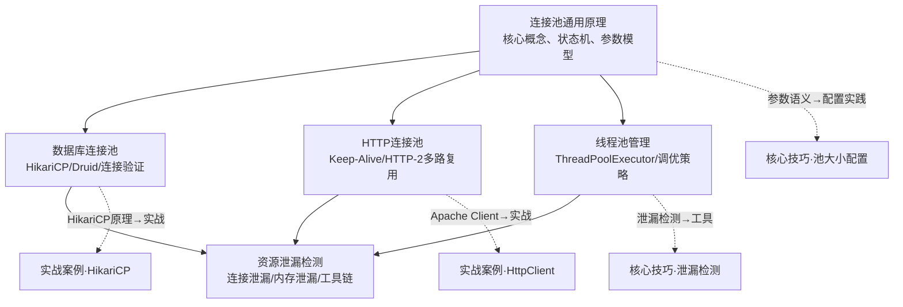

# 理论基础

连接池与资源管理是高性能服务端系统的基石。一个典型的微服务在处理一次用户请求时，可能需要同时持有数据库连接、Redis连接、HTTP长连接和线程——如果这些资源每次用完就销毁、下次用时再创建，系统的延迟将从微秒级退化到毫秒级，吞吐量下降数十倍。连接池通过"预建+复用+回收"的策略，将资源获取的代价从"创建连接"降为"从队列中取出一个对象"，这是所有高性能系统不可绕过的核心基础设施。

理解连接池的理论基础，不仅仅是学会配置几个参数。当你遇到以下问题时，理论知识将成为诊断和优化的根基：

- 为什么数据库连接池大小设为100反而比20更慢？
- 为什么HTTP请求在高峰期突然超时激增，而数据库负载却不高？
- 为什么Java线程池配置了50个线程，CPU使用率却只有30%？
- 连接泄漏为什么初期毫无症状，却在某一天突然导致系统雪崩？

这些问题的根源都藏在连接池的工作原理、参数语义和资源管理模型中。

## 本节知识体系

本节包含四个核心主题，它们从"通用原理"到"特定领域"逐层递进，构成完整的连接池知识体系：

**学习路径建议**：建议按照 连接池原理 → 数据库连接池 → HTTP连接池 → 线程池管理 的顺序学习。连接池原理建立通用的概念框架（状态机、参数模型、性能模型），后续三个主题分别在这个框架上展开具体领域的实现细节。如果你时间有限，至少完整学习连接池原理和数据库连接池两个主题——前者是所有连接池的理论根基，后者是生产环境中最常见、最复杂的连接池类型。

---

## 主题一：连接池原理

> 对应文件：[一、连接池原理](./01-一连接池原理.md)

连接池原理是本节的理论根基，回答一个根本问题：**为什么"池化"这种模式能同时解决性能、资源和稳定性三个维度的问题？** 这个主题不局限于某一类连接，而是抽象出所有连接池共享的核心概念模型。

### 核心要点

**连接的代价——为什么池化是必要的**

建立一次数据库连接涉及TCP三次握手（1-5ms）、TLS协商（2-8ms）、协议层初始化（MySQL认证握手、Redis AUTH、HTTP/2 SETTINGS帧）、内核资源分配（socket fd + TCP缓冲区 ~64KB）。一次典型的数据查询只需2-5ms，但建立连接本身就需要5-15ms——连接开销可能占到总耗时的50%以上。更严重的是资源耗尽风险：10,000个并发TCP连接消耗约30MB内核内存、640MB TCP缓冲区，还会引发TIME_WAIT堆积和文件描述符耗尽。

**连接的状态机——借用、归还、销毁的完整语义**

连接池中的每个连接都经历明确的生命周期状态转换：创建中 → 空闲 → 借出 → 归还（回到空闲）或异常/过期 → 销毁。borrow操作不是简单的"从队列取一个对象"，它包含健康检查、CAS原子操作、等待队列管理等复杂逻辑；return操作也不是"放回队列"，它需要回滚未提交事务、重置会话参数、验证连接有效性。理解这个状态机是诊断连接池问题的关键——很多"诡异"的行为（如连接数只增不减、借用超时但池中明明有空闲连接）都能从状态转换的角度找到解释。

**核心参数的语义与相互约束**

连接池的行为完全由参数控制，而参数之间存在复杂的约束关系：`minPoolSize ≤ idleCount + activeCount ≤ maxPoolSize`；`idleTimeout < maxLifetime`（否则idleTimeout永远不会触发）；`connectionTimeout > validationTimeout`（否则获取超时时检查还没完成）。最重要的是`maxPoolSize`——它不是越大越好，需要同时考虑后端承受能力（MySQL的`max_connections`硬上限）、CPU核心数（过多连接导致上下文切换）和内存消耗。

**连接池的性能模型**

利用Little's Law（L = λ × W）可以计算理论最优连接数：如果系统QPS=1000、平均查询耗时10ms，则平均需要10个并发连接。实际需要考虑突发流量，通常设为平均值的1.5-2倍。Brendan Gregg的经验公式（CPU核心数×2 + 有效磁盘数）提供了另一个维度的估算。吞吐量与池大小并非线性关系——超过CPU核心数后增长放缓，远超后甚至可能下降。

### 为什么重要

连接池原理是所有后续内容的"公理系统"。不理解状态机，就无法解释为什么连接泄漏会导致系统雪崩；不理解参数约束，就会在调优时"改了A参数却影响了B行为"；不理解性能模型，就只能凭感觉配置而无法用数据论证。掌握这一章后，面对任何类型的连接池（数据库、HTTP、Redis、消息队列），你都能快速建立正确的认知框架。

---

## 主题二：数据库连接池

> 对应文件：[二、数据库连接池](./02-二数据库连接池.md)

数据库连接池是连接池理论最核心的应用场景。由于数据库连接的创建涉及TCP握手、身份认证、SSL协商、会话初始化等多个步骤，开销远高于普通网络连接，因此池化收益也最为显著。本主题深入剖析HikariCP等主流连接池的实现原理、连接验证策略、泄漏检测机制和高级话题。

### 核心要点

**HikariCP的ConcurrentBag模型**

HikariCP之所以成为Java生态性能最优的连接池，核心在于ConcurrentBag数据结构——一种受Go语言sync.Pool启发的无锁并发容器。它通过三级查找策略实现近乎零锁竞争的连接借用：第一步查找ThreadLocal本地连接（命中率极高，因为线程倾向于复用同一连接）；第二步遍历共享ConcurrentLinkedQueue查找其他线程归还的连接（CAS原子操作）；第三步在前两步失败后才创建新连接（唯一可能产生锁竞争的路径）。整个借用路径只有几十行代码，无内存分配、无分支预测失败，实测耗时约10-30微秒。

**四种连接验证策略的权衡**

| 策略 | 时机 | 优点 | 缺点 | 推荐场景 |
|------|------|------|------|----------|
| testOnBorrow | 每次借用 | 100%确保有效 | 每次增加1次网络往返 | 极高可靠性要求 |
| testOnReturn | 每次归还 | 及时发现失效连接 | 无法防止借到失效连接 | 配合其他策略使用 |
| testWhileIdle | 定期扫描空闲连接 | 安全性与性能最佳平衡 | 可能漏检刚失效的连接 | **推荐默认策略** |
| keepalive心跳 | 定期发送协议层心跳 | 比SQL验证更轻量 | 需要驱动支持 | HikariCP 5.x+ |

**连接泄漏的渐进式危害**

连接泄漏是生产环境中最隐蔽的数据库故障——初期没有任何异常，连接池中的可用连接缓慢减少，直到某一刻所有连接被耗尽，新请求全部超时，系统雪崩。HikariCP的泄漏检测机制通过记录借出时间戳和调用栈，在连接超过阈值时间未归还时输出WARN日志。但生产环境通常只告警不强制回收，因为强制回收可能导致事务状态不一致。

**连接池与事务管理的微妙交互**

事务边界决定了连接的借用和归还时机：一个持续30秒的长事务会让一个连接在30秒内无法被复用，显著减少连接池的有效容量。嵌套事务（Propagation.REQUIRES_NEW）会创建第二个数据库连接，连接消耗翻倍。多数据源场景下，每个数据源需要独立的连接池实例，总连接数需要控制在数据库`max_connections`以内。

### 为什么重要

数据库连接池是大多数后端应用的"生命线"——连接池出问题，整个服务不可用。理解HikariCP的内部机制，才能在性能调优时做出数据驱动的决策；理解验证策略的权衡，才能在可靠性和性能之间找到最佳平衡点；理解连接泄漏的危害，才能在代码审查时识别潜在风险。这个主题的知识直接决定了你能把数据库连接池配置到什么水平。

---

## 主题三：HTTP连接池

> 对应文件：[三、HTTP连接池](./03-三HTTP连接池.md)

在微服务架构中，HTTP请求是服务间通信的主要方式——一次页面渲染可能触发50-200个上游HTTP调用。HTTP连接池管理着客户端与服务器之间的TCP/TLS连接复用，其配置直接影响系统的延迟、吞吐量和资源消耗。HTTP/2的多路复用从根本上改变了连接池的设计哲学，而HTTP/3的QUIC协议则进一步解决了传输层队头阻塞问题。

### 核心要点

**从HTTP/1.1到HTTP/2：连接池设计哲学的范式转变**

HTTP/1.1的连接复用是串行的——同一时刻一条连接只能承载一个请求-响应对，因此连接池大小直接等于并发请求数。HTTP/2引入多路复用后，单条TCP连接通过帧（Frame）和流（Stream）机制并发传输多个请求，连接池只需少量连接（甚至1条）即可支撑高并发。但HTTP/2存在TCP层队头阻塞——当某个包丢失时，所有流都会被阻塞。在高丢包率网络环境下，HTTP/2单连接模型可能比HTTP/1.1多连接模型更差。HTTP/3基于QUIC协议彻底解决了这个问题。

**按目标分组的路由模型**

HTTP连接池按`host:port`分组管理连接，不同目标服务有独立的连接子池。每个子池有独立的`maxPerRoute`限制，防止某个目标服务的慢响应耗尽所有连接。连接池还集成了空闲驱逐机制——中间的负载均衡器、防火墙可能有30-60秒的空闲超时，如果客户端不感知服务端已关闭连接，后续请求将失败。

**主流HTTP客户端连接池对比**

不同编程语言和库的连接池实现差异显著：Java的Apache HttpClient 5.x功能最全但最重；OkHttp默认HTTP/2、连接复用效率高；Python的requests+urllib3最常用但需要手动配置Session复用；Go标准库net/http内置连接池，但`MaxIdleConnsPerHost`默认值仅为2——这是Go微服务中最常见的性能陷阱之一。

**连接池与服务发现、重试机制的协同**

在微服务架构中，HTTP连接池需要与服务发现协同——实例上下线时，连接池必须感知并更新目标地址列表。重试机制也必须与连接池正确配合，否则会导致连接泄漏或重试风暴：重试时必须确保旧连接已被正确归还或关闭，仅在可重试异常（5xx、429）时重试，且使用新连接。

### 为什么重要

HTTP连接池是微服务架构中最容易被忽视的性能瓶颈。开发者往往关注业务逻辑的优化，却忽略了HTTP客户端连接池配置不当导致的延迟飙升。理解HTTP/2多路复用的原理，才能正确评估"连接池大小应该设多大"；理解空闲驱逐机制，才能避免"僵尸连接"导致的请求失败；理解Go `MaxIdleConnsPerHost`的默认值陷阱，才能避免微服务间调用的性能退化。

---

## 主题四：线程池管理

> 对应文件：[四、线程池管理](./04-四线程池管理.md)

线程池是另一种形式的"资源池化"——它管理的不是网络连接，而是操作系统线程。与连接池类似，线程池通过预先创建一批线程来避免频繁创建和销毁线程的开销。但线程池的调优比连接池更复杂，因为线程是CPU调度的基本单位，线程数的选择直接影响上下文切换开销、CPU利用率和系统吞吐量。

### 核心要点

**Java ThreadPoolExecutor的工作流程**

当提交一个任务时，线程池按照以下优先级处理：如果当前线程数 < 核心线程数，创建新线程执行任务；如果线程数 ≥ 核心线程数，将任务放入工作队列；如果队列已满且线程数 < 最大线程数，创建新线程执行任务；如果队列已满且线程数 ≥ 最大线程数，执行拒绝策略。这个流程的关键在于"先队列后扩展"的策略——任务优先排队，只有队列满时才创建额外线程。这与直觉相反（很多人以为会先扩展线程再排队），也是线程池调优中最常见的认知误区。

**CPU密集型 vs IO密集型的线程数计算**

| 任务类型 | 推荐公式 | 示例（8核CPU） | 原理 |
|---------|---------|---------------|------|
| CPU密集型 | CPU核心数 + 1 | 9个线程 | 多出1个线程应对偶尔的页错误 |
| IO密集型 | CPU核心数 × (1 + IO等待时间/CPU计算时间) | 8 × (1 + 0.5/0.5) = 16 | 线程在等待IO时不占用CPU |
| 混合型 | 按IO比例调整 | 8 × (1 + 0.3) = 10.4 → 10 | 在两种极端之间取平衡 |

**拒绝策略的选择**

四种内置拒绝策略适用于不同场景：AbortPolicy（默认）直接抛出异常，适合需要快速失败的场景；CallerRunsPolicy由提交任务的线程执行，适合不希望丢失任务的场景；DiscardPolicy静默丢弃任务，适合允许丢失的非关键任务；DiscardOldestPolicy丢弃队列中最旧的任务，适合对时效性敏感的场景。

**线程池与连接池的协同**

线程池大小和连接池大小必须匹配：如果线程池有100个线程但连接池只有20个连接，则80个线程会阻塞等待连接，吞吐量严重受限。反之，连接池过大但线程池过小，多余的连接只会空闲浪费。两者的配置应该基于同一个性能模型来计算。

### 为什么重要

线程池是并发编程中最核心的基础设施之一。不理解ThreadPoolExecutor的"先队列后扩展"策略，就无法解释"为什么设置了最大线程数但线程数一直不增长"；不区分CPU密集型和IO密集型任务，就无法给出合理的线程数配置；不理解拒绝策略的语义，就无法在高并发下做出正确的降级决策。线程池的调优能力是区分初级和高级后端工程师的重要标志之一。

---

## 四个主题的关联与对比

| 维度 | 连接池原理 | 数据库连接池 | HTTP连接池 | 线程池管理 |
|------|-----------|-------------|-----------|-----------|
| 定位 | 通用理论框架 | 数据库连接的专项实现 | HTTP连接的专项实现 | 操作系统线程的池化管理 |
| 核心问题 | 池化为什么有效？ | 如何配置数据库连接池？ | 如何管理HTTP连接复用？ | 线程数应该设多大？ |
| 关键参数 | minSize/maxSize/idleTimeout/maxLifetime | concurrentBag/验证策略/泄漏检测 | maxPerRoute/connectTimeout/空闲驱逐 | corePoolSize/maxPoolSize/拒绝策略 |
| 性能瓶颈 | 锁竞争/内存消耗 | 数据库端连接数限制 | TCP层队头阻塞 | 上下文切换/CPU调度开销 |
| 最常见故障 | 连接泄漏导致雪崩 | 半开连接/Too many connections | 僵尸连接/获取超时 | 线程饥饿/任务堆积 |

## 学习检验标准

完成本节学习后，你应该能够回答以下问题：

1. **连接池原理**：Little's Law如何计算理论最优连接数？`maxLifetime`为什么必须小于数据库端的`wait_timeout`？
2. **数据库连接池**：HikariCP的ConcurrentBag三级查找策略分别是什么？为什么说testWhileIdle是最优的验证策略？
3. **HTTP连接池**：HTTP/2多路复用如何改变连接池的设计哲学？Go的`MaxIdleConnsPerHost`默认值陷阱是什么？
4. **线程池管理**：ThreadPoolExecutor为什么"先队列后扩展"而非"先扩展后队列"？CPU密集型和IO密集型任务的线程数计算有何不同？

如果对这些问题感到模糊，请深入阅读对应的主题文件，确保理解每个细节背后的"为什么"。
