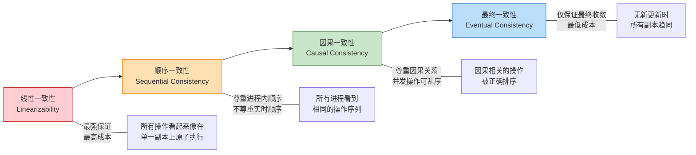
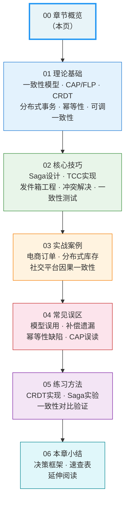
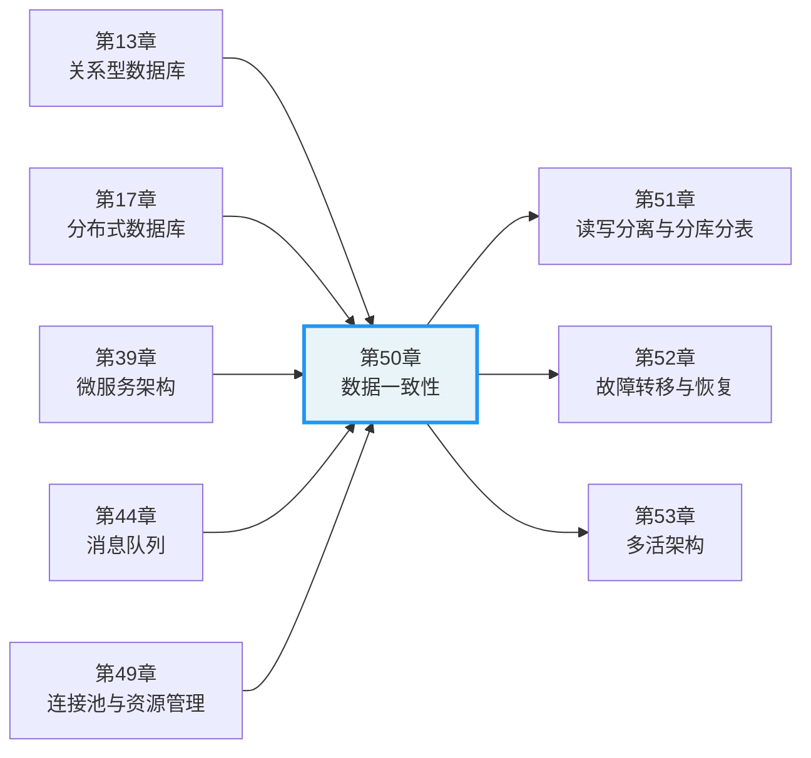

## 数据一致性：分布式系统最核心的挑战

数据一致性，是每一个分布式系统都无法回避的根本性问题。它的本质可以用一句话概括：**当同一份数据存在于多个地方时，如何保证所有地方看到的都是正确的值？**

这个问题听起来简单，但它背后牵扯的理论深度、工程复杂度和业务影响，足以让最资深的架构师夜不能寐。Facebook的"两个赞"事件、Twitter的"僵尸粉丝"丑闻、某银行系统的"钱凭空消失"事故——这些真实案例的根因，无一例外都是数据一致性问题。

本章将系统性地解构这个问题，从最底层的数学原理到最上层的工程实践，帮助你建立完整的认知框架。

***

## 一个真实的故事

2012年，某电商平台在大促期间发生了一次严重的库存事故。用户A和用户B几乎同时下单购买了最后一件商品。系统在两个不同的数据库分片上分别处理了这两个请求，每个分片都认为自己还有库存。结果：两个用户都下单成功，但实际只有一件商品。

这就是分布式系统中经典的"双写"问题——两个节点在没有充分协调的情况下，对同一份数据做出了矛盾的决策。

事故的修复方案并不复杂：引入分布式锁或使用乐观锁+重试机制。但真正值得反思的是：为什么这样一个看似基础的问题，会在一个日活千万的平台上出现？答案是，随着系统规模的增长，数据一致性的维护成本呈指数级上升，而很多团队并没有为此做好准备。

这个故事揭示了数据一致性问题的三个关键特征：

1. **规模放大效应**：单机系统中不存在的一致性问题，在分布式环境中会成为致命缺陷
2. **隐蔽性**：不一致的状态往往在特定时序下才暴露，日常测试很难覆盖
3. **级联影响**：一个节点的不一致可能通过依赖链传播到整个系统

***

## 一致性问题的根源

### 物理定律的约束

数据一致性问题的根本原因，不是工程实现的缺陷，而是物理世界的硬约束：

**光速有限**。上海到纽约的单程光纤延迟约35毫秒，一个往返就是70毫秒。这意味着一次跨洋数据库同步至少需要70毫秒。在这70毫秒内，两个数据中心的数据必然是不一致的。这不是技术问题，是物理定律。

**网络不可靠**。互联网的基础协议TCP保证了可靠传输，但无法保证传输时间。网络延迟可以是1毫秒，也可以是1秒，甚至永久中断。网络分区（Network Partition）在分布式系统中不是异常情况，而是必然发生的事件。根据Google的统计数据，在千台服务器的集群中，每天都会有数台服务器发生网络隔离。

**时钟不同步**。即使使用NTP（网络时间协议）同步，不同机器之间的时钟偏差通常在几毫秒到几十毫秒之间。在高并发场景下，这个偏差足以导致操作顺序的判断出错。

### 从单机到分布式的范式转变

在单机数据库时代，数据一致性由ACID事务保证：

| 属性 | 含义 | 单机保证方式 |
|------|------|-------------|
| 原子性（Atomicity） | 事务要么全部成功，要么全部失败 | undo log回滚 |
| 一致性（Consistency） | 事务前后数据满足约束条件 | 应用层约束检查 |
| 隔离性（Isolation） | 并发事务互不干扰 | 锁机制 + MVCC |
| 持久性（Durability） | 提交的数据永久保存 | redo log + fsync |

开发者几乎不需要关心一致性问题——数据库帮你处理了一切。

但当系统进入分布式时代，情况发生了根本性变化：

1. **数据被拆分到多个物理节点**。分库分表后，一个逻辑上的事务需要跨越多个物理数据库，而不同物理数据库之间没有共享事务日志。

2. **业务逻辑被拆分到多个微服务**。每个微服务拥有独立的数据库，传统的本地事务无法跨越服务边界。一个"下单"操作需要同时调用库存服务、订单服务、支付服务、物流服务，每个服务的数据库操作无法纳入同一个事务。

3. **数据被复制到多个数据中心**。为了容灾和就近访问，数据需要在多个地域的副本之间同步。物理距离带来了不可避免的同步延迟。

这些变化意味着，开发者必须从"一致性是免费的"转变为"一致性是需要设计的"。每一次架构决策，都隐含着一致性的权衡。

***

## 一致性的连续谱

一致性不是一个"有或没有"的二元概念，而是一个从强到弱的连续谱。理解这个谱系，是做出正确设计决策的前提。

### 四大一致性模型

**线性一致性（Linearizability）** 是最强的一致性模型。它要求所有操作看起来像是在一个单一副本上按顺序原子执行的，且操作的实时顺序被严格尊重。如果操作A在操作B开始之前完成，那么在任何观察者看来，A都必须排在B之前。这是分布式系统中最容易理解、最容易推理的模型，但也是成本最高的——通常需要共识算法（如Raft、Paxos）的支持，每次写操作都需要多数节点确认。

**顺序一致性（Sequential Consistency）** 放松了实时性约束。它只要求所有进程看到相同的操作顺序，但不要求这个顺序与物理时间一致。一个操作在物理上先发生，但在全局顺序中可能排在后面。这在某些共享内存模拟的场景中有应用，但工程中较少直接使用。

**因果一致性（Causal Consistency）** 进一步区分了有因果关系的操作和并发操作。它保证：如果操作A因果上先于操作B（A的结果影响了B），那么所有节点都以A先于B的顺序观察到它们；对于没有因果关系的并发操作，不同节点可以以不同顺序观察到。这在社交媒体中尤为重要——"帖子"必须在"回复"之前被看到，但不同用户对不同帖子的点赞可以以不同顺序出现。

**最终一致性（Eventual Consistency）** 是最弱但最实用的模型。它只保证：如果不再有新的更新操作，所有副本最终会收敛到相同的值。它不保证收敛需要多长时间，也不保证收敛过程中的中间状态。这是大规模系统中最常用的选择，因为它的性能和可用性最优。

### 一致性强度的传递关系

这四种模型之间存在蕴含关系：线性一致性 ⟹ 顺序一致性 ⟹ 因果一致性 ⟹ 最终一致性。也就是说，如果系统满足线性一致性，它自动满足更弱的三种模型；如果只满足最终一致性，它不保证更弱的三种模型中的任何一种。

选择更弱的一致性模型，意味着释放更多的性能空间和可用性，但也意味着需要处理更多的不一致场景。这个选择不是技术偏好，而是业务需求驱动的工程决策。

***

## 分布式系统的理论边界

在设计一致性方案之前，必须理解两个根本性的理论约束，它们划定了"可能"与"不可能"的边界。

### CAP定理：不可能三角

2000年，Eric Brewer提出了CAP定理（后由Gilbert和Lynch在2002年形式化证明）：**在网络分区发生时，分布式系统无法同时保证一致性（Consistency）、可用性（Availability）和分区容错性（Partition Tolerance）三者兼得，最多只能满足其中两个。**

| 组合 | 选择 | 典型系统 | 特点 |
|------|------|---------|------|
| CP | 一致性 + 分区容错 | etcd, ZooKeeper, HBase | 分区时拒绝写入，保证数据正确 |
| AP | 可用性 + 分区容错 | Cassandra, DynamoDB, CouchDB | 分区时继续服务，允许数据不一致 |
| CA | 一致性 + 可用性 | 单机MySQL | 不存在网络分区的假设，实际不可行 |

**关键误区澄清**：CAP定理不是说系统在设计时选CP或AP就一劳永逸了。它描述的是网络分区发生那一刻的瞬时行为。大多数系统在正常运行时同时具备一致性和可用性，只有在分区发生时才需要做出选择。Martin Kleppmann进一步提出了PACELC定理，指出即使在没有分区的正常情况下，系统也必须在延迟（Latency）和一致性（Consistency）之间做出权衡——这解释了为什么即使没有网络故障，强一致系统仍然比弱一致系统慢。

### FLP不可能性定理：共识的理论极限

1985年，Fischer、Lynch和Paterson证明了FLP不可能性定理：**在异步系统中，即使只有一个进程可能崩溃，也不存在确定性的共识算法能在有限时间内终止。**

这个定理的工程含义是：完美的共识是不可能的。但工程师们并没有因此放弃——Raft、Paxos等算法通过引入超时机制和"大部分时间同步"的假设，绕过了FLP的限制，在实际系统中有效地工作。FLP定理的真正价值不在于告诉你"不能做什么"，而在于告诉你"在什么条件下可以工作"以及"需要付出什么代价"。

### 理论约束的工程意义

这些定理不是学术象牙塔里的智力游戏，而是直接影响工程决策的现实约束：

- 它们告诉我们哪些权衡是不可避免的，避免在不可能的方向上浪费精力
- 它们帮助我们理解现有系统的局限性，而不是天真地期望"既要又要还要"
- 它们为系统选型提供了理论依据——选择etcd还是Cassandra，本质上是CP和AP的选择

***

## 工程界的一致性工具箱

理论划定了边界，工程提供了在边界内最大化系统能力的手段。以下是本章将深入讲解的核心工程模式。

### CRDT：用数学保证收敛

无冲突复制数据类型（Conflict-free Replicated Data Types, CRDT）通过数学上的半格（Semilattice）结构，使得多个副本可以独立更新而无需协调，最终自动收敛到一致状态。

CRDT的核心思想是：设计一种数据结构，使得并发操作的合并结果与操作顺序无关。G-Counter（只支持递增的计数器）是最简单的例子——每个节点维护自己的计数，合并时对每个节点取最大值，结果与合并顺序无关。

CRDT的四种核心类型覆盖了大多数无冲突场景：

| 类型 | 支持的操作 | 合并策略 | 典型场景 |
|------|-----------|---------|---------|
| G-Counter | 递增 | 各节点取max后求和 | 点赞数、浏览量 |
| PN-Counter | 递增和递减 | 两个G-Counter分别合并 | 库存增减、余额变动 |
| LWW-Register | 设置值 | 时间戳大的胜出 | 用户设置、配置覆盖 |
| OR-Set | 添加和删除 | 元素标签集取并集 | 购物车、待办列表 |

### 分布式事务：跨服务一致性的工程方案

当业务操作需要跨越多个服务时，传统的本地事务无法使用。分布式事务模式提供了在微服务架构下维护一致性的工程方案。

**Saga模式** 将长事务分解为一系列本地事务，每个步骤有对应的补偿操作。如果某一步失败，按逆序执行已完成步骤的补偿操作。Saga支持两种协调方式：编排式（由中央协调器管理流程，清晰但有单点风险）和协同式（服务间事件驱动，松耦合但调试困难）。

**TCC模式** 通过Try-Confirm-Cancel三阶段实现资源预留。Try阶段冻结资源但不执行操作，Confirm阶段确认执行，Cancel阶段释放资源。TCC比Saga提供更强的隔离保证（冻结的资源不会被其他事务使用），但实现复杂度更高，需要处理空回滚和悬挂等边界情况。

**事务性发件箱** 解决了"双写问题"——在同一个本地事务中既更新数据库又发送消息。通过在业务表旁边维护一个消息表，然后由中继进程将消息可靠传递到消息队列，确保了数据变更和消息发送的原子性。

### 幂等性：分布式系统的安全网

在分布式系统中，网络超时、消息重复投递、服务重启后的重复执行都是常态。幂等性确保同一操作执行多次的效果与执行一次相同，是分布式系统最重要的安全属性之一。

完整的幂等性包含三个要素：识别重复（通过幂等键判断请求是否已处理）、执行语义正确（重复请求不产生副作用）、返回一致响应（重复请求返回与首次相同的结果）。

### 可调一致性：灵活的权衡

Quorum读写机制（W + R > N）允许在一致性和可用性之间灵活调节。Cassandra和DynamoDB等系统将这种权衡暴露给开发者，允许在不同的一致性级别（ONE/QUORUM/ALL）之间选择，甚至在同一个系统中对不同操作使用不同级别。

***

## 本章的知识地图

本章按照"理论→技巧→实践→反思"的逻辑递进组织，共分为六个小节：

### 各小节的定位与价值

| 小节 | 定位 | 核心价值 | 建议用时 |
|------|------|---------|---------|
| 01 理论基础 | 认知构建 | 理解一致性模型的层次体系和数学原理，建立分析框架 | 3-4.5小时 |
| 02 核心技巧 | 工程方法 | 掌握Saga/TCC/发件箱的具体设计技巧和工程要点 | 2-4小时 |
| 03 实战案例 | 场景应用 | 通过真实案例理解理论和技巧如何落地为生产级方案 | 1.5-3.5小时 |
| 04 常见误区 | 避坑指南 | 识别六大数据一致性典型认知陷阱，避免重复踩坑 | 0.5-1小时 |
| 05 练习方法 | 动手实践 | 通过CRDT实现、Saga实验等练习巩固理解 | 0.5-5.5小时 |
| 06 本章小结 | 全局回顾 | 建立决策框架，提供速查表和延伸阅读路径 | 0.5小时 |

### 阅读路径建议

**如果你是初学者**（了解基本的数据库操作，但没有分布式系统经验）：按 01→02→03→06 的顺序阅读。重点关注一致性模型的基本概念和Saga模式的工程实现。04节的常见误区可以帮你避免初学者最容易犯的错误。

**如果你是有经验的工程师**（有微服务开发经验，遇到过分布式事务问题）：可以从02节的核心技巧开始，结合03节的实战案例加深理解。01节的理论部分可以作为参考查阅，特别是CAP定理的形式化证明和CRDT的数学基础。

**如果你是架构师**（负责系统整体设计和技术选型）：重点关注01节的一致性模型层次体系和一致性与性能权衡框架，以及06节的决策速查表。这些内容直接支持架构层面的一致性选型决策。

***

## 一致性设计的核心思维

在正式开始之前，理解以下五个核心思维将帮助你更好地消化后续内容：

### 思维一：一致性是连续谱，不是开关

很多开发者将一致性视为"强一致"或"最终一致"的二元选择。实际上，从线性一致性到最终一致性之间存在丰富的中间地带。一个设计良好的系统，通常会混合使用多种一致性级别——金融余额用强一致，用户偏好用最终一致，社交评论用因果一致。**关键不是选择最强的一致性，而是为每种数据选择"刚好够用"的一致性。**

### 思维二：补偿比预防更实际

在分布式系统中，预防所有不一致是不可能的——CAP定理和FLP定理已经从理论上证明了这一点。更实际的策略是：接受不一致会发生，然后设计好补偿机制。Saga的补偿操作、TCC的Cancel阶段、事务性发件箱的重试机制——这些不是"退而求其次"，而是分布式系统的一等公民。

### 思维三：幂等性是安全网

所有分布式操作都应该设计为幂等的。网络超时导致的重试、消息队列的重复投递、服务重启后的重复执行——这些不是边缘情况，而是分布式系统的日常。幂等性是应对这些不确定性的最后防线。一个没有幂等性保证的分布式系统，就像没有刹车的汽车——正常时候没问题，一旦出事就是灾难。

### 思维四：测试是验证，不是信任

一致性不应该是理论上的声称，必须通过测试验证。Jepsen测试框架已经发现过多个声称支持线性一致性的数据库实际上不满足该保证。对于CRDT，需要通过并发测试验证收敛性；对于Saga，需要通过故障注入测试验证补偿逻辑的正确性。**声称的一致性不等于实际的一致性，只有测试过的一致性才是可靠的一致性。**

### 思维五：监控是持续的验证

生产环境中的行为可能与测试环境不同。时钟偏移、网络拥塞、硬件老化、流量突增——这些因素可能导致系统偏离预期行为。持续监控一致性指标（同步延迟、补偿率、Quorum可用性）是确保系统长期可靠运行的关键。

***

## 与前后章节的关系

数据一致性不是孤立的概念，它与全书的多个核心主题紧密关联：

| 前置章节 | 与本章的关系 | 你需要从中学到什么 |
|---------|-------------|-------------------|
| 第13章 关系型数据库架构 | 理解ACID事务、隔离级别 | 本章在此基础上扩展到分布式场景 |
| 第17章 分布式数据库 | 分布式共识算法的工程实现 | Raft/Paxos如何保证线性一致性 |
| 第39章 微服务架构 | 跨服务一致性挑战的来源 | 服务拆分带来的事务边界问题 |
| 第44章 消息队列 | 事务性发件箱的消息传递基础设施 | 消息持久化和可靠投递机制 |
| 第49章 连接池与资源管理 | 单节点资源管理的边界 | 理解从单节点到多节点的扩展 |

| 后续章节 | 与本章的关系 | 本章为你准备了什么 |
|---------|-------------|-------------------|
| 第51章 读写分离与分库分表 | 一致性理论指导分片策略选择 | 理解分片后的一致性边界 |
| 第52章 故障转移与恢复 | 一致性保证在故障场景下的维护 | 理解故障时的一致性降级策略 |
| 第53章 多活架构 | 跨地域一致性的终极挑战 | 理解CAP权衡在多活场景下的具体表现 |

***

## 真实场景映射

为了帮助你将理论与实践对应，以下是本章内容在真实场景中的映射关系：

| 场景 | 一致性需求 | 推荐方案 | 为什么不选其他方案 |
|------|-----------|---------|-------------------|
| 银行转账（A扣B加） | 强一致性（钱不能凭空消失） | 分布式事务 + 共识算法 | Saga允许短暂不一致，对金融场景不可接受 |
| 电商下单（扣库存+创建订单+扣款） | 最终一致性（秒级不一致可接受） | Saga模式 | 2PC跨服务性能太差，CRDT不适用 |
| 社交媒体点赞计数 | 最终一致性（短暂不准可接受） | CRDT（G-Counter） | 不需要事务，高并发下计数器是最佳选择 |
| 协作文档编辑（多用户同时编辑） | 因果一致性 | CRDT（OR-Set）+ 因果追踪 | 最终一致性无法保证"回复在帖子之后" |
| 购物车（多设备同步） | 最终一致性 | CRDT（LWW-Register或OR-Set） | 用户体验可接受短暂不一致，但最终必须趋同 |
| 库存扣减（高并发场景） | 最终一致性 + 可调一致性 | Quorum读写 + 幂等性 | 强一致会严重限制吞吐量 |
| 用户注册（创建账户+发送欢迎邮件） | 最终一致性 | 事务性发件箱 | 直接双写可能丢失邮件或创建幽灵账户 |
| 分布式缓存与数据库同步 | 最终一致性 | 最大努力通知 + 幂等性 | 缓存可以重建，短暂不一致可接受 |

***

## 本章难点预警

在学习过程中，以下概念可能需要额外的时间和精力来理解：

1. **CRDT的数学基础**（半格结构、单调性、交换律）——如果数学基础较弱，建议先理解直观的G-Counter示例，再回过头理解背后的数学原理。CRDT的"为什么一定能收敛"是通过数学证明保证的，理解这一点会大大增强你的信心。

2. **FLP不可能性定理的证明思路**——这个证明较为抽象，理解其结论和工程意义比理解证明过程更重要。你需要知道的是：完美的共识不可能，但足够好的共识是可能的。

3. **Saga补偿操作的完整性**——设计补偿操作时需要考虑所有可能的失败点。这是初学者最容易遗漏的地方：你不仅要补偿"成功的步骤"，还要考虑"补偿本身失败"的情况。

4. **向量时钟的空间开销**——随着节点数量增加，向量时钟的存储开销线性增长（O(N)）。在大规模集群中，这可能导致不可忽视的开销，需要了解其局限性以及替代方案（如Dotted Version Vectors）。

5. **可调一致性的配置选择**——不同的一致性级别组合（ONE/QUORUM/ALL）适用于不同的业务场景。选择错误可能导致数据丢失或性能严重下降。需要结合具体的延迟和可用性要求来决策。

***

## 前置知识检查

阅读本章之前，请确保你具备以下基础知识。如果不满足某项，建议先阅读相关章节：

| 知识领域 | 具体要求 | 缺失的影响 |
|---------|---------|-----------|
| 数据库事务 | 理解ACID特性、事务隔离级别、锁机制 | 无法理解为什么分布式事务如此复杂 |
| 消息队列 | 了解发布/订阅模型、消息持久化、消费者组 | 无法理解事务性发件箱的消息传递机制 |
| 微服务架构 | 理解服务拆分、API网关、服务发现 | 无法理解跨服务一致性的来源 |
| 网络基础 | 了解TCP/IP、网络分区、延迟与带宽的概念 | 无法理解CAP定理的物理基础 |

***

## 核心概念速查

以下是本章涉及的核心概念及其一句话解释，供快速查阅：

| 概念 | 一句话解释 | 详见小节 |
|------|-----------|---------|
| 线性一致性 | 所有操作看起来像在单一副本上原子执行 | 01 理论基础 |
| 顺序一致性 | 所有进程看到相同的操作顺序，但不要求实时性 | 01 理论基础 |
| 因果一致性 | 有因果关系的操作被所有节点以相同顺序观察到 | 01 理论基础 |
| 最终一致性 | 不再有新更新时，所有副本最终收敛到一致 | 01 理论基础 |
| CAP定理 | 网络分区时，只能在一致性和可用性之间二选一 | 01 理论基础 |
| PACELC定理 | CAP的扩展：正常情况下也要在延迟和一致性间权衡 | 01 理论基础 |
| FLP不可能性 | 异步系统中不存在保证终止的确定性共识算法 | 01 理论基础 |
| CRDT | 通过数学结构保证并发操作最终自动收敛的数据类型 | 01 理论基础 |
| G-Counter | 只支持递增的CRDT计数器，各节点独立计数后求和 | 01 理论基础 |
| OR-Set | 支持添加和删除的CRDT集合，通过唯一标签解决冲突 | 01 理论基础 |
| 向量时钟 | 追踪事件因果关系的逻辑时钟机制 | 01 理论基础 |
| Saga模式 | 将长事务分解为本地事务+补偿操作的分布式事务方案 | 01, 02 |
| TCC模式 | Try预留→Confirm确认→Cancel取消的三阶段事务模式 | 01, 02 |
| 事务性发件箱 | 在同一数据库事务中写入业务数据和待发送消息 | 01, 02 |
| 幂等性 | 同一操作执行多次的效果与执行一次相同 | 01, 02 |
| Quorum | W+R>N时保证读操作能读到最新写入的值 | 01, 02 |

***

## 接下来

准备好了吗？让我们从第一部分——理论基础开始，系统地构建数据一致性的知识体系。

如果你时间有限，建议至少完成以下三项：

1. **理解一致性模型的层次**——这是整个章节的认知基础
2. **掌握Saga模式的核心思想**——这是工程实践中最常用的分布式事务方案
3. **建立幂等性意识**——这是每个分布式系统工程师都必须具备的安全意识

理论基础是认知的起点，但不是终点。真正的理解来自于将理论应用到实践中——后面的技巧和案例部分，将帮助你完成从"知道"到"会用"的跨越。
