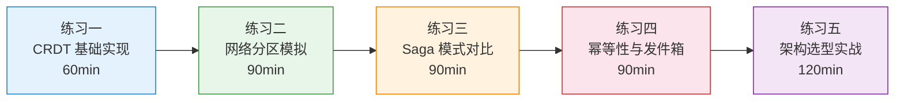
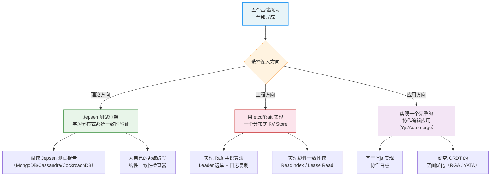

# 练习方法：从理论到实战的渐进式训练

本章覆盖了一致性模型、CRDT、Saga/TCC、事务性发件箱、幂等性等大量抽象且相互关联的概念。仅仅阅读理论远远不够——你必须通过动手编码、制造故障、观察行为差异，才能真正内化这些知识。

本节提供五个递进式练习，从最基础的 CRDT 实现到复杂的一致性架构设计，每个练习都包含可直接运行的代码、明确的验证标准和常见陷阱提示。建议按顺序完成，每个练习耗时约 60-120 分钟。



---

## 练习一：CRDT 基础实现（预计 60 分钟）

**目标**：亲手实现 G-Counter 和 OR-Set 两种 CRDT，理解"无冲突"背后的数学原理，验证最终一致性保证。

**前置知识**：本章 01-理论基础中 CRDT 部分，理解半格（Semilattice）的三个性质：交换律、结合律、幂等性。

### 1.1 实现 G-Counter（全局计数器）

G-Counter 只支持递增操作，是最简单的 CRDT 类型。每个节点维护一个向量，记录自己和所有已知节点的计数值。

```python
"""
G-Counter: 只支持 increment 和 value 操作的 CRDT 计数器。
每个节点维护一个 dict[node_id, count]，合并时取每个 key 的 max。
"""

from dataclasses import dataclass, field
from typing import Dict


@dataclass
class GCounter:
    node_id: str
    counts: Dict[str, int] = field(default_factory=dict)

    def increment(self, amount: int = 1):
        """本地节点递增计数器。"""
        if amount < 0:
            raise ValueError("G-Counter 仅支持非负递增")
        self.counts[self.node_id] = self.counts.get(self.node_id, 0) + amount

    def value(self) -> int:
        """返回当前总计数值。"""
        return sum(self.counts.values())

    def merge(self, other: 'GCounter'):
        """
        合并另一个 G-Counter 的状态。
        核心：对每个 node_id 取 max，这就是半格的 join 运算。
        """
        for node_id, count in other.counts.items():
            self.counts[node_id] = max(self.counts.get(node_id, 0), count)

    def __repr__(self):
        return f"GCounter({self.node_id}, total={self.value()}, detail={self.counts})"


# ===== 验证 G-Counter 的最终一致性 =====
def test_gcounter_convergence():
    """模拟两个节点独立操作后合并，验证最终一致。"""
    # 两个独立节点
    node_a = GCounter(node_id="A")
    node_b = GCounter(node_id="B")

    # 节点 A 递增 3 次
    node_a.increment()
    node_a.increment()
    node_a.increment()

    # 节点 B 递增 5 次（网络中断期间独立操作）
    node_b.increment(5)

    print(f"合并前: A={node_a}, B={node_b}")
    # A=3, B=5 → 合并后应为 8

    # 双向合并（模拟网络恢复后同步）
    node_a.merge(node_b)
    node_b.merge(node_a)

    print(f"合并后: A={node_a}, B={node_b}")
    assert node_a.value() == 8, f"期望 8, 得到 {node_a.value()}"
    assert node_b.value() == 8, f"期望 8, 得到 {node_b.value()}"
    assert node_a.counts == node_b.counts, "两个节点状态应完全一致"

    print("✅ G-Counter 最终一致性验证通过\n")


# ===== 挑战：模拟网络分区下的"脑裂"场景 =====
def test_gcounter_partition():
    """分区期间两个节点独立操作，恢复后合并，验证没有数据丢失。"""
    node_a = GCounter(node_id="A")
    node_b = GCounter(node_id="B")

    # === 网络分区开始 ===
    node_a.increment(10)  # A 侧递增 10
    node_b.increment(20)  # B 侧递增 20

    # 分区期间：A 收到一条旧消息（分区前的状态）
    stale = GCounter(node_id="B")
    stale.counts["B"] = 5  # 模拟旧消息
    node_a.merge(stale)     # 用旧数据合并，不应倒退

    print(f"分区期间: A={node_a}, B={node_b}")
    assert node_a.value() == 10, "旧消息不应使计数倒退"
    assert node_b.value() == 20

    # === 网络恢复，全量同步 ===
    node_a.merge(node_b)
    node_b.merge(node_a)

    print(f"恢复后: A={node_a}, B={node_b}")
    assert node_a.value() == 30, f"期望 30, 得到 {node_a.value()}"
    assert node_b.value() == 30

    print("✅ G-Counter 分区恢复验证通过\n")


if __name__ == "__main__":
    test_gcounter_convergence()
    test_gcounter_partition()
```

**运行方式**：

```bash
python3 gcounter.py
```

**预期输出**：

合并前: A=GCounter(A, total=3, detail={'A': 3}), B=GCounter(B, total=5, detail={'B': 5})
合并后: A=GCounter(A, total=8, detail={'A': 3, 'B': 5}), B=GCounter(B, total=8, detail={'A': 3, 'B': 5})
✅ G-Counter 最终一致性验证通过

分区期间: A=GCounter(A, total=10, detail={'A': 10}), B=GCounter(B, total=20, detail={'B': 20})
恢复后: A=GCounter(A, total=30, detail={'A': 10, 'B': 20}), B=GCounter(B, total=30, detail={'A': 10, 'B': 20})
✅ G-Counter 分区恢复验证通过

### 1.2 实现 OR-Set（Observed-Remove Set）

OR-Set 比 G-Counter 复杂得多，它支持 add 和 remove 操作，并能正确处理"并发 add 和 remove"的冲突。关键机制是：每次 add 生成全局唯一标签，remove 只移除"已观察到的"标签。

```python
"""
OR-Set: 支持 add/remove 的 CRDT 集合。
核心思想：每个 add 操作附带唯一标签，remove 只删除当前已知的标签，
新到达的 add（带未知标签）不会被误删。
"""

import uuid
from dataclasses import dataclass, field
from typing import Dict, Set, Tuple


@dataclass
class ORSet:
    """
    items: dict[element, set_of_tags]
    每个元素对应一组唯一标签。add 生成新标签，remove 删除所有已知标签。
    合并时对每个元素取标签的并集。
    """
    node_id: str
    items: Dict[str, Set[str]] = field(default_factory=dict)

    def add(self, element: str) -> str:
        """添加元素，返回生成的唯一标签。"""
        tag = f"{self.node_id}-{uuid.uuid4().hex[:8]}"
        if element not in self.items:
            items[element] = set()
        self.items[element].add(tag)
        return tag

    def remove(self, element: str):
        """
        移除元素：删除该元素的所有已知标签。
        注意：只移除本地已观察到的标签，不移除远端可能的并发 add。
        """
        self.items.pop(element, None)

    def lookup(self, element: str) -> bool:
        """查询元素是否存在于集合中。"""
        return element in self.items and len(self.items[element]) > 0

    def value(self) -> Set[str]:
        """返回集合中所有存在的元素。"""
        return {elem for elem, tags in self.items.items() if len(tags) > 0}

    def merge(self, other: 'ORSet'):
        """
        合并另一个 OR-Set 的状态。
        对每个元素，取两个版本标签集合的并集。
        """
        for element, tags in other.items.items():
            if element in self.items:
                self.items[element] = self.items[element] | tags
            else:
                self.items[element] = set(tags)

    def __repr__(self):
        return f"ORSet({self.node_id}, elements={self.value()})"


# ===== 验证 OR-Set 的并发 add/remove 正确性 =====
def test_orset_concurrent_add_remove():
    """
    核心测试：节点 A 添加元素 x 并在本地移除，
    节点 B 也添加了元素 x（不同标签）。
    合并后，x 应该存在——因为 B 的 add 是并发操作，不应被 A 的 remove 覆盖。
    """
    node_a = ORSet(node_id="A")
    node_b = ORSet(node_id="B")

    # A 添加 x
    node_a.add("x")
    # B 也添加 x（并发操作，独立生成标签）
    node_b.add("x")

    print(f"A 添加后: {node_a}")
    print(f"B 添加后: {node_b}")

    # A 移除 x（只移除 A 观察到的标签）
    node_a.remove("x")
    print(f"A 移除后: {node_a}")

    # 合并
    node_a.merge(node_b)
    node_b.merge(node_a)

    print(f"合并后: A={node_a}, B={node_b}")

    # x 应该仍然存在！B 的 add 标签未被删除
    assert node_a.lookup("x"), "x 应该存在（B 的并发 add 标签仍有效）"
    assert node_b.lookup("x"), "x 应该存在"
    print("✅ OR-Set 并发 add/remove 验证通过\n")


def test_orset_remove_wins_after_sync():
    """
    验证：如果所有 add 标签都被 remove 移除，元素确实消失。
    """
    node_a = ORSet(node_id="A")
    node_b = ORSet(node_id="B")

    # A 添加 x
    tag = node_a.add("x")
    # 同步到 B
    node_b.merge(node_a)

    print(f"同步后: A={node_a}, B={node_b}")

    # A 移除 x
    node_a.remove("x")
    # B 也移除 x
    node_b.remove("x")

    # 合并
    node_a.merge(node_b)
    node_b.merge(node_a)

    print(f"双方移除并合并后: A={node_a}, B={node_b}")
    assert not node_a.lookup("x"), "x 应该已消失"
    assert not node_b.lookup("x"), "x 应该已消失"
    print("✅ OR-Set 全量移除验证通过\n")


if __name__ == "__main__":
    test_orset_concurrent_add_remove()
    test_orset_remove_wins_after_sync()
```

### 1.3 练习检查清单

- [ ] G-Counter 的 merge 操作取 max 而不是求和（常见错误）
- [ ] G-Counter 在网络分区后合并没有数据丢失，也没有数据膨胀
- [ ] OR-Set 的 remove 只删除已观察到的标签，不会误删并发 add
- [ ] OR-Set 双向合并后两个节点状态完全一致
- [ ] 能用自己的话解释：为什么 G-Counter 用 max 而 OR-Set 用 union

### 1.4 扩展挑战

完成上述练习后，尝试以下进阶任务：

**PN-Counter**：实现支持递增和递减的计数器。提示：用两个 G-Counter（一个记正数，一个记负数），value 为两者之差。

```python
@dataclass
class PNCounter:
    node_id: str
    positives: GCounter = None  # 正计数
    negatives: GCounter = None  # 负计数

    def increment(self, amount=1):
        self.positives.increment(amount)

    def decrement(self, amount=1):
        self.negatives.increment(amount)

    def value(self):
        return self.positives.value() - self.negatives.value()

    def merge(self, other):
        self.positives.merge(other.positives)
        self.negatives.merge(other.negatives)
```

**LWW-Register**：实现 Last-Writer-Wins 寄存器。每个写操作附带逻辑时间戳，合并时取时间戳更大的值。

**多节点模拟**：用 Python 的 `threading` 模块模拟 3-5 个节点并发操作 CRDT，用消息队列（或简单的共享字典）模拟网络同步，验证最终一致性。

---

## 练习二：一致性模型对比验证（预计 90 分钟）

**目标**：通过模拟网络分区，直观观察线性一致性、最终一致性和因果一致性在行为上的差异，理解 CAP 定理的实际影响。

### 2.1 模拟一个分布式 KV Store

```python
"""
一致性模型行为对比实验。
模拟一个 3 节点的分布式 KV Store，在网络分区下观察不同一致性模型的行为差异。
"""

import time
import threading
import copy
from dataclasses import dataclass, field
from typing import Dict, Optional
from enum import Enum


class ConsistencyLevel(Enum):
    LINEARIZABLE = "linearizable"   # 线性一致性
    CAUSAL = "causal"               # 因果一致性
    EVENTUAL = "eventual"           # 最终一致性


@dataclass
class Node:
    node_id: str
    store: Dict[str, str] = field(default_factory=dict)
    # 因果一致性需要版本向量
    vector_clock: Dict[str, int] = field(default_factory=dict)
    # 线性一致性需要全局操作日志
    operation_log: list = field(default_factory=list)
    # 连接状态
    alive: bool = True
    connected_to: set = field(default_factory=set)

    def increment_clock(self):
        self.vector_clock[self.node_id] = self.vector_clock.get(self.node_id, 0) + 1

    def update_clock_from(self, remote_clock: Dict[str, int]):
        for k, v in remote_clock.items():
            self.vector_clock[k] = max(self.vector_clock.get(k, 0), v)


class KVStore:
    def __init__(self, consistency: ConsistencyLevel):
        self.consistency = consistency
        self.nodes: Dict[str, Node] = {}
        self.partition: set = set()  # 分区中的节点

    def add_node(self, node_id: str):
        self.nodes[node_id] = Node(node_id=node_id)

    def set_connected(self, nodes: list):
        """设置节点间的连接关系。"""
        for n in self.nodes.values():
            n.connected_to = set(nodes)
            n.alive = True

    def simulate_partition(self, isolated: list, rest: list):
        """模拟网络分区：isolated 中的节点无法与 rest 中的节点通信。"""
        self.partition = set(isolated)
        for n_id in isolated:
            if n_id in self.nodes:
                self.nodes[n_id].connected_to = set(isolated) - {n_id}
        for n_id in rest:
            if n_id in self.nodes:
                self.nodes[n_id].connected_to = set(rest) - {n_id} | set(isolated)

    def heal_partition(self):
        """恢复网络分区。"""
        all_ids = set(self.nodes.keys())
        for n in self.nodes.values():
            n.connected_to = all_ids - {n.node_id}
        self.partition = set()


# ===== 线性一致性实验 =====
def experiment_linearizable():
    """
    线性一致性：写操作需要多数节点确认。
    分区时少数派节点无法完成写操作，因此不会出现不一致。
    """
    print("=" * 60)
    print("【实验1】线性一致性 + 网络分区")
    print("=" * 60)

    store = KVStore(ConsistencyLevel.LINEARIZABLE)
    store.add_node("N1")
    store.add_node("N2")
    store.add_node("N3")
    store.set_connected(["N1", "N2", "N3"])

    # 初始写入
    print("\n[Step 1] 写入 x=1（需要多数节点确认）")
    for n_id in ["N1", "N2", "N3"]:
        store.nodes[n_id].store["x"] = "1"
    print(f"  N1.x={store.nodes['N1'].store.get('x')}, N2.x={store.nodes['N2'].store.get('x')}, N3.x={store.nodes['N3'].store.get('x')}")

    # 模拟分区：N3 被隔离
    print("\n[Step 2] 网络分区：N3 被隔离")
    store.simulate_partition(["N3"], ["N1", "N2"])

    # 分区期间，N1 尝试写入 x=2（多数派，成功）
    print("\n[Step 3] 分区期间，N1 写入 x=2（多数派 N1+N2 确认）")
    store.nodes["N1"].store["x"] = "2"
    store.nodes["N2"].store["x"] = "2"

    # N3 尝试写入 x=3（少数派，失败！）
    print("[Step 3] N3 尝试写入 x=3（少数派，无法获得多数确认 → 写入失败）")
    print(f"  N3 仍然读到: x={store.nodes['N3'].store.get('x')}")

    # 恢复分区
    print("\n[Step 4] 网络恢复，N3 同步到最新值")
    store.heal_partition()
    store.nodes["N3"].store["x"] = store.nodes["N1"].store["x"]

    print(f"  恢复后: N1.x={store.nodes['N1'].store['x']}, N2.x={store.nodes['N2'].store['x']}, N3.x={store.nodes['N3'].store['x']}")

    all_x = [store.nodes[n].store["x"] for n in ["N1", "N2", "N3"]]
    assert all(x == "2" for x in all_x), "线性一致性：所有节点最终应为 x=2"
    print("  ✅ 结果：N3 的写入被拒绝，恢复后所有节点一致为 x=2")
    print("  📌 这就是 CP 系统的行为：牺牲可用性，保证一致性\n")


# ===== 最终一致性实验 =====
def experiment_eventual():
    """
    最终一致性：分区期间所有节点都可写入，恢复后通过反熵协议收敛。
    收敛取决于冲突解决策略（此处用 LWW：Last-Writer-Wins）。
    """
    print("=" * 60)
    print("【实验2】最终一致性 + 网络分区（LWW 策略）")
    print("=" * 60)

    store = KVStore(ConsistencyLevel.EVENTUAL)
    store.add_node("N1")
    store.add_node("N2")
    store.add_node("N3")
    store.set_connected(["N1", "N2", "N3"])

    print("\n[Step 1] 写入 x=1，所有节点同步")
    for n_id in ["N1", "N2", "N3"]:
        store.nodes[n_id].store["x"] = "1"

    # 分区
    print("\n[Step 2] 网络分区：N1 与 N2,N3 隔离")
    store.simulate_partition(["N1"], ["N2", "N3"])

    # 分区期间各自写入
    print("\n[Step 3] 分区期间（所有节点都可写入）")
    store.nodes["N1"].store["x"] = "2"
    store.nodes["N1"].store["timestamp"] = str(time.time())
    print("  N1 写入 x=2")

    store.nodes["N2"].store["x"] = "3"
    store.nodes["N2"].store["timestamp"] = str(time.time() + 0.001)  # N2 的写入稍晚
    print("  N2 写入 x=3")

    store.nodes["N3"].store["x"] = "4"
    store.nodes["N3"].store["timestamp"] = str(time.time() + 0.002)
    print("  N3 写入 x=4")

    print(f"\n  分区中: N1.x={store.nodes['N1'].store['x']}, N2.x={store.nodes['N2'].store['x']}, N3.x={store.nodes['N3'].store['x']}")
    print("  ⚠️  注意：三个节点的 x 值已经不同！这就是最终一致性的代价。")

    # 恢复并用 LWW 策略合并
    print("\n[Step 4] 网络恢复，使用 Last-Writer-Wins 合并")
    store.heal_partition()

    # LWW: 取 timestamp 最大的值
    all_versions = {}
    for n_id, node in store.nodes.items():
        all_versions[n_id] = {
            "x": node.store.get("x"),
            "timestamp": float(node.store.get("timestamp", 0))
        }

    winner = max(all_versions.values(), key=lambda v: v["timestamp"])
    print(f"  胜出值: x={winner['x']}（timestamp 最大）")

    # 同步到所有节点
    for node in store.nodes.values():
        node.store["x"] = winner["x"]

    print(f"  恢复后: N1.x={store.nodes['N1'].store['x']}, N2.x={store.nodes['N2'].store['x']}, N3.x={store.nodes['N3'].store['x']}")
    print("  ✅ 最终所有节点收敛到同一值")
    print("  📌 这就是 AP 系统的行为：牺牲一致性，保证可用性")
    print("  ⚠️  但 N1 和 N2 的写入被丢弃了！在业务中可能需要补偿逻辑\n")


# ===== 因果一致性实验 =====
def experiment_causal():
    """
    因果一致性：保证因果相关的操作被所有节点以相同顺序观察到。
    使用向量时钟追踪因果关系。
    """
    print("=" * 60)
    print("【实验3】因果一致性 + 向量时钟")
    print("=" * 60)

    store = KVStore(ConsistencyLevel.CAUSAL)
    store.add_node("N1")
    store.add_node("N2")
    store.add_node("N3")

    # 初始状态
    store.nodes["N1"].vector_clock = {"N1": 0, "N2": 0, "N3": 0}
    store.nodes["N2"].vector_clock = {"N1": 0, "N2": 0, "N3": 0}
    store.nodes["N3"].vector_clock = {"N1": 0, "N2": 0, "N3": 0}

    # Step 1: N1 写入 x=A
    print("\n[Step 1] N1 写入 x=A")
    store.nodes["N1"].increment_clock()
    store.nodes["N1"].store["x"] = "A"
    print(f"  N1 向量时钟: {store.nodes['N1'].vector_clock}")

    # Step 2: N1 将 x=A 同步到 N2（因果传播）
    print("\n[Step 2] N1 → N2 同步 x=A（因果传播）")
    store.nodes["N2"].store["x"] = "A"
    store.nodes["N2"].update_clock_from(store.nodes["N1"].vector_clock)
    print(f"  N2 向量时钟: {store.nodes['N2'].vector_clock}")

    # Step 3: N2 基于 x=A 做操作：设置 x=B
    print("\n[Step 3] N2 基于 x=A 的结果，写入 x=B（因果依赖）")
    store.nodes["N2"].increment_clock()
    store.nodes["N2"].store["x"] = "B"
    print(f"  N2 向量时钟: {store.nodes['N2'].vector_clock}")

    # Step 4: 分区，N3 独立操作
    print("\n[Step 4] 网络分区，N3 独立操作")
    store.simulate_partition(["N3"], ["N1", "N2"])

    # N3 没有收到任何同步，基于旧状态操作
    print("  N3 尝试设置 x=C（基于旧状态，未观察到 A 和 B）")
    store.nodes["N3"].increment_clock()
    store.nodes["N3"].store["x"] = "C"
    print(f"  N3 向量时钟: {store.nodes['N3'].vector_clock}")

    # Step 5: 恢复分区
    print("\n[Step 5] 网络恢复")
    store.heal_partition()

    # 因果一致性合并：比较向量时钟判断因果关系
    # N3 的操作与 N1→N2 的操作是并发的（N3 的时钟没有包含 N1/N2 的更新）
    print("\n  向量时钟分析：")
    print(f"    N1→N2 因果链时钟: {store.nodes['N2'].vector_clock}")
    print(f"    N3 独立操作时钟: {store.nodes['N3'].vector_clock}")

    # N3.N1=0 < N2.N1=1 → N3 未观察到 N1 的操作 → N3 的操作与 N1→N2 是并发的
    n3_observes_n2 = store.nodes["N3"].vector_clock.get("N2", 0) >= store.nodes["N2"].vector_clock.get("N2", 0)
    print(f"  N3 是否观察到了 N2 的操作？{'是' if n3_observes_n2 else '否'}")

    if not n3_observes_n2:
        print("  → N3 的 x=C 与 N2 的 x=B 是并发操作，需要应用层冲突解决")
        print("  → 因果一致性保证：如果 N3 先收到 x=A 再设置 x=C，那么 x=C 一定在 x=A 之后")
        print("  → 但 N3 没有收到 N1→N2 的因果链，所以 N3 的 x=C 和 N2 的 x=B 是并发冲突")

    print("\n  ✅ 因果一致性实验完成")
    print("  📌 因果一致性不解决所有冲突，只保证因果有序的操作被正确排序")
    print("  📌 并发操作仍需应用层冲突解决策略（LWW / 三向合并 / CRDT）\n")


if __name__ == "__main__":
    experiment_linearizable()
    experiment_eventual()
    experiment_causal()
```

### 2.2 实验观察与分析

完成上述三个实验后，回答以下问题（写下你的思考比看答案更重要）：

| 问题 | 思考方向 |
|------|----------|
| 线性一致性在分区时为什么拒绝了 N3 的写入？ | 多数确认机制（Raft/Paxos 的 quorum）|
| 最终一致性的 LWW 策略丢失了哪些数据？ | N1 和 N2 的写入被覆盖，业务如何补偿？ |
| 因果一致性是否解决了所有冲突？ | 没有因果关系的并发操作仍需应用层处理 |
| 如果是银行转账场景，你选哪种模型？为什么？ | 不能丢数据 → 线性一致性或至少因果一致性 |
| 如果是社交媒体点赞，你选哪种模型？为什么？ | 允许短暂不一致 → 最终一致性 + CRDT |

### 2.3 CAP 定理验证

```python
"""
CAP 定理的实际验证：在分区发生时，你是选择 CP 还是 AP？
"""

def verify_cap_tradeoff():
    """用一个简单的库存扣减场景验证 CAP 选择。"""
    print("=" * 60)
    print("【验证】CAP 定理：库存扣减场景")
    print("=" * 60)

    stock = {"item_a": 100}

    # 模拟分区
    # CP 策略：拒绝少数派的服务请求
    print("\n【CP 策略】分区时少数派节点拒绝服务")
    print("  用户请求到 N1（少数派）→ 返回 503 Service Unavailable")
    print("  用户体验：请求失败，需要重试")
    print("  数据保证：库存不会超卖")

    # AP 策略：继续服务但允许不一致
    print("\n【AP 策略】分区时所有节点继续服务")
    print("  N1（10 个库存）同时接受 15 个扣减请求 → 超卖 5 个")
    print("  N2（90 个库存）正常服务")
    print("  用户体验：请求成功")
    print("  数据风险：超卖，需要事后对账和补偿")

    print("\n  📌 真实系统通常选择最终一致的 AP 模型 + 业务层超卖保护（如乐观锁 + 补偿）")
    print("  📌 参见本章 03-实战案例中分布式库存一致性方案\n")


if __name__ == "__main__":
    verify_cap_tradeoff()
```

### 2.4 练习检查清单

- [ ] 能运行三个一致性模型的模拟实验并理解输出
- [ ] 能解释线性一致性在分区时拒绝写入的原因
- [ ] 能解释最终一致性的 LWW 策略导致了什么数据丢失
- [ ] 能区分因果一致性和最终一致性的行为差异
- [ ] 能用自己的话说清 CP 和 AP 在库存场景中的取舍

---

## 练习三：Saga 模式对比实验（预计 90 分钟）

**目标**：分别实现编排式（Orchestration）和协同式（Choreography）Saga，对比两者的代码结构、可观测性和调试难度。

### 3.1 业务场景：电商下单

一个完整的下单流程涉及四个服务：

用户下单 → ① 创建订单 → ② 扣减库存 → ③ 冻结余额 → ④ 扣减积分
每个步骤有对应的补偿操作：
         ← ① 取消订单 ← ② 恢复库存 ← ③ 解冻余额 ← ④ 恢复积分

### 3.2 编排式 Saga（中央协调器）

```python
"""
编排式 Saga：由一个中央协调器（Orchestrator）管理整个流程。
优点：流程清晰、易于调试、状态集中管理。
缺点：协调器是单点故障、可能成为性能瓶颈。
"""

from dataclasses import dataclass, field
from typing import List, Callable, Optional
from enum import Enum


class StepStatus(Enum):
    PENDING = "pending"
    COMPLETED = "completed"
    FAILED = "failed"
    COMPENSATED = "compensated"


@dataclass
class Step:
    name: str
    action: Callable
    compensation: Callable
    status: StepStatus = StepStatus.PENDING


class OrderOrchestrator:
    """订单下单的 Saga 协调器。"""

    def __init__(self):
        self.steps: List[Step] = []
        self.context = {}  # 共享上下文
        self._setup_steps()

    def _setup_steps(self):
        """定义 Saga 的步骤和补偿操作。"""
        self.steps = [
            Step(
                name="创建订单",
                action=self._create_order,
                compensation=self._cancel_order,
            ),
            Step(
                name="扣减库存",
                action=self._deduct_stock,
                compensation=self._restore_stock,
            ),
            Step(
                name="冻结余额",
                action=self._freeze_balance,
                compensation=self._unfreeze_balance,
            ),
            Step(
                name="扣减积分",
                action=self._deduct_points,
                compensation=self._restore_points,
            ),
        ]

    def execute(self, order_data: dict) -> bool:
        """
        执行 Saga：按顺序执行步骤，失败时反向补偿。
        """
        self.context.update(order_data)
        completed_steps = []

        for step in self.steps:
            print(f"\n  ▶ 执行: {step.name}")
            try:
                result = step.action(self.context)
                if result:
                    step.status = StepStatus.COMPLETED
                    completed_steps.append(step)
                    print(f"    ✅ {step.name} 成功")
                else:
                    step.status = StepStatus.FAILED
                    print(f"    ❌ {step.name} 失败，开始补偿")
                    self._compensate(completed_steps)
                    return False
            except Exception as e:
                step.status = StepStatus.FAILED
                print(f"    ❌ {step.name} 异常: {e}")
                self._compensate(completed_steps)
                return False

        print(f"\n  🎉 所有步骤完成，下单成功")
        return True

    def _compensate(self, completed_steps: List[Step]):
        """反向执行已完成步骤的补偿操作。"""
        print("\n  🔄 开始补偿（反向执行）")
        for step in reversed(completed_steps):
            print(f"  ◀ 补偿: {step.name}")
            try:
                step.compensation(self.context)
                step.status = StepStatus.COMPENSATED
                print(f"    ✅ {step.name} 补偿成功")
            except Exception as e:
                step.status = StepStatus.FAILED
                print(f"    ❌ {step.name} 补偿失败: {e}（需要人工介入）")

    # ===== 业务步骤实现 =====
    def _create_order(self, ctx: dict) -> bool:
        ctx["order_id"] = f"ORD-{ctx.get('user_id', '000')}-001"
        print(f"    订单已创建: {ctx['order_id']}")
        return True

    def _cancel_order(self, ctx: dict):
        print(f"    订单已取消: {ctx.get('order_id')}")

    def _deduct_stock(self, ctx: dict) -> bool:
        item = ctx.get("item", "unknown")
        quantity = ctx.get("quantity", 1)
        # 模拟库存不足的场景
        if quantity > 10:
            print(f"    库存不足: {item} 仅剩 10 件，请求 {quantity} 件")
            return False
        print(f"    库存已扣减: {item} x {quantity}")
        return True

    def _restore_stock(self, ctx: dict):
        print(f"    库存已恢复: {ctx.get('item')} x {ctx.get('quantity')}")

    def _freeze_balance(self, ctx: dict) -> bool:
        amount = ctx.get("amount", 0)
        print(f"    余额已冻结: ¥{amount}")
        return True

    def _unfreeze_balance(self, ctx: dict):
        print(f"    余额已解冻: ¥{ctx.get('amount')}")

    def _deduct_points(self, ctx: dict) -> bool:
        points = ctx.get("points", 0)
        print(f"    积分已扣减: {points}")
        return True

    def _restore_points(self, ctx: dict):
        print(f"    积分已恢复: {ctx.get('points')}")


# ===== 测试编排式 Saga =====
def test_orchestration_success():
    print("=" * 60)
    print("【编排式 Saga】正常下单流程")
    print("=" * 60)
    orch = OrderOrchestrator()
    result = orch.execute({
        "user_id": "U10086",
        "item": "iPhone 16",
        "quantity": 1,
        "amount": 7999,
        "points": 500,
    })
    assert result is True
    print()


def test_orchestration_compensation():
    print("=" * 60)
    print("【编排式 Saga】库存不足触发补偿")
    print("=" * 60)
    orch = OrderOrchestrator()
    result = orch.execute({
        "user_id": "U10086",
        "item": "iPhone 16",
        "quantity": 20,  # 超过库存
        "amount": 159980,
        "points": 5000,
    })
    assert result is False  # 库存不足，应补偿
    print()


if __name__ == "__main__":
    test_orchestration_success()
    test_orchestration_compensation()
```

### 3.3 协同式 Saga（事件驱动）

```python
"""
协同式 Saga：没有中央协调器，各服务通过事件驱动协作。
优点：服务间松耦合、无单点故障。
缺点：流程分散在各服务中，难以追踪完整流程、调试困难。
"""

from dataclasses import dataclass, field
from typing import Dict, List, Callable
from collections import defaultdict


class EventBus:
    """简单的事件总线，模拟消息队列。"""

    def __init__(self):
        self._handlers: Dict[str, List[Callable]] = defaultdict(list)
        self._history = []

    def subscribe(self, event_type: str, handler: Callable):
        self._handlers[event_type].append(handler)

    def publish(self, event_type: str, data: dict):
        self._history.append((event_type, data))
        print(f"  📤 发布事件: {event_type} -> {data}")
        for handler in self._handlers.get(event_type, []):
            handler(data)


class OrderService:
    """订单服务：监听事件，创建/取消订单。"""

    def __init__(self, bus: EventBus):
        self.bus = bus
        self.orders = {}

    def start_order(self, order_data: dict):
        order_id = f"ORD-{order_data['user_id']}-001"
        self.orders[order_id] = {"status": "created", **order_data}
        print(f"  [订单服务] 创建订单: {order_id}")
        # 发布事件，触发下一步
        self.bus.publish("OrderCreated", {"order_id": order_id, **order_data})

    def cancel_order(self, data: dict):
        order_id = data.get("order_id")
        if order_id in self.orders:
            self.orders[order_id]["status"] = "cancelled"
            print(f"  [订单服务] 取消订单: {order_id}")

    def handle_event(self, event_type: str, data: dict):
        if event_type == "StockDeducted":
            print(f"  [订单服务] 收到库存扣减成功事件，继续下一步")
        elif event_type == "StockDeductFailed":
            self.cancel_order(data)
            self.bus.publish("OrderCancelled", data)
        elif event_type == "BalanceFrozen":
            print(f"  [订单服务] 收到余额冻结成功事件，继续下一步")
        elif event_type == "BalanceFreezeFailed":
            self.cancel_order(data)
            self.bus.publish("OrderCancelled", data)


class StockService:
    """库存服务：监听下单事件，扣减/恢复库存。"""

    def __init__(self, bus: EventBus):
        self.bus = bus
        self.stock = {"iPhone 16": 10}

    def handle_order_created(self, data: dict):
        item = data.get("item")
        qty = data.get("quantity", 1)
        if self.stock.get(item, 0) >= qty:
            self.stock[item] -= qty
            print(f"  [库存服务] 扣减成功: {item} 剩余 {self.stock[item]}")
            self.bus.publish("StockDeducted", data)
        else:
            print(f"  [库存服务] 库存不足: {item} 仅剩 {self.stock.get(item, 0)}")
            self.bus.publish("StockDeductFailed", data)

    def handle_order_cancelled(self, data: dict):
        item = data.get("item")
        qty = data.get("quantity", 1)
        self.stock[item] = self.stock.get(item, 0) + qty
        print(f"  [库存服务] 库存已恢复: {item} 当前 {self.stock[item]}")


class BalanceService:
    """余额服务：监听库存成功事件，冻结/解冻余额。"""

    def __init__(self, bus: EventBus):
        self.bus = bus
        self.frozen = {}

    def handle_stock_deducted(self, data: dict):
        amount = data.get("amount", 0)
        order_id = data.get("order_id")
        self.frozen[order_id] = amount
        print(f"  [余额服务] 余额已冻结: ¥{amount}")
        self.bus.publish("BalanceFrozen", data)

    def handle_order_cancelled(self, data: dict):
        order_id = data.get("order_id")
        amount = self.frozen.pop(order_id, 0)
        print(f"  [余额服务] 余额已解冻: ¥{amount}")


# ===== 注册事件路由，组装协同式 Saga =====
def setup_choreography_saga():
    bus = EventBus()
    order_svc = OrderService(bus)
    stock_svc = StockService(bus)
    balance_svc = BalanceService(bus)

    # 事件路由：谁监听什么事件
    bus.subscribe("OrderCreated", stock_svc.handle_order_created)
    bus.subscribe("OrderCancelled", stock_svc.handle_order_cancelled)
    bus.subscribe("OrderCancelled", balance_svc.handle_order_cancelled)
    bus.subscribe("StockDeducted", balance_svc.handle_stock_deducted)
    bus.subscribe("StockDeducted", order_svc.handle_event)
    bus.subscribe("StockDeductFailed", order_svc.handle_event)
    bus.subscribe("BalanceFrozen", order_svc.handle_event)

    return bus, order_svc


def test_choreography_success():
    print("=" * 60)
    print("【协同式 Saga】正常下单流程")
    print("=" * 60)
    bus, order_svc = setup_choreography_saga()
    order_svc.start_order({
        "user_id": "U10086",
        "item": "iPhone 16",
        "quantity": 1,
        "amount": 7999,
    })
    print()


def test_choreography_compensation():
    print("=" * 60)
    print("【协同式 Saga】库存不足触发补偿")
    print("=" * 60)
    bus, order_svc = setup_choreography_saga()
    order_svc.start_order({
        "user_id": "U10086",
        "item": "iPhone 16",
        "quantity": 20,  # 超过库存
        "amount": 159980,
    })
    print()


if __name__ == "__main__":
    test_orchestration_success()
    test_orchestration_compensation()
    test_choreography_success()
    test_choreography_compensation()
```

### 3.4 对比分析

完成两种 Saga 的实现和测试后，填写以下对比表：

| 维度 | 编排式 Saga | 协同式 Saga |
|------|-------------|-------------|
| 流程可见性 | 全部在协调器中，一目了然 | 分散在各服务中，需要查日志 |
| 调试难度 | 低（打断点在协调器） | 高（需要跨多个服务追踪事件链） |
| 耦合度 | 所有步骤依赖协调器 | 服务间松耦合 |
| 单点故障 | 协调器挂了整个流程停摆 | 无单点故障 |
| 新增步骤 | 修改协调器，影响范围明确 | 新增事件订阅，可能引入隐式依赖 |
| 事务日志 | 集中存储，易于审计 | 分散在各服务，需要聚合分析 |
| 适用场景 | 复杂长流程、需要严格流程控制 | 简单流程、服务数量少 |

### 3.5 练习检查清单

- [ ] 能运行编排式 Saga 的正常和补偿流程
- [ ] 能运行协同式 Saga 的正常和补偿流程
- [ ] 能说出两种模式在调试体验上的核心差异
- [ ] 能针对具体业务场景（如电商下单 vs 会员升级）选择合适的模式
- [ ] 理解补偿操作必须是幂等的（同一个补偿执行多次效果相同）

---

## 练习四：幂等性与事务性发件箱（预计 90 分钟）

**目标**：实现幂等性保证和事务性发件箱模式，解决分布式系统中的"双写问题"和"消息重复"问题。

### 4.1 幂等性设计实战

```python
"""
幂等性设计：确保同一操作执行多次结果一致。
实现三种幂等键策略：数据库唯一约束、Redis 去重、状态机检查。
"""

import hashlib
import time
import json
from dataclasses import dataclass, field
from typing import Dict, Optional, Set


# ===== 策略一：基于唯一约束的幂等键 =====
@dataclass
class IdempotentDatabase:
    """
    模拟数据库的唯一约束机制。
    核心思路：用幂等键作为唯一索引，重复请求直接返回之前的结果。
    """
    records: Dict[str, dict] = field(default_factory=dict)
    idempotency_keys: Set[str] = field(default_factory=set)

    def process_payment(self, user_id: str, amount: float, idempotency_key: str) -> dict:
        """
        处理支付请求。idempotency_key 由客户端生成，
        相同 key 的重复请求直接返回首次结果。
        """
        # 检查幂等键是否已存在
        if idempotency_key in self.idempotency_keys:
            # 返回之前的结果（而非重新执行）
            return {
                "status": "duplicate",
                "message": "重复请求，返回首次执行结果",
                "payment_id": self.records[idempotency_key]["payment_id"],
            }

        # 首次执行
        payment_id = f"PAY-{hashlib.md5(idempotency_key.encode()).hexdigest()[:8]}"
        self.records[idempotency_key] = {
            "payment_id": payment_id,
            "user_id": user_id,
            "amount": amount,
            "created_at": time.time(),
        }
        self.idempotency_keys.add(idempotency_key)

        return {
            "status": "success",
            "payment_id": payment_id,
            "message": "支付成功",
        }


# ===== 策略二：基于状态机的幂等性 =====
class PaymentState:
    PENDING = "pending"
    PROCESSING = "processing"
    COMPLETED = "completed"
    FAILED = "failed"


@dataclass
class StatefulPayment:
    """
    基于状态机的幂等性：通过状态流转保证操作不会重复执行。
    每个状态只能单向流转，重复请求在当前状态下被拒绝。
    """
    payment_id: str
    state: str = PaymentState.PENDING

    def process(self) -> str:
        if self.state != PaymentState.PENDING:
            return f"拒绝：当前状态 {self.state}，不可重复处理"
        self.state = PaymentState.PROCESSING
        # 模拟支付处理...
        self.state = PaymentState.COMPLETED
        return "支付成功"

    def refund(self) -> str:
        if self.state != PaymentState.COMPLETED:
            return f"拒绝：当前状态 {self.state}，无法退款"
        self.state = PaymentState.FAILED
        return "退款成功"


# ===== 测试幂等性 =====
def test_idempotency():
    print("=" * 60)
    print("【幂等性】基于唯一约束的幂等键")
    print("=" * 60)

    db = IdempotentDatabase()

    # 客户端生成幂等键
    key = f"pay-{int(time.time())}-{10086}"

    # 第一次请求
    result1 = db.process_payment("U10086", 99.9, key)
    print(f"  第1次请求: {result1}")

    # 第二次请求（网络重试）
    result2 = db.process_payment("U10086", 99.9, key)
    print(f"  第2次请求: {result2}")

    assert result1["payment_id"] == result2["payment_id"], "两次请求应返回相同 payment_id"
    assert result2["status"] == "duplicate"
    print("  ✅ 幂等性验证通过：重复请求返回相同结果\n")


def test_state_machine():
    print("=" * 60)
    print("【幂等性】基于状态机的幂等检查")
    print("=" * 60)

    payment = PaymentState()

    # 创建支付对象
    p = StatefulPayment(payment_id="PAY-001")

    # 正常流程
    print(f"  首次处理: {p.process()}")  # 成功
    print(f"  重复处理: {p.process()}")  # 拒绝

    # 退款
    print(f"  退款: {p.refund()}")  # 成功
    print(f"  重复退款: {p.refund()}")  # 拒绝

    print("  ✅ 状态机幂等性验证通过\n")


if __name__ == "__main__":
    test_idempotency()
    test_state_machine()
```

### 4.2 事务性发件箱模式

```python
"""
事务性发件箱（Transactional Outbox）模式：
解决"双写问题"——在同一事务中更新数据库并发送消息。
使用本地消息表模式：先写入消息表，再由后台进程异步发送。
"""

import time
import threading
from dataclasses import dataclass, field
from typing import List, Dict, Callable


@dataclass
class OutboxMessage:
    """发件箱中的消息。"""
    id: str
    topic: str
    payload: dict
    status: str = "pending"  # pending / sent / failed
    created_at: float = field(default_factory=time.time)
    retry_count: int = 0


class OrderDB:
    """模拟订单数据库。"""
    def __init__(self):
        self.orders: Dict[str, dict] = {}
        self.outbox: List[OutboxMessage] = []

    def create_order_with_outbox(self, order_data: dict, event_data: dict) -> bool:
        """
        在同一个"事务"中完成：
        1. 写入订单表
        2. 写入发件箱消息表
        这两步要么都成功，要么都失败（由调用方保证事务性）。
        """
        try:
            # Step 1: 写入业务数据
            order_id = order_data["order_id"]
            self.orders[order_id] = order_data
            print(f"    [DB] 订单已写入: {order_id}")

            # Step 2: 写入发件箱消息（在同一事务中）
            msg = OutboxMessage(
                id=f"MSG-{order_id}",
                topic=event_data.get("topic", "order.created"),
                payload=event_data,
            )
            self.outbox.append(msg)
            print(f"    [DB] 发件箱消息已写入: {msg.id}")

            return True
        except Exception as e:
            print(f"    [DB] 事务回滚: {e}")
            return False


class OutboxPublisher:
    """
    发件箱发布器：后台轮询发件箱表，将未发送的消息发布到消息队列。
    这是一个独立的进程/线程，与业务逻辑解耦。
    """

    def __init__(self, db: OrderDB, poll_interval: float = 1.0):
        self.db = db
        self.poll_interval = poll_interval
        self.published = []

    def poll_and_publish(self):
        """轮询发件箱，发送 pending 状态的消息。"""
        pending_msgs = [m for m in self.db.outbox if m.status == "pending"]

        for msg in pending_msgs:
            try:
                # 模拟发送到消息队列
                self._send_to_mq(msg)
                msg.status = "sent"
                self.published.append(msg.id)
                print(f"    [发布器] 已发布: {msg.id} → topic={msg.topic}")
            except Exception as e:
                msg.retry_count += 1
                if msg.retry_count >= 3:
                    msg.status = "failed"
                    print(f"    [发布器] 发布失败（已达最大重试）: {msg.id}")
                else:
                    print(f"    [发布器] 发布失败（第 {msg.retry_count} 次重试）: {msg.id}")

    def _send_to_mq(self, msg: OutboxMessage):
        """模拟发送消息到 MQ。"""
        # 实际中这里用 Kafka/RabbitMQ 的 producer
        pass

    def run_once(self):
        """执行一次轮询（用于测试）。"""
        self.poll_and_publish()


# ===== 测试事务性发件箱 =====
def test_outbox_pattern():
    print("=" * 60)
    print("【事务性发件箱】本地消息表模式")
    print("=" * 60)

    db = OrderDB()
    publisher = OutboxPublisher(db)

    # 模拟下单：数据库写入 + 发件箱写入在同一事务中
    print("\n[Step 1] 创建订单（业务数据 + 发件箱消息在同一事务中）")
    result = db.create_order_with_outbox(
        order_data={"order_id": "ORD-001", "item": "iPhone", "amount": 7999},
        event_data={"topic": "order.created", "order_id": "ORD-001", "amount": 7999},
    )
    assert result is True
    print(f"  发件箱待发送: {len([m for m in db.outbox if m.status == 'pending'])} 条")

    # 后台发布器轮询
    print("\n[Step 2] 发件箱发布器轮询并发送")
    publisher.run_once()
    print(f"  已发布: {len(publisher.published)} 条")
    print(f"  待发送: {len([m for m in db.outbox if m.status == 'pending'])} 条")

    # 模拟发布器重启（只处理未发送的消息）
    print("\n[Step 3] 发布器重启，只处理未发送的消息（幂等性）")
    publisher2 = OutboxPublisher(db)
    publisher2.run_once()
    print(f"  新发布器已发布: {len(publisher2.published)} 条（应该为 0，因为已发送）")

    print("\n  ✅ 事务性发件箱模式验证通过")
    print("  📌 核心保证：业务数据和事件消息要么都写入，要么都不写入")
    print("  📌 发布器重启后不会重复发送（已标记为 sent）\n")


if __name__ == "__main__":
    test_idempotency()
    test_state_machine()
    test_outbox_pattern()
```

### 4.3 双写问题演示

```python
"""
双写问题：不使用事务性发件箱时，数据库写入和消息发送可能不一致。
"""

def demonstrate_double_write_problem():
    print("=" * 60)
    print("【双写问题】为什么不能先写 DB 再发 MQ？")
    print("=" * 60)

    print("""
    场景：用户下单，需要同时写入数据库和发送消息到 MQ

    方案 A（错误）：先写 DB，再发 MQ
    ┌─────────────────────────────────────────────────┐
    │  1. BEGIN TRANSACTION                           │
    │  2. INSERT INTO orders (...)  ← 成功            │
    │  3. COMMIT                                       │
    │  4. mq.send("order_created", ...)  ← ❌ 失败！  │
    │     （MQ 宕机、网络超时、进程崩溃...）             │
    └─────────────────────────────────────────────────┘
    结果：订单已写入，但消息未发送
    → 下游服务（库存、积分）不知道有新订单
    → 数据不一致，且无法自动恢复

    方案 B（错误）：先发 MQ，再写 DB
    ┌─────────────────────────────────────────────────┐
    │  1. mq.send("order_created", ...)  ← 成功      │
    │  2. BEGIN TRANSACTION                           │
    │  3. INSERT INTO orders (...)  ← ❌ 失败！       │
    │     （唯一约束冲突、磁盘满...）                   │
    │  4. ROLLBACK                                    │
    └─────────────────────────────────────────────────┘
    结果：消息已发送，但订单未写入
    → 下游服务处理了一个不存在的订单
    → 数据不一致，且可能造成业务错误

    方案 C（正确）：事务性发件箱
    ┌─────────────────────────────────────────────────┐
    │  1. BEGIN TRANSACTION                           │
    │  2. INSERT INTO orders (...)  ← 成功            │
    │  3. INSERT INTO outbox (...)   ← 成功           │
    │  4. COMMIT                                       │
    │  （后台发布器异步轮询 outbox 表并发送到 MQ）     │
    └─────────────────────────────────────────────────┘
    结果：订单和消息要么都写入，要么都不写入
    → 发布器保证最终将消息发送到 MQ
    → 即使发布器宕机，重启后继续处理未发送的消息
    """)


if __name__ == "__main__":
    demonstrate_double_write_problem()
```

### 4.4 练习检查清单

- [ ] 理解幂等键的三种策略（唯一约束 / Redis / 状态机）及各自适用场景
- [ ] 能实现带幂等键的支付接口
- [ ] 能用事务性发件箱解决双写问题
- [ ] 理解发布器重启后为什么不会重复发送
- [ ] 能解释"先写 DB 再发 MQ"和"先发 MQ 再写 DB"各自的风险

### 4.5 扩展任务

**CDC 模拟**：使用 Debezium 的思路，模拟从数据库 binlog 中捕获变更事件。提示：可以通过监听数据库的触发器（trigger）或审计表来实现。

**消息去重**：实现一个消费者端的消息去重器，处理以下场景：
- 消息被重复投递（至少一次语义）
- 消息乱序到达（网络延迟）
- 消息幂等键冲突（不同业务的 key 碰撞）

---

## 练习五：架构选型实战（预计 120 分钟）

**目标**：面对真实的业务需求，能系统性地分析一致性要求，选择合适的一致性模型和实现模式，输出一份架构选型方案。

### 5.1 场景：实时协作白板应用

**需求描述**：

你正在设计一个多人实时协作白板应用，支持以下功能：

- 多人同时在白板上绘图（线条、文字、图形）
- 支持多人同时编辑同一个图形对象
- 支持撤销/重做操作
- 白板内容需要持久化，用户刷新页面后能恢复
- 支持离线编辑：断网后继续编辑，恢复网络后自动同步
- 目标用户量：同时在线 1000 人

### 5.2 选型分析框架

```python
"""
一致性架构选型分析框架。
对每个数据维度进行一致性需求分析，然后选择合适的实现方案。
"""

# ===== 第一步：识别数据维度 =====
data_dimensions = {
    "图形位置坐标": {
        "consistency_need": "高",
        "reason": "多人同时编辑同一图形时，位置必须实时同步",
        "conflict_scenario": "A 和 B 同时拖动同一图形到不同位置",
        "tolerance": "可以有短暂的不一致（<100ms），但最终必须收敛",
        "recommended_model": "CRDT (LWW-Register 或 自定义合并策略)",
        "implementation": "基于 CRDT 的操作转换（OT）或冲突自由复制数据类型",
    },
    "绘图笔画序列": {
        "consistency_need": "高",
        "reason": "笔画顺序决定了视觉效果，必须按正确顺序呈现",
        "conflict_scenario": "两人同时画线，A 的线应先于还是后于 B 的线？",
        "tolerance": "因果相关操作必须有序，并发操作可任意顺序",
        "recommended_model": "因果一致性 + CRDT (OR-Set)",
        "implementation": "向量时钟追踪因果关系，OR-Set 管理图形元素集合",
    },
    "撤销/重做栈": {
        "consistency_need": "中",
        "reason": "每个用户维护自己的操作栈，不需要全局同步",
        "conflict_scenario": "A 撤销了自己的操作，B 不应受影响",
        "tolerance": "每个用户的操作栈独立，最终一致性即可",
        "recommended_model": "最终一致性（本地优先）",
        "implementation": "每个客户端维护本地操作栈，定期同步到服务端",
    },
    "白板元数据（标题、权限）": {
        "consistency_need": "低",
        "reason": "元数据变更频率极低，最终一致性足够",
        "conflict_scenario": "管理员修改了白板标题，其他用户稍后看到更新",
        "tolerance": "秒级延迟可接受",
        "recommended_model": "最终一致性",
        "implementation": "常规 HTTP 请求 + 服务端广播",
    },
}


# ===== 第二步：一致性选型决策 =====
def print_analysis():
    print("=" * 60)
    print("【架构选型】实时协作白板应用")
    print("=" * 60)

    print("\n┌─────────────────────────────────────────────────────────┐")
    print("│  数据维度分析与选型结果                                   │")
    print("├──────────────┬──────────────┬─────────────────────────┤")
    print("│  数据维度     │  一致性需求   │  推荐方案                │")
    print("├──────────────┼──────────────┼─────────────────────────┤")

    for dim, info in data_dimensions.items():
        print(f"│  {dim:<10s}  │  {info['consistency_need']:<10s}  │  {info['recommended_model']:<21s} │")

    print("└──────────────┴──────────────┴─────────────────────────┘")

    # 第三步：架构设计
    print("""
【架构设计要点】

1. 客户端层（CRDT 引擎）
   ├── 每个客户端运行本地 CRDT 引擎
   ├── 所有编辑操作先在本地立即执行（乐观更新）
   ├── 通过 WebSocket 将操作广播给其他客户端
   └── 定期将 CRDT 状态快照同步到服务端持久化

2. 服务端层（状态协调）
   ├── WebSocket 服务：接收客户端操作，广播给其他客户端
   ├── 操作日志：记录所有操作用于审计和重放
   ├── CRDT 状态存储：定期接收客户端状态快照
   └── 冲突合并：服务端作为 CRDT 的 "merge point"

3. 持久化层
   ├── 操作日志表：记录每个操作（用于审计和状态恢复）
   ├── 快照表：存储 CRDT 状态快照（用于快速加载）
   └── 元数据表：白板标题、权限等（最终一致性即可）

4. 离线支持
   ├── 客户端缓存本地操作到 IndexedDB
   ├── 恢复网络后，重放离线期间的操作
   ├── 通过 CRDT 的数学保证自动合并，无需手动解决冲突
   └── 操作日志保证不丢失离线期间的编辑

【为什么选 CRDT 而不是 OT？】

  OT（Operational Transformation）需要中心服务器进行变换计算，
  在 P2P 或分布式场景下实现复杂度极高。

  CRDT 每个副本可以独立更新，通过数学结构保证最终收敛，
  天然适合离线编辑 + 联网同步的场景。

  参考：Figma 使用 OT，Google Docs 使用 OT（有中心服务器），
  Yjs 和 Automerge 使用 CRDT（支持 P2P）。
""")

    # 第四步：代码骨架
    print("""
【核心代码骨架：白板 CRDT 操作】

  // 客户端：本地操作 + 广播
  function handleCanvasClick(x, y) {
      // 1. 本地立即执行（乐观更新）
      const element = createShape(x, y);
      localCRDT.add(element);  // OR-Set add

      // 2. 广播给其他客户端
      ws.send(JSON.stringify({
          type: 'add_element',
          element: element,
          vectorClock: localCRDT.getClock(),
      }));
  }

  // 服务端：接收并转发
  ws.on('message', (data) => {
      // 1. 记录操作日志
      operationLog.append(data);

      // 2. 转发给其他客户端
      clients.forEach(c => c.send(data));

      // 3. 定期合并 CRDT 状态
      if (shouldSnapshot()) {
          crdtStore.merge(data);
      }
  });

  // 客户端：接收远端操作
  ws.on('message', (data) => {
      // 无需判断冲突，CRDT merge 自动处理
      remoteCRDT.merge(data.element);
      render();  // 重新渲染画布
  });
""")


if __name__ == "__main__":
    print_analysis()
```

### 5.3 选型检查清单

- [ ] 对每种数据类型都明确了它的一致性需求
- [ ] 能解释为什么笔画序列需要因果一致性
- [ ] 能解释为什么撤销/重做栈只需要最终一致性
- [ ] 能画出整体架构图（客户端 CRDT → WebSocket → 服务端 → 持久化）
- [ ] 能说明离线编辑的工作流程（缓存 → 恢复 → 重放 → 合并）
- [ ] 能对比 CRDT 和 OT 在此场景下的优劣

### 5.4 进阶挑战

完成基本选型后，思考以下进阶问题：

**大规模同步问题**：1000 人同时在线时，每秒可能产生数千个操作。WebSocket 的广播带宽是否扛得住？如何优化？

提示方向：
- 操作批量化（每 50ms 收集一批操作打包发送）
- 兴趣区域过滤（只发送用户可见区域的操作）
- 分层同步（当前视野内的高精度，视野外的低精度）

**持久化策略**：操作日志表无限增长怎么办？

提示方向：
- 定期生成快照，截断操作日志
- 快照间隔根据操作频率动态调整
- 冷数据归档到对象存储

**权限一致性**：管理员正在撤销某个用户的编辑权限，该用户刚好在发送操作。如何处理？

提示方向：
- 服务端在转发前校验权限
- 权限变更需要强一致性（或至少因果一致性）
- 客户端缓存的权限状态需要版本号

---

## 练习进阶路径

完成五个练习后，以下是进一步深入的推荐路径：



## 常见问题与提示

| 问题 | 原因 | 解决方案 |
|------|------|----------|
| G-Counter 合并后值翻倍 | merge 时用了求和而非 max | 对每个 key 取 max |
| OR-Set 的 remove 没有生效 | 并发 add 产生了新的标签 | 这是正确行为：并发 add 不应被 remove 覆盖 |
| Saga 补偿操作执行后数据仍不一致 | 补偿操作不是幂等的 | 确保每个补偿操作幂等（可安全重复执行） |
| 事务性发件箱的消息重复发送 | 发布器重启后未识别已发送的消息 | 用消息状态字段（pending/sent/failed）过滤 |
| 协同式 Saga 流程难以追踪 | 事件链分散在多个服务中 | 引入分布式追踪（OpenTelemetry）和 Correlation ID |
| 最终一致性导致业务逻辑错误 | 业务层没有处理暂时不一致的状态 | 设计幂等接口 + 对账机制 + 补偿逻辑 |

---

## 总结

这五个练习覆盖了数据一致性领域的核心实操技能：

1. **CRDT 实现**：理解无冲突数据类型的数学原理和工程实现
2. **一致性模型对比**：通过模拟网络分区直观感受 CAP 定理的影响
3. **Saga 模式对比**：掌握编排式和协同式两种分布式事务方案的优劣
4. **幂等性与发件箱**：解决分布式系统中的双写问题和消息重复问题
5. **架构选型**：面对真实业务需求，系统性地分析和选择一致性方案

完成这些练习后，你应该具备了将理论知识转化为工程实践的能力。关键在于：**不要死记硬背各种模式的定义，而是理解每种模式解决了什么问题、在什么场景下使用、有什么代价**。这是一致性设计的核心思维。
