## 本章小结

数据一致性是分布式系统设计中最核心也最复杂的问题。本章从理论模型、工程模式、实战案例三个维度，系统性地探讨了一致性的方方面面。本小结旨在将全章知识串联成一个完整的知识框架，帮助读者建立全局视角，并为后续的工程实践提供决策指引。

---

## 核心知识体系总览

### 知识架构图

```mermaid
graph TB
    subgraph 理论基础
        A[一致性模型层次体系] --> A1[线性一致性]
        A --> A2[顺序一致性]
        A --> A3[因果一致性]
        A --> A4[最终一致性]
        B[CAP/FLP/PACELC定理] --> B1[一致性-可用性权衡]
        B --> B2[延迟维度考量]
        C[CRDT数学基础] --> C1[G-Counter / PN-Counter]
        C --> C2[LWW-Register]
        C --> C3[OR-Set]
        C --> C4[向量时钟]
    end

    subgraph 工程模式
        D[分布式事务] --> D1[Saga 编排式]
        D --> D2[Saga 协同式]
        D --> D3[TCC Try-Confirm-Cancel]
        E[事件驱动一致性] --> E1[事务性发件箱]
        E --> E2[本地消息表]
        E --> E3[CDC + Kafka]
        F[安全机制] --> F1[幂等性设计]
        F --> F2[可调一致性 Quorum]
        F --> F3[冲突解决策略]
    end

    subgraph 实战验证
        G[测试工具] --> G1[Jepsen 测试]
        G --> G2[线性一致性检查器]
        G --> G3[混沌工程]
        H[架构设计框架] --> H1[需求分析]
        H --> H2[模型选择]
        H --> H3[机制设计]
        H --> H4[验证保证]
        H --> H5[持续监控]
    end

    A --> D
    B --> D
    C --> F
    D --> G
    E --> G
    F --> H
```



### 知识点覆盖矩阵

| 知识域 | 核心概念 | 理论深度 | 工程实践 | 典型应用 |
|--------|----------|---------|---------|---------|
| 一致性模型 | 线性/顺序/因果/最终一致性 | 形式化定义与语义分析 | 共识算法实现（Raft/Paxos） | 金融交易、分布式锁 |
| CAP与FLP定理 | 分布式系统的理论边界 | 数学证明与反例分析 | PACELC权衡框架 | 系统架构选型 |
| CRDT | 无冲突复制数据类型 | 半格理论与收敛性证明 | G-Counter/PN-Counter/OR-Set | 协作编辑、分布式计数 |
| Saga模式 | 长事务分解与补偿 | 无（工程模式） | 编排式/协同式实现 | 电商订单、支付流程 |
| TCC模式 | 预留-确认-取消 | 无（工程模式） | 空回滚/悬挂处理 | 银行转账、资源预定 |
| 事务性发件箱 | 双写问题的解决方案 | 无（工程模式） | 轮询/CDC两种实现 | 微服务事件发布 |
| 幂等性 | 重复操作安全性 | 幂等数学定义 | 幂等键+状态机 | API重试安全 |
| 可调一致性 | Quorum读写机制 | W+R>N理论证明 | Cassandra/DynamoDB配置 | 混合云数据同步 |

---

## 一句话速查卡片

在深入展开之前，先用最精炼的语言概括本章每个核心概念的本质：

| 概念 | 一句话本质 | 什么时候用 | 什么时候不用 |
|------|-----------|-----------|-------------|
| 线性一致性 | 所有操作像在单机上顺序执行 | 资金、库存、锁 | 延迟敏感的读多写少场景 |
| 顺序一致性 | 所有人看到相同顺序，但不保证实时 | 模拟共享内存 | 需要实时因果关系的场景 |
| 因果一致性 | 有因果关系的操作不乱序 | 社交帖子的回复链 | 需要全局排序的审计日志 |
| 最终一致性 | 停止写入后所有副本终将一致 | DNS、CDN、用户设置 | 资金余额、库存数量 |
| CRDT | 用数学保证并发写自动合并 | 多端同步、离线编辑 | 需要强事务保证的场景 |
| Saga | 长事务拆成本地事务+补偿 | 跨微服务的业务流程 | 单库内可解决的事务 |
| TCC | 预留资源后再确认/取消 | 需要隔离性的资源操作 | 无法预留资源的场景 |
| 事务性发件箱 | 业务数据和消息在同一个事务里写 | 微服务间事件传递 | 单体应用内部通知 |
| 幂等性 | 执行一次和执行一百次效果一样 | 所有分布式操作 | 单机无网络调用的纯计算 |
| Quorum | W+R>N 保证读到最新值 | 需要可调一致性的存储 | 已选强一致引擎的场景 |

---

## 一致性模型的层次体系

一致性模型从强到弱形成了一个连续谱。理解这个谱系是做出正确设计决策的前提。

### 四大一致性模型对比

| 模型 | 保证强度 | 实现复杂度 | 延迟影响 | 吞吐影响 | 典型应用 |
|------|---------|-----------|---------|---------|---------|
| 线性一致性 | 最强 | 高（需要共识算法） | 高（至少1个RTT达成共识） | 低（受限于单Leader） | 金融交易、分布式锁、etcd |
| 顺序一致性 | 强 | 中高 | 中等 | 中等 | 共享内存模拟 |
| 因果一致性 | 中等 | 中等（需要向量时钟） | 低 | 高 | 社交媒体、协作编辑 |
| 最终一致性 | 最弱 | 低 | 最低 | 最高 | DNS、CDN、用户购物车 |

### 关键区别：实时性约束

- **线性一致性**要求操作的实时顺序被严格尊重——如果操作A在操作B开始之前完成，那么在全局顺序中A必须在B之前
- **顺序一致性**只要求每个进程内部的操作顺序被保持，不尊重全局实时顺序
- **因果一致性**只要求有因果关系的操作以正确顺序被观察到，无因果关系的操作可以乱序
- **最终一致性**不保证任何顺序，只保证最终收敛

这种从强到弱的层次关系意味着：线性一致性蕴含顺序一致性，顺序一致性蕴含因果一致性，因果一致性蕴含最终一致性。选择更弱的模型可以释放更多性能空间，但也需要承担更大的数据不一致风险。

### 实际延迟数据参考

在典型3副本部署中，不同一致性级别的读写延迟对比：

| 一致性级别 | 写延迟（P99） | 读延迟（P99） | 可用性 | 数据丢失窗口 |
|-----------|-------------|-------------|--------|------------|
| 线性一致性（Raft） | 10-50ms | 5-20ms | 少数节点故障时降级 | 无 |
| QUORUM（W=2,R=2） | 5-20ms | 5-20ms | 1节点故障时正常 | 极小（毫秒级） |
| ONE（W=1,R=1） | 1-3ms | 1-3ms | 2节点故障时正常 | 可达秒级 |
| 异步复制（最终一致） | 1-2ms | 1-2ms | 全部节点故障前可用 | 取决于复制延迟 |

> 注：以上数据基于同机房3节点部署、SSD存储、P99延迟的典型值，实际数字因硬件和网络环境而异。

---

## 分布式系统的理论约束

### CAP定理

在网络分区发生时，系统只能在一致性（C）和可用性（A）之间二选一。实际含义：由于网络分区不可避免，系统设计时必须预设CP（ZooKeeper/etcd）或AP（Cassandra/DynamoDB）策略。

**常见误读澄清**：
- CAP不是说"三选二"——分区时确实只能二选一，但非分区时可以三者兼得
- CAP讨论的是"分区期间"的行为，而非系统的常态行为
- "选择CP"不等于"永远不可用"，而是"分区时优先牺牲可用性"

### PACELC定理

CAP的扩展——在网络正常时也需要在延迟（L）和一致性（C）之间权衡。这解释了为什么即使没有分区，强一致系统仍然有性能代价。

PACELC的完整表述：**如果有分区（P），在可用性（A）和一致性（C）之间权衡；否则（E, Else），在延迟（L）和一致性（C）之间权衡**。

| 系统 | PACELC选择 | 解释 |
|------|-----------|------|
| etcd | PA/CA | 分区时牺牲可用性，正常时优先一致性 |
| Cassandra | PA/EL | 分区时牺牲一致性，正常时优先低延迟 |
| PostgreSQL（单机） | 不适用 | 无分布式分区场景 |
| CockroachDB | PA/CA | 分区时优先一致性，正常时也优先一致性（高延迟） |

### FLP不可能性定理

在异步系统中，即使只有一个进程可能崩溃，也不存在确定性的共识算法能在有限时间内终止。实际的Raft/Paxos通过超时机制绕过这一限制，在"大部分时间同步"的系统中有效工作。

**工程启示**：这些定理不是限制，而是指导——它们告诉我们哪些权衡是不可避免的，帮助我们在正确的维度上做决策。

---

## CRDT：用数学解决冲突

CRDT的数学基础是**半格（Semilattice）**——状态空间形成偏序集合，合并操作返回最小上界（Least Upper Bound）。这个数学保证了：无论并发操作以何种顺序应用，最终都会收敛到相同的值。

### 四种CRDT类型速查

| 类型 | 数据结构 | 合并策略 | 适用场景 | 关键特性 |
|------|---------|---------|---------|---------|
| G-Counter | 向量计数器 | 对每个节点取max | 浏览量、点赞计数 | 只支持递增 |
| PN-Counter | 两个G-Counter | 分别合并后相减 | 库存增减、余额变动 | 支持增减 |
| LWW-Register | 值+时间戳 | 时间戳大的胜出 | 用户设置、配置覆盖 | 可能丢失并发写 |
| OR-Set | 元素+标签集 | 取并集 | 待办列表、购物车 | 支持添加和删除 |

### 向量时钟的核心作用

向量时钟不是CRDT的一部分，但它是追踪因果关系的基础设施。每个节点维护一个逻辑计数器向量，通过比较两个向量可以判定事件之间的因果关系：before（因果先行）、after（因果后行）、concurrent（并发）、equal（相等）。

### CRDT选型决策树

面对具体场景时，按以下思路选择CRDT类型：

需要计数？
├── 只增不减 → G-Counter（点赞、浏览量）
├── 可增可减 → PN-Counter（库存、余额）
└── 需要聚合 → 看聚合类型
    ├── 求和 → PN-Counter
    ├── 求最大值 → G-Counter
    └── 集合操作 → 看需求
        ├── 只需添加 → G-Set
        └── 需要添加+删除 → OR-Set（购物车、待办）

需要存储单值？
├── 最后写入者胜出 → LWW-Register（用户偏好设置）
└── 需要合并逻辑 → 看合并规则
    ├── 取并集 → LWW-Multi-Register
    └── 自定义合并 → 应用层CRDT

### CRDT的局限性

CRDT并非万能，它有明确的适用边界：

- **存储开销**：向量时钟需要O(N)空间（N为节点数），OR-Set的标签集会随操作膨胀，需要定期压缩
- **语义限制**：LWW-Register会丢弃并发写入中较早的值，这在某些业务场景下不可接受
- **无法实现强一致性**：CRDT本质上是最终一致性模型，不能用于需要实时一致的场景（如金融扣款）
- **删除语义**：Tombstone（墓碑标记）的清理需要全局协调，否则可能误删数据

---

## 分布式事务的三大模式

### Saga模式

将长事务分解为一系列本地事务，每个步骤有对应的补偿操作。

| 维度 | 编排式Saga | 协同式Saga |
|------|-----------|-----------|
| 协调方式 | 中央编排器管理流程 | 服务间事件驱动 |
| 优点 | 流程清晰、易于调试 | 松耦合、无单点故障 |
| 缺点 | 编排器是性能瓶颈和单点 | 流程分散、难以追踪 |
| 适用场景 | 流程固定、步骤较多 | 流程简单、服务较少 |
| 实现复杂度 | 中等 | 高（调试困难） |
| 典型工具 | Temporal、Cadence | 事件总线（Kafka） |

**关键设计要点**：补偿操作必须幂等（可能被重试）、使用语义锁防止中间状态泄露、Saga状态必须持久化（支持崩溃恢复）、步骤控制在5-7个以内（过多会增加失败概率）。

**Saga失败率的量化分析**：假设单步失败率为p（通常为0.1%-1%），n步Saga的补偿触发概率为 P = 1 - (1-p)^n。当p=0.5%、n=5时，P≈2.5%；当n=10时，P≈4.9%。这意味着每20个完整Saga流程中就可能有1个需要补偿——设计好补偿路径不是可选项，而是必须。

### TCC模式

通过"预留资源"实现比Saga更强的隔离保证。

| 阶段 | 操作 | 资源状态 | 幂等要求 |
|------|------|---------|---------|
| Try | 业务检查 + 资源冻结 | 可用→冻结 | 否（仅首次执行） |
| Confirm | 执行业务操作 | 冻结→消耗 | 是（可能被重试） |
| Cancel | 释放冻结资源 | 冻结→可用 | 是（可能被重试） |

**特有挑战**：空回滚（Cancel到达但Try从未执行，需记录状态后直接返回成功）和悬挂（Cancel执行后迟到的Try才到达，需在Try前检查是否已Cancel）。

**TCC vs Saga的选型标准**：

| 决策维度 | 选TCC | 选Saga |
|---------|-------|--------|
| 隔离性要求 | 高（不能看到中间状态） | 中（允许短暂中间态） |
| 资源可预留 | 是（库存冻结、余额冻结） | 否（已发货无法预留） |
| 实现复杂度 | 高（三个接口+空回滚+悬挂） | 中（正向+补偿） |
| 性能开销 | 中（额外冻结操作） | 低（只写一次） |
| 典型场景 | 银行转账、机票预定 | 电商订单、外卖配送 |

### 事务性发件箱

在同一个数据库事务中同时写入业务数据和消息，解决"双写问题"。中继进程负责将消息可靠传递到消息队列。

| 实现方式 | 机制 | 优点 | 缺点 |
|---------|------|------|------|
| 轮询方式 | 定时查询发件箱表 | 实现简单 | 数据库读压力大 |
| CDC方式 | 监听数据库变更日志 | 实时性好、低开销 | 架构复杂、依赖Debezium |

**事务性发件箱的演进路径**：第一阶段用本地消息表（最简单），第二阶段引入CDC（减少轮询开销），第三阶段结合Schema Registry保证消息格式兼容。多数团队只需要走到第二阶段。

---

## 幂等性：分布式系统的安全网

幂等性不仅仅是"重复执行不变"，完整的幂等性包含三个要素：

1. **识别重复**：通过幂等键（Idempotency Key）判断请求是否已处理
2. **执行语义正确**：重复请求不产生副作用（如不重复扣款、不重复创建订单）
3. **返回一致响应**：重复请求返回与首次相同的结果（不仅仅是成功/失败）

**幂等键设计原则**：客户端生成、全局唯一、服务端存储结果（不仅仅是标记"已处理"）、过期时间大于网络最大延迟+客户端重试窗口。

### 幂等性实现的三层防线

┌─────────────────────────────────────────────┐
│  第一层：幂等键唯一约束（数据库层面）          │
│  INSERT ... ON CONFLICT (idempotency_key)    │
│  DO NOTHING / DO UPDATE                      │
├─────────────────────────────────────────────┤
│  第二层：状态机检查（应用层面）                │
│  状态流转：PENDING → PROCESSING → DONE       │
│  重复请求在非PENDING状态直接返回缓存结果       │
├─────────────────────────────────────────────┤
│  第三层：分布式锁（极端情况兜底）              │
│  Redis SETNX 或 etcd Lease                   │
│  防止并发请求同时进入处理流程                   │
└─────────────────────────────────────────────┘

大多数场景下，前两层已足够。第三层仅在高并发写入同一资源时才需要。

---

## 可调一致性：Quorum读写

在N个副本的系统中，写W个副本确认，读R个副本。**当W + R > N时，读操作保证能读到最新值**。

| 一致性级别 | 写确认 | 读确认 | 一致性保证 | 性能特点 |
|-----------|--------|--------|-----------|---------|
| ONE | 1 | 1 | 最终一致 | 最高吞吐、最低延迟 |
| QUORUM | ⌈(N+1)/2⌉ | ⌈(N+1)/2⌉ | 强一致（W+R>N） | 中等延迟 |
| ALL | N | N | 最强一致 | 最高延迟、最低可用性 |
| LOCAL_QUORUM | 本地DC多数 | 本地DC多数 | 本地DC内强一致 | 跨DC低延迟 |

### Quorum的实际配置示例

以Cassandra为例，3副本集群的常见配置：

```sql
-- 金融类表：强一致性
CREATE TABLE account_balance (
    account_id UUID PRIMARY KEY,
    balance DECIMAL
) WITH replication = {
    'class': 'NetworkTopologyStrategy',
    'dc1': 3
};
-- 写入时使用 QUORUM
INSERT INTO account_balance (account_id, balance)
VALUES (uuid(), 1000.00) USING CONSISTENCY QUORUM;

-- 日志类表：最终一致性
CREATE TABLE event_log (
    event_id UUID,
    event_time TIMESTAMP,
    payload TEXT,
    PRIMARY KEY (event_id)
);
-- 写入时使用 ONE，读取时用 ONE
INSERT INTO event_log (event_id, event_time, payload)
VALUES (uuid(), toTimestamp(now()), '...') USING CONSISTENCY ONE;
```

---

## 设计决策框架

面对数据一致性设计决策时，按以下五步系统化思考：

### 第一步：识别一致性需求

对每种数据分析三个维度：
- **业务后果**：数据不一致会导致什么损失？（资金损失/用户体验下降/统计数据不准）
- **容忍窗口**：不一致可以持续多久？（毫秒级/秒级/分钟级/小时级）
- **影响半径**：不一致影响多少用户？（单个用户/部分用户/全部用户）

**一致性需求分级矩阵**：

| 业务后果 \ 影响半径 | 单个用户 | 部分用户 | 全部用户 |
|---------------------|---------|---------|---------|
| 资金损失 | 强一致（余额扣款） | 强一致（批量转账） | 强一致（清算系统） |
| 功能不可用 | 最终一致（5秒内） | 最终一致（30秒内） | 强一致（登录服务） |
| 体验下降 | 最终一致（分钟级） | 最终一致（分钟级） | 最终一致（小时级可接受） |
| 数据统计偏差 | 最终一致（小时级） | 最终一致（天级） | 最终一致（天级） |

### 第二步：选择一致性模型

| 需求特征 | 推荐模型 | 技术方案 |
|---------|---------|---------|
| 余额、库存、锁 | 线性一致性 | Raft/Paxos（etcd、ZooKeeper） |
| 帖子、评论的因果关系 | 因果一致性 | 向量时钟 + 按需同步 |
| 用户设置、配置 | 最终一致性（LWW） | CRDT或异步复制 |
| 购物车、待办列表 | 最终一致性（合并） | OR-Set CRDT |

### 第三步：设计一致性机制

根据模型选择具体实现：
- 跨服务事务 → Saga或TCC
- 数据同步 → 事务性发件箱或CDC
- 冲突解决 → CRDT或应用层合并
- 重复请求防护 → 幂等键

### 第四步：验证一致性保证

| 验证目标 | 工具/方法 | 适用场景 |
|---------|----------|---------|
| 强一致性 | Jepsen测试、Porcupine检查器 | 数据库、KV存储 |
| CRDT收敛性 | 多节点并发测试 | 分布式协作应用 |
| Saga正确性 | 失败场景注入测试 | 分布式事务系统 |
| 系统鲁棒性 | 混沌工程（Chaos Mesh） | 生产环境 |

### 第五步：监控一致性状态

生产环境持续监控：
- 最终一致性的同步延迟是否满足SLA
- 分布式事务的成功率和补偿率
- CRDT的收敛时间
- Quorum读写的实际可用性

---

## 场景实战决策：三个完整案例

### 案例一：电商大促的库存一致性

**场景描述**：日活500万的电商平台，大促期间峰值QPS 10万+，商品库存需要实时准确，不能超卖。

**决策过程**：
1. **识别需求**：库存超卖→资金损失+用户投诉，影响所有用户，容忍窗口为0（必须实时准确）
2. **选择模型**：线性一致性（库存是典型的"余额型"数据）
3. **设计机制**：
   - 主库使用乐观锁+版本号：`UPDATE stock SET count = count - 1, version = version + 1 WHERE product_id = ? AND version = ?`
   - 从库使用QUORUM读（W=2, R=2, N=3）
   - 热点商品使用Redis预扣减 + 异步落库
4. **验证**：混沌测试模拟主库故障，确认降级到从库后库存仍准确
5. **监控**：实时大盘展示库存偏差率，超过0.01%立即告警

### 案例二：社交平台的评论因果一致性

**场景描述**：亿级用户的社交平台，评论存在回复关系（A回复B的帖子，C回复A的评论），需要保证因果关系不乱序。

**决策过程**：
1. **识别需求**：评论乱序→用户体验下降，影响部分用户，容忍窗口30秒
2. **选择模型**：因果一致性（不需要全局排序，但回复链不能乱）
3. **设计机制**：
   - 每条评论携带向量时钟
   - 新评论的向量时钟 = max(父评论向量时钟, 本地时钟) + 1
   - 读取时根据向量时钟排序，过滤掉因果上"未来"的评论
4. **验证**：并发写入测试，确认回复链顺序在所有节点一致
5. **监控**：统计因果违反率（客户端乱序显示率）

### 案例三：跨地域支付网关的一致性

**场景描述**：全球化支付系统，用户遍布北美、欧洲、亚洲，需要处理跨区域转账。

**决策过程**：
1. **识别需求**：资金损失为零容忍，影响单个用户，但单笔金额大
2. **选择模型**：区域内线性一致性，跨区域最终一致性（有补偿）
3. **设计机制**：
   - 区域内使用etcd + Raft保证强一致
   - 跨区域使用Saga：发起转账→冻结发起方余额→跨区域消息→解冻接收方→确认
   - 补偿机制：任何步骤失败，执行反向冻结释放
   - 对账系统：每日批量对账，发现差异自动触发人工审核
4. **验证**：模拟跨区域网络分区（200ms延迟），确认Saga补偿正确执行
5. **监控**：实时追踪跨区域转账成功率、补偿触发率、对账差异率

---

## 常见误区速查

| 误区 | 问题本质 | 正确做法 |
|------|---------|---------|
| 所有场景都用强一致性 | 忽视性能和可用性代价 | 按业务需求分级，混合一致性策略 |
| Saga补偿操作不重要 | 补偿失败导致永久不一致 | 补偿与正向同等重视，必须幂等 |
| 最终一致性="不着急" | 缺少明确的时间约束 | 定义同步SLA，监控实际延迟 |
| 幂等性="重复执行不变" | 忽略结果记录和响应一致性 | 幂等键+结果存储+一致响应 |
| 忽视时钟偏移 | LWW/分布式锁/TTL判断错误 | NTP同步+逻辑时钟备选 |
| 过度依赖数据库事务 | 跨服务2PC性能差、可用性低 | 接受分布式限制，Saga/TCC替代 |
| CAP="三选二" | 误解CAP的适用范围 | CAP讨论的是分区期间的行为，非分区时三者可兼得 |
| CRDT能解决所有冲突 | 忽略CRDT的语义局限 | CRDT适合最终一致性场景，不适合需要强一致的场景 |

---

## 本章六大核心原则

1. **一致性是连续谱**：不是非此即彼的选择，而是根据业务需求精细调节的连续谱。强一致性是奢侈品，最终一致性是日常用品，大多数系统需要的是中间地带。

2. **够用就好原则**：选择"刚好够用"的一致性模型，不要过度追求强一致性。金融余额需要强一致，社交帖子的点赞数可以是最终一致——关键是识别边界。

3. **补偿比预防更实际**：在分布式系统中，预防所有不一致是不可能的（CAP/FLP定理的约束）。设计好补偿机制（Saga补偿操作、TCC Cancel、Outbox重试）比试图避免不一致更实际。

4. **幂等性是安全网**：所有分布式操作都应该设计为幂等的。网络超时导致的重试、消息队列的重复投递、服务重启后的重复执行——这些都是分布式系统的日常，幂等性是应对这些不确定性的最后防线。

5. **测试一致性保证**：一致性不应该只是理论声称，必须通过测试验证。Jepsen、线性一致性检查器、混沌工程——这些工具和方法可以帮助验证系统是否真正满足其声称的一致性模型。

6. **监控一致性状态**：在生产环境中持续监控一致性指标。最终一致性的同步延迟、分布式事务的补偿率、Quorum读写的可用性——只有持续监控，才能确保系统行为符合预期。

---

## 关键公式与定量关系

| 公式/关系 | 表达式 | 含义 | 工程应用 |
|-----------|--------|------|---------|
| Quorum一致性 | W + R > N | 读集和写集必然有交集 | Cassandra一致性级别配置 |
| Little定律 | QPS = 并发数 / 平均延迟 | 吞吐量、并发、延迟的关系 | 容量规划 |
| Saga步骤与失败率 | P(补偿) ≈ 1 - (1-p)^n | 步骤越多，需要补偿的概率越大 | Saga步骤数控制 |
| CAP权衡 | C ↔ A（网络分区时） | 一致性和可用性不可兼得 | 系统架构选型 |
| PACELC权衡 | 正常时 L ↔ C | 即使无分区，延迟和一致性仍需权衡 | 性能优化 |
| 向量时钟空间 | O(N) 每个节点 | N个节点需要N维向量 | 大规模集群考虑降级方案 |

**公式应用示例**：

假设一个电商Saga包含5个步骤（创建订单→扣库存→扣款→通知物流→发送确认），单步失败率p=0.5%：
- 补偿触发概率：P = 1 - 0.995^5 ≈ 2.5%
- 每1000个订单约25个触发补偿
- 如果补偿本身失败率也是0.5%，则补偿失败概率：0.025 × 0.005 = 0.0125%
- 即每8000个订单约1个可能出现补偿失败，需要人工介入

这个计算说明：即使单步失败率很低，多步骤Saga的累积效应不可忽视。将Saga步骤控制在5-7个以内，是降低补偿风暴的关键。

---

## 工具选型速查

根据本章讨论的各种场景，以下是推荐的工具和中间件选型：

| 场景 | 推荐工具 | 替代方案 | 选型理由 |
|------|---------|---------|---------|
| 强一致性KV存储 | etcd（Go） | ZooKeeper（Java） | Raft实现简洁，API现代化，K8s生态 |
| 最终一致性数据库 | Cassandra | DynamoDB | 开源，可调一致性级别丰富 |
| Saga工作流引擎 | Temporal | Camunda | 代码优先，强类型，支持复杂流程 |
| CDC工具 | Debezium | Maxwell | 支持多数据库，社区活跃 |
| 消息队列 | Apache Kafka | RabbitMQ | 高吞吐，持久化，事件溯源友好 |
| 分布式锁 | Redis Redlock | etcd Lease | 性能高，但需注意Redlock争议 |
| 一致性测试 | Jepsen | Porcupine | 业界标准，测试过众多数据库 |
| 混沌工程 | Chaos Mesh | Litmus | K8s原生，场景丰富 |
| CRDT库 | Yjs（JS） | Automerge | 生态丰富，协同编辑成熟 |
| 幂等性存储 | Redis（SET NX EX） | 数据库唯一约束 | 速度快，天然支持过期 |

---

## 延伸阅读路线图

### 按难度递进

| 阶段 | 推荐资源 | 核心收获 |
|------|---------|---------|
| 入门 | Kleppmann《Designing Data-Intensive Applications》第5-7章 | 分布式数据系统全景图 |
| 进阶 | Lamport "Time, Clocks, and the Ordering of Events" | 逻辑时钟与因果关系的理论基础 |
| 进阶 | Shapiro et al. "Conflict-free Replicated Data Types" | CRDT的数学基础与设计方法 |
| 高级 | Gilbert & Lynch 对CAP的证明论文 | CAP定理的形式化理解 |
| 高级 | Kingsbury (Aphyr) Jepsen系列博客 | 真实系统的一致性问题分析 |
| 实践 | etcd / Raft论文 | 强一致性存储的实现细节 |
| 实践 | Temporal文档 | 企业级Saga工作流引擎 |
| 前沿 | CockroachDB / Spanner论文 | 跨地域一致性保证 |
| 前沿 | "Life beyond Distributed Transactions"（Patt Helland） | 大规模系统的事务设计哲学 |
| 前沿 | CRDT.fyi | CRDT最新研究与实现汇总 |

### 推荐开源项目

- **etcd**：Raft共识算法的Go实现，强一致性存储的最佳学习材料
- **Antidote**：CRDT数据库，展示CRDT在实际系统中的完整应用
- **Temporal**：工作流引擎，提供Saga模式的企业级实现
- **Debezium**：CDC工具，事务性发件箱的高效实现方式
- **Jepsen**：分布式系统一致性验证框架
- **Yjs**：基于CRDT的协同编辑框架，支持实时多人协作
- **CockroachDB**：NewSQL数据库，Spanner的开源替代，展示全球一致性如何落地

---

## 与前后章节的衔接

本章的知识为后续章节提供了理论基础，以下是具体的衔接关系：

| 后续章节 | 与本章的关系 | 关键衔接点 |
|---------|------------|-----------|
| 第51章 读写分离与分库分表 | 一致性理论指导分片策略选择 | Quorum读写→读写分离的一致性保证；最终一致性→分库后跨库查询的延迟容忍 |
| 第52章 故障转移与恢复 | 一致性保证在故障场景下的维护 | CAP定理→故障时的降级策略；Saga补偿→故障恢复后的数据修复 |
| 第53章 多活架构 | 跨地域一致性的终极挑战 | PACELC→多活场景的延迟/一致性权衡；CRDT→跨地域数据同步方案 |

---

## 思考题

1. **一致性选择题**：一个在线教育平台需要支持课程购买、视频播放进度同步、讨论区评论。请分别为这三种数据选择合适的一致性模型，并说明理由。

   > 提示：课程购买涉及资金→强一致；播放进度可以丢失几分钟的记录→最终一致；评论有回复关系→因果一致。

2. **Saga设计题**：设计一个跨三个服务（库存、支付、物流）的Saga。如果物流服务在支付成功后始终不可用，你的补偿策略是什么？如何避免"补偿饥饿"（反复补偿和重试）？

   > 提示：考虑设置最大重试次数（如3次）、退避策略（指数退避）、死信队列（人工介入）、以及Saga状态机的超时机制。

3. **CRDT应用题**：设计一个多人协作文档编辑器的数据结构。文本内容应该使用什么类型的CRDT？如何处理用户同时编辑同一段文字的冲突？

   > 提示：文本编辑通常使用RGA（Replicated Growable Array）或Yjs的文本CRDT。冲突处理依赖字符级的唯一ID和因果关系追踪，而非简单的LWW。

4. **权衡分析题**：一个全球化的社交平台，用户遍布北美、欧洲、亚洲。请分析在三种架构方案（全球强一致、跨洲最终一致、因果一致）下的延迟、可用性和一致性表现。

   > 提示：全球强一致需要跨洲共识（RTT 150-200ms），可用性受最慢DC限制；跨洲最终一致延迟低但有数据不一致窗口；因果一致是折中方案但实现复杂度高。

5. **故障场景分析题**：在TCC模式中，如果Confirm操作在执行到一半时参与者崩溃，恢复后应该如何处理？如果Confirm和Cancel请求同时到达同一个参与者，应该先处理哪个？

   > 提示：Confirm应设计为幂等——恢复后重试Confirm即可（已执行的部分不会重复执行）。Confirm和Cancel同时到达时，应先处理已到达的请求（通过状态机保证），迟到的请求根据当前状态决定是执行还是跳过。

---

## 本章核心数据一览

| 指标 | 数值 | 说明 |
|------|------|------|
| 一致性模型层级 | 4级 | 线性 > 顺序 > 因果 > 最终 |
| 分布式事务模式 | 3种 | Saga、TCC、事务性发件箱 |
| CRDT核心类型 | 4种 | G-Counter、PN-Counter、LWW-Register、OR-Set |
| Quorum公式 | W+R>N | 保证读到最新值的充要条件 |
| Saga推荐步骤数 | 5-7步 | 超过此范围补偿概率显著上升 |
| 理论定理 | 3个 | CAP、FLP、PACELC |
| 单步失败率0.5%时，5步Saga补偿概率 | ≈2.5% | 每40个流程约1个需要补偿 |
| 全球RTT（中美） | 150-200ms | 影响强一致系统的跨地域部署决策 |
| 向量时钟空间复杂度 | O(N) | N为节点数，大规模集群需考虑替代方案 |
