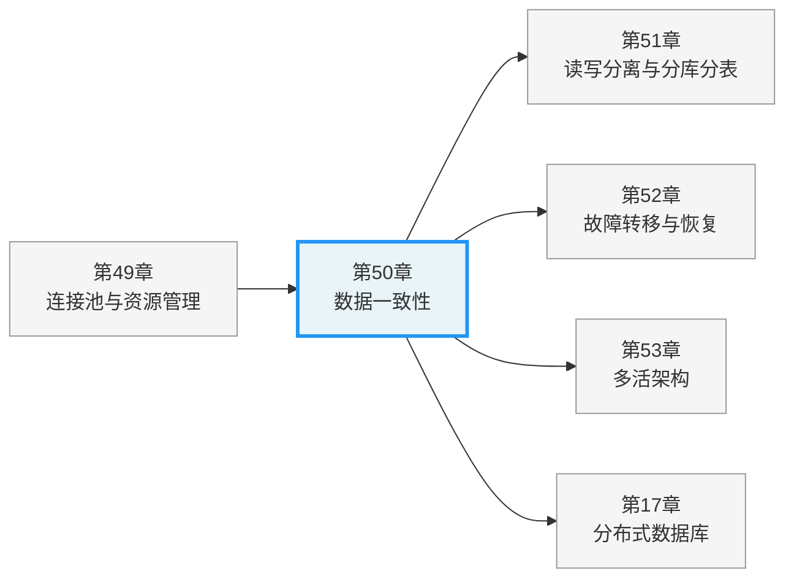
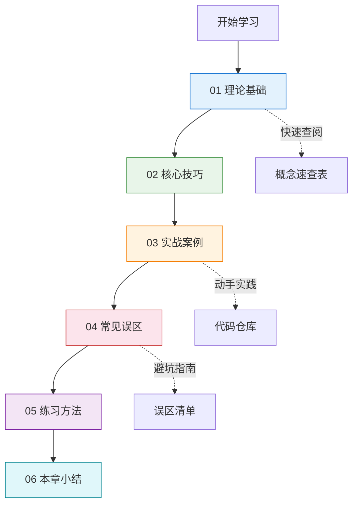
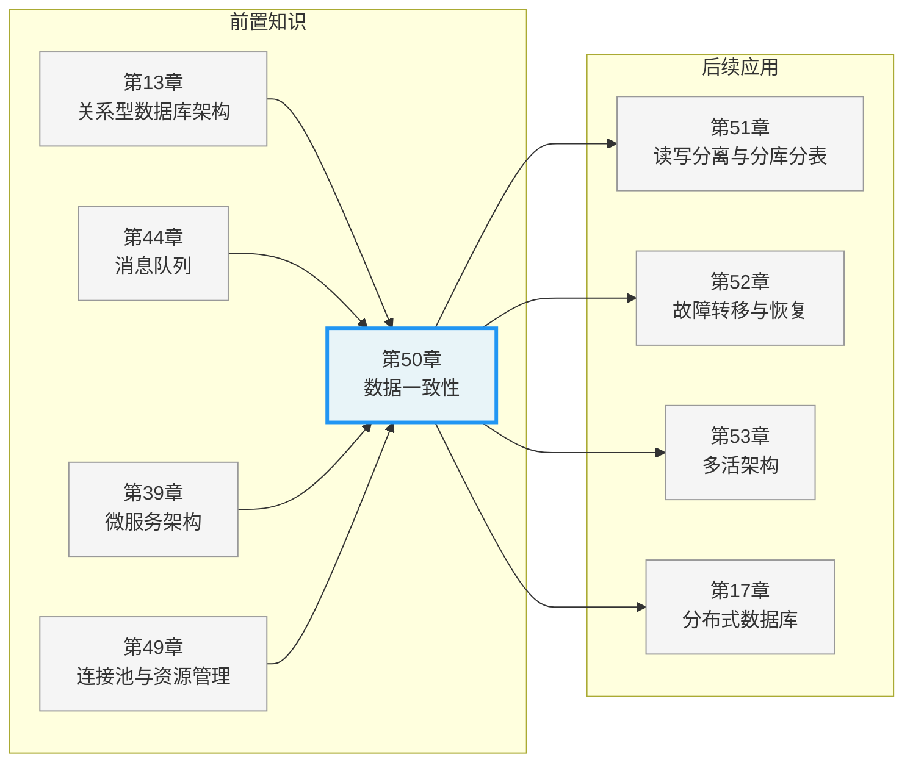
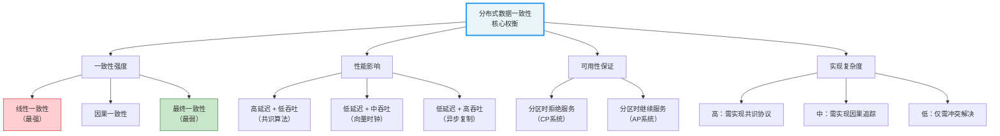

# 第50章 数据一致性：分布式系统的核心挑战

***

## 章节定位

数据一致性是分布式系统设计中最核心、也最复杂的课题。当同一份数据存在于多个节点、多个服务、多个数据中心时，如何保证所有地方看到的都是正确的值——这个看似简单的问题，背后牵扯的理论深度、工程复杂度和业务影响，足以让最资深的架构师彻夜难眠。

本章在全书中处于承上启下的枢纽位置。它承接第49章"连接池与资源管理"对单节点资源管理的讨论，将视野从单机扩展到多节点协同；同时为后续多个关键章节奠定认知基础：

- 第51章"读写分离与分库分表"需要本章的一致性理论指导分片策略选择——你必须先理解什么能容忍不一致，才能决定数据如何拆分
- 第52章"故障转移与恢复"涉及一致性保证在故障场景下的降级与恢复——CAP定理和共识算法是其理论根基
- 第53章"多活架构"面对的是跨地域一致性的终极挑战——物理距离带来的一致性延迟无法回避

**一句话总结本章**：不理解数据一致性，就无法真正理解分布式系统的架构设计。

***

## 为什么这一章如此重要

在单体应用时代，数据一致性主要由数据库事务（ACID）保证，开发者几乎不需要关心。但在微服务和分布式架构成为主流的今天，情况发生了根本性变化。以下四个驱动力使得数据一致性从"可选知识"变成了"必修课"。

### 业务规模驱动的架构演进

当系统日活超过千万、数据量达到TB级别时，单机数据库已无法承载读写压力，必须进行分库分表和读写分离。一旦数据被拆分到多个物理节点，"同一个事务"就变成了"跨节点协调"。这不是可选的优化，而是规模增长的必然结果。

以国内头部电商平台为例：订单库按用户ID分256个分片，商品库存按商品ID分64个分片。一笔"下单扣库存"的操作需要跨至少两个分片执行，本地事务已经无法保证原子性。如果不懂一致性模型，就会在"2PC还是Saga"的决策上踩坑——2PC性能差但一致性强，Saga性能好但需要复杂的补偿逻辑，选错方案的代价是数百万级的线上事故。

### 微服务架构的天然挑战

每个微服务拥有独立的数据库，一个业务操作（如下单）需要跨多个服务协同完成。传统的本地事务无法跨越服务边界。以一个典型的电商下单流程为例：

用户下单 → 订单服务(创建订单) → 库存服务(扣减库存) → 优惠券服务(锁定优惠券) 
         → 支付服务(冻结余额) → 物流服务(预分配仓库) → 通知服务(发送确认)

这6个服务中，任何一个步骤失败，前面已执行的步骤都需要回滚。在单体架构中，一个数据库事务就能搞定；在微服务架构中，你需要Saga、TCC或事务性发件箱这样的分布式事务模式。**选错模式或实现不当，轻则数据不一致导致用户投诉，重则资金损失需要赔付。**

### 全球化部署的现实需求

当系统部署在多个地域的数据中心时，物理距离带来的网络延迟使得强一致性的代价变得极其高昂。以下是真实的延迟数据：

| 数据中心位置 | 往返延迟(RTT) | 强一致性每次写入代价 |
|-------------|-------------|-------------------|
| 同一机房（同城双活） | 0.5-2ms | 0.5-2ms |
| 同国跨城（北京↔上海） | 8-15ms | 8-15ms |
| 跨洲际（中国↔美国） | 150-200ms | 150-200ms |
| 跨洲际（中国↔欧洲） | 200-300ms | 200-300ms |

如果每个写操作都需要跨数据中心的多数节点确认（强一致性），那么一个面向全球用户的写操作可能需要300ms以上才能完成。对于一个日活过亿的应用，这直接意味着吞吐量下降一个数量级。如何在保证用户体验的同时维持数据的最终一致性，是需要深入理解理论才能做出的合理决策。

### 故障是常态而非异常

分布式系统中的网络分区、节点宕机、消息丢失是必然会发生的事件，不是"如果发生"而是"何时发生"。根据Google的公开数据，在其Borg集群中，每天约有0.5%的机器经历某种形式的故障；在千台服务器的集群中，每天都会有数台服务器发生网络隔离。

**这意味着：你的系统在生产环境中运行的每一天，都在经历数据一致性的考验。** 如果团队没有在设计阶段就考虑到这一点，故障发生时的应对往往是临时的、不完整的，最终导致数据不一致的累积和扩散。

Facebook在2021年10月的大规模宕机事故中，一个BGP配置错误导致内部网络分区，由于缺乏有效的分区恢复和数据一致性降级机制，影响持续了近6小时，波及全球35亿用户。这正是对"故障是常态"这一认知不足的代价。

***

## 核心内容概览

本章共分为六个小节，从理论到实践层层递进，覆盖数据一致性的完整知识体系。

### 一致性模型理论：构建认知框架

一致性模型是理解分布式数据问题的理论基石。本章从最强的线性一致性出发，逐级放松到最终一致性，构建一个完整的层次体系：

| 一致性模型 | 核心保证 | 实现成本 | 典型系统 |
|-----------|---------|---------|---------|
| **线性一致性** | 所有操作看起来像在单一副本上原子执行，严格遵守实时顺序 | 最高：需要共识算法，每次写需多数节点确认 | etcd、ZooKeeper、Google Spanner |
| **顺序一致性** | 所有进程看到相同的操作顺序，但不要求实时性 | 高：需要全局排序机制 | Lamport时钟、多Paxos |
| **因果一致性** | 有因果关系的操作被所有节点以相同顺序观察到，允许并发操作乱序 | 中等：需要向量时钟追踪因果关系 | MongoDB因果一致性会话、CockroachDB |
| **最终一致性** | 不再有新更新时，所有副本最终收敛到相同值 | 最低：异步复制+冲突解决 | DynamoDB、Cassandra、Redis Cluster |

每种模型都有其形式化的数学定义、明确的工程含义和特定的适用场景。本章不做浅尝辄止的概述，而是深入到每个模型的语义边界——你将清楚地知道"线性一致性到底比顺序一致性多了什么保证"以及"这个区别在工程上意味着什么"。

### CAP定理与FLP不可能性定理：理解根本限制

Eric Brewer在2000年提出的CAP定理和Fischer、Lynch、Paterson在1985年证明的FLP不可能性定理，揭示了分布式一致性的根本性限制。但这两个定理经常被误读：

- **CAP定理**不是说"CP和AP二选一"，而是在网络分区发生的那一刻，你需要在一致性和可用性之间做选择。实际系统中，大多数系统是"默认CA，分区时降级为CP或AP"
- **FLP定理**不是说"共识不可能"，而是说"确定性共识在异步系统中无法保证有限时间终止"。工程实践中，通过超时机制、随机化算法和部分同步假设来绕过这个限制

Martin Kleppmann进一步提出了PACELC定理，将CAP从"分区时"扩展到"任何时候"：即使在没有网络分区的正常情况下，系统也必须在延迟（Latency）和一致性（Consistency）之间做出权衡。这个扩展对工程决策的指导意义比CAP本身更大。

### CRDT：无冲突复制数据类型的优雅方案

CRDT（Conflict-free Replicated Data Types）通过数学上的半格（Semilattice）结构，使得多个副本可以独立更新而无需协调，最终自动收敛到一致状态。这是最终一致性场景中最优雅的解决方案。

本章详细讲解了四种核心CRDT类型：

| CRDT类型 | 功能 | 实现原理 | 典型应用场景 |
|----------|------|---------|-------------|
| **G-Counter** | 只增计数器 | 每节点维护独立计数，读取时求和 | 点赞计数、PV/UV统计 |
| **PN-Counter** | 增减计数器 | 两个G-Counter分别追踪增和减 | 库存增减、余额变动 |
| **LWW-Register** | 最后写入胜出 | 时间戳+节点ID，取时间戳最大值 | 配置同步、状态更新 |
| **OR-Set** | 可增删集合 | 唯一标签追踪每次添加操作 | 购物车、协作编辑标签 |

向量时钟（Vector Clocks）作为追踪事件因果关系的工具，与CRDT配合使用，可以精确判定两个事件之间的因果关系或并发关系。本章提供了完整的Python代码示例，帮助你从零理解CRDT的实现。

### 分布式事务模式：工程层面的解决方案

本章系统讲解三种主流的分布式事务模式，覆盖从"最终一致性"到"强一致性"的完整频谱：

**Saga模式**——适合长事务和高吞吐场景。将长事务分解为一系列本地事务和补偿操作，支持两种协调方式：
- **编排式（Orchestration）**：由中央协调器管理流程，易于理解和调试，适合复杂业务流程
- **协同式（Choreography）**：通过事件驱动实现松耦合，适合简单流程，但分散的逻辑难以追踪

**TCC模式**——适合需要强隔离的场景。通过Try-Confirm-Cancel三阶段实现资源预留，提供比Saga更强的隔离保证：
- **Try**：检查并预留资源（冻结库存、锁定余额）
- **Confirm**：确认执行，真正扣减资源
- **Cancel**：取消预留，释放冻结的资源

**事务性发件箱（Transactional Outbox）**——解决"双写问题"的利器。在同一个本地事务中既更新数据库又写入待发送消息，确保数据变更和消息发送的原子性。CDC（Change Data Capture）+ Debezium是其最成熟的工程实现。

### 幂等性与可调一致性：分布式系统的安全网

**幂等性**是分布式系统中最重要的安全属性之一。网络超时重试、消息重复投递、用户重复点击——这些在分布式环境中必然发生的事情，都依赖幂等性来保证数据的正确性。本章讲解了幂等键的设计策略、幂等表的实现方式，以及如何在不增加延迟的情况下实现幂等性保证。

**可调一致性**通过Quorum机制（W + R > N）让开发者根据业务需求在一致性和可用性之间灵活调节。Cassandra和DynamoDB等系统将这种权衡暴露为API参数（ONE/QUORUM/ALL），让同一个系统可以对不同数据提供不同级别的一致性保证。

***

## 适合谁读

### 初级开发者（1-3年经验）

如果你正在从单体架构转向微服务，或者第一次面对"数据同步"的挑战，本章将帮你建立正确的认知框架。建议阅读路径：01理论基础（一致性模型和CRDT部分）→ 02核心技巧 → 03实战案例 → 06本章小结。重点关注"为什么"而不是"怎么做"——理解了原理，才能在面对新问题时做出正确判断。

### 高级开发者（3-5年经验）

你可能已经在项目中用过Redis做缓存同步，或者用过消息队列处理异步任务，但对"为什么有时候数据会不一致"缺乏系统认知。建议直接从02核心技巧开始，结合03实战案例对照自己的项目经验。01节的理论部分可以作为参考查阅，特别是CAP定理的工程解读和CRDT的数学基础。

### 架构师与技术负责人

你需要做出关键的技术选型决策：是用2PC还是Saga？是强一致性还是最终一致性？多活架构中数据同步选什么方案？重点关注01节的一致性模型层次体系和一致性与性能权衡框架，以及06节的决策速查表。这些内容直接支持架构层面的选型决策，帮你避免"为了追求强一致性而牺牲可用性"或"为了性能而容忍不可接受的数据丢失"这两种极端。

### 面试准备者

分布式系统一致性是高级工程师和架构师面试中的高频考点。CAP定理、Saga模式、幂等性设计、CRDT原理都是常见的面试题目。04节的常见误区和06节的概念速查表是高效的面试复习材料。

***

## 真实场景映射

为了帮助读者将理论与实践对应，以下是本章内容在真实场景中的映射关系。每种场景都标注了具体的一致性需求和推荐方案，帮助你在实际项目中快速定位适用技术：

| 场景 | 一致性需求 | 核心挑战 | 推荐方案 | 涉及小节 |
|------|-----------|---------|---------|---------|
| 银行转账（A扣B加） | 强一致性（不能出现钱凭空消失） | 跨节点事务原子性 | 分布式事务（2PC/TCC）+ 共识算法 | 01, 02 |
| 电商下单（扣库存+创建订单+扣款） | 最终一致性（允许短暂不一致） | 跨服务长事务协调 | Saga模式（编排式） | 01, 02, 03 |
| 社交媒体点赞计数 | 最终一致性（数字短暂不准可接受） | 高并发写入 | CRDT（G-Counter） | 01 |
| 协作文档编辑（多用户同时编辑） | 因果一致性 | 并发编辑冲突 | CRDT（OR-Set）+ 向量时钟 | 01, 05 |
| 购物车（多设备同步） | 最终一致性 | 多设备独立修改 | CRDT（LWW-Register）或OR-Set | 01, 05 |
| 库存扣减（高并发场景） | 最终一致性 + 可调一致性 | 超卖保护 | Quorum读写 + CAS + 幂等性 | 01, 02, 03 |
| 用户注册（创建账户+发送邮件） | 最终一致性 | 跨服务数据同步 | 事务性发件箱 | 01, 02 |
| 分布式缓存与数据库同步 | 最终一致性 | 缓存一致性 | 最大努力通知 + Cache-Aside + 幂等性 | 01, 02 |
| 跨数据中心用户数据同步 | 最终一致性（延迟敏感） | 跨地域复制延迟 | 异步复制 + CRDT + 冲突解决策略 | 01, 02, 03 |

***

## 本章结构

本章按照"理论→技巧→实践→反思"的逻辑递进组织，共分为六个小节，总计约19小时的学习量（含阅读与实践）：

| 小节 | 主题 | 核心内容 | 关键知识点 | 难度 |
|------|------|----------|-----------|------|
| 01 | 理论基础 | 一致性模型层次体系、CAP/FLP定理、CRDT数学基础与实现、向量时钟、分布式事务模式（Saga/TCC）、事务性发件箱、幂等性与可调一致性、一致性与性能的权衡框架 | 线性/顺序/因果/最终一致性、半格结构、Saga编排与协同、TCC三阶段、Quorum机制 | ★★★★ |
| 02 | 核心技巧 | Saga设计技巧（边界划分、补偿幂等性、超时处理、语义锁）、TCC实现细节（空回滚、悬挂预防）、事务性发件箱优化（CDC集成、消息去重）、幂等键设计策略、一致性测试与验证（Jepsen） | 边界划分原则、空回滚处理、Debezium配置、幂等键策略、线性一致性检查器 | ★★★ |
| 03 | 实战案例 | etcd分布式一致性实战（Raft协议应用）、Redis分布式锁与一致性实战（Redlock算法）、电商订单Saga完整实现 | Raft选主与日志复制、Redlock实现、Saga补偿链路 | ★★★ |
| 04 | 常见误区 | 六大数据一致性典型认知陷阱：过度强一致性、Saga补偿遗漏、幂等键冲突、CAP定理误读、缓存一致性误区、分布式锁滥用 | 补偿幂等性缺失、悬挂问题、脑裂处理 | ★★★ |
| 05 | 练习方法 | CRDT实现练习（G-Counter/OR-Set）、Saga模式实验（编排式对比协同式）、一致性模型对比验证（模拟网络分区） | 动手实现CRDT、对比不同Saga模式、Jepsen测试模拟 | ★★★ |
| 06 | 本章小结 | 核心概念回顾、一致性选型决策框架、常见场景速查表、延伸阅读推荐 | 决策树、速查表、推荐书目 | ★★ |

### 建议阅读路径

**对于初学者**：建议按 01→02→03→06 的顺序阅读，重点关注一致性模型的基本概念和Saga模式的工程实现。04节的常见误区可以帮助避免初学者最容易犯的错误。

**对于有经验的工程师**：可以直接从02节的核心技巧开始，结合03节的实战案例加深理解。01节的理论部分可以作为参考查阅，特别是CAP定理的形式化证明和CRDT的数学基础。

**对于架构师**：重点关注01节的一致性模型层次体系和一致性与性能权衡框架，以及06节的决策速查表。这些内容直接支持架构层面的一致性选型决策。

***

## 前置知识

阅读本章需要以下基础知识。如果某些领域你还比较薄弱，建议先补充对应章节的内容，否则在阅读本章时可能会在基础概念上卡壳：

| 知识领域 | 具体要求 | 相关章节 | 补充优先级 |
|---------|---------|---------|----------|
| 数据库事务 | 理解ACID特性、四种事务隔离级别（读未提交/读已提交/可重复读/串行化）、锁机制（行锁/表锁/间隙锁） | 第13章 关系型数据库架构 | ★★★★★ 必须 |
| 消息队列 | 了解发布/订阅模型、消息持久化、消费者组、至少一次/至多一次/精确一次语义 | 第44章 消息队列 | ★★★★ 强烈建议 |
| 微服务架构 | 理解服务拆分原则、API网关、服务注册与发现、服务间通信（同步/异步） | 第39章 微服务架构 | ★★★★ 强烈建议 |
| 网络基础 | 了解TCP/IP协议栈、三次握手/四次挥手、网络分区概念、延迟与带宽的区别 | 第04章 网络协议栈 | ★★★ 建议 |
| 基本数据结构与算法 | 理解集合运算、映射、偏序关系、时间复杂度分析 | — | ★★★ 建议 |

***

## 工具生态速览

数据一致性不是纯理论问题——每个概念都有对应的工程工具和框架。以下是本章涉及的核心概念到主流工具的映射，帮助你快速找到落地实现的起点：

| 概念 | 代表性工具/框架 | 语言/平台 | 适用场景 |
|------|----------------|----------|---------|
| 强一致性（共识算法） | etcd (Raft)、ZooKeeper (ZAB)、Consul (Raft) | Go/Java | 配置中心、分布式锁、服务发现 |
| 线性一致性存储 | TiKV (Raft)、CockroachDB、Google Spanner | Go/C++ | 分布式数据库、事务型存储 |
| CRDT实现 | Automerge、Yjs、Redis (CRDB) | JS/Python/Go | 协作编辑、离线优先应用 |
| Saga编排框架 | Axon Framework、Temporal、Camunda | Java/Go | 复杂业务流程编排 |
| Saga协同模式 | Apache Kafka + 事件溯源 | 多语言 | 松耦合微服务交互 |
| TCC框架 | Seata (AT/TCC模式)、Hmily | Java | 金融级分布式事务 |
| 事务性发件箱 | Debezium + Kafka Connect | Java | CDC驱动的消息同步 |
| 可调一致性数据库 | Apache Cassandra、Amazon DynamoDB、Riak | 多语言 | 高可用键值存储 |
| 分布式锁 | Redis (Redlock)、etcd、ZooKeeper | 多语言 | 分布式互斥访问 |
| 一致性测试 | Jepsen、Knossos、Hermitage | Clojure/Java | 上线前可靠性验证 |

***

## 本章难点预警

在学习过程中，以下概念可能需要额外的时间和精力来理解。我们提前标注出来，帮你合理分配学习精力：

| 难点 | 为什么难 | 应对策略 |
|------|---------|---------|
| **CRDT的数学基础** | 半格结构、单调性、交换律等抽象代数概念，对数学基础较弱的读者有门槛 | 先理解直观的G-Counter示例（"每个节点记自己的数，读的时候加起来"），再回过头理解背后的数学原理。数学不是理解CRDT的必要条件，但能帮助你设计新的CRDT类型 |
| **FLP不可能性定理** | 证明过程涉及异步系统的严格数学推理，非常抽象 | 不必纠结证明细节，重点理解结论和工程意义：(1) 确定性共识在纯异步系统中不可能保证终止；(2) 工程实践中通过超时和随机化来绕过；(3) 这解释了为什么所有共识算法都需要部分同步假设 |
| **Saga补偿操作的完整性** | 设计补偿操作时需要考虑所有可能的失败点，遗漏任何一个都会导致数据不一致 | 使用"失败清单法"：逐步骤列出"如果这步失败，前面每步需要什么补偿"。本章04节提供了完整的补偿遗漏检测清单 |
| **向量时钟的空间开销** | 每个事件的向量时钟大小与节点数量成正比，大规模系统中开销不可忽视 | 理解其局限性后，考虑使用混合逻辑时钟（HLC）或版本向量（Version Vector）作为替代方案 |
| **可调一致性的配置选择** | ONE/QUORUM/ALL的组合直接影响延迟、可用性和一致性，选错配置可能在平时看不出问题，故障时才暴露 | 本章06节提供了"一致性配置决策树"，根据业务场景的延迟容忍度和数据重要性来选择配置 |

***

## 核心概念速查

以下是本章涉及的核心概念及其解释，供快速查阅。每个概念都标注了在本章中的位置，方便定位详细内容：

| 概念 | 解释 | 一致性强度 | 详细位置 |
|------|------|----------|---------|
| **线性一致性** | 所有操作看起来像在单一副本上原子执行，严格遵守实时顺序——如果操作A在操作B开始前完成，那么所有节点都必须先看到A再看到B | 最强 ★★★★★ | 01-理论基础 §1.2 |
| **顺序一致性** | 所有进程看到相同的操作顺序，但不要求这个顺序与物理时钟对齐——一个"迟到"的操作可以被插入到更早的位置 | 强 ★★★★ | 01-理论基础 §1.3 |
| **因果一致性** | 有因果关系的操作（如"发帖→回复"）被所有节点以相同顺序观察到，但并发操作可以有不同的顺序 | 中等 ★★★ | 01-理论基础 §1.4 |
| **最终一致性** | 如果不再有新的更新，所有副本最终会收敛到相同的值——但"最终"可能是毫秒级也可能是分钟级 | 弱 ★★ | 01-理论基础 §1.5 |
| **CAP定理** | 在网络分区（Partition）发生时，系统只能在一致性（Consistency）和可用性（Availability）之间二选一。注意：这是分区时的权衡，不是全天候的二选一 | 理论限制 | 01-理论基础 §2.1 |
| **PACELC定理** | CAP的扩展：即使没有分区，系统在正常运行时也必须在延迟（Latency）和一致性（Consistency）之间权衡。比CAP更具工程指导意义 | 理论框架 | 01-理论基础 §2.2 |
| **FLP不可能性** | 在纯异步系统中，不存在能保证在有限时间内终止的确定性共识算法。工程实践中通过超时和随机化来绕过 | 理论限制 | 01-理论基础 §2.3 |
| **CRDT** | 通过数学结构（半格）保证多个副本可以独立更新并发操作，无需协调即可最终自动收敛到一致状态 | 最终一致 | 01-理论基础 §3 |
| **G-Counter** | 只支持递增的CRDT计数器——每个节点维护自己的计数，读取时将所有节点的计数求和。只增不减，天然无冲突 | 最终一致 | 01-理论基础 §3.2 |
| **OR-Set** | 支持添加和删除的CRDT集合——通过为每次添加操作生成唯一标签来解决"删除了又被添加回来"的经典冲突 | 最终一致 | 01-理论基础 §3.5 |
| **向量时钟** | 追踪事件因果关系的逻辑时钟机制——每个节点维护一个向量，记录自己和其他节点的逻辑时间。通过比较向量可以判定两个事件是因果关系还是并发关系 | 辅助机制 | 01-理论基础 §3.6 |
| **Saga模式** | 将长事务分解为一系列本地事务和补偿操作——正常流程顺序执行本地事务，失败时逆序执行补偿操作。支持编排式和协同式两种协调方式 | 最终一致 | 01-理论基础 §4 |
| **TCC模式** | Try预留资源→Confirm确认执行→Cancel取消预留的三阶段事务模式——比Saga提供更强的隔离性，但实现复杂度更高 | 强隔离 | 01-理论基础 §5 |
| **事务性发件箱** | 在同一数据库事务中写入业务数据和待发送消息——解决"先写库再发消息"或"先发消息再写库"的双写问题 | 最终一致 | 01-理论基础 §6 |
| **幂等性** | 同一操作执行多次的效果与执行一次相同——通过幂等键（Idempotency Key）实现，是分布式系统中对抗重复请求的安全网 | 安全属性 | 01-理论基础 §7 |
| **Quorum** | W + R > N 时保证读操作能读到最新写入的值——通过调节W（写入确认数）和R（读取确认数）来平衡一致性和可用性 | 可调 | 01-理论基础 §7.2 |

***

## 与其他章节的关系

数据一致性不是孤立的概念，它与全书的多个核心主题紧密关联：

| 关联章节 | 关系类型 | 具体关联 |
|---------|---------|---------|
| 第13章 关系型数据库架构 | 前置知识 | 理解ACID事务、隔离级别、锁机制是一致性理论的基础 |
| 第17章 分布式数据库 | 前置/进阶 | 分布式共识算法的工程实现（Raft/Paxos在TiKV/CockroachDB中的应用） |
| 第39章 微服务架构 | 前置知识 | 跨服务一致性挑战的来源——服务拆分导致数据分散 |
| 第44章 消息队列 | 前置知识 | 事务性发件箱的消息传递基础设施——Kafka/RabbitMQ的持久化与消费语义 |
| 第49章 连接池与资源管理 | 前置知识 | 单节点资源管理的边界——从单机到分布式的视野跃迁 |
| 第51章 读写分离与分库分表 | 后续应用 | 一致性理论指导分片策略选择——什么数据需要跨分片一致性 |
| 第52章 故障转移与恢复 | 后续应用 | 一致性保证在故障场景下的降级与恢复——共识算法的选主机制 |
| 第53章 多活架构 | 后续应用 | 跨地域一致性的终极挑战——物理距离带来的一致性延迟无法回避 |

***

## 预计学习时间

| 内容 | 阅读 | 实践 | 合计 | 备注 |
|------|------|------|------|------|
| 理论基础（8节） | 3h | 1.5h | 4.5h | 含CRDT代码示例阅读与实验 |
| 核心技巧（5节） | 2h | 2h | 4h | 含Saga/TCC的伪代码实现 |
| 实战案例（3个案例） | 1.5h | 2h | 3.5h | 含etcd/Redis搭建与测试 |
| 常见误区（6个误区） | 0.5h | 0.5h | 1h | 含误区复现实验 |
| 练习方法（5个练习） | 0.5h | 5h | 5.5h | 含CRDT完整实现与Jepsen测试 |
| 本章小结 | 0.5h | — | 0.5h | 含决策框架应用 |
| **总计** | **8h** | **11h** | **19h** | |

**时间提示**：如果你只有4-5小时，建议优先完成01理论基础（一致性模型+CRDT部分）→ 02核心技巧（Saga部分）→ 06本章小结。这能覆盖约70%的核心知识。剩余内容可以在后续项目实践中按需补充。

***

## 核心思想速览

在正式开始之前，用一张图概括分布式数据一致性的核心权衡维度。这张图揭示了一致性设计的核心思维框架：**一致性不是一个非此即彼的选择，而是需要根据业务需求在强度、性能、可用性和复杂度四个维度上精细调节的连续谱**。

理解这个连续谱，就掌握了分布式数据一致性设计的核心思维。接下来，让我们从第一部分——理论基础开始，系统地构建数据一致性的知识体系。

***

