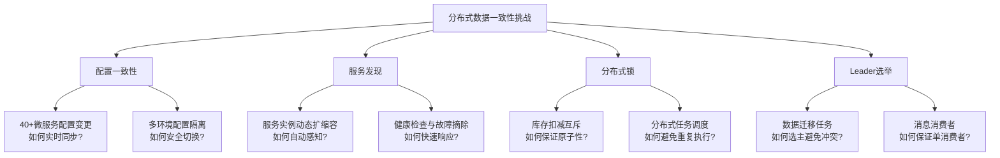
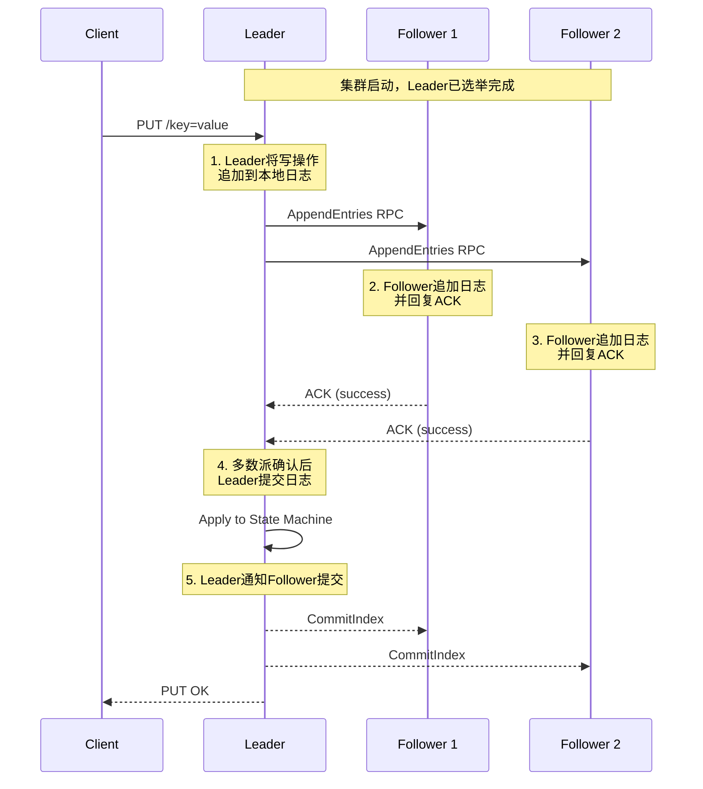
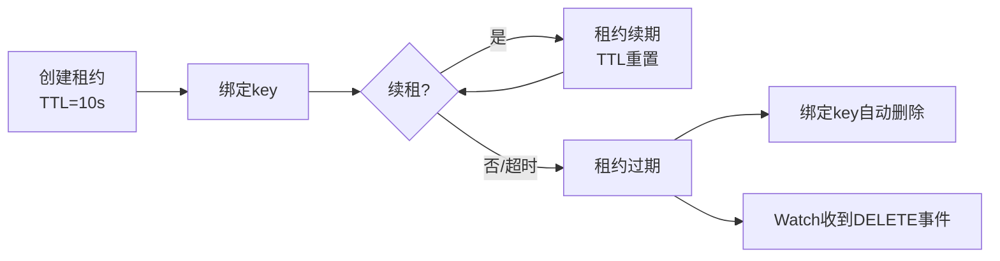
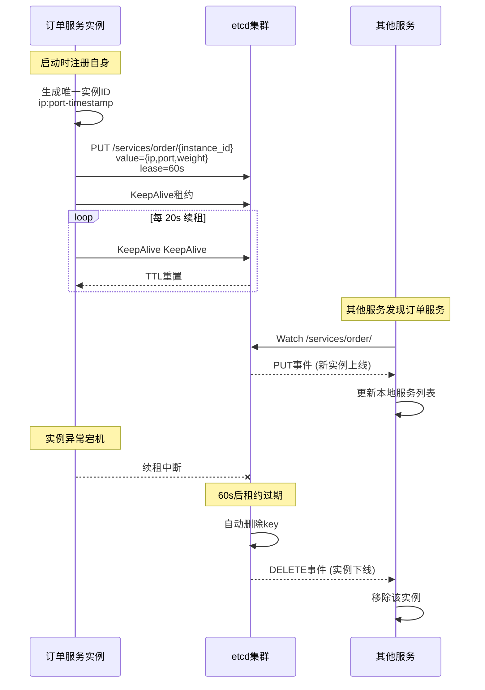
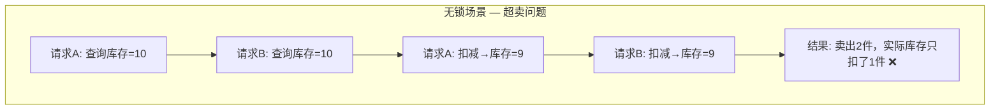
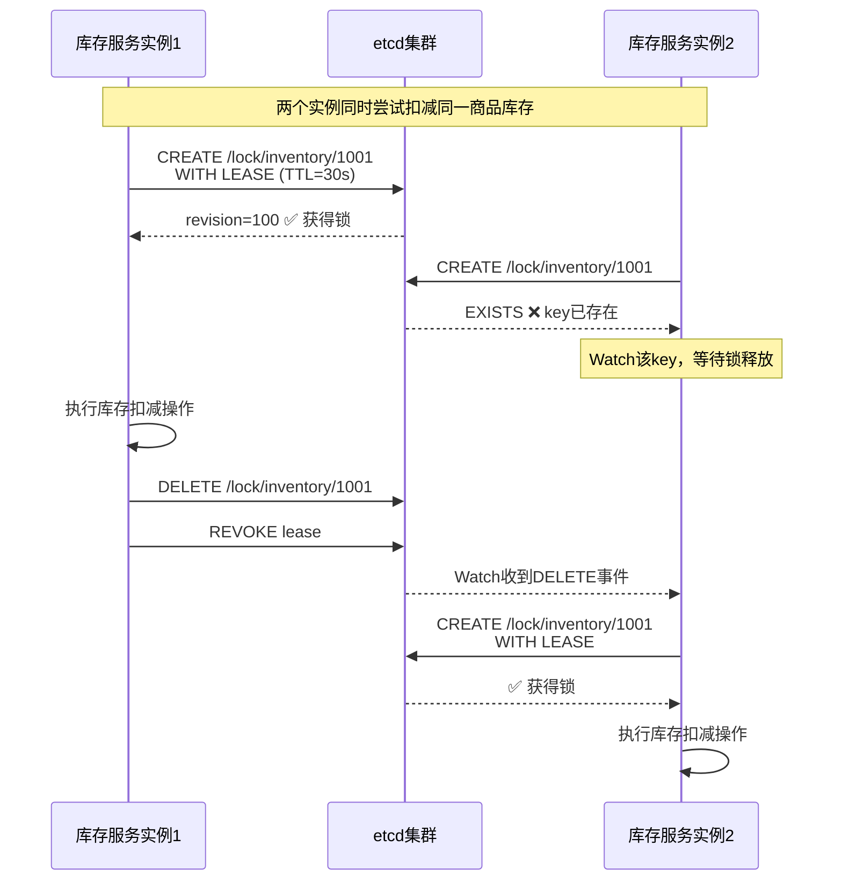
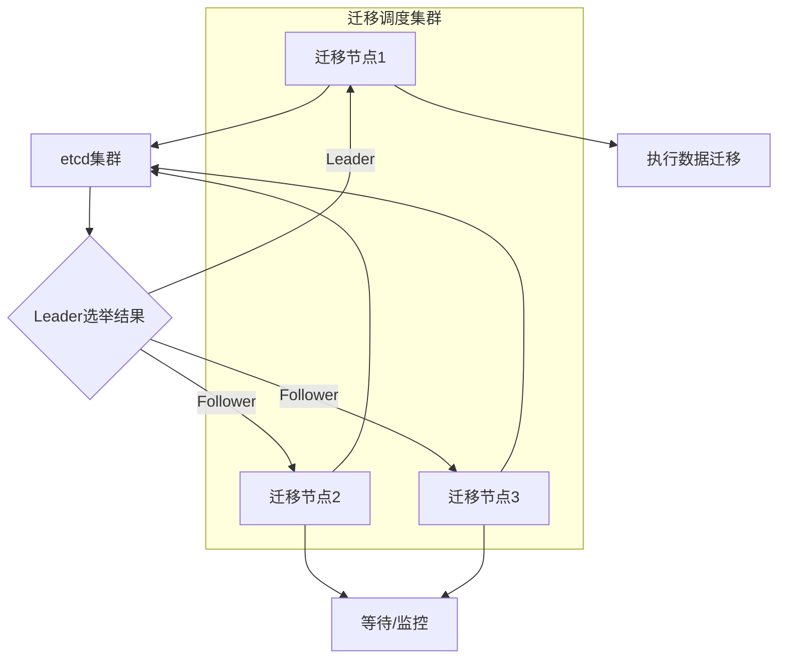

## 基于etcd的分布式数据一致性实战

### 1. 案例概述

本案例以一个实际的**分布式微服务订单系统**为背景，展示如何利用 etcd 解决分布式环境下的核心一致性问题。etcd 作为 Kubernetes 的底层存储引擎，其强一致性（基于 Raft 共识算法）使其成为分布式系统中配置管理、服务发现、分布式锁和选主等场景的理想选择。

**为什么选择 etcd？**

| 特性 | etcd | Redis | ZooKeeper | Consul |
|------|------|-------|-----------|--------|
| 一致性模型 | 强一致性（线性读写） | 最终一致性 | 强一致性 | 最终一致性 |
| 共识算法 | Raft | 无（单线程+异步复制） | ZAB | Raft |
| 事务支持 | 原子 Compare-and-Swap | MULTI/EXEC | 无 | Check-and-Set |
| Watch机制 | 原生支持前缀/范围Watch | Pub/Sub（不保证顺序） | Watch（一次性） | Blocking Query |
| 性能特点 | 中等（读写均衡） | 极高（内存操作） | 读多写少优化 | 中等 |
| 适用场景 | 配置/选主/分布式锁 | 缓存/会话/排行榜 | 配置/选主（运维复杂） | 服务网格/ACL |

> **核心定位**：etcd 不是万能的。它适合需要**强一致性保证**、**高可靠性**的元数据和协调类数据，而非高吞吐的业务数据存储。正确理解这个定位，是使用 etcd 的第一步。

### 2. 系统架构与挑战

#### 2.1 业务场景

某电商交易平台，核心链路包括：下单、库存扣减、支付、物流分配。系统部署在 3 个机房（双活+冷备），微服务数量超过 40 个，日均订单量 500 万。

#### 2.2 核心挑战



#### 2.3 方案选型决策

在方案选型阶段，团队评估了三种方案：

**方案A：纯 Redis 方案**
- 优势：性能极高，读写延迟 < 1ms
- 劣势：主从切换时数据可能丢失（异步复制）；Sentinel 切换期间有短暂不可用窗口
- 结论：适合缓存和会话管理，不适合作为一致性协调的核心

**方案B：ZooKeeper 方案**
- 优势：强一致性，久经考验
- 劣势：运维复杂度高（JVM调优、磁盘IO敏感）；客户端 API 笨重；K8s 生态整合弱
- 结论：传统 Java 技术栈的合理选择，但团队技术栈已转向 Go/云原生

**方案C：etcd 方案**
- 优势：Raft 算法简洁可靠；原生 Watch 机制高效；Go 语言实现，与 K8s 生态无缝整合；租约（Lease）机制天然支持 TTL 场景
- 劣势：单个 value 限制 1.5MB；写吞吐有上限（通常 < 10K QPS）
- 结论：元数据和协调类数据的最优选择

### 3. etcd 核心机制深度解析

在动手实现之前，必须理解 etcd 保证一致性的核心机制。

#### 3.1 Raft 共识算法

Raft 将共识问题分解为三个子问题：Leader 选举、日志复制、安全性。



**Raft 的关键约束**：

- **多数派原则**：任何写操作必须被集群中超过半数节点确认后才算提交成功。3 节点集群容忍 1 个故障，5 节点集群容忍 2 个故障
- **Leader 唯一性**：所有写请求必须经过 Leader，避免脑裂
- **日志匹配原则**：如果两个日志在相同索引处具有相同的 term 和 index，则它们之前的所有条目也相同

#### 3.2 租约（Lease）机制

租约是 etcd 实现 TTL 和心跳检测的基础机制。每个租约有一个指定的 TTL（存活时间），持有者需要定期续租，否则租约过期，绑定该租约的所有 key 自动删除。



**租约的两种用法**：
- **心跳租约**：服务实例每 3-5 秒续租一次，模拟心跳。宕机后自动过期，实现故障自动摘除
- **定时租约**：创建后不续租，TTL 到期自动删除，实现延迟操作（如临时锁超时释放）

#### 3.3 Watch 机制

etcd 的 Watch 是基于 MVCC（多版本并发控制）的高效事件推送机制，支持按 key 或前缀监听变更，保证事件不丢失、不乱序。

**Watch 的三种模式**：
- **精确 Watch**：监听单个 key 的变更
- **前缀 Watch**：监听 `/services/order/` 下所有 key 的变更（最常用）
- **历史 Watch**：指定 revision 起点，从历史版本开始回放（用于状态同步）

### 4. 实战一：服务注册与发现

#### 4.1 服务注册设计



#### 4.2 服务注册实现

```go
package discovery

import (
    "context"
    "encoding/json"
    "fmt"
    "log"
    "os"
    "os/signal"
    "syscall"
    "time"

    clientv3 "go.etcd.io/etcd/client/v3"
)

// ServiceInstance 服务实例信息
type ServiceInstance struct {
    ID       string            `json:"id"`
    Name     string            `json:"name"`
    Address  string            `json:"address"`
    Port     int               `json:"port"`
    Weight   int               `json:"weight"`
    Metadata map[string]string `json:"metadata,omitempty"`
    Register time.Time         `json:"register_time"`
}

// ServiceRegistry 服务注册器
type ServiceRegistry struct {
    client    *clientv3.Client
    leaseID   clientv3.LeaseID
    keepAlive <-chan *clientv3.LeaseKeepAliveResponse
    cancel    context.CancelFunc
}

// NewServiceRegistry 创建服务注册器
func NewServiceRegistry(endpoints []string, dialTimeout time.Duration) (*ServiceRegistry, error) {
    client, err := clientv3.New(clientv3.Config{
        Endpoints:   endpoints,
        DialTimeout: dialTimeout,
    })
    if err != nil {
        return nil, fmt.Errorf("etcd客户端创建失败: %w", err)
    }
    return &amp;ServiceRegistry{client: client}, nil
}

// Register 注册服务实例
func (r *ServiceRegistry) Register(ctx context.Context, svc ServiceInstance, ttl int64) error {
    // 1. 创建租约
    resp, err := r.client.Grant(ctx, ttl)
    if err != nil {
        return fmt.Errorf("创建租约失败: %w", err)
    }
    r.leaseID = resp.ID

    // 2. 序列化服务实例信息
    value, err := json.Marshal(svc)
    if err != nil {
        return fmt.Errorf("序列化失败: %w", err)
    }

    // 3. PUT with lease — key绑定租约，租约过期key自动删除
    key := fmt.Sprintf("/services/%s/%s", svc.Name, svc.ID)
    _, err = r.client.Put(ctx, key, string(value), clientv3.WithLease(resp.ID))
    if err != nil {
        return fmt.Errorf("注册失败: %w", err)
    }

    // 4. 开始自动续租
    keepAliveCtx, cancel := context.WithCancel(ctx)
    r.cancel = cancel
    r.keepAlive, err = r.client.KeepAlive(keepAliveCtx, resp.ID)
    if err != nil {
        return fmt.Errorf("续租启动失败: %w", err)
    }

    // 5. 监听续租结果
    go func() {
        for ka := range r.keepAlive {
            if ka == nil {
                log.Printf("[WARN] etcd续租通道关闭，服务可能已下线")
                return
            }
            // 续租成功，静默处理
            _ = ka
        }
    }()

    log.Printf("[INFO] 服务注册成功: %s, lease=%d", key, resp.ID)
    return nil
}

// Deregister 注销服务实例
func (r *ServiceRegistry) Deregister(ctx context.Context) error {
    if r.cancel != nil {
        r.cancel() // 停止续租
    }
    if r.leaseID != 0 {
        _, err := r.client.Revoke(ctx, r.leaseID) // 撤销租约，删除绑定的key
        if err != nil {
            return fmt.Errorf("注销失败: %w", err)
        }
    }
    return r.client.Close()
}

// WaitBlock 阻塞等待退出信号
func WaitBlock() {
    sig := make(chan os.Signal, 1)
    signal.Notify(sig, syscall.SIGINT, syscall.SIGTERM)
    <-sig
    log.Println("[INFO] 收到退出信号，开始优雅注销...")
}
```

#### 4.3 服务发现实现

```go
package discovery

import (
    "context"
    "encoding/json"
    "log"
    "sync"
    "sync/atomic"

    clientv3 "go.etcd.io/etcd/client/v3"
)

// ServiceDiscovery 服务发现器
type ServiceDiscovery struct {
    client    *clientv3.Client
    prefix    string
    services  sync.Map          // map[string]*ServiceInstance — 本地服务缓存
    revision  int64             // Watch起始revision
    callback  func(svc ServiceInstance, event EventType)
}

type EventType int

const (
    EventAdd EventType = iota
    EventDelete
)

// NewServiceDiscovery 创建服务发现器
func NewServiceDiscovery(client *clientv3.Client, serviceName string) *ServiceDiscovery {
    return &amp;ServiceDiscovery{
        client: client,
        prefix: "/services/" + serviceName + "/",
    }
}

// Start 启动服务发现
func (d *ServiceDiscovery) Start(ctx context.Context) error {
    // 1. 全量加载当前已注册的实例
    resp, err := d.client.Get(ctx, d.prefix, clientv3.WithPrefix())
    if err != nil {
        return err
    }

    for _, kv := range resp.Kvs {
        var svc ServiceInstance
        if err := json.Unmarshal(kv.Value, &amp;svc); err != nil {
            log.Printf("[WARN] 解析服务实例失败: %v", err)
            continue
        }
        d.services.Store(string(kv.Key), &amp;svc)
        if d.callback != nil {
            d.callback(svc, EventAdd)
        }
    }

    // 记录当前revision，Watch从此处开始，保证不丢事件
    d.revision = resp.Header.Revision + 1
    log.Printf("[INFO] 加载 %d 个服务实例, revision=%d", resp.Count, d.revision)

    // 2. 启动Watch监听后续变更
    go d.watch(ctx)
    return nil
}

// watch 监听etcd变更事件
func (d *ServiceDiscovery) watch(ctx context.Context) {
    watchChan := d.client.Watch(ctx, d.prefix,
        clientv3.WithPrefix(),
        clientv3.WithRev(d.revision), // 从快照之后开始
    )

    for resp := range watchChan {
        for _, ev := range resp.Events {
            var svc ServiceInstance
            if ev.Type == clientv3.EventTypePut {
                _ = json.Unmarshal(ev.Kv.Value, &amp;svc)
                d.services.Store(string(ev.Kv.Key), &amp;svc)
                log.Printf("[ADD] 服务上线: %s (%s:%d)", svc.ID, svc.Address, svc.Port)
                if d.callback != nil {
                    d.callback(svc, EventAdd)
                }
            } else if ev.Type == clientv3.EventTypeDelete {
                key := string(ev.Kv.Key)
                if old, ok := d.services.LoadAndDelete(key); ok {
                    svc = *old.(*ServiceInstance)
                    log.Printf("[DEL] 服务下线: %s (%s:%d)", svc.ID, svc.Address, svc.Port)
                    if d.callback != nil {
                        d.callback(svc, EventDelete)
                    }
                }
            }
        }
        // 更新revision
        d.revision = resp.Header.Revision + 1
    }
}

// GetInstances 获取所有可用服务实例
func (d *ServiceDiscovery) GetInstances() []*ServiceInstance {
    var result []*ServiceInstance
    d.services.Range(func(_, value interface{}) bool {
        result = append(result, value.(*ServiceInstance))
        return true
    })
    return result
}

// OnChange 注册变更回调
func (d *ServiceDiscovery) OnChange(callback func(svc ServiceInstance, event EventType)) {
    d.callback = callback
}
```

### 5. 实战二：分布式锁保护库存扣减

#### 5.1 为什么库存扣减需要分布式锁？



库存扣减是分布式系统中最典型的需要强一致性的场景。当两个请求同时查询到剩余库存为 1 时，如果不加互斥控制，两者都会扣减成功，导致超卖。

**etcd 分布式锁相比 Redis RedLock 的优势**：
- etcd 基于 Raft，只要多数节点存活，锁服务可用；不存在 Redis 主从切换导致锁丢失的问题
- etcd 的锁绑定租约，进程崩溃后锁自动释放，无需额外的看门狗机制
- etcd 支持 **阻塞等待锁** 和 **Watch锁释放**，比 RedLock 的自旋重试更高效

#### 5.2 etcd 分布式锁实现原理



#### 5.3 分布式锁代码实现

```go
package distlock

import (
    "context"
    "fmt"
    "log"
    "time"

    clientv3 "go.etcd.io/etcd/client/v3"
    "go.etcd.io/etcd/client/v3/concurrency"
)

// DistributedLock 基于etcd的分布式锁
type DistributedLock struct {
    client *clientv3.Client
}

// NewDistributedLock 创建分布式锁实例
func NewDistributedLock(client *clientv3.Client) *DistributedLock {
    return &amp;DistributedLock{client: client}
}

// Lock 获取分布式锁并执行业务逻辑
// key: 锁的资源标识，如 /locks/inventory/1001
// ttl: 锁自动过期时间（防止持有者宕机导致死锁）
// fn: 获取锁后执行的业务函数
func (dl *DistributedLock) Lock(ctx context.Context, key string, ttl int64, fn func() error) error {
    // 1. 创建会话（内含租约管理）
    session, err := concurrency.NewSession(dl.client, concurrency.WithTTL(int(ttl)))
    if err != nil {
        return fmt.Errorf("创建etcd会话失败: %w", err)
    }
    defer session.Close()

    // 2. 创建Mutex（基于etcd前缀的公平锁）
    mutex := concurrency.NewMutex(session, key)

    // 3. 等待获取锁（阻塞直到获取成功）
    lockCtx, cancel := context.WithTimeout(ctx, 30*time.Second)
    defer cancel()

    if err := mutex.Lock(lockCtx); err != nil {
        return fmt.Errorf("获取锁超时: %w", err)
    }

    // 4. 获取锁成功，执行业务
    log.Printf("[LOCK] 获取锁成功: %s, revision=%d", key, mutex.Header().Revision)
    var fnErr error
    if fn != nil {
        fnErr = fn()
    }

    // 5. 释放锁
    if _, err := mutex.Unlock(context.Background()); err != nil {
        log.Printf("[WARN] 释放锁失败: %v", err)
    }
    log.Printf("[UNLOCK] 释放锁成功: %s", key)

    return fnErr
}

// TryLock 尝试获取锁（非阻塞）
func (dl *DistributedLock) TryLock(ctx context.Context, key string, ttl int64, fn func() error) error {
    session, err := concurrency.NewSession(dl.client, concurrency.WithTTL(int(ttl)))
    if err != nil {
        return fmt.Errorf("创建etcd会话失败: %w", err)
    }
    defer session.Close()

    mutex := concurrency.NewMutex(session, key)
    if err := mutex.TryLock(ctx); err != nil {
        return fmt.Errorf("获取锁失败（锁已被持有）: %w", err)
    }
    defer mutex.Unlock(context.Background())

    if fn != nil {
        return fn()
    }
    return nil
}
```

#### 5.4 使用分布式锁的库存扣减服务

```go
package inventory

import (
    "context"
    "encoding/json"
    "fmt"
    "log"
    "strconv"
    "time"

    clientv3 "go.etcd.io/etcd/client/v3"
    "your-project/distlock"
)

// InventoryService 库存服务
type InventoryService struct {
    client *clientv3.Client
    lock   *distlock.DistributedLock
}

// Inventory 库存信息
type Inventory struct {
    ProductID string `json:"product_id"`
    Stock     int    `json:"stock"`
    Version   int64  `json:"version"` // 乐观锁版本号
}

// DeductResult 扣减结果
type DeductResult struct {
    Success   bool  `json:"success"`
    Stock     int   `json:"remaining_stock"`
    Version   int64 `json:"new_version"`
    Message   string `json:"message"`
}

// DeductStock 使用etcd锁 + CAS保证库存扣减的原子性和一致性
//
// 设计要点：
// 1. 分布式锁保证同一商品的库存操作串行化
// 2. CAS（Compare-and-Swap）操作保证数据不被并发覆盖
// 3. 锁的TTL保证宕机后自动释放，避免死锁
func (s *InventoryService) DeductStock(ctx context.Context, productID string, quantity int) (*DeductResult, error) {
    lockKey := fmt.Sprintf("/locks/inventory/%s", productID)
    invKey := fmt.Sprintf("/inventory/%s", productID)

    var result *DeductResult

    // 获取分布式锁，锁保护整个CAS操作
    err := s.lock.Lock(ctx, lockKey, 30, func() error {
        // 1. 读取当前库存（在锁内，保证读写一致性）
        resp, err := s.client.Get(ctx, invKey)
        if err != nil {
            return fmt.Errorf("读取库存失败: %w", err)
        }
        if resp.Count == 0 {
            result = &amp;DeductResult{Success: false, Message: "商品库存记录不存在"}
            return nil
        }

        var inv Inventory
        if err := json.Unmarshal(resp.Kvs[0].Value, &amp;inv); err != nil {
            return fmt.Errorf("解析库存数据失败: %w", err)
        }

        // 2. 校验库存是否充足
        if inv.Stock < quantity {
            result = &amp;DeductResult{
                Success: false,
                Stock:   inv.Stock,
                Message: fmt.Sprintf("库存不足: 需要%d, 剩余%d", quantity, inv.Stock),
            }
            return nil
        }

        // 3. CAS更新 — 使用etcd事务的Compare-and-Swap
        newStock := inv.Stock - quantity
        newVersion := inv.Version + 1
        inv.Stock = newStock
        inv.Version = newVersion

        value, _ := json.Marshal(inv)

        // etcd事务：IF version不变 THEN update ELSE abort
        txnResp, err := s.client.Txn(ctx).
            If(
                clientv3.Compare(clientv3.ModRevision(invKey), "=", resp.Kvs[0].ModRevision),
            ).
            Then(
                clientv3.OpPut(invKey, string(value)),
            ).
            Commit()

        if err != nil {
            return fmt.Errorf("CAS更新失败: %w", err)
        }

        if !txnResp.Succeeded {
            // 版本号已被修改（理论上在锁保护下不会发生，防御性编程）
            result = &amp;DeductResult{Success: false, Message: "数据已被其他操作修改，请重试"}
            return nil
        }

        result = &amp;DeductResult{
            Success: true,
            Stock:   newStock,
            Version: newVersion,
            Message: fmt.Sprintf("扣减成功: 剩余%d件", newStock),
        }
        log.Printf("[INVENTORY] 库存扣减: %s, %d→%d (v%d→v%d)",
            productID, inv.Stock+quantity, newStock, inv.Version-1, newVersion)
        return nil
    })

    return result, err
}

// InitStock 初始化商品库存（仅在库存记录不存在时写入）
func (s *InventoryService) InitStock(ctx context.Context, productID string, stock int) error {
    invKey := fmt.Sprintf("/inventory/%s", productID)
    inv := Inventory{ProductID: productID, Stock: stock, Version: 1}
    value, _ := json.Marshal(inv)

    // 使用事务：IF key不存在 THEN create
    _, err := s.client.Txn(ctx).
        If(clientv3.Compare(clientv3.CreateRevision(invKey), "=", 0)).
        Then(clientv3.OpPut(invKey, string(value))).
        Commit()

    return err
}
```

### 6. 实战三：Leader 选举实现数据迁移调度

#### 6.1 为什么需要 Leader 选举？

在数据迁移场景中（如从旧数据库迁移到新数据库），多台服务器同时执行迁移会导致数据重复或冲突。Leader 选举确保同一时刻只有一个迁移任务在执行。



#### 6.2 Leader 选举实现

```go
package election

import (
    "context"
    "log"
    "time"

    clientv3 "go.etcd.io/etcd/client/v3"
    "go.etcd.io/etcd/client/v3/concurrency"
)

// LeaderElection 基于etcd的Leader选举
type LeaderElection struct {
    client   *clientv3.Client
    id       string // 当前节点标识
    campaign string // 选举名称
}

// OnBecomeLeader 成为Leader后的回调
type OnBecomeLeader func(ctx context.Context) error

// RunElection 运行Leader选举
func (le *LeaderElection) RunElection(ctx context.Context, ttl int, onLeader OnBecomeLeader) error {
    // 1. 创建会话
    session, err := concurrency.NewSession(le.client, concurrency.WithTTL(ttl))
    if err != nil {
        return err
    }
    defer session.Close()

    // 2. 创建选举器
    election := concurrency.NewElection(session, "/election/"+le.campaign)

    for {
        // 3. 参与竞选
        log.Printf("[ELECTION] %s 参与竞选 Leader...", le.id)
        if err := election.Campaign(ctx, le.id); err != nil {
            return err
        }
        log.Printf("[ELECTION] %s 当选为 Leader!", le.id)

        // 4. 执行Leader职责
        leaderCtx, leaderCancel := context.WithCancel(ctx)
        done := make(chan error, 1)
        go func() {
            done <- onLeader(leaderCtx)
        }()

        // 5. 等待：Leader职责完成 或 租约过期（宕机模拟）
        select {
        case <-done:
            log.Printf("[ELECTION] Leader职责完成")
        case <-session.Done():
            // 会话过期 = 租约丢失 = 节点可能已宕机
            log.Printf("[ELECTION] 会话过期，重新竞选...")
            leaderCancel()
        case <-ctx.Done():
            leaderCancel()
            return ctx.Err()
        }

        leaderCancel()
        // 重新竞选
        time.Sleep(time.Duration(ttl) * time.Second)
    }
}
```

### 7. 实战四：使用 etcd 事务实现分布式计数器

#### 7.1 场景：抢购商品库存精确扣减

```go
package counter

import (
    "context"
    "encoding/json"
    "fmt"

    clientv3 "go.etcd.io/etcd/client/v3"
)

// DistributedCounter 分布式计数器
// 使用etcd的事务机制（CAS）保证原子性，无需分布式锁
type DistributedCounter struct {
    client *clientv3.Client
}

// CounterValue 计数器值
type CounterValue struct {
    Current   int64 `json:"current"`
    Max       int64 `json:"max"`
    Min       int64 `json:"min"`
    ModCount  int64 `json:"mod_count"` // 修改次数，用于监控热点
}

// DecrWithLimit 原子递减并检查下限（扣减库存）
// 利用 etcd TXN 实现 CAS，无需分布式锁即可保证原子性
func (dc *DistributedCounter) DecrWithLimit(ctx context.Context, key string, amount int64, min int64) (*CounterValue, error) {
    for {
        // 1. 读取当前值
        resp, err := dc.client.Get(ctx, key)
        if err != nil {
            return nil, fmt.Errorf("读取计数器失败: %w", err)
        }

        if resp.Count == 0 {
            return nil, fmt.Errorf("计数器 %s 不存在", key)
        }

        var cv CounterValue
        if err := json.Unmarshal(resp.Kvs[0].Value, &amp;cv); err != nil {
            return nil, err
        }

        newVal := cv.Current - amount
        if newVal < min {
            return &amp;cv, fmt.Errorf("已达下限: current=%d, min=%d, 无法再减少%d", cv.Current, min, amount)
        }

        // 2. CAS更新（如果值未变则更新）
        cv.Current = newVal
        cv.ModCount++
        value, _ := json.Marshal(cv)

        txnResp, err := dc.client.Txn(ctx).
            If(
                clientv3.Compare(clientv3.ModRevision(key), "=", resp.Kvs[0].ModRevision),
            ).
            Then(
                clientv3.OpPut(key, string(value)),
            ).
            Commit()

        if err != nil {
            return nil, err
        }

        if txnResp.Succeeded {
            // CAS成功
            return &amp;cv, nil
        }

        // CAS失败（并发修改），自动重试
        // 在热点场景下，重试通常1-2次即可成功
        continue
    }
}

// InitCounter 初始化计数器（原子操作：仅在不存在时创建）
func (dc *DistributedCounter) InitCounter(ctx context.Context, key string, initial int64, max int64) error {
    cv := CounterValue{Current: initial, Max: max, Min: 0}
    value, _ := json.Marshal(cv)

    _, err := dc.client.Txn(ctx).
        If(clientv3.Compare(clientv3.CreateRevision(key), "=", 0)).
        Then(clientv3.OpPut(key, string(value))).
        Commit()
    return err
}
```

### 8. etcd 在实际运维中的关键配置

#### 8.1 集群配置最佳实践

```yaml
# etcd.conf.yml — 生产环境推荐配置
name: etcd-node-1
data-dir: /var/lib/etcd/data           # SSD存储，避免磁盘IO瓶颈
wal-dir: /var/lib/etcd/wal             # WAL独立磁盘（如可能）

# 集群成员
initial-cluster: "etcd-node-1=https://10.0.1.1:2380,etcd-node-2=https://10.0.1.2:2380,etcd-node-3=https://10.0.1.3:2380"
initial-advertise-peer-urls: "https://10.0.1.1:2380"
initial-cluster-state: new
initial-cluster-token: prod-cluster-001

# 客户端通信
listen-client-urls: "https://10.0.1.1:2379,https://127.0.0.1:2379"
advertise-client-urls: "https://10.0.1.1:2379"

# 性能调优
quota-backend-bytes: 8589934592        # 8GB 存储配额
auto-compaction-mode: periodic          # 定期压缩历史版本
auto-compaction-retention: "8h"         # 保留8小时历史
max-request-bytes: 1572864             # 1.5MB 单value上限

# 心跳与选举超时（单位ms，需根据网络延迟调整）
heartbeat-interval: 1000                # 1s心跳间隔
election-timeout: 10000                 # 10s选举超时（>=10倍heartbeat）
```

#### 8.2 客户端连接配置

```go
package etcdutil

import (
    "time"

    clientv3 "go.etcd.io/etcd/client/v3"
    "go.uber.org/zap"
)

// NewProductionClient 创建生产级etcd客户端
func NewProductionClient(endpoints []string) (*clientv3.Client, error) {
    return clientv3.New(clientv3.Config{
        Endpoints:   endpoints,
        DialTimeout: 5 * time.Second,

        // 自动同步集群节点变化
        AutoSyncInterval: 30 * time.Second,

        // 连接池配置
        DialKeepAliveTime:    10 * time.Second, // 10s后发送心跳
        DialKeepAliveTimeout: 3 * time.Second,  // 心跳超时

        // TLS加密（生产环境必须）
        // TLS: tlsConfig,

        // 日志
        LogConfig: zap.NewProductionConfig(),
    })
}
```

### 9. 常见问题与避坑指南

#### 9.1 问题排查速查表

| 问题现象 | 可能原因 | 排查方法 | 解决方案 |
|---------|---------|---------|---------|
| Watch丢事件 | 客户端断连期间未记录revision | 检查Watch起始revision | 始终使用前一次Watch的最后revision重连 |
| 锁未释放 | 持有者crash但租约未及时过期 | 检查lease TTL和续租状态 | 缩短租约TTL；确保KeepAlive正常 |
| 事务CAS频繁失败 | 热点key并发冲突严重 | 监控txn失败率 | 拆分key粒度；引入本地缓存减少直接访问 |
| 集群频繁选举 | WAL/数据目录在慢盘上 | 检查磁盘IO延迟（<10ms） | 使用SSD；分离WAL和数据目录 |
| 存储空间不足 | 历史版本堆积（MVCC） | `etcdctl endpoint status --write-out=table` | 启用auto-compaction；定期执行defrag |
| 读取到过期数据 | 使用了串行读而非线性读 | 检查请求是否带 `Serializable` | 使用 `WithSerializable()` 的调用改为默认线性读 |

#### 9.2 关键诊断命令

```bash
# 查看集群状态
etcdctl endpoint status --write-out=table --cluster

# 查看Leader信息
etcdctl endpoint health --cluster

# 监控watch延迟
etcdctl watch --prefix /services/ --print-value-only &amp;

# 查看存储使用量（检查是否接近配额）
etcdctl endpoint status --write-out=table | grep -oP 'db size = \K[0-9]+'

# 执行defrag释放碎片空间（需要停服或滚动重启）
etcdctl defrag --cluster

# 备份（灾恢复必须）
etcdctl snapshot save /backup/etcd-snapshot-$(date +%Y%m%d).db
etcdctl snapshot status /backup/etcd-snapshot-*.db --write-out=table
```

#### 9.3 五大常见误区

**误区一：把 etcd 当数据库用**
- 错误：将大量业务数据写入 etcd
- 正确：etcd 适合存储元数据（配置、服务信息、锁），单 value 不超过 1.5MB，集群总数据量建议 < 8GB
- 原因：etcd 的 MVCC 机制会保留历史版本，大量写入会快速耗尽存储配额

**误区二：忽略 Watch 的 revision 管理**
- 错误：每次 Watch 都从 `WithPrevKV()` 的当前版本开始
- 正确：记录上次 Watch 返回的 `header.Revision`，断连后从该 revision 重连
- 后果：遗漏事件导致服务发现列表不一致

**误区三：认为分布式锁等于绝对安全**
- 错误：获取锁后执行超长任务（>TTL），锁被自动释放导致并发
- 正确：锁的 TTL 应远大于业务执行时间；长任务应分段获取锁；配合 CAS 做防御性校验

**误区四：不考虑网络分区**
- 错误：假设 etcd 节点永远互通
- 正确：网络分区时只有多数派分区可用，少数派分区会拒绝写入；客户端需要处理 `ErrNoLeader` 和 `ErrTimeout`

**误区五：三节点集群部署在同一机房**
- 错误：3 个 etcd 节点全部在同一机架
- 正确：至少跨两个机架/可用区部署；如果需要更高的可用性，使用 5 节点集群
- 依据：Raft 需要多数派（2/3）存活；同一机架断电 = 3 节点全挂 = 集群不可用

### 10. 性能优化策略

#### 10.1 读写分离与线性读

etcd 默认的 `Get` 操作是**线性读**（Linearizable Read），需要经过 Leader 确认，延迟较高。对于读多写少的场景：

```go
// 默认：线性读（强一致，有网络往返到Leader）
resp, _ := client.Get(ctx, key)

// 串行读（Serializable Read）：直接从本地Follower读取
// 适用于能容忍短暂数据滞后的场景
resp, _ := client.Get(ctx, key, clientv3.WithSerializable())
```

**何时用串行读**：服务发现场景中，短暂的（秒级）数据滞后通常可接受，因为最终 Watch 会推送完整更新。

#### 10.2 减少 Watch 压力

```go
// 不推荐：每个服务单独Watch一个key
client.Watch(ctx, "/services/order/instance-1")
client.Watch(ctx, "/services/order/instance-2")
// 40个实例 = 40个Watch连接

// 推荐：一个前缀Watch覆盖所有实例
client.Watch(ctx, "/services/order/", clientv3.WithPrefix())
// 无论多少实例，只需1个Watch连接
```

### 11. 本案例总结

#### 11.1 关键收获

| 知识点 | 核心理解 |
|--------|---------|
| Raft 一致性 | 多数派确认 = 写成功；Leader 唯一 = 无脑裂 |
| 租约机制 | TTL + 自动续租 = 心跳检测 + TTL 删除 |
| Watch 机制 | revision 订阅 = 事件不丢失 + 增量同步 |
| 分布式锁 | 锁 + 租约 = 互斥 + 防死锁 |
| 事务 CAS | Compare-And-Swap = 无锁并发安全 |
| 集群部署 | 跨机架 + SSD + 配额管理 = 高可用 |

#### 11.2 设计决策清单

在使用 etcd 解决一致性问题时，逐一确认以下问题：

1. **数据量评估**：数据总量是否 < 8GB？单 key 是否 < 1.5MB？写入 QPS 是否 < 10K？
2. **一致性要求**：业务是否需要线性一致性？还是最终一致性即可（如果是，Redis 可能更合适）？
3. **集群规划**：节点数是否为奇数（3/5/7）？是否跨机架/可用区部署？
4. **故障恢复**：是否配置了自动 compaction？是否有定期快照备份？是否有灾恢复预案？
5. **客户端设计**：是否正确处理了 Watch 重连和 revision 续传？是否设置了合理的超时？
6. **安全加固**：是否启用了 TLS 和 RBAC？是否限制了客户端的权限范围？
