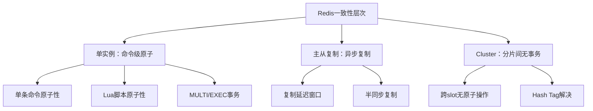
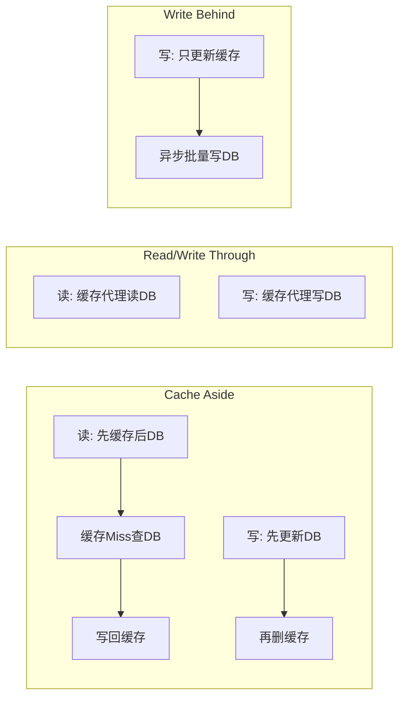
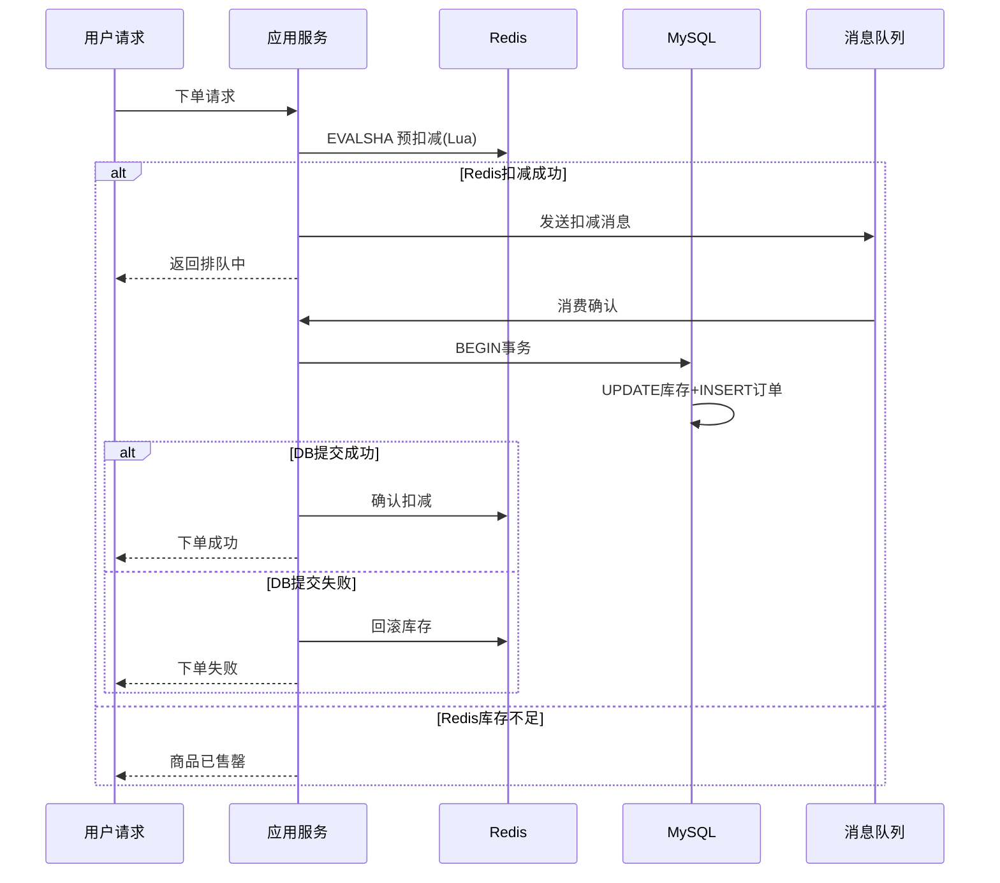
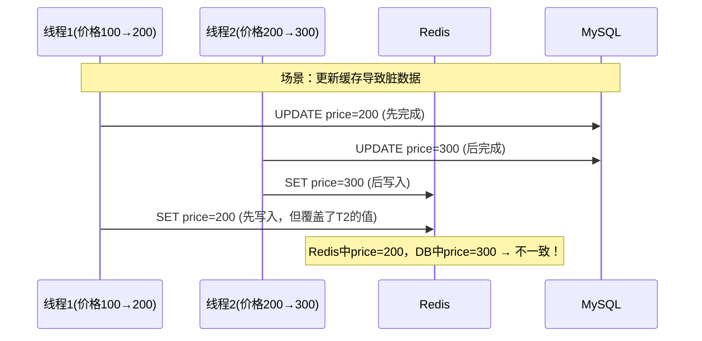
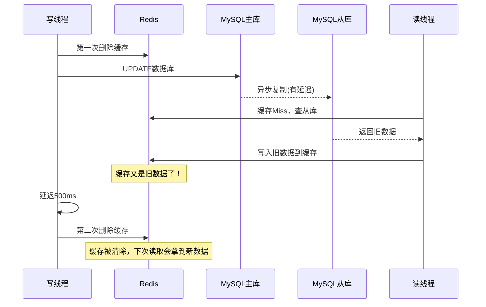
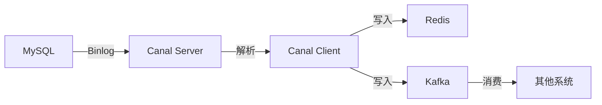
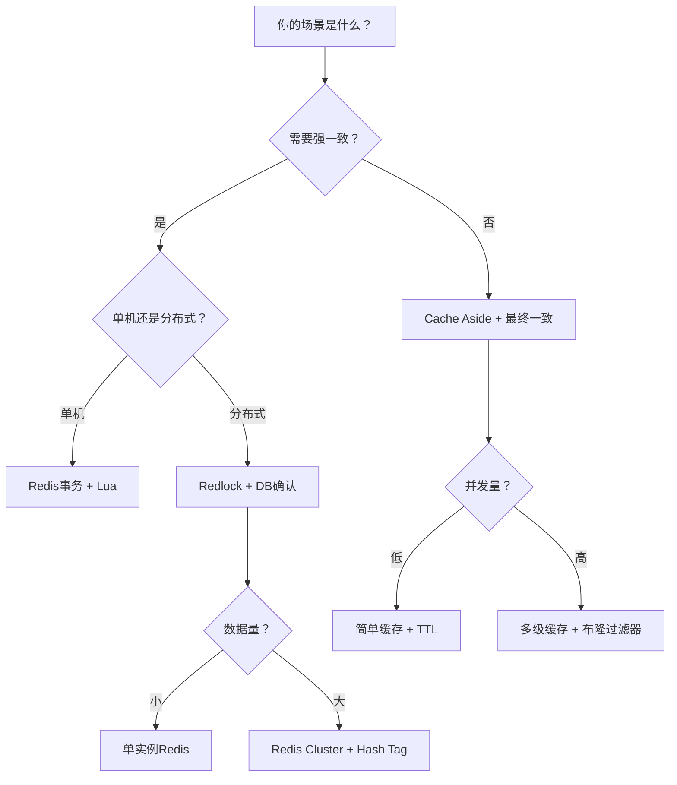

## 案例二：Redis实战——电商库存扣减与缓存一致性

### 1. 案例背景

#### 1.1 业务场景

某中型电商平台日活用户500万，核心商品库存管理采用MySQL + Redis双层架构。日常运营中，库存数据在缓存与数据库之间的一致性问题反复出现，尤其在大促期间（双11、618），库存超卖和缓存不一致导致的客诉量占总工单的35%。

**典型问题清单：**

| 问题编号 | 问题描述 | 发生频率 | 业务影响 |
|----------|----------|----------|----------|
| P-001 | 缓存中库存为正数，实际已售罄 | 日均12次 | 超卖导致赔付 |
| P-002 | 商品上架后缓存仍返回旧数据 | 日均5次 | 用户看不到新商品 |
| P-003 | 大促秒杀瞬间缓存击穿 | 大促必现 | 数据库雪崩 |
| P-004 | Redis主从切换后数据不一致 | 月均1次 | 库存数字混乱 |
| P-005 | 并发扣减导致超卖 | 高峰期频发 | 资损+客诉 |

#### 1.2 技术栈现状

┌─────────────┐     ┌─────────────┐     ┌─────────────┐
│   应用层     │────▶│   Redis     │────▶│   MySQL     │
│  (Java/Go)  │     │  (Cluster)  │     │  (主从)     │
└─────────────┘     └─────────────┘     └─────────────┘
      │                    │                    │
      │              Sentinel哨兵          Binlog同步
      │                    │                    │
      └────────────────────┴────────────────────┘
                    一致性问题根源

**现有架构的问题：**
- 应用层直接操作Redis和MySQL，缺乏统一的缓存更新策略
- Redis使用3主3从Cluster模式，但主从延迟未被纳入一致性设计
- 没有分布式锁机制，并发库存扣减依赖数据库行锁
- 缓存失效策略简单（固定TTL），无法应对热点数据突发访问

#### 1.3 改造目标

- 库存超卖率降至0
- 缓存与数据库数据延迟控制在500ms以内
- 大促期间QPS支撑从5000提升到50000
- Redis主从切换时数据不一致窗口控制在2秒以内

---

### 2. 核心知识点

在深入实战之前，必须理解Redis在数据一致性领域的核心机制。

#### 2.1 Redis内存模型与一致性边界

Redis是单线程命令执行模型（6.0+引入多线程IO但命令执行仍为单线程），这意味着单个Redis实例内的命令是原子的。但一旦涉及多实例、主从复制、集群分片，一致性边界就被打破了。



**关键认知：Redis的"一致性"是指最终一致性，而非强一致性。** 它通过以下机制在性能和一致性之间做权衡：

| 机制 | 一致性保证 | 性能代价 | 适用场景 |
|------|-----------|----------|----------|
| 单命令原子 | 最强（单实例内） | 最低 | 基础数据操作 |
| Lua脚本 | 单实例内原子 | 低 | 复合操作原子性 |
| MULTI/EXEC | 单实例内事务 | 低 | 简单事务 |
| AOF everysec | 丢最多1秒数据 | 中 | 持久化需求 |
| WAIT命令 | 等待N个副本确认 | 高 | 关键写入确认 |
| Redlock | 分布式锁强一致 | 高 | 分布式互斥 |

#### 2.2 缓存与数据库一致性的三种模式



| 模式 | 读流程 | 写流程 | 一致性 | 复杂度 | 性能 |
|------|--------|--------|--------|--------|------|
| Cache Aside | 先查缓存，Miss查DB写缓存 | 先更新DB，再删缓存 | 最终一致 | 低 | 高 |
| Read Through | 缓存代理，自动回源 | 更新DB，同步/异步更新缓存 | 较强 | 中 | 中 |
| Write Through | 同Read Through | 缓存代理写入DB和缓存 | 强 | 中 | 中 |
| Write Behind | 同Read Through | 只写缓存，异步批量写DB | 弱 | 高 | 最高 |

**Cache Aside是业界最常用的模式，本案例采用此模式。**

#### 2.3 缓存三大经典问题

**缓存穿透（Cache Penetration）：** 查询不存在的数据，缓存永远Miss，每次请求都打到DB。

```python
# 穿透示例：查询不存在的商品ID
def get_product(product_id):
    data = redis.get(f"product:{product_id}")
    if data:
        return json.loads(data)
    # 缓存Miss，查DB
    data = db.query("SELECT * FROM products WHERE id = %s", product_id)
    if data:
        redis.setex(f"product:{product_id}", 3600, json.dumps(data))
    # 问题：如果data为None，下次请求还是会打到DB
    return data  # None
```

**解决方案：布隆过滤器 + 空值缓存。**

**缓存击穿（Cache Breakdown）：** 热点key过期瞬间，大量并发请求同时打到DB。

```python
# 击穿场景：热门商品缓存同时过期
# 100个并发请求同时发现缓存Miss
# 100个请求同时查DB → 数据库压力骤增
```

**解决方案：互斥锁 + 逻辑过期 + 永不过期。**

**缓存雪崩（Cache Avalanche）：** 大量key同时过期，或Redis实例宕机，请求全部打到DB。

```python
# 雪崩场景：批量导入的数据TTL相同
for product in products:
    redis.setex(f"product:{product.id}", 3600, json.dumps(product))
# 1小时后，所有缓存同时失效
```

**解决方案：TTL随机化 + 多级缓存 + 限流降级。**

---

### 3. 实战：库存扣减的一致性方案

#### 3.1 方案设计：Redis预扣减 + MySQL最终确认

这是电商秒杀场景的经典方案，核心思想是**用Redis做库存预扣减（高性能），用MySQL做最终确认（强一致）**。



#### 3.2 Redis库存初始化

```bash
# 1. 创建库存Key（商品ID: 10086，初始库存: 5000）
redis-cli SET product:stock:10086 5000

# 2. 使用Hash存储多维度库存信息
redis-cli HSET product:info:10086 \
    stock 5000 \
    sold 0 \
    version 0 \
    status "on_sale"

# 3. 设置库存安全阈值（低于此值触发预警）
redis-cli SET product:safety:10086 100
```

#### 3.3 Lua脚本：原子库存扣减

Redis的Lua脚本执行是原子的，这是实现库存扣减一致性的关键。

```lua
-- deduct_stock.lua
-- KEYS[1]: 库存Key (product:stock:{id})
-- KEYS[2]: 已售Key (product:sold:{id})
-- ARGV[1]: 扣减数量
-- ARGV[2]: 商品ID
-- ARGV[3]: 订单ID
-- ARGV[4]: 请求时间戳

-- 获取当前库存
local stock = tonumber(redis.call('GET', KEYS[1]) or '0')
local quantity = tonumber(ARGV[1])

-- 库存不足
if stock < quantity then
    return redis.error_reply('STOCK_INSUFFICIENT')
end

-- 扣减库存
local new_stock = stock - quantity
redis.call('SET', KEYS[1], new_stock)

-- 增加已售数量
redis.call('INCRBY', KEYS[2], quantity)

-- 记录扣减流水（用于对账和回滚）
local flow_key = 'product:flow:' .. ARGV[2]
redis.call('LPUSH', flow_key, 
    ARGV[3] .. ':' .. quantity .. ':' .. ARGV[4])

-- 流水记录保留最近1000条
redis.call('LTRIM', flow_key, 0, 999)

return new_stock
```

#### 3.4 Lua脚本：库存回滚

```lua
-- rollback_stock.lua
-- KEYS[1]: 库存Key
-- KEYS[2]: 已售Key
-- ARGV[1]: 回滚数量
-- ARGV[2]: 商品ID
-- ARGV[3]: 订单ID

local stock = tonumber(redis.call('GET', KEYS[1]) or '0')
local sold = tonumber(redis.call('GET', KEYS[2]) or '0')
local quantity = tonumber(ARGV[1])

-- 防止回滚后库存异常（兜底校验）
if stock + quantity > 10000 then
    return redis.error_reply('ROLLBACK_EXCEED')
end

-- 回滚库存
redis.call('INCRBY', KEYS[1], quantity)
redis.call('DECRBY', KEYS[2], quantity)

-- 记录回滚流水
local flow_key = 'product:flow:' .. ARGV[2]
redis.call('LPUSH', flow_key, 
    'ROLLBACK:' .. ARGV[3] .. ':' .. quantity)

return stock + quantity
```

#### 3.5 Lua脚本：带版本号的乐观扣减

防止并发场景下的脏读和重复扣减：

```lua
-- deduct_stock_optimistic.lua
-- 带版本号的乐观锁扣减
-- KEYS[1]: 库存信息Hash (product:info:{id})
-- ARGV[1]: 扣减数量
-- ARGV[2]: 当前版本号
-- ARGV[3}: 订单ID

local key = KEYS[1]
local quantity = tonumber(ARGV[1])
local client_version = tonumber(ARGV[2])

-- 获取当前库存和版本
local stock = tonumber(redis.call('HGET', key, 'stock') or '0')
local server_version = tonumber(redis.call('HGET', key, 'version') or '0')

-- 版本号校验（乐观锁）
if client_version ~= server_version then
    return redis.error_reply('VERSION_CONFLICT')
end

-- 库存校验
if stock < quantity then
    return redis.error_reply('STOCK_INSUFFICIENT')
end

-- 执行扣减（原子更新库存+版本号）
redis.call('HSET', key, 
    'stock', stock - quantity,
    'sold', tonumber(redis.call('HGET', key, 'sold') or '0') + quantity,
    'version', server_version + 1)

-- 记录流水
local flow_key = 'product:flow:' .. ARGV[3]
redis.call('LPUSH', flow_key, ARGV[3] .. ':' .. quantity .. ':' .. (server_version + 1))

return stock - quantity
```

#### 3.6 Java应用层完整实现

```java
@Component
public class InventoryService {
    
    @Autowired
    private StringRedisTemplate redisTemplate;
    
    @Autowired
    private JdbcTemplate jdbcTemplate;
    
    // Lua脚本加载（应用启动时加载一次）
    private final ScriptSha1 deductScript;
    private final ScriptSha1 rollbackScript;
    
    public InventoryService() {
        this.deductScript = loadScript("deduct_stock.lua");
        this.rollbackScript = loadScript("rollback_stock.lua");
    }
    
    /**
     * 库存预扣减（Redis层）
     * 返回true表示Redis层扣减成功，需要后续DB确认
     */
    public boolean preDeductStock(Long productId, String orderId, int quantity) {
        String stockKey = "product:stock:" + productId;
        String soldKey = "product:sold:" + productId;
        
        try {
            Long remaining = redisTemplate.execute(
                deductScript,
                List.of(stockKey, soldKey),
                String.valueOf(quantity),
                String.valueOf(productId),
                orderId,
                String.valueOf(System.currentTimeMillis())
            );
            return remaining != null &amp;&amp; remaining >= 0;
        } catch (Exception e) {
            if ("STOCK_INSUFFICIENT".equals(e.getMessage())) {
                return false;
            }
            throw e;
        }
    }
    
    /**
     * 库存回滚（Redis层）
     * 当DB扣减失败时调用
     */
    public void rollbackStock(Long productId, String orderId, int quantity) {
        String stockKey = "product:stock:" + productId;
        String soldKey = "product:sold:" + productId;
        
        redisTemplate.execute(
            rollbackScript,
            List.of(stockKey, soldKey),
            String.valueOf(quantity),
            String.valueOf(productId),
            orderId
        );
    }
    
    /**
     * DB层最终确认扣减
     * 使用数据库事务保证原子性
     */
    @Transactional(rollbackFor = Exception.class)
    public boolean confirmDeduct(Long productId, String orderId, int quantity) {
        // 1. 检查订单是否已处理（幂等性）
        int existCount = jdbcTemplate.queryForObject(
            "SELECT COUNT(*) FROM orders WHERE order_id = ?",
            Integer.class, orderId
        );
        if (existCount > 0) {
            return true; // 已处理，幂等返回
        }
        
        // 2. 扣减数据库库存（带行锁）
        int updated = jdbcTemplate.update(
            "UPDATE products SET stock = stock - ? WHERE id = ? AND stock >= ?",
            quantity, productId, quantity
        );
        if (updated == 0) {
            throw new RuntimeException("数据库库存不足");
        }
        
        // 3. 创建订单记录
        jdbcTemplate.update(
            "INSERT INTO orders (order_id, product_id, quantity, status, created_at) "
            + "VALUES (?, ?, ?, 'CONFIRMED', NOW())",
            orderId, productId, quantity
        );
        
        return true;
    }
    
    /**
     * 完整的下单流程
     */
    public OrderResult placeOrder(Long productId, String orderId, int quantity) {
        // 第一步：Redis预扣减
        boolean preDeducted = preDeductStock(productId, orderId, quantity);
        if (!preDeducted) {
            return OrderResult.fail("库存不足");
        }
        
        try {
            // 第二步：DB确认
            boolean confirmed = confirmDeduct(productId, orderId, quantity);
            if (!confirmed) {
                rollbackStock(productId, orderId, quantity);
                return OrderResult.fail("下单失败");
            }
            return OrderResult.success(orderId);
            
        } catch (Exception e) {
            // DB失败，回滚Redis
            rollbackStock(productId, orderId, quantity);
            return OrderResult.fail("系统异常");
        }
    }
}
```

---

### 4. 缓存与数据库一致性方案

#### 4.1 Cache Aside模式：先更新DB，再删缓存

为什么是"删缓存"而不是"更新缓存"？因为更新缓存在并发场景下会导致脏数据：



```java
/**
 * Cache Aside模式实现
 * 先更新DB，再删缓存
 */
public void updateProductPrice(Long productId, BigDecimal newPrice) {
    // 1. 先更新数据库
    jdbcTemplate.update(
        "UPDATE products SET price = ? WHERE id = ?",
        newPrice, productId
    );
    
    // 2. 再删除缓存（而不是更新缓存）
    String cacheKey = "product:" + productId;
    redisTemplate.delete(cacheKey);
    
    // 3. 可选：延迟双删（应对主从延迟）
    scheduleDoubleDelete(cacheKey, 500); // 延迟500ms再删一次
}
```

#### 4.2 延迟双删策略

解决MySQL主从延迟导致的缓存不一致问题：



```java
/**
 * 延迟双删实现
 */
public void updateWithDoubleDelete(Long productId, String newValue) {
    // 1. 更新DB前删除缓存
    redisTemplate.delete("product:" + productId);
    
    // 2. 更新数据库
    jdbcTemplate.update("UPDATE products SET value = ? WHERE id = ?", newValue, productId);
    
    // 3. 延迟500ms后再次删除缓存
    scheduler.schedule(() -> {
        redisTemplate.delete("product:" + productId);
    }, 500, TimeUnit.MILLISECONDS);
}
```

#### 4.3 基于Binlog的缓存同步（Canal方案）

更可靠的方案是监听MySQL的binlog，异步更新缓存：



```java
/**
 * Canal监听器：MySQL binlog → Redis缓存同步
 */
@Component
public class CanalRedisSyncListener {
    
    @Autowired
    private StringRedisTemplate redisTemplate;
    
    @CanalEventListener
    public class ProductEventListener {
        
        @ListenPoint(destination = "product_db", 
                     schema = "ecommerce", 
                     table = "products")
        public void onProductChange(CanalEntry.RowData rowData) {
            // 获取变更后的数据
            Map<String, String> afterColumns = rowData.getAfterColumnsList()
                .stream()
                .collect(Collectors.toMap(
                    CanalEntry.Column::getName, 
                    CanalEntry.Column::getValue
                ));
            
            String productId = afterColumns.get("id");
            String cacheKey = "product:" + productId;
            
            // 删除缓存（而不是更新，让下次读取时自动回源）
            redisTemplate.delete(cacheKey);
            
            // 同时删除关联的缓存Key
            redisTemplate.delete("product:stock:" + productId);
            redisTemplate.delete("product:info:" + productId);
            
            log.info("Cache invalidated for product: {}", productId);
        }
    }
}
```

**Canal方案的优势：**
- 与业务代码解耦，不侵入原有逻辑
- 保证数据库更新后一定触发缓存失效
- 支持多消费者（Redis、ES、搜索引擎等）
- 可重放，故障恢复后能追数据

---

### 5. 分布式锁：防止并发超卖

#### 5.1 Redis分布式锁的基本实现

```lua
-- acquire_lock.lua
-- 获取分布式锁
-- KEYS[1]: 锁的Key
-- ARGV[1]: 锁的值（唯一标识，防止误删）
-- ARGV[2]: 过期时间（秒）

local key = KEYS[1]
local value = ARGV[1]
local expire = tonumber(ARGV[2])

-- SET NX EX 原子操作：不存在才设置，同时设置过期时间
local result = redis.call('SET', key, value, 'NX', 'EX', expire)
return result
```

```lua
-- release_lock.lua
-- 释放分布式锁（必须用Lua保证原子性）
-- KEYS[1]: 锁的Key
-- ARGV[1]: 锁的值（验证是否是自己的锁）

local key = KEYS[1]
local value = ARGV[1]

-- 先比较值，再删除（原子操作）
if redis.call('GET', key) == value then
    return redis.call('DEL', key)
else
    return 0
end
```

```java
/**
 * Redis分布式锁完整实现
 */
@Component
public class RedisDistributedLock {
    
    private static final String LOCK_PREFIX = "lock:";
    private static final long DEFAULT_EXPIRE = 30; // 30秒
    
    private final StringRedisTemplate redisTemplate;
    private final ThreadLocal<String> lockValue = new ThreadLocal<>();
    
    /**
     * 获取锁
     * @param lockKey 锁的标识
     * @param timeout 等待超时时间（毫秒）
     * @return 是否获取成功
     */
    public boolean tryLock(String lockKey, long timeout) {
        String value = UUID.randomUUID().toString();
        long deadline = System.currentTimeMillis() + timeout;
        
        while (System.currentTimeMillis() < deadline) {
            Boolean acquired = redisTemplate.execute(
                acquireScript,
                List.of(LOCK_PREFIX + lockKey),
                value,
                String.valueOf(DEFAULT_EXPIRE)
            );
            
            if (Boolean.TRUE.equals(acquired)) {
                lockValue.set(value);
                return true;
            }
            
            // 获取失败，短暂等待后重试
            try {
                Thread.sleep(10);
            } catch (InterruptedException e) {
                Thread.currentThread().interrupt();
                return false;
            }
        }
        return false;
    }
    
    /**
     * 释放锁
     */
    public void unlock(String lockKey) {
        String value = lockValue.get();
        if (value != null) {
            redisTemplate.execute(
                releaseScript,
                List.of(LOCK_PREFIX + lockKey),
                value
            );
            lockValue.remove();
        }
    }
    
    /**
     * 使用示例：库存扣减加锁
     */
    public boolean deductWithLock(Long productId, String orderId, int quantity) {
        String lockKey = "inventory:" + productId;
        if (!tryLock(lockKey, 5000)) { // 最多等5秒
            throw new RuntimeException("获取锁超时");
        }
        try {
            return inventoryService.placeOrder(productId, orderId, quantity);
        } finally {
            unlock(lockKey);
        }
    }
}
```

#### 5.2 Redlock：多节点分布式锁

当需要跨Redis实例的强一致锁时，使用Redlock算法：

```java
/**
 * Redlock实现（使用Redisson）
 */
@Service
public class RedLockService {
    
    @Autowired
    private RedissonClient redissonClient;
    
    /**
     * 使用Redlock获取分布式锁
     * Redisson自动实现了Redlock算法
     */
    public boolean deductWithRedLock(Long productId, String orderId, int quantity) {
        String lockKey = "redlock:inventory:" + productId;
        RLock lock = redissonClient.getLock(lockKey);
        
        try {
            // 尝试获取锁：等待0秒，持有30秒，自动续期
            boolean acquired = lock.tryLock(0, 30, TimeUnit.SECONDS);
            if (!acquired) {
                return false;
            }
            
            // 执行库存扣减
            return inventoryService.placeOrder(productId, orderId, quantity);
            
        } catch (InterruptedException e) {
            Thread.currentThread().interrupt();
            return false;
        } finally {
            if (lock.isHeldByCurrentThread()) {
                lock.unlock();
            }
        }
    }
}
```

---

### 6. 缓存穿透与击穿的实战解决方案

#### 6.1 布隆过滤器防穿透

```java
/**
 * 基于Redis的布隆过滤器实现
 * 防止查询不存在的数据导致缓存穿透
 */
@Component
public class BloomFilterService {
    
    private RBloomFilter<String> productBloomFilter;
    
    @PostConstruct
    public void init() {
        // 初始化布隆过滤器：100万商品，误判率0.01%
        productBloomFilter = redissonClient.getBloomFilter("product:filter");
        productBloomFilter.tryInit(1000000L, 0.0001);
        
        // 预热：加载所有商品ID到布隆过滤器
        List<Long> allProductIds = jdbcTemplate.queryForList(
            "SELECT id FROM products", Long.class
        );
        allProductIds.forEach(id -> 
            productBloomFilter.add("product:" + id)
        );
    }
    
    /**
     * 查询商品（带布隆过滤器）
     */
    public Product getProduct(Long productId) {
        String key = "product:" + productId;
        
        // 第一层：布隆过滤器判断key是否可能存在
        if (!productBloomFilter.contains(key)) {
            return null; // 一定不存在，直接返回
        }
        
        // 第二层：查Redis缓存
        String cached = redisTemplate.opsForValue().get(key);
        if (cached != null) {
            return JSON.parseObject(cached, Product.class);
        }
        
        // 第三层：查MySQL
        Product product = jdbcTemplate.queryForObject(
            "SELECT * FROM products WHERE id = ?",
            new ProductRowMapper(), productId
        );
        
        if (product != null) {
            // 存入缓存
            redisTemplate.opsForValue().set(
                key, JSON.toJSONString(product), 
                1, TimeUnit.HOURS
            );
        } else {
            // 不存在，缓存空值（短TTL防穿透）
            redisTemplate.opsForValue().set(
                key, "", 
                5, TimeUnit.MINUTES
            );
        }
        
        return product;
    }
}
```

#### 6.2 互斥锁防击穿

```java
/**
 * 热点Key防击穿：互斥锁 + 逻辑过期
 */
@Component
public class CacheBreakdownGuard {
    
    /**
     * 带互斥锁的缓存读取
     * 当缓存Miss时，只允许一个线程回源，其他线程等待
     */
    public Product getProductWithMutex(Long productId) {
        String key = "product:" + productId;
        
        // 1. 读缓存
        String cached = redisTemplate.opsForValue().get(key);
        if (cached != null) {
            return JSON.parseObject(cached, Product.class);
        }
        
        // 2. 缓存Miss，尝试获取互斥锁
        String lockKey = "lock:product:" + productId;
        boolean locked = redisTemplate.opsForValue()
            .setIfAbsent(lockKey, "1", 10, TimeUnit.SECONDS);
        
        if (locked) {
            try {
                // 双重检查：获取锁后再次检查缓存
                cached = redisTemplate.opsForValue().get(key);
                if (cached != null) {
                    return JSON.parseObject(cached, Product.class);
                }
                
                // 3. 回源查DB
                Product product = jdbcTemplate.queryForObject(
                    "SELECT * FROM products WHERE id = ?",
                    new ProductRowMapper(), productId
                );
                
                if (product != null) {
                    // 写入缓存（带随机TTL防雪崩）
                    int ttl = 3600 + ThreadLocalRandom.current().nextInt(600);
                    redisTemplate.opsForValue().set(
                        key, JSON.toJSONString(product),
                        ttl, TimeUnit.SECONDS
                    );
                }
                
                return product;
                
            } finally {
                redisTemplate.delete(lockKey);
            }
        } else {
            // 未获取到锁，等待后重试
            try {
                Thread.sleep(50);
            } catch (InterruptedException e) {
                Thread.currentThread().interrupt();
            }
            return getProductWithMutex(productId); // 递归重试
        }
    }
}
```

#### 6.3 多级缓存防雪崩

```java
/**
 * 三级缓存架构：本地缓存 + Redis + DB
 * 解决缓存雪崩问题
 */
@Component
public class MultiLevelCache {
    
    // L1: 本地缓存（Caffeine，JVM内）
    private final Cache<String, Object> localCache = Caffeine.newBuilder()
        .maximumSize(10000)
        .expireAfterWrite(30, TimeUnit.SECONDS)
        .build();
    
    // L2: Redis分布式缓存
    @Autowired
    private StringRedisTemplate redisTemplate;
    
    // L3: 数据库
    @Autowired
    private JdbcTemplate jdbcTemplate;
    
    /**
     * 三级缓存读取
     */
    public Product getProduct(Long productId) {
        String key = "product:" + productId;
        
        // L1: 本地缓存
        Product product = (Product) localCache.getIfPresent(key);
        if (product != null) {
            return product;
        }
        
        // L2: Redis缓存
        String cached = redisTemplate.opsForValue().get(key);
        if (cached != null &amp;&amp; !cached.isEmpty()) {
            product = JSON.parseObject(cached, Product.class);
            localCache.put(key, product); // 回填L1
            return product;
        }
        
        // L3: 数据库
        product = jdbcTemplate.queryForObject(
            "SELECT * FROM products WHERE id = ?",
            new ProductRowMapper(), productId
        );
        
        if (product != null) {
            // 写入Redis（带随机TTL）
            int ttl = 3600 + ThreadLocalRandom.current().nextInt(600);
            redisTemplate.opsForValue().set(
                key, JSON.toJSONString(product),
                ttl, TimeUnit.SECONDS
            );
            localCache.put(key, product); // 写入L1
        } else {
            // 空值缓存（防穿透）
            redisTemplate.opsForValue().set(key, "", 5, TimeUnit.MINUTES);
        }
        
        return product;
    }
    
    /**
     * 缓存失效时的主动刷新（Canal监听触发）
     */
    public void invalidateCache(Long productId) {
        String key = "product:" + productId;
        localCache.invalidate(key);
        redisTemplate.delete(key);
    }
}
```

---

### 7. 监控与运维

#### 7.1 Redis健康检查

```bash
# 查看Redis内存使用
redis-cli INFO memory | grep used_memory_human

# 查看连接数
redis-cli INFO clients | grep connected_clients

# 查看命中率
redis-cli INFO stats | grep -E "keyspace_hits|keyspace_misses"

# 计算命中率
python3 -c "
hits = $(redis-cli INFO stats | grep keyspace_hits | cut -d: -f2 | tr -d '\r')
misses = $(redis-cli INFO stats | grep keyspace_misses | cut -d: -f2 | tr -d '\r')
total = hits + misses
rate = hits / total * 100 if total > 0 else 0
print(f'缓存命中率: {rate:.2f}%')
print(f'总请求: {total}, 命中: {hits}, 未命中: {misses}')
"

# 查看慢查询日志
redis-cli SLOWLOG GET 10

# 查看Key过期策略
redis-cli INFO keyspace
```

#### 7.2 库存对账脚本

```python
#!/usr/bin/env python3
"""
库存对账脚本：定期检查Redis库存与MySQL库存是否一致
"""
import redis
import pymysql
import json
from datetime import datetime

# 配置
REDIS_CONFIG = {
    'host': 'localhost',
    'port': 6379,
    'db': 0,
    'password': 'your_password'
}

MYSQL_CONFIG = {
    'host': 'localhost',
    'port': 3306,
    'user': 'root',
    'password': 'your_password',
    'database': 'ecommerce'
}

def reconcile_inventory():
    """对账主流程"""
    r = redis.Redis(**REDIS_CONFIG)
    conn = pymysql.connect(**MYSQL_CONFIG)
    
    cursor = conn.cursor(pymysql.cursors.DictCursor)
    
    # 查询所有在售商品
    cursor.execute("SELECT id, stock FROM products WHERE status = 'on_sale'")
    db_products = {str(row['id']): row['stock'] for row in cursor.fetchall()}
    
    inconsistencies = []
    
    for product_id, db_stock in db_products.items():
        redis_key = f"product:stock:{product_id}"
        redis_stock = r.get(redis_key)
        
        if redis_stock is None:
            inconsistencies.append({
                'product_id': product_id,
                'type': 'MISSING_IN_REDIS',
                'db_stock': db_stock,
                'redis_stock': None
            })
            continue
        
        redis_stock = int(redis_stock)
        
        # 允许一定的误差范围（预扣减中）
        if abs(redis_stock - db_stock) > 10:
            inconsistencies.append({
                'product_id': product_id,
                'type': 'STOCK_MISMATCH',
                'db_stock': db_stock,
                'redis_stock': redis_stock,
                'diff': db_stock - redis_stock
            })
    
    # 输出对账结果
    timestamp = datetime.now().strftime('%Y-%m-%d %H:%M:%S')
    
    if inconsistencies:
        print(f"[{timestamp}] 发现 {len(inconsistenties)} 个不一致:")
        for item in inconsistencies:
            print(f"  商品 {item['product_id']}: {item['type']} "
                  f"(DB={item['db_stock']}, Redis={item['redis_stock']})")
        
        # 自动修复：用DB数据覆盖Redis
        for item in inconsistencies:
            if item['type'] == 'MISSING_IN_REDIS':
                r.set(f"product:stock:{item['product_id']}", item['db_stock'])
                print(f"  已修复: 商品 {item['product_id']} Redis库存已同步")
            elif item['type'] == 'STOCK_MISMATCH':
                # 记录差异日志，不自动修复（可能有预扣减在进行）
                log_inconsistency(item)
    else:
        print(f"[{timestamp}] 对账通过，所有库存一致")
    
    cursor.close()
    conn.close()

def log_inconsistency(item):
    """记录不一致到日志文件"""
    with open('/var/log/inventory_reconciliation.log', 'a') as f:
        f.write(f"{datetime.now()} | {json.dumps(item)}\n")

if __name__ == '__main__':
    reconcile_inventory()
```

#### 7.3 告警规则配置

```yaml
# Prometheus告警规则
groups:
  - name: redis_inventory_alerts
    rules:
      # 缓存命中率低于80%
      - alert: RedisHitRateLow
        expr: |
          redis_keyspace_hits_total / 
          (redis_keyspace_hits_total + redis_keyspace_misses_total) < 0.8
        for: 5m
        labels:
          severity: warning
        annotations:
          summary: "Redis缓存命中率低于80%"
          
      # Redis内存使用超过80%
      - alert: RedisMemoryHigh
        expr: |
          redis_memory_used_bytes / redis_memory_max_bytes > 0.8
        for: 5m
        labels:
          severity: critical
        annotations:
          summary: "Redis内存使用超过80%"
          
      # Redis主从延迟超过1秒
      - alert: RedisReplicationDelay
        expr: redis_master_repl_offset - redis_slave_repl_offset > 1048576
        for: 1m
        labels:
          severity: warning
        annotations:
          summary: "Redis主从复制延迟超过1MB"
          
      # 库存对账不一致
      - alert: InventoryInconsistency
        expr: inventory_reconciliation_inconsistent_count > 0
        for: 0m
        labels:
          severity: critical
        annotations:
          summary: "库存对账发现不一致数据"
```

---

### 8. 常见误区与最佳实践

#### 8.1 误区一：用UPDATE缓存代替DELETE缓存

```python
# 错误做法：更新缓存
def update_price_wrong(product_id, new_price):
    db.execute("UPDATE products SET price = %s WHERE id = %s", 
               (new_price, product_id))
    # 问题：并发写入时，两个线程的更新顺序可能乱序
    redis.set(f"product:{product_id}:price", new_price)

# 正确做法：删除缓存
def update_price_correct(product_id, new_price):
    db.execute("UPDATE products SET price = %s WHERE id = %s", 
               (new_price, product_id))
    # 删除缓存，让下次读取时自动回源
    redis.delete(f"product:{product_id}:price")
```

**原因：** 更新缓存在并发场景下，后写的值可能覆盖先写的值，导致缓存与DB不一致。删除缓存让读请求自动回源，避免了写入顺序问题。

#### 8.2 误区二：锁粒度过粗

```python
# 错误做法：整个商品加锁
lock_key = "lock:product"  # 所有商品共享一把锁
# 结果：所有商品的扣减操作串行执行，性能极差

# 正确做法：按商品ID加锁
lock_key = f"lock:product:{product_id}"  # 每个商品独立锁
# 结果：不同商品可以并行扣减
```

#### 8.3 误区三：锁没有设置过期时间

```python
# 错误做法：SET NX 无过期时间
redis.setnx("lock:inventory:123", "holder_1")
# 问题：如果持有者崩溃，锁永远不会释放

# 正确做法：SET NX EX（原子操作）
redis.set("lock:inventory:123", "holder_1", nx=True, ex=30)
```

#### 8.4 误区四：在锁内做耗时操作

```python
# 错误做法：锁内包含网络调用
def process_order():
    lock = acquire_lock("order_lock")
    try:
        # 这些操作很耗时，长时间占用锁
        send_email()           # 网络IO
        call_third_party_api() # 外部API
        update_inventory()     # 数据库操作
    finally:
        release_lock(lock)

# 正确做法：锁内只做最小必要操作
def process_order():
    lock = acquire_lock("order_lock")
    try:
        # 只在锁内做需要互斥的操作
        update_inventory()
    finally:
        release_lock(lock)
    # 耗时操作放在锁外
    send_email()
    call_third_party_api()
```

#### 8.5 误区五：忽略Redis主从延迟

```python
# 错误做法：写入后立即从从库读取
redis_master.set("product:123:price", 200)
# 主从同步有延迟（通常10ms-100ms）
price = redis_slave.get("product:123:price")  # 可能读到旧值

# 解决方案1：写入后强制读主库
redis_master.set("product:123:price", 200)
price = redis_master.get("product:123:price")  # 读主库

# 解决方案2：使用WAIT命令等待同步完成
redis_master.set("product:123:price", 200)
redis_master.wait(1, 5000)  # 等待1个副本确认，超时5秒
```

#### 8.6 最佳实践清单

| 类别 | 实践 | 说明 |
|------|------|------|
| 缓存策略 | 使用Cache Aside | 先更新DB，再删缓存 |
| 缓存策略 | TTL随机化 | 防止缓存雪崩，TTL = 基础值 + random(0, 600) |
| 缓存策略 | 空值缓存 | 防止缓存穿透，TTL设短（5分钟） |
| 缓存策略 | 布隆过滤器 | 高并发场景下防穿透的首选 |
| 并发控制 | 细粒度锁 | 按商品ID加锁，不要全局锁 |
| 并发控制 | 锁设过期时间 | SET NX EX，防止死锁 |
| 并发控制 | 锁内最小化 | 锁内只做互斥操作，其他放锁外 |
| 数据一致性 | 延迟双删 | 应对主从延迟的兜底方案 |
| 数据一致性 | Binlog同步 | Canal监听binlog更新缓存，解耦可靠 |
| 数据一致性 | Lua脚本 | 保证复合操作原子性 |
| 运维监控 | 缓存命中率 | 低于80%告警 |
| 运维监控 | 库存对账 | 每小时自动对账，发现不一致自动修复 |
| 运维监控 | 主从延迟 | 超过1秒告警 |

---

### 9. 性能优化进阶

#### 9.1 Pipeline批量操作

减少网络往返，提升批量操作性能：

```java
/**
 * 使用Pipeline批量初始化库存
 */
public void batchInitInventory(List<Product> products) {
    redisTemplate.executePipelined(new SessionCallback<Void>() {
        @Override
        @SuppressWarnings("unchecked")
        public Void execute(@NonNull RedisOperations operations) {
            for (Product product : products) {
                String stockKey = "product:stock:" + product.getId();
                String infoKey = "product:info:" + product.getId();
                
                operations.opsForValue().set(stockKey, 
                    String.valueOf(product.getStock()));
                operations.opsForHash().putAll(infoKey, Map.of(
                    "name", product.getName(),
                    "price", product.getPrice().toString(),
                    "stock", String.valueOf(product.getStock()),
                    "version", "0"
                ));
                // 随机TTL防雪崩
                int ttl = 3600 + ThreadLocalRandom.current().nextInt(600);
                operations.expire(stockKey, ttl, TimeUnit.SECONDS);
                operations.expire(infoKey, ttl, TimeUnit.SECONDS);
            }
            return null;
        }
    });
}
```

#### 9.2 Lua脚本热更新

```bash
# 加载新的Lua脚本
redis-cli SCRIPT LOAD "$(cat deduct_stock_v2.lua)"
# 返回SHA1: a1b2c3d4e5f6...

# 执行脚本
redis-cli EVALSHA a1b2c3d4e5f6... 2 product:stock:10086 product:sold:10086 1 10086 order_123

# 检查脚本是否存在
redis-cli SCRIPT EXISTS a1b2c3d4e5f6...
```

#### 9.3 Redis Cluster优化

```bash
# 查看集群状态
redis-cli CLUSTER INFO
redis-cli CLUSTER NODES

# 使用Hash Tag确保相关Key在同一Slot
# product:stock:{10086} 和 product:sold:{10086} 在同一Slot
redis-cli SET product:stock:{10086} 5000
redis-cli SET product:sold:{10086} 0

# 批量操作时使用MGET（注意：不同Slot会报错）
redis-cli MGET product:stock:{10086} product:sold:{10086}
```

---

### 10. 本案例小结

#### 10.1 核心要点回顾

1. **Redis一致性是最终一致性**：单实例内命令原子，但主从复制、集群分片会引入不一致窗口
2. **Cache Aside是最优解**：先更新DB，再删缓存，简单可靠
3. **Lua脚本保证原子性**：库存扣减必须用Lua脚本，不能分多条命令
4. **分布式锁防并发**：使用SET NX EX，锁粒度要细，过期时间要设
5. **多级缓存防雪崩**：本地缓存 + Redis + DB，TTL随机化
6. **监控对账不可少**：定期对账，自动修复不一致

#### 10.2 方案选型指南



#### 10.3 扩展阅读

- Redis官方文档：https://redis.io/docs/
- Redisson分布式锁实现：https://github.com/redisson/redisson
- Canal MySQL binlog解析：https://github.com/alibaba/canal
- 《Redis设计与实现》—— 黄健宏
- 《数据密集型应用系统设计》—— Martin Kleppmann
