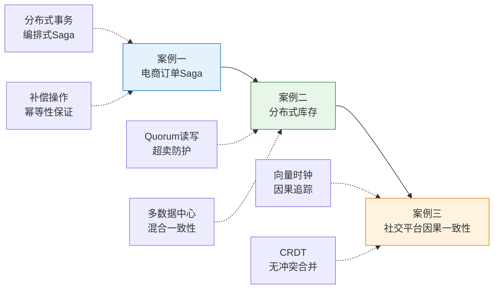

# 实战案例：从理论到工程的完整闭环

***

## 本节定位

实战案例是将前面两节——理论基础和核心技巧——从"理解"推向"能做"的关键桥梁。理论给出了"为什么"，技巧给出了"怎么做"，而案例则回答"在真实场景中，这些方案是如何被组合、权衡和落地的"。

这一节设计了三个渐进式案例，覆盖分布式数据一致性的三个核心维度：

| 案例 | 核心场景 | 涉及技术 | 难度 | 建议阅读时间 |
|------|----------|----------|------|-------------|
| 案例一 | 电商订单系统从2PC迁移到Saga | 编排式Saga、补偿幂等性、语义锁 | ★★★ | 45分钟 |
| 案例二 | 分布式库存一致性保障 | Quorum读写、多数据中心同步、超卖防护 | ★★★ | 45分钟 |
| 案例三 | 社交平台因果一致性实现 | 向量时钟、CRDT（OR-Set）、按需同步 | ★★★★ | 60分钟 |

***

## 案例设计原则

每个案例都遵循相同的分析框架，确保读者不仅能理解具体方案，还能掌握通用的分析方法：

**1. 场景还原**：从真实业务需求出发，描述问题的规模、约束和业务影响。不回避复杂性，让读者感受到"这就是我工作中遇到的问题"。

**2. 方案演进**：不直接给出最优解，而是展示从简单方案到最终方案的演进过程。每一步都解释"为什么当前方案不够好"，让读者理解权衡的思考路径。

**3. 代码实现**：提供可运行的、带注释的代码示例。代码不是伪代码，而是真实可部署的实现片段，包含错误处理、日志记录和监控埋点。

**4. 数据验证**：用具体数据说明方案的效果——延迟、吞吐量、一致性窗口、故障恢复时间等。没有数据支撑的方案是空谈。

**5. 复盘反思**：总结每个案例的关键决策点、潜在风险和适用边界，帮助读者在面对类似场景时做出判断。

***

## 案例与理论的映射关系

在阅读案例之前，建议回顾以下理论知识，它们是理解案例方案的基础：

| 理论概念 | 对应章节 | 在案例中的应用 |
|---------|---------|---------------|
| 线性一致性 | 50.1 一致性模型 | 案例二中库存扣减的强一致需求 |
| 最终一致性 | 50.1 一致性模型 | 案例一中订单状态的最终收敛 |
| 因果一致性 | 50.1 一致性模型 | 案例三中评论回复链的因果保证 |
| Saga模式（编排式） | 50.4 分布式事务 | 案例一的订单流转核心机制 |
| Saga补偿操作 | 50.9 Saga设计技巧 | 案例一的补偿幂等性设计 |
| 事务性发件箱 | 50.6 事件驱动一致性 | 案例一的双写问题解决 |
| 幂等性设计 | 50.7 幂等性与可调一致性 | 案例一、案例二的重复请求防护 |
| Quorum读写 | 50.7 可调一致性 | 案例二的库存一致性级别选择 |
| CRDT（OR-Set） | 50.3 无冲突复制数据类型 | 案例三的社交关系同步 |
| 向量时钟 | 50.3 CRDT配套工具 | 案例三的因果关系追踪 |

***

## 适合哪些读者

**有经验的工程师**：如果已经在工作中处理过分布式事务的一致性问题，可以直接跳到感兴趣的案例。每个案例都是独立的，不需要按顺序阅读。

**正在学习分布式系统的开发者**：建议按案例一→案例二→案例三的顺序阅读，难度递增，且前一个案例的概念会在后一个案例中被复用。

**架构师**：重点关注每个案例中的"架构决策点"和"权衡分析"部分，这些内容直接支撑架构层面的一致性选型。

***

## 案例中的代码约定

为了让代码示例保持一致性和可读性，本节遵循以下约定：

- **语言**：主要使用 Java（Spring Boot + Seata）和 Python（asyncio + aioredis），部分场景使用 Go
- **存储**：MySQL 8.0 作为主数据库，Redis 7.x 作为缓存和分布式锁，RabbitMQ 3.12 作为消息队列
- **框架**：Saga编排使用 Seata Saga 状态机，事务性发件箱使用 Debezium CDC
- **监控**：使用 Prometheus + Grafana 进行指标采集，Jaeger 进行分布式链路追踪
- **配置管理**：所有配置项均通过环境变量或配置中心注入，不硬编码在代码中

***

## 开始阅读

点击下方链接进入具体案例，每个案例预计需要 45-60 分钟完成阅读和实践。

- [案例一：电商订单系统从2PC迁移到Saga](01-案例一etcd实战.md) — 从2PC迁移到Saga的完整过程与性能收益
- [案例二：分布式库存一致性保障](02-案例二Redis实战.md) — 多数据中心混合一致性方案与超卖防护
- [案例三：社交平台因果一致性实现](03-案例三.md) — 向量时钟追踪因果关系与按需同步
