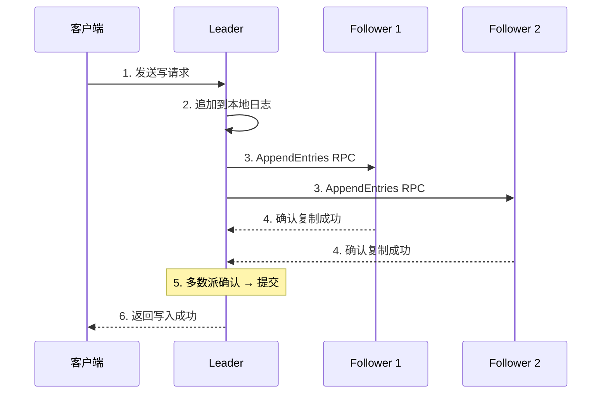
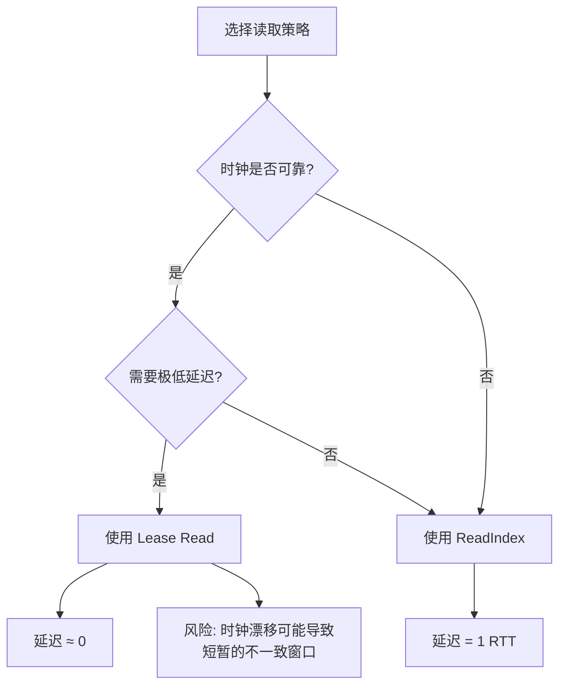
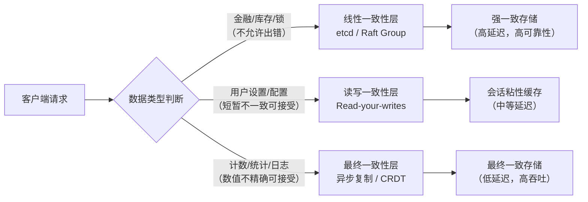
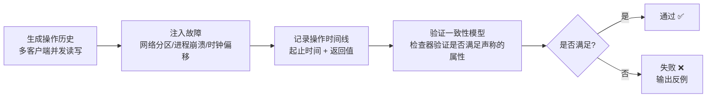
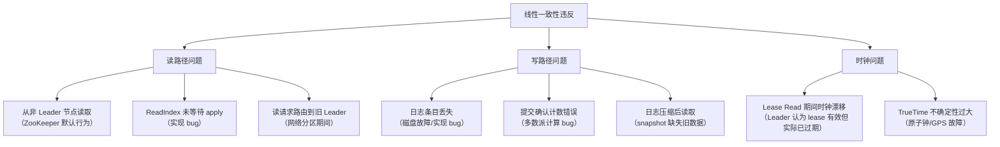

# 线性一致性（Linearizability）：从理论到工程实践

线性一致性是分布式系统中**最强的一致性模型**，也是对单机串行执行的最精确近似。理解线性一致性，是掌握所有分布式一致性问题的基石。

> **与理论基础的衔接**：本节假设你已了解一致性模型的层次体系（线性 → 顺序 → 因果 → 最终）以及 CAP/FLP 定理的基本结论（参见"理论基础"第 2 节）。如果你对线性一致性的形式化定义尚不熟悉，建议先阅读理论基础部分的 2.2 节"线性一致性（Linearizability）"，那里有完整的数学表述。本节将聚焦于工程实践中的实现机制、性能权衡、验证方法和常见陷阱。

---

## 1. 线性一致性的本质：一段话讲清楚

用一句话概括线性一致性：**整个分布式系统表现得就像只有一个副本，所有操作按某种全局顺序串行执行，并且这个顺序与真实时间一致**。

这意味着两件事：

- **串行化（Serialization）**：所有客户端看到的操作顺序完全相同，仿佛所有操作排成一条队逐个执行
- **实时性（Real-time order）**：如果操作 A 在操作 B 开始之前就完成了，那么在全局顺序中 A 必须排在 B 之前——不允许"时间旅行"

一个直觉：想象你在操作一个单机数据库，所有请求排队进入。线性一致性就是要让多机分布式系统的行为等价于这种单机串行执行。区别仅在于，实际的分布式系统通过网络通信，存在延迟和故障，所以实现这个等价性需要精巧的协议设计。

---

## 2. 实现线性一致性的核心机制

线性一致性不能"免费获得"——它需要特定的协议和算法支撑。以下是最主流的几种实现路径。

### 2.1 共识算法：Raft

Raft 是实现线性一致性最常用的共识算法，被 etcd、TiKV、CockroachDB 等系统采用。其核心思路是**所有写操作通过 Leader 节点复制到多数派节点**。

**写入流程（5 步）：**



1. 客户端发送写请求到 Leader
2. Leader 将操作追加到本地日志
3. Leader 并行发送 AppendEntries RPC 到所有 Follower
4. 当**多数节点（Quorum）**确认后，Leader 提交该操作
5. Leader 通知客户端写入成功

**读取流程（关键难点）：**

写入流程相对直观，但读取是真正考验功力的地方。Leader 读取时，必须确保读到的是**已提交的最新值**。有三种主流策略：

| 策略 | 原理 | 额外延迟 | 一致性保证 | 适用场景 |
|------|------|----------|-----------|---------|
| **ReadIndex** | Leader 记录当前 commitIndex，等待 apply 到状态机后读取 | 1 RTT（向 Follower 发心跳确认 Leader 身份） | ✅ 线性一致 | 通用场景，etcd 默认 |
| **Lease Read** | Leader 持有租约（基于时钟），租约期内直接读本地状态机 | 0 RTT（正常情况） | ✅ 线性一致（依赖时钟精度） | 低延迟要求、时钟可靠的环境 |
| **Raft Log Read** | 将读操作作为特殊日志条目走完整共识流程 | 1 RTT | ✅ 线性一致 | 对时钟完全不可信的环境 |

```python
# Raft ReadIndex 读取的完整实现（带错误处理）
class RaftNode:
    async def linearizable_read(self, key: str) -> Any:
        """使用 ReadIndex 实现线性一致性读"""
        # 1. 确认自己仍然是 Leader
        #    发送心跳到多数节点，如果多数节点响应则确认 Leader 身份
        if not await self.confirm_leadership():
            # 不是 Leader，转发到当前 Leader
            leader = await self.find_current_leader()
            if leader is None:
                raise ConsensusError("No leader available")
            return await leader.linearizable_read(key)
        
        # 2. 记录当前的 commitIndex（read_index）
        read_index = self.commit_index
        
        # 3. 等待状态机 apply 到 read_index
        #    这是保证线性一致性的关键：只有 apply 之后的值才能被读到
        try:
            await asyncio.wait_for(
                self.wait_applied(read_index),
                timeout=self.read_timeout
            )
        except asyncio.TimeoutError:
            raise ConsensusError(
                f"State machine apply timeout: "
                f"last_applied={self.last_applied}, target={read_index}"
            )
        
        # 4. 在本地状态机上读取
        return self.state_machine.get(key)
    
    async def confirm_leadership(self) -> bool:
        """通过心跳确认 Leader 身份（ReadIndex 的第一步）"""
        responses = await asyncio.gather(*[
            self.send_heartbeat(peer) 
            for peer in self.peers
        ], return_exceptions=True)
        
        # 需要多数节点响应（包括自己）
        success_count = sum(1 for r in responses if r is True) + 1
        return success_count > len(self.peers) // 2
    
    async def wait_applied(self, target_index: int):
        """等待状态机 apply 到目标索引"""
        while self.last_applied < target_index:
            await asyncio.sleep(0.01)
```

**三种策略的选型指南：**



### 2.2 共识算法：Multi-Paxos / EPaxos

Paxos 系列算法是 Raft 的理论基础，在工程上广泛用于 Google Spanner、CockroachDB 等系统。

**Google Spanner 的 TrueTime** 是里程碑式的工程实践。Spanner 通过 GPS 和原子钟实现了一个全局时间戳服务（TrueTime API），该 API 返回的不是一个精确时间点，而是一个**时间区间 [earliest, latest]**，反映了时钟的不确定性。Spanner 在提交事务时等待"时钟不确定性"消散（commit-wait），从而保证**外部一致性（External Consistency）**——比线性一致性更强的保证。

```python
# TrueTime 概念模拟（展示 Spanner 的核心思路）
class TrueTimeSimulator:
    """模拟 Google Spanner 的 TrueTime 服务"""
    
    def __init__(self, clock_uncertainty_ms: float = 10):
        """
        参数:
            clock_uncertainty_ms: 时钟不确定性（毫秒）
            Spanner 在 Google 数据中心中这个值通常 < 7ms
        """
        self.uncertainty = clock_uncertainty_ms / 1000.0
    
    def now(self) -> tuple:
        """返回时间区间 [earliest, latest]"""
        real_time = time.time()
        earliest = real_time - self.uncertainty
        latest = real_time + self.uncertainty
        return (earliest, latest)
    
    def wait_until_after(self, timestamp: float):
        """
        等待直到本地时钟超过给定时间戳 + 不确定性。
        这就是 Spanner 的 commit-wait 机制。
        """
        while True:
            earliest, latest = self.now()
            if latest > timestamp:
                break
            # 需要等待的时间 = timestamp - latest + 缓冲
            sleep_time = timestamp - latest + 0.001
            time.sleep(sleep_time)
    
    def timestamp(self) -> float:
        """分配一个线性递增的时间戳（用于事务排序）"""
        while True:
            (earliest, latest) = self.now()
            # 返回 latest 作为事务时间戳
            # commit-wait 保证：当前真实时间 > 任何已提交事务的时间戳
            return latest


class SpannerTransaction:
    """模拟 Spanner 事务的 commit-wait 流程"""
    
    def __init__(self, tt: TrueTimeSimulator):
        self.tt = tt
    
    def commit(self, write_timestamp: float):
        """
        提交流程：
        1. 选择 commit 时间戳 = TrueTime.now().latest
        2. 执行 commit-wait：等待直到 TrueTime.now().earliest > commit_timestamp
        3. 这保证了：如果事务 T1 在 T2 之前提交，
           那么 T1 的时间戳 < T2 的时间戳
        """
        # 等待时钟不确定性消散
        self.tt.wait_until_after(write_timestamp)
        # 此时可以安全地对外宣布事务提交
```

**TrueTime 的工程代价与权衡：**

| 方面 | 详情 |
|------|------|
| 硬件依赖 | 需要 GPS 接收器 + 铀原子钟（每个数据中心部署） |
| 不确定性范围 | Google 数据中心通常 < 7ms，自建环境可能 10-50ms |
| commit-wait 延迟 | 每次事务提交需要等待一个不确定性窗口 |
| 优势 | 可以在不走多数派确认的情况下确定全局事务顺序 |

### 2.3 ZooKeeper / etcd 的线性一致性实践

ZooKeeper 和 etcd 是分布式系统中最广泛使用的协调服务，它们默认提供线性一致性的写操作，但读操作的一致性级别需要特别注意。

**etcd（基于 Raft）：**

```go
// etcd 客户端线性一致性读取
import clientv3 "go.etcd.io/etcd/client/v3"

// 方式1：默认读（线性一致性，等同于 ReadIndex）
resp, _ := client.Get(ctx, "/key")
// etcd v3 默认使用 ReadIndex 保证线性一致性

// 方式2：可序列化读（更快，但可能不一致）
resp, _ := client.Get(ctx, "/key", clientv3.WithSerializable())
// 从任意节点读取，不走 Leader，适合对一致性要求不高的场景
// 风险：可能读到旧值
```

**ZooKeeper：**

```java
// ZooKeeper 默认读操作从任意 Follower 读取，不保证线性一致性！

// 正确做法：先 sync() 再读
zk.sync("/path");                    // 强制同步到 Leader
zk.getData("/path", null);           // 此时读取保证线性一致性

// 错误做法：
zk.getData("/path", null);           // 可能从 Follower 读到旧值！
```

**关键区别总结：**

| 系统 | 写一致性 | 默认读一致性 | 线性一致读的获取方式 |
|------|---------|------------|-------------------|
| etcd v3 | 线性一致（Raft 复制） | 线性一致（ReadIndex） | 默认即为线性一致 |
| ZooKeeper | 线性一致（ZAB 协议） | **非线性一致**（从任意节点读） | 调用 `sync()` 后读 |
| Redis（主从） | 异步复制，非线性一致 | 非线性一致（从从节点读） | 读主节点 + `WAIT` 命令 |

### 2.4 现代 NewSQL 数据库中的线性一致性

随着 NewSQL 数据库的成熟，线性一致性已不再是少数专家系统才有的特性。以下是主流 NewSQL 系统的支持情况：

| 数据库 | 底层协议 | 默认一致性 | 线性一致读实现 | 适用场景 |
|--------|---------|-----------|--------------|---------|
| **CockroachDB** | Raft | Serializable（比线性一致更强） | 默认即可 | 全球化部署，多活架构 |
| **TiDB** | Raft (TiKV) | Snapshot Isolation | `tidb_snapshot` 配置 | 国内大规模 OLTP |
| **YugabyteDB** | Raft | Serializable | 默认即可 | 跨云部署 |
| **Google Spanner** | Paxos + TrueTime | External Consistency | 默认即可 | 全球金融级 |
| **Aurora (MySQL)** | Quorum + WAL | 可配置 | 读写实例保证 | AWS 云原生 |

---

## 3. 线性一致性的工程代价

理解代价是做出正确设计决策的关键。线性一致性不是免费的午餐。

### 3.1 延迟代价

写操作通常需要至少一个**网络往返（RTT）**才能达成共识。在跨数据中心场景下，这个延迟可能非常显著：

| 部署架构 | 典型写延迟 | 典型读延迟（ReadIndex） | 典型读延迟（Lease Read） |
|---------|-----------|----------------------|------------------------|
| 同机房同城市 | 1-5 ms | 1-3 ms | < 1 ms |
| 同地域跨城市（<500km） | 5-20 ms | 3-10 ms | < 1 ms |
| 跨地域（跨洲） | 100-300 ms | 50-150 ms | < 1 ms（有时钟风险） |

### 3.2 吞吐量代价

由于所有写操作必须经过 Leader 并复制到多数派，系统的写吞吐量受限于：

- **单 Leader 瓶颈**：所有写操作都经过 Leader，Leader 的处理能力是上限
- **多数派确认开销**：写操作的延迟取决于最慢的多数派节点
- **跨节点网络带宽**：数据需要复制到多个节点

**工程优化手段：**

1. 批量写入（Batching）：将多个小写操作合并为一个大操作，摊薄共识开销
   - TiKV 的 Raft batching：等待一个 commit 间隔内的所有请求一起提交
   - 典型 batch 大小：100-1000 个操作，延迟增加 1-5ms，吞吐提升 5-10x

2. 流水线（Pipelining）：不要等前一个操作完全提交再发送下一个
   - Raft 日志条目可以乱序到达，只要保证提交顺序即可
   - 注意：流水线过深会增加内存压力

3. 多分片（Sharding）：将不同 key 分配到不同的 Raft Group
   - CockroachDB 的 Range 分片、TiKV 的 Region 分片
   - 每个分片独立的 Leader，水平扩展写吞吐

### 3.3 可用性代价（CAP 定理）

在发生网络分区时，Raft/Paxos 系统只能在**多数派分区**上继续服务：

- 5 节点集群，2 个节点被隔离 → 剩余 3 个节点**可以**继续服务
- 5 节点集群，3 个节点被隔离 → 剩余 2 个节点**拒绝所有写入**
- 这就是 CAP 定理中 CP 系统的行为：一致性优先，可用性在分区时被牺牲

### 3.4 什么时候不需要线性一致性

并非所有场景都需要线性一致性。在以下场景中，**放宽一致性要求可以获得显著的性能提升**：

| 场景 | 推荐一致性 | 原因 | 放宽后的性能收益 |
|------|-----------|------|----------------|
| 用户个人设置/偏好 | 最终一致性 | 最后一次更新胜出即可 | 延迟降低 50-90% |
| 浏览量/点赞数统计 | 最终一致性 | 数值短暂不准不影响体验 | 写吞吐提升 10-100x |
| 电商平台商品浏览 | 最终一致性 | 价格短暂不一致可接受 | 跨地域延迟消除 |
| 库存扣减 | 线性一致性 | 库存不能超卖 | — |
| 银行账户余额 | 线性一致性 | 余额不能出现负数或重复扣款 | — |
| 分布式锁 | 线性一致性 | 锁的获取必须互斥 | — |
| Leader 选举 | 线性一致性 | 同时存在两个 Leader 会导致脑裂 | — |

---

## 4. 分层一致性架构：工程中的最佳实践

在实际系统中，通常不需要对所有数据使用同一级别的一致性。**分层一致性架构**将数据按重要性分级处理。

### 4.1 架构设计



### 4.2 电商系统中的混合一致性方案

| 操作类型 | 一致性要求 | 实现方案 | 为什么不全用强一致 |
|---------|-----------|---------|------------------|
| 扣减库存 | 线性一致性 | Redis + Lua 原子操作 或 etcd 分布式锁 | 超卖直接影响营收 |
| 创建订单 | 线性一致性 | 数据库事务 + Raft 复制 | 订单状态必须正确 |
| 更新购物车 | 最终一致性 | CRDT 合并 | 多设备同步允许短暂不一致 |
| 商品浏览数 | 最终一致性 | 异步计数器 | 数字精确到个位没有业务意义 |
| 用户个性化推荐 | 最终一致性 | 离线计算 + 缓存推送 | 推荐结果本身就有延迟 |
| 支付状态 | 线性一致性 | 数据库事务 + 对账系统 | 资金安全零容忍 |

### 4.3 在非线性一致存储上构建线性一致性

有时你需要在不提供线性一致性的存储（如 Cassandra、DynamoDB）之上构建线性一致性操作。核心思路是**引入一个线性一致的协调层**。

**技巧一：基于 Fencing Token 的锁**

```python
class LinearizableOverEventuallyConsistent:
    """在最终一致性存储上实现线性一致性操作
    
    核心思路：
    - 写操作通过分布式锁（etcd/ZooKeeper）保证互斥
    - 读操作通过版本号校验保证读到最新值
    
    适用场景：
    - 已有 Cassandra/DynamoDB 作为主存储，需要在关键路径上保证线性一致性
    - 不想迁移到 NewSQL 的过渡方案
    """
    
    def __init__(self, kv_store, lock_service):
        self.kv_store = kv_store          # 最终一致性存储（如 Cassandra）
        self.lock_service = lock_service  # 线性一致性锁服务（如 etcd）
    
    async def linearizable_set(self, key: str, value: str):
        """通过分布式锁保证线性一致性写入"""
        lock_path = f"/lock/{key}"
        
        async with self.lock_service.lock(lock_path, ttl=10):
            # 获取锁后写入，同时记录版本号
            version_key = f"/version/{key}"
            
            # 原子操作：获取当前版本号并递增
            current_version = await self.lock_service.get(version_key) or 0
            new_version = current_version + 1
            
            # 写入存储（携带版本号）
            await self.kv_store.set(key, {
                "value": value,
                "version": new_version,
                "timestamp": time.time()
            })
            
            # 更新锁服务中的版本号（线性一致）
            await self.lock_service.put(version_key, str(new_version))
    
    async def linearizable_get(self, key: str, max_retries: int = 3):
        """通过版本号校验保证线性一致性读取"""
        for attempt in range(max_retries):
            # 从锁服务获取最新版本号（线性一致读）
            version_key = f"/version/{key}"
            expected_version = await self.lock_service.get(version_key)
            
            if expected_version is None:
                return None
            
            # 从存储读取（可能读到旧值）
            value = await self.kv_store.get(key)
            
            if value and value.get("version", 0) >= int(expected_version):
                return value["value"]
            
            # 版本不匹配，说明存储还没同步到最新值
            # 短暂等待后重试（最终一致性存储的传播延迟）
            await asyncio.sleep(0.01 * (attempt + 1))
        
        # 重试耗尽，降级处理（记录监控指标、告警）
        raise ConsistencyDegradedError(
            f"Linearizable read failed after {max_retries} retries: "
            f"key={key}, expected_version={expected_version}"
        )
```

**技巧二：使用事务性发件箱保证原子性**

```python
class OutboxBasedConsistency:
    """利用事务性发件箱在最终一致性系统上维护线性一致性视图
    
    适用场景：
    - 跨服务/跨数据库的转账操作
    - 需要保证原子性但无法使用 2PC 的场景
    """
    
    async def transfer(self, from_account: str, to_account: str, amount: int):
        """跨账户转账：写入发件箱 + 接收方消费后更新"""
        async with self.db.transaction():
            # 1. 在源账户扣除（同一事务写入发件箱）
            await self.db.execute(
                "UPDATE accounts SET balance = balance - %s WHERE id = %s",
                amount, from_account
            )
            
            # 2. 写入事务性发件箱
            await self.db.execute(
                "INSERT INTO outbox (event_type, payload, status) "
                "VALUES ('TransferDebit', %s, 'PENDING')",
                json.dumps({
                    "from": from_account,
                    "to": to_account,
                    "amount": amount,
                    "timestamp": time.time()
                })
            )
        # 事务提交后，中继进程将事件发送到消息队列
        # 目标账户服务消费事件，原子地增加余额
```

---

## 5. 线性一致性的验证与测试

线性一致性是一个**非平凡的属性**——开发者的直觉往往会出错。使用正确的验证工具至关重要。

### 5.1 Jepsen 测试框架

Jepsen 是分布式系统一致性验证的**黄金标准**，由 Kyle Kingsbury（Aphyr）创建。Jepsen 通过以下方式验证系统：



Jepsen 曾发现多个知名系统的线性一致性 bug：

| 系统 | 发现的问题 | 根因 | 修复方式 |
|------|-----------|------|---------|
| **MongoDB** | 默认配置下违反线性一致性 | 异步复制 + 默认 readConcern=local | 使用 journaled write concern + readConcern=majority |
| **Cassandra** | 部分配置下违反线性一致性 | 默认一致性级别为 ONE | 使用 QUORUM 读写 |
| **etcd v2** | 特定网络分区场景下违反线性一致性 | 并发读写时 Leader 判断逻辑缺陷 | 升级到 v3（完全重写了协议） |
| **Consul** | 特定版本的线性一致读存在 bug | ReadIndex 实现中 Leader 确认不完整 | 升级到修复版本 |

### 5.2 线性一致性检查器：Porcupine

**Porcupine** 是一个高效的线性一致性检查器，基于模型检验技术，可以自动验证一组操作历史是否满足线性一致性。

```python
# 使用 porcupine 检验线性一致性
from porcupine import check_linearizability

# 操作历史格式：(客户端编号, 操作类型, 关键字, 输入, 输出, 起始时间, 结束时间)
history = [
    (0, "invoke", "x", 1, None, 0, 0),      # C0 发起 write(x, 1)
    (1, "invoke", "x", None, None, 1, 1),    # C1 发起 read(x)
    (0, "ok", "x", 1, 1, 2, 2),              # C0 write(x, 1) 完成
    (1, "ok", "x", None, 0, 3, 3),           # C1 read(x) 返回 0 ← 违反线性一致性！
]

# 验证
result = check_linearizability(history)
# result 为 False，因为 C1 在 C0 写入完成后读到了旧值 0
```

**如何在生产中使用 Porcupine：**

```python
class ProductionLinearizabilityChecker:
    """生产环境中的线性一致性检查器"""
    
    def __init__(self, store, check_interval_seconds=60):
        self.store = store
        self.check_interval = check_interval_seconds
        self.history = []
    
    async def run_checker(self):
        """后台持续运行的检查器"""
        while True:
            # 1. 收集操作历史
            history = await self.collect_operations()
            
            # 2. 运行检查
            from porcupine import check_linearizability
            is_linearizable = check_linearizability(history)
            
            # 3. 记录结果
            if not is_linearizable:
                # 线性一致性违反！记录详细信息用于排查
                await self.record_violation(history)
                metrics.increment("linearizability_violations")
                
                # 输出导致违反的操作对
                counter_example = find_counter_example(history)
                logger.error(
                    f"Linearizability violation detected: {counter_example}"
                )
            
            # 4. 清理历史（避免内存无限增长）
            self.trim_history()
            
            await asyncio.sleep(self.check_interval)
    
    async def collect_operations(self) -> list:
        """收集最近的操作历史"""
        # 从分布式追踪系统或操作日志中收集
        return await self.tracing_client.get_recent_operations(
            service=self.store.service_name,
            window_seconds=self.check_interval
        )
```

**Knossos** 是另一个常用的检查器，它使用偏序执行技术，可以处理更长的操作历史（百万级操作），适合大规模生产环境。

### 5.3 混沌工程实践

混沌工程通过**系统性地注入故障**来验证系统在异常条件下是否仍然保持线性一致性：

```python
# 简化的混沌测试框架
class LinearizabilityChaosTest:
    """在混沌条件下验证线性一致性"""
    
    def __init__(self, cluster, num_clients=10, ops_per_client=100):
        self.cluster = cluster
        self.num_clients = num_clients
        self.ops_per_client = ops_per_client
    
    async def run_test(self):
        history = []
        fault_injector = FaultInjector(self.cluster)
        
        # 启动故障注入协程
        fault_task = asyncio.create_task(
            fault_injector.random_faults(
                faults=[
                    ("network_partition", {"probability": 0.05}),
                    ("process_kill", {"target": "follower", "probability": 0.02}),
                    ("clock_skew", {"max_skew_ms": 50, "probability": 0.03}),
                ],
                interval_ms=100
            )
        )
        
        # 启动客户端操作协程
        client_tasks = []
        for i in range(self.num_clients):
            client_tasks.append(
                asyncio.create_task(self.client_operations(i, history))
            )
        
        # 等待所有操作完成
        await asyncio.gather(*client_tasks)
        fault_task.cancel()
        
        # 验证线性一致性
        from porcupine import check_linearizability
        is_linearizable = check_linearizability(history)
        
        return {
            "total_ops": len(history),
            "linearizable": is_linearizable,
            "cluster_state": self.cluster.get_state()
        }
    
    async def client_operations(self, client_id: int, history: list):
        """单个客户端的读写操作序列"""
        for _ in range(self.ops_per_client):
            key = random.choice(["x", "y", "z"])
            if random.random() < 0.7:
                # 读操作
                t_start = time.monotonic()
                try:
                    value = await self.cluster.get(key)
                    t_end = time.monotonic()
                    history.append(
                        (client_id, "ok", key, None, value, t_start, t_end)
                    )
                except Exception as e:
                    t_end = time.monotonic()
                    history.append(
                        (client_id, "info", key, None, None, t_start, t_end)
                    )
            else:
                # 写操作
                t_start = time.monotonic()
                value = random.randint(0, 1000)
                try:
                    await self.cluster.set(key, value)
                    t_end = time.monotonic()
                    history.append(
                        (client_id, "ok", key, value, value, t_start, t_end)
                    )
                except Exception as e:
                    t_end = time.monotonic()
                    history.append(
                        (client_id, "info", key, value, None, t_start, t_end)
                    )
```

### 5.4 单元测试中的线性一致性验证

在日常开发中，可以通过以下模式快速验证代码的线性一致性：

```python
import asyncio
import uuid

class LinearizabilityQuickTest:
    """快速线性一致性验证（适用于开发阶段）"""
    
    def __init__(self, store):
        self.store = store
    
    async def test_read_after_write(self):
        """验证 read-after-write 线性一致性"""
        key = f"test-{uuid.uuid4()}"
        
        # 写入后立即读取，应该返回刚写入的值
        await self.store.set(key, "value_1")
        result = await self.store.get(key)
        assert result == "value_1", \
            f"read-after-write violated: expected 'value_1', got '{result}'"
    
    async def test_write_read_write_read(self):
        """验证多轮写读交替的线性一致性"""
        key = f"test-{uuid.uuid4()}"
        
        await self.store.set(key, "A")
        assert await self.store.get(key) == "A"
        
        await self.store.set(key, "B")
        assert await self.store.get(key) == "B"
        
        await self.store.set(key, "C")
        assert await self.store.get(key) == "C"
    
    async def test_concurrent_increment(self, num_clients=100):
        """验证并发递增的线性一致性"""
        key = f"counter-{uuid.uuid4()}"
        await self.store.set(key, 0)
        
        async def increment():
            val = await self.store.get(key)
            await self.store.set(key, val + 1)
        
        # 并发执行所有递增操作
        await asyncio.gather(*[increment() for _ in range(num_clients)])
        
        final = await self.store.get(key)
        assert final == num_clients, \
            f"concurrent increment violated: expected {num_clients}, got {final}"
    
    async def test_linearizable_read_under_contention(self):
        """验证竞争条件下的线性一致性读"""
        key = f"contend-{uuid.uuid4()}"
        await self.store.set(key, "A")
        
        results = []
        
        async def writer():
            await self.store.set(key, "B")
        
        async def reader():
            val = await self.store.get(key)
            results.append(val)
        
        # 并发执行写入和读取
        await asyncio.gather(writer(), *[reader() for _ in range(10)])
        
        # 所有读取结果应该只有 "A" 或 "B"，不应该出现其他值
        for val in results:
            assert val in ("A", "B"), \
                f"linearizability violated: unexpected value '{val}'"
    
    async def test_monotonic_reads(self):
        """验证单调读：同一个客户端的多次读取，值不会"倒退""""
        key = f"test-{uuid.uuid4()}"
        
        # 写入递增的值
        for i in range(5):
            await self.store.set(key, i)
        
        # 同一个客户端多次读取，值应该单调递增
        seen_values = []
        for _ in range(20):
            val = await self.store.get(key)
            seen_values.append(val)
        
        # 检查单调性
        for i in range(1, len(seen_values)):
            assert seen_values[i] >= seen_values[i-1], \
                f"monotonic read violated at position {i}: " \
                f"got {seen_values[i]} after {seen_values[i-1]}"
```

---

## 6. 线性一致性的生产监控与可观测性

在生产环境中，仅靠测试验证是不够的——你需要持续监控线性一致性的健康状态。

### 6.1 关键监控指标

| 指标 | 含义 | 告警阈值（建议） | 采集方式 |
|------|------|----------------|---------|
| `linearizability_violations_total` | 线性一致性违反次数 | > 0（立即告警） | 混沌测试 + Porcupine 检查器 |
| `raft_leader_changes_total` | Leader 切换次数 | > 10/hour | Raft 指标 |
| `read_index_latency_p99` | ReadIndex 读延迟 P99 | > 50ms（同机房） | 客户端追踪 |
| `commit_latency_p99` | 写入提交延迟 P99 | > 100ms（同机房） | Raft 指标 |
| `clock_skew_ms` | 节点间时钟偏差 | > 10ms | NTP 监控 |
| `replication_lag_ms` | 复制延迟 | > 100ms | Follower 的 applied_index 与 Leader 的 commit_index 差值 |

### 6.2 生产环境中的常见线性一致性违反场景



### 6.3 线性一致性违反的排查步骤

当监控告警触发或 Jepsen 测试失败时，按以下步骤排查：

Step 1: 确认违反类型
  - 是读到了旧值？还是看到了不一致的写入顺序？
  - 收集违反时刻的完整操作历史

Step 2: 检查集群状态
  - Leader 是否发生了切换？查看 Raft 日志
  - 是否有节点宕机或网络分区？
  - 检查各节点的 commit_index 和 applied_index 是否一致

Step 3: 检查读路径
  - 读请求是否到达了 Leader？
  - 如果使用 ReadIndex，是否等待了 apply？
  - 如果使用 Lease Read，检查时钟偏差

Step 4: 检查写路径
  - 写入是否被正确复制到多数派？
  - 检查 Raft 日志中是否有缺失的条目
  - 验证日志压缩是否影响了数据完整性

Step 5: 检查时钟
  - 各节点的 NTP 同步状态
  - 节点间最大时钟偏差
  - 如果使用 Lease Read，检查租约计算是否正确

---

## 7. 常见误区与陷阱

### 误区一：读操作默认就是线性一致的

**错误认知**：只要用了 etcd 或 ZooKeeper，读操作就自动是线性一致的。

**事实**：
- etcd v3 默认使用 ReadIndex（线性一致），但 `WithSerializable()` 会退化为可序列化读（非线性一致）
- ZooKeeper 的默认读操作可以从 Follower 读取，**不保证线性一致性**
- Redis 的主从复制是异步的，读从节点可能读到旧值

**纠正**：明确选择线性一致性读的 API。etcd 不加 `WithSerializable()`；ZooKeeper 先调用 `sync()`；Redis 读 Master 节点或使用 `WAIT` 命令。

### 误区二：线性一致性等于"实时一致"

**错误认知**：线性一致性意味着所有操作在物理时间上完全同步。

**事实**：线性一致性只要求**操作的完成时间**与全局排序一致，不要求操作的执行时间。两个"并发"操作（在时间上有重叠）的相对顺序可以任意排列——只要所有客户端看到的排列是一致的即可。

关键区别：
- 两个操作在时间上**完全不重叠**（A 完成后 B 才开始）→ 全局顺序必须 A < B
- 两个操作在时间上**有重叠**（A 和 B 同时进行）→ A < B 或 B < A 都可以，但所有客户端必须看到相同的顺序

### 误区三：性能差就不能用线性一致性

**错误认知**：线性一致性太慢，高并发系统不能用。

**事实**：
- 在同机房部署中，线性一致性的额外延迟通常只有 1-5ms
- 通过 **Lease Read**，读操作可以实现零额外延迟
- 关键是**识别真正需要强一致性的数据子集**，只对这部分数据使用线性一致性

### 误区四：只要多数节点存活就能保证线性一致性

**错误认知**：5 节点集群有 3 个活着就能读写。

**事实**：多数节点存活只保证**写操作可用**。读操作如果使用 Serializable Read（从任意节点读），即使集群多数存活，也可能读到旧值。要保证线性一致性读，必须确保读请求到达 Leader 并基于已提交的日志。

### 误区五：线性一致性可以跨多个存储系统组合

**错误认知**：只要每个子系统内部是线性一致的，组合起来就一定是线性一致的。

**事实**：系统 A 和系统 B 各自保证线性一致性，但跨 A 和 B 的操作**不保证**整体的线性一致性。例如：先写 A 再写 B，如果 A 写成功后 B 写失败，两个系统各自是线性一致的，但客户端看到的全局状态是不一致的。

**纠正**：跨系统操作需要通过分布式事务（如 Saga、TCC）或事务性发件箱来保证原子性。

---

## 8. 实战案例：etcd 实现分布式配置的线性一致性

以下是一个完整的生产级案例，展示如何在 Kubernetes 风格的系统中使用 etcd 保证配置数据的线性一致性：

```python
import etcd3
import json
import time
from contextlib import contextmanager
import threading

class LinearizableConfigStore:
    """基于 etcd 的线性一致性配置存储
    
    设计要点：
    1. 写入使用 etcd 的事务（CAS），避免并发覆盖
    2. 读取使用默认模式（线性一致性，通过 ReadIndex）
    3. 监听配置变更，实现实时推送
    4. 完整的错误处理和重试逻辑
    """
    
    def __init__(self, endpoints: list, retry_count: int = 3):
        """
        参数:
            endpoints: etcd 节点列表，如 [("etcd-node-1", 2379), ...]
            retry_count: 操作失败时的最大重试次数
        """
        self.endpoints = endpoints
        self.retry_count = retry_count
        self._connect()
    
    def _connect(self):
        """建立到 etcd 的连接"""
        self.client = etcd3.client(
            host=self.endpoints[0][0],
            port=self.endpoints[0][1]
        )
    
    def put_config(self, service: str, config: dict) -> int:
        """线性一致性写入配置
        
        返回新配置的 revision（版本号），可用于 CAS 操作
        """
        key = f"/services/{service}/config"
        value = json.dumps(config, ensure_ascii=False)
        
        for attempt in range(self.retry_count):
            try:
                # etcd 的 put 默认经过 Raft 共识，保证线性一致性
                revision = self.client.put(key, value)
                return revision
            except Exception as e:
                if attempt < self.retry_count - 1:
                    time.sleep(0.1 * (attempt + 1))
                    self._connect()  # 重新连接
                else:
                    raise
    
    def get_config(self, service: str, serializable: bool = False) -> dict:
        """线性一致性读取配置
        
        参数:
            service: 服务名
            serializable: 是否使用可序列化读（更快但可能不一致）
        """
        key = f"/services/{service}/config"
        
        for attempt in range(self.retry_count):
            try:
                if serializable:
                    # 可序列化读：从任意节点读取，更快但可能读到旧值
                    value, metadata = self.client.get(
                        key, serializable=True
                    )
                else:
                    # 默认：线性一致性读（ReadIndex）
                    value, metadata = self.client.get(key)
                
                if value is None:
                    raise KeyError(f"Config not found: {service}")
                return json.loads(value)
            except KeyError:
                raise
            except Exception as e:
                if attempt < self.retry_count - 1:
                    time.sleep(0.1 * (attempt + 1))
                    self._connect()
                else:
                    raise
    
    def compare_and_swap(self, service: str, expected_revision: int,
                          new_config: dict) -> bool:
        """CAS 操作：只有版本匹配时才更新，避免丢失更新
        
        这是防止并发配置覆盖的关键机制。
        如果两个管理员同时修改配置，只有一个会成功。
        """
        key = f"/services/{service}/config"
        value = json.dumps(new_config, ensure_ascii=False)
        
        success, responses = self.client.transaction(
            compare=[
                self.client.transactions.mod(key) == expected_revision
            ],
            success=[
                self.client.transactions.put(key, value)
            ],
            failure=[]
        )
        return success
    
    @contextmanager
    def watch_config(self, service: str, callback):
        """监听配置变更（Watch 机制）"""
        key = f"/services/{service}/config"
        
        events_iterator, cancel = self.client.watch(key)
        
        def _watch():
            for event in events_iterator:
                if isinstance(event, etcd3.events.PutEvent):
                    config = json.loads(event.value)
                    try:
                        callback(config)
                    except Exception as e:
                        # 回调异常不应中断 watch 循环
                        print(f"Watch callback error: {e}")
        
        thread = threading.Thread(target=_watch, daemon=True)
        thread.start()
        
        try:
            yield
        finally:
            cancel()


# ====== 使用示例 ======
if __name__ == "__main__":
    store = LinearizableConfigStore([
        ("etcd-node-1", 2379),
        ("etcd-node-2", 2379),
        ("etcd-node-3", 2379),
    ])
    
    # 1. 写入配置
    revision = store.put_config("payment-service", {
        "timeout_ms": 5000,
        "retry_count": 3,
        "circuit_breaker": {"threshold": 0.5, "window_seconds": 60}
    })
    print(f"Config written, revision={revision}")
    
    # 2. 线性一致性读取
    config = store.get_config("payment-service")
    print(f"Payment config: {config}")
    
    # 3. CAS 更新（乐观锁）—— 防止并发覆盖
    new_config = {**config, "timeout_ms": 10000}
    success = store.compare_and_swap(
        "payment-service",
        expected_revision=revision,
        new_config=new_config
    )
    print(f"CAS update: {'success' if success else 'conflict, retry needed'}")
    
    # 4. 监听配置变更（实时推送）
    def on_config_change(new_config):
        print(f"Config updated: {new_config}")
    
    with store.watch_config("payment-service", on_config_change):
        print("Watching for config changes... (Ctrl+C to stop)")
        time.sleep(60)
```

---

## 9. 线性一致性的性能调优清单

| 调优方向 | 具体措施 | 预期收益 | 实现复杂度 |
|---------|---------|---------|-----------|
| 读路径优化 | 从 ReadIndex 切换到 Lease Read | 读延迟降低 1 RTT | 中（需要可靠的时钟） |
| 写路径优化 | 合并小写操作为批量写 | 吞吐提升 5-10x | 低 |
| 网络优化 | 部署在同一可用区/机房 | 延迟降低 50-90% | 低 |
| 分片优化 | 将热点 key 分散到多个 Raft Group | 消除单 Leader 瓶颈 | 高 |
| 读写分离 | 非关键读使用可序列化读 | 减轻 Leader 负载 | 低 |
| 连接池 | 复用 gRPC 连接 | 减少连接建立开销 | 低 |

---

## 10. 总结

线性一致性是分布式系统中最强的一致性模型，它要求所有操作看起来像是在单个副本上串行执行的，且保持实时顺序。

**核心要点：**

- 线性一致性 = 全局串行化 + 实时性约束
- 实现依赖共识算法（Raft/Paxos），代价是延迟和吞吐量的损失
- 读操作是最容易出错的环节——必须通过 ReadIndex、Lease Read 或走共识流程
- 并非所有数据都需要线性一致性——分层架构是工程上的最佳实践
- 使用 Jepsen、Porcupine 等工具验证一致性属性，不要依赖直觉
- 生产环境需要持续监控线性一致性健康状态

**设计决策清单：**

1. 这个数据出错的影响范围是什么？（影响半径）
2. 这个数据出错能恢复吗？（可逆性）
3. 不一致的窗口期用户能接受吗？（业务容忍度）
4. 选线性一致性后延迟增加多少？（性能评估）
5. 是否可以通过分层架构，只对关键数据使用强一致性？（架构优化）
6. 时钟环境是否可靠？如果使用 Lease Read，时钟偏差是否可控？（基础设施评估）
7. 监控体系是否覆盖了线性一致性的验证？（可观测性评估）

线性一致性不是银弹，但理解它是正确使用所有一致性模型的前提。掌握了线性一致性的本质和代价，你就能在每个具体场景中做出最合理的一致性决策。
