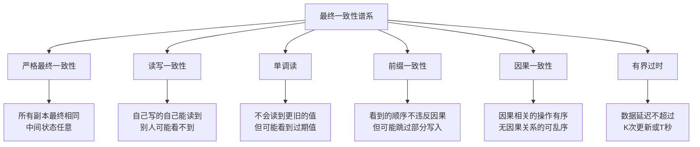
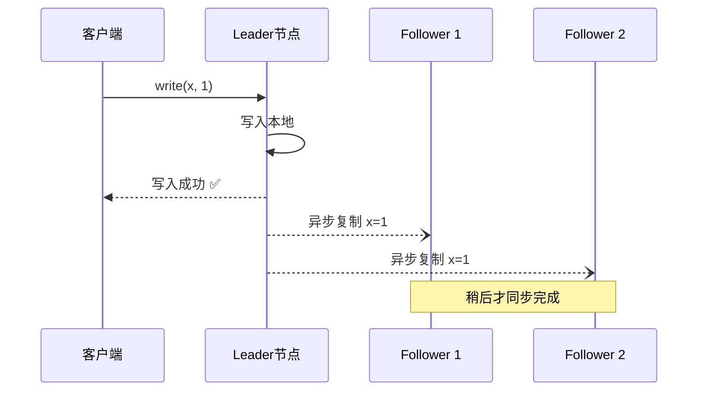
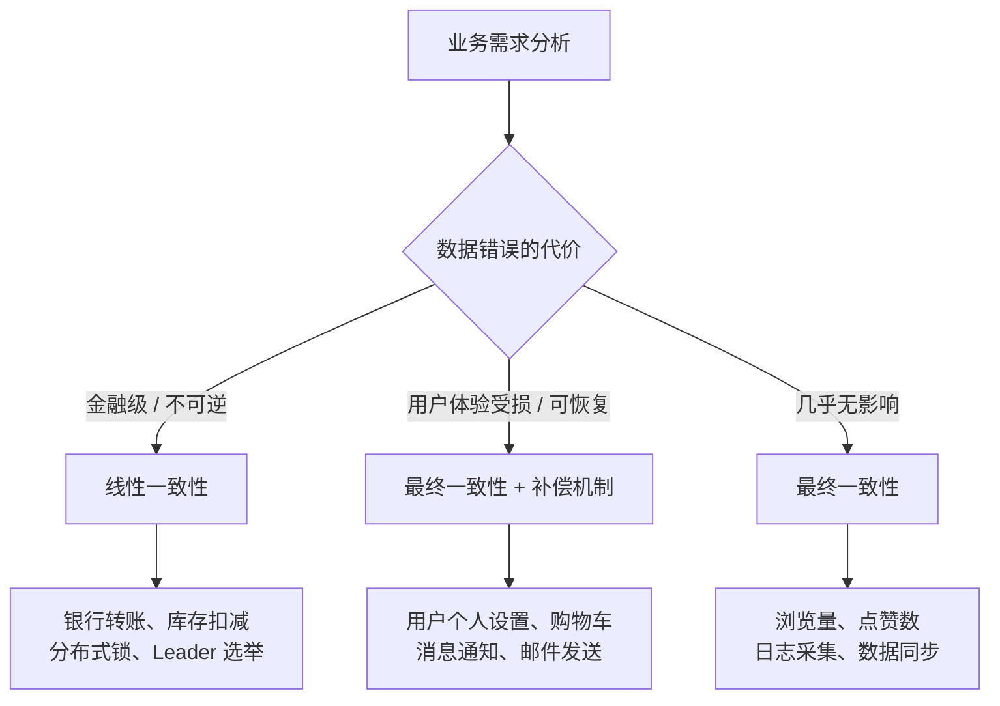

# 最终一致性（Eventual Consistency）

最终一致性是分布式系统中**最常用、最灵活、也最容易被误用**的一致性模型。它的核心承诺极其简洁：如果不再有新的更新，系统中所有副本**最终会收敛到相同的值**。但"最终"两个字背后隐藏着大量工程挑战——多长时间算"最终"？收敛过程中用户会看到什么？如何保证不丢数据？

本节将从定义出发，深入剖析最终一致性的理论基础、实现机制、常见模式、工程陷阱和最佳实践，帮助你在享受最终一致性带来的性能红利的同时，避免其背后的风险。

---

## 1. 最终一致性的本质

### 1.1 直觉理解

想象你在用微信：你发了一条朋友圈，你的朋友可能不会**立刻**看到——也许 1 秒，也许 5 秒。但只要网络恢复正常、服务器处理完同步，他**一定**会看到这条朋友圈。这就是最终一致性：**不保证即时同步，但保证最终同步**。

### 1.2 形式化定义

最终一致性最早由 Werner Vogels（Amazon CTO）在 2009 年系统性阐述。其正式定义包含两个核心约束：

**收敛性（Convergence）**：当所有更新操作都停止后，经过有限时间，所有副本上的数据值相同。

**终止性（Termination）**：所有操作必须在有限时间内完成（不能无限挂起）。

注意最终一致性**不保证**：
- 任何时间点所有副本一致
- 不同客户端在同一时间看到相同的值
- 读操作返回最新写入的值
- 操作的全局顺序

### 1.3 最终一致性的谱系

最终一致性并非单一模型，而是一族模型的统称。不同的变体提供不同程度的保证：

| 变体 | 保证 | 典型实现 |
|------|------|---------|
| **严格最终一致性** | 所有副本最终完全相同 | Dynamo、Cassandra |
| **读写一致性（Read-your-writes）** | 客户端能读到自己刚写入的值 | 会话粘性、本地缓存 |
| **单调读（Monotonic reads）** | 同一客户端不会读到"时间倒流"的值 | 版本向量、会话令牌 |
| **前缀一致性（Consistent Prefix）** | 读操作看到的写操作顺序与实际发生顺序的前缀一致 | 有序日志复制 |
| **因果一致性** | 有因果关系的操作保持顺序 | 向量时钟、Lamport 时钟 |
| **有界过时（Bounded Staleness）** | 数据过期不超过 K 次更新或 T 秒 | Azure Cosmos DB BoundedStaleness |



### 1.4 与线性一致性的根本差异

线性一致性要求**所有操作看起来串行且保持实时顺序**；最终一致性只要求**最终收敛**。这意味着在最终一致性系统中：

- 客户端 A 写入 x=1 后，客户端 B 可能仍然读到 x=0
- 同一个客户端先写入 x=1 再写入 x=2，另一个客户端可能先看到 x=2 再看到 x=1
- 两个并发写入可能在不同副本上以不同顺序被看到

这并不意味着最终一致性"不好"——它只是在一致性与性能/可用性之间做了不同的权衡。

---

## 2. 最终一致性的实现机制

### 2.1 异步复制

最终一致性最常见的实现方式是**异步主从复制**：



**写入流程**：
1. 客户端发送写请求到 Leader
2. Leader 将数据写入本地存储
3. Leader **立即返回成功**给客户端（不等待 Follower 确认）
4. Leader 异步将变更推送给 Follower
5. Follower 接收到变更后更新本地副本

**关键特性**：写操作的延迟仅取决于 Leader 的处理时间，不依赖网络往返。这使得写延迟可以低至亚毫秒级。

```python
# 异步复制的简化实现
class AsyncReplicationStore:
    """基于异步复制的最终一致性存储"""
    
    def __init__(self):
        self.data = {}                    # 本地数据
        self.vector_clock = {}            # 向量时钟
        self.replicas = []                # 远程副本列表
        self.pending_replications = []     # 待复制队列
    
    async def put(self, key: str, value: any):
        """写入操作：本地立即写入，异步复制"""
        # 更新本地向量时钟
        self.vector_clock[key] = self.vector_clock.get(key, 0) + 1
        
        # 写入本地
        self.data[key] = {
            "value": value,
            "clock": self.vector_clock[key]
        }
        
        # 异步复制到所有副本（不阻塞返回）
        for replica in self.replicas:
            self.pending_replications.append(
                self._replicate(replica, key, self.data[key])
            )
        
        return {"status": "ok", "clock": self.vector_clock[key]}
    
    async def _replicate(self, replica, key: str, data: dict):
        """后台复制任务"""
        try:
            await replica.receive_update(key, data)
        except ReplicaUnavailableError:
            # 副本不可用时，将更新加入重试队列
            await self._enqueue_retry(replica, key, data)
    
    async def get(self, key: str):
        """读取操作：可能返回过期值"""
        return self.data.get(key, {}).get("value")
```

### 2.2 Gossip 协议

Gossip 协议是实现大规模最终一致性的经典方法，灵感来源于社交网络中信息传播的方式。每个节点定期随机选择其他节点交换信息，经过几轮传播后，所有节点最终获得一致视图。

```python
# Gossip 协议的简化实现
class GossipNode:
    """基于 Gossip 协议的分布式状态同步"""
    
    def __init__(self, node_id: str, seed_nodes: list):
        self.node_id = node_id
        self.data = {}                    # 本地状态（key → (value, timestamp)）
        self.peers = set(seed_nodes)      # 已知节点列表
        self.heartbeat = 0                # 心跳计数器
    
    async def gossip_round(self):
        """每轮 Gossip：随机选择一个节点交换状态"""
        if not self.peers:
            return
        
        # 随机选择一个节点（避免 always 选同一个）
        target = random.choice(list(self.peers))
        
        # 发送自己的摘要（只发 key + timestamp，不发全量数据）
        digest = {
            "node_id": self.node_id,
            "heartbeat": self.heartbeat,
            "data_summary": {k: v[1] for k, v in self.data.items()}
        }
        
        # 交换状态
        peer_digest = await self._send_gossip(target, digest)
        
        # 根据摘要决定需要同步哪些数据
        if peer_digest:
            await self._reconcile(peer_digest, target)
    
    async def _reconcile(self, peer_digest: dict, peer_id: str):
        """基于摘要差异进行数据同步"""
        remote_summary = peer_digest["data_summary"]
        
        # 找出自己缺少的或过期的数据
        for key, remote_ts in remote_summary.items():
            local_ts = self.data.get(key, (None, 0))[1]
            if remote_ts > local_ts:
                # 从对方获取最新数据
                value = await self._fetch_from_peer(peer_id, key)
                self.data[key] = (value, remote_ts)
        
        # 告知对方自己有的新数据
        for key, (value, ts) in self.data.items():
            remote_ts = remote_summary.get(key, 0)
            if ts > remote_ts:
                await self._push_to_peer(peer_id, key, value, ts)
```

**Gossip 协议的传播特性**：

| 阶段 | 覆盖节点比例 | 说明 |
|------|-------------|------|
| 第 1 轮 | ~2/N | 每个节点随机选 1 个节点 |
| 第 2 轮 | ~50% | 信息开始指数级扩散 |
| 第 3 轮 | ~85% | 大部分节点已收到 |
| 第 log(N) 轮 | ~99% | 几乎全部节点收敛 |

### 2.3 CRDT（无冲突复制数据类型）

CRDT 是实现最终一致性的**数学保证**机制。它通过数据结构层面的约束，确保不同副本上的操作可以**以任意顺序合并**，且最终结果一定相同。

```python
# G-Counter（只增计数器）的 CRDT 实现
class GCounter:
    """
    Grow-only Counter：只支持递增，不支持递减。
    每个节点维护自己的计数，合并时取各节点的最大值。
    """
    
    def __init__(self, node_id: str):
        self.node_id = node_id
        self.counts = {}  # node_id → count
    
    def increment(self, amount: int = 1):
        """本地递增"""
        self.counts[self.node_id] = self.counts.get(self.node_id, 0) + amount
    
    def value(self) -> int:
        """返回当前总计数"""
        return sum(self.counts.values())
    
    def merge(self, other: 'GCounter'):
        """
        合并两个 G-Counter。
        对于每个节点 ID，取两者中的较大值。
        这个操作是交换律、结合律、幂等的。
        """
        for node_id, count in other.counts.items():
            self.counts[node_id] = max(self.counts.get(node_id, 0), count)


# PN-Counter（支持增减的计数器）
class PNCounter:
    """
    Positive-Negative Counter：通过两个 G-Counter 分别记录
    递增和递减操作，最终值 = P的总和 - N的总和。
    """
    
    def __init__(self, node_id: str):
        self.positive = GCounter(node_id)
        self.negative = GCounter(node_id)
    
    def increment(self, amount: int = 1):
        self.positive.increment(amount)
    
    def decrement(self, amount: int = 1):
        self.negative.increment(amount)
    
    def value(self) -> int:
        return self.positive.value() - self.negative.value()
    
    def merge(self, other: 'PNCounter'):
        self.positive.merge(other.positive)
        self.negative.merge(other.negative)
```

**常见 CRDT 类型**：

| 类型 | 操作 | 合并策略 | 典型应用 |
|------|------|---------|---------|
| **G-Counter** | 只递增 | 各分量取 max | 点赞数、浏览量 |
| **PN-Counter** | 递增+递减 | 两个 G-Counter 合并 | 库存数量、余额 |
| **LWW-Register** | 写入 | 最后写入胜出 | 用户昵称、头像 URL |
| **OR-Set** | 添加/移除 | 并集+移除 | 标签系统、购物车 |
| **G-Set** | 只添加 | 并集 | 已读消息列表 |
| **2P-Set** | 添加/移除 | 添加并集+移除并集 | 黑名单 |
| **Sequence** | 插入/删除 | 多数投票 | 协作文本编辑 |

### 2.4 版本向量与冲突检测

最终一致性系统中，并发写入可能导致**冲突**。版本向量（Version Vector）是检测冲突的核心机制：

```python
# 基于版本向量的冲突检测与解决
class VersionedStore:
    """使用版本向量检测和处理最终一致性冲突"""
    
    def __init__(self, node_id: str):
        self.node_id = node_id
        self.data = {}  # key → (value, version_vector)
    
    def put(self, key: str, value: any, incoming_vv: dict = None):
        """
        写入数据并更新版本向量。
        如果 incoming_vv 为 None，说明是本地写入。
        """
        if key not in self.data:
            self.data[key] = (value, {self.node_id: 1})
        else:
            current_value, current_vv = self.data[key]
            
            # 本地写入：递增本节点分量
            if incoming_vv is None:
                current_vv[self.node_id] = current_vv.get(self.node_id, 0) + 1
                self.data[key] = (value, current_vv)
            else:
                # 远程更新：合并版本向量
                merged_vv = self._merge_vectors(current_vv, incoming_vv)
                resolved_value = self._resolve_conflict(
                    key, current_value, value, current_vv, incoming_vv
                )
                self.data[key] = (resolved_value, merged_vv)
    
    def _merge_vectors(self, vv1: dict, vv2: dict) -> dict:
        """合并两个版本向量：各分量取最大值"""
        all_keys = set(vv1.keys()) | set(vv2.keys())
        return {k: max(vv1.get(k, 0), vv2.get(k, 0)) for k in all_keys}
    
    def _resolve_conflict(self, key, val1, val2, vv1, vv2):
        """
        冲突解决策略：
        - LWW（最后写入胜出）：基于时间戳
        - Merge（语义合并）：自定义合并逻辑
        - Interactive（用户介入）：提示用户选择
        """
        # 默认使用 LWW 策略
        ts1 = sum(vv1.values())
        ts2 = sum(vv2.values())
        return val1 if ts1 >= ts2 else val2
    
    def _concurrent(self, vv1: dict, vv2: dict) -> bool:
        """判断两个版本是否并发（即无法比较先后）"""
        vv1_newer = any(vv1.get(k, 0) > vv2.get(k, 0) for k in vv1)
        vv2_newer = any(vv2.get(k, 0) > vv1.get(k, 0) for k in vv2)
        return vv1_newer and vv2_newer  # 互有新旧 = 并发
```

---

## 3. 最终一致性的工程实践模式

### 3.1 模式一：读修复（Read Repair）

读修复是最常见的最终一致性维护机制。当客户端读取数据时，系统自动检测副本间的不一致，并在后台修复。

```python
# 读修复的实现
class ReadRepairStore:
    """在读取过程中自动修复不一致的副本"""
    
    def __init__(self, replicas: list):
        self.replicas = replicas  # [replica_0, replica_1, replica_2, ...]
    
    async def get(self, key: str):
        """读取操作：并行读取所有副本，返回最新值并修复旧副本"""
        # 并行读取所有副本
        results = await asyncio.gather(*[
            r.get(key) for r in self.replicas
        ], return_exceptions=True)
        
        # 找出有效结果
        valid_results = [
            (r, i) for i, r in enumerate(results)
            if not isinstance(r, Exception) and r is not None
        ]
        
        if not valid_results:
            return None
        
        # 找出最新值（基于版本号或时间戳）
        latest_value = max(valid_results, key=lambda x: x[0]["version"])
        latest = latest_value[0]
        
        # 读修复：将最新值写回到过期的副本
        for result, idx in valid_results:
            if result["version"] < latest["version"]:
                # 异步修复，不阻塞读取
                asyncio.create_task(
                    self.replicas[idx].set(key, latest["value"], latest["version"])
                )
        
        return latest["value"]


# 反熵协议（Anti-Entropy）：定期全量对账
class AntiEntropyRepair:
    """通过 Merkle Tree 进行高效的副本间数据对账"""
    
    def __init__(self, local_store, remote_stores: list):
        self.local = local_store
        self.remotes = remote_stores
    
    async def full_repair(self):
        """定期执行反熵修复"""
        for remote in self.remotes:
            # 1. 构建本地 Merkle Tree
            local_tree = self._build_merkle_tree(self.local)
            
            # 2. 获取远程 Merkle Tree
            remote_tree = await remote.get_merkle_tree()
            
            # 3. 比较根哈希
            if local_tree.root_hash == remote_tree.root_hash:
                continue  # 数据一致，无需修复
            
            # 4. 递归比较子节点，找出不一致的分区
            diff_keys = self._find_diff_keys(local_tree, remote_tree)
            
            # 5. 只同步不一致的 key
            for key in diff_keys:
                await self._sync_key(key, self.local, remote)
    
    def _build_merkle_tree(self, store):
        """
        构建 Merkle Tree：将所有 key-value 的哈希组织成二叉树。
        两个 store 只需比较根哈希即可快速判断是否一致。
        """
        items = store.get_all_items()
        leaves = [hash(f"{k}:{v}") for k, v in sorted(items.items())]
        return MerkleTree(leaves)
```

### 3.2 模式二：冲突解决策略

当并发写入导致冲突时，需要预定义的策略来解决：

| 策略 | 原理 | 优点 | 缺点 | 适用场景 |
|------|------|------|------|---------|
| **LWW（Last Writer Wins）** | 时间戳最大的写入胜出 | 简单、无冲突 | 可能丢失数据 | 用户设置、配置 |
| **CRDT 合并** | 数据结构保证数学收敛 | 自动合并、无冲突 | 只适用于特定数据类型 | 计数器、集合、列表 |
| **应用层合并** | 自定义逻辑合并冲突值 | 灵活 | 实现复杂 | 购物车、协作文档 |
| **用户介入** | 冲突时提示用户选择 | 无数据丢失 | 用户体验差 | 关键业务数据 |
| **版本链** | 保留所有冲突版本 | 不丢数据 | 查询复杂 | 审计日志 |

```python
# 购物车冲突解决：应用层合并的经典案例
class ShoppingCartCRDT:
    """
    电商购物车的 CRDT 实现。
    使用 OR-Set（Observed-Remove Set）支持添加和移除操作。
    
    参考：Amazon Dynamo 论文中的购物车示例。
    """
    
    def __init__(self, user_id: str, node_id: str):
        self.user_id = user_id
        self.node_id = node_id
        # 每个商品：(quantity, added_clock, removed_clock)
        self.items = {}
    
    def add_item(self, product_id: str, quantity: int):
        """添加商品"""
        if product_id in self.items:
            qty, added, removed = self.items[product_id]
            self.items[product_id] = (
                qty + quantity,
                self._increment_clock(added),
                removed
            )
        else:
            self.items[product_id] = (
                quantity,
                {self.node_id: 1},
                {}
            )
    
    def remove_item(self, product_id: str):
        """移除商品"""
        if product_id in self.items:
            qty, added, removed = self.items[product_id]
            self.items[product_id] = (
                0,
                added,
                self._increment_clock(removed)
            )
    
    def merge(self, other: 'ShoppingCartCRDT'):
        """
        合并两个购物车副本。
        合并规则：取各分量的最大值。
        """
        all_products = set(self.items.keys()) | set(other.items.keys())
        
        for pid in all_products:
            qty1, add1, rem1 = self.items.get(pid, (0, {}, {}))
            qty2, add2, rem2 = other.items.get(pid, (0, {}, {}))
            
            # 合并版本向量
            merged_add = self._merge_clocks(add1, add2)
            merged_rem = self._merge_clocks(rem1, rem2)
            
            # 数量取最大值
            merged_qty = max(qty1, qty2)
            
            self.items[pid] = (merged_qty, merged_add, merged_rem)
    
    def get_cart(self) -> dict:
        """获取最终购物车内容（过滤已移除的商品）"""
        result = {}
        for pid, (qty, added, removed) in self.items.items():
            # 只保留添加时钟 > 移除时钟的商品
            if self._clock_gt(added, removed) and qty > 0:
                result[pid] = qty
        return result
```

### 3.3 模式三：事件溯源与最终一致性

事件溯源（Event Sourcing）天然适合最终一致性系统——存储的是事件序列而非最终状态，不同节点可以通过重放事件来达到一致。

```python
# 事件溯源 + 最终一致性
class EventSourcedAccount:
    """
    基于事件溯源的账户模型。
    每次操作只追加事件，不修改状态。
    不同副本通过重放事件最终达到一致状态。
    """
    
    def __init__(self, account_id: str):
        self.account_id = account_id
        self.balance = 0
        self.version = 0
        self.events = []  # 事件日志
    
    def deposit(self, amount: int, timestamp: float):
        """存款操作"""
        event = {
            "type": "deposit",
            "amount": amount,
            "timestamp": timestamp,
            "version": self.version + 1
        }
        self._apply(event)
        self.events.append(event)
        return event
    
    def withdraw(self, amount: int, timestamp: float):
        """取款操作"""
        if amount > self.balance:
            raise InsufficientFundsError(f"余额不足: {self.balance} < {amount}")
        
        event = {
            "type": "withdraw",
            "amount": amount,
            "timestamp": timestamp,
            "version": self.version + 1
        }
        self._apply(event)
        self.events.append(event)
        return event
    
    def _apply(self, event: dict):
        """应用单个事件到状态"""
        if event["type"] == "deposit":
            self.balance += event["amount"]
        elif event["type"] == "withdraw":
            self.balance -= event["amount"]
        self.version = event["version"]
    
    def replay(self, events: list):
        """从事件日志重建状态"""
        self.balance = 0
        self.version = 0
        self.events = []
        for event in sorted(events, key=lambda e: e["version"]):
            self._apply(event)
            self.events.append(event)


class EventStore:
    """
    事件存储：支持多副本异步复制的最终一致性事件存储。
    """
    
    def __init__(self, node_id: str):
        self.node_id = node_id
        self.events = []  # 有序事件日志
        self.subscribers = []  # 事件订阅者
    
    async def append(self, event: dict):
        """追加事件（本地立即写入，异步复制）"""
        event["node_id"] = self.node_id
        event["local_timestamp"] = time.time()
        self.events.append(event)
        
        # 异步通知所有订阅者
        for subscriber in self.subscribers:
            asyncio.create_task(subscriber.receive(event))
    
    async def catch_up(self, subscriber, last_known_version: int):
        """让落后的订阅者追赶"""
        missed_events = [
            e for e in self.events
            if e["version"] > last_known_version
        ]
        for event in missed_events:
            await subscriber.receive(event)
```

---

## 4. 工业级系统中的最终一致性

### 4.1 Amazon Dynamo

Dynamo 是最终一致性的奠基之作，其设计理念深刻影响了后来的 Cassandra、Riak、Voldemort 等系统。

**核心设计**：
- **一致性哈希**：数据分片分布在环形拓扑上
- **读写法定人数（Quorum）**：N 个副本中读/写 R/W 个，满足 R + W > N 则有强一致交集
- **向量时钟**：检测并发写入
- **反熵 + 读修复**：维护最终一致性

N=3（3个副本），R=2（读2个），W=2（写2个）
R + W = 4 > 3 → 读写交集至少有1个节点，保证读到最新值

如果改为 N=3, R=1, W=1
R + W = 2 < 3 → 读写交集可能为空，只能保证最终一致性

### 4.2 Apache Cassandra

Cassandra 在 Dynamo 的基础上增加了 Google Bigtable 的数据模型，是最终一致性系统的典型代表。

**可调一致性级别**：

| 一致性级别 | 写语义 | 读语义 | 延迟 |
|-----------|--------|--------|------|
| **ONE** | 写1个副本即返回 | 读1个副本即返回 | 最低 |
| **QUORUM** | 写多数派 | 读多数派 | 中等 |
| **ALL** | 写所有副本 | 读所有副本 | 最高 |
| **LOCAL_QUORUM** | 写本地DC多数派 | 读本地DC多数派 | 中等 |
| **EACH_QUORUM** | 每个DC都写多数派 | - | 高 |

```python
# Cassandra 一致性级别的使用
from cassandra.cluster import Cluster
from cassandra import ConsistencyLevel

cluster = Cluster(['192.168.1.10', '192.168.1.11', '192.168.1.12'])
session = cluster.connect('my_keyspace')

# 场景1：写用户设置 → 最终一致性即可
stmt = session.prepare("INSERT INTO user_settings (user_id, theme) VALUES (?, ?)")
stmt.consistency_level = ConsistencyLevel.ONE
session.execute(stmt, [user_id, "dark"])

# 场景2：写订单 → 需要更高一致性
stmt = session.prepare("INSERT INTO orders (order_id, total) VALUES (?, ?)")
stmt.consistency_level = ConsistencyLevel.QUORUM
session.execute(stmt, [order_id, total])

# 场景3：读取订单 → 调整为 Read-your-writes 语义
stmt = session.prepare("SELECT * FROM orders WHERE order_id = ?")
stmt.consistency_level = ConsistencyLevel.QUORUM
result = session.execute(stmt, [order_id])
```

### 4.3 DNS 系统

DNS 是互联网上最大规模的最终一致性系统，也是理解最终一致性的绝佳案例。

**DNS 的最终一致性特征**：
- **TTL 控制过时时间**：记录的 TTL（Time-To-Live）决定了缓存的过期时间，从几十秒到几天不等
- **传播延迟**：DNS 记录的变更需要一定时间才能在全球所有 DNS 服务器上生效（DNS Propagation）
- **最终收敛**：所有权威 DNS 服务器最终会返回相同的结果

# DNS 缓存层级 → 最终一致性延迟来源
客户端缓存 → 本地 DNS 服务器缓存 → 权威 DNS 服务器
    ↓              ↓                    ↓
  TTL过期        TTL过期              数据源头
  (秒级)        (分钟级)            (实时)

---

## 5. 最终一致性的常见陷阱

### 5.1 陷阱一：读到过期数据导致业务错误

```python
# ❌ 错误示例：基于最终一致性存储做库存检查
async def bad_place_order(user_id: str, product_id: str, quantity: int):
    """这个实现可能超卖！"""
    # 读取库存（可能读到过期值！）
    stock = await eventually_consistent_store.get(f"stock:{product_id}")
    
    if stock >= quantity:  # stock 可能已经是过期的旧值！
        # 扣减库存
        await eventually_consistent_store.set(
            f"stock:{product_id}", stock - quantity
        )
        return {"status": "ok"}
    else:
        return {"status": "out_of_stock"}

# ✅ 正确示例：使用原子操作或强一致性
async def good_place_order(user_id: str, product_id: str, quantity: int):
    """使用 Redis Lua 脚本保证原子性"""
    lua_script = """
    local stock = tonumber(redis.call('GET', KEYS[1]))
    if stock == nil then
        return -1
    end
    if stock >= tonumber(ARGV[1]) then
        redis.call('DECRBY', KEYS[1], ARGV[1])
        return stock - tonumber(ARGV[1])
    else
        return -2
    end
    """
    result = await redis.eval(lua_script, 1, f"stock:{product_id}", quantity)
    
    if result == -1:
        return {"status": "not_found"}
    elif result == -2:
        return {"status": "out_of_stock"}
    else:
        return {"status": "ok", "remaining_stock": result}
```

### 5.2 陷阱二：忽略冲突解决导致数据丢失

```python
# ❌ 错误示例：简单的覆盖写入导致数据丢失
# 场景：Alice 和 Bob 同时修改同一个用户配置
# Alice 写入 {"theme": "dark"}，Bob 写入 {"language": "zh"}
# 由于网络延迟，两个写入以不同顺序到达不同副本

# 副本1: Alice先到 → 先写theme=dark，再写language=zh → 正确
# 副本2: Bob先到 → 先写language=zh，再写theme=dark → 正确
# 但如果写入不是整体替换而是部分更新：

# 副本1: update theme=dark → update language=zh → {theme: dark, language: zh} ✅
# 副本2: update language=zh → update theme=dark → {theme: dark, language: zh} ✅
# 看似正确，但如果只有部分更新到达：

# 副本1: 只收到 theme=dark → {theme: dark, language: undefined} ❌
# 副本2: 只收到 language=zh → {theme: undefined, language: zh} ❌
# 两个副本永远无法收敛到一致状态！

# ✅ 正确示例：使用整体替换 + 版本向量
async def safe_update_user_config(user_id: str, config: dict):
    """使用版本向量保护的配置更新"""
    current = await store.get(f"config:{user_id}")
    
    if current is None:
        new_vv = {node_id: 1}
    else:
        new_vv = current["version_vector"].copy()
        new_vv[node_id] = new_vv.get(node_id, 0) + 1
    
    # 整体替换配置（不是部分更新）
    await store.put(f"config:{user_id}", {
        "value": config,
        "version_vector": new_vv
    })
```

### 5.3 陷阱三：误以为最终一致性是"免费的"

最终一致性系统看似简单，但运维复杂度远超强一致性系统：

| 维度 | 强一致性系统 | 最终一致性系统 |
|------|------------|-------------|
| **数据修复** | 自动（共识协议保证） | 需要手动/自动修复机制 |
| **监控** | 监控 Leader 状态即可 | 需监控每个副本的数据延迟 |
| **故障恢复** | 自动选举新 Leader | 可能需要数据修复后再加入 |
| **调试** | 确定性高 | 并发问题难以复现 |
| **测试** | 单元测试即可 | 需要分布式测试框架 |
| **运维** | 相对简单 | 需要理解反熵、读修复等机制 |

### 5.4 陷阱四：网络分区下的数据分叉

```python
# 场景：网络分区导致脑裂
#
# 分区前：NodeA(Leader), NodeB(Follower), NodeC(Follower)
# 网络分区：NodeA 和 NodeB 被隔离
#
# NodeA 分区：自己 + NodeC → 2/3 → 继续服务
# NodeB 分区：只有自己 → 1/3 → 如果也继续服务 → 数据分叉！
#
# 解决方案：使用 fencing token + 一致性协议

class PartitionSafeStore:
    """防止网络分区导致数据分叉"""
    
    def __init__(self, cluster_config):
        self.config = cluster_config
        self.lease = None          # 当前租约
        self.fencing_token = 0     # Fencing Token
    
    async def write(self, key: str, value: any):
        """写操作必须验证租约有效性"""
        # 1. 检查租约
        lease = await self._check_lease()
        if not lease or lease.is_expired():
            raise LeaseExpiredError("租约已过期，拒绝写入")
        
        # 2. 带 Fencing Token 写入
        await self._write_with_fence(key, value, lease.fencing_token)
    
    async def _check_lease(self):
        """
        从多数派节点获取租约确认。
        只有获得多数派确认的节点才能持有有效租约。
        """
        confirmations = 0
        total_nodes = self.config["total_nodes"]
        majority = total_nodes // 2 + 1
        
        for node in self.config["nodes"]:
            if await node.confirm_lease(self.node_id):
                confirmations += 1
        
        return confirmations >= majority
```

---

## 6. 何时选择最终一致性

### 6.1 决策框架

选择一致性模型不是"越强越好"，而是根据业务需求做出权衡：



### 6.2 最终一致性的适用场景

| 场景 | 为什么适合 | 关键考量 |
|------|----------|---------|
| **用户个人设置** | 最后一次更新胜出，短暂不一致无影响 | 提供 Read-your-writes 保证 |
| **CDN 内容分发** | 内容更新后几分钟内同步到边缘节点 | TTL 设置合理 |
| **DNS** | 全球范围的名称解析，容忍秒级延迟 | TTL 权衡：短 = 准确但慢，长 = 快但可能过期 |
| **社交媒体 Feed** | 不需要实时看到所有更新 | 排序和去重需要仔细设计 |
| **日志/监控数据** | 丢失少量数据或短暂延迟可接受 | 批量写入提高吞吐 |
| **配置中心** | 配置变更不需要瞬间生效 | 版本号防止过期配置覆盖 |
| **分布式缓存** | 缓存本质就是"可能过期"的数据 | 缓存穿透/雪崩/击穿防护 |

### 6.3 最终一致性的性能优势

选择最终一致性的核心动力是**性能**。在跨地域场景下，差异尤为显著：

| 操作 | 线性一致性延迟 | 最终一致性延迟 | 提升倍数 |
|------|-------------|-------------|---------|
| 写入（同机房） | 3-10 ms | 0.1-1 ms | 5-30x |
| 写入（跨城市） | 20-50 ms | 0.1-1 ms | 50-200x |
| 写入（跨洲） | 150-300 ms | 0.1-1 ms | 500-3000x |
| 吞吐量（单节点） | 受共识协议限制 | 不受限制 | - |

---

## 7. 监控与运维

### 7.1 关键监控指标

最终一致性系统的运维需要特别关注**数据延迟**和**副本状态**：

```bash
# 监控副本同步延迟
# Cassandra
nodetool proxyhistograms           # 查看读写延迟分位数
nodetool tablestats my_keyspace    # 查看各表的副本状态
nodetool status                    # 查看集群状态

# Redis（主从复制延迟）
redis-cli info replication         # 查看 master_repl_offset 和 slave_repl_offset
redis-cli --latency                # 监控延迟

# 通用指标
iostat -x 1                        # 磁盘 IO
ss -s                              # 网络连接
netstat -an | grep ESTABLISHED     # 连接状态
```

### 7.2 数据一致性巡检

```python
# 定期巡检脚本：检查副本间数据一致性
class ConsistencyChecker:
    """定期检查最终一致性系统的数据同步状态"""
    
    def __init__(self, replicas: list, threshold_ms: int = 5000):
        self.replicas = replicas
        self.threshold_ms = threshold_ms  # 延迟阈值
    
    async def check_replication_lag(self):
        """检查各副本的复制延迟"""
        master_ts = await self.replicas[0].get_timestamp()
        results = []
        
        for i, replica in enumerate(self.replicas[1:], 1):
            replica_ts = await replica.get_timestamp()
            lag_ms = (master_ts - replica_ts) * 1000
            
            status = "healthy" if lag_ms < self.threshold_ms else "lagging"
            
            results.append({
                "replica_id": i,
                "lag_ms": round(lag_ms, 2),
                "status": status
            })
            
            if lag_ms >= self.threshold_ms:
                await self._alert(f"Replica {i} lagging by {lag_ms}ms")
        
        return results
    
    async def check_data_consistency(self, sample_keys: list):
        """抽样检查数据一致性"""
        inconsistencies = []
        
        for key in sample_keys:
            values = []
            for replica in self.replicas:
                value = await replica.get(key)
                values.append((replica.id, value))
            
            # 检查所有副本的值是否相同
            unique_values = set(str(v) for _, v in values)
            if len(unique_values) > 1:
                inconsistencies.append({
                    "key": key,
                    "values": {r_id: v for r_id, v in values}
                })
        
        return inconsistencies
```

### 7.3 常用运维命令速查

```bash
# === Cassandra ===
nodetool status                    # 集群状态
nodetool tpstats                   # 线程池统计
nodetool compactionstats           # 压缩状态
nodetool repair                     # 手动修复数据不一致

# === Redis ===
redis-cli INFO replication         # 主从复制状态
redis-cli SLOWLOG GET 10           # 慢查询日志
redis-cli DBSIZE                   # 数据量

# === etcd ===
etcdctl endpoint status --write-out=table   # 集群状态
etcdctl check perf                           # 性能检测

# === 通用监控 ===
# 网络延迟
ping -c 100 replica-host          # 基本延迟测试
mtr --report replica-host         # 路由追踪

# 磁盘性能
dd if=/dev/zero of=/tmp/test bs=1M count=100   # 写入性能
fio --name=randread --ioengine=libaio --rw=randread --bs=4k --size=1G  # 随机读
```

---

## 8. 最佳实践总结

1. **根据数据价值选择一致性级别**：不是所有数据都需要强一致性。用户设置用最终一致性，金融交易用线性一致性，中间地带用读写一致性。

2. **始终设计冲突解决策略**：不要等到冲突发生才处理。在系统设计阶段就明确：LWW、CRDT、应用层合并还是用户介入。

3. **监控复制延迟是生命线**：最终一致性的"最终"需要量化。设置延迟告警阈值（如 >5s 告警，>30s 告警升级），确保副本同步在预期时间内完成。

4. **提供 Read-your-writes 保证**：对于用户个人数据，至少保证用户能读到自己刚写入的内容，避免"写了但看不到"的困惑。

5. **使用幂等操作**：最终一致性系统中，消息可能被重复投递。所有写操作必须幂等——相同操作执行多次与执行一次的结果相同。

6. **准备数据修复工具**：读修复、反熵协议、手动修复脚本——这些是最终一致性系统的"安全网"，必须在系统上线前就准备好。

7. **渐进式切换**：如果从强一致性迁移到最终一致性，不要一刀切。按数据类型逐步迁移，每一步都验证业务正确性。

8. **测试要覆盖并发场景**：单元测试无法发现最终一致性 bug。使用 Jepsen、混沌工程、压力测试来验证系统在并发和故障条件下的行为。

---

## 9. 进阶阅读

- **Werner Vogels, "Eventually Consistent" (2009)**：最终一致性的奠基论文，Amazon CTO 亲自阐述设计理念
- **Dynamo 论文 (DeCandia et al., 2007)**：Amazon Dynamo 系统的完整设计，最终一致性的工程典范
- **Cassandra 论文 (Lakshman & Malik, 2010)**：Facebook 提出的分布式数据库，融合 Dynamo + Bigtable
- **CRDT 论文 (Shapiro et al., 2011)**：无冲突复制数据类型的数学基础
- **Jepsen 测试系列 (Kyle Kingsbury)**：对各分布式系统一致性的独立验证报告
- **Designing Data-Intensive Applications (Martin Kleppmann)**：分布式系统设计的权威参考，第5章深入讨论一致性模型
