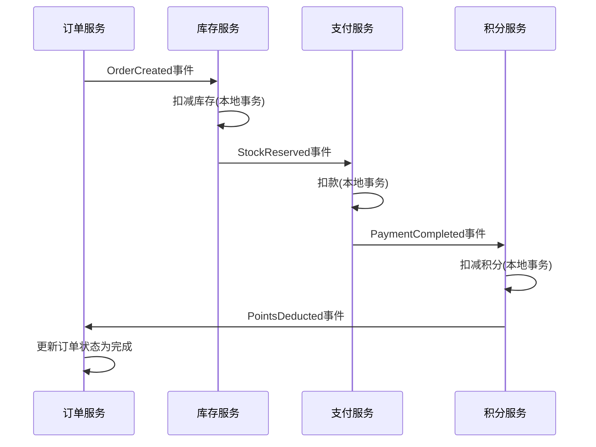
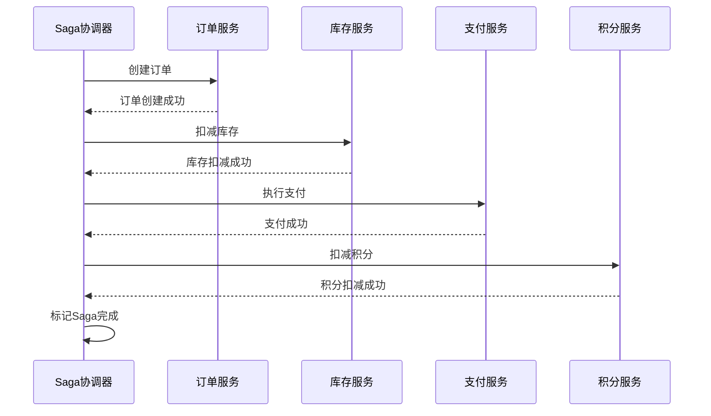
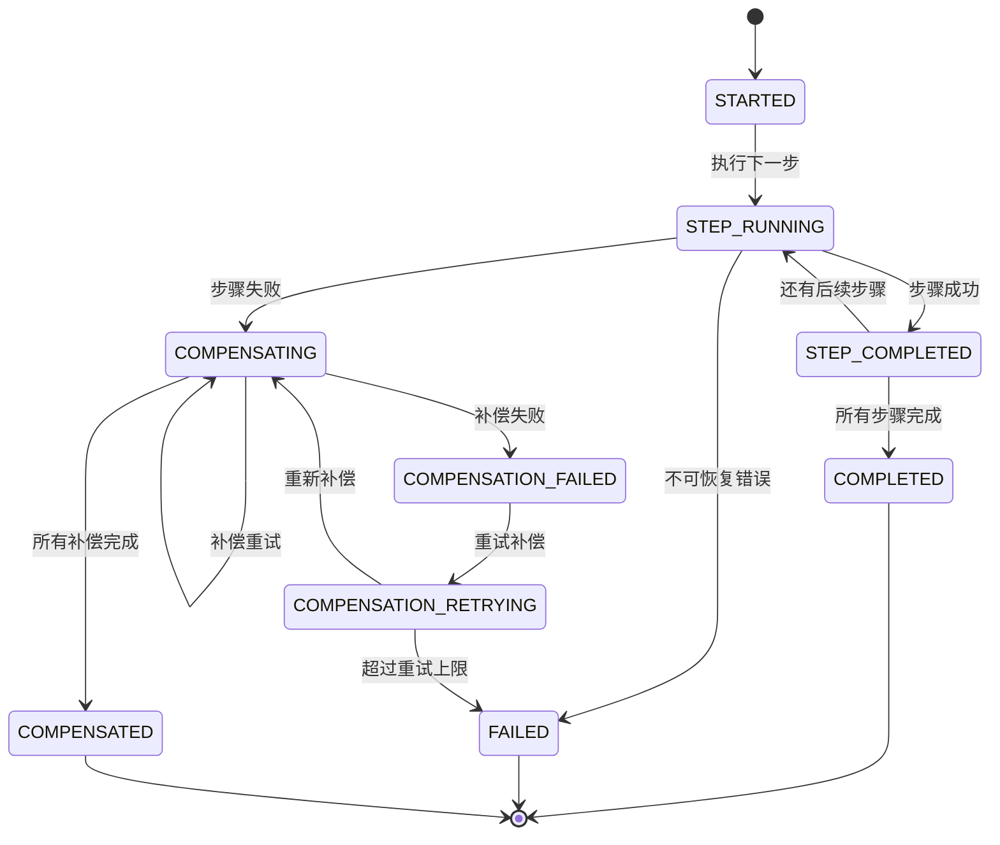

# Saga模式

Saga模式是一种在分布式系统中管理跨服务事务的解决方案。当微服务架构拆分了传统的单体数据库后，跨服务的数据一致性成为核心挑战。Saga通过将长事务拆分为一系列本地事务，每个本地事务配套一个补偿操作，在某个步骤失败时按逆序执行补偿，从而实现最终一致性。本节将从原理到实战，全面剖析Saga模式的设计思想、协调方式、补偿机制、常见陷阱和工程最佳实践。

---

## 1. 为什么需要Saga

### 1.1 分布式事务的困境

在单体架构时代，一个数据库事务（ACID）就能保证多个操作的原子性。但微服务架构下，每个服务拥有独立的数据库，传统的两阶段提交（2PC）面临严峻挑战：

| 问题 | 具体表现 |
|------|----------|
| 性能瓶颈 | 2PC要求所有参与者在第二阶段前持有锁，高并发下锁竞争严重 |
| 可用性降低 | 协调器单点故障导致整个事务阻塞 |
| 资源浪费 | 即使只涉及两个服务，也必须走完整的Prepare-Commit流程 |
| 网络依赖 | 跨数据中心时延迟叠加，事务完成时间成倍增长 |

### 1.2 电商场景的典型痛点

以一个常见的电商下单流程为例：

用户下单 → 创建订单 → 扣减库存 → 扣款 → 扣减积分 → 生成物流单

如果使用2PC，上述6个服务必须同时准备就绪才能提交。任何一个服务超时或不可用，整个事务就会阻塞。在双11等高并发场景下，这种阻塞会导致雪崩效应。

Saga的核心思想是：**放弃强一致性，通过补偿机制实现最终一致性**。每个服务完成本地事务后立即提交并释放资源，不需要等待其他参与者。

### 1.3 Saga的起源

Saga模式最早由 Hector Garcia-Molina 和 Kenneth Salem 在1987年的论文《Sagas》中提出，用于解决长时间运行的事务（Long-Lived Transactions）问题。最初的场景是数据库层面的长事务——一个横跨数小时甚至数天的事务，如果一直持有锁，其他事务将无法进行。Saga将其拆分为多个短事务，每个短事务有对应的补偿事务。

现代微服务架构将这个思想从数据库层面提升到了服务层面，使其成为分布式事务的主流解决方案之一。

---

## 2. Saga的核心原理

### 2.1 基本概念

Saga由一系列本地事务 T₁, T₂, ..., Tₙ 和对应的补偿事务 C₁, C₂, ..., Cₙ 组成。执行逻辑如下：

**正常流程（全部成功）：**
T₁ → T₂ → T₃ → ... → Tₙ  ✅ 事务完成

**失败流程（某个步骤失败）：**
T₁ → T₂ → T₃(fail) → C₂ → C₁  ⚠️ 补偿回滚

补偿事务 Cᵢ 的作用是撤销 Tᵢ 产生的影响，但注意**补偿不等于回滚**——它执行的是一个反向操作，而非数据库层面的UNDO。

### 2.2 补偿事务的本质

补偿事务与数据库回滚有本质区别：

| 维度 | 数据库回滚 | Saga补偿 |
|------|-----------|----------|
| 粒度 | 数据库行级 | 服务级别 |
| 时机 | 事务提交前 | 事务提交后 |
| 机制 | Undo Log直接还原 | 执行反向业务逻辑 |
| 隔离性 | 有（MVCC/锁） | 无（可能脏读） |
| 中间状态 | 对外不可见 | 对外可见（关键区别！） |
| 可靠性 | 事务日志保证 | 需要额外设计保证 |

这意味着在Saga执行过程中，系统的中间状态对外是可见的。例如：

- 订单已创建，但库存尚未扣减 → 用户看到订单，库存未变
- 库存已扣减，但支付尚未完成 → 用户看到库存变化，但订单状态不确定

这种**中间状态可见性**是Saga模式最需要关注的问题，后续章节将详细讨论应对策略。

### 2.3 与2PC的关键对比

            2PC                         Saga
一致性    强一致性                   最终一致性
隔离性    有（全程锁）              无（中间态可见）
性能      低（锁等待）              高（无锁）
可用性    协调器单点风险            可水平扩展
复杂度    协议简单                  补偿逻辑复杂
适用场景  强一致要求（金融核心）     高并发、可容忍短暂不一致

选择建议：如果业务能容忍短暂的不一致（如电商下单、社交互动），优先选Saga；如果必须强一致（如银行核心转账），使用2PC或本地消息表。

---

## 3. 两种协调方式

Saga的执行需要一个协调者来决定事务的执行顺序和失败时的补偿逻辑。主要有两种实现方式：**编排（Choreography）** 和 **协调（Orchestration）**。

### 3.1 编排模式（Choreography）

编排模式下没有中心协调者，每个服务监听事件并决定自己的行为。服务之间通过事件（消息队列）松耦合交互。



**编排模式的代码实现示例（伪代码）：**

```python
# 订单服务 - 事件发布
class OrderService:
    def create_order(self, order_data):
        # T1: 创建订单（本地事务）
        order = Order.create(order_data, status="CREATED")
        # 发布事件
        self.event_bus.publish("OrderCreated", {
            "order_id": order.id,
            "items": order.items
        })
        return order

    # 监听最终完成事件
    @subscribe("PointsDeducted")
    def on_all_completed(self, event):
        Order.update(event["order_id"], status="COMPLETED")


# 库存服务 - 事件监听
class StockService:
    @subscribe("OrderCreated")
    def on_order_created(self, event):
        try:
            # T2: 扣减库存
            Stock.reserve(event["order_id"], event["items"])
            self.event_bus.publish("StockReserved", event)
        except InsufficientStockError:
            # C1: 发布补偿事件
            self.event_bus.publish("StockReservationFailed", event)

    @subscribe("PaymentFailed")
    def on_payment_failed(self, event):
        # C2: 恢复库存
        Stock.release(event["order_id"], event["items"])
```

**编排模式的优缺点：**

| 优点 | 缺点 |
|------|------|
| 服务间松耦合，易于独立开发和部署 | 事务逻辑分散在各个服务中 |
| 没有单点故障 | 流程难以追踪和理解 |
| 天然支持事件驱动架构 | 调试和排查问题困难 |
| 新增步骤只需添加新的事件监听 | 补偿逻辑分散，容易遗漏 |
| 适合简单的线性流程 | 复杂流程容易变成"意大利面条"式事件流 |

### 3.2 协调模式（Orchestration）

协调模式引入一个中心Saga协调器（Orchestrator），负责指挥整个Saga的执行流程。协调器告诉每个参与者该做什么，参与者执行完后通知协调器。



**协调模式的代码实现示例（伪代码）：**

```python
class OrderSagaOrchestrator:
    """订单创建Saga协调器"""

    def __init__(self, order_svc, stock_svc, payment_svc, points_svc):
        self.steps = [
            SagaStep("创建订单", order_svc.create_order, order_svc.cancel_order),
            SagaStep("扣减库存", stock_svc.reserve, stock_svc.release),
            SagaStep("扣减积分", points_svc.deduct, points_svc.refund),
            SagaStep("执行支付", payment_svc.charge, payment_svc.refund),
        ]
        self.state = SagaState()

    def execute(self, context):
        completed_steps = []
        try:
            for step in self.steps:
                result = step.execute(context)
                self.state.record(step.name, result)
                completed_steps.append(step)
        except Exception as e:
            # 按逆序执行补偿
            self.compensate(completed_steps, context, e)
            raise SagaFailedError(f"Saga失败: {e}", completed_steps)

    def compensate(self, completed_steps, context, error):
        for step in reversed(completed_steps):
            try:
                step.compensate(context)
                self.state.record_compensation(step.name, "SUCCESS")
            except Exception as comp_error:
                # 补偿失败需要重试或人工介入
                self.state.record_compensation(step.name, "FAILED", comp_error)
                self.alert_ops(step.name, comp_error)
                # 决策：继续补偿还是停止？
                # 通常继续，因为已完成的补偿不可撤销
```

**协调模式的优缺点：**

| 优点 | 缺点 |
|------|------|
| 事务逻辑集中在一处，易于理解和维护 | 协调器是单点（可通过冗余解决） |
| 服务间解耦，参与者只需暴露接口 | 需要额外部署协调器 |
| 补偿逻辑统一管理，不易遗漏 | 协调器逻辑可能变得复杂 |
| 易于实现超时、重试等机制 | 引入额外的网络调用 |
| 适合复杂的业务流程 | 与业务服务存在耦合 |

### 3.3 两种模式的选择指南

选择编排模式（Choreography）当：
├── 流程简单，3步以内
├── 服务数量少（3-5个）
├── 团队已经是事件驱动架构
├── 无需统一的事务状态视图
└── 服务间有天然的事件发布/订阅关系

选择协调模式（Orchestration）当：
├── 流程复杂，涉及5个以上服务
├── 需要清晰的事务状态管理
├── 需要统一的监控和告警
├── 需要支持复杂的补偿策略
├── 业务流程频繁变更
└── 需要超时控制和重试机制

在实际工程中，大多数团队最终会选择协调模式，因为随着业务增长，流程复杂度会快速超出编排模式的管理能力。

---

## 4. 状态机设计

无论采用哪种协调方式，Saga的执行状态管理都至关重要。一个设计良好的状态机是Saga可靠运行的基础。

### 4.1 Saga状态定义



### 4.2 状态持久化

Saga状态必须持久化，否则进程崩溃将导致事务状态丢失。推荐使用独立的Saga状态表：

```sql
CREATE TABLE saga_instance (
    id              BIGINT PRIMARY KEY AUTO_INCREMENT,
    saga_type       VARCHAR(64) NOT NULL,        -- Saga类型（如"创建订单"）
    saga_id         VARCHAR(128) NOT NULL UNIQUE, -- 全局唯一标识
    state           VARCHAR(32) NOT NULL,         -- 当前状态
    context         JSON,                         -- 事务上下文数据
    current_step    INT DEFAULT 0,                -- 当前执行到第几步
    created_at      TIMESTAMP DEFAULT NOW(),
    updated_at      TIMESTAMP DEFAULT NOW(),
    INDEX idx_state (state),
    INDEX idx_saga_type (saga_type, created_at)
);

CREATE TABLE saga_step_log (
    id              BIGINT PRIMARY KEY AUTO_INCREMENT,
    saga_id         VARCHAR(128) NOT NULL,
    step_name       VARCHAR(64) NOT NULL,
    step_status     VARCHAR(32) NOT NULL,         -- COMPLETED / FAILED / COMPENSATED
    input_data      JSON,
    output_data     JSON,
    error_message   TEXT,
    created_at      TIMESTAMP DEFAULT NOW(),
    INDEX idx_saga_id (saga_id),
    FOREIGN KEY (saga_id) REFERENCES saga_instance(saga_id)
);
```

### 4.3 幂等性保障

Saga中每个步骤的执行和补偿都必须是幂等的。原因：

1. **重试导致重复调用**：网络超时后协调器可能重试，参与者可能已经执行过
2. **补偿重试**：补偿操作失败后会重试，必须保证多次执行结果一致
3. **消息重复**：编排模式下，消息队列可能投递重复消息

幂等性实现方案：

```python
class IdempotentStockService:
    def __init__(self):
        self.processed = {}  # 生产环境用Redis或数据库

    def reserve(self, order_id, items):
        """幂等扣减库存"""
        idempotency_key = f"reserve:{order_id}"
        if idempotency_key in self.processed:
            return self.processed[idempotency_key]  # 返回上次结果

        with self.db.transaction():
            # 检查是否已处理（防并发）
            existing = self.db.query(
                "SELECT * FROM stock_operation WHERE idempotency_key = %s",
                idempotency_key
            )
            if existing:
                return existing.result

            # 执行扣减
            for item in items:
                self.db.execute(
                    "UPDATE stock SET quantity = quantity - %s WHERE sku_id = %s",
                    item.quantity, item.sku_id
                )
            # 记录操作（用于幂等检查）
            self.db.execute(
                "INSERT INTO stock_operation (idempotency_key, order_id, result) VALUES (%s, %s, %s)",
                idempotency_key, order_id, "SUCCESS"
            )
            return "SUCCESS"

    def release(self, order_id, items):
        """幂等恢复库存"""
        idempotency_key = f"release:{order_id}"
        if idempotency_key in self.processed:
            return self.processed[idempotency_key]

        with self.db.transaction():
            existing = self.db.query(
                "SELECT * FROM stock_operation WHERE idempotency_key = %s",
                idempotency_key
            )
            if existing:
                return existing.result

            for item in items:
                self.db.execute(
                    "UPDATE stock SET quantity = quantity + %s WHERE sku_id = %s",
                    item.quantity, item.sku_id
                )
            self.db.execute(
                "INSERT INTO stock_operation (idempotency_key, order_id, result) VALUES (%s, %s, %s)",
                idempotency_key, order_id, "SUCCESS"
            )
            return "SUCCESS"
```

---

## 5. 补偿策略深度解析

补偿是Saga模式中最复杂的部分，也是最容易出错的地方。不同类型的操作需要不同的补偿策略。

### 5.1 常见补偿模式

| 操作类型 | 补偿策略 | 示例 |
|----------|---------|------|
| 增加操作 | 删除操作 | 创建订单 → 取消订单 |
| 扣减操作 | 恢复操作 | 扣库存 → 加库存 |
| 通知操作 | 发送撤销通知 | 发邮件 → 发撤销邮件 |
| 第三方调用 | 调用对方的撤销接口 | 调用支付网关退款 |
| 复合操作 | 反向逐步执行 | 组合优惠 → 拆解优惠 |

### 5.2 补偿的不可逆情况

有些操作一旦执行就无法通过补偿完全撤销：

```python
# 场景：发送了短信通知，无法"取消"已发送的短信
class NotificationService:
    def send_sms(self, phone, message):
        # T: 发送短信
        sms_gateway.send(phone, message)
        # 补偿方案：发送更正通知，而非撤销
        # 无法真正撤销已发出的短信

    def compensate_sms(self, phone, original_message):
        # C: 发送更正短信，说明之前的通知有误
        sms_gateway.send(phone, f"【更正】{original_message} 已取消，请忽略上一条短信")
```

这类不可逆操作的处理原则：

1. **尽量推迟执行**：将不可逆操作放在Saga的最后一步
2. **先本地验证**：在发送前完成所有校验
3. **接受不完美补偿**：记录审计日志，必要时人工介入
4. **设计降级方案**：如短信发送失败时切换为站内信

### 5.3 补偿失败的处理

补偿失败是Saga中必须面对的现实。处理策略：

```python
class CompensationHandler:
    MAX_RETRY = 3
    RETRY_INTERVALS = [1, 5, 15]  # 递增重试间隔（秒）

    def handle_compensation_failure(self, step_name, error, saga_id):
        retry_count = self.get_retry_count(saga_id, step_name)

        if retry_count < self.MAX_RETRY:
            # 策略1：自动重试
            delay = self.RETRY_INTERVALS[retry_count]
            self.schedule_retry(saga_id, step_name, delay)
            self.increment_retry_count(saga_id, step_name)
        else:
            # 策略2：进入人工处理队列
            self.enqueue_manual_review(saga_id, step_name, error)
            # 策略3：触发告警
            self.alert_ops_team(saga_id, step_name, error)
            # 策略4：记录补偿失败日志（审计用）
            self.log_compensation_failure(saga_id, step_name, error, "MANUAL_REVIEW")
```

### 5.4 补偿的隔离性问题

Saga不提供事务隔离性，可能导致以下问题：

**脏读（Dirty Read）**：其他事务读到了Saga中间状态的数据

```python
# 时间线示例：
# T1: OrderSaga 扣减库存100个 → 库存剩余900
# T2: 另一个查询看到库存=900（可能不准确）
# T3: OrderSaga 支付失败 → 补偿恢复库存到1000
# 结果：T2看到的900是一个"幻觉"数据
```

**对策：语义锁（Semantic Lock）**

```python
class StockService:
    def reserve_with_semantic_lock(self, order_id, items):
        """带语义锁的库存扣减"""
        with self.db.transaction():
            for item in items:
                # 步骤1：设置预留标记（语义锁）
                self.db.execute(
                    """UPDATE stock
                       SET reserved = reserved + %s,
                           version = version + 1
                       WHERE sku_id = %s AND quantity - reserved >= %s""",
                    item.quantity, item.sku_id, item.quantity
                )
                if self.db.rowcount == 0:
                    raise InsufficientStockError(item.sku_id)
            # 步骤2：真正扣减（Saga提交后执行）
            # reserved字段表示"已被预留但尚未确认"的数量
```

---

## 6. 超时与重试机制

### 6.1 超时设计

Saga中的每一步都必须设置超时，否则一个慢服务会拖垮整个流程。

```python
class SagaStep:
    def __init__(self, name, action, compensate, timeout_seconds=30):
        self.name = name
        self.action = action
        self.compensate = compensate
        self.timeout = timeout_seconds

    def execute_with_timeout(self, context):
        import signal

        def timeout_handler(signum, frame):
            raise SagaTimeoutError(f"步骤 {self.name} 超时（{self.timeout}秒）")

        old_handler = signal.signal(signal.SIGALRM, timeout_handler)
        signal.alarm(self.timeout)
        try:
            result = self.action(context)
            signal.alarm(0)  # 取消超时
            return result
        finally:
            signal.signal(signal.SIGALRM, old_handler)
```

### 6.2 重试策略

```python
class RetryPolicy:
    def __init__(self, max_retries=3, base_delay=1.0, max_delay=30.0):
        self.max_retries = max_retries
        self.base_delay = base_delay
        self.max_delay = max_delay

    def execute_with_retry(self, func, *args, **kwargs):
        last_error = None
        for attempt in range(self.max_retries + 1):
            try:
                return func(*args, **kwargs)
            except RetryableError as e:
                last_error = e
                if attempt < self.max_retries:
                    delay = min(
                        self.base_delay * (2 ** attempt),
                        self.max_delay
                    )
                    jitter = delay * 0.1 * (hash(str(e)) % 10) / 10
                    time.sleep(delay + jitter)
            except NonRetryableError:
                raise  # 不可重试的错误直接抛出
        raise last_error
```

### 6.3 熔断机制

当下游服务持续失败时，不应继续重试，而是快速失败：

```python
class CircuitBreaker:
    def __init__(self, failure_threshold=5, recovery_timeout=60):
        self.failure_count = 0
        self.failure_threshold = failure_threshold
        self.recovery_timeout = recovery_timeout
        self.state = "CLOSED"  # CLOSED / OPEN / HALF_OPEN
        self.last_failure_time = None

    def call(self, func, *args, **kwargs):
        if self.state == "OPEN":
            if time.time() - self.last_failure_time > self.recovery_timeout:
                self.state = "HALF_OPEN"
            else:
                raise CircuitOpenError("熔断器开启，拒绝调用")

        try:
            result = func(*args, **kwargs)
            if self.state == "HALF_OPEN":
                self.state = "CLOSED"
                self.failure_count = 0
            return result
        except Exception as e:
            self.failure_count += 1
            self.last_failure_time = time.time()
            if self.failure_count >= self.failure_threshold:
                self.state = "OPEN"
            raise
```

---

## 7. 编排模式 vs 协调模式的完整对比

| 维度 | 编排模式 | 协调模式 |
|------|---------|---------|
| 中心化程度 | 去中心化 | 中心化 |
| 耦合度 | 松耦合（事件驱动） | 中耦合（依赖协调器） |
| 可观测性 | 差（需分布式追踪） | 好（状态集中管理） |
| 实现难度 | 低（简单场景） | 中（需要额外组件） |
| 维护成本 | 随流程增长急剧上升 | 增长可控 |
| 事务状态 | 分散在各服务 | 集中管理 |
| 适用规模 | 3-5个服务 | 不限 |
| 故障定位 | 困难（需追踪事件链） | 简单（查看协调器日志） |
| 新增步骤 | 添加事件监听即可 | 修改协调器流程 |

---

## 8. 常见陷阱与避坑指南

### 陷阱1：忘记实现幂等性

**症状**：网络抖动导致重复执行，数据被多扣或多次创建

**对策**：为每个操作生成唯一幂等键，用数据库唯一索引防止重复

```python
# 错误做法：直接执行，无幂等保护
def deduct_points(user_id, amount):
    db.execute("UPDATE users SET points = points - %s WHERE id = %s", amount, user_id)

# 正确做法：幂等键保护
def deduct_points(user_id, amount, idempotency_key):
    try:
        with db.transaction():
            db.execute(
                "INSERT INTO idempotent_operations (key, status) VALUES (%s, 'PROCESSING')",
                idempotency_key
            )
            db.execute(
                "UPDATE users SET points = points - %s WHERE id = %s",
                amount, user_id
            )
            db.execute(
                "UPDATE idempotent_operations SET status = 'DONE' WHERE key = %s",
                idempotency_key
            )
    except DuplicateKeyError:
        pass  # 已执行过，直接返回
```

### 陷阱2：补偿操作本身失败

**症状**：主操作成功了，补偿操作失败了，数据不一致

**对策**：补偿操作必须有重试机制，最终失败需人工介入

```python
# 陷阱：补偿失败后直接放弃
def compensate_order(order_id):
    try:
        cancel_order(order_id)
    except Exception as e:
        log.error(f"补偿失败: {e}")
        return  # 错误！数据已不一致

# 正确：补偿失败后进入重试队列
def compensate_order(order_id):
    try:
        cancel_order(order_id)
    except RetryableError as e:
        retry_queue.enqueue(order_id, delay=5)
    except NonRetryableError as e:
        manual_review_queue.enqueue(order_id, str(e))
        alert_ops_team(order_id, e)
```

### 陷阱3：忽略中间状态对外暴露

**症状**：用户在Saga执行过程中看到不一致的数据（如订单已创建但库存未扣）

**对策**：使用状态字段+前端轮询或WebSocket推送

```python
# 订单状态机
ORDER_STATES = {
    "CREATED":       "订单已创建，等待处理",
    "PROCESSING":    "正在处理中...",
    "STOCK_RESERVED": "库存已锁定",
    "PAYMENT_PENDING": "等待支付",
    "COMPLETED":     "订单完成",
    "FAILED":        "订单失败",
    "COMPENSATING":  "正在取消中...",
    "CANCELLED":     "订单已取消",
}
```

### 陷阱4：Saga的执行顺序错误

**症状**：补偿执行顺序不对，导致数据不一致

**对策**：严格保证补偿按执行顺序的逆序执行

```python
# 错误：并行执行补偿
async def compensate_all(steps):
    await asyncio.gather(*[step.compensate() for step in steps])

# 正确：严格逆序执行补偿
async def compensate_all(completed_steps):
    for step in reversed(completed_steps):
        await step.compensate()
```

### 陷阱5：长时间运行的Saga

**症状**：Saga执行时间过长，锁资源或状态过期

**对策**：拆分为更小的Saga，或使用异步模式

```python
# 糟糕的设计：一个巨大的Saga
class HugeSaga:
    steps = [
        "验证用户",       # 1秒
        "创建订单",       # 2秒
        "扣减库存",       # 3秒
        "调用支付网关",    # 10秒
        "调用物流系统",    # 15秒
        "发送通知",       # 2秒
        "更新统计",       # 1秒
    ]  # 总计34秒！超时风险极高

# 改进：拆分为两个Saga + 异步步骤
class CoreOrderSaga:  # 核心Saga，快速完成
    steps = ["验证用户", "创建订单", "扣减库存", "扣款"]

class PostOrderSaga:  # 后续Saga，异步执行
    steps = ["调用物流", "发送通知", "更新统计"]
```

---

## 9. 主流框架与工具

### 9.1 框架对比

| 框架 | 语言 | 协调方式 | 特点 |
|------|------|---------|------|
| Seata | Java | 协调（AT/TCC/Saga） | 阿里开源，支持多种模式，生态完善 |
| Temporal | Go/多语言 | 协调（工作流） | 强大的工作流引擎，支持长时间运行 |
| Camunda | Java | 协调（BPMN） | BPMN标准，可视化流程设计 |
| Eventuate | Java | 编排+协调 | 基于事件驱动，轻量级 |
| Durable Functions | C#/JS/Python | 协调 | Azure原生，serverless友好 |
|Axon Framework | Java | 编排+协调 | CQRS+Event Sourcing |

### 9.2 Seata Saga模式示例

```json
{
  "Name": "CreateOrderSaga",
  "States": {
    "CreateOrder": {
      "Type": "ServiceTask",
      "ServiceName": "orderService",
      "ServiceMethod": "create",
      "CompensateState": "CancelOrder",
      "Next": "ReserveStock"
    },
    "ReserveStock": {
      "Type": "ServiceTask",
      "ServiceName": "stockService",
      "ServiceMethod": "reserve",
      "CompensateState": "ReleaseStock",
      "Next": "ChargePayment"
    },
    "ChargePayment": {
      "Type": "ServiceTask",
      "ServiceName": "paymentService",
      "ServiceMethod": "charge",
      "CompensateState": "RefundPayment",
      "Next": "Succeed"
    },
    "CancelOrder": {
      "Type": "ServiceTask",
      "ServiceName": "orderService",
      "ServiceMethod": "cancel"
    },
    "ReleaseStock": {
      "Type": "ServiceTask",
      "ServiceName": "stockService",
      "ServiceMethod": "release"
    },
    "RefundPayment": {
      "Type": "ServiceTask",
      "ServiceName": "paymentService",
      "ServiceMethod": "refund"
    },
    "Succeed": {
      "Type": "Succeed"
    }
  }
}
```

### 9.3 Temporal工作流示例

```python
from temporalio import workflow

@workflow.defn
class OrderWorkflow:
    @workflow.run
    async def run(self, order: OrderRequest) -> OrderResult:
        # Step 1: 创建订单
        order_id = await workflow.execute_activity(
            create_order_activity, order,
            start_to_close_timeout=timedelta(seconds=10)
        )

        # Step 2: 扣减库存（带补偿）
        try:
            await workflow.execute_activity(
                reserve_stock_activity, order_id,
                start_to_close_timeout=timedelta(seconds=15)
            )
        except ActivityError:
            await workflow.execute_activity(
                cancel_order_activity, order_id,
                start_to_close_timeout=timedelta(seconds=10)
            )
            raise

        # Step 3: 支付
        try:
            await workflow.execute_activity(
                charge_payment_activity, order_id,
                start_to_close_timeout=timedelta(seconds=30)
            )
        except ActivityError:
            # Temporal自动支持重试和补偿
            await workflow.execute_activity(
                release_stock_activity, order_id,
                start_to_close_timeout=timedelta(seconds=10)
            )
            await workflow.execute_activity(
                cancel_order_activity, order_id,
                start_to_close_timeout=timedelta(seconds=10)
            )
            raise

        return OrderResult(order_id=order_id, status="COMPLETED")
```

---

## 10. 监控与可观测性

### 10.1 关键监控指标

```python
# Prometheus指标定义
SAGA_COUNTER = Counter(
    'saga_total',
    'Saga执行总数',
    ['saga_type', 'status']  # status: completed / compensated / failed
)

SAGA_DURATION = Histogram(
    'saga_duration_seconds',
    'Saga执行耗时',
    ['saga_type'],
    buckets=[1, 5, 10, 30, 60, 120, 300]
)

SAGA_STEP_DURATION = Histogram(
    'saga_step_duration_seconds',
    'Saga各步骤耗时',
    ['saga_type', 'step_name']
)

COMPENSATION_COUNTER = Counter(
    'saga_compensation_total',
    '补偿执行总数',
    ['saga_type', 'step_name']
)
```

### 10.2 告警规则

```yaml
# Prometheus告警规则
groups:
  - name: saga_alerts
    rules:
      # 补偿率过高告警
      - alert: HighCompensationRate
        expr: |
          rate(saga_total{status="compensated"}[5m])
          / rate(saga_total[5m]) > 0.1
        for: 5m
        labels:
          severity: warning
        annotations:
          summary: "Saga补偿率超过10%"

      # Saga执行超时告警
      - alert: SagaTimeout
        expr: |
          histogram_quantile(0.99, rate(saga_duration_seconds_bucket[5m])) > 60
        for: 5m
        labels:
          severity: critical
        annotations:
          summary: "Saga P99延迟超过60秒"

      # 补偿失败告警（最严重）
      - alert: CompensationFailure
        expr: rate(saga_compensation_failures_total[1m]) > 0
        labels:
          severity: critical
        annotations:
          summary: "Saga补偿失败，需要人工介入"
```

### 10.3 分布式追踪集成

```python
import opentelemetry.trace as trace

tracer = trace.get_tracer("saga-orchestrator")

class TracedSagaOrchestrator:
    def execute_saga(self, saga_type, context):
        with tracer.start_as_current_span(f"saga.{saga_type}") as span:
            span.set_attribute("saga.type", saga_type)
            span.set_attribute("saga.id", context.saga_id)

            for i, step in enumerate(self.steps):
                with tracer.start_as_current_span(f"step.{step.name}") as step_span:
                    step_span.set_attribute("step.index", i)
                    step_span.set_attribute("step.name", step.name)
                    try:
                        result = step.execute(context)
                        step_span.set_attribute("step.status", "success")
                    except Exception as e:
                        step_span.set_attribute("step.status", "failed")
                        step_span.set_attribute("step.error", str(e))
                        # 触发补偿，记录补偿追踪
                        self.compensate_with_trace(context, i)
                        raise
```

---

## 11. 实战案例：电商下单Saga

### 11.1 完整流程设计

┌─────────────────────────────────────────────────────────┐
│                    创建订单Saga                          │
│                                                         │
│  ┌──────────┐   ┌──────────┐   ┌──────────┐            │
│  │ 创建订单  │ → │ 锁定库存  │ → │ 扣减积分  │            │
│  └──────────┘   └──────────┘   └──────────┘            │
│       │              │              │                    │
│  ┌──────────┐   ┌──────────┐   ┌──────────┐            │
│  │ 取消订单  │ ← │ 释放库存  │ ← │ 退还积分  │            │
│  └──────────┘   └──────────┘   └──────────┘            │
│  (补偿步骤)    (补偿步骤)    (补偿步骤)                   │
└─────────────────────────────────────────────────────────┘

### 11.2 代码实现

```python
from dataclasses import dataclass
from enum import Enum
from typing import List, Optional
import uuid

class SagaState(Enum):
    STARTED = "STARTED"
    STEP_RUNNING = "STEP_RUNNING"
    COMPLETED = "COMPLETED"
    COMPENSATING = "COMPENSATING"
    COMPENSATED = "COMPENSATED"
    FAILED = "FAILED"

@dataclass
class OrderContext:
    user_id: str
    items: List[dict]
    total_amount: float
    saga_id: str = None
    order_id: str = None
    stock_reserved: bool = False
    points_deducted: bool = False

class OrderSaga:
    """电商下单Saga完整实现"""

    def __init__(self, order_repo, stock_repo, points_repo, saga_repo, event_bus):
        self.order_repo = order_repo
        self.stock_repo = stock_repo
        self.points_repo = points_repo
        self.saga_repo = saga_repo
        self.event_bus = event_bus

    async def execute(self, context: OrderContext):
        context.saga_id = str(uuid.uuid4())

        # 初始化Saga状态
        self.saga_repo.save({
            "saga_id": context.saga_id,
            "type": "CREATE_ORDER",
            "state": SagaState.STARTED,
            "context": context,
            "completed_steps": []
        })

        completed_steps = []

        try:
            # 步骤1：创建订单
            context.order_id = await self._create_order(context)
            completed_steps.append("CREATE_ORDER")
            self._update_progress(context, "ORDER_CREATED")

            # 步骤2：锁定库存
            await self._reserve_stock(context)
            context.stock_reserved = True
            completed_steps.append("RESERVE_STOCK")
            self._update_progress(context, "STOCK_RESERVED")

            # 步骤3：扣减积分
            await self._deduct_points(context)
            context.points_deducted = True
            completed_steps.append("DEDUCT_POINTS")
            self._update_progress(context, "POINTS_DEDUCTED")

            # 全部成功
            self.saga_repo.update_state(context.saga_id, SagaState.COMPLETED)
            self.event_bus.publish("OrderSagaCompleted", {
                "saga_id": context.saga_id,
                "order_id": context.order_id
            })
            return context.order_id

        except Exception as e:
            # 失败：执行补偿
            await self._compensate(context, completed_steps, e)
            raise

    async def _compensate(self, context, completed_steps, original_error):
        self.saga_repo.update_state(context.saga_id, SagaState.COMPENSATING)

        compensation_order = list(reversed(completed_steps))
        failed_compensations = []

        for step_name in compensation_order:
            try:
                if step_name == "DEDUCT_POINTS" and context.points_deducted:
                    await self.points_repo.refund(context.user_id, context.saga_id)
                elif step_name == "RESERVE_STOCK" and context.stock_reserved:
                    await self.stock_repo.release(context.order_id)
                elif step_name == "CREATE_ORDER":
                    await self.order_repo.cancel(context.order_id)

                self._log_compensation(context.saga_id, step_name, "SUCCESS")
            except Exception as comp_error:
                self._log_compensation(context.saga_id, step_name, "FAILED", comp_error)
                failed_compensations.append(step_name)
                # 记录但继续补偿其他步骤

        if failed_compensations:
            # 进入人工处理队列
            self._enqueue_manual_review(context.saga_id, failed_compensations)
            self.saga_repo.update_state(context.saga_id, SagaState.FAILED)
        else:
            self.saga_repo.update_state(context.saga_id, SagaState.COMPENSATED)

        # 发布Saga失败事件
        self.event_bus.publish("OrderSagaFailed", {
            "saga_id": context.saga_id,
            "error": str(original_error),
            "failed_compensations": failed_compensations
        })
```

---

## 12. 最佳实践总结

1. **幂等性是第一原则**：每个操作和补偿都必须是幂等的，这是Saga可靠运行的基石
2. **状态必须持久化**：Saga状态存储在数据库中，而非内存
3. **补偿按逆序执行**：严格保证补偿顺序，不能并行
4. **每步设超时**：防止单个服务拖垮整个Saga
5. **不可逆操作放最后**：短信、邮件等不可撤销的操作放在Saga末尾
6. **设计语义锁**：通过语义锁减少中间状态对外暴露的影响
7. **补偿失败必须告警**：自动重试+人工兜底，不能静默失败
8. **监控补偿率**：补偿率突然升高意味着下游服务不稳定
9. **Saga粒度适中**：太大的Saga难以管理，太小的Saga增加了协调开销
10. **日志和审计**：记录每个步骤的输入输出，便于排查问题
