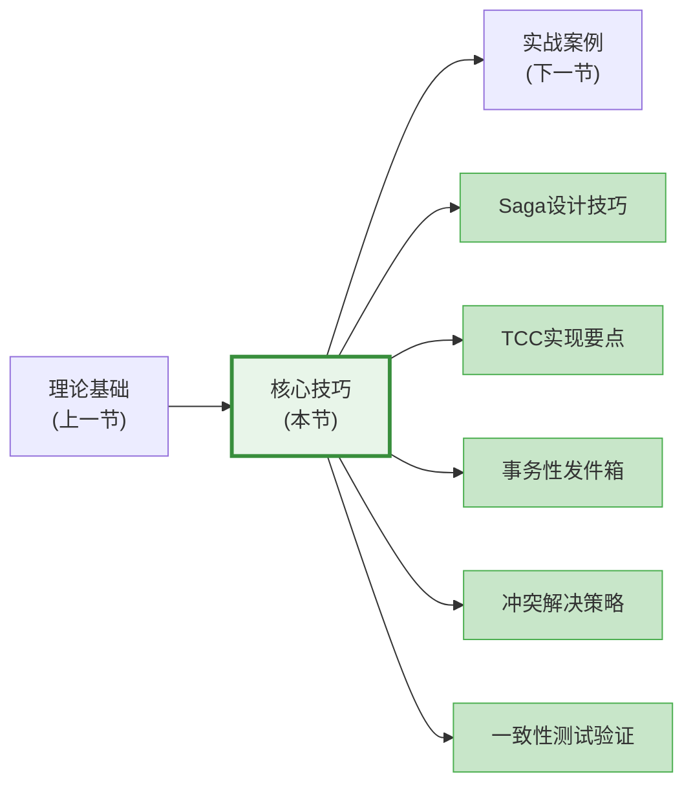
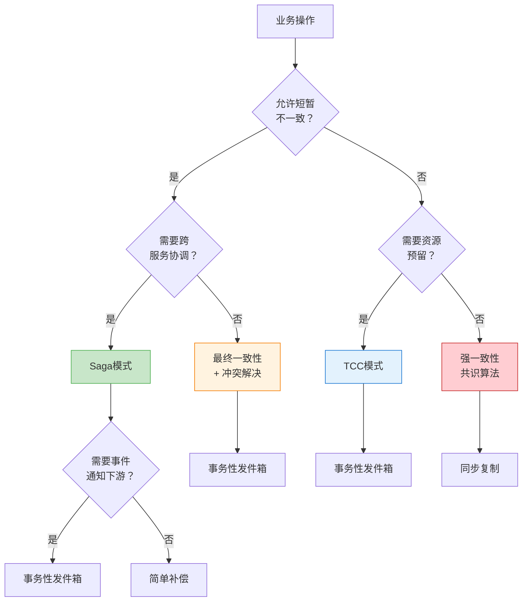

# 核心技巧：从理论到工程的桥梁

理论告诉你"是什么"，技巧告诉你"怎么做"。本节是第50章中工程含量最高的部分——它将上一节建立的一致性模型、CAP定理、CRDT、Saga/TCC等理论知识，转化为可直接落地的工程实践。每一个技巧都来自真实生产系统中的反复试错与经验沉淀。

如果你正在设计一个分布式系统，面对"这个操作到底该用什么一致性模型""Saga补偿失败了怎么办""消息丢了如何保证不丢数据"这类问题，本节就是你需要的答案。

---

## 本节内容概览

本节覆盖分布式系统数据一致性的五大核心工程技巧：

| 序号 | 技巧 | 核心问题 | 适用场景 |
|------|------|---------|---------|
| 1 | Saga模式的设计技巧 | 长事务如何安全地拆分与补偿 | 电商下单、跨服务转账 |
| 2 | TCC模式的实现要点 | 如何在资源层面实现分布式事务 | 金融转账、库存锁定 |
| 3 | 事务性发件箱的工程实现 | 如何保证"写库"和"发消息"的原子性 | 事件驱动架构、CQRS |
| 4 | 冲突解决策略 | 多副本并发写入时如何合并冲突 | 多数据中心同步、协作编辑 |
| 5 | 一致性测试与验证 | 如何验证系统确实满足声称的一致性 | 生产系统上线前的可靠性验证 |



---

## 一、Saga模式的设计技巧

Saga模式将一个长事务（Long-Lived Transaction）拆分为一系列本地事务，每个本地事务都有对应的补偿操作。当某个步骤失败时，按逆序执行已完成步骤的补偿操作，实现最终一致性。但"知道Saga"和"用好Saga"之间有巨大的鸿沟——以下是你必须掌握的核心设计技巧。

### 1.1 边界划分：哪些操作应该放在一个Saga中

Saga的边界划分直接决定了系统的复杂度和可靠性。划分过粗会导致补偿逻辑过于复杂，划分过细会导致Saga链路过长、事务语义丢失。

**原则一：以业务语义为边界**。一个Saga应该对应一个完整的业务用例，而不是一个技术操作。

✅ 正确的Saga边界（以"用户下单"为单位）：
  创建订单 → 扣减库存 → 锁定优惠券 → 扣款 → 发送通知

❌ 错误的Saga边界（以"数据库操作"为单位）：
  INSERT订单 → UPDATE库存表 → UPDATE优惠券表 → UPDATE余额表

**原则二：单个Saga的步骤数控制在3-7个**。超过7个步骤的Saga，补偿逻辑的排列组合呈指数级增长，极难测试和维护。如果步骤过多，应该拆分为多个子Saga。

**原则三：识别"不可补偿操作"**。有些操作一旦执行就无法完全撤回——比如发送短信、调用第三方支付接口、物理发货。这些操作应该放在Saga的最后一步执行，或者设计为"可重试+幂等"的模式。

| 操作类型 | 可补偿性 | 设计策略 |
|---------|---------|---------|
| 数据库写入 | ✅ 可补偿 | 通过补偿SQL回滚 |
| Redis缓存更新 | ✅ 可补偿 | 通过补偿写入恢复 |
| 发送邮件/短信 | ⚠️ 部分可补偿 | 发送"撤回通知"或标记为无效 |
| 调用第三方支付 | ⚠️ 部分可补偿 | 发起退款而非撤销 |
| 物理发货 | ❌ 不可补偿 | 放在Saga最后，或通过逆向物流处理 |

### 1.2 补偿幂等性：补偿操作必须安全重试

在分布式环境中，补偿操作可能因为网络超时而需要重试。如果补偿操作不是幂等的，重复执行会导致数据错误——比如"退款100元"被执行了两次，变成了"退款200元"。

**补偿幂等性的三种实现策略：**

```python
# 策略一：基于状态机的幂等补偿
class OrderSaga:
    """通过订单状态机保证补偿幂等性"""
    
    VALID_COMPENSATIONS = {
        "PAID":     {"cancel_payment", "cancel_order"},
        "SHIPPED":  {"cancel_shipping", "cancel_payment", "cancel_order"},
        "DELIVERED": {"return_goods", "cancel_shipping", "cancel_payment", "cancel_order"},
    }
    
    def compensate(self, order_id: str, action: str):
        order = self.db.get_order(order_id)
        
        # 关键：检查当前状态是否允许该补偿操作
        if action not in self.VALID_COMPENSATIONS.get(order.status, set()):
            logger.info(f"补偿操作 {action} 在状态 {order.status} 下已执行或不适用，跳过")
            return  # 幂等：已经补偿过了就跳过
        
        # 执行补偿
        self._execute_compensation(order_id, action)
        
        # 更新状态（标记已补偿）
        order.status = f"COMPENSATED_{action}"
        self.db.save_order(order)

# 策略二：基于补偿记录的幂等补偿
class IdempotentCompensator:
    """通过记录已执行的补偿操作保证幂等性"""
    
    def __init__(self, db):
        self.db = db
    
    def compensate(self, saga_id: str, step_id: str, compensation_fn):
        # 检查是否已执行过该补偿
        existing = self.db.query(
            "SELECT id FROM saga_compensations WHERE saga_id = %s AND step_id = %s",
            saga_id, step_id
        )
        
        if existing:
            logger.info(f"补偿 {step_id} 已执行，跳过")
            return  # 幂等
        
        # 执行补偿
        result = compensation_fn()
        
        # 记录补偿执行
        self.db.execute(
            "INSERT INTO saga_compensations (saga_id, step_id, result, executed_at) VALUES (%s, %s, %s, NOW())",
            saga_id, step_id, json.dumps(result)
        )
```

**关键原则**：补偿操作的幂等性不是"锦上添花"，而是"生死攸关"。在生产环境中，网络超时导致的重试概率远高于你的预期——根据Netflix的统计数据，生产环境中约2-5%的请求会触发超时重试。

### 1.3 语义锁：防止并发Saga的脏读

当多个Saga并发操作同一资源时（比如两个用户同时购买最后一件商品），可能出现"脏读"问题——两个Saga都读到"库存=1"，都认为自己可以扣减，结果导致超卖。

**语义锁（Semantic Lock）模式**通过在资源上附加状态标记来解决这个问题：

```python
class InventorySaga:
    """使用语义锁保护库存操作"""
    
    async def reserve_inventory(self, sku_id: str, quantity: int, saga_id: str):
        """预留库存（语义锁模式）"""
        
        # 第一步：尝试获取语义锁（CAS操作）
        # 将库存状态从 "AVAILABLE" 改为 "IN_TRANSACTION"
        result = await self.db.execute("""
            UPDATE inventory 
            SET status = 'IN_TRANSACTION', 
                locked_by = %s,
                locked_at = NOW()
            WHERE sku_id = %s 
              AND status = 'AVAILABLE'
              AND available_qty >= %s
        """, saga_id, sku_id, quantity)
        
        if result.rowcount == 0:
            # 无法获取语义锁，Saga需要等待或放弃
            raise SagaRetryableError(f"SKU {sku_id} 正在被其他事务处理，请稍后重试")
        
        # 第二步：实际扣减库存
        await self.db.execute("""
            UPDATE inventory 
            SET available_qty = available_qty - %s,
                reserved_qty = reserved_qty + %s
            WHERE sku_id = %s
        """, quantity, quantity, sku_id)
        
        # 第三步：释放语义锁
        await self.db.execute("""
            UPDATE inventory 
            SET status = 'AVAILABLE',
                locked_by = NULL,
                locked_at = NULL
            WHERE sku_id = %s AND locked_by = %s
        """, sku_id, saga_id)
    
    async def compensate_reserve(self, sku_id: str, quantity: int, saga_id: str):
        """补偿预留（释放语义锁 + 恢复库存）"""
        await self.db.execute("""
            UPDATE inventory 
            SET available_qty = available_qty + %s,
                reserved_qty = reserved_qty - %s,
                status = 'AVAILABLE',
                locked_by = NULL
            WHERE sku_id = %s
        """, quantity, quantity, sku_id)
```

### 1.4 超时处理：Saga的生死时速

Saga中的每个步骤都可能因为网络延迟、服务不可用等原因超时。超时后的处理策略直接影响系统的可靠性。

**超时后的三种选择：**

| 策略 | 适用场景 | 风险 |
|------|---------|------|
| **自动重试** | 操作天然幂等（如查询、设置值） | 重试风暴 |
| **补偿回滚** | 操作有对应的补偿操作 | 可能补偿也失败 |
| **人工介入** | 涉及资金、不可逆操作 | 影响用户体验 |

```python
class SagaTimeoutHandler:
    """Saga超时处理器"""
    
    def __init__(self, max_retries=3, retry_delay=5):
        self.max_retries = max_retries
        self.retry_delay = retry_delay
    
    async def execute_with_timeout(self, step: SagaStep, saga_id: str):
        """带超时控制的步骤执行"""
        for attempt in range(self.max_retries):
            try:
                # 设置步骤级别的超时
                result = await asyncio.wait_for(
                    step.execute(saga_id),
                    timeout=step.timeout_seconds
                )
                return result
                
            except asyncio.TimeoutError:
                logger.warning(
                    f"步骤 {step.name} 超时 (尝试 {attempt + 1}/{self.max_retries})"
                )
                
                if attempt < self.max_retries - 1:
                    # 检查步骤是否可以安全重试
                    if step.is_idempotent:
                        await asyncio.sleep(self.retry_delay * (attempt + 1))  # 指数退避
                        continue
                    else:
                        # 不可重试，直接进入补偿流程
                        raise SagaCompensateRequiredError(
                            f"步骤 {step.name} 超时且不可重试，需要补偿"
                        )
                else:
                    # 重试次数耗尽，触发补偿
                    raise SagaCompensateRequiredError(
                        f"步骤 {step.name} 超过最大重试次数"
                    )
```

**关键设计原则**：永远不要无限重试。设置明确的最大重试次数，超过后进入补偿流程。根据Netflix的经验，对于幂等操作，3次重试+指数退避可以覆盖99.9%的临时性故障。

---

## 二、TCC模式的实现要点

TCC（Try-Confirm-Cancel）是分布式事务中一种更精细的实现方式。与Saga不同，TCC在业务层面实现了"预提交"——先锁定资源（Try），确认后才真正提交（Confirm），失败则释放资源（Cancel）。

### 2.1 资源预留设计：Try阶段的关键考量

Try阶段的核心任务是**资源预留**——检查资源是否可用，如果可用则锁定它。这个阶段需要考虑几个关键问题。

**预留粒度**：预留的资源粒度应该与最终使用的粒度一致。过粗的预留会导致资源浪费（锁了100个但只用了10个），过细的预留会增加并发冲突。

```python
class OrderTCCService:
    """订单TCC服务示例"""
    
    async def try_reserve(self, order_id: str, items: list):
        """Try阶段：预留所有资源"""
        reserved_resources = []
        
        try:
            for item in items:
                # 预留库存
                await self.inventory_service.try_reserve(
                    sku_id=item.sku_id,
                    quantity=item.quantity,
                    order_id=order_id
                )
                reserved_resources.append(("inventory", item.sku_id, item.quantity))
                
                # 预留优惠券
                if item.coupon_id:
                    await self.coupon_service.try_reserve(
                        coupon_id=item.coupon_id,
                        order_id=order_id
                    )
                    reserved_resources.append(("coupon", item.coupon_id, 1))
            
            # 预留余额
            total_amount = sum(item.price * item.quantity for item in items)
            await self.account_service.try_reserve(
                user_id=order.user_id,
                amount=total_amount,
                order_id=order_id
            )
            reserved_resources.append(("account", order.user_id, total_amount))
            
            return True
            
        except Exception as e:
            # Try阶段失败，释放已预留的资源
            await self._release_reservations(order_id, reserved_resources)
            raise
    
    async def confirm(self, order_id: str):
        """Confirm阶段：确认预留，真正提交"""
        # 按预留的逆序确认（先确认后预留的）
        await self.account_service.confirm(order_id)
        await self.coupon_service.confirm(order_id)
        await self.inventory_service.confirm(order_id)
    
    async def cancel(self, order_id: str):
        """Cancel阶段：释放预留资源"""
        await self.inventory_service.cancel(order_id)
        await self.coupon_service.cancel(order_id)
        await self.account_service.cancel(order_id)
```

### 2.2 空回滚处理：Try没执行但Cancel来了

在分布式系统中，由于网络延迟或服务不可用，可能出现这种情况：Cancel请求先于Try请求到达服务端。此时服务端需要正确处理"空回滚"——没有预留过资源，但收到了释放请求。

```python
class TCCResourceService:
    """处理空回滚的TCC资源服务"""
    
    async def cancel(self, order_id: str, resource_id: str):
        """Cancel操作（需处理空回滚）"""
        
        # 检查是否有对应的预留记录
        reservation = await self.db.query(
            "SELECT id, status FROM tcc_reservations WHERE order_id = %s AND resource_id = %s",
            order_id, resource_id
        )
        
        if not reservation:
            # 空回滚：Try没有执行，记录一个空操作标记
            await self.db.execute("""
                INSERT INTO tcc_cancellations (order_id, resource_id, is_empty, created_at)
                VALUES (%s, %s, true, NOW())
            """, order_id, resource_id)
            logger.info(f"空回滚: order={order_id}, resource={resource_id}")
            return
        
        if reservation.status == "CANCELLED":
            # 已经取消过了，幂等处理
            logger.info(f"重复取消: order={order_id}, resource={resource_id}")
            return
        
        # 正常取消：释放预留资源
        await self.db.execute("""
            UPDATE tcc_reservations SET status = 'CANCELLED' 
            WHERE order_id = %s AND resource_id = %s AND status = 'RESERVED'
        """, order_id, resource_id)
        
        # 实际释放资源（如增加库存）
        await self._release_resource(resource_id, reservation)
```

### 2.3 悬挂预防：Cancel先到，Try后到

**悬挂（Hanging）**是TCC中最棘手的问题之一：Cancel请求先到达（因为空回滚被记录了），之后Try请求才到达。如果Try没有检查空回滚标记，就会成功预留资源，但这个资源永远不会被Confirm或Cancel——就像悬在半空中一样。

```python
class TCCResourceService:
    """防止TCC悬挂的完整实现"""
    
    async def try_reserve(self, order_id: str, resource_id: str, quantity: int):
        """Try操作（需预防悬挂）"""
        
        # 关键：在Try之前检查是否已经有空回滚记录
        empty_cancel = await self.db.query(
            "SELECT id FROM tcc_cancellations WHERE order_id = %s AND resource_id = %s",
            order_id, resource_id
        )
        
        if empty_cancel:
            # 发现空回滚标记，说明Cancel先到了
            # 不再执行Try，直接拒绝
            logger.warning(f"防止悬挂: order={order_id}, resource={resource_id}")
            raise TCCRejectError("该操作已被取消，无法预留")
        
        # 检查是否已经预留过（幂等）
        existing = await self.db.query(
            "SELECT id FROM tcc_reservations WHERE order_id = %s AND resource_id = %s AND status = 'RESERVED'",
            order_id, resource_id
        )
        
        if existing:
            # 已经预留过，幂等返回
            return True
        
        # 执行预留
        await self.db.execute("""
            INSERT INTO tcc_reservations (order_id, resource_id, quantity, status, created_at)
            VALUES (%s, %s, %s, 'RESERVED', NOW())
        """, order_id, resource_id, quantity)
        
        return True
```

**悬挂预防的核心机制**：通过"空回滚记录"（`tcc_cancellations`表）在Cancel和Try之间建立因果关系。Try在执行前必须检查是否已有Cancel记录，如果有则拒绝执行。这保证了分布式事务的完整性。

---

## 三、事务性发件箱的工程实现

事务性发件箱（Transactional Outbox）解决了分布式系统中最经典的"双写问题"：如何保证"更新数据库"和"发送消息"的原子性？

### 3.1 问题本质：双写不可能原子

在事件驱动架构中，服务A完成业务操作后，需要同时：1）更新本地数据库，2）发送事件消息到消息队列。但如果这两个操作不在同一个事务中：

场景一（先写库再发消息）：
  ✅ 数据库写入成功
  ❌ 消息发送失败（网络异常）
  结果：数据库有数据，但消息丢失，下游服务不知道发生了什么

场景二（先发消息再写库）：
  ✅ 消息发送成功
  ❌ 数据库写入失败（约束冲突）
  结果：下游收到了事件，但数据库没有对应的数据

### 3.2 本地消息表模式

事务性发件箱的核心思路：**在同一个本地数据库事务中，既写入业务数据，又写入一条"待发送消息"**。然后由一个后台进程轮询待发送消息表，将消息可靠地投递到消息队列。

```python
class OrderService:
    """使用事务性发件箱的订单服务"""
    
    async def create_order(self, user_id: str, items: list):
        """创建订单（事务性发件箱模式）"""
        
        async with self.db.transaction() as tx:
            # 1. 创建订单（业务数据）
            order_id = str(uuid.uuid4())
            await tx.execute(
                "INSERT INTO orders (id, user_id, status, created_at) VALUES (%s, %s, 'CREATED', NOW())",
                order_id, user_id
            )
            
            for item in items:
                await tx.execute(
                    "INSERT INTO order_items (order_id, sku_id, quantity, price) VALUES (%s, %s, %s, %s)",
                    order_id, item.sku_id, item.quantity, item.price
                )
            
            # 2. 写入发件箱（在同一事务中！）
            event = {
                "event_type": "OrderCreated",
                "order_id": order_id,
                "user_id": user_id,
                "items": [{"sku_id": i.sku_id, "qty": i.quantity} for i in items],
                "timestamp": datetime.utcnow().isoformat()
            }
            
            await tx.execute(
                "INSERT INTO outbox (id, event_type, payload, status, created_at) "
                "VALUES (%s, %s, %s, 'PENDING', NOW())",
                str(uuid.uuid4()), event["event_type"], json.dumps(event)
            )
        
        # 事务提交后，后台进程会自动将消息投递到MQ
        return order_id


class OutboxProcessor:
    """发件箱处理器：后台轮询并投递消息"""
    
    def __init__(self, db, mq_client, batch_size=50):
        self.db = db
        self.mq = mq_client
        self.batch_size = batch_size
    
    async def process_pending(self):
        """处理待发送消息"""
        while True:
            try:
                # 1. 查询待发送消息（使用悲观锁避免重复投递）
                messages = await self.db.query("""
                    SELECT id, event_type, payload 
                    FROM outbox 
                    WHERE status = 'PENDING' 
                    ORDER BY created_at ASC 
                    LIMIT %s
                    FOR UPDATE SKIP LOCKED
                """, self.batch_size)
                
                if not messages:
                    await asyncio.sleep(1)  # 无消息时休眠
                    continue
                
                # 2. 批量投递到消息队列
                for msg in messages:
                    try:
                        await self.mq.publish(
                            topic=msg.event_type,
                            key=msg.payload.get("order_id"),
                            value=msg.payload
                        )
                        
                        # 3. 标记为已发送
                        await self.db.execute(
                            "UPDATE outbox SET status = 'SENT', sent_at = NOW() WHERE id = %s",
                            msg.id
                        )
                    except Exception as e:
                        logger.error(f"消息投递失败: {msg.id}, error: {e}")
                        # 保持PENDING状态，下次重试
                
            except Exception as e:
                logger.error(f"发件箱处理异常: {e}")
                await asyncio.sleep(5)
```

### 3.3 CDC（变更数据捕获）模式

除了轮询本地消息表，另一种更高效的实现是使用CDC工具（如Debezium）直接从数据库的变更日志（binlog/WAL）中捕获变更事件，无需修改应用代码。

**CDC模式的优势：**
- 零侵入：不需要在应用代码中写入发件箱
- 高性能：基于日志流，延迟通常在毫秒级
- 顺序保证：按数据库提交顺序投递

**CDC模式的挑战：**
- 架构复杂度：需要部署和维护Debezium/Kafka Connect
- Schema变更：数据库表结构变更需要同步更新Debezium配置
- 初始快照：存量数据需要单独处理

| 对比维度 | 本地消息表 | CDC模式 |
|---------|-----------|---------|
| 侵入性 | 高（需改代码） | 零（监听binlog） |
| 延迟 | 秒级（轮询间隔） | 毫秒级（实时流） |
| 运维复杂度 | 低 | 中-高 |
| 适用场景 | 简单系统、快速落地 | 复杂系统、已有CDC基础设施 |
| 可靠性 | 高（事务保证） | 高（日志持久化） |
| 灵活性 | 高（可自定义事件） | 中（只能捕获变更） |

### 3.4 消息去重与表清理

事务性发件箱的一个副作用是消息可能被重复投递（至少一次语义）。接收端必须实现幂等消费。

**发件箱表清理策略：**

```sql
-- 定期清理已发送的消息（保留7天用于排查问题）
DELETE FROM outbox 
WHERE status = 'SENT' 
  AND sent_at < NOW() - INTERVAL '7 days';

-- 使用分区表优化清理性能（PostgreSQL示例）
CREATE TABLE outbox (
    id UUID PRIMARY KEY,
    event_type VARCHAR(255),
    payload JSONB,
    status VARCHAR(50),
    created_at TIMESTAMP,
    sent_at TIMESTAMP
) PARTITION BY RANGE (created_at);

-- 按月分区
CREATE TABLE outbox_2026_01 PARTITION OF outbox
    FOR VALUES FROM ('2026-01-01') TO ('2026-02-01');
```

---

## 四、冲突解决策略

当多个副本并发修改同一数据时，冲突不可避免。不同的冲突解决策略适用于不同的业务场景。

### 4.1 LWW（Last Write Wins）：最简单但最粗暴

LWW按照时间戳决定哪个写入"赢"——最新时间戳的写入覆盖旧值。

```python
class LWWRegister:
    """Last Write Wins 寄存器"""
    
    def __init__(self):
        self.value = None
        self.timestamp = 0
        self.node_id = None
    
    def set(self, value, timestamp: float, node_id: str):
        """设置值（LWW策略）"""
        if timestamp > self.timestamp or (
            timestamp == self.timestamp and node_id > self.node_id
        ):
            self.value = value
            self.timestamp = timestamp
            self.node_id = node_id
            return True  # 写入成功
        return False  # 被更晚的写入覆盖
    
    def get(self):
        """获取当前值"""
        return self.value
    
    def merge(self, other: 'LWWRegister'):
        """合并两个副本（LWW策略）"""
        if other.timestamp > self.timestamp or (
            other.timestamp == self.timestamp and other.node_id > self.node_id
        ):
            self.value = other.value
            self.timestamp = other.timestamp
            self.node_id = other.node_id
```

**LWW的致命缺陷**：如果两个写入的时间戳相近（时钟偏移范围内），结果取决于时钟精度，可能导致数据丢失。Google Spanner的TrueTime正是为了解决这个问题。

**适用场景**：用户个人设置、配置项、非关键数据的最终同步。
**不适用场景**：计数器、金融数据、任何"累计型"数据。

### 4.2 应用层合并：业务感知的冲突解决

应用层合并让业务逻辑来决定如何解决冲突，而不是简单地"最新覆盖"。

```python
class ShoppingCartMerger:
    """购物车冲突合并器（应用层合并）"""
    
    def merge(self, local_cart: dict, remote_cart: dict) -> dict:
        """合并两个购物车版本"""
        merged = {}
        
        # 合并商品：取数量较大的版本（用户可能在两端都加了商品）
        all_skus = set(local_cart.get("items", {}).keys()) | set(remote_cart.get("items", {}).keys())
        merged_items = {}
        
        for sku_id in all_skus:
            local_qty = local_cart.get("items", {}).get(sku_id, 0)
            remote_qty = remote_cart.get("items", {}).get(sku_id, 0)
            
            # 取较大值（用户意图是添加更多）
            merged_items[sku_id] = max(local_qty, remote_qty)
        
        merged["items"] = merged_items
        
        # 合并优惠券：取较新的选择（用户可能在两端选了不同优惠券）
        local_coupon = local_cart.get("selected_coupon")
        remote_coupon = remote_cart.get("selected_coupon")
        
        if local_coupon and remote_coupon:
            # 取更新时间较晚的
            merged["selected_coupon"] = (
                local_coupon if local_coupon["updated_at"] > remote_coupon["updated_at"]
                else remote_coupon
            )
        else:
            merged["selected_coupon"] = local_coupon or remote_coupon
        
        return merged
```

### 4.3 版本向量：追踪因果关系

版本向量（Version Vector）用于追踪数据的因果关系，判断两个并发更新是否具有因果依赖。

```python
class VersionVector:
    """版本向量：追踪因果关系"""
    
    def __init__(self):
        self.vector = {}  # {node_id: logical_clock}
    
    def increment(self, node_id: str):
        """节点递增自己的逻辑时钟"""
        self.vector[node_id] = self.vector.get(node_id, 0) + 1
    
    def merge(self, other: 'VersionVector'):
        """合并两个版本向量（取各分量最大值）"""
        for node_id, clock in other.vector.items():
            self.vector[node_id] = max(self.vector.get(node_id, 0), clock)
    
    def happens_before(self, other: 'VersionVector') -> bool:
        """判断当前版本是否 happened-before 其他版本"""
        dominated = False
        for node_id in set(self.vector.keys()) | set(other.vector.keys()):
            my_clock = self.vector.get(node_id, 0)
            other_clock = other.vector.get(node_id, 0)
            if my_clock > other_clock:
                return False  # 至少有一个分量更大，不是happened-before
            if my_clock < other_clock:
                dominated = True
        return dominated
    
    def concurrent_with(self, other: 'VersionVector') -> bool:
        """判断两个版本是否并发"""
        return not self.happens_before(other) and not other.happens_before(self)
```

| 冲突解决策略 | 复杂度 | 数据安全性 | 适用场景 |
|-------------|--------|-----------|---------|
| LWW | 低 | 低（可能丢数据） | 配置同步、非关键数据 |
| 应用层合并 | 中 | 中（依赖业务逻辑） | 购物车、协作文档 |
| 版本向量 | 高 | 高（精确追踪因果） | 多数据中心同步、分布式数据库 |
| CRDT | 中-高 | 高（自动收敛） | 实时协作、离线优先应用 |

---

## 五、一致性测试与验证

你声称系统提供线性一致性，但你怎么证明？一致性不是"测试一下不报错"就能确认的属性——它需要系统化的方法和工具。

### 5.1 Jepsen测试：分布式系统一致性的金标准

Jepsen由Kyle Kingsbury（Aphyr）创建，是分布式系统一致性验证的行业标准工具。它通过以下方式验证系统：

**第一步：定义操作模型**。描述系统支持的读写操作及其语义。

```python
# Jepsen测试的操作定义示例
class RegisterClient:
    """Jepsen测试客户端"""
    
    def setup(self):
        self.client = etcd.Client(hosts=['node1:2379', 'node2:2379', 'node3:2379'])
    
    def invoke(self, op):
        """执行操作"""
        if op.type == "read":
            value = self.client.get(op.value['key'])
            return op.ok(value)
        elif op.type == "write":
            self.client.put(op.value['key'], op.value['value'])
            return op.ok()
    
    def teardown(self):
        self.client.close()
```

**第二步：注入故障**。在测试过程中随机制造网络分区、进程崩溃、时钟偏移等异常。

**第三步：验证一致性模型**。使用检查器验证操作历史是否满足声称的一致性模型。

**Jepsen发现的知名bug：**

| 系统 | 发现的问题 | 影响 |
|------|-----------|------|
| MongoDB 3.x | 默认配置违反线性一致性 | 读取可能返回过期数据 |
| Cassandra | 在某些一致性级别下违反线性一致性 | 数据不一致 |
| etcd v2 | 特定网络分区下违反线性一致性 | 分布式锁可能失效 |
| Consul | 在某些Raft实现细节上存在bug | Leader选举可能出现问题 |
| CockroachDB | 早期版本在特定场景下违反可串行化 | 事务隔离被破坏 |

### 5.2 线性一致性检查器：Porcupine和Knossos

**Porcupine**是Go语言编写的高效线性一致性检查器，基于模型检验技术。它可以自动验证一组操作历史是否满足线性一致性。

```python
# 使用Python调用Porcupine验证线性一致性
import json
import subprocess

def check_linearizability(history_file: str) -> dict:
    """通过Porcupine检查线性一致性"""
    
    # 操作历史格式
    # 每条记录: [客户端ID, 操作类型, 时间戳, 键, 输入值, 输出值]
    history = [
        {"client": 0, "type": "invoke", "time": 0, "key": "x", "input": 1, "output": None},
        {"client": 1, "type": "invoke", "time": 1, "key": "x", "input": None, "output": None},
        {"client": 0, "type": "ok", "time": 2, "key": "x", "input": 1, "output": 1},
        {"client": 1, "type": "ok", "time": 3, "key": "x", "input": None, "output": 0},  # 违反线性一致性
    ]
    
    # 调用Porcupine检查
    result = subprocess.run(
        ["porcupine", "check", "--model", "register", history_file],
        capture_output=True,
        text=True
    )
    
    return {
        "linearizable": result.returncode == 0,
        "error": result.stderr if result.returncode != 0 else None
    }
```

**Knossos**使用偏序执行技术，可以处理更长的操作历史，适合大规模测试场景。

### 5.3 混沌工程：在混乱中验证一致性

混沌工程通过**系统性地注入故障**来验证系统在异常条件下的行为。与传统的测试不同，混沌工程关注的是"系统的整体行为"而非"单个功能的正确性"。

```python
class ChaosTestRunner:
    """混沌测试运行器"""
    
    def __init__(self, cluster_config):
        self.config = cluster_config
        self.fault_injectors = {
            "network_partition": NetworkPartitionInjector,
            "process_kill": ProcessKillInjector,
            "clock_skew": ClockSkewInjector,
            "disk_full": DiskFullInjector,
            "cpu_stress": CPUStressInjector,
        }
    
    async def run_consistency_test(self, duration_seconds=300):
        """运行一致性混沌测试"""
        history = []
        anomalies = []
        
        # 启动故障注入器
        fault_task = asyncio.create_task(self._random_faults(duration_seconds))
        
        # 启动客户端操作
        client_tasks = []
        for i in range(10):
            client_tasks.append(
                asyncio.create_task(self._client_operations(i, history))
            )
        
        # 等待测试完成
        await asyncio.gather(*client_tasks)
        fault_task.cancel()
        
        # 分析结果
        is_linearizable = self._check_linearizability(history)
        anomaly_rate = len(anomalies) / len(history) if history else 0
        
        return {
            "duration": duration_seconds,
            "total_operations": len(history),
            "linearizable": is_linearizable,
            "anomaly_rate": f"{anomaly_rate:.2%}",
            "anomalies": anomalies[:100]  # 只返回前100个异常
        }
    
    async def _random_faults(self, duration: int):
        """随机注入故障"""
        import random
        end_time = time.time() + duration
        
        while time.time() < end_time:
            fault_type = random.choice(list(self.fault_injectors.keys()))
            injector = self.fault_injectors[fault_type](self.config)
            
            try:
                await injector.inject()
                await asyncio.sleep(random.uniform(5, 30))  # 故障持续5-30秒
                await injector.heal()
            except Exception as e:
                logger.error(f"故障注入异常: {e}")
            
            await asyncio.sleep(random.uniform(10, 60))  # 故障间隔10-60秒
```

### 5.4 一致性测试的四层验证体系

一个完整的一致性验证策略应该包含四个层次：

| 层次 | 方法 | 覆盖范围 | 执行频率 | 工具 |
|------|------|---------|---------|------|
| **L1: 单元测试** | 读写一致性快速验证 | 单个服务的一致性 | 每次提交 | 自定义测试框架 |
| **L2: 集成测试** | 多服务协作一致性 | 服务间交互 | 每次PR | Docker Compose + 测试框架 |
| **L3: 混沌测试** | 故障注入+一致性验证 | 整个集群 | 每周/发布前 | Chaos Mesh + Porcupine |
| **L4: Jepsen测试** | 全面的一致性验证 | 系统级 | 大版本发布前 | Jepsen框架 |

---

## 六、技巧选型决策框架

面对具体的一致性需求，如何选择合适的技巧？以下决策框架可以帮助你系统地思考：

### 6.1 一致性需求分析矩阵



### 6.2 场景速查表

| 场景 | 推荐技巧 | 关键考量 |
|------|---------|---------|
| 电商下单（扣库存+创建订单+扣款） | Saga + 事务性发件箱 | 补偿幂等性、超时处理 |
| 跨服务转账（A扣B加） | TCC | 资源预留、悬挂预防 |
| 用户注册（创建账户+发送邮件） | Saga + 事务性发件箱 | 邮件作为最后一步 |
| 多数据中心配置同步 | CRDT（LWW-Register） | 时钟同步、冲突合并 |
| 协作文档编辑 | CRDT（OR-Set）+ 版本向量 | 因果追踪、操作转换 |
| 库存扣减（高并发） | 语义锁 + Saga | 防超卖、并发控制 |
| 事件驱动微服务 | 事务性发件箱 + CDC | 消息去重、顺序保证 |
| 分布式配置管理 | etcd/Raft | 线性一致性读写 |

### 6.3 技巧组合模式

在实际系统中，这些技巧通常组合使用。以下是三种常见的组合模式：

**模式一：Saga + 事务性发件箱（最常用）**
适用于大多数微服务架构。Saga负责跨服务的事务编排，事务性发件箱负责事件的可靠投递。

**模式二：TCC + 事务性发件箱**
适用于需要强隔离保证的场景（如金融转账）。TCC在Try阶段预留资源，Confirm/Cancel通过事务性发件箱通知下游。

**模式三：CRDT + CDC**
适用于多数据中心同步。CRDT保证并发更新的自动收敛，CDC负责高效的变更传播。

---

## 本节核心要点回顾

1. **Saga设计的四个关键技巧**：边界划分（以业务语义为单位，3-7步为宜）、补偿幂等性（状态机或补偿记录）、语义锁（CAS操作防脏读）、超时处理（有限重试+指数退避）

2. **TCC实现的三个难点**：资源预留粒度、空回滚处理（检查Cancel标记）、悬挂预防（Try前检查空回滚记录）

3. **事务性发件箱的两种模式**：本地消息表（简单、零依赖）和CDC模式（高性能、零侵入），选择取决于系统复杂度和基础设施

4. **冲突解决的三种策略**：LWW（简单但可能丢数据）、应用层合并（业务感知）、版本向量（精确因果追踪）

5. **一致性验证的四层体系**：单元测试→集成测试→混沌测试→Jepsen测试，层层递进验证

这些技巧不是孤立的工具，而是分布式系统设计的"手术刀"——正确的场景使用正确的技巧，才能构建出既可靠又高效的系统。下一节的实战案例将展示这些技巧在真实系统中的完整应用。
