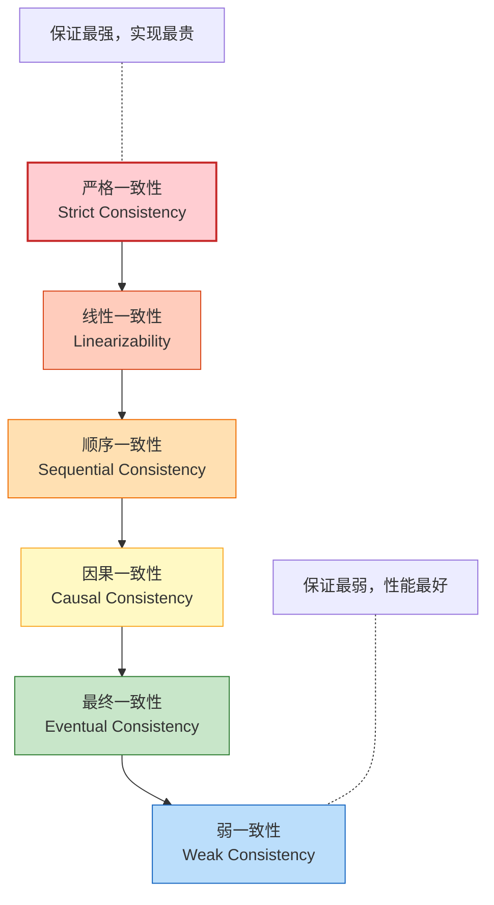
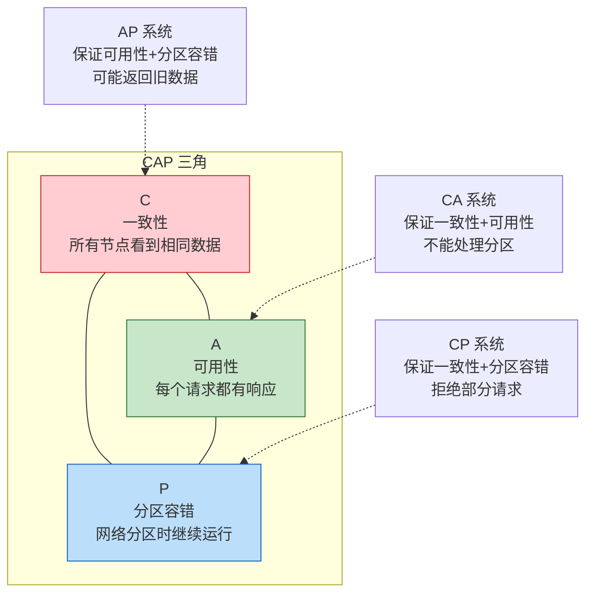
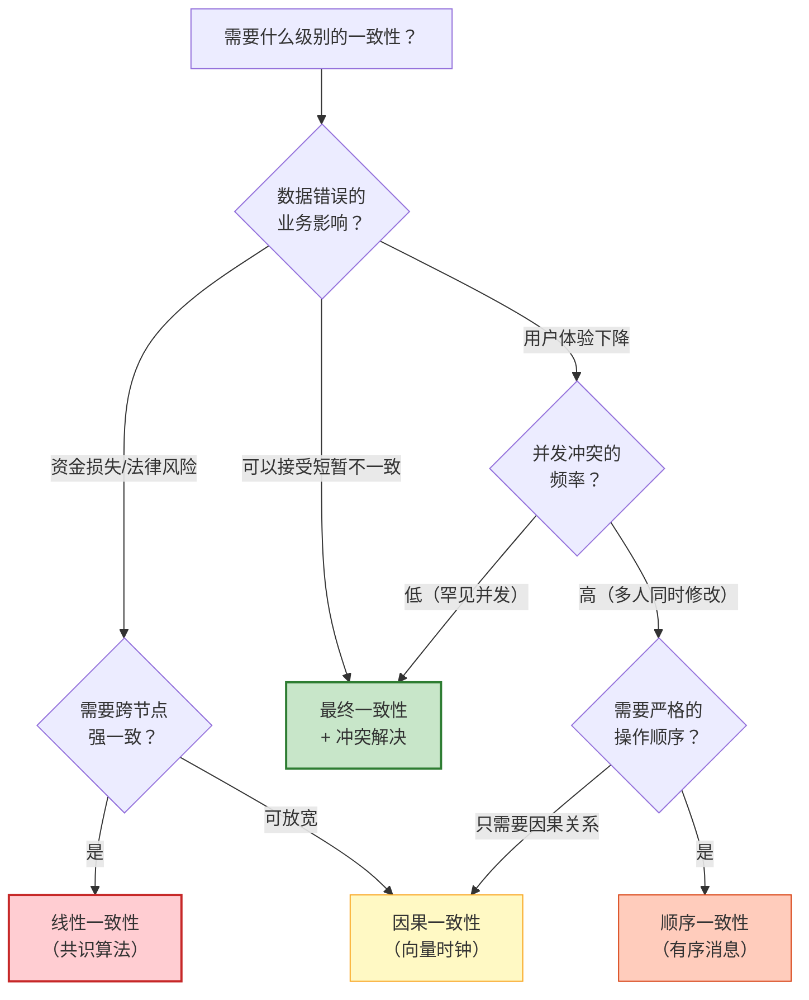

# 一致性模型的层次体系与根本性约束

一致性（Consistency）是分布式系统设计中最核心的概念，也是最容易被误解的概念之一。本节从最严格的一致性定义出发，逐级放松约束，构建一个完整的层次体系，同时深入剖析 CAP 定理、FLP 不可能性定理和 PACELC 定理这三个根本性理论约束，帮助读者建立正确的一致性认知框架。

---

## 1. 什么是分布式一致性

### 1.1 一致性的本质问题

在单机数据库中，所有数据存放在同一个存储引擎里，事务的 ACID 特性通过锁和 WAL（Write-Ahead Log）就能保证。但当数据被复制到多个节点后，一个根本性问题出现了：**多个副本之间如何保持一致？**

这个问题之所以困难，根源在于三个不可回避的现实：

1. **网络不可靠**：消息可能延迟、丢失、重复、乱序。两个节点之间的通信没有确定性的延迟上限
2. **节点会故障**：任何节点都可能在任何时刻宕机，且无法区分"慢节点"和"已死节点"
3. **时钟不可信**：不同节点的物理时钟存在漂移（通常在毫秒级），无法用物理时钟作为全局排序的依据

这三个约束意味着，分布式系统中的"一致性"不可能像单机那样简单地通过锁来实现，而必须在一致性强度、性能和可用性之间做出精细的权衡。

### 1.2 一致性的形式化视角

从理论角度看，一致性模型定义了分布式系统中**操作的可见性规则**——即一个操作的结果在什么时候、以什么顺序对其他操作可见。

具体来说，一致性模型回答两个核心问题：

- **排序问题**：当多个客户端并发执行操作时，这些操作的全局顺序是什么？
- **可见性问题**：一个操作完成后，其他节点何时能看到这个操作的结果？

不同的回答方式定义了不同强度的一致性模型，从最强到最弱构成了一个层次体系。

---

## 2. 一致性模型层次体系

一致性模型形成了一个从强到弱的层次结构。越强的一致性模型提供越强的保证，但实现成本也越高；越弱的模型性能越好，但需要应用层处理更多的不一致场景。



### 2.1 严格一致性（Strict Consistency）

严格一致性是最强的一致性模型，也称为**原子一致性（Atomic Consistency）**。它要求：

- 任何读操作都能返回最近一次写操作的结果
- 所有操作看起来像是在单一副本上原子执行的
- 操作的顺序严格遵循真实时间的先后关系

**形式化定义**：对于任意两个操作 O₁ 和 O₂，如果 O₁ 在真实时间上先于 O₂ 完成（记作 O₁ <rt O₂），那么任何副本上观察到的顺序都必须满足 O₁ 在 O₂ 之前。

**实现要求**：严格一致性要求全局同步时钟的存在，而物理时钟无法满足这个要求。因此，**严格一致性在异步分布式系统中是不可实现的**。它是理论上的完美模型，作为其他一致性模型的参照基准。

**实际意义**：虽然不可实现，但严格一致性定义了"完美一致"的标准，所有其他一致性模型都是对它的不同程度的放松。

### 2.2 线性一致性（Linearizability）

线性一致性由 Herlihy 和 Wing 在 1990 年提出，是实践中最强的一致性模型。它在严格一致性的基础上放宽了一个条件：**不要求操作的全局顺序与物理时间完全一致，但要求在一个操作的"生效时间窗口"内的约束被尊重**。

**核心规则**：

1. **实时性约束**：如果操作 O₁ 在操作 O₂ 开始之前就已经完成（O₁ 的生效时间窗口在 O₂ 之前结束），那么在全局顺序中 O₁ 必须排在 O₂ 之前
2. **原子性**：每个操作看起来是在某个瞬间完成的，不是渐进的
3. **单一拷贝等价**：所有操作看起来像是在单一副本上按某个顺序串行执行的

**与严格一致性的区别**：线性一致性允许并发操作的相对顺序不确定。只有在操作的时间窗口有明确的先后关系时，才强制约束顺序。

```python
# 线性一致性示例：银行账户操作
#
# 时间线：
#   Client A: write(x, 1) ────[生效]────────
#   Client B: ──────────── write(x, 2) ────[生效]────
#   Client C: ──────────────── read(x) → 必须返回 2
#
# 线性一致性的保证：
# - Client C 的 read(x) 发生在 write(x,2) 生效之后
# - 因此 read(x) 必须返回 2
# - 全局顺序：write(x,1) → write(x,2) → read(x)

class LinearizableRegister:
    """线性一致性的寄存器实现（简化版，基于共识）"""
    
    def __init__(self, consensus_group):
        # 线性一致性通常需要共识算法支持
        self.consensus = consensus_group
        self.value = None
        self.version = 0
    
    def write(self, value):
        """写操作：需要多数节点确认才能返回"""
        self.version += 1
        # 通过共识协议确保所有副本以相同顺序执行写操作
        self.consensus.propose({
            'op': 'write',
            'value': value,
            'version': self.version
        })
        # 等待多数节点确认后才返回
        self.consensus.wait_for_quorum()
    
    def read(self):
        """读操作：必须读到最新已提交的值"""
        # 方案1：将读操作也走共识协议（最安全但最慢）
        result = self.consensus.propose({'op': 'read'})
        return result['value']
        
        # 方案2：Lease机制（读操作不走共识，但需要租约保护）
        # if self.lease.is_valid():
        #     return self.local_value
        # else:
        #     return self.consensus.propose({'op': 'read'})
```

**性能特征**：

| 操作 | 延迟 | 原因 |
|------|------|------|
| 写操作 | 至少 1 个 RTT（通常更高） | 需要多数节点确认 |
| 读操作（走共识） | 至少 1 个 RTT | 需要验证当前 Leader 的租约 |
| 读操作（Lease） | 本地读取 | 在 Lease 有效期内直接读本地 |

**典型实现**：Raft、Paxos、ZAB 共识算法提供线性一致性保证。etcd、Consul、ZooKeeper 等系统在使用共识协议时提供线性一致性。

**适用场景**：

- 银行转账：A 账户扣款和 B 账户入账必须严格有序
- 分布式锁：获取锁的节点必须看到锁释放前的所有修改
- 配置中心：配置变更必须按顺序被所有节点感知

### 2.3 顺序一致性（Sequential Consistency）

顺序一致性由 Lamport 在 1979 年提出，比线性一致性稍弱。它放松了**实时性约束**，只要求：

1. **所有进程看到相同的操作顺序**（一致性条件）
2. **每个进程内部的操作顺序与其程序顺序一致**（程序顺序条件）

**与线性一致性的关键区别**：顺序一致性不要求操作的全局顺序与物理时间一致。一个"迟到"的操作可以被排在全局顺序中更靠前的位置。

```python
# 顺序一致性 vs 线性一致性
#
# 初始状态：x = 0, y = 0
#
# 时间线：
#   P1: write(x, 1) ──── write(y, 1)
#   P2: ──── read(x) → 1  ──── read(y) → 0
#
# 线性一致性下的合法读取序列：
#   P2: read(x) → 1, read(y) → 1  (必须读到最新值)
#
# 顺序一致性下的合法读取序列（两种都合法）：
#   全局顺序1: write(x,1) → read(x)→1 → read(y)→0 → write(y,1)
#   全局顺序2: write(x,1) → read(x)→1 → write(y,1) → read(y)→1
#
# 顺序一致性允许 P2 的 read(y) 返回 0，因为它可以排在 write(y,1) 之前
# 但线性一致性要求 read(y) 必须返回 1（因为 write(y,1) 已经完成）
```

**为什么顺序一致性比线性一致性弱？**

线性一致性要求全局顺序必须尊重操作的完成时间，而顺序一致性只要求：

- 每个进程看到自己的程序顺序
- 所有进程看到相同的全局顺序（但这个顺序可以不尊重物理时间）

这意味着，在顺序一致性下，一个在物理时间上已经完成的操作，可以被排在全局顺序中更靠后的位置——只要不违反任何进程的程序顺序。

**性能优势**：顺序一致性不需要像线性一致性那样每次都走共识协议。它只需要保证操作的全局顺序一致，这可以通过消息的有序传递来实现，代价更低。

**典型实现**：

- ZooKeeper 在 `sync()` 之后的读操作提供顺序一致性
- 多线程编程中的 Sequentially Consistent Memory（C++ `std::memory_order_seq_cst`）

### 2.4 因果一致性（Causal Consistency）

因果一致性进一步放松了约束：**只要求有因果关系的操作被所有节点以相同的顺序观察到，并发操作的顺序可以不同**。

**因果关系的定义**（Lamport 的 happens-before 关系）：

两个事件 A 和 B 之间存在因果关系（记作 A → B），当且仅当满足以下任一条件：

1. **程序顺序**：A 和 B 在同一个进程中，且 A 在 B 之前执行
2. **消息传递**：A 是发送消息的事件，B 是接收该消息的事件
3. **传递性**：存在事件 C，使得 A → C 且 C → B

如果 A → B 不成立且 B → A 也不成立，则 A 和 B 是**并发的（Concurrent）**。

# 因果关系示例：社交媒体
#
# 用户A发帖 → 用户B回复 → 用户C看到"帖子+回复"
# 用户A发帖 → 用户D回复 → 用户C看到"帖子+回复"
# 但是：
# 用户B的回复 和 用户D的回复 是并发的
# 用户C可能以任意顺序看到B和D的回复
#
# 因果一致性保证的是：
# - 用户C一定先看到帖子，再看到回复（因果顺序）
# - 用户C看到B和D回复的顺序可以不确定（并发操作）

**实现机制**：因果一致性通常通过**向量时钟（Vector Clock）**或**版本向量（Version Vector）**来追踪因果关系。

```python
class VectorClock:
    """向量时钟：追踪分布式系统中的因果关系"""
    
    def __init__(self, node_id, num_nodes):
        self.node_id = node_id
        # 每个节点维护一个长度为 N 的向量
        # clock[i] 表示本节点已知的节点 i 的最新逻辑时间
        self.clock = [0] * num_nodes
    
    def increment(self):
        """本地事件发生时：递增自身分量"""
        self.clock[self.node_id] += 1
        return self.clock.copy()
    
    def update(self, received_clock):
        """收到消息时：取每个分量的最大值"""
        for i in range(len(self.clock)):
            self.clock[i] = max(self.clock[i], received_clock[i])
        self.clock[self.node_id] += 1
        return self.clock.copy()
    
    def happens_before(self, other_clock):
        """判断当前时钟是否 happens-before 另一个时钟"""
        dominated = False
        for i in range(len(self.clock)):
            if self.clock[i] > other_clock[i]:
                return False  # 本时钟有分量更大，不是 hb 关系
            if self.clock[i] < other_clock[i]:
                dominated = True  # 存在某个分量更小
        return dominated
    
    def concurrent_with(self, other_clock):
        """判断两个时钟是否表示并发事件"""
        # 既不是 A hb B，也不是 B hb A
        return not self.happens_before(other_clock) and \
               not self._clock_happens_before(other_clock, self.clock)
    
    def _clock_happens_before(self, a, b):
        dominated = False
        for i in range(len(a)):
            if a[i] > b[i]:
                return False
            if a[i] < b[i]:
                dominated = True
        return dominated


class CausalRegister:
    """因果一致性的寄存器实现"""
    
    def __init__(self, node_id, num_nodes):
        self.vector_clock = VectorClock(node_id, num_nodes)
        self.value = None
        self.pending = []  # 因果依赖未满足的操作
    
    def write(self, value):
        ts = self.vector_clock.increment()
        return {'value': value, 'timestamp': ts}
    
    def receive_write(self, write_msg):
        """接收写操作：检查因果依赖"""
        msg_ts = write_msg['timestamp']
        
        # 检查是否所有因果前驱都已收到
        if self._dependencies_met(msg_ts):
            self._apply_write(write_msg)
            self._deliver_pending()  # 尝试交付等待中的操作
        else:
            self.pending.append(write_msg)  # 暂存，等待依赖满足
    
    def _dependencies_met(self, msg_ts):
        """检查消息的因果依赖是否都已满足"""
        for i in range(len(msg_ts)):
            if i == self.vector_clock.node_id:
                continue
            if msg_ts[i] > self.vector_clock.clock[i] + 1:
                return False
        return True
    
    def _apply_write(self, write_msg):
        self.value = write_msg['value']
        self.vector_clock.update(write_msg['timestamp'])
```

**因果一致性的现实价值**：

因果一致性在性能和正确性之间找到了一个优秀的平衡点。它比顺序一致性更弱（允许并发操作的乱序），但比最终一致性更强（保证因果链的顺序）。

典型应用场景包括：

| 场景 | 因果关系链 | 因果一致性的保证 |
|------|-----------|-----------------|
| 社交媒体 | 发帖 → 回复 → 回复的回复 | 用户一定先看到帖子再看到回复 |
| 协作文档 | 编辑A → 编辑B（基于A的修改） | 编辑B一定在编辑A之后生效 |
| 购物车 | 添加商品 → 修改数量 → 删除商品 | 操作顺序不会颠倒 |
| Wiki编辑 | 创建页面 → 编辑内容 | 编辑不会在创建之前生效 |

### 2.5 最终一致性（Eventual Consistency）

最终一致性是最弱但最实用的一致性模型。它的定义非常简单：

**如果不再有新的更新操作，所有副本最终会收敛到相同的值。**

```python
# 最终一致性的简单模型
class EventuallyConsistentStore:
    """最终一致性存储：异步复制 + 冲突解决"""
    
    def __init__(self, node_id, peers):
        self.node_id = node_id
        self.peers = peers
        self.data = {}
        self.vector_clock = VectorClock(node_id, len(peers) + 1)
    
    def write(self, key, value):
        """本地写入：立即对本地读可见"""
        self.data[key] = {
            'value': value,
            'timestamp': self.vector_clock.increment()
        }
        # 异步传播到其他副本（不等待确认）
        for peer in self.peers:
            self._async_replicate(peer, key, self.data[key])
        return True  # 写操作立即返回
    
    def read(self, key):
        """本地读取：可能读到旧值"""
        if key in self.data:
            return self.data[key]['value']
        return None
    
    def _async_replicate(self, peer, key, data):
        """异步复制：失败时重试，最终会到达"""
        try:
            peer.receive_replication(key, data)
        except NetworkError:
            # 复制失败：加入重试队列，最终会成功
            self.retry_queue.append((peer, key, data))
```

**最终一致性的核心特征**：

1. **写后读不保证**：写操作返回后，后续的读操作可能仍返回旧值
2. **收敛性保证**：在停止写入后，所有副本最终会一致
3. **冲突解决**：并发写入可能导致冲突，需要应用层或系统层提供冲突解决策略

**最终一致性的变体**：

| 变体 | 保证强度 | 典型系统 |
|------|---------|---------|
| Read-Your-Writes | 读操作能看到自己之前的写入 | Session 级别的保证 |
| Monotonic Read | 读操作不会看到时间倒退 | 同一会话内的保证 |
| Monotonic Write | 同一进程的写入按顺序生效 | 同一会话内的保证 |
| Causal Consistency | 因果关系的操作按顺序生效 | 比最终一致性更强 |
| Consistent Prefix | 读操作看到的前缀是完整一致的 | 避免看到乱序的因果链 |

### 2.6 弱一致性（Weak Consistency）

弱一致性是比最终一致性更弱的模型，它不保证副本最终会收敛。它只保证：

- 写操作完成后，没有后续保证读操作能看到这个值
- 系统可能提供"不保证窗口"，在此窗口内的读操作可能返回旧值

**实际场景**：DNS 就是一个典型的弱一致性系统。DNS 记录的 TTL（Time To Live）决定了缓存的过期时间，在 TTL 到期前，新的 DNS 记录不会被所有客户端感知。

**弱一致性 vs 最终一致性的关键区别**：最终一致性保证"最终会收敛"，而弱一致性连这个保证都不提供。在弱一致性下，如果不主动刷新或同步，数据可能永远不会收敛。

---

## 3. CAP 定理

### 3.1 定理陈述

CAP 定理由 Eric Brewer 在 2000 年提出猜想，2002 年由 Gilbert 和 Lynch 给出形式化证明。它指出：

> 在分布式系统中，以下三个属性最多只能同时满足两个：
>
> - **C（Consistency，一致性）**：所有节点在同一时间看到相同的数据（等价于线性一致性）
> - **A（Availability，可用性）**：每个请求都能在合理时间内收到非错误的响应（不保证是最新值）
> - **P（Partition Tolerance，分区容错性）**：系统在网络分区（节点间通信中断）的情况下仍能继续运行



### 3.2 定理的正确理解

**CAP 定理的常见误读**：

| 误读 | 正确理解 |
|------|---------|
| "系统只能选 CP 或 AP" | 在网络分区发生时才需要做选择。正常运行时可以同时保证 C 和 A |
| "CA 系统不存在" | 在单节点或无分区的受控环境中，CA 系统是合理的。但广域网环境下分区是不可避免的 |
| "P 是可以避免的" | 在分布式系统中，网络分区是客观存在的物理现象，无法通过软件设计消除 |
| "CAP 只涉及三个选择" | 实际上是三个选择中选两个，组合只有三种：CA、CP、AP（不存在不选 P 的分布式系统） |

**为什么 P 是必须的？**

在分布式系统中，网络分区是必然会发生的情况：

- 交换机故障导致网络隔离
- 光纤被挖断导致数据中心断联
- 云服务商的网络抖动
- 甚至只是消息延迟超过了超时阈值

一旦发生网络分区，系统必须在 C 和 A 之间做出选择。这就是 CAP 定理的核心现实意义。

### 3.3 真实系统的 CAP 选择

| 系统 | 类型 | 分区时的行为 | 正常时的行为 |
|------|------|------------|------------|
| etcd | CP | 拒绝写入，保证一致性 | 强一致 + 高可用 |
| Consul | CP | 拒绝写入，保证一致性 | 强一致 + 高可用 |
| ZooKeeper | CP | 拒绝写入，保证一致性 | 强一致 + 高可用 |
| Cassandra | AP | 继续服务，可能返回旧数据 | 最终一致 + 高可用 |
| DynamoDB | AP | 继续服务，可能返回旧数据 | 最终一致 + 高可用 |
| Riak | AP | 继续服务，可能返回旧数据 | 最终一致 + 高可用 |
| MongoDB | CP（默认） | 拒绝写入，保证一致性 | 可配置一致性级别 |

### 3.4 CAP 的工程影响

CAP 定理的真正价值不在于分类，而在于它揭示了**网络分区发生时的决策框架**：

**CP 系统的设计策略**：
- 使用共识算法（Raft/Paxos）保证所有节点看到相同的数据
- 分区期间，少数派分区的节点拒绝服务
- 适用场景：金融交易、分布式锁、配置管理

**AP 系统的设计策略**：
- 允许所有分区的节点继续接受读写
- 使用最终一致性 + 冲突解决策略
- 适用场景：社交Feed、购物车、用户偏好设置

---

## 4. PACELC 定理

### 4.1 从 CAP 到 PACELC

CAP 定理只描述了网络分区发生时的权衡。但 **Daniel Abadi 在 2012 年提出的 PACELC 定理**指出，即使在正常运行（没有分区）时，系统也必须在延迟和一致性之间做出权衡。

PACELC 的含义是：

> **如果有分区（P），则在可用性（A）和一致性（C）之间选择；**
> **否则（E，else），在延迟（L）和一致性（C）之间选择。**

PACELC 决策矩阵：

              正常运行          网络分区
           ┌──────────────┬──────────────┐
   选择     │   E: 延迟 vs 一致性  │   P: 可用性 vs 一致性  │
           ├──────────────┼──────────────┤
   偏一致性 │  低延迟但可能旧数据   │  保证一致但拒绝服务     │
   偏性能   │  高延迟但数据最新     │  继续服务但可能旧数据   │
           └──────────────┴──────────────┘

### 4.2 PACELC 分类

| 系统 | 分区时选择 | 正常时选择 | PACELC 分类 |
|------|-----------|-----------|------------|
| etcd | 选 C（拒绝服务） | 选 C（所有写走共识） | PC/EC |
| ZooKeeper | 选 C（拒绝服务） | 选 C（写走 ZAB） | PC/EC |
| Cassandra（QUORUM） | 选 A（继续服务） | 选 L（读写只走部分节点） | PA/EL |
| Cassandra（ONE） | 选 A | 选 L | PA/EL |
| Cassandra（ALL） | 选 A | 选 C | PA/EC |
| DynamoDB | 选 A | 选 L | PA/EL |
| MongoDB（默认） | 选 C | 选 L | PC/EL |
| Riak | 选 A | 选 L | PA/EL |

**PACELC 的实际指导意义**：

PACELC 定理揭示了一个重要事实：**一致性选择不是"分区时才需要考虑"的二元决策，而是一个在任何时候都需要权衡的连续谱。**

即使系统从未发生过分区，在选择存储引擎和一致性级别时，就已经在延迟和一致性之间做出了选择。

---

## 5. FLP 不可能性定理

### 5.1 定理陈述

FLP 不可能性定理由 Fischer、Lynch 和 Paterson 在 1985 年证明，是分布式计算领域最重要的理论结果之一：

> **在异步系统中，只要有一个进程可能故障，就不存在一个确定性的共识算法能够保证在有限时间内终止。**

### 5.2 定理的含义

这个定理告诉我们：

1. **确定性算法的局限**：在异步系统中，你无法区分"慢节点"和"已死节点"。如果算法等待某个节点的响应，它不知道该节点是暂时慢还是已经永久故障
2. **不可能同时满足**：终止性（Termination）、一致性（Agreement）、有效性（Validity）三者不可能同时保证
3. **工程含义**：所有实际的共识算法都必须通过某种方式"绕过" FLP 限制

```python
# FLP 定理的直觉解释
#
# 场景：3个节点 A、B、C 需要就一个值达成共识
#
# 轮次 1：
#   A 提议 value=0
#   B 提议 value=1
#   C 提议 value=0
#   A 和 B 交换了消息，但 C 的消息延迟了
#
# 此时 A 和 B 都不知道 C 的提议是什么
# 如果 C 突然宕机，A 和 B 永远等不到 C 的消息
# 但 A 和 B 无法区分 "C 还在运行但很慢" 和 "C 已经死了"
#
# 如果 A 和 B 等待 C → 可能永远等不到（无法终止）
# 如果 A 和 B 不等 C → 可能做出错误决策（C 的消息到了会发现不一致）
#
# FLP 定理说：在异步系统中，这个两难困境是无法用确定性算法解决的
```

### 5.3 工程绕行方案

实际系统通过以下方式绕过 FLP 限制：

| 方案 | 原理 | 代表系统 | 代价 |
|------|------|---------|------|
| 超时机制 | 用超时检测故障节点，引入部分同步假设 | Raft, Paxos | 在极端网络延迟下可能误判 |
| 随机化算法 | 引入随机性打破对称性，概率性保证终止 | Ben-Or 算法 | 不是确定性终止，而是概率性终止 |
| 故障检测器 | 通过心跳和超时构建故障检测器 | Chubby, ZooKeeper | 可能产生误报（False Positive） |
| Leader选举 | 通过 Leader 简化共识问题 | Raft, ZAB | Leader 是单点，需要快速切换机制 |

**Raft 如何绕过 FLP**：

Raft 通过引入 Leader 机制和超时重试来绕过 FLP 限制：

1. **Leader 机制**：所有写操作都通过 Leader 处理，避免了对等节点之间的两难困境
2. **任期（Term）机制**：Leader 有任期限制，超时后自动触发重新选举
3. **多数派确认**：写操作只需要多数节点确认，允许少数节点故障
4. **重试机制**：如果 Leader 未能在任期内获得多数确认，会增加任期重新尝试

```python
class RaftConsensus:
    """简化的 Raft 共识实现，展示如何绕过 FLP"""
    
    def __init__(self, node_id, peers):
        self.node_id = node_id
        self.peers = peers
        self.current_term = 0
        self.voted_for = None
        self.log = []
        self.state = 'follower'
    
    def start_election(self):
        """Leader 选举：通过随机化超时避免活锁"""
        self.current_term += 1
        self.state = 'candidate'
        self.voted_for = self.node_id
        
        votes = 1  # 投票给自己
        for peer in self.peers:
            response = peer.request_vote(self.current_term, self.node_id)
            if response.vote_granted:
                votes += 1
        
        if votes > len(self.peers) // 2:
            self.state = 'leader'
            self.start_heartbeat()
        else:
            # 选举失败：随机等待后重试（绕过 FLP 的关键）
            wait_time = random_election_timeout()
            schedule(self.start_election, wait_time)
    
    def propose(self, value):
        """写操作：Leader 收集多数确认"""
        entry = {'term': self.current_term, 'value': value}
        self.log.append(entry)
        
        confirmations = 1
        for peer in self.peers:
            if peer.append_entries(self.current_term, self.log):
                confirmations += 1
        
        if confirmations > len(self.peers) // 2:
            # 多数确认：提交并通知所有 follower
            self.commit(entry)
            return True
        else:
            # 多数未确认：Leader 可能已过期，触发重新选举
            self.state = 'follower'
            return False
```

---

## 6. 一致性模型的选择框架

### 6.1 选择决策树

在实际系统设计中，选择合适的一致性模型需要综合考虑业务需求、性能要求和运维成本：



### 6.2 场景-模型对照表

| 业务场景 | 推荐模型 | 理由 | 典型实现 |
|---------|---------|------|---------|
| 银行转账 | 线性一致性 | 资金不能凭空消失或重复 | Raft/Paxos + 2PC |
| 分布式锁 | 线性一致性 | 锁的获取必须严格有序 | etcd + Raft |
| 电商库存扣减 | 因果一致性或最终一致性 | 允许短暂超卖，通过补偿解决 | Cassandra + 应用层校验 |
| 社交Feed流 | 因果一致性 | 回复必须在原帖之后显示 | 向量时钟 + 异步复制 |
| 购物车同步 | 最终一致性 | 多设备同步，冲突可合并 | CRDT + 后台同步 |
| DNS 解析 | 弱一致性 | TTL 过期前允许旧记录 | DNS 缓存 + TTL |
| 用户配置 | Read-Your-Writes | 用户能看到自己的修改 | Session 级别保证 |
| 新闻推送 | 最终一致性 | 新闻的短暂延迟可接受 | 异步复制 + CDN |

### 6.3 一致性与性能的权衡

下表展示了一致性强度与系统性能之间的量化关系（基于典型云环境的估算）：

| 一致性模型 | 写延迟（跨地域） | 读延迟（跨地域） | 写吞吐（单分区） | 可用性 |
|-----------|----------------|----------------|----------------|--------|
| 线性一致性 | 150-200ms（需共识） | 150-200ms（需验证） | 低（共识开销） | 低（多数派故障则不可用） |
| 顺序一致性 | 100-150ms（有序传递） | 10-50ms（本地读） | 中（有序保证） | 中 |
| 因果一致性 | 1-10ms（异步+VC） | 1-10ms（本地读） | 高（无协调写） | 高 |
| 最终一致性 | 1-5ms（异步复制） | 1-5ms（本地读） | 极高（纯本地写） | 极高 |

**关键洞察**：从线性一致性到最终一致性，写延迟可以降低 1-2 个数量级，写吞吐可以提升 1-2 个数量级。这就是为什么理解一致性层次如此重要——选择过强的一致性模型意味着付出不必要的性能代价。

---

## 7. 一致性模型的演进历程

### 7.1 学术研究的时间线

| 年份 | 里程碑 | 贡献 |
|------|--------|------|
| 1979 | Lamport 提出顺序一致性 | 定义了分布式共享内存的正确性标准 |
| 1985 | FLP 不可能性定理 | 证明异步系统中确定性共识不可能 |
| 1986 | Lamport 提出 Paxos | 第一个实用的共识算法 |
| 1989 | Liskov 提出视图可更换复制 | 将复制协议与视图管理分离 |
| 1990 | Herlihy & Wing 提出线性一致性 | 定义了最强的实用一致性模型 |
| 1998 | Birman 提出 Bimodal Multicast | 因果一致性的高效实现 |
| 2000 | Brewer 提出 CAP 猜想 | 揭示一致性-可用性-分区容错的三角约束 |
| 2002 | Gilbert & Lynch 证明 CAP | 形式化证明 CAP 定理 |
| 2006 | Dynamo 论文发表 | AP 系统的工程实践标杆 |
| 2012 | Abadi 提出 PACELC | 扩展 CAP，揭示正常运行时的权衡 |
| 2014 | Ongaro & Ousterhout 提出 Raft | 易于理解的共识算法 |

### 7.2 工业界的演进

1990s: 单机数据库时代
  └─ 所有数据在单机，ACID 由数据库保证
  └─ 一致性不是分布式问题

2000s: 读写分离时代
  └─ 主从复制，写主读从
  └─ 主从延迟导致最终一致性
  └─ 开始意识到一致性权衡

2010s: 微服务时代
  └─ 每个服务独立数据库
  └─ 跨服务事务成为核心挑战
  └─ CAP/PACELC 成为架构师必知

2020s: 云原生时代
  └─ 多活部署、全球复制
  └─ CRDT 和事件溯源普及
  └─ 可调一致性成为标配

---

## 8. 常见误区与纠正

### 误区一："CAP 意味着我们必须在 CP 和 AP 之间永久选择"

**纠正**：CAP 定理描述的是网络分区发生时的瞬时行为，不是系统的永久标签。同一个系统可以在不同场景下表现不同：

- etcd 在正常运行时是 CA 的（强一致 + 高可用）
- 只有在分区发生时才变成 CP 的（牺牲可用性保一致性）
- 系统的 CAP 属性是动态的，取决于当前的网络状态

### 误区二："最终一致性太弱，不能用于核心业务"

**纠正**：最终一致性并不意味着"随时可能读到旧数据"。通过 Read-Your-Writes、Monotonic Read 等会话级保证，可以在保持最终一致性高性能的同时，为用户提供足够强的感知一致性。社交平台（Facebook、Twitter）的核心 Feed 流就是基于最终一致性的。

### 误区三："使用了 Raft/Paxos 就自动获得了线性一致性"

**纠正**：共识算法是线性一致性的**必要条件**但不是**充分条件**。如果读操作不走共识协议（比如直接读 follower），就只能获得顺序一致性而非线性一致性。要获得完整的线性一致性，读操作也需要通过 Leader 或 Lease 机制验证。

### 误区四："向量时钟的节点数开销使它不可用"

**纠正**：对于 N 个节点的系统，向量时钟的存储开销是 O(N)。在大多数实际系统中，节点数在 3-7 之间（Raft 集群通常 3 或 5 个节点），向量时钟的开销完全可以接受。对于节点数很多的场景，可以使用**版本向量的压缩变体**（如 dotted version vectors）来降低开销。

### 误区五："分布式事务可以用 2PC 解决一切"

**纠正**：两阶段提交（2PC）虽然能提供强一致性，但它存在严重的性能和可用性问题：协调者是单点故障、阻塞式等待导致资源锁定、跨网络的同步确认带来高延迟。在微服务架构中，2PC 通常不是最佳选择，Saga 模式通过补偿操作提供了更灵活的最终一致性方案。

---

## 9. 本节小结

本节系统地构建了一致性模型的层次体系，从最严格的严格一致性到最宽松的弱一致性，逐级分析了每种模型的定义、保证、实现方式和适用场景。同时深入剖析了三个根本性理论约束：

| 定理 | 核心结论 | 工程指导 |
|------|---------|---------|
| CAP | 分区时，一致性和可用性不可兼得 | 设计时就要想清楚分区时的行为 |
| PACELC | 即使没有分区，延迟和一致性也有权衡 | 一致性选择是持续的工程决策 |
| FLP | 异步系统中确定性共识不可能 | 实际算法通过超时/随机化绕过限制 |

理解这些理论约束，不是为了在面试中背诵定义，而是为了在系统设计中做出**知情的权衡决策**。每一个一致性选择都意味着性能、可用性和复杂度的取舍，只有深入理解了这些取舍的理论基础，才能在具体场景中做出最合适的决策。

在下一节中，我们将深入 CRDT——一种通过数学结构保证最终一致性的优雅数据类型，它展示了如何在不牺牲可用性的前提下，让分布式系统自动收敛到一致状态。
