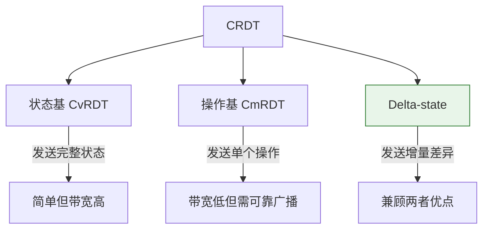

## CRDT：无冲突复制数据类型

CRDT（Conflict-free Replicated Data Types，无冲突复制数据类型）是分布式系统中一种精妙的数据结构设计范式。它通过数学上的半格（Semilattice）结构，保证多个副本在无协调的情况下独立更新后，一定能收敛到一致状态——不需要锁、不需要共识协议、不需要中心化仲裁。

本节将从数学原理出发，逐步深入到具体数据结构设计、工程实现权衡和真实系统案例，帮助读者建立完整的 CRDT 知识体系。

---

### 1. 为什么需要 CRDT

#### 1.1 分布式一致性的两难困境

在分布式系统中，CAP 定理告诉我们：一致性（Consistency）、可用性（Availability）、分区容错性（Partition Tolerance）三者不可兼得。传统方案在 CP 和 AP 之间抉择：

| 方向 | 代表方案 | 优点 | 代价 |
|------|----------|------|------|
| CP（强一致） | Raft/Paxos/ZAB | 线性一致性，数据绝不冲突 | 分区期间拒绝写入，延迟高 |
| AP（高可用） | Dynamo 风格 | 任何节点都可写，永不拒绝 | 需要冲突解决机制 |

CRDT 正是 AP 路线中的优雅解法。它让冲突解决变得"无需解决"——通过数据结构本身的设计，使得并发操作在数学上天然可合并。

#### 1.2 CRDT 的核心思想

CRDT 的核心洞察是：**如果合并操作满足交换律、结合律和幂等律，那么无论副本收到更新的顺序如何，最终状态一定相同。**

这三个性质的含义：

- **交换律（Commutative）**：merge(A, B) = merge(B, A)，合并顺序不影响结果
- **结合律（Associative）**：merge(merge(A, B), C) = merge(A, merge(B, C))，分组不影响结果
- **幂等律（Idempotent）**：merge(A, A) = A，重复合并不产生副作用

这意味着即使网络消息乱序、重复、丢失，副本最终都能收敛。这比传统的"先到先得"或"最后写入获胜"策略有更强的理论保证。

**为什么三性缺一不可？** 让我们逐一分析缺失后果：

- 缺交换律：消息到达顺序不同会导致不同最终状态，收敛失败
- 缺结合律：分批合并与逐个合并产生不同结果，消息重传导致状态偏移
- 缺幂等律：网络重传导致同一操作被应用多次，状态被"膨胀"——例如计数器多加了、集合多了重复元素

#### 1.3 历史脉络

CRDT 的发展经历了从理论到实践的漫长演进：

- **2007年**：Marc Shapiro 在工作论文中首次提出"可交换复制数据类型"（Commutative Replicated Data Type）的概念
- **2011年**：Shapiro、Preguiça、Baquero 和 Zawirski 发表了奠基性论文，正式定义了 CRDT 的两类实现：状态基（CvRDT）和操作基（CmRDT），并将名称从"Commutative"改为"Conflict-free"
- **2014年**：Riak 2.0 将 CRDT 作为一等数据类型引入生产系统
- **2016年**：Almeida 等人提出 Delta-state CRDT，结合了两类方法的优点
- **2018年至今**：Automerge、Yjs 等库使 CRDT 进入主流 Web 协作应用开发
- **2020年代**：CRDT 从协作编辑扩展到本地优先软件（Local-first Software）范式，Figma、Linear、Excalidraw 等产品广泛采用

---

### 2. 数学基础：半格与单调合并

#### 2.1 连接半格（Join-Semilattice）

状态基 CRDT 的数学基础是**连接半格**（Join-Semilattice），一个代数结构 (S, ≤)，其中：

- S 是所有可能状态的集合
- ≤ 是一个偏序关系（自反、反对称、传递）
- 对于 S 中任意两个元素 a 和 b，存在**最小上界**（Least Upper Bound, LUB）a ∪ b

最小上界满足两个条件：

1. **上界性**：a ≤ (a ∪ b) 且 b ≤ (a ∪ b)
2. **最小性**：对于任意 c，如果 a ≤ c 且 b ≤ c，则 (a ∪ b) ≤ c

半格的合并操作天然满足交换律、结合律和幂等律——这不是人为规定的，而是半格结构的数学必然。

**直觉理解**：想象一组登山者从不同路径爬山。偏序关系 ≤ 表示"海拔不高于"，最小上界就是两人所在位置的"最高共同可达点"。无论从谁的位置合并，这个点是唯一的。

#### 2.2 单调性保证收敛

状态基 CRDT 使用**单调合并**函数，即状态只会沿着偏序关系"向前"推进，永远不会回退：

state' = merge(state, update)  ⟹  state ≤ state'

**收敛性证明思路**：

1. 如果副本 A 的状态是 sA，副本 B 的状态是 sB，且它们都包含了同一组更新的效果，那么 sA 和 sB 都是这组更新效果的上界
2. 合并操作计算的是最小上界
3. 由于半格保证最小上界唯一，所有副本最终收敛到相同状态

**实际含义**：单调性意味着"状态只增不减"。例如 G-Counter 的值只增不减、OR-Set 的元素一旦添加，标签集只增不删（除非被明确删除）。这种单向性是收敛的物理基础——没有回退，就不会产生振荡。

#### 2.3 向量时钟与因果序

许多 CRDT 使用**向量时钟**（Vector Clock）来追踪操作之间的因果关系。向量时钟 V 是一个长度为 N 的整数向量（N 为副本数量），其中 V[i] 表示副本 i 上已知发生的事件数量。

**操作规则**：

- 发送消息前：V[local_id] += 1
- 接收消息时：V[i] = max(V[i], received[i])，对每个 i

**关键性质**：

- 如果 V1 < V2（逐元素比较），则 V1 因果先于 V2
- 并发事件的向量时钟不可比较（V1 既不 < V2，V2 也不 < V1）
- 这使得系统能检测哪些操作是因果相关的，哪些是真正并发的

**向量时钟示例**：

3 个副本 A、B、C，初始状态 V = [0, 0, 0]

步骤1: A 发送消息     → V = [1, 0, 0]
步骤2: B 发送消息     → V = [0, 1, 0]
步骤3: A 收到 B 的消息 → V = [1, 1, 0]    // 合并：max([1,0,0], [0,1,0])
步骤4: A 再发送消息   → V = [2, 1, 0]
步骤5: C 发送消息     → V = [0, 0, 1]

此时比较：
  步骤1的V [1,0,0] < 步骤4的V [2,1,0]  → 因果相关 ✓
  步骤2的V [0,1,0] 和 步骤5的V [0,0,1] → 互不小于 → 并发！

**向量时钟的局限**：每个副本需要 O(N) 的存储空间（N 为副本数）。在副本频繁加入/离开的动态系统中，向量会持续膨胀。混合逻辑时钟（HLC）和点版本向量（Dotted Version Vectors）是应对这一问题的变体方案。

#### 2.4 CRDT 与传统冲突解决的对比

| 特性 | Last-Writer-Wins | CRDT | 操作转换（OT） |
|------|-----------------|------|---------------|
| 冲突检测 | 不检测，时间戳仲裁 | 不冲突（数学保证） | 检测并转换 |
| 协调需求 | 需要同步时钟 | 无需协调 | 需要中心服务器 |
| 收敛保证 | 强制收敛（可能丢数据） | 保证收敛 | 依赖正确实现 |
| 信息保留 | 丢弃并发写入 | 可选择保留全部值 | 保留所有编辑 |
| 适用场景 | 简单键值存储 | 通用分布式数据 | 实时文本协作 |
| 理论优雅度 | 低 | 高（数学基础坚实） | 中（启发式居多） |

---

### 3. CRDT 的三大实现范式



#### 3.1 状态基 CRDT（CvRDT）

**工作方式**：每个副本定期将自己的**完整本地状态**发送给其他副本。接收方将收到的状态与本地状态合并。

**形式化定义**：CvRDT 是一个元组 (S, s₀, q, m)，其中：

- S 是状态的连接半格
- s₀ ∈ S 是初始状态
- q: S → S 是查询函数（不修改状态）
- m: S × U → S 是更新函数，U 是更新操作集合
- **merge(s₁, s₂) = s₁ ∪ s₂**（半格中的最小上界）

| 优点 | 缺点 |
|------|------|
| 实现简单——合并操作满足交换律/结合律/幂等律 | 带宽开销大——每次同步发送完整状态 |
| 容忍消息乱序、重复、丢失 | 内存开销大——需存储完整状态含元数据 |
| 不需要追踪单个操作 | 合并成本随状态增大而增长 |

**适用场景**：副本数量少（<10）、状态体积小（KB 级）、网络带宽充足。

#### 3.2 操作基 CRDT（CmRDT）

**工作方式**：每个副本广播**单个操作**给所有其他副本。接收方在本地应用该操作。

**关键约束**：所有并发操作必须满足**交换律**——如果操作 op1 和 op2 因果并发，那么先应用 op1 再 op2 的结果必须等于先应用 op2 再 op1 的结果：

apply(apply(s, op1), op2) = apply(apply(s, op2), op1)

**基础设施要求**：

- 可靠的因果广播（操作按因果顺序投递）
- 每个操作恰好投递一次（至少一次投递 + 去重）

| 优点 | 缺点 |
|------|------|
| 带宽低——只发送操作，不发送完整状态 | 需要可靠的因果广播基础设施 |
| 延迟低——操作即时传播 | 必须保证恰好一次投递或操作幂等 |
| 某些设计内存开销更低 | 实现正确性更难 |

**为什么因果广播如此关键？** 操作基 CRDT 要求因果相关的操作按因果顺序到达。如果违反——比如副本 A 先收到 B 的"删除元素 X"，之后才收到 B 的"添加元素 X"——就可能产生不一致。而状态基 CRDT 对此完全免疫，因为合并的是完整快照而非操作序列。

#### 3.3 Delta-state CRDT

由 Almeida、Shoker 和 Baquero（2016）提出的混合方案：

**工作方式**：不发送完整状态，而是发送**增量差异**（delta-mutator）——自上次同步以来的最小变化量。Delta 本身也是半格中的元素。

delta(s, u) 返回增量对象 d，满足 merge(s, d) = update(s, u)

**核心优势**：

- 兼具两类方法的优点——低带宽（如 CmRDT）+ 简单合并（如 CvRDT）
- Delta 组可以批量合并多个操作
- 消息丢失时可回退到全状态传输
- 被 Riak、Redis CRDB 等生产系统采用

**Delta-state 的工程优势详解**：传统 CvRDT 在同步时发送完整状态，假设一个 G-Counter 有 100 个副本的计数，每次同步传输 800 字节。而 Delta-state 只传输上次同步以来的变化——如果期间只发生了一次递增，实际只需传输几十字节。对于高频写入场景，这是量级上的差异。

#### 3.4 三种范式对比

| 特性 | CvRDT（状态基） | CmRDT（操作基） | Delta-state |
|------|-----------------|-----------------|-------------|
| 传输内容 | 完整状态 | 单个操作 | 增量差异 |
| 带宽效率 | 低 | 高 | 中-高 |
| 实现复杂度 | 低 | 中-高 | 中 |
| 容错能力 | 强（任意丢包/乱序） | 需可靠广播 | 中（可回退全状态） |
| 内存开销 | 高 | 低-中 | 中 |
| 适用场景 | 节点少、状态小 | 高频操作、节点多 | 通用（生产首选） |
| 代表实现 | Riak 早期 | Lasp | Riak 2.x, Redis CRDB |

---

### 4. 核心 CRDT 数据结构详解

#### 4.1 计数器（Counter）

##### 4.1.1 G-Counter（只增计数器）

**用途**：只能递增的分布式计数器，无需协调即可在多副本间累加。

**数据结构**：每个副本维护一个长度为 N 的向量（N = 副本数量），每个槽位记录该副本的本地计数：

G-Counter = { V[1..N] }   // V[i] 表示副本 i 的计数

**操作定义**：

- **increment(i)**：V[i] += 1（只有副本 i 能递增自己的槽位）
- **value()**：Σ V[i]（所有槽位求和）
- **merge(V₁, V₂)**：V[i] = max(V₁[i], V₂[i])（逐元素取最大值）

**工作示例**（2 个副本）：

| 时间 | 操作 | 副本 A 状态 | 副本 B 状态 | A 的 value | B 的 value |
|------|------|------------|------------|-----------|-----------|
| T0 | 初始 | [0, 0] | [0, 0] | 0 | 0 |
| T1 | A 递增 3 | [3, 0] | [0, 0] | 3 | 0 |
| T2 | B 递增 2 | [3, 0] | [0, 2] | 3 | 2 |
| T3 | A.merge(B) | [3, 2] | [0, 2] | 5 | 2 |
| T4 | B.merge(A) | [3, 2] | [3, 2] | 5 | 5 |

即使 A 和 B 在分区期间各自递增，合并后都能得到正确的累计值。

**空间复杂度**：O(N)，N 为副本数。100 个副本的 G-Counter 每个条目需要 800 字节（假设每个计数 8 字节），相比普通整数的 8 字节显著增大。

**G-Counter 的限制**：不支持递减，也不支持"设置为某个值"。如果需要在多个副本间同时递增和递减，必须使用 PN-Counter。

##### 4.1.2 PN-Counter（正负计数器）

**用途**：同时支持递增和递减的分布式计数器。

**设计思路**：组合两个 G-Counter——一个记录正向操作（P），一个记录负向操作（N）：

PN-Counter = { P: G-Counter, N: G-Counter }

**操作定义**：

- **increment(i)**：P[i] += 1
- **decrement(i)**：N[i] += 1
- **value()**：ΣP[i] - ΣN[i]
- **merge**：分别合并 P 和 N 两个 G-Counter

**空间复杂度**：O(2N)——两个向量，每个长度 N。

**Python 实现**：

```python
class GCounter:
    """只增计数器 CRDT"""

    def __init__(self, replica_id: str, num_replicas: int):
        self.replica_id = replica_id
        self.counts = [0] * num_replicas
        self.index = hash(replica_id) % num_replicas

    def increment(self, amount: int = 1):
        self.counts[self.index] += amount

    def value(self) -> int:
        return sum(self.counts)

    def merge(self, other: 'GCounter'):
        self.counts = [max(a, b) for a, b in zip(self.counts, other.counts)]


class PNCounter:
    """正负计数器 CRDT，支持递增和递减操作"""

    def __init__(self, replica_id: str, num_replicas: int):
        self.replica_id = replica_id
        self.positive = GCounter(replica_id, num_replicas)
        self.negative = GCounter(replica_id, num_replicas)

    def increment(self, amount: int = 1) -> None:
        if amount < 0:
            raise ValueError("递增应为正数，负数请用 decrement()")
        self.positive.increment(amount)

    def decrement(self, amount: int = 1) -> None:
        if amount < 0:
            raise ValueError("递减应为正数，正数请用 increment()")
        self.negative.increment(amount)

    def value(self) -> int:
        return self.positive.value() - self.negative.value()

    def merge(self, other: 'PNCounter') -> None:
        self.positive.merge(other.positive)
        self.negative.merge(other.negative)
```

**典型应用**：购物车商品数量追踪、分布式库存管理、点赞/踩计数。

#### 4.2 集合（Set）

##### 4.2.1 G-Set（只增集合）

**用途**：只支持添加操作的集合（不允许删除）。这是最简单的集合 CRDT。

**操作定义**：

- **add(e)**：S = S ∪ {e}
- **lookup(e)**：e ∈ S
- **merge(S₁, S₂)**：S₁ ∪ S₂（集合并集）

合并操作就是集合的并集——天然满足交换律、结合律和幂等律。

**空间复杂度**：O(|S|)，与已添加的元素数量成正比。

##### 4.2.2 2P-Set（两阶段集合）

**用途**：支持添加和删除的集合，但元素一旦被删除就无法重新添加。

**设计思路**：组合两个 G-Set——一个记录添加（A），一个记录删除/墓碑（R）：

2P-Set = { A: G-Set, R: G-Set }

**操作定义**：

- **add(e)**：A.add(e)
- **remove(e)**：若 e ∈ A，则 R.add(e)
- **lookup(e)**：e ∈ A 且 e ∉ R

**关键限制**：删除不可逆。墓碑集 R 单调增长，无法进行垃圾回收。这导致 2P-Set 在实际系统中很少使用——频繁添加/删除同一元素会导致墓碑无限积累。

##### 4.2.3 OR-Set（观察-删除集合）——最常用的集合 CRDT

**用途**：支持添加和删除的集合，元素在删除后可以被重新添加。这是实际系统中最常用的集合类型。

**核心设计**：每次添加操作都为元素生成一个全局唯一标签（tag），删除时只移除当前已观察到的标签。合并时对标签取并集。

OR-Set = { elements: Map<element, Set<tag>> }

**操作定义**：

- **add(e)**：生成唯一标签 t（通常使用 replica_id + 计数器），将 (e, t) 加入元素映射
- **remove(e)**：移除当前与 e 关联的所有标签
- **lookup(e)**：e 在映射中且至少有一个标签
- **merge(S₁, S₂)**：对每个元素，标签集取两个副本的并集，再减去所有墓碑标签

**冲突解决——"添加获胜"语义**：

当并发的添加和删除同时发生时：

1. 添加操作创建了新标签，这些标签在执行删除的副本上不可见
2. 删除操作只移除了当时已观察到的标签
3. 合并时的并集运算保留了并发添加产生的新标签
4. 结果：**并发添加战胜并发删除**

**详细示例**：

初始：两个副本同步，集合 = {"apple", "banana"}

--- 网络分区发生 ---

副本 A 的操作：
  add("cherry")    → elements = {"apple": {t1}, "banana": {t2}, "cherry": {t3}}
  remove("banana") → 先记录 {"banana": {t2}} 为墓碑
                     elements = {"apple": {t1}, "cherry": {t3}}

副本 B 的操作：
  add("banana")    → 生成新标签，elements = {"apple": {t1}, "banana": {t4}, "date": {t5}}
  add("date")      →

--- 网络恢复，执行合并 ---

A.merge(B):
  "apple":  {t1} ∪ {t1} = {t1}                     → 保留 ✓
  "banana": {} ∪ {t4} = {t4}, 墓碑 = {t2}
            → {t4} - {t2} = {t4}                    → 保留 ✓（添加获胜！）
  "cherry": {t3} ∪ {} = {t3}                        → 保留 ✓
  "date":   {} ∪ {t5} = {t5}                        → 保留 ✓

最终集合 = {"apple", "banana", "cherry", "date"}

**标签管理策略**：

| 策略 | 实现方式 | 优缺点 |
|------|----------|--------|
| 唯一标签 | (replica_id, logical_timestamp) | 简单直观，标签量可控 |
| Dot | (replica_id, counter) 单一事件标识符 | 更紧凑，Riak 采用 |
| 有界版本 | 使用版本向量代替逐元素标签 | 元数据更紧凑，但实现复杂 |

**Python 实现**：

```python
import uuid
from typing import Dict, Set


class ORSet:
    """观察-删除集合 CRDT，并发添加战胜并发删除"""

    def __init__(self, replica_id: str):
        self.replica_id = replica_id
        self.elements: Dict[str, Set[str]] = {}      # 元素 → 标签集合
        self.tombstones: Dict[str, Set[str]] = {}     # 已删除元素的墓碑

    def add(self, element: str) -> None:
        """添加元素，生成唯一标签标识此次添加操作"""
        tag = f"{self.replica_id}-{uuid.uuid4().hex[:8]}"
        self.elements.setdefault(element, set()).add(tag)

    def remove(self, element: str) -> None:
        """删除元素，只移除当前已观察到的标签"""
        if element in self.elements:
            self.tombstones[element] = self.elements[element].copy()
            del self.elements[element]

    def contains(self, element: str) -> bool:
        return element in self.elements

    def values(self) -> Set[str]:
        return set(self.elements.keys())

    def merge(self, other: 'ORSet') -> None:
        """合并两个 OR-Set：标签取并集，减去墓碑"""
        all_elements = set(self.elements.keys()) | set(other.elements.keys())

        new_elements = {}
        for element in all_elements:
            # 合并两个副本的标签
            tags = set()
            if element in self.elements:
                tags |= self.elements[element]
            if element in other.elements:
                tags |= other.elements[element]

            # 收集所有墓碑标签
            tombstone_tags = set()
            if element in self.tombstones:
                tombstone_tags |= self.tombstones[element]
            if element in other.tombstones:
                tombstone_tags |= other.tombstones[element]

            # 移除被墓碑标记的标签
            remaining = tags - tombstone_tags
            if remaining:
                new_elements[element] = remaining

        self.elements = new_elements
        self.tombstones = {}
```

**空间复杂度**：O(|元素| × |每个元素的标签数|)。随着操作增加，标签可能无限增长——这是 OR-Set 的主要工程挑战。

##### 4.2.4 LWW-Element-Set（最后写入获胜元素集）

**用途**：通过时间戳解决并发添加/删除冲突的集合。

**设计思路**：添加和删除操作各带时间戳，查询时比较两者的大小：

LWW-Element-Set = {
  A: Map<element, timestamp>,   // 添加集
  R: Map<element, timestamp>    // 删除集
}

- **lookup(e)**：e ∈ A 且 A[e] > R[e]

**权衡**：比 OR-Set 更紧凑，但依赖同步时钟（或逻辑时间戳）。并发添加/删除的结果由时间戳决定，可能不符合用户意图。

#### 4.3 寄存器（Register）

##### 4.3.1 LWW-Register（最后写入获胜寄存器）

**用途**：存储单个值的寄存器，通过时间戳解决并发写入冲突。

**操作定义**：

- **assign(v)**：value = v; timestamp = now()
- **read()**：返回当前值
- **merge(r₁, r₂)**：返回时间戳较大的寄存器

**关键特性**：

- 确定性：给定相同操作集，所有副本收敛到相同状态
- 需要同步物理时钟或使用 Lamport 时间戳（相同时间戳用副本 ID 打破平局）
- **静默丢弃**并发写入——只有一个"最后写入者"胜出

**潜在风险**：如果两个副本并发写入，其中一个写入会被静默丢失。这在很多场景下可以接受（如用户偏好设置），但在数据敏感场景下非常危险。

**TypeScript 实现**：

```typescript
class LWWRegister<T> {
  private value_: T;
  private timestamp: number;
  private readonly replicaId: string;

  constructor(replicaId: string, initialValue: T) {
    this.replicaId = replicaId;
    this.value_ = initialValue;
    this.timestamp = Date.now();
  }

  set(value: T): void {
    this.value_ = value;
    this.timestamp = Date.now();
  }

  get(): T {
    return this.value_;
  }

  merge(other: LWWRegister<T>): void {
    if (other.timestamp > this.timestamp ||
        (other.timestamp === this.timestamp &amp;&amp; other.replicaId > this.replicaId)) {
      this.value_ = other.value_;
      this.timestamp = other.timestamp;
    }
  }
}
```

##### 4.3.2 MV-Register（多值寄存器）

**用途**：当并发写入冲突时，保留所有冲突值而非丢弃。读取时返回一组值，由应用程序决定如何解决冲突。

**设计思路**：每个值关联一个版本向量，合并时保留所有未被因果支配的值：

MV-Register = {
  values: Set<{ value, version_vector }>
}

- **assign(v)**：设置 values = {{v, vvc}}，vvc 是当前副本的版本向量
- **read()**：返回值集合（多个值表示存在冲突）
- **merge**：保留 r₁ 中不被 r₂ 任何值因果支配的值，反之亦然

**应用场景**：Riak 数据库的 siblings 机制就是 MV-Register 的实际应用。应用层可以使用"最后写入获胜"、"应用合并函数"或"交由用户选择"等策略解决冲突。

**MV-Register 的应用层冲突解决模式**：

```python
def resolve_mv_register_conflict(values: list, context: dict) -> any:
    """应用层解决 MV-Register 冲突"""
    if len(values) == 1:
        return values[0]  # 无冲突

    # 策略1：自动合并（适用于可合并的数据类型）
    if context.get("type") == "counter":
        return sum(values)  # 把冲突的计数值加起来

    # 策略2：业务规则选择（如购物车场景取并集）
    if context.get("type") == "set":
        return set().union(*values)

    # 策略3：交由用户选择（需要 UI 支持）
    if context.get("type") == "text":
        return {"conflict": True, "options": values}

    # 策略4：时间戳兜底
    return max(values, key=lambda v: v.get("timestamp", 0))
```

#### 4.4 标志（Flag）

##### EW-Flag（启用获胜标志）与 DW-Flag（禁用获胜标志）

**用途**：支持并发启用/禁用操作的布尔标志，类似开关。

**设计思路**：组合两个 G-Counter，分别记录启用和禁用操作的次数：

EW-Flag = { enable: G-Counter, disable: G-Counter }

- **enable()**：enable.increment()
- **disable()**：disable.increment()
- **value()**：enable > disable（启用计数大于禁用计数时为 true）

EW-Flag 在并发启用/禁用时，启用操作获胜；DW-Flag 则是禁用操作获胜。

**典型应用**：权限开关（"是否启用某功能"）、软删除/恢复标记。

**选择原则**：选择哪种 Flag 取决于业务语义。安全相关场景通常选 DW-Flag（禁用优先，宁可误关不可误开）；功能特性开关通常选 EW-Flag（启用优先，减少用户困惑）。

#### 4.5 地图（Map）

##### OR-Map（观察-删除地图）

**用途**：键值对映射，键支持添加和删除，值本身也是 CRDT 类型。

**设计思路**：键集合使用 OR-Set 管理，值是嵌套的 CRDT：

OR-Map = {
  keys: OR-Set<Key>,
  values: Map<Key, CRDT>   // 值可以是计数器、集合、寄存器等
}

- **put(k, v)**：keys.add(k); values[k] = v
- **remove(k)**：keys.remove(k); 删除 values[k]
- **get(k)**：若 keys.lookup(k)，返回 values[k]
- **merge**：合并 keys（OR-Set 语义），对每个键合并对应值（CRDT 语义）

**应用**：配置存储、协作文档的对象模型、共享状态管理。

**OR-Map 的嵌套力量**：OR-Map 的值可以是任意 CRDT 类型，这意味着你可以构建任意深度的嵌套结构。例如：

```python
# 一个嵌套的 OR-Map 示例：购物车
cart = {
    "items": ORMap({
        "apple": PNCounter(...),   # 计数
        "banana": PNCounter(...)
    }),
    "coupon": LWWRegister("SAVE20"),  # 优惠码
    "tags": ORSet({"fresh", "sale"})  # 标签
}
# 每一层都是 CRDT，合并时递归应用 CRDT 语义
```

#### 4.6 列表与文本 CRDT

列表和文本 CRDT 是协作编辑的核心，其设计比上述基础类型复杂得多：

##### RGA（Replicated Growable Array）

**核心思想**：每个元素有全局唯一 ID，通过引用关系确定顺序。

**操作**：

- **insert(pos, element)**：在位置 pos 之后插入，分配唯一 ID
- **delete(pos)**：标记位置 pos 的元素为已删除（墓碑）
- **合并**：元素按唯一 ID 全序排列；墓碑元素被隐藏但保留

**RGA 的排序规则**：新插入的元素总是排在"前驱"元素的后面。如果两个并发插入引用了同一个前驱，按 ID 全序排列——这保证了确定性。

##### Yjs 的 YATA 算法

- 每个字符有全局唯一 ID (client_id, clock)
- 包含 left/right origin 指针用于确定顺序
- 每个字符在线上仅占 2-5 字节
- 支持 Y.Text（富文本）、Y.Array（列表）、Y.Map（映射）

##### Automerge 的实现

- 类似 RGA 的结构，操作引用其他操作的 ID
- 使用列式二进制编码，压缩效率高
- Automerge v2 比 v1 快 10-100 倍，合并速度约 50 万操作/秒

**协文本编辑 CRDT 对比**：

| 特性 | RGA | YATA (Yjs) | Automerge |
|------|-----|-------------|-----------|
| 排序机制 | 唯一 ID 全序 | 左右邻居指针 | 操作引用图 |
| 内存效率 | 中等 | 高（2-5字节/字符） | 中-高 |
| 富文本支持 | 需扩展 | 原生支持 | 原生支持 |
| 离线能力 | 依赖实现 | 优秀 | 优秀 |
| 主要应用 | 学术/基础库 | Tiptap, BlockNote | 笔记应用, 研究项目 |

---

### 5. CRDT 与 OT：两大协作范式深度对比

协作编辑领域长期存在两大流派：CRDT 和 OT（Operational Transformation，操作转换）。理解两者的差异对技术选型至关重要。

#### 5.1 OT 的工作原理

OT 的核心思想是：当操作 A 在远程操作 B 之后到达时，A 需要被"转换"以适应 B 已经产生的效果。

本地状态 = S
本地操作 = OA
远程操作 = OB（在 OA 之后到达）

转换函数：OA' = transform(OA, OB)
应用：    S' = apply(apply(S, OA), OB')
                                    ↑ 转换后的 OB

#### 5.2 核心差异对比

| 维度 | CRDT | OT |
|------|------|-----|
| 数学基础 | 半格理论，性质明确 | 转换函数，正确性难以证明 |
| 中心化需求 | 可完全去中心化 | 通常需要中心服务器 |
| 离线支持 | 天然支持 | 需要特殊处理 |
| 实现复杂度 | 数据结构层面解决 | 转换函数的组合爆炸问题 |
| 扩展性 | 线性扩展 | 操作对数量随参与者增加 |
| 历史成熟度 | 2011年奠基 | 1989年提出，先驱地位 |
| 生产案例 | Figma, Linear, GitBook | Google Docs, VS Code Live Share |

#### 5.3 如何选择

你的场景需要协作？
├── 纯文本协作、已有 OT 基础 → OT（Google Docs 风格）
├── 离线优先、P2P 同步 → CRDT（本地优先软件）
├── 需要复杂数据结构（非纯文本）→ CRDT
├── 团队规模大、需要水平扩展 → CRDT（去中心化优势）
└── 实时性要求极高、可接受中心化 → OT（操作转换延迟更低）

**现代趋势**：越来越多系统采用混合方案。Figma 就是典型案例——服务器负责全局排序，客户端使用 CRDT 语义实现本地应用。

---

### 6. 反熵协议与收敛保障

CRDT 保证了数学上的可合并性，但副本之间如何高效发现和修复差异，依赖反熵协议（Anti-Entropy Protocols）。

#### 6.1 全状态交换

最简单的方式：副本 A 将完整状态发给 B，B 执行合并。

- 优点：实现极其简单
- 缺点：状态大时带宽消耗巨大
- 适用：Riak 的"全量同步"模式

#### 6.2 Merkle 树反熵

每个副本构建状态的 Merkle 树（哈希树），通过交换根哈希快速定位差异：

副本 A 的 Merkle 树根 → 与副本 B 比较
  ├─ 根哈希相同 → 无需同步
  └─ 根哈希不同 → 逐层下钻，只同步差异子树

- 时间复杂度：O(log N)，N 为元素数量
- 被 Riak、Dynamo 等分布式数据库广泛采用
- Riak 使用 Merkle 树实现主动反熵（Active Anti-Entropy, AAE）

**Merkle 树反熵的工程实践**：Riak 的 AAE 进程在后台持续运行，每秒扫描数千个 key。它维护一棵覆盖所有 KV 对的 Merkle 树，定期与远程副本交换树的根哈希。一旦发现不一致，就逐层下钻到叶子节点，只传输差异数据。实测表明 AAE 可以在分钟级修复分区导致的不一致。

#### 6.3 版本向量反熵

副本交换版本向量（因果上下文），接收方确定发送方缺少哪些更新：

- 只传输缺失的更新（或其增量），而非完整状态
- 效率高于全状态交换
- 适合已知副本集合的场景

#### 6.4 Gossip 协议

副本定期与随机对等节点交换状态：

- 只要通信图连通，就能保证收敛
- 可扩展性好，适合大规模集群
- 收敛时间可能较长

**Gossip 的收敛速度**：在 N 个节点的集群中，Gossip 协议的信息扩散时间复杂度为 O(log N)。对于 1000 个节点，通常在 10-20 轮 gossip 后所有节点都已收到信息。每轮 gossip 的间隔通常为 1-5 秒，因此完整扩散需要 20-100 秒。

#### 6.5 读修复（Read-Repair）

客户端读取时携带因果上下文，写入时将其传给新副本——新副本据此填补缺失的更新：

- 机会主义反熵，不需要后台进程
- 适合读多写少的场景
- Riak 和 Cassandra 都使用这种策略

#### 6.6 协议选择指南

| 协议 | 实现复杂度 | 带宽效率 | 收敛速度 | 适用场景 |
|------|-----------|---------|---------|---------|
| 全状态交换 | 低 | 低 | 快 | 小状态、初始化同步 |
| Merkle 树 | 中-高 | 高 | 快 | 大数据集、生产系统 |
| 版本向量 | 中 | 高 | 中 | 已知副本集 |
| Gossip | 中 | 中 | 慢 | 大规模集群 |
| 读修复 | 低 | 低（增量） | 不定 | 读多写少 |

**生产建议**：不要只选一种协议。成熟的系统通常组合使用——Gossip 做周期性粗粒度同步、Merkle 树做精确差异定位、读修复做机会主义快速修复。Riak 就同时部署了 AAE（Merkle 树）和读修复两种机制。

---

### 7. 工程权衡与核心挑战

#### 7.1 元数据膨胀

CRDT 需要额外元数据追踪因果关系、解决冲突——这些元数据随操作增长。

**元数据来源**：

| 来源 | 空间开销 | 示例 |
|------|---------|------|
| 向量时钟/版本向量 | O(N) × 每条目字节数 | 100 个副本 × 8 字节 = 800 字节/条目 |
| 唯一标签（OR-Set） | O(1) × 每次添加 | 每次 add 生成一个 UUID |
| 墓碑 | O(已删除元素数) | 长期运行的集合墓碑持续累积 |
| 因果上下文 | 随副本数线性增长 | 随操作传播 |

**优化手段**：

- **混合逻辑时钟（HLC）**：结合物理时间和逻辑计数器，生成紧凑的时间戳
- **点版本向量（Dotted Version Vectors）**：比完整版本向量更紧凑，Riak 2.x 采用
- **因果上下文压缩**：裁剪版本向量中的不必要条目
- **版本向量截断**：当确认所有副本都已看到某个版本后，可以截断该版本以下的条目

**实际数据**：在一个 3 副本的 OR-Map 中，每个键值对的元数据开销约为 24-48 字节（版本向量）+ 墓碑标记。对于 10 万条目的 Map，元数据总量约 2.4-4.8 MB，可接受。但在 100 副本场景下，仅版本向量就达到 800 字节/条目，总量飙升至 80 MB。

#### 7.2 墓碑管理——最棘手的工程问题

删除操作必须保留墓碑（tombstone）来防止"僵尸复活"——即已删除的元素在网络恢复后重新出现。但墓碑会无限积累。

**为什么墓碑不可省略**：

如果没有墓碑，副本 A 删除元素 X 后，副本 B（在 A 删除前添加了 X）与 A 同步时 X 会重新出现——这就是"僵尸问题"。墓碑确保删除是"粘性"的。

**墓碑垃圾回收策略**：

| 策略 | 原理 | 优点 | 缺点 |
|------|------|------|------|
| 因果稳定检测 | 所有副本都观察到墓碑后才删除 | 安全 | 需要了解所有副本状态 |
| 纪元式 GC | 按时间纪元划分，所有副本确认后批量清理 | 实现简单 | 需要全局协调 |
| 有界 GC | 接受短暂不一致，限制元数据增长 | 简单可控 | 可能丢失删除语义 |
| Riak 方式 | max-siblings 限制（默认 10），超限裁剪 | 防止内存爆炸 | 可能丢失并发状态 |

**实际影响**：一个长期运行的协作会话中，编辑 10,000 字符的文档、每字符平均编辑 5 次，可能产生多达 50,000 个墓碑。

**工程实践——墓碑回收的三步走**：

1. **监控**：实时监控墓碑数量和元数据总量，设置告警阈值
2. **压缩**：定期执行墓碑回收（因果稳定检测 + GC 服务）
3. **兜底**：设置墓碑上限，超限时触发全量重同步（而非静默丢弃）

#### 7.3 确定性 vs 语义正确性

CRDT 保证所有副本**收敛到相同状态**，但不保证该状态是"正确"的。例如：

- LWW-Register 静默丢弃并发写入——一个用户的修改可能被另一个用户的修改覆盖而无任何提示
- MV-Register 保留所有值但需要应用层解决冲突——如果应用层忽略多值结果，数据仍然可能不一致
- OR-Set 的"添加获胜"语义在某些业务场景下可能违反直觉

**选择原则**：CRDT 类型的选择必须匹配应用的语义需求，而非盲目追求技术优雅。

#### 7.4 CRDT 不适用的场景

并非所有问题都适合用 CRDT 解决。以下场景应谨慎考虑：

| 场景 | 为什么不适合 CRDT | 更好的选择 |
|------|-------------------|-----------|
| 需要全局全序（如金融交易排序） | CRDT 保证偏序而非全序 | 共识协议（Raft/Paxos） |
| 强一致读取（如库存扣减） | CRDT 是最终一致的 | 2PC + 锁/共识协议 |
| 复杂事务（跨多个数据结构） | CRDT 不支持跨类型原子操作 | 分布式事务（Saga/TCC） |
| 需要即时一致性保证 | 合并可能在分区恢复后发生 | CP 系统 + 同步复制 |
| 数据量极小且单副本就够用 | 引入 CRDT 增加不必要的复杂度 | 简单本地数据结构 |

---

### 8. 真实系统案例

#### 8.1 Riak——CRDT 的生产先驱

Riak 是最早将 CRDT 作为一等数据类型引入生产系统的分布式数据库。

**内置 CRDT 类型**（Riak 2.0+）：

| 类型 | CRDT 实现 | 说明 |
|------|----------|------|
| Counter | G-Counter / PN-Counter | 分布式计数 |
| Set | OR-Set（riak_dt_orswot） | 观察-删除集合 |
| Map | OR-Map（riak_dt_map） | 嵌套键值对 |
| Flag | Enable-Wins Flag | 布尔开关 |
| Register | LWW-Register / MV-Register | 单值/多值寄存器 |

**关键设计决策**：

- 采用状态基 CRDT（CvRDT）
- 使用"点版本向量"（Dotted Version Vectors）追踪因果序
- 通过 Merkle 树实现主动反熵
- 客户端读取返回合并后的状态，写入是增量操作（increment、add、put）
- "兄弟爆炸"（sibling explosion）问题通过 max-siblings 限制管理

**上下文传递机制**：Riak 要求客户端在写入时传回上次读取的因果上下文（causal context），Riak 据此判断需要保留哪些并发状态。Java/PHP 客户端需要手动管理上下文，Python/Ruby 客户端自动处理。

#### 8.2 Redis CRDB——Active-Active 多活

Redis Enterprise 使用 CRDT 实现其 Active-Active（CRDB）跨地域多活数据库。

**重要区分**：Redis 开源版使用主从复制（非 CRDT）。只有 Redis Enterprise 的 CRDB 功能才使用 CRDT。

**CRDT 类型映射**：

| Redis 数据类型 | CRDT 实现 | 说明 |
|---------------|----------|------|
| String | LWW-Register | 最后写入获胜 |
| Hash | LWW-Register（逐字段） | 每个字段独立 LWW |
| Set | OR-Set | 观察-删除语义 |
| Counter | PN-Counter | 正负计数 |
| Sorted Set | 自定义 CRDT | 字典序 + 时间戳 |
| List | 不支持 CRDB | — |
| Stream | 不支持 CRDB | — |

**技术细节**：

- 采用 Delta-state CRDT 提高效率
- 使用 Lamport 风格的逻辑时间戳排序
- 支持 TTL（带 CRDT 感知的过期机制）
- 时间戳相同时用节点 ID 打破平局
- 跨区域冲突自动、确定性解决

**规模**：支持最多 5 个活跃区域，每个分片约 10 万操作/秒。

#### 8.3 Automerge——本地优先的协作引擎

由 Martin Kleppmann（《Designing Data-Intensive Applications》作者）等人创建的协作应用库。

**架构特点**：

- 文档是类似 JSON 的对象，整体作为 CRDT 表示
- 内部基于操作基 CRDT，对外提供状态基 API
- 列式二进制编码实现紧凑存储
- 完全本地优先——离线可用，连接时同步
- Automerge-repo 支持 P2P 同步

**CRDT 类型支持**：

| 类型 | 实现 | 用途 |
|------|------|------|
| Text | RGA 变体 | 协作文本编辑 |
| List | RGA 变体 | 有序列表 |
| Map | OR-Map | 嵌套对象结构 |
| Counter | PN-Counter | 数值计数 |
| Value | LWW-Register | 叶子值（字符串、数字、布尔值） |

**性能演进**：Automerge v2（2022）完全重写，合并速度达约 50 万操作/秒，比 v1 快 10-100 倍。

#### 8.4 Yjs——最流行的协作编辑框架

由 Kevin Jahns 创建，基于 YATA（Yet Another Transformation Approach）算法。

**数据类型**：

- **Y.Text**：富文本（支持加粗、斜体等格式）
- **Y.Array**：有序列表
- **Y.Map**：键值映射
- **Y.XmlFragment / Y.XmlElement**：XML/HTML 结构

**性能特征**：

- 极低的二进制编码开销：每字符约 2-5 字节
- 高效合并：O(n)，n 为并发操作数
- 每周 npm 下载量超过 90 万
- 被 Tiptap、BlockNote 等众多商业产品采用

**Provider 架构**：网络传输层通过 Provider 抽象，支持 WebSocket、WebRTC、IndexedDB 等多种后端。

**Yjs Provider 选择指南**：

| Provider | 传输方式 | 适用场景 |
|----------|---------|---------|
| y-websocket | WebSocket | 有中心服务器的 Web 应用 |
| y-webrtc | WebRTC P2P | 浏览器间直连，无服务器 |
| y-indexedDB | IndexedDB | 浏览器本地持久化 |
| y-protocols | 自定义 | 需要自定义传输层 |

#### 8.5 Figma——服务器协调的 CRDT 混合方案

Figma 的协作方案并非纯 CRDT，而是服务器协调的 OT/CRDT 混合：

- 服务器为操作分配全局排序（消除大部分冲突）
- 客户端本地应用操作保证响应性（CRDT 语义）
- 服务器将本地操作 ID 重映射为全局有序 ID
- 使用版本向量追踪因果关系
- 操作粒度是属性级别（非文本级别）

**设计启示**：在某些场景下，不需要纯 CRDT——将 CRDT 的本地应用能力与服务器的全局排序能力结合，可以兼顾性能和一致性。

---

### 9. CRDT 测试策略

CRDT 的正确性依赖数学性质，因此测试策略也应围绕这些性质设计。

#### 9.1 性质测试（Property-Based Testing）

使用 QuickCheck 或 Hypothesis 等工具验证 CRDT 的核心性质：

```python
from hypothesis import given, strategies as st

def test_gcounter_commutativity(counter1, counter2):
    """交换律：merge(A, B) == merge(B, A)"""
    c1, c2 = counter1.copy(), counter2.copy()
    c3, c4 = counter1.copy(), counter2.copy()
    c1.merge(c2)
    c3.merge(c4)  # 顺序相反
    assert c1.value() == c3.value()


def test_gcounter_associativity(a, b, c):
    """结合律：merge(merge(A, B), C) == merge(A, merge(B, C))"""
    ab_c = merge(merge(a, b), c)
    a_bc = merge(a, merge(b, c))
    assert ab_c == a_bc


def test_gcounter_idempotence(a):
    """幂等律：merge(A, A) == A"""
    original = a.copy()
    a.merge(a)
    assert a == original
```

#### 9.2 混乱测试（Chaos Testing）

模拟网络乱序、丢包、分区场景验证最终收敛：

1. 启动 N 个副本
2. 对每个副本随机执行操作（概率 p）
3. 随机模拟网络分区（概率 q）
4. 随机丢弃消息（概率 r）
5. 恢复网络
6. 等待反熵协议完成
7. 断言所有副本状态相同

#### 9.3 并发测试要点

- 多线程同时执行相同操作，验证线程安全
- 检查合并后的状态是否满足数学性质
- 验证墓碑在复杂操作序列下的正确性
- 压力测试：高并发下的元数据膨胀情况

---

### 10. 常见误区与最佳实践

#### 10.1 八大反模式

| 反模式 | 问题描述 | 正确做法 |
|--------|---------|---------|
| 使用物理时钟排序 | 时钟偏移导致操作排序错误 | 使用逻辑时钟（Lamport/HLC） |
| 忽视墓碑管理 | 墓碑无限积累，内存泄漏 | 实现 GC 策略（因果稳定/纪元式） |
| 不处理类型不匹配 | 合并时数据类型冲突导致异常 | 合并前校验类型，提供降级策略 |
| 误以为 CRDT 万能 | CRDT 保证收敛但不保证语义正确 | 根据业务语义选择合适的 CRDT 类型 |
| 忽略 GC/压缩 | 长期运行后性能退化 | 定期执行压缩，设置墓碑上限 |
| 不处理网络分区 | 分区恢复后状态不一致 | 反熵协议 + 读修复 |
| 用 CRDT 要求全序 | CRDT 适合偏序而非全序场景 | 需要全序时考虑共识协议 |
| 元数据无限增长 | OR-Set 标签、向量时钟持续膨胀 | 使用有界版本、定期压缩 |

#### 10.2 CRDT 选型决策树

需要分布式无冲突数据结构？
├── 只需计数？
│   ├── 只增 → G-Counter
│   └── 增减 → PN-Counter
├── 需要集合？
│   ├── 只增 → G-Set
│   ├── 删后不可恢复 → 2P-Set（慎用）
│   ├── 删后可恢复 → OR-Set（推荐）
│   └── 需要时间戳仲裁 → LWW-Element-Set
├── 需要单值存储？
│   ├── 丢弃并发写可接受 → LWW-Register
│   └── 需保留所有并发值 → MV-Register
├── 需要键值映射？
│   └── OR-Map
├── 需要布尔标志？
│   ├── 启用优先 → EW-Flag
│   └── 禁用优先 → DW-Flag
└── 需要列表/文本？
    ├── 通用场景 → Automerge
    └── 高性能编辑 → Yjs

#### 10.3 性能基准参考

| 系统/操作 | 延迟 | 吞吐量 |
|----------|------|--------|
| CRDT 本地写入 | O(1)，亚毫秒 | 数十万-百万 ops/sec |
| 共识协议写入 | O(RT)，需网络往返 | 受限于共识延迟 |
| Yjs 文本合并（<1万操作） | 1-10ms | — |
| Automerge v2 合并 | — | ~50 万 ops/sec |
| Riak CRDT 本地写入 | <1ms | ~10 万 ops/sec/节点 |
| CRDT 单元素元数据开销 | — | 8-32 字节（取决于类型） |

---

### 11. 本节小结

CRDT 通过半格的数学结构，将分布式一致性问题转化为数据结构设计问题。核心要点：

1. **理论基础**：连接半格 + 单调合并 = 无协调收敛保证。交换律、结合律、幂等律三性缺一不可。

2. **三大范式**：状态基（简单但带宽高）、操作基（高效但基础设施要求高）、Delta-state（生产首选的折中方案）。

3. **数据结构家族**：从计数器（G-Counter/PN-Counter）到集合（G-Set/OR-Set）到寄存器（LWW/MV）到地图（OR-Map）到文本（RGA/YATA），覆盖了分布式系统的主要数据建模需求。

4. **工程挑战**：元数据膨胀、墓碑管理、确定性与语义正确性的平衡——这些是 CRDT 在生产系统中落地的核心难题。

5. **实践价值**：Riak、Redis CRDB、Automerge、Yjs 等系统证明了 CRDT 在真实场景中的可行性和价值。选择合适的 CRDT 类型并配合完善的反熵协议，可以构建出高可用、低延迟、自动收敛的分布式系统。

CRDT 不是银弹——它在 CAP 的 AP 象限中找到了一个优雅的平衡点，但需要设计者深入理解其数学保证和工程权衡，才能在实际系统中发挥最大价值。

---

### 参考文献

1. Shapiro, M., Preguiça, N., Baquero, C., & Zawirski, M. (2011a). "Conflict-free Replicated Data Types." *SSS 2011*, LNCS 6976, pp. 386-400.
2. Shapiro, M., Preguiça, N., Baquero, C., & Zawirski, M. (2011b). "A comprehensive study of Convergent and Commutative Replicated Data Types." *INRIA Technical Report 7506*.
3. Almeida, P. S., Shoker, A., & Baquero, C. (2016). "Delta State Replicated Data Types." *Journal of Parallel and Distributed Computing*, 111, pp. 162-173.
4. Baquero, C., & Preguiça, N. (2016). "Why Logical Clocks are Easy." *Communications of the ACM*, 59(4), pp. 43-49.
5. Kleppmann, M. (2017). *Designing Data-Intensive Applications*. O'Reilly Media.（第5章：CRDT）
6. Vogels, W. (2009). "Eventually Consistent." *Communications of the ACM*, 52(1), pp. 40-44.
