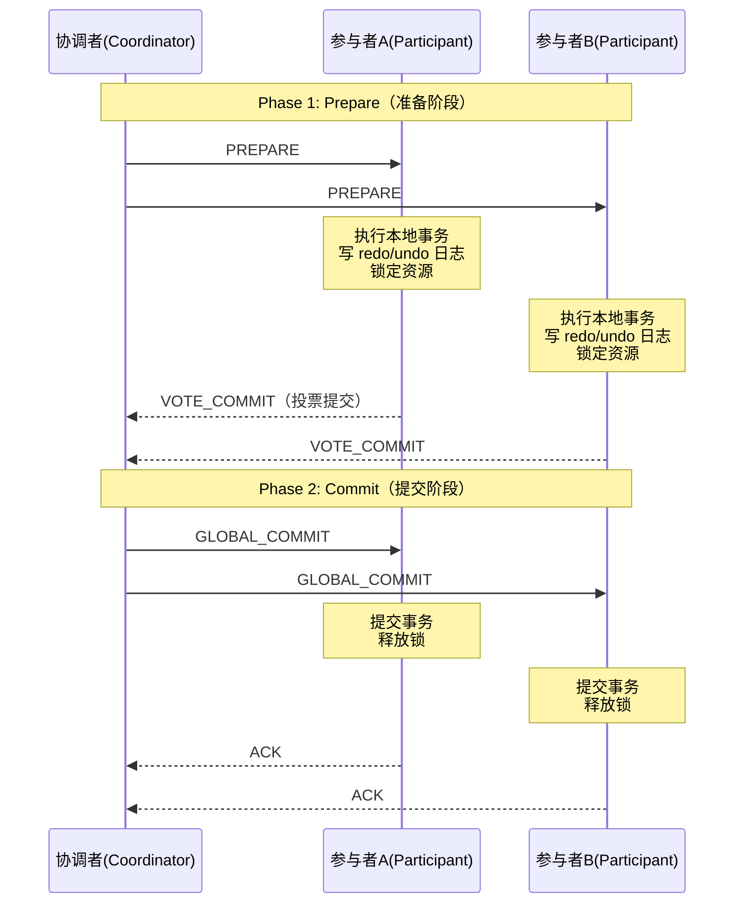
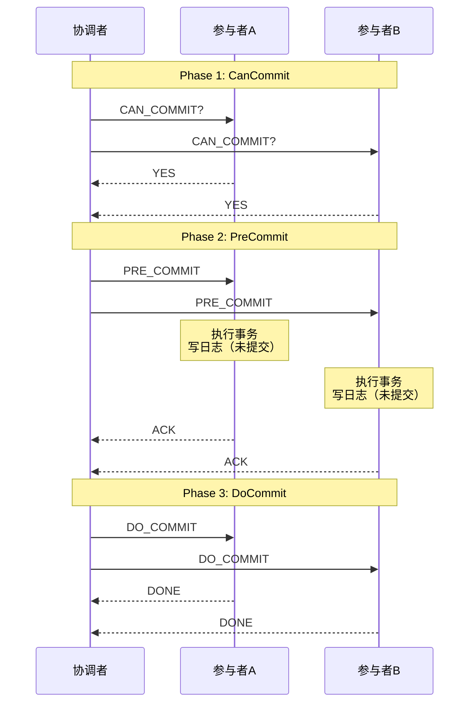
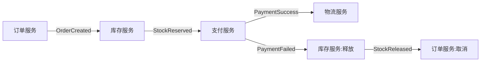
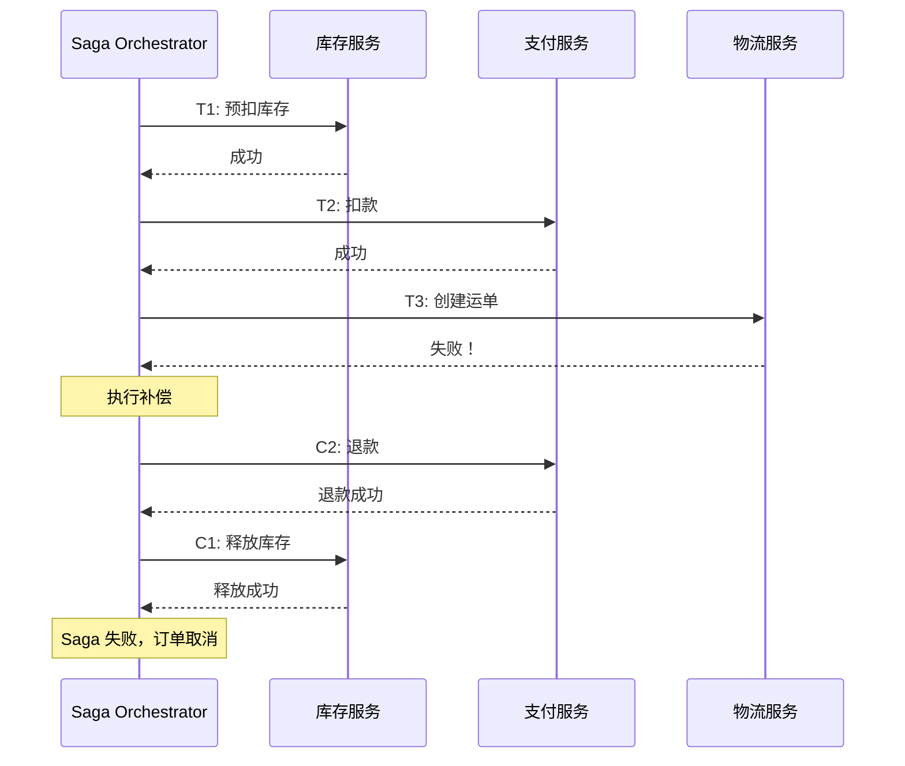
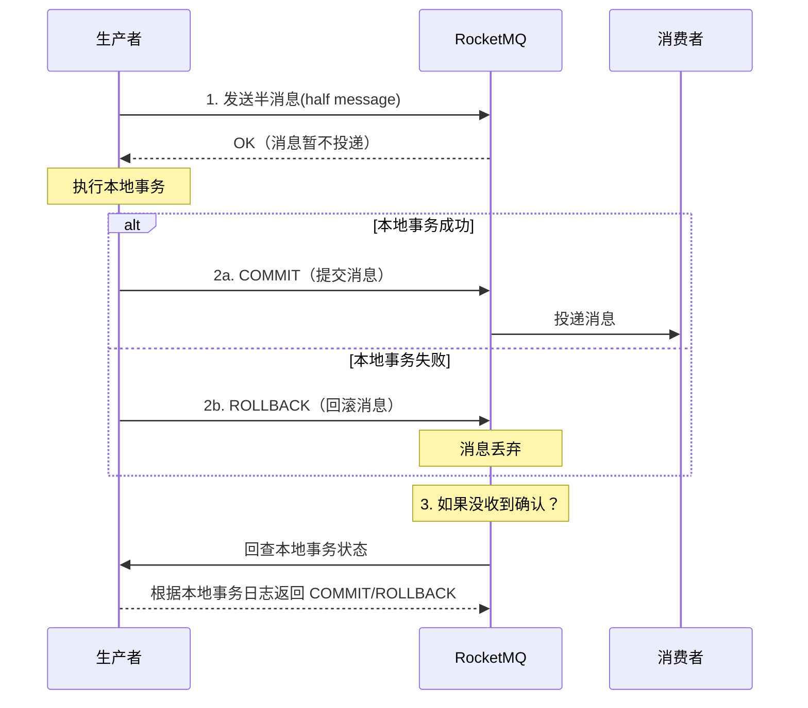
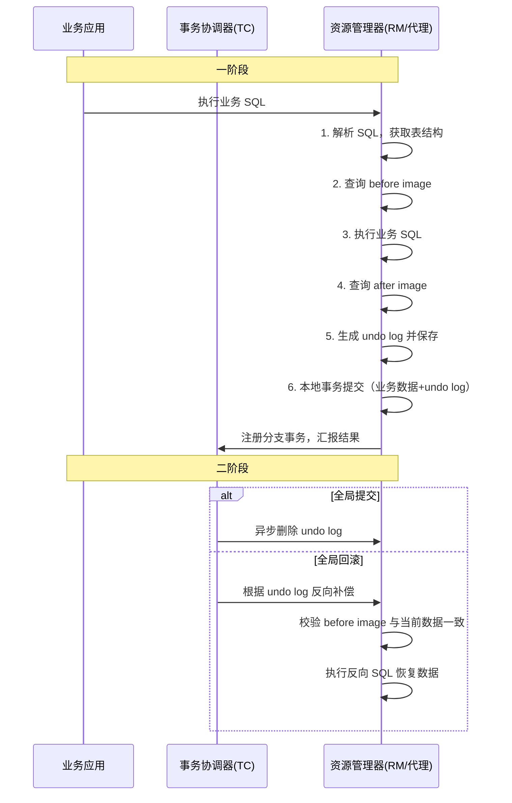
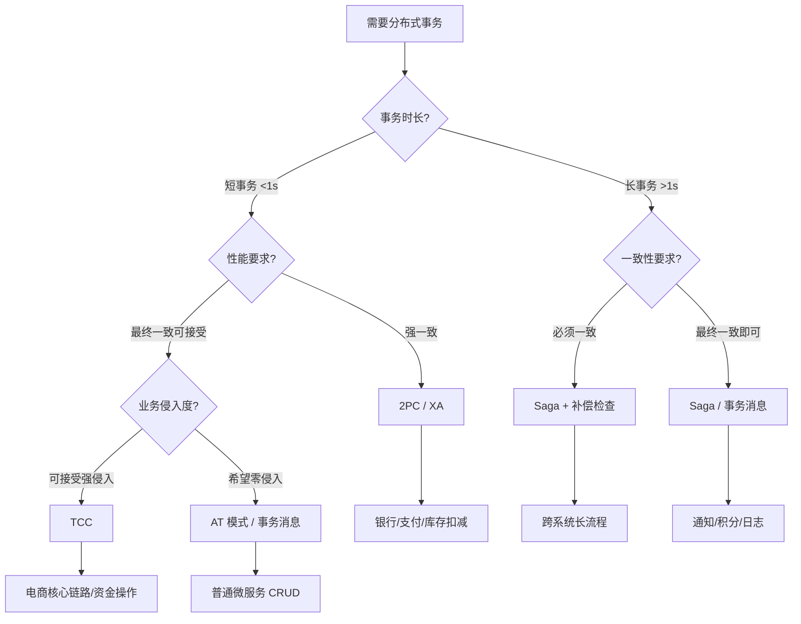

## 分布式事务：跨节点数据一致性的核心挑战

当一个业务操作需要同时修改多个服务的数据时，如何保证"要么全部成功，要么全部失败"？这就是分布式事务要解决的核心问题。

单机数据库时代的事务（ACID）是自然而然的——日志在同一个磁盘上，锁在同一个内存里。但在微服务和分布式数据库时代，数据散布在不同的机器、不同的网络分区、甚至不同的数据中心。一个跨行转账操作可能涉及两个数据库、两组日志、两个独立的故障域。这时候，简单的本地事务已无法满足需求。

本节将从分布式事务的根本问题出发，系统性地讲解两大经典方案（2PC/3PC）、两大柔性方案（Saga/TCC）、以及工程实践中的工具链与选型策略，帮助读者建立完整的分布式事务知识体系。

---

### 1. 为什么需要分布式事务

#### 1.1 单机事务的边界被打破

在单体架构中，一个数据库承担所有写操作。`BEGIN` 到 `COMMIT` 之间的一切修改要么一起持久化，要么一起回滚。数据库的 WAL（Write-Ahead Log）和锁管理器天然保证了原子性和隔离性。

但当系统拆分为微服务后：

- **订单服务** 的数据库要扣减库存
- **支付服务** 的数据库要记录交易
- **物流服务** 的数据库要创建运单

这三个数据库是独立的，各自有自己的事务日志。没有一个"超级数据库"能统一协调它们的提交。任何一个环节失败，已提交的其他操作就成了脏数据。

#### 1.2 分布式事务的经典场景

| 场景 | 涉及服务 | 风险 |
|------|----------|------|
| 电商下单 | 订单、库存、支付 | 库存扣了但支付失败 → 超卖或幽灵库存 |
| 跨行转账 | A银行、B银行 | A扣款成功但B未到账 → 资金丢失 |
| 航班+酒店 | 航班系统、酒店系统 | 航班订了但酒店失败 → 旅客困境 |
| 积分+优惠券 | 积分服务、券服务 | 积分扣了但券未发 → 用户投诉 |
| 消息+数据库 | 消息队列、业务库 | 入库成功但消息未发 → 下游不一致 |

#### 1.3 CAP 定理的约束

在分布式系统中，一致性（Consistency）、可用性（Availability）、分区容错性（Partition Tolerance）三者不可兼得。分布式事务本质上是在 CAP 框架下选择平衡点：

- **强一致性方案**（2PC/3PC）：优先保证 C，牺牲部分 A
- **最终一致性方案**（Saga/TCC）：优先保证 A，接受暂时不一致

---

### 2. ACID 在分布式环境中的挑战

ACID 的四个特性在分布式场景下各自面临新的困难：

| 特性 | 单机含义 | 分布式挑战 |
|------|----------|------------|
| **A（原子性）** | 全部提交或全部回滚 | 跨多个独立数据库，没有统一的事务管理器 |
| **C（一致性）** | 事务前后数据满足约束 | 跨库外键约束无法天然保证 |
| **I（隔离性）** | 并发事务互不干扰 | 分布式锁的开销巨大，跨节点的读写冲突难以检测 |
| **D（持久性）** | 提交后数据不丢失 | 多副本之间的一致性需要额外协议保障 |

为应对这些挑战，工业界发展出两条技术路线：

1. **刚性事务（Rigid Transaction）**：严格遵循 ACID，以 2PC 为代表。适用于短事务、同构数据库、性能要求不极端的场景。
2. **柔性事务（Soft Transaction）**：放松 ACID 约束，以 Saga 和 TCC 为代表。接受最终一致性，追求高可用和高性能。

---

### 3. 两阶段提交（2PC）

两阶段提交是分布式事务中最经典的强一致方案，由 Jim Gray 在 1978 年提出，是 X/Open XA 规范的核心协议。

#### 3.1 协议流程



**第一阶段（Prepare）：**

1. 协调者向所有参与者发送 `PREPARE` 消息
2. 每个参与者执行本地事务（不提交），将 undo/redo 日志写入磁盘
3. 参与者投票：如果本地事务成功，返回 `VOTE_COMMIT`；否则返回 `VOTE_ABORT`

**第二阶段（Commit/Abort）：**

1. 如果所有参与者都投票提交，协调者发送 `GLOBAL_COMMIT`
2. 如果任何一个参与者投票中止或超时，协调者发送 `GLOBAL_ABORT`
3. 参与者执行最终的提交或回滚，释放资源锁，返回 ACK

#### 3.2 日志机制：2PC 的容错基石

2PC 的可靠性完全依赖日志。协调者和参与者都需要将状态持久化：

协调者日志:
┌─────────────────────────────────────────┐
│ [事务ID=X1] PHASE1_START    timestamp=1 │
│ [事务ID=X1] PREPARE_SENT    A=OK, B=OK  │
│ [事务ID=X1] DECISION_COMMIT timestamp=2 │
│ [事务ID=X1] COMMIT_SENT     A=ACK, B=? │
└─────────────────────────────────────────┘

参与者日志:
┌─────────────────────────────────────────┐
│ [事务ID=X1] PREPARE_RECV    timestamp=1 │
│ [事务ID=X1] VOTE_COMMIT     locked=true │
│ [事务ID=X1] COMMIT_RECV     timestamp=2 │
│ [事务ID=X1] COMMIT_DONE     released   │
└─────────────────────────────────────────┘

重启恢复逻辑：
- 协调者重启后读取日志，发现已发 PREPARE 但未收到所有 ACK → 重发 GLOBAL_COMMIT
- 参与者重启后读取日志，发现已投票但未收到决策 → 向协调者查询最终决策

#### 3.3 2PC 的致命缺陷

| 缺陷 | 原因 | 影响 |
|------|------|------|
| **同步阻塞** | Prepare 后参与者持有锁直到第二阶段完成 | 并发性能急剧下降，一个慢参与者拖慢全局 |
| **协调者单点故障** | 协调者宕机后，参与者既不能提交也不能回滚 | 所有参与者被无限期阻塞 |
| **数据不一致窗口** | 第二阶段部分参与者收到 COMMIT，部分未收到（网络分区） | 短暂的数据不一致 |
| **超时困境** | 参与者超时后不知道该提交还是回滚 | 需要人工介入或复杂的恢复协议 |

#### 3.4 XA 规范与实现

XA 是 X/Open 组织定义的分布式事务标准接口，2PC 是其内部协议。常见实现：

| 实现 | 类型 | 特点 |
|------|------|------|
| MySQL XA | 数据库内置 | 简单但性能差，生产环境慎用 |
| Atomikos | Java 中间件 | 轻量级，适合中小规模 |
| Narayana (JBoss) | Java 中间件 | 功能完整，Red Hat 主导 |
| PostgreSQL prepared transactions | 数据库内置 | 类似 MySQL XA |

**MySQL XA 事务示例：**

```sql
-- 启动 XA 事务
XA START 'xid_001';

-- 执行业务 SQL
UPDATE accounts SET balance = balance - 100 WHERE user_id = 'A';
UPDATE accounts SET balance = balance + 100 WHERE user_id = 'B';

-- 准备阶段
XA END 'xid_001';
XA PREPARE 'xid_001';

-- 提交阶段（成功时）
XA COMMIT 'xid_001';

-- 或回滚（失败时）
-- XA ROLLBACK 'xid_001';
```

---

### 4. 三阶段提交（3PC）

3PC 是对 2PC 的改进，核心思路是引入超时机制和额外的 PreCommit 阶段，减少阻塞时间。

#### 4.1 协议流程



三个阶段：

1. **CanCommit**（询问阶段）：协调者询问参与者是否可以执行事务。参与者只需检查自身状态（资源是否可用），不锁定资源。这是一个轻量级的预检。
2. **PreCommit**（预提交阶段）：如果所有参与者同意，协调者发送 PreCommit。参与者执行事务并写日志，但仍不提交。此时参与者持有锁。
3. **DoCommit**（提交阶段）：协调者发送 DoCommit，参与者最终提交并释放锁。

#### 4.2 超时机制的关键改进

3PC 最重要的改进是**参与者超时自动提交**：

- 在 2PC 中，参与者超时后不知道协调者的决定，只能等待
- 在 3PC 中，如果参与者在 PreCommit 阶段后超时未收到 DoCommit，可以**自行提交**

这是因为：既然参与者已经进入了 PreCommit 阶段，说明协调者已经确认了所有参与者都同意提交。在没有更多信息的情况下，提交是概率上更安全的选择。

2PC 超时困境:
参与者超时 → 不知道提交还是回滚 → 阻塞等待 → 需要人工介入

3PC 超时策略:
参与者超时 → 已在 PreCommit 阶段 → 自动提交（大概率正确）

#### 4.3 3PC 的局限性

尽管 3PC 解决了部分问题，但它并未被广泛采用：

| 问题 | 说明 |
|------|------|
| 网络分区下仍可能不一致 | 分区两侧的参与者可能做出不同决策 |
| 性能开销更大 | 三次通信往返，延迟比 2PC 更高 |
| 实现复杂度高 | 超时策略和状态机更复杂 |
| 缺乏主流实现 | 几乎没有生产级的 3PC 开源实现 |

在实际工程中，3PC 的理论意义大于实践意义。大多数系统选择用 2PC + 高可用补偿，或者直接转向柔性事务方案。

---

### 5. Saga 模式

Saga 模式由 Hector Garcia-Molina 和 Kenneth Salem 在 1987 年提出，最初用于长事务处理。在微服务时代，Saga 成为分布式事务最主流的柔性解决方案。

#### 5.1 核心思想

Saga 将一个长事务拆分为一系列本地事务 $T_1, T_2, ..., T_n$，每个 $T_i$ 都有对应的补偿操作 $C_i$。

- **正向路径**：$T_1 \rightarrow T_2 \rightarrow ... \rightarrow T_n$（全部成功）
- **回滚路径**：如果 $T_k$ 失败，依次执行 $C_{k-1} \rightarrow C_{k-2} \rightarrow ... \rightarrow C_1$（逆序补偿）

关键约束：**补偿操作必须是幂等的**，因为补偿可能被重复执行。

#### 5.2 两种编排方式

##### 编排式（Choreography）

去中心化方案，每个服务监听事件并决定下一步操作：



**优点：** 服务解耦，无单点故障，实现简单
**缺点：** 业务逻辑分散在各个服务中，调试困难，循环依赖风险

##### 编排式（Orchestration）—— 常被误称为"协调式"

中心化方案，由一个 Orchestrator 统一协调：



**优点：** 逻辑集中，易于理解和调试，事务流程清晰
**缺点：** Orchestrator 是单点，需要高可用部署

#### 5.3 状态机实现

Saga 的编排式实现本质是一个状态机：

```python
class OrderSaga:
    """订单 Saga 状态机"""

    # 状态定义
    states = {
        'INITIATED':     'Saga 已启动',
        'STOCK_RESERVED':'库存已预留',
        'PAYMENT_DONE':  '支付已完成',
        'SHIP_CREATED':  '运单已创建',
        'COMPLETED':     'Saga 完成',
        'COMPENSATING':  '补偿中',
        'COMPENSATED':   '已补偿',
        'FAILED':        'Saga 失败',
    }

    # 正向转移
    transitions_forward = [
        ('INITIATED',      'reserve_stock',  'STOCK_RESERVED'),
        ('STOCK_RESERVED', 'process_payment','PAYMENT_DONE'),
        ('PAYMENT_DONE',   'create_shipment','COMPLETED'),
    ]

    # 补偿转移（逆序）
    transitions_compensate = [
        ('PAYMENT_DONE',   'refund_payment', 'STOCK_RESERVED'),
        ('STOCK_RESERVED', 'release_stock',  'INITIATED'),
    ]
```

#### 5.4 Saga 的核心挑战

| 挑战 | 说明 | 解决方案 |
|------|------|----------|
| **缺乏隔离性** | 中间状态对外可见（如库存已扣但未支付） | 语义锁、业务层防脏读 |
| **补偿失败** | 补偿操作本身可能失败 | 重试 + 人工介入 + 告警 |
| **幂等性要求** | 每个步骤和补偿必须幂等 | 请求ID + 幂等键 |
| **可观测性** | 长流程难以追踪 | 分布式链路追踪（Jaeger/SkyWalking） |

**语义锁（Semantic Lock）** 是解决 Saga 隔离性问题的关键技术：在预留资源时标记为"临时锁定"状态，其他事务在读取时感知到这个状态并做出相应处理。

```sql
-- 语义锁示例
-- 普通锁定: 直接扣减，其他事务看不到
UPDATE inventory SET stock = stock - 1 WHERE product_id = 100;

-- 语义锁定: 标记预留，其他事务可以感知
UPDATE inventory
SET stock = stock - 1,
    reserved_stock = reserved_stock + 1,
    status = 'RESERVED'
WHERE product_id = 100 AND stock > 0;
```

---

### 6. TCC 模式

TCC（Try-Confirm-Cancel）是一种业务侵入性较强的分布式事务方案，由 Pat Helland 在 2007 年的论文中系统阐述。它将每个操作拆分为三个阶段，由业务层显式实现。

#### 6.1 三阶段定义

| 阶段 | 职责 | 类比 |
|------|------|------|
| **Try** | 预留资源，检查业务可行性 | 预订酒店房间（冻结但未入住） |
| **Confirm** | 确认执行，使用 Try 阶段预留的资源 | 确认入住，扣费 |
| **Cancel** | 取消 Try，释放预留的资源 | 取消预订，释放房间 |

与 Saga 的关键区别：
- Saga 的补偿是"反向操作"（已扣款 → 退款），TCC 的 Cancel 是"释放预留"（冻结的 → 解冻）
- TCC 在 Try 阶段就锁定了资源，隔离性比 Saga 更好
- TCC 的业务侵入性更强，每个服务都要实现三个接口

#### 6.2 TCC 转账示例

```python
class AccountService:
    """TCC 账户服务"""

    def try_debit(self, user_id: str, amount: Decimal, tx_id: str) -> bool:
        """Try: 冻结资金（不实际扣款）"""
        # 检查余额是否充足
        balance = db.query("SELECT balance FROM accounts WHERE user_id = %s", user_id)
        if balance < amount:
            return False

        # 冻结资金：可用余额减少，冻结金额增加
        db.execute("""
            UPDATE accounts
            SET balance = balance - %s,
                frozen = frozen + %s
            WHERE user_id = %s AND balance >= %s
        """, (amount, amount, user_id, amount))

        # 记录冻结明细（用于幂等和恢复）
        db.execute("""
            INSERT INTO freeze_records (tx_id, user_id, amount, status)
            VALUES (%s, %s, %s, 'FROZEN')
        """, (tx_id, user_id, amount))
        return True

    def confirm_debit(self, user_id: str, amount: Decimal, tx_id: str) -> bool:
        """Confirm: 确认扣款（从冻结中扣除）"""
        # 幂等检查
        if self._is_confirmed(tx_id):
            return True

        db.execute("""
            UPDATE accounts
            SET frozen = frozen - %s
            WHERE user_id = %s AND frozen >= %s
        """, (amount, user_id, amount))

        db.execute("""
            UPDATE freeze_records SET status = 'CONFIRMED'
            WHERE tx_id = %s
        """, (tx_id,))
        return True

    def cancel_debit(self, user_id: str, amount: Decimal, tx_id: str) -> bool:
        """Cancel: 取消冻结（资金恢复可用）"""
        if self._is_cancelled(tx_id):
            return True

        db.execute("""
            UPDATE accounts
            SET balance = balance + %s,
                frozen = frozen - %s
            WHERE user_id = %s AND frozen >= %s
        """, (amount, amount, user_id, amount))

        db.execute("""
            UPDATE freeze_records SET status = 'CANCELLED'
            WHERE tx_id = %s
        """, (tx_id,))
        return True
```

#### 6.3 TCC 空回滚与悬挂问题

TCC 在分布式网络环境下有两个经典异常：

**空回滚（Empty Rollback）：** Try 请求因网络超时未到达参与者，但 Cancel 到达了。参与者没有冻结任何资源，却要执行 Cancel。

```python
def cancel_debit(self, user_id, amount, tx_id):
    # 检查是否有对应的 Try 记录
    record = db.query(
        "SELECT * FROM freeze_records WHERE tx_id = %s", tx_id
    )
    if not record:
        # 没有 Try 记录 → 空回滚，直接返回成功
        # 但必须标记，防止后续 Try 到达后执行（悬挂问题）
        db.execute("""
            INSERT INTO freeze_records (tx_id, user_id, amount, status)
            VALUES (%s, %s, %s, 'CANCELLED')
        """, (tx_id, user_id, amount))
        return True

    # 正常 Cancel 逻辑...
```

**悬挂（Suspension）：** Cancel 先到（触发空回滚并标记），Try 后到（正常执行了冻结）。此时这笔冻结永远不会被 Confirm 或 Cancel。

解决方案：空回滚时插入一条 `CANCELLED` 标记，Try 到达时先检查是否已存在 CANCELLED 记录，如果存在则回滚。

```python
def try_debit(self, user_id, amount, tx_id):
    # 检查是否已经空回滚过
    record = db.query(
        "SELECT status FROM freeze_records WHERE tx_id = %s", tx_id
    )
    if record and record.status == 'CANCELLED':
        # 悬挂保护：拒绝这次 Try
        raise SuspensionDetected(tx_id)

    # 正常 Try 逻辑...
```

#### 6.4 TCC vs Saga 对比

| 维度 | TCC | Saga |
|------|-----|------|
| **隔离性** | 较好（Try 阶段已锁定） | 差（中间状态可见） |
| **业务侵入** | 强（需实现 Try/Confirm/Cancel 三个接口） | 中（只需实现正向+补偿） |
| **一致性** | 强（资源预留保证） | 最终一致（依赖补偿） |
| **适用场景** | 资金、库存等高价值操作 | 长流程、低价值操作 |
| **实现复杂度** | 高（空回滚、悬挂、幂等） | 中（补偿失败处理） |

---

### 7. 本地消息表与事务消息

除了上述协议级方案，还有两种基于"消息"的分布式事务模式，它们不依赖专门的事务协调器，工程实现更轻量。

#### 7.1 本地消息表（Outbox Pattern）

核心思想：利用数据库事务的原子性，将业务操作和消息记录写入同一个数据库事务。

```sql
-- 本地消息表方案：单个数据库事务内完成
BEGIN;

-- 1. 业务操作
UPDATE orders SET status = 'PAID' WHERE order_id = 'ORD_001';

-- 2. 写入消息表（同库同事务）
INSERT INTO outbox_messages (msg_id, topic, payload, status, created_at)
VALUES ('MSG_001', 'order.paid',
        '{"order_id":"ORD_001","amount":99.00}',
        'PENDING', NOW());

COMMIT;
```

然后由一个异步进程（轮询器或 CDC）将 outbox 中的消息投递到消息队列：

┌──────────────┐     ┌──────────────┐     ┌──────────────┐
│  业务数据库   │────▶│  Outbox 轮询  │────▶│  消息队列     │
│  (同库同事务) │     │  (异步读取)   │     │  (Kafka/RMQ) │
└──────────────┘     └──────────────┘     └──────────────┘

**关键保证：**
- 写入业务数据和消息记录是同一个数据库事务 → 原子性
- 消息投递失败可以无限重试 → 最终投递
- 消费者必须幂等消费 → 容忍重复投递

#### 7.2 事务消息（Transaction Message）

以 RocketMQ 为例，事务消息提供了更优雅的实现：



**半消息（Half Message）** 是事务消息的核心机制：消息先发送到 Broker 但不投递给消费者，等生产者确认本地事务结果后再决定提交还是回滚。

**事务回查机制：** 如果生产者在 COMMIT/ROLLBACK 之前宕机，Broker 会定期回查生产者的本地事务状态。生产者需要实现一个 `check` 接口，根据本地事务日志判断事务是否成功。

```java
// RocketMQ 事务消息生产者示例
public class OrderTransactionListener implements TransactionListener {

    @Override
    public LocalTransactionState executeLocalTransaction(Message msg, Object arg) {
        try {
            // 执行本地事务：创建订单
            orderService.createOrder(msg.getOrderId(), msg.getAmount());
            return LocalTransactionState.COMMIT_MESSAGE;
        } catch (Exception e) {
            return LocalTransactionState.ROLLBACK_MESSAGE;
        }
    }

    @Override
    public LocalTransactionState checkLocalTransaction(MessageExt msg) {
        // 回查：检查订单是否已创建
        Order order = orderService.query(msg.getOrderId());
        if (order != null &amp;&amp; order.getStatus() == OrderStatus.CREATED) {
            return LocalTransactionState.COMMIT_MESSAGE;
        }
        return LocalTransactionState.UNKNOW; // 还不确定，继续回查
    }
}
```

---

### 8. 分布式事务框架：Seata

Seata（原名 Fescar）是蚂蚁金服和阿里巴巴开源的分布式事务框架，提供了 AT、TCC、Saga、XA 四种模式，是目前 Java 生态中最成熟的分布式事务解决方案。

#### 8.1 四种模式总览

| 模式 | 原理 | 业务侵入 | 性能 | 适用场景 |
|------|------|----------|------|----------|
| **AT** | 自动生成 undo log，二阶段自动提交/回滚 | 无侵入 | 高 | 常规 CRUD |
| **TCC** | 手动实现 Try/Confirm/Cancel | 强侵入 | 高 | 高一致性要求 |
| **Saga** | 状态机编排 + 补偿 | 中等 | 中 | 长事务 |
| **XA** | 数据库原生 XA 协议 | 无侵入 | 低 | 强一致性 |

#### 8.2 AT 模式详解

AT（Automatic Transaction）是 Seata 最常用的模式。它通过代理 SQL 执行，自动生成前/后镜像（before/after image）来实现回滚，对业务代码零侵入。

**执行流程：**



**undo log 示例：**

```json
{
  "branchId": 12345,
  "tableName": "inventory",
  "sqlType": "UPDATE",
  "beforeImage": [
    {"productId": 100, "stock": 50, "version": 1}
  ],
  "afterImage": [
    {"productId": 100, "stock": 49, "version": 2}
  ],
  "rollbackInfo": {
    "sql": "UPDATE inventory SET stock = 50, version = 1 WHERE product_id = 100 AND version = 2"
  }
}
```

AT 模式的全局锁机制：在二阶段提交完成之前，通过 TC 管理全局锁，防止脏写。这保证了不同全局事务之间不会出现写冲突。

#### 8.3 Seata 部署架构

┌─────────────────────────────────────────────────────┐
│                    应用集群                           │
│  ┌─────────┐  ┌─────────┐  ┌─────────┐             │
│  │  App 1  │  │  App 2  │  │  App 3  │             │
│  └────┬────┘  └────┬────┘  └────┬────┘             │
│       │             │             │                   │
│       └─────────────┼─────────────┘                   │
│                     ▼                                 │
│            ┌────────────────┐                         │
│            │  Seata Server  │ (TC 事务协调器)         │
│            │  (高可用部署)   │                         │
│            └───────┬────────┘                         │
│                    │                                  │
│       ┌────────────┼────────────┐                     │
│       ▼            ▼            ▼                     │
│  ┌─────────┐  ┌─────────┐  ┌─────────┐             │
│  │ MySQL 1 │  │ MySQL 2 │  │ MySQL 3 │             │
│  │  (RM)   │  │  (RM)   │  │  (RM)   │             │
│  └─────────┘  └─────────┘  └─────────┘             │
└─────────────────────────────────────────────────────┘

---

### 9. 模式选型与决策指南

#### 9.1 决策流程图



#### 9.2 场景化选型表

| 场景 | 推荐方案 | 理由 |
|------|----------|------|
| 银行转账 | 2PC/XA | 资金安全第一，不能容忍不一致 |
| 电商下单 | TCC 或 AT | 库存扣减需要预留机制，防止超卖 |
| 跨系统集成 | Saga | 流程长，涉及外部系统，补偿是唯一选择 |
| 消息通知 | 本地消息表 | 轻量，不引入额外中间件 |
| 金融核心 | TCC | 一致性要求极高，愿意付出开发成本 |
| 普通 CRUD | AT (Seata) | 零侵入，开发效率最高 |

#### 9.3 性能对比参考

| 方案 | 吞吐量影响 | 延迟增加 | 开发成本 | 运维复杂度 |
|------|------------|----------|----------|------------|
| 2PC/XA | -60% ~ -80% | +50ms ~ +200ms | 低 | 中 |
| AT | -20% ~ -40% | +10ms ~ +30ms | 低 | 中 |
| TCC | -15% ~ -30% | +5ms ~ +20ms | 高 | 高 |
| Saga | -10% ~ -20% | +5ms ~ +15ms | 中 | 中 |
| 本地消息表 | -5% ~ -10% | +1ms ~ +5ms | 中 | 低 |

> 注：以上数据为典型场景下的经验值，实际性能受业务复杂度、网络环境、硬件配置影响。

---

### 10. 常见误区与最佳实践

#### 10.1 常见误区

**误区一：所有场景都需要分布式事务**

大多数微服务交互不需要分布式事务。只有当两个操作必须原子性地成功或失败时，才需要引入。很多场景用**最终一致性 + 幂等消费**就够了。

**误区二：分布式事务 = 强一致性**

分布式事务有强一致和最终一致两种模式。Saga 和本地消息表属于最终一致性方案，它们在短时间内可能不一致，但最终会收敛到一致状态。

**误区三：用了 2PC 就万事大吉**

2PC 在网络分区、协调者宕机、参与者崩溃等场景下仍然可能出现数据不一致。必须配合日志持久化、超时重试、人工介入机制。

**误区四：补偿 = 回滚**

补偿操作和数据库回滚有本质区别。回滚是原子性的 undo，补偿是新的正向操作来"弥补"之前的副作用。补偿操作本身必须处理各种异常情况。

**误区五：忽略幂等性**

在分布式事务中，任何操作都可能被重复执行。网络超时 → 重试 → 重复执行。如果操作不是幂等的，重试会导致数据错乱。

#### 10.2 最佳实践

**实践一：优先使用最终一致性方案**

```python
# 推荐：最终一致性 + 幂等
def process_order(order):
    # 1. 本地事务：创建订单 + 写 outbox 消息
    with db.transaction():
        db.insert('orders', order)
        db.insert('outbox', create_message('order.created', order))

    # 2. 异步投递消息
    message_queue.publish(outbox_message)

# 消费者幂等处理
def handle_order_created(msg):
    idempotent_key = msg['order_id']
    if redis.setnx(f'idempotent:{idempotent_key}', 1, ex=3600):
        # 首次消费
        do_business_logic(msg)
    else:
        # 重复消费，跳过
        log.info(f'重复消息，跳过: {idempotent_key}')
```

**实践二：设计可补偿的业务**

在设计阶段就考虑补偿操作。每个写操作都要问自己："如果后续步骤失败，我怎么恢复到一致状态？"

**实践三：建立完善的监控告警**

关键监控指标：
- Saga 事务成功率 / 失败率
- 补偿操作执行次数和成功率
- 消息积压量（本地消息表未投递数）
- 2PC 事务平均耗时和超时率
- TCC Try → Confirm/Cancel 的转化率

**实践四：设置合理的超时和重试策略**

```yaml
# 事务超时配置示例
transaction:
  # 单个参与者超时
  participant_timeout: 10s
  # 全局事务超时
  global_timeout: 60s
  # 最大重试次数
  max_retry: 3
  # 重试间隔（指数退避）
  retry_interval: 1s, 2s, 4s
```

**实践五：做好数据对账**

即使使用了分布式事务，也需要定期对账来兜底：

```python
# 每日对账脚本（核心逻辑）
def daily_reconciliation():
    # 1. 对比订单系统 vs 库存系统的记录
    mismatched_orders = compare_records(
        order_service.get_all_orders(date=today),
        inventory_service.get_all_reservations(date=today)
    )

    # 2. 发现不一致 → 告警 + 人工处理
    if mismatched_orders:
        alert_ops_team(f'发现 {len(mismatched_orders)} 条不一致记录')
        for order in mismatched_orders:
            log.warning(f'不一致: {order.id}, 订单状态={order.status}, '
                       f'库存状态={order.stock_status}')

    # 3. 自动修复（简单场景可自动，复杂场景人工）
    for order in mismatched_orders:
        if order.can_auto_fix():
            auto_fix(order)
```

---

### 11. 总结

分布式事务是分布式系统中最复杂的问题之一。没有银弹——每种方案都在一致性、可用性、性能、开发成本之间做出不同的权衡。

核心知识图谱：

                    分布式事务
                        │
          ┌─────────────┼─────────────┐
          │             │             │
      刚性事务       柔性事务       消息驱动
          │             │             │
      ┌───┴───┐     ┌───┴───┐     ┌───┴───┐
      2PC     3PC   Saga    TCC   本地消息表 事务消息
      │             │             │
     XA            状态机       Outbox

关键决策原则：

1. **不要过度设计**：先评估是否真的需要分布式事务
2. **优先最终一致**：除非是资金等不可妥协的场景
3. **幂等是底线**：无论选择哪种方案，幂等性都是必须的
4. **监控兜底**：再完善的方案也需要对账和告警
5. **渐进式演进**：从简单方案开始，遇到瓶颈再升级
