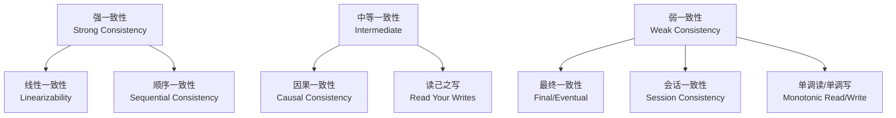
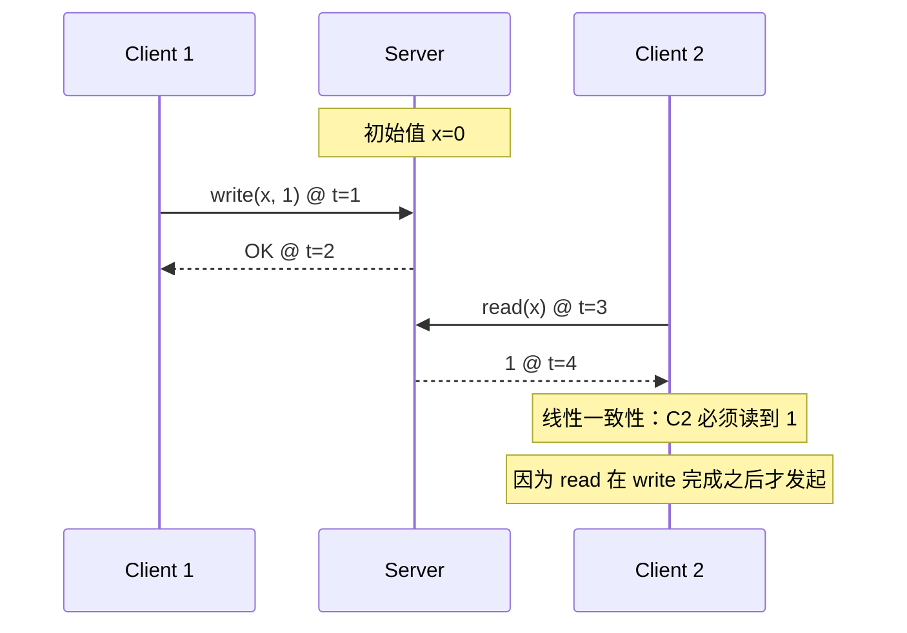
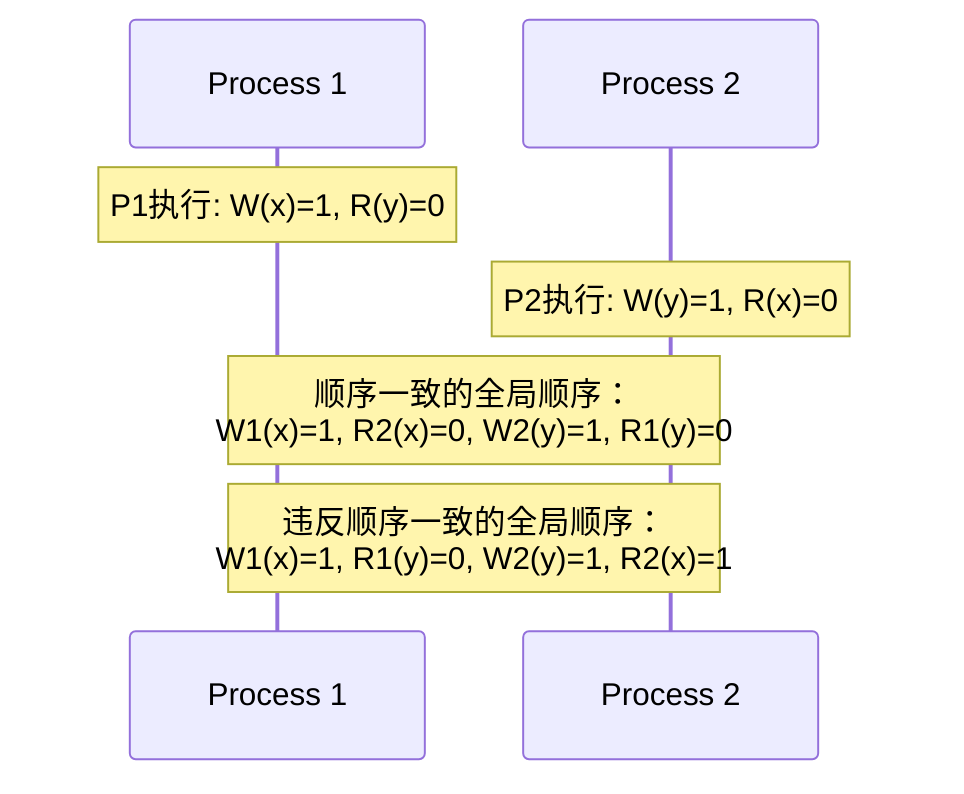
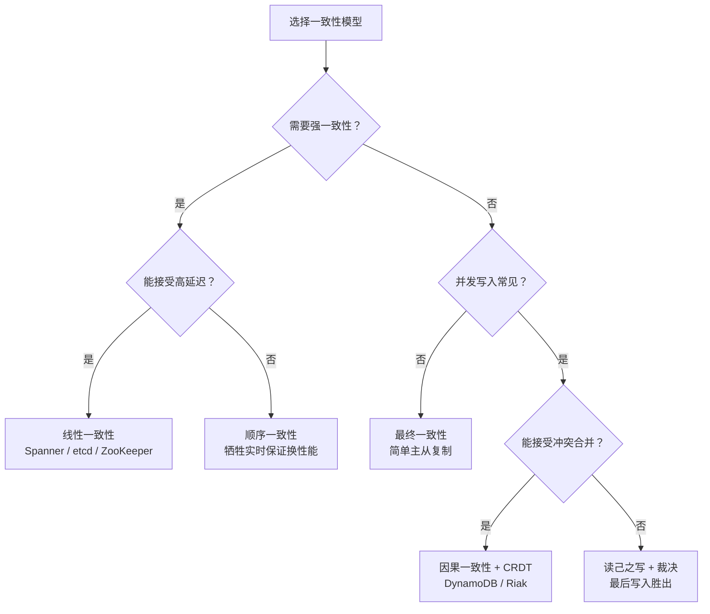
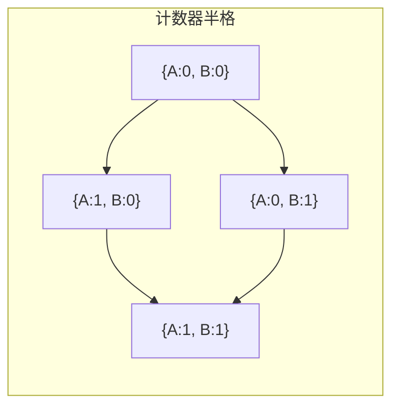
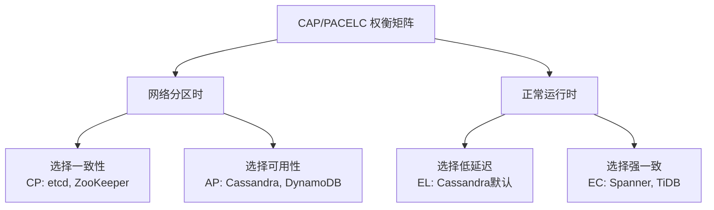
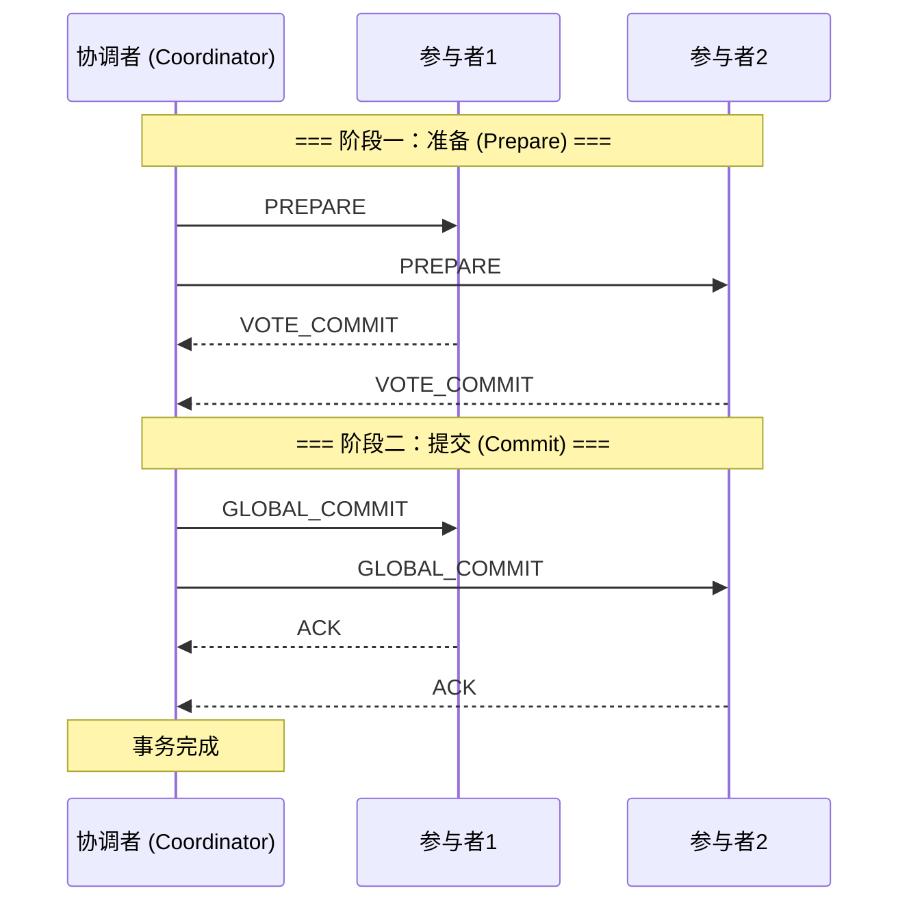
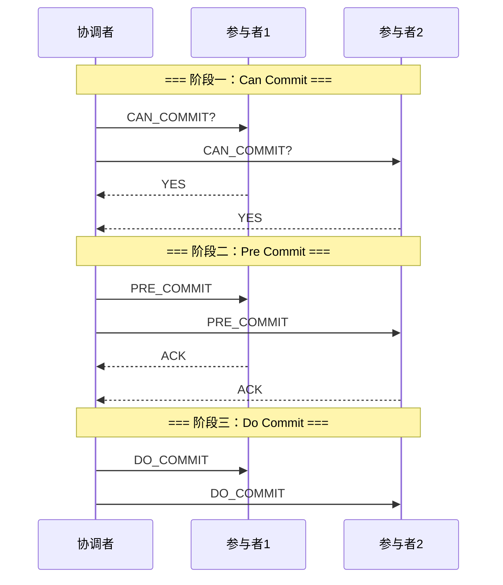
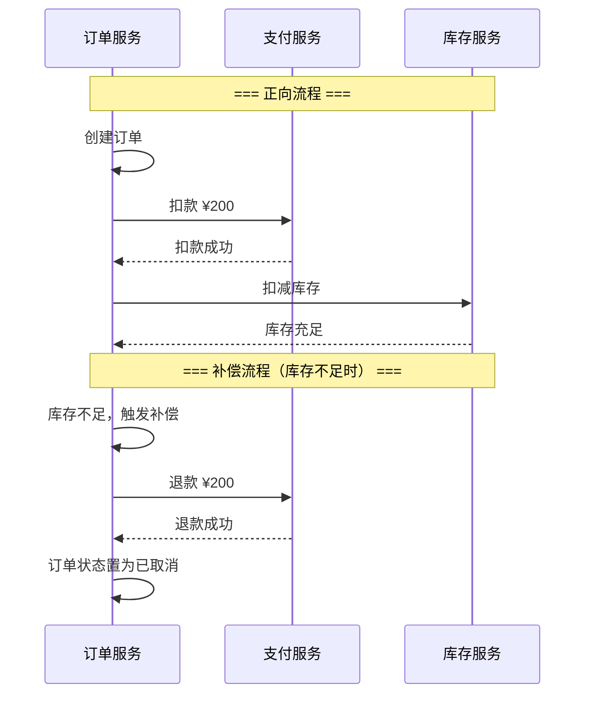
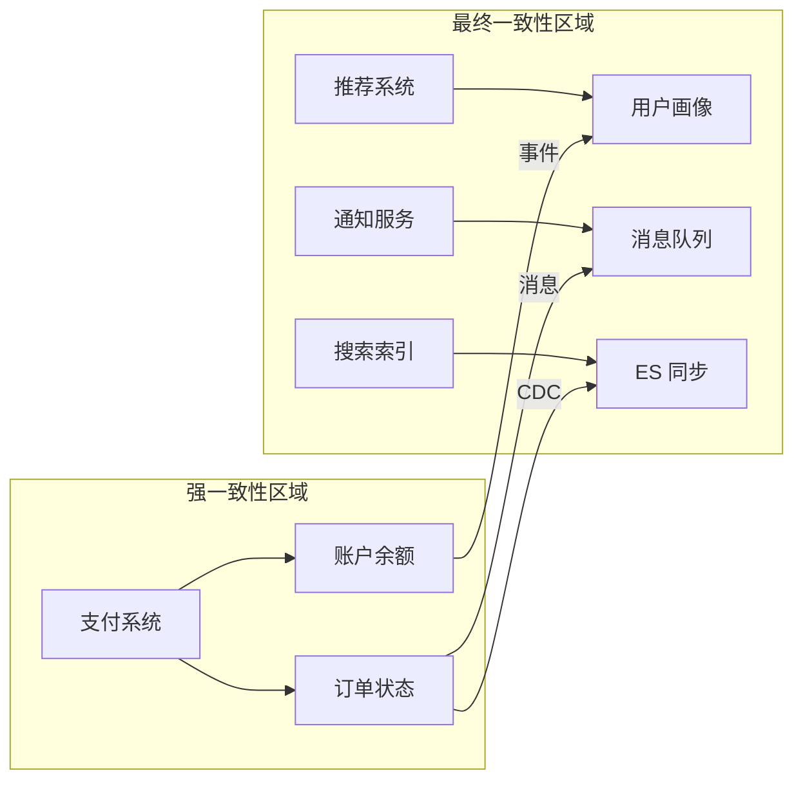

# 数据一致性理论基础

数据一致性是分布式系统设计中最核心、也最具挑战性的课题。本章从理论层面系统梳理一致性模型、无冲突复制数据类型（CRDT）、分布式事务和幂等性设计四大支柱，为后续章节的工程实践奠定坚实的理论根基。

---

## 一、一致性模型

一致性模型定义了分布式系统中多个副本之间数据可见性的语义契约。不同的模型在一致性强度、可用性和性能之间做出不同的权衡，理解这些模型是架构选型的起点。

### 1.1 一致性模型全景



### 1.2 线性一致性（Linearizability）

线性一致性是最强的一致性模型，也称为"原子一致性"。其核心要求是：所有操作表现得如同在某个全局时间点上原子性地完成。

**形式化定义：** 一次操作的历史 H 是线性一致的，当且仅当存在一个合法的顺序化 S，满足：
1. S 与 H 的程序序（program order）一致
2. S 中每个读操作返回的是其之前最近一次写操作的值
3. S 中的每个操作都在其时间窗口内完成



**典型实现：**
- **单主复制 + 同步复制**：所有写入必须同步到多数节点后才返回成功
- **共识算法**：Raft、Multi-Paxos 等协议天然保证线性一致性读
- **Google Spanner**：通过 TrueTime API（GPS + 原子钟）实现外部一致性

**性能代价：** 线性一致性要求每次读写都经过协调者，在高延迟网络中代价显著。Spanner 的 TrueTime 引入了 commit-wait 机制，写入必须等待时间不确定性窗口（通常 7ms）过去，这直接影响了写入吞吐。

### 1.3 顺序一致性（Sequential Consistency）

由 Lamport 在 1979 年提出，要求所有进程看到的操作顺序相同，且每个进程内部的操作保持程序序。



**与线性一致性的区别：** 顺序一致性不要求操作的实时顺序，只要求所有观察者看到相同的序列。因此它不要求"读到最新值"，而是要求"全局一致地看到某个合法顺序"。Google App Engine 的数据存储曾采用顺序一致性而非线性一致性，以换取更低的延迟。

### 1.4 因果一致性（Causal Consistency）

因果一致性保留了因果关系的可见性，但允许无因果关系的并发操作在不同副本上以不同顺序出现。

**因果序的判定：** 两个操作之间存在因果关系，当且仅当它们之间存在"先行发生"（happens-before）关系：

若 op1 happens-before op2，则所有节点必须先看到 op1 再看到 op2
若 op1 与 op2 并发（无 happens-before 关系），则不同节点可以以任意顺序看到它们

**实现机制——向量时钟：**

```python
class VectorClock:
    def __init__(self, node_id: str, num_nodes: int):
        self.clock = [0] * num_nodes
        self.node_id = node_id

    def increment(self, node_index: int):
        """发送/写入操作时递增"""
        self.clock[node_index] += 1

    def update(self, other_clock: list):
        """接收到消息时合并"""
        for i in range(len(self.clock)):
            self.clock[i] = max(self.clock[i], other_clock[i])

    def happens_before(self, other: 'VectorClock') -> bool:
        """判断 self 是否 happens-before other"""
        all_le = True
        any_lt = False
        for i in range(len(self.clock)):
            if self.clock[i] > other.clock[i]:
                all_le = False
                break
            if self.clock[i] < other.clock[i]:
                any_lt = True
        return all_le and any_lt

    def concurrent(self, other: 'VectorClock') -> bool:
        """判断两个时钟是否并发"""
        return not self.happens_before(other) and not other.happens_before(self)
```

**典型应用：** Amazon DynamoDB 使用向量时钟（后改为基于逻辑时钟的简化方案）来追踪因果关系，允许在冲突时进行最终合并。

### 1.5 最终一致性（Eventual Consistency）

最终一致性是最弱的可用性友好模型：如果不继续写入，所有副本最终将收敛到相同的值，但不保证收敛的时间窗口。

**语义变体：**

| 变体 | 保证 | 适用场景 |
|------|------|----------|
| 纯最终一致性 | 最终收敛，无时间保证 | DNS、CDN 缓存读取 |
| 读己之写（Read Your Writes） | 写后读一定能读到自己写的值 | 用户个人设置 |
| 单调读（Monotonic Read） | 一旦读到某值，后续不会读到更旧的值 | 社交信息流 |
| 单调写（Monotonic Write） | 同一进程的写操作按序完成 | 消息队列日志 |
| 会话一致性（Session Consistency） | 同一会话内保持读己之写 + 单调读 | Web 应用会话内 |

**收敛条件分析：** 最终一致性的收敛依赖于两个前提：(1) 网络最终恢复连通；(2) 系统实现了抗并发写冲突的合并策略（如 CRDT 或 last-write-wins）。当这两个条件任一不满足时，系统可能出现永久不一致。

### 1.6 模型选择决策框架



---

## 二、CRDT（无冲突复制数据类型）

CRDT（Conflict-free Replicated Data Types）是解决分布式系统最终一致性下数据合并问题的关键技术。其核心思想是：通过精心设计的数据结构，使得并发更新可以在无需协调的情况下自动合并，并保证所有副本最终收敛到相同状态。

### 2.1 理论基础：半格与交换幺半群

CRDT 的数学基础是抽象代数中的**半格**（Semilattice）结构。一个集合 L 上定义偏序关系 ≤，若任意两个元素都有最小上界（least upper bound, LUB），则 (L, ≤) 是一个半格。



**关键性质：**
- **交换律（Commutativity）**：merge(a, b) = merge(b, a)
- **结合律（Associativity）**：merge(a, merge(b, c)) = merge(merge(a, b), c)
- **幂等性（Idempotence）**：merge(a, a) = a

这三个性质确保了：无论消息以何种顺序到达、是否重复到达，最终状态都是一致的。

### 2.2 G-Counter（增长-only 计数器）

G-Counter 是最简单的 CRDT，只支持递增操作。

```python
class GCounter:
    """Grow-only Counter CRDT"""
    def __init__(self, node_id: str, num_nodes: int):
        self.node_id = node_id
        self.counts = [0] * num_nodes

    def increment(self):
        """本节点递增"""
        node_idx = hash(self.node_id) % len(self.counts)
        self.counts[node_idx] += 1

    def value(self) -> int:
        """返回当前计数值"""
        return sum(self.counts)

    def merge(self, other: 'GCounter'):
        """合并另一个 G-Counter：逐节点取最大值"""
        for i in range(len(self.counts)):
            self.counts[i] = max(self.counts[i], other.counts[i])

# 使用示例
c1 = GCounter("node-1", 3)
c2 = GCounter("node-2", 3)

c1.increment()
c1.increment()
c2.increment()

c1.merge(c2)  # 合并后 counts = [2, 1, 0]
print(c1.value())  # 输出: 3
```

**局限性：** G-Counter 只能递增，无法实现减法或负数。这引出了 PN-Counter。

### 2.3 PN-Counter（正负计数器）

PN-Counter 通过维护两个 G-Counter（一个记录递增，一个记录递减）来支持双向计数：

```python
class PNCounter:
    """Positive-Negative Counter CRDT"""
    def __init__(self, node_id: str, num_nodes: int):
        self.positive = GCounter(node_id, num_nodes)
        self.negative = GCounter(node_id, num_nodes)

    def increment(self):
        self.positive.increment()

    def decrement(self):
        self.negative.increment()

    def value(self) -> int:
        return self.positive.value() - self.negative.value()

    def merge(self, other: 'PNCounter'):
        self.positive.merge(other.positive)
        self.negative.merge(other.negative)
```

### 2.4 LWW-Register（最后写入胜出寄存器）

LWW-Register 为每次写入附加一个全局唯一的时间戳，合并时选择时间戳最大的值：

```python
import time

class LWWRegister:
    """Last-Writer-Wins Register CRDT"""
    def __init__(self):
        self.value = None
        self.timestamp = 0
        self.node_id = ""

    def set(self, value, node_id: str):
        """写入新值，使用物理时钟 + 节点ID打破平局"""
        self.value = value
        self.timestamp = time.time()
        self.node_id = node_id

    def get(self):
        return self.value

    def merge(self, other: 'LWWRegister'):
        """合并：选择时间戳更大的值；时间戳相同时选择字典序更大的 node_id"""
        if (other.timestamp > self.timestamp or
            (other.timestamp == self.timestamp and other.node_id > self.node_id)):
            self.value = other.value
            self.timestamp = other.timestamp
            self.node_id = other.node_id
```

**关键陷阱：** LWW-Register 的正确性依赖于物理时钟的同步精度。在时钟偏移较大的环境中，较晚写入的值可能被较早写入的值覆盖。混合逻辑时钟（Hybrid Logical Clock, HLC）可以部分缓解此问题。

### 2.5 OR-Set（Observed-Remove Set）

OR-Set 是 CRDT 中最复杂也最实用的数据结构之一，支持元素的添加和删除，通过"观察-移除"语义解决删除冲突：

```python
import uuid

class ORSet:
    """Observed-Remove Set CRDT"""
    def __init__(self):
        self.elements = {}  # element -> set of unique tags

    def add(self, element):
        """添加元素：分配一个全局唯一标签"""
        tag = str(uuid.uuid4())
        if element not in self.elements:
            self.elements[element] = set()
        self.elements[element].add(tag)

    def remove(self, element):
        """删除元素：移除当前已观察到的所有标签"""
        if element in self.elements:
            del self.elements[element]

    def contains(self, element) -> bool:
        return element in self.elements and len(self.elements[element]) > 0

    def merge(self, other: 'ORSet'):
        """合并：取标签并集"""
        for element, tags in other.elements.items():
            if element not in self.elements:
                self.elements[element] = set()
            self.elements[element] |= tags

# 场景演示
s1 = ORSet()
s2 = ORSet()

# 节点1添加元素A
s1.add("A")
# 节点2同时删除A（基于旧状态，未看到节点1的添加）
s2.remove("A")
# 节点1再次添加A（新标签）
s1.add("A")

# 合并后：元素A仍然存在（因为节点1的新标签未被节点2移除）
s1.merge(s2)
print(s1.contains("A"))  # True — 正确保留了并发添加
```

**实际应用：** Redis 的 Keyspace 和 Riak 的 Sets 数据类型都采用了 OR-Set 变体。

### 2.6 CRDT 类型速查表

| 类型 | 支持的操作 | 合并策略 | 适用场景 |
|------|-----------|----------|----------|
| G-Counter | increment | 逐节点取 max | 访问量统计、点赞计数 |
| PN-Counter | increment/decrement | 两个 G-Counter 分别合并 | 库存增减、余额变动 |
| G-Set | add | 取并集 | 标签收集、事件日志 |
| OR-Set | add/remove | 标签并集 | 用户列表、权限管理 |
| LWW-Register | set | 取最新时间戳的值 | 配置中心、用户状态 |
| MV-Register | set | 多版本保留 | 冲突检测、审计日志 |
| RGA | insert/delete | 按序号合并 | 协同编辑、文本序列 |

### 2.7 CRDT 的工程挑战

**内存开销：** 每个操作都需要存储元数据（时间戳、标签、节点ID等），导致存储膨胀。解决方案包括垃圾回收（当确认所有副本都已同步后清理过时标签）和时间窗口裁剪。

**语义限制：** 并非所有数据结构都能自然表达为 CRDT。例如，删除操作和添加操作同时发生在同一元素上时，OR-Set 采用"添加赢"语义，这在某些业务场景下可能不符合预期。

**与事务的集成：** CRDT 本身不提供原子性保证——多个 CRDT 操作之间没有事务语义。需要在应用层实现组合操作的一致性。

---

## 三、分布式事务

当一个业务操作需要跨多个节点（或多个数据库分片）修改数据时，必须使用分布式事务来保证 ACID 属性。分布式事务是数据一致性工程中最复杂、也最容易出错的领域。

### 3.1 CAP 定理与 PACELC 扩展

**CAP 定理回顾：** 在网络分区（Partition）发生时，系统必须在一致性（Consistency）和可用性（Availability）之间做出选择。

**PACELC 扩展：** 即使没有分区（E = Else），系统仍然需要在延迟（Latency）和一致性（Consistency）之间权衡。



### 3.2 两阶段提交（2PC）

2PC 是最经典的分布式事务协议，由 Jim Gray 在 1978 年提出。



**2PC 的致命缺陷：**

| 问题 | 描述 | 影响 |
|------|------|------|
| 阻塞问题 | 协调者宕机后，参与者持锁等待恢复 | 系统不可用，资源被锁 |
| 单点故障 | 协调者是唯一的协调实体 | 协调者宕机 = 整个事务阻塞 |
| 数据不一致窗口 | 阶段二中部分参与者提交、部分未提交 | 中间状态对外可见 |
| 性能瓶颈 | 同步等待所有参与者响应 | 延迟 = max(所有参与者延迟) |

### 3.3 三阶段提交（3PC）

3PC 在 2PC 基础上增加了预提交（Pre-Commit）阶段和超时机制，试图解决阻塞问题：



**3PC 的局限：** 理论上 3PC 在同步网络中可以避免阻塞，但在异步网络（实际生产环境）中，网络延迟的不确定性使得 3PC 仍然可能陷入不一致。因此，3PC 在工业界几乎没有被实际采用。

### 3.4 基于日志的事务（Saga）

Saga 模式将长事务拆分为一系列本地事务，每个本地事务都有对应的补偿操作。如果某个步骤失败，按逆序执行已完成步骤的补偿操作。



**Saga 的两种实现模式：**

**编排式（Choreography）：** 各服务通过事件相互通信，没有中央协调者。

```python
# 编排式 Saga 示例 — 事件驱动
class OrderSaga:
    def __init__(self, order_id: str):
        self.order_id = order_id
        self.steps_completed = []

    def on_payment_succeeded(self, event):
        """支付成功后扣减库存"""
        self.steps_completed.append("payment")
        inventory_service.reserve(self.order_id)

    def on_inventory_reserved(self, event):
        """库存扣减后确认订单"""
        self.steps_completed.append("inventory")
        order_service.confirm(self.order_id)

    def on_inventory_failed(self, event):
        """库存不足时，触发补偿"""
        if "payment" in self.steps_completed:
            payment_service.refund(self.order_id)
        order_service.cancel(self.order_id)

    def on_payment_refunded(self, event):
        """退款完成，清理订单"""
        order_service.mark_cancelled(self.order_id)
```

**协调式（Orchestration）：** 由中央协调器（Saga Orchestrator）统一管理事务流程。

```python
class SagaOrchestrator:
    """协调式 Saga：中央控制事务流程"""
    def __init__(self):
        self.steps = []

    def add_step(self, action, compensation, name=""):
        self.steps.append({
            "action": action,
            "compensation": compensation,
            "name": name,
            "status": "pending"
        })

    def execute(self, context):
        completed = []
        try:
            for i, step in enumerate(self.steps):
                step["action"](context)
                step["status"] = "completed"
                completed.append(i)
                print(f"  步骤 {i+1}/{len(self.steps)} [{step['name']}] 完成")
        except Exception as e:
            print(f"  步骤 [{step['name']}] 失败: {e}")
            print(f"  开始补偿，已完成 {len(completed)} 个步骤")
            for idx in reversed(completed):
                step = self.steps[idx]
                try:
                    step["compensation"](context)
                    print(f"  补偿 [{step['name']}] 成功")
                except Exception as comp_e:
                    print(f"  ⚠️ 补偿 [{step['name']}] 失败: {comp_e}")
                    print(f"  需要人工介入或告警处理")
            raise
        return True
```

**Saga 的固有局限：**
1. **隔离性缺失**：Saga 不提供 ACID 中的 Isolation，中间状态可能被其他事务读到
2. **补偿逻辑复杂**：某些操作（如发送邮件、物理操作）无法真正"撤销"
3. **语义锁定**：需要在业务层面实现"语义锁"来模拟隔离性

### 3.5 TCC（Try-Confirm-Cancel）

TCC 是一种将业务逻辑显式分为三个阶段的分布式事务模式：

| 阶段 | 操作 | 失败处理 |
|------|------|----------|
| Try | 预留资源（冻结、检查） | 无需补偿 |
| Confirm | 确认提交（真正扣减） | 执行 Cancel |
| Cancel | 释放预留资源 | 需告警 + 人工介入 |

```python
class TCCAccount:
    """TCC 模式的账户操作示例"""
    def __init__(self, balance: float):
        self.balance = balance
        self.frozen = 0.0

    def try_debit(self, amount: float) -> bool:
        """Try：检查余额并冻结"""
        if self.balance - self.frozen < amount:
            return False
        self.frozen += amount
        return True

    def confirm_debit(self, amount: float):
        """Confirm：确认扣款，减少余额，释放冻结"""
        self.balance -= amount
        self.frozen -= amount

    def cancel_debit(self, amount: float):
        """Cancel：释放冻结的金额"""
        self.frozen -= amount
```

**TCC 的关键要求：** 每个 Try 操作必须是幂等的（可以安全重试），且 Try 和 Confirm/Cancel 之间不能有外部副作用。

### 3.6 各方案对比

| 特性 | 2PC | Saga | TCC | 本地消息表 |
|------|-----|------|-----|-----------|
| 隔离性 | ✅ 有 | ❌ 无 | ⚠️ 业务级 | ❌ 无 |
| 阻塞程度 | 高（锁） | 低 | 中 | 低 |
| 实现复杂度 | 中 | 中 | 高 | 低 |
| 补偿机制 | 无需（回滚） | 显式补偿 | Cancel 阶段 | 消息重试 |
| 一致性级别 | 强一致 | 最终一致 | 最终一致 | 最终一致 |
| 适用场景 | 同质数据库 | 跨服务业务 | 金融转账 | 异步通知 |

### 3.7 实际选型建议

- **强一致 + 性能可接受**：采用分布式数据库内置事务（TiDB、CockroachDB、Spanner），它们基于 Raft/Paxos 实现了分布式事务
- **跨服务 + 长链路**：Saga 模式，配合事件溯源（Event Sourcing）实现可审计性
- **金融场景**：TCC + 语义锁，确保资金操作的精确可控
- **最终一致可接受**：本地消息表 + 可靠消息投递，实现简单、运维友好

---

## 四、幂等性设计

幂等性是分布式系统可靠性的基石。在不可靠网络中，请求可能超时、重试、重复到达——幂等性确保重复操作不会产生副作用。

### 4.1 幂等性的定义

**形式化定义：** 一个操作 f 是幂等的，当且仅当对所有合法输入 x，满足：

f(f(x)) = f(x)

即：多次执行与单次执行的效果相同。

**幂等操作 vs 非幂等操作：**

| 操作 | 是否幂等 | 原因 |
|------|---------|------|
| SET key = value | ✅ 是 | 无论执行多少次，key 的值都是 value |
| INCREMENT key = key + 1 | ❌ 否 | 每次执行值都增加 1 |
| DELETE key | ✅ 是 | 删除已删除的 key 无副作用 |
| INSERT INTO t (id, val) VALUES (1, 'x') | ❌ 否（取决于约束） | 重复插入可能报错或产生重复记录 |
| HTTP PUT /users/123 | ✅ 是 | 幂等的 HTTP 方法 |
| HTTP POST /orders | ❌ 否 | 可能创建多个订单 |

### 4.2 幂等键（Idempotency Key）设计

幂等键是实现幂等性最通用的模式：客户端为每次请求生成唯一标识，服务端根据该标识去重。

```python
import hashlib
import time
import json

class IdempotencyGuard:
    """基于内存的幂等性守护（生产环境应使用 Redis）"""
    def __init__(self, ttl_seconds: int = 86400):
        self.cache = {}  # key -> (response, timestamp)
        self.ttl = ttl_seconds

    def generate_key(self, user_id: str, operation: str, payload: dict) -> str:
        """生成幂等键：用户ID + 操作 + 请求体哈希"""
        raw = f"{user_id}:{operation}:{json.dumps(payload, sort_keys=True)}"
        return hashlib.sha256(raw.encode()).hexdigest()[:16]

    def check_and_execute(self, key: str, executor):
        """
        检查幂等性并执行操作。
        executor 是一个返回响应的可调用对象。
        """
        now = time.time()

        # 清理过期条目
        self.cache = {
            k: v for k, v in self.cache.items()
            if now - v[1] < self.ttl
        }

        if key in self.cache:
            response, ts = self.cache[key]
            print(f"  [幂等拦截] 命中缓存，返回之前的响应")
            return {"response": response, "cached": True, "age_seconds": int(now - ts)}

        # 执行操作
        response = executor()
        self.cache[key] = (response, now)
        return {"response": response, "cached": False}

# 使用示例
guard = IdempotencyGuard()

def create_order():
    """实际的订单创建逻辑"""
    return {"order_id": "ORD-20260626-001", "status": "created"}

# 模拟重复请求
key = guard.generate_key("user-123", "create_order", {"item": "iPhone", "qty": 1})

result1 = guard.check_and_execute(key, create_order)
print(f"第1次请求: {result1}")  # 执行创建

result2 = guard.check_and_execute(key, create_order)
print(f"第2次请求: {result2}")  # 返回缓存，不重复创建
```

### 4.3 幂等性在各层的实现

**数据库层——唯一约束 + UPSERT：**

```sql
-- PostgreSQL: ON CONFLICT 实现幂等插入
INSERT INTO orders (idempotency_key, user_id, amount, status)
VALUES ('key-abc-123', 'user-123', 99.99, 'created')
ON CONFLICT (idempotency_key) DO NOTHING;

-- MySQL: INSERT IGNORE 实现幂等
INSERT IGNORE INTO orders (idempotency_key, user_id, amount, status)
VALUES ('key-abc-123', 'user-123', 99.99, 'created');

-- UPSERT 模式（更新或插入）
INSERT INTO settings (user_id, key, value)
VALUES ('user-123', 'theme', 'dark')
ON CONFLICT (user_id, key)
DO UPDATE SET value = EXCLUDED.value, updated_at = NOW();
```

**消息队列层——消息去重：**

```python
class MessageDeduplicator:
    """消息去重器，基于布隆过滤器或精确集合"""
    def __init__(self):
        self.seen = set()
        self.max_size = 100000

    def is_duplicate(self, message_id: str) -> bool:
        """检查消息是否已处理"""
        if message_id in self.seen:
            return True
        if len(self.seen) >= self.max_size:
            # 简单淘汰策略：清空后继续
            self.seen.clear()
        self.seen.add(message_id)
        return False

    def process_message(self, message):
        if self.is_duplicate(message["id"]):
            print(f"  跳过重复消息: {message['id']}")
            return
        # 实际处理逻辑
        print(f"  处理消息: {message['id']}")
        # 注意：处理成功后才标记为已见，确保至少一次语义
```

**HTTP API 层——幂等性校验中间件：**

```python
from functools import wraps

def require_idempotency_key(func):
    """装饰器：要求请求携带幂等键"""
    @wraps(func)
    def wrapper(request, *args, **kwargs):
        idem_key = request.headers.get("X-Idempotency-Key")
        if not idem_key:
            return {"error": "Missing X-Idempotency-Key header"}, 400
        if len(idem_key) > 255:
            return {"error": "Idempotency key too long"}, 400

        # 检查是否已处理
        cached = idempotency_store.get(idem_key)
        if cached:
            return cached

        # 执行并缓存结果
        result = func(request, *args, **kwargs)
        idempotency_store.set(idem_key, result, ttl=86400)
        return result
    return wrapper
```

### 4.4 幂等性设计的常见误区

**误区 1：用请求 ID 做幂等键但不绑定用户**

# ❌ 错误：任意用户可以使用其他用户的幂等键
POST /api/transfer
{"idempotency_key": "user-A-123", "amount": 100}

# ✅ 正确：幂等键绑定到认证用户
POST /api/transfer
Headers: { "X-Idempotency-Key": "unique-key" }
# 服务端将 key 与 user_id 绑定存储

**误区 2：幂等键存储不考虑过期**

幂等键必须设置过期时间（TTL），否则存储会无限增长。推荐的 TTL 策略：业务允许的最大重试窗口 × 2。例如，订单系统最大重试窗口为 24 小时，则幂等键 TTL 设为 48 小时。

**误区 3：只在写操作上实现幂等性**

读操作的幂等性同样重要，尤其是在需要"读-改-写"模式中。如果读操作返回不同的缓存状态，可能导致基于过时数据做出错误决策。

### 4.5 幂等性与重试策略的配合

幂等性必须配合合理的重试策略才能真正保证系统可靠性：

```python
import time
import random

def retry_with_backoff(func, max_retries=3, base_delay=1.0, max_delay=30.0):
    """指数退避 + 抖动的重试策略"""
    for attempt in range(max_retries + 1):
        try:
            result = func()
            return result
        except Exception as e:
            if attempt == max_retries:
                raise

            # 指数退避 + 随机抖动
            delay = min(base_delay * (2 ** attempt), max_delay)
            jitter = random.uniform(0, delay * 0.3)
            actual_delay = delay + jitter

            print(f"  第 {attempt + 1} 次尝试失败: {e}")
            print(f"  等待 {actual_delay:.1f}s 后重试...")
            time.sleep(actual_delay)
    raise Exception("所有重试均已失败")
```

**重试策略要点：**
- **幂等键必须在重试时保持不变**：客户端应在第一次请求时生成幂等键，后续重试携带相同的键
- **区分可重试和不可重试错误**：4xx 客户端错误通常不应重试，5xx 服务端错误和网络超时应该重试
- **设置合理的最大重试次数**：避免雪崩效应，通常 3-5 次即可
- **使用指数退避**：避免重试风暴压垮服务

---

## 五、理论联系实际：一致性策略选择

在真实系统中，上述四种理论工具并非孤立使用，而是组合搭配以满足不同场景的需求。

### 5.1 典型场景的策略组合

| 场景 | 一致性模型 | 事务方案 | 幂等性 | 辅助技术 |
|------|-----------|---------|--------|---------|
| 银行转账 | 线性一致性 | TCC | 幂等键 + 唯一约束 | 分布式锁 + 超时监控 |
| 电商下单 | 因果一致性 | Saga | 幂等键 + 状态机 | 语义锁 + 定时补偿 |
| 社交动态 | 最终一致性 | 无（单写） | 消息去重 | CRDT 计数器 |
| 库存管理 | 读己之写 | TCC/2PC | 幂等键 + 版本号 | 预留 + 超时释放 |
| 配置中心 | 线性一致性 | 无 | UPSERT | Raft 共识 |

### 5.2 渐进式一致性架构

对于大多数应用，建议采用渐进式策略：核心交易路径保证强一致，非关键路径接受最终一致。



---

## 总结

数据一致性的理论基础构成了分布式系统设计的基石：

1. **一致性模型**提供了不同强度的语义契约，从线性一致性到最终一致性，每种模型都有明确的适用场景和性能代价
2. **CRDT** 通过数学上的半格结构，在最终一致性框架下实现了自动合并，是构建高可用系统的利器
3. **分布式事务**（2PC/Saga/TCC）在不同层面保证跨节点操作的原子性和一致性，选择哪种取决于业务对隔离性、延迟和复杂度的要求
4. **幂等性**是分布式系统可靠性的最后一道防线，通过幂等键、唯一约束和状态机等手段，确保重复操作不会产生副作用

掌握这些理论工具，才能在面对具体业务场景时做出正确的架构决策——不是追求最强的一致性，而是为每个子系统选择最合适的、成本最优的一致性策略。
