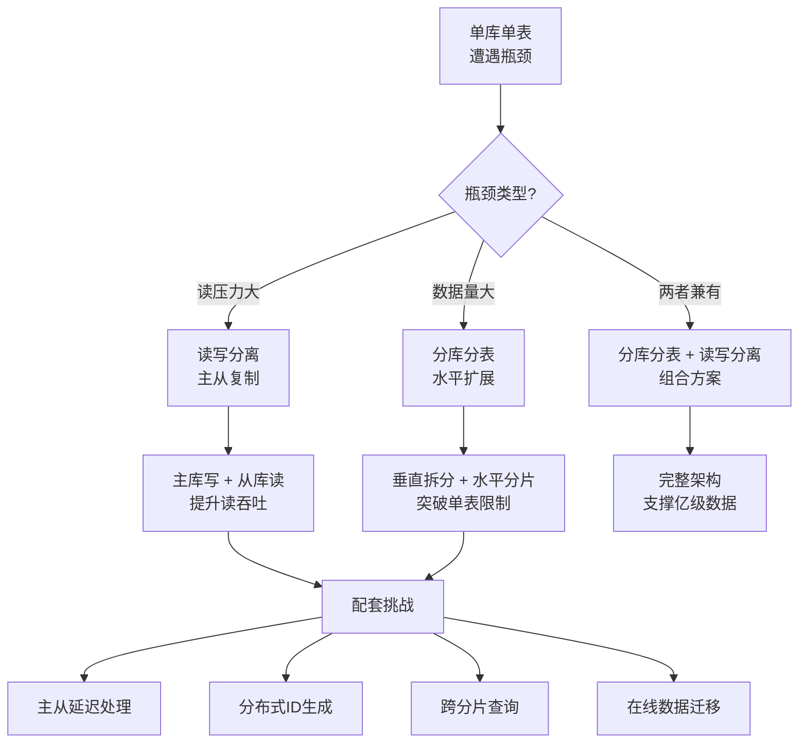

# 第51章 读写分离与分库分表 — 章节概览

## 为什么需要本章

当业务数据量突破千万级、并发请求达到万级QPS时，单库单表架构将遭遇三重天花板：

1. **存储瓶颈**：单表超过2000万行后，B+树索引层级增加，查询性能急剧下降；单库磁盘IO成为瓶颈
2. **并发瓶颈**：单MySQL实例的连接数和CPU处理能力有限，读写混合负载下互相争抢资源
3. **可用性瓶颈**：单点故障风险高，主库宕机即全站不可用

数据库层面的水平扩展是应对这些瓶颈的核心手段。本章系统讲解从读写分离到分库分表的完整技术体系，帮助读者建立从原理到实战的完整认知。



## 章节知识地图

本章共分六个模块，从理论到实践层层递进：

### 模块一：理论基础（道）

| 核心主题 | 关键知识点 | 章节文件 |
|---------|-----------|---------|
| 主从复制机制 | 异步/半同步/增强半同步复制；GTID原理；Binlog三种格式对比 | 01-一主从复制 |
| 读写分离实现 | 应用层路由 vs 中间件代理 vs 数据库原生方案；主从延迟的处理策略 | 02-二读写分离 |
| 分库分表策略 | 垂直分库/水平分表；Range/Hash/一致性Hash分片；分片键选择原则 | 03-三分库分表策略 |
| 分布式ID生成 | Snowflake算法；号段模式；UUID方案；ID生成方案的选型对比 | 04-四分布式ID生成 |

### 模块二：核心技巧（术）

| 核心主题 | 关键知识点 | 章节文件 |
|---------|-----------|---------|
| MySQL复制实战 | 主从搭建全流程；复制监控与故障排查；复制延迟优化 | 01-一MySQL复制 |
| 分片路由 | 路由键选择；Hash/Range/复合路由算法；路由结果缓存 | 02-二分片路由 |
| 数据迁移 | 在线迁移流程；双写+比对迁移；灰度切换与回滚策略 | 03-三数据迁移 |

### 模块三：实战案例（器）

- **ShardingSphere实战**：完整配置示例，覆盖读写分离+分片的组合方案
- **MyCat实战**：独立代理模式下的分库分表部署与运维

### 模块四：常见误区

识别并纠正六大典型认知偏差，包括：
- "读写分离能解决所有读性能问题"——忽略了主从延迟导致的数据不一致
- "过早分库分表"——单库能解决的问题引入了不必要的复杂度
- "分片键选自增ID就行"——忽略了热点写入和扩容问题
- "分布式ID用UUID最省事"——忽略了UUID的无序性和索引效率
- "分库后可以随意JOIN"——忽略了跨库查询的代价
- "数据迁移可以直接停机"——忽略了在线迁移的必要性

### 模块五：练习方法

从零搭建主从复制 → 配置读写分离 → 实现分片路由 → 模拟数据迁移，渐进式动手实践。

## 学习路线图


| 阶段 | 核心目标 | 前置条件 | 预计耗时 |
|------|---------|---------|---------|
| 入门 | 理解主从复制原理，能搭建基础主从 | MySQL基础操作、存储引擎概念 | 2-3天 |
| 进阶 | 掌握读写分离配置，理解分片策略选型 | 主从复制实践 | 3-5天 |
| 熟练 | 能选择分片键、实现路由算法、生成分布式ID | 分库分表理论 | 3-5天 |
| 精通 | 处理主从延迟、跨分片查询、在线数据迁移 | 全部前置知识 | 5-7天 |

## 前置知识要求

学习本章前，读者应具备以下基础：

- **MySQL基础**：掌握存储引擎（InnoDB）、事务（ACID）、索引（B+树）等核心概念
- **SQL优化**：理解EXPLAIN执行计划、索引优化策略、慢查询分析方法
- **分布式系统基础**：了解CAP定理、BASE理论、分布式系统的一致性模型

如果对这些前置知识还不熟悉，建议先阅读本书前面的数据库基础章节。

## 核心概念速查

在进入各节详细学习之前，先建立对核心概念的直观理解：

| 概念 | 一句话解释 | 类比 |
|------|-----------|------|
| 主从复制 | 数据从主库自动同步到从库 | 抄笔记：一人写原稿，多人抄副本 |
| 读写分离 | 写操作走主库，读操作走从库 | 银行柜台：存钱去一个窗口，查余额去另一个 |
| 垂直分库 | 按业务将不同表拆到不同数据库 | 图书馆分馆：文学馆、科技馆、历史馆 |
| 水平分表 | 将一个表的数据按规则拆到多个表 | 大型仓库分区：A-M货架、N-Z货架 |
| 分片键(Shard Key) | 决定数据存到哪个分片的字段 | 快递分拣：按地区编码分到不同配送站 |
| 分布式ID | 在多个数据库实例中全局唯一的ID | 身份证号：全国唯一标识每个人 |
| 主从延迟 | 从库数据落后于主库的时间差 | 直播延迟：你看到的画面比现场晚几秒 |

## 本章代码环境

本章涉及的代码示例基于以下技术栈：

- **数据库**：MySQL 8.0+（支持GTID、窗口函数）
- **中间件**：Apache ShardingSphere 5.x、MyCat 2.0
- **编程语言**：Java（Spring Boot）、Python（辅助脚本）
- **运维工具**：MySQL Shell、xtrabackup（数据迁移）

所有配置示例均可在本地Docker环境中复现。推荐使用以下Docker Compose快速搭建主从环境：

```yaml
version: '3.8'
services:
  mysql-master:
    image: mysql:8.0
    container_name: mysql-master
    environment:
      MYSQL_ROOT_PASSWORD: root123
    ports:
      - "3306:3306"
    volumes:
      - ./master.cnf:/etc/mysql/conf.d/custom.cnf

  mysql-slave:
    image: mysql:8.0
    container_name: mysql-slave
    environment:
      MYSQL_ROOT_PASSWORD: root123
    ports:
      - "3307:3306"
    volumes:
      - ./slave.cnf:/etc/mysql/conf.d/custom.cnf
    depends_on:
      - mysql-master
```

---

接下来，我们将从主从复制的底层原理开始，逐步构建完整的数据库扩展知识体系。
