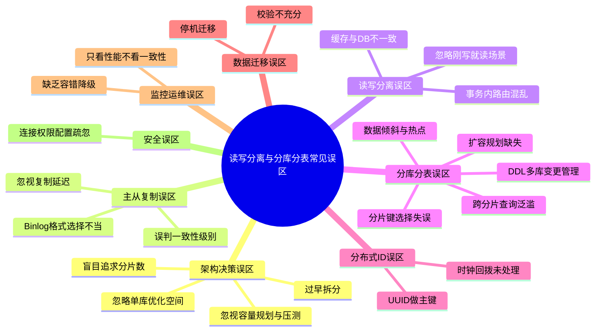
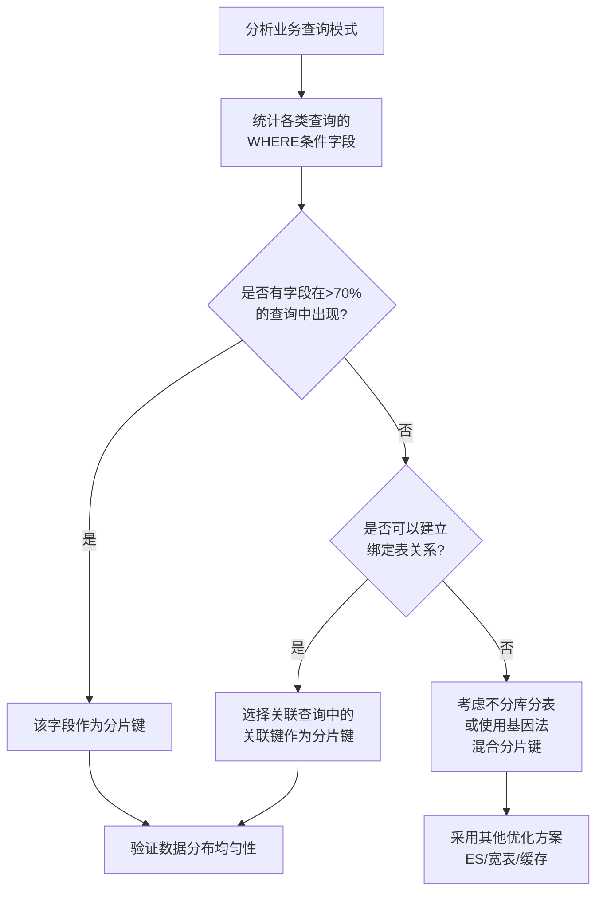
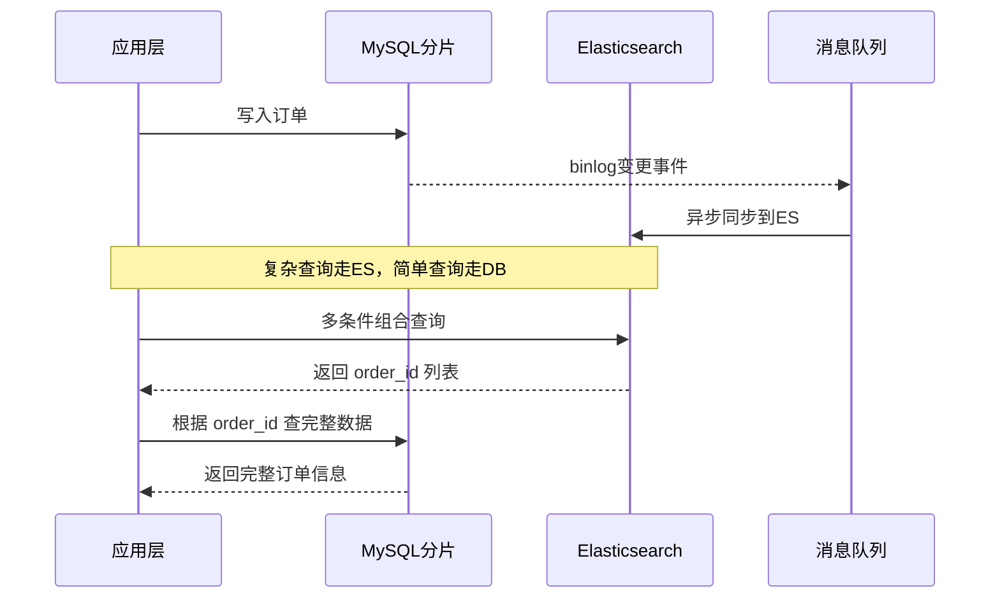
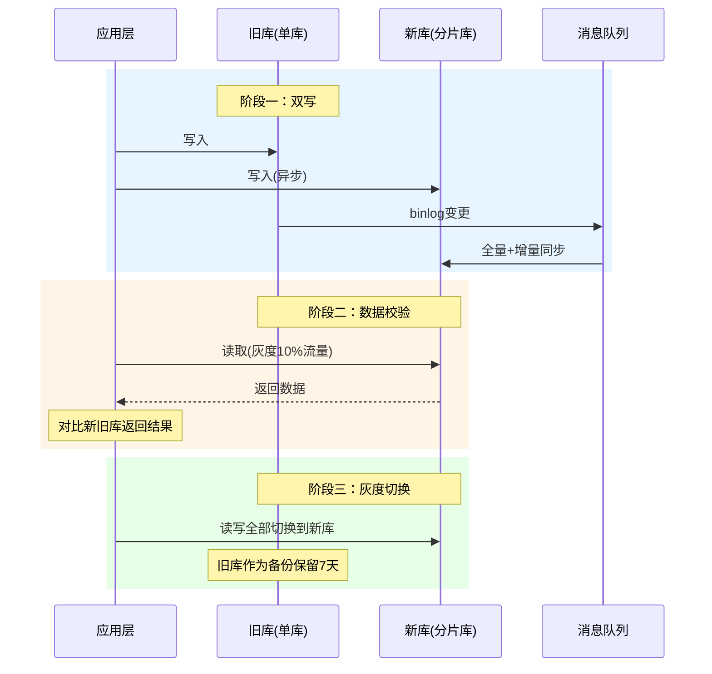
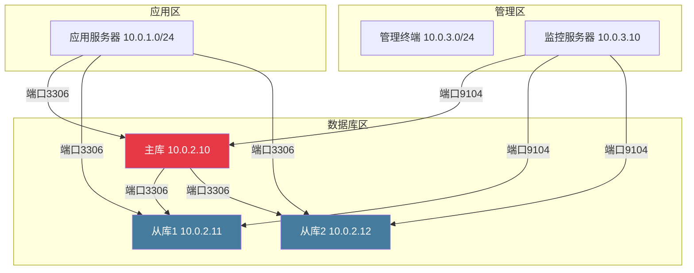

## 常见误区

读写分离与分库分表是数据库架构演进中的关键技术，但也是最容易"踩坑"的领域。根据多年生产环境经验，约 70% 的分库分表项目在上线后 6 个月内会遇到至少一次因架构设计缺陷导致的线上事故。这些事故的根源往往不是技术本身不可靠，而是团队对技术原理理解不够深入、对业务场景分析不够充分、对生产环境的复杂性估计不足。

本节系统梳理读写分离与分库分表实施过程中最常见的十七个误区，深入分析每个误区的产生原因、典型表现和正确做法。每个误区都来源于真实的生产事故案例，帮助读者避开这些"前人用血泪换来的教训"。



---

## 误区一：过早拆分——单库能解决的问题非要分库分表

### 错误表现

系统刚上线、数据量只有几百万行、日请求量不到 1 万 QPS，团队就开始规划分库分表方案。引入 ShardingSphere 或 MyCat 中间件，设计复杂的分片路由逻辑，最终发现系统 80% 的性能瓶颈其实来自慢查询和索引缺失，而不是数据量。更糟糕的是，拆分后引入的分布式事务、跨分片查询等问题反而让系统性能进一步恶化。

### 为什么这是误区

分库分表会引入显著的架构复杂度，包括：

- **跨分片查询**：不带分片键的查询需要扇出到所有分片，延迟成倍增加
- **分布式事务**：跨库操作无法使用本地事务，需要引入 Seata 等分布式事务框架，事务性能下降 5-10 倍
- **全局唯一约束失效**：唯一索引、外键约束在分库后无法跨库生效，需要在应用层自行保证
- **运维复杂度飙升**：备份、恢复、监控、扩容的难度呈指数级增长，需要额外投入运维人力
- **开发效率下降**：所有数据访问层都需要适配分片逻辑，联调和测试周期成倍增加

如果这些问题的"收益"仅仅是让单表从 500 万行变成每张表 50 万行，而实际上这些表的查询完全可以通过索引优化、SQL 改写、缓存加速来解决，那这次拆分就是得不偿失的。

### 正确做法：先优化，再拆分

在决定分库分表之前，应当按以下顺序逐步排查和优化：

| 优化层级 | 手段 | 适用场景 | 典型收益 | 实施成本 |
|---------|------|---------|---------|---------|
| SQL 优化 | 慢查询分析、EXPLAIN、覆盖索引 | 存在全表扫描、隐式类型转换 | 查询耗时降低 10-1000 倍 | 低（1-2 天） |
| 索引优化 | 联合索引、前缀索引、函数索引 | 高频查询缺少合适索引 | 读性能提升 5-50 倍 | 低（1-3 天） |
| 缓存加速 | Redis 热点数据缓存、本地缓存 | 读多写少、热点集中 | 读 QPS 提升 10-100 倍 | 中（1-2 周） |
| 读写分离 | 一主多从，读请求路由到从库 | 读写比 > 7:3 | 读吞吐提升 3-10 倍 | 中（2-4 周） |
| 分库分表 | 水平拆分，数据分散到多个库表 | 单表 > 2000 万行，单库写入瓶颈 | 写吞吐线性扩展 | 高（1-3 月） |

**经验法则**：单表数据量在 2000 万行以内、单库写入 QPS 在 5000 以内，通常不需要分库分表。在达到这个阈值之前，优先投入资源做 SQL 优化和读写分离。

**真实的代价计算**：假设分库分表方案需要 3 名后端开发投入 2 个月，加上后续持续的运维成本（每月额外 0.5 人），如果分库分表前通过索引优化 + 读写分离就能解决问题，这相当于花了 5+ 人月的成本去做一件本可以用 1 人月解决的事情——多出的成本还不包括因架构复杂度增加导致的 bug 修复和故障排查时间。

---

## 误区二：盲目追求分片数量——越多越好

### 错误表现

"我们的目标是支持 10 亿用户，所以分 1024 个库。" 设计阶段就规划了大量分片，每个分片承载的数据量极少，但系统运行后发现：

- 大量分片长期处于低负载状态，资源浪费严重（每个分片至少需要 1 个 MySQL 实例 + 对应的连接池）
- 跨分片查询扇出面广，P99 延迟显著升高
- 运维管理成本（监控、备份、扩缩容）成倍增长
- 分片间的连接池管理复杂，连接数成为瓶颈（每个应用实例需要连接所有分片）
- 成本高昂：1024 个分片 = 1024 个 MySQL 实例，即使每个实例只用 1 核 1G，年成本也超过百万

### 为什么这是误区

分片数量应该基于**当前和可预见的未来**的业务量来确定，而不是基于远期愿景。一个常见的经验公式：

目标分片数 = 预估单表最大行数 / 单表推荐行数

其中，单表推荐行数一般为 500 万～2000 万行。例如：

- 预估 3 年内订单量达到 5 亿行
- 单表推荐行数 1000 万行
- 目标分片数 = 5 亿 / 1000 万 = 50 个分片

考虑 2-3 倍的冗余空间，初期规划 16-32 个分片即可。使用一致性 Hash 时，可以通过虚拟节点实现扩容，无需一开始就规划过多物理分片。

### 正确做法：预留弹性，渐进扩容


关键原则：

1. **初期规划 4-16 个物理分片**，通过虚拟节点保证数据均匀分布
2. **选择支持在线扩容的方案**（如一致性 Hash），避免一次性迁移全量数据
3. **监控各分片负载**，当单分片磁盘使用率 > 70% 或 QPS 接近上限时触发扩容
4. **预留 2-3 倍的扩容空间**，但不要预留 10 倍以上的空间
5. **分片数量尽量选 2 的幂次方**（4/8/16/32），便于取模运算和未来翻倍扩容

---

## 误区三：误判一致性级别——以为半同步复制等于强一致

### 错误表现

团队启用了 MySQL 半同步复制，便认为主从数据"完全一致"，在业务逻辑中依赖从库读取刚写入的数据。结果用户在写入订单后立即查询，从从库读到了空数据，投诉涌入。

### 为什么这是误区

MySQL 的三种复制模式在一致性保证上有本质区别：

| 复制模式 | 一致性级别 | 数据丢失风险 | 从库延迟特征 | 适用场景 |
|---------|-----------|-------------|-------------|---------|
| 异步复制 | 最终一致 | 主库宕机可能丢失最近事务 | 延迟不确定，可达数秒到数分钟 | 日志、统计等允许延迟的场景 |
| 半同步复制 | 接近强一致 | 极小概率丢失（超时降级时） | 等待 1 个从库确认 relay log 写入 | 大多数互联网业务 |
| Group Replication | 强一致 | 基本为零（多数派确认） | 事务在多数节点确认后才提交 | 金融核心交易系统 |

即使是半同步复制，从库确认的也只是**接收到了 binlog**，而非**完成了 SQL 重放**。从库的 SQL 线程可能存在回放延迟（尤其是大事务或并行复制效率不高时），导致主从之间存在秒级甚至分钟级的数据差异。

### 正确做法：根据业务容忍度选择方案

```java
/**
 * 根据数据一致性要求选择读取策略
 */
public class ConsistencyAwareRouter {
    
    public User queryUser(Long userId, ConsistencyRequirement requirement) {
        switch (requirement) {
            case STRONG:
                // 强一致：直接读主库
                return readFromMaster(userId);
                
            case READ_YOUR_Writes:
                // 读己之写：走主库（或使用 GTID 等待从库同步）
                return readAfterWrite(userId);
                
            case EVENTUAL:
                // 最终一致：读从库即可
                return readFromSlave(userId);
                
            default:
                return readFromSlave(userId);
        }
    }
    
    /**
     * 读己之写的实现：等待从库同步到指定 GTID
     */
    private User readAfterWrite(Long userId) {
        // 获取当前主库的 GTID 位置
        String masterGtid = getMasterGtid();
        // 等待从库同步（设置超时）
        boolean synced = waitForGtidSync(masterGtid, 500); // 500ms 超时
        if (synced) {
            return readFromSlave(userId);
        }
        // 超时则降级读主库
        return readFromMaster(userId);
    }
}
```

**关键结论**：半同步复制的定位是**降低数据丢失风险**，而非保证主从实时一致。对于"刚写就读"场景，必须在应用层做特殊处理——要么强制读主库，要么通过 GTID 等待机制确保从库已同步。

---

## 误区四：忽视复制延迟——读写分离的隐形杀手

### 错误表现

读写分离上线后，大部分时间运行正常。但当主库出现大事务（如百万行批量更新）、从库执行 DDL（如 ALTER TABLE）、或网络抖动时，主从延迟突然飙升到几十秒。此时：

- 用户刚下单就查不到，误以为下单失败，重复下单，导致资损
- 管理后台看到的数据和实际不一致，做出错误决策
- 缓存刷新逻辑失效，缓存中一直存放过期数据
- 定时任务读取从库数据不完整，导致报表数据错误

### 为什么这是误区

主从复制延迟在生产环境中是**不可避免**的，只是延迟大小的区别。以下场景会导致延迟显著增大：

| 场景 | 延迟影响 | 持续时间 | 频率 |
|------|---------|---------|------|
| 大事务（批量 UPDATE/DELETE） | 可达分钟级 | 大事务执行期间 | 偶发 |
| DDL 操作（ALTER TABLE） | 可达数十分钟 | DDL 执行期间 | 低频 |
| 从库单线程回放 | 比主库慢 3-10 倍 | 持续性 | 始终存在 |
| 从库硬件瓶颈（IO/CPU） | 不确定 | 硬件瓶颈期间 | 偶发 |
| 网络带宽不足 | 秒级到分钟级 | 网络拥塞期间 | 偶发 |
| 主库写入突增 | 延迟逐渐累积 | 峰值期间 | 高频 |

### 正确做法：建立延迟监控和自动降级机制

**第一步：建立实时延迟监控**

```sql
-- 在从库执行，检查复制延迟
SHOW SLAVE STATUS\G

-- 关键字段：
-- Seconds_Behind_Master: 复制延迟秒数
-- Slave_IO_Running: IO 线程状态（必须为 Yes）
-- Slave_SQL_Running: SQL 线程状态（必须为 Yes）
-- Last_IO_Error: IO 线程最近错误
-- Last_SQL_Error: SQL 线程最近错误
```

**第二步：应用层根据延迟自动路由**

```python
class DelayAwareRouter:
    """基于复制延迟的智能路由"""
    
    # 延迟阈值（秒）
    DELAY_THRESHOLD_MASTER_ONLY = 5     # 超过5秒：所有读走主库
    DELAY_THRESHOLD_CRITICAL = 10        # 超过10秒：告警
    DELAY_THRESHOLD_EMERGENCY = 30       # 超过30秒：紧急处理
    
    def __init__(self, master, slaves):
        self.master = master
        self.slaves = slaves
    
    def get_read_connection(self, context=None):
        """
        根据当前复制延迟选择读库
        context: 可传入业务上下文，如是否刚执行过写操作
        """
        max_delay = self._get_max_slave_delay()
        
        if max_delay > self.DELAY_THRESHOLD_EMERGENCY:
            # 紧急情况：所有读走主库，同时触发告警
            self._trigger_emergency_alert(max_delay)
            return self.master
        
        if max_delay > self.DELAY_THRESHOLD_MASTER_ONLY:
            # 延迟较高：写后读走主库，其他读走延迟最低的从库
            if context and context.get("just_wrote"):
                return self.master
            return self._get_min_delay_slave()
        
        # 正常情况：随机选择从库（负载均衡）
        return self._get_random_healthy_slave()
    
    def _get_max_slave_delay(self):
        """获取所有从库中最大的复制延迟"""
        delays = [slave.get_delay() for slave in self.slaves]
        return max(delays) if delays else 0
```

**第三步：对于关键业务操作，直接走主库**

以下场景建议**强制走主库读取**，不依赖从库：

- 支付回调后的订单状态查询
- 注册/登录后的用户信息回显
- 库存扣减后的余量查询
- 后台管理系统中涉及财务数据的查询
- 退款/售后流程中的状态校验

---

## 误区五：事务内读写路由混乱——导致数据不一致

### 错误表现

在一个 Spring @Transactional 方法中，先从从库读取用户余额，再执行扣款写入主库。由于从库可能有延迟，读到的是旧余额，导致超扣或少扣。

```java
// ❌ 错误示例：事务内混合读写主从
@Transactional
public void deductBalance(Long userId, BigDecimal amount) {
    // 从从库读取余额（可能有延迟，读到旧数据）
    User user = userDao.findById(userId);  
    BigDecimal balance = user.getBalance();
    
    if (balance.compareTo(amount) < 0) {
        throw new InsufficientBalanceException();
    }
    
    // 写入主库
    user.setBalance(balance.subtract(amount));
    userDao.update(user);
}
```

### 为什么这是误区

事务内的所有操作应该在**同一个数据库连接**上执行，且读写操作应该保持一致的视图。如果事务中混合使用了主库和从库连接：

1. **读到的可能是过期数据**：从库延迟导致读到的余额是 1 分钟前的值
2. **事务隔离性被破坏**：同一事务中的读操作看到了不同时刻的数据，违反了 MVCC 的隔离语义
3. **无法利用事务的原子性**：如果回滚，从主库写入的数据回滚了，但从从库读取时看到的"快照"已经不一致
4. **死锁风险增加**：主从连接之间的操作无法形成有效的锁等待关系

### 正确做法：事务内统一走主库

```java
// ✅ 正确示例：事务内全部走主库
@Transactional
public void deductBalance(Long userId, BigDecimal amount) {
    // 强制走主库读取
    User user = userDao.findByIdFromMaster(userId);
    BigDecimal balance = user.getBalance();
    
    if (balance.compareTo(amount) < 0) {
        throw new InsufficientBalanceException();
    }
    
    user.setBalance(balance.subtract(amount));
    userDao.update(user);
    // 事务内读写都在主库，保证一致性
}
```

**配置层面的保障**：ShardingSphere 提供了 `readwrite-splitting` 的事务内读主策略：

```yaml
spring:
  shardingsphere:
    props:
      # 事务内，所有读操作自动路由到主库
      sql-show: true
    rules:
      readwrite-splitting:
        data-sources:
          ds:
            write-data-source-name: master
            read-data-source-names: slave0,slave1
            load-balancer-name: round-robin
        load-balancers:
          round-robin:
            type: ROUND_ROBIN
```

**核心原则**：凡是在事务内的读操作，一律走主库。只有不在事务中的纯读操作，才允许路由到从库。

---

## 误区六：缓存与数据库一致性处理不当

### 错误表现

读写分离上线后，出现以下经典场景：

1. 用户更新了头像 → 写入主库成功 → 更新 Redis 缓存
2. 但由于主从延迟，从库还没同步到新头像
3. 此时有另一个请求读取用户头像 → 走从库读到旧数据 → 用旧数据覆盖了 Redis 缓存
4. 结果：缓存中一直是旧头像，直到缓存自然过期

### 为什么这是误区

这个问题的根源是**"先更新数据库，再更新缓存"**的策略在读写分离架构下不安全。在主从架构中，从库读取的数据可能滞后于主库，如果用从库的旧数据更新缓存，就会产生缓存脏数据。而缓存的 TTL 通常较长（5-30 分钟），在这段时间内所有用户都会读到脏数据。

### 正确做法：Cache Aside Pattern + 延迟双删

```java
@Service
public class UserCacheService {
    
    @Autowired
    private RedisTemplate<String, Object> redisTemplate;
    
    @Autowired
    private UserDao userDao;
    
    private static final long DELAY_DELETE_MS = 500;
    private static final long CACHE_TTL_SECONDS = 300;
    
    /**
     * 更新用户信息（Cache Aside Pattern + 延迟双删）
     */
    @Transactional
    public void updateUser(User user) {
        // 1. 删除缓存（而非更新缓存）
        String cacheKey = "user:" + user.getId();
        redisTemplate.delete(cacheKey);
        
        // 2. 更新主库
        userDao.update(user);
        
        // 3. 延迟删除缓存（应对主从延迟导致的脏读）
        // 使用异步线程延迟执行，确保从库已完成同步
        CompletableFuture.runAsync(() -> {
            try {
                Thread.sleep(DELAY_DELETE_MS);
                redisTemplate.delete(cacheKey);
            } catch (InterruptedException e) {
                Thread.currentThread().interrupt();
            }
        });
    }
    
    /**
     * 读取用户信息
     */
    public User getUser(Long userId) {
        String cacheKey = "user:" + userId;
        
        // 1. 先读缓存
        User cached = (User) redisTemplate.opsForValue().get(cacheKey);
        if (cached != null) {
            return cached;
        }
        
        // 2. 缓存未命中，读从库
        User user = userDao.findById(userId);
        if (user != null) {
            redisTemplate.opsForValue().set(
                cacheKey, user, Duration.ofSeconds(CACHE_TTL_SECONDS));
        }
        return user;
    }
}
```

**延迟双删的核心思想**：第一次删除清空缓存，第二次延迟删除防止从库延迟期间的脏读重建缓存。延迟时间应略大于主从复制延迟的 P99 值。

**更可靠的方案——Binlog 订阅**：对于对一致性要求极高的场景，延迟双删仍存在时间窗口。更可靠的方案是通过 Canal 订阅 MySQL binlog，当从库完成同步后再异步删除缓存，从根本上避免时间窗口问题。

---

## 误区七：分片键选择失误——选错分片键，十年痛苦

### 错误表现

电商系统中，订单表选择 `order_id` 作为分片键。上线后发现：

- 按用户查询订单列表：需要扫描所有分片（扇出查询）
- 按时间段统计销量：需要扫描所有分片
- 大部分业务查询都不包含 order_id，分片形同虚设
- 数据库的整体负载反而比单库时更高

### 为什么这是误区

分片键的选择遵循一个核心原则：**分片键必须是最高频查询条件中的字段**。如果 80% 的订单查询都带有 `user_id`，那么 `user_id` 就是分片键的最佳候选。如果按 `order_id` 分片，虽然数据分布均匀，但几乎所有查询都需要跨分片扇出。

| 分片键 | 数据分布 | 用户订单查询 | 商家订单查询 | 按时间统计 |
|--------|---------|-------------|-------------|-----------|
| user_id | 较均匀 | ✅ 单分片 | ❌ 跨分片 | ❌ 跨分片 |
| merchant_id | 较均匀 | ❌ 跨分片 | ✅ 单分片 | ❌ 跨分片 |
| order_id | 均匀 | ❌ 跨分片 | ❌ 跨分片 | ❌ 跨分片 |
| create_time (Range) | 可能热点 | ❌ 跨分片 | ❌ 跨分片 | ✅ 范围查询 |

### 正确做法：根据查询模式选择分片键

**分片键选择决策流程**：



**绑定表（Binding Table）**：当两个表经常需要 JOIN 查询时，应选择**相同的分片键**，使同一分片键值的数据落在同一个分片上，避免跨分片 JOIN。例如，`t_order` 和 `t_order_item` 都以 `user_id` 为分片键，那么查询某个用户的订单及其明细时，只需访问一个分片。

**基因法（Sharding Gene）**：当需要同时支持按不同维度查询时，可以在分片键中嵌入"基因"。例如，订单 ID 中嵌入用户 ID 的低 4 位：

```java
/**
 * 基因法分片键生成
 * 将 user_id 的低 N 位嵌入 order_id，使两者映射到同一个分片
 */
public class ShardKeyGenerator {
    private static final int GENE_BITS = 4; // 基因位数
    private static final int GENE_MASK = (1 << GENE_BITS) - 1; // 0xF = 15
    
    /**
     * 生成带有分片基因的订单ID
     */
    public long generateOrderId(long userId, long sequence) {
        // 取 userId 的低 4 位作为基因
        long gene = userId &amp; GENE_MASK;
        // 订单ID = 高48位时间戳+序列 | 低4位基因
        long orderId = (sequence << GENE_BITS) | gene;
        return orderId;
    }
    
    /**
     * 从订单ID中提取分片基因（即 user_id 的低4位）
     */
    public int extractGene(long orderId) {
        return (int) (orderId &amp; GENE_MASK);
    }
    
    /**
     * 根据订单ID计算分片编号（与 userId % 分片数 结果一致）
     */
    public int routeByOrderId(long orderId, int shardCount) {
        int gene = extractGene(orderId);
        return gene % shardCount;
    }
}
```

---

## 误区八：跨分片查询泛滥——分库分表后依然全量扫描

### 错误表现

分库分表后，系统的读性能反而下降了。原因分析后发现：

- 大量查询没有带分片键条件，不得不扇出到所有分片
- 聚合查询（COUNT、SUM、ORDER BY）需要从所有分片拉取数据
- 分页查询在深分页时，每个分片都要扫描大量数据

### 为什么这是误区

分库分表后，数据库层面的"全表扫描"变成了"全分片扫描"。如果一个查询需要从 64 个分片中各拉取 1000 条数据再在内存中排序，这比单表扫描 64000 条数据要慢得多——因为多了 63 次网络往返和分片间的数据传输。

### 正确做法：构建辅助查询体系

**方案一：异构索引（宽表/冗余表）**

对于高频但不带分片键的查询，建立独立的冗余索引表：

```sql
-- 主表：按 user_id 分片
CREATE TABLE t_order (
    order_id BIGINT PRIMARY KEY,
    user_id BIGINT NOT NULL,
    merchant_id BIGINT NOT NULL,
    amount DECIMAL(10,2),
    create_time DATETIME,
    -- 分片键: user_id
);

-- 冗余表：按 merchant_id 分片（支持商家维度查询）
CREATE TABLE t_order_by_merchant (
    order_id BIGINT PRIMARY KEY,
    merchant_id BIGINT NOT NULL,
    user_id BIGINT NOT NULL,
    amount DECIMAL(10,2),
    create_time DATETIME,
    -- 分片键: merchant_id
);

-- 时间统计表：按月分片（支持时间维度统计）
CREATE TABLE t_order_stats_monthly (
    stat_month VARCHAR(7),  -- '2024-01'
    merchant_id BIGINT,
    order_count BIGINT,
    total_amount DECIMAL(16,2),
    -- 分片键: stat_month
);
```

**方案二：搜索引擎辅助查询**

对于复杂的全文检索、多条件组合查询、聚合分析，使用 Elasticsearch 作为辅助查询引擎：



**方案三：禁止深分页，改用游标分页**

```java
/**
 * 正确的分页方式：游标分页（基于上一页最后一条记录）
 * 而非 OFFSET 分页
 */
public class CursorPagination {
    
    /**
     * ❌ 错误方式：OFFSET 分页（深分页性能极差）
     * SELECT * FROM t_order LIMIT 100000, 20
     * 每个分片都要扫描 100020 条数据
     */
    
    /**
     * ✅ 正确方式：游标分页（基于排序键）
     * SELECT * FROM t_order 
     * WHERE user_id = 12345 AND order_id > #{lastOrderId}
     * ORDER BY order_id DESC LIMIT 20
     * 只需扫描 20 条数据
     */
    public List<Order> getPageByCursor(Long userId, Long lastOrderId, int pageSize) {
        return orderDao.selectByUserIdAndCursor(userId, lastOrderId, pageSize);
    }
}
```

---

## 误区九：数据倾斜与热点分片——看似均匀分布，实则一枝独秀

### 错误表现

分片键选择了 `user_id`，理论上数据应该均匀分布。但上线后发现：

- 分片 0 承载了 40% 的数据量和 60% 的读写流量
- 排查后发现：平台 TOP 100 大客户的 `user_id` 经过取模后全部落在分片 0
- 分片 0 的磁盘使用率已达 85%，而其他分片仅 30%

### 为什么这是误区

取模分片（`user_id % N`）在数学上是均匀的，但在业务层面并不保证均匀。以下情况会导致数据倾斜：

- **大客户/超级用户**：少数用户产生大量数据（如电商大卖家的订单量是普通用户的 1000 倍）
- **分片键取值分布不均**：某些 ID 段的用户数量远多于其他段
- **Range 分片的自然倾斜**：按时间范围分片时，最新分片的数据量持续增长

### 正确做法：多层防倾斜策略

**策略一：一致性 Hash + 虚拟节点**

```java
/**
 * 一致性 Hash 实现（带虚拟节点）
 * 虚拟节点数量越多，数据分布越均匀
 */
public class ConsistentHashRouter {
    private final TreeMap<Long, String> ring = new TreeMap<>();
    private final int virtualNodes = 150; // 每个物理节点 150 个虚拟节点
    
    public ConsistentHashRouter(List<String> physicalNodes) {
        for (String node : physicalNodes) {
            for (int i = 0; i < virtualNodes; i++) {
                long hash = hash(node + "#VN" + i);
                ring.put(hash, node);
            }
        }
    }
    
    public String route(String key) {
        long hash = hash(key);
        Map.Entry<Long, String> entry = ring.ceilingEntry(hash);
        return (entry != null) ? entry.getValue() : ring.firstEntry().getValue();
    }
}
```

**策略二：监控热点分片，自动触发再平衡**

```sql
-- 查询各分片的数据分布
SELECT 
    shard_id,
    COUNT(*) as row_count,
    ROUND(COUNT(*) * 100.0 / (SELECT COUNT(*) FROM t_order), 2) as percentage
FROM t_order
GROUP BY shard_id
ORDER BY row_count DESC;
```

当单个分片的数据量超过平均值的 2 倍时，应触发数据再平衡。可以使用 ShardingSphere 的数据迁移功能，将热点分片的部分数据迁移到空闲分片。

---

## 误区十：UUID 做数据库主键——性能杀手

### 错误表现

为了"方便"使用 UUID 作为分库分表后的主键，结果发现：

- 写入性能下降 30%-50%：UUID 是无序的，频繁导致 B+ 树页分裂
- 索引空间膨胀：16 字节的 UUID 比 8 字节的 BIGINT 占用更多存储
- 分片路由效率低：UUID 无法直接用于分片路由计算
- 分页查询变慢：无序主键导致二级索引的回表查询效率下降

### 为什么这是误区

InnoDB 使用聚簇索引，数据按主键顺序存储。UUID 是随机字符串，每次插入都可能落在 B+ 树的随机位置，引发：

1. **页分裂**：当插入位置所在的页已满时，InnoDB 需要分裂页并移动数据，代价高昂
2. **写放大**：页分裂导致更多的随机 IO
3. **缓存命中率下降**：随机插入使得 Buffer Pool 的缓存效率大幅降低

```java
// ❌ UUID 作为主键的性能对比测试
// 插入 100 万条数据的耗时对比（参考值）：
//
// | 主键类型        | 插入耗时   | 索引大小  | 页分裂次数 |
// |----------------|-----------|----------|-----------|
// | UUID (VARCHAR)  | ~45 秒    | 520 MB   | ~120,000  |
// | UUID (BINARY)   | ~38 秒    | 340 MB   | ~110,000  |
// | 自增 BIGINT     | ~12 秒    | 180 MB   | ~500      |
// | Snowflake ID    | ~14 秒    | 195 MB   | ~2,000    |
```

### 正确做法：使用趋势递增的分布式 ID

推荐使用 Snowflake 算法或号段模式（如美团 Leaf）生成趋势递增的 64 位 ID：

```java
// ✅ 使用 Snowflake ID 替代 UUID
public class IdGeneratorDemo {
    public static void main(String[] args) {
        SnowflakeIdGenerator generator = new SnowflakeIdGenerator(1);
        
        // 生成的 ID 是趋势递增的
        for (int i = 0; i < 5; i++) {
            long id = generator.nextId();
            System.out.println("ID: " + id + " (二进制: " + Long.toBinaryString(id) + ")");
        }
        // ID: 6934567890123456513 (二进制: 1100001...)
        // ID: 6934567890123456514 (二进制: 1100001...)
        // ID: 6934567890123456515 (二进制: 1100001...)
        // ID: 6934567890123456516 (二进制: 1100001...)
        // ID: 6934567890123456517 (二进制: 1100001...)
    }
}
```

如果业务确实需要全局唯一的字符串标识（如对外暴露的订单号），可以在 Snowflake ID 的基础上做编码转换（如 Base62），而不是直接用 UUID。

---

## 误区十一：时钟回拨未处理——Snowflake 的致命缺陷

### 错误表现

服务器因 NTP 同步、VM 漂移等原因发生时钟回拨，Snowflake ID 生成器直接抛异常拒绝服务，或者生成了与之前重复的 ID，导致数据覆盖。

### 为什么这是误区

Snowflake 的 ID 结构依赖时间戳部分（41 位），当时钟回拨时：

- 如果当前时间 < 上次生成 ID 的时间，时间戳部分会回退
- 如果不加保护，可能生成**与之前相同的时间戳 + 相同机器 ID + 序列号 = 重复 ID**
- 重复 ID 会导致主键冲突、数据覆盖等严重后果

### 正确做法：多层次防护

```java
public class RobustSnowflakeGenerator {
    
    private static final long START_TIMESTAMP = 1577808000000L;
    private static final long SEQUENCE_BITS = 12;
    private static final long MACHINE_BITS = 10;
    private static final long MAX_SEQUENCE = (1L << SEQUENCE_BITS) - 1;
    private static final long MAX_MACHINE_ID = (1L << MACHINE_BITS) - 1;
    private static final long TIMESTAMP_SHIFT = SEQUENCE_BITS + MACHINE_BITS;
    
    private final long machineId;
    private long sequence = 0L;
    private long lastTimestamp = -1L;
    
    // 防护策略1：容忍小范围回拨（如 NTP 微调）
    private static final long MAX_CLOCK_BACKWARD_MS = 5;
    
    public RobustSnowflakeGenerator(long machineId) {
        if (machineId < 0 || machineId > MAX_MACHINE_ID) {
            throw new IllegalArgumentException("Machine ID out of range");
        }
        this.machineId = machineId;
    }
    
    public synchronized long nextId() {
        long currentTimestamp = getCurrentTimestamp();
        
        // 时钟回拨处理
        if (currentTimestamp < lastTimestamp) {
            long backwardMs = lastTimestamp - currentTimestamp;
            
            if (backwardMs <= MAX_CLOCK_BACKWARD_MS) {
                // 小范围回拨：等待追上
                currentTimestamp = waitUntilNextMs(lastTimestamp);
            } else {
                // 大范围回拨：使用扩展位方案或直接报错
                throw new RuntimeException(
                    String.format("Clock moved backwards by %dms. " +
                        "Refusing to generate id. Consider using NTP sync.", 
                        backwardMs));
            }
        }
        
        if (currentTimestamp == lastTimestamp) {
            sequence = (sequence + 1) &amp; MAX_SEQUENCE;
            if (sequence == 0) {
                currentTimestamp = waitUntilNextMs(lastTimestamp);
            }
        } else {
            sequence = 0L;
        }
        
        lastTimestamp = currentTimestamp;
        
        return ((currentTimestamp - START_TIMESTAMP) << TIMESTAMP_SHIFT) |
               (machineId << SEQUENCE_BITS) |
               sequence;
    }
    
    private long getCurrentTimestamp() {
        return System.currentTimeMillis();
    }
    
    private long waitUntilNextMs(long lastTs) {
        long timestamp = getCurrentTimestamp();
        while (timestamp <= lastTs) {
            Thread.yield();
            timestamp = getCurrentTimestamp();
        }
        return timestamp;
    }
}
```

**补充防护手段**：

- **部署层面**：配置 NTP 同步策略，避免大范围时间跳变。使用 `slew mode`（平滑调整）而非 `step mode`（瞬间跳变）
- **生成器层面**：使用 Redis 或 ZooKeeper 等外部组件分配唯一的时间戳，避免单机时钟依赖
- **数据库层面**：在分片表上设置联合唯一约束 `(shard_key, id)` 作为最后一道防线
- **监控层面**：实时监控 ID 生成速率和时间戳变化，发现异常立即告警

---

## 误区十二：停机迁移——现代架构不应该有停机窗口

### 错误表现

团队在做分库分表的数据迁移时，选择在凌晨业务低峰期停机 2-4 小时进行数据迁移。迁移期间用户无法使用系统，迁移后还发现部分数据不一致需要回滚重做。

### 为什么这是误区

对于面向用户的互联网应用，停机迁移意味着：

- **用户体验严重受损**：用户无法访问系统，可能流向竞品
- **商业损失**：电商大促期间停机 1 小时可能损失数百万营收
- **迁移风险集中**：所有压力集中在一个时间窗口，失败后回滚困难
- **无法验证**：停机状态下无法验证迁移后的系统是否正常工作

### 正确做法：在线灰度迁移（双写 + 灰度切换）



**四步在线迁移流程**：

| 阶段 | 操作 | 持续时间 | 风险等级 |
|------|------|---------|---------|
| 第一阶段：双写 | 应用同时写入新旧库，binlog 同步增量数据 | 1-3 天 | 低 |
| 第二阶段：全量校验 | 对比新旧库数据一致性，修复差异 | 1-2 天 | 低 |
| 第三阶段：灰度读切换 | 10% → 50% → 100% 流量逐步切到新库读 | 3-7 天 | 中 |
| 第四阶段：写切换 | 全部写入切到新库，旧库停止写入 | 1 天 | 中 |

每个阶段都必须具备**秒级回滚能力**：出现问题时，立即停止切换，回退到旧库。

---

## 误区十三：只监控性能，不监控一致性

### 错误表现

运维团队搭建了完善的 Prometheus + Grafana 监控体系，但只关注 QPS、延迟、CPU、磁盘等性能指标。忽略了主从数据一致性、分片间数据均衡度、复制延迟等关键一致性指标。直到某天客服反馈大量用户数据错乱，才发现主从复制早已出现异常。

### 为什么这是误区

在读写分离架构中，**数据一致性**和**性能**同等重要。性能差最多是用户等待时间长，但数据不一致可能导致：

- 用户看到错误的余额、订单状态
- 财务对账数据不一致
- 数据分析结果失真
- 用户数据丢失（主库故障后从库数据不完整）

### 正确做法：建立一致性监控体系

**核心监控指标**：

| 监控指标 | 检查方法 | 告警阈值 | 修复动作 |
|---------|---------|---------|---------|
| 主从延迟 | `SHOW SLAVE STATUS` | > 5s 警告，> 30s 严重 | 检查从库负载、大事务 |
| 主从数据一致性 | pt-table-checksum 定期校验 | 差异行数 > 0 | pt-table-sync 修复 |
| 分片数据均衡度 | 各分片行数/容量比 | 最大分片 > 平均值 2 倍 | 触发数据再平衡 |
| GTID 集合连续性 | `SHOW MASTER STATUS` | 有未同步事务 | 检查复制线程状态 |
| 复制过滤正确性 | 检查 replicate-do-db 等配置 | 配置与预期不符 | 修正配置 |

**部署 pt-table-checksum 定期校验**：

```bash
# 每天凌晨 2:00 执行主从一致性校验
pt-table-checksum \
    --host=master-host \
    --user=checksum_user \
    --password=xxx \
    --databases=order_db,user_db \
    --chunk-size=10000 \
    --method=ITERATIVE \
    --no-check-binlog-format \
    --replicate=percona.checksums

# 如果发现差异，使用 pt-table-sync 修复
pt-table-sync \
    --execute \
    --sync-to-master \
    slave-host
```

**Grafana 看板应包含的核心面板**：

```yaml
# Prometheus 指标采集示例
# 使用 mysqld_exporter 采集复制状态
- job_name: 'mysql-slave'
  static_configs:
    - targets: ['slave0:9104', 'slave1:9104']
  metrics_path: /metrics
  
# 关键指标
# mysql_slave_status_seconds_behind_master — 复制延迟
# mysql_slave_status_slave_io_running — IO线程状态
# mysql_slave_status_slave_sql_running — SQL线程状态
```

---

## 误区十四：缺乏容错和降级设计——一个节点故障全系统瘫痪

### 错误表现

读写分离架构中，主库突然宕机。由于没有自动故障切换机制，所有写入操作直接报错，系统陷入瘫痪。即使有从库可用，应用也不知道该将读请求路由到哪个从库。

### 为什么这是误区

分布式系统中，"一切皆可能失败"。MySQL 主库、从库、网络、中间件都可能在任何时刻出现故障。如果没有完善的容错和降级设计，单点故障就会级联扩散为全局故障。

### 正确做法：构建多层防护体系

**第一层：超时与重试**

```java
@Configuration
public class DataSourceConfig {
    
    @Bean
    public DataSource routingDataSource() {
        HikariConfig masterConfig = new HikariConfig();
        masterConfig.setConnectionTimeout(3000);    // 连接超时 3s
        masterConfig.setValidationTimeout(1000);     // 验证超时 1s
        masterConfig.setLeakDetectionThreshold(5000); // 连接泄漏检测 5s
        
        HikariConfig slaveConfig = new HikariConfig();
        slaveConfig.setConnectionTimeout(2000);
        slaveConfig.setReadOnly(true);
        
        return new DynamicRoutingDataSource(masterConfig, slaveConfig);
    }
}
```

**第二层：熔断降级**

```java
/**
 * 基于 Resilience4j 的数据库熔断器
 */
@Service
public class ResilientDataService {
    
    private final CircuitBreaker circuitBreaker = CircuitBreaker.ofDefaults("db-slave");
    
    private final Retry retry = Retry.of("db-retry", RetryConfig.custom()
        .maxAttempts(3)
        .waitDuration(Duration.ofMillis(200))
        .retryExceptions(SQLTransientConnectionException.class)
        .build());
    
    /**
     * 带熔断和重试的数据查询
     */
    public User getUser(Long userId) {
        Supplier<User> decoratedSupplier = Decorators
            .ofSupplier(() -> readFromSlave(userId))
            .withCircuitBreaker(circuitBreaker)
            .withRetry(retry)
            .withFallback(
                // 从库不可用时降级到主库
                SQLTransientConnectionException.class,
                e -> readFromMaster(userId))
            .decorate()
            .get();
        
        return decoratedSupplier.get();
    }
}
```

**第三层：故障自动切换**

```yaml
# MHA (Master High Availability) 配置示例
[server_default]
manager_workdir=/var/log/mha/app1
manager_log=/var/log/mha/app1/manager.log
user=mha_user
password=xxx
ssh_user=root
repl_user=repl
repl_password=xxx

[server1]
hostname=192.168.1.100
candidate_master=1    # 优先提升为主库

[server2]
hostname=192.168.1.101
candidate_master=1

[server3]
hostname=192.168.1.102
no_master=1           # 不会被提升为主库
```

---

## 误区十五：DDL 变更忽视多库同步——改一个库漏了十个库

### 错误表现

分库分表后，需要给 `t_order` 表增加一个 `shipping_address` 字段。开发人员在主库执行了 `ALTER TABLE t_order ADD COLUMN shipping_address VARCHAR(256)`，却忘了其他 15 个分片库也需要执行同样的 DDL。结果部分分片查询报错 `Unknown column`，线上大面积 500。

### 为什么这是误区

分库分表后，每个分片是一个独立的数据库实例，拥有独立的 schema。对某一个分片执行 DDL 不会自动同步到其他分片。与单库场景不同，这里不存在"改一次就全局生效"的便利性。

更危险的是，如果 DDL 在部分分片执行成功、部分失败，会导致**同一个表在不同分片拥有不同的 schema**，排查和修复都极其困难。

### 正确做法：DDL 变更标准化流程

**第一步：准备 DDL 脚本并版本化**

```sql
-- V20240115__add_shipping_address.sql
-- 统一在所有分片上执行的 DDL
ALTER TABLE t_order ADD COLUMN shipping_address VARCHAR(256) DEFAULT NULL COMMENT '收货地址';
ALTER TABLE t_order ADD INDEX idx_shipping_address (shipping_address);
```

**第二步：使用 Online DDL 工具批量执行**

```bash
# 使用 gh-ost（GitHub Online Schema Change）安全执行 DDL
for shard in $(seq 1 16); do
    echo "=== Altering shard_${shard}.t_order ==="
    gh-ost \
        --host="shard-${shard}-master" \
        --database="order_db" \
        --table="t_order" \
        --alter="ADD COLUMN shipping_address VARCHAR(256) DEFAULT NULL" \
        --allow-on-master \
        --execute &amp;
done
wait
echo "All shards completed."
```

**第三步：验证所有分片 schema 一致**

```sql
-- 检查所有分片的表结构是否一致
-- 在每个分片上执行：
SHOW CREATE TABLE t_order\G
DESC t_order;
```

**关键原则**：所有 DDL 变更必须通过脚本批量执行，严禁手动逐库操作。每次变更后必须验证所有分片的 schema 一致性。

---

## 误区十六：忽视容量规划与压测——上线即高峰，直接打满

### 错误表现

分库分表方案设计完成，代码开发完成，直接上线生产环境。上线后发现：分片数量不够（预估 QPS 是实际的 1/5），连接池配置不合理（每个分片只配了 10 个连接），磁盘 IO 成为瓶颈（SSD 被换成了 HDD 节省成本）。

### 为什么这是误区

分库分表后的系统容量模型与单库完全不同。许多团队在设计阶段做了架构方案，却跳过了**容量验证**这一关键步骤。他们假设"设计合理就一定性能达标"，但生产环境的真实负载远比设计时的假设复杂。

### 正确做法：上线前必须完成三轮压测

**第一轮：单分片基线压测**

验证单个分片在目标负载下的性能表现，确认索引、SQL、连接池配置合理。

```bash
# 使用 sysbench 压测单分片
sysbench oltp_read_write \
    --mysql-host=shard-01-master \
    --mysql-db=order_db \
    --mysql-user=bench \
    --tables=10 \
    --table-size=1000000 \
    --threads=64 \
    --time=300 \
    --report-interval=10 \
    run
```

**第二轮：全链路压测**

模拟真实业务场景，包含读写分离、缓存、中间件等完整链路。

**第三轮：故障注入压测**

模拟主库宕机、从库延迟、网络分区等异常场景，验证降级和容错机制是否生效。

| 压测阶段 | 关键指标 | 达标标准 |
|---------|---------|---------|
| 单分片基线 | QPS、P99延迟、CPU/IO | P99 < 100ms，CPU < 70% |
| 全链路 | 端到端延迟、吞吐量 | P99 < 200ms，满足业务峰值 2 倍 |
| 故障注入 | 故障恢复时间、数据一致性 | RTO < 30s，零数据丢失 |

---

## 误区十七：数据库连接安全配置疏忽——节点越多，攻击面越大

### 错误表现

读写分离后，系统中存在多个数据库节点。团队为了"方便调试"，将数据库 root 账号和密码硬编码在配置文件中，从库甚至开启了远程 root 登录。一旦服务器被入侵，攻击者可以直接获取所有数据。

### 为什么这是误区

分库分表后，数据库节点数量增加，攻击面也随之扩大：

- 每个节点都是潜在的入侵入口
- 从库通常安全防护较弱（认为"只是只读副本"）
- 中间件（如 ShardingSphere-Proxy）对外暴露端口，需要额外防护
- 多节点意味着更多的密码、密钥需要管理，任何一个泄露都是灾难

### 正确做法：最小权限 + 网络隔离 + 审计

```sql
-- 1. 应用账号：只授予必要的权限
CREATE USER 'app_readonly'@'10.0.%' IDENTIFIED BY 'strong_password_here';
GRANT SELECT ON order_db.* TO 'app_readonly'@'10.0.%';

CREATE USER 'app_readwrite'@'10.0.%' IDENTIFIED BY 'strong_password_here';
GRANT SELECT, INSERT, UPDATE, DELETE ON order_db.* TO 'app_readwrite'@'10.0.%';
-- 不授予 DROP, ALTER, CREATE 权限

-- 2. 复制账号：只授予 REPLICATION SLAVE 权限
CREATE USER 'repl'@'10.0.%' IDENTIFIED BY 'repl_password_here';
GRANT REPLICATION SLAVE ON *.* TO 'repl'@'10.0.%';

-- 3. 监控账号：只授予 PROCESS 和 REPLICATION CLIENT 权限
CREATE USER 'monitor'@'localhost' IDENTIFIED BY 'monitor_password_here';
GRANT PROCESS, REPLICATION CLIENT ON *.* TO 'monitor'@'localhost';

-- 4. 禁用 root 远程登录
DELETE FROM mysql.user WHERE User='root' AND Host NOT IN ('localhost', '127.0.0.1', '::1');
FLUSH PRIVILEGES;
```

**网络安全架构**：



---

## 误区总结与自查清单

下表汇总了本节讨论的所有误区及其核心纠正原则：

| 编号 | 误区 | 核心纠正原则 |
|------|------|-------------|
| 一 | 过早拆分 | 先优化 SQL/索引/缓存/读写分离，达到阈值再分库分表 |
| 二 | 盲目追求分片数 | 根据当前和可预见的业务量规划，预留 2-3 倍弹性即可 |
| 三 | 误判一致性级别 | 半同步 ≠ 强一致，按业务容忍度选择复制模式和读取策略 |
| 四 | 忽视复制延迟 | 监控延迟 + 自动路由降级 + 关键操作走主库 |
| 五 | 事务内路由混乱 | 事务内所有读操作一律走主库 |
| 六 | 缓存一致性不当 | Cache Aside + 延迟双删，避免从库脏数据污染缓存 |
| 七 | 分片键选择失误 | 基于查询模式选择，支持绑定表，考虑基因法 |
| 八 | 跨分片查询泛滥 | 构建异构索引/宽表、ES 辅助查询、游标分页 |
| 九 | 数据倾斜热点 | 一致性 Hash + 虚拟节点 + 监控再平衡 |
| 十 | UUID 做主键 | 使用 Snowflake 或号段模式生成趋势递增 ID |
| 十一 | 时钟回拨未处理 | 多层防护：容忍小范围 + NTP 策略 + 外部协调 |
| 十二 | 停机迁移 | 双写 + 灰度切换 + 秒级回滚 |
| 十三 | 只监控性能 | 补充一致性监控：延迟、数据校验、分片均衡度 |
| 十四 | 缺乏容错降级 | 超时重试 + 熔断降级 + 自动故障切换 |
| 十五 | DDL多库变更 | 脚本批量执行 + 在线DDL工具 + 验证schema一致性 |
| 十六 | 忽视容量压测 | 三轮压测：单分片基线 → 全链路 → 故障注入 |
| 十七 | 安全配置疏忽 | 最小权限 + 网络隔离 + 定期审计 |

**实施前自查清单**：

- [ ] 单表数据量是否真的超过了 2000 万行？
- [ ] 分片键是否覆盖了 70% 以上的核心查询场景？
- [ ] 事务内的读操作是否全部路由到主库？
- [ ] 主从复制延迟是否有实时监控和自动告警？
- [ ] 缓存更新策略是否考虑了主从延迟的影响？
- [ ] 是否有 pt-table-checksum 定期校验主从一致性？
- [ ] 数据库连接是否有超时、重试、熔断配置？
- [ ] 数据库账号是否遵循最小权限原则？
- [ ] 是否有在线数据迁移和灰度切换方案？
- [ ] 主库故障时，系统是否有自动降级和切换机制？
- [ ] DDL 变更是否有批量执行脚本和验证流程？
- [ ] 上线前是否完成了单分片、全链路、故障注入三轮压测？
- [ ] 各分片数据分布是否均匀，有无监控热点分片？
- [ ] Snowflake ID 生成器是否处理了时钟回拨？
- [ ] 分片数量是否根据实际业务量规划，而非盲目追求数量？

> **记住**：读写分离与分库分表不是银弹。正确的做法是在架构演进的每个阶段，用最简单的方案解决当前阶段的问题，同时为下一阶段预留扩展空间。每一个误区背后都是真实的生产事故，前车之鉴，后事之师。
