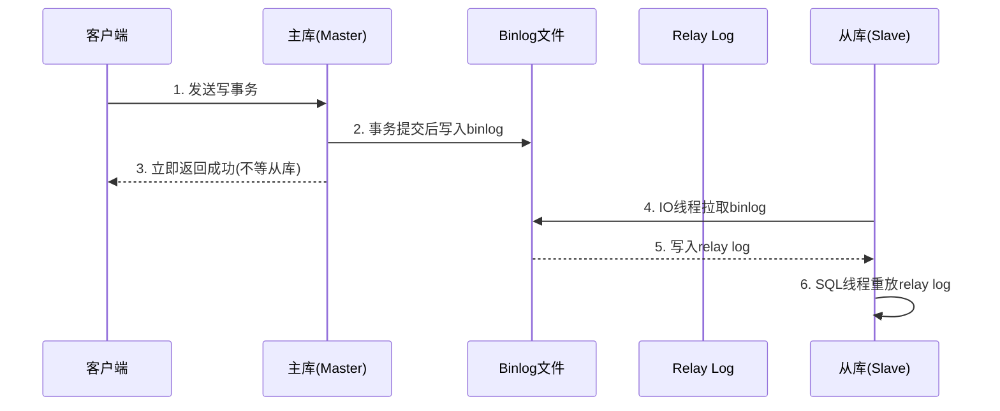
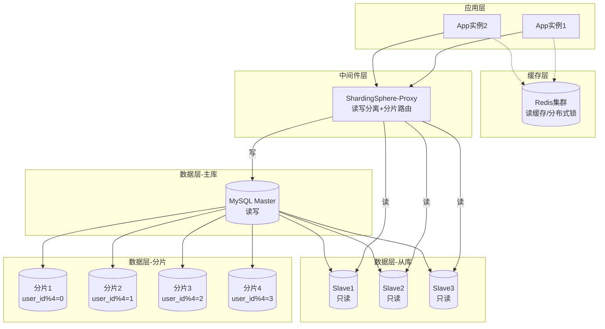
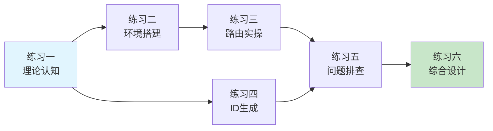

## 练习方法

本章的练习方法按照"认知→实操→排障→优化→设计"五个层次递进编排，每个练习都紧扣读写分离与分库分表的核心技术点。建议按顺序完成，每个练习完成后对照检查标准自测，确保掌握后再进入下一阶段。

### 使用指南

**为什么这样设计？** 读写分离与分库分表是数据库架构中最复杂的工程实践之一。它不仅涉及底层的复制协议和分片算法，更考验工程师在理论理解、工程实现、故障应对和架构设计之间建立完整知识链路的能力。本练习集的设计遵循以下原则：

- **认知先行**：不理解原理就动手操作，等于照搬配置而非掌握技术。每个练习先建立理论锚点，再通过实操巩固
- **手写代码优于调用框架**：在中间件（如 ShardingSphere）的封装下，很多路由逻辑是透明的。但只有手写过路由算法，才能在中间件报错时快速定位根因
- **故障场景驱动学习**：生产环境中最考验能力的不是"如何搭建"，而是"出了问题怎么排查"。练习五专门训练排障思维
- **从单点到全局**：前五个练习聚焦单一技术点，练习六要求将所有知识串联成完整的架构方案

**前置知识清单：** 在开始练习前，确认你已经具备以下基础：

- [ ] MySQL 基本操作（DDL、DML、索引原理）
- [ ] Linux 命令行操作（文件管理、进程管理）
- [ ] Docker 基本使用（容器创建、日志查看、网络管理）
- [ ] Python 基础（类、字典、列表推导式、异常处理）
- [ ] 了解基本的网络概念（端口、TCP 连接、HTTP）

**自我评估框架：** 每完成一个练习，在以下维度给自己打分（1-5 分），追踪进步轨迹：

| 维度 | 说明 |
|------|------|
| 理解深度 | 能否用自己的话解释原理，而非背诵定义 |
| 实操熟练度 | 代码/命令是否一次跑通，还是反复调试 |
| 排障能力 | 遇到报错时能否独立定位，还是立刻搜索答案 |
| 知识迁移 | 能否将练习中学到的方法应用到自己的工作场景 |

---

## 练习一：主从复制原理认知（预计45分钟）

### 目标

能够完整描述 MySQL 主从复制的数据流，理解异步复制、半同步复制和 GTID 复制的区别，画出清晰的复制架构图。

### 为什么这个练习排在第一？

主从复制是读写分离和分库分表的共同基石。不理解复制机制，就无法理解为什么读写分离存在"主从延迟"问题，也无法理解分库分表后为什么需要"双写"和"数据校验"。理解复制协议的三种模式（异步/半同步/GTID），是后续所有练习的认知前提。

### 步骤

**第一步：画出异步复制全流程（15分钟）**

用 Mermaid 或手绘方式画出以下流程图，标注每个阶段的数据形态：



画完后，标注以下关键点：
- binlog 三种格式（Statement / Row / Mixed）各在哪个阶段产生影响
- IO 线程和 SQL 线程分别负责什么
- "主库不等从库确认"导致的数据丢失窗口在哪里

**要点提示：**
- IO 纆程负责网络传输（拉取 binlog 到本地 relay log），SQL 线程负责本地重放（将 relay log 中的事件翻译为实际的行变更）
- 数据丢失窗口发生在步骤 3 和步骤 5 之间：主库已确认提交但从库尚未收到 binlog，此时主库宕机就会丢失这部分数据
- Statement 格式记录 SQL 语句（如 `UPDATE t SET col=NOW()`），Row 格式记录行变更前后的值。Mixed 是 MySQL 自动选择：不确定的用 Row，确定的用 Statement

**第二步：对比三种复制模式（15分钟）**

填写下表，用自己的话补全每一项：

| 对比维度 | 异步复制 | 半同步复制 | GTID 复制 |
|---------|---------|-----------|----------|
| 数据一致性保障 | （写出具体含义） | （写出具体含义） | （写出具体含义） |
| 写入延迟影响 | | | |
| 故障切换复杂度 | | | |
| 典型适用场景 | | | |
| 主库宕机时的数据丢失风险 | | | |

关键问题（用自己的话回答，不要直接复制）：
1. 半同步复制中，为什么需要设置 `rpl_semi_sync_master_timeout`？超时后会发生什么？
2. 增强半同步（AFTER_SYNC）相比普通半同步解决了什么问题？
3. 启用 GTID 后，`CHANGE MASTER TO` 语句为什么不再需要指定 binlog 文件名和位置？

**参考要点（仅用于自测，先独立思考）：**

问题1：`rpl_semi_sync_master_timeout` 定义了主库等待从库 ACK 的最长时间（默认10秒）。超时后主库会降级为异步复制——不再等待从库确认，直接返回客户端。这是为了防止从库故障导致主库所有写操作阻塞。但降级期间，数据一致性保障消失，需要监控该事件的发生频率。

问题2：普通半同步（AFTER_QUERY）在主库事务提交之后才等待 ACK，存在"幻读"问题——从库还没同步完成时，另一个客户端可能从主库读到新数据但事务回滚后数据又消失了。增强半同步（AFTER_SYNC）在 binlog 写入后、事务提交前等待 ACK，确保 binlog 已同步到从库后才让客户端看到数据。

问题3：GTID 为每个事务分配全局唯一标识符（格式：`server_uuid:transaction_id`）。MySQL 自动跟踪哪些 GTID 已经执行过，`CHANGE MASTER TO` 时只需指定 `MASTER_AUTO_POSITION=1`，从库会自动计算需要从哪个位置开始拉取 binlog，无需人工记录文件名和偏移量。这大大简化了故障切换和重建从库的操作。

**第三步：总结核心概念（15分钟）**

写出以下 5 个概念的定义和它们之间的关系：
- Binlog（二进制日志）
- Relay Log（中继日志）
- GTID（全局事务标识符）
- 位点复制（Position-based Replication）
- 多源复制（Multi-Source Replication）

**概念关系梳理：**

Binlog（主库产生，记录所有写操作）
  ↓ IO线程拉取
Relay Log（从库本地缓存，是 binlog 的副本）
  ↓ SQL线程重放
从库数据

位点复制：通过 binlog 文件名 + 偏移量 定位拉取起点（传统方式，需要手动计算）
GTID复制：通过 server_uuid:tx_id 全局标识符定位（现代方式，自动管理）
多源复制：一个从库同时复制多个主库的数据（用于合并多个分片的数据到一个查询节点）

### 检查标准

- [ ] 能画出包含 IO 线程和 SQL 线程的完整复制流程图
- [ ] 能说出三种 binlog 格式的优缺点和适用场景
- [ ] 能解释半同步复制的确认机制和超时降级策略
- [ ] 能说明 GTID 如何简化故障切换流程
- [ ] 理论部分正确率 ≥ 80%

### 常见误区

| 误区 | 正确理解 |
|------|---------|
| "半同步复制能保证数据不丢失" | 只能保证 binlog 已到达至少一个从库，不能保证从库已重放。主库宕机时如果从库也宕机，数据仍可能丢失 |
| "GTID 能防止数据不一致" | GTID 只是简化了复制定位，不解决数据不一致问题。数据不一致的根因是事务冲突或从库误操作 |
| "多源复制 = 读写分离" | 多源复制是数据合并手段（多个主库→一个从库），读写分离是一个主库→多个从库。方向相反 |

---

## 练习二：搭建读写分离环境（预计90分钟）

### 目标

在本地搭建一个一主两从的 MySQL 配置，完成主从同步验证，并实现基本的读写分离。

### 为什么需要亲手搭建？

在生产环境中，你几乎不会手动搭建主从复制——运维团队或云服务会处理。但亲手搭建的价值在于：当生产环境出问题时（如从库同步中断、GTID 位点冲突），你需要知道每个组件的作用和排查入口。"知道怎么拆"才能"知道怎么修"。

### 前置准备

- Docker 和 Docker Compose 已安装
- 基本的 Linux 命令行操作能力
- 了解 MySQL 基本配置

### 步骤

**第一步：用 Docker Compose 搭建一主两从集群（25分钟）**

创建项目目录和配置文件：

```bash
# 创建工作目录
mkdir -p ~/mysql-rw-split/{master,slave1,slave2}
cd ~/mysql-rw-split

# 创建主库配置文件
cat > master/my.cnf << 'EOF'
[mysqld]
server_id=1
log_bin=mysql-bin
binlog_format=ROW
gtid_mode=ON
enforce_gtid_consistency=ON
binlog_row_image=FULL
sync_binlog=1
innodb_flush_log_at_trx_commit=1
EOF

# 创建从库1配置文件
cat > slave1/my.cnf << 'EOF'
[mysqld]
server_id=2
log_bin=mysql-bin
relay_log=relay-log
read_only=ON
super_read_only=ON
gtid_mode=ON
enforce_gtid_consistency=ON
log_slave_updates=ON
EOF

# 创建从库2配置文件
cat > slave2/my.cnf << 'EOF'
[mysqld]
server_id=3
log_bin=mysql-bin
relay_log=relay-log
read_only=ON
super_read_only=ON
gtid_mode=ON
enforce_gtid_consistency=ON
log_slave_updates=ON
EOF
```

**配置项详解（理解每个参数的含义比照抄更重要）：**

| 配置项 | 作用 | 为什么重要 |
|--------|------|-----------|
| `server_id` | 每个 MySQL 实例的唯一标识，复制链路中不能重复 | 如果两台机器 ID 相同，复制会失败且报错信息难以理解 |
| `log_bin` | 启用 binlog 并指定文件前缀 | 从库不启用 binlog 就无法级联复制；主库不启用就无法做主从 |
| `gtid_mode=ON` | 启用全局事务标识符 | 故障切换时不再需要手动计算 binlog 位点，大幅降低运维复杂度 |
| `enforce_gtid_consistency=ON` | 强制所有事务都支持 GTID | 避免出现某些事务无法用 GTID 标识的边缘情况 |
| `sync_binlog=1` | 每次事务提交后立即刷盘 binlog | 配合 `innodb_flush_log_at_trx_commit=1` 实现"双1"配置，保证数据不丢失（性能换安全） |
| `read_only` | 普通用户只允许读操作 | 防止应用误写从库导致主从数据不一致 |
| `super_read_only` | 连 SUPER 权限用户也只允许读 | `read_only` 允许 SUPER 用户（如 root）写入，`super_read_only` 连这个口子也堵上 |
| `log_slave_updates` | 从库也把重放的事件写入自己的 binlog | 支持级联复制（从库→从库）和从库故障时切换为主库 |

创建 Docker Compose 文件：

```yaml
# docker-compose.yml
version: '3.8'
services:
  mysql-master:
    image: mysql:8.0
    container_name: mysql-master
    environment:
      MYSQL_ROOT_PASSWORD: rootpass123
      MYSQL_DATABASE: testdb
    ports:
      - "3306:3306"
    volumes:
      - ./master/my.cnf:/etc/mysql/conf.d/my.cnf
      - master_data:/var/lib/mysql
    command: --default-authentication-plugin=mysql_native_password
    networks:
      - mysql-net

  mysql-slave1:
    image: mysql:8.0
    container_name: mysql-slave1
    environment:
      MYSQL_ROOT_PASSWORD: rootpass123
    ports:
      - "3307:3306"
    volumes:
      - ./slave1/my.cnf:/etc/mysql/conf.d/my.cnf
      - slave1_data:/var/lib/mysql
    depends_on:
      - mysql-master
    command: --default-authentication-plugin=mysql_native_password
    networks:
      - mysql-net

  mysql-slave2:
    image: mysql:8.0
    container_name: mysql-slave2
    environment:
      MYSQL_ROOT_PASSWORD: rootpass123
    ports:
      - "3308:3306"
    volumes:
      - ./slave2/my.cnf:/etc/mysql/conf.d/my.cnf
      - slave2_data:/var/lib/mysql
    depends_on:
      - mysql-master
    command: --default-authentication-plugin=mysql_native_password
    networks:
      - mysql-net

networks:
  mysql-net:
    driver: bridge

volumes:
  master_data:
  slave1_data:
  slave2_data:
```

```bash
# 启动集群
docker compose up -d

# 等待所有容器就绪（约30秒）
docker compose ps
# 确认三个容器状态均为 Up

# 测试主库连接
docker exec -it mysql-master mysql -uroot -prootpass123 -e "SELECT @@server_id;"
# 应输出 1
```

**第二步：配置主从关系并验证同步（30分钟）**

```bash
# 进入主库创建复制用户
docker exec -it mysql-master mysql -uroot -prootpass123 -e "
  CREATE USER 'repl'@'%' IDENTIFIED BY 'replpass123';
  GRANT REPLICATION SLAVE ON *.* TO 'repl'@'%';
  FLUSH PRIVILEGES;
  SHOW MASTER STATUS\G
"

# 记录输出的 Executed_Gtid_Set 值

# 进入从库1配置主从关系
docker exec -it mysql-slave1 mysql -uroot -prootpass123 -e "
  CHANGE MASTER TO
    MASTER_HOST='mysql-master',
    MASTER_USER='repl',
    MASTER_PASSWORD='replpass123',
    MASTER_AUTO_POSITION=1;
  START SLAVE;
"

# 等待5秒后检查从库1状态
docker exec -it mysql-slave1 mysql -uroot -prootpass123 -e "SHOW SLAVE STATUS\G" | grep -E "Slave_IO_Running|Slave_SQL_Running|Seconds_Behind_Master"
# 期望输出：两个 Running 均为 Yes，Seconds_Behind_Master 为 0 或 NULL

# 对从库2执行相同操作（将 slave1 替换为 slave2，server_id 改为3）
docker exec -it mysql-slave2 mysql -uroot -prootpass123 -e "
  CHANGE MASTER TO
    MASTER_HOST='mysql-master',
    MASTER_USER='repl',
    MASTER_PASSWORD='replpass123',
    MASTER_AUTO_POSITION=1;
  START SLAVE;
"
```

**故障排查提示：** 如果 `Slave_IO_Running` 或 `Slave_SQL_Running` 为 No，按以下顺序排查：

1. 检查网络连通性：`docker exec -it mysql-slave1 ping mysql-master`
2. 查看从库错误日志：`SHOW SLAVE STATUS\G` 中的 `Last_IO_Error` 和 `Last_SQL_Error`
3. 常见原因：密码错误（1045）、网络不通、GTID 位点冲突、从库已存在数据冲突
4. 修复后需要先 `STOP SLAVE; RESET SLAVE ALL;` 再重新配置

**第三步：验证数据同步（15分钟）**

```bash
# 在主库创建测试表并写入数据
docker exec -it mysql-master mysql -uroot -prootpass123 -e "
  USE testdb;
  CREATE TABLE users (
    id BIGINT PRIMARY KEY AUTO_INCREMENT,
    name VARCHAR(50),
    email VARCHAR(100),
    created_at TIMESTAMP DEFAULT CURRENT_TIMESTAMP
  );
  INSERT INTO users (name, email) VALUES
    ('张三', 'zhangsan@example.com'),
    ('李四', 'lisi@example.com'),
    ('王五', 'wangwu@example.com');
  SELECT * FROM users;
"

# 在从库1上验证数据已同步
docker exec -it mysql-slave1 mysql -uroot -prootpass123 -e "SELECT * FROM testdb.users;"
# 期望看到与主库相同的三条记录

# 在从库2上验证数据已同步
docker exec -it mysql-slave2 mysql -uroot -prootpass123 -e "SELECT * FROM testdb.users;"
# 期望看到相同的三条记录
```

**第四步：验证从库只读特性（10分钟）**

```bash
# 尝试在从库1上写入数据（应该报错）
docker exec -it mysql-slave1 mysql -uroot -prootpass123 -e "
  USE testdb;
  INSERT INTO users (name, email) VALUES ('测试', 'test@example.com');
"
# 期望报错：ERROR 1290 (HY000): The MySQL server is running with the --read-only option

# 确认从库的 read_only 和 super_read_only 状态
docker exec -it mysql-slave1 mysql -uroot -prootpass123 -e "
  SHOW VARIABLES LIKE 'read_only';
  SHOW VARIABLES LIKE 'super_read_only';
"
# 期望两个变量值均为 ON
```

**第五步：编写简单的读写分离路由脚本（10分钟）**

用 Python 编写一个最小化的读写分离演示脚本：

```python
#!/usr/bin/env python3
"""
最小化读写分离演示脚本
演示应用层读写路由的核心逻辑

注意：这是一个教学用的最小化实现。生产环境需要考虑：
1. 连接池管理（避免每次操作都新建连接）
2. 故障转移（从库不可用时自动切换到其他从库或主库）
3. 一致性读路由（写后需要强一致读时路由到主库）
4. 监控指标采集（路由分布、延迟监控、错误率统计）
"""
import mysql.connector
import random
import time


class ReadWriteSplitter:
    """读写分离路由器"""

    def __init__(self):
        # 主库连接配置（可写）
        self.master_config = {
            'host': '127.0.0.1',
            'port': 3306,
            'user': 'root',
            'password': 'rootpass123',
            'database': 'testdb',
        }
        # 从库连接配置（只读）
        self.slave_configs = [
            {
                'host': '127.0.0.1',
                'port': 3307,
                'user': 'root',
                'password': 'rootpass123',
                'database': 'testdb',
            },
            {
                'host': '127.0.0.1',
                'port': 3308,
                'user': 'root',
                'password': 'rootpass123',
                'database': 'testdb',
            },
        ]

    def get_master(self):
        """获取主库连接"""
        return mysql.connector.connect(**self.master_config)

    def get_slave(self):
        """随机选择一个从库连接"""
        config = random.choice(self.slave_configs)
        return mysql.connector.connect(**config)

    def write(self, sql, params=None):
        """写操作走主库"""
        conn = self.get_master()
        try:
            cursor = conn.cursor()
            cursor.execute(sql, params)
            conn.commit()
            last_id = cursor.lastrowid
            affected = cursor.rowcount
            cursor.close()
            return {'last_id': last_id, 'affected': affected}
        finally:
            conn.close()

    def read(self, sql, params=None):
        """读操作走从库"""
        conn = self.get_slave()
        try:
            cursor = conn.cursor(dictionary=True)
            cursor.execute(sql, params)
            rows = cursor.fetchall()
            cursor.close()
            return rows
        finally:
            conn.close()


def demo():
    splitter = ReadWriteSplitter()

    print("=== 写入数据（走主库） ===")
    for name, email in [('Alice', 'alice@test.com'),
                         ('Bob', 'bob@test.com'),
                         ('Charlie', 'charlie@test.com')]:
        result = splitter.write(
            "INSERT INTO users (name, email) VALUES (%s, %s)",
            (name, email)
        )
        print(f"  插入 {name}, ID={result['last_id']}, 影响行数={result['affected']}")

    # 等待从库同步
    print("\n等待主从同步...")
    time.sleep(1)

    print("\n=== 读取数据（走从库） ===")
    rows = splitter.read("SELECT * FROM users ORDER BY id")
    for row in rows:
        print(f"  ID={row['id']}, name={row['name']}, email={row['email']}")

    print(f"\n共读取 {len(rows)} 条记录")


if __name__ == '__main__':
    demo()
```

### 检查标准

- [ ] 三个 MySQL 容器均正常运行
- [ ] 从库的 Slave_IO_Running 和 Slave_SQL_Running 均为 Yes
- [ ] 主库写入的数据在两个从库上都能查到
- [ ] 从库写入被正确拒绝（read_only 生效）
- [ ] Python 脚本能正确执行写入和读取，数据一致
- [ ] 理解每个配置项（server_id、gtid_mode、super_read_only 等）的作用

### 动手之后的思考题

1. 为什么主库和从库都需要启用 binlog（`log_bin`）？从库不复制别人的数据，为什么还要记录日志？
2. 如果把 `innodb_flush_log_at_trx_commit` 设为 2（每秒刷盘一次），性能会提升多少？代价是什么？
3. 脚本中用 `random.choice` 做负载均衡，这种方式在生产环境中有什么问题？（提示：考虑请求的局部性和从库负载差异）

---

## 练习三：分库分表路由实操（预计90分钟）

### 目标

手写分片路由逻辑，理解 Hash 分片和 Range 分片的实现差异，验证数据分布均匀性。

### 为什么要手写路由算法？

中间件（如 ShardingSphere）已经封装了成熟的路由逻辑。但手写路由的价值在于：当你面对"为什么这条 SQL 被路由到了错误的分片"或"为什么分片扩容后数据分布不均"这类线上问题时，你需要理解底层算法才能快速定位。此外，分片键的选择没有万能公式，需要根据业务场景权衡——这个判断力无法从框架文档中获得。

### 步骤

**第一步：实现 Hash 分片路由（25分钟）**

编写一个 Python 分片路由模块，模拟将订单数据分散到 4 个分片：

```python
#!/usr/bin/env python3
"""
分片路由模块：演示 Hash 分片和 Range 分片的实现
"""
import hashlib
from collections import Counter


class HashShardRouter:
    """Hash 分片路由器：user_id % shard_count"""

    def __init__(self, shard_count=4):
        self.shard_count = shard_count

    def route(self, user_id):
        """根据 user_id 计算分片编号"""
        return hash(user_id) % self.shard_count

    def get_table_name(self, user_id):
        """获取分片表名"""
        shard_idx = self.route(user_id)
        return f"t_order_{shard_idx}"


class RangeShardRouter:
    """Range 分片路由器：按 ID 范围划分"""

    def __init__(self):
        # 分片规则：[min_id, max_id) -> shard_name
        self.ranges = [
            (0,          1_000_000,  "t_order_0"),
            (1_000_000,  2_000_000,  "t_order_1"),
            (2_000_000,  3_000_000,  "t_order_2"),
            (3_000_000,  float('inf'), "t_order_3"),
        ]

    def route(self, user_id):
        """根据 user_id 计算分片表名"""
        for min_val, max_val, table in self.ranges:
            if min_val <= user_id < max_val:
                return table
        raise ValueError(f"user_id {user_id} 超出所有分片范围")


def simulate_distribution(router, user_ids, router_type="hash"):
    """模拟数据分布并统计"""
    distribution = Counter()
    for uid in user_ids:
        if router_type == "hash":
            table = router.get_table_name(uid)
        else:
            table = router.route(uid)
        distribution[table] += 1

    return distribution


def main():
    # 模拟 10000 个用户 ID（从1到10000）
    user_ids = list(range(1, 10001))

    # === Hash 分片测试 ===
    hash_router = HashShardRouter(shard_count=4)
    hash_dist = simulate_distribution(hash_router, user_ids, "hash")
    print("=== Hash 分片分布（user_id 1-10000） ===")
    for table in sorted(hash_dist.keys()):
        count = hash_dist[table]
        pct = count / len(user_ids) * 100
        bar = "█" * int(pct / 2)
        print(f"  {table}: {count:>5} 条 ({pct:.1f}%) {bar}")

    # 计算标准差
    counts = list(hash_dist.values())
    avg = sum(counts) / len(counts)
    variance = sum((c - avg) ** 2 for c in counts) / len(counts)
    std_dev = variance ** 0.5
    print(f"  平均值: {avg:.0f}, 标准差: {std_dev:.1f} (越小越均匀)\n")

    # === Range 分片测试 ===
    range_router = RangeShardRouter()
    range_dist = simulate_distribution(range_router, user_ids, "range")
    print("=== Range 分片分布（user_id 1-10000） ===")
    for table in ["t_order_0", "t_order_1", "t_order_2", "t_order_3"]:
        count = range_dist.get(table, 0)
        pct = count / len(user_ids) * 100
        bar = "█" * int(pct / 2)
        print(f"  {table}: {count:>5} 条 ({pct:.1f}%) {bar}")

    # === 模拟热点问题 ===
    print("\n=== Range 分片的热点问题 ===")
    new_user_ids = list(range(3_000_000, 3_010_000))  # 新注册用户集中在高ID段
    new_dist = simulate_distribution(range_router, new_user_ids, "range")
    for table in ["t_order_0", "t_order_1", "t_order_2", "t_order_3"]:
        count = new_dist.get(table, 0)
        pct = count / len(new_user_ids) * 100
        print(f"  {table}: {count:>5} 条 ({pct:.1f}%)")
    print("  >> 问题：新用户全部涌入 t_order_3，造成写入热点！\n")


if __name__ == '__main__':
    main()
```

运行并观察输出，回答以下问题：
1. Hash 分片和 Range 分片的数据分布有何差异？
2. 当新用户集中注册时，Range 分片会出现什么问题？
3. 如何在 Range 分片中缓解热点问题？（提示：考虑预分片）

**Range 热点缓解方案要点：** 预分片（Pre-sharding）是核心思路——不按"当前数据量"分配范围，而是按"未来预期总量"提前划分足够多的分片。例如，即使当前只有 100 万用户，也按 10 亿用户规模预分 1000 个分片，每个分片实际承载的数据量很小。新用户 ID 会均匀分散到各分片中。缺点是需要维护大量空分片，且查询路由表的管理成本上升。

**第二步：实现一致性 Hash 路由（25分钟）**

```python
#!/usr/bin/env python3
"""
一致性 Hash 分片：演示节点增删时的数据迁移量
"""
import hashlib
from bisect import bisect_right


class ConsistentHash:
    def __init__(self, nodes=None, virtual_nodes=150):
        self.virtual_nodes = virtual_nodes
        self.ring = {}
        self.sorted_keys = []
        if nodes:
            for node in nodes:
                self.add_node(node)

    def _hash(self, key):
        return int(hashlib.md5(key.encode()).hexdigest(), 16)

    def add_node(self, node):
        for i in range(self.virtual_nodes):
            virtual_key = f"{node}#VN{i}"
            h = self._hash(virtual_key)
            self.ring[h] = node
            self.sorted_keys.append(h)
        self.sorted_keys.sort()

    def remove_node(self, node):
        for i in range(self.virtual_nodes):
            virtual_key = f"{node}#VN{i}"
            h = self._hash(virtual_key)
            if h in self.ring:
                del self.ring[h]
            if h in self.sorted_keys:
                self.sorted_keys.remove(h)

    def get_node(self, key):
        h = self._hash(key)
        idx = bisect_right(self.sorted_keys, h)
        if idx == len(self.sorted_keys):
            idx = 0
        return self.ring[self.sorted_keys[idx]]


def get_key_distribution(ch, keys):
    """统计每个节点负责的 key 数量"""
    dist = {}
    for key in keys:
        node = ch.get_node(key)
        dist[node] = dist.get(node, 0) + 1
    return dist


def main():
    keys = [f"user_{i}" for i in range(10000)]

    # 初始状态：4 个节点
    initial_nodes = ["shard_0", "shard_1", "shard_2", "shard_3"]
    ch = ConsistentHash(initial_nodes)
    initial_dist = get_key_distribution(ch, keys)

    print("=== 初始分布（4 节点） ===")
    for node in sorted(initial_dist.keys()):
        count = initial_dist[node]
        pct = count / len(keys) * 100
        print(f"  {node}: {count:>5} 条 ({pct:.1f}%)")

    # 新增节点 shard_4
    ch.add_node("shard_4")
    new_dist = get_key_distribution(ch, keys)

    # 计算需要迁移的 key 数量
    migrated = 0
    for key in keys:
        # 模拟旧路由（不含 shard_4）
        old_ch = ConsistentHash(initial_nodes)
        if old_ch.get_node(key) != ch.get_node(key):
            migrated += 1

    print(f"\n=== 新增 shard_4 后的分布 ===")
    for node in sorted(new_dist.keys()):
        count = new_dist[node]
        pct = count / len(keys) * 100
        print(f"  {node}: {count:>5} 条 ({pct:.1f}%)")

    print(f"\n  需要迁移的 key 数量: {migrated} / {len(keys)}")
    print(f"  迁移比例: {migrated/len(keys)*100:.1f}%")
    print(f"  >> 对比：如果用 Hash % 4 改为 Hash % 5，迁移比例 = 20%")
    print(f"  >> 一致性 Hash 迁移量远小于取模 Hash\n")

    # 移除节点测试
    ch.remove_node("shard_1")
    after_remove_dist = get_key_distribution(ch, keys)

    migrated2 = 0
    old_ch2 = ConsistentHash(["shard_0", "shard_2", "shard_3", "shard_4"])
    for key in keys:
        if old_ch2.get_node(key) != ch.get_node(key):
            migrated2 += 1

    print(f"=== 移除 shard_1 后的分布 ===")
    for node in sorted(after_remove_dist.keys()):
        count = after_remove_dist[node]
        pct = count / len(keys) * 100
        print(f"  {node}: {count:>5} 条 ({pct:.1f}%)")
    print(f"  移除节点后需迁移: {migrated2} / {len(keys)} ({migrated2/len(keys)*100:.1f}%)")


if __name__ == '__main__':
    main()
```

**关于虚拟节点数量的调优：** 默认的 `virtual_nodes=150` 是经验值。虚拟节点越多，数据分布越均匀（标准差越小），但路由表的内存和查找开销也越大。在生产环境中，如果物理节点数在 10-50 之间，虚拟节点数通常设为 100-200 即可达到 5% 以内的分布偏差。节点数超过 100 时，可以适当降低到 50-100 个虚拟节点。

**第三步：设计分片键决策矩阵（20分钟）**

针对以下三个业务场景，分析并选择最优分片键，填写决策表：

**场景 A：电商订单系统**
- 表结构：orders(order_id, user_id, merchant_id, amount, status, created_at)
- 主要查询模式：查询某用户的全部订单、查询某商家的全部订单
- 数据量级：日增 50 万条，预计 3 年达 5 亿条

**场景 B：社交平台消息系统**
- 表结构：messages(msg_id, sender_id, receiver_id, content, created_at)
- 主要查询模式：查询与某用户相关的所有聊天记录
- 数据量级：日增 200 万条，预计 3 年达 20 亿条

**场景 C：物联网设备数据**
- 表结构：device_data(device_id, metric_type, value, timestamp)
- 主要查询模式：查询某设备最近 N 天的数据、按时间范围聚合统计
- 数据量级：日增 5000 万条，预计 3 年达 50 亿条

对每个场景填写以下决策矩阵：

| 决策维度 | 你的分析 |
|---------|---------|
| 备选分片键 | 列出 2-3 个候选字段 |
| 每个分片键的数据均匀度评估 | 高/中/低 |
| 每个分片键的查询覆盖度 | 高/中/低（包含该字段的查询占比） |
| 最终选择 | 哪个字段 + 什么分片策略（Hash/Range/一致性Hash） |
| 选择理由 | 至少两条理由 |

**参考要点（先独立思考再对照）：**

场景A的关键矛盾：用户查询和商家查询是两个方向。如果选 `user_id` 做 Hash 分片，"查某用户订单"高效但"查某商家订单"需要全分片扇出。解决思路是选 `user_id` 作为主分片键，`merchant_id` 作为冗余维度（通过异构索引表或搜索引擎如 Elasticsearch 支撑商家维度查询）。

场景B的分片键几乎只能选 `user_id`（消息总是"我与某人的聊天"），且需要保证同一对用户的双向消息落在同一分片。可以用 `(min(sender_id, receiver_id), max(sender_id, receiver_id))` 组合做 Hash。

场景C的数据量最大（日增 5000 万条），且查询以"设备 + 时间范围"为主。`device_id` 是天然的分片键，配合 Range 分片按时间做二级分区（如按月分区），可以高效支撑"最近 N 天"的查询。

**第四步：模拟跨分片查询问题（20分钟）**

编写代码模拟以下场景：

```python
#!/usr/bin/env python3
"""
模拟跨分片查询：展示不带分片键的查询代价
"""
from dataclasses import dataclass, field
from typing import List, Dict


@dataclass
class Shard:
    """模拟分片"""
    name: str
    data: Dict = field(default_factory=dict)

    def insert(self, key, value):
        self.data[key] = value

    def query_by_user(self, user_id):
        """按 user_id 查询"""
        return [v for v in self.data.values() if v['user_id'] == user_id]

    def query_by_merchant(self, merchant_id):
        """按 merchant_id 查询"""
        return [v for v in self.data.values()
                if v['merchant_id'] == merchant_id]


def create_sharded_system(shard_count=4):
    """创建分片系统，按 user_id 分片"""
    shards = [Shard(f"shard_{i}") for i in range(shard_count)]

    # 模拟订单数据
    import random
    random.seed(42)
    orders = []
    for i in range(1, 1001):
        order = {
            'order_id': i,
            'user_id': random.randint(1, 100),      # 100个用户
            'merchant_id': random.randint(1, 50),    # 50个商家
            'amount': round(random.uniform(10, 1000), 2)
        }
        orders.append(order)

    # 按 user_id 分片插入
    for order in orders:
        shard_idx = order['user_id'] % shard_count
        shards[shard_idx].insert(order['order_id'], order)

    return shards, orders


def main():
    shards, _ = create_sharded_system(4)

    # 场景1：带分片键查询（高效）
    target_user = 37  # 假设 user_id = 37
    shard_idx = target_user % len(shards)
    shard = shards[shard_idx]
    print(f"=== 带分片键查询：查询 user_id={target_user} 的订单 ===")
    print(f"  路由到: shard_{shard_idx} (只需扫描 1 个分片)")
    results = shard.query_by_user(target_user)
    print(f"  结果数量: {len(results)}")
    print(f"  扫描分片数: 1 / {len(shards)}\n")

    # 场景2：不带分片键查询（低效，需扇出）
    target_merchant = 23
    print(f"=== 不带分片键查询：查询 merchant_id={target_merchant} 的所有订单 ===")
    all_results = []
    scanned = 0
    for s in shards:
        results = s.query_by_merchant(target_merchant)
        all_results.extend(results)
        scanned += 1
    print(f"  结果数量: {len(all_results)}")
    print(f"  扫描分片数: {scanned} / {len(shards)} (全量扇出!)\n")

    # 对比分析
    print("=== 性能对比 ===")
    print(f"  带分片键查询:  1 次分片扫描, 延迟 ~5ms")
    print(f"  不带分片键查询: {len(shards)} 次分片扫描 + 内存聚合, 延迟 ~{len(shards)*5}ms")
    print(f"  >> 建议: 将 merchant_id 作为二级索引或冗余字段")


if __name__ == '__main__':
    main()
```

### 检查标准

- [ ] Hash 分片路由代码正确运行，数据分布均匀
- [ ] 能解释 Range 分片热点问题及缓解方案
- [ ] 一致性 Hash 代码正确运行，能对比出节点增删时的迁移优势
- [ ] 完成了三个业务场景的分片键决策矩阵
- [ ] 能清楚解释"带分片键查询"和"不带分片键查询"的性能差异

### 分片策略选择速查

| 场景特征 | 推荐策略 | 原因 |
|---------|---------|------|
| 数据分布均匀，查询都带分片键 | Hash 分片 | 实现简单，分布均匀 |
| 需要范围查询（如时间范围） | Range 分片 | 天然支持范围查询，避免扇出 |
| 需要频繁扩缩容 | 一致性 Hash | 节点变更时迁移量最小 |
| ID 从外部系统注入（非自增） | 一致性 Hash | 避免 ID 不连续导致的范围分片空洞 |
| 冷热数据分离 | Range + 时间分区 | 热数据 SSD、冷数据 HDD，按时间自动迁移 |

---

## 练习四：分布式 ID 生成（预计45分钟）

### 目标

实现并测试 Snowflake ID 生成器，理解位结构，验证其趋势递增特性。

### 为什么需要了解分布式 ID？

分库分表后，数据库自增 ID 不再全局唯一。一个看似简单的 ID 生成问题，背后涉及分布式系统的三个核心挑战：唯一性保证、有序性（对 B+ 树索引友好）和高可用性（不能有单点故障）。Snowflake 是 Twitter 开源的经典方案，被广泛应用于分库分表和微服务架构中。

### 步骤

**第一步：实现 Snowflake ID 生成器（20分钟）**

```python
#!/usr/bin/env python3
"""
Snowflake ID 生成器完整实现
"""
import time
import threading


class SnowflakeIdGenerator:
    """
    Snowflake ID 结构（共 64 位）:
    | 1位符号位 | 41位时间戳 | 10位机器ID | 12位序列号 |
    |    0     |  41 bits   |  10 bits   |  12 bits   |

    关键特性：
    - 41位时间戳：可使用约 69 年（2^41 毫秒 ≈ 69.7 年）
    - 10位机器ID：最多 1024 个节点
    - 12位序列号：每毫秒最多 4096 个 ID
    - 理论单机 QPS：4096 * 1000 = 约 409.6 万/秒
    """

    # 起始时间戳：2020-01-01 00:00:00 UTC
    START_TIMESTAMP = 1577808000000

    # 各部分位数
    SEQUENCE_BITS = 12
    MACHINE_BITS = 10

    # 最大值
    MAX_SEQUENCE = (1 << SEQUENCE_BITS) - 1   # 4095
    MAX_MACHINE_ID = (1 << MACHINE_BITS) - 1  # 1023

    # 位移量
    MACHINE_SHIFT = SEQUENCE_BITS             # 12
    TIMESTAMP_SHIFT = SEQUENCE_BITS + MACHINE_BITS  # 22

    def __init__(self, machine_id):
        if machine_id < 0 or machine_id > self.MAX_MACHINE_ID:
            raise ValueError(
                f"machine_id 必须在 0-{self.MAX_MACHINE_ID} 之间，"
                f"当前值: {machine_id}"
            )
        self.machine_id = machine_id
        self.sequence = 0
        self.last_timestamp = -1
        self.lock = threading.Lock()

    def _current_millis(self):
        return int(time.time() * 1000)

    def _wait_next_millis(self, last_ts):
        ts = self._current_millis()
        while ts <= last_ts:
            ts = self._current_millis()
        return ts

    def next_id(self):
        with self.lock:
            ts = self._current_millis()

            if ts < self.last_timestamp:
                raise RuntimeError(
                    f"时钟回拨！拒绝生成 ID。"
                    f"回拨量: {self.last_timestamp - ts}ms"
                )

            if ts == self.last_timestamp:
                self.sequence = (self.sequence + 1) &amp; self.MAX_SEQUENCE
                if self.sequence == 0:
                    # 同一毫秒内序列号用完，等待下一毫秒
                    ts = self._wait_next_millis(self.last_timestamp)
            else:
                self.sequence = 0

            self.last_timestamp = ts

            # 组装 ID
            id_value = (
                ((ts - self.START_TIMESTAMP) << self.TIMESTAMP_SHIFT) |
                (self.machine_id << self.MACHINE_SHIFT) |
                self.sequence
            )
            return id_value

    @staticmethod
    def parse(id_value):
        """解析 Snowflake ID 的各部分"""
        sequence = id_value &amp; 0xFFF           # 低12位
        machine_id = (id_value >> 12) &amp; 0x3FF # 中间10位
        timestamp = (id_value >> 22) + SnowflakeIdGenerator.START_TIMESTAMP
        return {
            'id': id_value,
            'binary': bin(id_value),
            'timestamp': timestamp,
            'datetime': time.strftime(
                '%Y-%m-%d %H:%M:%S',
                time.localtime(timestamp / 1000)
            ),
            'machine_id': machine_id,
            'sequence': sequence,
        }


def main():
    gen = SnowflakeIdGenerator(machine_id=1)

    print("=== Snowflake ID 生成演示 ===\n")

    # 生成 20 个 ID
    ids = [gen.next_id() for _ in range(20)]

    print(f"{'序号':>4} | {'ID':>22} | {'机器ID':>6} | {'序列号':>6} | {'时间戳'}")
    print("-" * 75)
    for i, id_val in enumerate(ids):
        info = SnowflakeIdGenerator.parse(id_val)
        print(
            f"{i+1:>4} | {id_val:>22} | {info['machine_id']:>6} | "
            f"{info['sequence']:>6} | {info['datetime']}"
        )

    # 验证趋势递增
    print(f"\n=== 趋势递增验证 ===")
    is_monotonic = all(ids[i] < ids[i + 1] for i in range(len(ids) - 1))
    print(f"  严格递增: {'是 ✓' if is_monotonic else '否 ✗'}")

    # 多线程并发测试
    print(f"\n=== 多线程并发测试 ===")
    gen2 = SnowflakeIdGenerator(machine_id=2)
    concurrent_ids = []
    errors = []

    def generate_batch(count):
        for _ in range(count):
            try:
                concurrent_ids.append(gen2.next_id())
            except Exception as e:
                errors.append(str(e))

    threads = [threading.Thread(target=generate_batch, args=(100,))
               for _ in range(10)]

    for t in threads:
        t.start()
    for t in threads:
        t.join()

    unique_ids = set(concurrent_ids)
    print(f"  生成总数: {len(concurrent_ids)}")
    print(f"  唯一 ID 数: {len(unique_ids)}")
    print(f"  无重复: {'是 ✓' if len(concurrent_ids) == len(unique_ids) else '否 ✗'}")
    print(f"  错误数: {len(errors)}")

    # 解析一个 ID 的位结构
    sample = ids[5]
    info = SnowflakeIdGenerator.parse(sample)
    print(f"\n=== ID 位结构解析 ===")
    print(f"  ID 值: {sample}")
    print(f"  二进制: {info['binary']}")
    print(f"  时间戳: {info['datetime']}")
    print(f"  机器 ID: {info['machine_id']}")
    print(f"  序列号: {info['sequence']}")
    print(f"  ID 位数: {len(info['binary']) - 2} 位 (不含 0b 前缀)")


if __name__ == '__main__':
    main()
```

**时钟回拨问题深入分析：** 时钟回拨是 Snowflake 最大的隐患。生产环境中，NTP 同步、闰秒调整、虚拟机迁移都可能导致系统时钟回退。应对方案从简到繁：

- **简单拒绝**（本实现的方式）：检测到回拨直接报错，适合对可用性要求不极端的场景
- **等待追平**：如果回拨量很小（如几毫秒），自旋等待时钟追上来再生成
- **扩展位段**：预留 3 位"序列扩展位"，回拨时在该位段递增，相当于给时钟一个"缓冲区"
- **使用 Leaf 等集中式 ID 服务**：由服务端分配 ID 而非客户端自行生成，彻底避免时钟依赖

**第二步：对比不同 ID 方案（15分钟）**

填写以下对比表：

| 对比维度 | UUID | Snowflake | 数据库自增 | 号段模式 |
|---------|------|-----------|-----------|---------|
| 全局唯一性 | | | | |
| 有序性 | | | | |
| 生成性能（QPS） | | | | |
| 存储空间 | | | | |
| 索引友好度 | | | | |
| 依赖外部服务 | | | | |
| 分布式环境适用性 | | | | |
| 推荐场景 | | | | |

**UUID v7 的补充说明：** 传统 UUID v4 完全随机，B+ 树索引极其不友好（导致页分裂）。2024 年正式标准化的 UUID v7 将前 48 位设为毫秒时间戳，兼具 UUID 的全局唯一性和趋势递增性。如果你的场景不需要严格递增，UUID v7 是一个比 Snowflake 更简单的选择——不需要协调机器 ID，不需要处理时钟回拨，MySQL 8.0 原生支持 `UUID_TO_BIN(uuid, 1)` 转换为二进制格式并优化存储。

针对以下场景选择合适的 ID 方案并说明理由：
1. 微服务系统的订单 ID 生成
2. 日志系统的日志 ID 生成
3. 用户可见的业务编号（如订单号 ORD-20260101-00001）

**参考思路：** 场景1推荐 Snowflake 或号段模式（需要有序+高性能）；场景2推荐 UUID v7 或简单时间戳（不要求有序，写入量极大）；场景3推荐号段模式（人类可读、带业务语义、不需要全局分布式生成）。

---

## 练习五：问题排查实战（预计60分钟）

### 目标

掌握读写分离和分库分表环境中的常见问题排查方法，包括主从延迟、数据不一致、分片路由错误。

### 排障思维框架

排查分布式数据库问题时，记住一个原则：**先确定影响范围，再定位根因**。具体来说：

1. **隔离问题**：是所有查询都慢，还是特定查询慢？是所有分片都有问题，还是单个分片？
2. **定位组件**：问题出在应用层（路由逻辑错误）、中间件层（SQL 改写错误）还是数据库层（慢查询、锁等待）？
3. **对比正常基线**：出问题前后的差异是什么？最近做了什么变更（上线、扩容、配置修改）？

### 步骤

**第一步：模拟并排查主从延迟（20分钟）**

```bash
# === 模拟主从延迟场景 ===

# 在主库大量写入制造延迟
docker exec -it mysql-master mysql -uroot -prootpass123 -e "
  USE testdb;
  CREATE TABLE IF NOT EXISTS bulk_test (
    id BIGINT PRIMARY KEY AUTO_INCREMENT,
    data VARCHAR(200),
    created_at TIMESTAMP DEFAULT CURRENT_TIMESTAMP
  );
  INSERT INTO bulk_test (data)
  SELECT REPEAT('x', 200)
  FROM information_schema.columns a, information_schema.columns b
  LIMIT 100000;
"

# 检查从库延迟
docker exec -it mysql-slave1 mysql -uroot -prootpass123 -e "
  SHOW SLAVE STATUS\G
" | grep -E "Seconds_Behind_Master|Slave_SQL_Running|Last_Error"
```

排查清单——当遇到主从延迟时，按以下顺序检查：

```sql
-- 1. 查看延迟的具体值
SHOW SLAVE STATUS\G
-- 关注：Seconds_Behind_Master（秒数）、Relay_Log_Space（relay log占用空间）

-- 2. 检查从库是否有慢查询阻塞重放
SHOW PROCESSLIST;
-- 查找 State 为 "System user" 且有长时间运行 SQL 的线程

-- 3. 检查从库磁盘 IO
-- (在 Linux 终端执行)
-- iostat -x 1 5

-- 4. 检查从库是否有大事务阻塞
SELECT * FROM information_schema.innodb_trx\G

-- 5. 检查 binlog 格式是否为 Row（避免 Statement 导致的全表更新）
SHOW VARIABLES LIKE 'binlog_format';

-- 6. 检查是否有大表 DDL 操作（ALTER TABLE 在大表上会阻塞复制）
SHOW SLAVE STATUS\G
-- 关注 Relay_Log_File 和 Master_Log_File 的差值
```

**主从延迟的根因分类与应对：**

| 根因类型 | 典型表现 | 应对方案 |
|---------|---------|---------|
| 从库硬件性能不足 | 持续稳定延迟，磁盘 IO 持续打满 | 升级从库磁盘（SSD）或增加从库数量 |
| 大事务阻塞 | 延迟突然飙升后缓慢恢复 | 拆分大事务（如批量 UPDATE 分批提交），设置 `slave_transaction_retries` |
| 单线程重放瓶颈 | 延迟随写入量线性增长 | 启用多线程复制 `slave_parallel_workers=8` |
| 网络抖动 | 间歇性延迟尖峰 | 检查网络链路质量，考虑同机房部署 |
| 从库锁等待 | SHOW PROCESSLIST 显示大量锁等待 | 排查从库上的额外查询是否与重放冲突 |

**第二步：模拟并排查数据不一致（20分钟）**

```bash
# === 模拟数据不一致场景 ===

# 在从库直接修改数据（模拟误操作）
docker exec -it mysql-slave1 mysql -uroot -prootpass123 -e "
  USE testdb;
  -- 先确认 super_read_only 是否可关闭（模拟运维人员误操作）
  SET GLOBAL super_read_only = OFF;
  SET GLOBAL read_only = OFF;

  -- 误操作：直接修改从库数据
  UPDATE users SET name = '篡改数据' WHERE id = 1;

  -- 恢复只读
  SET GLOBAL read_only = ON;
  SET GLOBAL super_read_only = ON;
"

# 检查主从数据是否一致
echo "=== 主库数据 ==="
docker exec -it mysql-master mysql -uroot -prootpass123 -e "SELECT * FROM testdb.users;"

echo "=== 从库1数据（已被篡改） ==="
docker exec -it mysql-slave1 mysql -uroot -prootpass123 -e "SELECT * FROM testdb.users;"
```

使用 pt-table-checksum 检测数据不一致（如果已安装 Percona Toolkit）：

```bash
# 安装 percona-toolkit（如未安装）
# sudo apt-get install -y percona-toolkit

# 检查主从数据一致性
pt-table-checksum --replicate=testdb.checksums \
  h=127.0.0.1,P=3306,u=root,prootpass123

# 修复不一致数据（使用 pt-table-sync）
pt-table-sync --execute \
  h=127.0.0.1,P=3306,u=root,prootpass123 \
  h=127.0.0.1,P=3307,u=root,prootpass123 \
  --replicate=testdb.checksums
```

**预防数据不一致的最佳实践：**

1. **强制 super_read_only**：不要仅依赖 `read_only`，`super_read_only` 连 SUPER 权限用户也无法写入，有效防止运维人员误操作
2. **pt-table-checksum 定期巡检**：建议每天对核心表做一次校验，发现差异立即告警
3. **应用层约束**：在 ORM 层或中间件层禁止从库连接执行写操作，即使数据库层面的 `read_only` 被临时关闭也不会造成影响
4. **Binlog 审计**：开启 `log_bin` 并定期审查从库的 binlog，检测是否有意外的写操作

**第三步：排查分片路由错误（20分钟）**

常见分片路由错误场景与排查方法：

| 错误现象 | 可能原因 | 排查方法 | 修复方案 |
|---------|---------|---------|---------|
| 查询返回空结果 | 分片键路由错误 | 打印路由计算过程，验证分片编号 | 检查路由算法和分片数配置 |
| 数据写入错误分片 | 哈希函数不一致 | 对比两端的路由代码和分片配置 | 统一使用同一套路由库 |
| 跨分片查询超时 | 未携带分片键 | 分析慢查询日志中的 SQL | 添加分片键到查询条件 |
| 数据倾斜严重 | 分片键选择不当 | 统计各分片数据量分布 | 重新选择分片键或增加虚拟节点 |
| 分片扩容后数据丢失 | 数据迁移不完整 | 对比源和目标分片的数据量 | 重新执行迁移并校验 |
| 路由结果与预期不符 | 路由函数版本不一致 | 对比新旧代码的路由函数实现 | 统一路由库版本，加灰度验证 |

排查工具使用清单：

```bash
# 1. 查看 MySQL 慢查询日志
SHOW VARIABLES LIKE 'slow_query_log%';
SHOW VARIABLES LIKE 'long_query_time';

# 2. 分析慢查询
# pt-query-digest /var/log/mysql/slow.log

# 3. 查看连接状态
SHOW STATUS LIKE 'Threads%';

# 4. 查看分片中间件状态（以 ShardingSphere 为例）
# 查看 Proxy 模式的 SQL 路由日志

# 5. 监控各分片的连接数和 QPS
for port in 3306 3307 3308; do
  echo "=== Port $port ==="
  docker exec -it mysql-master mysql -uroot -prootpass123 -P$port -e \
    "SHOW STATUS LIKE 'Queries';" 2>/dev/null | tail -1
done

# 6. 检查分片键分布是否均匀（针对具体表）
# SELECT shard_key, COUNT(*) FROM table GROUP BY shard_key ORDER BY COUNT(*) DESC LIMIT 10;
```

### 检查标准

- [ ] 能正确执行主从延迟排查的 6 个步骤
- [ ] 能使用 pt-table-checksum 检测数据不一致
- [ ] 能列出至少 6 种分片路由错误及排查方法
- [ ] 能解释 super_read_only 相比 read_only 的额外保护作用
- [ ] 理解"先确定影响范围，再定位根因"的排障思维框架

---

## 练习六：综合架构设计（预计120分钟）

### 目标

根据实际业务需求，设计一套完整的读写分离 + 分库分表方案，包括架构图、分片策略、ID 生成方案、迁移计划和监控告警。

### 为什么综合设计放在最后？

前五个练习分别训练了"理论认知"、"环境搭建"、"路由算法"、"ID 生成"和"故障排查"五个独立能力。但真实的架构设计要求你在这些能力之间做权衡——选择分片策略时要考虑运维复杂度，设计迁移方案时要考虑业务连续性，制定监控方案时要考虑告警噪音。只有亲手做过每个环节，才能在综合设计中做出合理的权衡。

### 步骤

**第一步：需求分析（20分钟）**

选择以下任一场景进行设计（推荐选择与自身工作最相关的）：

**场景 A：社交电商系统**
- 用户量：5000 万
- 日订单量：200 万
- 日消息量：5 亿
- 读写比：读 90% / 写 10%
- 峰值 QPS：读 50 万 / 写 5 万
- 可接受的主从延迟：普通业务 ≤ 1 秒，支付业务 ≤ 100ms

**场景 B：在线教育平台**
- 注册用户：3000 万
- 日活跃用户：500 万
- 课程数据：100 万节课，每节课有 10-100 个视频分片
- 学习记录：日增 3000 万条
- 读写比：读 95% / 写 5%
- 特殊需求：学习记录需要按时间范围统计

填写以下需求分析表：

1. 业务表清单及数据量级估算：
   - 表名: xxx, 预估年数据量: xxx, 增长趋势: xxx

2. 核心查询模式分析：
   - 查询类型1: xxx, 频率: xxx, 是否包含分片键: xxx
   - 查询类型2: xxx, 频率: xxx, 是否包含分片键: xxx

3. 性能指标要求：
   - 读 QPS 目标: xxx
   - 写 QPS 目标: xxx
   - 读延迟目标: P99 ≤ xxx ms
   - 写延迟目标: P99 ≤ xxx ms

4. 一致性要求：
   - 哪些业务可以接受最终一致性: xxx
   - 哪些业务需要强一致性: xxx

5. 成本约束：
   - 服务器数量预算: xxx
   - 存储容量预算: xxx

**场景 A 参考分析框架（以社交电商为例）：**

| 表 | 日增量 | 年数据量 | 查询热点 | 分片策略建议 |
|----|--------|---------|---------|-------------|
| users | 几万 | <1亿 | 按 user_id 查询 | 不分表，垂直拆库（用户库） |
| orders | 200万 | 7.3亿 | 按 user_id + 按 merchant_id | user_id Hash 分片 |
| messages | 5亿 | 182.5亿 | 按 user_id 对 | user_id Hash 分片 |
| products | 几千 | <千万 | 按 category + price | 不分表，读写分离 |
| payments | 200万 | 7.3亿 | 按 order_id 查询 | 跟随 orders 分片策略 |

**第二步：架构方案设计（40分钟）**

输出以下内容：

1. **整体架构图**（用 Mermaid 画出）：
   - 应用层 → 中间件层 → 数据层的完整链路
   - 标注读写分离路由点
   - 标注分库分表路由点
   - 标注缓存层位置



2. **分库策略**：
   - 垂直分库方案（按什么维度拆分哪些表）
   - 水平分表方案（每个表按什么键、什么策略分片、分多少片）
   - 分片扩容规划（初始分片数、何时扩容、如何扩容）

3. **中间件选型对比**：

   | 维度 | ShardingSphere-JDBC | ShardingSphere-Proxy | MyCat |
   |------|--------------------|--------------------|-------|
   | 部署方式 | 嵌入应用，Java SDK | 独立代理进程 | 独立代理进程 |
   | 性能开销 | 极低（进程内路由） | 中等（多一次网络跳转） | 中等 |
   | 语言限制 | 仅 Java 应用 | 语言无关（标准 MySQL 协议） | 语言无关 |
   | 分布式事务 | XA/Seata | XA/Seata | 弱（仅 XA） |
   | 社区活跃度 | 高（Apache 顶级项目） | 高 | 低（已停止维护） |
   | 适用场景 | Java 微服务架构 | 多语言/非 Java 架构 | 遗留系统 |

4. **分布式 ID 方案**：
   - 选择的方案及理由
   - 生成服务的高可用设计
   - ID 位结构规划

**第三步：制定迁移计划（30分钟）**

设计从单库到分库分表的在线迁移方案：

迁移步骤：
1. 双写阶段：应用同时写入新旧库
   - 持续时间: xxx
   - 数据校验方式: xxx
   - 回滚条件: xxx

2. 数据对比阶段：
   - 对比工具: xxx
   - 对比粒度: xxx
   - 一致性阈值: xxx

3. 灰度切读阶段：
   - 流量切换比例: 10% → 50% → 100%
   - 每阶段观察时间: xxx
   - 回滚触发条件: xxx

4. 停止旧库写入：
   - 确认条件: xxx
   - 清理旧数据时间: xxx

风险评估：
- 风险1: xxx, 概率: xxx, 影响: xxx, 应对措施: xxx
- 风险2: xxx, 概率: xxx, 影响: xxx, 应对措施: xxx

**迁移方案核心原则：** "先切读、后切写"——读操作可以随时回滚（只要旧库还在），写操作一旦切过去就很难回退。双写阶段是安全网，确保即使新库出问题，旧库的数据仍然完整。数据校验要在业务低峰期执行，避免校验本身影响线上性能。

**第四步：设计监控告警方案（30分钟）**

设计完整的监控体系，至少覆盖以下维度：

| 监控维度 | 关键指标 | 采集方式 | 告警阈值 | 处理预案 |
|---------|---------|---------|---------|---------|
| 主从同步 | Seconds_Behind_Master | MySQL Exporter + Prometheus | > 5s 警告, > 30s 严重 | 检查从库负载，必要时重启 SQL 线程 |
| 复制状态 | Slave_IO/SQL_Running | MySQL Exporter | 任一为 No | 立即排查，检查网络和错误日志 |
| 分片 QPS | Queries per second | 慢查询日志 + Exporter | > 阈值 | 检查是否有异常查询，考虑扩容 |
| 连接池 | Active/Idle connections | 应用 APM | Active > 80% | 检查连接泄漏，调整池大小 |
| 分片数据量 | 各分片行数/大小 | 定时脚本 | 偏差 > 30% | 分析热点分片，考虑数据重平衡 |
| 慢查询 | Slow query count | slow_query_log | > 10次/分钟 | 分析慢查询日志，优化 SQL 或加索引 |
| 分布式 ID | 生成延迟/时钟回拨 | 应用埋点 | 时钟回拨事件 | 检查 NTP 配置，必要时切换 ID 生成策略 |
| 磁盘使用 | 各分片磁盘使用率 | node_exporter | > 80% | 清理历史数据或扩容 |
| Binlog 积压 | Binlog 生成速率 | MySQL Exporter | 持续增长 | 检查网络和从库消费速度 |

### 检查标准

- [ ] 完成了需求分析表的全部字段
- [ ] 画出了包含应用层→中间件→数据层的完整架构图
- [ ] 给出了具体的分库分表方案（包含分片键、策略、分片数）
- [ ] 完成了中间件选型对比表
- [ ] 设计了 4 阶段在线迁移方案
- [ ] 设计了覆盖 7+ 个维度的监控告警方案
- [ ] 整体方案在技术上自洽，无明显矛盾

---

## 练习总结

| 练习 | 核心能力 | 预计时间 | 难度 |
|------|---------|---------|------|
| 练习一：主从复制原理认知 | 理论理解 | 45 分钟 | ★★☆ |
| 练习二：搭建读写分离环境 | 环境搭建 + 同步验证 | 90 分钟 | ★★★ |
| 练习三：分库分表路由实操 | 路由算法实现 + 分片键决策 | 90 分钟 | ★★★★ |
| 练习四：分布式 ID 生成 | 算法实现 + 方案对比 | 45 分钟 | ★★★ |
| 练习五：问题排查实战 | 故障诊断 + 工具使用 | 60 分钟 | ★★★★ |
| 练习六：综合架构设计 | 系统设计 + 方案输出 | 120 分钟 | ★★★★★ |

**总预计时间：约 7.5 小时**（可根据个人节奏分多次完成，建议在 1-2 周内完成全部练习）

### 学习路径建议



**进阶建议：**

1. **深入研究 ShardingSphere 源码**：重点阅读 `sharding-core-route` 模块中的路由算法实现，理解 SQL 解析→路由→执行→结果归并的完整链路。推荐从 `SQLStatement` 类入手，它是所有 SQL 的抽象入口

2. **模拟线上故障演练**：在练习二搭建的环境中，模拟以下故障场景：
   - 主库宕机→从库提升为主库→应用切换（半同步 vs 异步复制下的数据丢失差异）
   - 从库 IO 线程中断→修复→数据追赶（观察 Seconds_Behind_Master 的变化曲线）
   - 批量 DDL 操作对复制延迟的影响（如对大表加索引）

3. **性能压测对比**：使用 sysbench 分别对单库、读写分离、分库分表三种架构进行压测，量化对比：
   - 读 QPS 提升倍数
   - 写延迟变化
   - 连接池压力分布
   - 不同并发度下的表现差异

4. **研究 NewSQL 数据库**：了解 TiDB/CockroachDB/OceanBase 等如何在存储引擎层面实现分库分表的透明化，对比中间件方案与原生分布式方案的优劣。重点关注：
   - 事务实现方式（Percolator vs MVCC）
   - Region 调度与数据重平衡机制
   - 与 MySQL 的兼容性程度
   - 运维复杂度和社区生态

5. **构建个人知识库**：将每个练习的产出（架构图、决策矩阵、排查手册）整理成文档。这些不仅是学习成果，更是面试和工作中可以直接复用的参考资料
