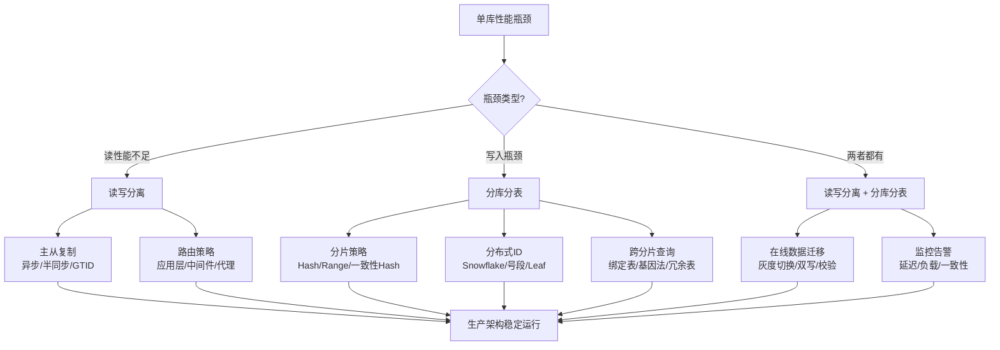
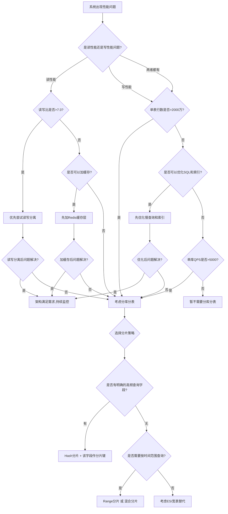

## 本章小结

读写分离与分库分表是数据库架构从单体走向分布式的必经之路。本章从主从复制原理出发，逐步讲解了读写分离的实现路径、分库分表的策略选择、分布式ID的生成方案、跨分片查询的优化技巧、在线数据迁移的工程实践，以及实施过程中最常踩的十余个陷阱。以下对全章知识体系做系统性的回顾和梳理，帮助读者形成完整的认知框架。

---

## 一、全章知识脉络总览

本章的知识体系可以概括为"一条主线、三层递进、四个支柱"：

**一条主线**：单库单表的性能瓶颈 → 水平扩展的需求 → 读写分离 → 分库分表 → 在线迁移

**三层递进**：

| 层次 | 核心问题 | 技术手段 | 解决的痛点 |
|------|---------|---------|-----------|
| 第一层 | 读请求远大于写请求，单库读性能不足 | 主从复制 + 读写分离 | 读吞吐量瓶颈 |
| 第二层 | 单表数据量过大，写入和查询都变慢 | 水平分表 + 分片路由 | 单表容量和写入瓶颈 |
| 第三层 | 数据分布在多个物理库，需要跨库整合 | 分布式ID + 在线迁移 | 分布式环境下的数据统一性 |

**四个支柱**：主从复制（数据冗余基础）、分片路由（数据分布规则）、分布式ID（全局唯一标识）、在线迁移（架构演进保障）



---

## 二、核心知识点回顾

### 2.1 主从复制——一切扩展的基础

主从复制是读写分离和分库分表的底层基石。理解三种复制模式的差异，是做出正确架构决策的前提。

**三种复制模式的本质区别**：

| 维度 | 异步复制 | 半同步复制 | 增强半同步(AFTER_SYNC) |
|------|---------|-----------|----------------------|
| 数据一致性 | 最终一致，主库宕机可丢数据 | 接近强一致，超时降级时可丢数据 | 几乎强一致，从库与主库一致 |
| 主库写入延迟 | 无额外开销 | +1个RTT(网络往返) | +1个RTT |
| 故障行为 | 从库可能缺数据 | 超时降级时从库可能缺数据 | 从库数据不会多于主库 |
| 适用场景 | 日志、报表等可容忍少量丢失 | 一般业务系统 | 金融、支付等高可靠场景 |

**关键要点**：

1. **半同步复制不是强一致**：从库确认的是"收到了binlog"，不是"完成了SQL重放"。即使半同步模式下，从库也可能有秒级甚至分钟级的延迟。
2. **增强半同步(AFTER_SYNC)解决了"幻读"问题**：普通半同步在存储引擎提交后才等待确认，如果主库在确认前宕机，从库可能多出一条已提交但主库未确认的事务。AFTER_SYNC在提交前等待确认，消除了这个窗口。
3. **GTID是生产必选项**：它让主从切换从"手动指定binlog文件名和位置"变为"自动定位未同步事务"，大幅降低运维风险。
4. **binlog格式选择Row**：Statement格式在非确定性函数（NOW()、RAND()）场景下会导致主从不一致，Row格式精确记录每行变更，是MySQL 5.7+的默认推荐。

### 2.2 读写分离——读扩展的第一步

读写分离将读请求路由到从库，写请求路由到主库，核心目的是分摊读压力。

**三种实现路径的选型**：

| 方案 | 代表技术 | 优势 | 劣势 | 适用场景 |
|------|---------|------|------|---------|
| 应用层路由 | Spring AOP + ThreadLocal | 无额外依赖、延迟最低 | 代码侵入、功能有限 | 中小团队、简单场景 |
| 中间件代理 | ShardingSphere-JDBC/Proxy、MyCat | 功能丰富、对应用透明 | 引入额外组件、调试复杂 | 中大型项目、标准化需求 |
| 数据库原生 | MySQL Router、ProxySQL | 运维简单、无代码改动 | 负载均衡策略有限 | 纯数据库层面扩展 |

**读写分离的核心挑战——主从延迟**：

主从延迟是读写分离最大的隐形杀手。以下场景会导致延迟飙升：

| 场景 | 延迟量级 | 持续时间 | 业务影响 |
|------|---------|---------|---------|
| 大事务(百万行批量UPDATE) | 分钟级 | 大事务执行期间 | 用户刚写就读不到 |
| DDL操作(ALTER TABLE) | 数十分钟 | DDL执行期间 | 表结构变更期间读异常 |
| 从库单线程回放 | 比主库慢3-10倍 | 持续性 | 高并发下延迟累积 |
| 网络带宽不足 | 秒级到分钟级 | 网络拥塞期间 | 整体读性能下降 |

**应对主从延迟的工程方案**：

1. **延迟感知路由**：监控`Seconds_Behind_Master`，超过阈值（如5秒）时自动将写后读路由到主库
2. **GTID等待机制**：写操作后获取主库GTID位置，从库读取前等待同步到该位置（设置超时）
3. **关键操作强制走主库**：支付回调、注册登录、库存查询等对一致性敏感的场景直接读主库
4. **事务内统一走主库**：任何在@Transactional内的读操作都必须走主库，否则会破坏事务隔离性

### 2.3 分库分表策略——写扩展的核心手段

当单表数据量超过2000万行、单库写入QPS超过5000时，读写分离已不足以解决问题，需要引入分库分表。

**垂直分库 vs 水平分表**：

| 维度 | 垂直分库 | 水平分表 |
|------|---------|---------|
| 拆分依据 | 业务领域(用户库/订单库/商品库) | 数据行(user_id % 4) |
| 解决的问题 | 业务耦合、单库连接数不足 | 单表容量、写入吞吐 |
| 引入的新问题 | 跨库事务、跨库JOIN | 跨分片查询、分布式ID |
| 适用时机 | 微服务拆分、业务边界清晰 | 单表数据量过大 |

**四种水平分片策略的选型**：

| 策略 | 数据分布 | 范围查询 | 扩容难度 | 迁移量 | 典型场景 |
|------|---------|---------|---------|-------|---------|
| Range分片 | 可能不均匀(写热点) | 高效(单分片) | 低(加新分片) | 最小 | 日志归档、时间序列 |
| Hash分片 | 均匀 | 需广播所有分片 | 高(全部rehash) | 大量 | 通用业务、高并发写 |
| 一致性Hash | 均匀 | 需广播所有分片 | 中(仅迁移相邻) | 小量 | 频繁扩缩容场景 |
| 目录分片 | 灵活可控 | 取决于规则 | 低(更新映射表) | 视情况 | 分片规则复杂场景 |

**分片键选择是成败关键**：

分片键必须是**最高频查询条件中的字段**。选错分片键会导致几乎所有的查询都变成跨分片扇出，分片形同虚设。

选择决策流程：
1. 统计业务中各类查询的WHERE条件字段出现频率
2. 如果某个字段在>70%的查询中出现 → 该字段作为分片键
3. 如果没有这样的字段 → 考虑绑定表(两个表用相同分片键)或基因法(在ID中嵌入分片基因)
4. 如果都不适用 → 考虑不分库分表，转而使用ES/宽表/缓存等替代方案

**绑定表(Binding Table)**：将经常JOIN的两张表设置相同的分片键，使同一键值的数据落在同一分片上，避免跨分片JOIN。例如`t_order`和`t_order_item`都以`user_id`为分片键。

**基因法(Sharding Gene)**：当需要同时支持按不同维度查询时，在ID中嵌入"基因"。例如订单ID的低4位嵌入user_id的低4位，这样按order_id和user_id计算分片时都能定位到同一分片。

### 2.4 分布式ID生成——全局唯一的保障

分库分表后，数据库自增ID不再全局唯一，需要分布式ID生成方案。

**三大主流方案对比**：

| 方案 | 原理 | 优点 | 缺点 | 适用场景 |
|------|------|------|------|---------|
| UUID | 128位随机值 | 简单、无需协调 | 无序、索引性能差、存储大 | 非主键场景(关联ID) |
| Snowflake | 时间戳+机器ID+序列号 | 有序、高性能、存储紧凑 | 依赖时钟、时钟回拨问题 | 通用主键场景 |
| 号段模式 | 数据库预分配号段 | 简单可靠、无时钟依赖 | 依赖数据库、号段用完需重新分配 | 中等规模、可接受DB依赖 |

**Snowflake的核心问题及时钟回拨处理**：

Snowflake算法依赖系统时钟。如果发生时钟回拨（如NTP校时），可能生成重复ID。工程上的处理方案：

1. **短暂回拨（<5ms）**：等待时钟追上
2. **中等回拨（5ms-100ms）**：使用上一次的时间戳，递增序列号
3. **大幅回拨（>100ms）**：拒绝生成ID，抛出异常并告警

美团Leaf方案进一步优化了Snowflake：通过ZooKeeper管理Worker ID分配，支持号段模式和Snowflake模式双模式切换，通过双Buffer预加载号段降低DB访问频率。

### 2.5 跨分片查询——分库分表的阿喀琉斯之踵

分库分表后，不带分片键的查询需要扇出到所有分片再聚合结果，性能急剧下降。

**常见跨分片查询问题及解决方案**：

| 问题类型 | 典型场景 | 解决方案 |
|---------|---------|---------|
| 跨分片分页 | 查询第10页订单列表 | 限制深度分页(最多翻到第100页) + 流式返回 |
| 跨分片排序 | 按创建时间全局排序 | 各分片取TOP N后归并排序；或使用ES/ClickHouse |
| 跨分片聚合 | 统计全平台GMV | 异步任务分片查询 + 结果聚合；或预计算宽表 |
| 跨分片JOIN | 订单+商品信息查询 | 绑定表(相同分片键)；或冗余字段到订单表 |
| 跨分片唯一约束 | 用户名全局唯一 | 全局唯一索引服务(Redis SETNX)；或业务层面保证 |

**跨分片分页的优化实践**：

```sql
-- ❌ 低效方式：每个分片都取 OFFSET + LIMIT 行再丢弃
SELECT * FROM t_order_0 UNION ALL SELECT * FROM t_order_1 ...
ORDER BY create_time DESC LIMIT 10 OFFSET 10000;

-- ✅ 优化方式1：禁止深度分页，使用游标分页
-- 上一页最后一条记录的create_time作为游标
SELECT * FROM t_order_0 WHERE create_time < '2024-01-15 10:30:00'
ORDER BY create_time DESC LIMIT 10;
-- ... 对所有分片执行后归并取前10

-- ✅ 优化方式2：各分片先取LIMIT (OFFSET+LIMIT)再应用层聚合
-- 减少网络传输量和聚合数据量
```

### 2.6 在线数据迁移——架构演进的生命线

分库分表不是一次性工程，随着业务增长，可能需要从4个分片扩容到16个、32个甚至更多。在线数据迁移的核心挑战是**不停机完成数据重新分布**。

**灰度迁移的四阶段流程**：

| 阶段 | 操作 | 数据一致性 | 回滚难度 | 耗时占比 |
|------|------|-----------|---------|---------|
| 第一阶段：双写 | 新旧库同时写入 | 强一致 | 低(停新库写) | 5-10% |
| 第二阶段：存量同步 | 全量数据从旧库迁移到新库 | 增量追平后一致 | 中(需反向同步) | 60-70% |
| 第三阶段：灰度切读 | 部分流量切到新库读取 | 最终一致 | 低(切回旧库) | 10-15% |
| 第四阶段：全量切换 | 全部流量切到新库 | 最终一致 | 高(需回滚脚本) | 5-10% |

**迁移中的数据校验**：

数据校验是迁移成功的最终保障。常见的校验方式：

1. **全量对账**：对新旧库执行相同SQL，逐行对比结果（适用于小表）
2. **抽样校验**：随机抽取1%-5%的数据进行对比（适用于大表）
3. **CRC32校验**：对每行数据计算CRC32校验和，对比新旧库的校验和（适用于超大表）
4. **业务层面校验**：通过业务逻辑验证数据正确性（如订单金额汇总对比）

---

## 三、关键技术决策框架

在实际项目中，读写分离与分库分表的实施涉及大量技术决策。以下提供一个系统化的决策框架，帮助读者根据自身场景做出正确选择。

### 3.1 是否需要分库分表的判断流程



**核心原则：先优化，再拆分**。分库分表会引入跨分片查询、分布式事务、全局唯一约束失效、运维复杂度飙升等一系列新问题。只有当以下条件至少满足一个时，才考虑分库分表：

- 单表数据量超过2000万行且SQL优化空间已耗尽
- 单库写入QPS超过5000且无法通过读写分离解决
- 单库连接数达到上限（MySQL默认151）且无法通过连接池优化

### 3.2 中间件选型决策

| 考量维度 | ShardingSphere-JDBC | ShardingSphere-Proxy | MyCat | Vitess |
|---------|---------------------|---------------------|-------|--------|
| 部署方式 | 嵌入应用进程 | 独立代理进程 | 独立代理进程 | 独立代理进程 |
| 语言支持 | Java | 语言无关 | 语言无关 | 语言无关 |
| 功能丰富度 | 高(读写分片/分布式事务/数据加密) | 高 | 中 | 高(YouTube级验证) |
| 性能开销 | 最低(进程内) | 中(网络跳转) | 中 | 中 |
| 社区活跃度 | 高(Apache顶级项目) | 高 | 中(维护减缓) | 高(CNCF项目) |
| 学习成本 | 中 | 中 | 低 | 高 |
| 适用场景 | Java技术栈首选 | 多语言/需要代理模式 | 轻量级快速验证 | 大规模分布式 |

### 3.3 分布式事务方案选型

分库分表后，跨库操作无法使用本地事务。以下是分布式事务方案的选型指南：

| 方案 | 一致性 | 性能 | 复杂度 | 适用场景 |
|------|-------|------|-------|---------|
| XA两阶段提交 | 强一致 | 低(锁持有时间长) | 中 | 强一致要求、短事务 |
| Seata AT模式 | 最终一致 | 中 | 低 | 微服务场景、中等事务 |
| TCC | 最终一致 | 高 | 高(需手写Try/Confirm/Cancel) | 高性能要求、可控资源 |
| Saga | 最终一致 | 高 | 中 | 长事务、可补偿操作 |
| 消息最终一致 | 最终一致 | 最高 | 中 | 异步场景、可接受短暂不一致 |

---

## 四、生产环境核心公式与模型

### 4.1 性能评估公式

| 公式 | 含义 | 用途 |
|------|------|------|
| QPS = 并发数 / 平均响应时间 | Little定律，请求吞吐量 | 容量规划、性能压测基准 |
| SLA = 正常运行时间 / 总时间 | 服务可用性比例 | 可用性目标设定 |
| P99延迟 = 排序后第99百分位值 | 尾延迟指标，反映用户体验 | 性能监控、异常检测 |
| 需要的从库数 = 读QPS / 单从库承载QPS | 读扩展所需实例数 | 读写分离架构规划 |
| 分片数 = 预估最大行数 / 单表推荐行数 | 分库分表规划 | 分片数量决策 |
| 数据迁移时间 ≈ 数据总量 / 网络带宽 + 增量追平时间 | 在线迁移工期估算 | 迁移方案排期 |

### 4.2 关键阈值参考

| 指标 | 无需分库分表 | 建议读写分离 | 建议分库分表 | 建议分库+分表 |
|------|------------|-------------|-------------|-------------|
| 单表行数 | <500万 | 500万-2000万 | 2000万-1亿 | >1亿 |
| 单库写QPS | <1000 | 1000-5000 | 5000-20000 | >20000 |
| 单库读QPS | <5000 | 5000-50000 | >50000 | >100000 |
| 主从延迟(P99) | N/A | <100ms | <500ms | <1s |

### 4.3 延迟分级响应模型

| 延迟级别 | 阈值 | 响应措施 | 影响范围 |
|---------|------|---------|---------|
| 正常 | P99 < 100ms | 正常读写分离路由 | 无 |
| 关注 | 100ms ≤ P99 < 1s | 减少从库负载、检查慢查询 | 读操作延迟增加 |
| 告警 | 1s ≤ P99 < 5s | 写后读强制走主库 | 部分读操作受限 |
| 严重 | 5s ≤ P99 < 30s | 所有读走主库、触发扩容评估 | 读写分离降级为单库模式 |
| 紧急 | P99 ≥ 30s | 全量走主库、紧急运维介入 | 从库可能完全不可用 |

---

## 五、最佳实践清单

### 5.1 架构设计阶段

| 序号 | 检查项 | 说明 | 优先级 |
|------|--------|------|-------|
| 1 | 评估是否真的需要分库分表 | 先做SQL优化、索引优化、缓存、读写分离，最后才考虑分库分表 | P0 |
| 2 | 明确性能指标要求 | 量化读写QPS、延迟P99、可用性SLA目标 | P0 |
| 3 | 选择合适的分片键 | 基于查询模式分析，分片键必须覆盖>70%的查询场景 | P0 |
| 4 | 规划分片数量 | 基于当前+3年预估数据量，预留2-3倍空间但不过度 | P0 |
| 5 | 设计分布式ID方案 | Snowflake/号段模式，处理好时钟回拨 | P1 |
| 6 | 设计分布式事务方案 | 根据一致性要求选择XA/Seata/TCC/Saga | P1 |
| 7 | 设计容错和降级方案 | 主从延迟超阈值时的自动降级策略 | P1 |
| 8 | 规划数据迁移路径 | 明确灰度迁移的四个阶段和回滚方案 | P1 |
| 9 | 制定监控告警策略 | 延迟监控、负载监控、一致性校验 | P1 |

### 5.2 实现阶段

| 序号 | 检查项 | 说明 | 优先级 |
|------|--------|------|-------|
| 1 | 事务内读操作统一走主库 | 任何在@Transactional内的读操作必须路由到主库 | P0 |
| 2 | 关键业务操作强制读主库 | 支付回调、注册登录、库存查询等对一致性敏感的场景 | P0 |
| 3 | 缓存更新采用延迟双删 | Cache Aside Pattern + 延迟二次删除，防止主从延迟导致缓存脏数据 | P0 |
| 4 | 实现延迟感知路由 | 监控Seconds_Behind_Master，超阈值自动调整路由策略 | P1 |
| 5 | 跨分片分页使用游标方式 | 禁止深度OFFSET分页，改用基于游标的增量查询 | P1 |
| 6 | 绑定表使用相同分片键 | 需要JOIN的表必须使用相同的分片键，避免跨分片JOIN | P1 |
| 7 | 分布式ID预留足够位数 | Snowflake方案确保序列号位数满足峰值QPS需求 | P2 |
| 8 | 从库开启read_only+super_read_only | 防止误写从库导致数据不一致 | P2 |

### 5.3 部署上线阶段

| 序号 | 检查项 | 说明 | 优先级 |
|------|--------|------|-------|
| 1 | 配置监控和告警 | 主从延迟、各分片负载、连接池使用率、慢查询数量 | P0 |
| 2 | 压力测试验证容量 | 模拟线上流量的1.5倍进行压测，验证架构是否满足要求 | P0 |
| 3 | 制定回滚方案 | 灰度切换前必须有完整的回滚脚本和验证步骤 | P0 |
| 4 | 配置半同步复制 | 设置rpl_semi_sync_master_timeout为1000ms以上 | P1 |
| 5 | 配置GTID复制 | 启用gtid_mode=ON，简化后续故障切换 | P1 |
| 6 | binlog格式设为Row | 保证主从复制的精确性，支持Canal等数据订阅 | P1 |

### 5.4 运维监控阶段

| 序号 | 检查项 | 说明 | 优先级 |
|------|--------|------|-------|
| 1 | 持续监控主从延迟 | P99延迟超1s触发告警，超5s触发降级 | P0 |
| 2 | 定期做数据一致性校验 | 使用pt-table-checksum或自研校验工具 | P0 |
| 3 | 监控各分片负载均衡度 | 防止出现数据倾斜导致个别分片过载 | P1 |
| 4 | 分析慢查询趋势 | 定期review慢查询日志，及时优化新增的慢SQL | P1 |
| 5 | 评估扩容时机 | 单分片磁盘使用率>70%或QPS接近上限时启动扩容 | P1 |
| 6 | 备份策略覆盖所有分片 | 每个分片都需要独立备份，定期验证恢复流程 | P2 |

---

## 六、常见误区速查表

| 误区 | 根本原因 | 正确做法 |
|------|---------|---------|
| 过早拆分 | 误以为性能问题只能靠分库分表解决 | 按"SQL优化→索引→缓存→读写分离→分库分表"顺序逐步排查 |
| 盲目追求分片数 | 用远期愿景倒推当前架构 | 基于当前+3年预估，初期4-16个物理分片，通过虚拟节点扩容 |
| 误判一致性级别 | 以为半同步复制=强一致 | 半同步只降低丢数据风险，读己之写需应用层特殊处理 |
| 忽视复制延迟 | 默认主从实时同步 | 建立延迟监控+自动降级机制，关键操作强制读主库 |
| 事务内读写路由混乱 | 在同一事务中混合使用主从库 | 事务内所有操作统一走主库 |
| 缓存与DB不一致 | 先更新数据库再更新缓存 | 采用Cache Aside Pattern + 延迟双删 |
| 分片键选错 | 选择均匀但低频查询的字段 | 基于查询模式分析，选最高频WHERE条件字段 |
| 跨分片分页用OFFSET | 对所有分片取OFFSET行再丢弃 | 改用游标分页或限制最大翻页数 |
| UUID做主键 | 追求简单 | UUID无序且占用36字节，Snowflake仅8字节且有序 |
| 只看性能不看一致性 | 压测通过就上线 | 必须做数据一致性校验，定期对账 |

---

## 七、核心知识点速记卡

为帮助读者快速回顾本章关键内容，以下以"一问一答"形式整理核心速记卡：

**Q1：读写分离和分库分表的区别是什么？**
读写分离是把读操作和写操作分散到不同的数据库实例上，解决的是读性能瓶颈。分库分表是把一个表的数据拆分到多个库或多个表中，解决的是单表容量和写入瓶颈。两者可以独立使用，也可以组合使用。

**Q2：主从延迟是不可避免的，如何在工程上处理？**
四层防线：①应用层延迟感知路由（监控Seconds_Behind_Master）；②写后读使用GTID等待机制；③关键业务操作强制走主库；④事务内所有读操作统一走主库。

**Q3：如何选择分片键？**
统计业务中各类查询的WHERE条件字段出现频率，选择在>70%查询中出现的字段。如果没有这样的字段，考虑绑定表(同分片键)或基因法(在ID中嵌入分片基因)。分片键选错的代价极高，需要在项目初期慎重决策。

**Q4：一致性Hash相比普通Hash的优势是什么？**
普通Hash在扩容（增加分片数）时需要对所有数据重新rehash，迁移量巨大。一致性Hash在增删节点时只影响相邻节点的数据，迁移量大幅减少。通过虚拟节点可以保证数据分布均匀。

**Q5：Snowflake ID的时钟回拨如何处理？**
短暂回拨(<5ms)等待时钟追上；中等回拨(5-100ms)使用上一次时间戳+递增序列号；大幅回拨(>100ms)拒绝生成ID并告警。美团Leaf方案通过ZooKeeper管理Worker ID，支持号段模式和Snowflake模式双模式切换。

**Q6：在线数据迁移的核心步骤是什么？**
四阶段：①双写(新旧库同时写入)→②存量同步(全量迁移+增量追平)→③灰度切读(部分流量验证)→④全量切换(全部流量迁移)。每个阶段都要有数据校验和回滚方案。

**Q7：什么时候应该考虑分库分表？**
满足以下任一条件：单表行数>2000万且SQL优化空间耗尽；单库写QPS>5000且读写分离无法解决；单库连接数达上限。在此之前，应优先投入SQL优化、索引优化、缓存和读写分离。

**Q8：跨分片查询有哪些优化手段？**
①绑定表避免跨分片JOIN；②游标分页替代OFFSET分页；③各分片取TOP N后归并排序；④异步任务分片查询+结果聚合；⑤使用ES/ClickHouse等OLAP引擎处理复杂分析查询。

---

## 八、下一步学习建议

### 8.1 深入方向

1. **MySQL源码阅读**：重点阅读replication模块（sql/rpl_master.cc、sql/rpl_slave.cc），理解复制的内部实现。通过源码可以深入理解半同步复制的确认机制、GTID的生成和传播逻辑、并行复制的实现原理。

2. **ShardingSphere源码阅读**：从shardingsphere-route模块入手，理解SQL解析→路由→改写→执行→结果归并的完整流程。重点关注分布式事务（XA和Seata）的集成方式。

3. **分布式系统经典论文**：阅读Google的Spanner论文（TrueTime机制）、Amazon的Dynamo论文（一致性Hash和Quorum机制）、CockroachDB论文（分布式SQL的实现），从学术层面理解分布式数据库的设计哲学。

4. **CAP理论和PACELC理论的深入理解**：不仅仅是知道"三选二"，而是理解在网络分区(P)不可避免时，系统在可用性(A)和一致性(C)之间如何做出权衡，以及在正常运行时(E)如何在延迟(L)和一致性(C)之间权衡。

### 8.2 推荐资源

**书籍**：
- 《MySQL技术内幕：InnoDB存储引擎》——理解底层存储引擎是优化数据库的基础
- 《高性能MySQL（第4版）》——MySQL优化的权威指南，覆盖索引、查询优化、服务器配置
- 《数据密集型应用系统设计》——分布式系统设计的圣经，深入理解复制、分区、一致性
- 《ShardingSphere实战》——读写分离和分库分表的实战指南

**开源项目**：
- Apache ShardingSphere——Java生态最成熟的分库分表中间件
- Vitess——YouTube开源的分布式MySQL解决方案，CNCF毕业项目
- ProxySQL——高性能MySQL代理，支持读写分离和查询路由
- Canal——基于binlog的增量订阅和消费组件，用于数据同步

**在线资源**：
- MySQL官方文档：Replication（https://dev.mysql.com/doc/refman/8.0/en/replication.html）
- ShardingSphere官方文档：https://shardingsphere.apache.org/document/current/
- Percona Toolkit文档：pt-table-checksum、pt-online-schema-change等运维工具

### 8.3 实践建议

1. **从小规模开始**：先用Docker搭建一主两从环境，亲手体验主从复制和读写分离。不要一开始就规划大规模分片。

2. **先模拟，再上线**：在测试环境中模拟线上数据量（如1000万行订单数据），测试分片路由的正确性和数据分布均匀性，验证跨分片查询的性能。

3. **先备份，再迁移**：任何数据迁移操作前，必须做完整备份。灰度迁移的每个阶段都要验证数据一致性和业务正确性。

4. **先监控，再优化**：部署后首先完善监控体系，通过真实数据驱动优化决策，而不是凭经验猜测。

---

## 九、本章核心思维模型

### 9.1 数据库扩展的"洋葱模型"

```mermaid
graph LR
    subgraph 最外层：架构选型
        A1[单库] -->|读瓶颈| B1[读写分离]
        B1 -->|写瓶颈| C1[分库分表]
        C1 -->|更复杂| D1[NewSQL分布式数据库]
    end
    
    subgraph 中间层：技术手段
        A2[索引优化] --> B2[缓存加速]
        B2 --> C2[主从复制]
        C2 --> D2[分片路由]
        D2 --> E2[分布式事务]
    end
    
    subgraph 最内层：核心原则
        F1[先优化，再拆分]
        F2[简单优于复杂]
        F3[监控驱动决策]
        F4[可回滚性优先]
    end
```

每一层扩展都会引入新的复杂度。最优策略是：在当前架构能解决问题的前提下，选择复杂度最低的方案。只有当低复杂度方案确实无法满足需求时，才向更外层推进。

### 9.2 架构决策的"黄金三问"

在面对数据库架构问题时，先问自己三个问题：

1. **问题的根因是什么？** 是慢查询？索引缺失？缓存不足？还是真的数据量太大？用数据说话，不要凭感觉。

2. **最小侵入的解决方案是什么？** SQL优化>索引>缓存>读写分离>垂直分库>水平分表。每一步都比下一步简单一个数量级。

3. **这个方案能否回滚？** 任何架构变更都要有回滚方案。在线迁移必须支持灰度切换和数据校验，确保在发现问题时能快速恢复。

---

## 十、总结

本章系统性地构建了从单库到分布式数据库架构的完整知识体系。核心要点：

1. **主从复制是基础**：增强半同步(AFTER_SYNC) + GTID是生产推荐配置，Row格式binlog是保证复制精确性的前提。

2. **读写分离是第一步**：通过中间件(ShardingSphere)或应用层路由实现，但必须处理好主从延迟问题——延迟感知路由、关键操作读主库、事务内统一走主库是三道防线。

3. **分库分表需谨慎**：先优化再拆分，分片键选择是成败关键，绑定表和基因法是应对多维度查询的有效手段。

4. **分布式ID有取舍**：Snowflake性能最优但依赖时钟，号段模式最稳定但依赖数据库，根据场景选择。

5. **在线迁移必须灰度**：双写→存量同步→灰度切读→全量切换，每个阶段都有数据校验和回滚机制。

6. **监控是生命线**：延迟监控、负载监控、一致性校验三位一体，数据驱动一切决策。

读写分离与分库分表不是银弹，它们是解决特定问题的特定工具。真正的技术功力不在于"会用"这些技术，而在于"知道什么时候用"和"知道什么时候不用"。
