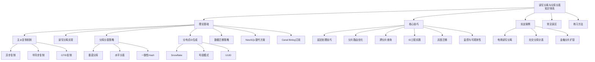
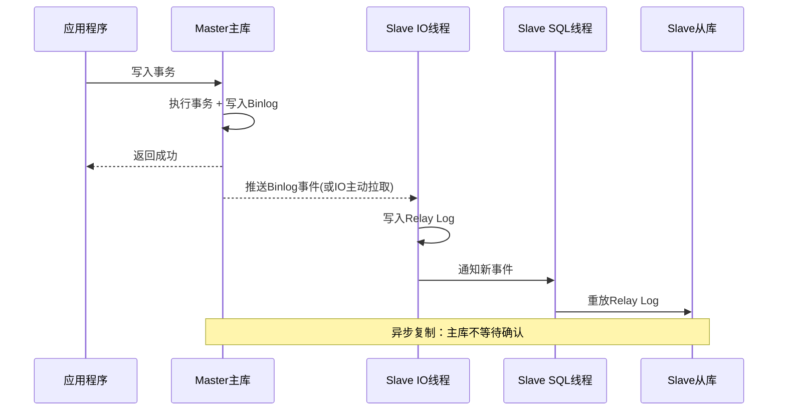
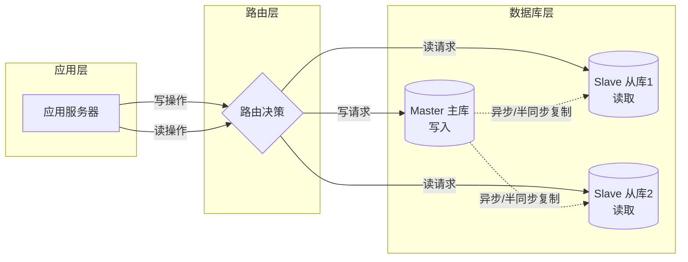
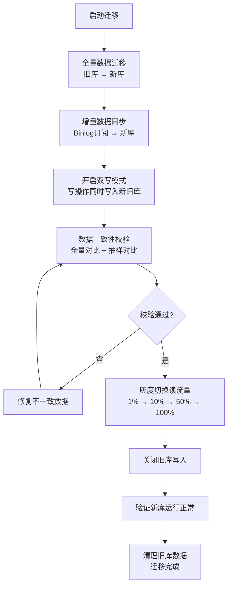
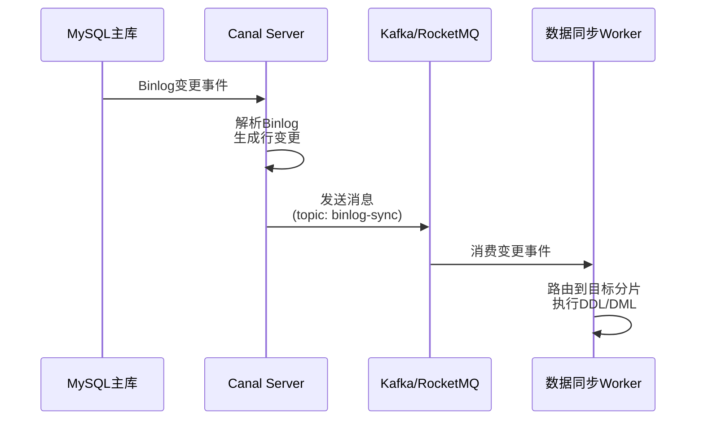

# 第51章 读写分离与分库分表

***

## 章节定位

当单库单表无法承载日益增长的业务数据量和并发访问量时，数据库层面的水平扩展成为必然选择。本章系统讲解从读写分离到分库分表的完整技术体系，帮助读者掌握数据库扩展的核心方法论。

本章系统阐述读写分离与分库分表从理论到实践的完整知识体系：

- **理论基础**：主从复制机制（异步/半同步/GTID）、读写分离实现路径、分库分表策略（垂直分库/水平分片/一致性Hash）、分布式ID生成算法、数据迁移方法论
- **核心技巧**：主从延迟处理、分片路由优化、跨分片查询与排序分页、分布式ID工程实践、灰度迁移与回滚
- **实战案例**：电商平台读写分离改造、社交平台分库分表实践、金融系统分片扩容
- **常见误区**：纠正"读写分离解决一切""过早分库分表""忽略分布式事务"等六大典型认知偏差
- **练习方法**：从搭建主从复制到模拟数据迁移的渐进式动手实践

通过本章学习，读者将能够理解数据库扩展的设计哲学，掌握核心设计模式和实施方法，并具备在实际项目中规划和落地读写分离与分库分表方案的能力。



***
## 学习目标

1. 理解主从复制的原理和数据一致性保障机制
2. 掌握读写分离架构的设计与实现方法
3. 能够根据业务特征选择合适的分库分表策略
4. 掌握分布式ID生成的核心算法与工程实现
5. 了解数据迁移与在线扩容的关键技术

***

## 前置知识

- MySQL存储引擎与事务机制
- SQL优化与索引原理
- 分布式系统基础概念


***

# 51.1 理论基础：读写分离与分库分表的核心原理

***

## 一、主从复制机制

主从复制是读写分离的基础，它允许数据从一个主库（Master）自动复制到一个或多个从库（Slave），从而实现数据的冗余存储和读扩展。理解主从复制的原理对于正确设计读写分离架构至关重要。



### 1.1 复制模式对比

异步复制是MySQL默认的复制模式。主库在执行完事务后，将变更写入binlog，然后立即返回客户端，不等待从库确认。从库的IO线程异步拉取主库的binlog并写入relay log，SQL线程再重放relay log中的事件。

异步复制的流程可以简化为以下步骤：主库执行事务并写入binlog、主库通知从库有新事件、从库IO线程拉取binlog写入relay log、从库SQL线程重放relay log、从库完成数据变更。由于主库不等待从库确认，异步复制对主库性能的影响最小，但在主库宕机时可能导致数据丢失。

从复制的视角来看，异步复制存在一个关键的时间窗口——从主库写入binlog到从库完成重放之间的时间差。在这个窗口内，如果主库发生故障，尚未同步到从库的数据将会丢失。这个数据丢失的时间窗口正是同步复制试图消除的。

异步复制的优点在于其对主库性能几乎无影响，即使从库出现网络延迟或故障，主库的写入性能也不会受到影响。这种模式非常适合读多写少且可以容忍少量数据丢失的场景，比如报表查询、日志分析等。

### 1.2 半同步复制（Semi-Synchronous Replication）

半同步复制在异步复制的基础上增加了确认机制。主库在提交事务时，不仅需要将binlog写入本地文件，还需要等待至少一个从库确认已经接收并写入了relay log，才返回客户端。MySQL 5.7引入的增强半同步复制（AFTER_SYNC）进一步优化了这一过程——主库在存储引擎提交之前等待从库确认，从而避免了数据不一致的问题。

半同步复制通过减少数据丢失的风险来提高数据安全性，但代价是增加了一定的写入延迟。这个延迟取决于网络往返时间（RTT）和从库的处理能力。在生产环境中，通常需要设置超时时间（rpl_semi_sync_master_timeout），当超时后自动降级为异步复制，以保证主库的可用性。

从一致性的角度来看，半同步复制并不能保证强一致性，因为从库只是确认收到了binlog，并没有确认完成了重放。但在增强半同步模式下，它可以保证数据不会在主从之间出现不一致——要么所有副本都有这条数据，要么都没有。

### 1.3 基于GTID的复制

GTID（Global Transaction Identifier）是MySQL 5.6引入的全局事务标识符，格式为server_uuid:transaction_id。每个事务在集群中都有唯一的GTID标识，使得从库可以精确地知道自己已经执行了哪些事务、还需要执行哪些事务。

GTID复制的核心优势在于简化了故障切换和主从切换的流程。在传统复制模式下，切换主库时需要手动指定binlog文件名和位置，操作复杂且容易出错。而使用GTID，从库可以自动找到未执行的事务并完成同步，大大简化了运维操作。

GTID的启用方式如下：

```sql
-- 主库配置
[mysqld]
gtid_mode=ON
enforce_gtid_consistency=ON
log_bin=mysql-bin
server_id=1

-- 从库配置
[mysqld]
gtid_mode=ON
enforce_gtid_consistency=ON
server_id=2
relay_log=relay-log
```

启用GTID后，建立主从关系变得非常简洁：

```sql
-- 在从库上执行
CHANGE MASTER TO
    MASTER_HOST='192.168.1.100',
    MASTER_USER='repl',
    MASTER_PASSWORD='password',
    MASTER_AUTO_POSITION=1;

START SLAVE;
```

GTID还支持多源复制（Multi-Source Replication），允许一个从库同时从多个主库复制数据。这在数据汇聚场景中非常有用，比如将多个分片的数据汇聚到一个分析库中。

### 1.4 Binlog格式

MySQL的binlog有三种格式，每种格式在复制的精确性和性能之间有不同的权衡：

Statement格式记录的是SQL语句本身。它的优点是日志量小，因为只记录SQL语句而不是数据变更。但它的缺点是某些函数（如NOW()、RAND()、UUID()）在主从上执行可能产生不同的结果，导致主从数据不一致。

Row格式记录的是每一行数据的变更前后的值。它能精确地复制数据变更，避免了Statement格式的问题。但缺点是日志量大，特别是批量更新操作时。Row格式是MySQL 5.7以后的默认格式，也是生产环境推荐的格式。

Mixed格式是前两者的混合，MySQL会根据SQL语句自动选择使用Statement还是Row格式。对于确定性的语句使用Statement格式，对于不确定性的语句自动切换到Row格式。

```sql
-- 查看当前binlog格式
SHOW VARIABLES LIKE 'binlog_format';

-- 设置binlog格式（需要SUPER权限）
SET GLOBAL binlog_format = 'ROW';

-- 查看binlog内容
SHOW BINARY LOGS;
SHOW BINLOG EVENTS IN 'mysql-bin.000001' LIMIT 10;
```

### 1.5 三种复制模式对比

| 特性 | 异步复制 | 半同步复制 | 增强半同步(AFTER_SYNC) |
|------|---------|-----------|----------------------|
| 数据安全性 | 可能丢数据 | 丢数据概率低 | 几乎不丢数据 |
| 主库写入延迟 | 无额外延迟 | 增加1个RTT | 增加1个RTT |
| 故障时行为 | 从库可能缺数据 | 从库可能缺数据(超时降级时) | 从库与主库一致 |
| 对主库性能影响 | 几乎无 | 中等 | 中等 |
| 是否需要GTID | 可选 | 可选 | 推荐 |
| 生产推荐度 | 低(仅日志类) | 中 | 高 |

> **生产建议**：推荐使用增强半同步复制（AFTER_SYNC模式）配合GTID。AFTER_SYNC在存储引擎提交之前等待从库确认，确保主库宕机后从库数据不会"凭空多出"。设置 `rpl_semi_sync_master_timeout` 为1000ms以上，避免网络抖动导致频繁降级为异步。

### 1.6 Binlog格式对比

| 格式 | 记录内容 | 日志量 | 精确性 | 非确定性函数 | 生产推荐 |
|------|---------|-------|--------|-------------|---------|
| Statement | SQL语句本身 | 最小 | 低 | 可能不一致 | 不推荐 |
| Row | 行变更前后的值 | 最大 | 高 | 完全一致 | 推荐 |
| Mixed | 自动选择 | 中等 | 中等 | 自动处理 | 可选 |

> **生产建议**：MySQL 5.7+ 默认使用Row格式。在binlog订阅（如Canal）场景下，Row格式是必须的——只有Row格式才能精确解析出每行数据的变更内容。如果磁盘空间有限且写入量巨大，可以在确认SQL不包含非确定性函数的前提下使用Statement格式节省存储。

***

## 二、读写分离实现

读写分离是将数据库的读操作和写操作分散到不同的数据库实例上执行的技术。读写分离的核心架构如下：



读写分离有三种主要实现路径：

| 实现方式 | 典型方案 | 侵入性 | 功能丰富度 | 性能开销 | 适用场景 |
|---------|---------|--------|-----------|---------|---------|
| 应用层路由 | Spring AOP + ThreadLocal | 高(代码侵入) | 灵活可控 | 低 | 中小团队、简单场景 |
| 中间件代理 | ShardingSphere/JDBC、MyCat | 低(对应用透明) | 丰富(负载均衡/延迟感知) | 中 | 中大型项目、标准化 |
| 数据库原生 | MySQL Router、ProxySQL | 极低 | 基础 | 低 | 纯数据库层面、运维驱动 |

### 2.1 应用层实现

最简单的读写分离是在应用层通过代码手动路由读写请求。这种方式不依赖任何中间件，实现简单直接，但对应用代码有侵入性。

以Java Spring应用为例，可以通过自定义注解和AOP实现声明式的读写分离：

```java
// 定义数据源注解
@Target({ElementType.METHOD, ElementType.TYPE})
@Retention(RetentionPolicy.RUNTIME)
public @interface ReadOnly {
}

// 数据源路由
public class DynamicDataSource extends AbstractRoutingDataSource {
    private static final ThreadLocal<DataSourceType> CONTEXT = 
        new ThreadLocal<>();
    
    public static void setRead() {
        CONTEXT.set(DataSourceType.READ);
    }
    
    public static void setWrite() {
        CONTEXT.set(DataSourceType.WRITE);
    }
    
    public static void clear() {
        CONTEXT.remove();
    }
    
    @Override
    protected Object determineCurrentLookupKey() {
        return CONTEXT.get();
    }
}

// AOP切面
@Aspect
@Component
public class DataSourceAspect {
    
    @Before("@annotation(readOnly)")
    public void switchToRead(ReadOnly readOnly) {
        DynamicDataSource.setRead();
    }
    
    @Before("@annotation(transactional)")
    public void switchToWrite(Transactional transactional) {
        DynamicDataSource.setWrite();
    }
    
    @After("@annotation(readOnly) || @annotation(transactional)")
    public void restore(JoinPoint point) {
        DynamicDataSource.clear();
    }
}
```

这种方式的问题在于：它要求开发者在每个方法上明确标注读写类型，容易遗漏或标注错误；对于同一个事务中既有读又有写的场景，处理起来也比较复杂。

### 2.2 ShardingSphere中间件方案

Apache ShardingSphere是一个成熟的分布式数据库中间件，它通过在应用和数据库之间添加一个代理层来实现读写分离。ShardingSphere支持两种部署模式：嵌入应用的JDBC模式和独立部署的Proxy模式。

使用ShardingSphere-JDBC的配置方式如下：

```yaml
# application.yml - ShardingSphere读写分离配置
spring:
  shardingsphere:
    datasource:
      names: master,slave0,slave1
      master:
        type: com.zaxxer.hikari.HikariDataSource
        driver-class-name: com.mysql.cj.jdbc.Driver
        jdbc-url: jdbc:mysql://master-host:3306/db
        username: root
        password: password
      slave0:
        type: com.zaxxer.hikari.HikariDataSource
        driver-class-name: com.mysql.cj.jdbc.Driver
        jdbc-url: jdbc:mysql://slave0-host:3306/db
        username: readonly
        password: password
      slave1:
        type: com.zaxxer.hikari.HikariDataSource
        driver-class-name: com.mysql.cj.jdbc.Driver
        jdbc-url: jdbc:mysql://slave1-host:3306/db
        username: readonly
        password: password
    rules:
      readwrite-splitting:
        data-sources:
          myds:
            write-data-source-name: master
            read-data-source-names: slave0,slave1
            load-balancer-name: round-robin
        load-balancers:
          round-robin:
            type: ROUND_ROBIN
```

ShardingSphere的读写分离策略支持多种负载均衡算法，包括轮询（ROUND_ROBIN）、随机（RANDOM）和权重（WEIGHT）。它还可以配置事务内的读请求路由策略——默认情况下，事务内的所有请求都路由到主库，以保证事务内读取到最新的数据。

### 2.3 读写分离的一致性问题

读写分离面临的核心挑战是主从复制延迟导致的读写不一致。用户刚刚写入数据，随即去从库读取，可能读到旧数据。这个问题被称为"读己之写"（Read Your Own Writes）问题。

常见的解决方案包括：

| 方案 | 实现方式 | 优点 | 缺点 |
|------|---------|------|------|
| 强制走主库 | 写后立即读路由到主库 | 简单可靠 | 增加主库读压力 |
| 延迟监控路由 | 监控Seconds_Behind_Master，超阈值路由主库 | 自动化 | 有监控粒度限制 |
| 版本号校验 | 读取时校验GTID或版本号 | 精确 | 实现复杂 |
| 缓存标记 | 写操作后设置短暂Redis标记 | 精准到用户级 | 依赖Redis可用性 |
| 半同步复制 | 等待至少一个从库确认收到binlog | 从库数据更新 | 增加写入延迟 |

更详细的实现代码和方案对比，请参见51.2核心技巧中的"主从复制延迟的处理技巧"一节。

### 2.4 数据库原生代理方案

ProxySQL和MySQL Router是数据库层面的原生代理方案。以ProxySQL为例，它支持连接池复用、查询路由、查询缓存、故障自动转移等能力。

```sql
-- ProxySQL管理接口配置读写分离规则
-- 添加MySQL服务器
INSERT INTO mysql_servers(hostgroup_id, hostname, port) VALUES 
(10, 'master-host', 3306),   -- 写组 hostgroup=10
(20, 'slave0-host', 3306),   -- 读组 hostgroup=20
(20, 'slave1-host', 3306);   -- 读组 hostgroup=20

-- 配置读写分离规则
INSERT INTO mysql_query_rules(rule_id, active, match_pattern, destination_hostgroup)
VALUES
(1, 1, '^SELECT .* FOR UPDATE$', 10),  -- SELECT FOR UPDATE走主库
(2, 1, '^SELECT', 20);                  -- 普通SELECT走从库

LOAD MYSQL SERVERS TO RUNTIME;
LOAD MYSQL QUERY RULES TO RUNTIME;
SAVE MYSQL SERVERS TO DISK;
SAVE MYSQL QUERY RULES TO DISK;
```

### 2.4 读写分离方案对比

| 对比维度 | 应用层路由 | ShardingSphere-JDBC | ShardingSphere-Proxy | ProxySQL | MySQL Router |
|---------|-----------|--------------------|--------------------|----------|-------------|
| 部署方式 | 代码内嵌 | 代码内嵌(JAR) | 独立进程 | 独立进程 | 独立进程 |
| 性能开销 | 最低 | 低(纳秒级拦截) | 中(网络跳转) | 中 | 低 |
| 语言依赖 | 强(Java) | Java为主 | 无(协议代理) | 无 | 无 |
| 功能丰富度 | 低 | 高(分片+读写分离) | 高 | 中 | 基础 |
| 运维成本 | 低 | 低 | 中 | 中 | 低 |
| 故障隔离 | 差(应用内) | 差(应用内) | 好(进程隔离) | 好 | 好 |
| 适用场景 | 小型Java项目 | Java中大型项目 | 多语言中大型项目 | 通用数据库代理 | MySQL集群路由 |

### 2.5 连接池注意事项

读写分离架构下，连接池配置需要特别注意。主库和从库应该使用独立的连接池，避免从库的慢查询耗尽连接池导致写入也被阻塞。

```yaml
# HikariCP连接池配置建议
spring:
  datasource:
    master:
      hikari:
        maximum-pool-size: 20      # 主库写连接池较小
        minimum-idle: 5
        connection-timeout: 3000
        max-lifetime: 600000
    slave:
      hikari:
        maximum-pool-size: 50      # 从库读连接池较大
        minimum-idle: 10
        connection-timeout: 3000
        max-lifetime: 600000
```

**关键原则**：主库连接池宜小不宜大——过多的并发写入会导致锁竞争加剧，反降低性能。从库连接池可以适当增大，但需配合慢查询监控，避免连接被长时间占用。建议为报表类重查询分配独立的从库和连接池，在线业务查询使用另一个从库，实现读请求的物理隔离。

***

## 三、分库分表策略

### 3.1 垂直分库

垂直分库是按照业务领域将不同的表拆分到不同的数据库中。例如，将用户相关的表放到用户库，订单相关的表放到订单库，商品相关的表放到商品库。这种拆分方式符合微服务的"数据库per服务"原则。

垂直分库的优点是拆分逻辑清晰，每个库可以独立部署和扩展。但它并不能解决单表数据量过大的问题——如果某个业务表的数据量达到亿级，垂直分库无法对其进行进一步拆分，此时需要结合水平分表。

垂直分库的关键挑战在于跨库事务和跨库查询。原本在同一个数据库中可以通过JOIN操作完成的查询，拆分后需要通过应用层或微服务调用来实现，增加了系统的复杂性。

### 3.2 水平分表

水平分表是将同一个表的数据按照某个分片键（Shard Key）拆分到多个表或多个数据库中。每个拆分后的表具有相同的结构，但存储不同的数据子集。

**Range分片**：按照分片键的范围进行划分。例如，按用户ID范围分片，ID 1-100万在分片1，ID 100万-200万在分片2，依此类推。Range分片的优点是范围查询高效，扩容时只需添加新分片。但缺点是容易产生数据热点——新注册的用户都集中在一个分片上。

**Hash分片**：对分片键取哈希值后按分片数取模。例如，user_id % 4决定数据存储在哪个分片。Hash分片的优点是数据分布均匀，不会产生热点。但缺点是范围查询需要扫描所有分片，扩容时需要数据再平衡。

```java
public class HashShardRouter {
    
    private final int shardCount;
    
    public HashShardRouter(int shardCount) {
        this.shardCount = shardCount;
    }
    
    /**
     * 根据用户ID计算分片编号
     */
    public int route(long userId) {
        return (int) (Math.abs(userId) % shardCount);
    }
    
    /**
     * 获取分片表名
     */
    public String getTableName(long userId) {
        int shardIndex = route(userId);
        return "t_order_" + shardIndex;
    }
}
```

**一致性Hash分片**：将哈希值空间组织成一个虚拟环，数据节点映射到环上，数据沿顺时针方向找到第一个节点。当节点增删时，只影响相邻节点的数据，大幅减少数据迁移量。一致性Hash在缓存场景中广泛使用，在分库分表中同样适用。

```python
import hashlib
from bisect import bisect_right

class ConsistentHash:
    def __init__(self, nodes=None, virtual_nodes=150):
        self.virtual_nodes = virtual_nodes
        self.ring = {}
        self.sorted_keys = []
        if nodes:
            for node in nodes:
                self.add_node(node)
    
    def _hash(self, key):
        return int(hashlib.md5(key.encode()).hexdigest(), 16)
    
    def add_node(self, node):
        for i in range(self.virtual_nodes):
            virtual_key = f"{node}#VN{i}"
            h = self._hash(virtual_key)
            self.ring[h] = node
            self.sorted_keys.append(h)
        self.sorted_keys.sort()
    
    def remove_node(self, node):
        for i in range(self.virtual_nodes):
            virtual_key = f"{node}#VN{i}"
            h = self._hash(virtual_key)
            del self.ring[h]
            self.sorted_keys.remove(h)
    
    def get_node(self, key):
        h = self._hash(key)
        idx = bisect_right(self.sorted_keys, h)
        if idx == len(self.sorted_keys):
            idx = 0
        return self.ring[self.sorted_keys[idx]]
```

**目录分片**：维护一个分片映射表，记录每个分片键范围对应的数据库和表。分片逻辑可以灵活调整，适合分片规则复杂的场景。但映射表本身成为系统的关键依赖，需要高可用保障。

### 3.3 分片策略对比

| 策略 | 数据分布 | 范围查询 | 扩容方式 | 扩容数据迁移量 | 热点风险 | 适用场景 |
|------|---------|---------|---------|--------------|---------|---------|
| Range分片 | 可能不均匀 | 高效(单分片) | 添加新分片 | 最小(仅新数据) | 高(写入热点) | 按时间归档、日志类 |
| Hash分片 | 均匀 | 需广播所有分片 | 重新hash | 大量(全量) | 低 | 通用场景、高并发写 |
| 一致性Hash | 均匀 | 需广播所有分片 | 增删节点 | 小量(相邻节点) | 低 | 频繁扩缩容场景 |
| 目录分片 | 灵活可控 | 取决于目录规则 | 更新映射表 | 视情况而定 | 可控 | 分片规则复杂场景 |

### 3.4 分片键选择

分片键的选择直接决定了分库分表的效果。一个好的分片键应该满足以下条件：

数据分布均匀：避免数据倾斜导致某些分片过热。高频查询包含：大部分查询都应该包含分片键，避免跨分片查询。业务含义明确：选择业务上自然存在的字段，而不是人为添加的字段。

以电商系统为例，订单表的分片键选择：如果按用户ID分片，同一用户的所有订单在同一个分片上，查询用户订单列表非常高效；但如果按商家ID分片，同一用户的订单分散在多个分片上，查询用户订单就需要跨分片聚合。

分片键一旦选定，修改的成本极高——通常需要全量数据迁移。因此，在设计阶段就需要充分评估业务查询模式和数据增长趋势，选择一个长期稳定的分片键。

***

## 四、跨分片查询

分库分表后，不包含分片键的查询需要扫描所有分片，这种查询称为"广播查询"或"扇出查询"。跨分片查询的性能通常比单库查询差几个数量级，因此应尽量避免。

### 4.1 跨分片JOIN

当两个表分布在不同分片上时，无法直接使用SQL JOIN。解决方案包括：

**冗余数据**：将常用的关联数据冗余存储到各个分片中。例如，订单表中冗余存储用户名称和商品名称，避免跨分片JOIN。

**应用层组装**：先从一个分片查出主表数据，提取关联键后再到另一个分片查询关联数据，在应用层完成组装。

**全局表**：对于数据量小且变更不频繁的配置表（如字典表），在每个分片中都存储一份完整数据。

```java
/**
 * 跨分片查询示例：查询用户的订单及订单详情
 */
public class CrossShardQueryService {
    
    @Autowired
    private OrderShardRouter orderRouter;
    
    @Autowired
    private OrderDetailShardRouter detailRouter;
    
    public List<OrderWithDetail> queryUserOrders(Long userId) {
        // 第一步：根据userId从订单分片查出订单列表
        List<Order> orders = orderRouter.queryByUserId(userId);
        
        // 第二步：提取订单ID列表
        List<Long> orderIds = orders.stream()
            .map(Order::getId)
            .collect(Collectors.toList());
        
        // 第三步：根据订单ID到详情分片查询（可能跨多个分片）
        Map<Long, List<OrderDetail>> detailMap = 
            detailRouter.batchQueryByOrderIds(orderIds);
        
        // 第四步：在应用层组装
        return orders.stream().map(order -> {
            OrderWithDetail result = new OrderWithDetail();
            result.setOrder(order);
            result.setDetails(detailMap.getOrDefault(
                order.getId(), Collections.emptyList()));
            return result;
        }).collect(Collectors.toList());
    }
}
```

### 4.2 全局排序与分页

分库分表后的排序分页是一个经典难题。当查询条件不包含分片键时，需要从所有分片获取数据后在内存中排序分页。对于深分页（如第10000页），数据传输和内存消耗都非常大。

常见的优化策略包括：禁止深分页（只允许翻到前100页）、使用游标分页（通过上一页最后一条记录的ID作为下一页的起始条件）、以及使用Elasticsearch等搜索引擎来处理复杂的排序分页需求。

***

## 五、分布式ID生成

### 5.1 Snowflake算法

Snowflake是Twitter开源的分布式ID生成算法，生成64位的长整型ID。其结构为：1位符号位（固定为0）+ 41位时间戳 + 10位机器ID + 12位序列号。

41位时间戳可以使用约69年，10位机器ID支持1024个节点，12位序列号支持每毫秒生成4096个ID。Snowflake生成的ID是趋势递增的，非常适合用作数据库主键，因为递增的ID可以减少B+树的页分裂，提高写入性能。

```java
public class SnowflakeIdGenerator {
    
    // 起始时间戳 (2020-01-01 00:00:00)
    private static final long START_TIMESTAMP = 1577808000000L;
    
    // 各部分占用的位数
    private static final long SEQUENCE_BITS = 12;
    private static final long MACHINE_BITS = 10;
    
    // 最大值
    private static final long MAX_SEQUENCE = (1L << SEQUENCE_BITS) - 1;
    private static final long MAX_MACHINE_ID = (1L << MACHINE_BITS) - 1;
    
    // 位移量
    private static final long MACHINE_SHIFT = SEQUENCE_BITS;
    private static final long TIMESTAMP_SHIFT = SEQUENCE_BITS + MACHINE_BITS;
    
    private final long machineId;
    private long sequence = 0L;
    private long lastTimestamp = -1L;
    
    public SnowflakeIdGenerator(long machineId) {
        if (machineId < 0 || machineId > MAX_MACHINE_ID) {
            throw new IllegalArgumentException(
                "Machine ID must be between 0 and " + MAX_MACHINE_ID);
        }
        this.machineId = machineId;
    }
    
    public synchronized long nextId() {
        long currentTimestamp = System.currentTimeMillis();
        
        if (currentTimestamp < lastTimestamp) {
            throw new RuntimeException(
                "Clock moved backwards. Refusing to generate id");
        }
        
        if (currentTimestamp == lastTimestamp) {
            sequence = (sequence + 1) &amp; MAX_SEQUENCE;
            if (sequence == 0) {
                // 同一毫秒内序列号用完，等待下一毫秒
                currentTimestamp = waitNextMillis(lastTimestamp);
            }
        } else {
            sequence = 0;
        }
        
        lastTimestamp = currentTimestamp;
        
        return ((currentTimestamp - START_TIMESTAMP) << TIMESTAMP_SHIFT)
            | (machineId << MACHINE_SHIFT)
            | sequence;
    }
    
    private long waitNextMillis(long lastTimestamp) {
        long timestamp = System.currentTimeMillis();
        while (timestamp <= lastTimestamp) {
            timestamp = System.currentTimeMillis();
        }
        return timestamp;
    }
}
```

Snowflake算法的一个常见问题是时钟回拨。当服务器时间被调整（如NTP同步）导致当前时间小于上一次生成ID的时间时，可能产生重复ID。解决方案包括：等待时钟追上、使用扩展位记录时钟回拨次数、或者使用预分配的方式避免依赖系统时钟。

### 5.2 号段模式（Segment）

号段模式是另一种常用的分布式ID方案。其核心思想是从数据库中批量获取一段ID（如一次获取1000个），缓存在内存中使用，用完后再获取下一段。这种方式将数据库的访问频率降低了几个数量级。

```java
@Service
public class SegmentIdService {
    
    @Autowired
    private IdAllocatorMapper idAllocatorMapper;
    
    // 当前号段
    private volatile long currentId;
    private volatile long maxId;
    
    // 双缓冲：预加载下一个号段
    private volatile long nextMaxId;
    private volatile boolean loading = false;
    
    private final ReentrantLock lock = new ReentrantLock();
    
    public long nextId(String bizType) {
        // 当前号段用完，需要加载新号段
        if (currentId >= maxId) {
            lock.lock();
            try {
                if (currentId >= maxId) {
                    loadNewSegment(bizType);
                }
            } finally {
                lock.unlock();
            }
        }
        
        long id = currentId++;
        
        // 当前号段使用到一定比例时，异步预加载下一个号段
        if ((maxId - id) < (maxId - currentId) * 0.2 &amp;&amp; !loading) {
            asyncPreload(bizType);
        }
        
        return id;
    }
    
    private void loadNewSegment(String bizType) {
        IdAllocator allocator = idAllocatorMapper.allocate(bizType, 1000);
        currentId = allocator.getCurrentMax();
        maxId = currentId + allocator.getStep();
    }
}
```

号段模式的关键在于使用双缓冲机制——当当前号段消耗到一定程度时，异步预加载下一个号段，避免在当前号段用完时的阻塞等待。美团的Leaf和百度的UidGenerator都采用了这种策略。

### 5.3 UUID

UUID（通用唯一标识符）是一个128位的标识符，通常以32位十六进制字符串表示。UUID v4是完全随机生成的，不需要任何协调机制，因此在分布式环境中使用非常简单。

但UUID作为数据库主键有几个明显的缺点：长度16字节比BIGINT的8字节大一倍，增加了索引存储空间；完全无序的值会导致B+树频繁分裂，降低写入性能；不具备可读性，难以通过ID判断生成时间和顺序。

```python
import uuid
import time

def generate_uuid():
    """生成标准UUID v4"""
    return str(uuid.uuid4())

def generate_ordered_uuid():
    """
    生成有序UUID（基于时间的前缀）
    将时间戳放在前面，保证一定程度的有序性
    """
    timestamp = int(time.time() * 1000)
    timestamp_hex = format(timestamp, '012x')
    random_part = uuid.uuid4().hex[12:]
    return f"{timestamp_hex}-{random_part[:8]}-{random_part[8:12]}-{random_part[12:16]}-{random_part[16:]}"
```

### 5.4 分布式ID方案对比

| 方案 | 长度 | 有序性 | 可用性 | 性能 | 依赖 | 适用场景 |
|------|------|--------|-------|------|------|---------|
| Snowflake | 64位(long) | 趋势递增 | 高(去中心化) | 极高(ms级4096个) | 时钟同步 | 数据库主键、分片键 |
| 号段模式 | 可配置 | 严格递增 | 中(依赖DB) | 高(批量获取) | 数据库/Redis | 超高并发ID生成 |
| UUID v4 | 128位(36字符) | 完全无序 | 极高(无依赖) | 高(本地生成) | 无 | 分布式追踪、外部标识 |
| 有序UUID | 128位(36字符) | 近似有序 | 极高 | 高 | 无 | 需要有序但不要求严格递增 |
| 数据库自增 | 可配置 | 严格递增 | 低(单点瓶颈) | 低(每次访问DB) | 数据库 | 低并发场景 |

> **选型建议**：数据库主键首选Snowflake（趋势递增、高性能、去中心化），超高并发场景使用号段模式（Leaf/UidGenerator），仅作为外部标识时使用UUID。

***

## 六、数据迁移策略

在线数据迁移是分库分表实施中风险最高的环节。一个完整的迁移流程如下：



### 6.1 双写方案

在线数据迁移的核心挑战是在不停服的情况下完成数据从旧库到新库的迁移。双写方案是一种常用的迁移策略：在迁移期间，写操作同时写入旧库和新库，读操作先从旧库读取，待数据完全一致后切换到新库。

双写方案的步骤包括：全量数据迁移（将旧库的历史数据批量导入新库）、增量数据同步（通过binlog同步迁移期间的增量数据）、数据校验（对比新旧库的数据一致性）、流量切换（逐步将读写流量切换到新库）。

```python
class DualWriteMigration:
    """双写迁移控制器"""
    
    def __init__(self, old_db, new_db, binlog_syncer):
        self.old_db = old_db
        self.new_db = new_db
        self.binlog_syncer = binlog_syncer
        self.phase = "MIGRATION"  # MIGRATION, DUAL_WRITE, NEW_PRIMARY
    
    def write(self, table, data):
        if self.phase == "MIGRATION":
            # 迁移阶段：只写旧库
            self.old_db.insert(table, data)
        elif self.phase == "DUAL_WRITE":
            # 双写阶段：同时写两个库
            try:
                self.old_db.insert(table, data)
                self.new_db.insert(table, data)
            except Exception as e:
                # 双写失败时记录日志，后续补偿
                self.log_inconsistency(table, data, e)
        elif self.phase == "NEW_PRIMARY":
            # 新主阶段：只写新库
            self.new_db.insert(table, data)
    
    def read(self, table, query):
        if self.phase in ("MIGRATION", "DUAL_WRITE"):
            return self.old_db.query(table, query)
        else:
            return self.new_db.query(table, query)
    
    def start_full_migration(self):
        """启动全量数据迁移"""
        tables = self.old_db.list_tables()
        for table in tables:
            offset = 0
            batch_size = 10000
            while True:
                rows = self.old_db.query_batch(table, offset, batch_size)
                if not rows:
                    break
                self.new_db.batch_insert(table, rows)
                offset += batch_size
    
    def verify_consistency(self, table):
        """数据一致性校验"""
        old_count = self.old_db.count(table)
        new_count = self.new_db.count(table)
        if old_count != new_count:
            return False, f"Count mismatch: {old_count} vs {new_count}"
        
        # 抽样校验
        sample_ids = self.old_db.sample_ids(table, 1000)
        for batch in chunked(sample_ids, 100):
            old_data = self.old_db.get_by_ids(table, batch)
            new_data = self.new_db.get_by_ids(table, batch)
            if old_data != new_data:
                return False, f"Data mismatch in batch starting {batch[0]}"
        
        return True, "Consistent"
```

### 6.2 Binlog订阅与增量同步（Canal）

双写方案虽然思路清晰，但在高并发场景下双写的一致性保证复杂度较高。另一种更优雅的增量同步方案是基于Canal的Binlog订阅——监听主库的binlog变更事件，将增量数据实时同步到目标库，对业务代码零侵入。

Canal是阿里巴巴开源的MySQL binlog增量订阅组件。它伪装为MySQL的从库，通过主从复制协议接收binlog流，解析后输出结构化的行变更事件。核心工作流程如下：



```java
/**
 * Canal客户端示例：监听binlog并同步到新分片
 */
public class BinlogSyncProcessor {

    private final CanalConnector connector;
    private final ShardRouter shardRouter;

    public void startSync() {
        connector.connect();
        connector.subscribe(".*");  // 订阅所有表
        connector.rollback();

        while (true) {
            Message message = connector.getWithoutAck(1000);
            if (message == null || message.getEntries().isEmpty()) {
                continue;
            }

            for (Entry entry : message.getEntries()) {
                if (entry.getEntryType() == EntryType.ROWDATA) {
                    RowChange rowChange = RowChange.parseFrom(
                        entry.getStoreValue());

                    for (RowData rowData : rowChange.getRowDatasList()) {
                        String tableName = entry.getHeader().getTableName();

                        if (rowChange.getEventType() == EventType.INSERT) {
                            // 路由到目标分片并插入
                            long shardKey = extractShardKey(rowData);
                            String targetDb = shardRouter.getPhysicalDb(shardKey);
                            executeInsert(targetDb, tableName, rowData.getAfterColumnsList());
                        } else if (rowChange.getEventType() == EventType.UPDATE) {
                            long shardKey = extractShardKey(rowData);
                            String targetDb = shardRouter.getPhysicalDb(shardKey);
                            executeUpdate(targetDb, tableName, rowData.getAfterColumnsList());
                        } else if (rowChange.getEventType() == EventType.DELETE) {
                            long shardKey = extractShardKey(rowData);
                            String targetDb = shardRouter.getPhysicalDb(shardKey);
                            executeDelete(targetDb, tableName, rowData.getBeforeColumnsList());
                        }
                    }
                }
            }
            connector.ack(message.getId());
        }
    }
}
```

Canal方案相比双写方案的优势：业务代码零侵入，不需要修改写入逻辑；保证增量数据的一致性来源是binlog本身，不存在双写漏写的风险；支持将数据同步到多种目标（Elasticsearch、HBase、其他MySQL集群等）。缺点是引入了Canal和消息队列的运维复杂度，且存在分钟级的同步延迟。

> **生产建议**：Canal配合Kafka可以实现高可用的binlog同步链路。Canal部署为集群模式，通过ZooKeeper实现主从切换；Kafka保证消息不丢失。同步Worker需要实现幂等写入，因为binlog可能被重复投递。

### 6.3 分片扩容

当分片数需要增加时（例如从4个分片扩展到8个分片），需要对数据进行再平衡。由于分片数变化会导致取模结果完全不同，因此需要大规模的数据迁移。

一种常见的做法是使用逻辑分片和物理分片的映射关系。初始时，逻辑分片数设为一个较大的值（如256），物理分片4个，每个物理分片承载64个逻辑分片。扩容时，只需将部分逻辑分片从一个物理分片迁移到新的物理分片，而不需要改变分片路由逻辑。

```java
public class ShardRouter {
    
    private final int logicShardCount;  // 逻辑分片数，固定不变
    private Map<Integer, String> logicToPhysical; // 逻辑到物理的映射
    
    public ShardRouter(int logicShardCount) {
        this.logicShardCount = logicShardCount;
        this.logicToPhysical = new HashMap<>();
    }
    
    /**
     * 计算逻辑分片号
     */
    public int getLogicShard(long shardKey) {
        return (int) (Math.abs(shardKey) % logicShardCount);
    }
    
    /**
     * 获取物理数据库
     */
    public String getPhysicalDb(long shardKey) {
        int logicShard = getLogicShard(shardKey);
        return logicToPhysical.get(logicShard);
    }
    
    /**
     * 扩容：将指定逻辑分片迁移到新的物理库
     */
    public void migrateShard(int logicShard, String newPhysicalDb) {
        // 1. 数据迁移（通过binlog同步）
        // 2. 数据校验
        // 3. 更新映射关系（原子操作）
        logicToPhysical.put(logicShard, newPhysicalDb);
    }
}
```

***

## 七、NewSQL替代方案：何时不需要分库分表

在传统分库分表方案之外，NewSQL数据库提供了另一种水平扩展路径。NewSQL数据库在保持MySQL/PostgreSQL兼容性的同时，通过分布式架构原生支持数据分片，将分库分表的复杂性下沉到数据库层，对应用层透明。

| 对比维度 | 传统分库分表(ShardingSphere) | TiDB | OceanBase | Vitess |
|---------|---------------------------|------|-----------|--------|
| 分片方式 | 应用层/中间件 | 自动(Region Split) | 自动(Paxos Group) | 自动(VSchema) |
| 应用改造 | 需要（指定分片键） | 无需（兼容MySQL） | 无需（兼容MySQL） | 少量（VSchema定义） |
| 分布式事务 | 需自行实现(TCC/SAGA) | 原生支持(Raft) | 原生支持(Paxos) | 需自行实现 |
| 弹性扩缩容 | 复杂(数据迁移) | 简单(在线分裂) | 简单(在线调度) | 中等(Vitess Resharding) |
| 全局索引 | 不支持 | 支持 | 支持 | 有限支持 |
| 运维复杂度 | 中(多个MySQL实例) | 中(NewSQL运维) | 高(独立产品) | 高(Vitess组件多) |
| 生态成熟度 | 高(社区活跃) | 中高 | 中(国内为主) | 中(VTuber社区) |

**选择NewSQL的场景**：新系统从零开始，业务模型尚未固化、不想承担分片键选择的长期风险；需要强一致分布式事务；需要在线弹性扩缩容能力；团队有意愿投入NewSQL运维能力建设。

**选择传统分库分表的场景**：已有成熟的MySQL运维体系，不想引入新技术栈；分片键选择明确、查询模式固定；对延迟要求极高（NewSQL存在额外的分布式协议开销）；需要精细控制每个分片的资源和配置。

> **决策建议**：分库分表不是数据库扩展的唯一选择。在技术选型时，应将NewSQL作为与分库分表并列的候选方案来评估。对于新项目，如果团队有能力运维TiDB或OceanBase，通常可以获得更好的开发体验和运维效率。

***

## 本节小结

读写分离与分库分表是数据库水平扩展的两个核心技术。主从复制提供了数据冗余和读扩展的基础，读写分离在应用层实现了请求的分流，分库分表则解决了单库存储容量和写入性能的瓶颈。分布式ID生成保证了分库分表后主键的唯一性和有序性，数据迁移策略则保证了系统在不停服的情况下完成扩展。这些技术相互配合，构成了数据库扩展的完整技术栈。


***

# 51.2 核心技巧：读写分离与分库分表的实战要点

***

## 一、主从复制延迟的处理技巧

主从复制延迟是读写分离架构中最棘手的问题。当主库刚写入数据，从库还未同步完成时，如果此时读请求路由到从库，就会读到旧数据。以下介绍几种处理延迟的核心技巧。

### 1.1 关键读走主库

对于对数据实时性要求高的读操作（如用户刚下单后查询订单状态），强制路由到主库读取。这可以通过在代码中显式标记来实现，也可以通过拦截器自动判断。

```java
/**
 * 强制主库读取的线程标记
 */
public class MasterReadHint {
    private static final ThreadLocal<Boolean> FORCE_MASTER = 
        ThreadLocal.withInitial(() -> false);
    
    public static void enable() {
        FORCE_MASTER.set(true);
    }
    
    public static void disable() {
        FORCE_MASTER.remove();
    }
    
    public static boolean isForceMaster() {
        return FORCE_MASTER.get();
    }
}

/**
 * 使用示例：下单后查询强制走主库
 */
@Service
public class OrderService {
    
    @Autowired
    private OrderMapper orderMapper;
    
    @Transactional
    public Order createOrder(OrderRequest request) {
        Order order = buildOrder(request);
        orderMapper.insert(order);
        return order;
    }
    
    public Order getOrderAfterCreate(Long orderId) {
        try {
            MasterReadHint.enable();
            return orderMapper.selectById(orderId);
        } finally {
            MasterReadHint.disable();
        }
    }
}
```

### 1.2 延迟监控与智能路由

实时监控主从延迟，当延迟超过阈值时，自动将读请求路由到主库。这种方式比手动标记更智能，能够根据系统实际状态动态调整。

```python
class SmartReadWriteRouter:
    """基于延迟监控的智能路由"""
    
    def __init__(self, master_db, slave_dbs, 
                 max_allowed_delay_ms=100):
        self.master_db = master_db
        self.slave_dbs = slave_dbs
        self.max_allowed_delay = max_allowed_delay_ms
        self.slave_delays = {}
        self._monitor_delay()
    
    def _monitor_delay(self):
        """定期监控从库延迟"""
        import threading
        def check():
            while True:
                for slave in self.slave_dbs:
                    delay = self._get_slave_delay(slave)
                    self.slave_delays[slave.id] = delay
                time.sleep(1)
        
        t = threading.Thread(target=check, daemon=True)
        t.start()
    
    def _get_slave_delay(self, slave):
        """获取从库的复制延迟（秒）"""
        result = slave.execute("SHOW SLAVE STATUS")
        return result.get('Seconds_Behind_Master', 0)
    
    def route_read(self, query, force_master=False):
        """路由读请求"""
        if force_master:
            return self.master_db.execute(query)
        
        # 选择延迟最小的从库
        available_slaves = [
            s for s in self.slave_dbs
            if self.slave_delays.get(s.id, 999) * 1000 
               <= self.max_allowed_delay
        ]
        
        if not available_slaves:
            # 所有从库延迟都超阈值，降级到主库
            return self.master_db.execute(query)
        
        # 轮询选择
        selected = self._round_robin(available_slaves)
        return selected.execute(query)
```

### 1.3 版本号校验

在写入时记录一个版本号或时间戳，读取时检查从库数据的版本号是否满足要求。如果不满足，等待一小段时间或切换到主库读取。

***

## 二、分片键选择的实战技巧

### 2.1 查询模式分析

选择分片键的第一步是分析业务的查询模式。统计线上TOP 100的SQL，分析WHERE条件中出现频率最高的字段。理想的分片键应该出现在大多数查询条件中。

```sql
-- 分析查询模式的SQL
SELECT 
    DIGEST_TEXT,
    COUNT_STAR as exec_count,
    AVG_TIMER_WAIT / 1000000000 as avg_ms,
    SUM_ROWS_EXAMINED as total_rows_scanned
FROM performance_schema.events_statements_summary_by_digest
WHERE SCHEMA_NAME = 'your_database'
ORDER BY COUNT_STAR DESC
LIMIT 100;
```

### 2.2 避免热点的技巧

使用纯Hash分片可能导致时间维度的热点——比如按日期Hash后，同一天的数据分布在同一分片。解决方案是将多个维度组合起来作为分片键，或者使用一致性Hash配合虚拟节点。

对于自增ID作为分片键的场景，纯取模会导致写入集中在最后一个分片。可以使用"打散"技巧——将ID先与一个大质数异或，再取模，使数据分布更均匀。

```java
public class ShardingUtils {
    
    /**
     * 打散后的分片计算
     * 使用位运算使分布更均匀
     */
    public static int shardWithScatter(long id, int shardCount) {
        // 先做位异或打散
        long scattered = id ^ (id >>> 16);
        scattered = scattered ^ (scattered >>> 8);
        return (int) (Math.abs(scattered) % shardCount);
    }
}
```

***

## 三、跨分片查询优化技巧

### 3.1 异步并行查询

跨分片查询时，各分片的查询可以并行执行，减少总体响应时间。使用线程池或CompletableFuture实现并行查询。

```java
@Service
public class ParallelShardQuery {
    
    @Autowired
    private List<DataSource> shardDataSources;
    
    private final ExecutorService executor = 
        Executors.newFixedThreadPool(10);
    
    public List<Order> queryAllShards(String sql, Object... params) {
        List<Future<List<Order>>> futures = new ArrayList<>();
        
        for (DataSource ds : shardDataSources) {
            Future<List<Order>> future = executor.submit(() -> {
                return ds.query(sql, params, Order.class);
            });
            futures.add(future);
        }
        
        // 收集所有分片的结果
        List<Order> allResults = new ArrayList<>();
        for (Future<List<Order>> future : futures) {
            try {
                allResults.addAll(future.get(5, TimeUnit.SECONDS));
            } catch (TimeoutException e) {
                // 单个分片超时，记录日志但不阻塞整体查询
                log.warn("Shard query timeout");
            }
        }
        
        return allResults;
    }
}
```

### 3.2 分片路由优化

通过分析查询条件，尽可能减少需要查询的分片数量。如果查询条件包含分片键，直接路由到对应分片；如果包含分片键的范围条件，只路由到涉及的分片；只有完全没有分片键信息时，才需要广播到所有分片。

***

## 四、分布式ID的工程技巧

### 4.1 Snowflake机器ID的分配

Snowflake的10位机器ID需要在集群中唯一。在容器化环境中，可以使用数据库自增、ZooKeeper顺序节点或Redis原子自增来分配机器ID。

```python
import redis

class MachineIdAllocator:
    def __init__(self, redis_client, max_machines=1024):
        self.redis = redis_client
        self.max_machines = max_machines
        self.key = "snowflake:machine_ids"
    
    def allocate(self, service_name):
        """分配一个唯一的机器ID"""
        # 使用Redis集合存储已分配的ID
        for machine_id in range(self.max_machines):
            added = self.redis.sadd(self.key, machine_id)
            if added:
                # 注册成功，设置过期时间（心跳续期）
                self.redis.setex(
                    f"machine:{machine_id}", 
                    30, 
                    service_name
                )
                return machine_id
        
        raise RuntimeError("No available machine ID")
    
    def release(self, machine_id):
        """释放机器ID"""
        self.redis.srem(self.key, machine_id)
        self.redis.delete(f"machine:{machine_id}")
    
    def heartbeat(self, machine_id, service_name):
        """续期机器ID"""
        self.redis.setex(
            f"machine:{machine_id}", 
            30, 
            service_name
        )
```

### 4.2 号段模式的并发优化

号段模式在高并发场景下需要特别注意性能优化。使用AtomicLong替代synchronized可以显著提高吞吐量。

```java
public class SegmentIdGenerator {
    
    private final AtomicLong currentId = new AtomicLong(0);
    private volatile long maxId = 0;
    private volatile long nextMaxId = 0;
    
    private final ReentrantLock loadLock = new ReentrantLock();
    private volatile boolean loading = false;
    
    public long nextId() {
        long id = currentId.getAndIncrement();
        
        if (id < maxId) {
            return id;
        }
        
        // 需要加载新号段
        if (loadLock.tryLock()) {
            try {
                if (id >= maxId) {
                    // 使用双缓冲
                    if (nextMaxId > maxId) {
                        maxId = nextMaxId;
                        nextMaxId = 0;
                    } else {
                        long[] segment = loadSegment();
                        maxId = segment[1];
                    }
                }
            } finally {
                loadLock.unlock();
            }
        } else {
            // 其他线程正在加载，自旋等待
            while (currentId.get() >= maxId) {
                Thread.yield();
            }
        }
        
        return currentId.getAndIncrement();
    }
    
    private void asyncPreload() {
        if (loading) return;
        loading = true;
        CompletableFuture.runAsync(() -> {
            long[] segment = loadSegment();
            nextMaxId = segment[1];
            loading = false;
        });
    }
}
```

***

## 五、数据迁移的灰度切换技巧

### 5.1 流量灰度

数据迁移不能一刀切地切换流量，需要采用灰度策略逐步切换。先将1%的流量切到新库，观察一段时间后如果没有异常，再逐步提高比例。

```java
public class GrayTrafficRouter {
    
    private volatile int newDbPercent = 0;  // 0-100
    private final Random random = new Random();
    
    public void setGrayPercent(int percent) {
        if (percent < 0 || percent > 100) {
            throw new IllegalArgumentException("Percent must be 0-100");
        }
        this.newDbPercent = percent;
    }
    
    public DataSource route(String businessKey) {
        // 基于业务键的Hash决定路由，保证同一用户的请求总是路由到同一个库
        int hash = Math.abs(businessKey.hashCode()) % 100;
        if (hash < newDbPercent) {
            return newDbDataSource;
        }
        return oldDbDataSource;
    }
}
```

### 5.2 数据校验与回滚

迁移过程中必须有完善的数据校验机制和回滚方案。数据校验可以通过抽样对比或全量对比来实现。回滚方案则需要确保在任何阶段都可以安全地回退到旧库。

***

## 六、监控与可观测性

读写分离和分库分表架构引入了分布式系统的复杂性，完善的监控体系是系统稳定运行的保障。以下是必须关注的核心监控指标：

| 监控维度 | 关键指标 | 告警阈值建议 | 监控工具 |
|---------|---------|------------|---------|
| 复制状态 | Slave_IO_Running / Slave_SQL_Running | 任一为No时立即告警 | Prometheus + mysqld_exporter |
| 复制延迟 | Seconds_Behind_Master | >5秒警告，>30秒告警 | Prometheus |
| 连接池 | Active/Idle/Waiting连接数 | Waiting>0持续5秒告警 | HikariCP Metrics / Grafana |
| 慢查询 | 慢查询数量、P99延迟 | P99>1秒告警 | slow_query_log + pt-query-digest |
| 分片均衡 | 各分片数据量差异 | 差异>20%警告 | 自定义SQL + Grafana |
| 分布式ID | ID生成QPS、时钟偏移 | 时钟偏移>100ms告警 | Snowflake内部监控 |
| Canal同步 | 消费延迟、积压量 | 积压>10000条告警 | Canal Admin + Kafka Lag |

```sql
-- 主从延迟实时监控SQL
SELECT 
    MAX(IF(NAME = 'Slave_IO_Running', VARIABLE_VALUE, NULL)) AS io_running,
    MAX(IF(NAME = 'Slave_SQL_Running', VARIABLE_VALUE, NULL)) AS sql_running,
    MAX(IF(NAME = 'Seconds_Behind_Master', VARIABLE_VALUE, NULL)) AS delay_sec,
    MAX(IF(NAME = 'Gtid_Mode', VARIABLE_VALUE, NULL)) AS gtid_mode
FROM performance_schema.global_status 
WHERE NAME IN ('Slave_IO_Running', 'Slave_SQL_Running', 'Seconds_Behind_Master');

-- 各分片数据量对比SQL
SELECT 
    TABLE_SCHEMA, TABLE_NAME, TABLE_ROWS,
    ROUND(DATA_LENGTH / 1024 / 1024, 2) AS data_mb
FROM information_schema.TABLES 
WHERE TABLE_SCHEMA LIKE 'db_order_%'
ORDER BY TABLE_SCHEMA;
```

> **监控要点**：搭建Prometheus + Grafana监控面板，将上述指标可视化。设置分片间数据量差异的自动对比脚本——如果某个分片的数据量持续高于其他分片10%以上，说明可能存在热点，需要分析分片键的分布情况。

***

## 本节小结

读写分离与分库分表的实战技巧涵盖了从延迟处理、分片键选择、跨分片查询优化到数据迁移灰度切换的各个环节。这些技巧源于大量生产环境的实践总结，掌握这些技巧可以帮助读者在实际项目中少走弯路，构建出既高性能又可靠的数据库架构。


***

# 51.3 实战案例：电商系统的读写分离与分库分表

***

## 案例一：电商平台的读写分离改造

某中型电商平台的数据库随着业务增长，单库QPS从最初的500增长到8000，其中读请求占比约85%。数据库CPU经常达到90%以上，夜间高峰期频繁出现慢查询告警。团队决定实施读写分离来缓解读压力。

### 问题分析

通过对线上SQL的分析，团队发现以下问题：大量读请求是简单的主键查询或索引查询，这些查询完全可以在从库上执行；少量复杂报表查询涉及多表JOIN和全表扫描，严重影响了主库的写入性能；写请求集中在订单和库存相关的几张表上，占比约15%。

### 方案设计

团队选择了ShardingSphere-JDBC作为读写分离中间件，部署在应用层。配置一主两从的架构，主库处理所有写请求和强一致性的读请求，两个从库分担普通读请求。

配置过程中，团队特别注意了以下几点：使用半同步复制保证数据安全性，设置主从延迟监控告警阈值为1秒，对于订单创建后的查询强制走主库，对报表查询限制在专用从库上执行以避免影响在线业务。

### 实施效果

读写分离上线后，主库CPU从90%降低到40%，平均查询响应时间从200毫秒降低到50毫秒。两个从库的负载均衡后，读QPS从7000分散到每个从库3500，系统整体吞吐量提升了两倍。

***

## 案例二：社交平台的分库分表实践

某社交平台的用户表数据量突破5亿条，用户关系表更是达到20亿条。单表查询即使有索引，响应时间也开始明显恶化。团队决定对核心表进行分库分表。

### 分片键选择

用户表的分片键选择经历了多次讨论。最初考虑按用户ID范围分片，但发现新注册用户集中在最后一个分片，导致写入热点。最终选择了用户ID的Hash取模方式，将数据均匀分布到16个分片中。

用户关系表的分片键选择更加复杂。如果按用户ID分片，查询"我的关注列表"很高效，但查询"谁关注了我"需要扫描所有分片。最终团队采用了双向冗余的方案——关注关系同时按关注者ID和被关注者ID各存储一份，用空间换时间。

### 分布式ID方案

团队选择了Snowflake算法生成用户ID。41位时间戳提供足够的使用年限，5位数据中心ID和5位机器ID支持32个数据中心共1024台机器，12位序列号支持每毫秒4096个ID。

为了解决时钟回拨问题，团队在每个应用服务器上部署了NTP同步客户端，并在ID生成器中加入了时钟回拨检测——当检测到时钟回拨超过5毫秒时，暂停ID生成并告警；回拨超过50毫秒时，自动切换到备用ID生成服务。

### 数据迁移过程

分库分表的迁移采用了双写方案。第一步，将历史数据全量同步到新的分片集群；第二步，开启双写模式，所有写操作同时写入旧库和新库；第三步，开启数据校验任务，逐表对比新旧库的数据一致性；第四步，将读流量逐步切到新库；第五步，关闭对旧库的写入，完成迁移。

整个迁移过程持续了两周，期间通过灰度控制确保了零停服、零数据丢失。

***

## 案例三：金融系统的分片扩容

某金融系统的交易表最初分为8个分片，每个分片存储约5000万条记录。随着业务增长，两年后每个分片的数据量增长到2亿条，查询性能开始下降。团队需要将分片数从8扩展到16。

由于系统采用了逻辑分片映射的方式，扩容时只需要将部分逻辑分片从旧物理分片迁移到新物理分片。具体做法是：先搭建16个物理分片的新集群，然后将原来每个物理分片中的50%逻辑分片迁移到对应的新分片。迁移过程中通过binlog同步保持数据一致性，切换时只需要更新路由映射表，整个过程对应用透明。

扩容完成后，每个分片的数据量从2亿降低到1亿，查询响应时间下降了60%，写入吞吐量提升了80%。

***

## 本节小结

这三个案例分别展示了读写分离、分库分表和分片扩容在不同业务场景下的实践经验。核心启示是：技术选型要基于实际的业务特征和数据模式，迁移过程需要灰度控制和完善的回滚方案，分片策略需要在设计初期就考虑未来的扩展需求。


***

# 51.4 常见误区：读写分离与分库分表的典型错误

***

## 误区一：读写分离能解决所有性能问题

很多团队在遇到数据库性能瓶颈时，第一反应就是做读写分离。但实际上，如果瓶颈在于写操作（如大量的INSERT或UPDATE），读写分离并不能缓解问题，因为写操作仍然全部集中在主库上。

此外，读写分离引入了主从延迟的问题，对于需要强一致性的读操作（如用户刚修改了个人信息后立即查看），可能反而会导致数据不一致的体验问题。在决定是否做读写分离之前，应该先分析瓶颈是读还是写，以及业务对数据一致性的要求。

正确的做法是：先通过慢查询分析、索引优化、SQL重写等手段优化单库性能。如果确认读请求是瓶颈且可以容忍一定的延迟，再考虑读写分离。如果写请求是瓶颈，则需要考虑分库分表或缓存等其他方案。

***

## 误区二：分库分表越早越好

有些团队在系统初期就进行分库分表，认为这是"未雨绸缪"。但实际上，过早的分库分表会带来巨大的开发和运维复杂度——跨分片查询、分布式事务、数据迁移等问题都会显著增加系统的复杂性。

分库分表应该在单库确实无法承载时才进行。判断标准包括：单表数据量超过一定阈值（通常为5000万到1亿条记录）、数据库CPU或IO持续超过70%、优化手段已经用尽。在这些条件满足之前，通过读写分离、缓存、SQL优化等手段通常可以支撑相当长的时间。

***

## 误区三：分片键选择只看当前需求

分片键一旦选定，修改的成本极高。很多团队在选择分片键时只考虑当前的查询模式，没有预见到业务的发展方向。例如，最初按用户ID分片能满足需求，但随着商家端功能的发展，按商家维度查询的需求越来越多，导致大量跨分片查询。

选择分片键时需要综合考虑：当前的查询模式、未来可能的业务发展方向、数据增长趋势、以及跨分片查询的成本。如果不确定，可以选择逻辑分片数较大的方案（如256个逻辑分片），为未来的调整留出空间。

***

## 误区四：忽略分库分表后的分布式事务

在单库环境中，事务可以保证数据一致性。但分库分表后，跨库操作无法使用本地事务，需要使用分布式事务来保证一致性。很多团队在分库分表后才意识到这个问题，导致数据不一致。

常见的解决方案包括：TCC（Try-Confirm-Cancel）模式、SAGA模式、以及最终一致性方案（通过消息队列实现）。每种方案都有其适用场景和复杂度，需要在设计阶段就考虑清楚。

***

## 误区五：分布式ID方案选择过于随意

有些团队使用数据库自增ID作为分库分表后的主键，但自增ID在分片环境中无法保证全局唯一性。也有团队使用UUID作为主键，但UUID的无序性会导致B+树频繁分裂，严重影响写入性能。

分布式ID方案的选择应该基于以下因素：是否需要有序性（Snowflake可以，UUID不行）、性能要求（Snowflake每秒可生成数百万个ID）、是否需要可读性（Snowflake包含时间信息，UUID不可读）。

***

## 误区六：数据迁移时不做数据校验

数据迁移是一个高风险操作，如果迁移过程中出现数据丢失或不一致，后果可能非常严重。很多团队在迁移时只关注迁移速度，忽略了数据校验环节。

正确的做法是：迁移完成后进行全量数据校验（对比源库和目标库的记录数和关键字段的MD5值），在切换前进行抽样校验（随机抽取1%的数据逐条对比），切换后保持一段时间的双写以便快速回滚。

***

## 本节小结

读写分离与分库分表的常见误区可以归结为几个核心问题：过度设计（过早分库分表）、设计不足（忽略分布式事务和跨分片查询）、以及运维缺失（不做数据校验和回滚方案）。避免这些误区的关键是在实施前充分评估需求，在实施中充分测试验证，在实施后持续监控优化。


***

# 51.5 练习方法：读写分离与分库分表的动手实践

***

## 练习一：搭建MySQL主从复制环境

**目标**：亲手搭建一主两从的MySQL复制环境，理解主从复制的完整流程。

**步骤**：

1. 使用Docker Compose启动三个MySQL容器，分别作为主库和两个从库。

```yaml
# docker-compose.yml
version: '3'
services:
  mysql-master:
    image: mysql:8.0
    environment:
      MYSQL_ROOT_PASSWORD: root123
    ports:
      - "3306:3306"
    volumes:
      - ./master.cnf:/etc/mysql/conf.d/master.cnf
    command: --server-id=1 --log-bin=mysql-bin --binlog-format=ROW

  mysql-slave1:
    image: mysql:8.0
    environment:
      MYSQL_ROOT_PASSWORD: root123
    ports:
      - "3307:3306"
    volumes:
      - ./slave1.cnf:/etc/mysql/conf.d/slave1.cnf
    command: --server-id=2 --relay-log=relay-bin --read-only=ON

  mysql-slave2:
    image: mysql:8.0
    environment:
      MYSQL_ROOT_PASSWORD: root123
    ports:
      - "3308:3306"
    volumes:
      - ./slave2.cnf:/etc/mysql/conf.d/slave2.cnf
    command: --server-id=3 --relay-log=relay-bin --read-only=ON
```

2. 在主库上创建复制用户并配置从库连接。
3. 在主库上执行写操作，验证从库是否同步。
4. 观察主从延迟：在主库写入后立即在从库查询，测量延迟时间。
5. 模拟主库宕机，观察从库的状态变化。

**思考题**：主从延迟受哪些因素影响？如何减少延迟？

***

## 练习二：实现应用层读写分离

**目标**：使用Spring Boot实现一个简单的读写分离框架。

**步骤**：

1. 创建DynamicDataSource类继承AbstractRoutingDataSource。
2. 使用ThreadLocal存储当前线程的数据源标识（读/写）。
3. 通过AOP切面自动识别读写操作并切换数据源。
4. 编写测试用例验证：写操作走主库、读操作走从库。
5. 添加延迟感知功能：当从库延迟超过阈值时，自动降级到主库读取。

**进阶**：集成ShardingSphere-JDBC，体验中间件方案与应用层方案的差异。

***

## 练习三：实现分库分表

**目标**：使用ShardingSphere实现一个简单的分库分表方案。

**步骤**：

1. 创建4个MySQL数据库实例，每个实例中创建相同结构的表。
2. 使用ShardingSphere配置分片规则：按用户ID Hash取模分4片。
3. 执行批量插入操作，验证数据是否均匀分布。
4. 执行带分片键的查询，观察是否只路由到单个分片。
5. 执行不带分片键的查询，观察是否广播到所有分片。
6. 对比分片前后的查询性能。

**进阶**：尝试不同的分片策略（Range、一致性Hash），对比数据分布和查询效率。

***

## 练习四：实现分布式ID生成器

**目标**：实现Snowflake和号段模式两种分布式ID生成方案。

**步骤**：

1. 实现Snowflake ID生成器，包括时间戳、机器ID和序列号三部分。
2. 测试并发场景下的ID唯一性和有序性。
3. 模拟时钟回拨场景，观察ID生成器的行为。
4. 实现号段模式的ID生成器，使用数据库存储号段分配信息。
5. 实现双缓冲预加载机制，测试高并发下的吞吐量。
6. 对比两种方案的性能和适用场景。

***

## 练习五：模拟数据迁移

**目标**：模拟从单库到分库分表的在线数据迁移过程。

**步骤**：

1. 创建一个包含100万条记录的源表。
2. 创建4个目标分片数据库。
3. 实现全量数据迁移脚本，将源表数据按分片规则导入目标库。
4. 实现增量数据同步（模拟binlog同步）。
5. 实现数据校验功能，对比源库和目标库的数据一致性。
6. 实现灰度切换逻辑，逐步将读写流量从源库切到目标库。

***

## 练习建议

1. 从最简单的主从复制开始，逐步增加复杂度。
2. 每个练习都要记录遇到的问题和解决方案。
3. 关注性能指标：QPS、延迟、数据一致性。
4. 尝试故意制造异常场景（如主库宕机、网络延迟），观察系统行为。
5. 与团队成员分享实践经验，互相学习。


***

# 51.6 本章小结：读写分离与分库分表

***

## 核心知识点回顾

本章系统讲解了数据库水平扩展的两大核心技术——读写分离与分库分表。从主从复制的基础原理出发，逐步深入到读写分离的实现方案、分库分表的策略选择、分布式ID的生成算法，以及数据迁移的工程实践。

### 主从复制

主从复制是读写分离的基础设施。MySQL支持异步复制、半同步复制和基于GTID的复制三种模式。异步复制性能最好但可能丢数据，半同步复制通过等待从库确认来提高数据安全性，GTID复制则简化了主从切换的运维操作。在生产环境中，推荐使用增强半同步复制（AFTER_SYNC模式）配合GTID，兼顾数据安全性和运维便利性。

Binlog格式的选择也至关重要。Row格式是生产环境的推荐选择，它能精确记录每一行数据的变更，避免Statement格式在非确定性函数场景下的主从不一致问题。

### 读写分离

读写分离有三种实现路径：应用层手动路由灵活但有侵入性，中间件代理（如ShardingSphere）功能强大且对应用透明，数据库原生方案（如MySQL Router）性能最好但功能有限。

读写分离的核心挑战是主从延迟带来的数据不一致。解决方案包括：关键读走主库、基于延迟监控的智能路由、版本号校验机制。在实际项目中，通常需要结合多种方案来应对不同场景的一致性需求。

### 分库分表策略

垂直分库按业务领域拆分，适合微服务架构；水平分表按数据维度切分，解决单表数据量过大的问题。水平分表的主要策略包括Range分片（范围查询高效但可能热点）、Hash分片（分布均匀但范围查询需广播）、一致性Hash（扩容影响小）和目录分片（灵活但有单点依赖）。

分片键的选择是分库分表设计中最关键的决策。一个好的分片键应该数据分布均匀、高频查询包含、业务含义明确。分片键一旦选定，修改成本极高，因此需要在设计阶段充分评估。

### 跨分片查询

跨分片查询是分库分表后的主要挑战。解决方案包括：冗余数据避免JOIN、应用层组装、全局表、异步并行查询、以及通过搜索引擎处理复杂查询。对于排序分页，需要特别注意深分页的性能问题，可以通过游标分页或限制翻页深度来优化。

### 分布式ID生成

Snowflake算法生成64位趋势递增的ID，适合用作数据库主键；号段模式通过批量获取ID来降低数据库访问频率，适合超高并发场景；UUID简单但无序，不适合作为数据库主键。在实际项目中，Snowflake和号段模式是最常用的两种方案。

### 数据迁移

在线数据迁移的核心方案有两种：双写方案和基于Canal的Binlog订阅方案。双写方案在迁移期间同时写入新旧库，通过数据校验和灰度切换完成迁移；Canal方案通过监听binlog变更事件实现增量同步，对业务代码零侵入。分片扩容可以通过逻辑分片映射来实现透明扩容，避免大规模数据迁移。

### NewSQL替代方案

分库分表不是数据库水平扩展的唯一选择。TiDB、OceanBase等NewSQL数据库原生支持分布式事务和自动分片，可以将分库分表的复杂性下沉到数据库层。对于新项目，如果团队有能力运维NewSQL，通常可以获得更好的开发体验和弹性扩缩容能力。

***

## 实践要点

1. **不要过早分库分表**：先通过索引优化、SQL重写、读写分离等手段优化单库性能，确认瓶颈无法在单库层面解决后再考虑分库分表。

2. **分片键选择要慎重**：分析业务查询模式，选择数据分布均匀、高频查询包含的字段作为分片键。预留足够的逻辑分片数，为未来扩容留出空间。

3. **主从延迟不可忽视**：读写分离架构下，必须有处理主从延迟的机制。关键业务路径的读操作应强制走主库，非关键路径可以容忍一定的延迟。

4. **迁移要有灰度和回滚**：数据迁移是一个高风险操作，必须有灰度控制和完善的回滚方案。每一步切换前都要进行数据校验。

5. **分布式事务要提前设计**：分库分表后的跨库操作需要分布式事务保障一致性。在设计阶段就应该确定使用TCC、SAGA还是最终一致性方案。

***

## 与其他章节的关联

本章的内容与多个章节密切相关：

- **与分布式事务章节的关联**：分库分表后的跨库操作需要分布式事务来保证一致性，TCC和SAGA模式是常用的解决方案。

- **与缓存章节的关联**：读写分离架构下，缓存可以进一步减轻数据库的读压力。但缓存一致性问题在主从延迟的场景下更加复杂。

- **与消息队列章节的关联**：数据迁移中的增量同步通常依赖binlog订阅（如Canal），而binlog的消费可以通过消息队列来实现可靠传输。

- **与分布式一致性章节的关联**：主从复制本质上是一个分布式一致性问题。半同步复制提供了比异步复制更强的一致性保证，但仍然不是强一致的。

- **与NewSQL/分布式数据库章节的关联**：TiDB、OceanBase等NewSQL数据库提供了另一种水平扩展路径，通过原生分布式架构将分库分表复杂性下沉到数据库层。技术选型时应将NewSQL与传统分库分表并列评估。

***

## 延伸阅读

1. 《高性能MySQL》（第4版）—— Baron Schwartz等著，深入讲解MySQL复制和优化。
2. 《数据密集型应用系统设计》（DERTA）—— Martin Kleppmann著，系统讲解分布式数据系统的设计原理。
3. ShardingSphere官方文档（https://shardingsphere.apache.org/）—— 了解读写分离和分库分表的中间件实现。
4. Vitess项目（https://vitess.io/）—— YouTube开源的数据库集群方案，大规模分库分表的参考实现。
5. 美团Leaf分布式ID生成器（https://tech.meituan.com/2017/04/21/mt-leaf.html）—— 号段模式的工业级实现。
6. Canal项目（https://github.com/alibaba/canal）—— 阿里巴巴开源的MySQL Binlog增量订阅组件，数据迁移和异构数据同步的核心工具。
7. TiDB官方文档（https://docs.pingcap.com/）—— 分布式NewSQL数据库，提供MySQL兼容的水平扩展方案。
8. OceanBase官方文档（https://www.oceanbase.com/）—— 蚂蚁集团自研的分布式数据库，金融级一致性保障。
