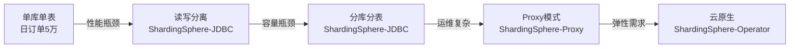
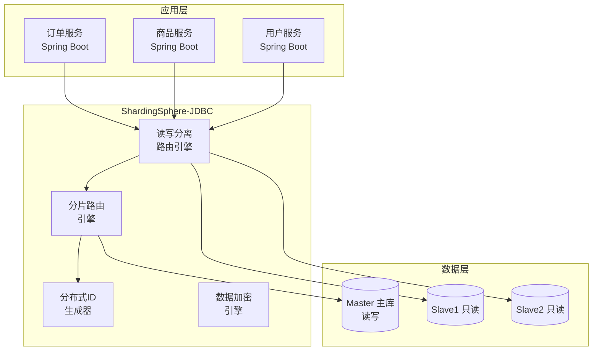
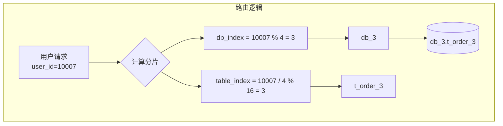
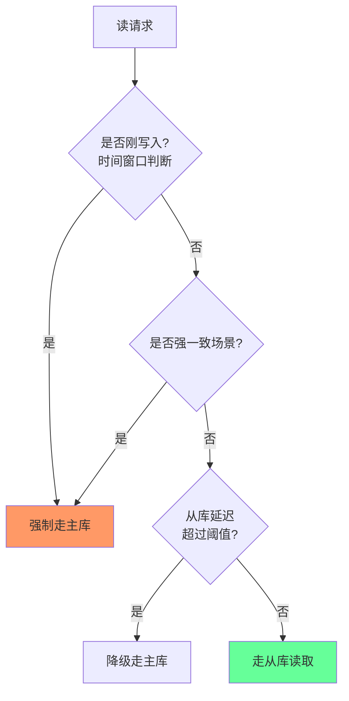
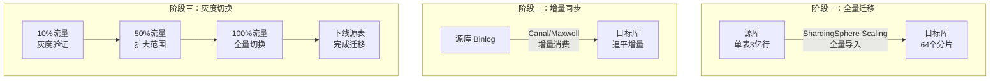
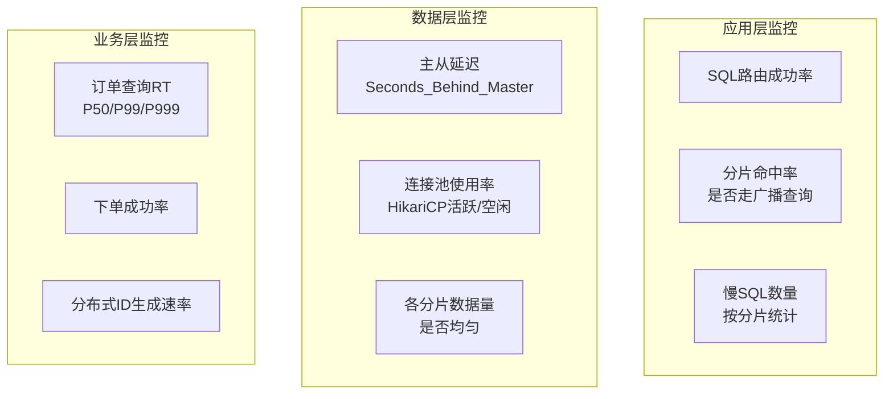

# 案例一：ShardingSphere实战

***

## 案例概览

本案例以一家中型电商平台的真实演进历程为蓝本，完整呈现从单库架构到读写分离、再到分库分表的全过程。选择Apache ShardingSphere作为核心中间件，因为它同时提供JDBC嵌入模式和Proxy代理模式，且社区活跃、生态成熟，是当前国内使用最广泛的数据库中间件之一。



| 阶段 | 时间线 | 日订单量 | 存储数据量 | 架构 |
|------|--------|---------|-----------|------|
| 初创期 | Year 1 | 5万 | 2000万行 | 单库单表 |
| 成长期 | Year 2 | 30万 | 2亿行 | 读写分离 |
| 爆发期 | Year 3 | 150万 | 10亿行 | 分库分表 |
| 成熟期 | Year 4+ | 300万 | 20亿行+ | Proxy + 弹性扩展 |

***

## 一、业务背景与痛点分析

### 1.1 业务场景

该电商平台核心业务包括商品展示、购物车、下单支付、订单履约四大模块。数据库使用MySQL 8.0，核心表包括：

- `t_order`：订单主表，包含订单号、用户ID、商家ID、金额、状态等
- `t_order_item`：订单明细表，包含商品SKU、数量、单价等
- `t_user`：用户表，包含用户基本信息、账户余额等
- `t_product`：商品表，包含商品名称、价格、库存等
- `t_inventory`：库存表，包含SKU级别的库存数量和版本号

### 1.2 性能瓶颈

随着业务增长，系统暴露出三重瓶颈：

**数据库读瓶颈：**

- 商品详情页的QPS从1000增长到8000
- 订单列表查询（用户维度）从500增长到5000
- 大促期间读请求峰值达到日常的8-10倍
- 单个MySQL实例的InnoDB Buffer Pool已经无法缓存热点数据

**数据库写瓶颈：**

- 下单高峰期写入TPS达到2000+
- InnoDB行锁竞争加剧，出现大量锁等待
- redo log写入频繁导致磁盘IO成为瓶颈
- 大事务（下单+扣库存+扣款）持有锁时间过长

**存储容量瓶颈：**

- t_order表超过3亿行，单表数据文件超过40GB
- ALTER TABLE加索引需要锁表数小时，无法在线执行
- 备份耗时超过8小时，RPO难以保障

### 1.3 为什么选择ShardingSphere

在技术选型阶段，团队对比了以下方案：

| 方案 | 优势 | 劣势 | 适用场景 |
|------|------|------|---------|
| ShardingSphere-JDBC | 无网络开销、性能最优、与Spring生态深度集成 | 需要修改应用配置、多语言支持弱 | Java单体/Spring Cloud架构 |
| ShardingSphere-Proxy | 对应用透明、多语言支持、运维友好 | 网络跳转增加延迟、需要独立部署维护 | 多语言架构、DBA集中管控 |
| MyCat | 配置相对简单 | 社区活跃度下降、功能扩展慢、大事务支持弱 | 简单分片场景 |
| 应用层自研 | 完全可控 | 开发成本高、容易遗漏边界情况 | 有专门中间件团队的大厂 |

最终选择 **ShardingSphere-JDBC** 作为第一阶段方案（与应用紧密集成、性能最优），后续演进到 **Proxy模式**（运维友好、对新接入服务透明）。

***

## 二、架构设计

### 2.1 整体架构



### 2.2 分片策略设计

针对核心表`t_order`的分片策略：

- **分片键选择**：`user_id`（用户维度查询是最高频的查询模式）
- **分片算法**：一致性Hash（支持平滑扩容）
- **分片数量**：初期4库×16表=64分片（为后续增长预留空间）
- **分库规则**：`user_id % 4` 决定目标数据库
- **分表规则**：`user_id / 4 % 16` 决定目标表



**为什么选择user_id而非order_id作为分片键？**

- 90%以上的订单查询都是按用户维度（"我的订单"）
- 同一用户的所有订单在同一分片，查询只需路由到1个分片
- 订单号(order_id)查询虽需要全分片扫描，但这类场景可通过ES/缓存解决

### 2.3 库表命名规范

| 层级 | 命名规则 | 示例 |
|------|---------|------|
| 数据库 | `ds_{index}` | ds_0, ds_1, ds_2, ds_3 |
| 分片表 | `t_order_{index}` | t_order_0, t_order_1, ..., t_order_15 |
| 全局表 | `t_{table_name}` | t_config, t_dict_region |
| 广播表 | 与原表名相同 | t_product（全库冗余） |

***

## 三、读写分离实现

### 3.1 ShardingSphere-JDBC配置（Spring Boot）

在分库分表之前，先实现读写分离。这是最小侵入的第一步。引入Maven依赖：

```xml
<dependency>
    <groupId>org.apache.shardingsphere</groupId>
    <artifactId>shardingsphere-jdbc-core-spring-boot-starter</artifactId>
    <version>5.3.2</version>
</dependency>
<!-- 读写分离内置算法 -->
<dependency>
    <groupId>org.apache.shardingsphere</groupId>
    <artifactId>shardingsphere-std-parser-spring-boot-starter</artifactId>
    <version>5.3.2</version>
</dependency>
```

完整的读写分离数据源配置：

```yaml
# application.yml
spring:
  shardingsphere:
    datasource:
      names: master,slave0,slave1
      master:
        type: com.zaxxer.hikari.HikariDataSource
        driver-class-name: com.mysql.cj.jdbc.Driver
        jdbc-url: jdbc:mysql://10.0.1.10:3306/ecommerce?useUnicode=true&amp;characterEncoding=utf8&amp;useSSL=false&amp;serverTimezone=Asia/Shanghai
        username: app_rw
        password: ${DB_MASTER_PASSWORD}
        hikari:
          minimum-idle: 5
          maximum-pool-size: 30
          connection-timeout: 30000
          idle-timeout: 600000
          max-lifetime: 1800000
      slave0:
        type: com.zaxxer.hikari.HikariDataSource
        driver-class-name: com.mysql.cj.jdbc.Driver
        jdbc-url: jdbc:mysql://10.0.1.11:3306/ecommerce?useUnicode=true&amp;characterEncoding=utf8&amp;useSSL=false&amp;serverTimezone=Asia/Shanghai
        username: app_ro
        password: ${DB_SLAVE0_PASSWORD}
        hikari:
          minimum-idle: 5
          maximum-pool-size: 30
      slave1:
        type: com.zaxxer.hikari.HikariDataSource
        driver-class-name: com.mysql.cj.jdbc.Driver
        jdbc-url: jdbc:mysql://10.0.1.12:3306/ecommerce?useUnicode=true&amp;characterEncoding=utf8&amp;useSSL=false&amp;serverTimezone=Asia/Shanghai
        username: app_ro
        password: ${DB_SLAVE1_PASSWORD}
        hikari:
          minimum-idle: 5
          maximum-pool-size: 30

    rules:
      readwrite-splitting:
        data-sources:
          ecommerce:
            write-data-source-name: master
            read-data-source-names: slave0,slave1
            load-balancer-name: round-robin
        load-balancers:
          round-robin:
            type: ROUND_ROBIN

    props:
      sql-show: true   # 开发阶段开启SQL日志便于调试
```

**配置要点解读：**

- **读写账号分离**：主库使用`app_rw`（读写权限），从库使用`app_ro`（只读权限），遵循最小权限原则
- **连接池独立**：每个数据源独立配置HikariCP，避免主从连接池相互影响
- **负载均衡策略**：默认使用ROUND_ROBIN轮询，确保读请求均匀分配到从库

### 3.2 读写分离验证

配置完成后，需要通过实际SQL验证读写路由是否正确。ShardingSphere通过解析SQL类型自动路由：写操作（INSERT/UPDATE/DELETE）走主库，读操作（SELECT）走从库。

```java
/**
 * 读写分离验证工具
 * 在集成测试中使用，确认路由行为符合预期
 */
@SpringBootTest
public class ReadWriteSplittingTest {

    @Autowired
    private JdbcTemplate masterJdbcTemplate; // 通过HintManager指定主库

    @Test
    public void verifyWriteGoesToMaster() {
        // 插入一条订单
        String insertSql = "INSERT INTO t_order (user_id, amount, status) VALUES (10086, 99.00, 'PAID')";
        masterJdbcTemplate.update(insertSql);
        
        // 验证：通过主库可以立即查到
        HintManager hintManager = HintManager.getInstance();
        try {
            hintManager.setWriteRouteOnly();
            String querySql = "SELECT COUNT(*) FROM t_order WHERE user_id = 10086";
            int count = masterJdbcTemplate.queryForObject(querySql, Integer.class);
            Assertions.assertEquals(1, count);
        } finally {
            hintManager.close();
        }
    }

    @Test
    public void verifyReadGoesToSlave() {
        // 使用ShardingSphere日志观察SQL路由
        // 正常SELECT语句应路由到slave0或slave1
        String sql = "SELECT * FROM t_order WHERE user_id = 10001";
        List<Map<String, Object>> results = jdbcTemplate.queryForList(sql);
        // 检查ShardingSphere日志中的"Actual SQL"应显示slave节点
    }
}
```

**验证技巧：**

- 开启`sql-show: true`后，ShardingSphere会在日志中输出实际执行的SQL和目标数据源
- 日志格式为：`Actual SQL: slave0 ::: SELECT * FROM t_order WHERE user_id = ?`
- 也可通过MySQL的`general_log`在从库上确认查询是否到达

### 3.3 主从延迟处理策略

主从延迟是读写分离最核心的挑战。该电商平台采用了多层防御策略：



**策略一：写后读时间窗口**

```java
@Component
public class ReadAfterWriteFilter implements Filter {

    private static final long SAFE_DELAY_MS = 200; // 200ms安全窗口
    
    private final RedisTemplate<String, String> redisTemplate;
    
    public ReadAfterWriteFilter(RedisTemplate<String, String> redisTemplate) {
        this.redisTemplate = redisTemplate;
    }
    
    @Override
    public void doFilter(ServletRequest request, ServletResponse response, FilterChain chain) {
        HttpServletRequest httpRequest = (HttpServletRequest) request;
        
        // 检查当前请求是否携带"写后读"标记
        String writeTimestamp = httpRequest.getHeader("X-Write-Timestamp");
        if (writeTimestamp != null) {
            long elapsed = System.currentTimeMillis() - Long.parseLong(writeTimestamp);
            if (elapsed < SAFE_DELAY_MS) {
                // 在安全窗口内，强制走主库
                HintManager hintManager = HintManager.getInstance();
                try {
                    hintManager.setWriteRouteOnly();
                    chain.doFilter(request, response);
                } finally {
                    hintManager.close();
                }
                return;
            }
        }
        
        chain.doFilter(request, response);
    }
}
```

**策略二：延迟检测与自动降级**

```java
@Component
public class SlaveDelayMonitor {
    
    private final JdbcTemplate masterJdbcTemplate;
    private final List<String> slaveHosts;
    
    @Scheduled(fixedRate = 1000) // 每秒检测一次
    public void checkSlaveDelay() {
        for (String slave : slaveHosts) {
            long delaySeconds = getSecondsBehindMaster(slave);
            
            if (delaySeconds > 10) {
                // 延迟超过10秒，标记该从库为不可用
                SlaveHealthRegistry.markUnhealthy(slave);
                log.warn("从库{}延迟超过阈值: {}s，已标记为不可用", slave, delaySeconds);
            } else if (delaySeconds < 3) {
                SlaveHealthRegistry.markHealthy(slave);
            }
        }
    }
    
    private long getSecondsBehindMaster(String slave) {
        String sql = "SHOW SLAVE STATUS";
        // 解析Seconds_Behind_Master字段
        // 注意：该值为NULL时表示复制线程未运行，应视为不可用
        // ...
    }
}
```

**策略三：业务层缓存穿透**

```java
@Service
public class UserService {
    private final RedisTemplate<String, User> redisTemplate;
    private final UserDao userDao;
    
    private static final String STALE_KEY_PREFIX = "stale:";
    private static final long STALE_TTL_SECONDS = 3;
    
    /**
     * 写操作后设置短暂的"脏数据"标记
     * 下次读取时检测到标记，强制走主库
     */
    @Transactional
    public void updateUser(User user) {
        userDao.update(user);
        // 设置脏数据标记，TTL为主从延迟的最大预期值
        redisTemplate.opsForValue().set(
            STALE_KEY_PREFIX + user.getId(),
            String.valueOf(System.currentTimeMillis()),
            Duration.ofSeconds(STALE_TTL_SECONDS)
        );
    }
    
    public User getUser(Long userId) {
        // 检查是否有脏数据标记
        if (Boolean.TRUE.equals(redisTemplate.hasKey(STALE_KEY_PREFIX + userId))) {
            // 强制走主库
            HintManager hintManager = HintManager.getInstance();
            try {
                hintManager.setWriteRouteOnly();
                return userDao.findById(userId);
            } finally {
                hintManager.close();
            }
        }
        return userDao.findById(userId);
    }
}
```

### 3.4 负载均衡策略选择

ShardingSphere提供了多种内置负载均衡算法：

| 算法 | 特点 | 适用场景 | 配置方式 |
|------|------|---------|---------|
| ROUND_ROBIN | 轮询分发 | 从库硬件配置相同 | 默认 |
| RANDOM | 随机选择 | 简单场景 | type: RANDOM |
| WEIGHT | 按权重分配 | 从库配置不同时 | weights: slave0=2,slave1=1 |
| 自定义SPI | 完全自定义 | 特殊需求 | 实现LoadBalancer接口 |

```yaml
# 自定义负载均衡：考虑从库延迟的智能路由
load-balancers:
  delay-aware:
    type: DELAY_AWARE  # 自定义SPI实现
```

自定义延迟感知负载均衡器的核心逻辑：

```java
public class DelayAwareLoadBalancer implements LoadBalancer {

    @Override
    public String getDataSource(String name, List<String> availableTargetNames, Map<String, Map<String, Object>> props) {
        // 按延迟从低到高排序，选择延迟最低的从库
        return availableTargetNames.stream()
            .min(Comparator.comparingLong(SlaveDelayMonitor::getDelay))
            .orElse(availableTargetNames.get(0));
    }
}
```

**SPI注册方式**：在`META-INF/services/org.apache.shardingsphere.infra.config.algorithm.ShardingSphereAlgorithm`文件中注册自定义实现类全限定名。

***

## 四、分库分表实现

### 4.1 数据源与分片配置

读写分离稳定运行3个月后，订单表数据量突破3亿行，进入分库分表阶段。

```yaml
spring:
  shardingsphere:
    datasource:
      names: ds0,ds1,ds2,ds3
      ds0:
        type: com.zaxxer.hikari.HikariDataSource
        driver-class-name: com.mysql.cj.jdbc.Driver
        jdbc-url: jdbc:mysql://10.0.2.10:3306/ecommerce_0?useUnicode=true&amp;characterEncoding=utf8&amp;useSSL=false&amp;serverTimezone=Asia/Shanghai
        username: app_rw
        password: ${DS0_PASSWORD}
        hikari:
          minimum-idle: 10
          maximum-pool-size: 30
      ds1:
        type: com.zaxxer.hikari.HikariDataSource
        driver-class-name: com.mysql.cj.jdbc.Driver
        jdbc-url: jdbc:mysql://10.0.2.11:3306/ecommerce_1?useUnicode=true&amp;characterEncoding=utf8&amp;useSSL=false&amp;serverTimezone=Asia/Shanghai
        username: app_rw
        password: ${DS1_PASSWORD}
        hikari:
          minimum-idle: 10
          maximum-pool-size: 30
      ds2:
        type: com.zaxxer.hikari.HikariDataSource
        driver-class-name: com.mysql.cj.jdbc.Driver
        jdbc-url: jdbc:mysql://10.0.2.12:3306/ecommerce_2?useUnicode=true&amp;characterEncoding=utf8&amp;useSSL=false&amp;serverTimezone=Asia/Shanghai
        username: app_rw
        password: ${DS2_PASSWORD}
        hikari:
          minimum-idle: 10
          maximum-pool-size: 30
      ds3:
        type: com.zaxxer.hikari.HikariDataSource
        driver-class-name: com.mysql.cj.jdbc.Driver
        jdbc-url: jdbc:mysql://10.0.2.13:3306/ecommerce_3?useUnicode=true&amp;characterEncoding=utf8&amp;useSSL=false&amp;serverTimezone=Asia/Shanghai
        username: app_rw
        password: ${DS3_PASSWORD}
        hikari:
          minimum-idle: 10
          maximum-pool-size: 30

    rules:
      sharding:
        tables:
          t_order:
            actual-data-nodes: ds$->{0..3}.t_order_$->{0..15}
            database-strategy:
              standard:
                sharding-column: user_id
                sharding-algorithm-name: user-mod
            table-strategy:
              standard:
                sharding-column: user_id
                sharding-algorithm-name: user-mod-table
            key-generate-strategy:
              column: order_id
              key-generator-name: snowflake
          t_order_item:
            actual-data-nodes: ds$->{0..3}.t_order_item_$->{0..15}
            database-strategy:
              standard:
                sharding-column: user_id
                sharding-algorithm-name: user-mod
            table-strategy:
              standard:
                sharding-column: user_id
                sharding-algorithm-name: user-mod-table
            key-generate-strategy:
              column: order_item_id
              key-generator-name: snowflake

        # 广播表：每个分片都存储完整数据
        # 适用于数据量小、变更不频繁的配置表
        binding-tables:
          - t_order,t_order_item   # 绑定表：分片键相同，JOIN无需跨分片
        broadcast-tables:
          - t_dict_region          # 地区字典
          - t_dict_pay_channel     # 支付渠道字典
          - t_product_category     # 商品类目

        sharding-algorithms:
          user-mod:
            type: MOD
            props:
              sharding-count: 4
          user-mod-table:
            type: MOD
            props:
              sharding-count: 16

        key-generators:
          snowflake:
            type: SNOWFLAKE
            props:
              worker-id: ${WORKER_ID:0}
              max-vibration-offset: 1  # 防止时钟回拨导致ID重复

    props:
      sql-show: false
      check-table-metadata-enabled: false
```

### 4.2 绑定表与广播表设计

**绑定表（Binding Table）** 的核心价值：当`t_order`和`t_order_item`使用相同的分片键（user_id）并配置为绑定表时，两表的JOIN操作只需要在同一个分片内完成，避免了跨分片JOIN的性能灾难。

```sql
-- 绑定表JOIN：ShardingSphere自动路由到同一分片
-- 查询user_id=10007的订单及其明细
SELECT o.order_id, o.amount, oi.product_name, oi.quantity
FROM t_order o
JOIN t_order_item oi ON o.order_id = oi.order_id AND o.user_id = oi.user_id
WHERE o.user_id = 10007;

-- ShardingSphere解析后，自动路由到 ds_3.t_order_3 和 ds_3.t_order_item_3
-- 无需跨分片聚合，查询性能等同于单库
```

**广播表（Broadcast Table）** 的设计考量：

- 每个分片都存储一份完整的`t_dict_region`数据
- 写入时同步到所有分片（使用分布式事务或最终一致性）
- 查询时直接在本地分片完成，无需广播
- 适用于地区字典、支付渠道、配置表等数据量小（通常<1万行）的场景

### 4.3 分布式ID生成方案

ShardingSphere内置的Snowflake算法在大部分场景下够用，但需要注意几个工程细节：

```yaml
key-generators:
  snowflake:
    type: SNOWFLAKE
    props:
      worker-id: ${WORKER_ID:0}          # 需要通过环境变量或注册中心分配
      max-vibration-offset: 1             # 防止时钟回拨
      max-tolerate-millis-difference: 10  # 容忍的最大时钟差(ms)
```

**Snowflake的局限性与应对：**

| 问题 | 影响 | 解决方案 |
|------|------|---------|
| 时钟回拨 | ID重复或阻塞 | 设置max-tolerate-millis-difference容忍小范围回拨 |
| Worker ID冲突 | ID重复 | 通过ZooKeeper/Redis自动分配 |
| 单点瓶颈 | 生成速度受限 | 多Worker并行，单Worker支持4096/s |
| ID可预测 | 安全风险 | 业务侧不直接暴露ID给外部 |

```java
/**
 * 备选方案：号段模式（当Snowflake不满足需求时）
 * 优势：ID不可预测、无时钟依赖
 * 代表实现：美团Leaf、滴滴Tinyid
 */
@Component
public class SegmentIdGenerator {

    private final AtomicLong currentId = new AtomicLong(0);
    private final AtomicLong maxId = new AtomicLong(0);
    
    /**
     * 从DB加载号段：每次分配1000个ID
     * currentId <= id <= maxId 范围内的ID可用
     */
    public long nextId(String bizType) {
        if (currentId.get() >= maxId.get()) {
            synchronized (this) {
                if (currentId.get() >= maxId.get()) {
                    loadSegment(bizType);
                }
            }
        }
        return currentId.getAndIncrement();
    }
    
    private void loadSegment(String bizType) {
        // UPDATE t_id_alloc SET max_id = max_id + 1000 WHERE biz_type = ?
        // 返回更新后的max_id值
        long newMax = jdbcdbcTemplate.update(
            "UPDATE t_id_alloc SET max_id = max_id + 1000 WHERE biz_type = ?",
            bizType
        );
        maxId.set(newMax);
        currentId.set(newMax - 1000);
    }
}
```

### 4.4 复杂SQL处理

分库分表后，部分SQL需要特殊处理：

**跨分片聚合查询（ORDER BY + LIMIT）：**

```java
/**
 * 分页查询的陷阱与正确实现
 * 
 * 错误做法：SELECT * FROM t_order WHERE user_id IN (1,2,3,...) ORDER BY create_time DESC LIMIT 10,20
 * ShardingSphere会将此SQL扇出到所有64个分片，每个分片取前30条，然后在内存中合并排序。
 * 当偏移量很大时，内存和CPU消耗巨大。
 * 
 * 正确做法：使用游标分页（基于上一页最后一条记录的排序字段值）
 */
public class OrderPageQuery {

    /**
     * 游标分页 - 适合深分页场景
     * 利用覆盖索引，避免全表扫描
     */
    public PageResult<Order> queryByCursor(Long userId, Long lastOrderId, int pageSize) {
        String sql = """
            SELECT order_id, amount, status, create_time 
            FROM t_order 
            WHERE user_id = ? 
            AND (? IS NULL OR order_id < ?)
            ORDER BY order_id DESC 
            LIMIT ?
        """;
        
        return jdbcTemplate.query(sql, userId, lastOrderId, lastOrderId, pageSize + 1);
        // 多查一条用于判断是否有下一页
    }
    
    /**
     * 浅分页 - 偏移量小于1000时可用
     * ShardingSphere会自动将深分页SQL优化为内存排序
     */
    public PageResult<Order> queryByPage(Long userId, int page, int pageSize) {
        int offset = (page - 1) * pageSize;
        String sql = "SELECT * FROM t_order WHERE user_id = ? ORDER BY create_time DESC LIMIT ?, ?";
        return jdbcTemplate.query(sql, userId, offset, pageSize);
    }
}
```

**全局排序与TopN：**

```java
/**
 * 分库分表后的TopN查询：必须通过分片键路由
 * 
 * "查询全平台最近1小时的订单Top10金额" 这类查询在分库分表后
 * 性能很差（需要扇出所有分片），建议走ES或数据仓库
 * 
 * "查询某用户最近10笔订单" 这类查询通过user_id路由到单个分片，性能正常
 */
```

***

## 五、数据迁移实战

### 5.1 迁移方案设计

从单库到分库分表的数据迁移是整个改造中最危险的环节。采用**双写+灰度切换**的方案：



### 5.2 ShardingSphere Scaling使用

ShardingSphere 5.x提供的Scaling组件支持在线数据迁移：

```yaml
# scaling-task.yaml
source:
  type: MySQL
  jdbcUrl: jdbc:mysql://10.0.1.10:3306/ecommerce
  username: migration_user
  password: ${MIGRATION_PASSWORD}

target:
  type: MySQL
  jdbcUrl: jdbc:mysql://10.0.2.10:3306/ecommerce_0
  username: migration_user
  password: ${MIGRATION_PASSWORD}
  
# 也支持通过ShardingSphere-Proxy统一管理：
# scaling-rule:
#   - sourceDataSourceName: ds_0
#     targetDataSourceNames: [ds_0, ds_1, ds_2, ds_3]
```

全量迁移的核心参数：

```bash
# 通过ShardingSphere Scaling API启动迁移任务
curl -X POST http://scaling-host:8888/api/scaling/job/start \
  -H "Content-Type: application/json" \
  -d '{
    "jobConfiguration": {
      "jobType": "FULL",
      "ruleConfig": {
        "source": {
          "type": "MySQL",
          "parameter": {
            "jdbcUrl": "jdbc:mysql://10.0.1.10:3306/ecommerce",
            "username": "migration_user"
          }
        },
        "target": {
          "type": "MySQL", 
          "parameter": {
            "jdbcUrl": "jdbc:mysql://10.0.2.10:3306/ecommerce_0"
          }
        }
      }
    }
  }'
```

### 5.3 数据校验

迁移完成后，必须进行严格的数据一致性校验。校验分为两个层次：全量行数校验和抽样字段校验。

```java
@Component
public class DataConsistencyChecker {

    /**
     * 抽样校验：从源库随机抽取1%的订单，与目标分片数据对比
     * 校验内容：所有字段值 + 行数统计
     */
    public ConsistencyReport checkConsistency(long sampleSize) {
        ConsistencyReport report = new ConsistencyReport();
        
        // 1. 总行数校验
        long sourceCount = sourceJdbcTemplate.queryForObject(
            "SELECT COUNT(*) FROM t_order", Long.class);
        long targetCount = targetJdbcTemplate.queryForObject(
            "SELECT COUNT(*) FROM t_order_all_shards", Long.class); // 聚合查询
        report.setRowCountMatch(sourceCount == targetCount);
        
        // 2. 抽样字段校验（使用CRC32做快速校验）
        String crcSql = """
            SELECT CRC32(CONCAT(order_id, user_id, amount, status)) as row_crc
            FROM t_order 
            WHERE order_id IN (?)
        """;
        List<Long> sampleIds = getRandomOrderIds(sampleSize);
        
        for (Long orderId : sampleIds) {
            Long sourceCrc = sourceJdbcTemplate.queryForObject(crcSql, Long.class, orderId);
            // 根据user_id路由到目标分片查询
            Long targetCrc = queryTargetCrc(orderId);
            if (!sourceCrc.equals(targetCrc)) {
                report.addMismatch(orderId, sourceCrc, targetCrc);
            }
        }
        
        return report;
    }
}
```

### 5.4 灰度切换步骤

步骤一：部署双写中间件
  - 应用写入同时写源库和目标库
  - 读请求仍走源库
  - 持续1-2天，观察双写延迟和错误率

步骤二：校验数据一致性
  - 全量行数对比（源库 = 目标库64个分片之和）
  - 抽样CRC32校验（1%订单全字段对比）
  - 关键业务指标对比（订单总额、日均单量）

步骤三：灰度切流（10% → 50% → 100%）
  - 通过网关按用户ID尾号路由：尾号0的用户流量切到新架构
  - 监控指标：RT P99、错误率、慢查询数量
  - 每个阶段稳定运行24小时后进入下一阶段

步骤四：下线源库
  - 停止双写，仅保留目标库
  - 观察1周后清理源库旧表

***

## 六、ShardingSphere-Proxy模式

### 6.1 为什么需要Proxy模式

当团队扩展到多个微服务（Java、Go、Python）时，JDBC模式的局限性暴露：

- 非Java服务无法使用JDBC模式
- 每个服务都需要独立维护分片配置
- DBA无法统一管控SQL执行

ShardingSphere-Proxy作为独立的数据库代理，对应用层完全透明，应用像连接普通MySQL一样连接Proxy。

### 6.2 Proxy部署配置

```yaml
# config-sharding.yaml（Proxy配置文件）
authority:
  users:
    - user: app_user@%
      password: ${APP_PASSWORD}
      privilege:
        type: ALL_PERMITTED
  privilege:
    type: ALL_PERMITTED

props:
  max-connections-size-per-query: 1
  kernel-executor-size: 16
  proxy-frontend-database-protocol-type: MySQL
  proxy-backend-database-protocol-type: MySQL

rules:
  - !SHARDING
    tables:
      t_order:
        actual-data-nodes: ds_$->{0..3}.t_order_$->{0..15}
        database-strategy:
          standard:
            sharding-column: user_id
            sharding-algorithm-name: user-mod
        table-strategy:
          standard:
            sharding-column: user_id
            sharding-algorithm-name: user-mod-table
        key-generate-strategy:
          column: order_id
          key-generator-name: snowflake
      t_order_item:
        actual-data-nodes: ds_$->{0..3}.t_order_item_$->{0..15}
        database-strategy:
          standard:
            sharding-column: user_id
            sharding-algorithm-name: user-mod
        table-strategy:
          standard:
            sharding-column: user_id
            sharding-algorithm-name: user-mod-table
    binding-tables:
      - t_order,t_order_item
    broadcast-tables:
      - t_dict_region
      - t_dict_pay_channel
    
    sharding-algorithms:
      user-mod:
        type: MOD
        props:
          sharding-count: 4
      user-mod-table:
        type: MOD
        props:
          sharding-count: 16
    
    key-generators:
      snowflake:
        type: SNOWFLAKE

  - !READWRITE_SPLITTING
    data-sources:
      ds0:
        write-data-source-name: ds0-master
        read-data-source-names: ds0-slave0,ds0-slave1
        load-balancer-name: round-robin
      ds1:
        write-data-source-name: ds1-master
        read-data-source-names: ds1-slave0,ds1-slave1
        load-balancer-name: round-robin
      ds2:
        write-data-source-name: ds2-master
        read-data-source-names: ds2-slave0,ds2-slave1
        load-balancer-name: round-robin
      ds3:
        write-data-source-name: ds3-master
        read-data-source-names: ds3-slave0,ds3-slave1
        load-balancer-name: round-robin
    load-balancers:
      round-robin:
        type: ROUND_ROBIN
```

**Proxy高可用部署要点：**

- 使用Nginx/HAProxy做Proxy层的负载均衡，前端应用连接VIP
- Proxy本身无状态，可水平扩展
- 后端MySQL主从切换时，Proxy通过心跳检测自动感知
- 建议部署至少3个Proxy实例，避免单点故障

### 6.3 Proxy vs JDBC模式对比

| 维度 | JDBC模式 | Proxy模式 |
|------|---------|-----------|
| 性能开销 | 无网络跳转，JVM内路由 | 多一跳网络，延迟增加1-3ms |
| 部署复杂度 | 与应用同进程，无额外部署 | 需要独立部署Proxy集群 |
| 语言支持 | 仅Java | 任意语言（MySQL协议兼容） |
| 运维管控 | 配置分散在各服务 | 集中管理，DBA统一管控 |
| 灰度发布 | 重启应用生效 | Proxy可热更新配置 |
| 高可用 | 依赖应用自身 | Proxy需要独立的高可用方案 |
| 连接池 | 应用自有HikariCP | Proxy维护到后端的连接池 |

**推荐策略**：Java核心服务用JDBC模式（性能最优），非Java服务或需要统一管控的场景用Proxy模式，两者可以共存于同一套后端数据库集群。

***

## 七、监控与运维

### 7.1 核心监控指标



### 7.2 关键告警规则

| 告警项 | 阈值 | 级别 | 处理动作 |
|--------|------|------|---------|
| 主从延迟 | >5秒 | P2 | 检查从库负载，考虑临时切主库 |
| 主从延迟 | >30秒 | P1 | 下线从库，检查复制线程状态 |
| 连接池活跃率 | >80% | P2 | 检查慢SQL，考虑扩容连接池 |
| 连接池活跃率 | >95% | P1 | 紧急扩容或限流 |
| 分片数据倾斜 | >30%偏差 | P3 | 评估是否需要rehash |
| 慢SQL | >100条/分钟 | P2 | 分析慢SQL日志，优化查询或索引 |
| 事务超时 | >5秒 | P2 | 分析事务中的锁竞争 |

### 7.3 运维脚本

```bash
#!/bin/bash
# sharding-ops.sh - ShardingSphere分片集群运维工具

# 1. 检查所有分片的数据量分布
check_data_distribution() {
    echo "=== 分片数据量分布 ==="
    for i in {0..3}; do
        for j in {0..15}; do
            count=$(mysql -h 10.0.2.$((i+10)) -u monitor -p$MONITOR_PASS \
                -e "SELECT COUNT(*) FROM ecommerce_${i}.t_order_${j}" -s -N 2>/dev/null)
            echo "ds_${i}.t_order_${j}: ${count}"
        done
    done
}

# 2. 检查主从延迟
check_replication_delay() {
    echo "=== 主从延迟状态 ==="
    for host in 10.0.2.{10..17}; do
        delay=$(mysql -h $host -u monitor -p$MONITOR_PASS \
            -e "SHOW SLAVE STATUS\G" 2>/dev/null | grep Seconds_Behind_Master | awk '{print $2}')
        echo "${host}: ${delay:-N/A}s"
    done
}

# 3. 慢SQL分析
slow_query_analysis() {
    echo "=== 过去1小时慢SQL Top10 ==="
    for i in {0..3}; do
        mysql -h 10.0.2.$((i+10)) -u monitor -p$MONITOR_PASS \
            -e "SELECT query_time, lock_time, rows_examined, LEFT(sql_text, 80) 
                FROM mysql.slow_log 
                WHERE start_time > DATE_SUB(NOW(), INTERVAL 1 HOUR)
                ORDER BY query_time DESC LIMIT 10" 2>/dev/null
    done
}
```

### 7.4 Prometheus + Grafana监控配置

```yaml
# prometheus-rules/sharding-rules.yml
groups:
  - name: sharding-alerts
    rules:
      - alert: HighReplicationDelay
        expr: mysql_slave_status_seconds_behind_master > 5
        for: 1m
        labels:
          severity: warning
        annotations:
          summary: "主从延迟超过5秒"
          description: "从库 {{ $labels.instance }} 延迟 {{ $value }}秒"
      
      - alert: CriticalReplicationDelay
        expr: mysql_slave_status_seconds_behind_master > 30
        for: 30s
        labels:
          severity: critical
        annotations:
          summary: "主从延迟超过30秒，需要立即处理"
      
      - alert: DataSourcePoolExhaustion
        expr: hikaricp_connections_active / hikaricp_connections_max > 0.8
        for: 2m
        labels:
          severity: warning
        annotations:
          summary: "连接池使用率超过80%"
```

***

## 八、性能压测与调优

### 8.1 压测环境

| 项目 | 配置 |
|------|------|
| 数据库 | MySQL 8.0，4主8从 |
| Proxy | ShardingSphere-Proxy 5.3.2，3节点 |
| 压测工具 | JMeter 5.6 + MySQL JDBC驱动 |
| 数据规模 | 10亿条订单，user_id均匀分布 |

### 8.2 压测结果对比

| 场景 | 单库（改造前） | 读写分离 | 分库分表(4库×16表) | 提升倍数 |
|------|--------------|---------|-------------------|---------|
| 按用户ID查订单列表 | 50ms | 25ms | 8ms | 6.25x |
| 按订单ID查详情 | 12ms | 10ms | 15ms* | 0.8x |
| 插入订单（含索引维护） | 80ms | 80ms | 20ms | 4x |
| 跨分片聚合（分页） | 120ms | 60ms | 200ms** | 0.6x |
| 全局统计（COUNT/AVG） | 300ms | 150ms | 500ms | 0.6x |

> *按订单ID查询需要广播到64个分片，ShardingSphere会并行执行但总延迟取决于最慢的分片。生产中通过将此类查询路由到ES解决。

> **跨分片分页的延迟增加是因为ShardingSphere需要从每个分片取数据后在内存中合并排序。对于频繁的跨分片分页场景，建议使用游标分页或前置缓存。

### 8.3 性能调优要点

**JVM调优：**

```bash
# ShardingSphere-Proxy JVM参数
-Xms4g -Xmx4g                    # 固定堆大小，避免GC停顿
-XX:+UseG1GC                      # 使用G1收集器
-XX:MaxGCPauseMillis=50           # GC停顿目标50ms
-XX:+ParallelRefProcEnabled       # 并行处理引用
-XX:+AlwaysPreTouch               # 启动时预分配内存
```

**连接池调优：**

```yaml
# ShardingSphere后端连接池
props:
  # Proxy到后端MySQL的连接池
  max-connections-size-per-query: 1   # 每个查询最多使用的后端连接数
  kernel-executor-size: 16             # 内核线程数（处理SQL解析和路由）
  proxy-frontend-executor-size: 32     # 前端处理线程数
```

**SQL优化建议：**

1. 所有查询必须包含分片键（user_id），避免广播查询
2. 分页查询使用游标模式，避免深分页
3. 大事务拆分为小事务，减少锁持有时间
4. 批量操作控制在每批500行以内，避免单次操作过大
5. ORDER BY + LIMIT查询尽量通过分片键路由到单分片

***

## 九、踩坑复盘与经验总结

### 9.1 真实踩坑记录

**坑1：HintManager内存泄漏**

```java
// 错误写法：异常时HintManager未关闭
public void problematicMethod() {
    HintManager hintManager = HintManager.getInstance();
    hintManager.setWriteRouteOnly();
    doSomething(); // 如果这里抛异常，HintManager不会被关闭
    hintManager.close();
}

// 正确写法：必须在finally中关闭
public void correctMethod() {
    HintManager hintManager = HintManager.getInstance();
    try {
        hintManager.setWriteRouteOnly();
        doSomething();
    } finally {
        hintManager.close();
    }
}
```

**坑2：广播表数据不一致**

广播表（如t_dict_region）的写入会同步到所有分片，但在网络抖动时可能出现部分分片写入失败的情况。解决方案：

- 写入时使用分布式事务保证原子性
- 定期（每小时）对广播表做全分片一致性校验
- 建立广播表修复Job，在发现不一致时自动修复

**坑3：Snowflake ID与MySQL主键冲突**

直接将Snowflake生成的ID作为MySQL自增主键使用时，由于Snowflake ID是64位长整数，超出INT范围。必须使用BIGINT。同时，Snowflake ID不保证全局递增，在使用UNIQUE索引时需注意：

- 雪花ID的时间戳部分递增，但同一毫秒内可能生成多个ID
- 不要依赖Snowflake ID的顺序作为业务排序依据

**坑4：分片扩容的数据迁移**

从4库扩容到8库时，由于使用了`user_id % 4`的分片算法，需要将user_id为偶数的分片数据重新分配。ShardingSphere 5.x提供了在线扩缩容能力，但仍然需要注意：

- 扩容期间需要双写，确保新旧分片数据一致
- 扩容脚本需要在低峰期执行
- 扩容完成后需要清理旧分片数据

**坑5：分布式事务的性能代价**

使用ShardingSphere的XA分布式事务后，下单接口的RT从20ms上升到150ms。原因：

- XA事务需要2PC协议，每次事务至少2次网络往返
- XA事务持有数据库连接的时间更长

最终方案：将强一致性要求低的场景切换到Seata的AT模式（基于本地事务+undo_log），RT降至30ms。

### 9.2 最佳实践清单

| 类别 | 实践 | 优先级 |
|------|------|--------|
| 分片键 | 所有核心查询都必须包含分片键 | P0 |
| 分片键 | 选定分片键后不再修改 | P0 |
| 连接池 | 每个数据源独立配置连接池 | P1 |
| 监控 | 建立分片级别的细粒度监控 | P1 |
| 监控 | 主从延迟告警阈值不超过5秒 | P1 |
| 迁移 | 数据迁移必须有回滚方案 | P0 |
| 迁移 | 灰度切换期间保持双写 | P0 |
| SQL | 避免跨分片JOIN和ORDER BY | P1 |
| SQL | 深分页使用游标模式 | P1 |
| 运维 | 定期检查分片数据倾斜 | P2 |
| 运维 | 广播表定期一致性校验 | P2 |
| 事务 | 尽量避免分布式事务 | P1 |
| 事务 | 必须用分布式事务时选择AT模式 | P1 |

### 9.3 架构演进建议

阶段一：读写分离（解决读瓶颈）
  ├─ 实现方式：ShardingSphere-JDBC
  ├─ 从库数量：2-3个
  ├─ 预期收益：读性能提升2-3倍
  └─ 风险等级：低（无数据迁移）

阶段二：分库分表（解决写瓶颈+容量瓶颈）
  ├─ 实现方式：ShardingSphere-JDBC
  ├─ 分片策略：按用户ID水平分片
  ├─ 分片数量：初期4库×16表
  ├─ 预期收益：写性能提升4倍，容量扩展16倍
  └─ 风险等级：高（需要数据迁移）

阶段三：Proxy化（解决多语言+运维管控）
  ├─ 实现方式：ShardingSphere-Proxy
  ├─ 部署模式：3节点高可用
  ├─ 预期收益：运维效率提升，多语言支持
  └─ 风险等级：中（需要切换连接方式）

阶段四：云原生（解决弹性伸缩）
  ├─ 实现方式：ShardingSphere Operator + K8s
  ├─ 能力：自动扩缩容、自动故障恢复
  ├─ 预期收益：运维成本大幅降低
  └─ 前置条件：完成容器化改造

***

## 十、总结

本案例完整展示了ShardingSphere在电商平台从读写分离到分库分表的全过程。核心经验可以归纳为：

1. **渐进式改造**：先读写分离、再分库分表、再Proxy化，每一步都是独立可交付的
2. **分片键是命脉**：选择user_id而非order_id，直接决定了90%查询的性能上限
3. **主从延迟无银弹**：必须结合时间窗口、延迟检测、业务缓存三重策略
4. **数据迁移零信任**：全量校验+抽样校验+灰度切换，缺一不可
5. **监控先行**：没有监控的分库分表就是定时炸弹，必须建立分片级别的细粒度监控
6. **预留扩容空间**：初期分片数按3-5年增长预估，宁多勿少

ShardingSphere作为Apache顶级项目，生态成熟度和社区活跃度在国内数据库中间件中首屈一指。但它不是银弹——错误的分片键选择、缺失的监控体系、草率的数据迁移，任何一个环节的失误都可能造成严重故障。技术选型只是起点，真正的挑战在于持续的运维和演进。
