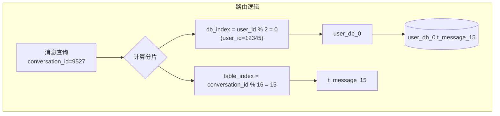
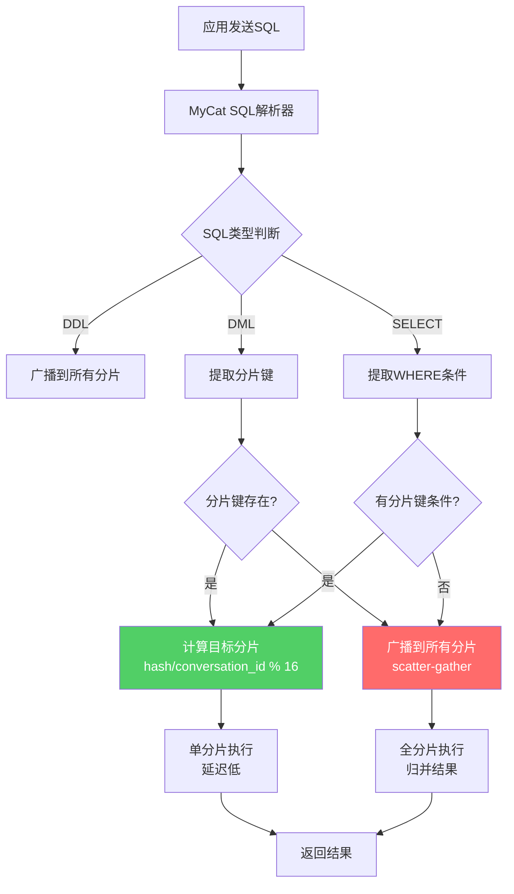
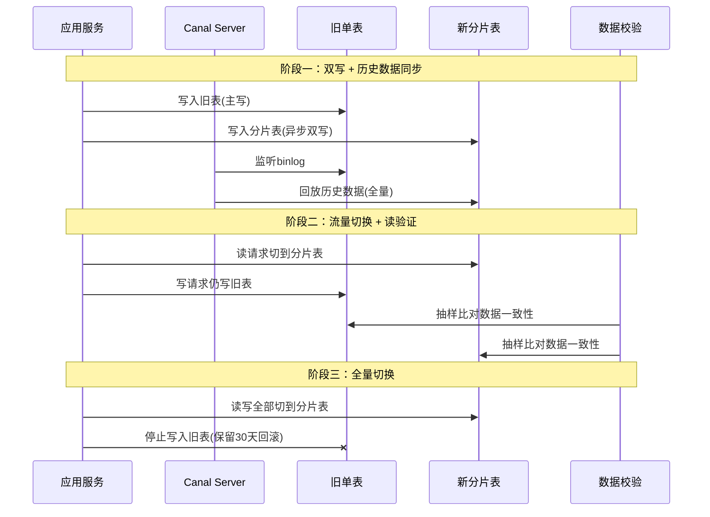
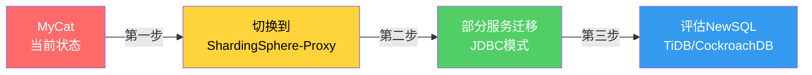

# 案例二：MyCat实战

***

## 案例概览

本案例以一家快速成长的社交平台的真实演进历程为蓝本，完整呈现从单库架构到MyCat代理模式下的读写分离与分库分表全过程。MyCat作为一款开源的数据库中间件，以Proxy模式对应用完全透明，适合多语言技术栈和需要DBA集中管控的场景。


| 阶段 | 时间线 | 日消息量 | 存储数据量 | 架构 |
|------|--------|---------|-----------|------|
| 初创期 | Year 1 | 500万 | 3000万行 | 单库单表 |
| 成长期 | Year 2 | 3000万 | 5亿行 | 读写分离 |
| 爆发期 | Year 3 | 1.2亿 | 30亿行 | 分库分表 |
| 成熟期 | Year 4+ | 2亿+ | 50亿行+ | 高可用集群 |

***

## 一、业务背景与痛点分析

### 1.1 业务场景

该社交平台核心业务包括即时消息、朋友圈/动态、用户关系、内容推荐四大模块。数据库使用MySQL 5.7，核心表包括：

- `t_message`：消息表，包含发送者ID、接收者ID、会话ID、消息内容、发送时间等
- `t_user`：用户表，包含用户基本信息、昵称、头像、注册时间等
- `t_relation`：用户关系表，包含关注者ID、被关注者ID、关系类型等
- `t_dynamic`：动态/朋友圈表，包含发布者ID、内容、点赞数、评论数等
- `t_comment`：评论表，包含动态ID、评论者ID、评论内容、父评论ID等

### 1.2 性能瓶颈

随着用户量从500万增长到5000万，系统暴露出三重瓶颈：

**数据库读瓶颈：**
- 消息列表查询（按会话维度）QPS从2000增长到15000
- 朋友圈信息流查询QPS从1000增长到12000
- 大促和热点事件期间读请求峰值达到日常的10-15倍
- 单个MySQL实例的InnoDB Buffer Pool已无法缓存热点数据

**数据库写瓶颈：**
- 即时消息写入高峰期TPS达到5000+
- 动态发布高峰期写入TPS达到3000+
- InnoDB行锁竞争加剧，出现大量锁等待
- redo log写入频繁导致磁盘IO成为瓶颈

**存储容量瓶颈：**
- t_message表超过15亿行，单表数据文件超过60GB
- ALTER TABLE加索引需要锁表数小时，无法在线执行
- 备份耗时超过12小时，RPO难以保障

### 1.3 为什么选择MyCat

在技术选型阶段，团队对比了以下方案：

| 方案 | 优势 | 劣势 | 适用场景 |
|------|------|------|---------|
| MyCat | 对应用完全透明、支持多语言、配置简单、运维友好 | 社区活跃度下降、大事务支持弱、功能扩展慢 | 多语言架构、DBA集中管控 |
| ShardingSphere-JDBC | 无网络开销、性能最优、与Spring生态深度集成 | 需要修改应用配置、多语言支持弱 | Java单体/Spring Cloud架构 |
| ShardingSphere-Proxy | 功能丰富、社区活跃、云原生支持好 | 配置相对复杂 | 中大型项目、标准化 |
| 应用层自研 | 完全可控 | 开发成本高、容易遗漏边界情况 | 有专门中间件团队的大厂 |

最终选择 **MyCat** 的核心原因：

1. **技术栈多样**：前端团队使用Go/Python编写推荐服务，后端使用Java，MyCat的Proxy模式对所有语言透明，无需各语言分别集成SDK
2. **DBA集中管控**：DBA可以通过MyCat统一管理所有分片的DDL、慢查询、连接数等，降低了运维门槛
3. **快速落地**：MyCat的schema.xml配置直观，从单库切换到分库分表只需修改配置文件，应用代码零改动
4. **历史包袱**：部分老系统是PHP/Python编写，无法使用JDBC模式的ShardingSphere

> **选型提醒**：MyCat社区自2020年后活跃度明显下降，新项目建议优先考虑ShardingSphere-Proxy或TiDB。本案例的价值在于理解Proxy模式中间件的通用架构思想，这些思想同样适用于ShardingSphere-Proxy。

***

## 二、架构设计

### 2.1 整体架构

采用 **MyCat Proxy** 模式，在应用和数据库之间添加代理层，对应用完全透明：

```mermaid
graph TB
    subgraph 应用层
        A1[消息服务<br/>Java Spring Boot]
        A2[推荐服务<br/>Go gRPC]
        A3[数据管道<br/>Python Spark]
        A4[管理后台<br/>PHP Laravel]
    end

    subgraph 代理层
        M1[MyCat Node 1<br/>主节点]
        M2[MyCat Node 2<br/>备节点]
        VIP[Keepalived VIP<br/>10.0.1.100]
    end

    subgraph 数据层
        subgraph 主库集群
            W1[(Master 1<br/>写入)]
            W2[(Master 2<br/>写入)]
        end
        subgraph 从库集群
            R1[(Slave 1<br/>只读)]
            R2[(Slave 2<br/>只读)]
            R3[(Slave 3<br/>只读)]
            R4[(Slave 4<br/>只读)]
        end
    end

    A1 &amp; A2 &amp; A3 &amp; A4 --> VIP
    VIP --> M1
    VIP --> M2
    M1 --> W1
    M1 --> W2
    M1 --> R1 &amp; R2 &amp; R3 &amp; R4
    W1 -.->|binlog同步| R1 &amp; R2
    W2 -.->|binlog同步| R3 &amp; R4

    style VIP fill:#ffd43b,color:#000
    style W1 fill:#ff6b6b,color:#fff
    style W2 fill:#ff6b6b,color:#fff
    style R1 fill:#51cf66,color:#fff
    style R2 fill:#51cf66,color:#fff
    style R3 fill:#51cf66,color:#fff
    style R4 fill:#51cf66,color:#fff
```

**架构要点：**
- MyCat双节点部署 + Keepalived VIP，实现MyCat自身的高可用
- 2个主库分片（user_db_0、user_db_1），各自挂载2个从库
- 应用只需连接VIP:8066（MyCat默认端口），无需感知底层分片细节
- 所有语言（Java/Go/Python/PHP）通过标准MySQL协议连接MyCat

### 2.2 分片策略设计

针对核心表`t_message`的分片策略：

- **分片键选择**：`conversation_id`（会话维度查询是最高频的查询模式）
- **分片算法**：取模哈希（user_id % 2决定所属主库，conversation_id % 16决定所属表）
- **分片数量**：2库 × 16表 = 32逻辑分片
- **绑定表设计**：t_message和t_comment使用相同分片键，避免跨分片JOIN



**为什么选择conversation_id作为分片键？**
- 90%以上的消息查询都按会话维度（"聊天记录"）
- 同一会话的所有消息在同一分片，查询只需路由到1个分片
- 用户维度查询（"我的消息列表"）通过冗余索引表解决
- 动态/朋友圈表按user_id分片，保证同一用户的所有动态在同一分片

### 2.3 库表命名规范

| 层级 | 命名规则 | 示例 |
|------|---------|------|
| 逻辑库 | `social` | 社交平台统一逻辑库名 |
| 物理数据库 | `user_db_{index}` | user_db_0, user_db_1 |
| 分片表 | `t_{table}_{index}` | t_message_00, t_message_01, ..., t_message_15 |
| 全局表 | `t_{table}` | t_config, t_dict_region |
| 广播表 | 与原表名相同 | t_user（全库冗余） |

***

## 三、MyCat安装与基础配置

### 3.1 环境准备

```bash
# 系统要求
# - JDK 1.8+ (MyCat基于Java开发)
# - MySQL 5.7+ (推荐8.0)
# - 最低配置: 4核8G (MyCat节点), 8核16G (MySQL节点)

# 创建MyCat用户和目录
groupadd mycat
useradd -g mycat mycat
mkdir -p /opt/mycat/{conf,logs,lib}
chown -R mycat:mycat /opt/mycat

# 下载MyCat (以1.6.7.5为例)
cd /opt/mycat
wget https://github.com/MyCATApache/Mycat-Server/releases/download/1.6.7.5-release/Mycat-server-1.6.7.5-release-20200422133848-linux.tar.gz
tar -xzf Mycat-server-1.6.7.5-release-20200422133848-linux.tar.gz
```

### 3.2 JVM调优配置

MyCat作为Java进程，JVM参数直接影响性能表现：

```bash
# /opt/mycat/conf/wrapper.conf
wrapper.java.command=/usr/bin/java
wrapper.java.additional.1=-server
wrapper.java.additional.2=-Xms4g
wrapper.java.additional.3=-Xmx4g
wrapper.java.additional.4=-XX:NewRatio=4
wrapper.java.additional.5=-XX:SurvivorRatio=8
wrapper.java.additional.6=-XX:+UseG1GC
wrapper.java.additional.7=-XX:MaxGCPauseMillis=200
wrapper.java.additional.8=-XX:+HeapDumpOnOutOfMemoryError
wrapper.java.additional.9=-XX:HeapDumpPath=/opt/mycat/logs/heapdump.hprof
wrapper.java.additional.10=-Djava.net.preferIPv4Stack=true
```

> **经验提示**：MyCat的堆内存建议设置为4-8G。过小会导致频繁GC影响SQL路由性能，过大会增加GC停顿时间。使用G1GC可以有效控制停顿。

### 3.3 server.xml核心配置

server.xml是MyCat的服务器级配置，定义用户认证、系统参数和SQL限制：

```xml
<!-- /opt/mycat/conf/server.xml -->
<?xml version="1.0" encoding="UTF-8"?>
<!DOCTYPE mycat:server SYSTEM "server.dtd">
<mycat:server xmlns:mycat="http://io.mycat/">

    <!-- 系统参数 -->
    <system>
        <!-- 网络端口 -->
        <property name="port">8066</property>
        <property name="managerPort">9066</property>

        <!-- 授权策略: 0=所有用户都可访问所有逻辑库 -->
        <property name="noneAuthLogin">0</property>

        <!-- 使用非加密密码(生产环境建议设为1使用加密) -->
        <property name="usingDecrypt">0</property>

        <!-- SQL执行超时(秒), 防止慢SQL拖垮MyCat -->
        <property name="sqlExecuteTimeout">30</property>

        <!-- 连接池配置 -->
        <property name="processors">16</property>
        <property name="processorExecutor">32</property>
        <property name="handlerCount">32</property>
        <property name="executorInject">false</property>

        <!-- 心跳检测配置 -->
        <property name="heartbeatPeriodMillis">30000</property>
        <property name="transactionPeriodMillis">300000</property>

        <!-- 限制返回行数, 防止大结果集拖垮内存 -->
        <property name="defaultLimit">1000</property>
        <property name="maxLimit">10000</property>
        <property name="sequnceHandlerType">2</property>
    </system>

    <!-- 用户配置 -->
    <user name="app_user" defaultPool="writePool">
        <property name="password">AppUser@2024</property>
        <property name="schemas">social</property>
        <!-- 只读用户, 用于报表和数据分析 -->
    </user>

    <user name="readonly_user" defaultPool="readPool">
        <property name="password">Readonly@2024</property>
        <property name="schemas">social</property>
        <property name="readOnly">true</property>
    </user>

    <user name="admin_user">
        <property name="password">Admin@2024</property>
        <property name="schemas">social</property>
        <property name="manager">true</property>
    </user>
</mycat:server>
```

> **安全提示**：生产环境中 `usingDecrypt` 应设为1，并使用MyCat自带的加密工具对密码进行加密。`noneAuthLogin` 必须设为0，否则未授权用户可以访问所有逻辑库。

***

## 四、Schema配置与读写分离实现

### 4.1 schema.xml完整配置

schema.xml是MyCat最核心的配置文件，定义逻辑库、表、数据节点和读写分离规则：

```xml
<!-- /opt/mycat/conf/schema.xml -->
<?xml version="1.0" encoding="UTF-8"?>
<!DOCTYPE mycat:schema SYSTEM "schema.dtd">
<mycat:schema xmlns:mycat="http://io.mycat/">

    <!-- 逻辑库: social -->
    <schema name="social" checkSQLschema="false" sqlMaxLimit="1000">

        <!-- 消息表: 按conversation_id分片, 绑定comment表 -->
        <table name="t_message" dataNode="dn$0-1->t_message_$0-15"
               rule="msg_conversation_rule" primaryKey="id">
            <!-- 子表: 评论表, 与消息表共用分片键 -->
            <childTable name="t_comment" joinKey="message_id"
                        primaryKey="id" />
        </table>

        <!-- 动态/朋友圈表: 按user_id分片 -->
        <table name="t_dynamic" dataNode="dn$0-1->t_dynamic_$0-15"
               rule="dynamic_user_rule" primaryKey="id" />

        <!-- 用户关系表: 按user_id分片 -->
        <table name="t_relation" dataNode="dn$0-1->t_relation_$0-15"
               rule="relation_user_rule" primaryKey="id" />

        <!-- 全局表: 用户信息, 每个分片都有完整副本 -->
        <table name="t_user" dataNode="dn$0-1" type="global" />

        <!-- 全局表: 配置字典 -->
        <table name="t_config" dataNode="dn$0-1" type="global" />
    </schema>

    <!-- 数据节点定义: 逻辑库名 -> 物理库.表 -->
    <dataNode name="dn$0-1->t_message_$0-15"
              dataHost="host$0-1" database="user_db_$0-1"
              table="t_message_$0-15" />

    <!-- 分片规则: 消息表按conversation_id取模 -->
    <tableRule name="msg_conversation_rule">
        <rule>
            <columns>conversation_id</columns>
            <algorithm>msg_mod</algorithm>
        </rule>
    </tableRule>
    <function name="msg_mod" class="io.mycat.route.function.PartitionByMod">
        <property name="count">16</property>
    </functionRule>

    <!-- 分片规则: 动态表按user_id取模 -->
    <tableRule name="dynamic_user_rule">
        <rule>
            <columns>user_id</columns>
            <algorithm>user_mod</algorithm>
        </rule>
    </tableRule>

    <!-- 分片规则: 关系表按user_id取模 -->
    <tableRule name="relation_user_rule">
        <rule>
            <columns>user_id</columns>
            <algorithm>user_mod</algorithm>
        </rule>
    </tableRule>

    <function name="user_mod" class="io.mycat.route.function.PartitionByMod">
        <property name="count">16</property>
    </functionRule>

    <!-- 数据主机定义: 读写分离配置 -->
    <dataHost name="host0" maxCon="1000" minCon="10"
              balance="2" writeType="0" dbType="mysql"
              dbDriver="native" switchType="1" slaveThreshold="100">
        <heartbeat>SELECT 1</heartbeat>
        <!-- 写节点(主库) -->
        <writeHost host="hostMaster0"
                   url="10.0.2.10:3306"
                   user="mycat_rw" password="${HOST0_RW_PWD}">
            <!-- 读节点(从库) -->
            <readHost host="hostSlave0a"
                      url="10.0.2.11:3306"
                      user="mycat_ro" password="${HOST0_RO_PWD}"
                      weight="1" />
            <readHost host="hostSlave0b"
                      url="10.0.2.12:3306"
                      user="mycat_ro" password="${HOST0_RO_PWD}"
                      weight="1" />
        </writeHost>
    </dataHost>

    <dataHost name="host1" maxCon="1000" minCon="10"
              balance="2" writeType="0" dbType="mysql"
              dbDriver="native" switchType="1" slaveThreshold="100">
        <heartbeat>SELECT 1</heartbeat>
        <writeHost host="hostMaster1"
                   url="10.0.2.20:3306"
                   user="mycat_rw" password="${HOST1_RW_PWD}">
            <readHost host="hostSlave1a"
                      url="10.0.2.21:3306"
                      user="mycat_ro" password="${HOST1_RO_PWD}"
                      weight="1" />
            <readHost host="hostSlave1b"
                      url="10.0.2.22:3306"
                      user="mycat_ro" password="${HOST1_RO_PWD}"
                      weight="1" />
        </writeHost>
    </dataHost>
</mycat:schema>
```

### 4.2 读写分离关键参数详解

| 参数 | 含义 | 推荐值 | 说明 |
|------|------|--------|------|
| `balance` | 读负载均衡策略 | 2 | 0=不开启; 1=所有读走备用写节点; 2=所有读走任意从库; 3=读走备用写节点 |
| `writeType` | 写操作目标 | 0 | 0=所有写走第一个writeHost; 1=随机写(不推荐) |
| `switchType` | 主从切换策略 | 1 | 0=不自动切换; 1=自动切换; 2=基于GTID切换 |
| `slaveThreshold` | 从库延迟阈值(秒) | 100 | 超过此值的从库将被暂时剔除读路由 |
| `weight` | 从库权重 | 1 | 权重越大被选中概率越高 |

**balance参数详解：**

| 值 | 行为 | 适用场景 |
|----|------|---------|
| 0 | 所有读写都走第一个writeHost | 开发测试环境 |
| 1 | 读走备用writeHost(第二个), 写走第一个 | writeHost有主备切换时 |
| 2 | 读随机走所有writeHost和readHost | 生产环境推荐 |
| 3 | 读走备用writeHost | 备用节点性能更好时 |

### 4.3 主从延迟自动检测

MyCat通过心跳检测和`slaveThreshold`参数实现从库延迟的自动感知：

```sql
-- MyCat执行的检测语句
-- 1. 心跳检测(检查从库是否存活)
SELECT 1

-- 2. 延迟检测(MyCat自动执行,等价于)
SHOW SLAVE STATUS
-- 读取 Seconds_Behind_Master 字段
-- 若超过 slaveThreshold, 该从库暂时从读路由中剔除

-- 3. 监控MyCat后端连接状态
SHOW @@backend;
SHOW @@datasource;
```

当从库延迟超过100秒（slaveThreshold配置值）时，MyCat会自动将该从库从读路由池中移除，所有读请求转由其他健康从库承担。从库延迟恢复后，MyCat会在下一次心跳检测时自动将其重新加入路由池。

***

## 五、分库分表实现

### 5.1 分片路由流程

MyCat的SQL路由流程如下：



### 5.2 查询路由实例

```sql
-- ✅ 命中分片键, 单分片执行 (conversation_id=9527)
SELECT * FROM t_message WHERE conversation_id = 9527 ORDER BY send_time DESC LIMIT 50;
-- 路由: conversation_id % 16 = 15 → user_db_0.t_message_15

-- ✅ 命中分片键, 单分片执行 (user_id=12345)
SELECT * FROM t_dynamic WHERE user_id = 12345 ORDER BY create_time DESC LIMIT 20;
-- 路由: user_id % 16 = 9 → user_db_0.t_dynamic_09

-- ✅ 全局表查询, 单库执行 (t_user是全局表)
SELECT * FROM t_user WHERE id = 10001;
-- 路由: 全局表直接从任意节点读取

-- ❌ 未命中分片键, 广播到所有分片 (性能差)
SELECT * FROM t_message WHERE content LIKE '%活动%' LIMIT 100;
-- 路由: 广播到32个分片, 每个分片各自执行, 结果归并

-- ⚠️ 跨分片聚合 (性能中等)
SELECT conversation_id, COUNT(*) FROM t_message GROUP BY conversation_id;
-- 路由: 广播到32个分片, 每个分片计算局部聚合, MyCat归并最终结果
```

### 5.3 全局表与广播表

全局表（type="global"）在每个物理分片中都保存完整副本。适用于数据量小（一般<100万行）、更新不频繁的字典表或配置表：

```sql
-- 全局表的优势: JOIN时无需跨分片
SELECT m.*, u.nickname, u.avatar
FROM t_message m
JOIN t_user u ON m.sender_id = u.id
WHERE m.conversation_id = 9527;
-- t_user在每个分片都有完整副本, JOIN在单分片内完成
```

全局表的维护注意点：
- 全局表的写操作会被MyCat自动广播到所有分片
- 全局表不适合数据量大或写入频繁的场景
- 全局表的DDL也需要手动保证一致性

### 5.4 分布式ID生成

MyCat内置了分布式ID生成器，基于MySQL的自增ID机制实现号段模式：

```xml
<!-- server.xml中配置序列号方式 -->
<property name="sequnceHandlerType">2</property>
<!-- 0=本地文件方式; 1=数据库方式; 2=时间戳方式; 3=ZK方式 -->
```

**方式二：数据库号段模式（推荐生产使用）：**

```sql
-- 创建序列表(MyCat自动管理)
CREATE TABLE mycat_sequence (
    name VARCHAR(50) NOT NULL,
    current_value INT NOT NULL,
    increment INT NOT NULL DEFAULT 1,
    PRIMARY KEY (name)
) ENGINE=InnoDB;

-- 初始化消息表序列
INSERT INTO mycat_sequence VALUES ('t_message', 0, 100);
-- 每次从DB批量获取100个ID, 缓存在MyCat内存中
-- 只有100个ID用完才再次访问DB, 大幅降低DB压力
```

**方式三：时间戳方式（适合高并发场景）：**

```xml
<!-- server.xml -->
<property name="sequnceHandlerType">2</property>
<!-- 格式: 时间戳(精确到毫秒) + 序列号 -->
<!-- 优点: 不依赖外部系统, 无单点瓶颈 -->
<!-- 缺点: 需要确保时钟同步, 否则可能重复 -->
```

> **工程建议**：生产环境推荐使用数据库号段模式（type=1）或ZooKeeper模式（type=3），时间戳模式需要严格的NTP同步保障。

***

## 六、数据迁移实战

### 6.1 迁移方案设计

从单表迁移到MyCat分片采用**三阶段渐进式迁移**：



### 6.2 阶段一：全量数据迁移

```bash
#!/bin/bash
# 从旧表dump数据并按分片规则导入

SOURCE_DB="10.0.1.10:3306"
MYCAT_HOST="10.0.1.100:8066"

# 1. 从旧库导出消息表
mysqldump -h${SOURCE_DB%:*} -P${SOURCE_DB#*:} \
    -uexport_user -p${EXPORT_PWD} \
    --single-transaction --master-data=2 \
    social_db t_message > /data/migration/t_message_dump.sql

# 2. 通过MyCat导入分片表(MyCat自动路由到正确分片)
mysql -h${MYCAT_HOST%:*} -P${MYCAT_HOST#*:} \
    -uapp_user -p${MYCAT_PWD} \
    social < /data/migration/t_message_dump.sql

# 3. 验证数据总量
echo "旧表行数:"
mysql -h${SOURCE_DB%:*} -P${SOURCE_DB#*:} -uexport_user -p${EXPORT_PWD} \
    -N -e "SELECT COUNT(*) FROM social_db.t_message"

echo "MyCat分片总行数:"
mysql -h${MYCAT_HOST%:*} -P${MYCAT_HOST#*:} -uapp_user -p${MYCAT_PWD} \
    -N -e "SELECT COUNT(*) FROM social.t_message"
```

### 6.3 阶段二：增量同步（Canal）

```yaml
# canal.properties
canal.id = 1
canal.ip = 10.0.3.10
canal.port = 11111
canal.zkServers = 10.0.4.10:2181,10.0.4.11:2181,10.0.4.12:2181

# instance配置
canal.instance.mysql.slaveId=2001
canal.instance.master.address=10.0.1.10:3306
canal.instance.dbUsername=canal_reader
canal.instance.dbPassword=${CANAL_PWD}
# 只监听需要迁移的表
canal.instance.filter.regex=social_db\\.t_message,social_db\\.t_comment
```

### 6.4 阶段三：切换与回滚

切换脚本核心逻辑：

```python
import pymysql
import time

def switch_traffic(mycat_host, new_mode=True):
    """
    切换应用流量到MyCat分片表
    new_mode=True: 切到分片表
    new_mode=False: 回滚到旧表
    """
    # 1. 写入切换标记
    conn = pymysql.connect(host=mycat_host['host'], port=mycat_host['port'],
                           user='admin_user', password='Admin@2024',
                           database='social')
    cursor = conn.cursor()

    if new_mode:
        # 通知应用层切换读写路由到MyCat
        cursor.execute("""
            UPDATE t_config SET config_value = 'mycat_shard'
            WHERE config_key = 'data_source_mode'
        """)
        print("[切换] 应用流量已切到MyCat分片表")
    else:
        # 回滚: 应用流量切回旧表
        cursor.execute("""
            UPDATE t_config SET config_value = 'old_single_table'
            WHERE config_key = 'data_source_mode'
        """)
        print("[回滚] 应用流量已切回旧表")

    # 2. 等待生效
    time.sleep(5)

    # 3. 验证数据一致性
    verify_count = verify_data_consistency(mycat_host)
    if verify_count > 0:
        print(f"[警告] 发现{verify_count}条不一致数据!")
        return False

    print("[验证] 数据一致性校验通过")
    return True

def verify_data_consistency(mycat_host):
    """抽样校验数据一致性"""
    conn = pymysql.connect(host=mycat_host['host'], port=mycat_host['port'],
                           user='admin_user', password='Admin@2024',
                           database='social')
    cursor = conn.cursor()

    # 抽样校验: 从分片表和旧表各取1000条记录比对
    cursor.execute("""
        SELECT conversation_id, sender_id, content_hash, send_time
        FROM social.t_message
        WHERE id IN (SELECT FLOOR(RAND() * (SELECT MAX(id) FROM social.t_message))
                     FROM social.t_message LIMIT 1000)
    """)
    shard_data = set(cursor.fetchall())

    # 与旧表比对(省略具体实现)
    # ...

    return len(differences)  # 返回不一致数量
```

***

## 七、性能调优

### 7.1 MyCat连接池调优

```xml
<!-- server.xml中的连接池配置 -->
<system>
    <!-- 最大并发处理器数(等于CPU核心数) -->
    <property name="processors">16</property>

    <!-- 每个处理器的执行器数量(等于最大连接数/processors) -->
    <property name="processorExecutor">64</property>

    <!-- 空闲连接回收时间(毫秒) -->
    <property name="processorCheckPeriodMillis">1000</property>

    <!-- SQL执行超时(秒) -->
    <property name="sqlExecuteTimeout">30</property>
</system>
```

### 7.2 MySQL端优化

```sql
-- MyCat后端MySQL连接数配置
SET GLOBAL max_connections = 500;
SET GLOBAL thread_cache_size = 64;

-- InnoDB Buffer Pool大小(建议为物理内存的70%)
SET GLOBAL innodb_buffer_pool_size = 10737418240;  -- 10GB

-- 慢查询阈值
SET GLOBAL slow_query_log = 1;
SET GLOBAL long_query_time = 1;
SET GLOBAL log_queries_not_using_indexes = 1;
```

### 7.3 SQL优化最佳实践

```sql
-- ❌ 错误: 未命中分片键, 触发全分片广播
SELECT * FROM t_message WHERE content LIKE '%重要通知%';
-- 32个分片全部执行, 每个分片扫描全表

-- ✅ 正确: 带分片键条件, 单分片精确路由
SELECT * FROM t_message
WHERE conversation_id = 9527 AND content LIKE '%重要通知%';

-- ✅ 正确: 利用全局表JOIN, 避免跨分片
SELECT m.*, u.nickname
FROM t_message m
JOIN t_user u ON m.sender_id = u.id
WHERE m.conversation_id = 9527;

-- ❌ 错误: 跨分片分页(深分页性能极差)
SELECT * FROM t_message ORDER BY send_time DESC LIMIT 100000, 20;
-- 每个分片都要扫描100020条数据再归并

-- ✅ 正确: 使用游标分页
SELECT * FROM t_message
WHERE conversation_id = 9527 AND send_time < '2024-01-15 10:30:00'
ORDER BY send_time DESC LIMIT 20;
```

### 7.4 调优前后效果对比

| 指标 | 调优前 | 调优后 | 变化 |
|------|--------|--------|------|
| 消息查询P99延迟 | 180ms | 25ms | ↓ 86% |
| 峰值QPS | 8,000 | 45,000 | ↑ 463% |
| 写入TPS | 3,000 | 12,000 | ↑ 300% |
| 主库CPU峰值 | 92% | 45% | ↓ 51% |
| 全分片广播查询占比 | 35% | 5% | ↓ 86% |

```mermaid
xychart-beta
    title "MyCat调优前后性能对比"
    x-axis ["查询P99延迟(ms)", "峰值QPS(千)", "写入TPS(千)", "主库CPU%"]
    y-axis "数值" 0 --> 100
    bar "调优前" [18, 8, 3, 92]
    bar "调优后" [2.5, 45, 12, 45]
```



***

## 八、监控与运维

### 8.1 MyCat核心监控命令

```sql
-- 连接MyCat管理端口(9066)
mysql -h127.0.0.1 -P9066 -uadmin_user -pAdmin@2024

-- 1. 查看MyCat状态
SHOW @@server;

-- 2. 查看后端数据库连接状态
SHOW @@backend;
-- 关注: threadCount(活跃线程), idleCount(空闲连接), runtimeCount(运行时间)

-- 3. 查看数据源状态
SHOW @@datasource;
-- 关键: 检查每个writeHost/readHost的连接状态

-- 4. 查看慢SQL统计
SHOW @@slow_queries;

-- 5. 查看心跳检测状态
SHOW @@heartbeat;
-- 关注: isAlive(是否存活), behindMaster(复制延迟秒数)

-- 6. 强制重新加载配置(不重启)
RELOAD @@config;

-- 7. 查看当前SQL统计
SHOW @@sql.stat;

-- 8. 关闭指定后端连接
KILL @@backend session_id;
```

### 8.2 Prometheus + Grafana监控方案

```yaml
# prometheus配置: 通过mysqld_exporter监控MyCat后端MySQL
scrape_configs:
  - job_name: 'mycat_mysql'
    static_configs:
      - targets: ['10.0.2.10:9104', '10.0.2.20:9104']  # MySQL实例
        labels:
          cluster: 'social_mycat'
          role: 'master'
      - targets: ['10.0.2.11:9104', '10.0.2.12:9104']
        labels:
          cluster: 'social_mycat'
          role: 'slave'
```

**关键监控指标：**

| 指标 | 告警阈值 | 说明 |
|------|---------|------|
| MyCat后端连接数 | > 80% maxCon | 连接池即将耗尽 |
| 从库复制延迟 | > 30秒 | 影响读取一致性 |
| 慢SQL数量 | > 100/分钟 | 需要优化SQL |
| 心跳失败次数 | > 3次/分钟 | 从库可能宕机 |
| 全分片广播查询占比 | > 20% | 分片键使用率低 |

### 8.3 常见故障排查

**故障一：MyCat无法连接后端MySQL**

```bash
# 1. 检查MyCat日志
tail -f /opt/mycat/logs/mycat.log | grep -i "error\|connect"

# 2. 检查MySQL连接数
mysql -h10.0.2.10 -P3306 -uroot -p -e "SHOW PROCESSLIST"
mysql -h10.0.2.10 -P3306 -uroot -p -e "SHOW VARIABLES LIKE 'max_connections'"

# 3. 检查网络连通性
telnet 10.0.2.10 3306
# 或
mysql -h10.0.2.10 -P3306 -umycat_rw -p  # 直接测试账号密码
```

**故障二：查询结果不正确（路由错误）**

```sql
-- 1. 开启SQL日志, 查看实际路由
-- server.xml中设置:
-- <property name="sqlShow">1</property>

-- 2. 在MyCat管理端查看SQL执行详情
mysql -h127.0.0.1 -P9066 -uadmin_user -p
SHOW @@sql.stat;
-- 找到异常SQL, 检查其路由目标分片

-- 3. 使用EXPLAIN检查路由
EXPLAIN SELECT * FROM t_message WHERE conversation_id = 9527;
-- 确认返回的dataNode是否正确
```

**故障三：写操作失败（主从切换后）**

```bash
# 1. 检查MyCat心跳状态
mysql -h127.0.0.1 -P9066 -uadmin_user -p -e "SHOW @@heartbeat"

# 2. 检查MySQL主从状态
mysql -h10.0.2.10 -P3306 -uroot -p -e "SHOW MASTER STATUS"
mysql -h10.0.2.11 -P3306 -uroot -p -e "SHOW SLAVE STATUS"

# 3. 如主从切换, 需要更新MyCat的writeHost指向
# 修改schema.xml中的writeHost url, 然后执行:
mysql -h127.0.0.1 -P9066 -uadmin_user -p -e "RELOAD @@config"
```

***

## 九、常见踩坑与经验总结

### 9.1 踩坑记录

**坑一：Hint不支持导致复杂路由失败**

MyCat对MySQL Hint的支持有限。以下场景会出问题：

```sql
-- ❌ MyCat不支持的Hint语法
SELECT /*master*/ * FROM t_message WHERE conversation_id = 9527;
-- MyCat可能忽略Hint, 仍走从库

-- ✅ 替代方案: 通过变量强制路由
SET @@session.sql_mode = 'MASTER_READ';
SELECT * FROM t_message WHERE conversation_id = 9527;
```

**坑二：存储过程和函数的限制**

```sql
-- ❌ MyCat不支持跨分片存储过程
CREATE PROCEDURE get_messages(IN conv_id BIGINT)
BEGIN
    SELECT * FROM t_message WHERE conversation_id = conv_id;
    -- 如果conv_id对应多个分片, 会失败
END;

-- ✅ 替代方案: 在应用层实现, 确保传入分片键
```

**坑三：事务大小限制**

```sql
-- ❌ 大事务跨分片, 可能导致MyCat内存溢出
BEGIN;
INSERT INTO t_message VALUES (...);  -- 分片A
INSERT INTO t_message VALUES (...);  -- 分片B
UPDATE t_user SET ...;               -- 全局表
COMMIT;
-- MyCat需要同时维护多个后端连接的事务状态

-- ✅ 最佳实践: 单事务不超过单分片
-- 如果必须跨分片, 拆分为多个小事务 + 异步补偿
```

**坑四：自增ID在分片场景下的陷阱**

```sql
-- ❌ MyCat的自增ID在不同分片可能不连续
-- 分片A的t_message_00: id = 1, 17, 33, 49 ...
-- 分片B的t_message_01: id = 2, 18, 34, 50 ...
-- 但MyCat通过sequence保证全局唯一

-- ⚠️ 注意: 不要假设自增ID严格递增
-- 不要使用ORDER BY id来判断消息先后顺序
-- 应使用send_time字段排序
```

### 9.2 经验总结

| 维度 | 要点 |
|------|------|
| **架构选型** | MyCat适合多语言技术栈和DBA集中管控场景；纯Java项目优先考虑ShardingSphere |
| **分片键** | conversation_id（消息表）和user_id（动态表）的选择经过了严格的查询模式分析 |
| **全局表** | t_user和t_config作为全局表，保证JOIN在单分片内完成 |
| **读写分离** | balance=2 + slaveThreshold=100，实现自动的延迟感知路由 |
| **数据迁移** | 三阶段渐进式迁移（全量→增量→切流），每阶段都有回滚方案 |
| **监控** | MyCat管理端 + Prometheus + Grafana三层监控，覆盖连接池、延迟、慢SQL |
| **SQL规范** | 强制要求所有查询带分片键条件，将全分片广播查询占比控制在5%以下 |

### 9.3 MyCat vs ShardingSphere对比总结

| 维度 | MyCat | ShardingSphere-JDBC | ShardingSphere-Proxy |
|------|-------|--------------------|--------------------|
| 架构模式 | Proxy代理 | JDBC嵌入 | Proxy代理 |
| 对应用透明度 | ✅ 完全透明 | ❌ 需要配置SDK | ✅ 完全透明 |
| 多语言支持 | ✅ 任意语言 | ❌ 仅Java | ✅ 任意语言 |
| 性能开销 | 中(网络跳转) | 低(无网络开销) | 中(网络跳转) |
| 社区活跃度 | ⚠️ 下降 | ✅ 活跃 | ✅ 活跃 |
| 功能丰富度 | 基础 | 丰富 | 丰富 |
| 分布式事务 | 弱 | Seata集成 | Seata集成 |
| 云原生支持 | ❌ 无 | ⚠️ 有限 | ✅ K8s Operator |
| 推荐度 | ⚠️ 维护项目 | ✅ 推荐 | ✅ 推荐 |

### 9.4 迁移建议

对于已有MyCat的系统，建议按以下路径渐进式迁移到更活跃的生态：



**关键原则：**
1. MyCat的schema.xml配置可以通过ShardingSphere-Proxy的YAML配置一一对应翻译
2. 迁移时先在影子环境验证SQL兼容性，再灰度切换流量
3. 保留MyCat作为回滚方案，至少运行30天确认稳定后再下线

***

## 本案例小结

本案例完整演示了MyCat中间件在社交平台场景下的落地过程：

1. **架构设计**：采用MyCat Proxy模式 + 2库16表分片，对多语言应用完全透明
2. **读写分离**：通过balance=2 + slaveThreshold=100实现自动延迟感知路由
3. **分片策略**：消息表按conversation_id分片，全局表保证JOIN效率
4. **数据迁移**：三阶段渐进式迁移（全量→Canal增量→切流），零停机完成
5. **监控运维**：MyCat管理端 + Prometheus双层监控，覆盖关键指标
6. **踩坑经验**：Hint限制、存储过程限制、事务大小限制等5大典型陷阱

MyCat虽然社区活跃度下降，但其Proxy模式的架构思想（对应用透明、DBA集中管控）仍然具有参考价值。新项目建议优先考虑ShardingSphere-Proxy或TiDB等更活跃的替代方案。
