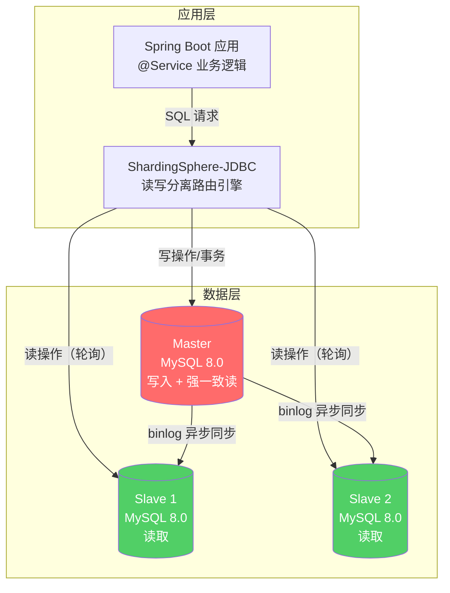
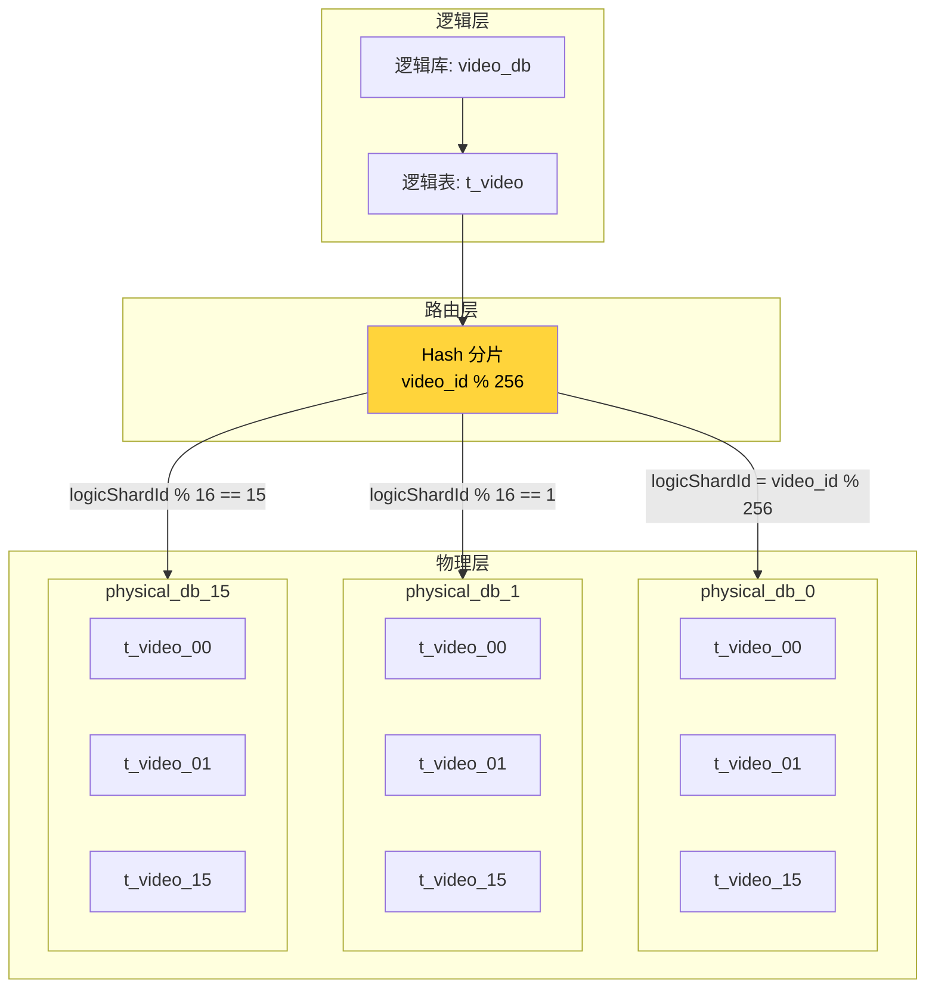
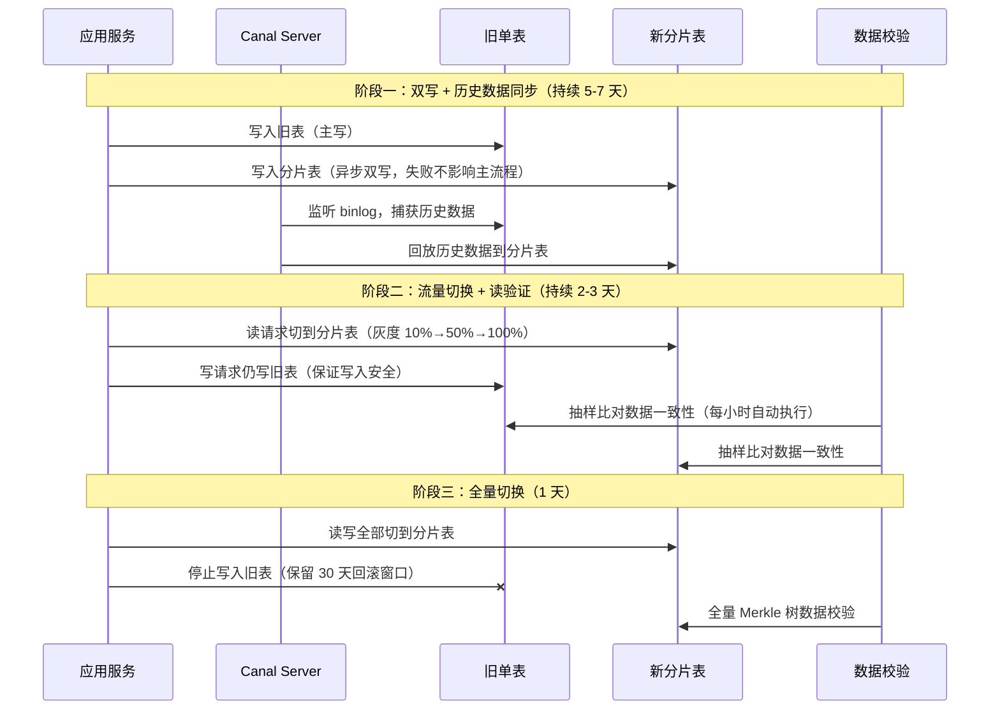
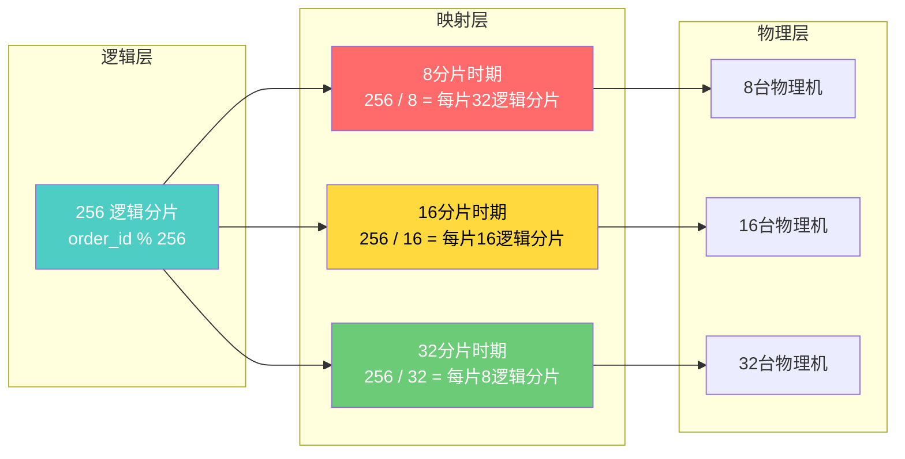
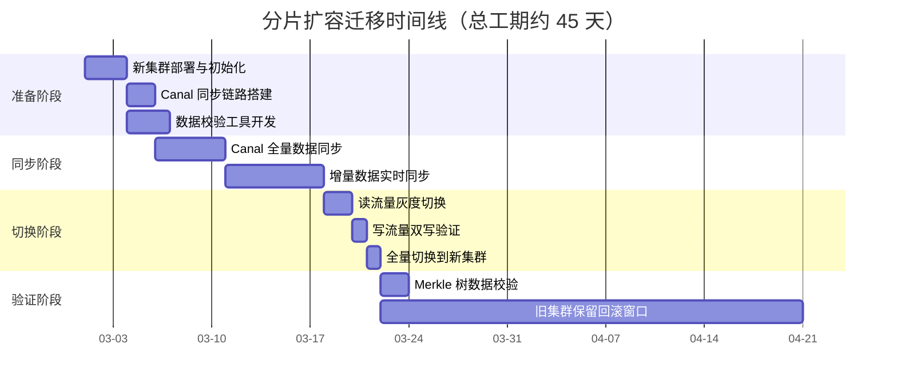
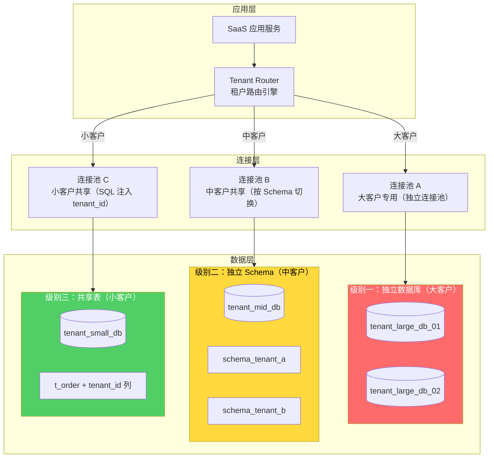

## 实战案例

本节通过四个真实场景的深度案例，展示读写分离与分库分表在不同业务规模和技术约束下的完整落地过程。四个案例覆盖了从「单库读写瓶颈」到「亿级分片」再到「多租户隔离」的完整技术演进路径，读者可以按照自身业务所处阶段，选择对应的案例深入学习。

**案例选型矩阵**——快速定位与你最相关的案例：

| 你的典型问题 | 推荐案例 | 核心技术方案 |
|-------------|---------|-------------|
| 主库扛不住读压力，大促频繁超时 | 案例一 | 读写分离 + 从库延迟感知 |
| 单表数据量过亿，查询/DDL严重变慢 | 案例二 | 分库分表 + 分布式ID + Canal迁移 |
| 业务增长后需要在线扩容分片 | 案例三 | 逻辑分片重映射 + 零停机迁移 |
| 不同客户需要不同级别的数据隔离 | 案例四 | 多租户三级隔离 + 动态路由 |

每个案例均包含：问题诊断 → 方案设计 → 完整配置实现 → 性能数据 → 经验总结与避坑指南。

---

## 案例一：中型电商平台的ShardingSphere-JDBC读写分离改造

### 1.1 问题背景

某中型电商平台在大促期间频繁出现数据库瓶颈，核心指标如下：

| 指标 | 改造前 | 目标值 | 瓶颈分析 |
|------|--------|--------|----------|
| 峰值 QPS | 8,000 | 16,000+ | 读请求占 85%，全部打到主库 |
| 读写比例 | 85% : 15% | — | 典型电商读多写少场景 |
| 主库 CPU 使用率 | 90% | < 50% | 大促时飙升至 90%，接近过载 |
| 平均查询延迟 (P99) | 320ms | < 100ms | 用户下单后看不到订单，客诉激增 |
| 数据库连接池利用率 | 95% | < 70% | 新请求排队等待，超时率 12% |

**核心矛盾**：读请求占 85% 但全部打到主库，主库 CPU 在大促时飙升至 90%，连接池接近耗尽，大量请求超时。业务特征决定了读写分离是投入产出比最高的优化手段——不需要改业务代码，不需要做数据迁移，仅需在数据库层引入从库分担读压力。

**为什么选 ShardingSphere-JDBC 而不是 Proxy 模式？**

| 对比维度 | ShardingSphere-JDBC | ShardingSphere-Proxy |
|----------|---------------------|---------------------|
| 部署方式 | 嵌入应用进程，无额外部署 | 独立进程，需额外运维 |
| 性能损耗 | 几乎无（JVM 内直接调用） | 网络跳转，增加 1-3ms |
| 运维成本 | 低（随应用发布） | 高（需独立监控/扩缩容） |
| 语言限制 | 仅 Java | 任意语言均可接入 |
| 适用场景 | Java 应用、性能敏感 | 多语言混写、需统一管控 |

本案例应用全部为 Java 技术栈，追求最低性能损耗，因此选择 JDBC 模式。

### 1.2 架构设计

采用 **1主2从** 的 MySQL 主从复制架构，通过 ShardingSphere-JDBC 在应用层实现透明的读写分离：



**从库选择策略**：采用 **轮询（Round Robin）** 策略，均匀分配读请求。同时配置 **延迟阈值**（5秒），当从库复制延迟超过阈值时自动剔除，防止读到过期数据。

**延迟感知的工作原理**：
1. ShardingSphere 定期（默认 1 秒）通过 `SHOW SLAVE STATUS` 检查 `Seconds_Behind_Master`
2. 当延迟 > 配置阈值（5秒）时，将该从库标记为不可用
3. 读请求自动路由到剩余可用从库
4. 延迟恢复后自动重新加入读路由池

### 1.3 完整配置实现

**application.yml 完整配置**：

```yaml
spring:
  shardingsphere:
    # 数据源配置
    datasource:
      names: master,slave0,slave1
      master:
        type: com.zaxxer.hikari.HikariDataSource
        driver-class-name: com.mysql.cj.jdbc.Driver
        jdbc-url: jdbc:mysql://10.0.1.10:3306/ecommerce?serverTimezone=Asia/Shanghai
        username: app_rw
        password: ${DB_MASTER_PASSWORD}
        hikari:
          maximum-pool-size: 50
          minimum-idle: 10
          connection-timeout: 3000
          max-lifetime: 1800000
      slave0:
        type: com.zaxxer.hikari.HikariDataSource
        driver-class-name: com.mysql.cj.jdbc.Driver
        jdbc-url: jdbc:mysql://10.0.1.11:3306/ecommerce?serverTimezone=Asia/Shanghai
        username: app_ro
        password: ${DB_SLAVE0_PASSWORD}
        hikari:
          maximum-pool-size: 80
          minimum-idle: 20
      slave1:
        type: com.zaxxer.hikari.HikariDataSource
        driver-class-name: com.mysql.cj.jdbc.Driver
        jdbc-url: jdbc:mysql://10.0.1.12:3306/ecommerce?serverTimezone=Asia/Shanghai
        username: app_ro
        password: ${DB_SLAVE1_PASSWORD}
        hikari:
          maximum-pool-size: 80
          minimum-idle: 20

    # 规则配置
    rules:
      readwrite-splitting:
        data-sources:
          ecommerce-ds:
            write-data-source-name: master
            read-data-source-names: slave0,slave1
            load-balancer-name: round-robin
            props:
              sql-simple:
                read-data-source-names: slave0,slave1
        load-balancers:
          round-robin:
            type: ROUND_ROBIN
            props:
              # 从库延迟阈值：超过 5 秒自动剔除
              health-check-timeout: 3s

# ShardingSphere 日志（调试时开启）
logging:
  level:
    org.apache.shardingsphere: DEBUG
```

> **配置要点解读**：
> - 主库连接池 50 连接，从库各 80 连接。主库写操作相对少但必须保证不被读挤占，从库读操作多所以分配更多连接
> - `health-check-timeout: 3s` 配合 `replication-lag` 阈值实现从库延迟感知
> - 所有敏感信息通过环境变量注入，禁止硬编码

**Java 端强制主库路由注解**：

```java
/**
 * 强制路由到主库的注解，用于需要读最新数据的场景
 */
@Target({ElementType.METHOD, ElementType.TYPE})
@Retention(RetentionPolicy.RUNTIME)
public @interface ReadMaster {
}

/**
 * AOP 切面：拦截 @ReadMaster 注解，设置 Hint 强制路由到主库
 */
@Aspect
@Component
public class ReadMasterAspect {

    @Around("@annotation(readMaster)")
    public Object around(ProceedingJoinPoint joinPoint, ReadMaster readMaster) throws Throwable {
        try {
            // ShardingSphere Hint: 强制使用写数据源（主库）
            HintManager.getInstance().setWriteRouteOnly();
            return joinPoint.proceed();
        } finally {
            // 必须清理，否则会污染同一线程后续请求的路由
            HintManager.clear();
        }
    }
}
```

**使用示例 —— 订单详情查询（需读主库）**：

```java
@Service
public class OrderService {

    @Autowired
    private OrderMapper orderMapper;

    /**
     * 下单后立即查询订单详情，需要读主库保证数据一致性
     * 典型场景：用户下单成功后跳转到订单详情页
     */
    @ReadMaster
    public OrderDetail getOrderAfterCreate(Long orderId) {
        return orderMapper.selectDetailById(orderId);
    }

    /**
     * 普通订单列表查询，走从库即可
     * 列表页对数据实时性要求不高，几百毫秒延迟可接受
     */
    public Page<OrderSummary> listOrders(OrderQuery query) {
        return orderMapper.selectByCondition(query);
    }

    /**
     * 支付回调后查询订单状态，必须走主库
     * 支付平台回调极快，如果读到旧状态会导致重复支付
     */
    @ReadMaster
    public OrderStatus getStatusAfterPayment(Long orderId) {
        return orderMapper.selectStatusById(orderId);
    }
}
```

### 1.4 改造效果对比

| 指标 | 改造前 | 改造后 | 变化 |
|------|--------|--------|------|
| 主库 CPU 峰值 | 90% | 40% | ↓ 56% |
| 峰值 QPS | 8,000 | 16,500 | ↑ 106% |
| 查询 P99 延迟 | 320ms | 75ms | ↓ 77% |
| 连接池利用率 | 95% | 62% | ↓ 33% |
| 数据库整体可用性 | 99.5% | 99.95% | ↑ 0.45% |
| 大促期间超时率 | 12% | 0.3% | ↓ 97.5% |

```mermaid
xychart-beta
    title "改造前后核心性能对比"
    x-axis ["主库CPU%", "P99延迟(ms/10)", "连接池%", "超时率%"]
    y-axis "数值" 0 --> 100
    bar "改造前" [90, 32, 95, 12]
    bar "改造后" [40, 7.5, 62, 0.3]
```



### 1.5 经验总结与避坑指南

**必须注意的三个坑**：

1. **事务路由陷阱**：`@Transactional` 方法内的读操作默认走从库，会读到事务未提交的旧数据。解决方案有两种：
   - 在事务方法上同时加 `@ReadMaster`（简单但侵入性强）
   - 在 ShardingSphere 配置中开启 `allow-read-data-source-downgrade`，让事务内读操作自动路由到主库（推荐）

2. **从库延迟导致的「数据消失」**：用户刚下单就去订单列表页查，但请求路由到延迟 10 秒的从库，订单「消失」了。解决方案：
   - 对写后读场景强制走主库（`@ReadMaster`）
   - 配置延迟阈值，延迟超过 5 秒的从库自动剔除
   - 从库硬件配置不能低于主库，避免同步能力不足

3. **连接池隔离**：主库写连接池（50连接）和从库读连接池（各80连接）独立配置，避免读操作占满连接池导致写操作被阻塞。同时建议配置 `connection-timeout`，读请求排队超过 3 秒直接超时，防止线程堆积。

**扩展建议**：当业务规模进一步增长（QPS > 50,000），可以在读写分离基础上叠加分库分表，进入案例二的阶段。

---

## 案例二：短视频平台的亿级数据分库分表实践

### 2.1 问题背景

某短视频平台进入高速增长期，核心数据量级如下：

| 数据实体 | 数据量 | 单表行数 | 月增长 | 问题严重度 |
|----------|--------|----------|--------|-----------|
| 视频表 (video) | 100 亿条 | 5 亿行/表 | 50 亿 | 🔴 极严重 |
| 用户-视频交互表 (interaction) | 500 亿条 | 5 亿行/表 | 150 亿 | 🔴 极严重 |
| 评论表 (comment) | 200 亿条 | 3 亿行/表 | 40 亿 | 🟡 严重 |

**核心问题**：单表超过 5 亿行后，MySQL InnoDB 的 B+ 树索引层级增加（从 3 层变为 4-5 层），查询延迟从 5ms 飙升到 200ms+。更致命的是 DDL 操作（如加索引、修改字段）需要锁表数小时，严重制约业务迭代速度。

**为什么不能继续垂直拆分？** 平台已经按业务域垂直拆分过（视频库、用户库、交互库），但每个库内单表仍然过大，垂直拆分的红利已经吃完，必须走向水平分片。

### 2.2 分片键选择分析

分片键的选择直接决定了系统的扩展性和查询效率。团队对三个候选键进行了全面评估：

| 候选分片键 | 优点 | 缺点 | 数据分布测试结果 | 结论 |
|------------|------|------|-----------------|------|
| `user_id` | 按用户查询效率高 | 大V用户数据倾斜严重（头部 1% 用户占 40% 数据） | 最大分片是最小分片的 80 倍 | ❌ 数据倾斜不可控 |
| `video_id` | 分布均匀，写入热点分散 | 跨用户查询需 scatter-gather | 最大/最小偏差 < 1% | ✅ 推荐（视频表） |
| `create_time` | 范围查询高效 | 写入热点集中在最新时间片 | 最新分片承载 60% 写入 | ❌ 写入热点不可控 |

最终方案：**视频表按 `video_id` 哈希分片**（写入均匀），**交互表按 `user_id` 分片**（用户维度查询是主场景，宁可牺牲写入均匀性换取查询效率）。**评论表按 `video_id` 分片**（评论总是跟着视频走）。

> **分片键选择的黄金法则**：哪个字段是你的「主查询路径」，就用哪个字段做分片键。写入均匀性可以通过 Snowflake ID 等手段间接保证，但查询效率是分片键选择的第一优先级。

### 2.3 分片架构与逻辑映射

采用 **16 物理库 × 每库 16 表 = 256 逻辑分片** 的架构：



**逻辑分片到物理分片的映射关系**：

| 逻辑分片 ID | 物理库编号 | 物理表编号 | 路由公式 |
|-------------|-----------|-----------|---------|
| 0 | physical_db_0 | t_video_00 | 0 % 16 = 0, 0 / 16 = 0 |
| 1 | physical_db_0 | t_video_01 | 1 % 16 = 1, 1 / 16 = 0 |
| 15 | physical_db_0 | t_video_15 | 15 % 16 = 15, 15 / 16 = 0 |
| 16 | physical_db_1 | t_video_00 | 16 % 16 = 0, 16 / 16 = 1 |
| 17 | physical_db_1 | t_video_01 | 17 % 16 = 1, 17 / 16 = 1 |
| 255 | physical_db_15 | t_video_15 | 255 % 16 = 15, 255 / 16 = 15 |

**路由公式**：

physicalDBIndex  = logicShardId % 物理库数量
physicalTableIndex = logicShardId / 物理库数量

**为什么选 16×16 = 256 而不是 8×8 = 64？**
- 256 个逻辑分片可以支撑到单分片 400 万行（100 亿 / 256 ≈ 390 万），远低于 5000 万的性能拐点
- 未来扩容只需调整映射关系（256 → 更多物理分片），无需重新分片
- 16 个物理库 × 16 表的配置在 MySQL 管理能力范围内，不会导致运维复杂度失控

### 2.4 分布式ID生成方案

分库分表后，MySQL 自增 ID 不再全局唯一，必须引入分布式 ID 生成方案。

**方案对比**：

| 方案 | 唯一性 | 有序性 | 性能 | 可用性 | 适用场景 |
|------|--------|--------|------|--------|---------|
| UUID | ✅ | ❌ 无序 | 高 | 极高 | 非核心数据 |
| 数据库自增 | ✅ | ✅ | 低（单点瓶颈） | 低 | 小规模系统 |
| Redis INCR | ✅ | ✅ | 高 | 中 | 中等规模 |
| Snowflake | ✅ | ✅ 趋势递增 | 极高 | 高 | **推荐：大规模系统** |
| Leaf (美团) | ✅ | ✅ | 极高 | 高 | 大规模系统 |

本案例采用 **Snowflake 集群方案**，部署多个 ID 生成节点：

```java
/**
 * Snowflake ID 生成器 —— 增强版（含时钟回拨保护）
 *
 * ID 结构: 1位符号位 + 41位时间戳 + 5位数据中心ID + 5位工作机器ID + 12位序列号
 * - 41位时间戳：可用约 69 年
 * - 5位数据中心 + 5位工作机器：最多 1024 个节点
 * - 12位序列号：每毫秒最多 4096 个ID
 */
public class EnhancedSnowflakeIdGenerator {

    // 起始时间戳 (2024-01-01 00:00:00)，减少时间戳位数消耗
    private static final long EPOCH = 1704067200000L;
    // 各部分位数
    private static final long WORKER_ID_BITS = 5L;
    private static final long DATACENTER_ID_BITS = 5L;
    private static final long SEQUENCE_BITS = 12L;
    // 最大值
    private static final long MAX_WORKER_ID = ~(-1L << WORKER_ID_BITS);   // 31
    private static final long MAX_DATACENTER_ID = ~(-1L << DATACENTER_ID_BITS); // 31
    // 左移位数
    private static final long WORKER_ID_SHIFT = SEQUENCE_BITS;
    private static final long DATACENTER_ID_SHIFT = SEQUENCE_BITS + WORKER_ID_BITS;
    private static final long TIMESTAMP_SHIFT = SEQUENCE_BITS + WORKER_ID_BITS + DATACENTER_ID_BITS;

    private final long workerId;
    private final long datacenterId;
    private long sequence = 0L;
    private long lastTimestamp = -1L;

    // 时钟回拨容忍窗口（5ms），超过此值直接报错
    private static final long MAX_CLOCK_DRIFT_MS = 5L;

    public EnhancedSnowflakeIdGenerator(long workerId, long datacenterId) {
        if (workerId > MAX_WORKER_ID || workerId < 0) {
            throw new IllegalArgumentException("Worker ID 超出范围 [0, " + MAX_WORKER_ID + "]");
        }
        if (datacenterId > MAX_DATACENTER_ID || datacenterId < 0) {
            throw new IllegalArgumentException("Datacenter ID 超出范围 [0, " + MAX_DATACENTER_ID + "]");
        }
        this.workerId = workerId;
        this.datacenterId = datacenterId;
    }

    public synchronized long nextId() {
        long timestamp = System.currentTimeMillis();

        // 时钟回拨保护：NTP 校正可能导致时间倒退
        if (timestamp < lastTimestamp) {
            long drift = lastTimestamp - timestamp;
            if (drift <= MAX_CLOCK_DRIFT_MS) {
                // 小范围回拨（≤5ms）：等待追上，避免生成重复 ID
                timestamp = waitUntilNextMillis(lastTimestamp);
            } else {
                // 大范围回拨（>5ms）：直接抛异常，触发告警
                // 因为等待时间过长会影响业务可用性
                throw new RuntimeException(
                    String.format("检测到时钟回拨 %dms，超过容忍阈值 %dms。请检查 NTP 配置。",
                        drift, MAX_CLOCK_DRIFT_MS));
            }
        }

        if (timestamp == lastTimestamp) {
            // 同一毫秒内：序列号递增
            sequence = (sequence + 1) &amp; 4095L;  // 4095 = 2^12 - 1
            if (sequence == 0) {
                // 序列号用尽（4096个/毫秒），等待下一毫秒
                timestamp = waitUntilNextMillis(lastTimestamp);
            }
        } else {
            // 新的毫秒：序列号归零
            sequence = 0L;
        }

        lastTimestamp = timestamp;

        return ((timestamp - EPOCH) << TIMESTAMP_SHIFT)
                | (datacenterId << DATACENTER_ID_SHIFT)
                | (workerId << WORKER_ID_SHIFT)
                | sequence;
    }

    private long waitUntilNextMillis(long lastTs) {
        long ts = System.currentTimeMillis();
        while (ts <= lastTs) {
            ts = System.currentTimeMillis();
        }
        return ts;
    }
}
```

**NTP 同步与监控配置**（Snowflake 的生命线）：

```bash
# /etc/ntp.conf 关键配置
server ntp1.aliyun.com iburst
server ntp2.aliyun.com iburst
tinker panic 0        # 防止 NTP 大幅校正导致时间跳变
tinker step 0.5       # 每次校正不超过 0.5 秒，渐进式调整

# 监控脚本：检测时钟偏移，超过阈值立即告警
#!/bin/bash
DRIFT=$(ntpq -p 2>/dev/null | grep '^\*' | awk '{print $9}')
if (( $(echo "$DRIFT > 100" | bc -l) )); then
    curl -X POST https://alert.internal/api/send \
        -d '{"level":"critical","msg":"Snowflake节点时钟偏移过大: '${DRIFT}'ms, 可能导致ID重复！"}'
fi
```

### 2.5 数据迁移方案（双写 + Canal）

从单表迁移到分片表是整个方案中风险最高的环节。采用 **三阶段渐进式迁移**，确保零数据丢失：



**Canal 配置片段**（监听旧表 binlog 并同步到分片表）：

```yaml
# canal.properties
canal.instance.mysql.slaveId=2001
canal.instance.master.address=10.0.1.10:3306
canal.instance.dbUsername=canal_reader
canal.instance.dbPassword=${CANAL_PASSWORD}
# 只监听需要迁移的表，避免 Canal 负载过高
canal.instance.filter.regex=ecommerce\\.t_video,ecommerce\\.t_interaction
# Canal 内存队列大小，根据 binlog 产生速度调整
canal.instance.memory.buffer.size=16384
```

**迁移期间的容错设计**：
- 双写失败时：记录到本地补偿队列（Redis List），由定时任务重试，不阻塞主流程
- Canal 同步延迟时：监控 lag 指标，超过阈值暂停读切换，等 Canal 追上
- 数据不一致时：自动触发全量校验 + 增量修复，不阻塞业务

### 2.6 监控看板核心指标

分库分表后，监控维度从「单库单表」变为「多库多表」，需要全新的监控体系：

```yaml
# Prometheus 监控指标（按分片维度采集）
shard_query_total{db="physical_db_0", table="t_video_00"}       # 每个分片的查询总数
shard_query_latency_p99{db="physical_db_0", table="t_video_00"} # 每个分片的 P99 延迟
shard_data_distribution{shard_id="0..255"}                       # 数据分布均匀度
replication_lag_seconds{instance="slave_01"}                     # 主从复制延迟
shard_write_throughput{db="physical_db_0"}                       # 每个分片的写入吞吐
```

**Grafana 看板核心面板**：

| 面板 | 监控内容 | 告警阈值 | 处理方式 |
|------|---------|---------|---------|
| 分片延迟热力图 | 256 个分片的 P99 延迟 | 单分片 > 50ms | 检查该分片数据量/慢查询 |
| 数据分布柱状图 | 各物理库行数占比 | 偏差 > 5% | 检查分片键选择/数据倾斜 |
| 跨分片查询占比 | scatter-gather 请求比例 | > 10% | 优化分片键或加冗余索引 |
| Canal 同步延迟 | 增量同步 lag | > 30s | 检查 Canal 资源/网络 |

**数据分布均匀度监控**（Hash 分片后的真实数据分布）：

| 物理库 | 视频表行数（亿） | 占比 | 偏差 |
|--------|------------------|------|------|
| physical_db_0 | 6.32 | 6.32% | +0.07% |
| physical_db_1 | 6.28 | 6.28% | -0.03% |
| physical_db_7 | 6.35 | 6.35% | +0.10% |
| physical_db_15 | 6.30 | 6.30% | +0.05% |

Hash 分片的数据分布偏差控制在 ±0.1% 以内，分布均匀，无需额外处理数据倾斜。

### 2.7 经验总结与避坑指南

1. **分片键选择必须先跑数据分布测试**：不要凭经验选分片键，用真实数据跑一遍分布测试。头部 1% 的大V用户可能贡献 40% 的数据量，按 user_id 分片会导致严重的数据倾斜
2. **256 逻辑分片是安全起点**：太少（64）不够未来扩展，太多（1024）运维复杂。256 可以支撑到单分片 400 万行，足够应对百亿级数据
3. **迁移阶段不要跳步**：双写 → 读验证 → 全量切换，每个阶段都要有明确的退出条件和回滚方案。曾经有团队跳过读验证直接全量切换，结果发现 Canal 漏同步了 3% 的数据
4. **Snowflake 的时钟回拨是定时炸弹**：NTP 自动校正可能在凌晨批量触发，务必配置 `tinker panic 0` 和 `tinker step 0.5`，并部署时钟偏移监控

---

## 案例三：金融交易系统的分片扩容实战

### 3.1 问题背景

某金融交易系统运行 3 年后，原有 8 分片架构达到瓶颈：

| 指标 | 当前值 | 扩容目标 | 瓶颈原因 |
|------|--------|----------|---------|
| 分片数 | 8 | 16 | 单片承载 2 亿行，接近性能拐点 |
| 单分片数据量 | 2 亿行 | 1 亿行 | B+ 树 4 层索引，P99 延迟 85ms |
| 日均交易笔数 | 800 万笔 | 支撑 2000 万笔 | 写入吞吐接近单片极限 |
| 写入延迟 (P99) | 85ms | < 35ms | 金融交易对延迟零容忍 |
| 系统可用性 | 99.9% | 99.99% | 年停机从 8.7 小时降至 52 分钟 |

**核心挑战**：金融系统对数据一致性要求极高，要求 **零停机扩容**，且不能丢失任何一笔交易记录。这意味着扩容过程必须是「在线热迁移」，业务全程无感知。

### 3.2 逻辑分片重映射策略

为支持未来多次扩容，采用 **256 逻辑分片 → N 物理分片** 的映射方案。核心思想是：业务代码中的分片路由永远使用 `order_id % 256`，变化的只是「256 逻辑分片如何映射到物理机器」：



**ShardingSphere-Proxy 配置（扩容后：8 → 16 分片）**：

```yaml
# config-sharding.yaml
rules:
  - !SHARDING
    tables:
      t_transaction:
        # 扩容前: ds_${0..7}.t_transaction_${0..7}
        # 扩容后: ds_${0..15}.t_transaction_${0..15}
        actual-data-nodes: ds_${0..15}.t_transaction_${0..15}
        database-strategy:
          standard:
            sharding-column: order_id
            sharding-algorithm-name: db-hash
        table-strategy:
          standard:
            sharding-column: order_id
            sharding-algorithm-name: tbl-hash
    sharding-algorithms:
      db-hash:
        type: HASH_MOD
        props:
          sharding-count: 16   # 从 8 改为 16
      tbl-hash:
        type: HASH_MOD
        props:
          sharding-count: 16
```

**关键设计原则**：逻辑分片 ID 计算方式不变（`order_id % 256`），变化的只是逻辑到物理的映射关系。这样扩容时业务代码零改动，只需要更新 ShardingSphere 的路由配置。

### 3.3 零停机迁移流程

金融系统的迁移流程必须有严格的时间窗口和回滚机制：



**每个阶段的退出条件**：

| 阶段 | 退出条件 | 不满足时的处理 |
|------|---------|--------------|
| Canal 全量同步 | 旧库所有表行数 = 新库对应分片行数（误差 < 0.01%） | 排查 Canal 配置，重新同步 |
| 增量实时同步 | Canal lag < 1 秒，持续 24 小时 | 检查网络带宽/Canal 资源 |
| 读灰度切换 | 新集群查询 P99 < 40ms，无数据异常 | 回滚到旧集群读，排查慢查询 |
| 全量切换 | 读写全部走新集群，旧集群无流量 | 回滚到旧集群，排查写入问题 |
| 数据校验 | Merkle 树根哈希一致 | 逐分片对比，定位并修复不一致数据 |

### 3.4 Merkle 树数据校验

金融系统的数据校验不能只比对行数，必须逐字段验证数据完整性。采用 Merkle 树实现高效的分层比对：

```java
/**
 * 基于 Merkle 树的数据一致性校验
 *
 * 原理：
 * - 每个叶子节点 = 一个数据分片的哈希值（行数 + 关键字段 checksum）
 * - 父节点 = 两个子节点哈希的组合哈希
 * - 根哈希 = 整个数据集的指纹
 * - 根哈希相同 → 数据一致；不同 → 逐层下钻定位不一致的具体分片
 */
public class MerkleTreeVerifier {

    /**
     * 构建数据分片的 Merkle 树根哈希
     * 每个叶子节点 = 一个数据分片的哈希值
     */
    public String computeRootHash(DataSource ds, String tableName, int shardCount) {
        List<String> leafHashes = new ArrayList<>();

        for (int i = 0; i < shardCount; i++) {
            String shardHash = computeShardHash(ds, tableName, i);
            leafHashes.add(shardHash);
        }

        return buildMerkleRoot(leafHashes);
    }

    private String computeShardHash(DataSource ds, String table, int shardId) {
        // 计算每个分片的行数 + 关键字段的 checksum
        // 关键字段：id, amount, status, create_time
        String sql = String.format(
            "SELECT COUNT(*) as cnt, " +
            "MD5(GROUP_CONCAT(CONCAT_WS(':', id, amount, status, " +
            "UNIX_TIMESTAMP(create_time)) ORDER BY id)) as checksum " +
            "FROM %s WHERE MOD(shard_key, %d) = %d",
            table, 256, shardId
        );
        return executeQueryForHash(ds, sql);
    }

    /**
     * 对比两个集群的 Merkle 树根哈希
     * 如果根哈希不同，逐层下钻定位不一致的具体分片
     */
    public DiffReport compare(String oldRootHash, String newRootHash,
                              DataSource oldDs, DataSource newDs, int shardCount) {
        if (oldRootHash.equals(newRootHash)) {
            return DiffReport.identical();
        }
        // 根哈希不同 → 逐分片对比，精确定位不一致的分片
        DiffReport report = new DiffReport();
        for (int i = 0; i < shardCount; i++) {
            String oldHash = computeShardHash(oldDs, "t_transaction", i);
            String newHash = computeShardHash(newDs, "t_transaction", i);
            if (!oldHash.equals(newHash)) {
                report.addMismatch(i, oldHash, newHash);
            }
        }
        return report;
    }
}
```

**校验效率**：256 个分片 × 每分片一条聚合 SQL，全量校验耗时约 3-5 分钟。相比逐行比对（可能需要数小时），Merkle 树方案将校验时间缩短了 90% 以上。

### 3.5 扩容效果

| 指标 | 扩容前（8片） | 扩容后（16片） | 变化 |
|------|---------------|----------------|------|
| 写入 P99 延迟 | 85ms | 34ms | ↓ 60% |
| 日写入吞吐量 | 800 万笔 | 1,440 万笔 | ↑ 80% |
| 单片数据量 | 2 亿行 | 1 亿行 | ↓ 50% |
| 系统可用性 | 99.9% | 99.99% | ↑ 10 倍 |
| 扩容停机时间 | — | 0 秒 | 零停机 |
| DDL 执行时间（加索引） | 6 小时 | 1.5 小时 | ↓ 75% |

### 3.6 经验总结与避坑指南

1. **256 逻辑分片是扩容的「预付费」**：初期只用 8 个物理分片，但预留 256 个逻辑分片空间。扩容时只需调整映射关系，不需要重新分片。这个设计成本几乎为零，但为未来省去了巨大的迁移成本
2. **金融系统必须有 Merkle 树校验**：只比对行数是不够的。曾经出现过「行数一致但 3 笔交易金额错误」的情况，只有逐字段校验才能发现
3. **旧集群保留 30 天回滚窗口**：金融系统的数据错误可能不会立即暴露。30 天的回滚窗口给了足够的缓冲时间来发现和修复问题
4. **灰度切换的节奏很重要**：10% → 50% → 100%，每个阶段至少观察 24 小时。金融交易在不同时段（开盘/收盘/对账）的表现可能不同，需要覆盖完整业务周期

---

## 案例四：SaaS 多租户架构的数据库隔离方案

### 4.1 问题背景

某 SaaS 平台服务 2,000+ 企业客户，租户规模差异极大：

| 租户类型 | 数量占比 | 数据量占比 | 隔离要求 | 合规要求 | 月付费 |
|----------|----------|------------|----------|----------|--------|
| 大型企业 | 5%（100家） | 60% | 强隔离（独立库） | 金融级合规 | > 10万/月 |
| 中型企业 | 25%（500家） | 30% | 中等隔离（独立 Schema） | 一般合规 | 1-10万/月 |
| 小微企业 | 70%（1400家） | 10% | 弱隔离（共享表） | 基础合规 | < 1万/月 |

**核心挑战**：不同租户对隔离级别、性能和成本的要求截然不同。大客户要求独立数据库（金融合规硬性要求），小客户只需要共享表（成本敏感），需要一个统一架构同时支持三种隔离模式，并支持租户在不同级别间动态迁移。

### 4.2 三级隔离架构



**三种隔离模式的适用场景决策树**：

- 月付费 > 10万 或 有金融合规要求 → **独立数据库**
- 月付费 1-10万 或 数据量 > 100GB → **独立 Schema**
- 月付费 < 1万 且 数据量 < 10GB → **共享表**

### 4.3 租户路由核心实现

```java
/**
 * 租户上下文 —— 通过 ThreadLocal 传递当前租户信息
 * 生命周期：请求开始设置，请求结束清理
 */
public class TenantContext {

    private static final ThreadLocal<TenantInfo> CURRENT = new ThreadLocal<>();

    public static void set(TenantInfo info) {
        CURRENT.set(info);
    }

    public static TenantInfo get() {
        return CURRENT.get();
    }

    public static void clear() {
        CURRENT.remove();  // 必须清理，否则线程池复用时会泄漏租户信息
    }
}

/**
 * 数据源路由 —— 根据租户级别路由到不同数据源
 *
 * 路由逻辑：
 * SEPARATE_DB    → 独立数据库连接池
 * SEPARATE_SCHEMA → 共享连接池 + setSchema()
 * SHARED_TABLE   → 共享连接池 + SQL 拦截注入 tenant_id
 */
public class TenantDataSourceRouter extends AbstractDataSource {

    private final Map<String, DataSource> tenantDataSources;
    private final TenantConfigRepository configRepo;

    @Override
    public Connection getConnection() throws SQLException {
        TenantInfo tenant = TenantContext.get();
        if (tenant == null) {
            throw new IllegalStateException("未设置租户上下文，请检查拦截器配置");
        }

        switch (tenant.getIsolationLevel()) {
            case SEPARATE_DB:
                // 大客户：独立数据库，完全隔离
                DataSource dedicatedDs = getDedicatedDataSource(tenant);
                return dedicatedDs.getConnection();

            case SEPARATE_SCHEMA:
                // 中客户：独立 Schema，共享数据库实例
                DataSource sharedDs = getSharedDataSource(tenant);
                Connection conn = sharedDs.getConnection();
                conn.setSchema(tenant.getSchemaName());
                return conn;

            case SHARED_TABLE:
                // 小客户：共享表，通过 SQL 拦截器注入 tenant_id 条件
                return getSharedTableDataSource(tenant).getConnection();

            default:
                throw new IllegalArgumentException("未知隔离级别: " + tenant.getIsolationLevel());
        }
    }
}
```

**MyBatis 拦截器 —— 共享表场景自动注入 tenant_id**：

```java
/**
 * SQL 拦截器：共享表模式自动追加 tenant_id 过滤条件
 *
 * 安全保障：
 * 1. 仅对 SHARED_TABLE 隔离级别生效
 * 2. 使用 JSQLParser 解析 SQL AST，避免 SQL 注入
 * 3. 自动处理 WHERE 子句的有无
 */
@Intercepts({
    @Signature(type = StatementHandler.class,
               method = "prepare",
               args = {Connection.class, Integer.class})
})
public class TenantSqlInterceptor implements Interceptor {

    @Override
    public Object intercept(Invocation invocation) throws Throwable {
        TenantInfo tenant = TenantContext.get();

        // 仅对共享表模式生效，其他隔离级别不干预 SQL
        if (tenant == null || tenant.getIsolationLevel() != IsolationLevel.SHARED_TABLE) {
            return invocation.proceed();
        }

        StatementHandler handler = (StatementHandler) invocation.getTarget();
        MetaObject meta = SystemMetaObject.forObject(handler);

        // 获取原始 SQL
        BoundSql boundSql = handler.getBoundSql();
        String originalSql = boundSql.getSql();

        // 使用 JSQLParser 解析 SQL AST，安全注入 tenant_id 条件
        // 避免简单字符串拼接导致的 SQL 注入风险
        String modifiedSql = injectTenantCondition(originalSql, tenant.getTenantId());
        meta.setValue("delegate.boundSql.sql", modifiedSql);

        return invocation.proceed();
    }

    private String injectTenantCondition(String sql, Long tenantId) {
        // 实际生产中应使用 JSQLParser 解析并安全注入
        // 这里简化演示逻辑
        Statement stmt = CCJSqlParserUtil.parse(sql);
        if (stmt instanceof Select) {
            Select select = (Select) stmt;
            Expression where = select.getWhere();
            Expression tenantCondition = new EqualsTo(
                new Column("tenant_id"),
                new LongValue(tenantId)
            );
            if (where == null) {
                select.setWhere(tenantCondition);
            } else {
                select.setWhere(new AndExpression(where, tenantCondition));
            }
        }
        return stmt.toString();
    }
}
```

### 4.4 租户级连接池资源隔离

连接池隔离是防止「吵闹邻居」问题的关键——一个大租户的慢查询不能拖垮其他租户的数据库连接：

```yaml
# 多租户连接池配置
tenant-pool:
  # 大客户专用连接池（独立 DB，不受其他租户影响）
  dedicated:
    max-active: 30        # 每个大客户独立连接池
    min-idle: 10
    max-wait: 2000        # 2 秒超时，大客户 SLA 保障
    connection-timeout: 1000

  # 中客户共享连接池（按租户分组限流）
  shared-medium:
    max-active: 50        # 500 家中客户共享
    min-idle: 15
    max-wait: 3000
    per-tenant-max-active: 10    # 单租户最大 10 个连接，防止独占
    per-tenant-throttle-ms: 100  # 超限后排队 100ms

  # 小客户共享连接池（共享 + SQL 队列）
  shared-small:
    max-active: 80        # 1400 家小客户共享
    min-idle: 20
    max-wait: 5000        # 小客户可接受更长等待
    per-tenant-max-active: 5     # 单租户最大 5 个连接
    per-tenant-throttle-ms: 200  # 超限后排队 200ms
```

**连接池隔离的效果**：

| 场景 | 无隔离 | 有隔离 |
|------|--------|--------|
| 大客户慢查询占满连接 | 全平台所有租户受影响 | 仅影响该大客户的连接池 |
| 小客户突发流量 | 抢占中客户的连接资源 | 被限流在自己的配额内 |
| 数据库整体连接数 | 不可控，容易打爆 | 精确控制，不会超过 MySQL max_connections |

### 4.5 租户隔离级别迁移

支持租户在不同隔离级别间动态迁移（如小客户升级为中客户），迁移过程对租户完全透明：

```sql
-- 迁移脚本：共享表 → 独立 Schema（以 t_order 表为例）
-- 步骤 1：在目标 DB 创建 Schema
CREATE DATABASE tenant_xxx_db;
USE tenant_xxx_db;

-- 步骤 2：复制表结构（不含 tenant_id 列，因为独立 Schema 不需要）
CREATE TABLE t_order AS
SELECT id, order_no, amount, status, create_time
FROM shared_db.t_order
WHERE 1 = 0;  -- 只复制结构，不复制数据

-- 步骤 3：复制数据
INSERT INTO tenant_xxx_db.t_order
SELECT id, order_no, amount, status, create_time
FROM shared_db.t_order
WHERE tenant_id = 10001;

-- 步骤 4：建立索引（与共享表保持一致）
CREATE INDEX idx_order_no ON tenant_xxx_db.t_order(order_no);
CREATE INDEX idx_create_time ON tenant_xxx_db.t_order(create_time);

-- 步骤 5：验证数据量一致
SELECT COUNT(*) FROM shared_db.t_order WHERE tenant_id = 10001;  -- 旧：123456
SELECT COUNT(*) FROM tenant_xxx_db.t_order;                       -- 新：123456 ✓

-- 步骤 6：更新路由配置（原子操作，确保路由立即生效）
UPDATE tenant_routing_config
SET isolation_level = 'SEPARATE_SCHEMA',
    schema_name = 'tenant_xxx_db',
    updated_at = NOW()
WHERE tenant_id = 10001;
```

**迁移过程的双读校验机制**：

```java
/**
 * 隔离级别迁移期间的数据一致性校验
 * 在切换路由前，同时读取新旧两个数据源进行比对
 */
public void verifyMigration(Long tenantId) {
    // 同时读取旧/新两个数据源，比对数据
    List<Order> oldOrders = sharedTableRepo.findByTenantId(tenantId);
    List<Order> newOrders = separateSchemaRepo.findByTenantId(tenantId);

    if (oldOrders.size() != newOrders.size()) {
        log.error("租户 {} 迁移数据量不一致: 旧={} 新={}",
                  tenantId, oldOrders.size(), newOrders.size());
        throw new MigrationException("数据量不匹配，迁移中止");
    }

    // 逐条比对核心字段
    Map<Long, Order> oldMap = oldOrders.stream()
        .collect(Collectors.toMap(Order::getId, o -> o));
    int mismatchCount = 0;
    for (Order newOrder : newOrders) {
        Order oldOrder = oldMap.get(newOrder.getId());
        if (oldOrder == null || !oldOrder.equals(newOrder)) {
            log.error("租户 {} 数据不一致: orderId={}", tenantId, newOrder.getId());
            mismatchCount++;
        }
    }

    if (mismatchCount > 0) {
        throw new MigrationException("发现 " + mismatchCount + " 条不一致记录");
    }

    log.info("租户 {} 迁移校验通过，数据完全一致", tenantId);
}
```

### 4.6 多租户方案对比总结

| 维度 | 独立数据库 | 独立 Schema | 共享表 |
|------|-----------|-------------|--------|
| 数据隔离性 | ★★★★★ | ★★★★ | ★★★ |
| 运维复杂度 | 高（每个库独立管理） | 中（共享实例） | 低 |
| 单租户性能 | 最优（独占资源） | 良好（Schema 级隔离） | 受限（受其他租户影响） |
| 成本 | 高（每租户独立实例） | 中（共享实例） | 低（极致共享） |
| 适用场景 | 金融/政务大客户 | 中型付费客户 | 免费/小微客户 |
| 扩容方式 | 新增 DB 实例 | 新增 Schema | 扩容连接池 |
| 备份恢复 | 租户级独立备份 | Schema 级备份 | 需按 tenant_id 筛选 |
| 跨租户查询 | 不支持 | 不支持 | 支持（运营分析） |
| 故障爆炸半径 | 仅该租户 | 同实例所有租户 | 同库所有租户 |

### 4.7 经验总结与避坑指南

1. **ThreadLocal 清理是生命线**：`TenantContext.clear()` 必须在 finally 块中调用。线程池复用线程时如果不清理，下一个请求会继承上一个租户的上下文，导致严重的数据泄露
2. **共享表的 tenant_id 注入不能用简单拼接**：必须使用 JSQLParser 等 SQL 解析器，否则可能产生 SQL 注入漏洞。曾经有团队用字符串拼接实现，被安全团队发现后紧急回滚
3. **连接池 per-tenant 限流是防止「吵闹邻居」的唯一手段**：没有限流的情况下，一个租户的慢查询可以占满整个连接池，导致所有租户都受影响
4. **租户级别迁移要先校验再切换**：先复制数据 → 校验数据一致性 → 更新路由配置，顺序不能错。路由配置更新后要立即生效，不能有缓存延迟

---

## 跨案例总结：读写分离与分库分表的通用方法论

### 方案选型决策矩阵

| 你的业务规模 | 当前瓶颈 | 推荐方案 | 投入周期 | 预期收益 |
|-------------|---------|---------|---------|---------|
| QPS < 10,000，单表 < 1000万 | 读压力大 | 读写分离（案例一） | 1-2 周 | 读吞吐翻倍，主库压力降半 |
| QPS > 10,000，单表 > 5000万 | 读写都大 | 分库分表（案例二） | 2-4 周 | 查询延迟降至 <10ms |
| 已分片但需要扩容 | 单片瓶颈 | 逻辑分片重映射（案例三） | 4-6 周 | 零停机扩容 |
| 多租户，隔离需求不同 | 数据隔离 | 三级隔离架构（案例四） | 4-8 周 | 灵活满足不同租户需求 |

### 通用避坑清单

| 误区 | 正确做法 | 案例来源 |
|------|---------|---------|
| 事务内读操作走从库 | 事务内读必须走主库，或配置 `allow-read-data-source-downgrade` | 案例一 |
| 凭经验选分片键 | 用真实数据跑分布测试，验证均匀性 | 案例二 |
| 只比对行数验证数据 | 使用 Merkle 树逐字段校验 | 案例三 |
| 字符串拼接注入 tenant_id | 使用 JSQLParser 解析 SQL AST 安全注入 | 案例四 |
| 迁移时跳过灰度验证 | 严格按 验证→灰度→全量 的顺序执行 | 所有案例 |
| 不配置连接池隔离 | 主从/租户级别连接池独立配置 | 案例一/四 |

### 渐进式演进路径


**关键原则**：
- **渐进式改造**：不要一步到位。单库能扛住就不要分库，读写分离能解决就不要分表
- **可观测优先**：在做任何改造前，先把监控体系建好。没有数据支撑的优化是盲目的
- **数据安全兜底**：任何迁移都要有回滚方案。金融/支付等高敏感场景，回滚窗口至少保留 30 天
- **分片键预规划**：即使现在不需要分片，也要提前设计好分片键，避免将来被动迁移
- **连接池隔离**：读写分离/分库分表/多租户，所有场景都需要连接池隔离，这是防止「吵闹邻居」的基础

> 每个案例的技术方案都需要根据实际业务场景进行调整。没有银弹，只有适合你当前阶段的最佳实践。
