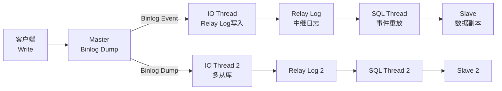
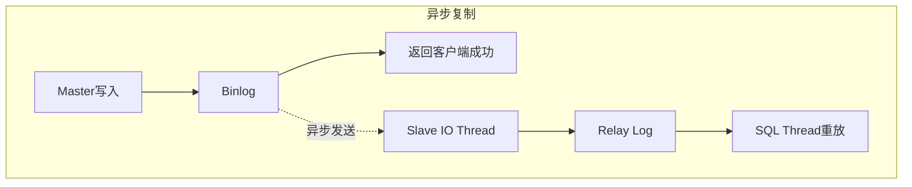
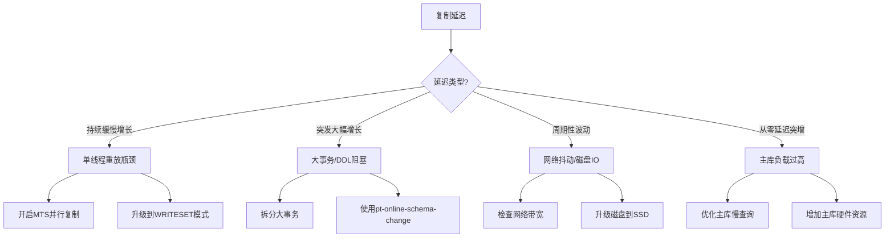

## MySQL复制实战

MySQL复制是读写分离与分库分表的基石——没有可靠的主从复制，读写分离无从谈起，分库分表的数据同步也会失去保障。本节从零开始，手把手完成主从复制的搭建、验证、监控与故障排查，并深入讲解复制延迟的诊断与优化方法。

---

## 一、复制架构总览

在动手之前，先理清MySQL复制的数据流和核心组件：



**核心组件说明：**

| 组件 | 所在位置 | 职责 |
|------|---------|------|
| Binlog Dump Thread | Master | 读取Binlog并通过网络发送给Slave |
| IO Thread | Slave | 接收Binlog Event并写入Relay Log |
| SQL Thread | Slave | 读取Relay Log并重放SQL语句或事务 |
| Relay Log | Slave磁盘 | 中间存储，确保网络断开后可断点续传 |

---

## 二、环境准备

### 2.1 系统要求

| 项目 | 最低要求 | 推荐配置 |
|------|---------|---------|
| 操作系统 | Ubuntu 20.04 / CentOS 7+ | Ubuntu 22.04 LTS |
| CPU | 2核 | 4核+ |
| 内存 | 4GB | 8GB+（Master和Slave独立） |
| 磁盘 | 50GB SSD | 100GB+ NVMe SSD |
| 网络 | 同一局域网 | 同一机房，延迟<1ms |
| MySQL版本 | 5.7+ | 8.0+（推荐，支持WRITESET并行复制） |

### 2.2 内核参数调优

```bash
# 提升网络连接队列长度
echo "net.core.somaxconn = 65535" | sudo tee -a /etc/sysctl.conf
# 增大文件描述符限制
echo "* soft nofile 65535" | sudo tee -a /etc/security/limits.conf
echo "* hard nofile 65535" | sudo tee -a /etc/security/limits.conf
# 调整TCP参数
echo "net.ipv4.tcp_max_syn_backlog = 65535" | sudo tee -a /etc/sysctl.conf
echo "net.ipv4.tcp_tw_reuse = 1" | sudo tee -a /etc/sysctl.conf
sudo sysctl -p
```

### 2.3 Docker快速搭建实验环境

使用Docker Compose可以在5分钟内搭建一主两从的完整实验环境：

**项目目录结构：**

mysql-replication/
├── docker-compose.yml
├── master/
│   └── my.cnf
├── slave1/
│   └── my.cnf
└── slave2/
    └── my.cnf

**Master配置文件 `master/my.cnf`：**

```ini
[mysqld]
server-id=1
log-bin=mysql-bin
binlog-format=ROW
binlog-expire-logs-seconds=604800
gtid-mode=ON
enforce-gtid-consistency=ON
max_connections=200
innodb_buffer_pool_size=1G
sync_binlog=1
innodb_flush_log_at_trx_commit=1
```

**Slave1配置文件 `slave1/my.cnf`：**

```ini
[mysqld]
server-id=2
relay-log=relay-bin
read-only=ON
super-read-only=ON
gtid-mode=ON
enforce-gtid-consistency=ON
# 并行复制配置（MySQL 5.7+）
slave_parallel_type=LOGICAL_CLOCK
slave_parallel_workers=4
slave_preserve_commit_order=1
# 延迟从库（可选，用于误操作恢复）
# MASTER_DELAY=3600
```

**docker-compose.yml：**

```yaml
version: '3.8'
services:
  mysql-master:
    build:
      context: .
      dockerfile: master/Dockerfile
    container_name: mysql-master
    environment:
      MYSQL_ROOT_PASSWORD: root123
      MYSQL_DATABASE: testdb
    ports:
      - "3306:3306"
    volumes:
      - master-data:/var/lib/mysql
      - ./master/my.cnf:/etc/mysql/conf.d/my.cnf
    networks:
      - repl-net
    healthcheck:
      test: ["CMD", "mysqladmin", "ping", "-h", "localhost", "-uroot", "-proot123"]
      interval: 5s
      timeout: 3s
      retries: 10

  mysql-slave1:
    build:
      context: .
      dockerfile: slave1/Dockerfile
    container_name: mysql-slave1
    environment:
      MYSQL_ROOT_PASSWORD: root123
    ports:
      - "3307:3306"
    volumes:
      - slave1-data:/var/lib/mysql
      - ./slave1/my.cnf:/etc/mysql/conf.d/my.cnf
    depends_on:
      mysql-master:
        condition: service_healthy
    networks:
      - repl-net

  mysql-slave2:
    build:
      context: .
      dockerfile: slave2/Dockerfile
    container_name: mysql-slave2
    environment:
      MYSQL_ROOT_PASSWORD: root123
    ports:
      - "3308:3306"
    volumes:
      - slave2-data:/var/lib/mysql
      - ./slave2/my.cnf:/etc/mysql/conf.d/my.cnf
    depends_on:
      mysql-master:
        condition: service_healthy
    networks:
      - repl-net

volumes:
  master-data:
  slave1-data:
  slave2-data:

networks:
  repl-net:
    driver: bridge
```

启动环境：

```bash
docker-compose up -d
# 等待所有容器健康
docker-compose ps
# 预期输出: mysql-master(healthy), mysql-slave1(healthy), mysql-slave2(healthy)
```

---

## 三、基于GTID的主从搭建全流程

MySQL 5.6+ 引入的GTID（Global Transaction Identifier）使复制拓扑管理大幅简化。每个事务都有全局唯一标识，不再需要手动指定binlog文件名和偏移量。

### 3.1 GTID原理

GTID格式: server_uuid:transaction_id

例如: 3E11FA47-71CA-11E1-9E33-C80AA9429562:23
       ─────────────────────────────── ───
              Master的UUID           事务序号

**GTID的优势：**

- 故障切换时自动定位复制位点，无需`CHANGE MASTER TO`指定文件名
- 轻松搭建级联复制和多源复制
- 可靠判断Master/Slave数据是否一致

### 3.2 Master端配置与初始化

```bash
# 进入Master容器
docker exec -it mysql-master mysql -uroot -proot123

# 查看GTID状态
SHOW VARIABLES LIKE 'gtid_mode';
# 应返回 ON

# 创建复制专用账号
CREATE USER 'repl_user'@'%' IDENTIFIED BY 'Repl@2026!';
GRANT REPLICATION SLAVE, REPLICATION CLIENT ON *.* TO 'repl_user'@'%';
FLUSH PRIVILEGES;

# 验证Binlog状态
SHOW MASTER STATUS;
# +------------------+----------+--------------+------------------+-------------------------------------------+
# | File             | Position | Binlog_Do_DB | Binlog_Ignore_DB | Executed_Gtid_Set                         |
# +------------------+----------+--------------+------------------+-------------------------------------------+
# | mysql-bin.000003 |      856 |              |                  | 3E11FA47-71CA-11E1-9E33-C80AA9429562:1-15 |
# +------------------+----------+--------------+------------------+-------------------------------------------+
```

### 3.3 Slave端配置与启动复制

```bash
# 进入Slave1容器
docker exec -it mysql-slave1 mysql -uroot -proot123

# 配置复制源（GTID模式，自动定位）
CHANGE MASTER TO
    MASTER_HOST='mysql-master',
    MASTER_PORT=3306,
    MASTER_USER='repl_user',
    MASTER_PASSWORD='Repl@2026!',
    MASTER_AUTO_POSITION=1,
    GET_MASTER_PUBLIC_KEY=1;  -- MySQL 8.0 caching_sha2_password认证需要

# 启动复制
START SLAVE;

# 检查复制状态
SHOW SLAVE STATUS\G
```

**关键检查项：**

*************************** 1. row ***************************
             Slave_IO_Running: Yes          ← 必须为Yes
            Slave_SQL_Running: Yes          ← 必须为Yes
        Seconds_Behind_Master: 0            ← 0表示无延迟
            Last_IO_Error:                  ← 空表示无错误
           Last_SQL_Error:                  ← 空表示无错误
  Retrieved_Gtid_Set: 3E11FA47-...:1-15     ← 已接收的GTID
   Executed_Gtid_Set: 3E11FA47-...:1-15     ← 已执行的GTID
       Auto_Position: 1                     ← GTID自动定位开启

> **常见错误排查：** 如果 `Slave_IO_Running` 显示 `Connecting`，检查网络连通性、端口、用户名密码。如果 `Slave_SQL_Running` 显示 `No`，查看 `Last_SQL_Error` 获取具体错误信息。

### 3.4 验证复制功能

```bash
# 在Master上创建测试数据
docker exec -it mysql-master mysql -uroot -proot123 -e "
CREATE DATABASE testdb;
USE testdb;
CREATE TABLE users (
    id INT AUTO_INCREMENT PRIMARY KEY,
    name VARCHAR(50),
    email VARCHAR(100),
    created_at TIMESTAMP DEFAULT CURRENT_TIMESTAMP
);
INSERT INTO users (name, email) VALUES
    ('张三', 'zhangsan@example.com'),
    ('李四', 'lisi@example.com'),
    ('王五', 'wangwu@example.com');
"

# 在Slave1上验证数据是否同步
docker exec -it mysql-slave1 mysql -uroot -proot123 -e "
SELECT * FROM testdb.users;
"

# 预期输出:
# +----+------+-------------------+---------------------+
# | id | name | email             | created_at          |
# +----+------+-------------------+---------------------+
# |  1 | 张三 | zhangsan@...      | 2026-06-26 ...      |
# |  2 | 李四 | lisi@...          | 2026-06-26 ...      |
# |  3 | 王五 | wangwu@...        | 2026-06-26 ...      |
# +----+------+-------------------+---------------------+
```

### 3.5 配置半同步复制

半同步复制确保至少一个Slave收到Binlog后Master才返回成功，是数据安全与性能的平衡点：

```sql
-- Master端安装半同步插件
INSTALL PLUGIN rpl_semi_sync_master SONAME 'semisync_master.so';
SET GLOBAL rpl_semi_sync_master_enabled = 1;
SET GLOBAL rpl_semi_sync_master_timeout = 1000;  -- 1秒超时后降级异步
SET GLOBAL rpl_semi_sync_master_wait_for_slave_count = 1;

-- Slave端安装半同步插件
INSTALL PLUGIN rpl_semi_sync_slave SONAME 'semisync_slave.so';
SET GLOBAL rpl_semi_sync_slave_enabled = 1;

-- 重启Slave的IO Thread使其生效
STOP SLAVE IO_THREAD;
START SLAVE IO_THREAD;

-- 验证半同步状态
SHOW STATUS LIKE 'Rpl_semi_sync_master_%';
-- Rpl_semi_sync_master_clients: 1      ← 已连接的半同步Slave数
-- Rpl_semi_sync_master_status: ON      ← 半同步已激活
-- Rpl_semi_sync_master_no_tx: 0        ← 异步降级次数（应为0或很小）
```

---

## 四、复制模式深度对比

### 4.1 三种复制模式



| 模式 | 数据安全 | 写入性能 | 实现复杂度 | 适用场景 |
|------|---------|---------|-----------|---------|
| 异步复制 | 低（Master崩溃可能丢数据） | 最高（无等待） | 低 | 允许少量数据丢失的读多写少场景 |
| 半同步复制 | 中（至少1个Slave确认） | 中（增加1次网络RTT） | 中 | 金融级数据安全需求 |
| 组复制（MGR） | 高（多数节点确认） | 较低（Paxos协议开销） | 高 | 需要强一致性和自动故障转移 |

### 4.2 Binlog格式对比

Binlog格式决定了复制中记录的信息粒度，直接影响数据一致性、复制性能和存储开销：

| 格式 | 记录内容 | 优点 | 缺点 | 推荐场景 |
|------|---------|------|------|---------|
| STATEMENT | SQL语句原文 | 日志量小 | 非确定性函数导致主从不一致（如`NOW()`、`UUID()`） | 日志量敏感、SQL简单场景 |
| ROW | 每行数据变更 | 数据一致性最高 | 日志量大（UPDATE全表可能产生巨大日志） | 数据安全优先、复杂SQL场景 |
| MIXED | 自动选择STATEMENT或ROW | 折中方案 | 遇到不安全SQL自动切ROW，行为不完全可控 | 通用场景（MySQL 5.7+默认推荐ROW） |

```sql
-- 查看当前Binlog格式
SHOW VARIABLES LIKE 'binlog_format';
-- 建议设置为ROW
SET GLOBAL binlog_format = 'ROW';

-- 查看Binlog中的事件（使用mysqlbinlog工具）
-- mysqlbinlog --base64-output=DECODE-ROWS -v mysql-bin.000001
```

---

## 五、复制监控体系

### 5.1 核心监控指标

生产环境中必须对以下指标建立持续监控：

| 指标 | 获取方式 | 告警阈值 | 含义 |
|------|---------|---------|------|
| `Slave_IO_Running` | `SHOW SLAVE STATUS` | ≠ Yes | IO线程是否正常运行 |
| `Slave_SQL_Running` | `SHOW SLAVE STATUS` | ≠ Yes | SQL线程是否正常运行 |
| `Seconds_Behind_Master` | `SHOW SLAVE STATUS` | > 5s（读写分离） | 主从延迟秒数 |
| `Retrieved_Gtid_Set` | `SHOW SLAVE STATUS` | — | 已从Master接收的GTID集合 |
| `Executed_Gtid_Set` | `SHOW SLAVE STATUS` | — | 已在Slave执行的GTID集合 |
| `Last_IO_Errno` | `SHOW SLAVE STATUS` | ≠ 0 | IO线程错误码 |
| `Last_SQL_Errno` | `SHOW SLAVE STATUS` | ≠ 0 | SQL线程错误码 |
| `Relay_Log_Space` | `SHOW SLAVE STATUS` | > 10GB | Relay Log占用磁盘空间 |

### 5.2 自动化监控脚本

```bash
#!/bin/bash
# replication_monitor.sh — MySQL复制状态监控脚本
# 用法: ./replication_monitor.sh [mysql_host] [mysql_port]

MYSQL_HOST=${1:-127.0.0.1}
MYSQL_PORT=${2:-3307}
MYSQL_USER="monitor"
MYSQL_PASS="Monitor@2026!"
ALERT_THRESHOLD=5  # 延迟告警阈值（秒）

# 获取复制状态
STATUS=$(mysql -h"$MYSQL_HOST" -P"$MYSQL_PORT" -u"$MYSQL_USER" -p"$MYSQL_PASS" \
    -e "SHOW SLAVE STATUS\G" 2>/dev/null)

if [ -z "$STATUS" ]; then
    echo "[CRITICAL] 无法连接到MySQL Slave ${MYSQL_HOST}:${MYSQL_PORT}"
    exit 2
fi

# 提取关键指标
IO_RUNNING=$(echo "$STATUS" | grep "Slave_IO_Running:" | awk '{print $2}')
SQL_RUNNING=$(echo "$STATUS" | grep "Slave_SQL_Running:" | awk '{print $2}')
SECONDS_BEHIND=$(echo "$STATUS" | grep "Seconds_Behind_Master:" | awk '{print $2}')
LAST_IO_ERR=$(echo "$STATUS" | grep "Last_IO_Error:" | sed 's/.*Last_IO_Error: //')
LAST_SQL_ERR=$(echo "$STATUS" | grep "Last_SQL_Error:" | sed 's/.*Last_SQL_Error: //')
IO_ERRNO=$(echo "$STATUS" | grep "Last_IO_Errno:" | awk '{print $2}')
SQL_ERRNO=$(echo "$STATUS" | grep "Last_SQL_Errno:" | awk '{print $2}')

# 判断状态
NOW=$(date '+%Y-%m-%d %H:%M:%S')

if [ "$IO_RUNNING" != "Yes" ] || [ "$SQL_RUNNING" != "Yes" ]; then
    echo "[CRITICAL] ${NOW} 复制中断! IO=${IO_RUNNING} SQL=${SQL_RUNNING}"
    [ -n "$LAST_IO_ERR" ] &amp;&amp; echo "  IO Error: ${LAST_IO_ERR}"
    [ -n "$LAST_SQL_ERR" ] &amp;&amp; echo "  SQL Error: ${LAST_SQL_ERR}"
    exit 2
fi

if [ "$SECONDS_BEHIND" = "NULL" ]; then
    echo "[WARNING] ${NOW} Seconds_Behind_Master为NULL，复制可能中断"
    exit 1
fi

if [ "$SECONDS_BEHIND" -gt "$ALERT_THRESHOLD" ] 2>/dev/null; then
    echo "[WARNING] ${NOW} 复制延迟: ${SECONDS_BEHIND}秒 (阈值: ${ALERT_THRESHOLD}秒)"
    exit 1
fi

echo "[OK] ${NOW} 复制正常，延迟: ${SECONDS_BEHIND}秒"
exit 0
```

### 5.3 使用SHOW PROCESSLIST监控复制线程

```sql
-- 在Slave上查看复制线程状态
SHOW PROCESSLIST\G

-- IO Thread状态说明:
-- State: Waiting for master to send event     → 正常等待
-- State: Reconnecting after a failed master event read → 正在重连Master

-- SQL Thread状态说明:
-- State: Reading event from the relay log      → 正常读取Relay Log
-- State: applying batch of row master log events → 正在并行应用行事件
-- State: has read all relay log; waiting for more updates → 已追上，等待新事件
```

### 5.4 使用Performance Schema监控复制

MySQL 8.0的Performance Schema提供了更细粒度的复制性能数据：

```sql
-- 查看复制相关事件
SELECT EVENT_NAME, COUNT_STAR, SUM_TIMER_WAIT/1000000000 AS total_ms
FROM performance_schema.events_transactions_summary_global_by_event_name
WHERE EVENT_NAME LIKE '%replication%'
ORDER BY total_ms DESC;

-- 查看并行复制Worker状态
SELECT * FROM performance_schema.replication_applier_status_by_worker;

-- 查看复制连接状态
SELECT * FROM performance_schema.replication_connection_status\G
```

---

## 六、复制延迟诊断与优化

复制延迟是生产环境最常见的问题，直接影响读写分离的效果——延迟过大时，从库读到的数据可能严重过时。

### 6.1 延迟的根因分析



### 6.2 诊断步骤

**第一步：确认延迟程度**

```sql
-- 在Slave上执行
SHOW SLAVE STATUS\G
-- 关注: Seconds_Behind_Master、Retrieved_Gtid_Set vs Executed_Gtid_Set

-- 计算GTID差距
-- 如果Retrieved是 1-1000，Executed是 1-800，说明有200个事务未执行
```

**第二步：定位慢事务**

```sql
-- 在Slave上查看当前正在执行的事务
SELECT * FROM information_schema.processlist WHERE command = 'Query'\G

-- 使用performance_schema定位耗时最长的事务
SELECT * FROM performance_schema.events_transactions_current
WHERE STATE != 'NONE'\G
```

**第三步：检查从库负载**

```bash
# 在Slave服务器上
iostat -x 1 3     # 检查磁盘IO是否成为瓶颈
top -c             # 检查CPU和内存使用
dstat -d --top-io  # 查看IO热点
```

### 6.3 优化方案

#### 方案一：开启并行复制（MTS）

MySQL 5.6的SQL Thread是单线程的，是延迟的最大瓶颈。MySQL 5.7+支持基于逻辑时钟的并行复制：

```sql
-- MySQL 5.7: 基于LOGICAL_CLOCK的并行复制
SET GLOBAL slave_parallel_type = 'LOGICAL_CLOCK';
SET GLOBAL slave_parallel_workers = 8;       -- 建议CPU核数/2
SET GLOBAL slave_preserve_commit_order = 1;  -- 保证提交顺序

-- MySQL 8.0+: 升级到WRITESET模式（推荐）
SET GLOBAL slave_parallel_type = 'LOGICAL_CLOCK';
SET GLOBAL slave_parallel_workers = 16;
SET GLOBAL binlog_transaction_dependency_tracking = 'WRITESET';
SET GLOBAL transaction_write_set_extraction = 'XXHASH64';
SET GLOBAL slave_preserve_commit_order = 1;
```

**WRITESET vs LOGICAL_CLOCK 对比：**

| 特性 | LOGICAL_CLOCK（5.7默认） | WRITESET（8.0推荐） |
|------|------------------------|-------------------|
| 并行粒度 | 同一时间戳的事务组 | 无写集合冲突的事务 |
| DDL影响 | DDL阻塞后续DML并行 | DDL不阻塞DML并行 |
| 并行度 | 中等 | 更高（通常提升2-5倍） |
| 适用版本 | MySQL 5.7+ | MySQL 8.0+ |

#### 方案二：优化大事务

大事务会导致SQL Thread长时间阻塞，是突发延迟的常见原因：

```sql
-- 不良实践：单次更新百万行
UPDATE orders SET status = 'expired' WHERE created_at < '2025-01-01';
-- 影响：产生巨大Binlog，Slave单线程重放需要数分钟

-- 优化：分批处理，每批1000行
-- 批量更新脚本
DELIMITER //
CREATE PROCEDURE batch_expire_orders(IN batch_size INT)
BEGIN
    DECLARE affected INT DEFAULT 1;
    WHILE affected > 0 DO
        UPDATE orders SET status = 'expired'
        WHERE created_at < '2025-01-01'
          AND status != 'expired'
        LIMIT batch_size;
        SET affected = ROW_COUNT();
        -- 让Slave有时间追上
        DO SLEEP(0.1);
    END WHILE;
END //
DELIMITER ;

CALL batch_expire_orders(1000);
```

#### 方案三：Schema变更不阻塞复制

在线DDL使用`pt-online-schema-change`或MySQL 8.0的`ALTER TABLE ... ALGORITHM=INPLACE`避免长时间锁表：

```bash
# 使用pt-online-schema-change执行在线DDL
pt-online-schema-change \
    --alter "ADD INDEX idx_user_id (user_id)" \
    --execute \
    D=mydb,t=orders \
    h=mysql-master,u=root,proot123
```

#### 方案四：网络与硬件优化

```bash
# 检查Master-Slave之间的网络延迟
ping -c 100 mysql-master | tail -1
# rtt min/avg/max = 0.1/0.3/1.2 ms（同机房应<1ms）

# 检查网络带宽
iperf3 -c mysql-master -t 10
# 建议带宽 > 100Mbps

# 检查磁盘IO
fio --name=randread --ioengine=libaio --rw=randread --bs=4k \
    --numjobs=4 --size=1G --runtime=60 --filename=/tmp/fio_test
# IOPS应 > 10000（SSD）
```

#### 方案五：使用延迟从库作为"后悔药"

```sql
-- 配置延迟从库（滞后1小时）
CHANGE MASTER TO MASTER_DELAY = 3600;
START SLAVE;

-- 误操作（如误删表）发生时的紧急恢复流程
STOP SLAVE SQL_THREAD;                    -- 1. 停止SQL线程，防止误操作重放
-- 查看Relay Log中误操作前的位置
SHOW SLAVE STATUS\G
-- 2. 使用mysqlbinlog解析Relay Log，找到误操作前的位置
-- mysqlbinlog --stop-datetime="2026-06-26 14:30:00" relay-bin.000005 | mysql -uroot -p
-- 3. 将数据导出后重新配置为正常从库
CHANGE MASTER TO MASTER_DELAY = 0;
START SLAVE;
```

---

## 七、复制故障排查手册

### 7.1 常见故障与解决方案

| 故障现象 | 可能原因 | 解决方案 |
|---------|---------|---------|
| `Slave_IO_Running: Connecting` | 网络不通、账号密码错误、端口未开放 | 检查网络、验证账号、确认端口3306已开放 |
| `Slave_IO_Running: No, Last_IO_Error: Fatal error...` | Master Binlog被清理 | 重新做全量同步（mysqldump --master-data或xtrabackup） |
| `Slave_SQL_Running: No, Error: Duplicate entry` | 从库数据冲突（可能手动插入了相同主键） | `SET GLOBAL sql_slave_skip_counter = 1`（仅应急） |
| `Slave_SQL_Running: No, Error: Table doesn't exist` | 从库缺少某个表 | 在从库上创建缺失的表，或从Master重新同步 |
| `Seconds_Behind_Master: NULL` | 复制线程未运行或正在初始化 | 检查`SHOW SLAVE STATUS`，必要时重启`START SLAVE` |
| `Relay Log空间占满` | SQL Thread消费慢于IO Thread写入 | 清理旧Relay Log: `RESET SLAVE`或调整空间 |

### 7.2 从头同步（重建从库）

当复制损坏无法修复时，需要从Master重新同步全量数据：

```bash
# 方法一：mysqldump逻辑备份（适合小数据量<50GB）

# 1. 在Master上执行备份
mysqldump -h mysql-master -uroot -proot123 \
    --all-databases \
    --single-transaction \
    --master-data=2 \
    --flush-logs \
    --triggers \
    --routines \
    --events \
    > /tmp/master_backup.sql

# 2. 在Slave上恢复
mysql -h mysql-slave1 -uroot -proot123 < /tmp/master_backup.sql

# 3. 在Slave上重新配置复制（从备份中的位点信息）
CHANGE MASTER TO
    MASTER_HOST='mysql-master',
    MASTER_USER='repl_user',
    MASTER_PASSWORD='Repl@2026!',
    MASTER_LOG_FILE='mysql-bin.000001',
    MASTER_LOG_POS=154,
    GET_MASTER_PUBLIC_KEY=1;
START SLAVE;


# 方法二：xtrabackup物理备份（适合大数据量>50GB，速度更快）

# 1. 在Master上执行全量备份
xtrabackup --backup --user=root --password=root123 \
    --target-dir=/tmp/full_backup

# 2. 传输到Slave
rsync -avz /tmp/full_backup/ mysql-slave1:/tmp/full_backup/

# 3. 在Slave上准备备份并恢复
xtrabackup --prepare --target-dir=/tmp/full_backup
systemctl stop mysql
rm -rf /var/lib/mysql/*
xtrabackup --copy-back --target-dir=/tmp/full_backup
chown -R mysql:mysql /var/lib/mysql
systemctl start mysql

# 4. 查看备份中的GTID信息
cat /tmp/full_backup/xtrabackup_binlog_info
# 输出: mysql-bin.000003    1234    3E11FA47-...:1-15

# 5. 在Slave上配置复制
CHANGE MASTER TO
    MASTER_HOST='mysql-master',
    MASTER_USER='repl_user',
    MASTER_PASSWORD='Repl@2026!',
    MASTER_AUTO_POSITION=1,
    GET_MASTER_PUBLIC_KEY=1;
START SLAVE;
```

### 7.3 数据一致性校验

定期校验Master和Slave数据是否一致，是防止"静默不一致"的关键措施：

```bash
# 使用pt-table-checksum校验
pt-table-checksum \
    --databases=testdb \
    --tables=users \
    --host=mysql-master \
    --user=root --password=root123

# 如果发现不一致，使用pt-table-sync修复
pt-table-sync \
    --execute \
    --sync-to-master \
    h=mysql-slave1,D=testdb,t=users
```

---

## 八、生产环境最佳实践

### 8.1 账号安全

```sql
-- 复制专用账号：最小权限原则
CREATE USER 'repl_user'@'192.168.1.%'   -- 限定IP段
    IDENTIFIED BY 'Strong@Password!2026';
GRANT REPLICATION SLAVE ON *.* TO 'repl_user'@'192.168.1.%';
-- 不要授予 SUPER、ALL PRIVILEGES 等危险权限

-- 监控专用账号
CREATE USER 'monitor'@'%' IDENTIFIED BY 'Monitor@2026!';
GRANT REPLICATION CLIENT, PROCESS ON *.* TO 'monitor'@'%';
GRANT SELECT ON performance_schema.* TO 'monitor'@'%';
```

### 8.2 复制架构选择指南

| 场景 | 推荐架构 | 理由 |
|------|---------|------|
| 读多写少（Web应用） | 1主2从 | 从库分担读流量，成本低 |
| 写密集（日志采集） | 1主多从 + 每个从库分担不同写入 | 避免单从库成为瓶颈 |
| 高可用（金融系统） | 组复制（MGR）+ 自动故障转移 | 强一致性 + 自愈能力 |
| 跨机房容灾 | 同步复制（同城）+ 异步复制（异地） | 平衡延迟与数据安全 |
| 从库数量>10 | 级联复制（Master→Intermediate→Slave） | 减轻Master的Binlog Dump压力 |

### 8.3 日常运维检查清单

```bash
# 每日检查脚本（加入cron）
#!/bin/bash
# daily_replication_check.sh

echo "========== 复制状态检查 $(date) =========="

# 1. 检查所有从库的复制状态
for PORT in 3307 3308; do
    echo "--- Slave Port: $PORT ---"
    mysql -h127.0.0.1 -P$PORT -umonitor -p'Monitor@2026!' -e "
        SELECT
            @@hostname AS host,
            SLAVE_IO_RUNNING AS io_running,
            SLAVE_SQL_RUNNING AS sql_running,
            SECONDS_BEHIND_MASTER AS delay_sec,
            LAST_IO_ERRNO AS io_err,
            LAST_SQL_ERRNO AS sql_err
        FROM information_schema.slave_master_info\G
    " 2>/dev/null
done

# 2. 检查Binlog大小
echo "--- Master Binlog ---"
mysql -h127.0.0.1 -P3306 -uroot -p'root123' -e "SHOW BINARY LOGS;" 2>/dev/null

# 3. 检查磁盘空间
echo "--- 磁盘使用 ---"
df -h /var/lib/mysql
```

### 8.4 关键参数速查表

| 参数 | Master推荐值 | Slave推荐值 | 说明 |
|------|------------|------------|------|
| `server-id` | 1 | 2, 3, ... | 每个实例唯一 |
| `log-bin` | 开启 | 可选（级联复制时开启） | Binlog路径 |
| `binlog_format` | ROW | — | 数据安全优先 |
| `sync_binlog` | 1 | — | 每次事务刷盘 |
| `innodb_flush_log_at_trx_commit` | 1 | — | 每次事务刷盘 |
| `gtid-mode` | ON | ON | 开启GTID |
| `enforce-gtid-consistency` | ON | ON | 强制GTID一致性 |
| `read-only` | OFF | ON | 防止从库误写 |
| `super-read-only` | OFF | ON | 防止SUPER用户也误写 |
| `slave_parallel_workers` | — | 8-16 | 并行复制线程数 |
| `slave_parallel_type` | — | LOGICAL_CLOCK | 并行复制策略 |
| `binlog_expire_logs_seconds` | 604800 | — | Binlog保留7天 |
| `relay_log_recovery` | — | ON | 崩溃后自动恢复Relay Log |

---

## 九、实战小结

本节完整覆盖了MySQL复制从搭建到运维的核心技能：

1. **架构理解**：掌握了IO Thread、SQL Thread、Relay Log的数据流
2. **环境搭建**：基于GTID从零完成一主两从的搭建与验证
3. **复制模式**：理解异步、半同步、组复制的适用场景和权衡
4. **监控体系**：建立了包含自动化脚本、Performance Schema的多层监控
5. **延迟优化**：掌握了MTS并行复制、大事务拆分、在线DDL等优化手段
6. **故障处理**：能应对复制中断、数据不一致、从库重建等常见故障

> **下一步：** 复制搭建完成后，就可以在此基础上配置读写分离，将读请求路由到从库，写请求保留在主库——这正是下一节"分片路由"要解决的问题。
