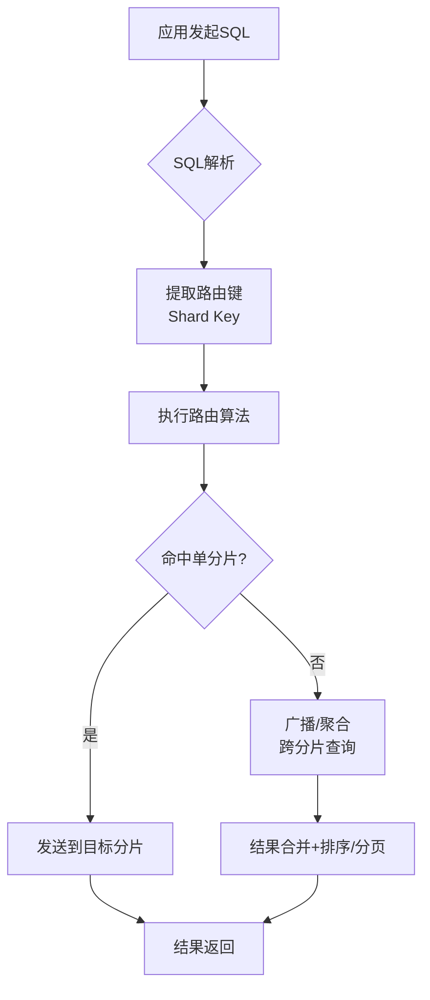
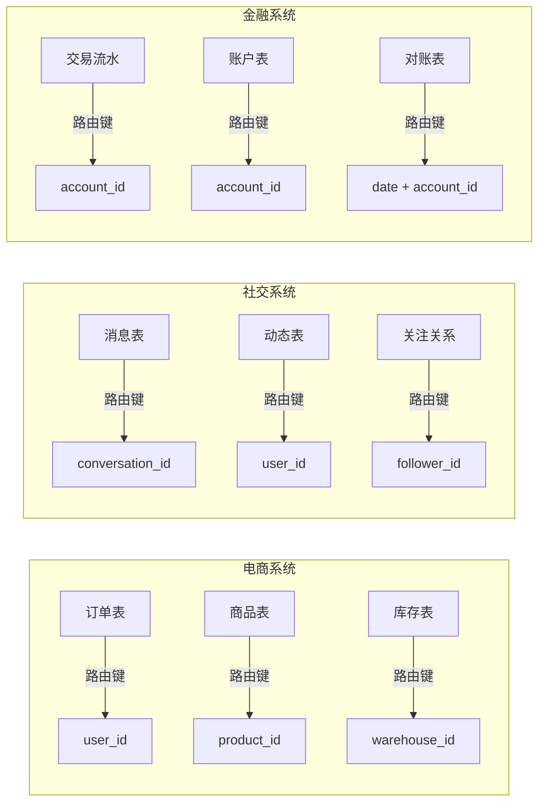
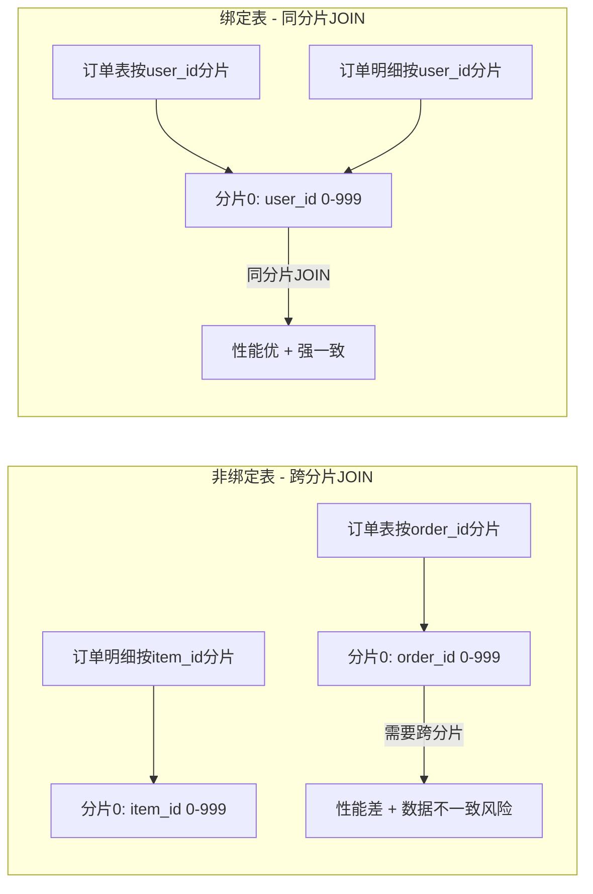

# 分片路由：从算法原理到工程实践

分片路由是分库分表架构的核心中枢——它决定了每一条SQL语句最终被发送到哪个数据库、哪张表。路由的正确性直接关系到数据一致性，路由的性能直接影响查询延迟，路由的灵活性决定了架构的可演进性。本节从路由算法原理出发，覆盖路由键选择、核心路由策略实现、跨分片查询处理、中间件配置实战以及生产环境的常见陷阱与优化手段。



---

## 一、路由键（Shard Key）选择：架构成败的第一步

路由键是分片路由的"锚点"——后续所有路由计算都依赖于它。选错了路由键，轻则查询效率低下，重则架构无法支撑业务演进。

### 1.1 路由键选择的核心原则

| 原则 | 含义 | 典型错误 |
|------|------|---------|
| **高频查询覆盖** | 路由键应出现在80%以上的查询条件中 | 用 `created_at` 做路由键，但业务主要按 `user_id` 查询 |
| **数据分布均匀** | 路由键的值域应足够分散，避免热点 | 用 `status`（只有3种值）做路由键，导致数据严重倾斜 |
| **不可变性** | 路由键的值不应在业务生命周期内变更 | 用 `phone_number` 做路由键，但用户会换号 |
| **单调递增无偏好** | 单调递增的键配合Hash路由可均匀分布 | 自增主键配合Range路由导致所有新数据写入同一分片 |
| **跨分片操作最小化** | 尽量让同一业务实体的数据落在同一分片 | 订单按 `order_id` 路由，但经常需要按 `user_id` 查询该用户所有订单 |

### 1.2 常见业务场景的路由键推荐



**路由键选择决策树：**

1. **是否存在"天然聚合实体"？** 比如订单属于用户、消息属于会话——优先用聚合根ID做路由键。
2. **是否存在多维度查询需求？** 如果业务需要按两个维度频繁查询，考虑**双路由键**方案（如订单表同时冗余 `user_id` 和 `order_id`，写入时双写路由，查询时按主路由键路由）。
3. **是否需要跨分片聚合？** 报表类查询如果需要全表聚合，路由键的选择不会改善聚合效率，此时应考虑将分析数据同步到独立的OLAP库。

### 1.3 路由键的类型对路由算法的影响

```sql
-- 路由键为数值类型（推荐用于Hash路由）
user_id BIGINT        -- Hash: user_id % N → 均匀分布
order_id BIGINT       -- Hash: order_id % N → 均匀分布

-- 路由键为字符串类型（需要先哈希再取模）
phone VARCHAR(20)     -- 先 MD5/CRC32 哈希，再 % N
email VARCHAR(100)    -- 同上

-- 路由键为时间类型（适合Range路由）
created_at DATETIME   -- Range: 按月/季度分片 → 自然归档
```

> **生产建议**：路由键优先选择 `BIGINT` 类型，避免字符串路由键的哈希计算开销。如果业务键是字符串（如手机号、邮箱），在表设计时增加一个数值型的 `shard_key` 字段存储其哈希值，查询时用 `shard_key` 路由。

---

## 二、核心路由算法实现

### 2.1 Hash取模路由

Hash取模是最基础也是最常用的路由算法。将路由键的哈希值对分片数取模，得到分片索引。

**优点**：数据分布均匀、实现简单、查询单分片无额外开销。

**缺点**：扩容时需要全量数据再平衡（因为 N 变化后，绝大多数键的 `hash % N` 结果都会改变）。

```java
public class HashShardRouter {

    private final int shardCount;

    public HashShardRouter(int shardCount) {
        this.shardCount = shardCount;
    }

    /**
     * 路由核心方法：计算分片索引
     * 注意：使用 Math.abs 防止负数取模结果为负
     */
    public int route(long shardKey) {
        return (int) (Math.abs(shardKey) % shardCount);
    }

    /**
     * 生成分表名
     * 例如：t_order_0, t_order_1, t_order_2, t_order_3
     */
    public String getTableName(long shardKey, String baseTable) {
        return baseTable + "_" + route(shardKey);
    }

    /**
     * 生成分库名
     * 例如：db_0, db_1, db_2, db_3
     */
    public String getDbName(long shardKey, String baseDb) {
        return baseDb + "_" + route(shardKey);
    }

    /**
     * 先分库再分表的两级路由
     * dbIndex = hash % dbCount
     * tableIndex = (hash / dbCount) % tablePerDb
     */
    public ShardLocation routeTwoLevel(long shardKey, int dbCount, int tablePerDb) {
        long hash = Math.abs(shardKey);
        int dbIndex = (int) (hash % dbCount);
        int tableIndex = (int) ((hash / dbCount) % tablePerDb);
        return new ShardLocation(dbIndex, tableIndex);
    }
}
```

**Hash路由的数学特性：**

当分片数从 N 变为 N+1 时，大约有 `N/(N+1)` 比例的数据需要迁移。例如：

| 当前分片数 | 扩容后分片数 | 需迁移数据比例 |
|-----------|-------------|--------------|
| 4 | 5 | 80% |
| 8 | 9 | 89% |
| 16 | 32 | 50%（翻倍扩容） |
| 32 | 64 | 50% |

> **生产建议**：初次规划分片数时，预留足够的扩展空间。对于中小系统，一次性规划 16~32 个分片（即使初始只用 4~8 个），后续通过"逻辑分片 → 物理分片"的映射实现扩容，避免大规模数据迁移。

### 2.2 一致性Hash路由

一致性Hash将整个哈希值空间组织成一个虚拟环（0 到 2^32-1），数据节点和数据键都映射到环上。数据键沿顺时针方向找到的第一个节点即为其目标分片。当增删节点时，只影响相邻节点间的数据，大幅减少迁移量。

```java
import java.nio.charset.StandardCharsets;
import java.security.MessageDigest;
import java.security.NoSuchAlgorithmException;
import java.util.*;

public class ConsistentHashRouter {

    // 每个物理节点对应的虚拟节点数（增加虚拟节点可使数据分布更均匀）
    private final int virtualNodeCount;

    // 哈希环：排序的哈希值 → 物理节点标识
    private final TreeMap<Long, String> ring = new TreeMap<>();

    public ConsistentHashRouter(int virtualNodeCount) {
        this.virtualNodeCount = virtualNodeCount;
    }

    /**
     * 添加物理节点到哈希环
     */
    public void addNode(String nodeId) {
        for (int i = 0; i < virtualNodeCount; i++) {
            String virtualKey = nodeId + "#VN" + i;
            long hash = hash(virtualKey);
            ring.put(hash, nodeId);
        }
    }

    /**
     * 从哈希环移除物理节点
     */
    public void removeNode(String nodeId) {
        for (int i = 0; i < virtualNodeCount; i++) {
            String virtualKey = nodeId + "#VN" + i;
            long hash = hash(virtualKey);
            ring.remove(hash);
        }
    }

    /**
     * 路由：找到顺时针方向的第一个节点
     */
    public String route(String key) {
        if (ring.isEmpty()) {
            throw new IllegalStateException("No nodes in the ring");
        }
        long hash = hash(key);
        // ceilingEntry 返回 >= hash 的第一个条目
        Map.Entry<Long, String> entry = ring.ceilingEntry(hash);
        if (entry == null) {
            // 超出环的范围，绕回第一个节点
            entry = ring.firstEntry();
        }
        return entry.getValue();
    }

    /**
     * MD5 哈希，保证分布均匀
     */
    private long hash(String key) {
        try {
            MessageDigest md = MessageDigest.getInstance("MD5");
            byte[] digest = md.digest(key.getBytes(StandardCharsets.UTF_8));
            return ((long)(digest[3] &amp; 0xFF) << 24)
                 | ((long)(digest[2] &amp; 0xFF) << 16)
                 | ((long)(digest[1] &amp; 0xFF) << 8)
                 | (digest[0] &amp; 0xFF);
        } catch (NoSuchAlgorithmException e) {
            throw new RuntimeException(e);
        }
    }

    /**
     * 获取所有物理节点
     */
    public Set<String> getAllNodes() {
        return new LinkedHashSet<>(ring.values());
    }

    /**
     * 模拟扩容：查看数据迁移量
     */
    public double estimateMigrationRatio(String newNodeId) {
        Set<String> before = getAllNodes();
        addNode(newNodeId);
        Set<String> after = getAllNodes();
        // 理论迁移量 ≈ 1 / (物理节点数 + 1)
        return 1.0 / (before.size() + 1);
    }
}
```

**虚拟节点数量对数据分布的影响：**

| 物理节点数 | 虚拟节点数 | 最大分片数据量/最小分片数据量 | 标准差 |
|-----------|-----------|---------------------------|--------|
| 4 | 10 | 3.2x | 高 |
| 4 | 100 | 1.5x | 中 |
| 4 | 150 | 1.2x | 低 |
| 4 | 500 | 1.05x | 极低 |

> **生产建议**：虚拟节点数一般设为 100~200。过少会导致数据分布不均匀，过多会增加路由查找的时间开销（TreeMap查找为 O(log V)，V 为虚拟节点总数）。

### 2.3 Range路由

Range路由按路由键的值范围划分分片，每个分片负责一段连续的区间。

**优点**：范围查询高效（只需查询一个分片）、支持按时间自然归档、扩容时新分片只承接新数据。

**缺点**：写入热点明显（最新数据集中在最后一个分片）、数据分布不均匀。

```java
public class RangeShardRouter {

    /**
     * 分片定义：每个分片负责一段ID区间
     */
    private final List<ShardRange> ranges;

    public RangeShardRouter(List<ShardRange> ranges) {
        // 必须按起始值排序
        this.ranges = ranges.stream()
            .sorted(Comparator.comparingLong(r -> r.start))
            .collect(Collectors.toList());
    }

    /**
     * 路由：二分查找确定分片
     */
    public int route(long shardKey) {
        // 二分查找第一个 start > shardKey 的分片，取前一个
        int lo = 0, hi = ranges.size() - 1;
        while (lo <= hi) {
            int mid = (lo + hi) >>> 1;
            ShardRange midRange = ranges.get(mid);
            if (shardKey < midRange.start) {
                hi = mid - 1;
            } else if (shardKey >= midRange.end) {
                lo = mid + 1;
            } else {
                return mid; // 命中
            }
        }
        throw new IllegalArgumentException(
            "Shard key " + shardKey + " is out of range [" 
            + ranges.get(0).start + ", " 
            + ranges.get(ranges.size() - 1).end + ")");
    }

    /**
     * 扩容：添加新分片（追加到末尾）
     */
    public void addShard(long start, long end, String shardName) {
        ranges.add(new ShardRange(start, end, shardName));
        // 重新排序
        ranges.sort(Comparator.comparingLong(r -> r.start));
    }

    static class ShardRange {
        final long start;
        final long end;
        final String shardName;

        ShardRange(long start, long end, String shardName) {
            this.start = start;
            this.end = end;
            this.shardName = shardName;
        }
    }
}
```

### 2.4 三种路由算法对比

| 维度 | Hash取模 | 一致性Hash | Range |
|------|---------|-----------|-------|
| **数据均匀度** | 均匀 | 均匀（虚拟节点足够时） | 不均匀 |
| **单键路由性能** | O(1) | O(log V) | O(log N) |
| **范围查询效率** | 需广播所有分片 | 需广播所有分片 | 单分片高效 |
| **扩容迁移量** | 大（约80%） | 小（约1/N） | 极小（仅新分片） |
| **写入热点** | 无 | 无 | 有（最新分片） |
| **实现复杂度** | 低 | 中 | 低 |
| **适用场景** | 通用场景 | 频繁扩缩容 | 时序数据、归档 |

---

## 三、分库分表的两级路由

实际生产中，通常不是简单的"分表"，而是**先分库再分表**——数据库实例数量有限，每个实例内再拆分多张表。两级路由需要考虑分库键和分表键是否相同。

### 3.1 分库分表键相同

当分库键和分表键是同一个字段时（如都是 `user_id`），路由逻辑相对简单：

```python
class TwoLevelRouterSameKey:
    """分库分表键相同时的两级路由"""
    
    def __init__(self, db_count: int, tables_per_db: int):
        self.db_count = db_count
        self.tables_per_db = tables_per_db
        self.total_shards = db_count * tables_per_db
    
    def route(self, shard_key: int) -> dict:
        """计算分库索引和分表索引"""
        # 先对总分片数取模，得到全局分片号
        global_shard = abs(shard_key) % self.total_shards
        # 全局分片号映射到库内表号
        db_index = global_shard // self.tables_per_db
        table_index = global_shard % self.tables_per_db
        return {
            "db_index": db_index,
            "table_index": table_index,
            "db_name": f"db_{db_index}",
            "table_name": f"t_order_{table_index}",
            "full_target": f"db_{db_index}.t_order_{table_index}"
        }

# 使用示例：4库8表
router = TwoLevelRouterSameKey(db_count=4, tables_per_db=8)
# user_id=1001 → db_3.t_order_1
# user_id=2002 → db_1.t_order_2
print(router.route(1001))
# {'db_index': 3, 'table_index': 1, 'db_name': 'db_3', 'table_name': 't_order_1', ...}
```

### 3.2 分库分表键不同

当分库键和分表键不同时（如订单表按 `user_id` 分库但按 `order_id` 分表），会出现**交叉路由**——一个分库内有多张表的数据属于不同分片，需要更精细的路由策略。

```java
public class CrossShardRouter {

    private final int dbCount;
    private final int tablesPerDb;
    private final HashShardRouter dbRouter;
    private final HashShardRouter tableRouter;

    public CrossShardRouter(int dbCount, int tablesPerDb) {
        this.dbCount = dbCount;
        this.tablesPerDb = tablesPerDb;
        this.dbRouter = new HashShardRouter(dbCount);
        this.tableRouter = new HashShardRouter(tablesPerDb);
    }

    /**
     * 分库键和分表键相同时的路由
     */
    public ShardLocation routeSameKey(long shardKey) {
        int dbIdx = dbRouter.route(shardKey);
        int tableIdx = tableRouter.route(shardKey);
        return new ShardLocation(dbIdx, tableIdx);
    }

    /**
     * 分库键和分表键不同时的路由
     * dbKey 决定分库，tableKey 决定分表
     */
    public ShardLocation routeDifferentKeys(long dbKey, long tableKey) {
        int dbIdx = dbRouter.route(dbKey);
        int tableIdx = tableRouter.route(tableKey);
        return new ShardLocation(dbIdx, tableIdx);
    }

    /**
     * 分库键和分表键不同但需要关联查询时的分片枚举
     * 例如：给定 user_id(分库键) 查所有订单，需要知道
     * 该用户的所有订单在哪些分库的哪些表中
     */
    public List<ShardLocation> enumerateUserShards(long userId) {
        int dbIdx = dbRouter.route(userId);
        List<ShardLocation> locations = new ArrayList<>();
        // 该用户在 dbIdx 库中的所有分表
        for (int t = 0; t < tablesPerDb; t++) {
            locations.add(new ShardLocation(dbIdx, t));
        }
        return locations;
    }

    record ShardLocation(int dbIndex, int tableIndex) {
        String getDbName() { return "db_" + dbIndex; }
        String getTableName() { return "t_order_" + tableIndex; }
    }
}
```

> **生产建议**：尽量避免分库键和分表键不相同的情况。如果业务确实需要两个维度的路由（如按 `user_id` 分库、按 `order_id` 分表），应考虑引入**绑定表**（Binding Table）机制，确保关联查询只需在单个分库内完成。

---

## 四、广播表与绑定表

### 4.1 广播表（Broadcast Table）

广播表是所有分库中都存在的全量表，适用于数据量小且变更频率低的配置表、字典表。广播表在每次写入时会同步到所有分库，查询时直接在本分库内完成，无需跨分片。

```java
/**
 * 广播表路由：不分片，所有分库全量同步
 */
public class BroadcastTableRouter {

    private final Set<String> broadcastTables;

    public BroadcastTableRouter(Set<String> broadcastTables) {
        this.broadcastTables = broadcastTables;
    }

    /**
     * 判断是否为广播表
     */
    public boolean isBroadcast(String tableName) {
        return broadcastTables.contains(tableName);
    }

    /**
     * 广播表的写入路由：写入所有分库
     */
    public List<String> routeForWrite(String tableName, int dbCount) {
        if (!isBroadcast(tableName)) {
            throw new IllegalArgumentException(tableName + " is not a broadcast table");
        }
        List<String> targets = new ArrayList<>();
        for (int i = 0; i < dbCount; i++) {
            targets.add("db_" + i + "." + tableName);
        }
        return targets;
    }

    /**
     * 广播表的读取路由：只需读取任意一个分库
     */
    public String routeForRead(String tableName) {
        if (!isBroadcast(tableName)) {
            throw new IllegalArgumentException(tableName + " is not a broadcast table");
        }
        return "db_0." + tableName; // 任选一个库即可
    }
}
```

**广播表的使用场景：**

| 表类型 | 示例 | 广播表适用性 |
|--------|------|------------|
| 数据字典 | area_code, config | ✅ 完美适用 |
| 用户基础信息 | user_profile | ⚠️ 数据量不能太大 |
| 商品分类 | category | ✅ 适用 |
| 订单主表 | order | ❌ 不适用（数据量大） |
| 交易流水 | transaction | ❌ 不适用 |

### 4.2 绑定表（Binding Table）

绑定表是分片规则相同的多个表的组合，确保关联查询时相关数据落在同一分片内，避免跨分片 JOIN。

例如：订单表 `t_order` 和订单明细表 `t_order_item` 都以 `order_id` 作为分片键，那么它们就是绑定表。查询订单及其明细时，只需路由到一个分片即可完成 JOIN。

```sql
-- 绑定表查询示例：订单+明细在同一个分片内完成 JOIN
SELECT o.order_id, o.user_id, oi.product_id, oi.quantity
FROM t_order o
JOIN t_order_item oi ON o.order_id = oi.order_id
WHERE o.user_id = 10001;
-- 路由器将两张表都路由到 user_id=10001 对应的分片
-- 无需跨分片 JOIN
```



---

## 五、跨分片查询处理

跨分片查询是分库分表架构中最复杂也最容易出问题的部分。主要包括：跨分片排序、跨分片分页、跨分片聚合、跨分片JOIN。

### 5.1 跨分片排序

当查询条件不包含路由键时，需要从所有分片获取数据后合并排序。

```java
/**
 * 跨分片归并排序实现
 */
public class CrossShardMerger {

    /**
     * 将多个分片的结果集合并排序
     * 使用优先队列（最小堆）实现多路归并，内存效率优于全量排序
     */
    public <T> List<T> mergeAndSort(
            List<List<T>> shardResults,
            Comparator<T> comparator,
            int limit) {
        
        // 使用最小堆进行多路归并
        PriorityQueue<ShardCursor<T>> heap = new PriorityQueue<>(
            Comparator.comparing(c -> c.peek(), comparator)
        );

        // 将每个分片结果集的第一个元素入堆
        for (int i = 0; i < shardResults.size(); i++) {
            List<T> shard = shardResults.get(i);
            if (!shard.isEmpty()) {
                heap.offer(new ShardCursor<>(shard, 0));
            }
        }

        List<T> result = new ArrayList<>();
        while (!heap.isEmpty() &amp;&amp; result.size() < limit) {
            ShardCursor<T> cursor = heap.poll();
            result.add(cursor.peek());
            if (cursor.hasNext()) {
                cursor.advance();
                heap.offer(cursor);
            }
        }
        return result;
    }

    static class ShardCursor<T> {
        private final List<T> data;
        private int index;

        ShardCursor(List<T> data, int startIndex) {
            this.data = data;
            this.index = startIndex;
        }

        T peek() { return data.get(index); }
        boolean hasNext() { return index + 1 < data.size(); }
        void advance() { index++; }
    }
}
```

### 5.2 跨分片分页的陷阱与优化

跨分片分页是分库分表中最经典的性能陷阱。MySQL 的 `LIMIT 100000, 10` 意味着扫描 100010 行后丢弃前 100000 行，只返回 10 行。当这个查询跨分片执行时，每个分片都需要扫描 100010 行，然后在应用层合并后再丢弃，开销成倍放大。

**优化策略对比：**

| 策略 | 原理 | 适用场景 | 性能 |
|------|------|---------|------|
| 深度分页优化 | 用上一页最后一条记录的排序键做 WHERE 条件 | 通用 | ⭐⭐⭐⭐ |
| 禁止跳页 | UI 上只允许"上一页/下一页"，不允许输入页码 | 面向用户 | ⭐⭐⭐⭐⭐ |
| 游标分页 | 用 cursor 替代 offset，基于上一页最后记录的ID | 通用（API设计） | ⭐⭐⭐⭐ |
| 搜索引擎 | 将数据同步到 Elasticsearch，利用其分布式分页能力 | 搜索场景 | ⭐⭐⭐ |

```sql
-- 错误方式：传统分页（跨分片性能极差）
SELECT * FROM t_order 
ORDER BY create_time DESC 
LIMIT 100000, 10;
-- 每个分片都要扫描 100010 行！

-- 优化方式1：基于排序键的深度分页优化
SELECT * FROM t_order 
WHERE create_time < '2026-01-15 10:30:00'  -- 上一页最后一条的时间
ORDER BY create_time DESC 
LIMIT 10;
-- 每个分片只需扫描 10 行

-- 优化方式2：游标分页（基于主键）
SELECT * FROM t_order 
WHERE order_id > 100089  -- 上一页最后一条的ID
ORDER BY order_id ASC 
LIMIT 10;
-- 利用主键索引，每个分片只扫描 10 行
```

```java
/**
 * 游标分页实现
 */
public class CursorPaginationExample {

    /**
     * 首次查询：无游标
     */
    public List<Order> queryFirstPage(int pageSize) {
        String sql = "SELECT * FROM t_order ORDER BY order_id ASC LIMIT ?";
        return jdbcTemplate.query(sql, new Object[]{pageSize}, orderRowMapper);
    }

    /**
     * 后续页：基于游标
     */
    public List<Order> queryNextPage(long lastOrderId, int pageSize) {
        String sql = "SELECT * FROM t_order WHERE order_id > ? ORDER BY order_id ASC LIMIT ?";
        return jdbcTemplate.query(sql, new Object[]{lastOrderId, pageSize}, orderRowMapper);
    }

    /**
     * 跨分片游标分页
     */
    public List<Order> queryNextPageCrossShard(long lastOrderId, int pageSize) {
        // 路由器确定 lastOrderId 所在分片，只查询该分片
        // 如果该分片结果不足 pageSize，再查下一个分片补充
        int shardIndex = router.route(lastOrderId);
        List<Order> results = queryShard(shardIndex, lastOrderId, pageSize);
        
        if (results.size() < pageSize) {
            // 补充查询下一个分片
            long remaining = pageSize - results.size();
            results.addAll(queryShard(shardIndex + 1, 0, remaining));
        }
        return results;
    }
}
```

### 5.3 跨分片聚合

```sql
-- COUNT 聚合：需要所有分片都执行，然后求和
SELECT SUM(shard_count) AS total_count FROM (
    SELECT COUNT(*) AS shard_count FROM t_order WHERE user_id = 10001
) -- 每个分片返回自己的 COUNT
-- 应用层求和得到总 COUNT

-- SUM/AVG 聚合：同样需要分片执行+应用层聚合
-- 注意：AVG 不能简单将各分片的 AVG 求平均，需要加权平均
SELECT total_sum / total_count AS weighted_avg FROM (
    SELECT SUM(amount) AS total_sum, COUNT(*) AS total_count 
    FROM t_order WHERE user_id = 10001
)
```

```java
/**
 * 跨分片聚合计算
 */
public class CrossShardAggregator {

    /**
     * 跨分片 COUNT
     */
    public long crossShardCount(String baseSql, Object[] params) {
        return executeOnAllShards(baseSql, params)
            .stream()
            .mapToLong(result -> (Long) result.get("count"))
            .sum();
    }

    /**
     * 跨分片 AVG（加权平均，不是简单平均）
     * 错误：AVG AVG AVG ≠ 真实 AVG（如果各分片数据量不同）
     */
    public double crossShardAvg(String baseSql, Object[] params) {
        long totalSum = 0;
        long totalCount = 0;
        for (Map<String, Object> result : executeOnAllShards(baseSql, params)) {
            totalSum += (Long) result.get("sum");
            totalCount += (Long) result.get("count");
        }
        return totalCount == 0 ? 0 : (double) totalSum / totalCount;
    }

    /**
     * 跨分片 DISTINCT COUNT（基数估算）
     * 精确值需要每个分片都返回完整去重集合，应用层合并
     */
    public long crossShardDistinctCount(String column, String baseSql) {
        Set<Object> distinctValues = new HashSet<>();
        for (Map<String, Object> result : executeOnAllShards(baseSql, null)) {
            distinctValues.addAll((Collection<?>) result.get("distinct_" + column));
        }
        return distinctValues.size();
    }
}
```

---

## 六、ShardingSphere路由配置实战

### 6.1 ShardingSphere-JDBC 分片路由配置

```yaml
# application.yml
spring:
  shardingsphere:
    datasource:
      names: ds0,ds1
      ds0:
        type: com.zaxxer.hikari.HikariDataSource
        driver-class-name: com.mysql.cj.jdbc.Driver
        jdbc-url: jdbc:mysql://192.168.1.100:3306/order_db_0?useUnicode=true&amp;characterEncoding=utf8
        username: root
        password: ${DB_PASSWORD}
      ds1:
        type: com.zaxxer.hikari.HikariDataSource
        driver-class-name: com.mysql.cj.jdbc.Driver
        jdbc-url: jdbc:mysql://192.168.1.101:3306/order_db_1?useUnicode=true&amp;characterEncoding=utf8
        username: root
        password: ${DB_PASSWORD}
    rules:
      sharding:
        tables:
          t_order:
            actual-data-nodes: ds${0..1}.t_order_${0..3}
            database-strategy:
              standard:
                sharding-column: user_id
                sharding-algorithm-name: db-inline
            table-strategy:
              standard:
                sharding-column: user_id
                sharding-algorithm-name: table-inline
        sharding-algorithms:
          db-inline:
            type: INLINE
            props:
              algorithm-expression: ds${user_id % 2}
          table-inline:
            type: INLINE
            props:
              algorithm-expression: t_order_${user_id % 4}
```

上述配置实现了：2个分库（ds0、ds1），每个分库4张表（t_order_0~t_order_3），共8张物理表。路由逻辑为 `user_id % 2` 决定分库、`user_id % 4` 决定分表。

### 6.2 自定义分片算法：按月Range路由

当需要按时间范围分片（如日志表按月分片）时， INLINE 算法无法满足需求，需要实现自定义分片算法：

```java
/**
 * 按月Range自定义分片算法
 * 适用场景：日志表、流水表等按时间归档的数据
 */
public class MonthlyRangeShardingAlgorithm implements StandardShardingAlgorithm<String> {

    private Properties props;

    @Override
    public String doSharding(Collection<String> availableTargetNames, 
                             ShardingValue<String> shardingValue) {
        String dateStr = shardingValue.getValue(); // 格式：2026-06
        // 从可用的分片中选择匹配月份的那个
        for (String target : availableTargetNames) {
            // target 格式：ds_0.t_log_202606
            if (target.contains(dateStr.replace("-", ""))) {
                return target;
            }
        }
        // 没有匹配的分片，路由到默认分片或抛异常
        throw new ShardingSphereException(
            "No shard found for date: " + dateStr);
    }

    @Override
    public String getType() {
        return "MONTHLY_RANGE";
    }

    @Override
    public Properties getProps() {
        return props;
    }

    @Override
    public void init(Properties props) {
        this.props = props;
    }
}
```

### 6.3 SQL路由结果验证

ShardingSphere 提供了 `SHOW DIST SQL SHOW` 命令查看SQL的路由结果：

```sql
-- 查看 SQL 解析和路由结果（ShardingSphere Proxy模式）
SHOW PARSERS;
SHOW ROUTE RULES;

-- 或在日志中开启路由调试
-- logging.level.org.apache.shardingsphere.sharding.route=DEBUG
```

```java
/**
 * 单元测试：验证分片路由的正确性
 */
@Test
public void testShardRouting() {
    // 测试 Hash 路由
    HashShardRouter router = new HashShardRouter(4);

    // 验证数据均匀分布
    Map<Integer, Integer> distribution = new HashMap<>();
    for (long i = 0; i < 10000; i++) {
        int shard = router.route(i);
        distribution.merge(shard, 1, Integer::sum);
    }
    // 每个分片应有约 2500 条数据
    for (Map.Entry<Integer, Integer> entry : distribution.entrySet()) {
        assertTrue(entry.getValue() > 2300 &amp;&amp; entry.getValue() < 2700,
            "Shard " + entry.getKey() + " has " + entry.getValue() 
            + " records, expected ~2500");
    }

    // 验证同一键的路由结果一致
    assertEquals(router.route(10001), router.route(10001));

    // 验证负数处理
    assertDoesNotThrow(() -> router.route(-10001));
}

@Test
public void testConsistentHashMigration() {
    ConsistentHashRouter router = new ConsistentHashRouter(150);
    router.addNode("node_0");
    router.addNode("node_1");
    router.addNode("node_2");

    // 记录扩容前的路由结果（每条键对应的节点）
    Map<String, String> beforeMapping = new HashMap<>();
    for (long i = 0; i < 10000; i++) {
        String node = router.route(String.valueOf(i));
        beforeMapping.put(String.valueOf(i), node);
    }

    // 添加新节点
    router.addNode("node_3");

    // 统计需要迁移的数据量
    int migrationCount = 0;
    for (long i = 0; i < 10000; i++) {
        String nodeAfter = router.route(String.valueOf(i));
        if (!nodeAfter.equals(beforeMapping.get(String.valueOf(i)))) {
            migrationCount++;
        }
    }
    // 一致性Hash迁移量约为 25%（1/4节点数）
    double migrationRatio = migrationCount / 10000.0;
    assertTrue(migrationRatio < 0.35, 
        "Migration ratio " + migrationRatio + " is too high");
}
```

---

## 七、路由优化进阶

### 7.1 路由缓存

对于高频查询，路由计算的结果可以缓存。同一条SQL的路由结果在分片规则不变的前提下是确定的，缓存可以避免重复解析和计算。

```java
/**
 * SQL路由结果缓存
 * key: SQL模板 + 参数值的哈希
 * value: 路由后的目标分片列表
 */
@Component
public class ShardRouteCache {

    private final LoadingCache<Long, List<String>> cache = CacheBuilder.newBuilder()
        .maximumSize(10_000)
        .expireAfterWrite(5, TimeUnit.MINUTES)  // 分片规则变更时可主动失效
        .build(new CacheLoader<>() {
            @Override
            public List<String> load(Long sqlHash) {
                return Collections.emptyList(); // 不可缓存的查询返回空
            }
        });

    /**
     * 尝试获取缓存的路由结果
     * 返回 null 表示未命中
     */
    public List<String> getCachedRoute(long sqlHash) {
        List<String> result = cache.getIfPresent(sqlHash);
        return (result != null &amp;&amp; !result.isEmpty()) ? result : null;
    }

    /**
     * 缓存路由结果
     */
    public void cacheRoute(long sqlHash, List<String> targets) {
        cache.put(sqlHash, targets);
    }

    /**
     * 分片规则变更时清空缓存
     */
    public void invalidateAll() {
        cache.invalidateAll();
    }
}
```

### 7.2 路由结果预判

在执行SQL之前，先进行路由预判，可以拦截不合法的查询（如未带路由键的全表扫描）。

```java
/**
 * 路由预判：拦截危险查询
 */
public class ShardRouteValidator {

    /**
     * 判断SQL是否会触发跨分片操作
     */
    public boolean isCrossShard(String sql, Map<String, Object> params) {
        // 解析SQL提取 WHERE 条件中的路由键
        String shardKey = extractShardKey(sql);
        if (shardKey == null) {
            return true; // 没有路由键，必定跨分片
        }
        Object value = params.get(shardKey);
        if (value == null) {
            return true;
        }
        // 计算路由键值对应的分片数
        long hash = Math.abs(((Number) value).longValue());
        int targetShardCount = countTargetShards(hash);
        return targetShardCount > 1;
    }

    /**
     * 拦截无路由键的 DELETE/UPDATE
     */
    public void validateForModification(String sql, Map<String, Object> params) {
        if (isCrossShard(sql, params)) {
            if (sql.trim().toUpperCase().startsWith("DELETE") 
                || sql.trim().toUpperCase().startsWith("UPDATE")) {
                throw new ShardRouteException(
                    "Cross-shard DELETE/UPDATE is not allowed. "
                    + "Please add shard key to WHERE clause.");
            }
        }
    }
}
```

### 7.3 分片规则热更新

在不停服的情况下动态调整分片规则（如新增分片），需要实现分片规则的热更新机制。

```java
/**
 * 分片规则热更新流程
 */
public class ShardRuleHotUpdate {

    /**
     * 1. 增量分片阶段（新增分片）
     *    新分片加入后，新数据写入新分片
     *    旧数据仍在旧分片，路由规则同时包含新旧分片
     */
    public void addShard(String newShardId) {
        // 1. 更新路由规则（原子切换）
        ShardRule newRule = currentRule.copy();
        newRule.addShard(newShardId);
        // 使用 volatile 或 AtomicReference 保证可见性
        this.currentRule = newRule;
        
        // 2. 启动后台迁移任务
        migrationService.startBackgroundMigration(newShardId);
    }

    /**
     * 2. 后台数据迁移阶段
     *    按路由键范围逐步迁移旧分片数据到新分片
     *    迁移期间采用"双写+读新"策略保证一致性
     */
    public void migrateData(String sourceShard, String targetShard) {
        // 读取源分片数据
        // 写入目标分片
        // 删除源分片数据（延迟删除，确保无读请求）
        // 全量迁移完成后更新路由规则，移除旧分片
    }
}
```

---

## 八、常见路由问题与排查

### 8.1 路由问题排查清单

| 问题现象 | 可能原因 | 排查方法 |
|---------|---------|---------|
| 查询返回空结果 | 路由键传入 null 或 0 | 检查应用层路由键赋值逻辑 |
| 路由到错误分片 | 路由键类型不匹配（如 String 和 Long 混用） | 开启路由日志，对比预期和实际路由 |
| 全表扫描 | SQL 未包含路由键条件 | 检查 WHERE 条件，添加路由键 |
| 数据倾斜 | 路由键分布不均匀 | 统计各分片数据量，评估路由键选择 |
| 跨分片查询超时 | 某个分片响应慢拖累整体 | 逐分片执行 EXPLAIN，定位慢分片 |
| JOIN 结果不正确 | 绑定表配置错误或 JOIN 键不是路由键 | 验证表绑定关系和 JOIN 条件 |

### 8.2 路由调试技巧

```sql
-- 1. 查看分片配置的实际节点
SHOW SHARDING TABLE RULES;

-- 2. 使用 EXPLAIN 查看单个分片的执行计划
EXPLAIN SELECT * FROM t_order_0 WHERE user_id = 10001;

-- 3. 查看数据分布
SELECT 't_order_0' AS shard, COUNT(*) AS cnt FROM t_order_0
UNION ALL
SELECT 't_order_1', COUNT(*) FROM t_order_1
UNION ALL
SELECT 't_order_2', COUNT(*) FROM t_order_2
UNION ALL
SELECT 't_order_3', COUNT(*) FROM t_order_3;

-- 4. 验证路由键分布
SELECT user_id % 4 AS shard_id, COUNT(*) 
FROM t_order 
GROUP BY shard_id 
ORDER BY shard_id;
```

```java
/**
 * 路由调试：记录每次路由决策
 */
@Component
@ConditionalOnProperty(name = "sharding.debug.enabled", havingValue = "true")
public class ShardRouteDebugger {

    private static final Logger log = LoggerFactory.getLogger(ShardRouteDebugger.class);

    /**
     * 记录路由决策
     */
    public void logRoute(String sql, Object shardKey, 
                         String targetDb, String targetTable) {
        log.info("[SHARD-ROUTE] sql=\"{}\" | shardKey={} | target={}.{}",
            sql.length() > 100 ? sql.substring(0, 100) + "..." : sql,
            shardKey,
            targetDb,
            targetTable);
    }

    /**
     * 记录跨分片查询
     */
    public void logCrossShard(String sql, List<String> targets) {
        log.warn("[SHARD-ROUTE-CROSS] sql=\"{}\" | targets={} | "
            + "Consider optimizing with shard key",
            sql.length() > 100 ? sql.substring(0, 100) + "..." : sql,
            targets);
    }
}
```

---

## 九、生产环境最佳实践

### 9.1 分片规划检查表

在启动分库分表项目前，逐项确认：

| 序号 | 检查项 | 说明 |
|------|--------|------|
| 1 | 路由键选择完成 | 经过业务分析和数据分布验证 |
| 2 | 分片数规划合理 | 预留3~5年的扩展空间 |
| 3 | 分库分表键一致性 | 分库键和分表键是否相同，不同则需要绑定表 |
| 4 | 广播表识别 | 配置表、字典表等小表是否标记为广播表 |
| 5 | 跨分片查询梳理 | 哪些查询会跨分片，有无优化方案 |
| 6 | 分布式ID方案 | 雪花算法/号段模式是否就位 |
| 7 | 数据迁移方案 | 灰度迁移 + 回滚方案是否制定 |
| 8 | 监控告警 | 分片数据量、路由延迟、跨分片查询比例 |

### 9.2 性能基线

建立分片路由的性能基线，持续监控：

| 指标 | 基线值 | 告警阈值 |
|------|--------|---------|
| 单分片路由延迟 | < 1ms | > 5ms |
| 跨分片查询比例 | < 10% | > 30% |
| 分片数据量标准差 | < 10% | > 30% |
| 路由缓存命中率 | > 80% | < 50% |
| 深度分页查询比例 | < 5% | > 20% |

### 9.3 路由键变更的应急处理

路由键变更（如用户换绑手机号、修改分片键值）是分片架构中最危险的操作之一：

```java
/**
 * 路由键变更的安全流程
 */
public class ShardKeyMigration {

    /**
     * 安全变更路由键的步骤：
     * 1. 在旧分片中写入新路由键映射
     * 2. 后台任务异步迁移数据到新分片
     * 3. 迁移完成后删除旧分片数据
     * 4. 全程保持旧路由键可用（双写）
     */
    public void migrateShardKey(String tableName, long id, 
                                 long oldKey, long newKey) {
        // Step 1: 写入映射表（同一事务内确保原子性）
        shardKeyMappingMapper.insert(tableName, id, oldKey, newKey);
        
        // Step 2: 旧数据标记为"迁移中"
        dataMapper.markMigrating(tableName, id);
        
        // Step 3: 后台异步迁移
        migrationQueue.push(new MigrationTask(tableName, id, oldKey, newKey));
        
        // Step 4: 查询时双读（新分片优先，回退旧分片）
        // Step 5: 迁移完成后清理旧数据和映射
    }
}
```

---

## 十、实战：完整的分片路由模块

```java
/**
 * 完整的分片路由模块：支持 Hash/一致性Hash/Range 三种策略
 * 包含路由、缓存、验证、监控
 */
public class ShardRouterManager {

    private final ShardRouteStrategy strategy;
    private final ShardRouteCache cache;
    private final ShardRouteDebugger debugger;
    private final ShardRouteValidator validator;

    public ShardRouterManager(ShardConfig config) {
        this.strategy = createStrategy(config);
        this.cache = new ShardRouteCache();
        this.debugger = new ShardRouteDebugger();
        this.validator = new ShardRouteValidator();
    }

    /**
     * 统一路由入口
     */
    public ShardTarget route(String sql, Map<String, Object> params) {
        // 1. 路由预判
        validator.validateForModification(sql, params);

        // 2. 计算缓存key
        long cacheKey = computeCacheKey(sql, params);

        // 3. 尝试缓存
        List<String> cached = cache.getCachedRoute(cacheKey);
        if (cached != null) {
            return ShardTarget.of(cached.get(0));
        }

        // 4. 执行路由计算
        Object shardKey = extractShardKey(sql, params);
        ShardTarget target = strategy.route(shardKey);

        // 5. 缓存结果
        cache.cacheRoute(cacheKey, List.of(target.getFullTarget()));

        // 6. 调试日志
        debugger.logRoute(sql, shardKey, target.getDb(), target.getTable());

        return target;
    }
}
```

---

## 本节小结

分片路由是分库分表架构的"大脑"，路由的正确性、性能和灵活性直接决定了整个数据层架构的质量。核心要点回顾：

1. **路由键选择是第一优先级**：选错路由键，后续优化事倍功半
2. **算法选择要匹配业务特征**：通用场景用Hash，频繁扩缩容用一致性Hash，时序数据用Range
3. **跨分片查询是最大性能瓶颈**：优先通过路由键消除跨分片，无法消除时用游标分页和聚合下推优化
4. **绑定表和广播表是重要的路由辅助机制**：前者保证关联查询效率，后者避免配置表的无效分片
5. **路由调试和监控不可少**：生产环境必须有路由日志、数据分布监控和跨分片查询告警
