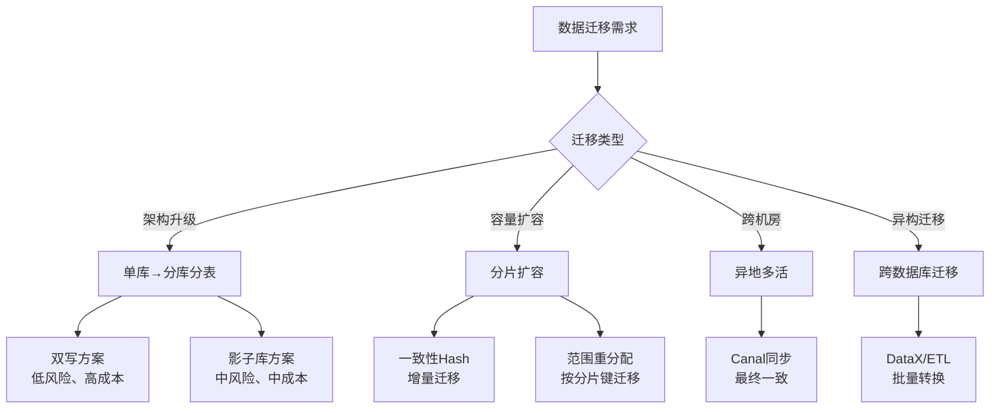
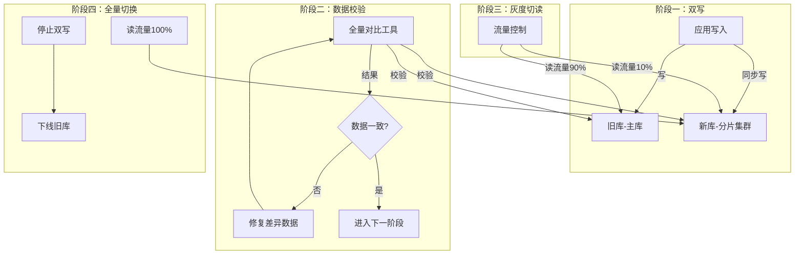
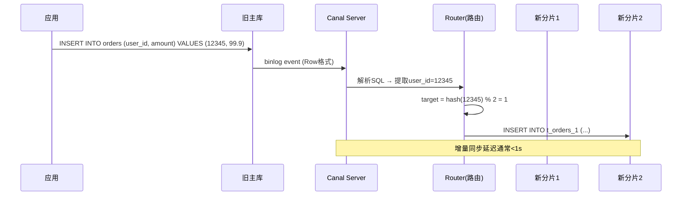
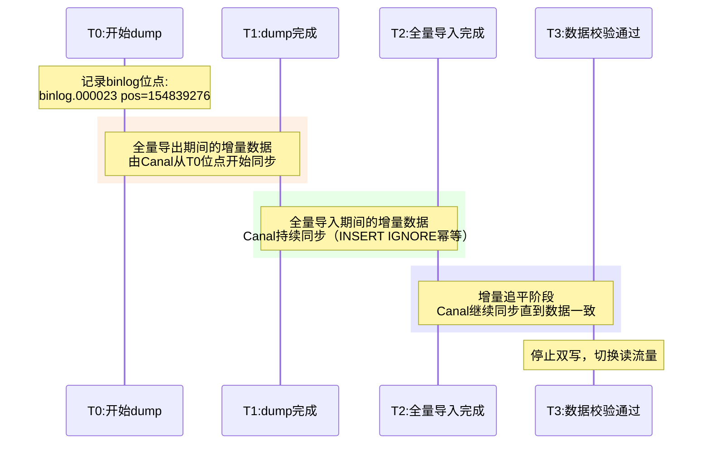
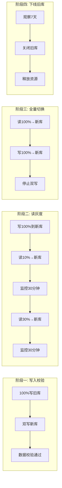
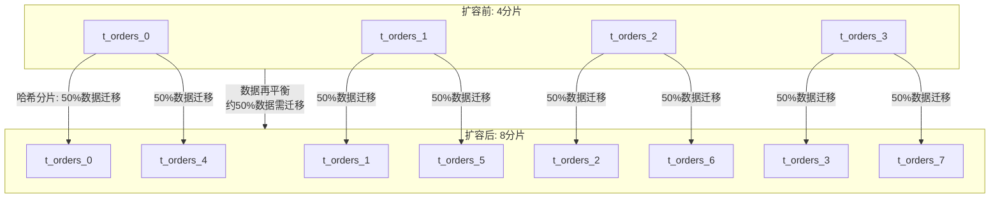
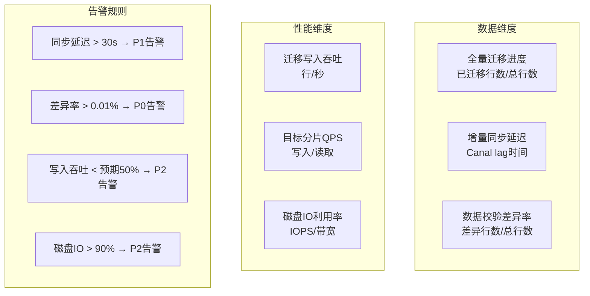
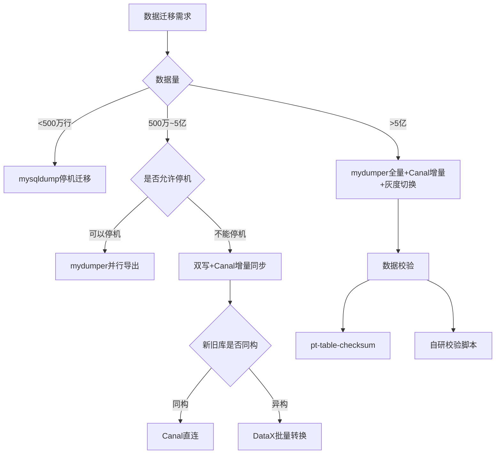

## 三、数据迁移

在读写分离与分库分表的落地过程中，数据迁移是工程复杂度最高、风险最大的环节。无论是从单库演进到分库分表架构，还是分片扩容时的数据再平衡，都需要一套系统化的迁移方法论来保障**零停机、零数据丢失**。本节从迁移策略选型到生产实战，完整拆解数据迁移的每一个关键环节。

### 3.1 迁移场景分类

数据迁移并非单一场景，不同的架构变更需求对应截然不同的迁移路径：

| 迁移场景 | 典型触发条件 | 核心挑战 | 推荐策略 |
|---------|------------|---------|---------|
| 单库 → 分库分表 | 单表突破千万级，写入QPS>5000 | 全量数据重新路由 + 增量追平 | 双写 + 灰度切换 |
| 分片扩容（N→M） | 数据量持续增长，现有分片不够 | 已有数据的再平衡 | 一致性Hash / 范围迁移 |
| 同城多活 → 异地多活 | 灾备升级为多活 | 跨机房数据同步 + 冲突解决 | Canal + 双向同步 |
| 异构数据库迁移 | MySQL → TiDB/CockroachDB | SQL兼容性 + 数据类型映射 | DataX / 自研ETL |
| 读写分离扩展从库 | 读QPS增长，从库不够 | 从库快速补齐 + 数据一致性 | 物理复制 / 逻辑备份恢复 |



### 3.2 核心迁移策略对比

#### 3.2.1 停机迁移（Offline Migration）

最简单的迁移方式——停止业务写入，完成数据搬迁后恢复服务。

```bash
# 停机迁移三步走
# Step 1: 停止写入，导出全量数据
mysqldump -h master -u root -p --single-transaction \
    --master-data=2 --flush-logs \
    --routines --triggers --events \
    mydb > /backup/full_dump.sql

# Step 2: 在目标分片导入数据（按分片规则拆分后导入）
mysql -h shard1 -u root -p mydb < shard1_data.sql
mysql -h shard2 -u root -p mydb < shard2_data.sql

# Step 3: 切换应用连接，恢复服务
```

**停机迁移的致命缺陷：**

| 问题 | 影响 | 量化评估 |
|------|------|---------|
| 停机时长 | 业务完全不可用 | 1亿行数据dump+import约需2-6小时 |
| 数据丢失风险 | dump到恢复期间的增量数据丢失 | 取决于停机窗口长度 |
| 可回滚性 | 回滚意味着再来一次停机 | 回滚成本等于迁移成本 |
| 合规风险 | SLA违约、用户投诉 | 金融/电商行业零容忍 |

> **适用场景**：仅在数据量小（<100万行）、业务可接受短暂停机（<5分钟）、且有完整回滚方案时使用。生产环境应尽量避免停机迁移。

#### 3.2.2 双写迁移（Dual-Write Migration）

双写是分库分表迁移中**最常用、最可靠**的在线迁移方案。核心思路是在迁移期间同时向新旧两套库写入数据，待数据校验一致后切换读流量，最后下线旧库。



**双写方案的Java实现：**

```java
/**
 * 双写数据源路由 — 迁移期间的核心组件
 */
public class DualWriteDataSource {
    
    private final DataSource oldDb;      // 旧库
    private final DataSource newDb;       // 新分片库
    private final MigrationConfig config; // 迁移配置
    
    /**
     * 写操作：双写到新旧两套库
     */
    public int executeWrite(String sql, Object[] params) {
        int oldResult = executeOn(oldDb, sql, params);
        
        if (config.isDualWriteEnabled()) {
            try {
                // 新库写入失败不能阻塞旧库写入
                executeOn(newDb, sql, params);
            } catch (Exception e) {
                // 记录到补偿队列，异步重试
                compensationQueue.enqueue(sql, params);
                log.warn("新库写入失败，已入补偿队列", e);
            }
        }
        return oldResult;
    }
    
    /**
     * 读操作：根据灰度比例决定读哪个库
     */
    public ResultSet executeRead(String sql, Object[] params) {
        if (config.getReadTrafficRatio() > 0 
                &amp;&amp; ThreadLocalRandom.current().nextDouble() 
                   < config.getReadTrafficRatio()) {
            return executeOn(newDb, sql, params);
        }
        return executeOn(oldDb, sql, params);
    }
}
```

**双写方案的关键决策点：**

| 决策项 | 选项A | 选项B | 推荐 |
|-------|-------|-------|------|
| 同步/异步双写 | 同步写两库 | 异步写新库 | 同步写为主，异步补偿兜底 |
| 事务处理 | 同一事务写两库 | 各自独立事务 | 各自独立事务 + 补偿 |
| 失败处理 | 写新库失败回滚 | 写新库失败记录补偿 | 记录补偿（不阻塞业务） |
| 数据校验时机 | 迁移前全量校验 | 迁移中增量校验 | 增量校验为主（实时性好） |

**双写期间的分布式事务处理：**

双写最大的挑战在于两套库的事务一致性。在实际生产中，**不可能实现强一致的分布式事务**（跨库两阶段提交性能代价过高），因此通常采用以下策略：

```java
/**
 * 双写事务管理器 — 补偿型最终一致性方案
 * 核心原则：旧库事务优先，新库失败走补偿
 */
public class DualWriteTransactionManager {
    
    /**
     * 带事务的双写操作
     * 旧库事务成功后，新库失败走异步补偿
     */
    @Transactional(rollbackFor = Exception.class)
    public void executeWithTransaction(List<SqlCommand> commands) {
        // 1. 旧库事务（业务主库，保证强一致）
        for (SqlCommand cmd : commands) {
            executeOn(oldDb, cmd.getSql(), cmd.getParams());
        }
        
        // 2. 新库写入（独立事务，失败走补偿）
        for (SqlCommand cmd : commands) {
            try {
                executeOnNewDbInNewTransaction(cmd);
            } catch (Exception e) {
                // 补偿队列：记录操作类型+参数，异步重试
                compensationQueue.enqueue(
                    CompensationRecord.builder()
                        .operation(cmd.getType())   // INSERT/UPDATE/DELETE
                        .sql(cmd.getSql())
                        .params(cmd.getParams())
                        .retryCount(0)
                        .maxRetries(3)
                        .createdAt(Instant.now())
                        .build()
                );
                log.warn("新库事务写入失败，入补偿队列: {}", cmd, e);
            }
        }
    }
    
    /**
     * 补偿队列的消费线程 — 定期重试失败的写入
     */
    @Scheduled(fixedDelay = 10_000)  // 每10秒执行一次
    public void processCompensationQueue() {
        List<CompensationRecord> records = compensationQueue.peekPending(100);
        for (CompensationRecord record : records) {
            try {
                executeOn(newDb, record.getSql(), record.getParams());
                compensationQueue.markCompleted(record.getId());
            } catch (DuplicateKeyException e) {
                // 幂等：已写入则直接标记完成
                compensationQueue.markCompleted(record.getId());
            } catch (Exception e) {
                if (record.getRetryCount() >= record.getMaxRetries()) {
                    compensationQueue.markFailed(record.getId());
                    alertService.sendAlert("补偿队列重试超限", record.toString());
                } else {
                    compensationQueue.incrementRetry(record.getId());
                }
            }
        }
    }
}
```

> **关键原则**：双写迁移中，**旧库是数据的真实来源（Source of Truth）**，新库是"影子副本"。新库写入失败绝不应该阻塞旧库事务。如果补偿队列持续积压，说明新库有系统性问题，应暂停迁移排查。

#### 3.2.3 基于Binlog的增量同步（Canal/Maxwell）

利用MySQL的binlog机制实现增量数据同步，是大表迁移的核心技术。Canal解析主库binlog，将变更事件实时推送到目标分片。



**Canal部署与配置：**

```properties
# canal.properties 核心配置
canal.serverMode = kafka          # 推送到Kafka，解耦消费
canal.destinations = mydb         # 订阅的MySQL实例
canal.instance.master.journal.name = mysql-bin.000001
canal.instance.master.position = 154

# instance.properties
canal.instance.dbUsername = canal
canal.instance.dbPassword = canal
canal.instance.filter.regex = mydb\\.orders,mydb\\.users  # 只同步需要迁移的表
canal.instance.tsdb.enable = true  # 记录位点信息，重启不丢进度
```

**Canal消费者的路由分发逻辑：**

```java
/**
 * Canal消费者 — 将binlog事件路由到对应的分片
 */
@Component
public class CanalMigrationConsumer {

    @Autowired
    private ShardRouter shardRouter;  // 分片路由

    @KafkaListener(topics = "canal_migration")
    public void onMessage(CanalMessage message) {
        for (CanalEntry.RowData rowData : message.getRowDataList()) {
            Map<String, String> columns = rowData.getAfterColumns();
            
            // 根据分片键计算目标分片
            long shardKey = Long.parseLong(columns.get("user_id"));
            int targetShard = shardRouter.route(shardKey);
            
            // 构造新分片的SQL并执行
            String targetTable = "t_orders_" + targetShard;
            String sql = buildInsertSql(targetTable, columns);
            
            try {
                shardDataSource.execute(targetShard, sql);
            } catch (DuplicateKeyException e) {
                // 已存在则跳过（全量迁移阶段已导入）
                log.debug("数据已存在，跳过: {}", columns.get("order_id"));
            } catch (Exception e) {
                // 失败记录写入死信队列
                deadLetterQueue.enqueue(message);
                log.error("分片写入失败, shard={}, data={}", targetShard, columns, e);
            }
        }
    }
}
```

**Canal与Maxwell的选型对比：**

| 维度 | Canal | Maxwell | Debezium |
|------|-------|---------|----------|
| 部署模式 | Server + Client，支持集群 | 单进程，轻量 | Kafka Connect插件 |
| 输出格式 | 自定义协议 / Kafka / RocketMQ | JSON到Kafka | Kafka Connect格式 |
| 协议兼容 | MySQL binlog（所有版本） | MySQL binlog | MySQL/PostgreSQL/MongoDB |
| 运维成本 | 中等（ZooKeeper依赖） | 低（单进程） | 高（Kafka Connect生态） |
| 适用场景 | 大规模、高可用要求 | 快速上手、中小规模 | 多数据库混合环境 |
| 位点管理 | 内置ZooKeeper存储 | 自建表存储 | Kafka内部topic |

#### 3.2.4 三种迁移策略对比

| 维度 | 停机迁移 | 双写迁移 | Binlog增量同步 |
|------|---------|---------|--------------|
| 业务影响 | 停机（小时级） | 无停机 | 无停机 |
| 实现复杂度 | 低 | 中等 | 高 |
| 数据一致性保障 | 高（单次导出） | 高（实时双写） | 最终一致 |
| 迁移窗口 | 短（一次性） | 中（天级） | 长（可持续运行） |
| 可回滚性 | 差（需重来） | 好（切回旧库即可） | 好（停止消费即可） |
| 资源开销 | 低 | 中（双倍写入） | 中（Canal进程+Kafka） |
| 适用数据量 | <500万行 | 任意 | 任意（尤其>1亿行） |

### 3.3 全量数据迁移实战

全量迁移是将旧库中的历史数据完整迁移到新分片集群的过程。这一步通常在增量同步之前或并行执行。

#### 3.3.1 全量导出：分片并行导出

对于大表（>1亿行），单线程dump耗时过长。推荐使用mydumper进行多线程并行导出：

```bash
# mydumper 多线程导出（比mysqldump快5-10倍）
mydumper \
    --host=master-host \
    --user=root \
    --password=xxx \
    --database=mydb \
    --tables-list=orders \
    --threads=8 \                    # 8线程并行
    --rows=500000 \                  # 每个文件50万行，便于分片导入
    --compress \                     # 启用压缩
    --triggers --routines --events \
    --outputdir=/backup/full_export

# 导出后的文件结构：
# /backup/full_export/
#   orders.000000.sql.gz    # 第1个分片的50万行
#   orders.000001.sql.gz    # 第2个50万行
#   ...
#   metadata                # 记录导出时的binlog位点
```

**从metadata中获取binlog位点**，这对增量同步至关重要：

```bash
cat /backup/full_export/metadata
# 输出：
# Started dump at: 2026-06-26 10:00:00
# Finished dump at: 2026-06-26 10:15:32
# MySQL binlog position: filename=mysql-bin.000023, position=154839276
```

#### 3.3.2 分片路由导入

导出的全量数据需要按照分片规则重新路由到目标分片：

```python
#!/usr/bin/env python3
"""
全量数据分片导入脚本
从dump文件中读取数据，按分片键路由到目标分片
"""
import gzip
import pymysql
import hashlib

# 分片配置
SHARD_COUNT = 4
SHARD_CONFIGS = [
    {"host": "shard1", "port": 3306, "user": "root", "password": "xxx", "db": "mydb"},
    {"host": "shard2", "port": 3306, "user": "root", "password": "xxx", "db": "mydb"},
    {"host": "shard3", "port": 3306, "user": "root", "password": "xxx", "db": "mydb"},
    {"host": "shard4", "port": 3306, "user": "root", "password": "xxx", "db": "mydb"},
]

def get_shard(user_id: int) -> int:
    """根据user_id计算目标分片"""
    return int(hashlib.md5(str(user_id).encode()).hexdigest(), 16) % SHARD_COUNT

# 为每个分片创建独立连接
connections = {}
for i, cfg in enumerate(SHARD_CONFIGS):
    connections[i] = pymysql.connect(
        host=cfg["host"], port=cfg["port"],
        user=cfg["user"], password=cfg["password"],
        database=cfg["db"],
        charset="utf8mb4"
    )

# 批量导入缓冲区（每个分片独立缓冲）
buffers = {i: [] for i in range(SHARD_COUNT)}
BATCH_SIZE = 1000

INSERT_SQL = "INSERT IGNORE INTO t_orders (order_id, user_id, amount, status, created_at) VALUES (%s, %s, %s, %s, %s)"

def flush_buffer(shard_id):
    """批量写入目标分片"""
    if not buffers[shard_id]:
        return
    conn = connections[shard_id]
    cursor = conn.cursor()
    cursor.executemany(INSERT_SQL, buffers[shard_id])
    conn.commit()
    buffers[shard_id].clear()

# 逐行解析dump文件并路由
with gzip.open("/backup/full_export/orders.000000.sql.gz", "rt") as f:
    for line in f:
        if not line.startswith("INSERT"):
            continue
        # 解析VALUES部分（简化示例）
        rows = parse_insert_values(line)  # 自行实现
        for row in rows:
            order_id, user_id, amount, status, created_at = row
            shard = get_shard(user_id)
            buffers[shard].append(row)
            
            if len(buffers[shard]) >= BATCH_SIZE:
                flush_buffer(shard)

# 刷出剩余缓冲
for shard_id in range(SHARD_COUNT):
    flush_buffer(shard_id)

print("全量导入完成")
```

#### 3.3.3 自增ID跨分片策略

分库分表后，原有的单库自增ID策略在多分片环境下会导致ID冲突。**全量迁移时必须先解决ID问题，否则导入必然失败。** 以下是三种主流方案：

| 方案 | 原理 | 优点 | 缺点 | 适用场景 |
|------|------|------|------|---------|
| UUID | 全局唯一，无需协调 | 实现简单，无单点 | 128位占用空间大，无序导致B+Tree页分裂 | 无排序要求的场景 |
| Snowflake | 时间戳+机器ID+序列号 | 64位有序，趋势递增 | 时钟回拨问题，依赖机器ID分配 | 高并发写入场景 |
| 号段模式 | 集中式ID生成器分配号段 | 有序，可控 | 需额外部署ID服务 | 有排序需求的业务 |

```java
/**
 * Snowflake ID生成器 — 分库分表环境下的推荐方案
 */
public class SnowflakeIdGenerator {
    private final long epoch = 1609459200000L;  // 自定义纪元：2021-01-01
    private final long machineIdBits = 5L;
    private final long datacenterIdBits = 5L;
    private final long sequenceBits = 12L;
    
    private final long maxMachineId = (1L << machineIdBits) - 1;   // 31
    private final long maxSequence = (1L << sequenceBits) - 1;      // 4095
    
    private final long machineIdShift = sequenceBits;               // 12
    private final long datacenterIdShift = sequenceBits + machineIdBits; // 17
    private final long timestampShift = sequenceBits + machineIdBits + datacenterIdBits; // 22
    
    private long machineId;
    private long datacenterId;
    private long sequence = 0L;
    private long lastTimestamp = -1L;
    
    public synchronized long nextId() {
        long timestamp = System.currentTimeMillis();
        
        if (timestamp < lastTimestamp) {
            throw new RuntimeException("时钟回拨，拒绝生成ID");
        }
        
        if (timestamp == lastTimestamp) {
            sequence = (sequence + 1) &amp; maxSequence;
            if (sequence == 0) {
                timestamp = waitNextMillis(lastTimestamp);
            }
        } else {
            sequence = 0L;
        }
        
        lastTimestamp = timestamp;
        
        return ((timestamp - epoch) << timestampShift)
             | (datacenterId << datacenterIdShift)
             | (machineId << machineIdShift)
             | sequence;
    }
}
```

> **迁移时的ID策略选择**：如果原表已有自增ID，迁移时建议**保留原有ID不变**（作为新表的业务ID字段），同时新增一个Snowflake ID作为分片路由键。这样既保证迁移数据的ID连续性，又支持新数据的全局唯一生成。

#### 3.3.4 大表迁移的性能调优

全量迁移期间，目标分片的写入性能直接影响迁移速度。以下是关键调优参数：

```sql
-- 目标分片临时调优（迁移完成后恢复）
SET GLOBAL innodb_flush_log_at_trx_commit = 2;    -- 减少fsync频率
SET GLOBAL sync_binlog = 0;                        -- 关闭binlog同步
SET GLOBAL innodb_buffer_pool_size = 4G;           -- 加大缓冲池
SET GLOBAL innodb_log_file_size = 1G;              -- 加大redo log
SET GLOBAL bulk_insert_buffer_size = 256M;         -- 批量插入缓冲

-- 导入完成后务必恢复生产参数
SET GLOBAL innodb_flush_log_at_trx_commit = 1;
SET GLOBAL sync_binlog = 1;
```

| 调优项 | 默认值 | 迁移期间推荐值 | 效果 |
|-------|-------|--------------|------|
| innodb_flush_log_at_trx_commit | 1 | 2 | 写入速度提升3-5倍 |
| sync_binlog | 1 | 0 | 减少磁盘IO |
| innodb_autoinc_lock_mode | 2 | 2（不变） | 自增锁已最优 |
| foreign_key_checks | 1 | 0 | 跳过外键校验 |
| unique_checks | 1 | 0 | 跳过唯一性校验 |
| SQL_LOG_BIN | 1 | 0 | 导入数据不写binlog |

> **性能数据参考**：在SSD + 16GB内存的服务器上，关闭相关日志后批量INSERT可达5万行/秒（默认仅约5000行/秒），迁移1亿行数据约需5.5小时。

### 3.4 增量数据追赶

全量迁移导出的只是某个时间点的快照。从dump开始到全量导入完成这段时间内的增量数据，需要通过binlog回放来补齐。

#### 3.4.1 增量追赶流程



#### 3.4.2 Canal位点管理

Canal从记录的binlog位点开始同步，确保不遗漏、不重复：

```properties
# 从metadata记录的位点开始消费
canal.instance.master.journal.name=mysql-bin.000023
canal.instance.master.position=154839276

# 消费端位点确认机制（防止重复消费）
canal.mq ack.auto.commit = true        # 自动确认
canal.instance.getter.mode = kafka      # Kafka消费模式
```

**位点偏移的处理策略：**

```java
/**
 * Canal消息消费 — 位点偏移处理
 * 位点偏移 = 新库执行成功但ACK前崩溃导致的重复消费
 * 必须通过幂等性来防御
 */
@Component
public class IdempotentCanalConsumer {

    @Autowired
    private RedisTemplate<String, String> redis;
    
    private static final String PROCESSED_PREFIX = "canal:processed:";
    
    public void onMessage(CanalMessage msg) {
        String eventId = msg.getId();  // Canal消息唯一ID
        
        // 幂等检查：是否已处理过
        String processed = redis.opsForValue().get(PROCESSED_PREFIX + eventId);
        if ("1".equals(processed)) {
            return;  // 已处理，跳过
        }
        
        // 执行分片写入（INSERT IGNORE / UPSERT）
        writeToShard(msg);
        
        // 标记已处理（TTL 7天，防止Redis无限增长）
        redis.opsForValue().set(PROCESSED_PREFIX + eventId, "1", 
                                Duration.ofDays(7));
    }
}
```

### 3.5 数据校验与一致性验证

数据校验是迁移过程中的**安全网**。任何迁移方案都必须配套严格的数据校验机制。

#### 3.5.1 全量数据校验

```python
#!/usr/bin/env python3
"""
全量数据校验脚本 — 对比旧库与新分片的数据一致性
采用抽样+全量两种模式
"""
import pymysql
import hashlib

def compute_checksum(conn, table, columns="*", where="1=1"):
    """计算表的行数和数据校验和"""
    cursor = conn.cursor()
    # 行数校验
    cursor.execute(f"SELECT COUNT(*) FROM {table} WHERE {where}")
    row_count = cursor.fetchone()[0]
    
    # 数据校验和（对所有行拼接后取MD5）
    cursor.execute(
        f"SELECT MD5(GROUP_CONCAT(CONCAT_WS(',', {columns}) "
        f"ORDER BY id)) FROM {table} WHERE {where}"
    )
    checksum = cursor.fetchone()[0]
    
    return row_count, checksum

# 旧库连接
old_conn = pymysql.connect(host="master", user="root", 
                           password="xxx", database="mydb")

# 逐个分片校验
shard_configs = [
    {"host": "shard1", "db": "mydb"},
    {"host": "shard2", "db": "mydb"},
    {"host": "shard3", "db": "mydb"},
    {"host": "shard4", "db": "mydb"},
]

# 旧库总行数
old_count, old_checksum = compute_checksum(old_conn, "orders")
print(f"旧库: {old_count} 行, checksum={old_checksum}")

# 新库总行数
new_total = 0
for i, cfg in enumerate(shard_configs):
    conn = pymysql.connect(host=cfg["host"], user="root",
                           password="xxx", database=cfg["db"])
    count, checksum = compute_checksum(conn, f"t_orders_{i}")
    new_total += count
    print(f"分片{i}: {count} 行, checksum={checksum}")
    conn.close()

assert new_total == old_count, \
    f"行数不一致! 旧库={old_count}, 新库合计={new_total}"
print("✓ 行数校验通过")
```

**分片校验的进阶做法 — 逐分片checksum对比：**

对于大表（>1亿行），`GROUP_CONCAT` 可能导致内存溢出。更可靠的做法是**按分片键范围逐段校验**：

```sql
-- 按user_id范围分段校验（每段10000个user_id）
-- 旧库
SELECT user_id, COUNT(*), MD5(GROUP_CONCAT(CONCAT_WS(',', order_id, amount) ORDER BY order_id))
FROM orders
WHERE user_id BETWEEN 10000 AND 19999
GROUP BY user_id;

-- 新分片（需路由到对应分片查询）
SELECT user_id, COUNT(*), MD5(GROUP_CONCAT(CONCAT_WS(',', order_id, amount) ORDER BY order_id))
FROM t_orders_0
WHERE user_id BETWEEN 10000 AND 19999
GROUP BY user_id;
```

#### 3.5.2 增量数据校验（实时）

在双写期间，对新写入的数据进行实时抽样校验：

```sql
-- 增量抽样校验SQL（每分钟执行一次）
-- 从旧库随机抽取100条最近写入的记录，检查新库是否存在
SELECT o.order_id, o.amount, o.user_id
FROM orders o
WHERE o.created_at >= DATE_SUB(NOW(), INTERVAL 5 MINUTE)
ORDER BY RAND()
LIMIT 100;

-- 逐条在新库中验证（通过分片路由查询）
-- 验证SQL示例（对每个order_id计算目标分片后查询）
SELECT order_id, amount, user_id
FROM t_orders_{shard}
WHERE order_id = ?;
```

**校验结果的差异处理：**

| 差异类型 | 处理方式 | 优先级 |
|---------|---------|-------|
| 旧库有、新库无 | 补偿写入新库 | P0 紧急 |
| 旧库无、新库有 | 定位原因，多余数据删除 | P1 重要 |
| 字段值不一致 | 以旧库为准，更新新库 | P0 紧急 |
| 数据类型不一致 | 分析映射逻辑，修正转换 | P2 常规 |

#### 3.5.3 开源数据校验工具

| 工具 | 原理 | 适用场景 | 优势 |
|------|------|---------|------|
| pt-table-checksum | 基于binlog的分块校验 | MySQL主从一致性 | Percona出品，生产验证 |
| pt-table-sync | 自动修复不一致数据 | 校验后自动修复 | 配合pt-table-checksum使用 |
| mydumper + myloader | 多线程导出导入 | 大表迁移 | 比mysqldump快5-10倍 |
| gh-ost | Online DDL | 表结构变更 | GitHub开源，无锁表 |
| OceanBase OMS | 全链路迁移 | 异构数据库迁移 | 阿里云商业方案 |

### 3.6 灰度切换与流量控制

数据校验通过后，不能一次性将所有流量切换到新库。灰度切换是通过逐步增加新库流量比例来控制风险。

#### 3.6.1 灰度切换四阶段



**灰度切换的流量比例递增策略：**

| 阶段 | 读流量比例 | 写流量比例 | 监控时长 | 通过条件 |
|------|-----------|-----------|---------|---------|
| 灰度1% | 1% → 新库 | 双写 | 30分钟 | 错误率<0.01%，P99<50ms |
| 灰度10% | 10% → 新库 | 双写 | 1小时 | 错误率<0.05%，P99<50ms |
| 灰度30% | 30% → 新库 | 双写 | 2小时 | 错误率<0.05%，数据校验通过 |
| 灰度50% | 50% → 新库 | 双写 | 4小时 | 错误率<0.1%，用户无感知 |
| 全量切读 | 100% → 新库 | 双写 | 24小时 | 全量校验+增量校验通过 |
| 全量切写 | 100% → 新库 | 仅写新库 | 7天 | 持续稳定运行 |

#### 3.6.2 基于Feature Flag的流量控制

```java
/**
 * 灰度流量控制器
 * 通过配置中心动态调整新旧库流量比例，无需重启
 */
@Component
public class MigrationTrafficController {
    
    @NacosValue(value = "${migration.read.ratio:0}", autoRefreshed = true)
    private double readRatioToNew;  // 读流量比例（0~1）
    
    @NacosValue(value = "${migration.write.toNew:true}", autoRefreshed = true)
    private boolean writeToNew;     // 是否写入新库
    
    /**
     * 决定读请求路由
     */
    public DataSource routeRead() {
        if (readRatioToNew > 0 
                &amp;&amp; ThreadLocalRandom.current().nextDouble() < readRatioToNew) {
            return newDbDataSource;
        }
        return oldDbDataSource;
    }
    
    /**
     * 决定写请求路由
     */
    public DataSource routeWrite() {
        if (writeToNew) {
            return newDbDataSource;
        }
        return oldDbDataSource;
    }
}
```

**灰度切换的关键监控指标：**

| 指标 | 告警阈值 | 触发动作 |
|------|---------|---------|
| 新库查询P99延迟 | > 50ms | 暂停扩量 |
| 新库错误率 | > 0.1% | 自动回滚到旧库 |
| 数据校验差异率 | > 0.01% | 暂停扩量，排查原因 |
| 新库连接池使用率 | > 80% | 扩容连接池 |
| Canal同步延迟 | > 10s | 检查Canal进程和网络 |

### 3.7 回滚机制

灰度切换必须配套完善的回滚机制。回滚方案在迁移开始前就必须设计好，而不是出了问题才临时应对。

#### 3.7.1 回滚策略矩阵

| 阶段 | 回滚方式 | 回滚时长 | 数据影响 |
|------|---------|---------|---------|
| 双写期间 | 停止双写，流量回旧库 | 秒级（改配置即可） | 无（旧库一直有完整数据） |
| 读灰度期间 | 读比例调回0 | 秒级 | 无 |
| 写入已切新库 | 写回旧库 + Canal反向同步 | 分钟级 | 可能有少量新库独有数据需回迁 |
| 旧库已下线 | 从新库导出 + 导入旧库 | 小时级 | 取决于数据量 |

```java
/**
 * 自动回滚控制器
 * 基于错误率自动触发回滚
 */
@Component
public class AutoRollbackController {
    
    private final double ERROR_RATE_THRESHOLD = 0.001;  // 0.1%
    private final int CHECK_INTERVAL_MS = 5000;
    
    @Scheduled(fixedDelay = CHECK_INTERVAL_MS)
    public void checkAndRollback() {
        double errorRate = metricsCollector.getNewDbErrorRate();
        
        if (errorRate > ERROR_RATE_THRESHOLD) {
            log.error("新库错误率超标: {}%, 触发自动回滚", 
                      errorRate * 100);
            
            // 1. 立即将读流量回切旧库
            trafficController.setReadRatioToNew(0);
            
            // 2. 告警通知
            alertService.sendAlert(
                "数据迁移自动回滚", 
                "新库错误率: " + (errorRate * 100) + "%"
            );
            
            // 3. 记录回滚事件
            rollbackLog.record(LocalDateTime.now(), errorRate);
        }
    }
}
```

### 3.8 分片扩容的迁移方案

当现有分片数量不足以承载数据时，需要进行分片扩容。扩容的核心问题是：如何将已有分片中的数据迁移到新增的分片中。

#### 3.8.1 扩容迁移流程

以4分片扩容到8分片为例，使用一致性Hash可以大幅减少迁移数据量：



**扩容迁移的关键约束：**

1. **双写期间不停服**：应用层同时向旧分片和新分片写入
2. **历史数据批量迁移**：通过后台任务将旧分片的数据按新路由规则写入新分片
3. **实时增量通过Canal同步**：Canal订阅旧分片binlog，写入新分片
4. **数据校验后切读**：校验通过后将受影响的查询路由到新分片

**扩容迁移的数据量计算：**

假设：
- 当前4分片，使用 hash(user_id) % 4 路由
- 扩容到8分片，使用 hash(user_id) % 8 路由

数据迁移量分析：
- 旧分片0中的数据：hash % 4 == 0 的数据
  - hash % 8 == 0 → 留在分片0（约50%）
  - hash % 8 == 4 → 迁移到分片4（约50%）
- 每个旧分片约50%数据需要迁移到新分片
- 总迁移量 ≈ 总数据量 × 50%

实际迁移量 = 总数据量 / 分片翻倍数
           = 1亿 × 50% = 5000万行

> **优化技巧**：如果使用**虚拟节点的一致性Hash**（如150个虚拟节点映射到4个物理节点），扩容到8个物理节点时，平均只有约1/8的数据需要迁移（而非1/2）。虚拟节点数量越多，数据分布越均匀，扩容时迁移量越小。

### 3.9 迁移监控体系

完整的迁移监控需要覆盖数据、性能、进度三个维度。

#### 3.9.1 监控仪表盘设计



#### 3.9.2 Prometheus + Grafana 监控配置

```yaml
# prometheus.yml 中增加迁移相关指标采集
- job_name: 'canal_migration'
  static_configs:
    - targets: ['canal-server:9104']
  metrics_path: /metrics
  # 关注指标：
  # canal_instance_transaction_counter - 事务计数
  # canal_instance_delay - 同步延迟
  # canal_instance_row_parse_latency_ms - binlog解析耗时
```

```sql
-- 迁移进度查询SQL（可在Grafana中展示）
-- 已迁移行数
SELECT 
    '已迁移' AS label,
    SUM(cnt) AS value
FROM (
    SELECT COUNT(*) AS cnt FROM shard1.t_orders_0
    UNION ALL
    SELECT COUNT(*) FROM shard1.t_orders_1
    UNION ALL
    SELECT COUNT(*) FROM shard2.t_orders_2
    UNION ALL
    SELECT COUNT(*) FROM shard2.t_orders_3
) t

UNION ALL

-- 旧库剩余行数
SELECT 
    '待迁移' AS label,
    COUNT(*) AS value
FROM orders
WHERE created_at < '2026-06-01';
```

### 3.10 工具选型指南

#### 3.10.1 主流迁移工具对比

| 工具 | 类型 | 适用场景 | 优势 | 局限 |
|------|------|---------|------|------|
| **mysqldump** | 逻辑备份 | 小表迁移（<500万行） | MySQL自带，无需安装 | 单线程，大表慢 |
| **mydumper** | 逻辑备份 | 中大表迁移 | 多线程，并行导出 | 需额外安装 |
| **Canal** | 增量同步 | 实时增量同步 | 阿里开源，binlog解析 | 部署运维成本 |
| **Maxwell** | 增量同步 | 轻量binlog同步 | 单进程，配置简单 | 功能比Canal少 |
| **DataX** | 批量ETL | 异构数据库迁移 | 阿里开源，插件丰富 | 批量非实时 |
| **gh-ost** | Online DDL | 表结构变更 | GitHub开源，无锁 | 仅改表结构 |
| **pt-osc** | Online DDL | 表结构变更 | Percona出品，稳定 | 触发器方案 |
| **ShardingSphere** | 中间件 | 全链路迁移 | 读写分离+分片一体 | 仅Java生态 |

#### 3.10.2 方案选型决策树



### 3.11 迁移演练与Dry Run

**任何生产级迁移在正式执行前，必须完成至少一次完整的Dry Run（迁移演练）。** Dry Run不是"跑一遍看看"，而是在与生产环境等规模的预发环境中，完整模拟迁移全流程，验证方案的可行性并暴露潜在问题。

#### 3.11.1 Dry Run流程

| 步骤 | 动作 | 验证目标 | 通过标准 |
|------|------|---------|---------|
| 1. 环境准备 | 搭建预发环境，导入与生产等量的测试数据 | 环境一致性 | 数据量、表结构与生产一致 |
| 2. 全量导出 | 执行mydumper导出，记录binlog位点 | 导出完整性 | 导出行数=源表行数 |
| 3. 分片导入 | 按路由规则导入目标分片 | 路由正确性 | 每个分片数据量与预期吻合 |
| 4. 增量同步 | 启动Canal，模拟业务写入 | 增量追赶 | 同步延迟<1s，无数据丢失 |
| 5. 数据校验 | 运行全量校验脚本 | 数据一致性 | 差异行数=0 |
| 6. 灰度切换 | 模拟流量灰度 | 切换稳定性 | 错误率<0.01% |
| 7. 回滚测试 | 模拟故障，触发自动回滚 | 回滚有效性 | 回滚<30s完成，业务无损 |
| 8. 性能压测 | 对新分片集群进行压测 | 容量达标 | QPS满足业务峰值1.5倍 |

#### 3.11.2 Dry Run常见问题与修正

| 问题 | 根因 | 修正方案 |
|------|------|---------|
| 全量导入速度远低于预期 | 目标分片未开启临时调优参数 | 导入前执行参数调优SQL |
| Canal启动后同步延迟持续增长 | binlog订阅位点早于测试数据时间 | 从测试数据写入后的位点开始 |
| 数据校验发现大量差异 | 分片路由规则与应用层不一致 | 统一路由逻辑，抽取为公共组件 |
| 灰度切换后错误率飙升 | 新分片缺少必要索引 | 在迁移前完成DDL（使用gh-ost） |
| 回滚操作超时 | Canal反向同步配置缺失 | 提前配置好双向Canal通道 |

> **经验法则**：Dry Run的耗时通常是正式迁移的1.5-2倍（因为需要额外的验证步骤）。如果Dry Run耗时超过预期，正式迁移大概率也会超时——必须在Dry Run阶段解决所有性能瓶颈。

### 3.12 跨分片查询的迁移影响分析

分库分表迁移完成后，应用层的查询模式必须随之改变。以下是最常见的迁移后查询问题及解决方案：

| 查询类型 | 迁移前 | 迁移后的影响 | 解决方案 |
|---------|--------|------------|---------|
| 单条查询（按分片键） | SELECT * FROM orders WHERE user_id=? | 正常路由到对应分片 | 无影响 |
| 单条查询（非分片键） | SELECT * FROM orders WHERE order_id=? | 需要广播所有分片 | 全局表冗余 或 Elasticsearch索引 |
| 范围查询 | SELECT * FROM orders WHERE created_at BETWEEN ? AND ? | 跨多个分片，结果需合并 | 应用层归并 或 中间件支持 |
| 聚合查询 | SELECT SUM(amount) FROM orders | 需每个分片执行后汇总 | 应用层聚合 或 预计算报表表 |
| 排序+分页 | SELECT * FROM orders ORDER BY amount DESC LIMIT 10 | 每个分片取10条，应用层全局排序 | 避免深分页，使用游标分页 |
| JOIN查询 | SELECT * FROM orders JOIN users | 跨库JOIN不可用 | 冗余字段、应用层关联、或广播表 |

```java
/**
 * 跨分片归并查询 — 迁移后最常用的查询模式
 * 对多个分片的结果集进行全局排序和分页
 */
public class ShardMergeQuery {
    
    /**
     * 跨分片排序查询
     * 每个分片各自排序取TopN，应用层归并
     */
    public List<Order> queryWithSort(String orderBy, int limit, int offset) {
        // 1. 每个分片查询 offset+limit 条（确保足够覆盖）
        List<List<Order>> shardResults = new ArrayList<>();
        for (int i = 0; i < shardCount; i++) {
            List<Order> shardData = shardDataSource.query(
                i, "SELECT * FROM t_orders_" + i 
                   + " ORDER BY " + orderBy 
                   + " LIMIT " + (offset + limit));
            shardResults.add(shardData);
        }
        
        // 2. 应用层归并排序
        List<Order> merged = shardResults.stream()
            .flatMap(Collection::stream)
            .sorted(Comparator.comparing(Order::getAmount).reversed())
            .skip(offset)
            .limit(limit)
            .collect(Collectors.toList());
        
        return merged;
    }
}
```

> **迁移前的必要准备**：在启动迁移前，必须对应用层的所有SQL进行一次全面审计，识别出所有跨分片查询模式，并为每种模式准备对应的解决方案。这是迁移准备工作中最容易被忽视、但影响最大的环节。

### 3.13 常见误区与避坑指南

#### 误区一：全量导出后不考虑位点偏移

**错误做法**：先dump全量数据，dump完成后再启动Canal同步，使用dump完成时的位点。

**问题**：dump过程中产生的增量数据（从dump开始到记录位点之间的数据）会丢失。因为Canal从dump完成后的位点开始消费，而dump期间的数据在binlog中已经滚过。

**正确做法**：在dump**开始前**记录binlog位点，Canal从该位点开始同步：

```bash
# 正确的位点记录时机
# Step 1: 先启动Canal（从binlog当前位置开始）
# Step 2: 然后开始dump
# Step 3: Canal持续同步，覆盖dump期间的增量

# 如果必须先dump再启动Canal：
# dump时加 --master-data=2 记录位点
# Canal从该位点开始（不是dump完成时的位点）
```

#### 误区二：双写时忽略补偿队列

**错误做法**：新库写入失败时直接抛异常，阻塞业务。

**正确做法**：新库写入失败时记录到补偿队列，异步重试，不阻塞业务流程。同时定期检查补偿队列的消费进度：

```java
// 补偿队列监控
@Scheduled(fixedDelay = 60000)
public void monitorCompensationQueue() {
    long pendingCount = compensationQueue.getPendingCount();
    long age = compensationQueue.getOldestAge();  // 最早未处理消息的等待时间
    
    if (age > 300_000) {  // 等待超过5分钟
        alertService.send("补偿队列积压超过5分钟", 
                         "pending=" + pendingCount + ", age=" + age + "ms");
    }
}
```

#### 误区三：灰度切换不设自动回滚

**错误做法**：灰度期间手动观察，发现问题后人工回滚。

**正确做法**：配置自动回滚条件——当新库错误率超过阈值（如0.1%）时，系统自动将流量切回旧库：

```java
// 自动回滚条件
if (newDbErrorRate > 0.001 || newDbP99 > Duration.ofMillis(100)) {
    trafficController.setReadRatioToNew(0);  // 读全回旧库
    trafficController.setWriteToNew(false);  // 写回旧库
    alertService.send("自动回滚已触发");
}
```

#### 误区四：迁移完成后立即下线旧库

**错误做法**：数据校验通过后立即关闭旧库。

**正确做法**：保留旧库7-15天作为观察期，期间持续监控。旧库设为只读，随时可以切回：

```sql
-- 迁移完成后，旧库设为只读（不接受新写入，但保留数据）
SET GLOBAL read_only = 1;
SET GLOBAL super_read_only = 1;

-- 观察期结束后
-- 1. 最终全量校验
-- 2. 备份旧库数据
-- 3. 下线旧库
mysqldump -h old-master -u root -p mydb > /archive/old_db_final_$(date +%Y%m%d).sql
```

#### 误区五：忽视外键和存储过程的迁移

**错误做法**：只迁移数据表，忽略外键约束、存储过程、触发器、事件调度器。

**正确做法**：分库分表后外键通常需要去除（跨库外键无法实现），但存储过程和触发器需要按新分片结构重写：

```sql
-- 旧库：跨表外键
CREATE TABLE orders (
    id BIGINT PRIMARY KEY,
    user_id BIGINT,
    FOREIGN KEY (user_id) REFERENCES users(id)  -- 分库后失效
);

-- 新分片库：去除外键，应用层保证一致性
CREATE TABLE t_orders_0 (
    id BIGINT PRIMARY KEY,
    user_id BIGINT,
    INDEX idx_user_id (user_id)  -- 保留索引用于查询
    -- 无外键约束
);
```

#### 误区六：迁移期间不做压测

**错误做法**：直接在生产环境进行迁移，依赖"应该没问题"的乐观心态。

**正确做法**：在Dry Run阶段就对目标分片进行压力测试，验证写入吞吐和读取延迟。特别是要测试**迁移期间的峰值写入**（正常业务写入 + Canal同步写入 + 补偿队列重试写入的叠加）：

```bash
# 使用sysbench模拟迁移期间的写入压力
sysbench oltp_write_only \
    --mysql-host=shard1 \
    --mysql-db=mydb \
    --tables=1 \
    --table-size=1000000 \
    --threads=32 \
    --time=300 \
    prepare

sysbench oltp_write_only \
    --mysql-host=shard1 \
    --mysql-db=mydb \
    --tables=1 \
    --table-size=1000000 \
    --threads=32 \
    --time=300 \
    run

# 关注指标：
# - 写入TPS是否满足业务峰值的1.5倍
# - P99延迟是否在可接受范围（<50ms）
# - 连接池是否充足
```

### 3.14 迁移实战检查清单

在启动任何数据迁移之前，逐项确认以下清单：

| 检查项 | 完成标准 | 负责人 |
|-------|---------|-------|
| 迁移方案评审 | 方案通过技术评审，风险已识别 | 架构师 |
| 目标分片Schema | 表结构已创建，索引已建好 | DBA |
| 回滚方案 | 每个阶段的回滚步骤已明确 | 开发负责人 |
| 监控告警 | Prometheus指标+Grafana面板+告警规则就位 | 运维 |
| 压力测试 | 目标分片经过压测，写入吞吐满足要求 | QA |
| Canal部署 | Canal进程已部署，binlog订阅已配置 | 运维 |
| 数据校验脚本 | 校验SQL已编写并通过测试 | 开发 |
| 补偿队列 | 异步补偿机制已实现并经过验证 | 开发 |
| 灰度切换配置 | 流量比例可动态调整（配置中心） | 开发 |
| Dry Run完成 | 至少一次完整演练通过 | 全员 |
| 应用层SQL审计 | 所有跨分片查询模式已识别并有方案 | 开发 |
| 自增ID策略 | 新分片的ID生成方案已确定 | 架构师 |
| 值班安排 | 迁移期间7×24值班人员已排定 | 项目经理 |

> **经验法则**：数据迁移的复杂度与数据量不成正比，与**业务连续性要求**成正比。小数据量的迁移往往最简单，而要求零停机的大表迁移则需要全套基础设施支撑。在动手之前，先问自己三个问题：数据丢了怎么办？迁移失败了怎么办？旧库挂了怎么办？如果三个问题都有答案，迁移就可以开始了。
