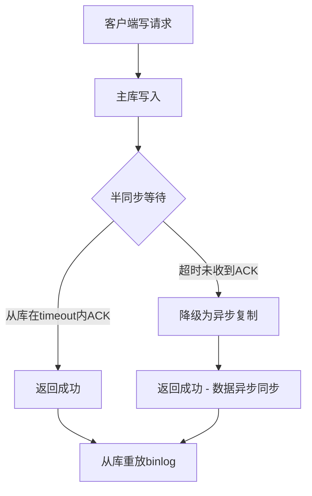
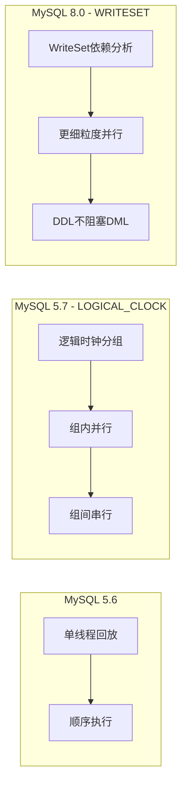
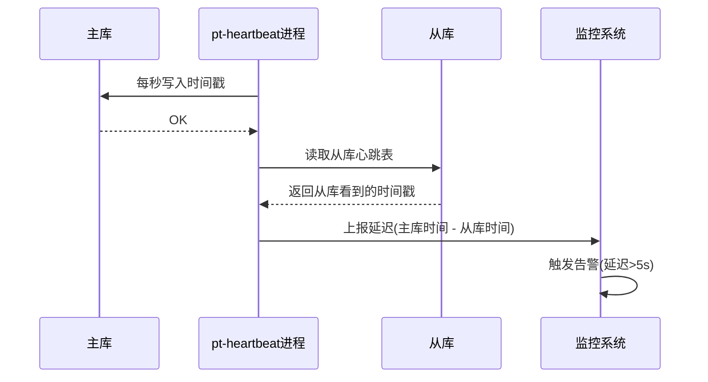
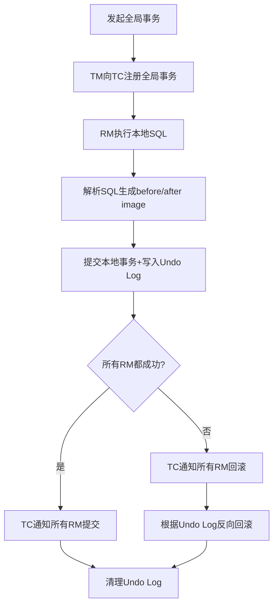
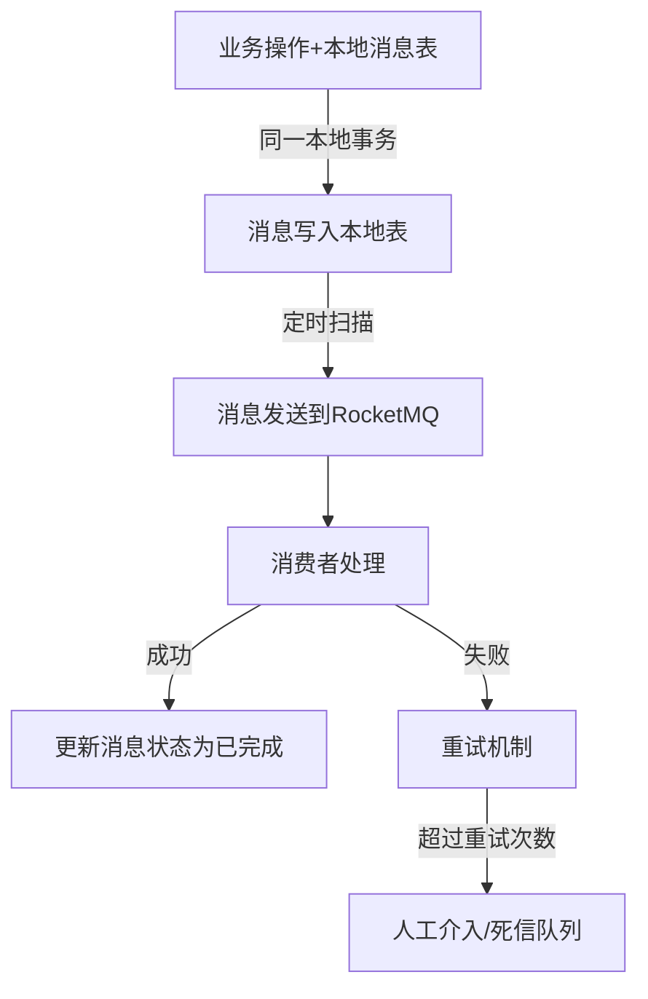
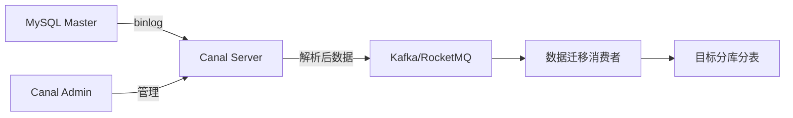
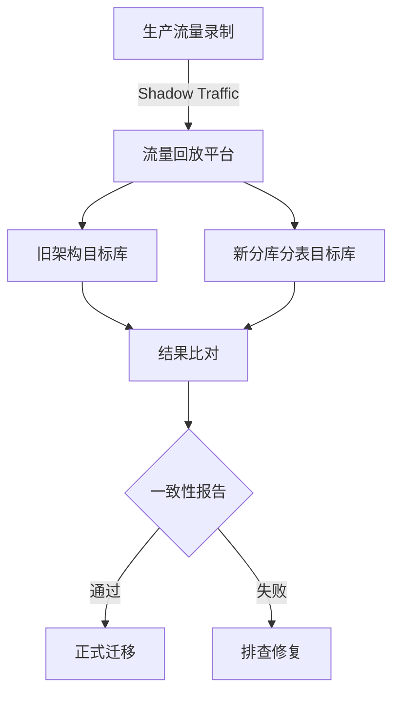
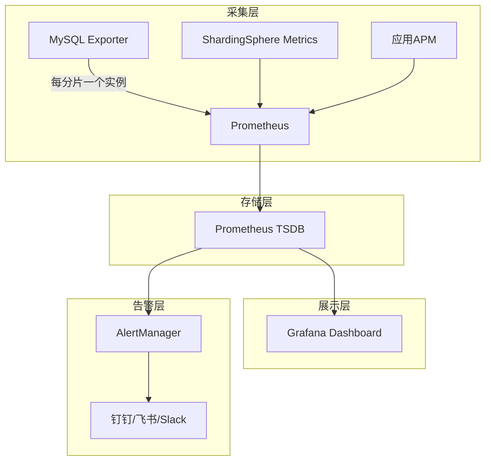
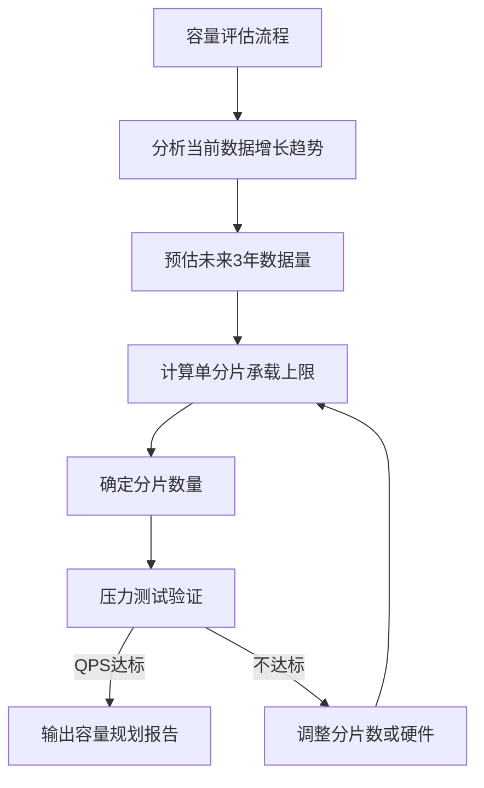

# 核心技巧：读写分离与分库分表的高阶实战

当理论基础已经建立，真正的挑战在于将知识转化为可靠的生产实践。本节聚焦六大核心技巧领域——主从延迟处理、分片路由优化、跨分片查询编排、分布式ID工程实现、分布式事务处理、数据迁移与监控体系——每一项都是从"能用"到"用好"的关键跨越。

```mermaid
graph TD
    A["核心技巧体系"] --> B["主从复制延迟处理"]
    A --> C["分片路由优化"]
    A --> D["跨分片查询与排序分页"]
    A --> E["分布式ID工程实践"]
    A --> F["分布式事务处理"]
    A --> G["数据迁移与监控"]

    B --> B1["半同步超时调优"]
    B --> B2["并行复制(MTS)"]
    B --> B3["Binlog Group Commit"]
    B --> B4["心跳延迟检测"]
    B --> B5["延迟从库备份"]

    C --> C1["分片键选择策略"]
    C --> C2["复合分片键设计"]
    C --> C3["路由算法对比"]
    C --> C4["不可路由SQL处理"]

    D --> D1["全局表方案"]
    D --> D2["绑定表方案"]
    D --> D3["跨分片聚合"]
    D --> D4["分布式排序分页"]

    E --> E1["Snowflake时钟回拨"]
    E --> E2["号段模式与Leaf"]
    E --> E3["ID性能基准测试"]
    E --> E4["ID与分片协同"]

    F --> F1["XA两阶段提交"]
    F --> F2["Seata AT/TCC"]
    F --> F3["消息最终一致性"]
    F --> F4["选型决策树"]

    G --> G1["Canal增量同步"]
    G --> G2["数据校验"]
    G --> G3["流量回放"]
    G --> G4["监控告警体系"]
```



---

## 一、主从复制延迟的高阶处理

主从复制延迟是读写分离架构中最为棘手的工程问题。从库延迟意味着写后读（Read-after-Write）可能读到旧数据，用户体验不一致，甚至触发业务逻辑错误。本节从五个维度系统解决这一问题。

### 1.1 Semi-sync Replication 超时调优

半同步复制（Semi-synchronous Replication）是平衡数据安全与写入性能的关键机制。生产环境中，需要根据业务容忍度精细调整超时参数，避免因从库延迟导致主库写入阻塞。

```sql
-- 主库半同步参数配置
SET GLOBAL rpl_semi_sync_master_enabled = 1;
SET GLOBAL rpl_semi_sync_master_timeout = 1000;  -- 1秒超时，超时后降级为异步
SET GLOBAL rpl_semi_sync_master_wait_for_slave_count = 1;  -- 至少1个从库确认
SET GLOBAL rpl_semi_sync_master_trace_level = 32;  -- 仅记录超时信息

-- 监控半同步状态
SHOW STATUS LIKE 'Rpl_semi_sync_master_%';
```

**关键参数调优策略：**

| 参数 | 生产推荐值 | 说明 |
|------|-----------|------|
| `master_timeout` | 500-2000ms | 超过则降级异步，需权衡一致性与可用性 |
| `wait_for_slave_count` | 1（同城）/ 0（异地） | 同城机房部署1，异地灾备设0避免延迟拖累 |
| `net_read_timeout` | 30s | 从库读取binlog网络超时 |
| `net_write_timeout` | 60s | 主库发送binlog网络超时 |

**超时值选择的决策依据：** 500ms适用于同城双机房且网络稳定（丢包率<0.01%）的场景；1000ms是通用推荐值，兼顾网络抖动容忍与数据安全；2000ms适合跨城多活部署，网络RTT本身可能达到5-10ms。超时值设置过短会导致频繁降级为异步复制，丧失半同步的数据保护意义；设置过长则在从库异常时阻塞主库写入，影响可用性。



### 1.2 并行复制（MTS）深度优化

MySQL 5.7+ 引入的 Multi-Threaded Slave（MTS）通过并行重放binlog大幅降低复制延迟。核心策略是基于逻辑时钟（Logical Clock）对事务分组。

```sql
-- 开启基于逻辑时钟的并行复制
SET GLOBAL slave_parallel_type = 'LOGICAL_CLOCK';
SET GLOBAL slave_parallel_workers = 8;  -- 建议值: CPU核数/2
SET GLOBAL slave_preserve_commit_order = 1;  -- 保证提交顺序

-- 监控并行复制效率
SHOW PROCESSLIST;  -- 查看sql thread状态
SHOW STATUS LIKE 'slave_parallel%';
```

**MTS并行度调优要点：**

- **worker数量选择**：过少（如2-4个）无法充分利用并行能力，过多（如超过CPU核数）则线程切换开销抵消并行收益。推荐值为CPU核数的50%-100%，需通过监控`slave_parallel_workers`的实际利用率来确定最优值。
- **slave_preserve_commit_order的取舍**：设为1保证事务提交顺序与主库一致，代价是并行度降低（组间必须串行）；设为0可以最大化并行度，但在故障恢复时可能出现顺序不一致。生产环境建议设为1，性能不足时优先增加worker数量而非关闭顺序保证。
- **MySQL 8.0的WRITESET优化**：8.0.20+版本引入基于WRITESET的依赖分析，不再依赖逻辑时钟分组，即使在`log_bin=OFF`或`tx_isolation=REPEATABLE-READ`下也能并行，DDL不再阻塞DML。

**并行复制架构演进对比：**



### 1.3 Binlog Group Commit 优化

Group Commit通过批量刷盘减少磁盘I/O次数，同时提升并行复制效率。三阶段提交流程如下：

```sql
-- MySQL Group Commit 三阶段（简化）
-- Stage 1: Flush Stage  - 收集事务到队列
-- Stage 2: Sync Stage   - 批量fsync到磁盘
-- Stage 3: Commit Stage  - 按顺序标记提交完成

-- 关键参数
-- binlog_group_commit_sync_delay: 等待更多事务加入组（微秒）
-- binlog_group_commit_sync_no_delay_count: 不等待时的最小事务数
```

```sql
-- 优化Group Commit效率
SET GLOBAL binlog_group_commit_sync_delay = 1000;   -- 等待1ms
SET GLOBAL binlog_group_commit_sync_no_delay_count = 10; -- 或凑够10个事务

-- 查看Group Commit统计
SHOW STATUS LIKE 'Binlog%';
-- 关注 Binlog_cache_use 和 Binlog_cache_disk_use
```

**调优策略：** `sync_delay`从0（默认不等待）调整到1000微秒（1ms）可以显著提升单次batch的事务数量，减少磁盘fsync次数。但延迟不能过大，否则会增加每个事务的提交延迟。`sync_no_delay_count`设为10意味着如果在delay时间内凑够10个事务则立即提交，不必等到超时。两个参数配合使用：高并发时主要靠count触发，低并发时靠delay兜底。

### 1.4 基于心跳的延迟检测

传统`SHOW SLAVE STATUS`中的`Seconds_Behind_Master`存在精度不足的问题（仅秒级，且基于从库本地时间计算，主从时钟不同步时可能失真）。生产环境推荐使用心跳表实现毫秒级延迟检测。

```sql
-- 主库：创建心跳表
CREATE TABLE heartbeat.ts (
    id INT PRIMARY KEY,
    ts TIMESTAMP(6) NOT NULL DEFAULT CURRENT_TIMESTAMP(6)
);
-- 定时更新（如使用pt-heartbeat）
-- pt-heartbeat --update --database heartbeat --table ts --daemonize

-- 从库：读取心跳值进行延迟计算
-- 延迟 = 主库心跳时间 - 从库读取的心跳时间
```



**为什么Seconds_Behind_Master不可靠：** 它的计算公式是`从库当前时间 - 事件时间戳`，但这个"事件时间戳"是事务在主库开始执行的时间，不是结束时间。如果一个事务执行了10秒，从库即使0延迟也会报告10秒延迟。此外，如果主从服务器时钟不同步（哪怕差几秒），结果就会失真。心跳表方案通过直接比对同一行数据在主从两端的可见时间戳，精确反映真实复制延迟。

### 1.5 Delayed Slave 备份策略

延迟从库（Delayed Slave）通过设置`MASTER_DELAY`确保从库滞后于主库一定时间，为误操作恢复提供"时间窗口"。

```sql
-- 配置延迟3600秒（1小时）
CHANGE MASTER TO MASTER_DELAY = 3600;
START SLAVE;

-- 误操作发生时的紧急恢复流程
STOP SLAVE;
-- 从延迟从库导出误操作前的数据
-- 然后重新配置为正常从库追赶binlog
```

**实际操作注意事项：**

- **延迟时间选择**：太短（如5分钟）在发现误操作时可能已经来不及，太长（如24小时）浪费一台从库的资源。推荐1-4小时，覆盖大多数误操作的发现窗口。
- **延迟从库不做读流量**：延迟从库的数据始终是旧的，不应承担在线读请求。它只作为数据恢复的"时间胶囊"存在。
- **误操作恢复流程**：发现误操作后，立即`STOP SLAVE`冻结从库状态 → 使用`SELECT INTO OUTFILE`或`mysqldump`导出误操作前的数据 → 分析需要恢复的范围 → 将数据导入到主库或其他目标库 → 重新配置从库正常追赶binlog。

---

## 二、读写分离中间件选型与调优

### 2.1 主流中间件深度对比

| 特性 | ShardingSphere-JDBC | MyCat | ProxySQL | MySQL Router |
|------|---------------------|-------|----------|--------------|
| 架构模式 | 客户端嵌入式 | 代理层 | 代理层 | 客户端/代理 |
| 语言 | Java | Java | C++ | C++ |
| 分片支持 | ✅ 完整 | ✅ 完整 | ❌ 仅读写分离 | ❌ 仅路由 |
| 读写分离 | ✅ | ✅ | ✅ 强大 | ✅ |
| 连接池 | 内置 | 内置 | 内置（专业级） | 无 |
| 性能损耗 | 极低（无网络跳转） | 中等（代理转发） | 低（C++实现） | 极低 |
| XA事务 | ✅ | 有限 | ❌ | ❌ |
| 适用场景 | Java微服务 | 传统架构 | 高性能读写分离 | MySQL InnoDB Cluster |

**选型决策路径：** 如果团队是Java技术栈且已有微服务架构，ShardingSphere-JDBC是首选——零额外进程、嵌入式部署、与Spring生态深度集成。如果需要多语言支持或非Java技术栈，ProxySQL凭借C++实现的高性能和灵活的查询规则引擎成为最佳选择。MyCat适合传统单体架构的存量项目改造，但社区活跃度已下降。MySQL Router适合已部署InnoDB Cluster的场景，功能较基础但与MGR无缝配合。

### 2.2 ShardingSphere 读写分离配置优化

```yaml
# application.yml
spring:
  shardingsphere:
    datasource:
      names: master,slave0,slave1
      master:
        type: com.zaxxer.hikari.HikariDataSource
        jdbc-url: jdbc:mysql://master-host:3306/db?useSSL=false&amp;serverTimezone=Asia/Shanghai
        username: root
        password: root123
      slave0:
        type: com.zaxxer.hikari.HikariDataSource
        jdbc-url: jdbc:mysql://slave0-host:3306/db?useSSL=false&amp;serverTimezone=Asia/Shanghai
        username: readonly
        password: readonly123
      slave1:
        type: com.zaxxer.hikari.HikariDataSource
        jdbc-url: jdbc:mysql://slave1-host:3306/db?useSSL=false&amp;serverTimezone=Asia/Shanghai
        username: readonly
        password: readonly123
    rules:
      readwrite-splitting:
        data-sources:
          myds:
            write-data-source-name: master
            read-data-source-names: slave0,slave1
            load-balancer-name: weight-based
            props:
              sql-show: false  # 生产环境关闭SQL日志
        load-balancers:
          weight-based:
            type: WEIGHT
            props:
              slave0: 3   # 权重3
              slave1: 2   # 权重2（硬件较弱的从库给低权重）
    props:
      sql-show: false  # 生产环境关闭SQL日志
```

**负载均衡策略选择：**

| 策略 | 适用场景 | 优点 | 缺点 |
|------|---------|------|------|
| ROUND_ROBIN | 从库硬件一致 | 简单均匀 | 无法感知负载差异 |
| RANDOM | 从库硬件一致 | 实现简单 | 可能短期不均匀 |
| WEIGHT | 从库硬件不一致 | 按能力分配 | 需要人工评估权重 |

**事务内路由策略：** ShardingSphere默认将事务内的所有SQL路由到主库，保证事务内读写一致性。对于只读事务（如`@Transactional(readOnly = true)`），可以配置`transactional-read-write-splitting`将其路由到从库，释放主库压力。但需确保该事务不需要读取刚写入的数据。

### 2.3 ProxySQL 高级路由策略

ProxySQL的强大之处在于其灵活的规则引擎，可以实现细粒度的查询路由：

```sql
-- ProxySQL管理接口配置读写分离规则
-- 添加MySQL服务器
INSERT INTO mysql_servers(hostgroup_id, hostname, port, max_connections) VALUES 
(10, 'master-host', 3306, 200),   -- 写组 hostgroup=10
(20, 'slave0-host', 3306, 500),   -- 读组 hostgroup=20（大连接池）
(20, 'slave1-host', 3306, 500);   -- 读组 hostgroup=20

-- 配置读写分离规则（按优先级从高到低匹配）
INSERT INTO mysql_query_rules(rule_id, active, match_pattern, destination_hostgroup, apply) VALUES
(1, 1, '^SELECT .* FOR UPDATE$', 10, 1),       -- SELECT FOR UPDATE走主库
(2, 1, '^SELECT .* LOCK IN SHARE MODE$', 10, 1), -- 共享锁查询走主库
(3, 1, '^SELECT.*FROM.*WHERE.*read_after_write.*', 10, 1),  -- 业务标记走主库
(4, 1, '^SELECT', 20, 1);                       -- 普通SELECT走从库

-- 基于用户区分路由（报表用户走专用从库）
INSERT INTO mysql_query_rules(rule_id, active, match_pattern, destination_hostgroup, username, apply) VALUES
(5, 1, '^SELECT', 30, 'report_user', 1);  -- 报表用户走hostgroup=30（专用从库）

LOAD MYSQL SERVERS TO RUNTIME;
LOAD MYSQL QUERY RULES TO RUNTIME;
SAVE MYSQL SERVERS TO DISK;
SAVE MYSQL QUERY RULES TO DISK;
```

**ProxySQL的关键优势：**

- **连接池复用**：ProxySQL维护与后端MySQL的持久连接，前端应用连接可以复用后端连接，大幅减少MySQL的连接数压力。
- **查询缓存**：对于不常变化的配置表、字典表查询，可以开启缓存直接返回结果，不查数据库。
- **故障自动检测**：定期向后端MySQL发送心跳检测，发现故障节点自动从路由中摘除，恢复后自动加入。
- **运行时热加载**：所有配置变更通过`LOAD ... TO RUNTIME`即时生效，无需重启服务。

### 2.4 读写分离的一致性问题与应对

读写分离面临的核心挑战是主从复制延迟导致的读写不一致。用户刚刚写入数据，随即去从库读取，可能读到旧数据。这个问题被称为"读己之写"（Read Your Own Writes）问题。

**五种应对方案：**

| 方案 | 实现方式 | 一致性保证 | 性能影响 | 复杂度 |
|------|---------|-----------|---------|--------|
| 强制主库读 | 写操作后短时间内的读请求路由到主库 | 强一致 | 主库负载增加 | 低 |
| 延迟检测路由 | 从库延迟超过阈值时将读路由到主库 | 依赖阈值 | 低 | 中 |
| 会话级读主 | 同一会话内写操作后强制读主库 | 会话级强一致 | 低 | 中 |
| 版本号路由 | 写入时返回版本号，读取时携带版本号比对 | 精确一致 | 低 | 高 |
| 缓存中转 | 写入后更新缓存，读取优先查缓存 | 最终一致 | 缓存依赖 | 中 |

```java
// 方案1：基于注解的强制主库读
@Target(ElementType.METHOD)
@Retention(RetentionPolicy.RUNTIME)
public @interface ForceMasterRead {}

// 方案4：版本号路由的实现思路
public DataVO readWithConsistency(Long userId, Long requiredVersion) {
    // 先尝试从从库读
    DataVO result = slaveDao.findById(userId);
    if (result.getVersion() >= requiredVersion) {
        return result;  // 从库数据已追上，直接返回
    }
    // 从库数据落后，回退到主库读
    return masterDao.findById(userId);
}
```

---

## 三、分片路由优化

分片路由是分库分表的核心枢纽——每条SQL都需要准确路由到目标分片。路由质量直接决定查询性能和系统可用性。

### 3.1 分片键选择策略

分片键（Shard Key）的选择决定了数据分布的均匀性和查询路由的效率，是分库分表设计中最关键的决策。

**分片键选择四原则：**

1. **查询频率最高**：90%以上的查询都带分片键作为条件，可以精确路由到单个分片，避免全分片扫描。
2. **数据分布均匀**：分片键的值域应均匀分布，避免某些分片数据过多形成热点。例如，按用户ID分片优于按订单ID分片（新用户增长均匀，但某些用户的订单量远超平均）。
3. **不可变性**：分片键一旦确定不能修改，否则需要全量数据迁移。因此要选择业务上稳定的字段。
4. **增长可预期**：分片键的值域增长趋势可预测，便于提前规划扩容。

| 业务场景 | 推荐分片键 | 原因 |
|---------|-----------|------|
| 电商订单 | user_id | 按用户查询订单是核心路径，用户增长均匀 |
| IM消息 | conversation_id | 按会话查消息是核心路径，会话增长均匀 |
| 金融流水 | account_id | 按账户查询流水是核心路径 |
| 日志表 | 时间+设备ID组合 | 时间查询是核心路径，避免单时间分片的热点 |
| 商品表 | 不分片 | 商品数量通常不超百万，单表即可承载 |

### 3.2 复合分片键设计

单一字段分片在复杂查询场景下往往不够。复合分片键通过组合多个字段来平衡路由精确性和数据分布。

```java
/**
 * 复合分片键计算器
 * 示例：订单表按 (user_id, order_date) 复合分片
 * 目的：同一用户的订单集中存储，同时按时间维度辅助路由
 */
public class CompositeShardRouter {
    
    private final int shardCount;
    private final int monthsPerShard;  // 每个分片覆盖的月份数
    
    public CompositeShardRouter(int shardCount, int monthsPerShard) {
        this.shardCount = shardCount;
        this.monthsPerShard = monthsPerShard;
    }
    
    /**
     * 复合路由算法：先按时间分库，再按用户分表
     * 库名: order_db_{year}_{month}
     * 表名: order_{user_id % tableShardCount}
     */
    public ShardInfo route(long userId, LocalDate orderDate) {
        // 时间维度确定库
        int yearMonth = orderDate.getYear() * 100 + orderDate.getMonthValue();
        int dbIndex = (yearMonth / monthsPerShard) % shardCount;
        String dbName = String.format("order_db_%d_%02d", 
            orderDate.getYear(), orderDate.getMonthValue());
        
        // 用户维度确定表
        int tableIndex = (int)(Math.abs(userId) % 16);
        String tableName = "order_" + tableIndex;
        
        return new ShardInfo(dbName, tableName);
    }
}
```

**复合分片键的权衡：** 复合分片键增加了路由逻辑的复杂度，但带来了两个显著优势——第一，支持按时间范围查询时只需扫描特定分片（如"查询某用户某月的订单"），而非全分片扫描；第二，历史数据可以按时间归档到冷存储，热数据保持小规模。

### 3.3 路由算法对比

不同的分片算法在数据分布均匀性、范围查询效率和扩容复杂度之间存在显著差异：

| 算法 | 数据分布 | 范围查询 | 扩容难度 | 数据迁移量 | 适用场景 |
|------|---------|---------|---------|-----------|---------|
| 取模 (MOD) | 均匀 | 差（需扫描所有分片） | 高（全部迁移） | 100% | 查询主要为等值查询 |
| 一致性哈希 | 较均匀 | 差 | 低（仅迁移1/N） | 1/N | 动态扩容频繁 |
| 范围 (RANGE) | 可能不均 | 优（连续分片） | 低（新增分片） | 0 | 时间序列、日志类数据 |
| 查表法 | 可控 | 灵活 | 中（修改映射表） | 按需 | 路由逻辑复杂 |

```java
/**
 * 一致性哈希分片实现（含虚拟节点）
 * 虚拟节点解决数据倾斜问题：每个物理分片对应150个虚拟节点
 */
public class ConsistentHashRouter {
    
    private final TreeMap<Long, Integer> ring = new TreeMap<>();
    private final int virtualNodes = 150;  // 每个物理节点的虚拟节点数
    
    public ConsistentHashRouter(int physicalNodes) {
        for (int i = 0; i < physicalNodes; i++) {
            for (int j = 0; j < virtualNodes; j++) {
                long hash = hash("node-" + i + "-vn-" + j);
                ring.put(hash, i);
            }
        }
    }
    
    public int route(String key) {
        long hash = hash(key);
        Map.Entry<Long, Integer> entry = ring.ceilingEntry(hash);
        if (entry == null) {
            entry = ring.firstEntry();  // 环形回到头部
        }
        return entry.getValue();
    }
    
    /**
     * 扩容时只需迁移受影响的数据
     * 新节点加入后，只有落在新节点与其前驱节点之间的数据需要迁移
     */
    public List<Integer> getAffectedKeys(int newPhysicalNode, int totalNodes) {
        // 计算新节点影响的key范围，返回需要迁移的分片编号
        // 迁移量约为 总数据量 / (新总节点数)
        return Collections.emptyList();  // 实际实现省略
    }
    
    private long hash(String key) {
        // MurmurHash2 64-bit
        byte[] data = key.getBytes();
        long h = 0x9747b28cL;
        for (byte b : data) {
            h ^= b;
            h *= 0x5bd1e995L;
            h ^= h >>> 15;
        }
        return h;
    }
}
```

### 3.4 不可路由SQL的处理策略

分库分表后，有一类SQL天然无法路由到单个分片——它们缺少分片键条件。处理这类SQL是分库分表系统最棘手的问题之一。

**典型不可路由场景与应对：**

```sql
-- 场景1：按非分片键查询
-- 原始SQL：SELECT * FROM orders WHERE order_no = 'ORD20260626001'
-- 分片键是user_id，但order_no不是分片键
-- 解决方案：
--   a) 建立order_no -> user_id的映射表（索引表）
--   b) 将order_no作为二级索引存在每个分片，广播查询后合并

-- 场景2：全表聚合
-- 原始SQL：SELECT COUNT(*) FROM orders WHERE status = 'PAID'
-- 需要扫描所有分片
-- 解决方案：
--   a) 增加冗余字段：下单时在user维度维护计数器
--   b) 异步统计：定时任务预计算聚合结果存入汇总表

-- 场景3：JOIN跨分片表
-- 原始SQL：SELECT o.*, u.name FROM orders o JOIN users u ON o.user_id = u.id
-- 如果orders和users分片键一致且使用绑定表，可以在同一分片内JOIN
-- 否则需要应用层组装
```

**索引表方案实现：**

```sql
-- 创建全局索引表：映射二级字段到分片键
CREATE TABLE global_index_order_no (
    order_no VARCHAR(32) PRIMARY KEY,
    user_id BIGINT NOT NULL,        -- 分片键
    shard_db VARCHAR(32) NOT NULL,  -- 目标分片库
    created_at TIMESTAMP DEFAULT CURRENT_TIMESTAMP,
    INDEX idx_created (created_at)
);

-- 写入数据时同步维护索引表（同一事务内）
-- 索引表本身不分片，保持全局唯一
```

**全局聚合表方案：**

```sql
-- 定时预计算的聚合汇总表
CREATE TABLE order_statistics (
    stat_date DATE NOT NULL,
    user_id BIGINT NOT NULL,
    total_orders INT DEFAULT 0,
    total_amount DECIMAL(12,2) DEFAULT 0,
    paid_orders INT DEFAULT 0,
    paid_amount DECIMAL(12,2) DEFAULT 0,
    updated_at TIMESTAMP DEFAULT CURRENT_TIMESTAMP ON UPDATE CURRENT_TIMESTAMP,
    PRIMARY KEY (stat_date, user_id)
);
-- 定时任务：每5分钟从各分片汇总数据写入此表
-- 查询时直接查汇总表，无需跨分片聚合
```

---

## 四、跨分片查询与排序分页

分库分表后，跨分片查询是最常见也最复杂的操作模式。核心挑战在于：如何在多个分片的结果集上完成聚合、排序和分页。

### 4.1 全局表与绑定表

**全局表（Global Table）：** 将小表的完整数据冗余到每个分片中，使得跨分片JOIN可以退化为分片内JOIN。适合数据量小（如配置表、字典表、地区表）且变更频率低的表。

```yaml
# ShardingSphere全局表配置
spring:
  shardingsphere:
    rules:
      sharding:
        tables:
          orders:
            actual-data-nodes: ds_${0..3}.orders_${0..15}
            database-strategy:
              standard:
                sharding-column: user_id
                sharding-algorithm-name: db-mod
          # 全局表：每个分片都有完整副本
          dict_order_status:
            actual-data-nodes: ds_${0..3}.dict_order_status
            # 不指定分片策略 = 全局表
```

**绑定表（Binding Table）：** 将分片键相同的多个表绑定在一起，使它们在同一个分片内完成JOIN。例如orders和order_items都按user_id分片，JOIN时只需在一个分片内完成。

```yaml
# ShardingSphere绑定表配置
spring:
  shardingsphere:
    rules:
      sharding:
        tables:
          orders:
            actual-data-nodes: ds_${0..3}.orders_${0..15}
            database-strategy:
              standard:
                sharding-column: user_id
                sharding-algorithm-name: db-mod
          order_items:
            actual-data-nodes: ds_${0..3}.order_items_${0..15}
            database-strategy:
              standard:
                sharding-column: user_id  # 与orders相同的分片键
                sharding-algorithm-name: db-mod
        binding-tables:
          - orders,order_items  # 绑定表：JOIN时保证在同一分片
```

### 4.2 跨分片聚合

当SQL包含聚合函数（COUNT、SUM、AVG、MAX、MIN）且没有分片键条件时，需要在每个分片上执行查询后合并结果：

| 聚合函数 | 合并策略 | 注意事项 |
|---------|---------|---------|
| COUNT(*) | 各分片COUNT后求和 | 需注意DISTINCT COUNT不能简单求和 |
| SUM() | 各分片SUM后求和 | 直接求和即可，无精度问题 |
| AVG() | 各分片SUM求和 / COUNT求和 | 不能各分片AVG后取平均（加权平均） |
| MAX() | 各分片MAX取最大值 | 正确 |
| MIN() | 各分片MIN取最小值 | 正确 |

```java
/**
 * 跨分片COUNT DISTINCT的正确实现
 * 错误做法：各分片SELECT COUNT(DISTINCT status) → 直接求和
 * 正确做法：各分片SELECT DISTINCT status → 应用层去重后计数
 */
public long crossShardDistinctCount(String column) {
    Set<Object> globalDistinctValues = ConcurrentHashMap.newKeySet();
    
    List<Future<?>> futures = shards.stream()
        .map(shard -> executor.submit(() -> {
            List<Object> values = shard.query(
                "SELECT DISTINCT " + column + " FROM orders");
            globalDistinctValues.addAll(values);
        }))
        .collect(Collectors.toList());
    
    futures.forEach(f -> {
        try { f.get(); } catch (Exception e) { throw new RuntimeException(e); }
    });
    
    return globalDistinctValues.size();
}
```

### 4.3 分布式排序与分页

分库分表后的排序分页是最具挑战性的操作——每个分片返回的数据需要全局排序后取前N条，然后偏移M条取第M+1到M+N条。

**全量归并排序的代价：** 如果查询`SELECT * FROM orders ORDER BY created_at DESC LIMIT 10 OFFSET 10000`，每个分片都需要返回前10010条数据（10000+10），所有分片的结果在内存中归并排序后取第10001到10010条。随着OFFSET增大，内存和CPU消耗线性增长。

**优化方案——流式归并与深度分页规避：**

```java
/**
 * 流式归并排序：使用优先队列（最小堆）逐条吐出结果
 * 内存占用恒定，仅需 N个分片 × 每分片1条 的缓冲
 */
public <T extends Comparable<T>> Iterator<T> mergeSort(
        List<ShardCursor<T>> cursors, Comparator<T> comparator) {
    
    PriorityQueue<ShardCursor<T>> heap = new PriorityQueue<>(
        Comparator.comparing(c -> c.current(), comparator));
    
    // 初始化：将每个游标的当前行加入堆
    cursors.forEach(c -> { if (c.hasNext()) heap.add(c); });
    
    return new Iterator<T>() {
        @Override
        public boolean hasNext() { return !heap.isEmpty(); }
        
        @Override
        public T next() {
            ShardCursor<T> top = heap.poll();
            T result = top.current();
            if (top.advance()) heap.add(top);  // 推进该游标并重新入堆
            return result;
        }
    };
}
```

**深度分页的替代方案：**

```sql
-- 问题SQL：OFFSET 100000的深度分页
SELECT * FROM orders ORDER BY created_at DESC LIMIT 20 OFFSET 100000;
-- 每个分片都要返回100020行，合并后取第100001-100020行

-- 优化方案1：游标分页（Keyset Pagination）—— 推荐
SELECT * FROM orders 
WHERE created_at < '2026-06-26 12:00:00'  -- 上一页最后一条的时间戳
ORDER BY created_at DESC 
LIMIT 20;
-- 可以利用索引，每个分片只返回20行

-- 优化方案2：业务限制分页深度
-- 在应用层限制最大分页偏移量，超过后引导用户使用搜索/筛选缩小范围
```

### 4.4 不同归并引擎的性能对比

| 归并类型 | 内存占用 | 适用场景 | ShardingSphere实现 |
|---------|---------|---------|-------------------|
| 流式归并 | 极低（O(N)，N=分片数） | 排序+分页 | IteratorMerger |
| 内存归并 | 高（O(全量结果)） | 全量加载后排序 | MemoryMerger |
| 聚合归并 | 中（O(N)） | COUNT/SUM等聚合 | ReduceMerger |
| 路由归并 | 无 | 单分片查询 | 直接返回 |

---

## 五、分布式ID工程实践

分库分表后，数据库自增ID不再适用——不同分片会产生重复ID。分布式ID生成是分库分表的必备基础设施。

### 5.1 Snowflake ID 的工程实现与问题解决

Snowflake算法生成64位ID，结构为：1位符号位 + 41位时间戳 + 10位机器ID + 12位序列号。核心优势是趋势递增、全局唯一、不依赖外部存储。

```java
/**
 * Snowflake ID 生成器 —— 生产级实现
 * 关键问题：时钟回拨
 * 解决方案：等待回拨追平 / 拒绝生成 / 预留扩展位
 */
public class SnowflakeIdGenerator {
    
    // 起始时间戳（2024-01-01 00:00:00 UTC）
    private static final long EPOCH = 1704067200000L;
    
    // 各部分的位数
    private static final long WORKER_ID_BITS = 5L;
    private static final long DATACENTER_ID_BITS = 5L;
    private static final long SEQUENCE_BITS = 12L;
    
    // 最大值
    private static final long MAX_WORKER_ID = ~(-1L << WORKER_ID_BITS);    // 31
    private static final long MAX_DATACENTER_ID = ~(-1L << DATACENTER_ID_BITS); // 31
    private static final long SEQUENCE_MASK = ~(-1L << SEQUENCE_BITS);     // 4095
    
    // 位移
    private static final long WORKER_ID_SHIFT = SEQUENCE_BITS;                         // 12
    private static final long DATACENTER_ID_SHIFT = SEQUENCE_BITS + WORKER_ID_BITS;    // 17
    private static final long TIMESTAMP_LEFT_SHIFT = SEQUENCE_BITS + WORKER_ID_BITS + DATACENTER_ID_BITS; // 22
    
    private final long workerId;
    private final long datacenterId;
    private long sequence = 0L;
    private long lastTimestamp = -1L;
    
    // 时钟回拨容忍阈值（毫秒）
    private static final long MAX_CLOCK_DRIFT = 5L;
    
    public synchronized long nextId() {
        long timestamp = System.currentTimeMillis();
        
        // 时钟回拨检测与处理
        if (timestamp < lastTimestamp) {
            long drift = lastTimestamp - timestamp;
            if (drift <= MAX_CLOCK_DRIFT) {
                // 小范围回拨：等待追平
                timestamp = waitUntilNextMillis(lastTimestamp);
            } else {
                // 大范围回拨：拒绝生成，抛出异常
                throw new RuntimeException(
                    "Clock moved backwards by " + drift + "ms, " +
                    "refusing to generate id for " + drift + "ms");
            }
        }
        
        // 同一毫秒内序列号递增
        if (timestamp == lastTimestamp) {
            sequence = (sequence + 1) &amp; SEQUENCE_MASK;
            if (sequence == 0) {
                // 序列号溢出，等待下一毫秒
                timestamp = waitUntilNextMillis(lastTimestamp);
            }
        } else {
            sequence = 0L;
        }
        
        lastTimestamp = timestamp;
        
        return ((timestamp - EPOCH) << TIMESTAMP_LEFT_SHIFT)
                | (datacenterId << DATACENTER_ID_SHIFT)
                | (workerId << WORKER_ID_SHIFT)
                | sequence;
    }
    
    private long waitUntilNextMillis(long lastTs) {
        long ts = System.currentTimeMillis();
        while (ts <= lastTs) {
            ts = System.currentTimeMillis();
        }
        return ts;
    }
}
```

**时钟回拨的三种应对策略：**

| 策略 | 实现方式 | 影响 | 适用场景 |
|------|---------|------|---------|
| 等待追平 | spin-wait直到时钟追上 | 短暂ID生成停顿 | 回拨量<5ms |
| 拒绝生成 | 抛出异常，上层重试或降级 | ID生成中断 | 回拨量>5ms |
| 预留位扩展 | 用扩展位标记回拨次数 | ID结构变化 | 对ID格式无严格要求 |

### 5.2 号段模式与Leaf

号段模式通过向中心节点申请号段（如一次申请1-1000号），在本地分发ID，减少对中心节点的访问频率。美团开源的Leaf是号段模式的标杆实现。

```java
/**
 * 号段模式ID生成器简化实现
 * 核心思想：批量申请ID段，本地消费，耗尽后再申请下一段
 */
public class SegmentIdGenerator {
    
    private final AtomicLong currentId = new AtomicLong(0);
    private final AtomicInteger loading = new AtomicInteger(0);
    private volatile long maxId = 0;
    
    private final AtomicBoolean isInitialized = new AtomicBoolean(false);
    
    /**
     * 获取下一个ID
     * 双Buffer机制：当前号段消耗10%时，异步加载下一个号段
     */
    public long nextId() {
        if (!isInitialized.get()) {
            synchronized (this) {
                if (!isInitialized.get()) {
                    loadSegment();  // 初始化：申请第一个号段
                    isInitialized.set(true);
                }
            }
        }
        
        long current = currentId.incrementAndGet();
        
        // 双Buffer预加载：消耗到10%时触发异步加载
        if (current > maxId * 0.9 &amp;&amp; loading.compareAndSet(0, 1)) {
            CompletableFuture.runAsync(() -> {
                loadSegment();
                loading.set(0);
            });
        }
        
        // 号段耗尽：同步等待新号段加载
        if (current > maxId) {
            synchronized (this) {
                current = currentId.get();
                if (current > maxId) {
                    loadSegment();
                    current = currentId.incrementAndGet();
                }
            }
        }
        
        return current;
    }
    
    private void loadSegment() {
        // 向DB或Redis申请号段
        // UPDATE id_alloc SET max_id = max_id + step WHERE biz_tag = 'orders'
        // 获取新的 max_id 和 step
        long newMax = fetchFromDb();  // 从数据库获取
        long newMin = maxId + 1;
        maxId = newMax;
        currentId.set(newMin);
    }
}
```

**号段模式 vs Snowflake 对比：**

| 维度 | Snowflake | 号段模式(Leaf) |
|------|-----------|---------------|
| ID趋势性 | 严格递增 | 严格递增 |
| 依赖外部存储 | 无（仅时钟） | 数据库/Redis |
| 性能 | 极高（纯计算） | 高（本地分发） |
| 机器ID管理 | 需手动分配 | 不需要 |
| 时钟回拨 | 需处理 | 不受影响 |
| ID泄露风险 | 低（位结构不可预测） | 中（连续ID可被猜测） |

### 5.3 ID方案与分片策略的协同

分布式ID与分片策略之间存在紧密的协同关系。不恰当的ID方案可能导致数据分布不均匀：

- **Snowflake ID + 取模分片**：Snowflake的高时间位使得ID值持续增长，取模分片可以均匀分布，这是最佳组合。
- **自增ID + 取模分片**：自增ID从1开始连续增长，取模可以均匀分布，但自增ID在分库分表场景下无法跨库保证唯一性。
- **UUID + 任何分片**：UUID是无序的，取模分片均匀但无法做范围查询；且UUID占128位，存储和索引开销大。
- **Snowflake ID + 范围分片**：按时间范围分片时，Snowflake的时间位使得同一时间段的ID集中在同一分片，但可能产生热点。

---

## 六、分布式事务处理

分库分表后，原本在单库中由ACID保障的事务被分散到多个数据库实例，跨库事务的一致性成为核心挑战。分布式事务有多种模式，适用于不同的业务场景和一致性要求。

### 6.1 XA两阶段提交

XA是数据库层面的标准分布式事务协议，通过两阶段提交（Prepare + Commit）保证强一致性。

```java
// XA事务在ShardingSphere中的使用
@ShardingSphereTransactionType(TransactionType.XA)
@Transactional
public void crossDbTransfer(Long fromAccount, Long toAccount, BigDecimal amount) {
    // 两个操作可能路由到不同分库
    accountMapper.debit(fromAccount, amount);   // 分片A
    accountMapper.credit(toAccount, amount);    // 分片B
    // ShardingSphere自动管理XA两阶段提交
}
```

**XA的致命缺陷：**

- **性能瓶颈**：Prepare阶段需要锁定所有参与者的资源，在高并发场景下会导致严重的锁等待。实测在100并发下，XA事务吞吐量下降60-80%。
- **协调者单点**：事务协调者（Transaction Manager）宕机时，参与者可能处于不确定状态（既不能提交也不能回滚），需要人工介入。
- **不支持超时**：标准XA协议没有超时机制，长时间不提交的事务会一直持有锁。

### 6.2 Seata AT模式

Seata的AT（Automatic Transaction）模式通过Undo Log实现自动化的分布式事务，对业务代码几乎零侵入。适用于大多数CRUD场景。

```java
// Seata AT模式 - 零侵入的分布式事务
@GlobalTransactional(timeoutMills = 60000, name = "order-create")
public void createOrder(OrderDTO orderDTO) {
    // 1. 扣减库存（数据源A）
    stockService.deduct(orderDTO.getProductId(), orderDTO.getQuantity());
    
    // 2. 创建订单（数据源B）
    orderService.insert(orderDTO);
    
    // 3. 扣减余额（数据源C）
    accountService.debit(orderDTO.getUserId(), orderDTO.getAmount());
    // 若任一步骤异常，Seata自动回滚所有已提交的本地事务
}
```

**AT模式的工作原理：**



**AT模式的限制：**

- 依赖SQL解析：非标准SQL（如复杂子查询、存储过程）可能解析失败
- 全局锁：执行期间会在数据库行上加全局锁，影响并发
- 不适合长事务：事务持有全局锁时间过长会导致其他事务阻塞
- 数据源代理：需要使用Seata提供的DataSource代理类，对连接池配置有一定侵入

### 6.3 TCC 模式详解

TCC（Try-Confirm-Cancel）模式需要业务手动实现三个阶段，适合对数据一致性要求极高的场景（如金融转账）。

```java
// TCC 三阶段接口定义
public interface AccountTccService {
    
    // Try: 冻结资源（预留）
    @TwoPhaseBusinessAction(name = "debit", commitMethod = "confirm", rollbackMethod = "cancel")
    boolean tryDebit(@BusinessActionContextParameter(paramName = "userId") Long userId,
                     @BusinessActionContextParameter(paramName = "amount") BigDecimal amount);
    
    // Confirm: 确认扣减（释放冻结）
    boolean confirm(BusinessActionContext context);
    
    // Cancel: 释放冻结（回滚）
    boolean cancel(BusinessActionContext context);
}

// 实现要点：幂等性 + 防悬挂
public boolean tryDebit(Long userId, BigDecimal amount) {
    // Try阶段：冻结余额（不是直接扣减）
    int rows = accountMapper.freezeAmount(userId, amount);
    return rows > 0;
}

public boolean confirm(BusinessActionContext context) {
    // 幂等检查：confirm可能被重复调用
    if (isAlreadyConfirmed(context.getXid())) return true;
    Long userId = Long.valueOf(context.getActionContext("userId"));
    BigDecimal amount = (BigDecimal) context.getActionContext("amount");
    // 将冻结余额转为已扣减
    return accountMapper.confirmDebit(userId, amount) > 0;
}

public boolean cancel(BusinessActionContext context) {
    // 幂等检查：cancel可能被重复调用
    if (isAlreadyCancelled(context.getXid())) return true;
    Long userId = Long.valueOf(context.getActionContext("userId"));
    BigDecimal amount = (BigDecimal) context.getActionContext("amount");
    // 释放冻结余额
    return accountMapper.releaseFreeze(userId, amount) > 0;
}
```

**TCC三大核心问题：**

| 问题 | 描述 | 解决方案 |
|------|------|---------|
| 幂等性 | Confirm/Cancel可能被TC重复调用 | 事务状态表 + 唯一键校验 |
| 空回滚 | Try未执行但Cancel被调用 | 检查Try是否执行过，未执行则空操作 |
| 悬挂 | Cancel先于Try到达并执行，导致Try永远无法执行 | 检查事务是否已取消，已取消则拒绝Try |

```sql
-- TCC事务状态记录表
CREATE TABLE tcc_transaction_log (
    xid VARCHAR(64) PRIMARY KEY,          -- 全局事务ID
    branch_id VARCHAR(64) NOT NULL,       -- 分支事务ID
    action_name VARCHAR(64) NOT NULL,     -- 操作名称
    status TINYINT DEFAULT 0,             -- 0:try 1:confirm 2:cancel
    created_at TIMESTAMP DEFAULT CURRENT_TIMESTAMP,
    INDEX idx_xid (xid)
);
```

### 6.4 基于消息的最终一致性

对于不要求实时一致但需要最终一致的场景，基于消息的本地事务表模式（Transactional Outbox）是最可靠的方案。



**本地消息表模式核心实现：**

```sql
-- 本地消息表
CREATE TABLE outbox_messages (
    id BIGINT PRIMARY KEY AUTO_INCREMENT,
    event_type VARCHAR(64) NOT NULL,      -- 事件类型
    payload JSON NOT NULL,                -- 事件数据
    status TINYINT DEFAULT 0,             -- 0待发送 1已发送 2已确认 3失败
    retry_count INT DEFAULT 0,
    max_retries INT DEFAULT 3,
    created_at TIMESTAMP DEFAULT CURRENT_TIMESTAMP,
    updated_at TIMESTAMP DEFAULT CURRENT_TIMESTAMP ON UPDATE CURRENT_TIMESTAMP,
    INDEX idx_status_created (status, created_at)
);
```

```java
// 事务性发件箱（Transactional Outbox）实现
@Service
public class OrderService {
    
    @Transactional
    public void createOrder(OrderDTO dto) {
        // 1. 业务操作
        orderMapper.insert(dto);
        
        // 2. 同一事务内写入消息表
        OutboxMessage msg = new OutboxMessage();
        msg.setEventType("ORDER_CREATED");
        msg.setPayload(JsonUtils.toJson(dto));
        msg.setStatus(0);
        outboxMapper.insert(msg);
        // 保证业务数据和消息要么同时提交，要么同时回滚
    }
}

// 定时任务扫描并发送消息
@Scheduled(fixedDelay = 1000)
public void sendPendingMessages() {
    List<OutboxMessage> messages = outboxMapper.selectPending(100);
    for (OutboxMessage msg : messages) {
        try {
            rocketMQTemplate.syncSend("order-topic", msg.getPayload());
            outboxMapper.updateStatus(msg.getId(), 1);  // 已发送
        } catch (Exception e) {
            outboxMapper.incrementRetry(msg.getId());
            if (msg.getRetryCount() >= msg.getMaxRetries()) {
                outboxMapper.updateStatus(msg.getId(), 3);  // 失败
            }
        }
    }
}
```

**Outbox模式的增强——CDC驱动的发件箱：** 传统的定时扫描方式存在延迟（取决于扫描间隔）和数据库压力（频繁扫描）。可以使用Canal/Debezium监听outbox_messages表的binlog变更，实时推送消息到MQ，将延迟从秒级降到毫秒级。

### 6.5 分布式事务选型决策树

```mermaid
graph TD
    A[需要分布式事务?] --> B{数据一致性要求?}
    B -->|强一致| C{性能要求?}
    B -->|最终一致| D{消息中间件可用?}
    
    C -->|高并发| E[TCC模式]
    C -->|中低并发| F{业务复杂度?}
    
    F -->|简单CRUD| G[Seata AT模式]
    F -->|复杂业务逻辑| H[XA两阶段提交]
    
    D -->|是| I[本地消息表+MQ]
    D -->|否| J[事务状态机+定时补偿]
    
    E --> K[成本:高 | 一致性:强 | 性能:中]
    G --> L[成本:低 | 一致性:最终 | 性能:高]
    H --> M[成本:低 | 一致性:强 | 性能:低]
    I --> N[成本:中 | 一致性:最终 | 性能:高]
    J --> O[成本:低 | 一致性:最终 | 性能:高]
```

### 6.6 补偿与重试机制设计

无论选择哪种分布式事务方案，完善的补偿和重试机制都是保障最终一致性的关键防线：

| 策略 | 实现方式 | 适用场景 |
|------|---------|---------|
| 幂等设计 | 唯一键+状态机 | 所有分布式操作 |
| 补偿事务 | 逆向操作日志 | TCC Cancel失败后 |
| 最大努力通知 | 指数退避重试 | 消息投递失败 |
| 对账机制 | 定时核对+差异修复 | 最终一致性兜底 |
| 防悬挂 | 控制Try/Cancel执行顺序 | TCC模式 |

```java
/**
 * 指数退避重试工具
 * 初始延迟100ms，最大延迟10s，最多重试5次
 */
public class ExponentialBackoffRetry {
    
    public static <T> T executeWithRetry(Supplier<T> action, int maxRetries) {
        int attempt = 0;
        while (true) {
            try {
                return action.get();
            } catch (Exception e) {
                attempt++;
                if (attempt >= maxRetries) {
                    throw new RuntimeException("Max retries exceeded", e);
                }
                long delay = Math.min(100 * (1L << attempt), 10000);
                try { Thread.sleep(delay); } catch (InterruptedException ie) {
                    Thread.currentThread().interrupt();
                    throw new RuntimeException(ie);
                }
            }
        }
    }
}
```

---

## 七、数据迁移的工程实践

分库分表的数据迁移是一项高风险操作——迁移过程中业务不能停服，数据不能丢失，一致性不能破坏。本节介绍迁移全链路的核心工具和工程实践。

### 7.1 Canal 基于Binlog的数据同步

Canal通过解析MySQL binlog实现增量数据捕获，是分库分表迁移的核心工具。



```properties
# Canal Instance 核心配置
canal.instance.master.address=192.168.1.100:3306
canal.instance.dbUsername=canal
canal.instance.dbPassword=canal
canal.instance.filter.regex=.*\\..*                   # 监控所有库表
canal.instance.filter.black.regex=.*\\.test_.*         # 排除测试表
canal.instance.tsdb.enable=true                       # 表结构缓存

# 增量消费配置
canal.mq.topic=canal-migration-topic
canal.mq.dynamicTopic=.*\\..*                          # 按库表动态分topic
```

```java
// Canal消费端处理
@RocketMQMessageListener(topic = "canal-migration-topic", 
                          consumerGroup = "migration-consumer")
public class MigrationConsumer implements RocketMQListener<MessageExt> {
    
    @Override
    public void onMessage(MessageExt message) {
        CanalEntry.Entry entry = parseEntry(message);
        for (CanalEntry.RowData rowData : entry.getStoreValue().getRowDatasList()) {
            MigrationTask task = buildMigrationTask(entry, rowData);
            // 幂等写入目标库
            migrationExecutor.execute(task);
        }
    }
    
    private MigrationTask buildMigrationTask(CanalEntry.Entry entry, CanalEntry.RowData rowData) {
        // 根据分片键计算目标分片
        Map<String, String> columns = parseColumns(rowData);
        String userId = columns.get("user_id");
        int shardIndex = ShardingUtils.calculateShard(userId);
        return new MigrationTask(entry, rowData, shardIndex);
    }
}
```

**Canal迁移的生产级注意事项：**

- **Binlog保留时间**：迁移期间确保主库binlog保留时间足够长（建议7天），避免Canal断开重连时binlog已被清理。
- **DDL同步**：Canal默认同步DML，DDL需要额外配置`canal.instance.filter.ddl=true`。迁移期间建议冻结DDL变更，减少迁移复杂度。
- **消费端幂等**：由于MQ可能重复投递，消费端必须实现幂等写入。可以使用唯一键+`INSERT IGNORE`或`ON DUPLICATE KEY UPDATE`实现。

### 7.2 数据校验与CheckSum验证

迁移后必须进行数据一致性校验，确保源库和目标库的数据完全一致。

```sql
-- 基于CRC32的数据校验
-- 源库生成校验值
SELECT id, CRC32(CONCAT(id, name, amount, status)) AS checksum
FROM orders WHERE id BETWEEN 1 AND 100000;

-- 目标库验证
SELECT id, CRC32(CONCAT(id, name, amount, status)) AS checksum
FROM orders_0 WHERE id BETWEEN 1 AND 100000;

-- 差异数据比对
SELECT s.id, s.checksum AS source_chk, t.checksum AS target_chk
FROM source_checksums s
LEFT JOIN target_checksums t ON s.id = t.id
WHERE s.checksum != t.checksum OR t.checksum IS NULL;
```

**校验策略设计：**

| 阶段 | 校验方式 | 目的 | 工具 |
|------|---------|------|------|
| 全量迁移前 | COUNT(*) 比对 | 确认数据总量一致 | SQL |
| 全量迁移后 | CRC32 分段比对 | 确认每行数据一致 | 自定义脚本 |
| 增量同步期 | binlog位点比对 | 确认增量同步无遗漏 | Canal日志 |
| 切换后 | 业务层比对 | 确认业务逻辑正确 | 抽样对比 |

```bash
#!/bin/bash
# 数据校验脚本示例
SOURCE_DB="source_host:3306"
TARGET_DB="target_host:3306"

# 1. 总量校验
source_count=$(mysql -h${SOURCE_DB%%:*} -e "SELECT COUNT(*) FROM orders" -N)
target_count=$(mysql -h${TARGET_DB%%:*} -e "SELECT COUNT(*) FROM orders_0" -N)
echo "Source: $source_count, Target: $target_count"

# 2. 分段校验（按ID范围）
for start in $(seq 1 100000 1000000); do
    end=$((start + 99999))
    source_chk=$(mysql -h${SOURCE_DB%%:*} -N -e \
        "SELECT CRC32(GROUP_CONCAT(CRC32(CONCAT(id,name,amount)) ORDER BY id)) 
         FROM orders WHERE id BETWEEN $start AND $end")
    target_chk=$(mysql -h${TARGET_DB%%:*} -N -e \
        "SELECT CRC32(GROUP_CONCAT(CRC32(CONCAT(id,name,amount)) ORDER BY id)) 
         FROM orders_0 WHERE id BETWEEN $start AND $end")
    if [ "$source_chk" != "$target_chk" ]; then
        echo "MISMATCH in range $start-$end"
    fi
done
```

### 7.3 流量回放与预迁移测试

在正式迁移前，通过回放生产流量来验证新架构的正确性和性能。



### 7.4 灰度迁移与回滚策略

灰度迁移是降低迁移风险的核心策略——将迁移过程分为多个阶段，每个阶段只影响一部分流量，出现问题立即回滚。

**灰度迁移五阶段流程：**

| 阶段 | 操作 | 验证重点 | 回滚方式 | 持续时间 |
|------|------|---------|---------|---------|
| 1. 准备 | 全量同步数据到新库 | 数据完整性 | 直接丢弃新库 | 1-2天 |
| 2. 双写 | 写操作同时写新旧库 | 新库写入正确性 | 停止新库写入 | 3-7天 |
| 3. 双读 | 读操作同时读新旧库并比对 | 读结果一致性 | 回退到旧库读 | 3-7天 |
| 4. 切读 | 读操作全部切到新库 | 新库读性能 | 切回旧库读 | 1-3天 |
| 5. 切写 | 写操作全部切到新库 | 全链路正确性 | 切回旧库 | 持续 |

**回滚策略设计：**

| 阶段 | 回滚方式 | 时间窗口 |
|------|---------|---------|
| 双写阶段 | 停止新库写入，切回旧库 | 实时 |
| 迁移阶段 | 暂停Canal，等待旧库追平 | 10-30分钟 |
| 切换阶段 | DNS/配置中心切回旧库 | 秒级 |
| 迁移完成后 | 旧库保留只读72小时 | 按需 |

---

## 八、分库分表后的监控体系

分库分表后的监控难度呈指数级上升——原本一台数据库的监控需要扩展到N个分片，任何一个分片的异常都可能影响全局。建立系统化的监控告警体系是保障分库分表系统稳定运行的必要条件。

### 8.1 分片级监控指标



**核心监控指标：**

```yaml
# Prometheus 告警规则
groups:
  - name: sharding-alerts
    rules:
      # 分片QPS不均衡
      - alert: ShardQPSUnbalanced
        expr: |
          max(rate(mysql_global_status_queries_total[5m])) 
          / avg(rate(mysql_global_status_queries_total[5m])) > 1.5
        for: 10m
        labels:
          severity: warning
        annotations:
          summary: "分片QPS不均衡，最大/平均比超过1.5"
      
      # 复制延迟告警
      - alert: ReplicationLagHigh
        expr: mysql_slave_status_seconds_behind_master > 30
        for: 5m
        labels:
          severity: critical
      
      # 连接数告警
      - alert: ConnectionCountHigh
        expr: mysql_global_status_threads_connected > 800
        for: 2m
        labels:
          severity: warning
      
      # 慢查询突增
      - alert: SlowQuerySpike
        expr: rate(mysql_global_status_slow_queries_total[5m]) > 10
        for: 5m
        labels:
          severity: critical

      # 分片磁盘使用率
      - alert: ShardDiskHigh
        expr: (node_filesystem_avail_bytes / node_filesystem_size_bytes) < 0.15
        for: 5m
        labels:
          severity: warning
        annotations:
          summary: "分片磁盘使用率超过85%"
```

### 8.2 跨分片慢查询分析

分库分表后，慢查询的排查需要同时分析多个分片的执行计划：

```sql
-- 分片级别的慢查询统计
-- 在每个分片上收集
SELECT 
    DIGEST_TEXT AS query_pattern,
    COUNT_STAR AS exec_count,
    AVG_TIMER_WAIT/1000000000 AS avg_time_ms,
    SUM_ROWS_EXAMINED AS total_rows_examined,
    SUM_ROWS_SENT AS total_rows_sent
FROM performance_schema.events_statements_summary_by_digest
WHERE SCHEMA_NAME = 'orders_db'
  AND AVG_TIMER_WAIT > 1000000000  -- 超过1秒
ORDER BY AVG_TIMER_WAIT DESC
LIMIT 20;
```

**慢查询分析的分片特有问题：**

| 现象 | 可能原因 | 排查方向 |
|------|---------|---------|
| 单分片慢 | 该分片数据量偏大或索引缺失 | 检查分片数据分布和索引 |
| 所有分片都慢 | SQL本身效率低或跨分片查询 | 优化SQL或增加分片键条件 |
| 特定时间段慢 | 定时任务或批量操作 | 检查cron任务和批量写入 |
| 偶发慢查询 | 锁等待或资源争用 | 检查InnoDB锁等待和连接数 |

### 8.3 容量规划公式

单分片容量计算：
  理论上限 = 单表行数 × 平均行大小
  建议上限 = 500万行 或 10GB（MySQL推荐）
  
分片数预估：
  分片数 = 预估3年数据总量 / 单分片建议上限
  考虑冗余: 分片数 = 预估分片数 × 1.5

QPS规划：
  单分片读QPS = 单分片连接池大小 × (1 - 写比例) × 平均QPS/连接
  单分片写QPS = 写TPS × 平均事务大小
  需要分片数 = max(总读QPS/单分片读能力, 总写QPS/单分片写能力)
  
连接池规划：
  应用节点连接池 = min(单分片max_connections * 0.8, 业务峰值QPS/单连接吞吐)



**容量规划关键参数表：**

| 参数 | 推荐值 | 说明 |
|------|--------|------|
| 单表行数上限 | 500万行 | InnoDB B+Tree高度不超过3层 |
| 单库容量上限 | 50-100GB | 热数据，冷数据需归档 |
| 单分片连接数 | 500-1000 | 需根据内存调整 |
| QPS阈值 | 5000/分片 | 基于SSD磁盘 |
| 复制延迟阈值 | < 3秒 | 超过则触发告警 |
| 慢查询比例 | < 0.1% | 超过则需要优化 |

**容量规划实践建议：** 分片数的规划不要过于保守。数据增长往往呈指数曲线而非线性，初期多预留1.5-2倍的分片冗余可以大幅降低后续扩容频率。扩容（尤其是水平扩容）远比初始多建几个分片的成本高——涉及到数据再平衡、路由配置变更和灰度切换。同时，监控每个分片的数据增长趋势，建立容量预警机制（如使用率达到70%时触发扩容评估），比事后被动扩容更加从容。
