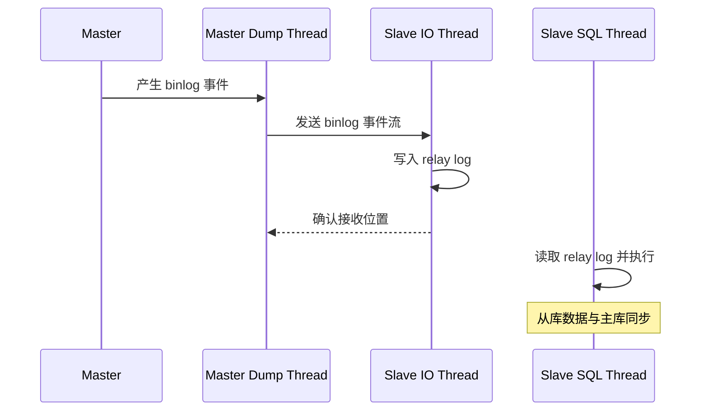
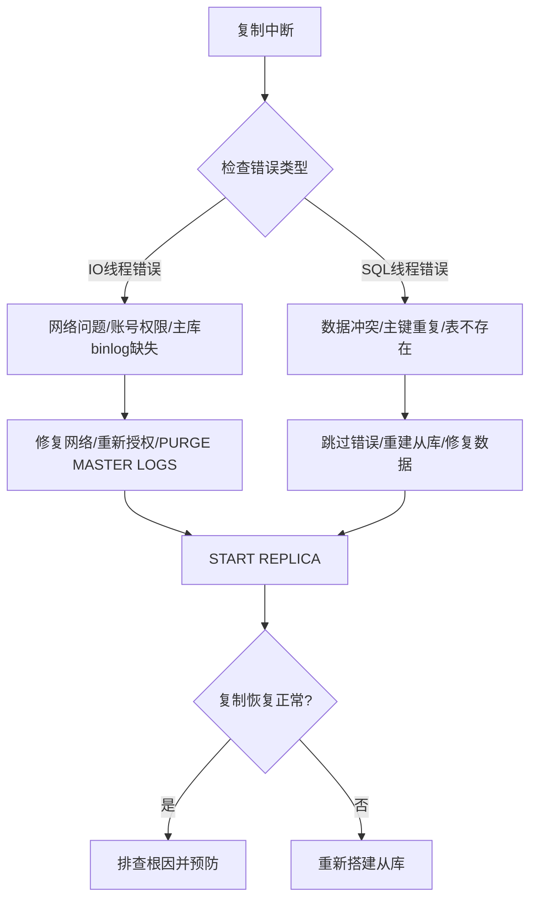

# 一主从复制：MySQL 数据复制的基石

## 1. 概述与背景

### 1.1 什么是主从复制

主从复制（Master-Slave Replication）是 MySQL 最基础也最核心的数据复制机制。它允许一个 MySQL 实例（Master，主库）将数据变更自动同步到一个或多个 MySQL 实例（Slave，从库）。这种架构是读写分离、高可用、容灾备份等高级特性的技术基石。

在实际生产环境中，单台数据库服务器面临的挑战包括：

- **读写瓶颈**：单机的 IOPS 和 QPS 存在物理上限，面对高并发读请求时容易成为系统瓶颈
- **单点故障**：一旦主库宕机，整个系统将无法提供服务
- **数据安全**：仅靠单机备份，RPO（恢复点目标）难以保证

主从复制通过"一写多读"的架构模式，将写操作集中在主库，读操作分散到从库，从根本上解决了上述问题。

### 1.2 主从复制的应用场景

| 场景 | 说明 | 典型配置 |
|------|------|----------|
| 读写分离 | 写主读从，分摊读压力 | 1主 + N从 + 中间件路由 |
| 高可用 | 主库故障时从库接管 | 主从 + 自动切换机制 |
| 数据备份 | 从库作为实时备份节点 | 异步复制 + 定期校验 |
| 离线分析 | 从库承担分析查询，不影响主库性能 | 独立从库 + 延迟复制 |
| 跨地域容灾 | 不同机房部署从库，实现异地容灾 | 半同步 + 跨机房专线 |

### 1.3 复制的三种模式

MySQL 主从复制按同步程度分为三种模式：

异步复制（Asynchronous）     半同步复制（Semi-Sync）      组复制（Group Replication）
┌─────┐    ┌─────┐         ┌─────┐    ┌─────┐          ┌─────┐  ┌─────┐  ┌─────┐
│Master│───>│Slave│         │Master│───>│Slave│          │ Node │<─>│ Node │<─>│ Node │
└─────┘    └─────┘         └─────┘    └─────┘          └─────┘  └─────┘  └─────┘
  不等待ACK   返回OK          等1个ACK返回OK           Paxos协议, 多数派写入
  丢数据风险低  性能最高          性能与安全平衡             强一致, 但性能最低

- **异步复制**：主库写入 binlog 后立即返回客户端，不等待从库确认。性能最高，但存在数据丢失风险
- **半同步复制**：主库等待至少一个从库确认已接收 binlog 后才返回客户端。在性能和数据安全之间取得平衡
- **组复制（MGR）**：基于 Paxos 协议实现多节点强一致写入，是 MySQL 8.0 推荐的高可用方案

## 2. 核心原理

### 2.1 复制架构总览

MySQL 主从复制由三个核心线程协作完成：



对应文件流转路径：

Master 侧:
  数据变更 → binlog（二进制日志） → Dump Thread 读取并发送

Slave 侧:
  IO Thread 接收 → relay log（中继日志） → SQL Thread 读取并重放 → 数据落地

### 2.2 三个核心线程详解

**1. Binlog Dump Thread（主库）**

当从库连接主库并请求 binlog 时，主库会为每个从库创建一个专门的 Dump 线程。该线程的职责是从 binlog 中读取事件并发送给从库。

关键特性：
- 每个从库对应一个独立的 Dump Thread
- 主库通过 binlog 文件名 + 偏移量（position）定位发送位置
- 使用 `SHOW SLAVE HOSTS` 可查看当前连接的从库信息

**2. IO Thread（从库）**

IO 线程负责与主库建立网络连接，接收 binlog 事件，并将其写入本地的 relay log 文件。

关键配置参数：
```ini
# relay log 文件名前缀
relay_log = relay-bin

# relay log 最大大小（字节），超过后自动轮转
relay_log_max_size = 104857600  # 100MB

# 从库读取 binlog 的网络缓冲区大小
slave_net_timeout = 60  # 超时时间（秒）
```

**3. SQL Thread（从库）**

SQL 线程读取 relay log 中的事件并在从库上重放，从而使从库的数据与主库保持一致。

演进历史：
- MySQL 5.6 之前：单线程重放，存在严重性能瓶颈
- MySQL 5.6：引入基于逻辑时钟的多线程复制（并行复制）
- MySQL 5.7：进一步优化为 `LOGICAL_CLOCK` 模式，支持组提交并行
- MySQL 8.0：默认使用 `WRITESET` 模式，冲突检测更精确，并行度更高

### 2.3 Binlog 日志格式

binlog 记录了所有数据变更操作，是复制的数据源。MySQL 支持三种 binlog 格式：

| 格式 | 记录内容 | 优点 | 缺点 |
|------|----------|------|------|
| STATEMENT | SQL 语句本身 | 日志量小，节省空间 | 非确定性函数（NOW()、RAND()）可能导致主从不一致 |
| ROW | 每行数据的变更前后的值 | 数据一致性高，不受函数影响 | 日志量大，大表 DDL 复制效率低 |
| MIXED | 自动选择 STATEMENT 或 ROW | 兼顾两者优点 | 仍存在边界情况 |

**生产建议**：绝大多数场景推荐使用 ROW 格式。设置方法：

```sql
-- 查看当前格式
SHOW VARIABLES LIKE 'binlog_format';

-- 设置为 ROW 格式（需写入 my.cnf 并重启）
[mysqld]
binlog_format = ROW

-- ROW 格式下的详细控制
binlog_row_image = FULL      -- 记录完整行（默认）
-- binlog_row_image = MINIMAL -- 仅记录变更列（减少日志量，但无法做逆向解析）
```

### 2.4 复制位置追踪

MySQL 通过两个关键指标追踪复制进度：

Master 侧:
  File: mysql-bin.000003    -- 当前 binlog 文件名
  Position: 12345           -- 当前写入位置（字节偏移量）

Slave 侧（IO Thread 记录）:
  Master_Log_File: mysql-bin.000003     -- 正在读取的 binlog 文件
  Read_Master_Log_Pos: 12345           -- 已读取的位置

Slave 侧（SQL Thread 记录）:
  Relay_Master_Log_File: mysql-bin.000003   -- 正在执行的 binlog 文件
  Exec_Master_Log_Pos: 12345               -- 已执行的位置

MySQL 5.6+ 引入了 GTID（Global Transaction Identifier）模式，用全局唯一事务 ID 替代了传统的 file + position 追踪方式，极大简化了故障切换和拓扑变更的管理。

## 3. GTID 复制详解

### 3.1 GTID 的概念

GTID 是 MySQL 5.6 引入的全局事务标识符，格式为：

server_uuid:transaction_id

例如: 3e11fa47-71ca-11e1-9e33-c80aa9429562:23

每个事务在集群中拥有全局唯一的 ID，无论在哪个节点执行，ID 都不变。这使得：

- 故障切换时无需手动指定 binlog 位置
- 从库可以自动定位需要追补的事务
- 拓扑变更（如将从库 A 变为另一个从库 B 的从库）无需复杂配置

### 3.2 GTID 的组成部分

GTID = source_id:transaction_id

source_id: 生成该事务的服务器的 UUID（全局唯一）
transaction_id: 该服务器上生成的事务序号（自增计数器）

示例: 3E11FA47-71CA-11E1-9E33-C80AA9429562:23
       └─── 服务器 UUID ───┘  └─ 第23个事务

### 3.3 GTID 模式的优势与限制

**优势：**
- 故障切换简单：从库自动从正确位置开始复制
- 拓扑变更透明：CHANGE MASTER TO 无需指定 binlog 位置
- 一致性校验方便：比对 GTID 集合即可判断同步状态
- 自动跳过已执行事务：防止重复执行

**限制（MySQL 8.0 之前）：**
- 不支持 CREATE TABLE ... SELECT 语句
- 不支持在事务中使用临时表
- 不支持sql_log_bin=0 的操作
- 不支持复制过滤规则（replicate-do-db 等）

## 4. 主从搭建实操指南

### 4.1 环境准备

```bash
# 假设环境
# Master: 192.168.1.100:3306
# Slave:  192.168.1.101:3306
# MySQL版本: 8.0.35
```

### 4.2 主库配置（my.cnf）

```ini
[mysqld]
# 服务器唯一ID（集群内不可重复）
server-id = 100

# 开启 binlog
log-bin = mysql-bin

# binlog 格式
binlog_format = ROW

# binlog 过期时间（天）
binlog_expire_logs_seconds = 604800  # 7天

# 开启 GTID 模式
gtid_mode = ON
enforce_gtid_consistency = ON

# binlog 缓存大小
binlog_cache_size = 4M

# 单个 binlog 文件最大大小
max_binlog_size = 256M
```

### 4.3 从库配置（my.cnf）

```ini
[mysqld]
# 服务器唯一ID
server-id = 101

# 开启 binlog（级联复制或故障切换时需要）
log-bin = mysql-bin

# 开启 GTID 模式
gtid_mode = ON
enforce_gtid_consistency = ON

# 只读模式（防止误写从库）
read_only = ON

# 开启中继日志
relay-log = relay-bin

# relay log 自动清理
relay_log_purge = ON
relay_log_recovery = ON

# 并行复制配置（MySQL 8.0 默认 WRITESET）
replica_parallel_workers = 8        # 并行复制线程数
replica_parallel_type = WRITESET    # 并行策略
replica_preserve_commit_order = ON  # 保持提交顺序
```

### 4.4 搭建步骤

**Step 1：主库创建复制账号**

```sql
-- 主库执行
CREATE USER 'repl_user'@'192.168.1.%' IDENTIFIED BY 'StrongP@ssw0rd!';
GRANT REPLICATION SLAVE, REPLICATION CLIENT ON *.* TO 'repl_user'@'192.168.1.%';
FLUSH PRIVILEGES;
```

**Step 2：主库导出初始数据（如果从库非空库）**

```bash
# 主库导出
mysqldump --all-databases --single-transaction --master-data=2 --gtid > /tmp/full_dump.sql

# 注意：--single-transaction 仅对 InnoDB 表有效
# 如果有 MyISAM 表，需要加 --lock-all-tables
```

**Step 3：从库导入数据**

```bash
# 如果是新实例，跳过此步
mysql < /tmp/full_dump.sql
```

**Step 4：从库配置复制源并启动**

```sql
-- GTID 模式（推荐）
CHANGE REPLICATION SOURCE TO
  SOURCE_HOST = '192.168.1.100',
  SOURCE_PORT = 3306,
  SOURCE_USER = 'repl_user',
  SOURCE_PASSWORD = 'StrongP@ssw0rd!',
  SOURCE_AUTO_POSITION = 1;

-- 启动复制
START REPLICA;
```

**Step 5：验证复制状态**

```sql
SHOW REPLICA STATUS\G

-- 重点关注以下字段：
-- Replica_IO_Running: Yes
-- Replica_SQL_Running: Yes
-- Seconds_Behind_Source: 0（或较小值）
-- Last_IO_Error: （空）
-- Last_SQL_Error: （空）
```

### 4.5 半同步复制配置

```sql
-- 主库安装并启用半同步插件
INSTALL PLUGIN rpl_semi_sync_source SONAME 'semisync_source.so';
SET GLOBAL rpl_semi_sync_source_enabled = ON;
SET GLOBAL rpl_semi_sync_source_timeout = 5000;  -- 5秒超时，超时后降级为异步

-- 从库安装并启用半同步插件
INSTALL PLUGIN rpl_semi_sync_replica SONAME 'semisync_replica.so';
SET GLOBAL rpl_semi_sync_replica_enabled = ON;

-- 重启从库的 IO 线程使其生效
STOP REPLICA IO_THREAD;
START REPLICA IO_THREAD;

-- 验证半同步状态
SHOW STATUS LIKE 'Rpl_semi_sync%';
```

## 5. 复制延迟：原因分析与优化

### 5.1 延迟的常见原因

复制延迟是主从架构中最常见的问题之一，其根因通常包括以下几类：

**原因一：大事务阻塞**

一个耗时数秒甚至数分钟的大事务（如大批量 UPDATE、DDL 操作）会导致从库 SQL 线程长时间占用，后续事务排队等待。

主库执行: BEGIN; UPDATE big_table SET status=1 WHERE ...; (影响500万行) COMMIT;
-- 主库: 执行3秒
-- 从库: 重放可能需要30秒甚至更久（取决于从库硬件）

**原因二：单线程复制瓶颈**

MySQL 5.6 之前的单线程复制无法利用多核 CPU，DDL 操作更是无法并行。

**原因三：从库硬件性能不足**

从库的磁盘 IOPS、CPU、内存等硬件性能弱于主库，导致重放速度跟不上。

**原因四：网络延迟**

主从之间网络延迟高或带宽不足，binlog 传输效率低。

**原因五：从库承担大量查询**

从库承载了过多的读请求，CPU 和 I/O 资源紧张，影响复制线程的执行速度。

### 5.2 监控与诊断

```sql
-- 1. 查看复制延迟（秒）
SHOW REPLICA STATUS\G
-- Seconds_Behind_Source: 15

-- 2. 查看正在执行的事务
SELECT * FROM information_schema.PROCESSLIST WHERE COMMAND = 'Query';

-- 3. 查看并行复制工作线程状态
SELECT * FROM performance_schema.replication_applier_status_by_worker;

-- 4. 分析 relay log 中待执行的事件数
SHOW REPLICA STATUS\G
-- 查看 Relay_Log_Space 字段（relay log 占用空间）
```

### 5.3 优化方案

| 优化方向 | 具体措施 | 适用场景 |
|----------|----------|----------|
| 并行复制 | 升级到 MySQL 5.7+，启用 LOGICAL_CLOCK 或 WRITESET | 通用 |
| 硬件升级 | 从库使用 SSD，增加内存和 CPU | 从库性能瓶颈 |
| 大事务拆分 | 将大批量操作拆分为小批次 | 大表变更 |
| 减少从库负载 | 建立从库专用的读从库，形成复制链 | 读压力大 |
| 网络优化 | 主从部署在同一机房/同一交换机 | 跨机房延迟 |
| 延迟从库 | 设置延迟执行，避免误操作级联影响 | 容灾场景 |

### 5.4 并行复制配置示例

```ini
# MySQL 8.0 推荐配置
[mysqld]
replica_parallel_workers = 8
replica_parallel_type = WRITESET
replica_preserve_commit_order = ON

# WRITESET 模式下，并行度取决于事务修改的行是否冲突
# 两个修改不同行的事务可以并行执行，大幅提升吞吐量

# 查看并行复制效果
SELECT WORKER_ID, LAST_APPLIED_TRANSACTION, 
       APPLYING_TRANSACTION, LAST_ERROR_MESSAGE
FROM performance_schema.replication_applier_status_by_worker;
```

## 6. 常见故障与处理

### 6.1 复制中断处理流程



### 6.2 典型故障场景

**场景一：从库 IO 线程断开**

Last_IO_Error: Got fatal error 1236 from source when reading data from binary log:
'Could not find first log file name in binary log index file'

原因：主库 PURGE BINARY LOGS 清理了从库尚未读取的 binlog。

处理：
```sql
-- 方案1：重新指向最新的 binlog 位置
STOP REPLICA;
CHANGE REPLICATION SOURCE TO 
  SOURCE_LOG_FILE='mysql-bin.000005', 
  SOURCE_LOG_POS=4;
START REPLICA;

-- 方案2：如果使用 GTID，可以直接重置
STOP REPLICA;
RESET REPLICA ALL;
CHANGE REPLICATION SOURCE TO
  SOURCE_HOST='192.168.1.100',
  SOURCE_USER='repl_user',
  SOURCE_PASSWORD='xxx',
  SOURCE_AUTO_POSITION=1;
START REPLICA;
```

**场景二：主键冲突**

Last_SQL_Error: Could not execute Write_rows event ... Duplicate entry '12345' for key 'PRIMARY'

处理：
```sql
-- 方案1：跳过错误（仅应急，不推荐长期使用）
STOP REPLICA;
SET GLOBAL sql_replica_skip_counter = 1;
START REPLICA;

-- 方案2：GTID 模式下跳过
STOP REPLICA;
SET GTID_NEXT='3e11fa47-71ca-11e1-9e33-c80aa9429562:23';
BEGIN; COMMIT;
SET GTID_NEXT='AUTOMATIC';
START REPLICA;

-- 方案3：删除重复数据后重建从库（推荐）
```

**场景三：表不存在**

Last_SQL_Error: Error executing row event: 'Table 'db.table' doesn't exist'

处理：从主库导出缺失的表结构并导入从库，然后重置复制位置。

### 6.3 预防措施

```sql
-- 1. 设置 binlog 保留时间足够长
SET GLOBAL binlog_expire_logs_seconds = 604800;  -- 7天

-- 2. 定期检查复制状态（建议每分钟监控）
-- 可通过 Prometheus + mysqld_exporter 监控 Seconds_Behind_Source

-- 3. 开启从库 relay log 自动恢复
-- my.cnf: relay_log_recovery = ON

-- 4. 为从库设置足够的 relay_log_purge 缓冲
-- my.cnf: relay_log_purge = ON
```

## 7. 关键指标与监控

| 指标 | 含义 | 健康阈值 | 告警阈值 | 优化方向 |
|------|------|----------|----------|----------|
| Seconds_Behind_Source | 从库延迟秒数 | < 1s | > 10s | 并行复制、硬件升级 |
| IO Thread 状态 | IO 线程是否运行 | Running | Not Running | 网络检查、账号检查 |
| SQL Thread 状态 | SQL 线程是否运行 | Running | Not Running | 大事务拆分、跳过错误 |
| Relay Log Space | relay log 占用空间 | < 1GB | > 5GB | 清理策略、增加磁盘 |
| Rpl_semi_sync_source_wait_sessions | 半同步等待从库数 | 0 | > 2 | 增加从库、超时设置 |
| Binlog 增长速率 | binlog 写入速度 | 稳定 | 突增 | 检查异常写入 |

## 8. 与其他复制方案的对比

| 特性 | MySQL 原生复制 | Galera Cluster | MySQL Group Replication | TiDB |
|------|---------------|----------------|------------------------|------|
| 一致性模型 | 异步/半同步 | 同步 | 多数派一致 | 分布式事务 |
| 写节点数 | 单主 | 多主 | 单主/多主 | 多主 |
| 故障切换 | 手动/脚本 | 自动 | 自动 | 自动 |
| 数据延迟 | 有（异步模式） | 无 | 极小 | 极小 |
| 网络开销 | 低 | 高（认证协议） | 中（Paxos） | 高 |
| 适用规模 | 中小规模 | 中等 | 中等 | 大规模 |
| 学习成本 | 低 | 中 | 中 | 高 |

## 9. 最佳实践总结

1. **优先使用 GTID 模式**：简化拓扑管理，故障切换更可靠
2. **使用 ROW 格式 binlog**：确保数据一致性，避免非确定性函数导致的主从不一致
3. **启用并行复制**：MySQL 8.0 推荐 WRITESET 模式，大幅提升从库重放速度
4. **监控复制延迟**：建立告警机制，延迟超过阈值时自动通知
5. **定期校验数据**：使用 pt-table-checksum 工具定期检查主从数据一致性
6. **binlog 保留时间充足**：至少保留 7 天，防止从库重连时找不到 binlog
7. **从库设置只读**：`read_only=ON` 防止应用误写从库
8. **备份策略**：在从库上执行备份，避免影响主库性能
