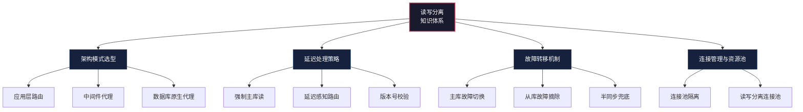
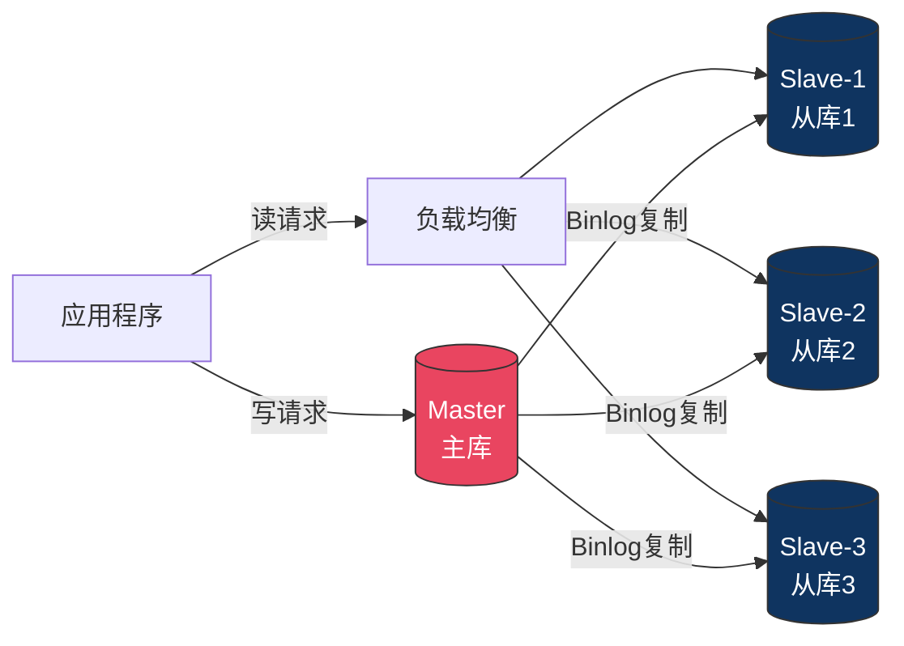
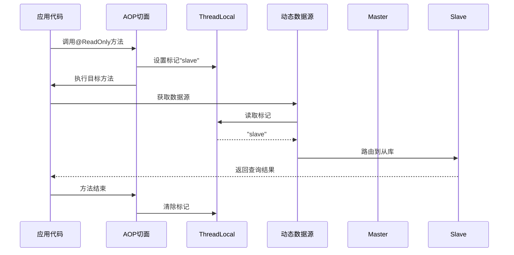
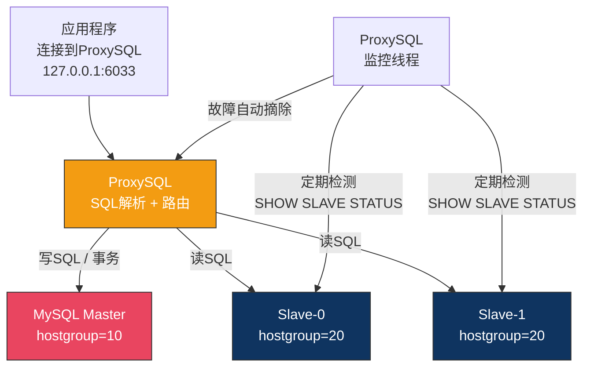
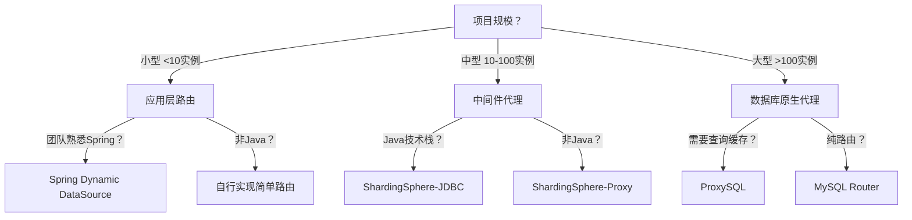
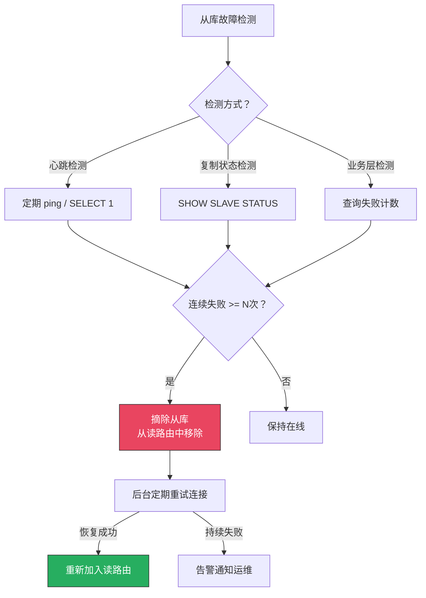
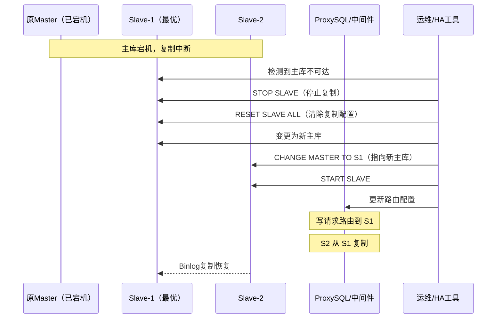

# 51.1.2 读写分离原理

读写分离是数据库水平扩展的第一步，也是大多数系统应对读吞吐瓶颈的首选方案。其核心思想极为简洁：**写操作走主库，读操作走从库**。但"简单的想法"和"可靠落地"之间隔着路由决策、延迟处理、故障转移、连接管理等一系列工程挑战。

本节从架构模式选型出发，深入分析每种方案的实现细节、优劣权衡和生产陷阱，帮助读者在真实项目中做出合理的技术决策。



***

## 一、读写分离的本质与边界

### 1.1 它解决什么问题

读写分离解决的是**读吞吐瓶颈**：当数据库的SELECT查询占总请求的70%以上，且QPS接近单机MySQL的承载上限时，通过增加从库来分流读流量，让主库专注于处理写请求。

**一个典型的读写分离拓扑：**



假设一个电商系统的读写比为 **8:2**（80%读、20%写），主库原本承受10000 QPS。引入3个从库后，理论上每个从库只需承受2000 QPS的读流量，主库只需处理2000 QPS的写流量，整体吞吐量提升至约4倍。

### 1.2 它不解决什么问题

读写分离**不能解决**以下问题：

| 问题 | 原因 | 正确方案 |
|------|------|---------|
| 写吞吐不够 | 读写分离不增加写入能力 | 分库分表（水平拆分） |
| 单表数据量过大 | B+树索引层级加深，查询变慢 | 分表或归档历史数据 |
| 跨表复杂查询 | 从库不改变查询复杂度 | 读写分离+缓存，或Elasticsearch |
| 数据一致性要求极高 | 从库存在复制延迟 | 强一致读写主库，或半同步复制 |

### 1.3 适用条件判断

在决定引入读写分离之前，先确认是否满足以下条件：

1. **读写比失衡**：读请求占比超过60%，且读QPS是主要瓶颈
2. **数据一致性可容忍延迟**：业务允许从库数据比主库慢几十到几百毫秒
3. **写入量可控**：主库单点写入能力仍能满足业务需求
4. **运维能力匹配**：团队具备MySQL主从复制的运维能力

如果写入量也是瓶颈，或数据一致性要求极高（如金融交易），读写分离不是正确选择。

***

## 二、三种架构模式详解

读写分离的实现方式分为三大类：应用层路由、中间件代理、数据库原生代理。每种方式在性能、可维护性、功能丰富度上有本质差异。

### 2.1 方式一：应用层路由

在应用代码中通过注解或AOP切面标记读写类型，然后通过动态数据源路由到对应的数据库实例。



**完整实现代码：**

```java
// 1. 自定义注解
@Target({ElementType.METHOD, ElementType.TYPE})
@Retention(RetentionPolicy.RUNTIME)
public @interface ReadOnly {
    // 是否强制走主库（某些场景需要强一致读）
    boolean forceMaster() default false;
}

// 2. 动态数据源上下文
public class DataSourceContextHolder {
    private static final ThreadLocal<String> CONTEXT = new ThreadLocal<>();
    private static final ThreadLocal<Boolean> FORCE_MASTER = new ThreadLocal<>();

    public static void setRead(boolean forceMaster) {
        CONTEXT.set("slave");
        FORCE_MASTER.set(forceMaster);
    }

    public static void setWrite() {
        CONTEXT.set("master");
        FORCE_MASTER.set(false);
    }

    public static String getDataSourceType() {
        String type = CONTEXT.get();
        if (Boolean.TRUE.equals(FORCE_MASTER.get())) {
            return "master";
        }
        return type != null ? type : "master"; // 默认走主库（安全策略）
    }

    public static void clear() {
        CONTEXT.remove();
        FORCE_MASTER.remove();
    }
}

// 3. 动态数据源路由
public class DynamicDataSource extends AbstractRoutingDataSource {
    @Override
    protected Object determineCurrentLookupKey() {
        return DataSourceContextHolder.getDataSourceType();
    }
}

// 4. AOP切面
@Aspect
@Component
public class DataSourceAspect {

    @Around("@annotation(readOnly)")
    public Object around(ProceedingJoinPoint jp, ReadOnly readOnly) throws Throwable {
        try {
            if (readOnly.forceMaster()) {
                DataSourceContextHolder.setRead(true);
            } else {
                DataSourceContextHolder.setRead(false);
            }
            return jp.proceed();
        } finally {
            DataSourceContextHolder.clear();
        }
    }

    @Around("@annotation(org.springframework.transaction.annotation.Transactional)")
    public Object aroundTransactional(ProceedingJoinPoint jp) throws Throwable {
        try {
            DataSourceContextHolder.setWrite();
            return jp.proceed();
        } finally {
            DataSourceContextHolder.clear();
        }
    }
}

// 5. 业务代码使用
@Service
public class OrderService {

    @Autowired
    private OrderMapper orderMapper;

    @ReadOnly
    public Order getOrder(Long orderId) {
        return orderMapper.selectById(orderId); // 走从库
    }

    @ReadOnly(forceMaster = true)
    public Order getOrderAfterCreate(Long orderId) {
        return orderMapper.selectById(orderId); // 强制走主库
    }

    @Transactional
    public Order createOrder(OrderRequest req) {
        Order order = buildOrder(req);
        orderMapper.insert(order);
        return order; // 事务内走主库
    }
}
```

**优点：**
- 完全可控：可以精确到每个方法设置路由策略
- 无额外网络跳转：应用直连数据库，延迟最低
- 灵活性高：可以实现复杂的路由逻辑（如按用户ID分流到不同从库）

**缺点：**
- 侵入性高：每个读方法都需要加注解，遗漏会导致读走主库
- 耦合业务代码：路由逻辑散布在业务代码中
- 技术栈绑定：只能在支持AOP的语言中使用（Java/Spring），不适用于Python/Go/Node.js项目
- 升级困难：中间件或路由策略变更需要修改所有应用代码并重新部署

**适用场景：** 小型项目（<10个服务实例）、团队对技术栈有强控制力、路由规则简单且稳定。

### 2.2 方式二：中间件代理

在应用和数据库之间插入一个代理层（如ShardingSphere-JDBC、MyCat），应用只需连接中间件，中间件自动解析SQL并完成读写路由。应用代码无需感知读写分离的存在。

**ShardingSphere-JDBC配置示例：**

```yaml
spring:
  shardingsphere:
    datasource:
      names: master,slave0,slave1
      master:
        type: com.zaxxer.hikari.HikariDataSource
        driver-class-name: com.mysql.cj.jdbc.Driver
        jdbc-url: jdbc:mysql://master-host:3306/orders?useSSL=false&amp;serverTimezone=UTC
        username: root
        password: xxx
        hikari:
          maximum-pool-size: 20
          minimum-idle: 5
      slave0:
        type: com.zaxxer.hikari.HikariDataSource
        driver-class-name: com.mysql.cj.jdbc.Driver
        jdbc-url: jdbc:mysql://slave0-host:3306/orders?useSSL=false&amp;serverTimezone=UTC
        username: readonly
        password: xxx
        hikari:
          maximum-pool-size: 30
          minimum-idle: 10
      slave1:
        type: com.zaxxer.hikari.HikariDataSource
        driver-class-name: com.mysql.cj.jdbc.Driver
        jdbc-url: jdbc:mysql://slave1-host:3306/orders?useSSL=false&amp;serverTimezone=UTC
        username: readonly
        password: xxx
        hikari:
          maximum-pool-size: 30
          minimum-idle: 10

    rules:
      readwrite-splitting:
        data-sources:
          orders:
            write-data-source-name: master
            read-data-source-names: slave0,slave1
            load-balancer-name: round-robin
        load-balancers:
          round-robin:
            type: ROUND_ROBIN
          random:
            type: RANDOM
          # 自定义负载均衡器（如基于权重或延迟）
          weighted:
            type: WEIGHT
            props:
              slave0: 5
              slave1: 3
```

```java
// 应用代码完全不需要感知读写分离
@Service
public class OrderService {

    @Autowired
    private OrderMapper orderMapper;

    // 自动路由到从库
    public List<Order> queryOrders(Long userId) {
        return orderMapper.selectByUserId(userId);
    }

    // 自动路由到主库（INSERT语句会被中间件识别为写操作）
    @Transactional
    public Order createOrder(OrderRequest req) {
        Order order = buildOrder(req);
        orderMapper.insert(order);
        return order;
    }
}
```

**ShardingSphere的SQL解析引擎**会自动识别SQL类型：
- `SELECT` → 路由到从库（除非在事务中，自动路由到主库）
- `INSERT/UPDATE/DELETE` → 路由到主库
- `SELECT ... FOR UPDATE` → 路由到主库（锁定读）
- 事务中的SQL → 全部路由到主库（保证事务内一致性）

**优点：**
- 对应用透明：业务代码无需任何修改
- 功能丰富：内置负载均衡、故障转移、延迟感知、SQL解析
- 多语言支持：所有能连MySQL的应用都能使用
- 集中管理：路由策略在配置中心统一管理，升级无需改业务代码

**缺点：**
- 增加一次网络跳转：应用 → 中间件 → 数据库，延迟增加约0.1-0.5ms
- 中间件本身的高可用：中间件挂了，所有应用都会受影响
- 学习成本：中间件的配置、调优、排错需要专门的知识
- SQL兼容性：复杂的SQL（如存储过程、自定义函数）可能不被中间件正确解析

**适用场景：** 中大型项目（10-100个服务实例）、团队希望业务代码与基础设施解耦、路由规则可能频繁调整。

### 2.3 方式三：数据库原生代理

使用ProxySQL、MySQL Router等数据库层面的代理工具。这些工具直接连接到数据库端口，对应用呈现为一个"虚拟MySQL服务器"。

**ProxySQL配置示例：**

```sql
-- 1. 添加后端MySQL服务器
INSERT INTO mysql_servers(hostgroup_id, hostname, port, weight, max_connections)
VALUES
    (10, 'master-host', 3306, 1000, 200),   -- 写组 hostgroup=10
    (20, 'slave0-host', 3306, 500, 300),    -- 读组 hostgroup=20
    (20, 'slave1-host', 3306, 500, 300);    -- 读组 hostgroup=20

-- 2. 配置读写分离规则
-- 所有SELECT查询路由到读组（hostgroup=20），除了SELECT ... FOR UPDATE
INSERT INTO mysql_query_rules(rule_id, active, match_pattern, destination_hostgroup)
VALUES
    (1, 1, '^SELECT .* FOR UPDATE$', 10),   -- 锁定读走主库
    (2, 1, '^SELECT', 20);                  -- 普通查询走从库

-- 3. 添加监控用户（用于检测从库延迟和存活状态）
SET mysql-monitor_username='monitor';
SET mysql-monitor_password='monitor_pass';

-- 4. 加载配置生效
LOAD MYSQL SERVERS TO RUNTIME;
LOAD MYSQL QUERY RULES TO RUNTIME;
SAVE MYSQL SERVERS TO DISK;
SAVE MYSQL QUERY RULES TO DISK;
```

**ProxySQL的工作原理：**



**优点：**
- 语言无关：任何能连接MySQL的客户端都能使用
- 内置健康检查：自动检测从库延迟和存活状态
- 连接池复用：ProxySQL维护到后端MySQL的连接池，减少连接开销
- 查询缓存：可以缓存热点查询结果，进一步减轻数据库压力
- 运行时热更新：配置变更不需要重启

**缺点：**
- 部署和运维复杂：需要额外部署ProxySQL实例并保证其高可用
- SQL兼容性有限：某些高级SQL特性可能无法正确路由
- 增加网络跳转：和中间件代理一样，多一层网络延迟
- 监控盲区：应用层看到的延迟包含了ProxySQL本身的开销

**适用场景：** 大型项目、对性能要求极高、团队有DBA专门运维、或使用非Java技术栈。

### 2.4 三种模式对比选型

| 维度 | 应用层路由 | 中间件代理 | 数据库原生代理 |
|------|-----------|-----------|---------------|
| **实现复杂度** | 低（代码级） | 中（配置级） | 中高（运维级） |
| **性能开销** | 最低（直连） | 中等（多一跳） | 中等（多一跳） |
| **延迟增加** | 0ms | 0.1-0.5ms | 0.1-1ms |
| **侵入性** | 高（需改业务代码） | 低（透明） | 低（透明） |
| **功能丰富度** | 低 | 高 | 高 |
| **多语言支持** | 否 | 是 | 是 |
| **故障影响面** | 单服务 | 全局 | 全局 |
| **适用规模** | <10实例 | 10-1000实例 | 100+实例 |
| **代表方案** | Spring Dynamic DataSource | ShardingSphere-JDBC | ProxySQL |

**选型决策树：**



***

## 三、延迟处理策略——读写分离最大的工程挑战

主从复制延迟是读写分离最核心的难题。当用户刚写入一条数据后立即读取，而读请求被路由到尚未同步完成的从库，就会出现**"读不到自己刚写的数据"**这种糟糕体验。

### 3.1 为什么延迟不可避免

| 延迟来源 | 机制 | 典型延迟 |
|---------|------|---------|
| 网络传输 | Binlog事件从主库传输到从库的网络往返 | 0.1-5ms（同机房），5-50ms（跨机房） |
| IO线程写入Relay Log | 从库IO线程将binlog事件写入本地relay log | 0.1-1ms |
| SQL线程重放 | 从库SQL线程在本地执行变更 | 取决于事务大小，可能从毫秒到分钟 |
| 大事务阻塞 | 单个大事务（如批量更新10万行）在从库重放时阻塞后续事务 | 数秒到数分钟 |
| 锁竞争 | 从库上的DML操作与SQL线程重放操作产生行锁竞争 | 间歇性延迟尖刺 |

**关键事实：** 即使从库硬件与主库完全一致，异步复制模式下延迟也永远不可能为零——至少有一个网络RTT的最小延迟。在生产环境中，同机房的延迟通常在1-10ms，跨机房可能达到几十毫秒。

### 3.2 策略一：强制主库读（读主库注解）

对于需要强一致性的场景，在代码中显式标记读操作走主库。

```java
/**
 * 强制走主库的场景：
 * 1. 写后读（创建订单后立即查询）
 * 2. 支付回调后的状态确认
 * 3. 用户注册后立即登录
 */
@ReadOnly(forceMaster = true)
public Order getOrderAfterCreate(Long orderId) {
    return orderMapper.selectById(orderId);
}

@ReadOnly(forceMaster = true)
public PaymentStatus checkPaymentStatus(String paymentNo) {
    return paymentMapper.selectByPaymentNo(paymentNo);
}
```

**优点：** 实现简单，强一致保证。

**缺点：** 大量读操作强制走主库会削弱读写分离的效果，甚至导致主库压力回到分离前的水平。**只能作为小比例的补充策略，不能作为主要延迟处理方案。**

### 3.3 策略二：延迟感知路由

实时监控每个从库的复制延迟，当延迟超过阈值时，自动将读请求路由到主库或延迟最低的从库。

```python
import time
import threading
import logging
from collections import defaultdict
from dataclasses import dataclass
from typing import List, Optional

logger = logging.getLogger(__name__)


@dataclass
class SlaveNode:
    """从库节点"""
    node_id: str
    host: str
    port: int
    weight: int = 1  # 负载均衡权重


class SmartReadRouter:
    """
    基于复制延迟的智能读路由

    核心逻辑：
    1. 后台线程定期采集所有从库的 Seconds_Behind_Master
    2. 读请求到达时，筛选延迟在阈值内的从库
    3. 从合格从库中按权重选择（或选延迟最低的）
    4. 如果所有从库都延迟过高，降级到主库
    """

    def __init__(self, master_conn, slaves: List[SlaveNode],
                 max_delay_ms: int = 200, poll_interval_s: float = 1.0):
        self.master = master_conn
        self.slaves = slaves
        self.max_delay_ms = max_delay_ms
        self.poll_interval_s = poll_interval_s
        self.delays = {}  # node_id -> delay_ms
        self.health = {}  # node_id -> bool
        self._lock = threading.Lock()
        self._start_monitor()

    def _start_monitor(self):
        """后台线程定期采集从库延迟"""
        def poll():
            while True:
                for slave in self.slaves:
                    try:
                        conn = self._get_connection(slave)
                        result = conn.execute("SHOW SLAVE STATUS")
                        seconds = result.get("Seconds_Behind_Master")
                        io_running = result.get("Slave_IO_Running") == "Yes"
                        sql_running = result.get("Slave_SQL_Running") == "Yes"

                        with self._lock:
                            if io_running and sql_running:
                                self.delays[slave.node_id] = (seconds or 0) * 1000
                                self.health[slave.node_id] = True
                            else:
                                self.delays[slave.node_id] = float("inf")
                                self.health[slave.node_id] = False
                                logger.warning(
                                    f"从库 {slave.host} 复制异常: "
                                    f"IO={io_running}, SQL={sql_running}"
                                )
                    except Exception as e:
                        with self._lock:
                            self.delays[slave.node_id] = float("inf")
                            self.health[slave.node_id] = False
                        logger.error(f"无法连接从库 {slave.host}: {e}")

                time.sleep(self.poll_interval_s)

        t = threading.Thread(target=poll, daemon=True, name="delay-monitor")
        t.start()

    def route(self, sql: str, force_master: bool = False):
        """
        路由读请求

        Args:
            sql: 要执行的SQL
            force_master: 是否强制走主库

        Returns:
            查询结果
        """
        if force_master:
            return self.master.execute(sql)

        with self._lock:
            delays = dict(self.delays)
            health = dict(self.health)

        # 筛选延迟在阈值内且健康的从库
        healthy_slaves = [
            s for s in self.slaves
            if health.get(s.node_id, False)
            and delays.get(s.node_id, float("inf")) <= self.max_delay_ms
        ]

        if not healthy_slaves:
            # 所有从库不可用或延迟过高，降级到主库
            logger.warning(
                f"无可用从库（延迟：{delays}），降级到主库读取"
            )
            return self.master.execute(sql)

        # 按延迟加权选择（延迟越低，被选中概率越高）
        selected = self._weighted_select(healthy_slaves, delays)
        return selected.execute(sql)

    def _weighted_select(self, slaves: List[SlaveNode], delays: dict) -> SlaveNode:
        """延迟加权随机选择：延迟越低权重越高"""
        import random
        total_weight = sum(
            s.weight / (1 + delays.get(s.node_id, 0) / 100)
            for s in slaves
        )
        r = random.uniform(0, total_weight)
        cumulative = 0
        for s in slaves:
            cumulative += s.weight / (1 + delays.get(s.node_id, 0) / 100)
            if r <= cumulative:
                return s
        return slaves[-1]

    def get_status(self) -> dict:
        """获取当前路由状态（用于监控）"""
        with self._lock:
            return {
                slave.node_id: {
                    "host": slave.host,
                    "delay_ms": self.delays.get(slave.node_id, -1),
                    "healthy": self.health.get(slave.node_id, False),
                    "available": (
                        self.health.get(slave.node_id, False)
                        and self.delays.get(slave.node_id, float("inf"))
                        <= self.max_delay_ms
                    )
                }
                for slave in self.slaves
            }
```

**阈值设置的权衡：**

| 阈值 | 效果 | 风险 |
|------|------|------|
| 50ms | 极高一致性，大部分读走主库 | 读写分离效果大打折扣 |
| 200ms | 平衡一致性与读分离效果 | 极端情况下可能读到稍旧的数据 |
| 1000ms | 最大化读分离效果 | 用户可能感知到明显的延迟 |
| 无限大 | 所有读都走从库 | 可能读到严重过时的数据 |

**生产建议：** 一般设置为 200-500ms。对于金融类场景可以设为 50ms。监控从库延迟的P99值，设置为P99的2-3倍作为阈值。

### 3.4 策略三：版本号/时间戳校验

写入时记录一个逻辑版本号（如数据库更新时间戳或自增版本号），读取时对比从库数据的版本号是否满足要求。

**典型应用场景——写后读一致性：**

```java
@Service
public class OrderService {

    @Autowired
    private OrderMapper orderMapper;

    /**
     * 创建订单后立即查询：前端携带写入时间戳，后端校验从库是否已同步
     */
    @Transactional
    public CreateOrderResult createOrder(OrderRequest req) {
        Order order = buildOrder(req);
        orderMapper.insert(order);

        // 返回写入时间戳给前端
        return new CreateOrderResult(
            order.getId(),
            order.getGmtModified()  // 前端跳转订单详情页时携带此时间戳
        );
    }

    /**
     * 带时间戳校验的查询
     * 前端URL: /order/detail?id=123&amp;since=1719398400000
     */
    @ReadOnly
    public Order getOrderWithTimestampCheck(Long orderId, Long sinceTimestamp) {
        // 第一次：尝试从从库读取
        Order order = orderMapper.selectById(orderId);

        if (order != null &amp;&amp; sinceTimestamp != null
            &amp;&amp; order.getGmtModified().getTime() >= sinceTimestamp) {
            // 从库数据已同步，直接返回
            return order;
        }

        // 从库数据未同步，强制走主库
        logger.info(
            f"订单 {orderId} 从库未同步（期望>={sinceTimestamp}，"
            + f"实际={order.getGmtModified().getTime()}），切换到主库"
        );
        DataSourceContextHolder.setRead(true);
        try {
            return orderMapper.selectById(orderId);
        } finally {
            DataSourceContextHolder.clear();
        }
    }
}
```

**前端配合：**

```javascript
// 创建订单成功后，携带时间戳跳转
const result = await orderApi.createOrder(orderData);
router.push({
  path: `/order/detail/${result.id}`,
  query: { since: result.timestamp }
});

// 订单详情页：检查URL参数
const { id } = route.params;
const { since } = route.query;
const order = await orderApi.getOrder(id, since);
```

**优点：** 精确控制一致性级别，只在真正需要时才走主库，不影响其他读操作的分离效果。

**缺点：** 需要前端配合、需要数据库有精确的时间戳字段、实现复杂度较高。

### 3.5 策略四：中间件内置延迟路由

以ShardingSphere为例，它内置了延迟感知路由能力，无需在代码中手动处理：

```yaml
spring:
  shardingsphere:
    rules:
      readwrite-splitting:
        data-sources:
          orders:
            write-data-source-name: master
            read-data-source-names: slave0,slave1
            load-balancer-name: delayed-random
        load-balancers:
          delayed-random:
            type: CUSTOM
            props:
              # 当从库延迟超过此阈值时，自动降级到主库
              # 需要配置监控数据源来获取延迟信息
              write-data-source-name: master
```

**更常见的做法是配合ProxySQL的延迟监控：**

```sql
-- ProxySQL根据从库延迟自动调整权重
-- 当延迟超过阈值时，将该从库的权重设为0
UPDATE mysql_servers SET weight=0
WHERE hostgroup_id=20 AND hostname='slave1-host'
AND (SELECT MAX(Seconds_Behind_Master) FROM replica_status WHERE hostname='slave1-host') > 500;

LOAD MYSQL SERVERS TO RUNTIME;
```

***

## 四、故障转移——保证高可用

### 4.1 从库故障处理

从库故障是最常见的故障场景。一个健壮的读写分离系统必须能够自动检测并摘除故障从库。



**故障检测的关键参数：**

| 参数 | 推荐值 | 说明 |
|------|-------|------|
| 心跳间隔 | 3-5秒 | 太频繁增加负载，太慢检测不及时 |
| 失败阈值 | 3次 | 连续3次心跳失败才摘除，避免网络抖动误判 |
| 恢复检测间隔 | 30秒 | 从库恢复后多久重新加入 |
| 最小在线从库数 | 1个 | 保证至少有一个从库在线（否则降级到主库） |

### 4.2 主库故障处理

主库故障时，需要将一个从库提升为新的主库（Failover）。这个过程在生产环境中必须自动化。

**主库故障切换流程：**



**使用Orchestrator自动故障切换（推荐方案）：**

Orchestrator是Percona开发的MySQL高可用管理工具，支持自动检测主库故障并执行Failover。

```bash
# Orchestrator配置关键参数
# orchestrator.conf.json
{
    "RecoverMasterClusterFilters": ["*"],
    "RecoverIntermediateMasterClusterFilters": ["*"],
    "OnFailureDetectionProcesses": [
        "echo '{failureType}' on '{failedHost}' >> /var/log/orchestrator-detection.log"
    ],
    "PreFailoverProcesses": [],
    "PostFailoverProcesses": [
        "bash /scripts/update-proxySQL.sh {successorHost}"
    ],
    "PostUnsuccessfulFailoverProcesses": [
        "bash /scripts/alert-ops.sh"
    ]
}
```

### 4.3 多从库负载均衡

当有多个从库时，需要选择将读请求发送到哪个从库。常见的负载均衡策略：

| 策略 | 算法 | 优点 | 缺点 |
|------|------|------|------|
| 轮询（Round Robin） | 依次分发 | 简单，负载均匀 | 不考虑从库差异 |
| 加权轮询 | 按权重分发 | 适应不同硬件配置 | 权重需要手动设置 |
| 最少连接 | 分发到连接数最少的从库 | 适应实时负载变化 | 需要获取连接数信息 |
| 延迟感知 | 分发到延迟最低的从库 | 数据最新鲜 | 需要实时监控延迟 |
| 一致性Hash | 按请求特征路由到固定从库 | 缓存友好 | 负载可能不均 |

**生产推荐：** 默认使用轮询或加权轮询。如果从库硬件配置一致，轮询足够。如果从库配置不同（如一台16核32G，一台8核16G），使用加权轮询。

***

## 五、连接管理与资源优化

### 5.1 连接池隔离

读写分离后，主库和从库的连接池应该独立管理，避免读请求占满主库连接池。

```yaml
# Spring Boot 多数据源连接池配置
spring:
  datasource:
    master:
      hikari:
        pool-name: MasterPool
        maximum-pool-size: 20      # 主库连接数（写入为主，不需要太多）
        minimum-idle: 5
        connection-timeout: 3000   # 3秒获取连接超时
        idle-timeout: 300000       # 5分钟空闲回收
        max-lifetime: 600000       # 10分钟最大生命周期
    slave:
      hikari:
        pool-name: SlavePool
        maximum-pool-size: 50      # 从库连接数（读取为主，需要更多）
        minimum-idle: 10
        connection-timeout: 3000
        idle-timeout: 300000
        max-lifetime: 600000
```

**关键原则：** 从库的连接池通常应该大于主库，因为读请求量更大。但也要避免过多连接导致从库的CPU和内存压力。

### 5.2 连接数参考值

| 场景 | 主库连接数 | 从库连接数（每台） | 说明 |
|------|-----------|------------------|------|
| 小型应用（<1K QPS） | 20-30 | 30-50 | 读写比约7:3 |
| 中型应用（1K-10K QPS） | 50-100 | 100-200 | 需要连接池精细调优 |
| 大型应用（>10K QPS） | 100-200 | 200-500 | 考虑中间件连接池复用 |

**MySQL服务端连接数限制：** 默认 `max_connections=151`，生产环境通常设置为1000-5000。但不要无限制增加——每个连接占用约8-10MB内存，5000个连接就需要40-50GB内存。

***

## 六、生产环境常见陷阱

### 陷阱一：事务中混用主从

```java
// 错误示例：在同一个方法中先读从库，后写主库，可能导致数据不一致
@Transactional
public void transferMoney(Long fromId, Long toId, BigDecimal amount) {
    // 这一步可能读到从库的旧数据
    Account from = accountMapper.selectById(fromId); // 走从库
    Account to = accountMapper.selectById(toId);     // 走从库

    // 发现余额不足
    if (from.getBalance().compareTo(amount) < 0) {
        throw new InsufficientBalanceException();
    }

    // 执行扣款（走主库）
    accountMapper.decreaseBalance(fromId, amount);
    accountMapper.increaseBalance(toId, amount);
}
```

**问题：** 从库可能还没同步到最新数据（比如用户刚在另一个终端充值了），导致误判余额不足。Spring的`@Transactional`会将事务内所有操作路由到主库，但上面的代码中读操作发生在事务开启之前。

**修复：** 确保涉及事务一致性的读操作也在同一个事务内（即在同一`@Transactional`方法中），这样中间件会自动将所有操作路由到主库。

### 陷阱二：忽略了 `SELECT ... FOR UPDATE`

```java
// 危险：以为SELECT是读操作会走从库
// 但 SELECT ... FOR UPDATE 是锁定读，应该走主库
public void lockAndProcess(Long orderId) {
    // 如果走从库，锁定的是从库的行，对主库无影响
    Order order = orderMapper.selectForUpdate(orderId);  // 必须走主库！
    order.setStatus("PROCESSING");
    orderMapper.updateById(order);
}
```

**解决：** 确保中间件或路由逻辑正确识别 `SELECT ... FOR UPDATE` 为写操作。ShardingSphere默认会将锁定读路由到主库，但应用层路由需要手动标记。

### 陷阱三：从库权限配置不当

```sql
-- 错误：从库使用root账号，拥有写权限
-- 如果路由错误，可能在从库上执行了写操作，破坏主从复制

-- 正确：从库只使用只读账号
CREATE USER 'readonly'@'%' IDENTIFIED BY 'xxx';
GRANT SELECT ON orders_db.* TO 'readonly'@'%';
-- 不授予 INSERT/UPDATE/DELETE/CREATE/DROP 等权限
```

### 陷阱四：监控缺失

没有监控的读写分离系统就像没有仪表盘的飞机。必须监控以下指标：

| 监控指标 | 采集方式 | 告警阈值 |
|---------|---------|---------|
| 主从延迟（Seconds_Behind_Master） | SHOW SLAVE STATUS | > 5秒 |
| 从库IO线程状态 | SHOW SLAVE STATUS | Slave_IO_Running != Yes |
| 从库SQL线程状态 | SHOW SLAVE STATUS | Slave_SQL_Running != Yes |
| 读请求路由分布 | 中间件统计 | 某从库承担 >50%读流量 |
| 从库连接数 | SHOW STATUS | > 80% max_connections |
| 从库QPS | SHOW STATUS | 接近从库承载上限 |

***

## 七、完整实战：从零搭建读写分离

### 7.1 环境准备

拓扑结构：
├── Master: 192.168.1.100:3306 (MySQL 8.0)
├── Slave-1: 192.168.1.101:3306 (MySQL 8.0)
├── Slave-2: 192.168.1.102:3306 (MySQL 8.0)
└── ProxySQL: 192.168.1.10:6033 (管理端口6032)

### 7.2 Step 1：配置主从复制

```sql
-- === 主库配置（my.cnf）===
[mysqld]
server-id=1
log-bin=mysql-bin
binlog-format=ROW
gtid-mode=ON
enforce-gtid-consistency=ON
sync_binlog=1           -- 每次提交刷盘binlog（安全性优先）
innodb_flush_log_at_trx_commit=1  -- 每次提交刷redo log

-- 创建复制账号
CREATE USER 'repl_user'@'192.168.1.%' IDENTIFIED BY 'repl_password';
GRANT REPLICATION SLAVE ON *.* TO 'repl_user'@'192.168.1.%';

-- === 从库配置（my.cnf）===
[mysqld]
server-id=2              -- 每个从库的server-id必须唯一
relay-log=relay-bin
read-only=ON             -- 从库设为只读，防止误写
super-read-only=ON       -- 即使SUPER权限用户也不能写
gtid-mode=ON
enforce-gtid-consistency=ON
slave-parallel-workers=4
slave-parallel-type=LOGICAL_CLOCK

-- === 在从库上建立主从关系 ===
CHANGE MASTER TO
    MASTER_HOST='192.168.1.100',
    MASTER_USER='repl_user',
    MASTER_PASSWORD='repl_password',
    MASTER_AUTO_POSITION=1;

START SLAVE;

-- 验证复制状态
SHOW SLAVE STATUS\G
-- 确认：Slave_IO_Running=Yes, Slave_SQL_Running=Yes
```

### 7.3 Step 2：配置ProxySQL

```sql
-- 连接ProxySQL管理端口
mysql -u admin -padmin -h 127.0.0.1 -P 6032

-- 添加后端MySQL
INSERT INTO mysql_servers(hostgroup_id, hostname, port, weight, max_connections, comment)
VALUES
    (10, '192.168.1.100', 3306, 1000, 200, 'Master'),
    (20, '192.168.1.101', 3306, 500, 300, 'Slave-1'),
    (20, '192.168.1.102', 3306, 500, 300, 'Slave-2');

-- 配置查询规则
INSERT INTO mysql_query_rules(rule_id, active, match_pattern, destination_hostgroup, apply)
VALUES
    (1, 1, '^SELECT .* FOR UPDATE$', 10, 1),
    (2, 1, '^SELECT', 20, 1);

-- 配置监控用户
UPDATE global_variables SET variable_value='monitor'
WHERE variable_name='mysql-monitor_username';
UPDATE global_variables SET variable_value='monitor_pass'
WHERE variable_name='mysql-monitor_password';

-- 配置监控频率（毫秒）
UPDATE global_variables SET variable_value='2000'
WHERE variable_name='mysql-monitor_ping_interval';
UPDATE global_variables SET variable_value='5000'
WHERE variable_name='mysql-monitor_read_only_interval';

-- 生效并持久化
LOAD MYSQL SERVERS TO RUNTIME;
LOAD MYSQL QUERY RULES TO RUNTIME;
LOAD MYSQL VARIABLES TO RUNTIME;
SAVE MYSQL SERVERS TO DISK;
SAVE MYSQL QUERY RULES TO DISK;
SAVE MYSQL VARIABLES TO DISK;
```

### 7.4 Step 3：验证

```bash
# 应用连接到ProxySQL（端口6033），而非直连MySQL
mysql -u app_user -p -h 192.168.1.10 -P 6033

# 验证读写分离
-- 写操作 → 走主库
INSERT INTO orders(user_id, amount) VALUES(1, 100);

-- 读操作 → 走从库（在ProxySQL管理端口查看路由日志）
SELECT * FROM orders WHERE user_id = 1;

-- 锁定读 → 走主库
SELECT * FROM orders WHERE user_id = 1 FOR UPDATE;
```

***

## 八、性能对比数据

以一个典型的电商读写场景为基准（MySQL 8.0，16核32G，SSD，读写比8:2）：

| 架构 | 读QPS | 写QPS | 读P99延迟 | 写P99延迟 | 资源成本 |
|------|-------|-------|----------|----------|---------|
| 单库 | 8,000 | 2,000 | 15ms | 12ms | 1台服务器 |
| 1主1从 | 15,000 | 2,000 | 16ms | 12ms | 2台服务器 |
| 1主3从 | 30,000 | 2,000 | 17ms | 12ms | 4台服务器 |
| 1主3从+缓存 | 50,000 | 2,000 | 3ms | 12ms | 4台+Redis |

**关键发现：**
- 读写分离对读吞吐的提升几乎是线性的（每增加一个从库，读容量接近翻倍）
- 写吞吐没有提升——这是读写分离的本质限制
- 从库数量超过4-5个后，主库的binlog分发成为瓶颈
- 配合缓存（Redis）可以进一步将读延迟降低一个数量级

***

## 本节小结

读写分离是数据库扩展的第一步，核心思想简洁——写走主、读走从——但落地涉及大量工程细节：

1. **架构模式选型**：小型项目用应用层路由，中大型项目用中间件或数据库原生代理
2. **延迟处理**：强制主库读、延迟感知路由、版本号校验，三者组合使用
3. **故障转移**：自动检测从库故障并摘除，主库故障时自动Failover
4. **连接管理**：主从独立连接池，从库连接数通常大于主库
5. **监控告警**：延迟、复制状态、连接数、路由分布，缺一不可

读写分离解决的是读吞吐问题。当写吞吐或存储容量也成为瓶颈时，就需要进入下一个阶段——**分库分表**。
