# 51.1.3 分库分表策略

当单库单表的架构撑不住持续增长的数据量和并发量时，分库分表是从根本上突破单机瓶颈的核心手段。但分库分表绝非"把大表拆成小表"这么简单——分片策略选错了会导致数据倾斜，分片键选错了会导致跨分片查询泛滥，迁移做不好就是线上事故，事务处理不到位会出现数据不一致。每一个环节都需要系统性的思考和工程化的方案。

本节从分库分表的全景知识体系出发，逐层剖析核心概念、选型决策、实施方案和运维保障，帮助读者建立完整的分库分表知识框架。

```mermaid
graph TD
    A["分库分表<br/>知识体系"] --> B["拆分维度"]
    A --> C["分片策略"]
    A --> D["分片键与分片数"]
    A --> E["数据迁移"]
    A --> F["分布式事务"]
    A --> G["跨分片查询"]
    A --> H["监控运维"]

    B --> B1["垂直分库"]
    B --> B2["垂直分表"]
    B --> B3["水平分库"]
    B --> B4["水平分表"]

    C --> C1["范围分片"]
    C --> C2["哈希分片"]
    C --> C3["一致性哈希"]
    C --> C4["复合分片"]

    D --> D1["分片键选择原则"]
    D --> D2["基因法"]
    D --> D3["分片数规划"]

    E --> E1["全量+增量迁移"]
    E --> E2["双写过渡"]
    E --> E3["回滚方案"]

    F --> F1["本地消息表"]
    F --> F2["Saga模式"]
    F --> F3["Seata AT"]

    G --> G1["绑定表"]
    G --> G2["全局表"]
    G --> G3["冗余索引"]
    G --> G4["归并查询"]

    H --> H1["数据倾斜检测"]
    H --> H2["负载均衡"]
    H --> H3["报警策略"]

    style A fill:#1a1a2e,stroke:#e94560,stroke-width:2px,color:#fff
    style B fill:#16213e,stroke:#0f3460,color:#fff
    style C fill:#16213e,stroke:#0f3460,color:#fff
    style D fill:#16213e,stroke:#0f3460,color:#fff
    style E fill:#16213e,stroke:#0f3460,color:#fff
    style F fill:#16213e,stroke:#0f3460,color:#fff
    style G fill:#16213e,stroke:#0f3460,color:#fff
    style H fill:#16213e,stroke:#0f3460,color:#fff
```

***

## 一、拆分维度全景：垂直拆分与水平拆分

分库分表的"分"字包含两个正交维度：**垂直拆分**（按业务或字段拆分）和**水平拆分**（按数据行拆分）。理解这两个维度的区别与组合，是设计分库分表方案的第一步。

### 1.1 四种拆分方式

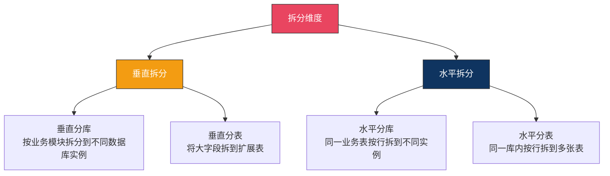

| 拆分方式 | 拆分对象 | 拆分依据 | 核心目标 | 典型场景 |
|---------|---------|---------|---------|---------|
| 垂直分库 | 整个数据库实例 | 业务模块边界 | 业务资源隔离、降低耦合 | 电商拆分为用户库、订单库、商品库、支付库 |
| 垂直分表 | 单张表的列 | 字段访问频率和大小 | 减少IO、提升缓存效率 | user表拆为user_base + user_detail（TEXT字段） |
| 水平分库 | 同一张表的行 | 分片键（user_id等） | 突破单库写入和存储瓶颈 | 订单表按user_id拆到db_0~db_7 |
| 水平分表 | 同一张表的行 | 分片键（order_id等） | 突破单表查询性能瓶颈 | 订单表按order_id拆为order_00~order_15 |

### 1.2 垂直分库详解

垂直分库是按业务模块将不同的表拆分到不同的数据库实例中。每个库独立运行，拥有独立的连接池、CPU、内存和磁盘IO。

**典型电商垂直分库架构：**

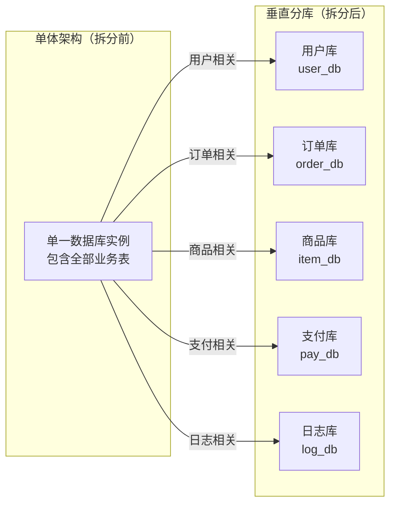

```sql
-- 垂直分库后的表结构示例
-- user_db: 用户核心信息
CREATE TABLE user_base (
    user_id     BIGINT PRIMARY KEY,
    username    VARCHAR(64) NOT NULL,
    password    VARCHAR(128) NOT NULL,
    phone       VARCHAR(20),
    status      TINYINT DEFAULT 1,
    created_at  DATETIME DEFAULT CURRENT_TIMESTAMP
);

-- user_db: 用户扩展信息（低频访问的大字段）
CREATE TABLE user_profile (
    user_id     BIGINT PRIMARY KEY,
    avatar_url  VARCHAR(512),
    bio         TEXT,
    preferences JSON,
    FOREIGN KEY (user_id) REFERENCES user_base(user_id)
);

-- order_db: 订单主表
CREATE TABLE order_main (
    order_id    BIGINT PRIMARY KEY,
    user_id     BIGINT NOT NULL,
    total_amount DECIMAL(12,2),
    status      TINYINT,
    created_at  DATETIME DEFAULT CURRENT_TIMESTAMP,
    INDEX idx_user_id (user_id)
);

-- order_db: 订单明细
CREATE TABLE order_item (
    item_id     BIGINT PRIMARY KEY,
    order_id    BIGINT NOT NULL,
    sku_id      BIGINT NOT NULL,
    quantity    INT,
    price       DECIMAL(10,2)
);
```

**垂直分库的核心收益：**

| 收益 | 说明 |
|------|------|
| 资源隔离 | 高峰期订单库压力大时，不会影响用户库的登录服务 |
| 故障隔离 | 支付库宕机不会拖垮商品库和用户库 |
| 独立扩缩容 | 订单库需要3台机器，用户库只需1台，按需分配 |
| 降低耦合 | 不同团队维护不同库，减少跨团队冲突 |

**垂直分库的典型陷阱：**

| 陷阱 | 说明 | 解决方案 |
|------|------|---------|
| 跨库JOIN | 用户表和订单表分在不同库，无法直接JOIN | 应用层两次查询组装，或冗余关键字段到订单表 |
| 跨库事务 | 一个操作同时涉及用户库和订单库 | 分布式事务（Seata）或最终一致性方案 |
| 分布式ID | 每个库各自自增ID会冲突 | 全局唯一ID方案（Snowflake、号段模式） |
| 跨库排序分页 | "所有用户的最新订单"需要跨库查询 | 异构索引或搜索引擎（ES） |

### 1.3 垂直分表详解

垂直分表针对的是单张表字段过多、行数据过大的问题。当一张表有50个字段，但90%的查询只需要其中10个字段时，把其余字段拆到扩展表中，可以显著减少IO和提升缓存命中率。

**垂直分表原则：**

- 冷热分离：高频访问字段留在主表，低频字段拆到扩展表
- 大小分离：TEXT、BLOB等大字段拆到扩展表
- 独立性原则：拆出的字段之间不互相依赖

```sql
-- 原始大表：60+字段，单行超过2KB
CREATE TABLE product_full (
    id          BIGINT PRIMARY KEY,
    name        VARCHAR(200),
    category_id INT,
    price       DECIMAL(10,2),
    stock       INT,
    description TEXT,        -- 平均2KB，很少在列表中展示
    spec_json   JSON,        -- 平均5KB，只在详情页展示
    images      TEXT,        -- 平均1KB，只在详情页展示
    search_tags VARCHAR(500),
    created_at  DATETIME,
    updated_at  DATETIME,
    -- ... 还有30+个字段
);

-- 拆分后：主表 + 扩展表
CREATE TABLE product_base (
    id          BIGINT PRIMARY KEY,
    name        VARCHAR(200),
    category_id INT,
    price       DECIMAL(10,2),
    stock       INT,
    search_tags VARCHAR(500),
    created_at  DATETIME,
    updated_at  DATETIME
    -- 仅保留高频字段，单行约 200 字节
);

CREATE TABLE product_detail (
    product_id  BIGINT PRIMARY KEY,
    description TEXT,
    spec_json   JSON,
    images      TEXT,
    -- 低频大字段，单行平均 8KB
    FOREIGN KEY (product_id) REFERENCES product_base(id)
);
```

**垂直分表的效果量化：**

| 指标 | 拆分前（product_full） | 拆分后（product_base） | 改善幅度 |
|------|----------------------|----------------------|---------|
| 单行大小 | ~10KB | ~200字节 | 缩小98% |
| InnoDB Buffer Pool 可缓存行数 | ~800行/页 | ~40000行/页 | 提升50倍 |
| 列表页查询IO | 读取10KB/行 | 读取200字节/行 | 减少98% |
| 全表扫描速度 | 1亿行耗时 ~30分钟 | 1亿行耗时 ~2分钟 | 提升15倍 |

### 1.4 水平分库详解

水平分库是将同一张表的行数据按分片键分散到多个数据库实例。每个实例只存储全量数据的一部分，拥有独立的计算和存储资源。

**典型水平分库架构：**

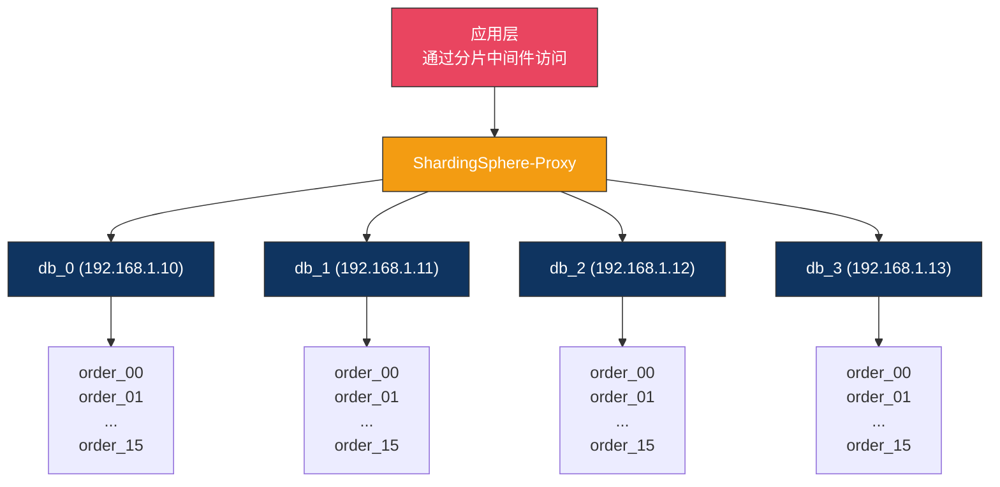

**水平分库的核心收益：**

| 收益 | 说明 |
|------|------|
| 写入扩展 | 每个分片独立承接写入，4个分片理论上可承受4倍写入量 |
| 存储扩展 | 1亿数据分4片，每片仅2500万，单表性能优良 |
| 连接数扩展 | 每个分片独立维护连接池，总连接数上限提升4倍 |
| 故障影响缩小 | 单个分片故障只影响1/4的数据访问 |

### 1.5 水平分表详解

水平分表是在同一个数据库实例内，将一张大表拆分为多张结构相同的小表。

```sql
-- 单库内水平分表：16张订单表
-- order_db内
CREATE TABLE order_00 (...);  -- user_id % 16 == 0
CREATE TABLE order_01 (...);  -- user_id % 16 == 1
CREATE TABLE order_02 (...);  -- user_id % 16 == 2
-- ...
CREATE TABLE order_15 (...);  -- user_id % 16 == 15
```

**水平分表 vs 水平分库的决策：**

| 决策因素 | 只分表 | 分库分表 |
|---------|-------|---------|
| 单库写QPS | < 3000 TPS（硬件可承受） | > 3000 TPS（单库写入瓶颈） |
| 单库连接数 | < 80%最大连接数 | 接近或超过最大连接数 |
| 存储空间 | < 500GB | > 500GB（备份恢复困难） |
| 运维能力 | 有限，不想增加实例 | 有专职DBA，可管理多实例 |
| 资源隔离 | 不需要（业务单一） | 需要（多业务共享数据库资源） |

**生产推荐：先垂直分库（按业务拆），再水平分表（按分片键拆）**

```sql
-- 最终目标架构示例
user_db  → user_00 ~ user_15   （16张用户表，按user_id哈希）
order_db → order_00 ~ order_31  （32张订单表，按user_id哈希）
item_db  → item_00 ~ item_07    （8张商品表，按category_id哈希）
pay_db   → pay_00 ~ pay_07      （8张支付表，按user_id哈希）
```

### 1.6 拆分维度组合决策

实际生产中，四种拆分方式经常组合使用。选择哪种组合取决于业务特征和瓶颈所在：

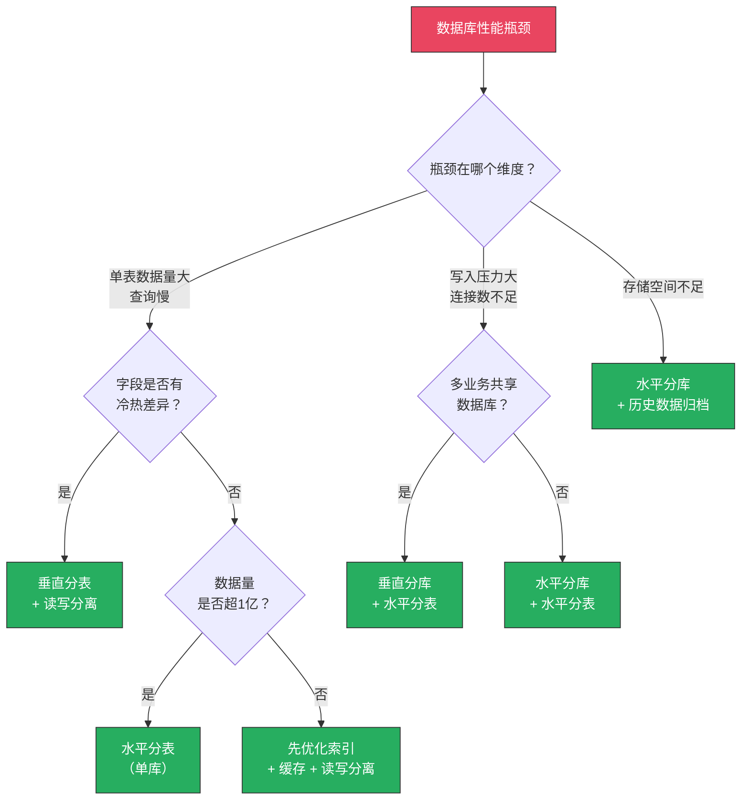

***

## 二、核心分片策略

分片策略决定了每条数据落在哪个分片上，是分库分表的灵魂。选错策略会导致数据倾斜、跨分片查询泛滥，甚至需要全量数据迁移。

### 2.1 范围分片（Range Sharding）

**原理：** 按分片键的值范围划分，每个分片负责一段连续区间。

分片键: order_id
分片规则:
  [1, 1000万)         → db_0.table_0
  [1000万, 2000万)     → db_1.table_0
  [2000万, 3000万)     → db_2.table_0
  [3000万, ∞)         → db_3.table_0

**路由算法实现：**

```python
class RangeRouter:
    """范围分片路由器"""
    
    def __init__(self, ranges: list[tuple[int, int, str]]):
        """
        ranges: [(start, end, target), ...]
        例如: [(0, 10_000_000, 'db_0'), (10_000_000, 20_000_000, 'db_1')]
        """
        self.ranges = sorted(ranges, key=lambda x: x[0])
    
    def route(self, shard_key: int) -> str:
        for start, end, target in self.ranges:
            if start <= shard_key < end:
                return target
        # 超出预定义范围，路由到最后一个分片
        return self.ranges[-1][2]
    
    def route_range(self, min_key: int, max_key: int) -> list[str]:
        """范围查询：返回所有可能涉及的分片"""
        targets = set()
        for start, end, target in self.ranges:
            if start < max_key and end > min_key:
                targets.add(target)
        return list(targets)
```

**优点：**
- 扩容简单：新增分片即可，无需数据迁移已有分片
- 范围查询高效：`WHERE order_id BETWEEN 100 AND 200` 落在单个分片
- 时间友好：按时间范围查询天然高效

**致命缺点：**
- **热点写入**：新数据全部涌入最后一个分片，造成严重的写入倾斜。假设订单按order_id范围分片，每天新订单只写入一个分片，其他分片空闲
- **数据分布不均**：随着时间推移，各分片数据量差异巨大。第一个分片可能有1亿数据，最后一个分片可能只有100万

**适用场景：** 按时间分片的日志表、时序数据（如按月/按年归档）、数据归档迁移。

**范围分片的热点缓解方案：**

| 方案 | 原理 | 代价 |
|------|------|------|
| 细粒度时间窗口 | 按天/小时而非按月分片 | 分片数增长快，管理复杂 |
| 预分配分片 | 提前创建多个分片，写入负载分散 | 部分分片长时间空闲 |
| 动态扩容 | 检测到热点后将热点分片一分为二 | 需要在线迁移，实现复杂 |

### 2.2 哈希分片（Hash Sharding）

**原理：** 对分片键做哈希运算，取模决定目标分片。

target_shard = hash(shard_key) % 分片数

示例：
  user_id = 12345678
  hash(12345678) = 0x3C8A7F12
  0x3C8A7F12 % 8 = 2 → 路由到 db_2

**路由算法实现：**

```python
import hashlib

class HashRouter:
    """哈希分片路由器"""
    
    def __init__(self, shard_count: int, algorithm: str = 'murmur'):
        self.shard_count = shard_count
        self.algorithm = algorithm
    
    def route(self, shard_key) -> int:
        """计算分片编号"""
        key_str = str(shard_key)
        if self.algorithm == 'murmur':
            h = int(hashlib.md5(key_str.encode()).hexdigest(), 16)
        elif self.algorithm == 'crc32':
            import zlib
            h = zlib.crc32(key_str.encode()) &amp; 0xFFFFFFFF
        else:
            h = hash(key_str)
        return h % self.shard_count
    
    def route_batch(self, keys: list) -> dict[int, list]:
        """批量路由：将多个key按分片分组"""
        groups = {i: [] for i in range(self.shard_count)}
        for key in keys:
            shard = self.route(key)
            groups[shard].append(key)
        return groups
```

**优点：**
- 数据分布均匀：哈希函数的均匀性保证各分片负载均衡
- 无热点问题：数据被均匀打散到所有分片

**致命缺点：**
- **扩容困难**：分片数从 4 变为 8，几乎所有数据需要重新映射（全量迁移）。例如原来 hash(12345678) % 4 = 2，变成 % 8 后 = 6，数据要从分片2迁移到分片6
- **范围查询退化**：`WHERE user_id IN (1,2,3)` 可能跨所有分片，每个分片都要查
- **迁移期间数据不一致**：扩容迁移过程中需要双写，增加了系统复杂度

**哈希扩容的数据迁移量分析：**

| 扩容方向 | 迁移数据比例 | 迁移数据量（总1亿） |
|---------|-------------|-------------------|
| 2 → 4 片 | 50% | 5000万行 |
| 4 → 8 片 | 50% | 5000万行 |
| 8 → 16 片 | 50% | 5000万行 |
| 4 → 5 片 | 80% | 8000万行 |
| 4 → 7 片 | 71% | 7100万行 |

规律：2的幂次之间扩容迁移量最小（50%），非2的幂次之间迁移量更大。因此哈希分片推荐分片数取2的幂次。

**适用场景：** 数据均匀分布、以单条记录查询为主的用户表、订单表、账户表。

### 2.3 一致性哈希分片（Consistent Hash Ring）

**原理：** 将哈希值映射到一个虚拟环（0 ~ 2^32），每个分片节点占据环上一段区间。数据沿顺时针找到最近的分片节点。

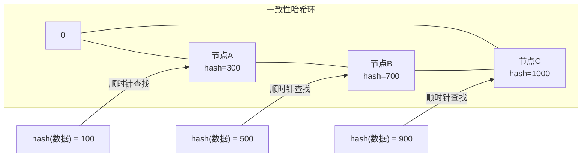

**关键改进：** 扩容时只影响环上相邻节点的数据，迁移量约 1/N（N 为分片数），远优于普通哈希的 (N-1)/N。

**虚拟节点机制：**

一致性哈希的原始版本在节点较少时会导致数据分布不均。引入虚拟节点后，每个物理节点映射多个虚拟节点（通常100~200个），使数据分布趋于均匀。

```python
import bisect
import hashlib
from collections import defaultdict

class ConsistentHashRouter:
    """一致性哈希路由器（含虚拟节点）"""
    
    def __init__(self, physical_nodes: list[str], virtual_count: int = 150):
        self.virtual_count = virtual_count
        self.ring = {}          # hash_value -> physical_node
        self.sorted_keys = []   # 排序后的哈希值列表
        self.nodes = set(physical_nodes)
        
        for node in physical_nodes:
            self._add_node(node)
    
    def _hash(self, key: str) -> int:
        return int(hashlib.md5(key.encode()).hexdigest(), 16)
    
    def _add_node(self, node: str):
        """添加物理节点及其虚拟节点"""
        for i in range(self.virtual_count):
            virtual_key = f"{node}:v{i}"
            h = self._hash(virtual_key)
            self.ring[h] = node
            self.sorted_keys.append(h)
        self.sorted_keys.sort()
    
    def route(self, key) -> str:
        """根据key路由到物理节点"""
        h = self._hash(str(key))
        idx = bisect.bisect_right(self.sorted_keys, h)
        if idx == len(self.sorted_keys):
            idx = 0
        return self.ring[self.sorted_keys[idx]]
    
    def add_node(self, node: str):
        """动态添加节点（扩容）"""
        self.nodes.add(node)
        self._add_node(node)
    
    def remove_node(self, node: str):
        """动态移除节点（缩容）"""
        self.nodes.discard(node)
        self.ring = {k: v for k, v in self.ring.items() if v != node}
        self.sorted_keys = [k for k in self.sorted_keys if k in self.ring]
    
    def get_distribution(self) -> dict[str, int]:
        """查看各节点的数据分布（用于检测倾斜）"""
        dist = defaultdict(int)
        # 模拟10万个key的分布
        for i in range(100000):
            node = self.route(i)
            dist[node] += 1
        return dict(dist)
```

**一致性哈希的迁移量对比：**

| 扩容场景 | 普通哈希迁移量 | 一致性哈希迁移量 |
|---------|-------------|---------------|
| 3 → 4 节点 | 75% (3/4) | ~25% (1/4) |
| 4 → 8 节点 | 87.5% (7/8) | ~12.5% (1/8) |
| 8 → 16 节点 | 93.75% (15/16) | ~6.25% (1/16) |

**适用场景：** 需要频繁弹性扩缩容的场景，如CDN缓存分片、大型分布式存储系统。在数据库分片中，由于一致性哈希的实现复杂度较高，实际使用不如哈希分片普遍。

### 2.4 三种策略对比

| 特性 | 范围分片 | 哈希分片 | 一致性哈希 |
|------|---------|---------|-----------|
| 数据均匀性 | ❌ 差（末位分片热点） | ✅ 好 | ✅ 好（需虚拟节点） |
| 扩容代价 | ✅ 低（直接新增分片） | ❌ 高（全量迁移） | ✅ 低（1/N迁移） |
| 范围查询 | ✅ 高效（单分片内） | ❌ 跨分片 | ❌ 跨分片 |
| 热点问题 | ❌ 严重 | ✅ 无 | ✅ 基本无 |
| 实现复杂度 | 低 | 中 | 高 |
| 数据迁移量 | 0（新增分片） | 约50%（2的幂次扩容） | 约1/N |
| 典型应用 | 日志/时序数据 | 用户表/订单表 | 缓存层/存储层 |
| 生产推荐度 | 特定场景推荐 | **通用首选** | 弹性扩缩容场景 |

### 2.5 复合策略：先哈希后范围

实际生产中经常组合使用多种策略，以兼顾数据均匀性和查询效率。

**两层分片策略示例：**

第一层（分库）：按 user_id 哈希分库（解决写入均匀性）
第二层（分表）：按 order_id 范围分表（支持时间范围查询）

路由流程：
  1. user_id % 4 → 确定目标库（db_0 ~ db_3）
  2. order_id / 1000万 → 确定库内表号（order_00 ~ order_15）
  3. 最终目标：db_{库号}.order_{表号}

```python
class CompositeRouter:
    """复合分片路由器：哈希分库 + 范围分表"""
    
    def __init__(self, db_count: int, table_count: int, bucket_size: int = 10_000_000):
        self.db_count = db_count
        self.table_count = table_count
        self.bucket_size = bucket_size
    
    def route(self, user_id: int, order_id: int) -> tuple[int, int]:
        """返回 (db_index, table_index)"""
        db_index = user_id % self.db_count
        table_index = min(order_id // self.bucket_size, self.table_count - 1)
        return db_index, table_index
    
    def get_target(self, user_id: int, order_id: int) -> str:
        db_idx, tbl_idx = self.route(user_id, order_id)
        return f"db_{db_idx}.order_{tbl_idx:02d}"


# 使用示例
router = CompositeRouter(db_count=4, table_count=16)
print(router.get_target(user_id=12345678, order_id=56789012))
# 输出: db_2.order_05

print(router.get_target(user_id=99999999, order_id=123456789))
# 输出: db_3.order_12
```

**更多复合策略模式：**

| 模式 | 分库策略 | 分表策略 | 适用场景 |
|------|---------|---------|---------|
| 哈希+范围 | user_id % N 分库 | order_id / bucket 分表 | 订单系统（按用户查+按时间查） |
| 哈希+哈希 | user_id % N 分库 | order_id % M 分表 | 纯单条记录查询为主 |
| 范围+哈希 | 按月分库 | user_id % M 分表 | 月度报表系统 |
| 基因+哈希 | 从基因ID中提取库号 | 基因ID % M 分表 | 需要从ID直接路由（见3.4节） |

***

## 三、分片键选择

分片键（Sharding Key）是分库分表中最重要的设计决策。选错分片键等于分库分表失败了一半——数据倾斜、跨分片查询泛滥、性能瓶颈无法缓解。

### 3.1 选择原则

**原则一：高基数（High Cardinality）**

分片键的不重复值数量必须远大于分片数。用 `gender`（男/女）做分片键，2个值分8个库——必然有两个库空转。

| 分片键候选 | 基数 | 8个分片时的均匀性 | 评价 |
|-----------|------|------------------|------|
| gender（性别） | 2 | ❌ 严重倾斜 | 不可用 |
| city（城市） | ~300 | ⚠️ 一线城市集中 | 勉强可用 |
| user_id | ~1亿 | ✅ 非常均匀 | **推荐** |
| order_id | ~10亿 | ✅ 非常均匀 | **推荐** |

**原则二：查询高频命中**

80%以上的查询都带分片键作为条件。`SELECT * FROM orders WHERE user_id = 12345` 如果 user_id 是分片键，路由到单个分片，效率极高。

判断方法——分析慢查询日志和业务SQL：
```sql
-- 统计订单表的查询条件使用频率
SELECT 
    SUBSTRING_INDEX(SUBSTRING_INDEX(query, 'WHERE', -1), 'AND', 1) AS first_condition,
    COUNT(*) AS freq
FROM mysql.slow_log
WHERE db = 'order_db' AND table = 'orders'
GROUP BY first_condition
ORDER BY freq DESC
LIMIT 10;
```

**原则三：写入均匀分布**

分片键的值在各分片上均匀分布，避免热点。如果用 `shop_id` 做分片键，头部商家的订单集中在少数分片，其他分片空闲。

### 3.2 常见场景分片键选择

| 业务场景 | 推荐分片键 | 备选分片键 | 原因 |
|---------|-----------|-----------|------|
| 用户表 | user_id | — | 全局唯一，查询时按用户查 |
| 订单表 | user_id | order_id | 按用户查订单为主场景；order_id适合按时间查询场景 |
| 支付流水 | user_id | transaction_id | 按用户查流水；transaction_id适合按流水号查 |
| 消息表 | conversation_id | user_id | 同一会话的消息落在同一分片，避免跨分片JOIN |
| 日志表 | timestamp | — | 按时间范围查询，天然适合范围分片 |
| 商品表 | category_id | — | 按分类浏览为主；注意分类分布不均 |
| 库存表 | sku_id | — | 按SKU查库存是核心操作 |

### 3.3 分片键选择的常见陷阱

**陷阱一：用自增ID做哈希分片键**

自增ID天然有序，但哈希后分布并不均匀。新注册用户集中在某个分片（自增ID连续），老用户的ID段对应其他分片，导致新用户分片写入集中。

更好的做法是用 UUID 或雪花ID取哈希，或者对自增ID做二次哈希（如 `hash(user_id) % N` 而非 `user_id % N`）。

**陷阱二：忽略非分片键查询**

如果业务中有大量不带分片键的查询（如管理员按手机号查用户），必须建立**全局索引表**或使用**基因法**（将分片信息编码到ID中）来避免全分片扫描。

识别方法——扫描业务SQL中WHERE子句的字段分布：
```python
import re
from collections import Counter

def analyze_shard_key_coverage(sql_log_path: str, table_name: str, current_shard_key: str):
    """分析分片键查询覆盖率"""
    total = 0
    covered = 0
    uncovered_conditions = Counter()
    
    with open(sql_log_path) as f:
        for line in f:
            if table_name not in line or 'SELECT' not in line:
                continue
            total += 1
            if current_shard_key in line:
                covered += 1
            else:
                # 提取WHERE后的第一个条件字段
                match = re.search(r'WHERE\s+(\w+)', line)
                if match:
                    uncovered_conditions[match.group(1)] += 1
    
    coverage = covered / total * 100 if total > 0 else 0
    print(f"分片键覆盖率: {coverage:.1f}% ({covered}/{total})")
    if coverage < 80:
        print("⚠️  覆盖率低于80%，需要建立异构索引")
        print("未覆盖的查询条件:")
        for cond, count in uncovered_conditions.most_common(5):
            print(f"  {cond}: {count}次")
```

**陷阱三：跨分片JOIN无法避免时未提前规划**

订单表按 user_id 分片，商品表按 category_id 分片。"查询某用户购买了哪些分类的商品"必然跨分片 JOIN。应在设计阶段就识别这类场景，通过数据冗余或异构索引解决。

### 3.4 基因法（Gene Method）详解

基因法是将分片信息编码到ID本身中，使得从ID可以直接计算出分片位置，无需额外的路由查询。

**核心思想：** 在雪花ID的序列号位中取出几位作为"基因"，编码分片信息。

标准Snowflake ID（64位）:
  0 | 41位时间戳 | 10位机器ID | 12位序列号

基因法改造后:
  0 | 41位时间戳 | 7位机器ID | 3位库基因 | 2位序列号

  其中：库基因 = user_id % 4（0~3，需要2位）
  表基因可以内嵌到其他字段，或单独计算

**基因法的实现：**

```python
class GeneSnowflakeGenerator:
    """带基因的雪花ID生成器"""
    
    EPOCH = 1704067200000  # 2024-01-01 00:00:00 UTC
    
    # 位分配
    TIMESTAMP_BITS = 41
    WORKER_BITS = 7       # 支持128个Worker
    GENE_BITS = 3         # 支持8个库（0~7）
    SEQUENCE_BITS = 12    # 标准序列号
    
    def __init__(self, worker_id: int, db_count: int = 8):
        self.worker_id = worker_id
        self.db_count = db_count
        self.sequence = 0
        self.last_timestamp = -1
        
        self.gene_mask = (1 << self.GENE_BITS) - 1
        self.seq_mask = (1 << self.SEQUENCE_BITS) - 1
    
    def next_id(self, shard_gene: int) -> int:
        """
        生成带基因的ID
        shard_gene: 分片基因（user_id % db_count）
        """
        import time
        timestamp = int(time.time() * 1000)
        
        if timestamp == self.last_timestamp:
            self.sequence = (self.sequence + 1) &amp; self.seq_mask
            if self.sequence == 0:
                while timestamp <= self.last_timestamp:
                    timestamp = int(time.time() * 1000)
        else:
            self.sequence = 0
        
        self.last_timestamp = timestamp
        
        # 组装ID: 时间戳 | 机器ID | 基因 | 序列号
        gene = shard_gene &amp; self.gene_mask
        return ((timestamp - self.EPOCH) << (self.WORKER_BITS + self.GENE_BITS + self.SEQUENCE_BITS)) \
             | (self.worker_id << (self.GENE_BITS + self.SEQUENCE_BITS)) \
             | (gene << self.SEQUENCE_BITS) \
             | self.sequence
    
    def extract_gene(self, id_value: int) -> int:
        """从ID中提取分片基因"""
        return (id_value >> self.SEQUENCE_BITS) &amp; self.gene_mask
    
    def get_db_index(self, id_value: int) -> int:
        """从ID中直接计算库索引"""
        return self.extract_gene(id_value)


# 使用示例
gen = GeneSnowflakeGenerator(worker_id=1, db_count=8)

# 用户注册时生成ID，基因编码了 user_id % 8
user_id = gen.next_id(shard_gene=5)  # user_id % 8 == 5
print(f"用户ID: {user_id}")
print(f"库索引: {gen.get_db_index(user_id)}")  # 输出: 5

# 订单生成ID时，使用同一个用户ID的基因
# 这样订单和用户落在同一个库，避免跨库查询
order_id = gen.next_id(shard_gene=5)  # 同样的基因
print(f"订单ID: {order_id}")
print(f"库索引: {gen.get_db_index(order_id)}")  # 输出: 5
```

**基因法的核心优势：**

| 优势 | 说明 |
|------|------|
| ID直接路由 | 从ID中提取基因即可计算分片，无需路由表 |
| 业务关联性 | 同一用户的所有数据（订单、支付、积分）通过基因落在同一库 |
| 分布式ID兼容 | 保持了雪花ID的时间有序性和全局唯一性 |
| 避免跨分片查询 | 通过基因绑定，相关数据天然在同一分片 |

**基因法的适用场景：**
- 需要将多个相关表绑定到同一分片
- 需要从ID直接路由，避免额外的映射查询
- ID生成和路由逻辑需要解耦

***

## 四、分片数量规划

分片数不是越多越好。过多分片增加管理复杂度、跨分片查询概率和运维成本，过少则达不到扩展效果。分片数一旦确定，后期调整代价极高（可能需要全量数据迁移）。

### 4.1 估算公式

目标分片数 = ceil(预估未来3年峰值QPS / 单分片承载QPS)

示例：
  当前写 QPS = 3000，年增长率 50%
  3年后 QPS = 3000 × (1.5)^3 ≈ 10125 QPS
  单分片（16核64G MySQL 8.0）承载 ≈ 3000 写 QPS
  目标分片数 = 10125 / 3000 ≈ 3.4 → 取 4 个分片

考虑 30%~50% 余量后：取 4~8 个分片

**单分片承载能力参考（MySQL 8.0，InnoDB）：**

| 硬件配置 | 写QPS参考 | 读QPS参考 | 单表建议上限 |
|---------|----------|----------|------------|
| 4核16G SSD | 1000~1500 | 3000~5000 | 1000万行 |
| 8核32G SSD | 2000~3000 | 6000~10000 | 2000万行 |
| 16核64G SSD | 3000~5000 | 10000~20000 | 5000万行 |
| 32核128G SSD | 5000~8000 | 20000~50000 | 1亿行 |

> 注：以上为简单OLTP查询（单行点查）的参考值。复杂查询（多表JOIN、聚合、排序）的承载能力会大幅下降，应按实际业务场景测试。

### 4.2 经验法则

| 法则 | 说明 |
|------|------|
| 起步分片数取2的幂次 | 2、4、8、16，方便哈希取模，扩容时迁移量最小 |
| 分片总数不超过256 | 超过后运维复杂度急剧上升，中间件路由表膨胀 |
| 预留30%~50%余量 | 应对流量突发增长和业务扩展 |
| 单表行数控制在2000万以内 | B+树3层可覆盖，查询性能有保障 |
| 分片数 = 硬件数量 × 每台分片数 | 便于硬件规划和容量管理 |

### 4.3 分片数与数据量关系

| 分片数 | 单表行数（1亿总量） | 单表行数（5亿总量） | 单表行数（10亿总量） | 评估 |
|--------|-------------------|-------------------|-------------------|------|
| 4 | 2500万 | 1.25亿 | 2.5亿 | ⚠️ 10亿时偏大 |
| 8 | 1250万 | 6250万 | 1.25亿 | ✅ 5亿以内安全 |
| 16 | 625万 | 3125万 | 6250万 | ✅ 10亿以内安全 |
| 32 | 312万 | 1562万 | 3125万 | ✅ 超大规模 |

**分片数选择建议：**

数据量 < 5000万  → 不需要分表，优化索引+缓存即可
数据量 5000万~2亿 → 4个分片（每片5000万以内）
数据量 2亿~10亿   → 8~16个分片
数据量 > 10亿     → 16~32个分片，考虑NewSQL

### 4.4 分片数的生命周期管理

分片数在系统生命周期中可能需要调整：

| 阶段 | 分片策略 | 说明 |
|------|---------|------|
| 初创期 | 不分片 | 优化SQL索引 + 缓存 + 读写分离 |
| 成长期 | 4~8个分片 | 数据量突破2000万/表 |
| 成熟期 | 8~16个分片 | 数据量突破5000万/表，写QPS上升 |
| 爆发期 | 16~32个分片 | 亿级数据量 |
| 稳定期 | 评估NewSQL | 数据量持续增长，分片数接近上限 |

***

## 五、数据迁移策略

分库分表最危险的环节是数据迁移——做不好就是线上事故。一次失败的迁移可能导致数据丢失、业务停服、客户投诉。

### 5.1 迁移方案选型

| 方案 | 停机时间 | 数据一致性 | 复杂度 | 适用场景 |
|------|---------|-----------|--------|---------|
| 停服迁移 | 长（小时级） | ✅ 强一致 | 低 | 数据量小（<100GB）、允许停机 |
| 双写迁移 | 无停机 | ⚠️ 需处理冲突 | 高 | 大规模在线迁移 |
| binlog同步 | 无停机 | ✅ 最终一致 | 中 | **推荐方案** |
| 影子表切换 | 短（秒级） | ✅ 强一致 | 中 | 最终切换阶段 |

### 5.2 推荐方案：binlog 同步 + 双写过渡

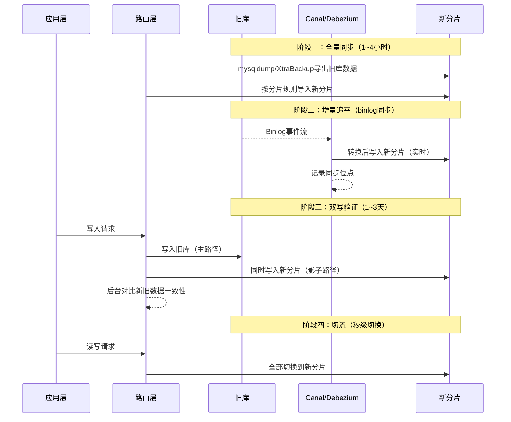

**阶段一：全量数据同步**

```bash
# 使用mysqldump导出（数据量 < 100GB）
mysqldump -h old_host -u root -p \
    --single-transaction \
    --set-gtid-purged=OFF \
    --quick \
    --no-create-info \
    order_db orders | \
mysql -h new_host -u root -p order_db

# 使用XtraBackup导出（数据量 > 100GB，更快）
xtrabackup --backup --target-dir=/data/backup \
    --host=old_host --user=root --password=xxx

# 在新实例上恢复
xtrabackup --prepare --target-dir=/data/backup
xtrabackup --copy-back --target-dir=/data/backup
```

**阶段二：增量同步（Canal配置）**

```yaml
# canal.properties - Canal核心配置
canal.instance.master.address=old_host:3306
canal.instance.dbUsername=canal_user
canal.instance.dbPassword=canal_pass

# 关键：只监听需要同步的表
canal.instance.filter.regex=order_db\\.orders,order_db\\.order_items

# binlog格式必须为ROW
canal.instance.tsdb.enable=false
```

```java
// Canal消费者：将旧库的变更同步到新分片
public class ShardMigrationListener {
    
    public void onEvent(CanalEntry.RowData rowData, String tableName) {
        // 根据分片规则计算目标分片
        long userId = extractUserId(rowData);
        int targetShard = userId % SHARD_COUNT;
        
        // 将变更写入对应的新分片
        switch (rowData.getEventType()) {
            case INSERT:
                shardClients[targetShard].insert(tableName, rowData.getAfterColumns());
                break;
            case UPDATE:
                shardClients[targetShard].update(tableName, rowData.getBeforeColumns(), rowData.getAfterColumns());
                break;
            case DELETE:
                shardClients[targetShard].delete(tableName, rowData.getBeforeColumns());
                break;
        }
    }
}
```

**阶段三：双写验证**

```python
class DualWriteValidator:
    """双写期间的数据一致性校验器"""
    
    def __init__(self, old_db, new_shards):
        self.old_db = old_db
        self.new_shards = new_shards
    
    def validate_batch(self, batch_size: int = 10000) -> dict:
        """批量校验数据一致性"""
        results = {"total": 0, "match": 0, "mismatch": 0, "missing": 0}
        
        for shard_idx, shard_db in enumerate(self.new_shards):
            # 从新分片读取数据
            new_records = shard_db.execute(
                f"SELECT * FROM orders WHERE shard_marker = {shard_idx} LIMIT {batch_size}"
            )
            
            for record in new_records:
                results["total"] += 1
                # 从旧库查询同一记录
                old_record = self.old_db.execute(
                    "SELECT * FROM orders WHERE order_id = %s", record["order_id"]
                )
                
                if not old_record:
                    results["missing"] += 1
                    continue
                
                # 逐字段对比（排除时间戳等动态字段）
                if self._compare(record, old_record, exclude=["updated_at"]):
                    results["match"] += 1
                else:
                    results["mismatch"] += 1
        
        # 输出校验报告
        total = results["total"]
        match_rate = results["match"] / total * 100 if total > 0 else 0
        print(f"校验完成: 总计{total}条, 匹配{results['match']}条, "
              f"不匹配{results['mismatch']}条, 缺失{results['missing']}条")
        print(f"一致性: {match_rate:.4f}%")
        return results
```

### 5.3 迁移回滚方案

每次迁移必须有回滚预案。回滚失败比迁移失败更可怕——可能处于新旧库数据都不完整的中间状态。

回滚触发条件：
  ✗ 新分片写入延迟 > 500ms 持续 5 分钟
  ✗ 数据一致性校验差异 > 0.01%
  ✗ 新分片 CPU 使用率持续 > 90%
  ✗ 新分片连接数打满
  ✗ Canal同步延迟 > 1分钟 持续 10 分钟

回滚步骤：
  1. 停止双写，路由层切回旧库（秒级完成）
  2. 将双写期间新库中新增的数据回写旧库
     - 通过新库binlog获取新增记录
     - 按主键逐条插入旧库
  3. 验证旧库数据完整性
  4. 清理新分片数据
  5. 复盘回滚原因，修复后重新计划迁移

### 5.4 数据迁移的关键指标

在迁移过程中需要持续监控以下指标：

| 指标 | 正常范围 | 告警阈值 | 处理措施 |
|------|---------|---------|---------|
| Canal同步延迟 | < 1s | > 5s持续5分钟 | 检查Canal实例资源，重启同步 |
| 双写成功率 | > 99.99% | < 99.9% | 检查新分片连接状态 |
| 数据一致性 | 100% | 差异 > 0.01% | 暂停切流，排查差异原因 |
| 新分片QPS | < 80%容量 | > 90%容量 | 扩容新分片实例 |
| 新分片延迟 | < 10ms | > 50ms | 检查索引和SQL效率 |

***

## 六、分布式事务处理

分库后跨分片事务成为核心难题。在同一分片内的事务可以用MySQL本地事务保证ACID，但跨分片写入必须使用分布式事务方案。

### 6.1 方案全景对比

| 方案 | 一致性 | 性能 | 复杂度 | 业务侵入 | 适用场景 |
|------|--------|------|--------|---------|---------|
| 2PC（两阶段提交） | 强一致 | ❌ 低（锁资源、阻塞） | 高 | 低 | 银行核心系统、金融转账 |
| 3PC | 强一致 | 中 | 高 | 低 | 实际使用较少 |
| TCC（Try-Confirm-Cancel） | 强一致 | 中 | 高（需三接口） | 高 | 电商支付、库存扣减 |
| Saga | 最终一致 | ✅ 高 | 中 | 中 | 长事务、编排型业务 |
| 本地消息表 | 最终一致 | ✅ 高 | 低 | 低 | **通用推荐** |
| 事务消息（RocketMQ） | 最终一致 | ✅ 高 | 低 | 低 | 已有MQ基础设施 |
| Seata AT | 最终一致 | 中 | 低（框架自动） | 低 | Java微服务通用业务 |
| Seata TCC | 强一致 | 中 | 高 | 高 | 需要强一致的复杂业务 |

### 6.2 本地消息表方案详解

这是实践中最常用、最可靠的最终一致性方案。核心思想：将分布式事务转化为本地事务 + 异步重试。

**表结构设计：**

```sql
-- 消息表（与业务表在同一个库中）
CREATE TABLE outbox_message (
    id           BIGINT PRIMARY KEY AUTO_INCREMENT,
    biz_type     VARCHAR(32) NOT NULL COMMENT '业务类型：ORDER_CREATE/PAY_COMPLETE等',
    biz_id       VARCHAR(64) NOT NULL COMMENT '业务ID：订单号/支付流水号等',
    payload      TEXT NOT NULL COMMENT '消息内容（JSON格式）',
    status       TINYINT DEFAULT 0 COMMENT '0-待发送 1-已发送 2-已确认 3-发送失败',
    retry_count  INT DEFAULT 0 COMMENT '已重试次数',
    next_retry   DATETIME DEFAULT NULL COMMENT '下次重试时间',
    created_at   DATETIME DEFAULT CURRENT_TIMESTAMP,
    updated_at   DATETIME DEFAULT CURRENT_TIMESTAMP ON UPDATE CURRENT_TIMESTAMP,
    INDEX idx_status_retry (status, next_retry),
    INDEX idx_biz (biz_type, biz_id)
) ENGINE=InnoDB DEFAULT CHARSET=utf8mb4 COMMENT='事务消息表';
```

**完整流程代码：**

```python
import json
import time
from contextlib import contextmanager

class OrderService:
    """使用本地消息表实现分布式事务"""
    
    def create_order(self, user_id: int, items: list[dict], total_amount: float):
        """
        创建订单（跨库事务：订单库 + 库存库）
        """
        with self.db.transaction() as tx:
            # 1. 在本地事务中写入业务数据
            order_id = tx.execute(
                "INSERT INTO orders (user_id, total_amount, status) VALUES (%s, %s, %s)",
                (user_id, total_amount, 'PENDING')
            ).lastrowid
            
            for item in items:
                tx.execute(
                    "INSERT INTO order_items (order_id, sku_id, quantity, price) VALUES (%s, %s, %s, %s)",
                    (order_id, item['sku_id'], item['quantity'], item['price'])
                )
            
            # 2. 在同一事务中写入消息表
            message = json.dumps({
                "order_id": order_id,
                "user_id": user_id,
                "items": items,
                "total_amount": total_amount,
                "action": "DEDUCT_INVENTORY"
            })
            tx.execute(
                "INSERT INTO outbox_message (biz_type, biz_id, payload) VALUES (%s, %s, %s)",
                ('ORDER_CREATE', str(order_id), message)
            )
            
            # 两个操作在同一个本地事务中提交，要么都成功，要么都失败
        
        return order_id
    
    def process_messages(self, batch_size: int = 100):
        """
        后台定时任务：扫描并发送待处理消息
        """
        messages = self.db.execute(
            """SELECT id, biz_type, payload FROM outbox_message 
               WHERE status = 0 
               AND (next_retry IS NULL OR next_retry <= NOW())
               ORDER BY created_at 
               LIMIT %s FOR UPDATE SKIP LOCKED""",
            (batch_size,)
        )
        
        for msg in messages:
            try:
                payload = json.loads(msg['payload'])
                
                if msg['biz_type'] == 'ORDER_CREATE':
                    # 调用库存服务扣减库存（跨库操作）
                    self.inventory_client.deduct(
                        items=payload['items']
                    )
                    
                # 标记为已发送
                self.db.execute(
                    "UPDATE outbox_message SET status = 1 WHERE id = %s",
                    (msg['id'],)
                )
                
            except Exception as e:
                # 标记为发送失败，安排重试
                retry_count = self._get_retry_count(msg['id'])
                if retry_count >= 3:
                    self.db.execute(
                        "UPDATE outbox_message SET status = 3 WHERE id = %s",
                        (msg['id'],)
                    )
                    self._alert(f"消息发送失败: {msg['id']}, 错误: {e}")
                else:
                    # 指数退避重试
                    delay = min(2 ** retry_count * 60, 3600)  # 1分钟、2分钟、4分钟...
                    self.db.execute(
                        """UPDATE outbox_message 
                           SET retry_count = retry_count + 1,
                               next_retry = DATE_ADD(NOW(), INTERVAL %s SECOND)
                           WHERE id = %s""",
                        (delay, msg['id'])
                    )
    
    def acknowledge(self, biz_type: str, biz_id: str):
        """消费方确认消息已处理"""
        self.db.execute(
            "UPDATE outbox_message SET status = 2 WHERE biz_type = %s AND biz_id = %s",
            (biz_type, biz_id)
        )
```

**优点：** 不依赖分布式事务中间件，业务代码侵入小，可靠性由本地事务保证。即使MQ宕机，消息也不会丢失（消息表持久化在MySQL中）。

**缺点：** 需要维护消息表和定时扫描任务；消息表随时间膨胀，需要定期归档。

### 6.3 事务消息方案（RocketMQ）

RocketMQ的事务消息机制本质上是本地消息表的框架级实现：

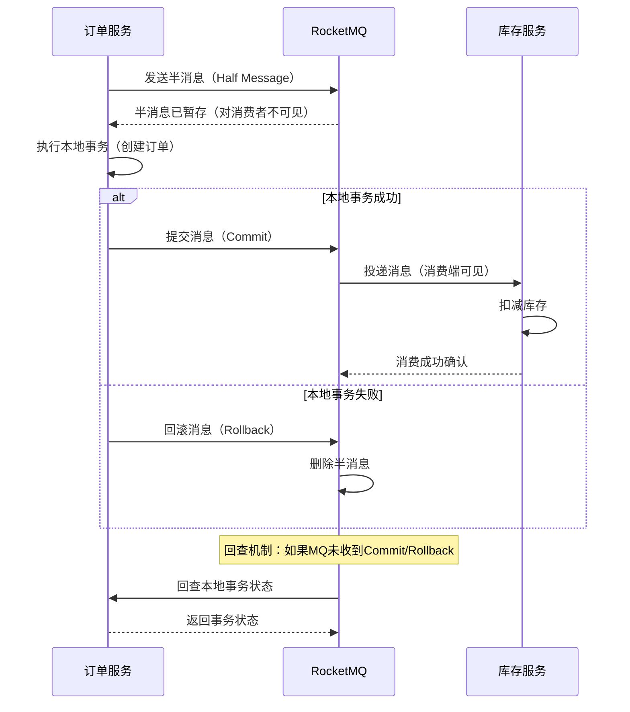

```java
// RocketMQ事务消息生产者
@Service
public class OrderTransactionProducer {
    
    @Autowired
    private TransactionMQProducer producer;
    
    public void createOrderWithMQ(OrderDTO order) {
        // 构建消息体
        Message<MessageExt> message = new Message<>(
            "order-topic",
            "order-create",
            JSON.toJSONString(order).getBytes()
        );
        
        // 发送事务消息
        producer.sendMessageInTransaction(message, order);
    }
}

// 事务监听器
public class OrderTransactionListener implements TransactionListener {
    
    @Override
    public LocalTransactionState executeLocalTransaction(Message msg, Object arg) {
        try {
            // 执行本地事务：创建订单
            orderService.createOrder((OrderDTO) arg);
            return LocalTransactionState.COMMIT_MESSAGE;
        } catch (Exception e) {
            return LocalTransactionState.ROLLBACK_MESSAGE;
        }
    }
    
    @Override
    public LocalTransactionState checkLocalTransaction(MessageExt msg) {
        // 回查：检查订单是否创建成功
        String orderId = msg.getProperty("orderId");
        Order order = orderService.findById(orderId);
        if (order != null) {
            return LocalTransactionState.COMMIT_MESSAGE;
        }
        return LocalTransactionState.UNKNOW;  // 未知状态，稍后再次回查
    }
}
```

### 6.4 Saga模式详解

Saga模式将一个分布式事务拆分为多个本地事务，每个本地事务都有对应的补偿操作。如果某个步骤失败，按逆序执行已完成步骤的补偿操作。


**Saga编排实现：**

```python
from enum import Enum
from dataclasses import dataclass
from typing import Callable

class StepStatus(Enum):
    PENDING = "pending"
    COMPLETED = "completed"
    COMPENSATED = "compensated"
    FAILED = "failed"

@dataclass
class SagaStep:
    name: str
    action: Callable        # 正向操作
    compensation: Callable  # 补偿操作
    status: StepStatus = StepStatus.PENDING

class SagaOrchestrator:
    """Saga编排器：管理分布式事务的正向执行和补偿回滚"""
    
    def __init__(self):
        self.steps: list[SagaStep] = []
    
    def add_step(self, name: str, action: Callable, compensation: Callable):
        self.steps.append(SagaStep(name=name, action=action, compensation=compensation))
        return self
    
    def execute(self, context: dict) -> bool:
        """执行Saga事务，失败时自动补偿"""
        completed_steps = []
        
        for step in self.steps:
            try:
                print(f"[Saga] 执行步骤: {step.name}")
                step.action(context)
                step.status = StepStatus.COMPLETED
                completed_steps.append(step)
            except Exception as e:
                print(f"[Saga] 步骤失败: {step.name}, 错误: {e}")
                step.status = StepStatus.FAILED
                
                # 逆序执行补偿操作
                self._compensate(completed_steps, context)
                return False
        
        print("[Saga] 所有步骤执行成功")
        return True
    
    def _compensate(self, completed_steps: list[SagaStep], context: dict):
        """逆序补偿已完成的步骤"""
        for step in reversed(completed_steps):
            try:
                print(f"[Saga] 补偿步骤: {step.name}")
                step.compensation(context)
                step.status = StepStatus.COMPENSATED
            except Exception as e:
                # 补偿失败需要告警和人工介入
                print(f"[Saga] ⚠️ 补偿失败: {step.name}, 错误: {e}")
                self._alert_compensation_failure(step, e)


# 使用示例
saga = SagaOrchestrator()

saga.add_step(
    name="创建订单",
    action=lambda ctx: order_db.execute(
        "INSERT INTO orders (...) VALUES (...)", ctx['order']
    ),
    compensation=lambda ctx: order_db.execute(
        "UPDATE orders SET status = 'CANCELLED' WHERE order_id = %s", ctx['order_id']
    )
)

saga.add_step(
    name="扣减库存",
    action=lambda ctx: inventory_db.execute(
        "UPDATE inventory SET stock = stock - %s WHERE sku_id = %s",
        (ctx['quantity'], ctx['sku_id'])
    ),
    compensation=lambda ctx: inventory_db.execute(
        "UPDATE inventory SET stock = stock + %s WHERE sku_id = %s",
        (ctx['quantity'], ctx['sku_id'])
    )
)

saga.add_step(
    name="创建支付记录",
    action=lambda ctx: pay_db.execute(
        "INSERT INTO payments (...) VALUES (...)", ctx['payment']
    ),
    compensation=lambda ctx: pay_db.execute(
        "UPDATE payments SET status = 'CANCELLED' WHERE payment_id = %s",
        ctx['payment_id']
    )
)

# 执行
context = {"order_id": 12345, "sku_id": 100, "quantity": 2}
saga.execute(context)
```

**Saga的三种实现模式对比：**

| 模式 | 描述 | 优点 | 缺点 |
|------|------|------|------|
| 编排式（Orchestration） | 中央协调器管理所有步骤 | 流程清晰，易于监控 | 协调器是单点 |
| 协同式（Choreography） | 各服务通过事件松耦合协作 | 无单点，高可用 | 流程分散，难以追踪 |
| 混合式 | 核心流程编排，边缘流程协同 | 平衡清晰度和灵活性 | 设计复杂 |

**Saga的最终一致性保证：** Saga不提供ACID保证，只保证最终一致性。在补偿完成之前，系统处于中间状态。因此业务需要容忍短暂的不一致（例如订单已创建但库存尚未扣减的窗口期）。

### 6.5 Seata AT 模式

Seata的AT（Automatic Transaction）模式通过代理数据源，自动记录undo log，实现分支事务的自动回滚：

```java
// 使用 Seata 的全局事务注解
@GlobalTransactional(timeoutMills = 60000, name = "order-create")
public void createOrder(OrderDTO order) {
    // 1. 写入订单（订单库分片）
    orderMapper.insert(order);
    // 2. 扣减库存（商品库分片）
    inventoryMapper.deduct(order.getSkuId(), order.getQuantity());
    // 3. 写入支付记录（支付库分片）
    paymentMapper.create(order.getOrderId(), order.getAmount());
    // 任一步失败，Seata 自动回滚所有分支事务
}
```

**Seata AT 的工作原理：**

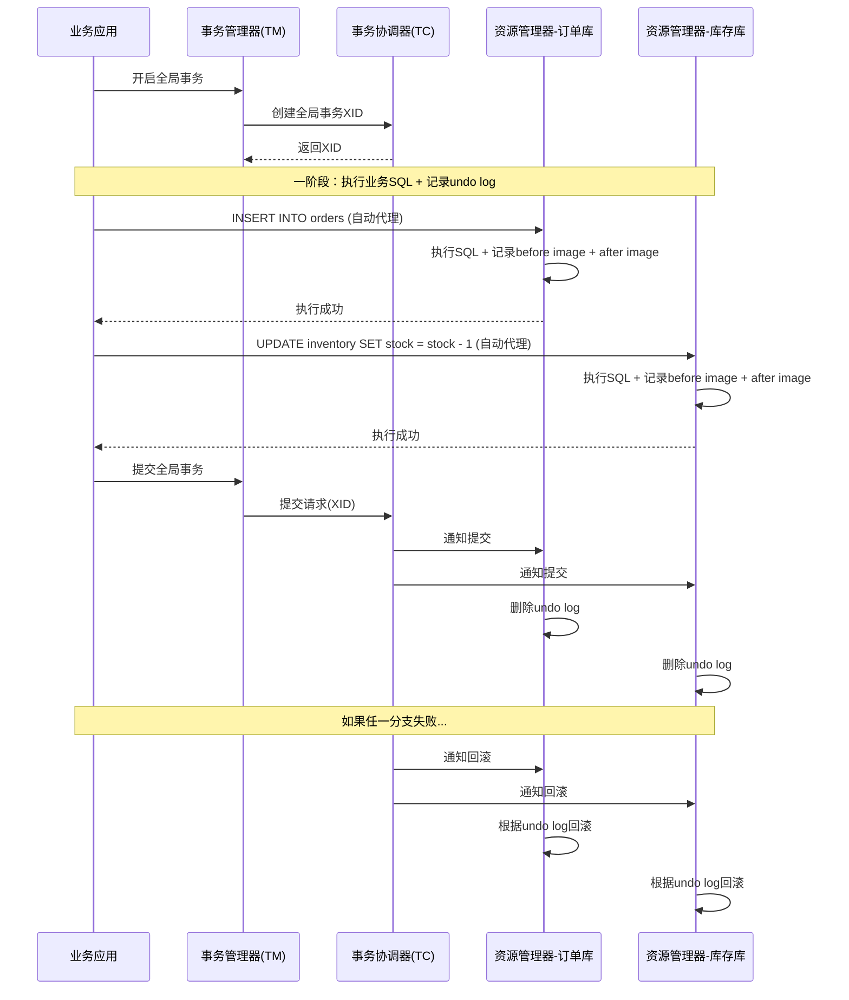

**Seata AT 的优缺点：**

| 维度 | 评价 |
|------|------|
| 业务侵入 | 极低，只需加@GlobalTransactional注解 |
| 自动化程度 | 高，自动记录undo log和回滚 |
| 性能影响 | 一阶段：每个SQL增加约5~10ms（记录undo log） |
| 全局锁 | AT模式会加全局锁，可能影响并发性能 |
| 适用范围 | 仅支持MySQL/Oracle等关系型数据库 |
| 数据库兼容性 | 需要数据库支持本地事务 |

***

## 七、跨分片查询解决方案

分库分表后，某些查询不可避免地需要跨多个分片。这些查询如果处理不当，会导致全分片扫描（Scatter-Gather），严重影响性能。

### 7.1 全局表（字典表）

将小数据量的字典表（如省市区、商品分类、配置表）在每个分片中都保留一份全量副本。查询时无需跨分片。

```sql
-- 每个分片都有完整的 province 表
-- 数据量小（几百~几千行），全量同步代价极低
SELECT * FROM province WHERE id = 110000;  -- 单分片查询，无需跨片
SELECT p.name, c.name FROM province p 
JOIN city c ON p.id = c.province_id 
WHERE p.name = '北京市';  -- 单分片JOIN，无需跨片
```

**全局表的数据同步策略：**

| 策略 | 实现方式 | 适用场景 |
|------|---------|---------|
| 启动时全量同步 | 应用启动时从主表读取并缓存 | 字典表更新频率极低 |
| Canal监听同步 | 监听主库字典表变更，同步到所有分片 | 字典表偶尔更新 |
| 定时任务同步 | 每小时/每天从主表同步一次 | 可容忍短暂不一致 |
| 写时同步 | 修改字典表时同时写入所有分片 | 字典表修改是低频操作 |

### 7.2 绑定表（Binding Table）

将有JOIN关系的表使用相同的分片键和分片算法，确保关联数据落在同一分片内。

订单表和订单明细表都用 order_id 做分片键：
  order_00 JOIN order_item_00  -- 同一分片内完成JOIN
  order_01 JOIN order_item_01  -- 同一分片内完成JOIN

ShardingSphere配置绑定表：
```yaml
spring:
  shardingsphere:
    rules:
      sharding:
        binding-tables:
          - orders,order_items  # 声明绑定关系
```

**绑定表的关键约束：**

| 约束 | 说明 |
|------|------|
| 分片键必须相同 | orders和order_items都使用order_id |
| 分片算法必须相同 | 都使用hash(order_id) % N |
| 分片数必须相同 | 都拆分为N个分片 |
| 不能跨库 | 绑定表必须在同一个数据库实例内 |

### 7.3 冗余字段 + 异构索引

当查询条件与分片键不一致时，通过冗余字段建立异构索引（反向索引表）。

**场景：** 订单表按user_id分片，但管理员需要按手机号查用户订单。

```sql
-- 步骤1：建立 phone → user_id 映射表
CREATE TABLE phone_user_mapping (
    phone       VARCHAR(20) PRIMARY KEY,
    user_id     BIGINT NOT NULL,
    updated_at  DATETIME DEFAULT CURRENT_TIMESTAMP,
    INDEX idx_user_id (user_id)
) ENGINE=InnoDB COMMENT='手机号到用户ID的映射表';

-- 步骤2：映射表与用户表在同一个库（通过user_id做关联）
-- 或者映射表独立为全局表（每个分片一份）

-- 查询流程：
-- 1. 通过phone查出user_id
SELECT user_id FROM phone_user_mapping WHERE phone = '13800138000';
-- 2. 通过user_id路由到目标分片
SELECT * FROM orders WHERE user_id = 12345;
```

**异构索引的维护策略：**

| 维护方式 | 说明 | 一致性 |
|---------|------|--------|
| 同库事务 | 映射表和业务表在同一个库，本地事务保证 | 强一致 |
| Binlog监听 | 通过Canal监听业务表变更，更新映射表 | 最终一致（秒级） |
| 异步写入 | 业务表写入后异步更新映射表 | 最终一致（毫秒~秒级） |

```python
# 异构索引维护示例：通过Binlog同步
class SecondaryIndexSyncer:
    """通过监听binlog维护异构索引"""
    
    def on_user_created(self, event):
        """用户创建时，建立手机号映射"""
        user_id = event.data['user_id']
        phone = event.data['phone']
        
        if phone:
            # 在用户表所在的分片中插入映射
            shard = user_id % SHARD_COUNT
            shard_dbs[shard].execute(
                "INSERT INTO phone_user_mapping (phone, user_id) VALUES (%s, %s)",
                (phone, user_id)
            )
    
    def on_user_phone_changed(self, event):
        """用户换号时，更新映射"""
        old_phone = event.before['phone']
        new_phone = event.after['phone']
        user_id = event.data['user_id']
        
        shard = user_id % SHARD_COUNT
        if old_phone:
            shard_dbs[shard].execute(
                "DELETE FROM phone_user_mapping WHERE phone = %s", (old_phone,)
            )
        if new_phone:
            shard_dbs[shard].execute(
                "INSERT INTO phone_user_mapping (phone, user_id) VALUES (%s, %s)",
                (new_phone, user_id)
            )
```

### 7.4 全局聚合查询

分库分表后，`COUNT(*)`、`SUM(amount)`、`ORDER BY ... LIMIT` 等聚合查询必须特殊处理。

**跨分片COUNT：**

```python
import asyncio
from typing import Any

async def count_orders_all_shards(conditions: str = "1=1") -> int:
    """跨分片COUNT查询"""
    tasks = []
    for shard_db in all_shard_dbs:
        tasks.append(shard_db.async_execute(
            f"SELECT COUNT(*) as cnt FROM orders WHERE {conditions}"
        ))
    
    results = await asyncio.gather(*tasks, return_exceptions=True)
    
    total = 0
    for r in results:
        if isinstance(r, Exception):
            print(f"分片查询异常: {r}")
            continue
        total += r[0]['cnt']
    
    return total
```

**跨分片分页查询（归并排序）：**

```python
import heapq
from typing import Iterator

async def paginated_query(
    order_by: str, 
    page: int, 
    page_size: int, 
    desc: bool = True
) -> list[dict]:
    """
    跨分片分页查询
    原理：每个分片取 limit (page * page_size) 条，应用层归并后取目标页
    """
    offset = (page - 1) * page_size
    fetch_size = offset + page_size  # 每个分片需要取的记录数
    
    # 1. 每个分片并行查询
    tasks = []
    for shard_db in all_shard_dbs:
        tasks.append(shard_db.async_execute(
            f"SELECT * FROM orders ORDER BY {order_by} DESC LIMIT %s",
            (fetch_size,)
        ))
    
    shard_results = await asyncio.gather(*tasks, return_exceptions=True)
    
    # 2. 归并排序（多路归并）
    merged = []
    for shard_result in shard_results:
        if isinstance(shard_result, Exception):
            continue
        merged.extend(shard_result)
    
    # 3. 应用层排序
    merged.sort(key=lambda x: x[order_by], reverse=desc)
    
    # 4. 截取目标页
    return merged[offset:offset + page_size]


async def top_n_orders(n: int, order_by: str = 'amount') -> list[dict]:
    """跨分片TOP-N查询（优化版：每个分片只取N条）"""
    # 1. 每个分片各自取 TOP-N
    shard_results = await asyncio.gather(*[
        shard_db.async_execute(
            f"SELECT * FROM orders ORDER BY {order_by} DESC LIMIT %s", (n,)
        )
        for shard_db in all_shard_dbs
    ])
    
    # 2. 应用层归并排序（使用堆排序优化）
    all_records = []
    for result in shard_results:
        if not isinstance(result, Exception):
            all_records.extend(result)
    
    # 3. 堆排序取全局 TOP-N
    all_records.sort(key=lambda x: x[order_by], reverse=True)
    return all_records[:n]
```

**跨分片SUM/AVG：**

```python
async def sum_amount_all_shards() -> dict:
    """跨分片SUM聚合"""
    tasks = []
    for shard_db in all_shard_dbs:
        tasks.append(shard_db.async_execute(
            "SELECT COUNT(*) as cnt, COALESCE(SUM(amount), 0) as total_amount FROM orders"
        ))
    
    results = await asyncio.gather(*tasks, return_exceptions=True)
    
    total_count = 0
    total_amount = 0
    for r in results:
        if not isinstance(r, Exception):
            total_count += r[0]['cnt']
            total_amount += float(r[0]['total_amount'])
    
    avg_amount = total_amount / total_count if total_count > 0 else 0
    
    return {
        "total_count": total_count,
        "total_amount": total_amount,
        "avg_amount": round(avg_amount, 2)
    }
```

**聚合查询性能优化建议：**

| 策略 | 说明 | 适用场景 |
|------|------|---------|
| 异构数据冗余 | 将聚合结果冗余到汇总表，实时更新 | 高频读取的统计面板 |
| ES聚合引擎 | 将数据同步到Elasticsearch，使用ES的聚合能力 | 复杂聚合和全文检索 |
| 物化视图 | 定期预计算聚合结果，查询时直接读取 | 报表、BI看板 |
| 流式聚合 | 使用Flink/Spark Streaming实时计算聚合 | 实时数据大屏 |

***

## 八、分片路由实现

分片路由是将SQL中的分片键值转化为具体的目标分片，是分库分表中间件的核心功能。

### 8.1 路由算法完整实现

```python
import bisect
import hashlib
from dataclasses import dataclass
from typing import Optional

@dataclass
class ShardConfig:
    """分片配置"""
    db_count: int = 4           # 分库数
    table_count: int = 16       # 每库分表数
    strategy: str = 'hash'      # 分片策略: hash/range/consistent_hash
    bucket_size: int = 10_000_000  # 范围分片的桶大小


class ShardRouter:
    """分片路由核心逻辑"""
    
    def __init__(self, config: ShardConfig):
        self.config = config
        # 一致性哈希环初始化
        self._hash_ring = None
        if config.strategy == 'consistent_hash':
            self._build_hash_ring()
    
    def route_db(self, shard_key: int) -> int:
        """计算分库编号"""
        if self.config.strategy == 'hash':
            return shard_key % self.config.db_count
        elif self.config.strategy == 'range':
            bucket = shard_key // self.config.bucket_size
            return min(bucket, self.config.db_count - 1)
        elif self.config.strategy == 'consistent_hash':
            return self._consistent_hash_route(shard_key, self.config.db_count)
        else:
            raise ValueError(f"Unknown strategy: {self.config.strategy}")
    
    def route_table(self, shard_key: int) -> int:
        """计算分表编号（库内）"""
        return shard_key % self.config.table_count
    
    def route_full(self, shard_key: int) -> tuple[int, int]:
        """完整路由：返回 (db_index, table_index)"""
        return self.route_db(shard_key), self.route_table(shard_key)
    
    def route_target(self, shard_key: int) -> str:
        """返回完整的目标标识: db_2.order_05"""
        db_idx, tbl_idx = self.route_full(shard_key)
        return f"db_{db_idx}.order_{tbl_idx:02d}"
    
    def route_range(self, min_key: int, max_key: int) -> list[tuple[int, int]]:
        """范围查询路由：返回所有可能涉及的分片"""
        targets = set()
        for key in range(min_key, max_key + 1):
            targets.add(self.route_full(key))
        return list(targets)
    
    def _consistent_hash_route(self, key: int, node_count: int) -> int:
        """一致性哈希路由"""
        if self._hash_ring is None:
            self._hash_ring = self._build_hash_ring()
        h = self._hash(str(key))
        idx = bisect.bisect_right(self._hash_ring, h) % len(self._hash_ring)
        return idx % node_count
    
    def _build_hash_ring(self) -> list[int]:
        """构建一致性哈希环"""
        ring = []
        for i in range(150):  # 每个节点150个虚拟节点
            for node in range(self.config.db_count):
                h = self._hash(f"{node}:v{i}")
                ring.append(h)
        ring.sort()
        return ring
    
    def _hash(self, key: str) -> int:
        return int(hashlib.md5(key.encode()).hexdigest(), 16)


# 使用示例
config = ShardConfig(db_count=4, table_count=16, strategy='hash')
router = ShardRouter(config)

# 单条查询路由
print(router.route_target(12345678))    # db_2.order_14
print(router.route_target(87654321))    # db_1.order_09

# 范围查询路由
targets = router.route_range(10000000, 10000010)
print(f"范围查询涉及 {len(targets)} 个分片")
```

### 8.2 ShardingSphere-JDBC 配置

```yaml
# application.yml - ShardingSphere 分片配置
spring:
  shardingsphere:
    datasource:
      names: ds0, ds1, ds2, ds3
      ds0:
        url: jdbc:mysql://db0:3306/order_db
        username: root
        password: xxx
        driver-class-name: com.mysql.cj.jdbc.Driver
      ds1:
        url: jdbc:mysql://db1:3306/order_db
        username: root
        password: xxx
        driver-class-name: com.mysql.cj.jdbc.Driver
      ds2:
        url: jdbc:mysql://db2:3306/order_db
        username: root
        password: xxx
        driver-class-name: com.mysql.cj.jdbc.Driver
      ds3:
        url: jdbc:mysql://db3:3306/order_db
        username: root
        password: xxx
        driver-class-name: com.mysql.cj.jdbc.Driver
    
    rules:
      sharding:
        # 绑定表：确保关联查询在同一分片
        binding-tables:
          - orders,order_items
        
        tables:
          orders:
            actual-data-nodes: ds$->{0..3}.order_$->{0..15}
            database-strategy:
              standard:
                sharding-column: user_id
                sharding-algorithm-name: db-hash
            table-strategy:
              standard:
                sharding-column: order_id
                sharding-algorithm-name: table-hash
        
        sharding-algorithms:
          db-hash:
            type: HASH_MOD
            props:
              sharding-count: 4
          table-hash:
            type: HASH_MOD
            props:
              sharding-count: 16
```

### 8.3 ShardingSphere-Proxy 配置

当非Java技术栈需要分库分表能力时，使用ShardingSphere-Proxy作为独立代理层：

```yaml
# config-sharding.yaml（ShardingSphere-Proxy配置）
databaseName: sharding_db

dataSources:
  ds_0:
    url: jdbc:mysql://db0:3306/order_db?serverTimezone=UTC
    username: root
    password: xxx
  ds_1:
    url: jdbc:mysql://db1:3306/order_db?serverTimezone=UTC
    username: root
    password: xxx

rules:
  - !SHARDING
    tables:
      orders:
        actualDataNodes: ds_$->{0..1}.order_$->{0..15}
        databaseStrategy:
          standard:
            shardingColumn: user_id
            shardingAlgorithmName: db-mod
        tableStrategy:
          standard:
            shardingColumn: order_id
            shardingAlgorithmName: table-mod
    shardingAlgorithms:
      db-mod:
        type: HASH_MOD
        props:
          sharding-count: 2
      table-mod:
        type: HASH_MOD
        props:
          sharding-count: 16
```

**JDBC vs Proxy选型：**

| 维度 | ShardingSphere-JDBC | ShardingSphere-Proxy |
|------|--------------------|--------------------|
| 部署方式 | 嵌入应用进程 | 独立代理进程 |
| 性能开销 | 极低（无网络跳转） | 中等（多一跳） |
| 语言限制 | 仅Java | 任何语言 |
| 运维成本 | 低（随应用部署） | 中（需独立运维代理） |
| 升级影响 | 需重新部署应用 | 代理层独立升级 |
| 适用场景 | Java微服务项目 | 多语言/存量系统改造 |

***

## 九、常见误区与纠正

| 误区 | 正确做法 |
|------|---------|
| 分片数越多越好 | 分片数应根据未来3年数据量规划，一般不超过64个。过多分片增加管理复杂度和跨分片查询概率 |
| 分库分表可以解决所有性能问题 | 先优化SQL索引、引入缓存、读写分离，都无效再考虑分库分表。分库分表是最后手段 |
| 分片键随便选一个字段 | 分片键必须满足：高基数、查询高频命中（>80%）、写入均匀分布。选错等于分库分表失败一半 |
| 分库后就不需要关注单表性能 | 单分片内仍需优化索引、控制单表行数在2000万以内。分片解决的是总量问题，单表性能仍需关注 |
| 分库后分布式事务不需要处理 | 跨分片写入必须设计事务方案（本地消息表/Saga/Seata），否则会出现数据不一致 |
| 用取模分片就不需要担心扩容 | 提前规划分片数（2的幂次），预留余量。扩容需要全量数据迁移，代价极高 |
| 分库分表后可以不做数据备份 | 每个分片都需要独立的备份策略和恢复流程。分片越多，备份管理越复杂 |
| 读写分离和分库分表可以一起用 | 可以，但先读写分离不够再分库分表。两者组合时需注意：从库延迟+分片路由双重复杂度 |
| 分库后就不需要缓存了 | 缓存仍然重要。分库解决了存储和写入瓶颈，缓存解决的是读取性能 |
| 一致性哈希是分库分表的最佳选择 | 一致性哈希实现复杂，数据库分片推荐普通哈希+2的幂次分片数 |

***

## 十、监控与运维

分库分表后的监控比单库复杂得多——需要从全局视角监控所有分片的健康状态和负载均衡情况。

### 10.1 核心监控指标

分库分表监控体系
├── 性能指标
│   ├── 各分片 QPS / TPS（判断负载是否均匀）
│   ├── 各分片响应延迟 P50/P99/P999
│   ├── 各分片连接数使用率
│   └── 慢查询分布（哪个分片慢查询多）
├── 数据指标
│   ├── 各分片数据量（检测数据倾斜）
│   ├── 各分片磁盘使用率
│   └── 数据倾斜系数（最大分片/最小分片 数据量比）
├── 业务指标
│   ├── 跨分片查询比例（路由策略是否合理）
│   ├── 分布式事务成功率
│   └── 全表扫描告警（可能路由失败导致）
├── 基础设施指标
│   ├── 各分片CPU/内存/磁盘IO
│   ├── 主从复制延迟
│   └── Canal同步延迟
└── 中间件指标
    ├── ShardingSphere连接池使用率
    ├── 路由耗时分布
    └── SQL解析失败率

### 10.2 数据倾斜检测

```sql
-- 检测各分片数据量是否均匀
SELECT 
    table_schema AS db_name,
    table_name,
    table_rows,
    ROUND(data_length / 1024 / 1024, 2) AS data_mb,
    ROUND(index_length / 1024 / 1024, 2) AS index_mb,
    ROUND((data_length + index_length) / 1024 / 1024, 2) AS total_mb
FROM information_schema.tables
WHERE table_schema LIKE 'db_%'
  AND table_name LIKE 'order_%'
ORDER BY table_schema, table_name;

-- 计算数据倾斜系数
SELECT 
    MAX(table_rows) AS max_rows,
    MIN(table_rows) AS min_rows,
    ROUND(MAX(table_rows) / MIN(table_rows), 2) AS skew_ratio
FROM information_schema.tables
WHERE table_schema LIKE 'db_%'
  AND table_name LIKE 'order_%';

-- 倾斜系数评估：
-- skew_ratio < 1.2  → ✅ 均匀
-- skew_ratio 1.2~1.5 → ⚠️ 轻微倾斜，关注趋势
-- skew_ratio > 1.5  → ❌ 严重倾斜，需要干预
```

### 10.3 分片再平衡（Rebalance）

当数据倾斜或扩容时需要数据再平衡：

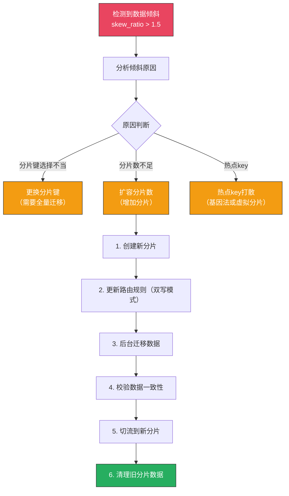

**再平衡期间的注意事项：**
- 再平衡期间写入延迟会短暂上升，建议在低峰期（凌晨2-5点）执行
- 采用渐进式迁移：先迁移20%数据观察稳定性，再继续
- 保持回滚能力：迁移过程中随时可以切回旧分片
- 监控迁移进度：实时报告迁移速度、剩余时间、错误率

### 10.4 告警策略配置

```yaml
# 分库分表告警规则示例（Prometheus AlertManager格式）
groups:
  - name: sharding_alerts
    rules:
      # 数据倾斜告警
      - alert: ShardDataSkew
        expr: |
          max(mysql_table_rows{table=~"order_.*"}) 
          / min(mysql_table_rows{table=~"order_.*"}) > 1.5
        for: 1h
        labels:
          severity: warning
        annotations:
          summary: "分片数据倾斜"
          description: "订单表数据倾斜系数 {{ $value }}，超过阈值1.5"
      
      # 单分片慢查询过多
      - alert: ShardSlowQuerySpike
        expr: |
          rate(mysql_slow_queries_total[5m]) > 10
        for: 10m
        labels:
          severity: critical
        annotations:
          summary: "分片慢查询激增"
          description: "分片 {{ $labels.instance }} 慢查询速率 {{ $value }}/s"
      
      # 分片连接数使用率过高
      - alert: ShardConnectionPressure
        expr: |
          mysql_threads_connected / mysql_max_connections > 0.85
        for: 5m
        labels:
          severity: warning
        annotations:
          summary: "分片连接数压力"
          description: "分片 {{ $labels.instance }} 连接数使用率 {{ $value | humanizePercentage }}"
      
      # Canal同步延迟
      - alert: CanalSyncLag
        expr: canal_sync_lag_seconds > 30
        for: 5m
        labels:
          severity: critical
        annotations:
          summary: "Canal同步延迟过高"
          description: "Canal同步延迟 {{ $value }}秒，可能导致数据不一致"
```

***

## 十一、替代方案：NewSQL

如果团队技术栈允许，NewSQL数据库可以从从根本上避免分库分表的复杂性。

### 11.1 NewSQL 全景对比

| NewSQL | 兼容性 | 核心特性 | 运维复杂度 | 适用场景 | 社区成熟度 |
|--------|--------|---------|-----------|---------|-----------|
| TiDB | MySQL | 自动分片、HTAP、在线DDL | 中 | 替换MySQL分库分表 | ⭐⭐⭐⭐⭐ |
| CockroachDB | PostgreSQL | 强一致、全球分布式 | 高 | 全球多活部署 | ⭐⭐⭐⭐ |
| OceanBase | MySQL/Oracle | 金融级、强一致、高压缩 | 高 | 金融核心系统 | ⭐⭐⭐⭐ |
| TDSQL | MySQL | 腾讯出品、企业级 | 中高 | 大规模在线业务 | ⭐⭐⭐ |
| YugabyteDB | PostgreSQL | 全球分布式、自动分片 | 中 | 跨区域部署 | ⭐⭐⭐ |

### 11.2 TiDB：MySQL分库分表的头号替代者

TiDB通过Raft协议实现多副本强一致，自动将数据分散到多个TiKV节点，应用代码无需感知分片的存在。

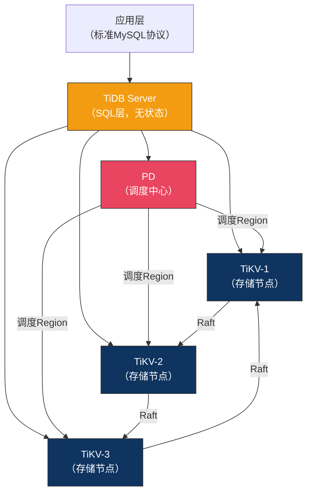

```sql
-- TiDB使用体验与MySQL完全一致
CREATE TABLE orders (
    order_id    BIGINT AUTO_RANDOM PRIMARY KEY,  -- TiDB推荐：AUTO_RANDOM替代自增ID
    user_id     BIGINT NOT NULL,
    total_amount DECIMAL(12,2),
    status      TINYINT,
    created_at  DATETIME DEFAULT CURRENT_TIMESTAMP,
    INDEX idx_user_id (user_id)
) ENGINE=InnoDB;

-- 无需分片键！TiDB自动将数据分散到TiKV节点
INSERT INTO orders (user_id, total_amount, status) VALUES (12345, 99.99, 1);

-- 跨节点JOIN也是透明的
SELECT u.username, COUNT(*) as order_count
FROM users u JOIN orders o ON u.user_id = o.user_id
GROUP BY u.username
ORDER BY order_count DESC
LIMIT 10;
```

**NewSQL的核心优势：**
- 自动分片 + 分布式事务 + SQL兼容，让业务代码无需感知分片的存在
- 在线DDL、在线扩缩容，运维体验远优于手动分库分表
- 强一致性（Raft协议），无需处理最终一致性的复杂逻辑

**NewSQL的局限性：**
- 运维复杂度高：TiDB至少需要3个TiKV节点 + 1个PD + 1个TiDB Server
- 生态工具不如MySQL成熟：监控、备份、迁移工具都在追赶中
- 小团队驾驭难度大：需要专业的TiDB运维知识
- 成本较高：相同数据量下，NewSQL的硬件成本通常是MySQL分库分表的2~3倍

### 11.3 技术选型决策建议

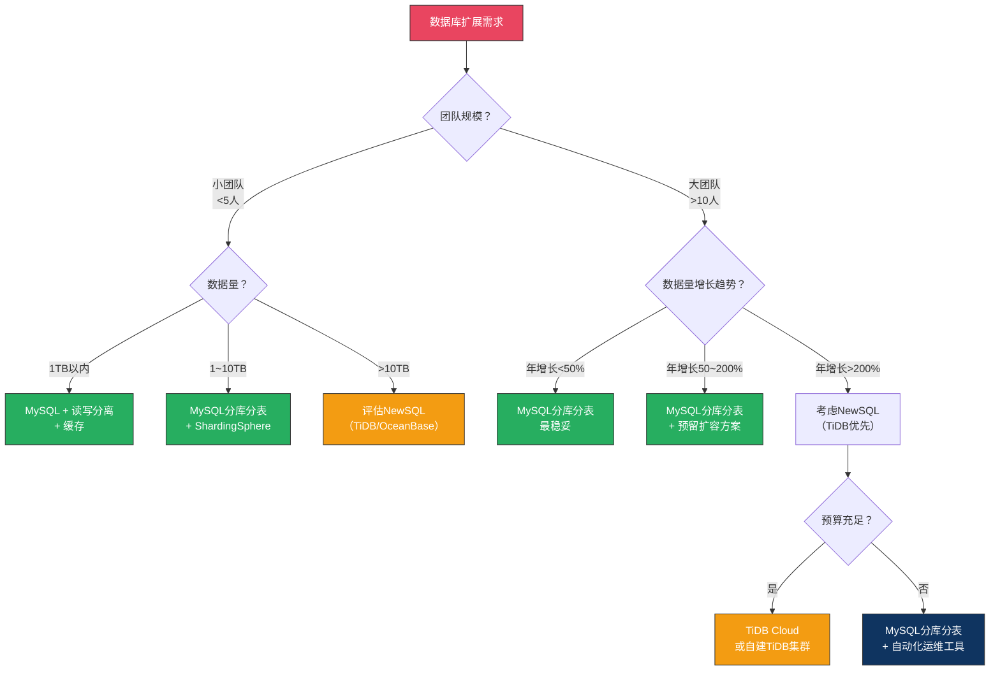

**分库分表 vs NewSQL 最终对比：**

| 维度 | MySQL分库分表（ShardingSphere） | NewSQL（TiDB） |
|------|-------------------------------|---------------|
| 学习成本 | 中（需理解分片概念） | 低（MySQL兼容） |
| 运维成本 | 高（手动管理分片、迁移） | 中（自动化运维） |
| 硬件成本 | 低（复用现有MySQL） | 高（多副本存储） |
| 扩展能力 | 手动扩容，代价高 | 自动扩容，在线完成 |
| 事务支持 | 需自行处理分布式事务 | 原生分布式事务 |
| 生态成熟度 | 极高（MySQL生态） | 成长中 |
| 社区支持 | 极高 | 高（PingCAP主导） |
| 适用数据量 | 10TB以内最佳 | 理论无上限 |

**决策建议：** 如果数据量在 10TB 以内且增长可控，成熟的 MySQL 分库分表方案（ShardingSphere）是更稳妥的选择。如果数据量持续爆发增长（每年翻倍以上）或有强一致性要求，可以考虑 TiDB 等 NewSQL 方案。对于金融级系统，OceanBase 在事务一致性和性能上有独特优势，但运维门槛更高。
