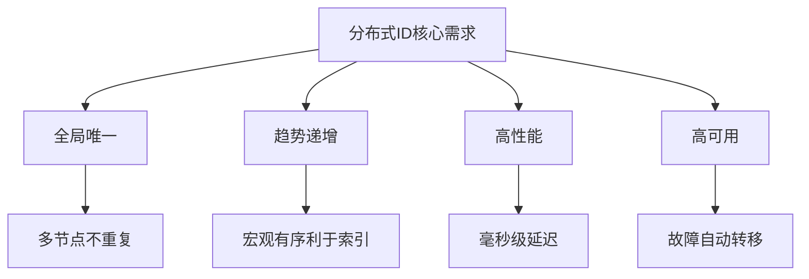
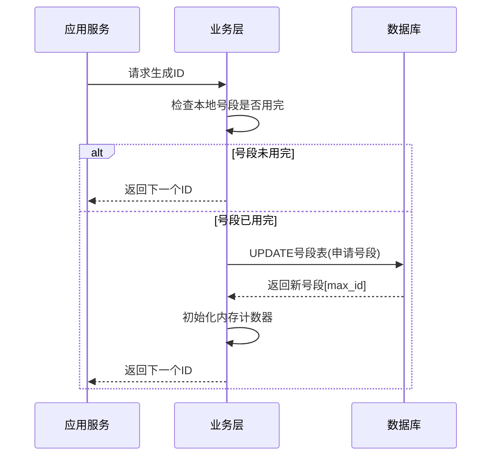
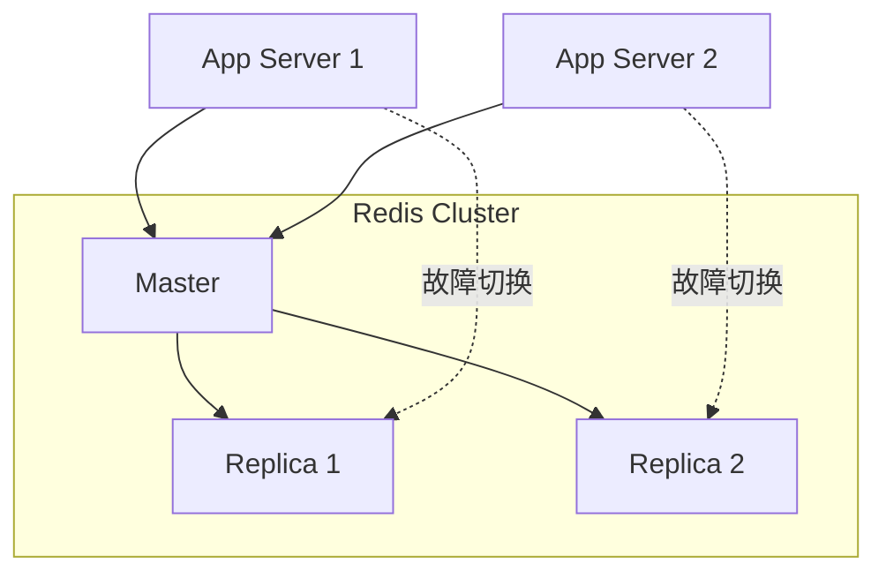
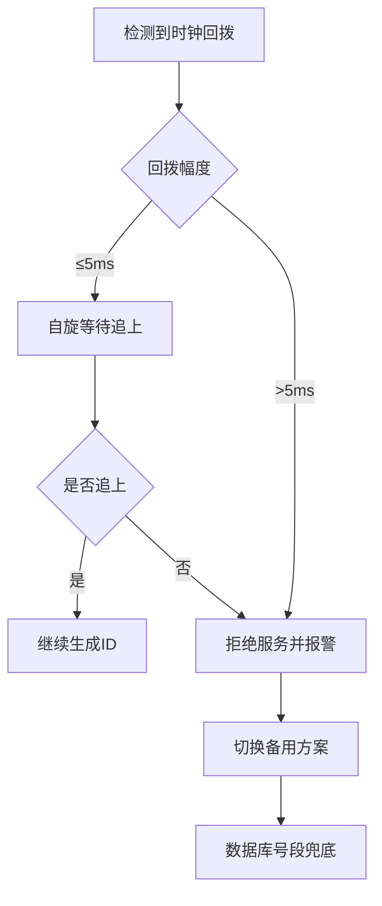
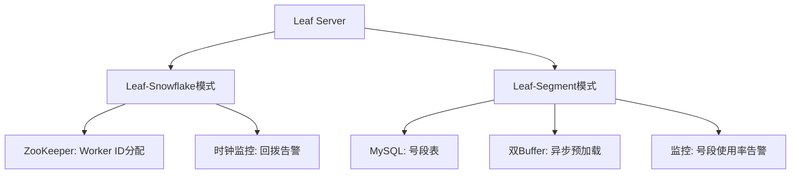
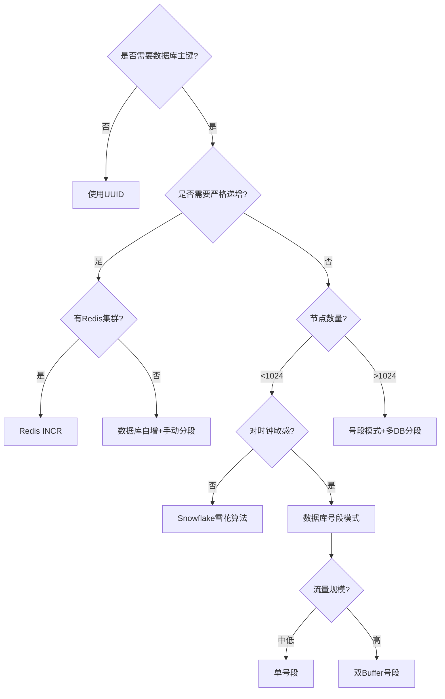

## 分布式ID生成

### 1. 为什么需要分布式ID

在单机数据库时代，MySQL 的 `AUTO_INCREMENT` 就能解决主键生成问题。但进入分库分表时代后，三个硬约束让自增ID彻底失效：

| 问题 | 具体表现 | 后果 |
|------|----------|------|
| **全局唯一性** | 多个分库各自自增，ID 必然冲突 | 数据合并时主键碰撞，业务报错 |
| **有序递增** | 各库自增值无法统一排序 | 无法按插入时间做范围查询和分页 |
| **高性能** | 每次写入都依赖数据库生成ID | 数据库成为写入瓶颈，可用性下降 |

分布式ID生成方案的设计目标，可以用四个词概括：**全局唯一、趋势递增、高性能、高可用**。

#### 1.1 全局唯一性

同一时刻、不同节点生成的ID绝不重复。这是最基础的要求，一旦违反会导致数据合并冲突、索引错乱等严重问题。

#### 1.2 趋势递增

完全单调递增在分布式环境下几乎不可能做到（代价太高），但"趋势递增"是合理的折中。趋势递增意味着ID在宏观上随时间增长，有利于数据库索引的顺序写入，减少B+树页分裂，提升写入性能。

#### 1.3 高性能

ID生成本身不能成为业务写入的瓶颈。理想方案应该支持每秒10万+的ID生成能力，且单次生成延迟在毫秒级以内。

#### 1.4 高可用

ID生成服务必须具备容错能力。即使部分节点宕机，ID生成也不能中断——这是业务的基础设施级依赖。



### 2. 六大主流方案全景对比

| 方案 | 唯一性 | 有序性 | 性能 | 可用性 | 依赖外部组件 | 适用场景 |
|------|--------|--------|------|--------|-------------|----------|
| UUID | 全局唯一 | 完全无序 | 极高 | 无依赖 | 无 | 日志追踪、非索引字段 |
| 数据库号段模式 | 全局唯一 | 趋势递增 | 高 | 依赖DB高可用 | MySQL | 中小规模业务 |
| Redis INCR | 全局唯一 | 严格递增 | 极高 | 依赖Redis集群 | Redis | 需要严格有序的场景 |
| Snowflake雪花算法 | 全局唯一 | 趋势递增 | 极高 | 无依赖 | 时钟 | 通用场景，最广泛使用 |
| Leaf（美团） | 全局唯一 | 趋势递增 | 极高 | 高 | ZooKeeper | 大规模互联网业务 |
| 时钟回拨处理型 | 全局唯一 | 趋势递增 | 极高 | 高 | 可选 | 对时钟敏感的场景 |

### 3. 方案一：UUID

#### 3.1 基本原理

UUID（Universally Unique Identifier）是128位的全局唯一标识符，由时间戳、MAC地址、随机数等组合生成。最常用的是UUID v4（随机生成）和UUID v1（基于时间戳）。

```python
import uuid

# UUID v4：随机生成（最常用）
id_v4 = uuid.uuid4()
print(id_v4)  # 550e8400-e29b-41d4-a716-446655440000

# UUID v1：基于时间戳
id_v1 = uuid.uuid1()
print(id_v1)  # 包含时间戳信息，可排序

# 去掉横线，缩短长度
short_id = uuid.uuid4().hex
print(short_id)  # 550e8400e29b41d4a716446655440000（32字符）
```

#### 3.2 核心问题

UUID 作为数据库主键存在严重缺陷：

| 问题 | 原因 | 影响 |
|------|------|------|
| **无序性** | UUID v4 完全随机 | B+树频繁页分裂，写入性能下降40%-60% |
| **太长** | 36字符（含横线）或32字符（hex） | 占用大量索引空间，内存中能缓存的索引页更少 |
| **不可读** | 无业务含义 | 排查问题时无法直观判断来源和时间 |
| **无法排序** | 不含时间信息 | 无法做时间范围查询 |

#### 3.3 适用场景

UUID 并非一无是处，在以下场景它是最佳选择：
- 非主键的唯一标识字段（如订单流水号、追踪ID）
- 分布式文件系统的对象命名
- 不需要排序的场景
- 客户端生成ID（不依赖服务端）

### 4. 方案二：数据库号段模式

#### 4.1 核心思想

从数据库批量申请一段连续的ID（号段），在内存中逐个分配。用完后再申请下一段。这样将每次写入的ID生成转化为批量申请，数据库访问频率大幅降低。

#### 4.2 实现架构



#### 4.3 数据库表设计

```sql
CREATE TABLE `id_generator` (
    `id`           BIGINT       NOT NULL AUTO_INCREMENT,
    `biz_type`     VARCHAR(64)  NOT NULL COMMENT '业务类型',
    `current_max`  BIGINT       NOT NULL DEFAULT 1 COMMENT '当前已分配的最大ID',
    `step`         INT          NOT NULL DEFAULT 1000 COMMENT '每次申请的号段大小',
    `description`  VARCHAR(255) DEFAULT NULL COMMENT '业务描述',
    `update_time`  TIMESTAMP    DEFAULT CURRENT_TIMESTAMP ON UPDATE CURRENT_TIMESTAMP,
    PRIMARY KEY (`id`),
    UNIQUE KEY `uk_biz_type` (`biz_type`)
) ENGINE=InnoDB DEFAULT CHARSET=utf8mb4 COMMENT='分布式ID号段表';

-- 初始化业务类型
INSERT INTO id_generator (biz_type, current_max, step, description)
VALUES ('order', 1000, 1000, '订单ID'),
       ('user', 10000, 500, '用户ID');
```

#### 4.4 核心代码实现

```java
public class SegmentIdGenerator {
    private final AtomicLong currentId;
    private final int step;
    private final String bizType;

    public SegmentIdGenerator(String bizType, int step) {
        this.bizType = bizType;
        this.step = step;
        this.currentId = new AtomicLong(0);
    }

    /**
     * 获取下一个ID，号段用尽时自动从数据库申请新号段
     */
    public synchronized long nextId() {
        // 当前号段是否用完（预留10%做缓冲，提前申请）
        long remaining = step - (currentId.get() % step);
        if (remaining <= step * 0.1) {
            refreshSegment();
        }
        return currentId.incrementAndGet();
    }

    /**
     * 从数据库申请新号段
     */
    private void refreshSegment() {
        // 原子更新：UPDATE id_generator SET current_max = current_max + step WHERE biz_type = ?
        long newMax = dao.updateAndGetMax(bizType, step);
        currentId.set(newMax);
    }
}
```

#### 4.5 优化：双Buffer预加载

双Buffer是在号段消耗到一定比例时，异步预加载下一段，消除号段切换时的数据库查询延迟：

```java
public class DualBufferIdGenerator {
    private final AtomicLong currentId;
    private volatile Segment currentSegment;
    private volatile Segment nextSegment;  // 预加载的下一段

    public long nextId() {
        long remaining = currentSegment.getRemainder();
        // 剩余10%时触发异步预加载
        if (remaining < currentSegment.getTotal() * 0.1 &amp;&amp; nextSegment == null) {
            asyncLoadNextSegment();
        }
        // 剩余0%时切换到预加载段
        if (remaining == 0) {
            currentSegment = nextSegment;
            nextSegment = null;
        }
        return currentId.incrementAndGet();
    }
}
```

#### 4.6 优缺点分析

| 维度 | 评价 |
|------|------|
| **优点** | 实现简单，无需额外中间件；ID趋势递增，对数据库索引友好；性能取决于号段大小，万级QPS轻松支撑 |
| **缺点** | 依赖数据库可用性（可通过主从双写缓解）；号段大小需要根据业务流量调优；服务重启时号段会浪费 |

### 5. 方案三：Redis INCR

#### 5.1 基本原理

利用 Redis 的 `INCR` 或 `INCRBY` 命令的原子性，天然保证ID的全局唯一和严格递增。

```bash
# 初始化计数器
SET id:order 1000

# 生成下一个ID（原子操作）
INCR id:order
# 返回: 1001

# 批量获取100个ID
INCRBY id:order 100
# 返回: 1101（1001~1101这100个ID被分配）
```

#### 5.2 优化：批量获取减少网络往返

```python
import redis
import threading

class RedisIdGenerator:
    def __init__(self, redis_client, key, batch_size=1000):
        self.r = redis_client
        self.key = key
        self.batch_size = batch_size
        self.local_ids = []
        self.lock = threading.Lock()
        self.current = 0

    def next_id(self):
        with self.lock:
            if self.current >= len(self.local_ids):
                # 一次性从Redis获取一批ID
                new_max = self.r.incrby(self.key, self.batch_size)
                start = new_max - self.batch_size + 1
                self.local_ids = list(range(start, new_max + 1))
                self.current = 0
            result = self.local_ids[self.current]
            self.current += 1
            return result

# 使用
r = redis.Redis(host='localhost', port=6379)
gen = RedisIdGenerator(r, 'id:order', batch_size=10000)
print(gen.next_id())  # 1001
```

#### 5.3 高可用方案



生产环境建议：
- 使用 Redis Sentinel 或 Redis Cluster 保证高可用
- 开启 AOF 持久化（appendfsync everysec），防止重启后ID回退
- 用 `INCRBY` 批量获取减少网络开销，配合本地缓存

#### 5.4 优缺点

| 维度 | 评价 |
|------|------|
| **优点** | 严格单调递增；性能极高（10万+ QPS）；实现简单 |
| **缺点** | 依赖Redis高可用；Redis单线程可能成为极端场景瓶颈；重启后需确保数据持久化不丢失 |

### 6. 方案四：Snowflake雪花算法（重点）

#### 6.1 算法背景

Twitter 在2010年开源的 Snowflake 算法，是目前工业界使用最广泛的分布式ID方案。它的核心思想是用一个64位整数编码**时间戳 + 机器标识 + 序列号**，在不依赖任何外部存储的情况下生成全局唯一ID。

#### 6.2 位分配

 0 | 41位时间戳       | 10位机器ID  | 12位序列号
 0 | 00000000 0000... | 000000 0000 | 00000000 0000

| 字段 | 位数 | 说明 | 溢出后行为 |
|------|------|------|-----------|
| 符号位 | 1 bit | 固定为0（正数） | - |
| 时间戳 | 41 bit | 毫秒级，相对自定义纪元偏移 | 69年后溢出 |
| 机器ID | 10 bit | 支持1024个节点 | 用完后需扩展位数或用其他方案 |
| 序列号 | 12 bit | 毫秒内自增，最多4096个ID/毫秒 | 1ms内超过4096个则等待下一毫秒 |

**关键参数计算**：

单机每秒最大ID数 = 4096（序列号上限）/ 1ms（时间精度）= 409.6万 QPS
时间戳可用年限 = 2^41 / (365.25 * 24 * 3600 * 1000) ≈ 69.7年
节点总数上限 = 2^10 = 1024个节点

#### 6.3 Java完整实现

```java
public class SnowflakeIdGenerator {
    // 起始时间戳 (2024-01-01 00:00:00 UTC)
    private final long EPOCH = 1704067200000L;

    // 各部分位数
    private final long WORKER_ID_BITS = 5L;
    private final long DATACENTER_ID_BITS = 5L;
    private final long SEQUENCE_BITS = 12L;

    // 最大值
    private final long MAX_WORKER_ID = ~(-1L << WORKER_ID_BITS);     // 31
    private final long MAX_DATACENTER_ID = ~(-1L << DATACENTER_ID_BITS); // 31
    private final long MAX_SEQUENCE = ~(-1L << SEQUENCE_BITS);       // 4095

    // 左移位数
    private final long WORKER_ID_SHIFT = SEQUENCE_BITS;               // 12
    private final long DATACENTER_ID_SHIFT = SEQUENCE_BITS + WORKER_ID_BITS; // 17
    private final long TIMESTAMP_SHIFT = SEQUENCE_BITS + WORKER_ID_BITS + DATACENTER_ID_BITS; // 22

    private final long workerId;
    private final long datacenterId;
    private long sequence = 0L;
    private long lastTimestamp = -1L;

    public SnowflakeIdGenerator(long workerId, long datacenterId) {
        if (workerId > MAX_WORKER_ID || workerId < 0) {
            throw new IllegalArgumentException("Worker ID 超出范围: " + workerId);
        }
        if (datacenterId > MAX_DATACENTER_ID || datacenterId < 0) {
            throw new IllegalArgumentException("Datacenter ID 超出范围: " + datacenterId);
        }
        this.workerId = workerId;
        this.datacenterId = datacenterId;
    }

    public synchronized long nextId() {
        long timestamp = currentTimeMillis();

        // 时钟回拨检测
        if (timestamp < lastTimestamp) {
            long offset = lastTimestamp - timestamp;
            if (offset <= 5) {
                // 回拨5ms以内，等待追上
                try {
                    Thread.sleep(offset << 1);
                } catch (InterruptedException e) {
                    Thread.currentThread().interrupt();
                }
                timestamp = currentTimeMillis();
                if (timestamp < lastTimestamp) {
                    throw new RuntimeException("时钟回拨超过容忍范围，拒绝生成ID");
                }
            } else {
                throw new RuntimeException("时钟回拨超过容忍范围: " + offset + "ms");
            }
        }

        // 同一毫秒内序列号自增
        if (timestamp == lastTimestamp) {
            sequence = (sequence + 1) &amp; MAX_SEQUENCE;
            if (sequence == 0) {
                // 序列号溢出，等待下一毫秒
                timestamp = waitNextMillis(lastTimestamp);
            }
        } else {
            // 不同毫秒，序列号重置
            sequence = 0L;
        }

        lastTimestamp = timestamp;

        return ((timestamp - EPOCH) << TIMESTAMP_SHIFT)
                | (datacenterId << DATACENTER_ID_SHIFT)
                | (workerId << WORKER_ID_SHIFT)
                | sequence;
    }

    private long waitNextMillis(long lastTs) {
        long ts = currentTimeMillis();
        while (ts <= lastTs) {
            ts = currentTimeMillis();
        }
        return ts;
    }

    private long currentTimeMillis() {
        return System.currentTimeMillis();
    }
}
```

#### 6.4 时钟回拨问题及解决方案

时钟回拨是雪花算法最大的隐患。当NTP时间同步、闰秒调整等场景发生时，系统时钟可能往回跳，导致ID重复。



常见解决方案汇总：

| 策略 | 原理 | 优缺点 |
|------|------|--------|
| **等待追上** | 自旋等待直到时钟追上lastTimestamp | 简单，但回拨大时会阻塞 |
| **预分配buffer** | 本地缓存一批预生成的ID | 不怕回拨，但ID可能不连续 |
| **扩展位记录回拨次数** | 用13位中的部分位记录回拨次数 | 可容忍多次小回拨，逻辑复杂 |
| **双Buffer + 数据库兜底** | 正常用Snowflake，回拨时降级到号段模式 | 高可用但实现复杂 |

#### 6.5 机器ID分配策略

1024个机器ID的分配方式直接影响运维复杂度：

| 方案 | 适用场景 | 实现方式 |
|------|----------|----------|
| **手动配置** | 节点数少且固定 | 启动参数或配置文件指定 |
| **数据库自增** | 节点频繁变化 | 从DB申请唯一workerId |
| **ZooKeeper分配** | 需要中心化管理 | 创建临时顺序节点获取ID |
| **K8s环境** | 容器化部署 | 从StatefulSet序号或Pod IP哈希获取 |
| **IP/MAC映射** | 物理机部署 | 用IP末8位或MAC地址哈希 |

### 7. 方案五：美团Leaf

#### 7.1 设计思路

美团的 Leaf 系统结合了号段模式和Snowflake的优势，提供两种模式：

**Leaf-Snowflake**：改进版雪花算法，使用ZooKeeper管理Worker ID，并增加时钟回拨监控。

**Leaf-Segment**：改进版号段模式，使用双Buffer预加载，并引入监控告警。



#### 7.2 Leaf-Segment 核心改进

与基础号段模式相比，Leaf 的关键优化：

- **双Buffer**：消除号段切换延迟（已详述于4.5节）
- **号段耗尽自动告警**：当号段使用率超过阈值时触发运维告警
- **号段大小动态调整**：根据业务流量自动调整步长（step），流量大时增加步长，流量小时减小步长
- **号段浪费最小化**：通过百分比阈值提前触发加载，减少因服务重启导致的号段浪费

#### 7.3 Leaf-Snowflake 对ZooKeeper的依赖

Leaf-Snowflake 使用 ZooKeeper 的临时顺序节点来分配Worker ID：

```java
// 启动时从ZooKeeper获取Worker ID
public long getWorkerId() {
    String path = zkClient.createEphemeralSequential(
        "/leaf/snowflake/worker-", "data");
    // 路径类似 /leaf/snowflake/worker-0000000000
    // 序号即为Worker ID
    return Long.parseLong(path.split("-")[1]);
}
```

ZooKeeper宕机时的降级策略：Leaf使用本地缓存的Worker ID启动，同时记录告警日志。

### 8. 方案六：基于数据库的号段模式变体

#### 8.1 美团Leaf-Segment的号段表

```sql
CREATE TABLE `leaf_alloc` (
    `biz_tag`      VARCHAR(128) NOT NULL COMMENT '业务标识',
    `max_id`       BIGINT       NOT NULL COMMENT '当前已分配的最大ID',
    `step`         INT          NOT NULL COMMENT '号段步长',
    `description`  VARCHAR(256) DEFAULT NULL,
    `update_time`  TIMESTAMP    DEFAULT CURRENT_TIMESTAMP ON UPDATE CURRENT_TIMESTAMP,
    PRIMARY KEY (`biz_tag`)
) ENGINE=InnoDB DEFAULT CHARSET=utf8mb4;
```

#### 8.2 号段模式的核心SQL

```sql
-- 原子更新号段（关键！）
UPDATE leaf_alloc
SET max_id = max_id + step,
    update_time = NOW()
WHERE biz_tag = #{bizTag};

-- 查询当前最大值
SELECT max_id FROM leaf_alloc WHERE biz_tag = #{bizTag};
```

这两条SQL的执行顺序很关键：先 `UPDATE`（原子自增），再 `SELECT`（取回新值）。这样即使两个实例同时请求，也不会分配到同一号段。

### 9. 方案选型决策树



#### 9.1 场景匹配总结

| 场景 | 推荐方案 | 理由 |
|------|----------|------|
| 个人项目/小团队 | UUID 或 Snowflake | 简单，无外部依赖 |
| 中等规模电商 | Snowflake | 性能高，趋势递增，索引友好 |
| 大规模互联网 | Leaf（号段+Snowflake双模式） | 经过美团大规模验证 |
| 需要严格递增 | Redis INCR | 严格单调递增 |
| 数据库分片ID | Snowflake | 每个分片分配不同Worker ID |
| 金融交易流水号 | Snowflake + 业务前缀 | 唯一性+可读性+可追溯 |

### 10. 分库分表场景下的ID设计实践

#### 10.1 分库分表ID的特殊要求

在分库分表架构中，ID不仅要全局唯一，还要考虑分片路由：

推荐ID结构（以Snowflake为基础，加入业务编码）：

| 业务类型 | 时间戳 | 分片键 | 序列号 |
| 2 bit   | 41 bit | 8 bit | 12 bit |

分片键字段可以用来路由到特定分片，提高查询效率

#### 10.2 ID中嵌入分片信息

```java
// 从Snowflake ID中提取分片信息
public long extractShardId(long id) {
    // 假设第23-30位存储分片键
    long shardMask = 0xFFL << 22;
    return (id &amp; shardMask) >> 22;
}

// 从ID中提取时间戳（用于范围查询）
public long extractTimestamp(long id) {
    return (id >> 22) + EPOCH;
}
```

#### 10.3 典型电商ID设计

```sql
-- 一个完整电商系统的ID分配
-- 1. 订单ID：Snowflake生成
-- 2. 支付流水号：Snowflake + 业务前缀 "PAY" + 日期
-- 3. 分库分表路由：订单ID中嵌入用户ID哈希
-- 4. 消息追踪ID：UUID v4
-- 5. 日志追踪ID：UUID v4

-- ID与分片的映射关系
-- 分片策略：user_id % 16
-- ID中嵌入的user_id片段可以直接用于路由，无需额外查询
```

### 11. 常见误区与最佳实践

#### 11.1 常见误区

| 误区 | 正确做法 | 原因 |
|------|----------|------|
| UUID直接做数据库主键 | 使用Snowflake或号段模式 | 无序性导致写入性能下降40%-60% |
| 雪花算法不处理时钟回拨 | 必须实现回拨检测和降级 | NTP同步可能导致ID重复 |
| 机器ID手动管理 | 使用ZooKeeper或数据库自动分配 | 节点变更时手动分配容易出错 |
| 号段大小设为1 | 号段设为1000-10000 | 号段为1退化为数据库自增 |
| ID生成器不做监控 | 监控生成延迟、号段使用率、时钟偏差 | 基础设施需要可观测性 |

#### 11.2 监控指标

# Snowflake ID生成器必须监控的指标
- id_generation_latency_ms        # ID生成延迟（P99应<1ms）
- id_generation_qps                # 每秒ID生成量
- clock_offset_ms                  # 时钟偏差（应<1ms）
- sequence_overflow_count          # 序列号溢出次数（应接近0）
- id_reuse_detected                # ID重复检测（应为0）

# 号段模式额外指标
- segment_usage_ratio              # 号段使用率（触发加载阈值通常为80%）
- segment_load_latency_ms          # 号段加载延迟（双Buffer下应为0）
- segment_waste_count              # 号段浪费次数

### 12. 实际案例：美团Leaf的生产实践

美团Leaf在生产环境的关键数据：
- 日均生成ID超过**100亿**
- 支持超过**1000个**业务类型
- ID生成延迟P99 **<1ms**
- 号段加载延迟（双Buffer）**约等于0**

生产环境部署要点：
1. Leaf-Snowflake模式使用3节点ZooKeeper集群
2. Leaf-Segment模式使用MySQL主从架构，从库只读
3. 号段大小初始值1000，根据业务流量自动调整（范围500-10000）
4. 双Buffer在号段使用到80%时触发异步加载
5. 全链路监控：ID生成延迟、号段使用率、时钟偏差实时告警

### 13. 本章小结

分布式ID生成是分库分表架构的基础设施级组件。核心要点：

1. **Snowflake是通用首选**：无外部依赖、高性能、趋势递增，适合绝大多数场景
2. **号段模式是可靠备选**：实现简单，配合双Buffer性能也很高
3. **UUID仅用于非索引标识**：不要做数据库主键
4. **时钟回拨必须处理**：这是雪花算法的阿喀琉斯之踵
5. **监控不可少**：ID生成器是基础设施，必须可观测、可告警

选择方案时，优先考虑**团队熟悉度**和**运维复杂度**。技术选型没有银弹，适合自己的才是最好的。
