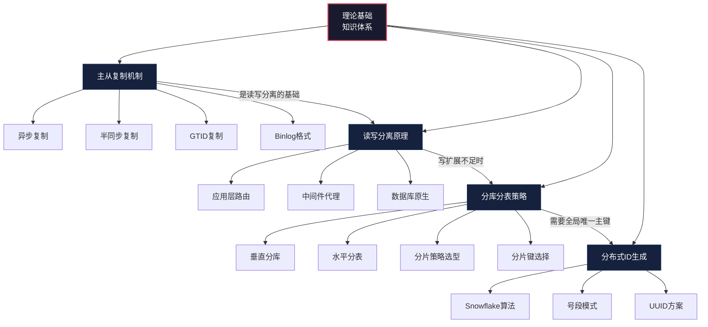
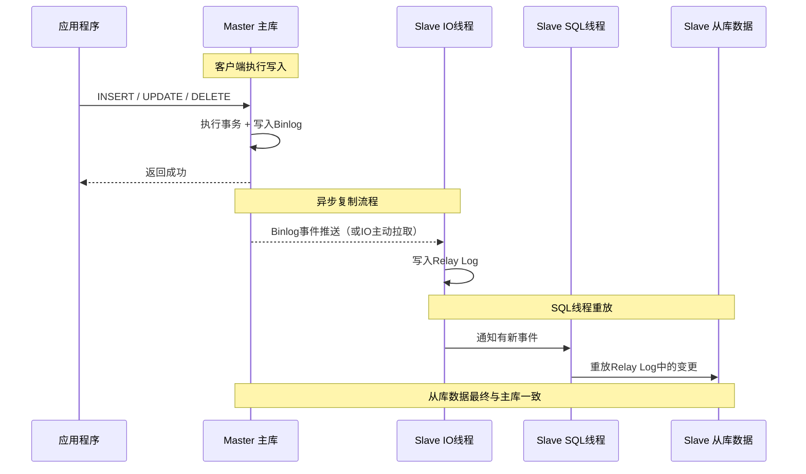
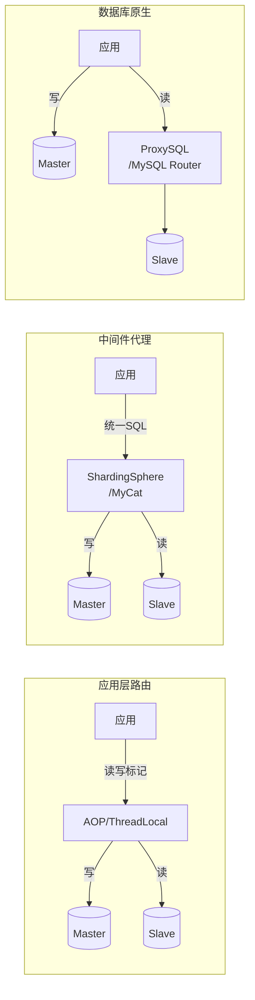

# 51.1 理论基础：读写分离与分库分表的核心原理

当应用系统的数据量和并发量持续增长，单台数据库服务器的承载能力终将触及天花板。面对"数据库扛不住了"这一现实问题，业界走出了两条核心技术路径：**读写分离**和**分库分表**。前者将读流量从主库分散到从库，后者将数据本身分散到多个数据库实例。两条路径的理论根基都建立在MySQL的主从复制机制之上。

本节从最底层的复制协议出发，逐层构建完整的知识体系，帮助读者理解"为什么要这样做"和"这样做意味着什么"。



***

## 为什么需要读写分离与分库分表

在讨论具体技术之前，先明确一个根本问题：数据库的性能瓶颈究竟在哪里？

数据库的性能瓶颈通常来自三个维度：

- **存储容量瓶颈**：单表数据量超过5000万行后，B+树索引层级加深，每次查询的磁盘IO次数增加，查询性能显著下降。InnoDB默认页大小16KB，索引层数从3层增长到4层意味着每次查询多一次磁盘随机读，这对HDD来说延迟可能从毫秒级跳到十几毫秒
- **读吞吐瓶颈**：当QPS超过单机MySQL的承载上限（通常在数千到数万QPS，取决于查询复杂度），读请求排队等待，响应时间飙升。MySQL的连接模型是单线程处理每个连接，虽然InnoDB引擎本身支持并发，但连接数和线程切换本身也有上限
- **写吞吐瓶颈**：高并发写入导致行锁竞争激烈、redo log刷盘频繁，InnoDB的写入吞吐量触及硬件IO带宽上限。当redo log的写入速度跟不上事务提交速度时，整个数据库的写入吞吐量会被IO瓶颈拖住

针对不同的瓶颈，需要不同的解决方案：

| 瓶颈类型 | 典型症状 | 首选方案 | 次选方案 |
|----------|---------|---------|---------|
| 存储容量 | 单表超过5000万行，索引维护成本高 | 分库分表 | 归档历史数据 |
| 读吞吐 | 数据库CPU高，大部分是SELECT查询 | 读写分离 + 缓存 | 分库分表 |
| 写吞吐 | 行锁等待严重，insert/update延迟大 | 分库分表（水平拆分写库） | 换用SSD、增大buffer pool |

**读写分离**解决的是读吞吐瓶颈——将读请求分散到多个从库上，减轻主库压力。**分库分表**解决的是存储容量和写吞吐瓶颈——将数据和写压力分散到多个数据库实例上。

两者并非互斥关系，而是递进关系：先读写分离，不够再分库分表。在实际架构演进中，绝大多数系统会经历"单库 → 读写分离 → 分库分表"的渐进过程。这种渐进式演进的好处在于：每一步都只解决当前最紧迫的瓶颈，避免过早引入不必要的复杂度。

***

## 一、主从复制机制

主从复制是整个读写分离与分库分表技术体系的基石。没有可靠的复制机制，就无法将数据同步到多个实例，读写分离也就无从谈起。

### 1.1 复制的基本原理

MySQL主从复制的本质是：**从库通过网络从主库获取数据变更日志（binlog），然后在本地重放这些变更，从而保持与主库的数据一致**。

整个复制过程涉及三个关键组件和两个线程：

**三个关键组件：**

- **Binlog（二进制日志）**：主库将所有数据变更以事件形式记录到binlog文件中。binlog是复制的数据源，也是数据恢复的基础。它以追加方式写入，不会修改已写入的内容，这保证了日志的完整性
- **Relay Log（中继日志）**：从库将从主库拉取的binlog事件暂存到relay log中，等待SQL线程重放。relay log的存在解耦了网络IO和本地重放两个过程
- **复制元数据**：从库维护的复制位点信息（传统模式下的binlog文件名+偏移量，或GTID模式下的事务ID集合），用于跟踪已同步到哪里。这个元数据是复制状态机的核心

**两个线程：**

- **IO线程**：负责从主库拉取binlog事件并写入relay log。IO线程是网络IO密集型操作，它的瓶颈主要在网络延迟和带宽上
- **SQL线程**：负责读取relay log中的事件并在本地执行重放。SQL线程是CPU和磁盘IO密集型操作，它的瓶颈主要在从库的磁盘IO和CPU处理能力上



理解这个流程至关重要，因为它揭示了两个核心约束：

1. **复制存在延迟**：从主库写入到从库重放完成之间，有一个时间差。这个延迟可能从毫秒级到分钟级不等，取决于网络状况、事务大小和从库性能
2. **复制不是强一致的**：在异步模式下，主库并不等待从库确认就返回客户端成功。如果主库宕机，未同步到从库的数据会丢失。即使是半同步模式，也只是保证至少一个从库收到了binlog，而不是保证从库已经重放完毕

### 1.2 三种复制模式

MySQL的复制模式经历了从简单到安全的演进，每种模式在数据安全性和写入性能之间做不同的权衡。

#### 异步复制（Asynchronous Replication）

异步复制是MySQL的默认模式。主库执行完事务并将binlog写入磁盘后，立即向客户端返回成功，不等待任何从库的确认。从库的IO线程在下一个轮询周期拉取新binlog并重放。

**工作流程：**
1. 客户端发送写入请求到主库
2. 主库执行事务，将变更写入binlog
3. 主库立即返回客户端"提交成功"
4. 从库IO线程在下一次轮询时拉取binlog
5. 从库SQL线程重放relay log

**优点：**
- 对主库性能无影响——主库不需要等待任何网络往返
- 从库故障不影响主库的可用性
- 实现简单，运维成本低

**缺点：**
- 主库宕机时，已提交但未同步到从库的事务会丢失
- 从库数据永远比主库"慢一点"
- 不适合对数据一致性要求严格的场景

**适用场景：** 日志类数据、报表统计、允许少量数据丢失的读扩展场景。

#### 半同步复制（Semi-Synchronous Replication）

半同步复制在异步复制的基础上增加了确认机制。主库在提交事务时，会等待至少一个从库确认已经接收到了binlog事件（注意：只是接收，不保证已重放），然后才返回客户端。

MySQL 5.7之前使用的是`AFTER_COMMIT`模式——主库在存储引擎提交之后等待从库确认。这存在一个"幻读"问题：如果在主库提交后、从库确认前主库宕机，另一个事务可能在主库上读到"不存在"的数据（因为前一个事务已提交但还没同步）。

MySQL 5.7引入了增强半同步复制（`AFTER_SYNC`模式）——主库在存储引擎提交之前等待从库确认，消除了上述幻读问题。

**AFTER_SYNC模式的工作流程：**
1. 客户端发送写入请求到主库
2. 主库将变更写入binlog
3. 主库等待至少一个从库确认收到binlog
4. 从库确认接收后，主库在存储引擎中提交事务
5. 主库返回客户端"提交成功"

**关键参数配置：**

```sql
-- 启用半同步复制
INSTALL PLUGIN rpl_semi_sync_master SONAME 'semisync_master.so';
INSTALL PLUGIN rpl_semi_sync_slave SONAME 'semisync_slave.so';

SET GLOBAL rpl_semi_sync_master_enabled = 1;
SET GLOBAL rpl_semi_sync_slave_enabled = 1;

-- 设置超时时间（毫秒），超时后自动降级为异步
SET GLOBAL rpl_semi_sync_master_timeout = 1000;

-- 设置至少需要多少个从库确认
SET GLOBAL rpl_semi_sync_master_wait_for_slave_count = 1;

-- 查看半同步复制状态
SHOW STATUS LIKE 'Rpl_semi_sync%';
```

**优点：**
- 比异步复制更安全——至少一个从库拥有该事务的binlog
- AFTER_SYNC模式消除了幻读问题
- 如果主库宕机，至少有一个从库拥有完整的数据

**缺点：**
- 写入延迟增加约1个网络RTT（往返时间）
- 如果所有从库都不可用或延迟过大，会降级为异步复制或阻塞主库
- 需要合理设置超时参数，避免主库被阻塞

**生产建议：** 推荐使用AFTER_SYNC模式。设置 `rpl_semi_sync_master_timeout` 为1000-3000ms，既能保证大部分事务的安全性，又不会因为偶发的网络抖动导致主库长时间阻塞。同时设置 `rpl_semi_sync_master_wait_for_slave_count = 1`，只要有一个从库确认即可，不需要等待所有从库。

#### 基于GTID的复制

GTID（Global Transaction Identifier，全局事务标识符）是MySQL 5.6引入的复制增强特性。每个事务在集群中都有一个全局唯一的GTID，格式为 `server_uuid:transaction_id`（如 `3E11FA47-71CA-11E1-9E33-C80AA9429562:23`）。

**GTID解决的核心问题：**

在传统复制模式下，主从切换需要手动确定从库应该从主库的哪个binlog文件、哪个偏移量开始复制。这个过程既复杂又容易出错——指定错误的位点可能导致数据不一致或数据丢失。

GTID让从库可以精确知道自己已经执行了哪些事务、还需要执行哪些事务。切换主库时，从库只需告诉新的主库"我已经执行了这些GTID的事务"，新主库自动找出未同步的事务并发送过来。

**GTID的配置方法：**

```ini
# my.cnf 全局配置（主从都需要）
[mysqld]
gtid_mode=ON
enforce_gtid_consistency=ON
log_bin=mysql-bin
binlog_format=ROW
```

```sql
-- 在从库上使用GTID建立主从关系
CHANGE MASTER TO
    MASTER_HOST='192.168.1.100',
    MASTER_USER='repl_user',
    MASTER_PASSWORD='repl_password',
    MASTER_AUTO_POSITION=1;  -- 关键：使用GTID自动定位

START SLAVE;

-- 验证GTID复制状态
SHOW SLAVE STATUS\G
-- 关注：Executed_Gtid_Set 和 Retrieved_Gtid_Set 两个字段
```

**GTID的核心优势：**

- **简化故障切换**：从库自动定位需要同步的事务，无需手动指定binlog位点
- **简化搭建流程**：`MASTER_AUTO_POSITION=1` 一行配置搞定
- **支持多源复制**：一个从库可以同时从多个主库复制，用于数据汇聚场景
- **方便数据一致性校验**：通过对比主从的GTID集合，可以精确判断数据差异

**GTID的限制：**

- 事务中不能包含临时表操作
- 不能使用 `CREATE TABLE ... SELECT` 语句
- 不支持在事务中同时更新事务性和非事务性存储引擎
- 启用GTID后无法从旧版本MySQL（不支持GTID的版本）复制

### 1.3 Binlog格式

Binlog记录了所有数据变更的事件。不同的格式在日志量、精确性和性能之间有不同的权衡。

#### 三种格式对比

| 格式 | 记录内容 | 日志量 | 复制精确性 | 非确定性函数 | 生产推荐 |
|------|---------|-------|-----------|-------------|---------|
| Statement | SQL语句原文 | 最小 | 低 | 可能导致主从不一致 | 不推荐 |
| Row | 每行变更前后的值 | 最大 | 高 | 完全一致 | **推荐** |
| Mixed | MySQL自动选择 | 中等 | 中等 | 自动切换到Row | 可选 |

**Statement格式的问题示例：**

```sql
-- 主库执行这条SQL，binlog记录的是这条SQL本身
UPDATE users SET login_time = NOW() WHERE id = 1;

-- 从库重放这条SQL时，NOW()返回的是从库本地时间
-- 如果主从存在时钟偏差或复制延迟，NOW()的值不同，导致数据不一致
```

除了NOW()，RAND()、UUID()等非确定性函数都会导致类似问题。甚至自定义函数如果依赖非确定性逻辑，也可能在主从之间产生不同结果。

**为什么Row格式是生产首选：**

- 精确记录每一行数据的变更，不存在非确定性函数的问题
- MySQL 5.7+默认使用Row格式
- Binlog订阅工具（如Canal、Debezium）需要Row格式才能精确解析变更内容
- 虽然日志量大，但在现代存储和网络条件下，这个开销完全可以接受

```sql
-- 查看当前binlog格式
SHOW VARIABLES LIKE 'binlog_format';

-- 修改binlog格式（需要SUPER权限，会触发所有从库重新同步）
SET GLOBAL binlog_format = 'ROW';

-- 查看binlog内容
SHOW BINARY LOGS;
SHOW BINLOG EVENTS IN 'mysql-bin.000001' LIMIT 20;

-- 使用mysqlbinlog工具查看Row格式的详细变更
-- mysqlbinlog --base64-output=DECODE-ROWS -v mysql-bin.000001
```

### 1.4 主从复制延迟

主从延迟是指从库的数据变更落后于主库的时间差。在生产环境中，主从延迟是读写分离面临的最大挑战。

**延迟的成因：**

| 延迟来源 | 原因 | 影响程度 |
|---------|------|---------|
| 网络延迟 | 主从之间网络带宽不足或跨机房部署 | 中 |
| 大事务 | 单个事务包含大量行操作（如批量更新10万行） | 高 |
| 从库性能不足 | 从库硬件配置低于主库 | 中 |
| SQL线程单线程重放 | MySQL 5.6之前只有单个SQL线程，无法并行重放 | 高 |
| 锁竞争 | 从库上的DML操作与SQL线程的重放操作产生行锁竞争 | 中 |

**MySQL并行复制的演进：**

MySQL的并行复制经历了三代演进：

- **MySQL 5.6：基于Schema的并行复制**——不同库的操作可以并行重放，但同一个库内的操作仍然是串行的。配置项为 `slave_parallel_type=DATABASE`
- **MySQL 5.7：基于逻辑时钟的并行复制**——引入 `slave_parallel_type=LOGICAL_CLOCK`，同一事务中的操作可以并行重放。通过在binlog中记录last_committed和sequence_number两个逻辑时间戳，SQL线程可以判断哪些事务之间没有依赖关系，可以安全地并行执行
- **MySQL 8.0：基于WriteSet的并行复制**——进一步引入WriteSet依赖追踪，只要两个事务没有写同一个行，就可以并行重放，大幅提高了并行度。配置项为 `slave_parallel_type=LOGICAL_CLOCK` + `transaction_write_set_extraction=XXHASH64`

```sql
-- 查看从库复制延迟
SHOW SLAVE STATUS\G
-- 关注 Seconds_Behind_Master 字段

-- 配置并行复制（MySQL 5.7+）
SET GLOBAL slave_parallel_workers = 4;  -- 并行重放线程数
SET GLOBAL slave_parallel_type = 'LOGICAL_CLOCK';

-- MySQL 8.0 增强并行复制
-- 在 my.cnf 中配置：
-- transaction_write_set_extraction = XXHASH64
-- slave_preserve_commit_order = ON  -- 保证提交顺序，避免自增ID乱序
```

**延迟对读写分离的影响：**

主从延迟意味着从库的数据比主库"旧"。在读写分离场景下，如果用户刚写入一条数据后立即读取，而读请求被路由到尚未同步完成的从库，就会看到旧数据甚至看不到刚写入的数据。这种"读不到自己刚写的数据"的体验是非常糟糕的。

在电商场景中，用户下单后跳转到订单列表页看不到刚下的订单；在社交场景中，用户发完帖子刷新后看不到自己的帖子——这些都是主从延迟导致的典型问题。处理这些问题的策略将在下一节详细展开。

***

## 二、读写分离原理

读写分离的核心思想很简单：**写操作走主库，读操作走从库**。但在实际实现中，路由决策、延迟处理、故障转移等问题都需要精心设计。

### 2.1 架构模式

读写分离有三种主流实现方式，各有优劣：



#### 方式一：应用层路由

在应用代码中通过注解或AOP切面手动标记读写类型，然后路由到对应的数据源。

```java
// 自定义注解
@Target({ElementType.METHOD})
@Retention(RetentionPolicy.RUNTIME)
public @interface ReadOnly {}

@Target({ElementType.METHOD})
@Retention(RetentionPolicy.RUNTIME)
public @interface Writable {}

// 动态数据源路由
public class DynamicDataSource extends AbstractRoutingDataSource {
    private static final ThreadLocal<String> HOLDER = new ThreadLocal<>();

    public static void markRead()  { HOLDER.set("slave"); }
    public static void markWrite() { HOLDER.set("master"); }
    public static void clear()     { HOLDER.remove(); }

    @Override
    protected Object determineCurrentLookupKey() {
        return HOLDER.get();
    }
}

// AOP切面自动切换
@Aspect
@Component
public class DataSourceAspect {
    @Before("@annotation(readOnly)")
    public void onReadOnly(JoinPoint jp) { DynamicDataSource.markRead(); }

    @Before("@annotation(writable)")
    public void onWritable(JoinPoint jp) { DynamicDataSource.markWrite(); }

    @After("@annotation(readOnly) || @annotation(writable)")
    public void after(JoinPoint jp) { DynamicDataSource.clear(); }
}
```

**优点：** 完全可控，可以针对每个方法精确设置路由策略；无额外网络跳转，延迟最低。

**缺点：** 侵入性高——每个读方法都需要加注解，遗漏会导致读走主库或写走从库；无法实现延迟感知等高级功能；事务方法内的读操作也需要特殊处理。

**适用场景：** 小型项目、团队对技术栈有强控制力的场景。

#### 方式二：中间件代理

通过ShardingSphere-JDBC或MyCat等中间件，在应用和数据库之间添加一个透明的代理层。应用只需连接中间件，中间件自动完成读写路由。

```yaml
# ShardingSphere-JDBC 读写分离配置
spring:
  shardingsphere:
    datasource:
      names: master,slave0,slave1
      master:
        type: com.zaxxer.hikari.HikariDataSource
        driver-class-name: com.mysql.cj.jdbc.Driver
        jdbc-url: jdbc:mysql://master-host:3306/db?useSSL=false
        username: root
        password: xxx
      slave0:
        type: com.zaxxer.hikari.HikariDataSource
        driver-class-name: com.mysql.cj.jdbc.Driver
        jdbc-url: jdbc:mysql://slave0-host:3306/db?useSSL=false
        username: root
        password: xxx
      slave1:
        type: com.zaxxer.hikari.HikariDataSource
        driver-class-name: com.mysql.cj.jdbc.Driver
        jdbc-url: jdbc:mysql://slave1-host:3306/db?useSSL=false
        username: root
        password: xxx
    rules:
      readwrite-splitting:
        data-sources:
          myds:
            write-data-source-name: master
            read-data-source-names: slave0,slave1
            load-balancer-name: round-robin
        load-balancers:
          round-robin:
            type: ROUND_ROBIN
```

**优点：** 对应用透明——不需要修改任何业务代码；内置负载均衡、延迟感知、故障转移等功能；支持读写分离+分库分表的组合使用。

**缺点：** 引入额外的网络跳转（中间件本身成为单点）；中间件本身需要高可用部署；排查问题时链路变长；中间件的SQL解析能力有限，复杂的动态SQL可能无法正确路由。

**适用场景：** 中大型项目、标准化的数据库访问层、需要同时使用读写分离和分库分表的场景。

#### 方式三：数据库原生方案

MySQL Router、ProxySQL等工具在数据库层面实现读写分离，应用只需连接到这些代理工具。

**ProxySQL配置示例：**

```sql
-- 定义后端MySQL服务器
INSERT INTO mysql_servers(hostgroup_id, hostname, port) VALUES (10, 'master-host', 3306);
INSERT INTO mysql_servers(hostgroup_id, hostname, port) VALUES (20, 'slave0-host', 3306);
INSERT INTO mysql_servers(hostgroup_id, hostname, port) VALUES (20, 'slave1-host', 3306);

-- 定义路由规则：写走hostgroup 10（主库），读走hostgroup 20（从库）
INSERT INTO mysql_query_rules(rule_id, active, match_pattern, destination_hostgroup)
VALUES (1, 1, '^SELECT.*FOR UPDATE$', 10),
       (2, 1, '^SELECT', 20);

LOAD MYSQL SERVERS TO RUNTIME;
LOAD MYSQL QUERY RULES TO RUNTIME;
SAVE MYSQL SERVERS TO DISK;
SAVE MYSQL QUERY RULES TO DISK;
```

**优点：** 应用完全无感知；ProxySQL支持查询缓存、连接池复用、实时权重调整等高级功能；性能开销极低；支持运行时动态修改配置，无需重启。

**缺点：** 功能相对基础，不支持分库分表；需要单独维护ProxySQL集群的高可用；对复杂SQL的解析能力有限。

### 2.2 三种方式对比

| 维度 | 应用层路由 | 中间件代理 | 数据库原生 |
|------|----------|----------|----------|
| 侵入性 | 高（需要改代码） | 低（对应用透明） | 极低 |
| 延迟感知 | 需自行实现 | 内置支持 | 支持（ProxySQL） |
| 负载均衡 | 需自行实现 | 内置支持 | 内置支持 |
| 故障转移 | 需自行实现 | 部分支持 | 支持 |
| 性能开销 | 最低 | 中（多一跳） | 低 |
| 运维复杂度 | 低 | 中 | 中 |
| 适用规模 | 小型 | 中大型 | 中型 |
| 分库分表支持 | 需额外实现 | 内置支持 | 不支持 |

### 2.3 读写分离的核心挑战：主从延迟

读写分离引入的最大问题是**主从数据不一致**。在异步或半同步复制下，从库的数据总是滞后于主库。以下介绍几种应对策略。

#### 策略一：关键读强制走主库

对于写后读（read-after-write）场景，强制将读请求路由到主库，确保能读到最新数据。

```java
@Service
public class OrderService {

    @Autowired private OrderMapper orderMapper;

    @Transactional
    public Order createOrder(OrderRequest req) {
        Order order = buildOrder(req);
        orderMapper.insert(order);
        // 创建后立即查询，强制走主库
        return getOrderFromMaster(order.getId());
    }

    public Order getOrderFromMaster(Long orderId) {
        try {
            DynamicDataSource.markWrite();  // 强制走主库
            return orderMapper.selectById(orderId);
        } finally {
            DynamicDataSource.clear();
        }
    }
}
```

**适用场景：** 写后读比例低的场景。如果大部分读操作都涉及写后读，强制走主库会让主库压力不减，失去了读写分离的意义。

#### 策略二：延迟监控 + 智能路由

实时监控每个从库的复制延迟，当延迟超过阈值时，自动将读请求路由到主库或延迟最低的从库。

```python
import time
import threading

class SmartReadRouter:
    """基于复制延迟的智能读路由"""

    def __init__(self, master, slaves, max_delay_ms=200):
        self.master = master
        self.slaves = slaves
        self.max_delay_ms = max_delay_ms
        self.delays = {}  # slave_id -> delay_ms
        self._start_monitor()

    def _start_monitor(self):
        """后台线程定期采集从库延迟"""
        def poll():
            while True:
                for slave in self.slaves:
                    try:
                        result = slave.execute("SHOW SLAVE STATUS")
                        seconds = result.get("Seconds_Behind_Master", None)
                        self.delays[slave.id] = (seconds or 999) * 1000
                    except Exception:
                        self.delays[slave.id] = float("inf")
                time.sleep(1)

        t = threading.Thread(target=poll, daemon=True)
        t.start()

    def route(self, sql, force_master=False):
        """路由读请求"""
        if force_master:
            return self.master.execute(sql)

        # 筛选延迟在阈值内的从库
        healthy = [
            s for s in self.slaves
            if self.delays.get(s.id, 999999) <= self.max_delay_ms
        ]

        if not healthy:
            # 所有从库延迟过高，降级到主库
            return self.master.execute(sql)

        # 选择延迟最低的从库
        best = min(healthy, key=lambda s: self.delays.get(s.id, 999999))
        return best.execute(sql)
```

**阈值设置的考量：** 200ms是常见的默认值，但需要根据业务容忍度调整。金融类业务可能需要50ms以内，而报表类业务可以接受1秒以上的延迟。

#### 策略三：版本号/时间戳校验

写入时记录一个逻辑版本号（如数据库更新时间戳），读取时对比从库数据的版本号是否满足要求。如果不满足，等待一小段时间重试或切换到主库。

这种策略的典型应用是**"先写后读"的一致性保证**：用户下单后跳转到订单详情页，前端在URL中携带写入时返回的时间戳，后端读取时检查从库数据的更新时间是否大于等于该时间戳，否则从主库读取。

```java
@Transactional
public Order createOrder(OrderRequest req) {
    Order order = buildOrder(req);
    orderMapper.insert(order);
    // 返回写入时间戳给前端
    order.setWriteTimestamp(System.currentTimeMillis());
    return order;
}

public Order getOrder(Long orderId, Long requiredTimestamp) {
    Order order = orderMapper.selectById(orderId);
    if (order == null || order.getUpdateTime() < requiredTimestamp) {
        // 从库数据尚未同步，强制从主库读取
        return getOrderFromMaster(orderId);
    }
    return order;
}
```

#### 策略对比总结

| 策略 | 实现复杂度 | 适用场景 | 对主库的影响 |
|------|-----------|---------|------------|
| 关键读强制走主库 | 低 | 写后读比例低 | 增加主库读压力 |
| 延迟监控+智能路由 | 中 | 通用场景 | 从库延迟高时回退到主库 |
| 版本号/时间戳校验 | 中 | 对一致性要求高 | 仅在从库延迟时增加主库压力 |

***

## 三、分库分表策略

当读写分离仍无法满足需求——单表数据量过大、写入吞吐不够、或存储容量不足时，就需要分库分表。分库分表是数据库层面的水平扩展手段，将数据分散到多个数据库实例上。

### 3.1 垂直分库

垂直分库是**按业务领域将不同的表拆分到不同的数据库中**。例如：

拆分前（单库）：
├── users（用户表）
├── orders（订单表）
├── products（商品表）
├── payments（支付表）
└── logs（日志表）

拆分后（垂直分库）：
用户库 user_db：
├── users
└── user_profiles

订单库 order_db：
├── orders
└── order_details

商品库 product_db：
├── products
└── categories

支付库 payment_db：
├── payments
└── refunds

**垂直分库的收益：**

- 每个库可以独立部署在不同的服务器上，充分利用硬件资源
- 业务边界清晰，符合微服务"数据库per服务"架构原则
- 单库的数据量和连接数减少，性能得到提升
- 故障隔离——一个库的问题不会影响其他库

**垂直分库的代价：**

- **跨库JOIN消失**：原本可以通过SQL JOIN完成的跨表查询，拆分后需要通过应用层多次查询或微服务调用来实现
- **跨库事务**：原本一个本地事务可以保证的数据一致性，拆分后需要分布式事务（TCC/SAGA/最终一致性）
- **数据冗余**：为了避免频繁的跨库查询，可能需要在多个库中冗余存储某些字段

**垂直分库的拆分原则：** 按照业务边界拆分，而不是按表的大小拆分。拆分后每个库应该有清晰的业务归属，避免出现"这个字段属于哪个库"的模糊地带。

### 3.2 水平分表

水平分表是**将同一个表的数据按照分片键（Shard Key）拆分到多个表或多个库中**。每个分片表结构完全相同，但存储不同的数据子集。

分片前：
orders 表（1亿行）

分片后（按user_id % 4分片）：
orders_0 表（2500万行）—— user_id % 4 == 0
orders_1 表（2500万行）—— user_id % 4 == 1
orders_2 表（2500万行）—— user_id % 4 == 2
orders_3 表（2500万行）—— user_id % 4 == 3

水平分表的核心设计问题有两个：**选择什么分片策略**和**选择什么分片键**。

#### 分片策略一：Range分片

按分片键的范围划分。例如按时间范围：2024年的数据在分片1，2025年的在分片2。

```java
public class RangeShardRouter {
    private final List<Long> boundaries;  // 分片边界

    public String route(long orderId) {
        for (int i = 0; i < boundaries.size(); i++) {
            if (orderId < boundaries.get(i)) {
                return "orders_" + i;
            }
        }
        return "orders_" + boundaries.size();
    }
}
```

**优点：** 范围查询高效（同一个范围的数据在同一个分片）；扩容简单（添加新分片即可，旧数据不需要迁移）；支持按时间归档。

**缺点：** 写入热点严重——新数据集中在最后一个分片，成为写入瓶颈；数据分布可能不均匀。

**适用场景：** 日志类数据、按时间归档的场景、写入量可控的场景。

#### 分片策略二：Hash分片

对分片键取哈希值后按分片数取模。例如 `user_id % 4`。

```java
public class HashShardRouter {
    private final int shardCount;

    public HashShardRouter(int shardCount) {
        this.shardCount = shardCount;
    }

    public int route(long userId) {
        return (int) (Math.abs(userId) % shardCount);
    }

    public String getTableName(long userId) {
        return "t_order_" + route(userId);
    }
}
```

**优点：** 数据分布均匀，没有写入热点；实现简单。

**缺点：** 范围查询需要广播所有分片（无法利用分片的局部性）；扩容时分片数变化导致几乎所有数据需要重新映射和迁移。

**适用场景：** 通用场景、高并发写入场景、查询主要围绕单个实体（如按用户ID查订单列表）。

#### 分片策略三：一致性Hash

将哈希值空间组织成一个虚拟环（0到2^32-1），数据节点映射到环上，数据沿顺时针方向找到第一个节点。

```python
import hashlib
from bisect import bisect_right

class ConsistentHash:
    def __init__(self, nodes=None, virtual_nodes=150):
        """
        :param nodes: 物理节点列表
        :param virtual_nodes: 每个物理节点的虚拟节点数，越大分布越均匀
        """
        self.virtual_nodes = virtual_nodes
        self.ring = {}           # hash -> node
        self.sorted_keys = []    # 排序的hash值
        if nodes:
            for node in nodes:
                self.add_node(node)

    def _hash(self, key):
        return int(hashlib.md5(key.encode()).hexdigest(), 16)

    def add_node(self, node):
        """添加节点：为每个物理节点生成virtual_nodes个虚拟节点"""
        for i in range(self.virtual_nodes):
            virtual_key = f"{node}#VN{i}"
            h = self._hash(virtual_key)
            self.ring[h] = node
            self.sorted_keys.append(h)
        self.sorted_keys.sort()

    def remove_node(self, node):
        """移除节点：只影响相邻节点的数据"""
        for i in range(self.virtual_nodes):
            virtual_key = f"{node}#VN{i}"
            h = self._hash(virtual_key)
            if h in self.ring:
                del self.ring[h]
            if h in self.sorted_keys:
                self.sorted_keys.remove(h)

    def get_node(self, key):
        """获取key应路由到的节点"""
        if not self.sorted_keys:
            return None
        h = self._hash(key)
        idx = bisect_right(self.sorted_keys, h)
        if idx == len(self.sorted_keys):
            idx = 0  # 环形：超过最大hash值则回到起点
        return self.ring[self.sorted_keys[idx]]
```

**核心优势：** 扩容或缩容时，只影响相邻节点的数据，大幅减少数据迁移量。例如从4个节点扩容到5个节点，理论上只需要迁移约20%的数据（而Hash取模需要迁移接近100%）。

**虚拟节点的作用：** 如果只有少量物理节点，直接一致性Hash会导致数据分布不均匀。通过为每个物理节点创建大量虚拟节点（通常100-200个），可以让数据分布更加均匀。

**适用场景：** 需要频繁扩缩容的场景、缓存集群、对数据迁移量敏感的场景。

#### 分片策略四：目录分片

维护一个中心化的分片映射表，记录每个分片键范围（或具体值）对应的数据库和表。路由时先查询映射表，再路由到对应分片。

**优点：** 分片规则可以灵活调整，不需要迁移数据就能重新分配数据。

**缺点：** 映射表本身成为系统的关键依赖——如果映射表不可用，整个路由链路中断。需要高可用保障（如映射表多副本+本地缓存）。

**适用场景：** 分片规则复杂、需要频繁调整分片策略的场景。

### 3.3 分片策略选型

| 策略 | 数据分布 | 范围查询 | 扩容迁移量 | 写入热点 | 实现复杂度 |
|------|---------|---------|-----------|---------|-----------|
| Range | 可能不均匀 | 高效（单分片） | 最小（仅新数据） | 高 | 低 |
| Hash | 均匀 | 需广播所有分片 | 大（全量重映射） | 低 | 低 |
| 一致性Hash | 均匀 | 需广播所有分片 | 小（相邻节点） | 低 | 中 |
| 目录 | 灵活可控 | 取决于目录规则 | 视情况而定 | 可控 | 高 |

**选择建议：**

- **大多数场景**：Hash分片是默认选择，简单可靠
- **需要频繁扩缩容**：一致性Hash，减少数据迁移
- **日志/归档类数据**：Range分片，按时间天然分区
- **分片规则复杂多变**：目录分片，灵活但有中心化风险

### 3.4 分片键选择原则

分片键的选择是分库分表设计中**最关键、最不可逆的决策**。选错分片键意味着要么承受大量跨分片查询的性能损耗，要么付出全量数据迁移的代价重新选择。

**选择分片键的四个原则：**

1. **查询覆盖度高**：大部分线上查询的WHERE条件中都应该包含分片键，这样大部分查询可以精确路由到单个分片
2. **数据分布均匀**：分片键的值应该均匀分布，避免某些分片承载过多数据（热点分片）
3. **业务含义明确**：选择业务上自然存在的字段（如user_id），而不是人为添加的技术字段
4. **未来稳定性好**：分片键应该在未来一段时间内仍然有效，不会因为业务发展而需要变更

**以电商订单表为例：**

| 候选分片键 | 用户查订单 | 商家查订单 | 数据均匀度 | 选择建议 |
|-----------|----------|----------|----------|---------|
| user_id | ✓ 单分片 | ✗ 广播所有分片 | 均匀 | **推荐**（用户视角为主） |
| order_id | 需遍历 | 需遍历 | 均匀 | 不推荐（无法高效按业务维度查询） |
| merchant_id | ✗ 广播 | ✓ 单分片 | 可能不均 | 商家视角为主时选择 |
| create_time | 按时间范围 | 按时间范围 | 末端热点 | 仅日志/归档场景 |

**实际案例：** 某电商平台最初按order_id分片，结果发现用户查自己的订单需要广播所有分片，每次查询都要扫描全部数据。后来迁移到按user_id分片，用户维度的查询性能提升了10倍以上，代价是一次全量数据迁移。

### 3.5 跨分片查询的处理

分库分表后，不包含分片键的查询需要扫描所有分片（广播查询），性能可能比单库查询差一到两个数量级。以下是几种应对策略：

**策略一：冗余数据**

将常用的关联字段冗余存储到每个分片中。例如在订单表中冗余存储用户名和商品名，避免JOIN用户表和商品表。代价是数据冗余和更新时的一致性维护。

**策略二：全局表**

对于数据量小且变更不频繁的配置表（如商品分类、字典表），在每个分片中都存储一份完整副本。读取时直接在本地分片上JOIN，无需跨分片。

**策略三：应用层组装**

先从主表分片查出数据，提取关联键后再到关联表的分片查询，最后在应用层内存中完成组装。

**策略四：搜索引擎**

将需要复杂查询的数据同步到Elasticsearch等搜索引擎，在搜索引擎中完成跨分片的排序、聚合、全文搜索等复杂操作。这是处理复杂查询需求的最终方案。

**全局排序分页的难题：**

分库分表后的ORDER BY + LIMIT是经典问题。当查询条件不包含分片键时，需要从所有分片获取数据后在内存中合并排序。对于"第10000页"这样的深分页，数据传输和内存消耗巨大。

优化方案包括：限制最大翻页深度（如只允许前100页）、游标分页（用上一页最后一条记录的ID作为下一页的起始条件避免深分页）、搜索引擎处理（将排序分页交给ES）。

***

## 四、分布式ID生成

分库分表后，数据库的自增ID无法再保证全局唯一性。不同的分片上各自自增ID会冲突。因此，需要一个分布式ID生成方案来提供全局唯一且有序的标识符。

### 4.1 Snowflake算法

Snowflake是Twitter开源的分布式ID算法，生成64位长整型ID。

**ID结构（64位）：**

 0 | 00000000 00000000 00000000 00000000 00000000 0 | 00000 00000 | 000000000000
符号位 |              41位时间戳                       | 10位机器ID  | 12位序列号
(固定0) |        (约69年可用)                          | (1024个节点) | (每毫秒4096个)

**核心实现：**

```java
public class SnowflakeIdGenerator {
    private static final long EPOCH = 1577808000000L; // 起始时间戳 2020-01-01
    private static final long SEQUENCE_BITS = 12;
    private static final long MACHINE_BITS = 10;
    private static final long MAX_SEQUENCE = (1L << SEQUENCE_BITS) - 1;
    private static final long MAX_MACHINE = (1L << MACHINE_BITS) - 1;
    private static final long MACHINE_SHIFT = SEQUENCE_BITS;
    private static final long TIMESTAMP_SHIFT = SEQUENCE_BITS + MACHINE_BITS;

    private final long machineId;
    private long sequence = 0L;
    private long lastTimestamp = -1L;

    public SnowflakeIdGenerator(long machineId) {
        if (machineId < 0 || machineId > MAX_MACHINE) {
            throw new IllegalArgumentException("machineId must be 0-" + MAX_MACHINE);
        }
        this.machineId = machineId;
    }

    public synchronized long nextId() {
        long now = System.currentTimeMillis();

        if (now < lastTimestamp) {
            throw new RuntimeException("Clock moved backwards, refusing ID generation");
        }

        if (now == lastTimestamp) {
            sequence = (sequence + 1) &amp; MAX_SEQUENCE;
            if (sequence == 0) {
                // 同一毫秒序列号用完，自旋等待下一毫秒
                while (now <= lastTimestamp) {
                    now = System.currentTimeMillis();
                }
            }
        } else {
            sequence = 0;
        }

        lastTimestamp = now;

        return ((now - EPOCH) << TIMESTAMP_SHIFT)
             | (machineId << MACHINE_SHIFT)
             | sequence;
    }
}
```

**Snowflake的核心特性：**

- **趋势递增**：ID整体递增，作为B+树主键时能减少页分裂，写入性能好
- **去中心化**：每个节点本地生成，无需网络调用，吞吐量极高
- **包含时间信息**：从ID可以反解出生成时间，便于排查问题
- **单节点每毫秒可生成4096个ID**：理论上单节点每秒可生成超过400万个ID

**时钟回拨问题：**

如果服务器时间被NTP同步向前调整（如从T+5秒回到T），当前时间小于上一次生成ID的时间，可能导致生成重复ID。常见的解决策略：

- **拒绝生成**：检测到时钟回拨直接抛异常（简单粗暴但安全）
- **等待追上**：阻塞等待时钟追上上一次的时间戳（影响可用性）
- **扩展位**：预留几位作为时钟回拨计数器，每次回拨计数器+1，区分不同时钟周期的ID

### 4.2 号段模式（Segment）

号段模式的核心思想是：**从中心存储（数据库或Redis）批量获取一段ID，缓存在本地内存中按序使用，用完后再获取下一段**。

数据库 id_allocator 表：
| id | biz_type | current_max | step |
|----|----------|-------------|------|
| 1  | order    | 2000        | 1000 |

第一次获取：current_max 从 1000 更新到 2000，本地可用 [1001, 2000]
第二次获取：current_max 从 2000 更新到 3000，本地可用 [2001, 3000]
...

**双缓冲优化：**

号段模式的关键问题是：当当前号段用完时，需要同步获取新号段，这个过程可能涉及网络调用，造成ID生成的短暂阻塞。

双缓冲解决方案：在当前号段消耗到一定比例（如20%剩余）时，异步预加载下一个号段。当当前号段用完时，直接切换到已预加载好的下一个号段，实现无阻塞的ID生成。

```java
@Service
public class SegmentIdService {
    @Autowired private IdAllocatorMapper mapper;

    private volatile long currentMax;
    private volatile long nextMax;
    private volatile boolean loading = false;
    private final ReentrantLock lock = new ReentrantLock();

    public long nextId(String bizType) {
        long id = currentMax++;

        // 当前号段消耗到80%时，异步预加载下一段
        long remaining = nextMax - id;
        long total = nextMax - (nextMax - 1000);
        if (remaining < total * 0.2 &amp;&amp; !loading) {
            asyncPreload(bizType);
        }

        // 当前号段用完
        if (id >= nextMax) {
            lock.lock();
            try {
                if (id >= nextMax) {
                    loadSegment(bizType);
                }
            } finally {
                lock.unlock();
            }
            id = currentMax++;
        }
        return id;
    }

    private void loadSegment(String bizType) {
        IdAllocator alloc = mapper.allocate(bizType, 1000);
        currentMax = alloc.getCurrentMax();
        nextMax = currentMax + alloc.getStep();
    }

    private void asyncPreload(String bizType) {
        loading = true;
        CompletableFuture.runAsync(() -> {
            loadSegment(bizType);
            loading = false;
        });
    }
}
```

**号段模式的工业实现：** 美团的Leaf和百度的UidGenerator都采用了号段模式。Leaf还增加了双Buffer预加载、号段长度动态调整等功能。

**优点：** 严格递增；性能高（批量获取，本地分配）；ID可读（包含业务含义）。

**缺点：** 依赖中心存储（数据库或Redis）的可用性；如果中心存储不可用，新号段无法获取，ID生成中断（但已分配的号段不受影响）。

### 4.3 UUID

UUID（通用唯一标识符）是128位的标识符，通常以36字符的字符串表示。UUID v4完全随机生成，不需要任何协调。

```python
import uuid

# 标准UUID v4
print(uuid.uuid4())  # 如: 550e8400-e29b-41d4-a716-446655440000

# 有序UUID（将时间戳放在前面）
def ordered_uuid():
    import time
    ts = int(time.time() * 1000)
    ts_hex = format(ts, '012x')
    rand = uuid.uuid4().hex[12:]
    return f"{ts_hex}-{rand[:8]}-{rand[8:12]}-{rand[12:16]}-{rand[16:]}"
```

**UUID作为数据库主键的问题：**

- **长度大**：36字符字符串（16字节），是BIGINT（8字节）的两倍，索引占用更多存储空间
- **完全无序**：UUID v4是随机值，作为B+树主键会导致频繁的页分裂，写入性能下降30%-50%
- **不可读**：无法从ID中反解出任何有意义的信息

**UUID的适用场景：** 分布式追踪ID、外部系统标识符（如API调用链路追踪）、不需要作为数据库主键的场景。

### 4.4 分布式ID方案选型

| 方案 | 长度 | 有序性 | 唯一性保证 | 单点依赖 | 性能 | 适用场景 |
|------|------|--------|-----------|---------|------|---------|
| Snowflake | 64位(long) | 趋势递增 | 机器ID唯一 | 时钟同步 | 极高 | **数据库主键首选** |
| 号段模式 | 可配置 | 严格递增 | 中心分配 | 数据库/Redis | 高 | 超高并发、需要严格递增 |
| UUID v4 | 128位(36字符) | 完全无序 | 概率唯一 | 无 | 高 | 外部标识、分布式追踪 |
| 数据库自增 | 可配置 | 严格递增 | 单库唯一 | 数据库 | 低 | 低并发、单库场景 |

**选型决策树：**

1. 需要全局唯一且趋势递增的主键？ → **Snowflake**
2. 需要严格递增（如业务要求ID连续）？ → **号段模式（Leaf/UidGenerator）**
3. 只需要全局唯一标识，不要求有序？ → **UUID**（但不建议用作数据库主键）
4. 单库场景，不需要分布式？ → **数据库自增**（最简单）

***

## 理论基础总结

读写分离与分库分表的理论基础可以概括为一条技术演进路径：

单库瓶颈 → 主从复制（数据冗余+读扩展）
         → 读写分离（读流量分流）
         → 分库分表（数据+写流量分流）
         → 分布式ID（分片后的主键唯一性）
         → 数据迁移（在线完成架构切换）

这五个层次的技术相互依赖：主从复制是读写分离的基础，分库分表是读写分离的延伸，分布式ID是分库分表的前提，数据迁移是架构切换的保障。

| 知识模块 | 核心结论 | 生产建议 |
|---------|---------|---------|
| 主从复制 | 复制存在延迟，模式决定安全性 | 增强半同步(AFTER_SYNC) + GTID |
| 读写分离 | 解决读扩展，但引入数据不一致 | 中间件方案 + 延迟感知路由 |
| 分库分表 | 解决写扩展和存储瓶颈，但增加复杂度 | Hash分片 + 逻辑分片预留扩容空间 |
| 分布式ID | 自增ID不再全局唯一 | Snowflake为主，Leaf为辅 |
| 跨分片查询 | 不含分片键的查询性能差 | 冗余数据 + 搜索引擎兜底 |

理解这些理论基础后，下一步是掌握核心技巧——如何处理主从延迟、如何优化分片路由、如何实现在线数据迁移。这些实战要点将在下一节详细展开。

***
