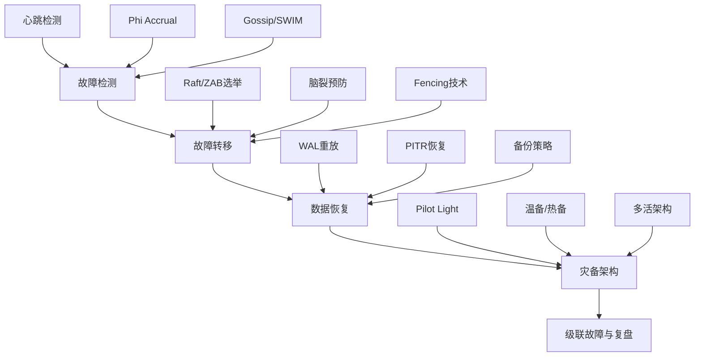

## 章节概览

本章系统讲解分布式系统中故障转移与恢复的完整技术体系。故障不是异常——在足够大的分布式系统中，故障是必然发生的常态。Google 的公开数据表明，在拥有数千台服务器的集群中，每天都有多台机器发生故障。因此，设计一个能够自动检测故障、快速转移服务、可靠恢复数据的系统，是每一位分布式系统工程师的核心能力。

### 1. 为什么需要故障转移与恢复

在单机时代，系统的可用性取决于单台服务器的可靠性。一旦服务器宕机，服务就完全不可用。分布式系统的出现改变了这种局面：通过将数据和服务分布在多台机器上，即使部分节点发生故障，系统仍然可以继续提供服务。但这需要解决三个核心问题：

**故障检测**：如何快速、准确地发现节点已经故障？太灵敏会导致误判（False Positive），将正常节点误认为故障；太迟钝会延长服务不可用时间。不同的检测算法在灵敏度和准确性之间有不同的权衡。

**故障转移**：发现故障后，如何安全地将服务迁移到其他节点？这个过程必须保证数据一致性——不能因为转移而丢失数据或产生冲突。脑裂（Split-Brain）是这个阶段最危险的问题。

**数据恢复**：故障恢复后，如何将节点上的数据恢复到一致状态？这涉及到日志重放、备份恢复、数据同步等一系列技术。

本章将围绕这三个核心问题，从理论到实践，从简单到复杂，构建完整的知识体系。

### 2. 本章知识体系

本章按照"检测→转移→恢复→灾备→复盘"的逻辑链组织，分为五个层次：

### 3. 各部分内容导读

**理论基础（第52章 第一节）**：从故障检测算法讲起，覆盖心跳检测、Phi Accrual故障检测器、Gossip协议和SWIM协议四种主流方案。每种算法都给出原理讲解、实现代码和适用场景对比。然后讲解Leader选举（Raft、ZAB）、脑裂预防（STONITH、仲裁机制）、Fencing技术，以及WAL重放、PITR恢复和备份策略设计。最后讲解灾备架构的分级设计（Tier 1到Tier 6）。

**核心技巧（第52章 第二节）**：聚焦三个高频实战技能——心跳检测的调优、Phi Accrual检测器的参数选择、Raft选举的具体实现细节。每个技巧都包含"最佳实践"和"常见陷阱"两部分。

**实战案例（第52章 第三节）**：通过 etcd 和 ZooKeeper 两个真实系统的案例，展示故障转移与恢复在生产环境中的完整实现。etcd 案例重点讲解 Raft 选举和数据一致性保障；ZooKeeper 案例重点讲解 ZAB 协议和临时节点在故障处理中的作用。

**常见误区**：列举工程实践中最容易犯的错误——例如"心跳间隔越短越好"、"只要数据不丢就行"、"灾备系统不需要定期演练"等，每个误区都给出纠正方法。

**练习与小结**：通过设计题和实战题巩固知识，最后总结本章的核心要点和学习路径。

### 4. 核心概念速览

在深入学习之前，先建立几个关键概念的认知框架：

| 概念 | 定义 | 关键要点 |
|------|------|----------|
| RPO（恢复点目标） | 故障后最多丢失多长时间的数据 | RPO=0 意味着零数据丢失，通常需要同步复制 |
| RTO（恢复时间目标） | 故障后多长时间恢复服务 | RTO 越短，架构复杂度和成本越高 |
| 脑裂（Split-Brain） | 网络分区导致多个节点同时认为自己是Leader | 必须通过仲裁、STONITH等机制预防 |
| Fencing | 隔离故障节点，防止其影响系统 | 分硬Fencing（关机）和软Fencing（租约过期） |
| Phi值 | Phi Accrual检测器输出的怀疑级别 | Phi=1 约90%把握，Phi=8 约99.999999%把握 |
| WAL | 预写日志，保证数据持久性的核心机制 | 所有修改先写日志再写数据，崩溃后可重放恢复 |

### 5. 学习建议

**入门路径**：先理解心跳检测的基本原理，再学习Leader选举的工作流程，最后了解备份恢复的基本策略。这三个主题构成了故障转移与恢复的基础三角。

**进阶路径**：深入Phi Accrual和SWIM协议的算法细节，掌握Raft选举的完整实现，理解灾备架构的成本权衡。这些内容适合有分布式系统经验的工程师。

**实战路径**：直接从etcd和ZooKeeper案例入手，在真实系统中观察故障转移的完整过程。然后回到理论部分，理解背后的算法选择和设计考量。

### 6. 前置知识

学习本章需要以下基础知识：

- **分布式系统基础**：了解CAP定理、一致性模型（强一致、最终一致）的基本概念
- **网络编程基础**：理解TCP/UDP、RPC调用、网络分区等概念
- **操作系统基础**：了解进程管理、线程同步、文件系统等概念
- **编程能力**：能够阅读Python/Java/Go代码，理解并发编程的基本概念

如果这些基础还不够扎实，建议先阅读本书前面的相关章节。

### 7. 本章核心数据

为了帮助你建立量化认知，这里给出一些关键数据：

| 指标 | 典型值 | 说明 |
|------|--------|------|
| 心跳间隔 | 1-5秒 | 太短增加网络开销，太长延迟故障检测 |
| 选举超时 | 150-300ms（Raft） | 随机化避免活锁 |
| Phi阈值 | 1.0-8.0 | 根据业务容忍度调整 |
| 复制延迟 | <10ms（同步）/ 数百ms（异步） | 同步复制保证零数据丢失但增加延迟 |
| RPO目标 | 0（同步复制）/ 分钟级（异步） | 取决于业务对数据丢失的容忍度 |
| RTO目标 | 秒级（自动转移）/ 分钟级（手动） | 取决于业务对服务中断的容忍度 |

理解这些数据不是为了死记硬背，而是为了在系统设计时做出合理的权衡——没有"最好"的方案，只有"最适合当前场景"的方案。

---

> **导读提示**：本章内容较深，建议按顺序阅读。每个知识点都配有代码示例，建议动手实现一遍以加深理解。如果时间有限，可以先通读理论基础部分建立整体认知，再选择感兴趣的深入点深入学习。
