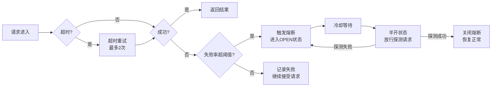
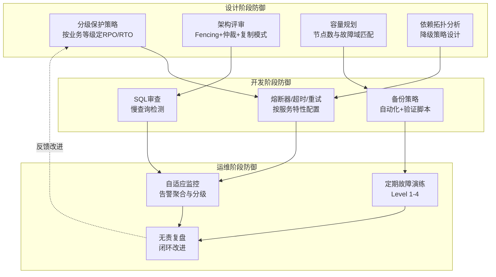

# 常见误区：故障转移与恢复中的典型错误与纠正方法

在故障转移与恢复的实践中，理论上的"正确答案"往往在落地时被各种经验不足或认知偏差所扭曲。许多团队在出了故障之后复盘时发现，根本原因不是技术选型错误，而是犯了本可避免的常见错误。

本节系统梳理故障转移与恢复领域中最常见的十二类误区，深入分析每类误区的成因、危害，并给出经过验证的纠正方案。每个误区都遵循"错误表现→深层原因→纠正方案"的结构，帮助读者不仅知道"怎么做"，更理解"为什么"。

> **阅读建议**：如果你正在设计或运维高可用系统，建议先快速浏览"误区总结与自检清单"，定位自己可能存在的盲区，再针对性地深入阅读相关误区的详细分析。

---

## 误区一：心跳超时参数拍脑袋决定

### 错误表现

许多团队在配置心跳检测时，心跳间隔和超时时间凭经验直觉设置——"1秒发一次心跳，3秒没回就算挂了"。这种做法在开发和测试环境看似没问题，到了生产环境往往会引发两类截然不同的问题：

- **超时设置太短**：网络稍有抖动就误判节点故障，触发不必要的故障转移。频繁的误报不仅产生大量告警噪音，还可能导致"抖动切换"——节点在故障和恢复之间反复切换，系统状态持续不稳定。在极端情况下，抖动切换会在几分钟内触发数十次故障转移，每次切换都伴随数据同步开销，最终导致系统资源耗尽。
- **超时设置太长**：节点真正故障后，系统需要等待很长时间才启动转移，这段空窗期内服务不可用或数据写入丢失。对于金融交易系统，每秒的停机损失可能高达数万元。

### 深层原因

心跳超时参数本质上是在两个错误之间取平衡：False Positive（误报，把正常节点判为故障）和 False Negative（漏报，故障节点没有被及时检测到）。拍脑袋设置忽略了以下关键因素：

1. **网络延迟的动态性**：生产环境中，网络延迟随负载、时段、物理链路状态动态变化。白天高峰期的P99延迟可能是凌晨低谷期的5-10倍。例如，某电商平台在双11期间，跨可用区的心跳延迟从平时的2ms飙升到80ms，导致大量误判。
2. **GC暂停与系统抖动**：JVM的垃圾回收（GC）可能导致应用暂停数百毫秒甚至数秒，这段时间内心跳可能无法及时响应。G1 GC的Mixed GC阶段暂停时间可达500ms-2s，ZGC在堆大小超过64GB时也可能出现数十毫秒的暂停。
3. **磁盘IO竞争**：数据库密集写入时，系统调度延迟增大，心跳响应变慢。当磁盘IOPS接近上限时，心跳包可能被IO调度器排队，导致响应延迟数百毫秒。
4. **容器化环境的资源竞争**：在Kubernetes中，Pod的CPU Limit被触及时会被throttle，心跳线程可能被限流。cgroup的CFS调度器在高负载时会导致心跳延迟抖动。

### 纠正方案

基于历史数据的自适应超时计算，比固定阈值更可靠：

```python
import time
import statistics
from collections import deque


class AdaptiveTimeout:
    """基于滑动窗口的自适应超时计算器
    
    核心思想：根据历史心跳延迟数据动态计算超时阈值，
    而非使用固定值。timeout = mean + multiplier * stdev
    这样能覆盖约99.7%的正常延迟波动（假设正态分布）。
    """
    
    def __init__(self, window_size=100, base_timeout=3.0,
                 min_timeout=1.0, max_timeout=30.0):
        self.window_size = window_size
        self.base_timeout = base_timeout
        self.min_timeout = min_timeout
        self.max_timeout = max_timeout
        self.latencies = deque(maxlen=window_size)
    
    def record_latency(self, latency_ms):
        """记录每次心跳往返延迟"""
        self.latencies.append(latency_ms)
    
    def compute_timeout(self, multiplier=3.0):
        """
        计算自适应超时值 = 均值 + multiplier * 标准差
        multiplier=3 覆盖99.7%，=2.5 覆盖98.8%
        """
        if len(self.latencies) < 10:
            return self.base_timeout
        
        mean = statistics.mean(self.latencies)
        stdev = statistics.stdev(self.latencies)
        timeout_ms = mean + multiplier * stdev
        
        # 转换为秒并限制在合理范围
        timeout_s = timeout_ms / 1000.0
        return max(self.min_timeout,
                   min(self.max_timeout, timeout_s))
    
    def detect_anomaly(self, current_latency_ms):
        """检测当前延迟是否异常（用于区分网络抖动和真故障）"""
        if len(self.latencies) < 10:
            return False
        
        mean = statistics.mean(self.latencies)
        stdev = statistics.stdev(self.latencies) or 1.0
        z_score = (current_latency_ms - mean) / stdev
        return z_score > 3.0  # 超过3个标准差视为异常


class HeartbeatMonitor:
    """心跳监控器：结合自适应超时和连续失败计数"""
    
    def __init__(self, adaptive_timeout, max_consecutive_failures=3):
        self.timeout_calc = adaptive_timeout
        self.max_consecutive_failures = max_consecutive_failures
        self.consecutive_failures = 0
    
    def check_heartbeat(self, send_time, recv_time, node_id):
        """检查单次心跳结果"""
        latency_ms = (recv_time - send_time) * 1000
        self.timeout_calc.record_latency(latency_ms)
        
        timeout = self.timeout_calc.compute_timeout()
        
        if latency_ms > timeout * 1000:
            self.consecutive_failures += 1
            print(f"[WARN] {node_id}: heartbeat slow "
                  f"({latency_ms:.0f}ms > {timeout*1000:.0f}ms), "
                  f"consecutive failures: {self.consecutive_failures}")
            
            if self.consecutive_failures >= self.max_consecutive_failures:
                return "SUSPECTED_DOWN"
            return "SLOW"
        else:
            self.consecutive_failures = 0
            return "OK"
```

**实践要点**：

| 环境 | 建议心跳间隔 | 建议超时倍数 | 注意事项 |
|------|-------------|-------------|---------|
| 同机房（低延迟） | 500ms-1s | 3-5倍 | 关注GC暂停影响 |
| 跨机房（高延迟） | 1-3s | 5-10倍 | 区分网络抖动与真故障 |
| 跨地域（超远距离） | 3-10s | 5-15倍 | 考虑链路质量波动 |
| 云环境 | 1-2s | 3-5倍 | 注意虚拟化层的延迟叠加 |
| Kubernetes Pod | 1-2s | 5-10倍 | 注意CPU throttling影响 |

> **进阶提示**：对于关键业务系统，建议结合Phi Accrual故障检测器（本章"核心技巧"部分有详细讲解），它通过概率模型动态判断故障可能性，比固定超时阈值更加灵活准确。

---

## 误区二：认为"节点越多越可靠"

### 错误表现

"我们集群有10个节点，比3节点集群可靠多了。"这是分布式系统中最常见的认知偏差之一。事实上，集群节点数增加并不意味着可靠性线性提升，反而可能引入新的风险：

1. **通信复杂度爆炸**：Raft、ZAB等共识协议需要节点间大量RPC通信。5节点集群每次选举需要4次RequestVote RPC，10节点需要9次。节点越多，选举耗时越长，故障转移越慢。实际测量表明，5节点Raft集群的选举时间约为200ms，而10节点集群可能超过500ms。
2. **脑裂概率增大**：节点越多，网络分区的可能性越大。一个10节点集群中出现2个分区的概率远高于5节点集群。根据组合数学，在n个节点中出现特定分区的概率随n指数增长。
3. **运维复杂度上升**：更多节点意味着更多的故障域、更多的配置管理、更大的升级风险窗口。每次滚动升级的窗口期内，集群处于降级状态。
4. **一致性协议的延迟开销**：多数派协议要求(N/2+1)个节点确认。10节点需要6个确认，5节点只需要3个。更多的确认意味着更高的写入延迟。

### 深层原因

混淆了"冗余"和"可靠"的概念。冗余是手段，可靠是结果。真正的可靠性取决于冗余的"质量"而非"数量"——关键在于冗余是否分布在独立的故障域中（不同的机架、可用区、地域）。

一个深刻的教训来自AWS的某个客户：他们部署了20个节点在同一个可用区，当该可用区发生网络故障时，所有20个节点同时不可用。相比之下，另一个客户只部署了3个节点但分别在3个可用区，系统始终保持可用。

### 纠正方案

```mermaid
graph TD
    subgraph "错误做法：单机房堆节点"
        A[单机房 10节点] --> B[机房断电<br/>10个节点全部不可用<br/>集群完全瘫痪]
    end
    
    subgraph "正确做法：跨故障域少量节点"
        C[可用区A 2节点] --> D{可用区故障?}
        E[可用区B 2节点] --> D
        F[可用区C 1节点] --> D
        D -->|A故障| "E+F继续服务<br/>3/5多数派正常"
        D -->|B故障| "C+F继续服务<br/>3/5多数派正常"
    end
```

**设计原则**：

- **3节点覆盖大多数场景**：对于单集群，3节点（或5节点）通常足够。Raft协议在N个节点中容忍⌊(N-1)/2⌋个节点故障，3节点容忍1个故障，5节点容忍2个故障。超过5节点的边际收益急剧递减。
- **跨故障域部署比多节点更重要**：3个节点分布在3个机架/可用区/地域，比10个节点集中在1个机架可靠得多。这是分布式系统可靠性的"第一性原理"。
- **奇数节点原则**：Raft和Paxos等协议要求多数派（Majority），偶数节点（如4、6）并不比奇数节点（如3、5）多容忍故障，反而增加了通信开销。4节点和3节点都只能容忍1个故障，但4节点的通信开销增加了约33%。
- **层级化冗余**：核心组件用3-5节点高可用集群，数据层用跨地域复制，上层用多活架构——分层保障比单层堆节点更有效。

**参考配置**：

| 组件 | 推荐节点数 | 部署模式 | 说明 |
|------|-----------|---------|------|
| etcd | 3或5 | 跨可用区 | Kubernetes控制面的核心依赖 |
| ZooKeeper | 3或5 | 跨机架 | Kafka等系统的元数据存储 |
| MySQL主从 | 1主2从 | 跨可用区 | 配合半同步复制 |
| Redis Cluster | 6+（3主3从） | 跨可用区 | 每个主节点配一个从节点 |
| Consul | 3或5 | 跨可用区 | 服务发现与配置中心 |

---

## 误区三：忽略Fencing机制

### 错误表现

故障转移后，新主节点接手工作，但旧主节点并未被真正隔离——它可能因为网络分区恢复后"复活"，继续以主节点身份处理请求。这会导致经典的脑裂场景：两个主节点同时写入，数据不一致。

常见的疏忽包括：
- 故障转移后没有调用STONITH接口关闭旧主节点
- 没有使用Fence Agent
- 依赖应用层逻辑（"我知道自己应该退位了"）来防止双写
- 在共享存储场景下没有配置SCSI Reserve/Release
- 云环境中没有使用云厂商提供的实例强制停止API

一个真实案例：某金融系统在主库宕机后自动切换到从库，但旧主库在30分钟后恢复，由于没有Fencing机制，旧主库继续接受写入长达5分钟，导致两个库的数据产生不可调和的冲突，最终需要人工逐条比对修复。

### 深层原因

很多开发者对"故障转移"的理解停留在"选一个新Leader"这一步，忽略了"确保旧Leader退出"同样关键。分布式系统中，节点之间无法可靠地通信（这正是导致需要故障转移的原因），因此不能依赖"通知旧节点退位"这种方式来保证一致性。

核心悖论在于：**导致故障转移的原因（网络分区、节点宕机）恰恰使得"通知旧节点"不可靠**。如果网络是可靠的，我们就不需要故障转移了。

### 纠正方案

Fencing（隔离）是故障转移的必要补充，必须与选举同步设计：

```python
import subprocess
import time
import logging

logger = logging.getLogger(__name__)


class FencingFailedError(Exception):
    """Fencing操作失败异常"""
    pass


class FencingManager:
    """故障隔离管理器：确保旧主节点被彻底隔离
    
    支持三种Fencing方式：
    1. STONITH - 通过BMC/IPMI硬件接口强制关机（最彻底）
    2. Lease   - 租约机制，到期自动失效（云环境常用）
    3. Storage - 存储层SCSI Reserve隔离（共享存储场景）
    
    关键原则：Fencing失败时，新主节点不应启动服务，
    而是等待人工介入。这比脑裂更安全。
    """
    
    def __init__(self, config):
        self.fence_type = config['fence_type']  # 'stonith', 'lease', 'storage'
        self.lease_duration = config.get('lease_duration', 15)
        self.bmc_config = config.get('bmc', {})
    
    def fence_node(self, node_id, timeout=30):
        """隔离指定节点，返回是否成功"""
        logger.info(f"Fencing node {node_id} using {self.fence_type}")
        
        try:
            if self.fence_type == 'stonith':
                return self._stonith_fence(node_id, timeout)
            elif self.fence_type == 'lease':
                return self._revoke_lease(node_id)
            elif self.fence_type == 'storage':
                return self._fence_storage(node_id, timeout)
            elif self.fence_type == 'cloud_api':
                return self._cloud_api_stop(node_id, timeout)
            else:
                raise ValueError(f"Unknown fence type: {self.fence_type}")
        except Exception as e:
            logger.error(f"Fencing failed for {node_id}: {e}")
            raise FencingFailedError(
                f"Cannot safely promote new leader: "
                f"fencing of {node_id} failed. "
                f"Manual intervention required."
            )
    
    def _stonith_fence(self, node_id, timeout):
        """通过IPMI接口强制关机——最可靠的Fencing方式"""
        bmc_addr = self.bmc_config.get(node_id, {}).get('address')
        if not bmc_addr:
            raise FencingFailedError(f"No BMC address for {node_id}")
        
        cmd = [
            'ipmitool', '-I', 'lanplus',
            '-H', bmc_addr,
            '-U', self.bmc_config['user'],
            '-P', self.bmc_config['password'],
            'power', 'off'
        ]
        
        result = subprocess.run(cmd, capture_output=True, timeout=timeout)
        if result.returncode != 0:
            raise FencingFailedError(
                f"IPMI power off failed: {result.stderr.decode()}"
            )
        
        logger.info(f"Successfully powered off {node_id} via IPMI")
        return True
    
    def _revoke_lease(self, node_id):
        """
        租约机制：旧主节点的租约到期后自动失效。
        新主节点必须等待旧租约过期后才能启动。
        
        适用场景：云环境无法做STONITH时的替代方案。
        缺点：等待时间 = 租约剩余时间，可能较长。
        """
        remaining = self.get_lease_remaining(node_id)
        if remaining > 0:
            logger.info(
                f"Waiting {remaining}s for lease expiry on {node_id}"
            )
            time.sleep(remaining)
        return True
    
    def _fence_storage(self, node_id, timeout):
        """
        存储层隔离：通过SCSI Reserve阻止旧节点访问共享存储。
        常见于 Pacemaker + 共享存储 的架构。
        
        注意：这只隔离了存储访问，旧节点的CPU和内存仍在运行，
        可能继续处理不涉及存储的请求。
        """
        scsi_id = self.get_scsi_id(node_id)
        cmd = ['sg_persist', '-C', '-r', '-d', scsi_id]
        result = subprocess.run(cmd, capture_output=True, timeout=timeout)
        
        if result.returncode != 0:
            raise FencingFailedError(
                f"SCSI reserve release failed: {result.stderr.decode()}"
            )
        return True
    
    def _cloud_api_stop(self, node_id, timeout):
        """通过云厂商API强制停止实例（AWS/阿里云/腾讯云）"""
        import json
        # 示例：AWS EC2停止实例
        cmd = [
            'aws', 'ec2', 'stop-instances',
            '--instance-ids', node_id,
            '--force'
        ]
        result = subprocess.run(cmd, capture_output=True, timeout=timeout)
        if result.returncode != 0:
            raise FencingFailedError(
                f"Cloud API stop failed: {result.stderr.decode()}"
            )
        return True
    
    def get_lease_remaining(self, node_id):
        """查询节点的租约剩余时间（由实际存储后端实现）"""
        # 实际实现需查询分布式锁服务（如etcd、ZooKeeper）
        raise NotImplementedError
    
    def get_scsi_id(self, node_id):
        """查询节点的SCSI设备ID（由实际存储后端实现）"""
        raise NotImplementedError
```

**Fencing方式对比**：

| 方式 | 原理 | 适用场景 | 优点 | 缺点 | 延迟 |
|------|------|---------|------|------|------|
| STONITH | 通过BMC/IPMI硬件接口强制关机 | 物理服务器、支持IPMI的VM | 最彻底，物理级隔离 | 依赖硬件管理网络 | 秒级 |
| 租约(Lease) | 时间窗口到期后自动失效 | 无法做STONITH的云环境 | 无需硬件接口 | 有等待窗口，转移延迟大 | 秒~分钟级 |
| 存储Fence | SCSI Reserve/Release阻止IO | 共享存储架构 | 精确到存储层 | 不隔离计算资源 | 秒级 |
| 云API | 云厂商强制停止实例 | 公有云环境 | 无需自建基础设施 | 依赖云厂商API可用性 | 秒~十秒级 |
| 应用层Fencing | 分布式锁、事务版本号 | 所有场景（补充手段） | 灵活 | 不够彻底，不能单独使用 | 毫秒级 |

**关键原则**：永远不要只依赖应用层逻辑来做Fencing。网络分区时，旧节点可能无法收到"请退位"的通知，但它仍然在运行并处理请求。必须有外部机制（硬件、存储、租约、云API）来强制隔离。

**Fencing失败时的安全策略**：当Fencing操作失败时，正确的做法是**拒绝切换**并等待人工介入，而不是"先切换再说"。因为Fencing失败意味着旧节点可能仍在运行，此时切换几乎必然导致脑裂。宁可短暂不可用，也不要数据不一致。

---

## 误区四：备份做了但没验证

### 错误表现

"我们每天做全量备份，数据很安全。"这句话在真正需要恢复时变成了噩梦——备份文件损坏、备份格式不兼容、恢复脚本过期、备份策略导致恢复时间远超RTO要求。据Acronym Institute统计，约60%的企业在灾难恢复测试中失败，而其中大部分失败的原因是备份数据无法被成功恢复。

常见问题包括：
- 备份文件存在但数据不完整（部分表未备份、binlog断裂）
- 恢复脚本长期未更新，数据库Schema变更后恢复失败
- 备份存储介质过期（磁带老化、云存储生命周期策略导致过期删除）
- 未验证恢复后数据的一致性和完整性
- 备份文件加密密钥丢失
- 备份工具版本升级后，旧格式备份无法被新版本恢复
- 增量备份链断裂——某个中间备份损坏导致后续所有增量无法恢复

### 深层原因

备份是"预防性工作"，短期内看不到直接价值，容易被忽视。团队的精力被日常开发和运维占据，备份验证这种"预防未发生的灾难"的工作往往被排到最低优先级。

更深层的问题是**幸存者偏差**：大多数时候备份不需要恢复，所以团队误以为"没出问题=备份没问题"。但真正的检验只在灾难发生那一刻——而那一刻往往是最不能出错的时刻。

### 纠正方案

**建立定期恢复演练制度**——备份的价值不在"做了"，而在"能恢复"：

```bash
#!/bin/bash
# backup_verify.sh - 备份验证自动化脚本
# 建议每周执行一次文件级验证，每月执行一次全量恢复测试

set -euo pipefail

BACKUP_DIR="/data/backups"
VERIFY_DIR="/tmp/backup_verify_$$"
LOG_FILE="/var/log/backup_verify.log"
ALERT_WEBHOOK="${SLACK_WEBHOOK_URL:-}"

log() {
    echo "[$(date '+%Y-%m-%d %H:%M:%S')] $1" | tee -a "$LOG_FILE"
}

# 第一步：验证备份文件完整性
verify_backup_integrity() {
    local backup_file="$1"
    log "Verifying integrity: $backup_file"
    
    # 检查文件大小是否合理（不应小于1KB）
    local size
    size=$(stat -c%s "$backup_file" 2>/dev/null || echo 0)
    if [ "$size" -lt 1024 ]; then
        log "ERROR: Backup file too small (${size} bytes)"
        return 1
    fi
    
    # 验证checksum（如果存在校验文件）
    local checksum_file="${backup_file}.sha256"
    if [ -f "$checksum_file" ]; then
        if sha256sum -c "$checksum_file" --quiet 2>/dev/null; then
            log "CHECKSUM OK: $backup_file"
        else
            log "ERROR: Checksum mismatch for $backup_file"
            return 1
        fi
    else
        log "WARNING: No checksum file found for $backup_file"
    fi
    
    # 验证文件是否可解压（格式完整性检查）
    case "$backup_file" in
        *.gz)  gzip -t "$backup_file" &amp;&amp; log "GZIP OK" || return 1 ;;
        *.xz)  xz -t "$backup_file" &amp;&amp; log "XZ OK" || return 1 ;;
        *.zst) zstd -t "$backup_file" &amp;&amp; log "ZSTD OK" || return 1 ;;
    esac
    
    return 0
}

# 第二步：模拟恢复并验证数据
verify_recovery() {
    local backup_file="$1"
    log "Starting recovery verification: $backup_file"
    
    mkdir -p "$VERIFY_DIR"
    
    # 恢复到隔离的验证环境（不能影响生产）
    if [[ "$backup_file" == *.sql.gz ]]; then
        gunzip -c "$backup_file" | mysql -h "${VERIFY_DB_HOST:-localhost}" \
            -u "${VERIFY_DB_USER:-verify}" -p"${VERIFY_DB_PASS}" "${VERIFY_DB_NAME}"
    elif [[ "$backup_file" == *.rdb ]]; then
        cp "$backup_file" /tmp/verify-redis/dump.rdb
        redis-cli -h "${VERIFY_REDIS_HOST:-localhost}" -p 6379 SHUTDOWN NOSAVE
        systemctl start redis-verify
    fi
    
    # 数据完整性检查
    verify_data_integrity
    
    # 清理验证环境
    cleanup_verify_env
    
    log "Recovery verification completed: $backup_file"
}

verify_data_integrity() {
    # 记录恢复后的行数，与生产环境对比
    local prod_count verify_count
    prod_count=$(mysql -h "${VERIFY_DB_HOST:-localhost}" -N -e \
        "SELECT COUNT(*) FROM critical_table")
    verify_count=$(mysql -h "${VERIFY_DB_HOST:-localhost}" -N -e \
        "SELECT COUNT(*) FROM critical_table")
    
    if [ "$prod_count" != "$verify_count" ]; then
        log "ERROR: Row count mismatch. prod=$prod_count verify=$verify_count"
        send_alert "Backup verification failed: row count mismatch"
        return 1
    fi
    
    # 验证最近的数据是否恢复成功（确保增量备份链完整）
    local latest_id
    latest_id=$(mysql -h "${VERIFY_DB_HOST:-localhost}" -N -e \
        "SELECT MAX(id) FROM critical_table")
    local recovered
    recovered=$(mysql -h "${VERIFY_DB_HOST:-localhost}" -N -e \
        "SELECT COUNT(*) FROM critical_table WHERE id = $latest_id")
    
    if [ "$recovered" -ne 1 ]; then
        log "ERROR: Latest record (id=$latest_id) not recovered"
        send_alert "Backup verification failed: latest data missing"
        return 1
    fi
    
    log "Data integrity check passed"
}

send_alert() {
    local message="$1"
    if [ -n "$ALERT_WEBHOOK" ]; then
        curl -s -X POST "$ALERT_WEBHOOK" \
            -H 'Content-type: application/json' \
            -d "{\"text\": \"🚨 Backup Verify Alert: $message\"}" \
            > /dev/null 2>&amp;1
    fi
}

cleanup_verify_env() {
    rm -rf "$VERIFY_DIR"
}

# 主流程
log "=== Backup Verification Start ==="
FAILED=0
for backup in $(ls -t "$BACKUP_DIR"/*.gz 2>/dev/null | head -3); do
    if ! verify_backup_integrity "$backup"; then
        FAILED=1
        continue
    fi
    if ! verify_recovery "$backup"; then
        FAILED=1
    fi
done

if [ "$FAILED" -eq 1 ]; then
    send_alert "Backup verification failed. See log: $LOG_FILE"
    exit 1
fi

log "=== All backup verifications passed ==="
```

**备份验证清单**：

| 验证项 | 频率 | 方法 | 通过标准 | 失败后果 |
|--------|------|------|---------|---------|
| 文件完整性 | 每次备份后 | SHA256校验 | Checksum匹配 | 备份无效 |
| 可恢复性 | 每周 | 恢复到隔离环境 | 服务正常启动 | 无法恢复 |
| 数据一致性 | 每月 | 行数/校验和对比 | 与生产环境一致 | 数据丢失 |
| 全量恢复RTO | 每季度 | 完整恢复演练 | 在RTO目标内完成 | RTO不达标 |
| 跨版本兼容 | 每次升级后 | 旧备份恢复测试 | Schema兼容性通过 | 历史备份失效 |
| 加密密钥验证 | 每季度 | 解密测试 | 密钥可用 | 备份无法解密 |

> **血泪教训**：某公司的重要数据库在凌晨2点发生存储故障。他们有完善的每日备份策略，但从未做过恢复演练。当真正需要恢复时，发现备份脚本中的数据库密码在3个月前的密码轮换中被更新了，但脚本没有同步更新。恢复操作卡在密码验证环节，直到6点密码管理员上班才解决——RTO从目标的30分钟变成了4小时。

---

## 误区五：故障转移后不验证数据一致性

### 错误表现

主从切换完成，新主节点开始接受写入，团队以为万事大吉。但事实上，切换过程中可能存在数据丢失或不一致：

- **异步复制的数据丢失**：主节点故障时，部分已确认的写入尚未同步到从节点。切换后这部分数据"消失"了。在高写入场景下，异步复制的丢失窗口可能包含数千条记录。
- **复制延迟导致的不一致**：从节点的复制延迟（Replication Lag）较大时，新主节点的数据可能比旧主节点落后数秒甚至数分钟。在支付系统中，这意味着几秒钟内的交易数据可能丢失。
- **脑裂期间的双写**：如果故障转移过程中发生脑裂，两个主节点可能各自接受了不同的写入，切换后需要合并冲突。
- **自增ID冲突**：MySQL等数据库在切换后可能产生自增ID冲突，导致新写入的数据覆盖旧数据。
- **事务未提交的数据丢失**：已写入但未提交的事务在切换后被回滚，客户端收到成功响应但数据并未持久化。

### 深层原因

许多团队的故障转移流程只关注"谁当新主"，忽略了"数据是否一致"。尤其是异步复制模式下，RPO（Recovery Point Objective）虽然定义为可接受的数据丢失量，但团队往往没有量化这个值，也没有在切换时确认实际丢失了多少数据。

根本问题在于：**团队将RPO视为一个设计指标，而不是一个运维指标**。设计时定义了"最多丢5分钟数据"，但运维时从不验证实际丢了多少。

### 纠正方案

```python
import logging
from datetime import datetime

logger = logging.getLogger(__name__)


class FailoverValidator:
    """故障转移数据一致性验证器
    
    在切换前和切换后分别执行验证，
    确保数据丢失在可接受范围内。
    """
    
    def __init__(self, old_primary, new_primary, replicas,
                 max_acceptable_lag=5):
        self.old_primary = old_primary
        self.new_primary = new_primary
        self.replicas = replicas
        self.max_acceptable_lag = max_acceptable_lag  # 秒
    
    def validate_before_failover(self):
        """切换前验证：确认新主的数据足够新"""
        errors = []
        
        # 1. 检查复制延迟
        lag = self._get_replication_lag(self.new_primary)
        if lag > self.max_acceptable_lag:
            errors.append(
                f"Replication lag too high: {lag}s "
                f"(max acceptable: {self.max_acceptable_lag}s)"
            )
        
        # 2. 检查新主是否落后于其他从节点
        new_primary_pos = self._get_binlog_position(self.new_primary)
        for replica in self.replicas:
            replica_pos = self._get_binlog_position(replica)
            if self._is_ahead_of(new_primary_pos, replica_pos):
                logger.warning(
                    f"Replica {replica} is ahead of new primary. "
                    f"Consider promoting that replica instead."
                )
        
        # 3. 估算可能丢失的数据量
        estimated_loss = self._estimate_data_loss()
        logger.info(f"Estimated data loss: {estimated_loss}")
        
        # 4. 检查是否有未完成的事务
        pending_txns = self._check_pending_transactions()
        if pending_txns > 0:
            errors.append(
                f"{pending_txns} pending transactions may be lost"
            )
        
        if errors:
            for err in errors:
                logger.error(f"Pre-failover check failed: {err}")
            raise FailoverAbortedError("; ".join(errors))
        
        return estimated_loss
    
    def validate_after_failover(self):
        """切换后验证：确认数据一致性"""
        # 1. 验证新主可以正常处理读写
        rw_ok = self._test_read_write()
        
        # 2. 验证关键数据表的完整性
        consistency_check = self._verify_critical_tables()
        
        # 3. 验证自增ID序列是否连续（MySQL场景）
        auto_incr_ok = self._check_auto_increment()
        
        # 4. 验证所有客户端已切换到新主
        client_switch_ok = self._verify_client_connections()
        
        # 5. 生成切换报告
        report = {
            'timestamp': datetime.now().isoformat(),
            'old_primary': self.old_primary,
            'new_primary': self.new_primary,
            'read_write_ok': rw_ok,
            'data_consistency': consistency_check,
            'auto_increment_status': auto_incr_ok,
            'client_switch_status': client_switch_ok,
            'action_required': not all([
                rw_ok, consistency_check, 
                auto_incr_ok, client_switch_ok
            ])
        }
        
        if report['action_required']:
            self._send_alert(report)
        
        return report
    
    def _estimate_data_loss(self):
        """估算异步复制模式下的数据丢失量"""
        old_pos = self._get_binlog_position(self.old_primary)
        new_pos = self._get_binlog_position(self.new_primary)
        
        bytes_diff = old_pos.get('file_size', 0) - new_pos.get('file_size', 0)
        
        write_rate = self._get_avg_write_rate(last_n_minutes=5)
        estimated_time_loss = bytes_diff / write_rate if write_rate > 0 else 0
        
        return {
            'binlog_bytes': max(0, bytes_diff),
            'estimated_time_seconds': estimated_time_loss,
            'estimated_rows': self._estimate_row_count(bytes_diff)
        }
    
    # 以下为实际系统中需要实现的方法（桩方法）
    def _get_replication_lag(self, node):
        raise NotImplementedError
    
    def _get_binlog_position(self, node):
        raise NotImplementedError
    
    def _is_ahead_of(self, pos_a, pos_b):
        raise NotImplementedError
    
    def _check_pending_transactions(self):
        raise NotImplementedError
    
    def _test_read_write(self):
        raise NotImplementedError
    
    def _verify_critical_tables(self):
        raise NotImplementedError
    
    def _check_auto_increment(self):
        raise NotImplementedError
    
    def _verify_client_connections(self):
        raise NotImplementedError
    
    def _get_avg_write_rate(self, last_n_minutes):
        raise NotImplementedError
    
    def _estimate_row_count(self, byte_diff):
        raise NotImplementedError
    
    def _send_alert(self, report):
        logger.warning(f"Failover report requires attention: {report}")
```

**故障转移后必做的验证步骤**：

| 步骤 | 操作 | 验证方法 | 超时时间 | 失败处理 |
|------|------|---------|---------|---------|
| 1 | 复制状态确认 | 检查IO/SQL Thread状态 | 10秒 | 告警+人工介入 |
| 2 | 数据完整性校验 | 对比关键表记录数 | 60秒 | 暂停切换 |
| 3 | 读写连通性测试 | 执行测试SQL | 10秒 | 重启应用连接 |
| 4 | 客户端连接切换 | 检查连接池状态 | 30秒 | 强制刷新连接池 |
| 5 | 监控告警更新 | 验证监控目标已切换 | 5分钟 | 更新配置 |
| 6 | 日志审计 | 记录切换全过程 | 实时 | 自动记录 |

---

## 误区六：熔断器配置不合理导致级联故障

### 错误表现

熔断器（Circuit Breaker）是防止级联故障的重要手段，但配置不当反而会加剧问题：

- **阈值太低**：正常波动触发熔断，导致大量请求被快速拒绝，正常服务降级为不可用。
- **超时太短**：下游服务偶尔慢一点就触发熔断，大量请求走fallback，系统整体吞吐量急剧下降。
- **半开状态恢复太快**：熔断器过早进入半开状态，探测请求立刻成功又立刻关闭，然后再次打开——形成反复开关的"震荡"。
- **没有分级熔断**：所有下游服务共用一个熔断器，一个慢服务导致所有服务被熔断。
- **Fallback实现有问题**：Fallback函数本身也调用了其他服务，形成熔断链式反应。

### 深层原因

熔断器的三个核心参数——失败率阈值、请求量阈值、冷却时间——需要根据下游服务的特性精细调优。很多团队直接使用框架默认值（如Hystrix默认5秒内20次请求50%失败就熔断），没有根据实际业务场景调整。

另一个被忽视的问题是**重试风暴**：当熔断器打开时，客户端的重试逻辑可能在短时间内产生大量请求，进一步加剧下游压力。正确的做法是重试也应该配合退避策略。

### 纠正方案

```java
// 错误：所有服务使用相同配置
CircuitBreakerConfig config = CircuitBreakerConfig.custom()
    .failureRateThreshold(50)
    .waitDurationInOpenState(Duration.ofSeconds(5))
    .build();

// 正确：根据服务特性分级配置
public class CircuitBreakerFactory {
    
    /**
     * 为不同服务创建定制化的熔断器配置。
     * 
     * 核心原则：
     * - 支付等核心服务：低阈值、长冷却、多探测（宁可多等不可误熔）
     * - 推荐等非核心服务：高阈值、短冷却（快速失败快速恢复）
     * - 数据库等基础设施：基于慢查询阈值而非失败率
     */
    public static CircuitBreaker createForService(String serviceName) {
        return switch (serviceName) {
            case "payment" -> CircuitBreaker.of("payment",
                CircuitBreakerConfig.custom()
                    .failureRateThreshold(10)       // 支付服务：极低容忍
                    .slowCallRateThreshold(30)      // 慢调用也触发熔断
                    .slowCallDurationThreshold(Duration.ofSeconds(3))
                    .minimumNumberOfCalls(20)       // 至少20次才判断
                    .waitDurationInOpenState(Duration.ofSeconds(30))
                    .permittedNumberOfCallsInHalfOpenState(5)
                    .slidingWindowSize(100)
                    .build());
            
            case "recommendation" -> CircuitBreaker.of("recommendation",
                CircuitBreakerConfig.custom()
                    .failureRateThreshold(60)       // 推荐服务：高容忍
                    .minimumNumberOfCalls(10)
                    .waitDurationInOpenState(Duration.ofSeconds(3))
                    .permittedNumberOfCallsInHalfOpenState(3)
                    .slidingWindowSize(50)
                    .build());
            
            default -> CircuitBreaker.of(serviceName,
                CircuitBreakerConfig.custom()
                    .failureRateThreshold(50)
                    .minimumNumberOfCalls(15)
                    .waitDurationInOpenState(Duration.ofSeconds(10))
                    .build());
        };
    }
}
```

**熔断器参数调优指南**：

| 参数 | 保守配置 | 激进配置 | 调优建议 |
|------|---------|---------|---------|
| 失败率阈值 | 10% | 50% | 核心服务用低阈值，非核心用高阈值 |
| 最小请求量 | 20次 | 5次 | 防止少量请求触发误熔断 |
| 滑动窗口 | 100次请求/60秒 | 10次请求/10秒 | 高QPS用请求窗口，低QPS用时间窗口 |
| 冷却时间 | 30秒 | 5秒 | 给下游足够恢复时间 |
| 半开探测数 | 5次 | 1次 | 多个探测请求避免偶发成功 |
| 慢调用阈值 | 3秒 | 1秒 | 根据下游SLA设定 |

**与重试和超时的配合**：



> **实战经验**：某电商平台在大促期间发现推荐服务响应变慢，熔断器打开后所有推荐请求走Fallback返回静态数据。但Fallback函数内部调用了另一个缓存服务，而该缓存服务此时也在被大量请求压垮，导致Fallback也超时——形成了"熔断器Fallback的级联故障"。解决方案：Fallback必须是纯本地逻辑（如返回缓存的静态数据），绝不调用外部服务。

---

## 误区七：灾备方案与业务RPO/RTO不匹配

### 错误表现

灾备架构设计时，要么过度投入（小业务建了两地三中心），要么严重不足（核心业务只做了本地备份）。更常见的问题是：灾备方案的RPO/RTO能力与业务实际需求不匹配。

典型案例：
- 金融交易系统只有异步复制，RPO>0意味着交易数据可能丢失，不满足监管要求
- 电商系统设计了RTO<30秒的热备方案，但实际切换需要人工审批，真实RTO>30分钟
- 日志系统建了多活架构，每月成本数十万，但日志丢失几分钟完全可以接受
- 内部管理工具做了跨地域灾备，但该工具停机半天也不会造成业务损失

### 深层原因

1. **没有分级保护**：所有业务系统用同一套灾备策略，没有区分核心链路和非核心链路。
2. **RPO/RTO定义模糊**：团队对"可接受的数据丢失量"和"可接受的停机时间"没有达成共识。
3. **只关注技术指标**：忽略了切换流程中的人工环节（审批、通知、验证）对RTO的影响。
4. **成本意识缺失**：灾备投入应该与业务损失成正比，而不是"越贵越好"。

### 纠正方案

**按业务等级分级设计灾备**：

| 业务等级 | RPO要求 | RTO要求 | 推荐灾备方案 | 年成本（参考） |
|---------|---------|---------|-------------|--------------|
| L0-生命安全 | = 0 | < 1秒 | 同步复制+自动切换 | 百万级 |
| L1-核心交易 | = 0 | < 1分钟 | 同步/半同步+自动Fencing | 十万级 |
| L2-重要业务 | < 5分钟 | < 15分钟 | 异步复制+半自动切换 | 万级 |
| L3-一般业务 | < 1小时 | < 4小时 | 定期备份+手动切换 | 千级 |
| L4-内部工具 | < 24小时 | < 24小时 | 每日备份 | 百元级 |

**灾备方案成本与能力对照**：


**关键行动项**：

1. **明确RPO/RTO**：每个业务系统必须有明确的、经过业务方确认的RPO和RTO指标。不能用"越快越好"代替具体数字。
2. **量化切换时间**：不仅计算技术切换时间，还要包含人工审批、通知确认、验证检查的时间。一个实际案例：技术切换只需要30秒，但人工审批流程需要15分钟，最终RTO是15.5分钟而非30秒。
3. **成本效益分析**：灾备投入应与业务价值匹配。核心交易系统的"1分钟停机损失"可能高达百万，值得投入高成本灾备；日志系统的损失可控，不需要过度投入。
4. **定期演练**：RTO只有通过演练才能验证。每季度至少做一次灾备切换演练，记录实际耗时并与目标对比。

---

## 误区八：监控告警配置不当——告警风暴或告警疲劳

### 错误表现

故障转移与恢复系统中，监控告警是"眼睛"。但很多团队的告警系统存在两个极端：

**告警风暴（Alert Storm）**：一个底层故障触发数十条告警，运维人员被淹没在告警海洋中，无法快速定位根因。典型案例：一个网络交换机故障导致所有依赖它的服务同时告警，运维收到500+条告警消息，其中499条是症状而非原因。当告警数量超过人的处理能力时，关键告警反而被淹没。

**告警疲劳（Alert Fatigue）**：长期存在大量误报或低优先级告警，运维人员对告警产生"狼来了"心理，对真正的故障告警也变得麻木。据PagerDuty统计，约30%的告警被直接忽略。某公司的运维团队在凌晨3点收到"磁盘即将满"的告警，因为近一个月每天都收到这条告警（确实是满的但不影响服务），值班人员习惯性忽略了——但这次是数据库日志导致的异常增长，30分钟后磁盘真正写满，数据库崩溃。

### 深层原因

1. **告警规则只按指标阈值配置**，没有考虑故障的因果关系和依赖拓扑。
2. **告警分级不到位**：Critical、Warning、Info的界限模糊，所有告警同等对待。
3. **缺少告警聚合和抑制**：没有按依赖关系自动聚合相关告警。
4. **没有告警降级机制**：非工作时间的告警策略与工作时间相同。
5. **告警没有"消化"机制**：告警产生后如果没有被确认和处理，会持续重复发送。

### 纠正方案

```yaml
# Prometheus Alertmanager 配置示例
global:
  resolve_timeout: 5m

route:
  receiver: 'default'
  group_by: ['alertname', 'cluster', 'service']
  group_wait: 30s        # 等待30秒，聚合同一组的告警
  group_interval: 5m     # 同组告警最小间隔
  repeat_interval: 4h    # 重复告警间隔
  
  routes:
    # 核心交易服务：即时通知，电话+短信
    - match:
        severity: critical
        service: payment
      receiver: 'oncall-phone'
      group_wait: 10s
      
    # 非核心服务：仅邮件通知
    - match:
        severity: warning
      receiver: 'team-email'
      repeat_interval: 12h

# 告警抑制规则：当根因告警触发时，抑制衍生告警
inhibit_rules:
  # 交换机故障时，抑制所有下游服务Down告警
  - source_match:
      alertname: 'NetworkDown'
    target_match_re:
      alertname: '.+Down$'
    equal: ['instance']
  
  # 主库挂了时，抑制从库延迟告警（主库恢复前延迟是正常的）
  - source_match:
      alertname: 'DatabasePrimaryDown'
    target_match:
      alertname: 'ReplicationLag'
    equal: ['cluster']
  
  # 磁盘使用率告警：P0抑制P2和P3
  - source_match:
      severity: critical
      alertname: 'DiskAlmostFull'
    target_match:
      severity: warning

# 告警路由到不同渠道
receivers:
  - name: 'oncall-phone'
    pagerduty_configs:
      - service_key: 'xxx'
  
  - name: 'team-email'
    email_configs:
      - to: 'team@example.com'
  
  - name: 'default'
    slack_configs:
      - channel: '#alerts'
```

**告警分级标准**：

| 级别 | 定义 | 响应时间 | 通知方式 | 示例 |
|------|------|---------|---------|------|
| P0-Critical | 服务完全不可用，影响收入 | < 5分钟 | 电话+短信+即时通讯 | 主库故障、支付链路断裂 |
| P1-High | 服务部分降级，影响用户体验 | < 15分钟 | 即时通讯+邮件 | 从库故障、缓存穿透 |
| P2-Medium | 非核心功能异常 | < 1小时 | 邮件 | 推荐服务异常、报表延迟 |
| P3-Low | 潜在风险，不影响当前服务 | 下个工作日 | 周报汇总 | 磁盘即将满、证书即将过期 |

**告警防疲劳的实践技巧**：
- **告警必须有人确认**：未确认的告警不重复发送，避免"告警墙"效应
- **每周Review告警**：统计每周告警数量、误报率、响应时间，持续优化
- **设置告警上限**：单个服务每小时最多产生N条告警，超出则聚合

---

## 误区九：故障演练只做"纸上谈兵"

### 错误表现

很多团队有完善的故障转移方案文档，但从未在生产环境（或类生产环境）中真正演练过。等到真正发生故障时才发现：

- 切换脚本过期，数据库密码已更换但脚本未更新
- Fencing设备的BMC地址配置错误，IPMI无法连通
- 值班人员不知道切换流程，现场查文档
- 切换后DNS TTL未提前降低，客户端缓存导致流量无法切换
- 切换脚本依赖的Python库版本已过期，脚本无法运行
- 监控系统本身的告警规则指向旧主节点，切换后收不到告警

Netflix的"混沌工程"（Chaos Engineering）之所以有效，正是因为它在生产环境中反复验证系统面对故障的真实表现，而不是依赖文档中的"理论上可以"。

### 深层原因

1. **对故障演练有恐惧心理**：担心演练本身引发故障，尤其是生产环境演练。
2. **缺乏正式的演练计划**：没有将故障演练纳入运维日历，"有空再做"往往意味着永远不做。
3. **演练不真实**：只测"happy path"（一切顺利的情况），不测"unhappy path"（切换过程中又出新故障）。
4. **没有量化指标**：不记录演练耗时、恢复数据量，无法评估和改进。
5. **演练结果没有闭环**：发现的问题没有被跟踪修复，下次演练时同样的问题再次出现。

### 纠正方案

**建立故障演练制度**——演练是检验灾备方案的唯一标准：

```markdown
## 故障演练计划模板

### 演练信息
- 演练名称：[描述]
- 演练日期：[YYYY-MM-DD]
- 演练窗口：[开始时间 - 结束时间]
- 参与人员：[角色和姓名]
- 回滚方案：[紧急回滚步骤]
- 通信渠道：[演练群组/频道]

### 演练场景
1. **场景一**：主节点宕机，验证自动故障转移
   - 前置条件：确认备份完整，确认Fencing配置
   - 执行步骤：kill主节点进程 / 关闭主节点网络
   - 预期结果：30秒内新主节点启动，服务恢复
   - 验证点：数据一致性、服务可用性、客户端连接
   - 回滚步骤：手动恢复旧主节点，验证数据同步

2. **场景二**：网络分区，验证脑裂预防
   - 前置条件：确认Fencing配置正确
   - 执行步骤：iptables模拟网络隔离
   - 预期结果：少数分区降级，多数分区正常服务
   - 验证点：无双写、数据一致、服务降级

3. **场景三**：从全量数据恢复，验证备份有效性
   - 前置条件：准备恢复环境
   - 执行步骤：从备份恢复→应用WAL→数据校验
   - 预期结果：RTO在目标范围内，数据RPO符合预期
   - 验证点：恢复时间、数据完整性、服务功能

4. **场景四**：混沌注入（Chaos Engineering）
   - 前置条件：监控就绪，告警渠道畅通
   - 执行步骤：随机kill一个Pod / 注入网络延迟100ms / 模拟磁盘满
   - 预期结果：系统自动降级，无级联故障
   - 验证点：熔断器触发、降级生效、告警正确

### 演练后复盘
- 实际RTO：[分钟]
- 实际RPO：[丢失数据量]
- 发现的问题：[列表]
- 改进措施：[列表]
- 下次演练日期：[YYYY-MM-DD]
```

**演练分级**：

| 级别 | 名称 | 频率 | 环境 | 影响范围 | 适用团队 |
|------|------|------|------|---------|---------|
| Level 1 | 桌面演练 | 每月 | 会议室 | 无 | 所有团队 |
| Level 2 | 组件演练 | 每季度 | 测试环境 | 被测组件 | 有独立测试环境 |
| Level 3 | 全链路演练 | 每半年 | 预发/生产 | 分钟级影响 | 核心业务 |
| Level 4 | 混沌工程 | 每季度 | 生产 | 实时注入 | 成熟SRE团队 |

> **Netflix的经验**：Netflix的Chaos Monkey每天在生产环境随机终止虚拟机实例，Chaos Kong模拟整个AWS区域故障。这种"持续演练"的文化让他们在面对真正的AWS故障时能够快速切换，服务中断时间极短。关键不是工具，而是**将故障演练融入日常运维的文化**。

---

## 误区十：故障复盘流于形式

### 错误表现

出了故障后，团队写一份复盘报告，列几个"改进措施"，然后就没有然后了。典型的"复盘八股"包括：

- "加强监控"（具体加强什么？怎么加强？）
- "优化超时配置"（优化到什么值？谁负责？什么时候完成？）
- "提高系统稳定性"（如何衡量？）
- "加强代码审查"（审查什么？标准是什么？）

这种复盘既没有找到真正的根因（Root Cause），也没有产生可追踪的改进措施（Action Item），更没有验证改进是否有效。同样的故障会在几个月后再次发生。

### 深层原因

1. **缺乏结构化的复盘方法**：没有使用5-Why、鱼骨图等工具深入分析根因，停留在表面现象。
2. **问责文化**：复盘变成了"找人背锅"，导致参与者隐瞒信息、避重就轻。没有人愿意承认"我不小心删了一行配置"。
3. **没有追踪机制**：改进措施没有指定负责人、完成时间和验收标准，"尽快完成"等于"无限期拖延"。
4. **复盘频率和深度不匹配**：小故障不复盘（认为不值得），大故障又因为涉及面广而草草收场。
5. **复盘结论无法量化**：没有用数据衡量改进效果，无法判断是否真正解决了问题。

### 纠正方案

**Google式故障复盘模板**（Blameless Post-Mortem）：

```markdown
## 故障复盘报告

### 基本信息
- 故障ID: INC-2024-001
- 故障级别: P1
- 影响时间: 2024-01-15 14:30 - 15:45 (75分钟)
- 影响范围: 支付服务不可用，影响约5万用户
- 数据影响: 无数据丢失（异步复制窗口内丢失3笔交易，已补偿）

### 时间线（精确到分钟）
| 时间 | 事件 | 操作人 |
|------|------|--------|
| 14:30 | 监控告警：主库CPU 100% | 自动 |
| 14:32 | 值班工程师收到告警 | 张三 |
| 14:35 | 确认主库异常，开始排查 | 张三 |
| 14:45 | 定位到慢查询锁表 | 张三 |
| 14:50 | 手动kill慢查询 | 张三 |
| 15:00 | 主库恢复但连接池耗尽 | 自动 |
| 15:15 | 重启应用连接池 | 李四 |
| 15:30 | 服务恢复 | 李四 |
| 15:45 | 监控确认全链路恢复 | 自动 |

### 根因分析（5-Why）
1. Why: 支付服务不可用？→ 主库CPU 100%，无法处理查询
2. Why: 主库CPU 100%？→ 一条全表扫描的慢查询锁住了大量行
3. Why: 慢查询出现？→ 新上线的功能缺少索引
4. Why: 缺少索引的SQL上线了？→ 代码审查没有检查SQL性能
5. Why: 代码审查没检查SQL性能？→ 没有SQL审查标准，也没有慢查询检测工具

**根本原因**：缺乏SQL性能审查机制和上线前的慢查询检测

### 改进措施（SMART原则）
| 措施 | 负责人 | 完成时间 | 验收标准 |
|------|--------|---------|---------|
| 部署pt-query-digest，每日分析慢查询 | 王五 | 2024-02-01 | 报告每日发送到团队 |
| 制定SQL审查标准并纳入代码审查流程 | 赵六 | 2024-02-15 | 标准文档发布，CI集成 |
| 应用层添加查询超时保护（>1s自动kill） | 张三 | 2024-01-30 | 测试环境验证通过 |
| 连接池配置优化（max_lifetime=300s） | 李四 | 2024-01-25 | 配置变更已发布 |
| 每月复盘改进措施执行情况 | 团队Lead | 每月1日 | 未完成项升级处理 |

### 经验教训
1. **正面**：告警系统正常工作，5分钟内响应
2. **正面**：手动kill操作正确，未引发数据不一致
3. **负面**：缺少SQL审查机制，本可避免
4. **负面**：连接池没有超时保护，恢复时间延长
5. **意外发现**：数据库的innodb_lock_wait_timeout配置过长（50s），建议调整为10s
```

**无责复盘（Blameless Post-Mortem）的核心原则**：

1. **对事不对人**：讨论"系统为什么会失败"，而不是"谁犯了错"。人的错误是系统缺陷的症状，不是原因。如果一个人犯了错，说明系统缺少防错机制。
2. **鼓励坦诚**：参与者应主动分享自己在事件中的判断和操作，而不是隐瞒。使用"我观察到..."而非"他搞错了..."。
3. **关注系统改进**：每个根因都应该对应一个系统层面的改进（工具、流程、自动化），而不是"下次注意"。
4. **可追踪的Action Items**：每项改进必须有负责人、完成时间、验收标准。
5. **闭环验证**：下次复盘时先回顾上次的Action Items执行情况。

---

## 误区十一：DNS切换和客户端缓存管理被忽视

### 错误表现

故障转移的技术层面（数据库切换、Fencing）做得很完善，但DNS层面的切换被忽略，导致：

- DNS TTL设置为24小时，切换后客户端仍指向旧IP长达数小时
- 应用内硬编码了数据库地址，DNS切换后无法生效
- 连接池中的长连接未释放，新连接走新地址，旧连接继续访问旧地址
- CDN缓存了旧的解析结果，全球用户访问恢复时间不一致

### 深层原因

故障转移的"最后一公里"问题：技术层面的切换完成了，但流量路由层面的切换被忽视。团队往往只关注"新主节点是否就绪"，而忽略了"客户端能否找到新主节点"。

更隐蔽的问题是**多层缓存**：DNS有缓存（本地+ISP+递归），HTTP有缓存（浏览器+CDN），连接池有缓存（TCP连接复用）。每层缓存都需要独立管理。

### 纠正方案

**故障转移的DNS管理清单**：

| 步骤 | 操作 | 时机 | 负责人 |
|------|------|------|--------|
| 1 | 提前降低TTL到60秒 | 故障转移前24小时（计划切换） | 运维 |
| 2 | 验证新IP可达 | 切换前 | SRE |
| 3 | 更新DNS记录指向新IP | 切换时 | 运维 |
| 4 | 刷新CDN缓存 | 切换后立即 | 运维 |
| 5 | 强制刷新应用连接池 | 切换后1分钟 | 开发 |
| 6 | 验证全球解析一致性 | 切换后5分钟 | SRE |

**连接池切换的最佳实践**：

```python
class ConnectionPoolManager:
    """支持优雅切换的连接池管理器"""
    
    def __init__(self):
        self.pools = {}  # host -> connection_pool
    
    def switch_primary(self, new_host, old_host, drain_timeout=30):
        """优雅切换主节点连接
        
        关键：不是直接关闭旧连接，而是：
        1. 等待旧连接上的活跃事务完成
        2. 停止从旧池获取新连接
        3. 逐步关闭空闲连接
        4. 最终关闭整个旧池
        """
        # 1. 立即创建新池
        self.pools[new_host] = self._create_pool(new_host)
        
        # 2. 标记旧池为"draining"
        self.pools[old_host].draining = True
        
        # 3. 等待旧连接排空
        import time
        start = time.time()
        while time.time() - start < drain_timeout:
            active = self.pools[old_host].active_count()
            if active == 0:
                break
            print(f"Waiting for {active} active connections to drain...")
            time.sleep(1)
        
        # 4. 强制关闭残留连接
        self.pools[old_host].force_close_all()
        del self.pools[old_host]
```

> **实战教训**：某电商在双11前做了一次计划内的主从切换，技术团队完美执行了数据库层面的切换。但DNS TTL是3600秒（1小时），切换后40分钟内约30%的流量仍然指向旧主库，这些请求全部失败。从那以后，他们的标准操作流程是：大促前一周将TTL降至60秒。

---

## 误区十二：忽略依赖服务的故障传播

### 错误表现

故障转移只关注单个服务的高可用，忽略了服务之间的依赖关系可能导致故障传播：

- 支付服务依赖风控服务，风控服务故障导致支付超时，触发支付服务熔断
- 缓存服务故障导致数据库直连压力暴增，数据库CPU打满触发主从切换
- 配置中心故障导致服务无法获取配置，所有依赖配置中心的服务同时不可用
- 日志收集服务故障导致应用线程池被日志写入阻塞，业务请求超时

这种"蝴蝶效应"式的故障传播是分布式系统中最难排查的问题之一。

### 深层原因

服务之间的依赖关系形成了一个隐式的有向图。当某个节点（服务）故障时，故障会沿着依赖图传播。但团队通常只关注"我的服务是否高可用"，而忽略了"我依赖的服务故障时我怎么办"以及"我的故障会传播给谁"。

### 纠正方案

**建立服务依赖拓扑图，并为每个依赖配置降级策略**：

| 依赖类型 | 故障影响 | 降级策略 | 恢复时间目标 |
|---------|---------|---------|-------------|
| 核心依赖（同步调用） | 直接影响主流程 | 熔断+本地缓存+异步重试 | < 1秒 |
| 重要依赖（异步调用） | 影响非核心功能 | 消息队列缓冲+延迟处理 | < 5分钟 |
| 辅助依赖（可选调用） | 轻微功能降级 | 直接跳过+返回默认值 | 无限制 |
| 基础设施依赖 | 可能级联故障 | 多副本+自动切换+本地兜底 | < 30秒 |

**依赖隔离的实践原则**：
1. **舱壁隔离（Bulkhead Pattern）**：不同依赖使用独立的线程池和连接池，避免一个依赖的故障耗尽所有资源。
2. **超时+熔断+降级三位一体**：每个外部调用都必须配置超时、熔断和降级策略。
3. **故障注入测试**：定期模拟依赖服务故障，验证降级策略是否生效。

---

## 误区总结与自检清单

| # | 误区 | 核心错误 | 纠正要点 | 严重程度 |
|---|------|---------|---------|---------|
| 1 | 心跳超时拍脑袋 | 忽略网络延迟的动态性 | 基于历史数据自适应调整 | ⚠️ 高 |
| 2 | 节点越多越可靠 | 混淆冗余与可靠 | 跨故障域部署比多节点更重要 | ⚠️ 高 |
| 3 | 忽略Fencing | 依赖应用层逻辑隔离旧节点 | 必须有外部强制隔离机制 | 🔴 极高 |
| 4 | 备份不验证 | 假设备份有效 | 定期恢复演练，验证数据完整性 | 🔴 极高 |
| 5 | 转移后不验证一致性 | 忽视异步复制的数据丢失 | 切换前后验证数据完整性 | ⚠️ 高 |
| 6 | 熔断器配置不当 | 使用默认参数 | 按服务特性分级配置 | ⚠️ 高 |
| 7 | 灾备与业务不匹配 | 所有系统一刀切 | 按业务等级分级保护 | ⚠️ 高 |
| 8 | 告警配置不当 | 风暴或疲劳 | 聚合、抑制、分级通知 | ⚠️ 中 |
| 9 | 只做纸上演练 | 未验证真实恢复能力 | 定期故障注入演练 | ⚠️ 高 |
| 10 | 复盘流于形式 | 没有根因和闭环改进 | 无责复盘+SMART改进措施 | ⚠️ 中 |
| 11 | DNS切换被忽视 | 最后一公里未管理 | 提前降TTL+强制刷新缓存 | ⚠️ 高 |
| 12 | 忽略依赖传播 | 只看单服务高可用 | 建立依赖拓扑+降级策略 | ⚠️ 高 |

**自检评分**：检查你的团队在每个误区上的表现，0分=完全没做，1分=知道但没做，2分=做了但不完善，3分=完善且持续改进。总分低于20分意味着你的灾备体系存在严重盲区。

---

## 进阶：从误区中建立防御体系

将上述十二个误区的纠正措施整合为一套系统化的防御体系：



**这套防御体系的关键在于"闭环"**——设计阶段的决策在开发阶段被实现，在运维阶段被验证，验证结果反馈到下一轮设计优化。每次故障和每次演练都是这个闭环的输入，推动系统持续演进。

真正的高可用系统不是"从不出故障"的系统，而是"出了故障能快速恢复，且每次故障都让系统变得更强"的系统。正如Netflix的Patrick所说："我们的目标不是消除故障，而是消除故障的影响。"
