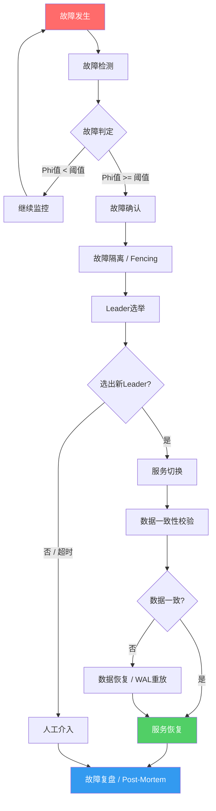

## 本章小结

本章系统构建了故障转移与恢复的完整知识体系——从故障的发现（检测算法），到权力的交接（Leader选举），再到状态的修复（数据恢复），最后到架构的兜底（灾备设计），形成了一条完整的技术链路。以下对全章内容进行结构化回顾，并提炼实战中最关键的决策要点。

---

### 一、核心知识体系回顾

#### 1.1 故障检测：系统的"眼睛"

故障检测是整个故障转移链路的起点。检测的准确性与速度直接决定了后续所有环节的效果——误判会导致不必要的切换，漏判则会让系统在无主状态下空转。

本章讲解了四种主流检测机制，它们各有适用场景：

| 检测算法 | 核心原理 | 判定方式 | 适用场景 | 典型代表 |
|---------|---------|---------|---------|---------|
| 心跳检测 | 定期发送探测包，超时判定故障 | 二元判定（存活/死亡） | 小规模集群、单机房环境 | Redis Sentinel |
| Phi Accrual | 基于历史心跳间隔分布计算怀疑度 | 连续值（Phi值），阈值可调 | 中大规模集群、网络环境复杂 | Akka Cluster、Cassandra |
| Gossip协议 | 节点间随机交换成员信息，最终收敛 | 最终一致性，超时后标记 | 去中心化架构、大规模集群 | AWS EC2、Consul |
| SWIM协议 | 直接Ping + 间接Ping + Piggyback传播 | 分离检测与传播 | 超大规模集群、对延迟敏感 | Hashicorp Memberlist |

**关键决策点**：选择检测算法时，核心权衡是**检测速度 vs 误判率**。心跳检测实现最简单但误判率高；Phi Accrual通过自适应阈值在两者间取得平衡，是当前工程实践中的主流选择；Gossip/SWIM适合节点数量极大、不希望存在单点检测瓶颈的场景。

#### 1.2 故障转移：权力的"交接"

故障转移的核心问题是：当Leader失效后，如何安全、快速地选出新Leader并完成服务切换。本章重点讲解了三个关键子问题：

**Leader选举算法**：

| 算法 | 任期机制 | 投票规则 | 日志一致性保障 | 适用场景 |
|------|---------|---------|--------------|---------|
| Bully | 无 | ID最大者胜出 | 不保障 | 简单场景，节点可靠性高 |
| Ring | 无 | 沿环传递选举消息 | 不保障 | 环形拓扑 |
| Raft | 有（Term递增） | 多数票 + 日志最新优先 | 保障（Log Matching） | 通用分布式系统 |
| ZAB | 有（Epoch递增） | 多数票 + 事务ID比较 | 保障（ZXID） | ZooKeeper生态 |

**脑裂预防**：脑裂是故障转移中最危险的场景——两个节点同时认为自己是Leader，同时接受写入导致数据不一致。本章讲解了三种预防手段：

- **STONITH（硬件Fence）**：通过IPMI/iLO等硬件接口强制关闭旧节点，最暴力但最可靠
- **仲裁机制（Quorum）**：集群节点数为奇数，只有包含多数节点的分区能继续服务
- **Fencing（租约机制）**：主节点需定期续约，分区导致无法续约时自动丧失Leader身份

**Fencing技术**：确保故障节点不会对系统造成"二次伤害"。硬Fencing（STONITH）通过硬件断电；软Fencing通过分布式锁租约过期实现逻辑隔离。实践中通常两者结合使用——租约提供快速的逻辑隔离，STONITH作为最终兜底。

#### 1.3 数据恢复：状态的"修复"

数据恢复解决的是"故障之后，如何让数据回到正确状态"。本章从三个维度构建了完整的恢复体系：

**WAL（Write-Ahead Logging）预写日志**：

写入请求 → 先写WAL → 再写内存/缓存 → 异步刷盘
                                              ↓
崩溃恢复时：重放WAL中未刷盘的记录 → 恢复到崩溃前状态

WAL的核心价值是将随机写转为顺序写（提升写入性能），同时提供崩溃恢复能力。关键参数包括WAL文件大小、刷盘策略（fsync时机）、日志轮转策略。

**基于时间点的恢复（PITR, Point-in-Time Recovery）**：

PITR允许将数据库恢复到任意历史时间点。实现原理是：先恢复最近的全量备份，然后按时间顺序重放WAL/Binlog到目标时间点。关键考量：
- 恢复粒度取决于WAL/Binlog的保留时长
- 恢复时间 = 全量备份恢复时间 + WAL重放时间
- 需要管理WAL文件的存储成本和清理策略

**备份策略对比**：

| 备份类型 | 备份内容 | 恢复速度 | 存储成本 | 备份速度 | 适用场景 |
|---------|---------|---------|---------|---------|---------|
| 全量备份 | 全部数据 | 最快（单文件恢复） | 最高 | 最慢 | 小数据量、定期基线 |
| 增量备份 | 自上次备份后的变更 | 较慢（需依次重放） | 最低 | 最快 | 大数据量、频繁备份 |
| 差异备份 | 自上次全量后的变更 | 中等（全量+最近差异） | 中等 | 中等 | 平衡恢复速度与成本 |

实际生产中通常采用组合策略：每周一次全量备份 + 每天增量备份 + 关键操作前差异备份。

#### 1.4 灾备架构：最后的"兜底"

灾备架构是从系统设计层面为故障恢复提供的终极保障。本章讲解了灾备等级体系和核心设计指标：

**灾备等级（Tier 1 ~ Tier 6）**：

| 等级 | 名称 | RPO | RTO | 架构特点 | 年成本（相对值） |
|-----|------|-----|-----|---------|---------------|
| Tier 1 | 数据备份 | 24h+ | 24h+ | 本地备份 + 异地磁带/对象存储 | 1x |
| Tier 2 | 热备份站点 | 12-24h | 8-24h | 异地备份站点，手动切换 | 2-3x |
| Tier 3 | 温备份站点 | 1-12h | 4-8h | 异地预配置环境，半自动切换 | 4-6x |
| Tier 4 | 热备份 | <1h | 1-4h | 异地热备，自动切换 | 8-12x |
| Tier 5 | 双活站点 | 接近0 | 分钟级 | 两个站点同时服务 | 15-25x |
| Tier 6 | 多活多站点 | 0 | 秒级 | 多地多活，自动路由切换 | 30x+ |

**核心指标**：
- **RPO（Recovery Point Objective）**：可容忍的最大数据丢失量。RPO=0意味着零数据丢失，需要同步复制。
- **RTO（Recovery Time Objective）**：可容忍的最大服务中断时间。RTO越小，架构复杂度和成本越高。

选择灾备等级时需要在**成本、复杂度、业务可承受的损失**三者之间取平衡。金融核心系统通常要求Tier 5-6，一般业务系统Tier 3-4即可。

---

### 二、关键公式与模型速查

| 概念 | 公式/模型 | 说明 | 应用场景 |
|------|----------|------|---------|
| 可用性计算 | SLA = 正常运行时间 / 总时间 | 99.9% = 年停机8.76h；99.99% = 年停机52.6min | SLA目标制定 |
| RTO与RPO | 可用性 = MTBF / (MTBF + MTTR) | 降低MTTR（恢复时间）直接提升可用性 | 灾备等级选型 |
| Quorum | 多数票 = N/2 + 1（N为总节点数） | 5节点需3票，7节点需4票 | 集群规模规划 |
| Phi值计算 | Phi = -log10(P(无心跳超时概率)) | Phi=1 → 90%置信；Phi=8 → 几乎确定故障 | Phi Accrual阈值调优 |
| WAL恢复时间 | 恢复时间 = 全量恢复 + WAL重放时间 | WAL重放速度约为正常写入速度的2-5倍 | 恢复方案设计 |
| 备份窗口 | 备份时间 = 数据量 / 备份带宽 × 压缩比 | 需在业务低峰期完成 | 备份策略规划 |
| 级联故障传播 | 影响范围 ≈ 1 / (1 - 容错率)^级联层数 | 容错率越低，级联扩散越快 | 熔断/限流设计 |

---

### 三、故障转移与恢复的完整链路

下图展示了从故障发生到服务恢复的完整处理链路，以及本章各技术点在链路中的位置：

---

### 四、最佳实践清单

#### 4.1 故障检测

| 实践要点 | 具体要求 | 常见错误 |
|---------|---------|---------|
| 心跳超时参数 | 基于历史P99延迟的3-5倍，而非拍脑袋设定 | 固定使用3秒超时，不区分网络环境 |
| Phi Accrual阈值 | 敏感场景Phi=1.0，保守场景Phi=8.0 | 所有场景用同一个阈值 |
| 检测器独立部署 | 检测线程/进程与业务线程分离，避免GC暂停影响 | 检测逻辑嵌在业务代码中 |
| 告警分级 | SUSPECT→P3告警，DEAD→P1告警+自动转移 | 所有检测事件都发P1告警 |
| 检测结果持久化 | 将节点状态变更写入外部存储，避免检测器重启丢失 | 状态仅保存在内存 |

#### 4.2 故障转移

| 实践要点 | 具体要求 | 常见错误 |
|---------|---------|---------|
| 选举超时随机化 | Raft选举超时在[150ms, 300ms]间随机，避免同时发起选举 | 所有节点使用相同超时值 |
| 脑裂防护 | 生产环境必须配置STONITH或仲裁，不可只依赖软件检测 | 跨机房部署但未配置Fence设备 |
| 切换前数据校验 | 新Leader就任后校验日志完整性，丢弃过期数据 | 盲目切换，不检查日志一致性 |
| 灰度切换 | 先摘流量、再切写入、最后切读请求 | 一步到位直接切换 |
| 回滚预案 | 切换失败时能在60s内回滚到旧主 | 没有回滚方案就开始切换 |

#### 4.3 数据恢复

| 实践要点 | 具体要求 | 常见错误 |
|---------|---------|---------|
| 备份验证 | 每月执行一次恢复演练，验证备份可用性 | 只备份不验证，恢复时才发现备份损坏 |
| 3-2-1原则 | 3份副本、2种介质、1份异地 | 全部存放在同一机房 |
| PITR窗口 | WAL/Binlog保留时间 >= 最长可接受的RPO | WAL日志过早清理，无法恢复到目标时间点 |
| 恢复顺序 | 先恢复元数据（表结构），再恢复业务数据 | 直接恢复数据文件，忽略schema |
| 恢复后验证 | 恢复完成后执行数据一致性校验（checksum、行数比对） | 恢复后不验证，上线后才发现数据异常 |

#### 4.4 灾备架构

| 实践要点 | 具体要求 | 常见错误 |
|---------|---------|---------|
| RPO/RTO对齐业务 | 核心交易系统RPO≈0、RTO<5min；日志类系统RPO<1h可接受 | 所有系统都追求Tier 6，成本失控 |
| 灾备切换演练 | 至少每季度执行一次灾备切换演练 | 从不演练，真出事时才发现切换失败 |
| 数据同步验证 | 主备数据一致性定期校验（checksum比对） | 主备切换后才发现数据不一致 |
| 回切规划 | 主站恢复后制定回切方案，避免长期运行在灾备站 | 主站恢复后不回切，灾备站性能不足 |

---

### 五、常见误区与纠正

本章识别了故障转移与恢复实践中最具危害的十类误区，以下是核心纠正要点：

| 误区 | 危害 | 纠正方案 |
|------|------|---------|
| 心跳超时凭经验设定 | 误报频繁或检测迟钝 | 基于历史P99延迟的自适应超时（均值+3σ） |
| 盲目追求强一致性 | 系统性能和可用性严重下降 | 根据业务场景选择一致性级别（强一致/最终一致/因果一致） |
| 不做恢复演练 | 真故障时恢复失败 | 每月执行恢复演练，验证RTO/RPO达标 |
| 只做全量备份 | 备份时间窗口过长，存储成本高 | 全量+增量组合策略，合理规划备份窗口 |
| 灾备切换一步到位 | 切换过程引入新故障 | 灰度切换：摘流量→切写入→切读请求→验证→全量 |
| 忽略级联故障 | 单点故障扩散为系统级故障 | 熔断器（Circuit Breaker）+ 限流 + 舱壁隔离 |
| 复盘流于形式 | 同样的故障反复发生 | 聚焦根因分析（5 Whys），建立Action Items跟踪机制 |
| 脑裂防护依赖单一手段 | 特定场景下防护失效 | STONITH + Quorum + Lease多层防护 |

---

### 六、思考题

1. **检测算法选型**：一个跨3个可用区部署的5节点etcd集群，心跳间隔和超时时间应该如何设定？为什么固定超时不适合这个场景？Phi Accrual检测器的Phi阈值应该设为多少？请给出具体数值和推理过程。

2. **脑裂场景推演**：假设一个5节点的Raft集群，网络分区将集群拆分为{A,B}和{C,D,E}两个分区。请逐步推演两个分区各自的行为——谁会发起选举？谁能选出新Leader？{A,B}分区中的节点会如何处理客户端请求？如果旧Leader在{A,B}分区中，它还能接受写入吗？

3. **恢复方案设计**：某电商数据库大小为500GB，业务要求RPO<5分钟、RTO<30分钟。请设计备份策略（包括备份类型、频率、保留策略），并估算恢复所需时间。你的方案能否同时满足RPO和RTO要求？如果不能，需要做哪些架构调整？

4. **级联故障分析**：在一个微服务架构中，服务A调用B，B调用C。当C出现超时时，如果没有熔断机制，请分析故障如何级联传播到A。然后分别设计B和A层面的熔断策略，并说明如何通过混沌工程验证你的策略有效性。

5. **灾备等级决策**：一家初创公司有三类业务——核心支付系统、用户管理系统、内部日志分析系统。请为每类业务选择合适的灾备等级（Tier 1-6），并说明理由。如果总预算有限，应该如何分配？

---

### 七、下一步学习建议

#### 7.1 深入方向

| 方向 | 具体内容 | 推荐理由 |
|------|---------|---------|
| 分布式一致性协议 | Paxos、Raft论文精读，理解形式化证明 | 选举算法的理论基础 |
| 混沌工程 | Chaos Monkey、Litmus Chaos实践 | 验证故障转移策略的有效性 |
| 数据库恢复机制 | PostgreSQL WAL、MySQL InnoDB Redo Log源码阅读 | 理解WAL重放的工程实现细节 |
| 云原生高可用 | Kubernetes Pod Disruption Budget、Operator模式 | 云环境下的故障转移最佳实践 |

#### 7.2 推荐资源

**书籍**：
- 《Designing Data-Intensive Applications》（Martin Kleppmann）——分布式系统设计的权威参考，第5-8章深入讲解复制、分区、事务和一致性
- 《Distributed Systems》（Maarten van Steen, Andrew Tanenbaum）——分布式系统教科书，覆盖故障模型和容错算法
- 《Database Internals》（Alex Petrov）——深入数据库内部机制，覆盖WAL、复制、故障恢复

**论文**：
- Hayashibara et al. "The φ Accrual Failure Detector" (2004) ——Phi Accrual检测器的原始论文
- Ongaro & Ousterhout "In Search of an Understandable Consensus Algorithm" (2014) ——Raft协议论文
- Das et al. "SWIM: Scalable Weakly-consistent Infection-style Process Group Membership Protocol" (2002) ——SWIM协议论文

**开源项目源码**：
- etcd（Go）——Raft实现的工业级参考，包含Leader选举、日志复制、成员变更的完整实现
- Consul（Go）——基于Memberlist（SWIM协议实现）的服务发现与故障检测
- CockroachDB（Go）——Raft在分布式数据库中的应用，含数据恢复和备份机制
- Apache ZooKeeper（Java）——ZAB协议的实现，可对比Raft理解选举差异

**动手实践**：
- 在本地用Docker搭建3节点etcd集群，模拟节点故障，观察选举过程
- 编写一个简单的Raft选举模块，对比与etcd实现的差异
- 对MySQL开启Binlog，练习基于时间点恢复（PITR）操作
- 用Chaos Mesh对Kubernetes集群注入Pod故障，验证服务自动恢复能力

---

### 八、全章知识图谱

故障转移与恢复
├── 1. 故障检测（发现故障）
│   ├── 心跳检测（基础，二元判定）
│   ├── Phi Accrual（自适应，连续概率值）
│   ├── Gossip协议（去中心化，最终一致）
│   └── SWIM协议（改进Gossip，直接+间接Ping）
├── 2. 故障转移（权力交接）
│   ├── Leader选举
│   │   ├── Bully算法（最简，ID最大者胜）
│   │   ├── Ring算法（环形拓扑）
│   │   ├── Raft（任期+多数票+日志最新）
│   │   └── ZAB（Epoch+ZXID，ZooKeeper专用）
│   ├── 脑裂预防
│   │   ├── STONITH（硬件断电）
│   │   ├── Quorum（多数派仲裁）
│   │   └── Lease租约（逻辑隔离）
│   └── Fencing技术（硬Fencing + 软Fencing）
├── 3. 数据恢复（状态修复）
│   ├── WAL预写日志（崩溃恢复）
│   ├── PITR基于时间点恢复（任意时间点回溯）
│   ├── 备份策略（全量/增量/差异 + 3-2-1原则）
│   └── 一致性校验（checksum + 恢复演练）
├── 4. 灾备架构（终极兜底）
│   ├── 灾备等级 Tier 1~6
│   ├── RPO/RTO指标设计
│   └── 多活多站点架构
└── 5. 运维保障
    ├── 级联故障防控（熔断/限流/舱壁）
    ├── 故障复盘（Post-Mortem/5 Whys）
    └── 混沌工程验证

---

本章的核心思想可以概括为一句话：**故障不是意外，而是系统运行的常态。设计的目标不是消除故障，而是让系统在故障发生时能够快速检测、安全切换、正确恢复、持续可用。** 掌握了这条从"检测→转移→恢复→兜底"的完整链路，你就具备了构建高可用分布式系统的坚实基础。
