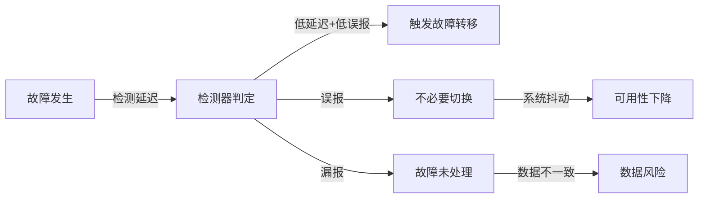
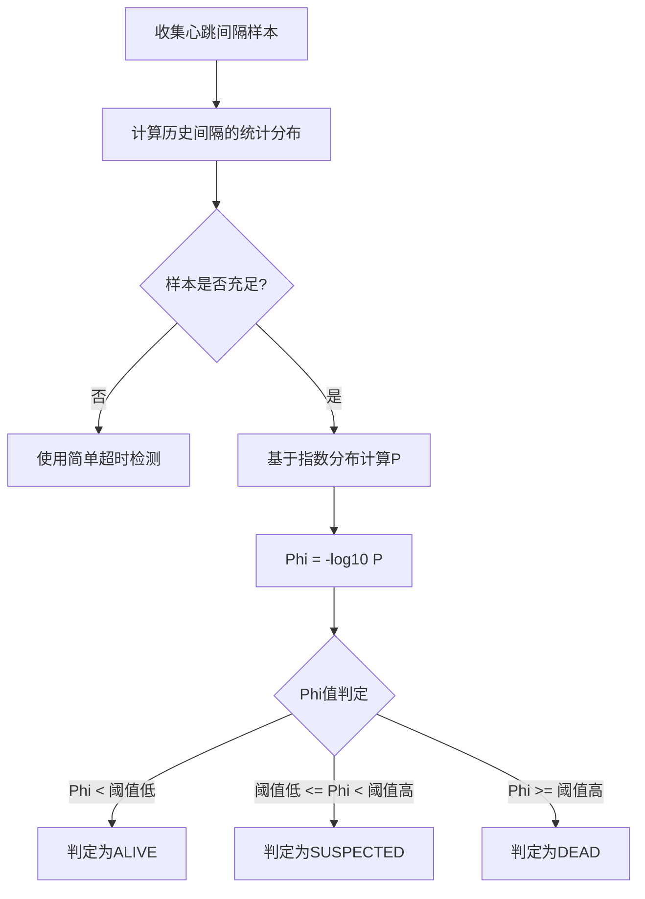
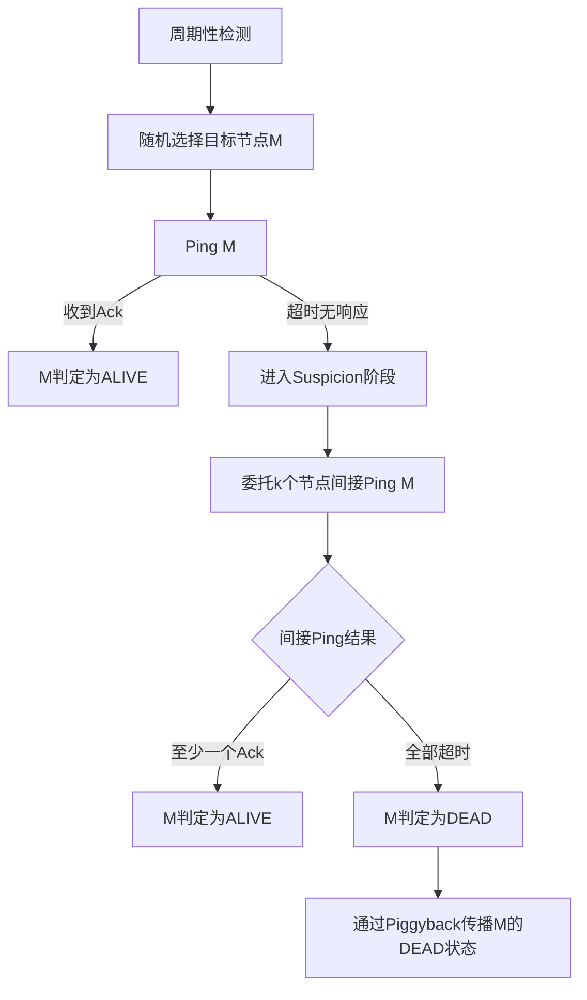
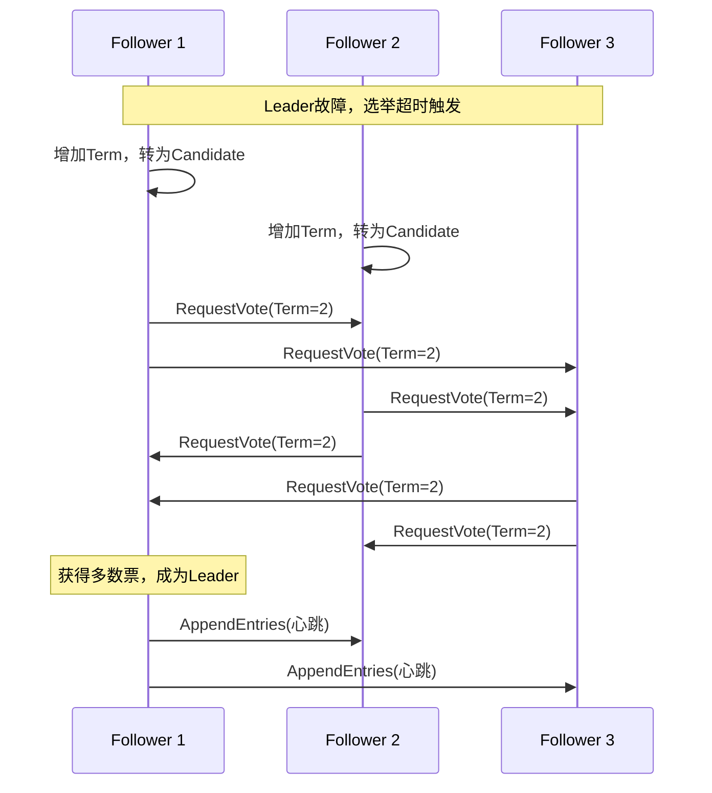
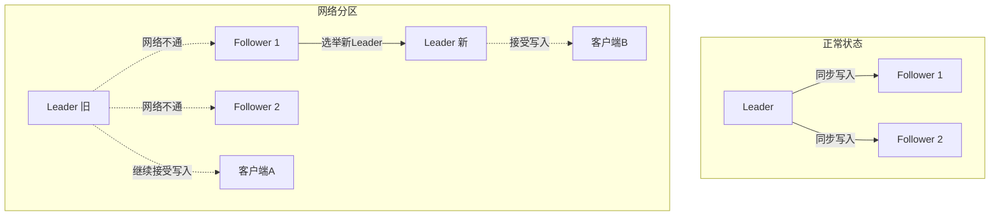
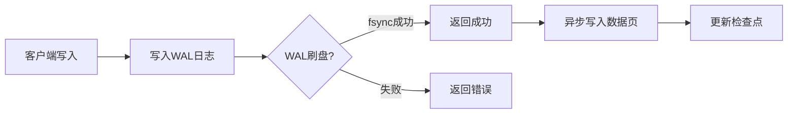
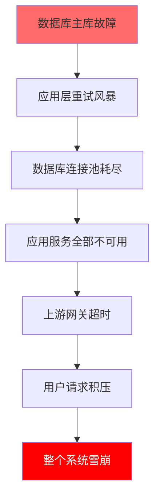

# 第52章 故障转移与恢复

***

## 章节定位

分布式系统中，故障不是异常而是常态。Google的SRE团队统计数据显示，大规模分布式系统每年因硬件故障、软件缺陷、网络分区、人为误操作等原因导致的停机事件在所难免。一个成熟的系统必须具备快速检测故障、自动完成转移、可靠恢复数据的能力。

本章系统讲解故障检测、自动故障转移、数据恢复与灾备的完整技术体系，覆盖从单机WAL日志到多站点灾备的全栈知识。阅读后你将能够：为生产系统设计可靠的故障检测方案，实施安全的自动故障转移策略，构建满足业务RPO/RTO要求的数据恢复和灾备体系。

***

## 核心内容

**故障检测机制**：从简单心跳检测到Phi Accrual故障检测器、Gossip协议和SWIM协议，讲解不同故障检测算法的原理、精度与适用场景，帮助读者根据系统特征选择合适的检测方案。

**自动故障转移**：深入分析Leader选举算法（Raft、ZAB）、脑裂预防机制（STONITH、仲裁机制）和Fencing技术，确保故障转移过程中的数据一致性与系统可用性。

**数据恢复技术**：讲解WAL（预写日志）重放机制、基于时间点的恢复（PITR）原理与实现，以及不同数据库引擎的恢复策略对比。

**备份策略设计**：系统对比全量备份、增量备份和差异备份的原理与实现，讲解备份一致性保障、备份验证与恢复演练方法。

**灾备架构**：从Pilot Light到多活多站点，逐级讲解灾备等级（Tier 1到Tier 6）的架构设计、RPO/RTO指标与成本权衡。

**级联故障与复盘**：分析级联故障的传播机制与防控手段，以及故障复盘（Post-Mortem）的标准流程与文化建设。

***

## 学习目标

1. 掌握主流故障检测算法的原理与实现
2. 理解自动故障转移的完整流程与一致性保障
3. 能够设计合理的备份策略与恢复方案
4. 了解灾备架构的分级设计方法
5. 掌握故障复盘的标准流程

***

## 前置知识

- 分布式一致性基础（CAP、Raft）
- 网络编程与协议基础
- 操作系统进程管理

***

# 52.1 理论基础：故障转移与恢复的核心原理

***

## 一、故障检测机制

故障检测是故障转移的第一步，也是最关键的一步。一个理想的故障检测器需要在检测速度和准确性之间取得平衡——检测太快可能导致误报（False Positive），将正常的节点判定为故障；检测太慢则会延长系统不可用的时间。检测器的核心评价指标有四个：

- **检测延迟（Detection Delay）**：从故障实际发生到检测器判定故障的时间间隔
- **误报率（False Positive Rate）**：将正常节点误判为故障的比例
- **漏报率（False Negative Rate）**：将故障节点误判为正常的比例
- **消息开销（Message Overhead）**：检测过程产生的额外网络流量



### 1.1 心跳检测（Heartbeat）

心跳检测是最基本的故障检测机制。检测节点定期向被检测节点发送心跳消息，如果在超时时间内没有收到响应，则判定被检测节点故障。

心跳检测的核心参数有两个：心跳间隔（Heartbeat Interval）和超时时间（Timeout）。心跳间隔决定了检测的频率，超时时间决定了故障判定的延迟。通常超时时间设置为心跳间隔的2到3倍，以容忍网络的瞬时抖动。

```python
import threading
import time
from enum import Enum

class NodeState(Enum):
    ALIVE = "alive"
    SUSPECTED = "suspected"
    DEAD = "dead"

class HeartbeatDetector:
    def __init__(self, heartbeat_interval=1.0, timeout=3.0):
        self.heartbeat_interval = heartbeat_interval
        self.timeout = timeout
        self.nodes = {}  # node_id -> last_heartbeat_time
        self.node_states = {}  # node_id -> NodeState
        self.callbacks = []
        self._lock = threading.Lock()
    
    def register_node(self, node_id):
        with self._lock:
            self.nodes[node_id] = time.time()
            self.node_states[node_id] = NodeState.ALIVE
    
    def on_heartbeat(self, node_id):
        """收到心跳时调用"""
        with self._lock:
            self.nodes[node_id] = time.time()
            if self.node_states.get(node_id) != NodeState.ALIVE:
                old_state = self.node_states.get(node_id)
                self.node_states[node_id] = NodeState.ALIVE
                self._notify(node_id, old_state, NodeState.ALIVE)
    
    def check_all(self):
        """定期检查所有节点的状态"""
        current_time = time.time()
        with self._lock:
            for node_id, last_time in self.nodes.items():
                elapsed = current_time - last_time
                old_state = self.node_states[node_id]
                
                if elapsed > self.timeout:
                    new_state = NodeState.DEAD
                elif elapsed > self.heartbeat_interval * 1.5:
                    new_state = NodeState.SUSPECTED
                else:
                    new_state = NodeState.ALIVE
                
                if old_state != new_state:
                    self.node_states[node_id] = new_state
                    self._notify(node_id, old_state, new_state)
    
    def on_state_change(self, callback):
        self.callbacks.append(callback)
    
    def _notify(self, node_id, old_state, new_state):
        for callback in self.callbacks:
            callback(node_id, old_state, new_state)
```

心跳检测的局限在于它使用固定的超时阈值。在实际环境中，网络延迟是动态变化的——在低负载时可能只需要100毫秒就能收到心跳响应，在高负载时可能需要500毫秒。使用固定的阈值要么太敏感（低负载时），要么太迟钝（高负载时）。此外，节点自身的GC暂停、磁盘IO抖动也会导致短暂的心跳延迟，固定阈值无法区分"网络问题"和"节点繁忙"。

### 1.2 Phi Accrual故障检测器

Phi Accrual故障检测器由Hayashibara等人在2004年提出，它不使用固定的超时阈值，而是根据历史心跳间隔的分布来动态计算一个"怀疑级别"（Phi值）。

Phi值的含义是：当前时间点判定节点故障的置信度。具体来说，Phi = -log10(P(下一个心跳延迟 > 当前已过时间))，其中P是基于历史数据估算的概率。例如Phi=1表示有约90%的把握认为节点故障，Phi=2表示有约99%的把握，Phi=3表示有约99.9%的把握。这种自适应的方式能够更好地适应网络延迟的动态变化。



```python
import math
import time
from collections import deque

class PhiAccrualDetector:
    def __init__(self, window_size=200, min_samples=10):
        self.window_size = window_size
        self.min_samples = min_samples
        self.intervals = {}  # node_id -> deque of intervals
        self.last_heartbeat = {}  # node_id -> timestamp
    
    def on_heartbeat(self, node_id):
        current = time.time()
        if node_id in self.last_heartbeat:
            interval = current - self.last_heartbeat[node_id]
            if node_id not in self.intervals:
                self.intervals[node_id] = deque(maxlen=self.window_size)
            self.intervals[node_id].append(interval)
        self.last_heartbeat[node_id] = current
    
    def compute_phi(self, node_id):
        """计算当前时间点的Phi值"""
        if node_id not in self.last_heartbeat:
            return float('inf')
        
        if node_id not in self.intervals or \
           len(self.intervals[node_id]) < self.min_samples:
            # 样本不足，使用简单心跳检测
            elapsed = time.time() - self.last_heartbeat[node_id]
            return elapsed / 5.0  # 假设5秒超时
        
        # 计算历史间隔的均值和标准差
        intervals = list(self.intervals[node_id])
        mean = sum(intervals) / len(intervals)
        variance = sum((x - mean) ** 2 for x in intervals) / len(intervals)
        std = math.sqrt(variance) if variance > 0 else mean * 0.1
        
        # 当前距离上次心跳的时间
        elapsed = time.time() - self.last_heartbeat[node_id]
        
        # 计算P(x > elapsed)，即在当前时间点还没收到心跳的概率
        # 使用正态分布近似
        if std == 0:
            p_later = 1.0 if elapsed > mean else 0.0
        else:
            # 使用指数分布近似（更适合心跳间隔建模）
            p_later = math.exp(-elapsed / mean) if mean > 0 else 1.0
        
        if p_later == 0:
            return float('inf')
        
        phi = -math.log10(p_later)
        return phi
    
    def is_alive(self, node_id, threshold=1.0):
        return self.compute_phi(node_id) < threshold
    
    def is_suspected(self, node_id, threshold_low=1.0, threshold_high=8.0):
        phi = self.compute_phi(node_id)
        return threshold_low <= phi < threshold_high
    
    def is_dead(self, node_id, threshold=8.0):
        return self.compute_phi(node_id) >= threshold
```

Phi Accrual故障检测器被广泛应用于分布式系统中，Akka框架的集群模块和Apache Cassandra都使用了这种检测方式。它的一个重要优势是可调节的阈值——在不同场景下可以根据容忍度调整Phi阈值，而不必修改检测算法本身。实际部署时的推荐阈值如下：

| 场景 | Phi阈值 | 效果 |
|------|---------|------|
| 低延迟内网 | 1.0-2.0 | 快速检测，适合对可用性要求极高的核心服务 |
| 一般生产环境 | 2.0-3.0 | 平衡检测速度和误报率 |
| 高延迟/跨机房 | 3.0-5.0 | 保守策略，降低误报率 |
| 异步批处理任务 | 5.0-8.0 | 极度容忍延迟波动，仅检测真正的宕机 |

### 1.3 Gossip协议

Gossip协议（也称为Epidemic Protocol，流行病协议）是一种去中心化的信息传播机制。每个节点定期随机选择几个节点交换信息，通过这种随机传播的方式，信息最终会扩散到集群中的所有节点。

在故障检测场景中，Gossip协议的工作方式如下：每个节点维护一个成员列表，包含所有已知节点及其最后更新时间；每个节点周期性地随机选择若干节点交换成员列表；如果某个节点的最后更新时间超过阈值，则标记为疑似故障；如果疑似故障状态持续超过另一个阈值，则标记为故障。

Gossip协议的信息传播速度可以用以下公式近似：对于N个节点的集群，每次随机选择K个目标，信息在O(log(N)/K)轮Gossip后可以覆盖所有节点。例如，一个100个节点的集群，每次选择3个目标，大约需要log(100)/3 ≈ 1.5轮，即大约2轮Gossip即可传播到所有节点。

```python
import random
import time
import threading

class GossipMember:
    def __init__(self, node_id, address):
        self.node_id = node_id
        self.address = address
        self.heartbeat = 0
        self.last_update = time.time()
        self.state = "ALIVE"  # ALIVE, SUSPECT, DEAD

class GossipProtocol:
    def __init__(self, node_id, address, 
                 gossip_interval=1.0, 
                 suspect_timeout=5.0,
                 dead_timeout=15.0):
        self.node_id = node_id
        self.address = address
        self.gossip_interval = gossip_interval
        self.suspect_timeout = suspect_timeout
        self.dead_timeout = dead_timeout
        self.members = {}  # node_id -> GossipMember
        self.heartbeat_counter = 0
        self._lock = threading.Lock()
    
    def join(self, seed_nodes):
        """通过种子节点加入集群"""
        for seed in seed_nodes:
            self._sync_member_list(seed)
    
    def tick(self):
        """每个心跳周期调用"""
        self.heartbeat_counter += 1
        
        # 更新自己的心跳
        with self._lock:
            self.members[self.node_id].heartbeat = self.heartbeat_counter
            self.members[self.node_id].last_update = time.time()
        
        # 随机选择节点发送Gossip
        targets = self._select_gossip_targets(3)
        for target in targets:
            self._send_gossip(target)
        
        # 检查超时节点
        self._check_timeouts()
    
    def _select_gossip_targets(self, count):
        with self._lock:
            alive = [m for m in self.members.values() 
                    if m.node_id != self.node_id and m.state == "ALIVE"]
            return random.sample(alive, min(count, len(alive)))
    
    def _send_gossip(self, target):
        with self._lock:
            member_digest = {
                mid: (m.heartbeat, m.state, m.last_update)
                for mid, m in self.members.items()
            }
        # 实际实现中通过网络发送member_digest到target
        # target收到后合并信息
        self._merge_digest(target.node_id, member_digest)
    
    def _merge_digest(self, sender_id, digest):
        """合并从其他节点收到的成员信息"""
        with self._lock:
            for node_id, (heartbeat, state, timestamp) in digest.items():
                if node_id in self.members:
                    existing = self.members[node_id]
                    if heartbeat > existing.heartbeat:
                        existing.heartbeat = heartbeat
                        existing.last_update = time.time()
                        existing.state = state
                else:
                    # 发现新节点
                    new_member = GossipMember(node_id, "")
                    new_member.heartbeat = heartbeat
                    new_member.last_update = time.time()
                    new_member.state = state
                    self.members[node_id] = new_member
    
    def _check_timeouts(self):
        current = time.time()
        with self._lock:
            for member in self.members.values():
                if member.node_id == self.node_id:
                    continue
                elapsed = current - member.last_update
                if member.state == "ALIVE" and elapsed > self.suspect_timeout:
                    member.state = "SUSPECT"
                elif member.state == "SUSPECT" and elapsed > self.dead_timeout:
                    member.state = "DEAD"
```

Gossip协议的优点是去中心化、容错性好、实现简单。但它的缺点是最终一致性——信息传播需要一定的时间，集群中的不同节点可能在短时间内对某个节点的状态有不同的判断。这在需要全局一致的故障判定时是一个限制。

### 1.4 SWIM协议

SWIM（Scalable Weakly-consistent Infection-style Process Group Membership）协议是对Gossip协议的改进，由Das Gupta等人在2002年提出。它在保持Gossip协议优点的同时，解决了两个关键问题：检测延迟和消息数量的可扩展性。

SWIM的核心思想是将故障检测和信息传播分离：

- **故障检测**：通过随机选择一个节点进行直接Ping来完成。如果Ping在超时时间内没有响应，则委托其他k个节点进行间接Ping（Suspicion Subprotocol）。只有当间接Ping也失败时，才判定节点故障。
- **信息传播**：通过Piggyback方式——将成员状态变更信息附着在正常的检测消息上传播，而不是单独发送Gossip消息，从而大幅减少消息数量。



SWIM还引入了周期性的自我确认机制——如果一个节点在一定时间内没有收到任何针对自己的探测请求，它会主动向随机节点发送确认请求，以验证自己的可达性。这避免了网络分区时节点"孤立"但不自知的问题。

SWIM协议相比Gossip协议的关键改进在于：

| 特性 | Gossip | SWIM |
|------|--------|------|
| 检测方式 | 每个节点独立检测所有已知节点 | 集中式周期性检测，每次只检测一个节点 |
| 消息复杂度 | O(N)每轮（N为节点数） | O(1)每轮（固定数量的Ping和间接Ping） |
| 检测延迟 | 取决于Gossip传播速度 | 直接Ping+间接Ping，延迟可控 |
| 误判处理 | 依赖超时阈值 | Suspicion机制提供缓冲期 |
| 信息传播 | 独立Gossip周期 | Piggyback在检测消息上，零额外开销 |
| 实际应用 | AWS DynamoDB | HashiCorp Consul, IPFS, Memberlist |

### 1.5 故障检测算法对比与选择

选择哪种故障检测算法需要根据系统的具体需求来权衡。以下是各算法的综合对比：

| 维度 | 心跳检测 | Phi Accrual | Gossip | SWIM |
|------|---------|-------------|--------|------|
| 实现复杂度 | 低 | 中 | 中 | 中高 |
| 自适应能力 | 无 | 强 | 弱 | 中 |
| 去中心化 | 否 | 否 | 是 | 是 |
| 检测精度 | 低 | 高 | 中 | 高 |
| 消息开销 | 低 | 低 | 中 | 低 |
| 适用场景 | 单主多从 | 通用集群 | 大规模P2P | 大规模有状态集群 |
| 代表系统 | MySQL MHA | Akka, Cassandra | AWS DynamoDB | Consul, IPFS |

生产环境的推荐组合策略是：第一层使用心跳检测（秒级响应，作为快速通道），第二层使用Phi Accrual检测器（自适应阈值，降低误报），第三层使用应用层健康检查（验证业务功能是否正常）。只有当多层检测都确认节点故障时，才触发故障转移。

***

## 二、自动故障转移

### 2.1 Leader选举

在主从架构中，当主节点故障时，需要从从节点中选出一个新的主节点。Leader选举算法是自动故障转移的核心。选举过程必须满足两个基本约束：（1）任何时刻最多只有一个Leader（Safety）；（2）只要多数节点存活，最终一定能选出Leader（Liveness）。



**Raft选举**：Raft协议将时间划分为任期（Term），每个任期最多有一个Leader。当Follower在超时时间内没有收到Leader的心跳时，会自增任期并发起选举（RequestVote RPC）。候选人需要获得多数节点的投票才能成为Leader。

```python
import random
import threading
import time

class RaftNode:
    FOLLOWER = "follower"
    CANDIDATE = "candidate"
    LEADER = "leader"
    
    def __init__(self, node_id, peers):
        self.node_id = node_id
        self.peers = peers
        self.state = self.FOLLOWER
        self.current_term = 0
        self.voted_for = None
        self.log = []
        self.election_timeout = self._random_timeout()
        self.last_heartbeat = time.time()
        self.votes_received = 0
        self._lock = threading.Lock()
    
    def _random_timeout(self):
        return random.uniform(0.15, 0.3)
    
    def start_election(self):
        with self._lock:
            self.current_term += 1
            self.state = self.CANDIDATE
            self.voted_for = self.node_id
            self.votes_received = 1
            self.election_timeout = self._random_timeout()
            self.last_heartbeat = time.time()
        
        # 向所有节点请求投票
        for peer in self.peers:
            self._send_vote_request(peer)
    
    def _send_vote_request(self, peer):
        last_log_index = len(self.log) - 1
        last_log_term = self.log[-1].term if self.log else 0
        
        # 实际实现中通过RPC发送
        # peer.handle_vote_request(self.current_term, 
        #     self.node_id, last_log_index, last_log_term)
    
    def handle_vote_request(self, term, candidate_id, 
                           last_log_index, last_log_term):
        with self._lock:
            if term < self.current_term:
                return False, self.current_term
            
            if term > self.current_term:
                self.current_term = term
                self.state = self.FOLLOWER
                self.voted_for = None
            
            # 检查日志是否至少和候选人一样新
            my_last_term = self.log[-1].term if self.log else 0
            my_last_index = len(self.log) - 1
            
            log_ok = (last_log_term > my_last_term) or \
                (last_log_term == my_last_term and 
                 last_log_index >= my_last_index)
            
            if self.voted_for is None or self.voted_for == candidate_id:
                if log_ok:
                    self.voted_for = candidate_id
                    self.last_heartbeat = time.time()
                    return True, self.current_term
            
            return False, self.current_term
    
    def handle_vote_response(self, term, vote_granted):
        with self._lock:
            if term > self.current_term:
                self.current_term = term
                self.state = self.FOLLOWER
                return
            
            if self.state != self.CANDIDATE:
                return
            
            if vote_granted:
                self.votes_received += 1
                # 获得多数票，成为Leader
                if self.votes_received > (len(self.peers) + 1) / 2:
                    self.state = self.LEADER
    
    def check_election_timeout(self):
        if time.time() - self.last_heartbeat > self.election_timeout:
            if self.state != self.LEADER:
                self.start_election()
```

**ZAB协议**：ZAB（ZooKeeper Atomic Broadcast）是ZooKeeper使用的共识协议，与Raft在思想上有很多相似之处，但在实现细节上有显著差异：

| 对比维度 | Raft | ZAB |
|---------|------|-----|
| 选举方式 | 投票制（RequestVote RPC） | 先到先得（zxid最大的优先） |
| Leader唯一性保证 | Term + 多数票 | zxid最大 + Epoch递增 |
| 日志复制 | 追加到Leader日志后广播 | 通过Proposal + Commit两阶段 |
| 节点角色 | Follower/Candidate/Leader | Follower/Candidate/Leader |
| 崩溃恢复 | 从Leader的日志同步 | 从最新zxid的节点恢复 |
| 典型应用 | etcd, Consul, TiKV | ZooKeeper, Kafka (旧版) |

ZAB的选举策略核心是：zxid（事务ID）最大的节点优先成为Leader，因为zxid最大意味着它拥有最新的数据。如果zxid相同，则比较epoch（任期），较大的epoch优先。这种策略确保了选出的Leader一定拥有所有已提交的事务。

### 2.2 脑裂预防

脑裂（Split-Brain）是指在主从架构中，由于网络分区，同时存在两个节点都认为自己是主节点。这会导致数据写入不一致——两个主节点同时接受写入，导致数据冲突。脑裂是分布式系统中最危险的数据一致性问题之一。



**STONITH**（Shoot The Other Node In The Head）是一种暴力但有效的脑裂解决方案。当一个节点被选为新主后，它通过硬件管理接口（如IPMI、iLO）强制关闭旧主节点，确保只有一个主节点存在。

```python
class StonithManager:
    def __init__(self):
        self.fence_devices = {}
    
    def register_device(self, node_id, device_type, address, credentials):
        self.fence_devices[node_id] = {
            'type': device_type,  # ipmi, ilo, drac
            'address': address,
            'credentials': credentials
        }
    
    def fence(self, node_id):
        """强制隔离指定节点"""
        device = self.fence_devices.get(node_id)
        if not device:
            raise ValueError(f"No fence device for node {node_id}")
        
        if device['type'] == 'ipmi':
            return self._fence_ipmi(device)
        elif device['type'] == 'ilo':
            return self._fence_ilo(device)
        
        raise ValueError(f"Unknown device type: {device['type']}")
    
    def _fence_ipmi(self, device):
        """通过IPMI接口强制关闭节点"""
        import subprocess
        cmd = [
            'ipmitool', '-I', 'lanplus',
            '-H', device['address'],
            '-U', device['credentials']['username'],
            '-P', device['credentials']['password'],
            'power', 'off'
        ]
        result = subprocess.run(cmd, capture_output=True, text=True)
        return result.returncode == 0
    
    def _fence_ilo(self, device):
        """通过HP iLO接口强制关闭节点"""
        import subprocess
        cmd = [
            'ssh', f"{device['credentials']['username']}@{device['address']}",
            'poweroff'
        ]
        result = subprocess.run(cmd, capture_output=True, text=True)
        return result.returncode == 0
```

STONITH的实现方式对比：

| 方式 | 延迟 | 可靠性 | 依赖条件 | 适用场景 |
|------|------|--------|---------|---------|
| IPMI power off | 5-15秒 | 高 | 带外管理网络 | 物理服务器 |
| iLO/DRAC | 5-10秒 | 高 | 带外管理网络 | HP/Dell服务器 |
| 云平台API | 10-30秒 | 高 | 云API凭证 | 云环境（AWS/阿里云） |
| SSH + poweroff | 3-8秒 | 中 | SSH可达 | 开发测试环境 |
| Watchdog Timer | <1秒 | 高 | 硬件支持 | 低延迟要求 |

**仲裁机制**（Quorum）是另一种脑裂预防方式。集群中的节点数通常为奇数（如3、5、7），当发生网络分区时，只有包含多数节点的分区才能继续工作。少数分区中的节点会自动降级为只读或停止服务。

```python
class QuorumManager:
    def __init__(self, total_nodes):
        self.total_nodes = total_nodes
        self.quorum_size = total_nodes // 2 + 1
        self.active_nodes = set()
        self._lock = threading.Lock()
    
    def has_quorum(self):
        with self._lock:
            return len(self.active_nodes) >= self.quorum_size
    
    def node_alive(self, node_id):
        with self._lock:
            self.active_nodes.add(node_id)
    
    def node_failed(self, node_id):
        with self._lock:
            self.active_nodes.discard(node_id)
        
        if not self.has_quorum():
            self._step_down()
    
    def _step_down(self):
        """失去仲裁，降级为只读或停止服务"""
        print("Lost quorum, stepping down to read-only mode")
```

仲裁机制在实际应用中的一个关键问题是"少数派的处理"。当网络分区恢复后，少数派分区需要将自己的数据与多数派对齐，这通常意味着丢弃少数派在分区期间写入的数据。这种设计体现了CAP定理中AP（可用性+分区容忍）的选择——宁可丢弃数据，也要保证系统的一致性。

### 2.3 Fencing技术

Fencing是确保故障节点不会对系统造成进一步影响的技术。除了STONITH这种"硬fencing"外，还有"软fencing"方式，如通过分布式锁或租约（Lease）机制来限制故障节点的影响范围。

租约机制的原理是：主节点需要定期续约才能保持其主节点身份。如果主节点因网络分区无法续约，租约到期后它会自动失去主节点身份。新主节点需要等待旧租约到期后才能获取新租约，从而避免了脑裂。

```java
public class LeaseBasedLeadership {
    
    private final DistributedLock lock;
    private final long leaseDurationMs;
    private volatile boolean isLeader = false;
    private volatile long leaseExpiry = 0;
    
    public LeaseBasedLeadership(DistributedLock lock, long leaseDurationMs) {
        this.lock = lock;
        this.leaseDurationMs = leaseDurationMs;
    }
    
    public boolean tryAcquireLeadership() {
        boolean acquired = lock.tryLock("leader-lease", leaseDurationMs);
        if (acquired) {
            isLeader = true;
            leaseExpiry = System.currentTimeMillis() + leaseDurationMs;
        }
        return acquired;
    }
    
    public boolean renewLease() {
        if (!isLeader) return false;
        
        boolean renewed = lock.renewLock("leader-lease", leaseDurationMs);
        if (renewed) {
            leaseExpiry = System.currentTimeMillis() + leaseDurationMs;
        } else {
            // 续约失败，可能已被其他节点抢占
            isLeader = false;
        }
        return renewed;
    }
    
    public boolean isLeader() {
        if (isLeader &amp;&amp; System.currentTimeMillis() > leaseExpiry) {
            isLeader = false;
        }
        return isLeader;
    }
}
```

Fencing技术的关键设计原则是：**任何在故障转移期间持有旧租约的节点，都必须无法影响新Leader的数据**。这意味着新Leader在提升前，必须确保旧Leader的租约已经过期，或者通过STONITH强制终止旧Leader。如果跳过这一步，可能出现旧Leader在租约过期前继续写入数据的情况，导致数据不一致。

***

## 三、数据恢复技术

### 3.1 WAL（预写日志）

WAL（Write-Ahead Logging）是数据库保证数据持久性和实现崩溃恢复的核心机制。其基本思想是：在数据变更写入磁盘之前，必须先将变更记录写入日志。这样即使数据库在写入数据文件时崩溃，也可以通过重放日志来恢复数据。



PostgreSQL的WAL实现是业界的典范。每一条WAL记录包含：LSN（日志序列号）、事务ID、操作类型、数据页地址和变更内容。数据库崩溃恢复时，从最后一个检查点开始重放WAL记录，将数据库恢复到崩溃前的一致状态。

```python
class WALEntry:
    def __init__(self, lsn, txn_id, op_type, page_id, data):
        self.lsn = lsn          # 日志序列号
        self.txn_id = txn_id    # 事务ID
        self.op_type = op_type  # INSERT, UPDATE, DELETE
        self.page_id = page_id  # 数据页ID
        self.data = data        # 变更数据
        self.timestamp = time.time()

class WALManager:
    def __init__(self, wal_dir):
        self.wal_dir = wal_dir
        self.current_lsn = 0
        self.wal_file = None
        self.checkpoint_lsn = 0
        self.dirty_pages = {}  # page_id -> page_data
    
    def write_wal(self, txn_id, op_type, page_id, data):
        """写入WAL记录"""
        self.current_lsn += 1
        entry = WALEntry(
            self.current_lsn, txn_id, op_type, page_id, data
        )
        
        # 先写WAL
        self._append_to_wal(entry)
        
        # 再修改内存中的数据页
        self.dirty_pages[page_id] = data
        
        return entry.lsn
    
    def commit_transaction(self, txn_id):
        """提交事务：写入COMMIT记录并刷盘"""
        self.current_lsn += 1
        commit_entry = WALEntry(
            self.current_lsn, txn_id, 'COMMIT', None, None
        )
        self._append_to_wal(commit_entry)
        self._flush_wal()  # 确保COMMIT记录落盘
    
    def checkpoint(self):
        """执行检查点"""
        # 将所有脏页刷到数据文件
        for page_id, data in self.dirty_pages.items():
            self._flush_page(page_id, data)
        
        self.dirty_pages.clear()
        self.checkpoint_lsn = self.current_lsn
        
        # 写入检查点记录
        self.current_lsn += 1
        ckpt_entry = WALEntry(
            self.current_lsn, 0, 'CHECKPOINT', None, None
        )
        self._append_to_wal(ckpt_entry)
        self._flush_wal()
    
    def recover(self):
        """崩溃恢复：从检查点开始重放WAL"""
        start_lsn = self.checkpoint_lsn
        wal_entries = self._read_wal_from(start_lsn)
        
        committed_txns = set()
        
        # 第一阶段：找出所有已提交的事务
        for entry in wal_entries:
            if entry.op_type == 'COMMIT':
                committed_txns.add(entry.txn_id)
        
        # 第二阶段：重放已提交事务的WAL记录
        for entry in wal_entries:
            if entry.txn_id in committed_txns and \
               entry.op_type in ('INSERT', 'UPDATE', 'DELETE'):
                self._replay_entry(entry)
```

不同数据库引擎的WAL实现对比：

| 特性 | PostgreSQL WAL | MySQL InnoDB Redo Log | Oracle Redo Log |
|------|---------------|----------------------|-----------------|
| 日志名称 | WAL | Redo Log | Redo Log |
| 刷盘策略 | wal_sync_method控制 | innodb_flush_log_at_trx_commit | COMMIT写入Redo Log Buffer后刷盘 |
| 检查点 | Background Checkpoint | Fuzzy Checkpoint | Incremental Checkpoint |
| 归档支持 | WAL Archiving | binlog | RMAN |
| PITR支持 | recovery_target_time | binlog + 时间戳 | SCN/时间戳 |

### 3.2 基于时间点的恢复（PITR）

PITR（Point-In-Time Recovery）允许将数据库恢复到过去任意一个时间点的状态。它基于全量备份加上WAL日志的重放来实现。

PITR的工作流程是：从最近的全量备份开始恢复，然后依次重放备份之后的WAL日志，直到目标时间点。为了支持PITR，需要保留备份点之后所有的WAL日志文件，这对存储空间有较高的要求。

```bash
# PostgreSQL PITR 恢复示例步骤

# 1. 停止数据库
pg_ctl stop -D /var/lib/postgresql/data

# 2. 恢复基础备份
rm -rf /var/lib/postgresql/data/*
tar xzf /backup/base_backup.tar.gz -C /var/lib/postgresql/data

# 3. 配置恢复参数
cat > /var/lib/postgresql/data/postgresql.auto.conf << EOF
restore_command = 'cp /archive/%f %p'
recovery_target_time = '2024-01-15 14:30:00'
recovery_target_action = 'promote'
EOF

# 创建恢复信号文件
touch /var/lib/postgresql/data/recovery.signal

# 4. 启动数据库（会自动进入恢复模式）
pg_ctl start -D /var/lib/postgresql/data

# 5. 恢复完成后数据库会自动提升为主库
```

PITR的关键注意事项：

1. **WAL归档必须开启**：PITR依赖完整的WAL日志链，如果归档中断，恢复只能到归档中断的时间点
2. **时钟同步**：恢复目标时间基于数据库服务器的本地时间，确保NTP同步
3. **测试恢复**：定期在独立环境测试PITR流程，确认归档日志的完整性
4. **恢复目标选择**：`recovery_target_time`可以精确到微秒，`recovery_target_xid`可以精确到事务

***

## 四、备份策略

### 4.1 全量备份

全量备份是将数据库的完整数据复制一份。它的优点是恢复简单快速——只需要一份备份即可恢复完整数据。缺点是备份时间长、占用存储空间大，对于大型数据库（TB级别）可能需要数小时才能完成。

### 4.2 增量备份

增量备份只备份自上次备份（任何类型）以来发生变化的数据。它需要一个基础备份和之后的所有增量备份才能恢复。增量备份速度快、占用空间少，但恢复过程复杂——需要按顺序应用基础备份和所有增量备份。

### 4.3 差异备份

差异备份备份自上次全量备份以来发生变化的数据。与增量备份不同，差异备份只需要一份全量备份和最新的差异备份即可恢复。它的备份速度介于全量和增量之间，恢复过程比增量备份简单。

三种备份策略的对比如下：

| 维度 | 全量备份 | 增量备份 | 差异备份 |
|------|---------|---------|---------|
| 备份速度 | 慢 | 快 | 中等 |
| 存储空间 | 大 | 小 | 中等 |
| 恢复速度 | 快 | 慢（需依次恢复） | 中等（只需全量+最新差异） |
| 恢复复杂度 | 低 | 高 | 中等 |
| 备份链长度 | 无 | 长 | 短（只到上次全量） |
| 适用场景 | 小型数据库、冷备 | 大型数据库、日常备份 | 中型数据库、平衡方案 |

```python
import shutil
import hashlib
import json
from datetime import datetime
from pathlib import Path

class BackupManager:
    def __init__(self, data_dir, backup_dir):
        self.data_dir = Path(data_dir)
        self.backup_dir = Path(backup_dir)
        self.metadata_file = self.backup_dir / "backup_metadata.json"
        self._load_metadata()
    
    def _load_metadata(self):
        if self.metadata_file.exists():
            with open(self.metadata_file) as f:
                self.metadata = json.load(f)
        else:
            self.metadata = {"backups": [], "last_full": None}
    
    def _save_metadata(self):
        with open(self.metadata_file, 'w') as f:
            json.dump(self.metadata, f, indent=2, default=str)
    
    def full_backup(self, label=None):
        """执行全量备份"""
        timestamp = datetime.now().strftime("%Y%m%d_%H%M%S")
        backup_name = f"full_{timestamp}"
        backup_path = self.backup_dir / backup_name
        
        backup_path.mkdir(parents=True, exist_ok=True)
        
        # 复制所有数据文件
        for item in self.data_dir.rglob("*"):
            if item.is_file():
                rel_path = item.relative_to(self.data_dir)
                dest = backup_path / rel_path
                dest.parent.mkdir(parents=True, exist_ok=True)
                shutil.copy2(item, dest)
        
        # 记录元数据
        record = {
            "type": "full",
            "name": backup_name,
            "timestamp": timestamp,
            "label": label,
            "files": self._compute_checksums(self.data_dir)
        }
        self.metadata["backups"].append(record)
        self.metadata["last_full"] = backup_name
        self._save_metadata()
        
        return backup_name
    
    def incremental_backup(self):
        """执行增量备份（基于上次备份的变更）"""
        last_backup = self.metadata["backups"][-1] if self.metadata["backups"] else None
        
        if not last_backup:
            raise ValueError("No previous backup found, run full backup first")
        
        timestamp = datetime.now().strftime("%Y%m%d_%H%M%S")
        backup_name = f"incr_{timestamp}"
        backup_path = self.backup_dir / backup_name
        backup_path.mkdir(parents=True, exist_ok=True)
        
        # 比较文件变更
        last_files = last_backup.get("files", {})
        current_files = self._compute_checksums(self.data_dir)
        
        changed_files = []
        for filepath, checksum in current_files.items():
            if filepath not in last_files or last_files[filepath] != checksum:
                src = self.data_dir / filepath
                dest = backup_path / filepath
                dest.parent.mkdir(parents=True, exist_ok=True)
                shutil.copy2(src, dest)
                changed_files.append(filepath)
        
        record = {
            "type": "incremental",
            "name": backup_name,
            "timestamp": timestamp,
            "base": last_backup["name"],
            "files": {f: current_files[f] for f in changed_files}
        }
        self.metadata["backups"].append(record)
        self._save_metadata()
        
        return backup_name, len(changed_files)
    
    def differential_backup(self):
        """执行差异备份（基于上次全量备份的变更）"""
        if not self.metadata["last_full"]:
            raise ValueError("No full backup found")
        
        # 找到最后一次全量备份
        full_backup = None
        for b in reversed(self.metadata["backups"]):
            if b["type"] == "full":
                full_backup = b
                break
        
        timestamp = datetime.now().strftime("%Y%m%d_%H%M%S")
        backup_name = f"diff_{timestamp}"
        backup_path = self.backup_dir / backup_name
        backup_path.mkdir(parents=True, exist_ok=True)
        
        last_files = full_backup.get("files", {})
        current_files = self._compute_checksums(self.data_dir)
        
        changed_files = []
        for filepath, checksum in current_files.items():
            if filepath not in last_files or last_files[filepath] != checksum:
                src = self.data_dir / filepath
                dest = backup_path / filepath
                dest.parent.mkdir(parents=True, exist_ok=True)
                shutil.copy2(src, dest)
                changed_files.append(filepath)
        
        record = {
            "type": "differential",
            "name": backup_name,
            "timestamp": timestamp,
            "base": full_backup["name"],
            "files": {f: current_files[f] for f in changed_files}
        }
        self.metadata["backups"].append(record)
        self._save_metadata()
        
        return backup_name
    
    def _compute_checksums(self, directory):
        checksums = {}
        for filepath in sorted(directory.rglob("*")):
            if filepath.is_file():
                rel_path = str(filepath.relative_to(directory))
                checksums[rel_path] = self._md5(filepath)
        return checksums
    
    def _md5(self, filepath):
        h = hashlib.md5()
        with open(filepath, 'rb') as f:
            for chunk in iter(lambda: f.read(8192), b''):
                h.update(chunk)
        return h.hexdigest()
```

### 4.4 备份一致性保障

在备份过程中，数据库可能仍在处理写入请求。如果不采取措施，备份的数据可能处于不一致状态——有些事务已提交但未写入数据文件，有些事务已写入但未提交。备份一致性保障的核心是确保备份的数据反映某个一致的时间点。

不同数据库的备份一致性方案：

| 数据库 | 方案 | 原理 | 影响 |
|--------|------|------|------|
| PostgreSQL | pg_dump --single-transaction | 在一个事务中导出所有数据 | 锁定DDL操作 |
| MySQL | mysqldump --single-transaction | InnoDB的MVCC快照读 | 不锁表，但消耗额外内存 |
| MySQL | Xtrabackup --lock-tables | 阻止DDL操作 | 允许DML，阻止DDL |
| MongoDB | mongodump | 热备，无锁 | 可能包含不一致数据 |
| Oracle | RMAN | 表空间级一致性快照 | 需要Oracle Enterprise |

***

## 五、RPO与RTO

RPO（Recovery Point Objective，恢复点目标）衡量的是系统能容忍的最大数据丢失量。例如RPO=1小时意味着最多可以丢失1小时的数据。RPO越小，对备份频率和复制延迟的要求越高，成本也越高。

RTO（Recovery Time Objective，恢复时间目标）衡量的是系统从故障到恢复服务的最长时间。例如RTO=30分钟意味着系统必须在30分钟内恢复。RTO越小，对自动故障转移和热备的要求越高。

RPO和RTO的组合决定了灾备架构的等级。低RPO和低RTO需要更多的硬件投入和更复杂的架构，而高RPO和高RTO则意味着可以使用更简单的方案。


RPO/RTO的典型业务要求：

| 业务类型 | 典型RPO | 典型RTO | 灾备等级 | 成本级别 |
|---------|---------|---------|---------|---------|
| 金融核心交易 | <1秒 | <30秒 | 多活 | 极高 |
| 电商平台 | <1分钟 | <5分钟 | 热备 | 高 |
| 企业OA系统 | <1小时 | <4小时 | 温备 | 中等 |
| 内部管理系统 | <24小时 | <24小时 | 冷备/备份 | 低 |
| 静态网站 | <24小时 | <8小时 | 备份 | 极低 |

***

## 六、灾备架构

灾备架构按照可用性等级从低到高分为多个层次，每个层次对应不同的RPO/RTO能力和成本投入：

| 等级 | 名称 | 架构描述 | RPO | RTO | 成本 | 适用场景 |
|------|------|---------|-----|-----|------|---------|
| Tier 0 | 无灾备 | 单站点，无备份 | N/A | N/A | 极低 | 开发测试环境 |
| Tier 1 | 备份恢复 | 定期备份+离线存储 | 小时-天 | 小时-天 | 低 | 非关键业务 |
| Tier 2 | Pilot Light | 最小核心基础设施保持运行 | 分钟-小时 | 小时 | 中低 | 可接受短时停机 |
| Tier 3 | Warm Standby | 缩减规模的完整环境 | 秒-分钟 | 分钟 | 中等 | 中等重要业务 |
| Tier 4 | Hot Standby | 实时同步的完整环境 | 秒级 | 秒-分钟 | 高 | 核心业务 |
| Tier 5 | Multi-Site Active/Active | 多站点同时处理流量 | 接近零 | 接近零 | 极高 | 金融/全球业务 |

**Tier 1 - Pilot Light（指示灯模式）**：在灾备站点只保留最小的核心基础设施（如数据库实例），不运行应用服务器。故障时需要手动启动应用层，RTO通常在小时级别。这是最经济的灾备方案，适合对RTO要求不高的场景。

**Tier 2 - Warm Standby（温备模式）**：灾备站点运行缩减规模的应用和数据库，可以快速扩展到全量规模。RTO通常在分钟级别。数据通过异步复制同步到灾备站点，存在一定的RPO。

**Tier 3 - Hot Standby（热备模式）**：灾备站点实时同步数据并保持应用就绪，可以快速接管流量。RTO通常在秒到分钟级别。数据通过同步或半同步复制，RPO极低。

**Tier 4 - Multi-Site Active/Active（多活模式）**：多个站点同时处理流量，互为备份。任何一个站点故障，其他站点可以无缝接管。RTO接近零。这是最复杂也是最昂贵的方案，需要解决数据冲突、流量路由、会话亲和性等一系列挑战。

### 灾备架构选型决策流程

选型时需要综合考虑以下因素：

1. **业务影响评估**：停机每分钟的损失是多少？数据丢失的可接受程度？
2. **RPO/RTO要求**：业务能容忍多少数据丢失和停机时间？
3. **预算约束**：灾备的硬件、软件、运维成本是否在预算内？
4. **运维复杂度**：团队是否有能力运维所选的灾备方案？
5. **合规要求**：行业监管是否有明确的灾备要求？

建议的选型路径：先明确RPO/RTO要求 → 评估业务影响 → 确定预算范围 → 选择匹配的灾备等级 → 设计具体架构 → 定期演练验证。

***

## 七、级联故障

级联故障是指一个组件的故障导致依赖它的其他组件也发生故障，进而引发更大范围的系统瘫痪。这是分布式系统中最危险的故障模式之一。



典型的级联故障场景：数据库主库故障→应用层重试风暴→数据库连接池耗尽→应用服务全部不可用→上游网关超时→用户请求积压→整个系统雪崩。注意这个链条中，每一个节点都是上一个节点的合理"反应"——重试是为了恢复，连接池是为了保护，超时是为了兜底——但这些局部最优的决策叠加起来，反而导致了全局灾难。

防止级联故障的核心手段包括：熔断（Circuit Breaker）、限流（Rate Limiting）、降级（Degradation）和超时控制（Timeout）。

**熔断器（Circuit Breaker）**：当下游服务错误率超过阈值时，自动切断调用链路，快速失败而不是等待超时。熔断器有三种状态——关闭（正常调用）、打开（快速失败）、半开（试探性恢复）。

**限流（Rate Limiting）**：限制请求速率，防止过量请求冲击下游服务。常用的限流算法包括令牌桶（Token Bucket）、漏桶（Leaky Bucket）和滑动窗口（Sliding Window）。

**降级（Degradation）**：当检测到下游服务异常时，主动降级服务质量而不是等待超时。例如，商品详情页在推荐服务不可用时，隐藏推荐模块而不是展示错误页面；支付服务不可用时，返回"系统繁忙"而不是长时间等待。

**超时控制（Timeout）**：为所有外部调用设置合理的超时时间，避免长时间等待导致线程池耗尽。超时时间应该基于P99延迟设置，而不是平均延迟。

***

## 八、故障复盘

故障复盘（Post-Mortem）是对故障事件进行系统性分析的过程，目的是找出根本原因、总结经验教训、制定改进措施。一个良好的复盘文化是系统持续改进的基础。

故障复盘的标准流程包括：事件时间线记录（精确到分钟）、影响范围评估（受影响的用户数和持续时间）、根本原因分析（使用5 Whys方法层层深入）、改进措施制定（明确责任人和完成时间）、以及复盘报告发布（面向全团队分享学习）。

好的复盘报告应该遵循"无指责文化"（Blameless Post-Mortem）——关注系统和流程的问题，而不是个人的失误。因为人为错误通常是系统设计缺陷的表现，指责个人只会导致问题被隐藏而不是被解决。

### 故障复盘报告模板

一份完整的故障复盘报告应该包含以下部分：

1. **事件摘要**：一句话概括故障，影响范围，持续时间
2. **事件时间线**：精确到分钟的关键事件列表
3. **影响评估**：受影响的用户数、请求量、收入损失
4. **根本原因**：使用5 Whys方法分析到系统/流程层面
5. **修复措施**：已完成的临时修复和长期改进措施
6. **改进行动项**：具体的TODO列表，包含责任人和截止日期
7. **经验教训**：从本次故障中学到的关键知识

***

## 本节小结

故障转移与恢复是分布式系统高可用性的基石。故障检测确保我们能及时发现问题，自动故障转移确保系统能在最短时间内恢复服务，数据恢复确保数据不会丢失，灾备架构确保即使在灾难场景下业务也能继续运行。这些技术共同构成了一个完整的高可用保障体系。

***

# 52.2 核心技巧：故障转移与恢复的实战要点

***

## 一、故障检测的调优技巧

### 1.1 心跳间隔与超时的平衡

心跳检测的核心参数调优需要在检测速度和误报率之间取得平衡。过短的超时时间会导致在网络抖动时误判节点故障，触发不必要的故障转移；过长的超时时间则会延长系统不可用的时间。

一个实用的经验法则是：超时时间 = 心跳间隔 × 3 + 网络最大抖动时间。在生产环境中，通常将心跳间隔设置为1-3秒，超时时间设置为5-10秒。对于关键业务，可以使用更短的间隔，但需要配合Phi Accrual等自适应算法来降低误报率。

```python
class HeartbeatConfig:
    """心跳配置的自适应调整"""
    
    def __init__(self):
        self.base_interval = 1.0  # 基础心跳间隔
        self.base_timeout = 5.0   # 基础超时时间
        self.network_jitter_history = []
    
    def update_network_jitter(self, jitter_ms):
        """根据网络质量动态调整"""
        self.network_jitter_history.append(jitter_ms)
        if len(self.network_jitter_history) > 100:
            self.network_jitter_history.pop(0)
    
    def get_timeout(self):
        """计算当前建议的超时时间"""
        if not self.network_jitter_history:
            return self.base_timeout
        
        # 使用P99网络抖动作为缓冲
        sorted_jitter = sorted(self.network_jitter_history)
        p99_index = int(len(sorted_jitter) * 0.99)
        p99_jitter = sorted_jitter[min(p99_index, len(sorted_jitter)-1)]
        
        # 超时 = 心跳间隔 * 3 + P99抖动 + 安全余量
        return self.base_interval * 3 + p99_jitter / 1000 + 1.0
```

### 1.2 多层检测的组合使用

单一的检测机制都有其局限性，生产环境通常采用多层检测的组合方式。第一层使用快速心跳检测（秒级），第二层使用Phi Accrual检测器（提供自适应阈值），第三层使用应用层健康检查（验证业务功能是否正常）。只有当多层检测都确认节点故障时，才触发故障转移。

多层检测的判定逻辑示例：

| 检测层 | 检测方式 | 检测周期 | 判定条件 | 触发动作 |
|--------|---------|---------|---------|---------|
| L1: 传输层 | TCP Ping | 1秒 | 3次超时 | 标记为SUSPECTED |
| L2: 自适应层 | Phi Accrual | 持续 | Phi > 3.0 | 标记为DEAD候选 |
| L3: 应用层 | HTTP健康检查 | 5秒 | 3次失败 | 确认DEAD |

***

## 二、自动故障转移的实施技巧

### 2.1 优雅的Leader切换

Leader切换过程中需要确保两个关键点：旧Leader停止接受写入和新Leader完成数据同步。使用两阶段切换可以保证数据一致性。

```python
class GracefulLeaderSwitch:
    """优雅的Leader切换流程"""
    
    def __init__(self, cluster):
        self.cluster = cluster
    
    def switch_leader(self, old_leader, new_leader):
        """
        两阶段切换：
        1. 阶段一：旧Leader停止写入，等待所有未完成的写入完成
        2. 阶段二：新Leader开始接受写入
        """
        # 阶段一：冻结旧Leader
        print(f"Phase 1: Freezing old leader {old_leader.node_id}")
        old_leader.freeze_writes()
        
        # 等待所有pending的写入完成
        deadline = time.time() + 30  # 最多等待30秒
        while old_leader.has_pending_writes() and time.time() < deadline:
            time.sleep(0.1)
        
        if old_leader.has_pending_writes():
            print("Warning: Pending writes not completed, forcing switch")
        
        # 等待新Leader追上旧Leader的日志
        print(f"Phase 2: Waiting for {new_leader.node_id} to catch up")
        old_leader_last_log = old_leader.get_last_log_index()
        deadline = time.time() + 60
        while new_leader.get_last_log_index() < old_leader_last_log:
            if time.time() > deadline:
                raise TimeoutError("New leader failed to catch up")
            time.sleep(0.1)
        
        # 提升新Leader
        print(f"Phase 3: Promoting {new_leader.node_id}")
        new_leader.promote_to_leader()
        
        # 更新集群配置
        self.cluster.update_leader(new_leader.node_id)
        
        print(f"Leader switched from {old_leader.node_id} to {new_leader.node_id}")
```

### 2.2 健康检查的层次化设计

健康检查应该分为多个层次：存活检查（Liveness）验证进程是否在运行、就绪检查（Readiness）验证是否可以接受流量、深度检查（Deep Check）验证业务功能是否正常。

```java
public class HealthCheckController {
    
    @GetMapping("/health/live")
    public ResponseEntity<Void> liveness() {
        // 进程存活即可
        return ResponseEntity.ok().build();
    }
    
    @GetMapping("/health/ready")
    public ResponseEntity<Map<String, Object>> readiness() {
        Map<String, Object> status = new HashMap<>();
        boolean ready = true;
        
        // 检查数据库连接
        try {
            dataSource.getConnection().close();
            status.put("database", "UP");
        } catch (SQLException e) {
            status.put("database", "DOWN: " + e.getMessage());
            ready = false;
        }
        
        // 检查Redis连接
        try {
            redisTemplate.getConnectionFactory()
                .getConnection().ping();
            status.put("redis", "UP");
        } catch (Exception e) {
            status.put("redis", "DOWN: " + e.getMessage());
            ready = false;
        }
        
        return ready ? 
            ResponseEntity.ok(status) : 
            ResponseEntity.status(503).body(status);
    }
    
    @GetMapping("/health/deep")
    public ResponseEntity<Map<String, Object>> deepCheck() {
        Map<String, Object> result = new HashMap<>();
        
        // 检查端到端功能：写入-读取-删除
        try {
            String testKey = "health:check:" + System.currentTimeMillis();
            redisTemplate.opsForValue().set(testKey, "ok", 
                Duration.ofSeconds(10));
            String value = redisTemplate.opsForValue().get(testKey);
            redisTemplate.delete(testKey);
            result.put("e2e", "OK".equals(value) ? "PASS" : "FAIL");
        } catch (Exception e) {
            result.put("e2e", "FAIL: " + e.getMessage());
        }
        
        return ResponseEntity.ok(result);
    }
}
```

健康检查在Kubernetes环境中的最佳实践：

- **存活探针（Liveness Probe）**：检测进程是否僵死，失败则重启Pod。设置initialDelaySeconds避免启动初期的误判。
- **就绪探针（Readiness Probe）**：检测是否可以接受流量，失败则从Service的Endpoints中移除。
- **启动探针（Startup Probe）**：检测应用是否启动完成，适用于启动时间较长的应用。在启动探针成功前，存活和就绪探针不会执行。

***

## 三、数据备份的实战技巧

### 3.1 备份验证

备份不验证等于没有备份。每次备份完成后，都应该在独立环境中进行恢复验证，确保备份数据的完整性和可用性。

```python
class BackupVerifier:
    """备份恢复验证器"""
    
    def __init__(self, backup_dir, test_env):
        self.backup_dir = backup_dir
        self.test_env = test_env
    
    def verify_backup(self, backup_name):
        """验证备份是否可以成功恢复"""
        result = {
            "backup": backup_name,
            "status": "UNKNOWN",
            "checks": []
        }
        
        try:
            # 1. 在测试环境恢复备份
            self.test_env.restore(backup_name)
            result["checks"].append({"restore": "PASS"})
            
            # 2. 验证表结构完整性
            tables_ok = self._verify_schema()
            result["checks"].append({"schema": "PASS" if tables_ok else "FAIL"})
            
            # 3. 验证数据完整性（抽样校验）
            data_ok = self._verify_data_integrity()
            result["checks"].append({"data": "PASS" if data_ok else "FAIL"})
            
            # 4. 运行基本查询测试
            query_ok = self._run_smoke_tests()
            result["checks"].append({"queries": "PASS" if query_ok else "FAIL"})
            
            all_pass = all(
                list(c.values())[0] == "PASS" 
                for c in result["checks"]
            )
            result["status"] = "PASS" if all_pass else "FAIL"
            
        except Exception as e:
            result["status"] = "ERROR"
            result["error"] = str(e)
        
        return result
```

### 3.2 备份存储的3-2-1法则

3-2-1法则是备份存储的经典原则：至少保留3份备份副本、使用2种不同的存储介质、至少1份存放在异地。这个法则可以有效防止单点故障导致备份丢失。

3-2-1法则的扩展——3-2-1-1-0法则：

- **3**：至少3份备份副本
- **2**：使用2种不同的存储介质（如本地磁盘+对象存储）
- **1**：至少1份异地存储（如不同可用区/城市）
- **1**：至少1份离线/不可变存储（防止勒索软件加密备份）
- **0**：恢复验证零错误（每次恢复验证都必须通过）

***

## 四、灾备切换的实战技巧

### 4.1 切换演练

灾备切换不能只停留在纸面上，必须定期进行实际的切换演练。通过Chaos Engineering的方式主动注入故障，验证灾备系统的有效性。

```python
class DisasterRecoveryDrill:
    """灾备切换演练控制器"""
    
    def __init__(self, primary_site, dr_site):
        self.primary = primary_site
        self.dr = dr_site
        self.drill_log = []
    
    def run_drill(self, scenario):
        """执行灾备演练"""
        self._log(f"Starting drill: {scenario.name}")
        
        try:
            # 1. 验证当前状态
            self._log("Checking primary site health...")
            assert self.primary.is_healthy(), "Primary not healthy"
            
            # 2. 模拟故障
            self._log(f"Simulating failure: {scenario.failure_type}")
            scenario.inject_failure(self.primary)
            
            # 3. 观察故障检测
            detection_start = time.time()
            detected = False
            while time.time() - detection_start < 60:
                if self.dr.detected_primary_failure():
                    detected = True
                    break
                time.sleep(1)
            
            detection_time = time.time() - detection_start
            self._log(f"Failure detected in {detection_time:.1f}s")
            
            # 4. 观察自动切换
            switch_start = time.time()
            switched = False
            while time.time() - switch_start < 120:
                if self.dr.is_active():
                    switched = True
                    break
                time.sleep(1)
            
            switch_time = time.time() - switch_start
            self._log(f"DR site active in {switch_time:.1f}s")
            
            # 5. 验证数据完整性
            data_ok = self._verify_data_integrity()
            self._log(f"Data integrity: {'PASS' if data_ok else 'FAIL'}")
            
            # 6. 恢复主站
            scenario.recover(self.primary)
            self._log("Primary site recovered")
            
            return {
                "scenario": scenario.name,
                "detection_time": detection_time,
                "switch_time": switch_time,
                "total_rto": detection_time + switch_time,
                "data_integrity": data_ok,
                "status": "PASS"
            }
            
        except Exception as e:
            self._log(f"Drill failed: {e}")
            return {"status": "FAIL", "error": str(e)}
```

灾备演练的最佳实践：

1. **频率**：核心业务每季度一次全面演练，每月一次桌面推演
2. **范围**：从单组件故障到全站切换，逐步增加复杂度
3. **环境**：尽量在生产环境演练（使用流量切换而非停机）
4. **记录**：详细记录每个步骤的耗时和遇到的问题
5. **改进**：每次演练后制定改进计划，下次演练验证改进效果

***

## 五、级联故障的防控技巧

### 5.1 依赖隔离

使用Bulkhead模式将不同的依赖隔离开来，避免一个依赖的故障影响其他依赖。每个依赖使用独立的线程池和连接池，设置合理的超时和重试策略。

Bulkhead模式的实现要点：

| 资源 | 隔离方式 | 配置建议 |
|------|---------|---------|
| 线程池 | 每个依赖独立线程池 | 核心依赖20-50线程，非核心依赖5-10线程 |
| 连接池 | 每个依赖独立连接池 | 最小连接5，最大连接20，超时3秒 |
| 信号量 | 限制并发调用数 | 核心依赖100并发，非核心依赖20并发 |

### 5.2 优雅降级

当检测到下游服务异常时，主动降级服务质量而不是等待超时。例如，商品详情页在推荐服务不可用时，隐藏推荐模块而不是展示错误页面。

降级策略的层次化设计：

| 降级级别 | 触发条件 | 降级行为 | 用户体验 |
|---------|---------|---------|---------|
| L0: 正常 | 无异常 | 完整功能 | 完整 |
| L1: 轻度 | 响应变慢 | 关闭非核心功能（如推荐、评论） | 略有缺失 |
| L2: 中度 | 部分依赖不可用 | 返回缓存数据/默认值 | 数据可能不新 |
| L3: 重度 | 核心依赖不可用 | 只读模式/排队等待 | 功能受限 |
| L4: 严重 | 多个核心依赖不可用 | 维护页面/全站降级 | 基本不可用 |

### 5.3 重试策略优化

在级联故障场景中，不合理的重试策略会显著放大故障影响。重试策略的优化要点：

- **指数退避（Exponential Backoff）**：每次重试的等待时间翻倍，避免瞬间大量重试冲击下游
- **抖动（Jitter）**：在退避时间上添加随机偏移，避免多个客户端在同一时刻重试（惊群效应）
- **重试预算（Retry Budget）**：限制重试次数占总请求量的比例（通常不超过10%），防止重试放大
- **幂等性保证**：确保重试操作是幂等的，避免重复执行导致数据不一致

***

## 六、复盘的实施技巧

### 6.1 时间线重建

故障复盘的第一步是精确重建事件时间线。收集所有相关的日志、监控指标、告警记录和人工操作日志，按时间顺序排列。时间线应该精确到秒级，标注每个关键事件的时间点。

时间线重建的信息来源：

| 信息源 | 内容 | 获取方式 |
|--------|------|---------|
| 应用日志 | 业务错误、异常堆栈 | ELK/Loki |
| 指标监控 | CPU/内存/延迟/错误率 | Prometheus/Grafana |
| 告警记录 | 告警触发时间、处理人 | PagerDuty/AlertManager |
| 操作审计 | 人工操作记录 | 操作审计系统 |
| 网络监控 | 网络延迟、丢包率 | 网络监控工具 |
| 数据库慢查询 | SQL执行时间 | 慢查询日志 |

### 6.2 5 Whys分析法

对每个故障事件，连续追问5个"为什么"，层层深入找到根本原因。例如：为什么服务不可用？→因为数据库主库宕机。为什么主库宕机？→因为磁盘空间耗尽。为什么磁盘空间耗尽？→因为日志文件没有定期清理。为什么没有定期清理？→因为清理脚本的cron job配置错误。为什么配置错误？→因为缺乏变更审批流程。根本原因是流程缺陷，而不是技术问题。

5 Whys分析法的注意事项：

1. **不要停留在技术层面**：技术原因往往是表象，流程和文化才是根因
2. **每层都要有证据**：不能凭猜测推导，每一步都要有日志/数据支撑
3. **多条路径并行**：一个故障可能有多条因果链，每条都要分析到根因
4. **关注"为什么没有发现"**：为什么监控没有告警？为什么告警没有响应？
5. **输出可执行的改进**：每个根因都要对应具体的改进措施

***

## 本节小结

故障转移与恢复的实战技巧涵盖了故障检测调优、自动转移实施、数据备份验证、灾备切换演练、级联故障防控和复盘实施等各个环节。这些技巧的核心思想是：故障是不可避免的，但通过充分的准备和持续的演练，可以将故障的影响降到最低。

***

# 52.3 实战案例：故障转移与恢复的典型场景

***

## 案例一：电商大促期间的数据库主从切换

某电商平台在双十一大促期间，数据库主库因磁盘故障突然宕机。此时系统承载着每秒数万笔订单的写入压力，任何延迟都意味着巨大的业务损失。

### 故障经过

当晚20:15，监控系统检测到主库心跳丢失。20:16，自动故障检测系统确认主库不可用（经过3次心跳确认）。20:17，自动化故障转移系统开始执行切换流程：首先停止向主库路由流量，然后检查从库的数据同步状态，选择延迟最小的从库作为新主库候选。20:18，新主库完成提升，应用层流量路由更新完成。整个切换过程耗时约3分钟。

### 经验教训

事后复盘发现几个关键问题：首先，自动切换的3分钟对于大促场景仍然太长，后续优化了检测参数，将心跳超时从10秒缩短到5秒；其次，切换过程中有约200条订单因主从延迟导致数据不一致，需要人工修复；最后，切换完成后新主库的连接数瞬间飙升，触发了连接池限制，导致部分请求失败。

改进措施包括：部署半同步复制，将主从延迟控制在毫秒级别；预热新主库的连接池，在切换前预先建立足够的数据库连接；增加切换过程中的流量控制，避免瞬时流量冲击。

### 关键数据

| 指标 | 故障前 | 故障期间 | 优化后 |
|------|--------|---------|--------|
| 心跳超时 | 10秒 | 10秒 | 5秒 |
| 切换耗时 | N/A | 3分钟 | 45秒 |
| 数据不一致 | 0条 | 200条 | <5条 |
| 连接池命中率 | 99% | 60% | 95% |

***

## 案例二：Redis集群的脑裂与数据丢失

某社交平台的Redis集群发生了网络分区，导致脑裂——两个节点同时认为自己是主节点，各自接受写入。分区恢复后，其中一个节点的数据被丢弃，导致部分用户的最新动态丢失。

### 故障根因

Redis集群使用了哨兵（Sentinel）模式进行故障检测和自动切换。当网络分区发生时，哨兵的多数派（3个哨兵中的2个）判定原主节点故障，将从节点提升为新主。但原主节点实际上只是与哨兵网络不通，与客户端的网络仍然正常，继续接受写入。

### 修复方案

团队采取了以下修复措施：配置Redis的min-replicas-to-write参数，要求主节点至少有一个从节点确认才能接受写入；当主节点失去从节点连接时，自动停止接受写入。配置哨兵的quorum参数为2（总共3个哨兵），确保只有获得多数确认才会执行切换。增加客户端的重试逻辑，在写入失败时自动重连到新主节点。

### 防脑裂配置要点

```bash
# redis.conf 防脑裂配置
min-replicas-to-write 1    # 主节点至少1个从节点确认写入
min-replicas-max-lag 10    # 从节点延迟不超过10秒

# sentinel.conf 哨兵配置
sentinel monitor mymaster 192.168.1.100 6379 2  # quorum=2
sentinel down-after-milliseconds mymaster 5000    # 5秒无响应判定主观下线
sentinel failover-timeout mymaster 60000         # 故障转移超时60秒
```

***

## 案例三：全量备份与PITR的实战应用

某SaaS平台的数据库因误操作（DBA执行了一条没有WHERE条件的DELETE语句）导致用户表中约100万条记录被删除。团队需要在最短时间内恢复数据。

### 恢复过程

团队首先确认了误操作发生的时间点（14:32:15），然后找到最近的全量备份（当天凌晨3点的备份）和之后的所有binlog文件。恢复步骤如下：在临时实例上恢复凌晨3点的全量备份；使用mysqlbinlog工具重放从3点到14:32之间的binlog，但跳过14:32那条DELETE语句；将恢复出来的数据与当前生产库对比，确认缺失的记录；将缺失的记录重新插入生产库。

整个恢复过程耗时约2小时，成功恢复了全部被误删的数据。

### 预防措施

为了避免类似事故再次发生，团队实施了以下措施：对生产环境的DELETE和UPDATE操作强制添加SQL审核流程；启用数据库的安全模式（sql_safe_updates），禁止没有WHERE条件的DELETE操作；增加binlog的保留时间从3天延长到30天，为PITR提供更长的恢复窗口。

### PITR恢复命令参考

```bash
# MySQL PITR完整流程

# 1. 确认误操作时间点（从binlog中查找）
mysqlbinlog --start-datetime="2024-01-15 14:30:00" \
    --stop-datetime="2024-01-15 14:35:00" \
    mysql-bin.000005 | grep -i "DELETE"

# 2. 恢复基础备份到临时实例
mysql -h temp-host < /backup/full_backup_20240115_030000.sql

# 3. 重放binlog（跳过误操作）
mysqlbinlog --start-datetime="2024-01-15 03:00:00" \
    --stop-datetime="2024-01-15 14:32:14" \
    mysql-bin.000005 mysql-bin.000006 | mysql -h temp-host

# 4. 对比差异并导出
mysqldump -h temp-host --where="id BETWEEN 1 AND 1000000" \
    mydb users > recovered_users.sql

# 5. 在生产库中恢复缺失数据
mysql -h prod-host < recovered_users.sql
```

***

## 本节小结

这三个案例分别展示了主从切换、脑裂防护和数据恢复在实际生产环境中的应用。核心教训是：自动故障转移的速度和可靠性需要持续优化；脑裂防护是分布式系统设计中不可忽视的问题；完善的备份策略和PITR能力是数据安全的最后一道防线。

***

# 52.4 常见误区：故障转移与恢复的典型错误

***

## 误区一：认为自动故障转移可以完全替代人工介入

很多团队部署了自动故障转移机制后，就认为可以高枕无忧了。但自动故障转移只能处理简单的故障场景（如单节点宕机），对于复杂的故障（如数据损坏、网络分区、级联故障）仍然需要人工判断和介入。

自动故障转移机制本身也可能出现故障——检测器误报导致不必要的切换、切换过程中出现脑裂、新主节点存在隐藏问题等。因此，自动故障转移应该与完善的监控告警、值班响应机制配合使用，而不是完全替代人工。

正确做法：建立"自动处理简单故障 + 人工处理复杂故障"的分层响应机制。自动故障转移处理单节点宕机、进程崩溃等确定性故障；人工介入处理数据不一致、级联故障、安全事件等需要判断的故障。

***

## 误区二：故障检测超时设置过短

为了追求快速故障恢复，有些团队将故障检测超时设置得很短（如2秒）。但在实际环境中，网络抖动、GC暂停、磁盘IO等都可能导致短暂的响应延迟。过短的超时会导致频繁的误报和不必要的故障转移，反而降低了系统的稳定性。

合理的方式是使用自适应检测算法（如Phi Accrual），根据历史响应时间动态调整阈值。或者在快速检测（秒级）的基础上增加确认机制——第一次检测到异常后，进行多次确认再决定是否触发故障转移。

误报的代价评估：一次不必要的故障转移可能导致5-30秒的服务不可用、数据同步延迟、客户端重试风暴。如果误报率过高，系统实际上比没有自动故障转移还要不稳定。

***

## 误区三：只备份不验证

备份的最终目的是恢复，如果备份数据无法成功恢复，备份就失去了意义。很多团队定期执行备份任务，但从不进行恢复验证。直到真正需要恢复时才发现备份文件损坏、备份不完整或恢复流程存在问题。

每次备份完成后都应该进行自动化的恢复验证：在独立的测试环境中恢复备份数据，验证数据的完整性和一致性，记录恢复所需的时间。这不仅验证了备份的有效性，也熟悉了恢复流程，在真正需要恢复时可以更快地操作。

备份验证的自动化方案：使用CI/CD流水线定期（如每周）在临时容器中恢复备份，运行预定义的验证脚本，检查数据一致性。验证结果自动通知团队，失败的备份立即告警。

***

## 误区四：灾备方案停留在纸面上

很多团队设计了完善的灾备方案，但从未进行过实际的切换演练。当真正的灾难发生时，才发现灾备环境配置有问题、切换流程有遗漏、数据同步有延迟等。

灾备切换演练应该定期进行（至少每季度一次），从简单的单组件故障到复杂的全站切换，逐步增加演练的难度。通过演练发现和修复问题，不断优化切换流程和缩短切换时间。

灾备演练的成熟度模型：

| 级别 | 描述 | 频率 | 典型组织 |
|------|------|------|---------|
| L1 | 无演练，仅有文档 | 无 | 初创公司 |
| L2 | 桌面推演，讨论流程 | 半年一次 | 中型企业 |
| L3 | 技术演练，在测试环境 | 季度一次 | 成熟企业 |
| L4 | 全流程演练，在生产环境 | 月度一次 | 互联网大厂 |
| L5 | 混沌工程，随机故障注入 | 持续 | 顶级SRE团队 |

***

## 误区五：故障复盘流于形式

有些团队的故障复盘只是走个过场——记录一下时间线、写几句"加强监控"的改进措施，然后就结束了。这种复盘无法真正改进系统，同样的故障还会再次发生。

有效的复盘应该深入分析根本原因，使用5 Whys方法层层追问；改进措施应该具体可执行，有明确的责任人和完成时间；复盘结果应该在团队内广泛分享，让更多人从中学习；定期回顾改进措施的执行情况，确保落实到位。

改进措施的质量检查清单：

- [ ] 措施是否具体可执行（不是"加强监控"，而是"在XX指标超过YY时告警"）
- [ ] 是否有明确的责任人
- [ ] 是否有明确的完成时间
- [ ] 是否有验收标准
- [ ] 是否有回滚方案
- [ ] 是否在下一次演练中验证

***

## 误区六：忽略级联故障的防控

很多团队只关注单个组件的高可用，忽略了组件之间的依赖关系。当一个组件故障时，可能导致依赖它的其他组件也出现故障，最终引发全系统的雪崩。

防止级联故障需要从架构层面入手：使用熔断器隔离故障传播、使用限流控制防止过载、使用降级策略保障核心功能、合理设置超时避免长时间等待。

级联故障防控的检查清单：

| 检查项 | 要求 | 优先级 |
|--------|------|--------|
| 熔断器配置 | 每个外部依赖都有熔断器 | P0 |
| 超时设置 | 所有外部调用都有超时 | P0 |
| 限流策略 | 入口和下游调用都有限流 | P1 |
| 降级方案 | 核心功能有降级预案 | P1 |
| 连接池隔离 | 不同依赖使用独立连接池 | P1 |
| 重试策略 | 指数退避+抖动+重试预算 | P2 |
| 资源预留 | 关键路径有资源隔离 | P2 |

***

## 本节小结

故障转移与恢复的常见误区可以归结为几个核心问题：过度依赖自动化（忽略人工判断的重要性）、运维缺失（只备份不验证、只设计不演练）、以及视野局限（只关注单组件、忽略级联效应）。避免这些误区需要建立完善的运维体系，将故障转移与恢复作为持续改进的过程。

***

# 52.5 练习方法：故障转移与恢复的动手实践

***

## 练习一：实现心跳检测系统

**目标**：实现一个基于心跳的故障检测系统，包含基本心跳和Phi Accrual两种检测方式。

**步骤**：

1. 创建多个模拟节点，每个节点定期发送心跳。
2. 实现基本心跳检测器，配置心跳间隔和超时时间。
3. 实现Phi Accrual检测器，根据历史心跳间隔动态计算怀疑级别。
4. 模拟网络延迟变化，观察两种检测器的行为差异。
5. 模拟节点宕机，记录检测延迟和准确性。

```python
# 练习框架代码
import threading
import time
import random

class SimulatedNode:
    def __init__(self, node_id):
        self.node_id = node_id
        self.alive = True
        self.network_delay = 0.1  # 秒
    
    def heartbeat(self):
        if not self.alive:
            return None
        time.sleep(self.network_delay + random.uniform(0, 0.05))
        return {"node_id": self.node_id, "timestamp": time.time()}
    
    def crash(self):
        self.alive = False
    
    def recover(self):
        self.alive = True

# 在此基础上实现HeartbeatDetector和PhiAccrualDetector
```

**思考题**：Phi Accrual检测器在什么场景下优于基本心跳检测？如何选择合适的Phi阈值？

***

## 练习二：实现Raft选举

**目标**：实现Raft协议中的Leader选举功能。

**步骤**：

1. 创建RaftNode类，实现Follower、Candidate、Leader三种状态。
2. 实现选举超时机制和随机化超时时间。
3. 实现RequestVote RPC和投票逻辑。
4. 启动5个节点的集群，观察选举过程。
5. 模拟Leader宕机，观察新Leader的产生。
6. 模拟网络分区，观察脑裂预防机制。

**进阶**：在选举基础上实现日志复制功能。

***

## 练习三：模拟自动故障转移

**目标**：搭建一个包含自动故障转移的数据库集群。

**步骤**：

1. 使用Docker Compose搭建一主两从的MySQL集群。
2. 部署Orchestrator或MHA等故障转移工具。
3. 配置故障检测参数和切换策略。
4. 模拟主库宕机（停止主库容器），观察自动切换过程。
5. 记录切换时间和切换期间的不可用时间。
6. 验证新主库的数据完整性。

```bash
# 使用Docker模拟主库宕机
docker stop mysql-master

# 观察Orchestrator的日志
docker logs orchestrator -f

# 验证新主库
mysql -h new-master-host -e "SHOW MASTER STATUS"
```

***

## 练习四：实现备份与PITR恢复

**目标**：实现数据库的全量备份和基于时间点的恢复。

**步骤**：

1. 创建测试数据库并插入测试数据。
2. 执行全量备份（使用mysqldump或xtrabackup）。
3. 继续执行一些写操作（模拟业务运行）。
4. 记录当前时间点T1。
5. 执行更多写操作，然后执行一个误操作（如删除重要数据）。
6. 使用全量备份+binlog进行PITR恢复到时间点T1。
7. 验证恢复后的数据是否正确。

```bash
# 全量备份
mysqldump --all-databases --single-transaction \
    --flush-logs --master-data=2 > full_backup.sql

# 记录误操作时间
mysql -e "DELETE FROM users WHERE id > 1000" -- 这是误操作

# PITR恢复
mysql < full_backup.sql
mysqlbinlog --stop-datetime="2024-01-15 14:32:00" \
    mysql-bin.000001 mysql-bin.000002 | mysql
```

***

## 练习五：灾备切换演练

**目标**：模拟一次完整的灾备切换演练。

**步骤**：

1. 搭建主站点和灾备站点（可以使用两组Docker Compose）。
2. 配置数据同步（主站点到灾备站点的复制）。
3. 模拟主站点故障（停止主站点所有服务）。
4. 执行灾备切换流程：DNS切换、应用启动、流量验证。
5. 记录RTO（从故障发生到服务恢复的时间）。
6. 验证灾备站点的数据完整性（测量RPO）。
7. 恢复主站点，执行回切流程。

***

## 练习六：级联故障模拟

**目标**：模拟并防控级联故障。

**步骤**：

1. 搭建一个微服务调用链：A → B → C → 数据库。
2. 在C服务中注入延迟（如每个请求增加5秒延迟）。
3. 观察A和B服务的线程池是否被耗尽。
4. 添加熔断器（如Resilience4j），当C服务超时时快速失败。
5. 添加限流器，限制对C服务的并发请求数。
6. 添加降级逻辑，当C服务不可用时返回默认值。

***

## 练习建议

1. 练习环境建议使用Docker，方便快速搭建和销毁。
2. 每个练习都要记录详细的时间线和观察结果。
3. 故意制造各种异常场景，观察系统的行为。
4. 将练习中的经验整理成文档，与团队分享。
5. 定期重复灾备演练，熟悉切换流程。

***

# 52.6 本章小结：故障转移与恢复

***

## 核心知识点回顾

本章系统讲解了分布式系统中故障转移与恢复的完整技术体系，从故障检测到自动故障转移，从数据恢复到灾备架构，从级联故障防控到故障复盘文化。

### 故障检测

故障检测是故障转移的第一步。心跳检测是最基本的方式，通过定期发送心跳消息来判断节点是否存活。但固定阈值的心跳检测无法适应动态变化的网络环境，容易产生误报或漏报。

Phi Accrual故障检测器通过分析历史心跳间隔的分布来动态计算怀疑级别，能够更好地适应网络延迟的变化。它的可调节阈值使得同一个检测器可以在不同场景下使用不同的敏感度。

Gossip协议是一种去中心化的故障检测和信息传播机制，每个节点通过随机交换信息来发现故障。SWIM协议在Gossip的基础上进行了优化，将故障检测和信息传播分离，通过Suspicion机制和Piggyback传播提高了可扩展性和检测精度。

在生产环境中，通常采用多层检测的组合方式：快速心跳检测提供秒级的故障发现能力，Phi Accrual检测器提供自适应的阈值调整，应用层健康检查验证业务功能是否正常。

### 自动故障转移

自动故障转移的核心是Leader选举。Raft协议通过任期和多数投票机制来选举Leader，保证在任何时刻最多只有一个Leader。ZAB协议（ZooKeeper使用）采用zxid最大优先的选举策略，确保选出的Leader拥有最新数据。

脑裂是自动故障转移中最危险的问题。预防脑裂的主要手段包括：STONITH（强制关闭旧主节点）、仲裁机制（只有多数派才能工作）、租约机制（通过时间来限制主节点身份的有效期）。Fencing技术确保故障节点不会对系统造成进一步影响。

### 数据恢复

WAL（预写日志）是数据库保证数据持久性的核心机制。通过在数据变更前先写日志，即使数据库崩溃也可以通过重放日志来恢复数据。检查点机制定期将脏页刷盘，减少恢复时需要重放的日志量。

PITR（基于时间点的恢复）允许将数据库恢复到过去任意一个时间点。它基于全量备份加上WAL日志的重放来实现，是应对误操作（如误删数据）的重要手段。

### 备份策略

全量备份、增量备份和差异备份各有优缺点。全量备份恢复简单但备份慢，增量备份备份快但恢复复杂，差异备份是两者的折中。在实际项目中，通常采用"全量+增量"的组合策略——每周一次全量备份，每天一次增量备份。

备份不验证等于没有备份。每次备份完成后都应该进行恢复验证，确保备份数据的完整性和可用性。备份存储应遵循3-2-1-1-0法则：至少3份副本、2种存储介质、1份异地存储、1份离线/不可变存储、恢复验证零错误。

### RPO与RTO

RPO衡量数据丢失容忍度，RTO衡量服务恢复时间要求。两者的组合决定了灾备架构的等级和成本。低RPO和低RTO需要更多的投入，高RPO和高RTO则可以使用更简单的方案。

### 灾备架构

灾备架构从低到高分为多个层次：备份恢复（RTO小时-天级）、Pilot Light（RTO小时级）、Warm Standby（RTO分钟级）、Hot Standby（RTO秒级）、Multi-Site Active/Active（RTO接近零）。选择哪个层次取决于业务对可用性的要求和成本预算。

### 级联故障

级联故障是分布式系统中最危险的故障模式。一个组件的故障可能通过依赖关系传播到整个系统。防止级联故障的核心手段是：熔断（切断故障传播路径）、限流（防止过载）、降级（保障核心功能）和超时控制（避免长时间等待）。此外，Bulkhead模式通过资源隔离防止单一依赖耗尽所有资源。

### 故障复盘

故障复盘是系统持续改进的基础。好的复盘应该：精确重建事件时间线、使用5 Whys方法分析根本原因、制定具体可执行的改进措施、遵循无指责文化（关注系统问题而非个人失误）、定期回顾改进措施的执行情况。

***

## 实践要点

1. **故障检测要调优**：心跳间隔和超时时间需要根据实际网络环境调优。推荐使用Phi Accrual等自适应算法，避免固定阈值的局限性。

2. **故障转移要演练**：自动故障转移机制必须通过定期演练来验证。只有在演练中发现和修复问题，才能在真正的故障中可靠地工作。

3. **备份要验证**：每次备份完成后都要进行恢复验证。备份的目的不是"有备份"，而是"能恢复"。

4. **灾备要分等级**：不是所有系统都需要多活架构。根据业务的RPO/RTO要求和成本预算，选择合适的灾备等级。

5. **复盘要深入**：故障复盘不能停留在表面，要使用5 Whys方法找到根本原因。改进措施要具体可执行，有明确的责任人和完成时间。

6. **防控级联故障**：从架构层面设计故障隔离机制，使用熔断、限流、降级、Bulkhead等手段防止故障在系统中传播。

***

## 与其他章节的关联

本章的内容与多个章节密切相关：

- **与分布式一致性章节的关联**：Leader选举和脑裂预防都涉及到分布式一致性问题。Raft协议既是选举算法，也是日志复制和一致性保障的基础。

- **与微服务架构章节的关联**：微服务架构中的服务发现、健康检查、熔断降级都与本章内容密切相关。故障转移在微服务场景中更加复杂，因为需要考虑多个服务之间的依赖关系。

- **与分布式事务章节的关联**：故障转移过程中可能涉及到未完成的分布式事务。如何在Leader切换后正确处理这些事务是一个重要的问题。

- **与监控告警章节的关联**：故障检测依赖于完善的监控系统。监控指标的质量和告警规则的准确性直接影响故障检测的效果。

- **与混沌工程章节的关联**：灾备演练和故障注入是混沌工程的核心实践。通过主动注入故障来验证系统的容错能力，是提高系统可靠性的重要手段。

***

## 延伸阅读

1. 《数据密集型应用系统设计》（DERTA）—— Martin Kleppmann著，系统讲解分布式系统的故障模型和一致性保障。
2. 《分布式系统：概念与设计》—— George Coulouris等著，分布式系统的经典教材。
3. Raft协议官方网站（https://raft.github.io/）—— 包含Raft的可视化演示和论文链接。
4. Netflix Chaos Engineering（https://principlesofchaos.org/）—— 混沌工程的理论和实践指南。
5. Google SRE Book（https://sre.google/sre-book/table-of-contents/）—— Google的站点可靠性工程实践，包含大量故障处理和灾备的经验。
6. Apache ZooKeeper文档—— 了解ZAB协议和分布式协调服务的实现。
7. SWIM协议论文（"SWIM: Scalable Weakly-consistent Infection-style Process Group Membership Protocol"）—— 深入了解SWIM的设计思想和实现细节。
8. HashiCorp Memberlist库（https://github.com/hashicorp/memberlist）—— SWIM协议的Go语言实现，适合学习和参考。
