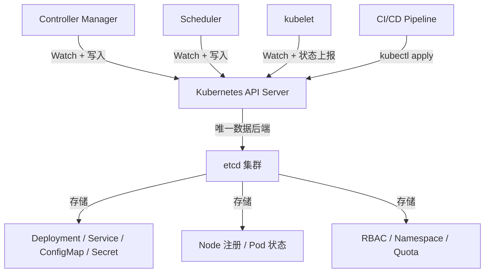
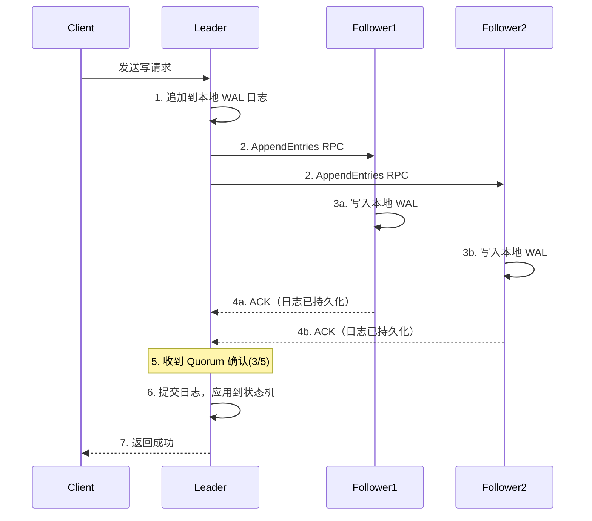
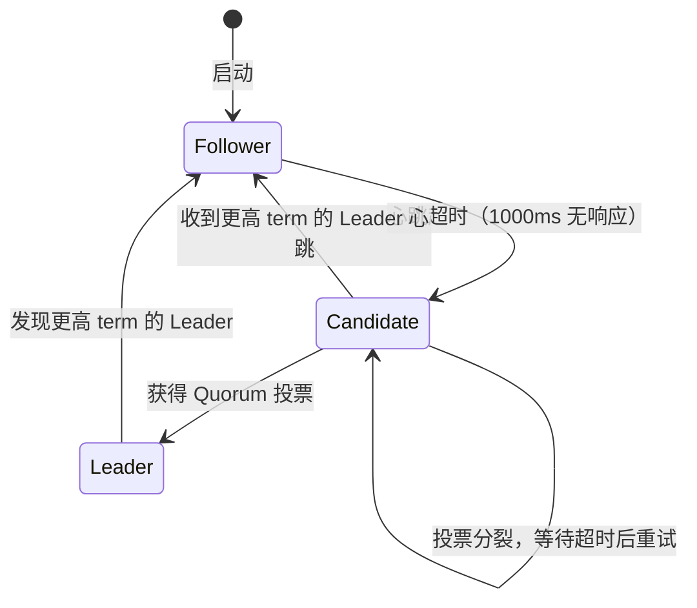
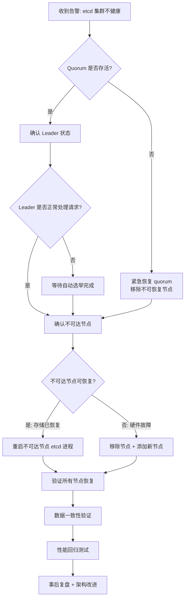
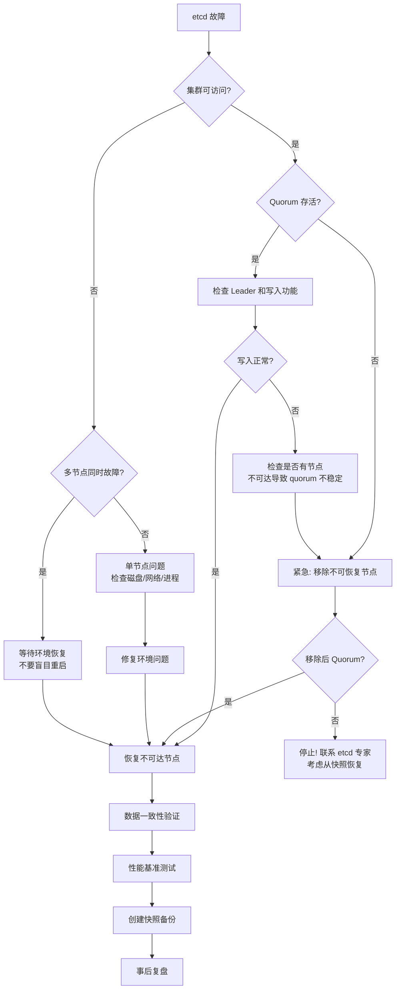

## 案例一：etcd集群故障转移与恢复实战

> **案例定位**：本案例是故障转移与恢复章节的第一个实战案例，聚焦 Kubernetes 生态中最核心的基础设施组件——etcd。通过还原一次真实的跨可用区（AZ）故障场景，演示从故障检测、紧急止损、节点恢复到架构优化的完整闭环流程。读者将掌握 etcd 集群故障转移的 Raft 共识机制、磁盘 IO 关键影响、以及生产级自动化恢复方案。

---

### 1. 案例背景与故障概述

#### 1.1 业务场景与 etcd 的核心地位

在 Kubernetes 架构中，etcd 是整个集群的"大脑"和"记忆"。它不仅存储了所有集群状态数据，还是 API Server 唯一的数据后端。这意味着——**etcd 不可用 = Kubernetes 控制平面不可用 = 整个集群失控**。

某互联网公司的核心微服务平台采用 Kubernetes 编排，etcd 作为 Kubernetes 的唯一数据存储后端，承载了整个集群的全部状态数据——包括所有 Deployment、Service、ConfigMap、Secret 及节点注册信息。该 etcd 集群部署于 3 个可用区（AZ-a、AZ-b、AZ-c），采用跨 AZ 部署以实现高可用。

**集群规模**：

| 维度 | 数据 | 说明 |
|------|------|------|
| etcd 节点数 | 5 节点（3 AZ 各 1~2 台） | AZ-a: 2, AZ-b: 1, AZ-c: 2 |
| Kubernetes 集群规模 | 200+ 节点，8000+ Pod | 中大规模生产集群 |
| etcd 数据库大小 | 约 8 GB | 接近 quota-backend-bytes 默认上限 |
| 日均 Watch 连接数 | 12000+ | 大量 Controller 和 Scheduler 的 Watch |
| 峰值写入 QPS | 3000+ | 部署高峰期 |
| etcd 版本 | 3.5.12 | 支持 pre-vote、Learner 等特性 |
| 磁盘配置 | SAN 存储（非本地 NVMe） | 这是后续故障的隐患 |

**关键架构依赖关系**：



#### 1.2 故障现象

2025 年某日凌晨 03:17，监控系统连续发出以下告警：

[CRITICAL] etcd cluster unhealthy: 2 of 5 members are down
[CRITICAL] kubernetes API server high latency: p99 > 15s
[CRITICAL] etcd disk fsync duration > 2s on node-03
[WARNING]  kubernetes pod scheduling failures increasing
[CRITICAL] kubernetes deployment rollout stuck: 200+ pending

**关键指标变化**：

| 指标 | 故障前正常值 | 故障时峰值 | 持续时间 |
|------|-------------|-----------|---------|
| etcd 延迟（proposal latency） | 5ms | 1200ms | 18 分钟 |
| API Server 请求延迟（p99） | 200ms | 15000ms | 22 分钟 |
| Leader 切换次数 | 0/天 | 6 次 | 8 分钟内 |
| 节点健康状态 | 5/5 healthy | 2/5 healthy | 12 分钟 |
| 新 Pod 调度成功率 | 100% | 12% | 15 分钟 |
| Watch 重建数量 | 0 | 12000+ | 5 分钟内集中触发 |
| etcd DB 大小 | 8.0 GB | 8.2 GB | 持续增长 |

#### 1.3 影响范围分析

故障影响按严重程度递进：

| 影响层级 | 具体表现 | 持续时间 |
|---------|---------|---------|
| 控制平面不可用 | etcd quorum 勉强维持，写入延迟飙升 | 12 分钟 |
| Pod 调度失败 | 新 Pod 无法调度，自动扩缩容失效 | 15 分钟 |
| 滚动更新中断 | 正在进行的 Deployment 更新全部卡住 | 22 分钟 |
| CI/CD 管线暂停 | 约 200 个待部署更新被阻塞 | 30 分钟 |
| Watch 重连风暴 | 12000+ Watch 连接断开重建，API Server 缓存重建 | 8 分钟 |
| 间接业务影响 | 部分服务无法在故障时及时扩容 | 15 分钟 |

**未受影响的部分**：已运行的 Pod 不受影响（它们直接与 kubelet 通信），数据面（Data Plane）基本正常。这体现了 Kubernetes 控制平面与数据平面分离的架构优势。

---

### 2. 故障根因分析

#### 2.1 第一层：事件链还原

通过 etcd 的 metrics、系统日志和存储监控，还原故障时间线：

```mermaid
gantt
    title etcd 故障时间线
    dateFormat HH:mm
    axisFormat %H:%M
    section 故障阶段
    AZ-c 存储故障       :crit, 03:15, 2m
    node-04 fsync 超时   :crit, 03:15, 3m
    node-04 被标记 unreachable :crit, 03:16, 1m
    node-05 也下线       :crit, 03:17, 1m
    Leader 选举          :crit, 03:16, 2m
    section 影响阶段
    Watch 重连风暴       :active, 03:17, 5m
    API Server 缓存重建  :active, 03:18, 8m
    Pod 调度失败         :active, 03:18, 12m
    section 恢复阶段
    AZ-c 存储恢复        :done, 03:29, 1m
    node-04 重启 etcd    :done, 03:30, 3m
    node-05 重启 etcd    :done, 03:32, 3m
    数据一致性验证       :done, 03:35, 5m
    集群完全恢复         :done, 03:40, 0m
```



**详细事件链**：

| 时间 | 事件 | 指标变化 |
|------|------|---------|
| 03:15:02 | AZ-c 的 etcd-node-04 磁盘 IO 延迟飙升 | iowait: 2% → 89% |
| 03:15:45 | etcd-node-04 的 fsync 持续时间超过 500ms | proposal latency: 5ms → 200ms |
| 03:16:10 | etcd-node-04 被集群标记为 unreachable（心跳超时） | 健康节点: 5/5 → 4/5 |
| 03:16:30 | Leader（etcd-node-01）发起选举，AZ-c 节点无法参与 | RAFT TERM: 7 → 8 |
| 03:17:02 | etcd-node-05 也因共享存储故障变为 unreachable | 健康节点: 4/5 → 3/5 |
| 03:17:05 | 集群仅剩 3 个健康节点（刚好满足 quorum） | quorum: 3/5 |
| 03:17:10 | Leader 选举成功（etcd-node-02 当选新 Leader） | Leader: node-01 → node-02 |
| 03:17:30 | 12000+ Watch 连接断开重建 | Watch count: 0 → 12000+ |
| 03:18:00 | API Server 缓存重建，请求延迟飙升 | p99: 200ms → 15000ms |
| 03:29:00 | AZ-c 存储恢复，节点重新加入集群 | 健康节点: 3/5 → 5/5 |
| 03:35:00 | 集群恢复全部 5 节点，指标回归正常 | proposal latency: < 10ms |

#### 2.2 第二层：根因定位

| 层级 | 根因 | 详情 |
|------|------|------|
| 直接原因 | AZ-c 机房共享存储故障 | SAN 交换机故障导致 etcd 节点磁盘 IO 完全阻塞 |
| 触发条件 | etcd 磁盘 fsync 超时 | fsync 持续 > 5s，超过 `heartbeat-interval`（100ms）的 50 倍阈值 |
| 恢复延迟 | quorum 恢复耗时 | 5 节点集群需至少 3 节点响应，AZ-c 2 台同时下线刚好维持 quorum |
| 二次冲击 | Watch 重连风暴 | 12000+ Watch 连接同时断开重连，产生大量历史事件回放 |
| 放大效应 | API Server 缓存失效 | Watch 断开导致 API Server 需要重建全量缓存，请求延迟雪崩 |

**故障传播链**：

SAN 交换机故障
  → etcd 节点磁盘 IO 阻塞
    → fsync 超时
      → 心跳超时（节点被标记 unreachable）
        → Leader 选举（AZ-c 节点无法参与）
          → Watch 断开
            → API Server 缓存重建
              → 请求延迟飙升
                → Pod 调度失败
                  → CI/CD 管线暂停

#### 2.3 第三层：架构缺陷分析

| 缺陷编号 | 缺陷描述 | 风险等级 | 影响 |
|---------|---------|---------|------|
| 架构-1 | etcd 节点分布不均（AZ-c 有 2 个节点） | 高 | 任一 AZ 整体故障后集群无冗余 |
| 架构-2 | 使用 SAN 存储而非本地 NVMe SSD | 高 | 共享存储故障直接影响 etcd 可用性 |
| 架构-3 | 缺乏磁盘性能监控阈值告警 | 中 | iowait 和 fsync 指标未设预警线，无法提前发现 |
| 架构-4 | Watch 恢复缺乏限流 | 中 | API Server 的 Watch 重建没有 token bucket 限流 |
| 架构-5 | 无自动故障转移流程 | 中 | 依赖人工判断和手动操作，响应延迟 |
| 架构-6 | etcd DB 大小接近默认配额上限 | 低 | 2GB 默认 quota 几乎被用尽，存在只读风险 |

---

### 3. etcd 故障转移核心机制

在深入修复方案之前，先理解 etcd 故障转移的底层机制。这些机制决定了我们的恢复策略选择。

#### 3.1 Raft 共识与 Quorum

etcd 基于 Raft 一致性协议，其核心规则是——**任何写操作必须被多数节点（Quorum）确认才能提交**：

Quorum = N/2 + 1（向上取整）

3 节点集群 → Quorum = 2  → 允许 1 个节点故障
5 节点集群 → Quorum = 3  → 允许 2 个节点故障
7 节点集群 → Quorum = 4  → 允许 3 个节点故障

**写入流程**：



**关键约束**：
- WAL（Write-Ahead Log）写入必须经过 fsync 持久化，这就是为什么磁盘性能对 etcd 至关重要
- 从写请求到返回成功，至少需要 1 次本地 fsync + 2 次网络往返（Follower 写入 + ACK）
- 在 3 AZ 部署中，如果 Leader 和 2 个 Follower 恰好不在同一 AZ，单 AZ 故障不影响写入

#### 3.2 Leader 选举机制

当 Leader 心跳超时（默认 `heartbeat-interval=100ms`，`election-timeout=1000ms`），Follower 转为 Candidate 发起选举：

| 状态 | 触发条件 | 行为 | 持续时间 |
|------|---------|------|---------|
| Follower | 正常运行 | 接收 Leader 日志，响应投票请求 | 持续 |
| Candidate | 心跳超时（1000ms 无响应） | 递增 term，发起投票，等待多数响应 | 最多 1 个 election-timeout |
| Leader | 获得多数投票 | 开始发送心跳（每 100ms），接收客户端写请求 | 持续 |

**选举流程详解**：



**预投票机制（Pre-Vote）**：

etcd 3.4+ 支持 `pre-vote: true`，它在正式选举前增加一轮"预投票"：
- Candidate 先询问其他节点"如果我发起选举，你们会投票给我吗？"
- 只有获得多数预投票才正式发起选举
- **作用**：减少网络分区恢复后的无效选举风暴，避免不必要的 term 递增

#### 3.3 磁盘 IO 对 etcd 的关键影响

etcd 对磁盘性能极度敏感，因为每次写入都需要 `fsync` 确保数据持久化到磁盘。这是 etcd 的性能瓶颈所在。

| 操作 | 涉及 fsync | 超时影响 | 严重程度 |
|------|-----------|---------|---------|
| Proposal 提交 | 是 | 写入延迟飙升，可能导致 Leader 超时 | 致命 |
| WAL 日志写入 | 是 | 与 Proposal 相同，是 fsync 的主要来源 | 致命 |
| 心跳发送 | 否 | 不直接受磁盘影响 | 无 |
| 日志压缩后快照 | 是 | 大快照可能导致长时间阻塞 | 高 |
| Watch 事件推送 | 否 | 但堆积的事件会消耗内存 | 中 |
| DB compaction | 是 | 后台压缩期间可能短暂影响 IO | 低 |

**磁盘性能基线要求**：

| 指标 | 最低要求 | 推荐值 | 测试方法 |
|------|---------|-------|---------|
| 顺序写带宽 | 100 MB/s | 500+ MB/s | `dd if=/dev/zero of=testfile bs=1M count=1024` |
| 随机写 IOPS | 10,000 | 50,000+ | `fio --name=randwrite --ioengine=libaio --rw=randwrite --bs=4k` |
| fsync 延迟（p99） | < 10ms | < 1ms | `sync --data && time sync` 或 etcd metrics |
| 磁盘类型 | SSD | NVMe SSD（本地盘） | 避免使用 SAN/NFS |
| 磁盘专用性 | 与其他服务共享 | etcd 独占一块物理盘 | — |

**为什么不能用 SAN/NFS**：共享存储引入了额外的网络延迟和故障域。当 SAN 交换机故障时，所有依赖该存储的节点同时受影响——这正是本案例的根因。

#### 3.4 etcd 集群状态机

理解 etcd 在不同故障场景下的行为模式：

| 故障场景 | 集群行为 | 数据影响 | 恢复方式 |
|---------|---------|---------|---------|
| 1 个 Follower 下线 | 读写正常，Watch 数减少 | 无 | 自动重连 |
| 1 个 Follower + Leader 下线 | 触发选举，短暂不可用（~1s） | 未提交的 proposal 可能丢失 | 自动选举 |
| 2 个节点下线（保持 quorum） | 读写正常，无冗余 | 无 | 手动恢复 |
| 2 个节点下线（丧失 quorum） | **完全不可用** | 可能丢失未同步数据 | 手动恢复 |
| Leader 网络分区 | Leader 无法写入，新 Leader 被选举 | 分区期间的写入需客户端重试 | 自动选举 |

---

### 4. 故障修复过程

#### 4.0 故障恢复总流程



#### 4.1 第一阶段：紧急止损（03:17 - 03:20）

> **核心原则**：故障发生时的第一要务是**确认当前状态**，而不是急于操作。盲目操作可能使情况恶化。

**步骤 1：确认集群 Quorum 状态**

```bash
# 检查集群健康状态——通过可达的节点查询
ETCDCTL_API=3 etcdctl \
  --endpoints=https://node-01:2379,https://node-02:2379,https://node-03:2379 \
  --cacert=/etc/etcd/ca.crt \
  --cert=/etc/etcd/server.crt \
  --key=/etc/etcd/server.key \
  endpoint health --write-out=table

# 输出示例：
# +-----------------+-------+---------+-----------+
# |     ENDPOINT    | HEALTH | TOOK    | ERROR    |
# +-----------------+-------+---------+-----------+
# | node-01:2379    | true  | 15ms    |          |
# | node-02:2379    | true  | 12ms    |          |
# | node-03:2379    | true  | 18ms    |          |
# +-----------------+-------+---------+-----------+
```

**关键判断**：3 个健康节点 = Quorum（3/5）成立，集群可以继续处理写入。

**步骤 2：查看集群成员与 Leader 状态**

```bash
# 查看集群成员状态
ETCDCTL_API=3 etcdctl \
  --endpoints=https://node-01:2379 \
  --cacert=/etc/etcd/ca.crt \
  --cert=/etc/etcd/server.crt \
  --key=/etc/etcd/server.key \
  member list --write-out=table

# 输出示例：
# +------------------+---------+---------+------------------+------------------+------------+
# |        ID        | STATUS  |  NAME   |     PEER ADDRS   |    CLIENT ADDRS  |  IS LEARNER |
# +------------------+---------+---------+------------------+------------------+------------+
# | 8e9e05c521646eb4 | started | node-01 | https://n1:2380  | https://n1:2379  |      false |
# | 91bc3c398fb3c146 | started | node-02 | https://n2:2380  | https://n2:2379  |      false |
# | fd422379fda50e48 | started | node-03 | https://n3:2380  | https://n3:2379  |      false |
# | f90f05eb6c534d43 | started | node-04 | https://n4:2380  | https://n4:2379  |      false |
# | fbdd0dc874420d58 | started | node-05 | https://n5:2380  | https://n5:2379  |      false |
# +------------------+---------+---------+------------------+------------------+------------+

# 注意：STATUS=started 不代表节点可达，仅表示集群配置中存在该成员
```

```bash
# 查看 Leader 信息和各节点 Raft 状态
ETCDCTL_API=3 etcdctl \
  --endpoints=https://node-01:2379,https://node-02:2379,https://node-03:2379 \
  --cacert=/etc/etcd/ca.crt \
  --cert=/etc/etcd/server.crt \
  --key=/etc/etcd/server.key \
  endpoint status --write-out=table

# 关键确认：
# - IS LEADER 列：找到谁是当前 Leader
# - RAFT TERM：所有可达节点应一致（如都是 8）
# - RAFT APPLIED INDEX：应持续增长（说明集群仍在正常处理写入）
# - DB SIZE：检查是否接近 quota-backend-bytes 上限
```

**步骤 3：确认 AZ-c 节点不可用**

```bash
# 检查无法连接的节点——从网络和应用两个层面确认
for node in node-04 node-05; do
  echo "=== Checking $node ==="
  
  # 网络层：ping 测试
  ping -c 3 -W 2 $node 2>&amp;1 &amp;&amp; echo "$node: NETWORK OK" || echo "$node: NETWORK UNREACHABLE"
  
  # 应用层：etcd health API
  curl -sk --connect-timeout 3 --max-time 5 \
    https://$node:2379/health 2>&amp;1 &amp;&amp; echo "$node: HEALTH OK" || echo "$node: HEALTH FAILED"
  
  # 端口连通性
  nc -zv -w 3 $node 2379 2>&amp;1 || echo "$node: PORT 2379 CLOSED"
done
```

**步骤 4：确认写入功能正常**

```bash
# 写入测试数据确认集群写入能力
ETCDCTL_API=3 etcdctl \
  --endpoints=https://node-02:2379 \
  --cacert=/etc/etcd/ca.crt \
  --cert=/etc/etcd/server.crt \
  --key=/etc/etcd/server.key \
  put /health-check/failover "$(date +%s)" 

# 从另一个节点读取确认
ETCDCTL_API=3 etcdctl \
  --endpoints=https://node-03:2379 \
  --cacert=/etc/etcd/ca.crt \
  --cert=/etc/etcd/server.crt \
  --key=/etc/etcd/server.key \
  get /health-check/failover

# 确认写入正常后清理
ETCDCTL_API=3 etcdctl \
  --endpoints=https://node-02:2379 \
  --cacert=/etc/etcd/ca.crt \
  --cert=/etc/etcd/server.crt \
  --key=/etc/etcd/server.key \
  del /health-check/failover
```

#### 4.2 第二阶段：恢复不可达节点（03:20 - 03:29）

> **黄金法则**：**先恢复环境，再恢复节点，最后验证数据一致性**。不要在存储/网络问题未解决前盲目重启 etcd 进程。

**步骤 5：确认 AZ-c 存储恢复**

```bash
# 等待存储恢复后，在 AZ-c 节点上检查磁盘状态
ssh node-04 "iostat -x 1 3"
# 确认指标：
#   %util < 5%（磁盘利用率正常）
#   await < 5ms（IO 等待时间正常）
#   w_await < 3ms（写入等待时间正常，etcd 关键指标）

ssh node-04 "df -h /var/lib/etcd"
# 确认磁盘空间充足（使用率 < 70%）

ssh node-04 "smartctl -H /dev/sda 2>/dev/null || echo 'smartctl not available'"
# 确认磁盘健康状态

# 检查 WAL 日志完整性
ssh node-04 "ls -la /var/lib/etcd/member/wal/ | tail -5"
# WAL 目录应有正常的 WAL 文件
```

**步骤 6：重启 node-04 上的 etcd 进程**

```bash
# 在 node-04 上操作
ssh node-04

# 先检查数据目录完整性
sudo etcdctl snapshot status /var/lib/etcd/member/snap/db \
  --write-out=table 2>/dev/null || echo "No snapshot to check, proceeding with start"

# 查看 etcd 最近日志，确认上次异常退出的原因
sudo journalctl -u etcd --since "30 minutes ago" --no-pager | tail -20

# 重启 etcd 服务
sudo systemctl restart etcd

# 等待节点启动（通常需要 5-15 秒）
sleep 15

# 检查进程状态
sudo systemctl status etcd | head -15
# 确认 Active: active (running)

# 查看启动日志确认无错误
sudo journalctl -u etcd --since "2 minutes ago" --no-pager | grep -E "(started|error|fail)"

# 验证节点已重新加入集群
ETCDCTL_API=3 etcdctl \
  --endpoints=https://node-02:2379 \
  --cacert=/etc/etcd/ca.crt \
  --cert=/etc/etcd/server.crt \
  --key=/etc/etcd/server.key \
  endpoint health --endpoints=https://node-04:2379
# 应返回 "is healthy"
```

**步骤 7：恢复 node-05**

```bash
# 在 node-05 上执行相同操作
ssh node-05

# 同样先检查磁盘状态
iostat -x 1 3

# 重启 etcd
sudo systemctl restart etcd
sleep 15

# 验证
sudo systemctl status etcd | head -15
```

**步骤 8：验证全部 5 节点恢复**

```bash
ETCDCTL_API=3 etcdctl \
  --endpoints=https://node-01:2379,https://node-02:2379,https://node-03:2379,https://node-04:2379,https://node-05:2379 \
  --cacert=/etc/etcd/ca.crt \
  --cert=/etc/etcd/server.crt \
  --key=/etc/etcd/server.key \
  endpoint health --write-out=table

# 全部 5 个 endpoint 均应返回 HEALTH=true
```

#### 4.3 第三阶段：数据一致性验证（03:29 - 03:35）

**步骤 9：对比集群成员数据一致性**

```bash
# 检查各节点的 DB 大小和 Raft Index 是否一致
ETCDCTL_API=3 etcdctl \
  --endpoints=https://node-01:2379,https://node-02:2379,https://node-03:2379,https://node-04:2379,https://node-05:2379 \
  --cacert=/etc/etcd/ca.crt \
  --cert=/etc/etcd/server.crt \
  --key=/etc/etcd/server.key \
  endpoint status --write-out=table

# 关键确认：
# - 所有节点的 RAFT APPLIED INDEX 接近一致（差异 < 100）
# - 所有节点的 RAFT TERM 一致
# - 所有节点的 IS LEARNER = false
# - DB SIZE 差异 < 10%（正常，因为快照触发时机不同）
```

**步骤 10：多节点一致性验证**

```bash
# 从不同节点读取同一 key 验证一致性
TEST_KEY="/registry/pods/default/test-consistency-check-$(date +%s)"

# 写入测试数据
ETCDCTL_API=3 etcdctl \
  --endpoints=https://node-02:2379 \
  --cacert=/etc/etcd/ca.crt \
  --cert=/etc/etcd/server.crt \
  --key=/etc/etcd/server.key \
  put $TEST_KEY "consistency-test-$(date +%s)"

# 等待数据同步
sleep 2

# 从所有节点读取验证
echo "=== Consistency Check ==="
for ep in node-01 node-02 node-03 node-04 node-05; do
  val=$(ETCDCTL_API=3 etcdctl \
    --endpoints=https://$ep:2379 \
    --cacert=/etc/etcd/ca.crt \
    --cert=/etc/etcd/server.crt \
    --key=/etc/etcd/server.key \
    get $TEST_KEY --print-value-only 2>/dev/null)
  echo "$ep: $val"
done
# 所有节点应返回相同的值

# 清理测试数据
ETCDCTL_API=3 etcdctl \
  --endpoints=https://node-02:2379 \
  --cacert=/etc/etcd/ca.crt \
  --cert=/etc/etcd/server.crt \
  --key=/etc/etcd/server.key \
  del $TEST_KEY
```

#### 4.4 第四阶段：性能回归与碎片整理（03:35 - 03:50）

故障恢复后，etcd 数据库可能产生碎片，需要进行碎片整理和性能验证。

**步骤 11：逐节点碎片整理**

```bash
# 碎片整理会短暂阻塞该节点的读写，必须逐节点执行
# 先在非 Leader 节点上执行

for ep in node-04 node-05 node-03 node-01; do
  echo "=== Defragmenting $ep ==="
  ETCDCTL_API=3 etcdctl \
    --endpoints=https://$ep:2379 \
    --cacert=/etc/etcd/ca.crt \
    --cert=/etc/etcd/server.crt \
    --key=/etc/etcd/server.key \
    defrag
  echo "$ep defrag complete, sleeping 5s before next..."
  sleep 5
done

# 最后对 Leader 节点执行（会短暂触发 Leader 切换）
echo "=== Defragmenting Leader (node-02) ==="
ETCDCTL_API=3 etcdctl \
  --endpoints=https://node-02:2379 \
  --cacert=/etc/etcd/ca.crt \
  --cert=/etc/etcd/server.crt \
  --key=/etc/etcd/server.key \
  defrag

# 确认碎片整理后的 DB 大小
ETCDCTL_API=3 etcdctl \
  --endpoints=https://node-01:2379,https://node-02:2379,https://node-03:2379,https://node-04:2379,https://node-05:2379 \
  --cacert=/etc/etcd/ca.crt \
  --cert=/etc/etcd/server.crt \
  --key=/etc/etcd/server.key \
  endpoint status --write-out=table
```

**步骤 12：etcd 基准性能测试**

```bash
# 安装 etcd benchmark 工具（通常随 etcd 发行包附带）
# 或从 GitHub 下载：https://github.com/etcd-io/etcd/tree/main/tools/benchmark

# 写入性能测试
benchmark \
  --endpoints=https://node-01:2379,https://node-02:2379,https://node-03:2379 \
  --cacert=/etc/etcd/ca.crt \
  --cert=/etc/etcd/server.crt \
  --key=/etc/etcd/server.key \
  --conns=100 --clients=1000 \
  --total=10000 \
  put

# 读取性能测试
benchmark \
  --endpoints=https://node-01:2379,https://node-02:2379,https://node-03:2379 \
  --cacert=/etc/etcd/ca.crt \
  --cert=/etc/etcd/server.crt \
  --key=/etc/etcd/server.key \
  --conns=100 --clients=1000 \
  --total=10000 \
  range /

# 对比故障前基线：
# - 写入延迟 p99 应 < 50ms
# - 写入 QPS 应 > 3000
# - 读取延迟 p99 应 < 20ms
```

**步骤 13：创建紧急快照备份**

```bash
# 故障恢复后立即创建快照，作为恢复点
ETCDCTL_API=3 etcdctl \
  --endpoints=https://node-02:2379 \
  --cacert=/etc/etcd/ca.crt \
  --cert=/etc/etcd/server.crt \
  --key=/etc/etcd/server.key \
  snapshot save /backup/etcd/snapshot-$(date +%Y%m%d-%H%M%S).db

# 验证快照
ETCDCTL_API=3 etcdctl snapshot status \
  /backup/etcd/snapshot-*.db --write-out=table
```

---

### 5. 架构优化方案

#### 5.1 第一优先级：etcd 节点重分布

**问题**：原部署方案中 AZ-c 有 2 个节点，任一 AZ 完整故障后集群无冗余。

**方案**：改为 3 AZ 均匀分布 5 节点——2+2+1 交替模式：

| AZ | 节点数 | 说明 |
|----|--------|------|
| AZ-a | 2 | 包含 1 个潜在 Leader 候选 |
| AZ-b | 2 | 包含 1 个潜在 Leader 候选 |
| AZ-c | 1 | 最少节点数，降低同 AZ 故障风险 |

**为什么是 2+2+1 而不是 3+1+1**：任何单 AZ 故障后，剩余 2 个 AZ 至少有 4 个节点（> Quorum 3），且任一 AZ 故障后仍有至少 2 个 AZ 可用。

**实施步骤**：

```bash
# ===== 步骤 1：添加新节点（假设为 node-06 在 AZ-a）=====

# 在集群健康节点上执行
ETCDCTL_API=3 etcdctl \
  --endpoints=https://node-01:2379 \
  --cacert=/etc/etcd/ca.crt \
  --cert=/etc/etcd/server.crt \
  --key=/etc/etcd/server.key \
  member add node-06 --peer-urls=https://node-06:2380

# 在 node-06 上配置并启动 etcd
cat > /etc/etcd/etcd.conf.yml << 'EOF'
name: node-06
data-dir: /var/lib/etcd
listen-peer-urls: https://node-06:2380
listen-client-urls: https://node-06:2379,https://127.0.0.1:2379
advertise-client-urls: https://node-06:2379
initial-advertise-peer-urls: https://node-06:2380
initial-cluster: "node-01=https://node-01:2380,node-02=https://node-02:2380,node-03=https://node-03:2380,node-04=https://node-04:2380,node-05=https://node-05:2380,node-06=https://node-06:2380"
initial-cluster-state: existing
initial-cluster-token: etcd-cluster-prod
quota-backend-bytes: 8589934592
auto-compaction-mode: periodic
auto-compaction-retention: "12h"
pre-vote: true
EOF

# 启动 etcd
sudo systemctl start etcd

# ===== 步骤 2：等待新节点同步完成 =====
sleep 30

ETCDCTL_API=3 etcdctl \
  --endpoints=https://node-06:2379 \
  --cacert=/etc/etcd/ca.crt \
  --cert=/etc/etcd/server.crt \
  --key=/etc/etcd/server.key \
  endpoint health

# 确认新节点数据已同步（RAFT APPLIED INDEX 接近其他节点）
ETCDCTL_API=3 etcdctl \
  --endpoints=https://node-06:2379 \
  --cacert=/etc/etcd/ca.crt \
  --cert=/etc/etcd/server.crt \
  --key=/etc/etcd/server.key \
  endpoint status --write-out=table

# ===== 步骤 3：移除 AZ-c 的多余节点（先移除 node-05）=====

# 获取 node-05 的 member ID
MEMBER_ID=$(ETCDCTL_API=3 etcdctl \
  --endpoints=https://node-01:2379 \
  --cacert=/etc/etcd/ca.crt \
  --cert=/etc/etcd/server.crt \
  --key=/etc/etcd/server.key \
  member list --write-out=json | \
  python3 -c "import sys,json; members=json.load(sys.stdin)['members']; print([m['ID'] for m in members if m['name']=='node-05'][0])")

echo "Removing member ID: $MEMBER_ID"

ETCDCTL_API=3 etcdctl \
  --endpoints=https://node-01:2379 \
  --cacert=/etc/etcd/ca.crt \
  --cert=/etc/etcd/server.crt \
  --key=/etc/etcd/server.key \
  member remove "$MEMBER_ID"

# ===== 步骤 4：验证最终拓扑 =====
ETCDCTL_API=3 etcdctl \
  --endpoints=https://node-01:2379 \
  --cacert=/etc/etcd/ca.crt \
  --cert=/etc/etcd/server.crt \
  --key=/etc/etcd/server.key \
  member list --write-out=table

# 确认 5 个节点分布在 3 个 AZ，无 AZ 超过 2 个节点
```

#### 5.2 第二优先级：磁盘 IO 监控增强

**方案 A：Prometheus Alerting Rules（推荐）**

```yaml
# prometheus-rules/etcd-disk-alerts.yml
groups:
  - name: etcd-disk-alerts
    rules:
      # etcd WAL fsync 延迟告警
      - alert: EtcdWalFsyncHigh
        expr: |
          histogram_quantile(0.99, 
            rate(etcd_disk_wal_fsync_duration_seconds_bucket[5m])
          ) > 0.01
        for: 2m
        labels:
          severity: warning
        annotations:
          summary: "etcd WAL fsync p99 > 10ms on {{ $labels.instance }}"
          description: "etcd 磁盘写入延迟偏高，可能导致性能下降"
      
      - alert: EtcdWalFsyncCritical
        expr: |
          histogram_quantile(0.99, 
            rate(etcd_disk_wal_fsync_duration_seconds_bucket[5m])
          ) > 0.05
        for: 1m
        labels:
          severity: critical
        annotations:
          summary: "etcd WAL fsync p99 > 50ms on {{ $labels.instance }}"
          description: "etcd 磁盘写入严重延迟，可能导致 Leader 切换"
      
      # etcd DB 大小告警
      - alert: EtcdDbSizeHigh
        expr: |
          etcd_mvcc_db_total_size_in_bytes / 
          on(instance) group_left() etcd_server_quota_backend_bytes > 0.7
        for: 10m
        labels:
          severity: warning
        annotations:
          summary: "etcd DB 大小超过 quota 的 70% on {{ $labels.instance }}"
          description: "etcd 数据库接近配额上限，需要扩容或压缩"
      
      # Leader 频繁切换
      - alert: EtcdLeaderFrequentChange
        expr: |
          increase(etcd_server_leader_changes_seen_total[1h]) > 3
        labels:
          severity: critical
        annotations:
          summary: "etcd Leader 1小时内切换超过 3 次"
          description: "etcd 集群不稳定，可能存在网络或磁盘问题"
      
      # etcd 节点不可达
      - alert: EtcdMemberUnhealthy
        expr: |
          etcd_server_has_leader == 0 or 
          etcd_server_proposals_failed_total > 10
        for: 1m
        labels:
          severity: critical
        annotations:
          summary: "etcd 集群成员异常"
          description: "etcd 集群可能丧失 quorum 或写入失败"
```

**方案 B：独立监控脚本（补充方案）**

```bash
#!/bin/bash
# /usr/local/bin/etcd-disk-monitor.sh
# 当 Prometheus 不可用时的独立监控方案

THRESHOLD_IOWAIT=20       # iowait 超过 20% 告警
THRESHOLD_FSYNC=10        # fsync 延迟超过 10ms 告警
THRESHOLD_UTIL=80         # 磁盘利用率超过 80% 告警
THRESHOLD_DB_SIZE=8       # DB 大小超过 8GB 告警（GB）
ETCD_DATA_DIR="/var/lib/etcd"
ALERT_ENDPOINT="https://alertmanager:9093/api/v1/alerts"
LOG_FILE="/var/log/etcd-disk-monitor.log"

log() {
    echo "[$(date '+%Y-%m-%d %H:%M:%S')] $1" | tee -a "$LOG_FILE"
}

send_alert() {
    local severity=$1
    local message=$2
    curl -s -X POST "$ALERT_ENDPOINT" \
      -H "Content-Type: application/json" \
      -d "[{\"labels\":{\"alertname\":\"etcd_disk_issue\",\"severity\":\"$severity\",\"instance\":\"$(hostname)\"},\"annotations\":{\"summary\":\"$message\"}}]"
    log "[$severity] $message"
}

check_iowait() {
    # 取所有磁盘的最大 iowait 值
    local iowait=$(iostat -x 1 2 | awk '/^sd|^nvme|^vd/ {print $NF}' | sort -rn | head -1)
    if [ -n "$iowait" ] &amp;&amp; (( $(echo "$iowait > $THRESHOLD_IOWAIT" | bc -l) )); then
        send_alert "CRITICAL" "etcd node $(hostname) iowait: ${iowait}% (threshold: ${THRESHOLD_IOWAIT}%)"
    fi
}

check_fsync() {
    # 通过 etcd metrics 获取 fsync 持续时间（histogram 的 p99）
    local fsync_seconds=$(curl -s http://localhost:2381/metrics 2>/dev/null \
      | grep 'etcd_disk_wal_fsync_duration_seconds_bucket' \
      | grep 'le="0.01"' \
      | awk '{print $NF}' | head -1)
    
    if [ -n "$fsync_seconds" ]; then
        # 检查 p99 fsync 延迟（通过 bucket 信息估算）
        local total=$(curl -s http://localhost:2381/metrics 2>/dev/null \
          | grep 'etcd_disk_wal_fsync_duration_seconds_count' | awk '{print $2}')
        local above=$(curl -s http://localhost:2381/metrics 2>/dev/null \
          | grep 'etcd_disk_wal_fsync_duration_seconds_bucket' | grep -v 'le=' | awk '{sum+=$NF} END{print sum}')
        
        if [ -n "$total" ] &amp;&amp; [ "$total" -gt 0 ]; then
            local ratio=$(echo "scale=4; $above / $total" | bc -l 2>/dev/null)
            # 如果超过 1% 的请求 fsync > 10ms，告警
            if (( $(echo "$ratio > 0.01" | bc -l 2>/dev/null) )); then
                send_alert "CRITICAL" "etcd node $(hostname) fsync degradation: ${ratio} of requests > 10ms"
            fi
        fi
    fi
}

check_disk_util() {
    local util=$(iostat -x 1 2 | awk '/^sd|^nvme|^vd/ {print $(NF-1)}' | sort -rn | head -1)
    if [ -n "$util" ] &amp;&amp; (( $(echo "$util > $THRESHOLD_UTIL" | bc -l) )); then
        send_alert "WARNING" "etcd node $(hostname) disk util: ${util}% (threshold: ${THRESHOLD_UTIL}%)"
    fi
}

check_db_size() {
    local db_size_bytes=$(du -sb ${ETCD_DATA_DIR}/member/snap/db 2>/dev/null | awk '{print $1}')
    local threshold_bytes=$((${THRESHOLD_DB_SIZE} * 1024 * 1024 * 1024))
    if [ -n "$db_size_bytes" ] &amp;&amp; [ "$db_size_bytes" -gt "$threshold_bytes" ]; then
        local db_mb=$((db_size_bytes / 1024 / 1024))
        send_alert "WARNING" "etcd node $(hostname) DB size: ${db_mb}MB exceeds ${THRESHOLD_DB_SIZE}GB threshold"
    fi
}

# 主循环
while true; do
    check_iowait
    check_fsync
    check_disk_util
    check_db_size
    sleep 30
done
```

#### 5.3 第三优先级：etcd 调优配置

```yaml
# /etc/etcd/etcd.conf.yml（优化后完整配置）

# ===== 基础配置 =====
name: etcd-node-01
data-dir: /var/lib/etcd

# ===== 性能调优 =====
heartbeat-interval: 100        # 心跳间隔（ms），默认 100，大集群可考虑 150-200
election-timeout: 1000         # 选举超时（ms），默认 1000，必须 > 5 * heartbeat-interval

# ===== 存储配额与压缩 =====
quota-backend-bytes: 8589934592   # 8GB，磁盘大小的 50% 以下
auto-compaction-mode: periodic      # 定期压缩
auto-compaction-retention: "12h"    # 压缩 12 小时前的数据
max-request-bytes: 1572864          # 单个请求最大 1.5MB

# ===== 并发控制 =====
max-concurrent-streams: 128         # 最大并发 gRPC 流

# ===== 安全配置 =====
client-transport-security:
  cert-file: /etc/etcd/server.crt
  key-file: /etc/etcd/server.key
  client-cert-auth: true
  trusted-ca-file: /etc/etcd/ca.crt

peer-transport-security:
  cert-file: /etc/etcd/peer.crt
  key-file: /etc/etcd/peer.key
  client-cert-auth: true
  trusted-ca-file: /etc/etcd/ca.crt

# ===== 监控 =====
listen-metrics-urls: http://0.0.0.0:2381   # metrics 专用端口，与客户端端口分离

# ===== 日志 =====
logger: zap
log-level: warn
log-outputs:
  - /var/log/etcd/etcd.log

# ===== 高级优化 =====
# 预投票（减少网络分区时的不必要选举），3.4+ 支持
pre-vote: true

# 磁盘同步策略
# snapshot-count: 100000  # 触发快照的事务数，默认 100000

# 后台压缩和碎片整理间隔
# backend-bbolt-freelist-type: mmap  # 使用 mmap 优化 bbolt 空闲列表
```

**配置参数选择指南**：

| 参数 | 默认值 | 推荐值 | 调整理由 |
|------|-------|-------|---------|
| heartbeat-interval | 100ms | 100-200ms | 大集群可适当增大减少网络开销 |
| election-timeout | 1000ms | 1000-5000ms | 必须 > 5 × heartbeat-interval |
| quota-backend-bytes | 2GB | 8GB | 避免数据库达到配额后集群只读 |
| auto-compaction-retention | 0（禁用） | 12h | 定期压缩避免 DB 持续增长 |
| max-request-bytes | 1.5MB | 1.5MB | 防止单个大请求影响集群 |
| pre-vote | false | true | 减少网络分区后的选举风暴 |

#### 5.4 第四优先级：自动化故障转移脚本

```bash
#!/bin/bash
# /usr/local/bin/etcd-auto-failover.sh
# 自动检测并移除不可达节点，维持集群可用性
# 注意：此脚本应在健康节点上以 cron 运行，不要在故障节点上运行

set -euo pipefail

# ===== 配置 =====
ETCD_ENDPOINTS="https://node-01:2379,https://node-02:2379,https://node-03:2379"
ETCD_CACERT="/etc/etcd/ca.crt"
ETCD_CERT="/etc/etcd/server.crt"
ETCD_KEY="/etc/etcd/server.key"
TIMEOUT_THRESHOLD=5        # 节点不可达持续超过 5 分钟才执行移除
LOG_FILE="/var/log/etcd-auto-failover.log"
STATE_DIR="/var/lib/etcd-auto-failover"
MIN_MEMBERS=3              # 最少保留成员数（防止误操作导致丧失 quorum）

log() {
    echo "[$(date '+%Y-%m-%d %H:%M:%S')] $1" | tee -a "$LOG_FILE"
}

get_cluster_size() {
    ETCDCTL_API=3 etcdctl \
      --endpoints="$ETCD_ENDPOINTS" \
      --cacert="$ETCD_CACERT" \
      --cert="$ETCD_CERT" \
      --key="$ETCD_KEY" \
      member list --write-out=json | \
      python3 -c "import sys,json; print(len(json.load(sys.stdin)['members']))"
}

get_members() {
    ETCDCTL_API=3 etcdctl \
      --endpoints="$ETCD_ENDPOINTS" \
      --cacert="$ETCD_CACERT" \
      --cert="$ETCD_CERT" \
      --key="$ETCD_KEY" \
      member list --write-out=fields | \
      awk -F': ' '/ID:/{id=$2} /Name:/{name=$2} /ClientURLs:/{print id,name,$2}'
}

check_member_health() {
    local client_url=$1
    
    ETCDCTL_API=3 etcdctl \
      --endpoints="$client_url" \
      --cacert="$ETCD_CACERT" \
      --cert="$ETCD_CERT" \
      --key="$ETCD_KEY" \
      endpoint health --write-out=json 2>/dev/null | \
      python3 -c "import sys,json; d=json.load(sys.stdin); sys.exit(0 if d.get('health')=='true' else 1)" 2>/dev/null
}

mkdir -p "$STATE_DIR"

log "INFO: Starting etcd auto-failover check"

CLUSTER_SIZE=$(get_cluster_size)
ACTIVE_FAILURES=0

# 统计当前已有的故障节点
for state_file in "$STATE_DIR"/*; do
    [ -f "$state_file" ] &amp;&amp; ACTIVE_FAILURES=$((ACTIVE_FAILURES + 1))
done

members=$(get_members)

while IFS=' ' read -r member_id member_name member_url; do
    [ -z "$member_id" ] &amp;&amp; continue
    
    if check_member_health "$member_url"; then
        # 节点恢复，清除追踪文件
        if [ -f "$STATE_DIR/$member_id" ]; then
            log "INFO: Member $member_name ($member_id) recovered, removing state"
            rm -f "$STATE_DIR/$member_id"
            ACTIVE_FAILURES=$((ACTIVE_FAILURES - 1))
        fi
    else
        # 节点不可达
        state_file="$STATE_DIR/$member_id"
        
        if [ ! -f "$state_file" ]; then
            date +%s > "$state_file"
            log "WARNING: Member $member_name ($member_id) is unreachable, tracking started"
        else
            first_seen=$(cat "$state_file")
            now=$(date +%s)
            elapsed=$((now - first_seen))
            
            if [ "$elapsed" -ge "$((TIMEOUT_THRESHOLD * 60))" ]; then
                # 安全检查：确保移除后仍有足够成员维持 quorum
                remaining=$((CLUSTER_SIZE - ACTIVE_FAILURES - 1))
                
                if [ "$remaining" -lt "$MIN_MEMBERS" ]; then
                    log "CRITICAL: Cannot remove $member_name ($member_id) — would leave only $remaining members (min: $MIN_MEMBERS)"
                    log "CRITICAL: Manual intervention required!"
                    continue
                fi
                
                log "CRITICAL: Removing member $member_name ($member_id) — unreachable for ${elapsed}s"
                
                ETCDCTL_API=3 etcdctl \
                  --endpoints="$ETCD_ENDPOINTS" \
                  --cacert="$ETCD_CACERT" \
                  --cert="$ETCD_CERT" \
                  --key="$ETCD_KEY" \
                  member remove "$member_id"
                
                rm -f "$state_file"
                log "INFO: Member $member_name ($member_id) removed successfully"
            else
                remaining=$((TIMEOUT_THRESHOLD * 60 - elapsed))
                log "WARNING: Member $member_name ($member_id) still unreachable, will remove in ${remaining}s"
            fi
        fi
    fi
done <<< "$members"

log "INFO: Auto-failover check complete"
```

**脚本安全机制**：
- `MIN_MEMBERS=3`：防止误操作导致集群丧失 quorum
- `TIMEOUT_THRESHOLD=5`：5 分钟确认期，避免短暂网络抖动触发误移除
- 状态文件追踪：精确记录每个故障节点的首次不可达时间
- 移除前二次确认：检查移除后剩余成员数是否满足 quorum

---

### 6. Kubernetes 特定的恢复考量

etcd 故障对 Kubernetes 的影响不仅是"数据存储不可用"，还涉及一系列连锁反应。理解这些连锁反应对于正确恢复至关重要。

#### 6.1 API Server 的行为模式

| etcd 状态 | API Server 行为 | 对用户的影响 |
|-----------|----------------|-------------|
| 正常 | 正常处理请求 | 无 |
| 写入延迟高 | 请求排队，延迟增加 | kubectl 命令变慢 |
| 丧失 quorum | **所有写操作拒绝** | kubectl apply/delete 失败 |
| 完全不可用 | API Server 503 | kubectl 连接失败 |
| 恢复后 | 缓存重建，Watch 重新建立 | 短暂高延迟后恢复 |

#### 6.2 Watch 重连风暴的应对

etcd 故障恢复后，所有 Watch 连接需要重建，这会产生"重连风暴"：

12000+ Watch 连接同时断开
  → 同时尝试重连
    → etcd 需要回放大量历史事件
      → API Server 缓存重建
        → 请求延迟飙升

**应对措施**：
1. **etcd 侧**：确保 `max-concurrent-streams` 足够大（推荐 128+）
2. **API Server 侧**：配置 Watch 恢复的退避策略
3. **客户端侧**：Controller 和 kubelet 应实现指数退避重连
4. **预防**：使用 `pre-vote: true` 减少不必要的 Leader 切换

#### 6.3 恢复后的 Kubernetes 验证

```bash
# 1. 确认 API Server 连接正常
kubectl cluster-info

# 2. 确认所有节点 Ready
kubectl get nodes | grep -v " Ready" || echo "All nodes Ready"

# 3. 确认核心组件运行正常
kubectl get pods -n kube-system -o wide

# 4. 确认没有 stuck 的部署
kubectl get deployments --all-namespaces | grep -v "1/1\|2/2\|3/3"

# 5. 确认事件流正常
kubectl get events --all-namespaces --sort-by='.lastTimestamp' | tail -20

# 6. 确认自动扩缩容恢复
kubectl get hpa --all-namespaces
```

---

### 7. 关键命令速查表

#### 7.1 诊断阶段

| 场景 | 命令 | 关注点 |
|------|------|--------|
| 集群健康检查 | `etcdctl endpoint health --cluster` | 所有节点 HEALTH=true |
| Leader 状态 | `etcdctl endpoint status --cluster --write-out=table` | IS LEADER 列 |
| 成员列表 | `etcdctl member list --write-out=table` | STATUS 全部 started |
| 磁盘 IO | `iostat -x 1 5` | %util, await, w_await |
| 网络连通 | `ping -c 5 <node> && curl -sk https://<node>:2379/health` | 超时阈值 |
| API 延迟 | `curl http://localhost:2381/metrics \| grep etcd_request_duration` | p99 < 100ms |
| DB 大小 | `du -sh /var/lib/etcd/member/snap/db` | < quota-backend-bytes 的 50% |
| WAL 大小 | `du -sh /var/lib/etcd/member/wal/` | WAL 不应持续增长 |
| Raft 状态 | `etcdctl endpoint status --cluster --write-out=json` | RAFT INDEX 持续增长 |

#### 7.2 恢复阶段

| 场景 | 命令 | 注意事项 |
|------|------|---------|
| 移除故障节点 | `etcdctl member remove <ID>` | 仅在节点确认不可恢复时使用 |
| 添加新节点 | `etcdctl member add <name> --peer-urls=...` | initial-cluster-state=existing |
| 强制移除 | `etcdctl member force-remove <ID>` | 最后手段，可能导致数据不一致 |
| 数据修复 | `etcdctl snapshot restore <snapshot>` | 需要先停止所有节点 |
| 碎片整理 | `etcdctl defrag --endpoints=<ep>` | 逐节点执行，避免同时操作 |
| 移动 Leader | `etcdctl move-leader <new-member-id>` | 先确认目标节点健康 |
| 快照备份 | `etcdctl snapshot save <path>` | 故障恢复后立即执行 |

#### 7.3 验证阶段

| 场景 | 命令 | 关注点 |
|------|------|--------|
| 数据一致性 | 从多节点读同一 key | 返回值完全一致 |
| Watch 功能 | `etcdctl watch <prefix>` | 事件正常推送 |
| 写入测试 | `etcdctl put /test/key "value"` | 无报错 |
| 性能回归 | `benchmark` 工具压测 | 接近故障前基线 |
| Watch 重连 | `curl http://localhost:2381/metrics \| grep etcd_watch` | Watch 数量稳定 |
| 碎片率 | `etcdctl endpoint status --write-out=json` | 对比 defrag 前后 DB 大小 |

---

### 8. 常见误区与避坑指南

#### 误区一：在集群不健康时直接重启所有节点

**错误做法**：发现 etcd 故障后，同时重启所有 5 个节点的 etcd 进程。

**后果**：如果 3 个以上的节点在重启过程中不可用，quorum 丢失，集群彻底不可用。重启过程中可能有 2-3 个节点处于启动状态（尚未加入集群），此时集群可能无法处理任何请求。

**正确做法**：保持健康节点不动，仅恢复不可达节点；如需重启，逐节点操作并确认上一个节点恢复后再操作下一个。始终保证至少 Quorum 数量的节点在线。

#### 误区二：直接删除 etcd 数据目录重新同步

**错误做法**：`rm -rf /var/lib/etcd/member` 然后重启，期望节点自动从 Leader 同步数据。

**后果**：etcd 不支持自动从 Leader 拉取全部数据来重建。被删除数据的节点会以空数据启动，但因为其 Raft log index 落后过多（index 差距超过 snapshot 触发阈值），无法通过正常日志复制追上 Leader。该节点会不断请求旧日志条目，最终可能被 Leader 强制移除。

**正确做法**：
1. 使用 `etcdctl snapshot restore` 从集群快照恢复
2. 或先在健康节点上执行 `etcdctl snapshot save` 创建快照，再在问题节点上恢复
3. 恢复时必须停止所有 etcd 节点（或至少确保问题节点不在集群中）

#### 误区三：Leader 手动转移导致数据不一致

**错误做法**：通过 `kill` Leader 节点进程强制触发选举，期望新 Leader 能"修复"问题。

**后果**：如果 Leader 有未提交的日志（已写入本地 WAL 但未得到 quorum 确认），强制切换会导致这些日志丢失。更严重的是，如果 Leader 恰好在网络分区的多数侧，强制杀死它可能导致两个分区各自选出 Leader，造成脑裂。

**正确做法**：
1. 先确认当前 Leader 能正常处理请求
2. 通过 `etcdctl move-leader <new-member-id>` 安全转移 Leader（etcd 3.4+）
3. 或等待 Leader 自然超时（适用于 Leader 确实不可用的情况）

#### 误区四：etcd 节点数量越多越安全

**错误做法**：认为 7 节点比 5 节点更安全，不断增加节点。

**后果**：
- 每个额外节点都会增加 Leader 同步的日志复制开销，写入延迟随节点数线性增长
- 7 节点需要 4 个节点确认才能提交写入，比 5 节点多 1 次网络往返
- 跨 AZ 部署时，节点越多越难保证均匀分布
- etcd 官方明确建议不超过 7 节点

**正确做法**：对于绝大多数场景，5 节点足够。如需更高可靠性，应投入资源保证磁盘和网络质量，而非增加节点数量。与其 7 个普通节点，不如 5 个 NVMe SSD 节点。

#### 误区五：忽视 `quota-backend-bytes` 导致集群只读

**错误做法**：未配置 `quota-backend-bytes`，使用默认的 2GB 限制，集群数据持续增长。

**后果**：当 DB 大小达到配额，etcd 会拒绝所有写入请求（集群变为只读），Kubernetes 所有变更操作（创建/更新/删除资源）全部失败。这在生产环境中是灾难性的——虽然已运行的 Pod 不受影响，但任何扩缩容、滚动更新、配置变更都会失败。

**正确做法**：始终显式配置 `quota-backend-bytes`，建议设为磁盘可用空间的 50% 以下，并配合自动压缩策略（`auto-compaction-mode: periodic` + `auto-compaction-retention: 12h`）。

#### 误区六：碎片整理时同时操作所有节点

**错误做法**：对所有 etcd 节点同时执行 `etcdctl defrag`。

**后果**：碎片整理期间，被操作的节点会暂停响应读写请求。如果同时操作所有节点，集群 quorum 可能丧失，导致整个集群不可用。

**正确做法**：逐节点执行碎片整理，每次操作一个节点，等待完成后再操作下一个。先操作 Follower 节点，最后操作 Leader 节点（Leader 上的碎片整理可能触发 Leader 切换）。

#### 误区七：故障恢复后不创建快照

**错误做法**：节点恢复后认为万事大吉，不创建快照备份。

**后果**：如果恢复过程中存在数据不一致（虽然罕见），没有快照就无法回滚到已知的好状态。此外，故障恢复后的数据库可能需要碎片整理，而碎片整理前应先创建快照作为安全网。

**正确做法**：故障恢复后立即创建快照，作为新的恢复点基准。后续定期快照策略确保始终有可靠的备份。

---

### 9. 事后复盘与改进模板

#### 9.1 事后复盘报告模板

```markdown
# etcd 集群故障事后复盘报告

## 故障概述
- 故障时间：YYYY-MM-DD HH:MM ~ HH:MM（共 X 分钟）
- 影响范围：[具体描述]
- 严重等级：P0/P1/P2

## 时间线
| 时间 | 事件 | 操作人 |
|------|------|--------|
| HH:MM | [事件描述] | [操作人] |

## 根因分析
- 直接原因：
- 根本原因：
- 触发条件：

## 处置过程
- 正确操作：
- 需改进操作：

## 改进措施
| 编号 | 措施 | 负责人 | 截止日期 | 状态 |
|------|------|--------|---------|------|
| 1 | [措施描述] | [负责人] | [日期] | 待完成 |

## 经验教训
1. [教训1]
2. [教训2]
```

#### 9.2 本次故障的改进时间表

| 优先级 | 改进项 | 预期效果 | 实施难度 |
|--------|--------|---------|---------|
| P0 | etcd 节点从 SAN 迁移到本地 NVMe SSD | 消除共享存储故障域 | 中 |
| P0 | 部署 Prometheus etcd 监控 + 告警 | 故障前预警 | 低 |
| P1 | 节点分布调整为 2+2+1 | 提高跨 AZ 容错能力 | 中 |
| P1 | 启用 pre-vote 机制 | 减少选举风暴 | 低 |
| P2 | 自动化故障转移脚本 | 减少人工响应时间 | 中 |
| P2 | 定期快照备份策略 | 降低数据丢失风险 | 低 |

---

### 10. 经验总结与最佳实践

#### 10.1 容量规划原则

etcd 数据库大小 < quota-backend-bytes × 50%
etcd 数据库大小 < 可用磁盘空间 × 30%
etcd 节点数：3 或 5（不超过 7）
磁盘：NVMe SSD，独立盘，不与业务共享
内存：建议 8GB+，预留 4GB 给 OS page cache
网络：节点间延迟 < 10ms，带宽 > 1Gbps

#### 10.2 监控告警清单

| 指标 | 警告阈值 | 严重阈值 | 工具 |
|------|---------|---------|------|
| Leader 切换次数 | > 1 次/小时 | > 5 次/小时 | Prometheus |
| Proposal 提交延迟 | p99 > 100ms | p99 > 500ms | etcd metrics |
| WAL fsync 延迟 | p99 > 10ms | p99 > 50ms | etcd metrics |
| 磁盘 iowait | > 20% | > 50% | node_exporter |
| DB 大小 | > 4GB（quota 的 50%） | > 6GB（quota 的 75%） | 定时检查 |
| 成员健康 | 1 个不健康 | 2+ 个不健康 | etcdctl |
| Watch 数量 | > 10000 | > 15000 | etcd metrics |
| 缓存命中率 | < 90% | < 80% | apiserver metrics |
| 磁盘利用率 | > 60% | > 80% | node_exporter |

#### 10.3 故障转移检查清单

故障发生时，按以下顺序执行：

1. 确认 Quorum 是否存活
   → etcdctl endpoint health --cluster
2. 确认 Leader 是否正常
   → etcdctl endpoint status --cluster --write-out=table
3. 确认写入是否正常
   → etcdctl put /health-check "$(date)" && etcdctl del /health-check
4. 确认不可达节点数量
   → 不超过 (N-1)/2 个 = 仍维持 quorum
5. 确认不可达原因（磁盘/网络/进程）
   → ssh 检查 iowait、ping、systemctl status
6. 等待环境恢复（存储/网络），不要盲目重启
7. 重启不可达节点的 etcd 进程
8. 验证全部节点恢复
9. 碎片整理（逐节点）
10. 创建紧急快照备份
11. 多节点数据一致性验证
12. etcd 性能基准测试
13. Kubernetes 功能验证
14. 记录故障报告，启动事后复盘

#### 10.4 灾难恢复预案

| 场景 | 恢复时间目标 (RTO) | 恢复点目标 (RPO) | 操作方案 |
|------|-------------------|-----------------|---------|
| 单节点故障 | 0（自动恢复） | 0 | etcd 自动重建连接 |
| 单 AZ 故障 | 2~5 分钟 | 0 | 手动移除故障 AZ 节点 |
| 单机房故障 | 5~10 分钟 | 0 | 跨机房故障转移 |
| 数据损坏 | 30~60 分钟 | 最近一次快照 | 快照恢复 |
| 全部丢失 | 1~4 小时 | 最近一次快照 | 全量恢复 |

#### 10.5 核心决策流程图



---

### 11. 本案例核心要点回顾

1. **etcd 是 Kubernetes 的单一故障点**——etcd 故障等同于整个 K8s 集群控制平面不可用，必须投入最高优先级的保障资源

2. **磁盘 IO 是 etcd 的生命线**——fsync 延迟直接决定集群写入性能，必须使用本地 NVMe SSD 并持续监控，绝对不要使用 SAN/NFS

3. **跨 AZ 部署需要均匀分布**——避免同一 AZ 集中过多 etcd 节点，2+2+1 分布确保任意单 AZ 故障后集群仍有冗余

4. **故障恢复遵循"先环境后节点"原则**——不要在存储/网络问题未解决前盲目重启 etcd 进程，否则可能加剧数据不一致

5. **监控前置于恢复**——先通过 metrics 和日志确认当前状态，再决定操作步骤，盲目操作可能使情况恶化

6. **碎片整理必须逐节点执行**——同时操作所有节点可能导致 quorum 丧失，先 Follower 后 Leader

7. **恢复后立即创建快照**——为后续可能的进一步恢复提供可靠的恢复点

8. **自动化是终极目标**——从手动故障转移演进到自动检测+自动移除+自动恢复的全自动化方案，但自动脚本必须有安全阈值保护

9. **事后复盘是持续改进的基础**——每次故障都是学习机会，将经验转化为架构改进和流程优化
