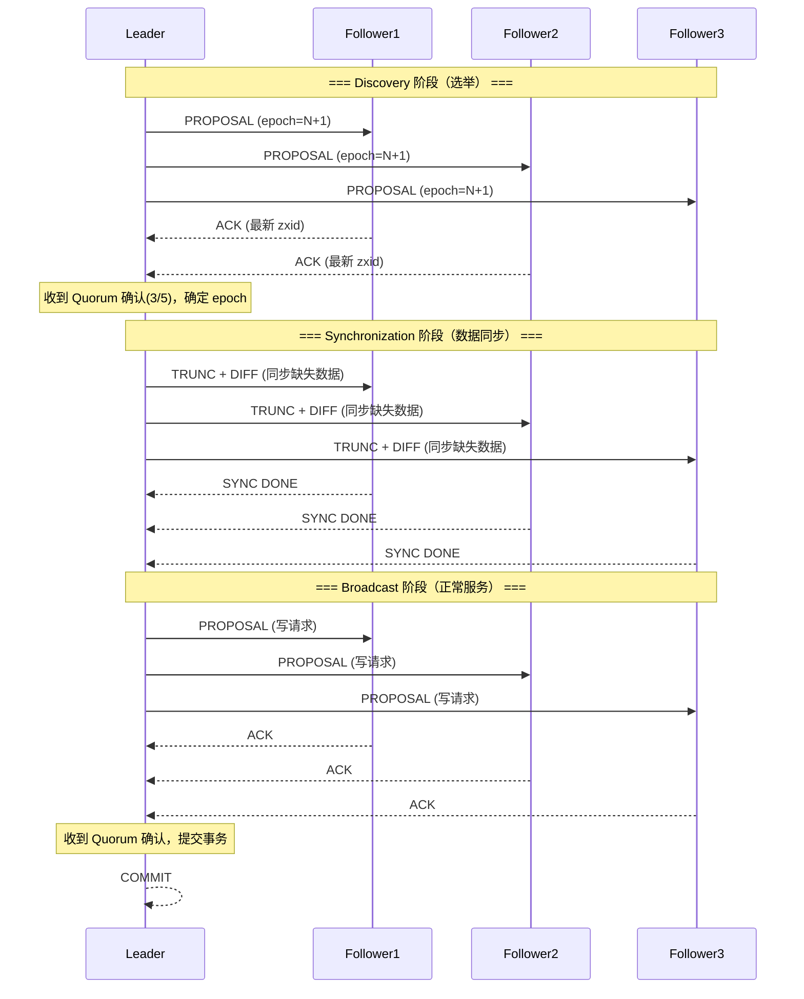
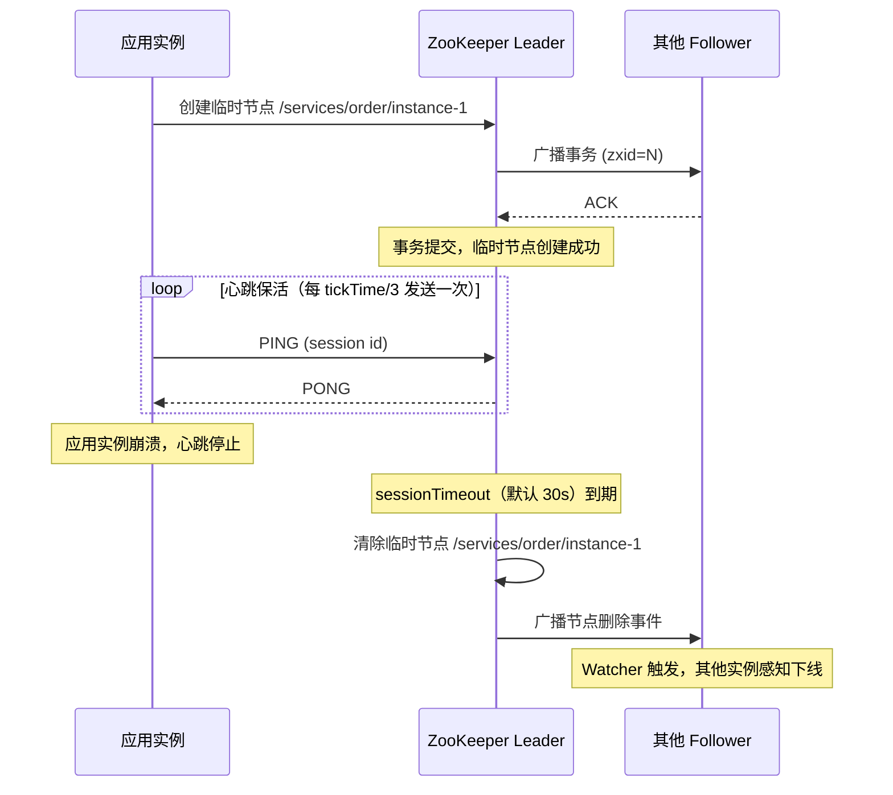
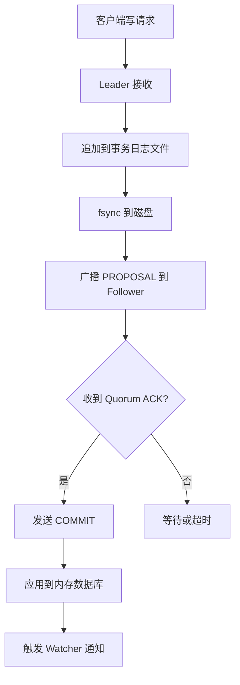

## 案例二：ZooKeeper集群故障转移与恢复实战

### 1. 案例背景与故障概述

#### 1.1 业务场景

某大型互联网公司的微服务架构依赖 ZooKeeper 作为核心协调服务，承担服务注册与发现、分布式锁、配置管理、Leader 选举等多项关键职责。ZooKeeper 集群部署于 3 个机房（IDC-1、IDC-2、IDC-3），采用跨机房部署以实现高可用。

**集群规模**：

| 维度 | 数据 |
|------|------|
| ZooKeeper 节点数 | 7 节点（3 个机房各 2~3 台） |
| 注册服务数 | 500+ 微服务 |
| 日均 Watch 连接数 | 80000+ |
| 节点数据总量（znode） | 120 万+ |
| 峰值读 QPS | 150000+ |
| 峰值写 QPS | 8000+ |

#### 1.2 故障现象

2025 年某天下午 14:23，监控系统连续发出以下告警：

[CRITICAL] zookeeper cluster unavailable: 3 of 7 nodes are unreachable
[CRITICAL] service discovery latency p99 > 30s
[CRITICAL] distributed lock acquisition timeout rate > 40%
[WARNING]  kafka partition leader election storm detected
[WARNING]  dubbo provider registration failures increasing

**关键指标变化**：

| 指标 | 故障前正常值 | 故障时峰值 | 持续时间 |
|------|-------------|-----------|---------|
| ZK 请求延迟（p99） | 8ms | 30000ms | 15 分钟 |
| Leader 切换次数 | 0/天 | 4 次 | 6 分钟内 |
| 节点健康状态 | 7/7 alive | 4/7 alive | 12 分钟 |
| 服务注册成功率 | 100% | 35% | 14 分钟 |
| Watch 恢复堆积 | 0 | 200000+ | 10 分钟 |
| 分布式锁超时率 | 0% | 42% | 12 分钟 |

#### 1.3 影响范围

- **直接影响**：ZooKeeper 集群 Leader 频繁切换，导致服务注册/发现功能间歇性不可用约 12 分钟
- **业务影响**：Dubbo 服务调用失败率飙升至 25%，约 300 个微服务受影响；Kafka Broker 集群出现分区 Leader 选举风暴，消息消费积压约 5 分钟
- **数据影响**：ZooKeeper 事务日志部分丢失，需要从 Follower 同步恢复
- **间接影响**：配置中心推送延迟，约 150 个服务配置更新被阻塞；分布式任务调度暂停约 20 分钟

---

### 2. 故障根因分析

#### 2.1 第一层：事件链还原

通过 ZooKeeper 的四字命令和系统日志，还原故障时间线：

14:20:00  IDC-2 的 zk-node-04 和 zk-node-05 所在物理机电力系统告警
14:21:30  IDC-2 机房 UPS 切换，产生约 3 秒电力中断
14:21:33  zk-node-04 和 zk-node-05 强制关机，磁盘未完成 fsync
14:22:00  集群 Leader（zk-node-01，位于 IDC-1）检测到 2 个 Follower 心跳超时
14:22:05  集群 Leader 发起 Leader 选举，但 quorum 要求 4/7，仅 4 个节点存活
14:22:10  选举过程中 Leader 切换为 zk-node-02（IDC-1），但 IDC-3 的 2 个节点
          与 IDC-1 网络延迟飙升（跨机房链路受电力切换影响）
14:22:15  zk-node-02 选举成功但无法稳定维持 quorum（IDC-3 响应超时）
14:22:20  再次发起选举，zk-node-06（IDC-3）当选
14:22:25  zk-node-06 无法获得 IDC-1 节点响应，Leader 再次失效
14:22:30  集群进入选举震荡状态，连续 4 次 Leader 切换
14:23:00  服务注册/发现全面不可用，Dubbo 客户端开始大量超时
14:25:00  IDC-3 网络恢复正常，zk-node-06 稳定成为 Leader
14:30:00  IDC-2 电力恢复，zk-node-04 和 zk-node-05 重启
14:35:00  zk-node-04 因事务日志损坏无法加入集群
14:40:00  手动清理 zk-node-04 数据目录后重启
14:47:00  集群恢复全部 7 节点，指标回归正常

#### 2.2 第二层：根因定位

| 层级 | 根因 | 详情 |
|------|------|------|
| 直接原因 | IDC-2 机房 UPS 电力中断 | 导致 2 台 ZooKeeper 节点同时强制关机 |
| 触发条件 | quorum 不足 + 跨机房延迟 | 7 节点集群需 4 节点 quorum，IDC-2 丢失 2 节点后仅剩 5 节点，但跨机房延迟导致选举不稳定 |
| 恢复延迟 | Leader 选举震荡 | 3 个机房的节点交替当选又失联，6 分钟内发生 4 次 Leader 切换 |
| 二次冲击 | 事务日志损坏 | zk-node-04 强制关机时 WAL 未完整刷盘，重启后无法恢复 |

#### 2.3 第三层：架构缺陷

1. **节点分布不均**：IDC-2 部署了 2 个节点，当该机房整体故障时，集群虽维持 quorum 但丧失冗余，且跨机房延迟放大了选举不稳定性
2. **缺乏电力监控联动**：UPS 切换事件未触发 ZooKeeper 节点的主动让权（preemptive shutdown），导致被动心跳超时浪费选举时间
3. **事务日志缺乏保护**：未配置 `zookeeper.forceSync`，导致强制关机时 WAL 可能丢失
4. **无自动故障恢复流程**：依赖人工排查和手动操作，恢复耗时 27 分钟

---

### 3. ZooKeeper 故障转移核心机制

在深入修复方案之前，先理解 ZooKeeper 故障转移的底层机制。

#### 3.1 ZAB 协议与 Quorum

ZooKeeper 基于 ZAB（ZooKeeper Atomic Broadcast）一致性协议，其核心规则：

Quorum = N/2 + 1

3 节点集群 → Quorum = 2  → 允许 1 个节点故障
5 节点集群 → Quorum = 3  → 允许 2 个节点故障
7 节点集群 → Quorum = 4  → 允许 3 个节点故障

ZAB 协议分为两个核心阶段：



**ZAB 与 Raft 的关键差异**：

| 特性 | ZAB (ZooKeeper) | Raft (etcd) |
|------|----------------|-------------|
| 选举算法 | FastLeaderElection（基于 zxid + myid） | 基于 term + log index |
| 数据模型 | 层次化 znode 树 | 扁平 KV 存储 |
| 写入流程 | Leader 广播 PROPOSAL → 收集 ACK → COMMIT | Leader 追加日志 → 收集 ACK → Apply |
| 读取方式 | 可从任意节点读（可能读到旧数据） | 默认只能从 Leader 读 |
| 会话管理 | 临时节点 + 心跳（Session） | 无会话概念 |
| Watch 机制 | 一次性 Watch（触发后需重新注册） | 持续 Watch（key range） |

#### 3.2 Leader 选举机制详解

ZooKeeper 使用 FastLeaderElection 算法，选举流程如下：

1. 所有节点投票给自己，广播投票消息
2. 投票消息包含：(proposedLeaderId, proposedZxid, electionEpoch)
3. 节点收到其他投票后比较：
   a. 先比较 electionEpoch（轮次），大的优先
   b. 若 epoch 相同，比较 proposedZxid（事务 ID），大的优先
   c. 若 zxid 也相同，比较 myid（节点 ID），大的优先
4. 每轮投票后重新计算当前 leader
5. 若某个节点获得超过半数投票，成为 Leader

**关键配置参数**：

| 参数 | 默认值 | 说明 | 调优建议 |
|------|--------|------|---------|
| `tickTime` | 2000ms | 基本时间单元 | 保持默认 |
| `initLimit` | 10 | Follower 初始化连接超时（tickTime × 10 = 20s） | 跨机房可调大到 15~20 |
| `syncLimit` | 5 | Follower 同步超时（tickTime × 5 = 10s） | 跨机房可调大到 8~10 |
| `electionPort` | 2182 | 选举通信端口 | 确保防火墙放行 |
| `leaderServes` | yes | Leader 是否同时处理读请求 | 高读场景保持 yes |
| `globalOutstandingLimit` | 1000 | 最大待处理请求数 | 高写场景可调大到 2000 |

#### 3.3 临时节点与会话机制

ZooKeeper 的临时节点（Ephemeral Node）是服务注册/发现的基础：



**会话超时的计算**：

实际 sessionTimeout = min(clientConfiguredTimeout, serverConfiguredTimeout × 2/3)

例如：
- 服务端配置 minSessionTimeout=4000, maxSessionTimeout=40000
- 客户端配置 sessionTimeout=30000
- 实际超时 = min(30000, 40000 × 2/3) = min(30000, 26667) = 26667ms

**为什么临时节点在故障转移中至关重要**：当 ZooKeeper Leader 切换时，所有临时节点（即所有注册的服务实例）不会丢失——它们存储在内存数据库中并随事务日志持久化。新 Leader 选举完成后，通过数据同步确保所有临时节点状态一致，Watch 重新触发通知下游服务。

#### 3.4 事务日志与快照

ZooKeeper 的数据持久化依赖两个关键文件：

| 文件 | 路径 | 作用 | 写入频率 |
|------|------|------|---------|
| 事务日志（WAL） | `dataDir/version-2/log.xxxxx` | 记录所有写操作 | 每次写入都 fsync |
| 快照文件 | `dataDir/version-2/snapshot.xxxxx` | 内存数据库的定期快照 | 周期性（默认每 10 万次事务） |

**事务日志写入流程**：



> **关键警告**：事务日志的 fsync 性能直接决定 ZooKeeper 的写入吞吐量。使用机械硬盘时 fsync 延迟可达 10~50ms，严重限制写入性能；推荐使用 SSD 或 NVMe SSD，并确保 `dataDir` 所在磁盘为独立磁盘，避免与其他服务共享 I/O 带宽。

---

### 4. 故障修复过程

#### 4.1 第一阶段：紧急止损（14:23 - 14:25）

**步骤 1：确认集群 Quorum 状态**

```bash
# 检查集群中所有节点的状态
echo mntr | nc zk-node-01 2181 | grep zk_server_state
# 输出: zk_server_state	leader
# 如果返回 leader 或 follower，说明当前节点在集群中处于活跃状态

echo ruok | nc zk-node-01 2181
# 输出: imok
# 表示节点进程存活

echo stat | nc zk-node-01 2181
# 输出包含:
#   Mode: leader
#   Node count: 1200000
#   Outstanding requests: 1500 (异常高，正常应 < 100)
#   Proposal Latency: avg=3500ms (正常应 < 10ms)
```

```bash
# 批量检查所有节点的存活状态
for zk in zk-node-0{1..7}; do
  result=$(echo ruok | nc -w 2 $zk 2181 2>/dev/null)
  state=$(echo mntr | nc -w 2 $zk 2181 2>/dev/null | grep zk_server_state | awk '{print $2}')
  echo "$zk: ruok=$result, state=$state"
done
# 预期输出:
# zk-node-01: ruok=imok, state=leader
# zk-node-02: ruok=imok, state=follower
# zk-node-03: ruok=imok, state=follower
# zk-node-04: ruok=, state=         ← IDC-2，无法连接
# zk-node-05: ruok=, state=         ← IDC-2，无法连接
# zk-node-06: ruok=imok, state=follower
# zk-node-07: ruok=imok, state=follower
```

**步骤 2：确认 Leader 选举状态**

```bash
# 检查当前 Leader 和选举轮次
echo stat | nc zk-node-01 2181 | grep -E "^(Mode|Zxid|Outstanding)"
# Mode: leader
# Zxid: 0x200000a3f8 (高 32 位是 epoch，低 32 位是计数器)
# Outstanding requests: 1500

# 对比各节点的 zxid，判断数据一致性
for zk in zk-node-0{1,2,3,6,7}; do
  zxid=$(echo mntr | nc -w 2 $zk 2181 2>/dev/null | grep zk_zxid | awk '{print $2}')
  echo "$zk zxid: $zxid"
done
# 如果 zxid 全部相同，说明数据一致
# 如果有差异，需要在恢复后进行数据同步
```

**步骤 3：确认 IDC-2 节点完全离线**

```bash
# 确认网络不可达
for zk in zk-node-04 zk-node-05; do
  echo "--- $zk ---"
  ping -c 3 -W 2 $zk 2>&amp;1 || echo "$zk: UNREACHABLE"
  echo srvr | nc -w 3 $zk 2181 2>&amp;1 || echo "$zk: ZooKeeper port UNREACHABLE"
done
```

**步骤 4：稳定当前 Leader**

```bash
# 在 zk-node-01（当前 Leader）上确认 quorum 是否稳定
# 由于 7 节点集群需要 4 节点 quorum，当前 5 节点存活，quorum 安全
echo stat | nc zk-node-01 2181 | grep "Mode"
# 确认仍为 leader

# 如果 Leader 不稳定，考虑在存活的 IDC-1 节点上手动触发选举
# 但通常不推荐手动干预，让 ZAB 协议自动处理
```

#### 4.2 第二阶段：恢复 IDC-2 节点（14:30 - 14:40）

> **重要原则**：ZooKeeper 故障恢复的黄金法则是——**先确保 Leader 稳定，再逐步恢复故障节点，最后验证数据一致性**。

**步骤 5：确认 IDC-2 电力和磁盘恢复**

```bash
# 在 IDC-2 节点上检查磁盘
ssh zk-node-04 "iostat -x 1 3"
# 确认 %util < 5%, await < 5ms

ssh zk-node-04 "df -h /var/lib/zookeeper"
# 确认磁盘空间充足（使用率 < 70%）

ssh zk-node-04 "ls -la /var/lib/zookeeper/version-2/log.*"
# 检查事务日志文件是否存在且非空
```

**步骤 6：检查事务日志完整性**

```bash
# 在 zk-node-04 上使用 ZooKeeper 的日志恢复工具检查
ssh zk-node-04

# 查看最后一条事务日志
java -cp /opt/zookeeper/lib/*:opt/zookeeper/* \
  org.apache.zookeeper.server.LogFormatter \
  /var/lib/zookeeper/version-2/log.000000001 2>&amp;1 | tail -5

# 如果日志损坏，输出会包含 "IOException" 或 "CRC check failed"
# 此时需要删除损坏的日志并让节点从 Leader 同步
```

**步骤 7：处理事务日志损坏（zk-node-04）**

```bash
# 情况一：日志完整，直接重启
ssh zk-node-04 "sudo systemctl start zookeeper"
sleep 10
ssh zk-node-04 "echo ruok | nc localhost 2181"
# 输出: imok

# 情况二：日志损坏（本案例实际遇到），需要清理数据后让节点同步
ssh zk-node-04 "sudo systemctl stop zookeeper"

# 备份损坏的数据目录（以防万一）
ssh zk-node-04 "sudo cp -r /var/lib/zookeeper/version-2 /var/lib/zookeeper/version-2.bak.$(date +%s)"

# 删除损坏的事务日志（保留快照文件）
ssh zk-node-04 "sudo rm -f /var/lib/zookeeper/version-2/log.*"

# 清除 myid 文件中的集群信息（但保留 myid）
ssh zk-node-04 "cat /var/lib/zookeeper/myid"

# 重启 ZooKeeper，节点将以 FOLLOWER 角色加入并从 Leader 同步数据
ssh zk-node-04 "sudo systemctl start zookeeper"
sleep 15

# 验证节点已加入集群
ssh zk-node-04 "echo mntr | nc localhost 2181 | grep zk_server_state"
# 输出: zk_server_state	follower
```

**步骤 8：恢复 zk-node-05**

```bash
# 在 zk-node-05 上执行相同操作
ssh zk-node-05 "sudo systemctl stop zookeeper"
ssh zk-node-05 "sudo cp -r /var/lib/zookeeper/version-2 /var/lib/zookeeper/version-2.bak.$(date +%s)"
ssh zk-node-05 "sudo rm -f /var/lib/zookeeper/version-2/log.*"
ssh zk-node-05 "sudo systemctl start zookeeper"
sleep 15
ssh zk-node-05 "echo mntr | nc localhost 2181 | grep zk_server_state"
# 输出: zk_server_state	follower
```

**步骤 9：验证全部 7 节点恢复**

```bash
for zk in zk-node-0{1..7}; do
  state=$(echo mntr | nc -w 2 $zk 2181 2>/dev/null | grep zk_server_state | awk '{print $2}')
  zxid=$(echo mntr | nc -w 2 $zk 2181 2>/dev/null | grep zk_zxid | awk '{print $2}')
  connections=$(echo mntr | nc -w 2 $zk 2181 2>/dev/null | grep zk_num_alive_connections | awk '{print $2}')
  echo "$zk: state=$state, zxid=$zxid, connections=$connections"
done
# 所有 7 个节点应返回 state=follower 或 state=leader
# 所有 zxid 应接近一致（差异在 100 以内为正常）
```

#### 4.3 第三阶段：数据一致性验证（14:40 - 14:47）

**步骤 10：对比各节点数据一致性**

```bash
# 检查各节点的 znode 数量
for zk in zk-node-0{1..7}; do
  count=$(echo mntr | nc -w 2 $zk 2181 2>/dev/null | grep zk_approx_data_size | awk '{print $2}')
  echo "$zk: znode count = $count"
done
# 正常情况下所有节点的 znode 数量应非常接近（差异 < 1%）
```

```bash
# 写入测试数据验证一致性
# 在 Leader 节点上创建测试 znode
echo create /test-consistency "test-$(date +%s)" | nc zk-node-01 2181
# 输出: Created /test-consistency

# 从所有节点读取验证
for zk in zk-node-0{1..7}; do
  value=$(echo get /test-consistency | nc -w 2 $zk 2181 2>/dev/null | tail -1)
  echo "$zk: $value"
done
# 所有节点应返回相同的值
```

```bash
# 清理测试数据
echo delete /test-consistency | nc zk-node-01 2181
# 输出: WatchedEvent [None(None) None(/test-consistency)]
```

**步骤 11：验证服务注册/发现功能恢复**

```bash
# 检查关键服务的注册状态
echo ls /services | nc zk-node-01 2181
# 输出: [order-service, user-service, payment-service, ...]

# 检查某个服务的实例数
echo ls /services/order-service | nc zk-node-01 2181
# 输出: [instance-1, instance-2, instance-3, ...]

# 验证临时节点是否正确注册
echo get /services/order-service/instance-1 | nc zk-node-01 2181
# 输出应包含实例的连接信息（IP、端口等）
```

**步骤 12：验证 Watch 机制恢复**

```bash
# 监听一个 znode 的变更
# 终端 1：启动 Watch
echo watch /config/app-config | nc zk-node-01 2181 &amp;
WATCH_PID=$!

# 终端 2：修改 znode 触发 Watch
echo set /config/app-config "updated-$(date +%s)" | nc zk-node-01 2181

# 终端 1 应收到 Watch 事件通知
# 输出: WatchedEvent [SyncConnected(None) (/config/app-config)]

kill $WATCH_PID 2>/dev/null
```

---

### 5. 架构优化方案

#### 5.1 第一优先级：节点重分布与机房均衡

**问题**：原部署方案中 IDC-2 有 2 个节点，当该机房整体故障时，集群虽维持 quorum 但丧失冗余，且跨机房延迟放大了选举不稳定性。

**方案**：改为 3 机房均匀分布 7 节点：

| 机房 | 节点数 | 说明 |
|------|--------|------|
| IDC-1 | 3 | 包含 1 个潜在 Leader 候选，主要服务区域 |
| IDC-2 | 2 | 备用服务区域 |
| IDC-3 | 2 | 备用服务区域 |

**为什么 3+2+2 而不是 2+3+2**：IDC-1 是主服务区域，承载大部分客户端连接。将更多 ZK 节点放在 IDC-1 可以减少客户端的跨机房网络延迟，提升读取性能。同时当任一机房故障时，剩余 2 个机房共 5 个节点仍满足 quorum（4/7）且有 1 个冗余。

**实施步骤**：

```bash
# 步骤 1：在 IDC-1 添加一个新节点（node-08）
# 先在集群中注册新节点
echo mntr | nc zk-node-01 2181 | grep zk_server_state
# 确认 zk-node-01 是 Leader

# ZooKeeper 不像 etcd 那样支持动态 member add，
# 需要通过配置文件修改来实现节点变更

# 修改 zoo.cfg，在集群配置中添加新节点
# 在所有节点上更新 zoo.cfg：
cat >> /opt/zookeeper/conf/zoo.cfg << 'EOF'
server.8=zk-node-08:2888:3888:observer
EOF

# 步骤 2：在 zk-node-08 上配置并启动
echo "8" > /var/lib/zookeeper/myid
sudo systemctl start zookeeper

# 步骤 3：确认新节点加入（observer 模式不参与投票，不影响 quorum）
echo mntr | nc zk-node-08 2181 | grep zk_server_state
# 输出: zk_server_state	observer

# 步骤 4：确认集群稳定后，将 observer 转为 participant
# 修改 zoo.cfg，将 observer 改为 participant（删除 :observer 后缀）
# 在所有节点更新配置后逐个重启 ZooKeeper

# 步骤 5：移除 IDC-2 的多余节点（逐步操作）
# 先停止目标节点的 ZooKeeper
ssh zk-node-05 "sudo systemctl stop zookeeper"

# 从所有剩余节点的 zoo.cfg 中移除对应 server 行
# 逐个重启剩余节点的 ZooKeeper
# 注意：每次只变更一个节点，确保集群稳定后再进行下一个

# 步骤 6：验证最终拓扑
for zk in zk-node-0{1,2,3,6,7,8}; do
  state=$(echo mntr | nc -w 2 $zk 2181 2>/dev/null | grep zk_server_state | awk '{print $2}')
  echo "$zk: $state"
done
```

#### 5.2 第二优先级：事务日志保护增强

**问题**：强制关机导致事务日志损坏，节点无法恢复。

**方案**：启用事务日志强制刷盘 + 独立磁盘 + 定期快照清理。

```bash
# 在 zoo.cfg 中添加以下配置
cat >> /opt/zookeeper/conf/zoo.cfg << 'EOF'

# 事务日志强制刷盘（默认 true，确认未被误关）
forceSync=yes

# 使用独立磁盘存放数据（避免与其他服务竞争 I/O）
dataDir=/data/zookeeper

# 快照触发频率：每 50000 次事务触发一次快照（默认 100000）
snapCount=50000

# 事务日志预分配大小（MB），减少日志文件碎片
preAllocSize=64

# 最大客户端连接数（根据实际业务调整）
maxClientCnxns=2000

# 最小会话超时（ms）
minSessionTimeout=4000

# 最大会话超时（ms）
maxSessionTimeout=40000
EOF
```

**独立磁盘配置示例**：

```bash
# 确认 /data 磁盘为独立的 SSD/NVMe
lsblk -d -o NAME,SIZE,TYPE,MOUNTPOINT,ROTA
# ROTA=0 表示 SSD，ROTA=1 表示 HDD

# 创建数据目录
sudo mkdir -p /data/zookeeper
sudo chown zookeeper:zookeeper /data/zookeeper

# 挂载独立磁盘（如果尚未挂载）
sudo mkfs.ext4 /dev/nvme1n1
sudo mount /dev/nvme1n1 /data/zookeeper
echo '/dev/nvme1n1 /data/zookeeper ext4 defaults,noatime 0 2' | sudo tee -a /etc/fstab
```

#### 5.3 第三优先级：自动故障恢复与监控

部署 ZooKeeper 专用监控脚本：

```bash
#!/bin/bash
# /usr/local/bin/zk-cluster-monitor.sh
# ZooKeeper 集群健康监控脚本

ZK_NODES=("zk-node-01" "zk-node-02" "zk-node-03" "zk-node-04" 
          "zk-node-05" "zk-node-06" "zk-node-07")
ZK_PORT=2181
ALERT_ENDPOINT="https://alertmanager:9093/api/v1/alerts"

# 阈值配置
THRESHOLD_OUTSTANDING=500       # 待处理请求超过 500 告警
THRESHOLD_PROPOSAL_LATENCY=50   # Proposal 延迟超过 50ms 告警
THRESHOLD_DEAD_NODES=2          # 节点死亡超过 2 个告警
THRESHOLD_WATCH_BACKLOG=100000  # Watch 堆积超过 10 万告警

check_node_health() {
    local dead_count=0
    local leader_count=0
    local follower_count=0
    
    for node in "${ZK_NODES[@]}"; do
        local state=$(echo mntr | nc -w 3 $node $ZK_PORT 2>/dev/null | grep zk_server_state | awk '{print $2}')
        
        if [ -z "$state" ]; then
            echo "[CRITICAL] $node is unreachable"
            dead_count=$((dead_count + 1))
        elif [ "$state" = "leader" ]; then
            leader_count=$((leader_count + 1))
            echo "[OK] $node: leader"
        else
            follower_count=$((follower_count + 1))
            echo "[OK] $node: $state"
        fi
    done
    
    if [ $dead_count -ge $THRESHOLD_DEAD_NODES ]; then
        send_alert "CRITICAL" "ZooKeeper cluster: $dead_count nodes dead (threshold: $THRESHOLD_DEAD_NODES)"
    fi
    
    if [ $leader_count -ne 1 ]; then
        send_alert "CRITICAL" "ZooKeeper cluster: unexpected leader count=$leader_count (expected 1)"
    fi
}

check_performance() {
    # 检查 Leader 节点的性能指标
    for node in "${ZK_NODES[@]}"; do
        local state=$(echo mntr | nc -w 3 $node $ZK_PORT 2>/dev/null | grep zk_server_state | awk '{print $2}')
        
        if [ "$state" = "leader" ]; then
            # 检查待处理请求数
            local outstanding=$(echo mntr | nc -w 3 $node $ZK_PORT 2>/dev/null | grep zk_outstanding_requests | awk '{print $2}')
            if [ -n "$outstanding" ] &amp;&amp; [ "$outstanding" -gt $THRESHOLD_OUTSTANDING ]; then
                send_alert "WARNING" "ZooKeeper $node outstanding requests: $outstanding"
            fi
            
            # 检查 Watch 堆积
            local watch_count=$(echo mntr | nc -w 3 $node $ZK_PORT 2>/dev/null | grep zk_watch_count | awk '{print $2}')
            if [ -n "$watch_count" ] &amp;&amp; [ "$watch_count" -gt $THRESHOLD_WATCH_BACKLOG ]; then
                send_alert "WARNING" "ZooKeeper $node watch count: $watch_count (possible backlog)"
            fi
            
            # 检查磁盘空间（事务日志）
            local data_size=$(du -sb /data/zookeeper/version-2/ 2>/dev/null | awk '{print $1}')
            local disk_threshold=$((50 * 1024 * 1024 * 1024))  # 50GB
            if [ -n "$data_size" ] &amp;&amp; [ "$data_size" -gt "$disk_threshold" ]; then
                send_alert "WARNING" "ZooKeeper $node data dir: $(( data_size / 1024 / 1024 ))MB exceeds 50GB"
            fi
        fi
    done
}

check_session_expiration() {
    # 检查是否有大量会话过期事件
    for node in "${ZK_NODES[@]}"; do
        local expired=$(echo mntr | nc -w 3 $node $ZK_PORT 2>/dev/null | grep zk_expired_sessions_count | awk '{print $2}')
        if [ -n "$expired" ] &amp;&amp; [ "$expired" -gt 0 ]; then
            echo "[INFO] $node expired sessions: $expired"
        fi
    done
}

send_alert() {
    local severity=$1
    local message=$2
    curl -s -X POST "$ALERT_ENDPOINT" \
      -H "Content-Type: application/json" \
      -d "[{\"labels\":{\"alertname\":\"zk_cluster_issue\",\"severity\":\"$severity\"},\"annotations\":{\"summary\":\"$message\"}}]"
    echo "[$severity] $message"
}

# 主流程
echo "=== ZooKeeper Cluster Health Check: $(date) ==="
check_node_health
check_performance
check_session_expiration
echo "=== Check Complete ==="
```

#### 5.4 第四优先级：客户端容错配置

确保客户端（Dubbo、Kafka 等）在 ZooKeeper 故障转移期间能优雅降级：

```java
// Dubbo 消费者的 ZooKeeper 容错配置
@DubboService
public class OrderService {
    // ZooKeeper 注册中心配置
    @Reference(registry = @Registry(
        address = "zk://zk-node-01:2181,zk-node-02:2181,zk-node-03:2181",
        // 会话超时设置（ms）：应大于服务端 maxSessionTimeout 的 2/3
        timeout = 30000,
        // 注册中心失败重试次数
        retries = 3,
        // 注册中心不可用时的容错策略：failover
        check = false
    ))
    private OrderService orderService;
}
```

```yaml
# Kafka 的 ZooKeeper 容错配置（server.properties）
# 控制器超时时间（ms）
controller.socket.timeout.ms=30000

# ZooKeeper 会话超时（ms）
zookeeper.session.timeout.ms=30000

# ZooKeeper 连接超时（ms）
zookeeper.connection.timeout.ms=15000

# ZooKeeper 最大重试次数
zookeeper.max.retries=5

# ZooKeeper 重试间隔（ms）
zookeeper.retry.backoff.ms=1000
```

---

### 6. 常见误区与纠正

| 误区 | 正确做法 | 原因 |
|------|---------|------|
| 认为 ZooKeeper 节点越多越好 | 奇数节点即可（3、5、7），过多增加选举开销 | 每增加 2 个节点只多容忍 1 个故障，但写入延迟线性增长 |
| 在 ZooKeeper 节点上部署其他服务 | ZK 节点应专用，磁盘、网络、CPU 隔离 | ZooKeeper 对 I/O 延迟极度敏感，共享资源会导致选举超时 |
| 会话超时设置过短 | 客户端 sessionTimeout 应为服务端 maxSessionTimeout 的 1.5~2 倍 | 过短导致网络抖动时大量临时节点误删，引发服务雪崩 |
| 手动修改事务日志文件 | 永远不要手动编辑日志文件，损坏时清理后让节点同步 | 手动编辑会破坏日志完整性，可能导致数据不一致 |
| 认为 ZooKeeper 可以用作数据库 | ZooKeeper 适合协调数据（小量、低频），不适合存储大量业务数据 | znode 数据上限 1MB，写入性能随数据量下降，且每次写入需要全集群同步 |
| 故障恢复后不验证数据一致性 | 恢复后必须进行端到端验证（读写测试 + 服务功能验证） | 节点加入集群不代表数据完全一致，需要主动验证 |

---

### 7. 运维最佳实践

#### 7.1 日常巡检清单

```bash
#!/bin/bash
# /usr/local/bin/zk-daily-check.sh
# ZooKeeper 日常巡检脚本

echo "=== ZooKeeper 日常巡检 $(date '+%Y-%m-%d %H:%M:%S') ==="

# 1. 集群状态概览
echo -e "\n--- 集群状态 ---"
for zk in zk-node-0{1..7}; do
  state=$(echo mntr | nc -w 3 $zk 2181 2>/dev/null | grep zk_server_state | awk '{print $2}')
  zxid=$(echo mntr | nc -w 3 $zk 2181 2>/dev/null | grep zk_zxid | awk '{print $2}')
  echo "  $zk: state=$state zxid=$zxid"
done

# 2. 磁盘使用情况
echo -e "\n--- 磁盘使用 ---"
for zk in zk-node-0{1..7}; do
  usage=$(ssh -o ConnectTimeout=5 $zk "df -h /data/zookeeper | tail -1 | awk '{print \$5}'" 2>/dev/null)
  echo "  $zk: disk usage=$usage"
done

# 3. 事务日志大小
echo -e "\n--- 事务日志大小 ---"
for zk in zk-node-0{1..7}; do
  size=$(ssh -o ConnectTimeout=5 $zk "du -sh /data/zookeeper/version-2/ 2>/dev/null | awk '{print \$1}'" 2>/dev/null)
  echo "  $zk: $size"
done

# 4. 快照文件数量（过多需要清理）
echo -e "\n--- 快照文件数量 ---"
for zk in zk-node-0{1..7}; do
  count=$(ssh -o ConnectTimeout=5 $zk "ls /data/zookeeper/version-2/snapshot.* 2>/dev/null | wc -l" 2>/dev/null)
  echo "  $zk: $count snapshots"
done

echo -e "\n=== 巡检完成 ==="
```

#### 7.2 四字命令速查表

| 命令 | 作用 | 输出说明 |
|------|------|---------|
| `echo ruok \| nc host 2181` | 进程存活检查 | 返回 `imok` 表示正常 |
| `echo stat \| nc host 2181` | 集群状态详情 | 包含 Leader/Follower、zxid、连接数等 |
| `echo mntr \| nc host 2181` | 监控指标（JMX 格式） | 包含所有运行时指标 |
| `echo conf \| nc host 2181` | 配置信息 | 包含 dataDir、tickTime 等 |
| `echo cons \| nc host 2181` | 客户端连接详情 | 包含每个连接的 IP、延迟等 |
| `echo dump \| nc host 2181` | 会话和临时节点列表 | 调试会话问题时使用 |
| `echo envi \| nc host 2181` | 环境变量 | 包含 JVM 参数、类路径等 |
| `echo reqs \| nc host 2181` | 待处理请求队列 | 调试请求堆积时使用 |
| `echo wchs \| nc host 2181` | Watch 摘要 | 包含 Watch 数量和路径分布 |
| `echo wchc \| nc host 2181` | Watch 详细列表（按连接） | 可能输出较大，慎用 |
| `echo wchp \| nc host 2181` | Watch 详细列表（按路径） | 可能输出较大，慎用 |
| `echo isro \| nc host 2181` | 只读模式检查 | 返回 `rw` 或 `ro` |

#### 7.3 ZooKeeper vs etcd 选型对比

在故障转移场景下，ZooKeeper 和 etcd 各有优势：

| 维度 | ZooKeeper | etcd |
|------|-----------|------|
| 一致性协议 | ZAB | Raft |
| 数据模型 | 层次化 znode | 扁平 KV |
| Watch | 一次性（需重新注册） | 持续性（Watch 流） |
| 会话管理 | 内置临时节点 + Session | 无（需应用层实现） |
| Leader 读 | 可从 Follower 读（可能旧数据） | 默认 Leader 读（线性一致性） |
| 适合场景 | 服务注册/发现、分布式锁、配置管理 | Kubernetes 状态存储、服务网格 |
| 运维复杂度 | 较高（JVM 调优、GC 问题） | 较低（Go 单二进制） |
| 故障恢复速度 | 中等（需同步事务日志） | 较快（日志追赶 + snapshot） |
| 生态系统 | Hadoop/Kafka/Dubbo/HBase 生态 | Kubernetes/云原生生态 |

---

### 8. 经验总结

1. **机房均衡是基础**：跨机房部署时，节点分布必须均匀，避免单一机房故障导致 quorum 不稳定。7 节点集群推荐 3+2+2 分布，5 节点集群推荐 2+2+1 分布
2. **事务日志是生命线**：ZooKeeper 的数据安全性完全依赖事务日志的完整性。必须使用 SSD、独立磁盘、并确保 `forceSync=yes`
3. **四字命令是利器**：熟练使用 `mntr`、`stat`、`cons`、`wchs` 等四字命令可以快速定位集群问题，比翻日志高效 10 倍
4. **客户端容错不可忽视**：ZooKeeper 故障转移期间，客户端的超时设置、重试策略、降级逻辑同样重要。配置不当可能导致服务雪崩
5. **预防胜于治疗**：建立 ZooKeeper 集群的基线指标（zxid 增长速率、Watch 数量、连接数），设置动态告警阈值，在问题发生前介入
6. **恢复必须验证**：节点恢复后不能只看 `ruok` 返回 `imok`，必须进行端到端的功能验证——写入测试、Watch 触发、服务注册/发现全链路验证
