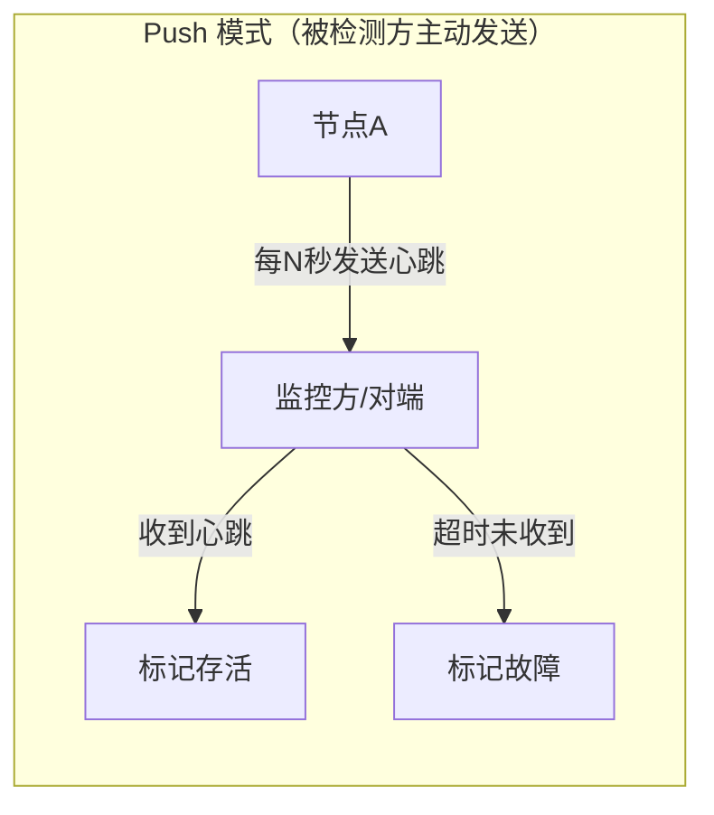
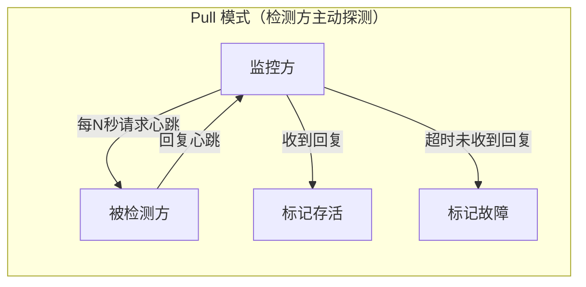
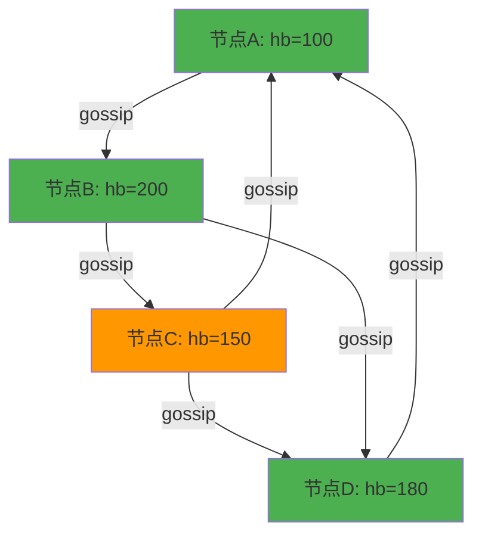
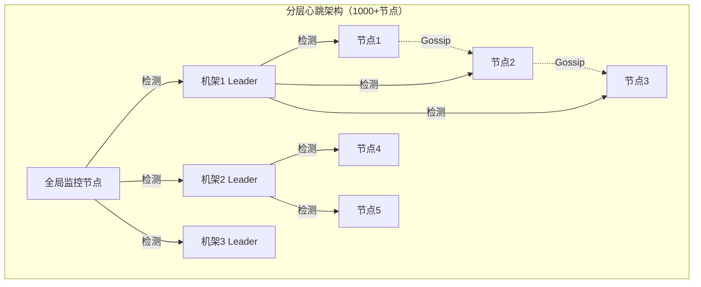
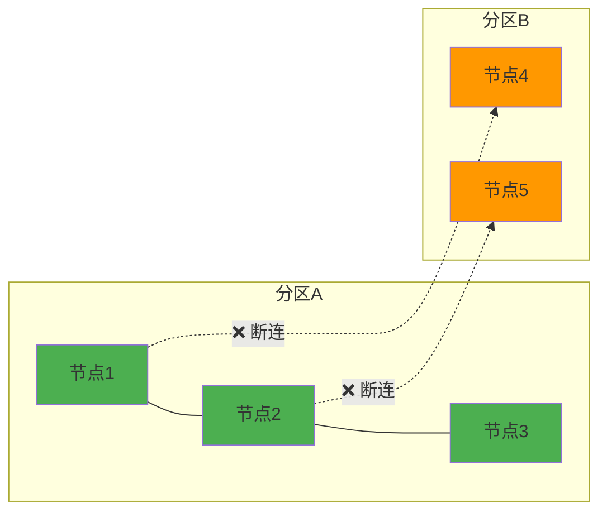

## 心跳检测

心跳检测（Heartbeat Detection）是分布式系统故障检测中最基础、最广泛使用的技术手段。它的核心思想极其简单——节点定期向其他节点发送"我还活着"的信号，一旦信号中断超过阈值，就判定该节点故障。但正是这种看似简单的机制，在生产环境中面临着网络抖动、GC暂停、时钟漂移、脑裂等诸多挑战。本文将从协议原理、实现模式、参数调优到生产实战，系统讲解心跳检测的设计要点。

---

### 1. 心跳检测的核心原理

#### 1.1 什么是心跳检测

心跳检测的本质是**基于超时的存活判定**：节点A每隔固定间隔向节点B发送一条轻量消息（心跳），如果节点B在预设的超时时间内没有收到下一条心跳，就判定节点A已故障。

这个机制背后有一个关键假设：**如果一个节点无法发送心跳，那么它很可能也无法正常提供服务**。当然，这个假设并不总是成立——网络分区、GC暂停、进程假死都可能导致心跳丢失但进程仍在运行，因此心跳检测需要与其他检测手段配合使用。

#### 1.2 心跳的两种基本模式





**Push模式（推模式）：** 被检测方主动定期向监控方发送心跳消息。

| 优点 | 缺点 |
|------|------|
| 被检测方控制发送频率，减轻监控方压力 | 被检测方崩溃后无法主动通知 |
| 实现简单，适合节点数量少的场景 | 心跳消息可能因网络拥塞丢失 |
| 监控方无需维护每个节点的状态 | 监控方无法验证被检测方的"响应能力" |

**Pull模式（拉模式）：** 监控方主动定期向被检测方发送探测请求，等待回复。

| 优点 | 缺点 |
|------|------|
| 监控方完全控制检测节奏 | 监控方需要维护所有节点的连接状态 |
| 可以测量响应延迟，检测性能退化 | 节点数量多时监控方成为瓶颈 |
| 崩溃节点不会"静默失败" | 无法区分"节点故障"和"网络中断" |

**生产环境的最佳实践是混合使用：** 被检测方定期Push心跳（表示存活），同时监控方定期Pull探测（验证响应能力）。etcd、Consul等系统均采用这种混合模式。

#### 1.3 心跳消息的协议设计

一条看似简单的心跳消息，实际上需要携带足够的元信息才能支持高级故障检测：

```python
import time
import uuid

class HeartbeatMessage:
    """生产级心跳消息结构"""
    
    def __init__(self, sender_id: str, sequence: int):
        self.sender_id = sender_id          # 发送方节点唯一标识
        self.sequence = sequence            # 单调递增序列号，用于检测丢包
        self.timestamp_send = time.time()   # 发送时的本地时间戳
        self.msg_id = str(uuid.uuid4())     # 消息唯一ID，用于去重
        self.load_info = None               # 可选：负载信息（CPU/内存/连接数）
        self.version = 1                    # 协议版本号
    
    def to_dict(self):
        """序列化为网络传输格式"""
        return {
            'sender_id': self.sender_id,
            'seq': self.sequence,
            'ts': self.timestamp_send,
            'msg_id': self.msg_id,
            'load': self.load_info,
            'ver': self.version
        }
    
    @classmethod
    def from_dict(cls, data: dict):
        """从网络数据反序列化"""
        msg = cls(data['sender_id'], data['seq'])
        msg.timestamp_send = data['ts']
        msg.msg_id = data.get('msg_id', '')
        msg.load_info = data.get('load')
        msg.version = data.get('ver', 1)
        return msg
```

**心跳消息中每个字段的作用：**

| 字段 | 作用 | 缺失后果 |
|------|------|----------|
| `sender_id` | 标识发送方身份 | 无法区分心跳来源 |
| `sequence` | 检测丢包和乱序 | 无法计算丢包率，无法检测心跳乱序 |
| `timestamp_send` | 计算网络往返延迟（RTT） | 无法自适应调整超时阈值 |
| `msg_id` | 消息去重和追踪 | 无法排查重复心跳或丢失心跳 |
| `load_info` | 支持负载感知的故障判定 | 只能做二元的存活/故障判断 |
| `version` | 协议兼容性 | 滚动升级时新旧版本不兼容 |

---

### 2. 心跳检测的生产级实现

#### 2.1 基于TCP长连接的心跳

TCP长连接是最常见的底层传输方式。心跳检测可以在应用层实现，也可以利用TCP KeepAlive机制。

**应用层心跳实现：**

```python
import socket
import threading
import time
import struct
import json

class HeartbeatSender:
    """心跳发送方：定期向目标节点发送心跳"""
    
    HEADER_FORMAT = '!I'  # 4字节消息长度头
    HEADER_SIZE = struct.calcsize(HEADER_FORMAT)
    
    def __init__(self, target_host: str, target_port: int,
                 interval: float = 1.0, node_id: str = None):
        self.target_host = target_host
        self.target_port = target_port
        self.interval = interval
        self.node_id = node_id or f"node-{uuid.uuid4().hex[:8]}"
        self.sequence = 0
        self._running = False
        self._thread = None
        self._sock = None
        self._lock = threading.Lock()
        # 统计信息
        self.stats = {
            'sent': 0,
            'failed': 0,
            'avg_rtt_ms': 0.0,
        }
    
    def _connect(self):
        """建立TCP长连接"""
        self._sock = socket.socket(socket.AF_INET, socket.SOCK_STREAM)
        self._sock.setsockopt(socket.IPPROTO_TCP, socket.TCP_NODELAY, 1)
        self._sock.settimeout(5.0)  # 连接超时5秒
        self._sock.connect((self.target_host, self.target_port))
    
    def _send_heartbeat(self):
        """发送单次心跳并等待回复，测量RTT"""
        msg = HeartbeatMessage(self.node_id, self.sequence)
        data = json.dumps(msg.to_dict()).encode('utf-8')
        
        # 发送：4字节长度头 + 消息体
        packet = struct.pack(self.HEADER_FORMAT, len(data)) + data
        
        send_time = time.time()
        self._sock.sendall(packet)
        
        # 等待回复
        header = self._recv_exact(self.HEADER_SIZE)
        if header is None:
            raise ConnectionError("No response header received")
        
        resp_len = struct.unpack(self.HEADER_FORMAT, header)[0]
        resp_data = self._recv_exact(resp_len)
        if resp_data is None:
            raise ConnectionError("No response body received")
        
        rtt_ms = (time.time() - send_time) * 1000
        self.sequence += 1
        return rtt_ms
    
    def _recv_exact(self, n: int):
        """精确接收n字节数据"""
        buffer = b''
        while len(buffer) < n:
            chunk = self._sock.recv(n - len(buffer))
            if not chunk:
                return None
            buffer += chunk
        return buffer
    
    def _heartbeat_loop(self):
        """心跳发送循环"""
        while self._running:
            try:
                if self._sock is None:
                    self._connect()
                
                rtt = self._send_heartbeat()
                self.stats['sent'] += 1
                
                # 指数移动平均计算RTT
                alpha = 0.3
                self.stats['avg_rtt_ms'] = (
                    alpha * rtt + 
                    (1 - alpha) * self.stats['avg_rtt_ms']
                )
                
            except Exception as e:
                self.stats['failed'] += 1
                self._sock = None  # 断开重连
                print(f"[Heartbeat] Error to {self.target_host}: {e}")
            
            time.sleep(self.interval)
    
    def start(self):
        """启动心跳线程"""
        self._running = True
        self._thread = threading.Thread(
            target=self._heartbeat_loop, daemon=True
        )
        self._thread.start()
    
    def stop(self):
        """停止心跳"""
        self._running = False
        if self._thread:
            self._thread.join(timeout=5)
        if self._sock:
            self._sock.close()


class HeartbeatReceiver:
    """心跳接收方：接收并回复心跳消息"""
    
    HEADER_FORMAT = '!I'
    HEADER_SIZE = struct.calcsize(HEADER_FORMAT)
    
    def __init__(self, listen_host: str, listen_port: int):
        self.listen_host = listen_host
        self.listen_port = listen_port
        self._running = False
        self._server_sock = None
        # 记录每个发送方的最后心跳时间
        self.last_heartbeat = {}  # node_id -> timestamp
    
    def _handle_client(self, conn: socket.socket, addr):
        """处理单个客户端连接"""
        try:
            while self._running:
                header = self._recv_exact(conn, self.HEADER_SIZE)
                if header is None:
                    break
                
                msg_len = struct.unpack(self.HEADER_FORMAT, header)[0]
                data = self._recv_exact(conn, msg_len)
                if data is None:
                    break
                
                msg = HeartbeatMessage.from_dict(json.loads(data.decode()))
                self.last_heartbeat[msg.sender_id] = time.time()
                
                # 发送回复
                reply = json.dumps({
                    'ack': True, 
                    'receiver_ts': time.time()
                }).encode('utf-8')
                reply_packet = (
                    struct.pack(self.HEADER_FORMAT, len(reply)) + reply
                )
                conn.sendall(reply_packet)
                
        except Exception as e:
            print(f"[HeartbeatReceiver] Client {addr} error: {e}")
        finally:
            conn.close()
    
    def _recv_exact(self, conn, n: int):
        buffer = b''
        while len(buffer) < n:
            chunk = conn.recv(n - len(buffer))
            if not chunk:
                return None
            buffer += chunk
        return buffer
    
    def start(self):
        """启动心跳接收服务"""
        self._running = True
        self._server_sock = socket.socket(socket.AF_INET, socket.SOCK_STREAM)
        self._server_sock.setsockopt(socket.SOL_SOCKET, socket.SO_REUSEADDR, 1)
        self._server_sock.bind((self.listen_host, self.listen_port))
        self._server_sock.listen(128)
        self._server_sock.settimeout(1.0)  # 用于优雅关闭
        
        while self._running:
            try:
                conn, addr = self._server_sock.accept()
                t = threading.Thread(
                    target=self._handle_client, args=(conn, addr), daemon=True
                )
                t.start()
            except socket.timeout:
                continue
```

**TCP KeepAlive配置（系统层心跳）：**

TCP KeepAlive是操作系统内核层的心跳机制，与应用层心跳互补。它的主要作用是在连接空闲时检测"半开连接"（对端已崩溃但本端不知道）。

```bash
# Linux TCP KeepAlive 参数调优
# /etc/sysctl.conf

# 启用TCP KeepAlive（默认已启用，0=关闭 1=开启）
net.ipv4.tcp_keepalive_time = 60
# 空闲60秒后开始发送探测包（默认7200秒，太长）

net.ipv4.tcp_keepalive_intvl = 10
# 每次探测间隔10秒（默认75秒）

net.ipv4.tcp_keepalive_probes = 5
# 最多探测5次无响应则判定连接死亡（默认9次）

# 应用生效
sysctl -p
```

**TCP KeepAlive vs 应用层心跳对比：**

| 特性 | TCP KeepAlive | 应用层心跳 |
|------|--------------|-----------|
| 检测层级 | 传输层 | 应用层 |
| 消息内容 | 空包或极小包 | 可携带业务信息 |
| 可配置性 | 有限（仅超时参数） | 完全自定义 |
| 检测粒度 | 只能检测连接存活 | 可检测业务功能是否正常 |
| 性能开销 | 极低（内核处理） | 有一定开销 |
| 适用场景 | 长连接保活 | 业务级故障检测 |

**最佳实践：** 两者同时启用。TCP KeepAlive作为兜底，检测网络层连通性；应用层心跳作为主检测，验证业务功能。

#### 2.2 基于UDP的心跳（轻量级场景）

对于对延迟极度敏感且可以容忍少量丢包的场景（如游戏服务器、实时音视频），UDP心跳更为合适：

```python
import socket
import time
import struct

class UDPHeartbeat:
    """基于UDP的心跳检测，适用于低延迟场景"""
    
    FORMAT = '!BQ8s'  # 1字节类型 + 8字节时间戳 + 8字节节点ID
    FORMAT_SIZE = struct.calcsize(FORMAT)
    
    TYPE_HEARTBEAT = 0x01
    TYPE_ACK = 0x02
    
    def __init__(self, node_id: bytes, bind_addr: tuple):
        self.node_id = node_id
        self.sock = socket.socket(socket.AF_INET, socket.SOCK_DGRAM)
        self.sock.bind(bind_addr)
        self.sock.settimeout(1.0)
    
    def send_heartbeat(self, target_addr: tuple) -> float:
        """发送UDP心跳，返回RTT（毫秒）或-1表示丢失"""
        ts = time.time_ns()
        packet = struct.pack(
            self.FORMAT, self.TYPE_HEARTBEAT, ts, self.node_id
        )
        self.sock.sendto(packet, target_addr)
        
        try:
            data, _ = self.sock.recvfrom(128)
            if len(data) >= self.FORMAT_SIZE:
                msg_type, resp_ts, _ = struct.unpack(self.FORMAT, data)
                if msg_type == self.TYPE_ACK:
                    return (time.time_ns() - resp_ts) / 1_000_000  # RTT in ms
        except socket.timeout:
            pass
        return -1  # 丢包
    
    def listen_loop(self, callback):
        """监听心跳请求并回复ACK"""
        while True:
            try:
                data, addr = self.sock.recvfrom(128)
                if len(data) >= self.FORMAT_SIZE:
                    msg_type, ts, sender_id = struct.unpack(
                        self.FORMAT, data
                    )
                    if msg_type == self.TYPE_HEARTBEAT:
                        ack = struct.pack(
                            self.FORMAT, self.TYPE_ACK, ts, self.node_id
                        )
                        self.sock.sendto(ack, addr)
                        callback(sender_id, addr)
            except socket.timeout:
                continue
```

**UDP心跳的注意事项：**
- UDP不保证可靠传输，心跳包可能丢失，需要在应用层处理丢包（序列号检测）
- 不需要TCP三次握手，延迟更低（通常 < 1ms vs TCP的 1-3ms）
- 适合集群内部节点间心跳，不适合跨公网（NAT/防火墙问题）
- 需要应用层实现超时重连逻辑

#### 2.3 基于gossip协议的心跳（大规模集群）

当集群规模超过100个节点时，集中式心跳检测的监控方会成为瓶颈。Gossip协议（流行病传播）通过去中心化的方式实现心跳传播：

```python
import random
import time
import threading

class GossipHeartbeat:
    """基于Gossip协议的去中心化心跳检测"""
    
    def __init__(self, node_id: str, heartbeat_interval: float = 1.0,
                 fanout: int = 3, gossip_interval: float = 2.0):
        """
        参数：
            node_id: 本节点唯一标识
            heartbeat_interval: 本地心跳递增间隔（秒）
            fanout: 每次gossip传播的随机节点数
            gossip_interval: gossip传播间隔（秒）
        """
        self.node_id = node_id
        self.fanout = fanout
        self.gossip_interval = gossip_interval
        
        # 本节点心跳计数器（单调递增）
        self.local_heartbeat = 0
        
        # 记录所有节点的最新心跳：{node_id: (heartbeat_counter, timestamp)}
        self.peer_heartbeats = {}
        self._lock = threading.Lock()
        
        self._running = False
    
    def increment_heartbeat(self):
        """定期递增本节点心跳计数"""
        while self._running:
            self.local_heartbeat += 1
            with self._lock:
                self.peer_heartbeats[self.node_id] = (
                    self.local_heartbeat, time.time()
                )
            time.sleep(1.0)
    
    def get_random_peers(self, exclude: set = None) -> list:
        """随机选择fanout个对等节点"""
        with self._lock:
            candidates = [
                nid for nid in self.peer_heartbeats.keys()
                if nid != self.node_id and (not exclude or nid not in exclude)
            ]
        return random.sample(
            candidates, min(self.fanout, len(candidates))
        )
    
    def gossip_round(self):
        """一轮gossip传播：随机选择节点，交换心跳表"""
        peers = self.get_random_peers()
        for peer_id in peers:
            # 发送本节点已知的所有心跳表给peer
            # peer收到后对比更新自己的心跳表
            self._send_gossip(peer_id, self._get_heartbeats_snapshot())
    
    def _get_heartbeats_snapshot(self):
        """获取心跳表快照（加锁复制）"""
        with self._lock:
            return dict(self.peer_heartbeats)
    
    def _send_gossip(self, peer_id: str, heartbeats: dict):
        """向对等节点发送gossip消息（实际应通过网络发送）"""
        # 这里模拟网络发送，实际实现中应通过TCP/UDP发送
        # peer_id 对应的节点收到后调用 merge_heartbeats()
        pass
    
    def merge_heartbeats(self, remote_heartbeats: dict):
        """合并远端心跳表：取每个节点的最新值"""
        with self._lock:
            for node_id, (hb, ts) in remote_heartbeats.items():
                if node_id not in self.peer_heartbeats:
                    self.peer_heartbeats[node_id] = (hb, ts)
                else:
                    local_hb, _ = self.peer_heartbeats[node_id]
                    if hb > local_hb:
                        self.peer_heartbeats[node_id] = (hb, ts)
    
    def is_alive(self, node_id: str, stale_threshold_s: float = 10.0) -> bool:
        """判断指定节点是否存活"""
        with self._lock:
            if node_id not in self.peer_heartbeats:
                return False
            hb, ts = self.peer_heartbeats[node_id]
            return (time.time() - ts) < stale_threshold_s
    
    def get_suspected_nodes(self, stale_threshold_s: float = 10.0) -> list:
        """获取所有疑似故障的节点"""
        suspects = []
        with self._lock:
            now = time.time()
            for node_id, (hb, ts) in self.peer_heartbeats.items():
                if node_id != self.node_id and (now - ts) > stale_threshold_s:
                    suspects.append(node_id)
        return suspects
    
    def start(self):
        """启动gossip心跳"""
        self._running = True
        
        # 线程1：递增本地心跳
        threading.Thread(target=self.increment_heartbeat, daemon=True).start()
        
        # 线程2：定期gossip传播
        def gossip_loop():
            while self._running:
                self.gossip_round()
                time.sleep(self.gossip_interval)
        
        threading.Thread(target=gossip_loop, daemon=True).start()
```

**Gossip心跳的传播特性：**



**Gossip协议的关键特性：**

| 特性 | 说明 |
|------|------|
| 可扩展性 | 节点数翻倍，每个节点的通信量几乎不变 |
| 最终一致性 | 心跳信息在 O(log N) 轮后传播到全集群 |
| 容错性 | 任意节点故障不影响其他节点的检测 |
| 无中心化 | 没有单点故障，天然高可用 |
| 检测延迟 | 比集中式慢，通常需要数秒才能检测到故障 |

**Cassandra的Gossip协议实践：** Cassandra使用Gossip进行集群成员管理。每个节点维护一个心跳计数器，每秒递增一次。每秒随机选择1-3个节点交换完整的心跳状态。通过对比心跳计数器和本地时间戳，Cassandra可以检测出故障节点并触发服务端点修复（Endpoint Fix）。

---

### 3. 心跳检测的参数调优

#### 3.1 超时时间的计算原则

超时时间（Timeout）是心跳检测中最关键的参数。设置过短会导致误报（False Positive），设置过长会延迟故障发现。

**核心公式：**

超时时间 = 心跳间隔 × 最大容忍丢包次数 + P99网络延迟 + P99处理延迟 + 安全余量

各参数的含义和典型值：

| 参数 | 含义 | 典型值 | 调优方向 |
|------|------|--------|----------|
| 心跳间隔 | 两次心跳的发送间隔 | 1-3秒 | 越短检测越快，但网络开销越大 |
| 最大容忍丢包次数 | 连续丢几次心跳才判定故障 | 2-3次 | 网络质量差时增大 |
| P99网络延迟 | 99%的心跳能在多久内到达 | 1-50ms | 监控获取，跨地域更大 |
| P99处理延迟 | 被检测方处理心跳的最大耗时 | 1-10ms | CPU高负载时增大 |
| 安全余量 | 额外缓冲时间 | 1-2秒 | GC暂停场景需增大 |

**各场景的超时配置参考：**

| 部署场景 | 心跳间隔 | 最大丢包次数 | P99网络延迟 | 建议超时 |
|---------|---------|-------------|-----------|---------|
| 同机房（万兆网络） | 1秒 | 2次 | 2ms | 5秒 |
| 同机房（千兆网络） | 1秒 | 3次 | 10ms | 6秒 |
| 跨可用区（同Region） | 1秒 | 3次 | 50ms | 8秒 |
| 跨地域（国内） | 2秒 | 3次 | 100ms | 15秒 |
| 跨地域（跨国） | 3秒 | 3次 | 300ms | 30秒 |
| Kubernetes Pod间 | 1秒 | 2次 | 5ms | 5秒 |
| 云主机（有热迁移） | 2秒 | 3次 | 100ms | 15秒 |

#### 3.2 自适应超时调整器

固定超时无法适应动态变化的网络环境。生产系统需要根据历史网络质量自动调整超时参数：

```python
import time
from collections import deque
from typing import Optional

class AdaptiveHeartbeatTimeout:
    """
    自适应心跳超时调整器
    
    基于滑动窗口的网络延迟统计，动态调整超时阈值。
    在网络质量恶化时自动放宽超时，减少误报；
    在网络恢复后自动收紧超时，加快检测。
    """
    
    def __init__(
        self,
        base_interval: float = 1.0,
        base_timeout: float = 5.0,
        min_timeout: float = 3.0,
        max_timeout: float = 30.0,
        window_size: int = 200,
        jitter_tolerance: float = 1.5
    ):
        self.base_interval = base_interval
        self.base_timeout = base_timeout
        self.min_timeout = min_timeout
        self.max_timeout = max_timeout
        self.jitter_tolerance = jitter_tolerance
        
        # 滑动窗口：记录最近N次心跳的延迟
        self.rtt_history: deque = deque(maxlen=window_size)
        # 滑动窗口：记录最近N次心跳的丢包情况
        self.loss_history: deque = deque(maxlen=window_size)
        
        self._lock = __import__('threading').Lock()
    
    def record_heartbeat_result(self, rtt_ms: float, success: bool):
        """
        记录一次心跳检测结果
        
        参数：
            rtt_ms: 往返延迟（毫秒），成功时记录实际值
            success: 是否成功收到回复
        """
        with self._lock:
            self.rtt_history.append(rtt_ms if success else float('inf'))
            self.loss_history.append(1 if success else 0)
    
    def _percentile(self, data: list, p: float) -> float:
        """计算百分位数"""
        sorted_data = sorted(d for d in data if d != float('inf'))
        if not sorted_data:
            return float('inf')
        idx = int(len(sorted_data) * p)
        return sorted_data[min(idx, len(sorted_data) - 1)]
    
    def get_timeout(self) -> float:
        """计算当前建议的超时时间（秒）"""
        with self._lock:
            if len(self.rtt_history) < 10:
                # 数据不足，使用基础超时
                return self.base_timeout
            
            rtt_list = list(self.rtt_history)
            
            # P99网络延迟（毫秒 -> 秒）
            p99_rtt_s = self._percentile(rtt_list, 0.99) / 1000.0
            # P50网络延迟（中位数）
            p50_rtt_s = self._percentile(rtt_list, 0.50) / 1000.0
            
            # 计算丢包率
            loss_list = list(self.loss_history)
            recent_loss_rate = 1.0 - (
                sum(loss_list[-20:]) / max(len(loss_list[-20:]), 1)
            )
            
            # 根据丢包率动态调整容忍的连续丢包次数
            if recent_loss_rate > 0.3:
                max_missed = 5    # 丢包率>30%，容忍5次
            elif recent_loss_rate > 0.1:
                max_missed = 3    # 丢包率>10%，容忍3次
            else:
                max_missed = 2    # 正常网络，容忍2次
            
            # 超时 = 间隔 × 容忍次数 + P99延迟 × 容忍系数 + 安全余量
            timeout = (
                self.base_interval * max_missed
                + p99_rtt_s * self.jitter_tolerance
                + 1.0  # 1秒安全余量
            )
            
            # 限制在合理范围内
            timeout = max(self.min_timeout, min(self.max_timeout, timeout))
            
            return round(timeout, 2)
    
    def get_detection_summary(self) -> dict:
        """返回当前检测状态摘要"""
        with self._lock:
            if not self.rtt_history:
                return {"status": "insufficient_data"}
            
            rtt_list = list(self.rtt_history)
            loss_list = list(self.loss_history)
            valid_rtts = [r for r in rtt_list if r != float('inf')]
            
            return {
                "current_timeout_s": self.get_timeout(),
                "p50_rtt_ms": round(self._percentile(valid_rtts, 0.5), 2),
                "p99_rtt_ms": round(self._percentile(valid_rtts, 0.99), 2),
                "loss_rate_pct": round(
                    (1 - sum(loss_list) / max(len(loss_list), 1)) * 100, 2
                ),
                "sample_count": len(self.rtt_history),
                "max_missed_beats": self._get_max_missed(),
            }
    
    def _get_max_missed(self) -> int:
        """当前容忍的最大连续丢包次数"""
        if len(self.loss_history) < 10:
            return 2
        recent = list(self.loss_history)[-20:]
        loss_rate = 1.0 - sum(recent) / max(len(recent), 1)
        if loss_rate > 0.3:
            return 5
        elif loss_rate > 0.1:
            return 3
        return 2
```

#### 3.3 心跳频率与系统开销的平衡

心跳频率决定了检测速度，但也直接影响系统资源消耗。下面的公式可以帮助估算心跳开销：

心跳带宽 = 消息大小 × 节点数 × 2（双向）/ 心跳间隔
心跳CPU = 节点数 × (序列化成本 + 发送成本 + 接收成本)

**不同规模集群的心跳开销估算：**

| 集群规模 | 消息大小 | 心跳间隔 | 带宽消耗 | 说明 |
|---------|---------|---------|---------|------|
| 5节点 | 64B | 1秒 | 640B/s ≈ 5Kbps | 几乎可忽略 |
| 20节点 | 128B | 1秒 | 50KB/s ≈ 400Kbps | 合理范围 |
| 100节点 | 256B | 1秒 | 50KB/s × 100 = 5MB/s | 需要Gossip分担 |
| 1000节点 | 256B | 1秒 | 集中式不可行 | 必须用分层/分片检测 |

**大规模集群的心跳架构优化：**



**分层检测的配置：**
- 第一层（机架内）：Gossip协议，1秒间隔，检测粒度最细
- 第二层（机架间）：机架Leader向全局监控报告，5秒间隔
- 第三层（全局）：全局监控汇总，30秒间隔，生成全局拓扑视图

---

### 4. 心跳检测的常见故障模式

#### 4.1 误报（False Positive）

**症状：** 健康节点被误判为故障，导致不必要的故障转移。

**常见原因与解决方案：**

| 原因 | 发生场景 | 解决方案 |
|------|---------|---------|
| GC暂停 | Java/Go应用Full GC期间 | 增大超时容忍度；使用G1GC减少STW时间 |
| CPU过载 | 突发流量导致处理延迟飙升 | 限制心跳线程优先级；使用独立CPU核心 |
| 网络拥塞 | 大批量数据传输挤占带宽 | 心跳使用独立端口/TOS标记QoS优先级 |
| 时钟跳变 | NTP校时、VM热迁移 | 使用单调时钟（monotonic clock）而非墙上时钟 |
| 操作系统调度延迟 | 虚拟机超卖 | 为心跳线程设置实时调度策略 |

**GC暂停导致的心跳超时解决方案：**

```python
import time
import threading

class GCResilientHeartbeat:
    """
    GC恢复型心跳：在心跳发送/接收中检测GC暂停并自动补偿
    
    原理：记录每次心跳的处理延迟，如果检测到突然的延迟飙升
    （典型的GC暂停特征），自动延长超时阈值。
    """
    
    def __init__(self):
        self.processing_times = []
        self._lock = threading.Lock()
    
    def detect_gc_pause(self, current_delay_ms: float) -> bool:
        """
        判断当前延迟飙升是否为GC暂停
        
        特征：延迟突然增长到正常值的10倍以上，然后恢复正常
        """
        with self._lock:
            self.processing_times.append(current_delay_ms)
            if len(self.processing_times) < 5:
                return False
            
            # 取最近5次延迟的中位数作为基准
            recent = sorted(self.processing_times[-5:])
            baseline = recent[2]
            
            # 当前延迟超过基准的10倍，判定为GC暂停
            return current_delay_ms > baseline * 10
    
    def compensate_timeout(self, base_timeout_s: float, 
                           current_delay_ms: float) -> float:
        """根据GC暂停检测结果动态补偿超时"""
        if self.detect_gc_pause(current_delay_ms):
            # GC暂停期间，将超时时间扩大到3倍
            return base_timeout_s * 3
        return base_timeout_s
```

#### 4.2 漏报（False Negative）

**症状：** 节点已故障但系统长时间未检测到。

**常见原因与解决方案：**

| 原因 | 发生场景 | 解决方案 |
|------|---------|---------|
| 心跳线程优先级低 | 心跳被业务线程饿死 | 提升心跳线程优先级；独立线程池 |
| 网络半开连接 | TCP连接一端崩溃，另一端不知道 | 启用TCP KeepAlive；定期重建连接 |
| 检测方自身故障 | 监控节点宕机 | 部署冗余监控；心跳检测的检测者需要被检测 |
| 时钟漂移 | 节点间时钟不同步 | 使用NTP同步时钟；避免依赖绝对时间 |
| 应用层假死 | 进程存活但无法处理请求 | 增加应用层健康检查（不仅是连通性） |

#### 4.3 脑裂期间的心跳失效

当网络分区将集群分成多个分区时，每个分区内的检测器只能看到自己分区内的节点，无法判断分区外的节点是"故障"还是"网络中断"。



**脑裂应对策略：**

1. **仲裁机制（Quorum）：** 只有获得多数节点确认的分区才能继续选举Leader和处理写入。3节点集群容忍1节点故障，5节点容忍2节点故障。

2. **Fencing令牌：** 当新Leader被选出后，颁发递增的Fencing令牌，旧Leader的旧令牌被存储层拒绝。

3. **STONITH（Shoot The Other Node In The Head）：** 通过IPMI/BMC强制关闭可能的"僵尸节点"，确保物理层面的隔离。

```python
class QuorumChecker:
    """仲裁检查器：验证当前分区是否持有多数派"""
    
    def __init__(self, all_nodes: list):
        self.all_nodes = set(all_nodes)
    
    def can_operate(self, alive_nodes: set) -> bool:
        """判断当前分区是否可以继续提供服务"""
        total = len(self.all_nodes)
        alive = len(alive_nodes &amp; self.all_nodes)
        quorum = total // 2 + 1  # 多数派
        
        return alive >= quorum
    
    def get_partition_info(self, alive_nodes: set) -> dict:
        """返回分区状态信息"""
        total = len(self.all_nodes)
        alive = len(alive_nodes &amp; self.all_nodes)
        quorum = total // 2 + 1
        
        return {
            "total_nodes": total,
            "alive_nodes": alive,
            "quorum_required": quorum,
            "has_quorum": alive >= quorum,
            "partition_status": "PRIMARY" if alive >= quorum else "SECONDARY",
            "dead_nodes": list(self.all_nodes - alive_nodes)
        }
```

---

### 5. 心跳检测的监控与可观测性

#### 5.1 核心监控指标

心跳检测系统本身也需要被监控，否则无法知道检测是否在正常工作。以下是最关键的监控指标：

| 指标 | 含义 | 采集方式 | 告警阈值 |
|------|------|---------|---------|
| `heartbeat_rtt_p99` | 心跳往返延迟P99值 | 从心跳响应计算 | > 500ms |
| `heartbeat_loss_rate` | 心跳丢包率 | 序列号缺口计算 | > 1% |
| `heartbeat_detection_latency` | 故障检测延迟 | 故障时间戳 vs 检测时间戳 | > 2 × 超时时间 |
| `heartbeat_false_positive_rate` | 误报率 | 人工标记确认 | > 0.1% |
| `heartbeat_missed_total` | 累计心跳丢失数 | 序列号差值 | 持续增长 |
| `heartbeat_thread_cpu` | 心跳线程CPU使用率 | /proc/PID/stat | > 5% |
| `heartbeat_connection_count` | 活跃心跳连接数 | 连接池统计 | 超出预期范围 |

#### 5.2 Prometheus监控集成

```python
from prometheus_client import Counter, Histogram, Gauge

# 定义指标
HEARTBEAT_SENT = Counter(
    'heartbeat_sent_total',
    'Total heartbeats sent',
    ['target_node']
)

HEARTBEAT_RECEIVED = Counter(
    'heartbeat_received_total',
    'Total heartbeats received',
    ['source_node']
)

HEARTBEAT_RTT = Histogram(
    'heartbeat_rtt_seconds',
    'Heartbeat round-trip time in seconds',
    ['target_node'],
    buckets=[0.001, 0.005, 0.01, 0.025, 0.05, 0.1, 0.25, 0.5, 1.0]
)

HEARTBEAT_FAILURES = Counter(
    'heartbeat_failures_total',
    'Total heartbeat failures',
    ['target_node', 'reason']
)

SUSPECTED_NODES = Gauge(
    'heartbeat_suspected_nodes',
    'Number of suspected (possibly failed) nodes'
)

DETECTED_FAILURES = Counter(
    'heartbeat_detected_failures_total',
    'Total failures detected by heartbeat',
    ['node_id', 'detection_method']
)

HEARTBEAT_TIMEOUT = Gauge(
    'heartbeat_timeout_seconds',
    'Current adaptive heartbeat timeout',
    ['target_node']
)

class MonitoredHeartbeatSender:
    """带Prometheus指标的心跳发送方"""
    
    def __init__(self, target_host: str, target_port: int,
                 node_id: str, timeout_calculator=None):
        self.target_host = target_host
        self.target_port = target_port
        self.node_id = node_id
        self.target_label = f"{target_host}:{target_port}"
        self.timeout_calc = timeout_calculator
    
    def on_heartbeat_sent(self):
        """心跳已发送"""
        HEARTBEAT_SENT.labels(target_node=self.target_label).inc()
    
    def on_heartbeat_success(self, rtt_s: float):
        """心跳成功收到回复"""
        HEARTBEAT_RTT.labels(target_node=self.target_label).observe(rtt_s)
        HEARTBEAT_RECEIVED.labels(source_node=self.target_label).inc()
    
    def on_heartbeat_timeout(self):
        """心跳超时"""
        HEARTBEAT_FAILURES.labels(
            target_node=self.target_label, reason="timeout"
        ).inc()
    
    def on_heartbeat_error(self, error_type: str):
        """心跳连接错误"""
        HEARTBEAT_FAILURES.labels(
            target_node=self.target_label, reason=error_type
        ).inc()
    
    def on_failure_detected(self, node_id: str, method: str):
        """故障被检测到"""
        DETECTED_FAILURES.labels(
            node_id=node_id, detection_method=method
        ).inc()
    
    def update_timeout(self):
        """更新当前超时值指标"""
        if self.timeout_calc:
            timeout = self.timeout_calc.get_timeout()
            HEARTBEAT_TIMEOUT.labels(target_node=self.target_label).set(timeout)
```

#### 5.3 Grafana监控面板设计

一个完整的心跳监控面板应该包含以下面板组：

**面板组一：全局概览**
- 活跃节点数 vs 总节点数（仪表盘）
- 疑似故障节点数（大数字告警）
- 整体心跳丢包率（折线图）
- 最近24小时故障转移次数（柱状图）

**面板组二：延迟分析**
- 心跳RTT P50/P95/P99 趋势（多线折线图）
- 按节点分组的延迟热力图
- 超时阈值变化曲线

**面板组三：健康状态**
- 节点健康状态矩阵（红/黄/绿格子）
- 故障检测时间线（时间轴）
- 误报/漏报统计（表格）

---

### 6. 主流系统的心跳检测实现对比

#### 6.1 etcd的心跳机制

etcd使用Raft协议，心跳是Raft Leader维持领导权的核心机制：

- **心跳间隔：** 默认100ms（`heartbeat-interval`），这是所有主流系统中最快的
- **选举超时：** 默认1000ms（`election-timeout`），通常是心跳间隔的10倍
- **传输方式：** TCP长连接，gRPC流式传输
- **特殊机制：** Leader定期发送心跳追加日志条目（no-op entry），Follower收到后重置选举计时器

```bash
# etcd心跳参数调优
etcd \
  --heartbeat-interval=100 \    # 心跳间隔100ms
  --election-timeout=1000 \     # 选举超时1000ms
  --max-request-bytes=1572864 \ # 最大请求1.5MB
  --snapshot-count=10000        # 每10000次提交做一次快照
```

#### 6.2 ZooKeeper的心跳机制

ZooKeeper使用ZAB协议，心跳通过长连接的Session KeepAlive实现：

- **Session超时：** 默认30秒（`minSessionTimeout` / `maxSessionTimeout`）
- **传输方式：** 自定义TCP协议，基于NIO
- **特殊机制：** 客户端在Session超时的1/3时间内发送Ping（心跳），确保Server知道客户端存活

#### 6.3 Consul的心跳机制

Consul使用Gossip协议（SWIM变体）进行成员检测：

- **心跳间隔：** 1秒
- **间接检查（Indirect Check）：** 先Ping其他节点，让它们代理检测目标节点
- **怀疑期（Suspicion Period）：** 默认4.8秒，基于集群大小动态调整
- **特殊机制：** 支持TCP、HTTP、gRPC、Script四种健康检查方式

#### 6.4 Kubernetes的心跳机制

Kubernetes使用租约（Lease）机制实现心跳：

- **Lease刷新间隔：** kubelet每10秒刷新一次Node Lease
- **节点超时：** 默认40秒无Lease更新标记为`Unknown`
- **驱逐时间：** 默认5分钟`Unknown`状态后触发Pod驱逐

```yaml
# Kubernetes Node Lease 配置
apiVersion: coordination.k8s.io/v1
kind: Lease
metadata:
  name: node-lease
  namespace: kube-node-lease
spec:
  holderIdentity: "node-1"
  leaseDurationSeconds: 40    # 租约持续40秒
  renewTime: "2026-01-01T00:00:10Z"
```

**各系统心跳参数对比：**

| 系统 | 心跳间隔 | 超时时间 | 检测方式 | 协议 | 特殊机制 |
|------|---------|---------|---------|------|---------|
| etcd | 100ms | 1000ms | Raft心跳 | gRPC | 选举超时=10×心跳 |
| ZooKeeper | Session/3 | 30s | Session KeepAlive | 自定义TCP | 客户端主动Ping |
| Consul | 1s | 4.8s+ | SWIM Gossip | TCP | 间接检查+怀疑期 |
| Kubernetes | 10s | 40s | Lease租约 | etcd | 5min后驱逐Pod |
| Redis Sentinel | 1s | 5s |PING/PONG | Redis协议 | 主观下线→客观下线 |

---

### 7. 心跳检测的常见误区与最佳实践

#### 7.1 常见误区

**误区一：心跳间隔越短越好**
- 实际：过短的心跳间隔（<100ms）会显著增加网络和CPU开销，且对检测延迟的改善有限。因为故障检测延迟主要取决于超时时间，而非心跳间隔。
- 正确做法：心跳间隔1-3秒足够，通过降低超时时间来加快检测。

**误区二：TCP KeepAlive可以替代应用层心跳**
- 实际：TCP KeepAlive只检测TCP连接是否存活，无法检测应用层是否正常。一个进程可能TCP连接正常但业务逻辑卡死（如死锁、内存泄漏导致的假死）。
- 正确做法：两者同时启用，TCP KeepAlive做兜底，应用层心跳做业务检测。

**误区三：心跳检测足够了，不需要健康检查**
- 实际：心跳只能检测"存活"，无法检测"功能正常"。一个节点可能心跳正常但数据库连接池耗尽、缓存全部失效、或只读模式下无法接受写入。
- 正确做法：心跳检测 + 应用层健康检查（Liveness/Readiness/Deep Check）三层组合。

**误区四：监控节点不需要被监控**
- 实际：如果检测心跳的监控节点自身故障，整个故障检测链路断裂。
- 正确做法：监控节点也需要被其他节点心跳检测；使用冗余监控（至少2个）；监控节点间互相心跳。

**误区五：网络分区等于节点故障**
- 实际：网络分区只是网络不通，不代表节点不可用。如果在分区恢复后节点仍在运行并持有旧数据，可能导致数据不一致。
- 正确做法：使用Fencing令牌确保旧Leader无法写入；使用Quorum机制确保只有多数派分区能选举Leader。

#### 7.2 生产环境最佳实践清单

1. **心跳与业务流量分离** — 心跳消息应走独立的端口或连接，避免被业务流量拥塞影响。

2. **使用单调时钟** — 心跳超时判断应基于单调时钟（`CLOCK_MONOTONIC`），而非墙上时钟（`CLOCK_REALTIME`），避免NTP校时导致的误判。

3. **实现指数退避重连** — 心跳连接断开后，重连间隔应采用指数退避（1s → 2s → 4s → 8s ...），避免故障节点恢复后大量重连请求冲击网络。

4. **记录心跳审计日志** — 每次心跳超时、故障判定、故障恢复都应记录审计日志，包含时间戳、节点ID、超时值、判定依据，用于事后分析。

5. **定期校准超时参数** — 每月或每季度根据P99延迟数据重新校准超时参数。网络环境会变化，固定参数会逐渐偏离最优值。

6. **心跳异常即告警** — 心跳系统本身出现异常（如连续失败、RTT飙升、线程CPU过高）应立即告警，而非等到节点故障才发现检测系统也坏了。

7. **设计故障演练** — 定期模拟心跳超时场景（kill进程、iptables断网），验证故障转移链路是否正常工作。Chaos Engineering是检验心跳检测有效性的终极手段。

---

### 8. 小结

心跳检测是分布式系统故障检测的基石。本节的核心要点：

- **协议设计要完整**：心跳消息不仅携带存活信号，还应包含序列号、时间戳、负载信息，为高级故障检测提供数据基础
- **混合模式最可靠**：Push + Pull结合，TCP KeepAlive兜底，三层检测逐层确认
- **参数需要调优**：超时时间不是固定值，需要根据网络质量、GC行为、负载水平动态调整
- **大规模需要分层**：超过100节点时，集中式心跳不可行，需要Gossip协议或分层检测架构
- **监控自身健康**：心跳系统也需要被监控、被冗余、被演练，否则它就是系统中最脆弱的一环

下一节我们将讲解Phi Accrual自适应故障检测器，它通过统计学方法替代固定阈值，在减少误报的同时保持快速检测。
