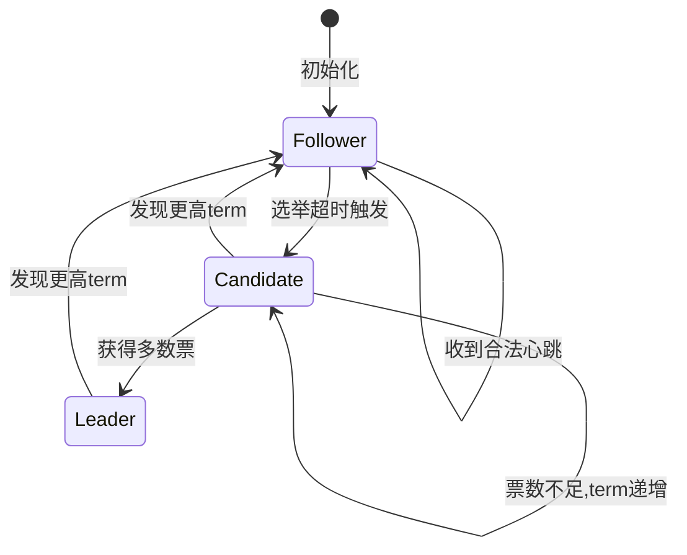

## 三Raft选举

Raft选举（Raft Leader Election）是Raft共识算法中最关键的子机制之一。在故障转移的完整链路中，它负责在Leader故障后，通过一套严格定义的规则在集群中选出新的Leader，确保系统在任何时刻最多只有一个Leader、且所有节点对Leader身份达成共识。本节聚焦**工程实现层面**：如何从零实现一个正确的Raft选举模块，如何在生产环境中调试和调优选举行为，以及如何处理各种边界条件和故障场景。

### 1. Raft选举在故障转移体系中的定位

在故障转移的完整链路中，Raft选举处于"故障确认"与"服务恢复"之间的关键衔接环节：

故障发生 → [故障检测(心跳)] → 故障确认 → [Raft选举] → 新Leader就位 → 日志追平 → 服务恢复
                                ↑                       ↑
                          心跳超时触发              本节聚焦此环节

与传统的Bully算法、ZAB协议相比，Raft选举的核心优势在于：

| 对比维度 | Bully算法 | ZAB协议 | Raft选举 |
|---------|----------|---------|---------|
| 选举依据 | 节点ID最大 | ZXID最新+epoch | 日志最新+term递增 |
| 防止脑裂 | 无机制 | epoch强制 | term+多数派投票 |
| 日志一致性保证 | 无 | 有 | 有（选举限制条件） |
| 成员变更 | 不支持 | 部分支持 | Joint Consensus / 单步变更 |
| 选票冲突处理 | 重试 | 随时重置 | 随机超时+立即重投 |
| 工业级成熟度 | 低 | 中（Hadoop生态） | 高（etcd, TiKV, CockroachDB） |

### 2. Raft选举的核心原理

#### 2.1 角色与状态机

Raft协议将节点划分为三种角色，每种角色的状态转换由选举机制驱动：



**三种角色的职责：**

- **Follower（跟随者）**：被动接收Leader的日志复制和心跳。如果选举超时内未收到心跳，转变为Candidate发起选举。
- **Candidate（候选者）**：主动发起选举，向所有其他节点发送RequestVote RPC。获得多数票后成为Leader。
- **Leader（领导者）**：处理客户端请求，向Follower复制日志。向所有Follower定期发送心跳以维持权威。

#### 2.2 核心数据结构

每个节点必须维护以下与选举相关的关键状态：

```python
class RaftNodeState:
    def __init__(self, node_id: str, peers: list[str]):
        # 节点身份标识
        self.node_id = node_id
        self.peers = peers
        
        # 持久化状态（选举前必须写入磁盘）
        self.current_term: int = 0          # 当前任期号
        self.voted_for: str | None = None   # 本任期投票给了谁
        self.log: list[LogEntry] = []       # 日志条目
        
        # 易失状态
        self.role: str = "follower"          # follower/candidate/leader
        self.commit_index: int = 0           # 已提交的日志索引
        self.last_applied: int = 0           # 已应用到状态机的索引
        
        # Leader专用
        self.next_index: dict[str, int] = {}
        self.match_index: dict[str, int] = {}
        
        # 选举相关
        self.election_timer: float = 0.0
        self.heartbeat_interval: float = 0.15  # 150ms 心跳间隔
```

**关键设计决策：持久化状态的范围**

Raft论文明确指出，`current_term`、`voted_for`、`log`这三项必须持久化到磁盘。其中`voted_for`的持久化尤其关键——如果节点在投票后崩溃重启，不持久化`voted_for`可能导致同一term内投出两票，破坏"每个term最多投一票"的安全保证。

#### 2.3 选举流程详解

完整的Raft选举流程可分为五个阶段：

┌─────────────────────────────────────────────────────┐
│                   Raft选举完整流程                    │
├─────────────────────────────────────────────────────┤
│                                                     │
│  1. 超时触发                                        │
│     Follower等待心跳超时 → 转为Candidate             │
│                                                     │
│  2. 发起选举                                        │
│     term += 1                                       │
│     voted_for = self                                │
│     发送 RequestVote RPC 给所有peer                  │
│                                                     │
│  3. 收集选票                                        │
│     等待其他节点的 RequestVoteResponse               │
│     每收到一票计数                                    │
│     若获得多数票 → 成为Leader                         │
│     若收到更高term → 回退为Follower                   │
│     若选举超时 → 递增term重新发起                     │
│                                                     │
│  4. 成为Leader                                       │
│     发送空心跳(AppendEntries)宣告权威                 │
│     初始化 next_index[] 和 match_index[]             │
│                                                     │
│  5. 维持Leader地位                                   │
│     定期发送心跳                                      │
│     持续追加日志并等待多数派确认                       │
│                                                     │
└─────────────────────────────────────────────────────┘

#### 2.4 投票安全性规则

节点在收到RequestVote RPC后，必须同时满足以下条件才能投票：

投票决策伪代码：

def handle_request_vote(candidate_id, candidate_term, candidate_log):
    # 规则1: 如果候选人的term小于自己，拒绝
    if candidate_term < self.current_term:
        return VoteResponse(granted=False, term=self.current_term)
    
    # 规则2: 如果候选人的term大于自己，更新term并转为Follower
    if candidate_term > self.current_term:
        self.become_follower(candidate_term)
    
    # 规则3: 检查是否已经投过票（每个term只能投一票）
    if self.voted_for is not None and self.voted_for != candidate_id:
        return VoteResponse(granted=False, term=self.current_term)
    
    # 规则4: 检查候选人的日志是否至少和自己一样新
    if not self.is_log_at_least_as_up_to_date(candidate_log):
        return VoteResponse(granted=False, term=self.current_term)
    
    # 满足所有条件，投票
    self.voted_for = candidate_id
    self.persist_state()
    return VoteResponse(granted=True, term=self.current_term)

**日志"至少一样新"的判断规则（选举限制条件）：**

```python
def is_log_at_least_as_up_to_date(self, candidate_log):
    """
    比较规则：
    1. 先比较最后一条日志的term，term更大的日志更新
    2. term相同则比较日志长度，更长的日志更新
    """
    my_last_term = self.log[-1].term if self.log else 0
    my_last_index = len(self.log)
    
    candidate_last_term = candidate_log[-1].term if candidate_log else 0
    candidate_last_index = len(candidate_log)
    
    if candidate_last_term != my_last_term:
        return candidate_last_term > my_last_term
    return candidate_last_index >= my_last_index
```

这个规则确保了被选上的Leader一定包含所有已提交的日志条目，是Raft安全性保证的核心。

### 3. 工程实现：完整的选举模块

#### 3.1 RequestVote RPC实现

```python
import asyncio
import time
import random
from dataclasses import dataclass, field

@dataclass
class VoteRequest:
    candidate_id: str
    candidate_term: int
    candidate_last_log_index: int
    candidate_last_log_term: int

@dataclass
class VoteResponse:
    term: int
    granted: bool

class ElectionManager:
    """
    Raft选举管理器
    负责选举超时检测、选票收集、Leader转换等核心逻辑
    """
    
    def __init__(self, node_id: str, peers: list[str], state: RaftNodeState):
        self.node_id = node_id
        self.peers = peers
        self.state = state
        
        # 选举参数
        self.election_timeout_min = 0.3   # 最小选举超时（秒）
        self.election_timeout_max = 0.5   # 最大选举超时（秒）
        self.heartbeat_interval = 0.1     # 心跳间隔（秒）
        
        # 选举状态
        self.votes_received: int = 0
        self.election_in_progress: bool = False
        self.election_timeout: float = self._random_timeout()
        
        # 网络层（实际使用中由传输层提供）
        self.rpc_transport = None
    
    def _random_timeout(self) -> float:
        """
        随机化选举超时时间
        避免多个Follower同时超时导致选票分裂
        """
        return random.uniform(self.election_timeout_min, self.election_timeout_max)
    
    async def start_election(self):
        """
        发起选举 —— Follower转变为Candidate并请求选票
        """
        self.state.current_term += 1
        self.state.role = "candidate"
        self.state.voted_for = self.node_id
        self.votes_received = 1  # 先投自己一票
        self.election_in_progress = True
        
        # 持久化状态
        await self._persist_state()
        
        print(f"[{self.node_id}] 发起选举 term={self.state.current_term}")
        
        last_log_index = len(self.state.log)
        last_log_term = self.state.log[-1].term if self.state.log else 0
        
        # 并行向所有peer发送RequestVote RPC
        vote_request = VoteRequest(
            candidate_id=self.node_id,
            candidate_term=self.state.current_term,
            candidate_last_log_index=last_log_index,
            candidate_last_log_term=last_log_term
        )
        
        tasks = [
            self._send_request_vote(peer, vote_request)
            for peer in self.peers
        ]
        responses = await asyncio.gather(*tasks, return_exceptions=True)
        
        # 处理响应
        for response in responses:
            if isinstance(response, Exception):
                continue
            if response is None:
                continue
            
            if response.granted:
                self.votes_received += 1
                majority = (len(self.peers) + 1) // 2 + 1
                
                if self.votes_received >= majority:
                    await self._become_leader()
                    return
            else:
                # 如果响应中的term更大，放弃选举
                if response.term > self.state.current_term:
                    self._step_down(response.term)
                    return
        
        self.election_in_progress = False
    
    async def _send_request_vote(self, peer: str, request: VoteRequest) -> VoteResponse | None:
        """
        向单个peer发送RequestVote RPC
        实际实现中包含超时和重试机制
        """
        try:
            # 实际实现中这里会调用网络传输层
            response = await asyncio.wait_for(
                self.rpc_transport.request_vote(peer, request),
                timeout=self.election_timeout_max
            )
            return response
        except asyncio.TimeoutError:
            print(f"[{self.node_id}] RequestVote超时 peer={peer}")
            return None
        except Exception as e:
            print(f"[{self.node_id}] RequestVote失败 peer={peer} error={e}")
            return None
    
    async def _become_leader(self):
        """选举成功，转换为Leader"""
        self.state.role = "leader"
        self.election_in_progress = False
        
        # 初始化Leader状态
        for peer in self.peers:
            self.state.next_index[peer] = len(self.state.log) + 1
            self.state.match_index[peer] = 0
        
        print(f"[{self.node_id}] 成为Leader term={self.state.current_term}")
        
        # 立即发送空心跳宣告权威
        await self._send_heartbeats()
    
    def _step_down(self, new_term: int):
        """
        当发现更高term时，放弃选举降级为Follower
        这是Raft安全性保证的关键
        """
        self.state.current_term = new_term
        self.state.role = "follower"
        self.state.voted_for = None
        self.votes_received = 0
        self.election_in_progress = False
        self.election_timeout = self._random_timeout()
        
        print(f"[{self.node_id}] 降级为Follower term={new_term}")
    
    async def handle_vote_request(self, request: VoteRequest) -> VoteResponse:
        """
        处理来自候选者的投票请求
        严格遵循Raft的投票安全性规则
        """
        # 规则1: 如果候选人的term小于自己，拒绝
        if request.candidate_term < self.state.current_term:
            return VoteResponse(term=self.state.current_term, granted=False)
        
        # 规则2: 如果候选人的term更大，更新自己的term
        if request.candidate_term > self.state.current_term:
            self._step_down(request.candidate_term)
        
        # 规则3: 本term是否已经投票
        if self.state.voted_for is not None and self.state.voted_for != request.candidate_id:
            return VoteResponse(term=self.state.current_term, granted=False)
        
        # 规则4: 日志至少一样新
        my_last_term = self.state.log[-1].term if self.state.log else 0
        my_last_index = len(self.state.log)
        
        log_ok = (
            request.candidate_last_log_term > my_last_term or
            (request.candidate_last_log_term == my_last_term and
             request.candidate_last_log_index >= my_last_index)
        )
        
        if not log_ok:
            return VoteResponse(term=self.state.current_term, granted=False)
        
        # 通过所有检查，投票
        self.state.voted_for = request.candidate_id
        self.election_timeout = self._random_timeout()  # 重置选举超时
        await self._persist_state()
        
        return VoteResponse(term=self.state.current_term, granted=True)
```

#### 3.2 选举超时循环

选举超时检测是触发选举的核心驱动循环。正确实现这个循环需要特别注意**超时时间的随机化**：

```python
class ElectionTimer:
    """
    选举超时定时器
    核心要求：每次超时时间必须随机化，以避免选票分裂
    """
    
    def __init__(self, election_manager: ElectionManager):
        self.manager = election_manager
        self._timer_task: asyncio.Task | None = None
        self._running = False
    
    async def start(self):
        """启动选举超时循环"""
        self._running = True
        while self._running:
            # 设置随机超时
            timeout = self.manager._random_timeout()
            
            try:
                await asyncio.sleep(timeout)
                
                # 超时触发，发起选举
                if self.manager.state.role == "follower":
                    if not self.manager.election_in_progress:
                        await self.manager.start_election()
            except asyncio.CancelledError:
                break
    
    def stop(self):
        """停止超时循环"""
        self._running = False
        if self._timer_task:
            self._timer_task.cancel()
```

**为什么必须随机化超时时间？**

假设5个节点的选举超时都是固定的1秒，那么在Leader故障后，所有节点会在同一时刻同时超时、同时发起选举，导致选票均匀分裂，无人获得多数票。通过将超时随机分布在[150ms, 300ms]区间内，可以以高概率保证只有一个节点最先超时，从而一次性完成选举。

根据Raft论文的分析，在T/2（T为广播时间）远小于选举超时的条件下，随机化的选举超时可以在O(1)轮选举内选出Leader。

#### 3.3 心跳发送与Leader权威维持

Leader选举完成后，Leader必须定期发送心跳来维持权威：

```python
async def _send_heartbeats(self):
    """
    Leader向所有Follower发送心跳
    心跳是空的AppendEntries RPC（不包含日志条目）
    """
    while self.state.role == "leader":
        tasks = []
        for peer in self.peers:
            last_log_index = len(self.state.log)
            next_idx = self.state.next_index.get(peer, last_log_index + 1)
            
            entries = []
            if next_idx <= last_log_index:
                entries = self.state.log[next_idx - 1:]
            
            heartbeat = AppendEntriesRequest(
                term=self.state.current_term,
                leader_id=self.node_id,
                prev_log_index=next_idx - 1,
                prev_log_term=self.state.log[next_idx - 2].term if next_idx > 1 else 0,
                entries=entries,
                leader_commit=self.state.commit_index
            )
            tasks.append(self._send_append_entries(peer, heartbeat))
        
        await asyncio.gather(*tasks, return_exceptions=True)
        await asyncio.sleep(self.heartbeat_interval)
```

### 4. 选举时间参数调优

选举时间参数的选择直接影响系统的故障恢复速度和稳定性：

#### 4.1 三个关键时间参数

┌─────────────────────────────────────────────────────────────┐
│              Raft时间参数关系图                               │
│                                                             │
│  broadcastTime << electionTimeout << MTBF                   │
│  (广播时间)     (选举超时)         (平均故障间隔)             │
│                                                             │
│  典型生产配置：                                               │
│  broadcastTime  = 0.5~10ms    (同机房网络RTT)                │
│  electionTimeout = 300~500ms  (broadcastTime的10倍以上)       │
│  MTBF           = 数周~数月                                  │
│                                                             │
└─────────────────────────────────────────────────────────────┘

| 参数 | 含义 | 推荐值 | 太小的后果 | 太大的后果 |
|------|------|--------|-----------|-----------|
| broadcastTime | 一次RPC的往返时间 | 0.5~10ms | — | 需要同步增大electionTimeout |
| electionTimeout | Follower等待心跳的超时时间 | 150~500ms | 频繁触发无谓选举，性能下降 | Leader故障后恢复延迟长 |
| heartbeatInterval | Leader发送心跳的间隔 | electionTimeout/10 | — | 无法及时维持Follower的选举超时重置 |

#### 4.2 etcd生产环境推荐配置

```yaml
# etcd选举参数配置（etcd.conf.yml）
# etcd 默认使用 1000ms 选举超时，适用于大多数生产场景

# 单机房部署
heartbeat-interval: 100    # 100ms，适用于同机房（RTT < 50ms）
election-timeout: 1000     # 1000ms，heartbeat的10倍

# 跨机房部署
heartbeat-interval: 500    # 500ms，适应跨机房延迟
election-timeout: 5000     # 5000ms，避免跨机房网络抖动触发误选

# 关键约束
# election-timeout 必须 >= 10 * heartbeat-interval
# election-timeout 必须 >= 10 * broadcast-time
```

#### 4.3 动态调优策略

```python
class AdaptiveElectionTimeout:
    """
    自适应选举超时
    根据网络状况动态调整超时参数
    """
    
    def __init__(self):
        self.min_timeout = 300    # 最小超时(ms)
        self.max_timeout = 2000   # 最大超时(ms)
        self.current_timeout = 1000  # 当前超时(ms)
        
        # 网络状况统计
        self.recent_rpcs: list[float] = []
        self.window_size = 100
        self.consecutive_failures = 0
    
    def record_rpc_outcome(self, latency_ms: float, success: bool):
        """记录RPC结果"""
        self.recent_rpcs.append(latency_ms)
        if len(self.recent_rpcs) > self.window_size:
            self.recent_rpcs.pop(0)
        
        if not success:
            self.consecutive_failures += 1
        else:
            self.consecutive_failures = 0
    
    def get_timeout(self) -> float:
        """
        动态计算超时时间
        策略：基于P99延迟 + 网络失败惩罚
        """
        if not self.recent_rpcs:
            return self.current_timeout
        
        sorted_latencies = sorted(self.recent_rpcs)
        p99_index = int(len(sorted_latencies) * 0.99)
        p99_latency = sorted_latencies[p99_index]
        
        # 基础超时 = P99延迟的10倍 + 安全余量
        base_timeout = p99_latency * 10 + 50
        
        # 连续失败惩罚：每次失败增加50%超时
        failure_penalty = base_timeout * (1.5 ** self.consecutive_failures)
        
        self.current_timeout = max(
            self.min_timeout,
            min(self.max_timeout, failure_penalty)
        )
        
        return self.current_timeout / 1000.0  # 返回秒
```

### 5. 选举中的常见陷阱与解决方案

#### 5.1 陷阱一：持久化缺失导致重复投票

**问题**：节点投票后未持久化voted_for就崩溃，重启后在同一term投了两票。

```python
# 错误实现（缺失持久化）
async def handle_vote_request_bad(self, request):
    if request.candidate_term == self.current_term:
        if self.voted_for is None or self.voted_for == request.candidate_id:
            self.voted_for = request.candidate_id
            # 这里没有持久化就返回了
            return VoteResponse(term=self.current_term, granted=True)

# 正确实现
async def handle_vote_request_good(self, request):
    if request.candidate_term == self.current_term:
        if self.voted_for is None or self.voted_for == request.candidate_id:
            self.voted_for = request.candidate_id
            await self._persist_state()  # 先持久化，再响应
            return VoteResponse(term=self.current_term, granted=True)
```

**根本原因**：Raft的安全性依赖"每个term每节点最多投一票"。不持久化voted_for意味着节点在崩溃重启后不知道自己已经投过票，可能违反这个约束。

**解决方案**：采用Write-Ahead Logging（WAL）在响应任何RPC之前先将状态写入磁盘。etcd使用BoltDB实现这一点，TiKV使用Raft Engine。

#### 5.2 陷阱二：网络分区导致脑裂

**问题**：网络分区使集群分为两个独立部分，双方各自选出Leader。

正常状态：  [A]--[B]--[C]--[D]--[E]
                  ↑ Leader

分区后：  [A]--[B]     [C]--[D]--[E]
           ↑ 新Leader     ↑ 原Leader(实际已失效)

**Raft的天然防护**：

Raft通过**多数派投票**机制天然防止脑裂。在5节点集群中，任何分区只能在包含多数节点（>=3个）的那一侧选出新Leader。另一侧的Candidate永远无法获得足够选票，只能不断重试但永远失败。

```python
def majority_count(self) -> int:
    """计算多数派所需票数"""
    total = len(self.peers) + 1  # 包括自己
    return total // 2 + 1

# 5节点集群: 需要3票
# 3节点集群: 需要2票
# 7节点集群: 需要4票
```

**需要特别注意的场景**：分区恢复后，原Leader可能仍认为自己是Leader（它没有收到更高的term）。此时当它尝试提交新日志时，会发现无法获得多数派确认（因为新的Leader已经当选并推进了term），最终原Leader会收到包含更高term的响应而自动降级。

#### 5.3 陷阱三：Pre-Vote机制避免无效选举风暴

**问题**：一个网络暂时不稳定的Follower频繁超时发起选举，每次选举都会导致集群短暂不可用。

**Pre-Vote解决方案**：

Pre-Vote是Raft的扩展机制。节点在真正发起选举之前，先进行一轮"预投票"。只有当大多数节点都支持它成为候选者时，它才真正发起选举。

```python
class PreVoteManager:
    """
    Pre-Vote机制
    防止网络不稳定的节点频繁发起无效选举
    """
    
    def __init__(self, state: RaftNodeState):
        self.state = state
        self.pre_vote_term: int = 0
    
    async def start_pre_vote(self):
        """
        Pre-Vote流程：
        1. 不递增current_term
        2. 发送PreVote请求（携带当前term+1作为预期term）
        3. 如果获得多数支持，才真正发起选举
        """
        self.pre_vote_term = self.state.current_term + 1
        
        last_log_index = len(self.state.log)
        last_log_term = self.state.log[-1].term if self.state.log else 0
        
        pre_vote_request = VoteRequest(
            candidate_id=self.state.node_id,
            candidate_term=self.pre_vote_term,  # 注意：不是current_term+1
            candidate_last_log_index=last_log_index,
            candidate_last_log_term=last_log_term
        )
        
        support_count = 1  # 自己支持自己
        majority = (len(self.state.peers) + 1) // 2 + 1
        
        for peer in self.state.peers:
            response = await self._send_pre_vote(peer, pre_vote_request)
            if response and response.granted:
                support_count += 1
        
        if support_count >= majority:
            # 获得多数支持，真正发起选举
            await self._start_real_election()
        else:
            # 未获得多数支持，保持Follower，不递增term
            print(f"[{self.state.node_id}] Pre-Vote失败，保持Follower")
```

**Pre-Vote的核心优势**：不稳定的节点不会导致集群term递增。即使它持续超时，只要它无法通过Pre-Vote，就不会对集群造成任何影响。

#### 5.4 陷阱四：选举超时与GC暂停的竞争

**问题**：在Go/Java等带有垃圾回收的语言中，GC暂停可能导致选举定时器出现意外的长延迟，引发误选。

```python
class GCResistantElectionTimer:
    """
    抗GC暂停的选举定时器
    使用系统时钟而非sleep来检测超时
    """
    
    def __init__(self, timeout_seconds: float):
        self.timeout = timeout_seconds
        self.last_heartbeat: float = time.monotonic()
    
    def reset(self):
        """重置心跳时间戳"""
        self.last_heartbeat = time.monotonic()
    
    def is_expired(self) -> bool:
        """
        检查是否超时
        关键：使用time.monotonic()而非asyncio.sleep()
        monotonic时钟不受系统时间调整影响，
        且可以检测到GC暂停导致的长时间间隔
        """
        elapsed = time.monotonic() - self.last_heartbeat
        return elapsed > self.timeout
    
    async def wait_with_gc_awareness(self):
        """
        等待超时，同时检测GC暂停
        如果单次等待时间超过预期，说明可能发生了GC暂停
        """
        while True:
            start = time.monotonic()
            await asyncio.sleep(0.01)  # 短间隔轮询
            
            elapsed = time.monotonic() - start
            if elapsed > 0.1:  # 单次sleep超过100ms，可能有GC暂停
                print(f"检测到可能的GC暂停: {elapsed:.3f}s")
            
            if self.is_expired():
                return
```

### 6. 完整的选举模块集成示例

以下是一个可运行的完整示例，展示了5节点Raft集群的选举行为：

```python
import asyncio
import random
import time
from dataclasses import dataclass, field

@dataclass
class LogEntry:
    term: int
    index: int
    command: str

class SimpleRaftNode:
    """简化版Raft节点，聚焦选举逻辑"""
    
    def __init__(self, node_id: str, peers: list['SimpleRaftNode']):
        self.node_id = node_id
        self.peers = peers
        
        # 持久化状态
        self.current_term = 0
        self.voted_for = None
        self.log: list[LogEntry] = []
        
        # 易失状态
        self.role = "follower"
        self.commit_index = 0
        
        # 选举状态
        self.votes_received = 0
        self.election_timeout = self._random_timeout()
        self.last_heartbeat = time.monotonic()
        
        # 回调（模拟网络通信）
        self.event_log: list[str] = []
    
    def _random_timeout(self) -> float:
        return random.uniform(0.15, 0.30)
    
    def _now(self) -> str:
        return f"[{self.node_id}|T{self.current_term}]"
    
    def handle_request_vote(self, candidate_id: str, candidate_term: int,
                            candidate_last_index: int, candidate_last_term: int):
        """处理投票请求"""
        self.event_log.append(f"{self._now()} 收到RequestVote from={candidate_id} term={candidate_term}")
        
        if candidate_term < self.current_term:
            return False
        
        if candidate_term > self.current_term:
            self.current_term = candidate_term
            self.voted_for = None
            self.role = "follower"
        
        if self.voted_for is not None and self.voted_for != candidate_id:
            return False
        
        # 日志新旧比较
        my_last_term = self.log[-1].term if self.log else 0
        my_last_index = len(self.log)
        
        log_ok = (candidate_last_term > my_last_term or
                  (candidate_last_term == my_last_term and
                   candidate_last_index >= my_last_index))
        
        if not log_ok:
            return False
        
        self.voted_for = candidate_id
        self.last_heartbeat = time.monotonic()
        self.event_log.append(f"{self._now()} 投票给{candidate_id}")
        return True
    
    def handle_heartbeat(self, leader_term: int, leader_id: str):
        """处理心跳"""
        if leader_term >= self.current_term:
            self.current_term = leader_term
            self.voted_for = None
            self.role = "follower"
            self.last_heartbeat = time.monotonic()
            self.event_log.append(f"{self._now()} 收到心跳 from={leader_id}")
    
    def start_election(self):
        """发起选举"""
        self.current_term += 1
        self.role = "candidate"
        self.voted_for = self.node_id
        self.votes_received = 1
        
        self.event_log.append(f"{self._now()} 发起选举，voted_for=self")
        
        last_log_index = len(self.log)
        last_log_term = self.log[-1].term if self.log else 0
        
        votes = 1  # 自己一票
        for peer in self.peers:
            granted = peer.handle_request_vote(
                self.node_id, self.current_term,
                last_log_index, last_log_term
            )
            if granted:
                votes += 1
                self.event_log.append(f"{self._now()} 获得{peer.node_id}的投票 ({votes}/{len(self.peers)+1})")
        
        majority = (len(self.peers) + 1) // 2 + 1
        if votes >= majority:
            self.role = "leader"
            self.event_log.append(f"{self._now()} *** 成为Leader ***")
            return True
        
        self.event_log.append(f"{self._now()} 选举失败，票数{votes}/{majority}")
        return False
    
    def check_election_timeout(self) -> bool:
        """检查是否需要发起选举"""
        elapsed = time.monotonic() - self.last_heartbeat
        return elapsed > self.election_timeout and self.role != "leader"


async def simulate_election():
    """模拟5节点集群的选举过程"""
    print("=" * 60)
    print("  Raft选举模拟 - 5节点集群")
    print("=" * 60)
    
    # 创建5个节点（互连）
    nodes = {f"node{i}": None for i in range(5)}
    node_list = []
    
    for node_id in nodes:
        node = SimpleRaftNode(node_id, [])
        node_list.append(node)
    
    # 设置互连
    for node in node_list:
        node.peers = [n for n in node_list if n.node_id != node.node_id]
    
    # 模拟场景1：正常选举
    print("\n--- 场景1：Leader故障后正常选举 ---")
    # 假设node0原来是Leader
    node_list[0].role = "leader"
    node_list[0].current_term = 1
    for n in node_list:
        n.current_term = 1
        n.last_heartbeat = time.monotonic()
    
    # 模拟node0故障
    node_list[0].role = "dead"
    print(f"node0 故障！角色=dead")
    
    # 模拟node1超时发起选举
    node_list[1].last_heartbeat = time.monotonic() - 1.0  # 模拟超时
    success = node_list[1].start_election()
    print(f"node1 选举结果: {'成功' if success else '失败'}")
    
    # 输出事件日志
    for n in node_list:
        if n.event_log:
            for event in n.event_log:
                print(f"  {event}")
    
    # 模拟场景2：两个节点同时超时
    print("\n--- 场景2：选票分裂与随机化超时 ---")
    # 重置
    for n in node_list:
        n.event_log = []
        n.role = "follower"
        n.voted_for = None
        n.current_term = 2
        n.votes_received = 0
        n.last_heartbeat = time.monotonic()
    
    # 多次模拟，展示随机化效果
    win_counts = {}
    for trial in range(100):
        # 重置投票状态
        for n in node_list[1:]:
            n.voted_for = None
            n.current_term = 2
            n.role = "follower"
        
        # node1总是先超时
        node_list[1].current_term = 3
        node_list[1].votes_received = 1
        node_list[1].voted_for = "node1"
        success = node_list[1].start_election()
        winner = "node1" if success else "no winner"
        win_counts[winner] = win_counts.get(winner, 0) + 1
    
    print("100次选举模拟结果:")
    for winner, count in sorted(win_counts.items()):
        print(f"  {winner}: {count}次 ({count}%)")
    
    print("\n" + "=" * 60)
    print("  模拟完成")
    print("=" * 60)

# 运行模拟
# asyncio.run(simulate_election())
```

### 7. 生产环境中的选举监控

#### 7.1 关键监控指标

| 指标名称 | 含义 | 正常范围 | 告警阈值 |
|---------|------|---------|---------|
| `raft_leader_elections_total` | 选举次数 | 0（稳定时） | > 1次/分钟 |
| `raft_leader_changes_total` | Leader切换次数 | 0 | > 1次/小时 |
| `raft_current_term` | 当前term | 稳定 | 持续递增 |
| `raft_election_timeout_ms` | 选举超时配置 | 150-1000ms | — |
| `raft_node_state` | 节点角色 | 多数follower，1个leader | 无leader |
| `raft_network_latency_p99` | RPC延迟P99 | < 50ms | > 100ms |

#### 7.2 Prometheus监控配置

```yaml
# prometheus.yml - Raft选举监控告警规则
groups:
  - name: raft_election_alerts
    rules:
      # 频繁选举告警
      - alert: RaftFrequentElections
        expr: rate(raft_leader_elections_total[5m]) > 0.1
        for: 2m
        labels:
          severity: warning
        annotations:
          summary: "Raft集群频繁发生选举"
          description: "过去5分钟平均每分钟选举超过6次，可能存在网络不稳定"
      
      # 无Leader告警
      - alert: RaftNoLeader
        expr: raft_node_state{role="leader"} == 0
        for: 30s
        labels:
          severity: critical
        annotations:
          summary: "Raft集群无Leader"
          description: "集群超过30秒没有Leader，服务可能不可用"
      
      # Term异常增长告警
      - alert: RaftTermClimbing
        expr: increase(raft_current_term[10m]) > 5
        for: 5m
        labels:
          severity: warning
        annotations:
          summary: "Raft term持续增长"
          description: "10分钟内term增长超过5，可能存在网络分区或节点不稳定"
```

#### 7.3 Grafana Dashboard关键面板

```python
# Grafana Dashboard JSON关键面板配置
dashboard_panels = [
    {
        "title": "Raft Leader存活状态",
        "type": "stat",
        "targets": [{"expr": "count(raft_node_state{role='leader'})"}],
        "thresholds": [
            {"value": 0, "color": "red", "op": "lt"},   # 无Leader → 红色
            {"value": 1, "color": "green", "op": "eq"},   # 1个Leader → 绿色
            {"value": 2, "color": "red", "op": "gt"}      # 多个Leader → 脑裂！红色
        ]
    },
    {
        "title": "选举频率",
        "type": "timeseries",
        "targets": [{"expr": "rate(raft_leader_elections_total[1m])"}],
        "yAxis": {"unit": "ops"}
    },
    {
        "title": "当前Term趋势",
        "type": "timeseries",
        "targets": [{"expr": "raft_current_term"}],
    },
    {
        "title": "节点角色分布",
        "type": "piechart",
        "targets": [{"expr": "count by (role) (raft_node_state)"}]
    }
]
```

### 8. 高级话题：选举与日志一致性的交互

#### 8.1 选举限制条件的深层含义

Raft的选举限制条件（Election Restriction）确保了：**被选出的Leader一定包含所有已提交的日志条目**。

这意味着：即使一个Candidate的term更高，如果它的日志比Follower更旧，Follower有权拒绝投票。这个设计的代价是：在某些场景下，选举可能需要多轮才能完成（旧日志的Candidate需要等日志更新的节点发起选举）。

场景：日志不一致导致的选举延迟

初始状态:
  Node A: log=[(T1,cmd1),(T2,cmd2)]  term=3  ← 日志最完整
  Node B: log=[(T1,cmd1)]             term=3
  Node C: log=[(T1,cmd1)]             term=3  ← 先超时

轮1: C发起选举(term=4)
  → C向A发送RequestVote
  → A检查日志: C的日志比自己旧, 拒绝投票
  → C获得2票(B和C), 不足多数(需要3票), 选举失败

轮2: A发起选举(term=5)
  → A向B,C发送RequestVote
  → B检查: A的日志至少和自己一样新, 投票
  → C检查: A的日志至少和自己一样新, 投票
  → A获得3票, 成为Leader

#### 8.2 Leader补全日志后的安全性

```python
async def _backfill_follower_logs(self):
    """
    Leader成为Leader后，补全所有Follower落后的日志
    这是日志复制机制的一部分，与选举直接相关
    """
    for peer in self.peers:
        while True:
            next_idx = self.state.next_index[peer]
            prev_idx = next_idx - 1
            prev_term = self.state.log[prev_idx - 1].term if prev_idx > 0 else 0
            
            entries = self.state.log[prev_idx:]
            success = await self._send_append_entries(
                peer, self.state.current_term, self.node_id,
                prev_idx, prev_term, entries, self.state.commit_index
            )
            
            if success:
                self.state.next_index[peer] = len(self.state.log) + 1
                self.state.match_index[peer] = len(self.state.log)
                break
            else:
                # 回退一步重试
                self.state.next_index[peer] = max(1, next_idx - 1)
```

### 9. 实战案例：etcd中的Raft选举

etcd是Raft协议最成功的工业级实现之一。以下是etcd选举的关键设计：

#### 9.1 etcd的选举优化

| 优化点 | 实现方式 | 效果 |
|-------|---------|------|
| 磁盘批量写入 | 状态变更先写WAL，定期批量fsync | 减少磁盘IO |
| Leader租约 | Leader通过Lease续约，超时自动失效 | 加速故障检测 |
| Pre-Vote | 可选启用，避免网络不稳定节点干扰 | 减少无效选举 |
| 发送管道 | Leader日志复制使用pipeline模式 | 降低延迟 |

#### 9.2 etcd选举参数调优实例

```bash
# etcd集群启动参数配置

# 同机房（RTT < 5ms）
ETCD_HEARTBEAT_INTERVAL=100      # 100ms心跳
ETCD_ELECTION_TIMEOUT=1000       # 1000ms选举超时

# 跨可用区（RTT 10~50ms）
ETCD_HEARTBEAT_INTERVAL=300      # 300ms心跳
ETCD_ELECTION_TIMEOUT=3000       # 3000ms选举超时

# 跨地域（RTT 50~200ms）
ETCD_HEARTBEAT_INTERVAL=500      # 500ms心跳
ETCD_ELECTION_TIMEOUT=5000       # 5000ms选举超时
```

#### 9.3 故障模拟与验证

```bash
# 使用 chaos-mesh 模拟Leader故障
# 观察选举行为

# 1. 查看当前Leader
etcdctl endpoint status --write-out=table

# 2. 模拟Leader网络延迟
sudo tc qdisc add dev eth0 root netem delay 200ms 50ms

# 3. 观察选举发生
# 在另一个终端监控
etcdctl watch --prefix /0  # 观察leadership变更事件

# 4. 恢复网络
sudo tc qdisc del dev eth0 root

# 5. 验证集群恢复
etcdctl endpoint health --write-out=table
```

### 10. 常见误区总结

| 误区 | 正确做法 |
|------|---------|
| 选举超时设置固定值 | 必须随机化，范围在[300ms, 500ms] |
| 忽略持久化voted_for | 投票前必须先持久化到磁盘 |
| 认为多数派就是半数以上 | 多数派是 N/2 + 1，不是 N/2 |
| 选举成功后直接服务 | 需先发送心跳宣告权威 |
| 认为Raft能防止所有脑裂 | Raft只能在多数派存活时防止脑裂，少数分区无法选出Leader |
| 任意调整心跳间隔 | heartbeat必须远小于election timeout |
| 选举超时只看延迟 | 还需考虑GC暂停、磁盘IO等待 |

### 11. 本节小结

Raft选举是分布式共识系统中最精妙的机制之一。核心要点：

1. **随机化超时**是避免选票分裂的关键手段，选举超时必须在合理区间内随机分布
2. **持久化voted_for和current_term**是安全性的基石，任何投票或term变更都必须先落盘
3. **选举限制条件**（日志至少一样新）保证被选出的Leader包含所有已提交日志
4. **Pre-Vote机制**是生产环境的必备优化，有效防止不稳定节点引发选举风暴
5. **多数派投票**机制天然防止脑裂，但依赖于多数节点的网络可达性
6. **监控是第一道防线**：选举频率、term变化、Leader存活是必须监控的三大指标
7. **时间参数调优**需要根据网络条件（同机房/跨机房/跨地域）灵活配置，核心约束是 `broadcastTime << electionTimeout << MTBF`

掌握这些要点后，你可以在etcd、TiKV、CockroachDB等生产系统中准确诊断和调优Raft选举行为。
