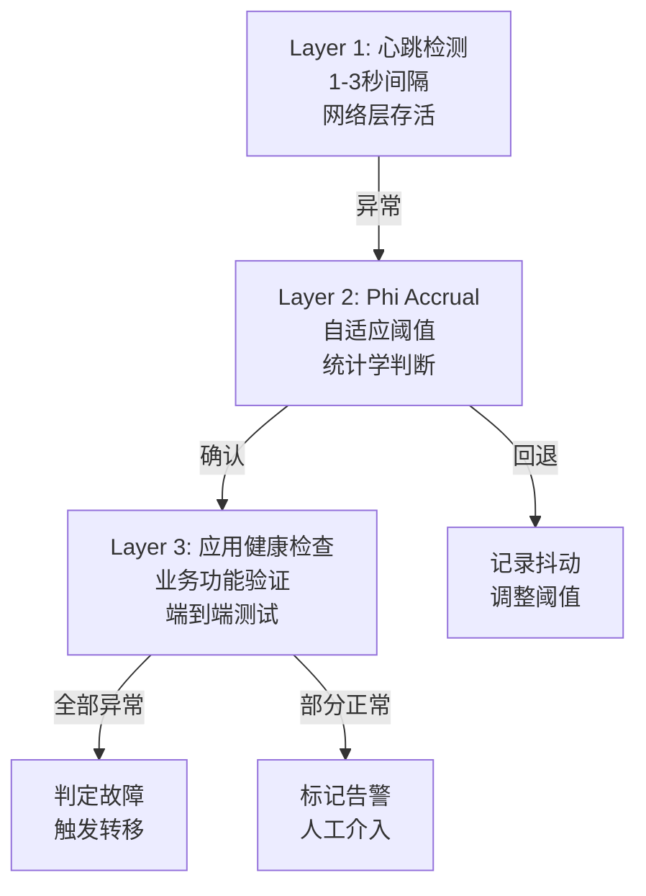
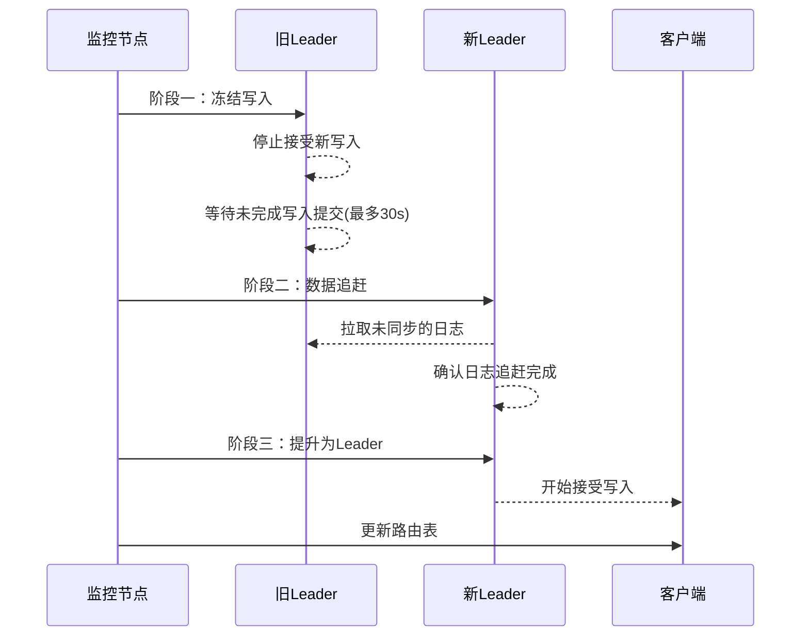
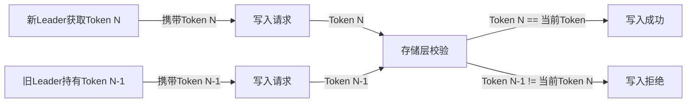
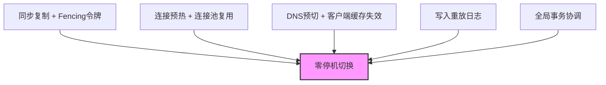

# 核心技巧：故障转移与恢复的实战要点

故障检测的理论算法和Leader选举的协议规范固然重要，但从理论到生产落地之间存在巨大的鸿沟。本节系统讲解故障转移与恢复在实际工程中的核心实施技巧——如何调优检测参数、如何实现优雅切换、如何保障备份可恢复、如何防控级联故障、如何让灾备从纸面变成现实。

---

## 一、故障检测的调优技巧

### 1.1 心跳间隔与超时的动态平衡

故障检测的核心矛盾在于：检测太快会误报（False Positive），检测太慢会延迟恢复（High Detection Latency）。在生产环境中，这个矛盾尤为突出——网络抖动、GC暂停、磁盘IO尖峰都可能导致正常的节点暂时无法响应心跳。

误报的代价远比表面看起来更大：一次误触发的故障转移会导致写入中断、数据同步开销、客户端重连风暴，甚至引发脑裂。而漏报则意味着故障节点继续承接流量，用户体验持续恶化。因此，超时参数的调优本质上是在两种代价之间寻找最优平衡点。

**经验公式：**

超时时间 = 心跳间隔 × 3 + P99网络抖动 + 安全余量(1-2秒)

为什么是3倍？因为心跳丢失可能由多种原因导致：一次是网络抖动，两次是偶然重叠，三次连续丢失才具备统计显著性。这个系数来源于网络可靠性工程中的经典经验，与TCP重传策略的设计哲学一致。

| 场景 | 心跳间隔 | 超时时间 | 说明 |
|------|---------|---------|------|
| 同机房低延迟 | 1秒 | 5-6秒 | 网络抖动极小，可激进 |
| 跨可用区 | 1-2秒 | 8-12秒 | 考虑AZ间延迟波动 |
| 跨地域 | 2-3秒 | 15-25秒 | 广域网延迟不可预测 |
| 云环境(GC/热迁移) | 1-2秒 | 10-15秒 | 需容忍VM热迁移暂停 |

**自适应超时调整器：**

```python
class AdaptiveTimeout:
    """根据历史网络质量动态调整超时阈值"""
    
    def __init__(self, base_interval=1.0, base_timeout=5.0):
        self.base_interval = base_interval
        self.base_timeout = base_timeout
        self.jitter_history = []
        self.max_history = 200
    
    def record_jitter(self, jitter_ms):
        """记录一次网络抖动值(毫秒)"""
        self.jitter_history.append(jitter_ms)
        if len(self.jitter_history) > self.max_history:
            self.jitter_history.pop(0)
    
    def get_timeout(self):
        """计算当前建议的超时时间"""
        if len(self.jitter_history) < 10:
            return self.base_timeout
        
        sorted_jitter = sorted(self.jitter_history)
        # 使用P99分位作为网络抖动基准
        p99_idx = int(len(sorted_jitter) * 0.99)
        p99_jitter_s = sorted_jitter[min(p99_idx, len(sorted_jitter) - 1)] / 1000.0
        
        # 超时 = 3倍心跳间隔 + P99抖动 + 安全余量
        return self.base_interval * 3 + p99_jitter_s + 1.0
    
    def get_sensitivity_level(self):
        """返回当前网络质量对应的灵敏度等级"""
        if not self.jitter_history:
            return "medium"
        avg_jitter = sum(self.jitter_history[-50:]) / min(50, len(self.jitter_history))
        if avg_jitter < 5:
            return "high"    # 网络稳定，可以激进检测
        elif avg_jitter < 20:
            return "medium"  # 正常网络
        else:
            return "low"     # 网络波动大，保守检测
```

**关键指标监控：** 在调整超时参数的同时，必须同步监控以下指标来验证效果：

- **误报率（False Positive Rate）**：被误判为故障的正常节点比例，目标 < 0.1%
- **漏报率（False Negative Rate）**：未能及时发现的故障节点比例，目标 < 0.01%
- **检测延迟（Detection Latency）**：从节点实际故障到系统检测到的时间差，通常要求 < 2×超时时间
- **故障转移次数/月**：异常切换频率，过高说明检测过于敏感

这四个指标构成一个动态反馈闭环：如果误报率上升，说明超时太短或网络恶化需要放宽；如果检测延迟过大，说明超时太保守需要收紧。生产环境中建议在监控看板上同时展示这四个指标，形成一个"检测健康度仪表盘"。

### 1.2 多层检测的组合策略

单一检测机制永远无法覆盖所有故障场景。心跳检测能发现网络不可达，但无法发现进程假死（Deadlock）；应用健康检查能发现逻辑错误，但无法发现操作系统级别的OOM Kill。生产环境应采用多层检测组合，逐层确认，最终决策。



**三层检测的具体实现：**

| 层级 | 检测内容 | 检测方式 | 误报代价 | 典型延迟 |
|------|---------|---------|---------|---------|
| L1: 网络层 | TCP连通性 | TCP Ping / ICMP | 低（重试即可） | 1-3秒 |
| L2: 进程层 | 进程存活+响应时间 | Phi Accrual + 超时检测 | 中（可能触发切换） | 5-10秒 |
| L3: 业务层 | 功能是否正常 | HTTP健康端点+端到端验证 | 高（确认后触发切换） | 3-10秒 |

**组合判定规则：**

最终判定 = L1连续3次失败 AND L2 phi值 > 8.0 AND L3健康检查超时

只有当三层检测同时确认时才触发故障转移，这将误报率降低到极低水平。但代价是检测延迟增加，适用于对准确性要求高于速度的场景。

在实际部署中，三层检测通常分布在不同的物理节点上执行——L1由集群中其他节点执行，L2由监控系统执行，L3由专门的健康检查探针执行。这种分布式的检测部署避免了"检测器本身故障"导致的盲区。

### 1.3 检测盲区的识别与覆盖

即使采用多层检测，仍存在检测盲区需要特别关注：

**脑裂期间的检测失效：** 当网络分区将集群分成两半时，两个分区中的检测器可能各自认为对方故障。此时，每个分区可能各自选出一个Leader，两个"合法"的Leader同时接受写入，导致数据不一致——这就是经典的脑裂（Split-Brain）问题。

应对脑裂的核心是仲裁机制（Quorum）——只有获得多数节点确认的分区才能继续工作。具体实现有三种路径：

| 路径 | 原理 | 适用场景 | 代价 |
|------|------|---------|------|
| 多数派仲裁(Quorum) | 获得N/2+1节点投票才可写入 | 3节点及以上集群 | 可用性降低（分区后少数派不可用） |
| 外部仲裁(Witness) | 引入第三方仲裁节点 | 不想增加集群节点数 | 额外依赖一个轻量节点 |
| STONITH/Fencing | 强制隔离可疑节点 | 存储层可用 | 需要硬件/IPMI支持 |

**灰度故障的检测困难：** 节点没有完全宕机，但性能严重退化（如CPU 100%、响应延迟从10ms飙升到5秒）。传统心跳检测会判定为"存活"，但业务已无法正常服务。解决方案是增加响应时间检测——如果心跳响应超过P99延迟的3倍，则标记为"Suspected"。

```python
class GrayFailureDetector:
    """灰度故障检测：识别性能退化但未完全宕机的节点"""
    
    def __init__(self, latency_threshold_ms=500, error_rate_threshold=0.3):
        self.latency_threshold_ms = latency_threshold_ms
        self.error_rate_threshold = error_rate_threshold
        self.response_times = {}   # node_id -> deque of response times
        self.error_counts = {}     # node_id -> (errors, total)
    
    def record_response(self, node_id, latency_ms, success):
        """记录一次心跳响应的结果"""
        if node_id not in self.response_times:
            from collections import deque
            self.response_times[node_id] = deque(maxlen=100)
            self.error_counts[node_id] = [0, 0]
        
        self.response_times[node_id].append(latency_ms)
        self.error_counts[node_id][1] += 1
        if not success:
            self.error_counts[node_id][0] += 1
    
    def is_degraded(self, node_id):
        """判断节点是否处于灰度故障状态"""
        if node_id not in self.response_times:
            return False
        
        # 条件1: 响应延迟显著升高
        avg_latency = sum(self.response_times[node_id]) / len(self.response_times[node_id])
        latency_degraded = avg_latency > self.latency_threshold_ms
        
        # 条件2: 错误率超过阈值
        errors, total = self.error_counts[node_id]
        error_rate = errors / total if total > 0 else 0
        error_degraded = error_rate > self.error_rate_threshold
        
        return latency_degraded or error_degraded
```

**灰度故障的处理策略：** 与完全宕机直接触发转移不同，灰度故障更适合先降级再转移。具体策略为：当检测到节点性能退化时，先将其从负载均衡器中摘除（停止接收新请求），观察一段时间（如30秒），如果性能恢复则重新加入，如果持续退化则触发正式的故障转移。这种渐进式处理避免了因短暂抖动引发不必要的切换。

**检测器本身的容错：** 检测器也可能故障。如果只有一个检测器，它宕机后整个集群就失去了故障感知能力。解决方案是部署多个独立的检测器，使用"多个检测器独立判断、多数一致"的决策模型。Raft和Viewstamped Replication等共识协议本身就内置了这种机制——节点之间互相检测，多数派确认后才触发转移。

---

## 二、自动故障转移的实施技巧

### 2.1 优雅的Leader切换：三阶段保障

Leader切换是故障转移中最关键的操作。切换不当会导致数据丢失或脑裂。三阶段切换协议确保数据一致性：



**关键步骤详解：**

**阶段一：冻结旧Leader** — 停止接受新写入，但不立即关闭连接。等待正在进行的事务提交完成，设置超时上限（通常30秒），超时后强制结束未完成事务。冻结操作的顺序至关重要：必须先停止接受新请求，再等待已有事务完成，否则可能出现"冻结后仍有新事务写入"的竞态条件。

**阶段二：数据追赶** — 新Leader从旧Leader（或多数派节点）拉取所有未同步的日志条目。只有当日志完全追上后，新Leader才具备成为Leader的资格。这一步保证了"已提交的事务不会丢失"这一核心不变量。日志追赶的速度取决于三个因素：未同步日志量、网络带宽、磁盘IO速度。在生产环境中，通常要求追赶时间不超过 `catchup_timeout_s`（建议60-120秒），超时则中止切换并告警。

**阶段三：提升与路由更新** — 将新节点状态从Follower切换为Leader，同时通知所有客户端更新路由。客户端路由更新通常通过服务发现组件（如ZooKeeper、etcd）实现，存在短暂的不一致窗口。在这个窗口内，部分客户端可能仍向旧Leader发送请求，因此旧Leader需要具备"重定向"能力——收到请求后返回新Leader的地址，而不是静默丢弃。

```python
class GracefulLeaderSwitch:
    """优雅的Leader切换流程实现"""
    
    def __init__(self, cluster, drain_timeout_s=30, catchup_timeout_s=60):
        self.cluster = cluster
        self.drain_timeout_s = drain_timeout_s
        self.catchup_timeout_s = catchup_timeout_s
    
    def switch(self, old_leader, new_leader):
        """执行三阶段Leader切换"""
        
        # ========== 阶段一：冻结与排空 ==========
        print(f"[Phase 1] Freezing writes on {old_leader.node_id}")
        old_leader.freeze_writes()
        
        # 等待所有pending写入完成
        deadline = time.time() + self.drain_timeout_s
        while old_leader.has_pending_writes() and time.time() < deadline:
            time.sleep(0.1)
        
        pending = old_leader.count_pending_writes()
        if pending > 0:
            print(f"[Warning] {pending} writes still pending after drain, "
                  f"forcing switch")
        
        # ========== 阶段二：数据追赶 ==========
        old_last_idx = old_leader.get_last_log_index()
        print(f"[Phase 2] Waiting for {new_leader.node_id} to catch up "
              f"to log index {old_last_idx}")
        
        deadline = time.time() + self.catchup_timeout_s
        while new_leader.get_last_log_index() < old_last_idx:
            if time.time() > deadline:
                raise TimeoutError(
                    f"New leader failed to catch up: "
                    f"current={new_leader.get_last_log_index()}, "
                    f"target={old_last_idx}")
            time.sleep(0.1)
        
        # ========== 阶段三：提升与路由更新 ==========
        print(f"[Phase 3] Promoting {new_leader.node_id} to leader")
        new_leader.promote_to_leader()
        self.cluster.update_leader(new_leader.node_id)
        
        # 通知客户端更新路由
        self.cluster.broadcast_leader_change(new_leader.node_id)
        
        print(f"[Done] Leader switched: {old_leader.node_id} -> "
              f"{new_leader.node_id}")
        return True
```

### 2.2 层次化健康检查设计

健康检查不是简单的"能ping通就行"。不同层次的检查服务于不同的决策目的：

**Liveness（存活检查）** — 进程是否在运行？返回200即表示存活。用于容器编排器（Kubernetes）的重启决策。Liveness检查必须是轻量级的——它不应该检查任何外部依赖，因为Liveness失败意味着容器会被Kill并重启，如果检查逻辑本身依赖外部服务，外部服务故障会导致所有Liveness检查失败，引发级联重启风暴。

**Readiness（就绪检查）** — 是否可以接受新流量？需要验证数据库连接、缓存连接、依赖服务可达性。用于负载均衡器的流量调度决策。Readiness检查可以比Liveness更重量级，因为它失败只会导致流量摘除（Pod从Service的Endpoints中移除），不会触发重启。但要注意：Readiness检查失败时间过长会导致Kubernetes认为Pod不可用并触发滚动更新。

**Deep Check（深度检查）** — 业务功能是否正常？执行端到端的写入→读取→校验操作，验证数据链路的完整性。Deep Check通常不作为自动化决策的依据（因为它太重、太慢），而是作为灾备切换前的最后确认手段。

```java
@RestController
@RequestMapping("/health")
public class HealthCheckController {
    
    @Autowired private DataSource dataSource;
    @Autowired private RedisTemplate<String, String> redis;
    @Autowired private RestTemplate httpClient;
    
    /**
     * Liveness: 进程存活即可，Kubernetes用于决定是否重启Pod
     */
    @GetMapping("/live")
    public ResponseEntity<Void> liveness() {
        return ResponseEntity.ok().build();
    }
    
    /**
     * Readiness: 依赖就绪才能接受流量
     */
    @GetMapping("/ready")
    public ResponseEntity<Map<String, Object>> readiness() {
        Map<String, Object> status = new LinkedHashMap<>();
        boolean allReady = true;
        
        // 检查数据库
        try (Connection conn = dataSource.getConnection()) {
            conn.isValid(2);  // 2秒超时验证连接
            status.put("database", "UP");
        } catch (Exception e) {
            status.put("database", "DOWN: " + e.getMessage());
            allReady = false;
        }
        
        // 检查Redis
        try {
            String pong = redis.getConnectionFactory()
                .getConnection().ping();
            status.put("redis", "UP");
        } catch (Exception e) {
            status.put("redis", "DOWN: " + e.getMessage());
            allReady = false;
        }
        
        // 检查下游服务
        try {
            ResponseEntity<String> resp = httpClient.exchange(
                "http://downstream/health/live",
                HttpMethod.GET, null, String.class);
            status.put("downstream", resp.getStatusCode().is2xxSuccessful() 
                ? "UP" : "DOWN");
            if (!resp.getStatusCode().is2xxSuccessful()) allReady = false;
        } catch (Exception e) {
            status.put("downstream", "DOWN: " + e.getMessage());
            allReady = false;
        }
        
        status.put("ready", allReady);
        int httpStatus = allReady ? 200 : 503;
        return ResponseEntity.status(httpStatus).body(status);
    }
    
    /**
     * Deep Check: 端到端功能验证，用于灾备切换前的确认
     */
    @GetMapping("/deep")
    public ResponseEntity<Map<String, Object>> deepCheck() {
        Map<String, Object> result = new LinkedHashMap<>();
        
        // 写入-读取-删除验证
        String testKey = "health:e2e:" + System.currentTimeMillis();
        try {
            redis.opsForValue().set(testKey, "verify", Duration.ofSeconds(10));
            String val = redis.opsForValue().get(testKey);
            redis.delete(testKey);
            result.put("redis_e2e", "verify".equals(val) ? "PASS" : "FAIL");
        } catch (Exception e) {
            result.put("redis_e2e", "FAIL: " + e.getMessage());
        }
        
        // 数据库读写验证
        try {
            dataSource.getConnection().prepareStatement(
                "SELECT 1").executeQuery();
            result.put("database_e2e", "PASS");
        } catch (Exception e) {
            result.put("database_e2e", "FAIL: " + e.getMessage());
        }
        
        return ResponseEntity.ok(result);
    }
}
```

**健康检查频率的权衡：**

| 检查类型 | 建议频率 | 超时设置 | 说明 |
|---------|---------|---------|------|
| Liveness | 每5-10秒 | 2秒 | 频率太高会消耗资源 |
| Readiness | 每3-5秒 | 3秒 | 需要及时感知流量调度变化 |
| Deep Check | 每30-60秒 | 10秒 | 端到端验证成本较高 |

**健康检查的常见陷阱：**

1. **检查超时设置过长** — 如果Readiness检查超时设置为10秒，那么一次慢查询就可能导致30秒内Pod被摘除。检查超时应远小于检查间隔。
2. **检查依赖形成循环** — 服务A的Readiness检查依赖服务B，服务B的Readiness检查又依赖服务A。任何一个故障都会导致两者同时不可用。应在检查逻辑中打破循环依赖。
3. **检查逻辑与业务逻辑不一致** — Readiness返回200但实际请求超时，说明检查逻辑过于简单。健康检查应该模拟真实的业务请求模式。

### 2.3 Fencing令牌：防止僵尸节点写入

当Leader被判定故障并切换后，旧Leader可能在网络恢复后继续接受客户端写入（因为它不知道自己已被替换）。这种"僵尸写入"可能导致新旧Leader同时修改相同数据，造成严重的数据不一致。

Fencing令牌（Fencing Token）机制通过单调递增的令牌来防止这种场景：

```python
class FencingTokenManager:
    """Fencing令牌管理器：防止旧Leader的僵尸写入"""
    
    def __init__(self):
        self.current_token = 0
        self._lock = threading.Lock()
    
    def issue_token(self):
        """每次Leader切换时颁发新的Fencing令牌"""
        with self._lock:
            self.current_token += 1
            return self.current_token
    
    def validate_token(self, token):
        """验证写入请求携带的令牌是否有效"""
        with self._lock:
            return token == self.current_token


class FencingAwareStore:
    """支持Fencing令牌的存储层"""
    
    def __init__(self, token_manager):
        self.token_manager = token_manager
        self.data = {}
    
    def write(self, key, value, fencing_token):
        """
        写入时校验Fencing令牌：
        - 旧Leader的令牌已经过期，写入会被拒绝
        - 只有当前Leader的令牌才能通过
        """
        if not self.token_manager.validate_token(fencing_token):
            raise FencingTokenRejectedError(
                f"Token {fencing_token} is stale, "
                f"current={self.token_manager.current_token}")
        self.data[key] = value
```

**Fencing令牌的传递链：**



**Fencing令牌的关键约束：**

1. **单调递增** — 每次切换必须生成严格更大的令牌值。如果新旧Leader的令牌相同，Fencing机制就失去了保护能力。
2. **存储层强制校验** — Fencing校验必须在存储层（数据库、分布式存储）执行，而不能只在应用层。因为僵尸Leader的"应用层"可能已经不正常了。
3. **原子性** — 令牌的颁发和存储层的校验之间不能有间隙。如果使用外部存储（如ZooKeeper）颁发令牌，需要确保令牌更新和存储层接受写入之间没有竞态条件。

**Fencing与共识协议的关系：** 在Raft、Paxos等共识协议中，Term/Epoch编号本质上就是Fencing令牌——每个Term中只有一个合法的Leader，旧Term的Leader发出的请求会被拒绝。理解了Fencing机制，就理解了为什么共识协议要使用递增的Term编号。

---

## 三、数据备份与恢复的实战技巧

### 3.1 备份策略的组合设计

全量备份、增量备份、差异备份各有适用场景，生产环境通常采用组合策略：


| 备份类型 | 备份速度 | 恢复速度 | 存储占用 | 恢复复杂度 |
|---------|---------|---------|---------|-----------|
| 全量(Full) | 慢 | 快 | 大 | 简单（单文件恢复） |
| 增量(Incremental) | 快 | 慢 | 小 | 复杂（按顺序应用） |
| 差异(Differential) | 中等 | 中等 | 中等 | 较简单（全量+最新差异） |

**推荐组合：** 每周一次全量备份 + 每天一次增量备份 + 实时WAL归档。这在备份速度、恢复速度和存储成本之间取得平衡。

**备份窗口规划：** 备份操作会消耗IO和CPU资源，必须避开业务高峰期。典型的备份时间窗口规划如下：

| 备份类型 | 建议时间 | IO影响 | 注意事项 |
|---------|---------|-------|---------|
| 全量备份 | 凌晨2:00-5:00 | 高（可能影响从库同步） | 监控复制延迟，超过阈值暂停备份 |
| 增量备份 | 凌晨1:00-2:00 | 低 | 关注增量大小异常增长 |
| WAL归档 | 实时 | 极低 | 确保归档目录磁盘空间充足 |
| 日志备份 | 每小时 | 低 | 与binlog过期策略协调 |

### 3.2 备份验证：不验证等于没有备份

备份的终极目的是恢复。一份无法成功恢复的备份，与没有备份无异。实际生产中，未经验证的备份在恢复时失败的概率高达20-30%——原因包括：备份文件损坏、备份时数据库状态不一致、恢复环境版本不兼容、恢复脚本本身有bug。

**自动化备份验证流程：**

```python
class BackupVerifier:
    """备份恢复验证器：每次备份后自动执行恢复验证"""
    
    def __init__(self, backup_storage, test_environment):
        self.backup_storage = backup_storage
        self.test_env = test_environment
        self.verification_results = []
    
    def verify(self, backup_id):
        """
        执行完整的备份验证：
        1. 在隔离环境中恢复备份
        2. 验证表结构完整性
        3. 验证数据完整性（抽样校验）
        4. 运行业务冒烟测试
        5. 测量恢复时间
        """
        result = {
            "backup_id": backup_id,
            "start_time": time.time(),
            "checks": [],
            "status": "UNKNOWN"
        }
        
        try:
            # Step 1: 恢复备份到测试环境
            restore_start = time.time()
            self.test_env.restore(backup_id)
            restore_duration = time.time() - restore_start
            result["restore_time_s"] = round(restore_duration, 2)
            result["checks"].append({"restore": "PASS"})
            
            # Step 2: 验证表结构
            schema_ok = self._verify_schema_integrity()
            result["checks"].append({
                "schema": "PASS" if schema_ok else "FAIL"
            })
            
            # Step 3: 数据完整性抽样校验
            data_ok = self._verify_data_sampling(
                sample_rate=0.01  # 抽样1%的记录
            )
            result["checks"].append({
                "data_integrity": "PASS" if data_ok else "FAIL"
            })
            
            # Step 4: 冒烟测试
            smoke_ok = self._run_smoke_tests()
            result["checks"].append({
                "smoke_tests": "PASS" if smoke_ok else "FAIL"
            })
            
            all_pass = all(
                list(c.values())[0] == "PASS"
                for c in result["checks"]
            )
            result["status"] = "PASS" if all_pass else "FAIL"
            
        except Exception as e:
            result["status"] = "ERROR"
            result["error"] = str(e)
        
        result["end_time"] = time.time()
        self.verification_results.append(result)
        return result
```

**验证频率与范围：**

| 验证级别 | 频率 | 范围 | 耗时 | 适用场景 |
|---------|------|------|------|---------|
| 元数据校验 | 每次备份后 | 文件大小、校验和 | 秒级 | 所有备份 |
| 恢复测试 | 每天 | 在隔离环境恢复 | 分钟级 | 关键业务 |
| 全量验证 | 每周 | 恢复+冒烟测试+数据校验 | 小时级 | 核心数据库 |
| 灾备切换验证 | 每季度 | 完整恢复+业务验证+回切 | 天级 | 灾备方案 |

### 3.3 备份存储的3-2-1法则

3-2-1法则是备份存储的经典原则，其核心思想是通过冗余和多样性来防止单点故障：

3 — 至少保留3份备份副本
2 — 使用2种不同的存储介质
1 — 至少1份存放在异地

**实际落地示例：**

| 副本 | 存储介质 | 位置 | 用途 |
|------|---------|------|------|
| 副本1 | 本地磁盘(NVMe) | 同机房 | 快速恢复（RTO最小） |
| 副本2 | 对象存储(S3/OSS) | 同地域不同机房 | 机房级灾难恢复 |
| 副本3 | 磁带/冷存储 | 异地/异国 | 地域级灾难恢复 |

**进阶：3-2-1-1-0法则** — 在3-2-1基础上增加：1份离线(air-gapped)副本防止勒索软件加密，0个验证错误（每次备份都必须通过验证）。在勒索软件攻击频发的今天，离线备份是最后一道防线——即使攻击者获得了所有在线存储的访问权限，离线备份仍然安全。

**备份加密与密钥管理：** 备份数据在传输和存储过程中必须加密。推荐使用AES-256加密，密钥通过KMS（Key Management Service）管理，而不是硬编码在备份脚本中。密钥本身也需要备份，但要与备份数据分开存储——否则勒索软件加密了备份数据后也能解密。

### 3.4 基于时间点恢复（PITR）的实战流程

PITR是应对误操作（如误删数据）的最后防线。以下是MySQL PITR的完整操作流程：

```bash
#!/bin/bash
# MySQL PITR 恢复脚本示例

# ========================================
# Step 1: 确认误操作时间点
# ========================================
# 通过binlog分析确定误操作的精确时间
mysqlbinlog --start-datetime="2024-01-15 14:00:00" \
            --stop-datetime="2024-01-15 14:35:00" \
            /var/lib/mysql/binlog/mysql-bin.000042 | \
            grep -A5 "DELETE\|DROP\|TRUNCATE"

# ========================================
# Step 2: 恢复最近的全量备份
# ========================================
# 停止写入（如果有从库，先将流量切换到从库）
systemctl stop mysql

# 清空数据目录，恢复全量备份
rm -rf /var/lib/mysql/*
tar xzf /backup/full_20240115_030000.tar.gz -C /var/lib/mysql/

# ========================================
# Step 3: 重放binlog到误操作前一秒
# ========================================
mysqlbinlog \
    --start-datetime="2024-01-15 03:00:00" \
    --stop-datetime="2024-01-15 14:32:14" \  # 误操作是14:32:15
    /var/lib/mysql/binlog/mysql-bin.000042 \
    /var/lib/mysql/binlog/mysql-bin.000043 \
    /var/lib/mysql/binlog/mysql-bin.000044 \
    | mysql -u root -p

# ========================================
# Step 4: 验证恢复结果
# ========================================
mysql -e "SELECT COUNT(*) FROM users; -- 应该包含被删除的记录"
mysql -e "SELECT MAX(created_at) FROM orders; -- 应该到误操作前"

# ========================================
# Step 5: 恢复服务
# ========================================
systemctl start mysql
# 重新配置主从复制（如有）
```

**PITR的关键前提条件：**

- binlog必须开启且未被清理（`expire_logs_days`需大于RPO要求）
- 全量备份必须可用且已验证
- 恢复环境需要与生产环境兼容的MySQL版本

**PITR的典型失败原因与预防：**

| 失败原因 | 发生概率 | 预防措施 |
|---------|---------|---------|
| binlog被过期清理 | 高 | expire_logs_days > RPO要求的天数 + 监控binlog水位 |
| 全量备份损坏 | 中 | 每次备份后自动验证恢复 |
| binlog与全量备份不匹配 | 低 | 备份时记录binlog位置，恢复时校验一致性 |
| 恢复环境版本不兼容 | 低 | 使用Docker镜像固化恢复环境版本 |

---

## 四、灾备切换的实战技巧

### 4.1 灾备演练的标准化流程

灾备切换不能停留在纸面上。定期演练是验证灾备方案有效性的唯一手段。根据行业数据，未经过演练的灾备方案在真正需要时失败的概率高达70%以上。

```python
class DisasterRecoveryDrill:
    """灾备切换演练控制器"""
    
    def __init__(self, primary_site, dr_site):
        self.primary = primary_site
        self.dr = dr_site
        self.timeline = []  # 事件时间线
    
    def _log(self, event):
        entry = {"time": time.time(), "event": event}
        self.timeline.append(entry)
        print(f"[{entry['time']:.1f}s] {event}")
    
    def run_full_drill(self, scenario="full_outage"):
        """执行完整灾备演练"""
        self._log(f"=== 灾备演练开始: {scenario} ===")
        drill_start = time.time()
        
        # 1. 基线验证：确认主站健康
        self._log("Step 1: 验证主站健康状态")
        primary_health = self.primary.health_check()
        assert primary_health["status"] == "healthy", \
            f"主站不健康: {primary_health}"
        self._log(f"主站状态: {primary_health}")
        
        # 2. 记录演练前数据水位
        self._log("Step 2: 记录数据水位")
        data_watermark = self.primary.get_data_watermark()
        self._log(f"数据水位: {data_watermark}")
        
        # 3. 注入故障
        self._log("Step 3: 注入故障")
        fault_start = time.time()
        self._inject_failure(scenario)
        
        # 4. 测量检测延迟
        self._log("Step 4: 等待灾备站检测到故障")
        detection_start = time.time()
        detected = self._wait_for_detection(timeout=60)
        detection_latency = time.time() - detection_start
        self._log(f"故障检测延迟: {detection_latency:.1f}s")
        
        # 5. 等待灾备站接管
        self._log("Step 5: 等待灾备站接管服务")
        switchover_start = time.time()
        switchover_done = self._wait_for_switchover(timeout=120)
        switchover_latency = time.time() - switchover_start
        self._log(f"切换耗时: {switchover_latency:.1f}s")
        
        # 6. 验证灾备站数据完整性
        self._log("Step 6: 验证数据完整性")
        dr_watermark = self.dr.get_data_watermark()
        data_loss = self._calculate_data_loss(
            data_watermark, dr_watermark)
        self._log(f"数据水位对比: 丢失 {data_loss} 条记录")
        
        # 7. 计算RTO和RPO
        total_rto = detection_latency + switchover_latency
        self._log(f"=== 演练结果 ===")
        self._log(f"  RTO (实际): {total_rto:.1f}s")
        self._log(f"  RPO (实际): {data_loss} 条记录")
        self._log(f"  目标 RTO: {self.primary.target_rto}s")
        self._log(f"  目标 RPO: {self.primary.target_rpo} 条记录")
        
        passed = (total_rto <= self.primary.target_rto and 
                  data_loss <= self.primary.target_rpo)
        self._log(f"  演练结论: {'PASS ✓' if passed else 'FAIL ✗'}")
        
        # 8. 恢复主站（回切）
        self._log("Step 8: 恢复主站")
        self._recover_primary()
        
        total_time = time.time() - drill_start
        self._log(f"=== 演练结束，总耗时 {total_time:.1f}s ===")
        
        return {
            "scenario": scenario,
            "detection_latency": detection_latency,
            "switchover_latency": switchover_latency,
            "total_rto": total_rto,
            "data_loss": data_loss,
            "passed": passed,
            "timeline": self.timeline
        }
```

**演练频率建议：**

| 演练类型 | 频率 | 范围 | 耗时 |
|---------|------|------|------|
| 桌面推演（Tabletop） | 每月 | 团队讨论流程 | 1-2小时 |
| 组件级演练 | 每季度 | 单个组件切换 | 2-4小时 |
| 全站切换演练 | 每半年 | 完整灾备切换 | 半天-1天 |
| 混沌工程实验 | 持续 | 随机故障注入 | 持续 |

**演练的常见问题：** 许多团队做演练时会选择"最理想"的场景（如主库正常运行时切换到从库），而回避"最困难"的场景（如主库磁盘损坏后的恢复）。有效的演练应该刻意选择困难场景——网络分区、数据不一致、磁盘满、从库也部分故障等。只有在困难场景下验证通过，灾备方案才真正可靠。

### 4.2 切换后的流量恢复策略

灾备站接管后，流量恢复不是简单地切DNS。需要系统性地考虑以下关键环节：

**流量灰度切回：** 主站恢复后，不要一次性将所有流量切回。灰度切回的步骤如下：

Step 1: 切回5%流量 → 观察15分钟（错误率、延迟、CPU）
Step 2: 切回20%流量 → 观察15分钟
Step 3: 切回50%流量 → 观察30分钟
Step 4: 切回100%流量 → 持续观察1小时

每一步都需要设定明确的回退条件：如果错误率超过基线的2倍或延迟超过基线的3倍，立即回退到上一步。这种渐进式切回避免了主站恢复后立即承受全部流量导致二次故障——这种情况在实际生产中非常常见，称为"恢复后的恢复失败"。

**数据双向同步：** 在灾备站服务期间产生的新数据，需要在主站恢复后同步回去。这是灾备恢复中最复杂的环节之一，需要解决以下问题：

| 问题 | 挑战 | 解决方案 |
|------|------|---------|
| 数据冲突 | 主备站同时修改了同一条记录 | 使用最后写入胜出(LWW)或业务级冲突合并 |
| ID冲突 | 主备站各自生成了相同主键 | 使用全局唯一ID(Snowflake/UUID) |
| 自增序列不一致 | 主备站的自增ID可能重叠 | 使用不同的起始值和步长 |
| 外键约束 | 同步时可能违反引用完整性 | 暂时禁用约束，同步后重新校验 |

**DNS切换的工程细节：**

DNS切换看似简单，实际有很多坑：

1. **TTL预热** — 平时将DNS的TTL设置为较短值（如60秒），确保灾备切换时DNS可以快速生效。如果平时TTL设置为24小时，切换时客户端的DNS缓存会导致大量请求继续发送到已故障的主站。
2. **多级DNS缓存** — 除了客户端本地DNS缓存，中间还可能有运营商DNS缓存、CDN缓存。实际生效时间可能远超TTL设定值。因此，关键业务不应只依赖DNS切换，还应配合VIP漂移或服务网格流量切换。
3. **DNS传播监控** — 切换后需要持续监控DNS解析结果，确认全球各地的解析已经指向新地址。可以使用全球分布的探针定期检测。

```python
class TrafficRecoveryManager:
    """切换后的流量恢复管理器"""
    
    def __init__(self, dns_provider, load_balancer, monitoring):
        self.dns = dns_provider
        self.lb = load_balancer
        self.monitor = monitoring
    
    def gradual_traffic_shiftback(self, primary_endpoint, steps=None):
        """
        灰度切回流量到主站
        steps: [(百分比, 观察秒数, 回退条件)]
        """
        if steps is None:
            steps = [
                (5,  900,  {"max_error_rate": 0.02, "max_p99_ms": 500}),
                (20, 900,  {"max_error_rate": 0.02, "max_p99_ms": 500}),
                (50, 1800, {"max_error_rate": 0.01, "max_p99_ms": 300}),
                (100, 3600, {"max_error_rate": 0.01, "max_p99_ms": 300}),
            ]
        
        for pct, observe_s, thresholds in steps:
            print(f"[Shiftback] Routing {pct}% traffic to {primary_endpoint}")
            self.lb.set_primary_weight(pct)
            
            # 观察期
            time.sleep(observe_s)
            
            # 检查健康指标
            metrics = self.monitor.get_metrics(primary_endpoint, window=observe_s)
            if metrics["error_rate"] > thresholds["max_error_rate"]:
                print(f"[ROLLBACK] Error rate {metrics['error_rate']:.3f} "
                      f"exceeded threshold {thresholds['max_error_rate']}")
                self.lb.set_primary_weight(0)
                return False
            if metrics["p99_latency_ms"] > thresholds["max_p99_ms"]:
                print(f"[ROLLBACK] P99 latency {metrics['p99_latency_ms']}ms "
                      f"exceeded threshold {thresholds['max_p99_ms']}ms")
                self.lb.set_primary_weight(0)
                return False
            
            print(f"[Shiftback] {pct}% traffic stable, continuing...")
        
        print("[Shiftback] 100% traffic shifted to primary successfully")
        return True
```

**回切完成后的收尾工作：**

1. **恢复主从复制** — 重新建立主站到备站的复制关系，将灾备期间备站产生的数据同步回主站
2. **清理DNS** — 确认所有DNS记录已恢复到正常状态
3. **归档演练日志** — 保存完整的演练记录，包括时间线、指标数据、决策点
4. **更新运维手册** — 如果演练中发现流程偏差，更新运维文档

---

## 五、级联故障的防控技巧

### 5.1 Bulkhead隔离：切断故障传播链

Bulkhead（舱壁隔离）模式源自船体设计——船体被分成多个密封舱，即使一个舱进水，其他舱仍然安全。在微服务架构中，这意味着为每个依赖服务分配独立的资源池，一个依赖的故障不会耗尽所有资源。

```python
import threading
from collections import deque

class BulkheadIsolation:
    """舱壁隔离：为每个依赖服务分配独立的资源池"""
    
    def __init__(self):
        self.pools = {}  # service_name -> ThreadPool
    
    def register_service(self, name, max_concurrent, max_wait=10):
        """为每个依赖服务注册独立的线程池"""
        self.pools[name] = {
            "semaphore": threading.Semaphore(max_concurrent),
            "max_wait": max_wait,
            "active": 0,
            "rejected": 0,
            "total": 0
        }
    
    def call_service(self, service_name, func, *args, **kwargs):
        """通过隔离池调用依赖服务"""
        pool = self.pools.get(service_name)
        if not pool:
            raise ValueError(f"Unknown service: {service_name}")
        
        pool["total"] += 1
        
        # 非阻塞尝试获取许可
        acquired = pool["semaphore"].acquire(
            timeout=pool["max_wait"])
        
        if not acquired:
            pool["rejected"] += 1
            raise BulkheadRejectedException(
                f"{service_name}: 池已满，请求被拒绝")
        
        try:
            pool["active"] += 1
            return func(*args, **kwargs)
        finally:
            pool["active"] -= 1
            pool["semaphore"].release()
    
    def get_status(self):
        """获取所有隔离池的当前状态"""
        return {
            name: {
                "active": pool["active"],
                "rejected": pool["rejected"],
                "total": pool["total"],
                "utilization": f"{pool['active']}/{pool['semaphore']._value + pool['active']}"
            }
            for name, pool in self.pools.items()
        }

# 使用示例
bulkhead = BulkheadIsolation()
bulkhead.register_service("payment", max_concurrent=50)   # 支付服务: 50并发
bulkhead.register_service("recommend", max_concurrent=20)  # 推荐服务: 20并发
bulkhead.register_service("user", max_concurrent=100)      # 用户服务: 100并发

# 推荐服务故障时，不会影响支付服务的可用并发数
```

**Bulkhead的配置原则：** 隔离池大小的设定需要基于历史流量数据。推荐的做法是：每个依赖服务的并发池大小 = 该服务峰值并发量 × 1.5（留50%余量）。同时，所有隔离池的总和不应超过系统线程池的上限，否则虽然实现了隔离，但整体资源仍然会耗尽。

### 5.2 优雅降级：保障核心功能可用

当依赖服务不可用时，主动降级比被动超时更好。降级策略需要提前规划，为每个依赖定义降级行为：

| 依赖服务 | 降级策略 | 降级效果 | 用户体验 |
|---------|---------|---------|---------|
| 推荐服务 | 返回缓存的热门列表 | 推荐不够个性化 | 可接受 |
| 搜索服务 | 切换到数据库模糊查询 | 搜索速度变慢 | 可接受 |
| 支付服务 | 不可降级，快速失败 | 提示稍后重试 | 必须明确告知 |
| 用户头像 | 返回默认头像 | 头像不变 | 几乎无感知 |
| 评论服务 | 只读不写 | 无法发新评论 | 限制核心功能 |

**降级策略的分级体系：**

Level 0: 正常服务（所有依赖健康）
Level 1: 轻度降级（关闭非核心功能，如推荐、评论）
Level 2: 中度降级（使用缓存数据替代实时数据）
Level 3: 重度降级（只保留核心读操作，关闭所有写操作）
Level 4: 维护模式（显示维护页面，完全停止服务）

每个Level都需要预定义触发条件和恢复条件。触发条件通常基于依赖服务的健康状态和系统负载指标。恢复条件应该比触发条件更严格（滞后性设计），避免在临界点反复切换。

### 5.3 超时控制的精确设置

超时设置是级联故障防控中最容易被忽视的环节。不合理的超时会导致线程池耗尽、连接池枯竭，进而引发雪崩。

**超时链路的黄金法则：**

调用方超时 > 被调用方超时 + 网络传输时间 + 服务端处理时间

**实际配置建议：**

网关超时: 30s
  └─ API网关 → 应用服务A: 超时25s (留5s余量给网关自身处理)
       └─ 应用服务A → 数据库: 超时5s (查询操作)
       └─ 应用服务A → Redis: 超时2s
       └─ 应用服务A → 下游服务B: 超时10s
            └─ 服务B → 外部API: 超时8s (留2s余量)

**关键原则：**
- 每一层的超时都必须小于其上一层的超时
- 设置合理的连接超时（通常3-5秒）和读取超时（根据业务SLA）
- 为超时设置兜底值：即使下游没有返回超时配置，也必须有一个合理的默认超时
- 禁止无限超时：任何网络调用都必须有超时上限

**超时与重试的配合：** 超时后的重试也需要谨慎设计。重试风暴（所有客户端同时重试）可能比原始故障更具破坏性。解决方案是引入指数退避（Exponential Backoff）和随机抖动（Jitter），避免所有重试请求在同一时刻发出。同时，为重试设置上限——通常最多重试2-3次，超过后触发降级。

---

## 六、故障复盘的实施技巧

### 6.1 事件时间线的精确重建

故障复盘的基础是精确的时间线。收集所有相关数据源，按时间排序重建事件全貌。

**必须收集的数据源：**

| 数据源 | 采集内容 | 时间精度 | 工具示例 |
|--------|---------|---------|---------|
| 应用日志 | 错误堆栈、请求ID链路 | 毫秒 | ELK / Loki |
| 监控指标 | CPU、内存、网络、磁盘、QPS | 秒 | Prometheus / Grafana |
| 告警记录 | 告警触发时间、处理时间 | 秒 | PagerDuty / OpsGenie |
| 变更记录 | 部署、配置变更、手动操作 | 分钟 | Jenkins / Git / Audit Log |
| 访问日志 | 请求量、响应时间、状态码 | 毫秒 | Nginx / APM |

**时间线模板：**

=== 故障时间线 ===

[14:00:00] 告警: CPU使用率 > 80% (db-master)
[14:00:15] 告警: 数据库慢查询数量突增
[14:01:00] 告警: 应用服务5xx错误率 > 5%
[14:02:30] 值班工程师收到告警，开始排查
[14:05:00] 确认数据库主库磁盘空间 < 5%
[14:08:00] 手动清理日志文件，释放20%磁盘空间
[14:10:00] 服务恢复正常
[14:10:00] 故障结束，总持续时间 10 分钟

### 6.2 5 Whys分析法的深度应用

5 Whys不是简单地问5次"为什么"，而是每一层回答都要基于事实和证据，层层追踪因果链直到找到可以采取行动的根本原因。

Why 1: 为什么服务不可用？
→ 数据库主库响应超时，大量查询阻塞

Why 2: 为什么数据库响应超时？
→ 磁盘IO等待时间从2ms飙升到500ms

Why 3: 为什么磁盘IO飙升？
→ 磁盘剩余空间 < 5%，InnoDB被迫频繁进行全量checkpoint

Why 4: 为什么磁盘空间不足？
→ binlog文件没有被清理，累积了30天的binlog（正常应该7天清理）

Why 5: 为什么binlog没有被清理？
→ binlog清理的cron job在上周的一次服务器迁移中丢失，且没有被恢复

═══ 根本原因 ═══
变更管理流程缺陷：服务器迁移时没有检查和验证所有定时任务的完整性

═══ 改进措施 ═══
1. [短期] 立即清理binlog，恢复正常磁盘空间
2. [中期] 建立定时任务清单，在每次服务器迁移后自动验证
3. [长期] 引入配置管理工具(Ansible)，所有cron job纳入版本控制

**5 Whys的常见误区：**

- **停在技术层面** — "因为磁盘满了"不是根因，"为什么磁盘会满"才是。根因通常是流程、工具或组织层面的问题。
- **跳跃因果链** — 每一层"为什么"的回答必须是上一层的直接原因，不能跳过中间环节。
- **一个人分析** — 根因分析需要跨角色参与。DBA看到的是数据库层面，运维看到的是基础设施层面，开发看到的是应用逻辑层面。多人视角才能找到真正的根因。

### 6.3 无指责复盘文化的建设

无指责（Blameless）复盘不是免除责任，而是将注意力从"谁犯了错"转移到"系统为什么允许这个错误发生"。

**无指责复盘的原则：**

1. **关注系统，而非个人** — "配置管理流程缺少迁移检查项"而非"张三忘记检查cron job"
2. **承认人为错误是系统的产物** — 如果一个操作可以被误执行，说明系统缺少必要的防护
3. **从错误中学习** — 每个故障都是改进系统的机会
4. **鼓励主动报告** — 如果报告故障会被追责，人们会选择隐瞒，问题只会积累
5. **改进措施必须可执行** — "加强监控"不是改进措施，"在SLO dashboard中增加binlog磁盘占用告警"才是

**复盘报告模板：**

```markdown
# 故障复盘报告

## 基本信息
- 故障时间: 2024-01-15 14:00 - 14:10 (10分钟)
- 影响范围: 全站数据库写入不可用
- 影响用户数: 约50,000名活跃用户
- 严重等级: P1

## 时间线
(精确到秒的事件时间线)

## 根本原因
(5 Whys分析结果)

## 改进措施
| 措施 | 类型 | 责任人 | 完成时间 | 状态 |
|------|------|--------|---------|------|
| 清理binlog | 短期修复 | DBA团队 | 立即 | 已完成 |
| cron job验证脚本 | 中期改进 | 运维团队 | 2024-02-01 | 进行中 |
| Ansible配置管理 | 长期改进 | 基础架构组 | 2024-03-01 | 规划中 |

## 经验教训
(团队从这次故障中学到的关键点)
```

---

## 七、常见误区与纠正

### 误区一：自动故障转移 = 万无一失

自动故障转移只能处理预定义的简单故障场景。对于数据损坏、脑裂、级联故障等复杂场景，仍需人工判断。自动故障转移机制本身也可能误报、漏报或执行失败。正确的做法是：自动化处理80%的简单故障，人工处理20%的复杂故障，并持续优化自动化覆盖范围。

### 误区二：超时越短越好

过短的超时（如2秒）会在网络抖动、GC暂停、VM热迁移时频繁误判节点故障，触发不必要的故障转移。正确的做法是使用自适应检测算法（如Phi Accrual），或在快速检测基础上增加确认机制。

### 误区三：只备份不验证

备份文件损坏、备份不完整、恢复流程过时——这些在真正需要恢复时才会暴露。正确的做法是每次备份后自动执行恢复验证，并定期（至少每季度）执行完整的恢复演练。

### 误区四：灾备方案只存在于文档中

没有经过实际切换演练的灾备方案不可信。灾备环境的配置可能过时，切换流程可能有遗漏，数据同步可能有延迟。正确的做法是定期演练，从小规模开始，逐步增加演练难度和范围。

### 误区五：复盘就是写报告

流于形式的复盘无法改进系统。正确的复盘应该深入分析根本原因（5 Whys），制定具体可执行的改进措施（有责任人和截止时间），并在后续定期跟踪改进措施的执行情况。

### 误区六：忽略级联故障

只关注单个组件的高可用，忽略了组件间的依赖关系。当一个组件故障时，可能导致依赖它的其他组件也故障，最终引发全系统雪崩。正确的做法是在架构层面设计故障隔离机制，使用熔断、限流、降级等手段防止故障传播。

### 误区七：故障切换后立即回切主站

灾备站接管后，主站恢复时立即切回所有流量可能导致"恢复后的恢复失败"——主站还没完全恢复稳定就承受了全部流量，再次宕机。正确的做法是灰度切回，逐步增加流量比例，每一步都验证健康指标。

### 误区八：认为网络分区不会发生

网络分区在云环境中并不罕见——AZ故障、交换机故障、光缆被挖断都可能导致。设计系统时必须假设网络分区可能发生，并确保系统在分区场景下仍能保持数据一致性（CP）或服务可用性（AP），而不是假设网络永远可靠。

---

## 八、工具生态

### 8.1 故障检测工具

| 工具 | 类型 | 特点 | 适用场景 |
|------|------|------|---------|
| Phi Accrual (Akka) | 嵌入式库 | 自适应阈值，可调节灵敏度 | JVM生态内 |
| SWIM (HashiCorp Serf) | 独立进程 | 去中心化，支持Gossip传播 | 大规模集群成员管理 |
| Consul Health Check | 集成方案 | 多种检查类型，与服务发现集成 | 服务网格场景 |
| Kubernetes Liveness/Readiness | 平台级 | 声明式配置，自动重启/摘流量 | K8s部署的应用 |
| Netflix FIT | 混沌测试 | 故障注入+自动检测验证 | 大规模微服务架构 |

### 8.2 故障转移工具

| 工具 | 适用系统 | 特点 |
|------|---------|------|
| Orchestrator | MySQL | 自动拓扑发现和故障转移 |
| MHA (Master HA) | MySQL | 经典的MySQL主从切换工具 |
| Patroni | PostgreSQL | 基于etcd/ZooKeeper的高可用 |
| Sentinel | Redis | Redis官方的高可用方案 |
| Corosync/Pacemaker | 通用 | 传统的Linux HA集群套件 |
| Vitess | MySQL | YouTube开源，分片+HA一体化 |
| ClusterLabs | 通用 | 开源HA集群框架，资源代理机制 |

### 8.3 备份恢复工具

| 工具 | 适用系统 | 备份类型 | 特点 |
|------|---------|---------|------|
| XtraBackup | MySQL | 物理备份 | 热备份，不影响业务 |
| pg_basebackup | PostgreSQL | 物理备份 | 支持流式备份 |
| pgBackRest | PostgreSQL | 物理+逻辑 | 增量备份，并行恢复 |
| Restic | 通用 | 文件级 | 加密，去重，多后端 |
| Velero | Kubernetes | 集群级 | K8s原生备份恢复 |
| Barman | PostgreSQL | 物理+逻辑 | WAL归档，PITR支持 |

### 8.4 混沌工程工具

| 工具 | 适用范围 | 特点 |
|------|---------|------|
| Chaos Monkey (Netflix) | AWS实例 | 随机终止实例 |
| Litmus Chaos | Kubernetes | 云原生混沌实验平台 |
| ChaosBlade | 通用 | 阿里开源，丰富的故障注入场景 |
| tc / iptables | Linux | 网络层故障模拟（延迟、丢包、分区） |
| ToxiProxy | 应用层 | Twitter开源，代理层故障注入 |
| Chaos Mesh | Kubernetes | PingCAP开源，CRD声明式混沌实验 |

---

## 九、进阶：故障转移的性能优化

### 9.1 缩短检测延迟的工程手段

故障检测延迟直接决定了RTO（恢复时间目标）的下限。以下是从检测延迟角度优化故障转移的关键手段：

| 手段 | 效果 | 代价 |
|------|------|------|
| 降低心跳间隔 | 检测延迟减半 | 心跳流量翻倍 |
| 使用UDP心跳 | 减少TCP握手开销 | 可能丢失检测包 |
| 多路径心跳 | 容忍单路径故障 | 实现复杂度增加 |
| 共享存储STONITH | 硬件级强制隔离 | 依赖IPMI/iLO硬件 |
| 预建立新连接 | 减少切换后连接建立时间 | 消耗更多资源 |

**多路径心跳的具体实现：** 传统的心跳只走一条网络路径（通常是管理网络）。当这条路径本身出故障时（如交换机故障），节点之间无法通信，就会误判为对方故障，触发不必要的切换。多路径心跳通过在多条网络链路上同时发送心跳来解决这个问题——只有当所有路径都失败时才判定为故障。常见组合是：管理网络 + 业务网络 + 心跳专用网络（VLAN隔离），三条路径同时失败的概率极低。

### 9.2 零停机切换的实现路径

实现真正的零停机切换（Zero-Downtime Failover）需要多个技术协同：



每个环节的关键技术要点：

1. **同步复制 + Fencing令牌** — 保证数据一致性。同步复制确保新Leader拥有所有已提交的数据，Fencing令牌确保旧Leader的残留写入被拒绝。同步复制的代价是写入延迟增加（需要等待多数派确认），适用于对数据一致性要求极高的场景（如金融交易）。

2. **连接预热** — 新Leader提前建立连接池。在候选Leader被提升之前，就开始预热数据库连接池、HTTP连接池、gRPC连接池。这样切换完成后，新Leader可以立即处理请求，而不需要等待连接建立。连接预热通常在Follower阶段就开始，因为Follower本身也需要维护到上游的连接。

3. **DNS预切 + 客户端缓存失效** — 流量快速切换。在切换前，提前将DNS记录的TTL缩短并刷新缓存。切换时，更新DNS指向新Leader，配合服务网格（如Istio）的流量路由规则实现秒级切换。对于自研客户端SDK，可以通过推送机制直接通知客户端更新目标地址。

4. **写入重放日志** — 旧Leader冻结后的写入在新Leader上重放。当旧Leader冻结写入时，部分客户端可能已经在途（已发送但未到达）。这些在途写入需要被新Leader接收并处理，而不是丢弃。实现方式是将旧Leader冻结后的写入写入一个重放日志，新Leader接管后从重放日志中恢复这些写入。

5. **全局事务协调** — 处理切换期间的跨节点事务。如果业务使用了分布式事务（如2PC），切换期间可能有处于Prepare阶段的事务。这些事务需要在新Leader上完成提交或回滚，否则会持有锁资源，阻塞后续操作。解决方案是在切换前等待所有分布式事务完成（或超时回滚），确保切换发生在一个"干净"的状态。

这五个环节中任何一个出现短板，都会导致切换期间的短暂不可用。实际工程中，将切换时间控制在秒级已经是非常优秀的水平。Netflix的经验表明，通过以上优化，可以将主备切换时间从分钟级压缩到1-3秒。

### 9.3 有状态服务的状态迁移

无状态服务的故障转移相对简单——新实例启动后直接接管流量即可。有状态服务（如数据库、消息队列、分布式缓存）则需要额外考虑状态迁移：

| 状态类型 | 迁移策略 | 复杂度 | 数据丢失风险 |
|---------|---------|-------|------------|
| 持久化数据 | WAL/Binlog同步 | 高 | 低（取决于同步模式） |
| 内存缓存 | 冷启动+懒加载 | 低 | 中（缓存重建期间） |
| 会话状态 | 外部存储(Redis) | 中 | 低 |
| 连接状态 | 客户端重连 | 低 | 低 |
| 订阅关系 | 消息队列重订阅 | 中 | 中（可能丢失中间消息） |

**关键设计原则：** 将状态从服务实例中剥离出来，存放在外部持久化存储中。这样故障转移时，新实例只需要从外部存储加载状态，而不需要从旧实例迁移。Redis的持久化+AOF、Kafka的副本机制、数据库的WAL同步都是这个原则的具体实践。

### 9.4 故障转移的一致性模型选择

不同的业务场景对一致性和可用性的要求不同，需要选择合适的故障转移一致性模型：

| 一致性模型 | 数据安全 | 可用性 | 切换延迟 | 典型场景 |
|-----------|---------|-------|---------|---------|
| 同步复制(RPO=0) | 最高（零数据丢失） | 较低（同步阻塞写入） | 高 | 金融交易、订单系统 |
| 半同步复制 | 高（至少一个从库确认） | 中等 | 中 | 电商核心库 |
| 异步复制 | 较低（可能丢少量数据） | 高 | 低 | 日志、分析、社交feed |
| 多数派写入(Majority) | 高（多数节点确认） | 中等（少数派不可写） | 中 | 分布式配置中心 |

选择一致性模型时需要回答三个问题：
1. **能容忍多少数据丢失？** — 决定了同步/异步的选择
2. **能容忍多少切换时间？** — 决定了复制的紧密程度
3. **切换期间能否接受部分不可用？** — 决定了是否使用多数派写入

没有"最好"的一致性模型，只有"最适合当前业务"的一致性模型。同一个系统内部，不同的数据甚至可以使用不同的一致性模型——核心交易数据用同步复制，用户行为日志用异步复制。

---

## 本节小结

故障转移与恢复的核心技巧可以归纳为八个关键领域：

1. **检测调优** — 多层检测组合 + 自适应阈值 + 灰度故障识别 + 检测器自身容错
2. **优雅切换** — 三阶段切换 + 层次化健康检查 + Fencing令牌 + 重定向能力
3. **备份保障** — 3-2-1-1-0法则 + 自动化验证 + PITR能力 + 备份加密
4. **灾备演练** — 标准化流程 + 定期执行 + 灰度切回 + 双向数据同步
5. **级联防控** — Bulkhead隔离 + 优雅降级 + 精确超时 + 指数退避重试
6. **复盘改进** — 时间线重建 + 5 Whys + 无指责文化 + 措施跟踪闭环
7. **工具选型** — 检测工具 + 切换工具 + 备份工具 + 混沌工程工具
8. **性能优化** — 多路径心跳 + 零停机切换 + 状态迁移 + 一致性模型选择

这些技巧不是孤立的，而是构成一个完整的故障防御体系。检测是基础，切换是核心，备份是底线，演练是验证，级联防控是扩展，复盘改进是闭环，工具选型是支撑，性能优化是进阶。只有将这八个方面都做好，才能在故障发生时快速恢复、最小损失、持续改进。
