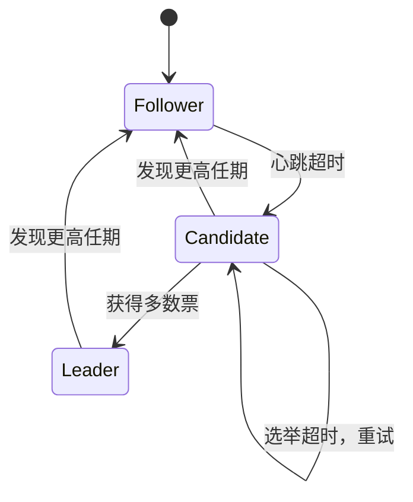

## 二、Leader选举

在分布式系统中，Leader选举（Leader Election）是故障转移与恢复的核心环节。当集群中的主节点（Leader）发生故障时，系统必须快速、正确地从剩余节点中选出一个新的Leader，以保证服务的连续性和数据的一致性。选举过程的正确性直接决定了系统能否避免脑裂（Split-Brain）、数据丢失等严重问题。

本节将从选举问题的本质出发，系统讲解主流的Leader选举算法——从经典的Bully算法和Ring算法，到现代的Raft和ZAB协议，再到基于Paxos的变体方案，最后深入探讨脑裂预防和选举调优的实战要点。

### 2.1 选举问题的本质

#### 2.1.1 为什么需要Leader选举

在分布式系统中引入Leader角色，通常是出于以下设计考量：

- **写入协调**：多副本数据需要一个协调者来决定写入顺序，避免并发冲突。例如在Raft协议中，所有客户端写请求必须先发送给Leader，由Leader统一排序后分发给Follower。
- **全局决策**：某些操作（如成员变更、配置更新）需要一个权威节点来发起和协调，避免多个节点同时发起相互矛盾的变更。
- **简化一致性模型**：有Leader的系统可以将复杂的多写者一致性问题简化为单写者复制问题，大幅降低实现复杂度。
- **资源管理**：在任务调度、负载均衡等场景中，需要一个中心节点来分配工作，避免重复执行或遗漏。

当Leader因硬件故障、网络分区或进程崩溃而不可用时，系统必须通过选举机制产生新的Leader。这个过程面临的核心挑战可以归纳为五个维度：

| 挑战维度 | 核心要求 | 违反后果 |
|----------|----------|----------|
| 安全性（Safety） | 任何时刻最多只有一个Leader | 脑裂：多个Leader同时接受写入，数据不一致 |
| 活性（Liveness） | 故障后必须能选出新Leader | 服务中断：系统陷入不可用状态 |
| 一致性（Consistency） | 新Leader必须拥有已提交的全部数据 | 数据丢失：客户端已确认的写入被回滚 |
| 可用性（Availability） | 选举过程应尽快完成 | 长时间服务中断，影响业务连续性 |
| 容错性（Fault Tolerance） | 选举本身必须能容忍部分节点故障 | 选举机制本身成为单点故障 |

#### 2.1.2 选举算法的分类

按照选举的协调方式和共识达成机制，Leader选举算法可以分为四大类：

| 类型 | 代表算法 | 核心思想 | 适用场景 | 消息复杂度 |
|------|----------|----------|----------|------------|
| 集中式选举 | Bully算法 | 节点ID最大的当选 | 节点数少、网络稳定的集群 | O(n²) |
| 分布式选举 | Raft、ZAB | 通过多数派投票达成共识 | 大规模、高可靠的生产集群 | O(n) per round |
| Token Ring | Ring算法 | 令牌沿环传递，持有者当选 | 固定拓扑的嵌入式系统 | O(n) per election |
| 基于锁的选举 | 分布式锁+租约 | 抢占分布式锁，持有锁者为Leader | ZooKeeper、etcd等场景 | O(1) per attempt |

这四类算法在**正确性保证**和**实现复杂度**之间存在根本性权衡：经典算法（Bully、Ring）实现简单但缺乏日志完整性检查，无法保证数据安全性；现代协议（Raft、ZAB）通过引入任期、日志比较、多数派投票等机制，在正确性和性能之间取得了较好的平衡。

### 2.2 经典选举算法

#### 2.2.1 Bully算法

Bully算法是最简单的选举算法之一，由Garcia-Molina在1982年提出。其核心规则极其简单：**节点ID最大的存活节点成为Leader**。

**算法流程：**

1. 当一个节点发现Leader无响应时，向所有ID比自己大的节点发送"选举通知"（Election消息）
2. 如果没有收到任何响应（说明没有比自己ID更大的存活节点），该节点自称Leader，并向所有节点发送"我是Leader"通知（Victory消息）
3. 如果收到了某个更大ID节点的响应，则该节点退出选举，等待那个节点的选举结果

Bully算法选举过程示例（5个节点，节点2发现Leader故障）：

  步骤1: 节点2检测到Leader(节点5)故障
  节点1    节点2    节点3    节点4    节点5(旧Leader)
    │        │        │        │        ✕ 故障
    │        │───────►│        │        │  节点2→节点3(选举)
    │        │        │        │        │
    │        │◄───────│        │        │  节点3→节点2(响应OK)
    │        │        │        │        │
  步骤2: 节点3收到节点2的选举，因自己ID更大，发起自己的选举
    │        │───────►│        │        │  节点2→节点4(选举)
    │        │◄───────│        │        │  节点4→节点2(响应OK)
    │        │        │        │        │
  步骤3: 节点3向节点4发送选举，节点4响应OK；节点3向节点5发送，无响应
    │        │        │───────►│        │  节点3→节点4(选举)
    │        │        │◄───────│        │  节点4→节点3(响应OK)
    │        │        │── ─ ─ ─│─ ─ ─ ─►│  节点3→节点5(无响应)
    │        │        │        │        │
  步骤4: 节点4向节点5发送选举，无响应，节点4自称Leader
    │        │        │        │── ─ ─ ─►│  节点4→节点5(无响应)
    │        │        │        │        │
  步骤5: 节点4广播Victory通知
    │◄───────│────────│────────│        │  节点4→所有节点(Victory)
    │  节点4成为新Leader      │        │

**Bully算法的优缺点：**

| 维度 | 评价 |
|------|------|
| 实现复杂度 | 极低，规则简单，易于理解和实现 |
| 消息复杂度 | O(n²)，最坏情况每个节点向所有更大节点发消息 |
| 收敛速度 | 最多两轮消息交换（选举+胜利通知） |
| 容错性 | 差——只能容忍网络分区中"ID较小的一侧"的节点故障 |
| 日志感知 | 无——仅凭ID大小决定，可能选出日志落后的节点 |
| 实际应用 | 几乎不用于生产系统，仅作为教学参考 |

Bully算法的主要缺陷在于它不考虑日志完整性——仅凭节点ID大小决定Leader归属，可能选出日志落后的节点，导致已提交数据丢失。此外，当最大ID节点恰好是网络分区中孤立的那一侧时，其他节点永远无法选出新Leader。这是现代选举算法（Raft、ZAB）重点解决的问题。

#### 2.2.2 Ring算法

Ring算法假设节点排列成一个逻辑环（Logical Ring），每个节点只知道它的"下一个"节点。选举时，一个选举令牌（Election Token）沿环传递。

**算法流程：**

1. 当节点发现Leader故障时，创建一个包含自身ID的选举令牌，发送给下一个节点
2. 每个收到令牌的节点将自己的ID追加到令牌中，然后转发给下一个节点
3. 当令牌绕环一周回到发起者时，发起者选择令牌中ID最大的节点作为Leader
4. Leader发起者向最大ID节点发送"成为Leader"消息，该节点确认后广播通知

Ring算法选举过程（4节点环，节点1发起选举）：

    节点1 ────────► 节点2
     ▲                 │
     │                 ▼
    节点4 ◄──────── 节点3

    1. 节点1发现Leader故障，创建令牌: tokens = [1]
    2. 节点2收到令牌，追加自身ID: tokens = [1, 2]
    3. 节点3收到令牌，追加自身ID: tokens = [1, 2, 3]
    4. 节点4收到令牌，追加自身ID: tokens = [1, 2, 3, 4]
    5. 令牌回到节点1，发现 max(1,2,3,4) = 4
    6. 节点1向节点4发送 "请成为Leader" 消息
    7. 节点4确认后广播 Victory 消息

Ring算法的主要缺点：

- **选举延迟与节点数成正比**：令牌至少需要绕环一圈才能完成选举，延迟 = O(n) × 单跳延迟。在大规模集群中效率低下。
- **环中断问题**：如果环中某个节点故障且未被跳过，令牌将无法传递到后续节点，选举永久卡死。
- **单点发起**：只有令牌发起者有权决定Leader，如果发起者在选举过程中也故障，整个选举作废。

实践中通常需要维护"跳过故障节点"的机制（如维护一个活跃节点列表），但这又引入了额外的复杂度和不一致性风险，使得Ring算法在生产环境中几乎不被采用。

### 2.3 Raft选举协议

Raft协议由Diego Ongaro和John Ousterhout在2014年提出，是目前最广泛使用的Leader选举协议之一。etcd、TiKV、CockroachDB、MinIO等知名系统都基于Raft实现了一致性。

#### 2.3.1 Raft选举的核心概念

Raft将时间划分为连续的**任期**（Term），每个任期最多有一个Leader。任期号在节点之间传递时单调递增，类似于逻辑时钟。当发生Leader故障时，任期号会递增，系统进入新一轮选举。

Raft的任期机制：

  时间 ──────────────────────────────────────────►
  
  |◄──── Term 1 ────►|◄─ Term 2 ─►|◄──── Term 3 ────►|
  |   Leader: A       |  选举中...  |   Leader: C       |
  |   (正常运行)      |  B当选失败  |   (正常运行)      |
  |   Follower: B,C   |  C当选成功  |   Follower: A,B   |
  |                   |             |                    |
  | 心跳 → → → → → → |  → → → → → | 心跳 → → → → → → →|

节点有三种状态，状态之间按照严格规则转换：

| 状态 | 角色 | 职责 | 转换条件 |
|------|------|------|----------|
| Follower | 跟随者 | 响应Leader的RPC，不主动发起请求 | 收到更高任期的心跳；投票超时 |
| Candidate | 候选人 | 发起选举请求，等待投票 | 心跳超时触发；获得多数票→Leader；发现更高任期→Follower |
| Leader | 领导者 | 处理客户端请求，管理日志复制 | 发现更高任期→Follower |



#### 2.3.2 选举触发条件

每个Follower维护一个**选举超时**（Election Timeout），通常为150ms-300ms之间的随机值。如果在超时时间内未收到Leader的心跳（AppendEntries RPC），Follower认为Leader已故障：

1. 自增当前任期号（currentTerm + 1）
2. 将自身状态切换为Candidate
3. 先给自己投一票（每个节点在一个任期内最多投一票）
4. 向集群中所有其他节点发送RequestVote RPC

**随机化超时**是Raft避免同时选举的关键设计：每个节点选择一个随机的超时时间，ID不同意味着超时时间大概率不同，使得不同节点在不同时刻发起选举，降低多个Candidate同时竞争的概率。

#### 2.3.3 投票规则

收到RequestVote的节点按以下规则决定是否投票：

```python
def handle_request_vote(self, candidate_id, candidate_term, 
                        candidate_last_log_index, candidate_last_log_term):
    """
    Raft投票决策逻辑
    
    投票需要同时满足三个条件：
    1. 候选人的任期不小于自己的当前任期
    2. 每个任期只投一票（且只能投给一个人）
    3. 候选人的日志至少和自己一样新（日志完整性检查）
    """
    # 条件1：拒绝过期的请求
    if candidate_term < self.current_term:
        return VoteResponse(granted=False, term=self.current_term)
    
    # 如果收到更高任期，更新自己并转为Follower
    if candidate_term > self.current_term:
        self.become_follower(candidate_term)
    
    # 条件2：每个任期只投一票（且只能投给一个人）
    if self.voted_for is not None and self.voted_for != candidate_id:
        return VoteResponse(granted=False, term=self.current_term)
    
    # 条件3：日志完整性检查
    # 候选人的最后一条日志的任期必须 >= 自己的
    # 如果任期相同，则候选人的最后日志索引必须 >= 自己的
    my_last_term = self.log[-1].term if self.log else 0
    my_last_index = len(self.log) - 1
    
    candidate_log_ok = (
        candidate_last_log_term > my_last_term or
        (candidate_last_log_term == my_last_term and 
         candidate_last_log_index >= my_last_index)
    )
    
    if not candidate_log_ok:
        return VoteResponse(granted=False, term=self.current_term)
    
    # 所有条件满足，投票给候选人
    self.voted_for = candidate_id
    self.reset_election_timeout()
    return VoteResponse(granted=True, term=self.current_term)
```

**日志完整性规则**是Raft选举正确性的关键保障。它确保了：只有拥有所有已提交日志的节点才能当选Leader，从而避免已提交的数据丢失。直觉上理解：如果Candidate的日志比Follower落后，说明Candidate还没有复制Follower已有的数据，如果让它当Leader，这些数据可能被覆盖丢失。日志完整性检查从根源上杜绝了这种可能。

#### 2.3.4 完整的Raft选举实现

```python
import random
import threading
import time
from enum import Enum
from dataclasses import dataclass, field
from typing import List, Optional, Dict, Tuple


class NodeState(Enum):
    FOLLOWER = "follower"
    CANDIDATE = "candidate"
    LEADER = "leader"


@dataclass
class LogEntry:
    term: int
    index: int
    command: str


@dataclass
class VoteRequest:
    term: int
    candidate_id: str
    last_log_index: int
    last_log_term: int


@dataclass
class VoteResponse:
    term: int
    granted: bool


class RaftElectionNode:
    """Raft选举节点的完整实现"""
    
    def __init__(self, node_id: str, peers: List[str]):
        self.node_id = node_id
        self.peers = peers
        self.state = NodeState.FOLLOWER
        self.current_term = 0
        self.voted_for: Optional[str] = None
        self.log: List[LogEntry] = []
        
        # 选举相关
        self.election_timeout = self._random_timeout()
        self.last_heartbeat = time.time()
        self.votes_received = 0
        self.leader_id: Optional[str] = None
        
        # 已提交的日志索引
        self.commit_index = -1
        
        self._lock = threading.Lock()
        self._running = False
    
    def _random_timeout(self) -> float:
        """生成随机选举超时（150ms-300ms）"""
        return random.uniform(0.15, 0.30)
    
    def _reset_election_timer(self):
        """重置选举定时器"""
        self.election_timeout = self._random_timeout()
        self.last_heartbeat = time.time()
    
    def start(self):
        """启动节点的选举监控循环"""
        self._running = True
        self._timer_thread = threading.Thread(target=self._election_loop, daemon=True)
        self._timer_thread.start()
    
    def stop(self):
        self._running = False
    
    def _election_loop(self):
        """选举超时检测循环"""
        while self._running:
            time.sleep(0.05)  # 50ms检测间隔
            if self.state != NodeState.LEADER:
                elapsed = time.time() - self.last_heartbeat
                if elapsed > self.election_timeout:
                    self._start_election()
    
    def _start_election(self):
        """发起新一轮选举"""
        with self._lock:
            self.current_term += 1
            self.state = NodeState.CANDIDATE
            self.voted_for = self.node_id
            self.votes_received = 1  # 给自己投一票
            self._reset_election_timer()
        
        last_log_index = len(self.log) - 1
        last_log_term = self.log[-1].term if self.log else 0
        
        request = VoteRequest(
            term=self.current_term,
            candidate_id=self.node_id,
            last_log_index=last_log_index,
            last_log_term=last_log_term
        )
        
        # 并行向所有peer发送RequestVote
        granted_count = 1  # 包含自己的票
        for peer in self.peers:
            response = self._send_vote_request(peer, request)
            if response and response.granted:
                granted_count += 1
        
        # 检查是否获得多数票
        with self._lock:
            if self.state != NodeState.CANDIDATE:
                return  # 在等待投票期间状态已变化
            
            majority = (len(self.peers) + 1) // 2 + 1
            if granted_count >= majority:
                self._become_leader()
            # 否则选举失败，等待下一轮超时重试
    
    def _send_vote_request(self, peer_id: str, request: VoteRequest) -> Optional[VoteResponse]:
        """向指定节点发送投票请求（实际通过网络RPC实现）"""
        # 此处为模拟，实际实现中通过gRPC/HTTP发送
        return None
    
    def _become_leader(self):
        """当选为Leader"""
        self.state = NodeState.LEADER
        self.leader_id = self.node_id
        # 立即开始发送心跳，防止其他节点发起新一轮选举
        self._send_heartbeats()
    
    def _send_heartbeats(self):
        """向所有Follower发送心跳（AppendEntries RPC）"""
        for peer in self.peers:
            self._send_append_entries(peer)
    
    def handle_vote_request(self, request: VoteRequest) -> VoteResponse:
        """处理收到的投票请求"""
        with self._lock:
            # 任期过期，拒绝
            if request.term < self.current_term:
                return VoteResponse(term=self.current_term, granted=False)
            
            # 更新任期
            if request.term > self.current_term:
                self.current_term = request.term
                self.state = NodeState.FOLLOWER
                self.voted_for = None
            
            # 每个任期只投一票
            if self.voted_for is not None and self.voted_for != request.candidate_id:
                return VoteResponse(term=self.current_term, granted=False)
            
            # 日志完整性检查
            my_last_term = self.log[-1].term if self.log else 0
            my_last_index = len(self.log) - 1
            
            log_ok = (
                request.last_log_term > my_last_term or
                (request.last_log_term == my_last_term and 
                 request.last_log_index >= my_last_index)
            )
            
            if not log_ok:
                return VoteResponse(term=self.current_term, granted=False)
            
            # 投票给候选人
            self.voted_for = request.candidate_id
            self._reset_election_timer()
            return VoteResponse(term=self.current_term, granted=True)
    
    def handle_heartbeat(self, leader_term: int, leader_id: str):
        """处理收到的心跳消息"""
        with self._lock:
            if leader_term < self.current_term:
                return  # 拒绝过期的心跳
            
            if leader_term > self.current_term:
                self.current_term = leader_term
                self.voted_for = None
            
            self.state = NodeState.FOLLOWER
            self.leader_id = leader_id
            self._reset_election_timer()
```

#### 2.3.5 PreVote机制

Raft的原始论文中，选举超时后节点会直接递增term并发起选举。但这种做法在节点因网络分区暂时不可达时会产生大量无意义的高term，干扰集群稳定性。具体表现为：

1. 被分区隔离的节点反复超时 → 反复递增term → 产生大量无用的RequestVote消息
2. 当网络恢复后，这些高term会"传染"给正常节点，迫使正常Leader退位
3. 整个集群被迫重新选举，即使之前运行正常

**PreVote机制**要求Candidate先向所有节点发送PreVote请求（不递增term），只有在获得多数PreVote同意后才真正发起选举。PreVote请求携带当前term和日志信息，但不改变接收方的任何状态（不递增term、不记录投票）。

```python
def handle_prevote_request(self, candidate_id, candidate_term,
                           candidate_last_log_index, candidate_last_log_term):
    """
    PreVote请求处理：不改变自身状态，仅回复是否同意
    与正式投票的关键区别：不递增term，不记录voted_for
    """
    # 拒绝过期请求
    if candidate_term < self.current_term:
        return VoteResponse(term=self.current_term, granted=False)
    
    # 日志完整性检查（与正式投票相同）
    my_last_term = self.log[-1].term if self.log else 0
    my_last_index = len(self.log) - 1
    
    log_ok = (
        candidate_last_log_term > my_last_term or
        (candidate_last_log_term == my_last_term and 
         candidate_last_log_index >= my_last_index)
    )
    
    if not log_ok:
        return VoteResponse(term=self.current_term, granted=False)
    
    # 同意PreVote，但不改变自身状态
    return VoteResponse(term=self.current_term, granted=True)

def _start_election_with_prevote(self):
    """带PreVote的选举流程"""
    with self._lock:
        # 先发PreVote，不递增term
        prevote_request = VoteRequest(
            term=self.current_term,  # 注意：使用当前term，不+1
            candidate_id=self.node_id,
            last_log_index=len(self.log) - 1,
            last_log_term=self.log[-1].term if self.log else 0
        )
    
    # 收集PreVote响应
    prevote_granted = 1  # 自己同意
    for peer in self.peers:
        response = self._send_prevote_request(peer, prevote_request)
        if response and response.granted:
            prevote_granted += 1
    
    majority = (len(self.peers) + 1) // 2 + 1
    if prevote_granted < majority:
        return  # PreVote未通过，不发起正式选举
    
    # PreVote通过，现在正式发起选举
    self._start_election()
```

PreVote的核心优势是**隔离不影响全局**：一个被分区的节点即使反复触发PreVote，也不会递增集群的term，网络恢复后不会干扰正常Leader。etcd和TiKV都默认启用了PreVote。

#### 2.3.6 Raft选举的正确性证明

Raft论文通过**选举安全性**（Election Safety）定理证明了选举的正确性：

> **定理**：在一个给定的任期中，最多只能有一个节点被选举为Leader。

证明的关键在于：
1. 每个节点在一个任期内最多投一票（voted_for保证）
2. Candidate获得多数票（≥ ⌊n/2⌋ + 1）才能当选
3. 两个多数派之间必然有交集（抽屉原理）——交集中的节点不会重复投票

因此，不可能有两个Candidate在同一任期内都获得多数票。这保证了Leader的唯一性。

结合**日志完整性**（Log Completeness）性质——如果一个日志条目在某个任期被提交，那么所有更高任期的Leader的日志中一定包含这个条目——Raft保证了不会出现已提交数据被回滚的情况。

#### 2.3.7 选举超时优化

选举超时的设置是影响Leader切换速度和系统稳定性的最关键参数：

选举超时 vs 心跳间隔的经验关系：
┌──────────────────────────────────────────────────────────────┐
│                                                              │
│  心跳间隔 T    选举超时范围          适用场景                 │
│  ────────────────────────────────────────────────────────    │
│  50ms         150ms - 300ms        低延迟集群（同机房）      │
│  100ms        300ms - 600ms        通用场景（同城市）        │
│  500ms        1500ms - 3000ms      跨地域部署                │
│  1s           3s - 6s              高抖动网络/跨洲部署       │
│                                                              │
│  黄金法则：选举超时 ≥ 10 × 心跳间隔                          │
│  原因：充分容忍网络延迟波动，避免无谓选举                     │
│                                                              │
│  经验公式：                                                   │
│  election_timeout = max(10T, 2 × network_rtt_p99)            │
│  其中T为心跳间隔，network_rtt_p99为网络RTT的99分位数         │
│                                                              │
└──────────────────────────────────────────────────────────────┘

### 2.4 ZAB协议选举

ZAB（ZooKeeper Atomic Broadcast）是Apache ZooKeeper使用的共识协议，由Yahoo研究院为ZooKeeper设计。ZAB的选举机制与Raft有相似之处，但在细节上存在显著差异。

#### 2.4.1 ZAB的两种选举模式

ZooKeeper历史上有两种选举实现：

**FastLeaderElection（FLE）**：ZooKeeper 3.4之前的默认选举算法。每个节点广播自己的投票（包含自己的ID、事务ID/ZXID、任期号），通过多轮投票比较选出Leader。FLE的比较规则是：先比较ZXID（事务ID），ZXID大的优先；ZXID相同则比较SID（服务器ID），SID大的优先。

**LeaderElection（新）**：ZooKeeper 3.4之后引入的改进选举算法，使用TCP长连接进行投票通信，性能和稳定性优于FLE。新算法减少了投票收敛的轮次，在大规模集群中表现更好。

#### 2.4.2 ZAB选举与Raft选举的关键区别

| 特性 | Raft | ZAB |
|------|------|-----|
| 选举触发 | 超时后发起RequestVote | 超时后广播投票（LOOKING状态） |
| 投票比较标准 | 日志完整性（lastLogTerm + lastLogIndex） | ZXID优先，SID次之 |
| 任期概念 | Term（每个选举递增） | Epoch（Leader周期） |
| 投票轮次 | 通常一轮完成 | FLE可能需要多轮投票收敛 |
| 预投票 | PreVote（可选，推荐启用） | 无类似机制 |
| Leader切换 | Candidate→Leader | LOOKING→LEADING |
| Observer角色 | 无（所有节点参与投票） | Observer不参与投票，只同步数据 |
| 日志比较粒度 | Term + Index（两维度） | Epoch + Counter（两维度，含义不同） |

#### 2.4.3 ZAB选举的核心实现

```python
class ZabVote:
    """ZAB投票对象"""
    def __init__(self, server_id: int, zxid: tuple, election_epoch: int):
        """
        server_id: 服务器ID
        zxid: (epoch, counter) 事务ID，先比较epoch再比较counter
        election_epoch: 选举轮次
        """
        self.server_id = server_id
        self.zxid = zxid
        self.election_epoch = election_epoch
    
    def is_newer_than(self, other: 'ZabVote') -> bool:
        """判断当前投票是否比另一个投票更新"""
        if self.zxid[0] != other.zxid[0]:
            return self.zxid[0] > other.zxid[0]
        if self.zxid[1] != other.zxid[1]:
            return self.zxid[1] > other.zxid[1]
        return self.server_id > other.server_id


class FastLeaderElection:
    """ZooKeeper FastLeaderElection算法实现"""
    
    def __init__(self, server_id: int, zxid: tuple, 
                 all_servers: list, election_epoch: int = 0):
        self.server_id = server_id
        self.current_vote = ZabVote(server_id, zxid, election_epoch)
        self.all_servers = all_servers
        self.votes_received: dict = {}  # server_id -> ZabVote
        self.state = "LOOKING"  # LOOKING, FOLLOWING, LEADING
    
    def look_for_leader(self):
        """启动选举，进入LOOKING状态"""
        self.state = "LOOKING"
        self.current_vote = ZabVote(
            self.server_id, 
            self.current_vote.zxid,
            self.current_vote.election_epoch + 1
        )
        
        # 广播自己的投票给所有其他服务器
        self._broadcast_vote(self.current_vote)
        
        # 等待其他服务器的投票
        while self.state == "LOOKING":
            vote = self._receive_vote()
            if vote is None:
                continue
            
            # 更新投票：如果收到的投票比自己的更新，则跟随
            if vote.is_newer_than(self.current_vote):
                self.current_vote = ZabVote(
                    vote.server_id, vote.zxid, vote.election_epoch
                )
                # 重新广播更新后的投票
                self._broadcast_vote(self.current_vote)
            
            self.votes_received[vote.server_id] = vote
            
            # 检查是否获得多数票
            if self._has_enough_votes():
                leader_id = self.current_vote.server_id
                if leader_id == self.server_id:
                    self.state = "LEADING"
                else:
                    self.state = "FOLLOWING"
                break
    
    def _has_enough_votes(self) -> bool:
        """检查当前投票是否获得了多数票"""
        votes_for_current = sum(
            1 for v in self.votes_received.values()
            if v.server_id == self.current_vote.server_id
        )
        # 包括自己的一票
        votes_for_current += 1
        return votes_for_current > len(self.all_servers) // 2
    
    def _broadcast_vote(self, vote: ZabVote):
        """广播投票给所有其他服务器"""
        for server_id in self.all_servers:
            if server_id != self.server_id:
                self._send_vote(server_id, vote)
    
    def _send_vote(self, target_id: int, vote: ZabVote):
        """发送投票（实际通过TCP连接实现）"""
        pass
    
    def _receive_vote(self):
        """接收投票"""
        pass
```

#### 2.4.4 ZooKeeper集群最佳实践

ZooKeeper集群的节点数量和部署策略直接影响选举的效率和可靠性：

推荐的ZooKeeper集群配置：
┌───────────────────────────────────────────────────────────┐
│  集群规模       适用场景              容错能力             │
│  ───────────────────────────────────────────────────────  │
│  3节点集群      小规模开发/测试       容忍1节点故障        │
│  5节点集群      中等规模生产环境     容忍2节点故障        │
│  7节点集群      大规模高可靠场景     容忍3节点故障        │
│                                                           │
│  节点数必须为奇数！                                       │
│  原因：N个节点需要 ⌊N/2⌋ + 1 个节点构成多数派            │
│  3节点需要2票，5节点需要3票，7节点需要4票                 │
│                                                           │
│  偶数节点的代价（以4节点为例）：                           │
│  - 多数派仍需3票 → 容错能力与3节点相同（都是1）           │
│  - 多出1个节点的硬件和网络开销                             │
│  - 选举时可能产生更长的投票收敛时间                        │
│                                                           │
│  部署原则：                                               │
│  - 节点分布在不同机架/可用区，避免单点故障                 │
│  - 带外管理网络（IPMI/iLO）独立于业务网络                 │
│  - 定期进行选举演练，验证故障转移流程                      │
└───────────────────────────────────────────────────────────┘

**Observer角色**：ZooKeeper还支持Observer节点——不参与投票但同步数据。这允许在不增加选举开销的情况下扩展读取能力。Observer不计入多数派，因此3个Participant + 2个Observer的容错能力仍然是1。

### 2.5 基于Paxos的选举

Paxos是Lamport在1989年提出的共识算法，是分布式共识领域的理论基石。虽然直接实现Paxos的系统较少（Google Chubby是典型案例），但许多共识协议（包括Raft）都是Paxos的变体。

#### 2.5.1 Multi-Paxos与Leader选举

在Multi-Paxos协议中，Leader角色对应于"稳定Proposer"（Stable Proposer）。当一个Proposer在一轮Prepare/Promise后成功占据了多数派，它成为Leader，后续的Accept请求可以跳过Prepare阶段（因为已获得Promise），从而将两阶段简化为一阶段，大幅提升吞吐量。

Multi-Paxos的Leader选举过程：

Phase 1a (Prepare):  Leader候选人选择新编号n，向多数派发送Prepare(n)
Phase 1b (Promise):  接收者承诺不接受编号小于n的提案，返回已接受的最大编号提案
Phase 2a (Accept):   Leader发送Accept(n, v)给多数派
Phase 2b (Accepted): 接受者接受提案

稳定Leader优化：
  Leader确立后，后续写入只需：
  Phase 2a: Leader发送Accept(n, v)
  Phase 2b: 接受者接受
  → 消息延迟减半，吞吐量翻倍

**Paxos与Raft的核心区别**：

| 维度 | Paxos | Raft |
|------|-------|------|
| Leader必要性 | 原始Paxos不需要Leader（每个Proposer独立提案） | Leader是协议的核心，所有写入经过Leader |
| 编号机制 | 全局递增的提案编号n | 任期号(Term) + 日志索引 |
| 故障恢复 | 可能丢失未被多数派接受的提案 | 日志完整性保证已提交数据不丢失 |
| 可理解性 | 理论优雅但实现复杂 | 有意设计为易于理解和实现 |
| 实际采用 | Google Chubby、部分内部系统 | etcd、TiKV、CockroachDB等广泛采用 |

#### 2.5.2 ZAB与Paxos的关系

虽然ZAB和Paxos在设计目标上相似，但它们在以下几个方面存在差异：

| 维度 | Paxos | ZAB |
|------|-------|-----|
| 设计目标 | 无Leader的强一致性共识 | 以Leader为核心的原子广播 |
| 角色区分 | Proposer/Acceptor/Learner | Leader/Follower/Observer |
| 故障恢复 | 可能丢失已提交但未学习的提案 | 基于事务ID确保不丢失已提交数据 |
| 变更流程 | 每次提案可能产生新Leader | 显式的Leader选举阶段（Discovery+Synchronization+Broadcast） |

### 2.6 脑裂预防与选举安全

#### 2.6.1 脑裂的成因与危害

脑裂（Split-Brain）是分布式系统中最危险的故障模式之一。当网络分区将集群分成两个或多个独立的部分时，每个分区可能各自选出一个Leader，导致系统出现多个"大脑"。

脑裂场景示意（3节点集群，网络分区将A与BC隔离）：

  正常状态：                    分区后：
  ┌──────────────────────┐     ┌────────┐    ╳    ┌──────────────┐
  │  A(Leader) ←→ B(F)   │     │  A     │          │ B(新Leader)  │
  │     ↕               │     │        │          │    ↕         │
  │     C(Follower)      │     │ 继续接受│          │ C(Follower)  │
  │                      │     │ 写入！  │          │ 继续接受写入 │
  └──────────────────────┘     └────────┘          └──────────────┘
                                    ↑                    ↑
                                 数据冲突！
                          两个Leader同时接受写入，数据分叉

脑裂的危害是严重的：两个Leader同时接受客户端写入，导致同一份数据存在两个不同的版本。当网络恢复后，系统必须决定哪个版本是"正确"的——但无论选哪个，都会丢失另一侧的写入。更糟糕的是，如果涉及金融交易或用户操作，可能产生严重的业务损失。

#### 2.6.2 Fencing Token（隔离令牌）

Fencing是防止脑裂影响的通用机制。核心思想是：每次选举产生新Leader时，生成一个单调递增的Fencing Token。存储层在接收写入请求时，必须验证Token是否是当前最新的——如果旧Leader带着过期的Token发起写入，存储层会拒绝。

```python
class FencingTokenManager:
    """Fencing Token管理器"""
    
    def __init__(self):
        self.current_token = 0
        self.token_lock = threading.Lock()
    
    def issue_token(self) -> int:
        """为新Leader颁发Fencing Token"""
        with self.token_lock:
            self.current_token += 1
            return self.current_token
    
    def validate_token(self, token: int) -> bool:
        """验证Token是否有效（>= 当前Token）"""
        return token >= self.current_token


class FencingStorage:
    """支持Fencing的存储层"""
    
    def __init__(self):
        self.data = {}
        self.last_token = 0
        self.lock = threading.Lock()
    
    def write(self, key: str, value: str, fencing_token: int) -> bool:
        """
        写入数据，验证Fencing Token
        
        返回True表示写入成功，False表示被fence拒绝
        """
        with self.lock:
            if fencing_token < self.last_token:
                # 旧Leader的写入请求，拒绝
                print(f"FENCE REJECTED: token={fencing_token} < last_token={self.last_token}")
                return False
            
            self.last_token = fencing_token
            self.data[key] = value
            return True


# 使用示例：模拟脑裂场景
storage = FencingStorage()
token_manager = FencingTokenManager()

# 旧Leader正常工作期间的写入（token=1）
storage.write("key1", "old_value", fencing_token=1)   # 成功
storage.write("key2", "old_value", fencing_token=1)   # 成功

# 网络分区发生，新Leader当选，获得更高的token
new_token = token_manager.issue_token()  # 返回2
storage.write("key3", "new_value", fencing_token=new_token)  # 成功

# 旧Leader恢复后尝试写入（token仍为1，被fence拒绝）
storage.write("key4", "old_value", fencing_token=1)   # 被拒绝！
```

Fencing机制的关键在于**存储层必须支持Token验证**。如果存储系统（如数据库、消息队列）本身不支持Fencing，就需要在应用层或代理层实现。etcd通过Revision机制内置了Fencing能力——每次写入都会递增全局Revision，旧Leader的过期写入会因Revision过低而失败。

#### 2.6.3 STONITH与硬件Fencing

STONITH（Shoot The Other Node In The Head）是硬件级别的Fencing机制，通过IPMI、iLO、DRAC等带外管理接口强制关闭故障节点的电源。这是最可靠的Fencing方式，但也需要额外的硬件投入。

STONITH工作流程：

  1. 新Leader检测到旧Leader无响应（心跳超时）
  2. 新Leader通过带外网络向旧Leader的BMC/IPMI发送power off命令
  3. 旧Leader的电源被强制切断
  4. 新Leader确认旧Leader已下电（通过IPMI查询电源状态）
  5. 新Leader正式接管服务

  ┌─────────┐  IPMI命令  ┌─────────┐
  │  新Leader │──────────►│  旧Leader │
  │          │ (带外网络) │  BMC/IPMI │
  │          │            │          │
  │          │            │  ⚡断电!  │
  └─────────┘            └─────────┘

STONITH的局限性在于：带外网络本身也可能故障（如BMC固件bug、网络交换机故障），此时硬件Fencing不可用。生产环境中通常采用**多层Fencing策略**：硬件Fencing（STONITH）作为首选，软件Fencing（Fencing Token + 租约过期）作为降级方案。

#### 2.6.4 Quorum与仲裁机制

在脑裂场景中，除了Fencing之外，另一个关键防护是**仲裁机制**（Quorum）。仲裁确保只有获得多数节点同意的分区才能继续服务：

| 仲裁方式 | 实现机制 | 优势 | 劣势 |
|----------|----------|------|------|
| 多数派仲裁 | 需要多数节点可达 | 简单可靠，Raft/ZAB默认 | 少数派分区完全不可用 |
| 仲裁盘（Witness） | 第三方磁盘/存储仲裁 | 少数派分区可继续服务 | Witness本身可能故障 |
| 客户端仲裁 | 客户端持有token，超时后拒绝旧Leader | 无需额外基础设施 | 实现复杂，延迟高 |
| 第三方站点 | 独立的第三个站点投票 | 跨地域可靠 | 成本高，引入额外延迟 |

**etcd的Lease机制**本质上就是一种租约型仲裁：Leader必须定期续约（KeepAlive），如果续约失败（网络分区导致无法连接etcd集群），Lease过期后key被自动删除，旧Leader的"领导权"自动失效。

### 2.7 分布式锁与基于锁的选举

除了Raft/ZAB等专用协议外，很多系统利用分布式锁来实现Leader选举。典型场景是使用ZooKeeper或etcd的临时节点（Ephemeral Node）机制。

#### 2.7.1 ZooKeeper临时节点选举

```python
class ZooKeeperLeaderElection:
    """
    基于ZooKeeper临时顺序节点的Leader选举
    
    原理：
    1. 每个候选节点在 /election/ 下创建临时顺序节点
    2. 节点编号最小的成为Leader
    3. 其他节点watch比自己小的前一个节点
    4. Leader宕机时其临时节点自动删除，下一个节点当选
    
    优势：
    - 利用ZooKeeper的Watch机制，实现高效的故障感知
    - 临时节点随Session过期自动删除，天然支持Fencing
    - 顺序节点保证公平性，避免饥饿
    """
    
    def __init__(self, client, election_path="/election", server_id=None):
        self.client = client
        self.election_path = election_path
        self.server_id = server_id or self._generate_id()
        self.is_leader = False
        self._watch_node = None
    
    def register(self):
        """注册参与选举"""
        # 创建临时顺序节点
        node_path = f"{self.election_path}/node-"
        self.client.create(
            node_path, 
            value=self.server_id.encode(),
            ephemeral=True,
            sequential=True
        )
        self._check_leadership()
    
    def _check_leadership(self):
        """检查自己是否是Leader"""
        # 获取 /election/ 下所有子节点，按序号排序
        children = sorted(self.client.get_children(self.election_path))
        
        if not children:
            return
        
        my_node = self._find_my_node(children)
        my_index = children.index(my_node)
        
        if my_index == 0:
            # 我是最小节点，成为Leader
            self.is_leader = True
            self._on_become_leader()
        else:
            # Watch比自己小的前一个节点（精确watch，避免羊群效应）
            self._watch_node = children[my_index - 1]
            self.client.DataWatch(
                f"{self.election_path}/{self._watch_node}",
                self._on_watch_triggered
            )
    
    def _on_watch_triggered(self, event):
        """当watch的节点被删除时触发"""
        if event is not None and event.type == "DELETED":
            self._check_leadership()
    
    def _on_become_leader(self):
        """成为Leader后的回调"""
        print(f"Server {self.server_id} is now the Leader!")
    
    def _find_my_node(self, children):
        """在子节点列表中找到自己"""
        for child in children:
            data, _ = self.client.get(f"{self.election_path}/{child}")
            if data.decode() == self.server_id:
                return child
        return None
```

**羊群效应（Herd Effect）避免**：上面的实现中，每个节点只watch前一个节点（精确watch），而非watch所有节点。当Leader宕机时，只有下一个节点收到通知并触发选举检查，不会导致所有节点同时被唤醒，避免了羊群效应导致的惊群问题。

#### 2.7.2 etcd租约选举

etcd提供Lease（租约）机制，可以实现类似的Leader选举：

```go
// Go示例：基于etcd Lease的Leader选举
package main

import (
    "context"
    "log"
    "time"

    "go.etcd.io/etcd/client/v3"
    "go.etcd.io/etcd/client/v3/concurrency"
)

func runLeaderElection(client *clientv3.Client, name string) {
    // 创建Session，TTL控制Lease过期时间
    // Session关闭后Lease自动过期，key被删除，实现Fencing
    session, err := concurrency.NewSession(client, concurrency.WithTTL(10))
    if err != nil {
        log.Fatal(err)
    }
    defer session.Close()

    election := concurrency.NewElection(session, "/my-election/")
    
    // Campaign阻塞直到成为Leader
    // 内部实现：创建revision最小的key，watch前一个key
    if err := election.Campaign(context.Background(), name); err != nil {
        log.Fatal(err)
    }
    
    log.Printf("%s is now the leader", name)
    
    // 执行Leader任务...
    
    // Leader退出时主动释放，加速故障转移
    election.Resign(context.Background())
}
```

#### 2.7.3 Kubernetes环境中的Leader选举

在Kubernetes生态中，许多控制器（如kube-scheduler、cloud-controller-manager）通过Leader选举保证同一时间只有一个实例在执行控制逻辑。Kubernetes原生提供了基于ConfigMap/Lease的Leader选举机制：

```python
# Kubernetes Leader选举的核心原理（简化版）
class KubeLeaderElection:
    """
    Kubernetes Leader选举基于Lease对象：
    1. 所有候选Pod在同一个namespace下尝试创建/更新Lease
    2. Lease持有者（holderIdentity）标识当前Leader
    3. Leader定期续约（renewTime）
    4. 其他候选持续watch Lease，等待过期后竞选
    """
    
    def __init__(self, client, namespace, lease_name, identity):
        self.client = client
        self.namespace = namespace
        self.lease_name = lease_name
        self.identity = identity
    
    def try_acquire(self) -> bool:
        """尝试获取Leader锁"""
        try:
            lease = self.client.get_lease(self.namespace, self.lease_name)
            if lease is None:
                # Lease不存在，创建
                return self._create_lease()
            if lease.is_expired():
                # Lease过期，尝试更新
                return self._update_lease(lease)
            if lease.holder == self.identity:
                # 已经是Leader，续约
                return self._renew_lease(lease)
            return False  # 其他节点持有Leader
        except Exception:
            return False
    
    def _create_lease(self) -> bool:
        """创建Lease并成为Leader"""
        return self.client.create_lease(
            self.namespace, self.lease_name,
            holder_identity=self.identity,
            lease_duration_seconds=15
        )
    
    def _update_lease(self, lease) -> bool:
        """过期Lease，尝试抢夺"""
        return self.client.update_lease(
            self.namespace, self.lease_name,
            holder_identity=self.identity,
            lease_duration_seconds=15
        )
    
    def _renew_lease(self, lease) -> bool:
        """续约"""
        return self.client.renew_lease(
            self.namespace, self.lease_name
        )
```

Kubernetes Leader选举的特点：
- **基于Lease而非分布式锁**：Lease有内置过期时间，无需手动释放
- **CRD原生**：不需要额外的ZooKeeper/etcd依赖（K8s本身就基于etcd）
- **与控制器生命周期绑定**：Pod终止时Lease自动过期
- **租约时间可调**：默认15秒，可根据网络环境调整

### 2.8 选举调优与生产实践

#### 2.8.1 选举超时参数调优

选举超时是影响Leader切换速度和系统稳定性的最关键参数。设置过短会导致无谓的选举（网络抖动触发），设置过长会延长故障恢复时间。

选举超时调优决策树：

  网络延迟 < 1ms（同机房部署）？
  ├── 是 → 心跳50ms，选举超时150-300ms
  │        预期选举时间：< 500ms
  └── 否 → 网络延迟 < 10ms（同城市部署）？
      ├── 是 → 心跳100ms，选举超时300-600ms
      │        预期选举时间：< 1s
      └── 否 → 网络延迟 < 100ms（跨区域部署）？
          ├── 是 → 心跳500ms，选举超时1500-3000ms
          │        预期选举时间：< 5s
          └── 否 → 心跳1s，选举超时3000-6000ms
                   预期选举时间：< 15s

  调优原则：
  1. 先测量实际网络延迟分布（RTT P50/P99/P999）
  2. 选举超时 > 10 × 心跳间隔
  3. 心跳间隔 > 3 × RTT P99
  4. 在稳定性（大超时）和恢复速度（小超时）之间取平衡

#### 2.8.2 常见的选举问题与解决方案

| 问题 | 根因分析 | 解决方案 | 监控指标 |
|------|----------|----------|----------|
| 选举风暴（频繁选举） | 心跳超时设置过短；网络抖动触发误判 | 增大选举超时；启用PreVote；优化网络QoS | election_total速率突增 |
| 选举后数据丢失 | 选出的日志落后节点当Leader | 启用日志完整性检查（Raft默认启用） | follower_replay_duration_seconds |
| 选不出Leader | 多数节点不可用或网络完全隔离 | 确保集群规模为奇数；定期验证节点存活 | election_term停滞不前 |
| 脑裂 | 网络分区 + 缺少Fencing机制 | 启用STONITH或基于锁的Fencing；配置仲裁 | leader_changes_total > 1同时出现 |
| 选举耗时过长 | 大规模集群 + 跨地域延迟 | 减少集群规模；使用层级选举；就近部署 | election_duration_seconds P99过高 |
| 旧Leader恢复后抢占 | 旧Leader未正确感知自己已落选 | Fencing Token机制；租约过期；STONITH | 旧Leader日志出现term回退 |
| PreVote导致选举延迟翻倍 | PreVote阶段网络延迟叠加 | 检查PreVote是否超时合理；优化网络 | prevote_rejection_total持续高 |

#### 2.8.3 选举监控指标

生产环境中必须对选举过程进行监控。以下是基于Prometheus的推荐监控指标体系：

```python
# 选举相关的Prometheus监控指标
METRICS = {
    # 选举次数（按触发原因分类）
    "election_total": {
        "type": "counter",
        "labels": ["reason"],  # heartbeat_timeout, log_inconsistency, startup, pre_vote_failure
        "description": "Leader选举总次数"
    },
    
    # 选举耗时（从发起投票到当选Leader的时间）
    "election_duration_seconds": {
        "type": "histogram",
        "buckets": [0.01, 0.05, 0.1, 0.5, 1, 5, 10, 30],
        "description": "Leader选举耗时分布"
    },
    
    # 当前Leader任期号
    "current_term": {
        "type": "gauge",
        "description": "当前任期号（单调递增）"
    },
    
    # Leader切换次数
    "leader_changes_total": {
        "type": "counter",
        "description": "Leader切换总次数"
    },
    
    # 投票拒绝次数（按原因分类，用于定位选举失败原因）
    "votes_rejected_total": {
        "type": "counter",
        "labels": ["reason"],  # stale_term, already_voted, log_not_up_to_date
        "description": "投票被拒绝次数"
    },
    
    # 当前节点状态（用于可视化集群状态）
    "node_state": {
        "type": "gauge",
        "labels": ["state"],  # follower, candidate, leader
        "description": "当前节点状态（1=当前状态）"
    },
    
    # PreVote相关指标
    "prevote_requests_total": {
        "type": "counter",
        "labels": ["granted"],  # true, false
        "description": "PreVote请求次数"
    },
    
    # 心跳延迟（用于评估网络健康度）
    "heartbeat_latency_seconds": {
        "type": "histogram",
        "buckets": [0.001, 0.005, 0.01, 0.05, 0.1, 0.5, 1],
        "description": "心跳往返延迟分布"
    }
}
```

**告警规则建议**：

```yaml
# Prometheus告警规则
groups:
  - name: leader-election
    rules:
      - alert: FrequentLeaderElections
        expr: rate(election_total[5m]) > 0.1
        for: 2m
        labels:
          severity: warning
        annotations:
          summary: "Leader选举过于频繁"
          description: "过去5分钟选举速率 {{ $value }}/s，可能存在网络问题"
      
      - alert: NoLeader
        expr: time() - max_over_time(current_term[10m]) > 30
        for: 1m
        labels:
          severity: critical
        annotations:
          summary: "集群无Leader超过30秒"
      
      - alert: ElectionTooSlow
        expr: histogram_quantile(0.99, rate(election_duration_seconds_bucket[5m])) > 5
        for: 5m
        labels:
          severity: warning
        annotations:
          summary: "选举P99耗时超过5秒"
```

#### 2.8.4 各系统选举方案对比

| 系统 | 选举协议 | 默认选举超时 | Fencing机制 | 日志一致性 | 特殊设计 |
|------|----------|-------------|-------------|------------|----------|
| etcd | Raft | 1000ms | 基于Revision的事务 | Raft日志完整性 | PreVote、Check Quorum |
| ZooKeeper | ZAB (FLE) | 2000ms | 临时节点+ACL | ZXID单调递增 | Observer角色、动态配置 |
| Consul | Raft | 1000ms | 无内置Fencing | Raft日志完整性 | 读取可线性化（ReadIndex） |
| TiKV | Raft | 10s（可配置） | Region级别Fencing | Raft日志完整性 | 多Raft Group、Pipeline |
| PostgreSQL Patroni | etcd/ZK+自义 | 可配置 | Leader Lease | 基于时间线的恢复 | 同步/异步复制切换 |
| MySQL MGR | Paxos变体 | 可配置 | 成员仲裁 | 事务认证 | Group Replication、View变更 |
| Kubernetes | Lease/ConfigMap | 15s租约 | Lease过期自动失效 | N/A（非数据存储） | 与Pod生命周期绑定 |

### 2.9 真实故障案例分析

#### 案例一：etcd集群选举风暴

**场景**：某公司5节点etcd集群部署在3个可用区（AZ），由于跨AZ网络抖动，频繁出现选举超时触发选举，但又无法获得多数票的情况。

**根因分析**：
- 选举超时设置为默认1000ms，但跨AZ的RTT P99为200ms
- 心跳间隔500ms，网络抖动时心跳延迟偶尔超过1000ms
- PreVote未启用，被隔离节点反复递增term
- 网络恢复后高term传染给正常节点，Leader被迫退位

**解决方案**：
1. 启用PreVote，隔离节点的term不再干扰全局
2. 心跳间隔调整为200ms，选举超时调整为2000ms
3. 启用Check Quorum——Leader检测到无法联系多数Follower时主动退位，避免假Leader

**效果**：选举频率从每天5-10次降到每月1-2次，均为真正的Leader故障触发。

#### 案例二：ZooKeeper脑裂导致数据不一致

**场景**：3节点ZooKeeper集群（A、B、C），A因网络分区与BC隔离后，B当选新Leader，接受了一批写入。A认为自己仍是Leader，也接受了写入。

**根因分析**：
- ZooKeeper的FLE选举正确地让B当选（BC构成多数派）
- 但A没有被强制隔离（缺少STONITH），继续接受写入
- 客户端连接了A的会话仍能读写（因为A的Session未过期）
- 网络恢复后，A的写入因ZXID落后被丢弃，但已经返回给客户端的"成功"响应变成了谎言

**解决方案**：
1. 部署STONITH：网络分区触发时，BC通过IPMI强制关闭A的电源
2. 应用层使用Fencing Token验证写入结果
3. 客户端实现读写超时后的重试+幂等机制

**教训**：选举的正确性只是第一步，Fencing机制才能保证脑裂场景下的数据安全。

### 2.10 常见误区

**误区一：选举越快越好**

很多人认为选举应该尽快完成。实际上，过快的选举反而有害——网络抖动可能导致误判Leader故障，触发不必要的选举。Raft论文建议选举超时至少是心跳间隔的10倍，以充分容忍网络延迟波动。在生产环境中，一次选举风暴可能导致整个集群在数秒内无法服务，影响远大于多等几秒的恢复时间。

**误区二：Leader选举等同于服务恢复**

选举出新Leader并不等于服务完全恢复。新Leader可能需要同步日志（将落后的日志条目复制到自己这里）、重建连接池、加载缓存、重建路由表等，这些后续步骤同样需要时间。完整的故障转移时间 = 选举时间 + 日志同步时间 + 服务切换时间。在评估RTO（恢复时间目标）时，必须考虑所有阶段。

**误区三：奇数节点一定能提高容错能力**

3节点集群能容忍1个节点故障，5节点容忍2个。但4节点集群的容错能力与3节点相同（也是容忍1个），额外的第4个节点只增加了资源开销而没有提升容错能力。更微妙的是：偶数节点在多数派投票时更容易出现"两个子集票数相同"的僵局，虽然不会导致选不出Leader（因为总有一侧的多数派），但可能导致选举延迟增大。

**误区四：仅靠投票就能保证安全**

投票规则保证了"一个任期内最多一个Leader"的安全性，但不保证"一定能选出Leader"的活性。如果网络不稳定导致无法获得多数票，选举将反复失败。更危险的是，在某些极端场景下（如Follower在收到RequestVote后立即故障），可能出现"票被投了但投票者下线了"的情况。生产系统需要配合心跳超时重试、日志追赶、PreVote等机制来确保活性。

**误区五：Leader选举算法可以独立验证**

选举算法的正确性依赖于底层网络和存储的假设（如消息不会凭空产生、持久化存储不会静默损坏）。在实际部署中，必须考虑这些底层假设被违反的情况（如磁盘位翻转、网络包重放、CPU寄存器错误），并通过Checksum校验、Fencing Token、定期数据校验等机制进行防御。Twitter的Jepsen测试框架系统性地验证了各种分布式系统在故障注入下的正确性，揭示了多个选举相关的bug。

### 2.11 进阶：异步网络下的选举

在异步网络模型中，**FLP不可能定理**（Fischer-Lynch-Paterson, 1985）证明了：只要存在一个故障节点，就不存在一个确定性算法能在有限时间内保证达成共识。这对选举算法有深远影响：

- **所有实用的选举算法都使用随机化**（如Raft的随机选举超时）来打破对称性。确定性算法在异步网络中可能陷入无限循环——两个Candidate永远交替获得相同数量的票。
- **超时机制本质上是故障检测器**，而完美故障检测器在异步网络中不存在。所有基于超时的故障检测都存在误判：将延迟高的正常节点误判为故障。
- **实际系统的正确性依赖于部分同步假设**（Partial Synchrony），即网络最终会变得稳定并传递消息。这介于同步模型（消息延迟有上界）和异步模型（无延迟保证）之间，更贴近现实。

Raft通过随机选举超时将FLP不可能定理转化为概率性安全——不是"永远不可能选不出Leader"，而是"选不出Leader的概率随时间呈指数下降"。用数学语言描述：在n个节点的集群中，两个Candidate同时获得多数票的概率为 O(1/2^n)，对于5节点集群约为3%，对于7节点集群约为0.8%。这在实际系统中已经足够可靠。

**Paxos的Lamport比喻**：Lamport曾用古希腊的议会比喻Paxos——议员们可能随时睡着（故障），醒来时可能已经过了好几轮投票（丢失消息），但他们不会忘记自己在某一轮中说过的话（持久化存储）。选举算法的设计就是在这种"部分可信"的环境中找到共识的路径。

### 2.12 本节小结

Leader选举是分布式系统故障转移的核心环节。本节的关键要点如下：

- **选举的本质**是在多个节点中选出一个唯一的协调者，同时保证安全性（唯一性）和活性（一定能选出来）
- **经典算法**（Bully、Ring）过于简单，缺乏日志完整性检查，不适合生产环境
- **Raft选举**通过任期、随机超时、日志完整性检查三重机制，兼顾正确性和性能；PreVote进一步增强了稳定性
- **ZAB选举**通过ZXID比较确保事务一致性，是ZooKeeper可靠性的基石；Observer角色允许无损扩展读取能力
- **脑裂预防**需要多层防护：Fencing Token防止数据冲突，STONITH强制隔离故障节点，仲裁机制决定哪个分区继续服务
- **选举调优**需要根据网络环境、集群规模、延迟要求综合权衡，没有放之四海而皆准的参数
- **生产实践**中必须对选举过程进行全方位监控，包括选举次数、耗时、成功率、PreVote通过率等指标，并配置相应的告警规则

下一节将讲解数据恢复技术——当选举完成、新Leader上任后，如何确保数据的一致性和完整性。
