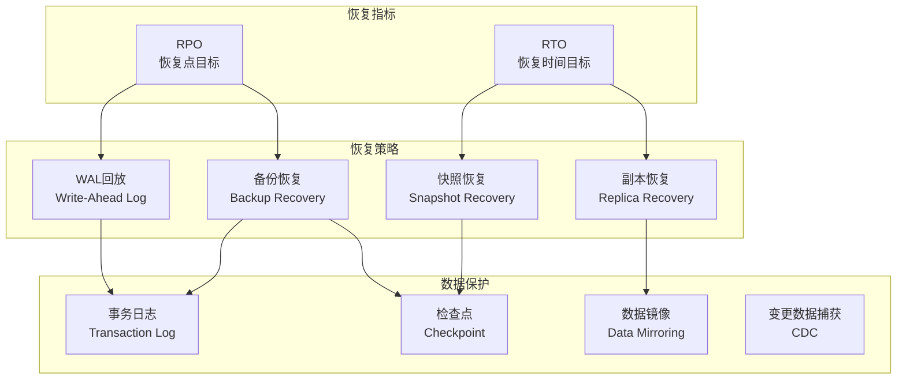
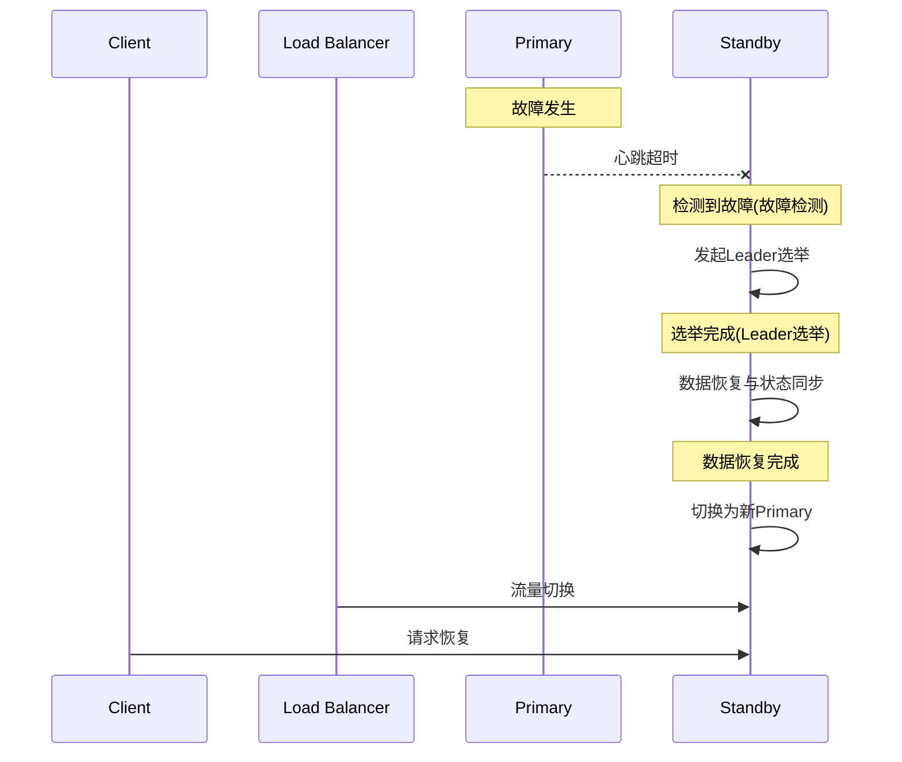
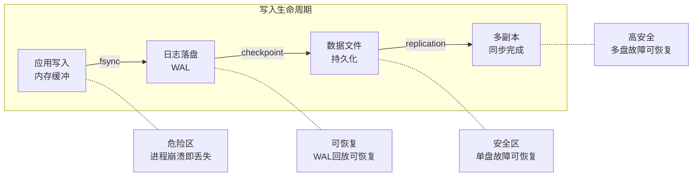
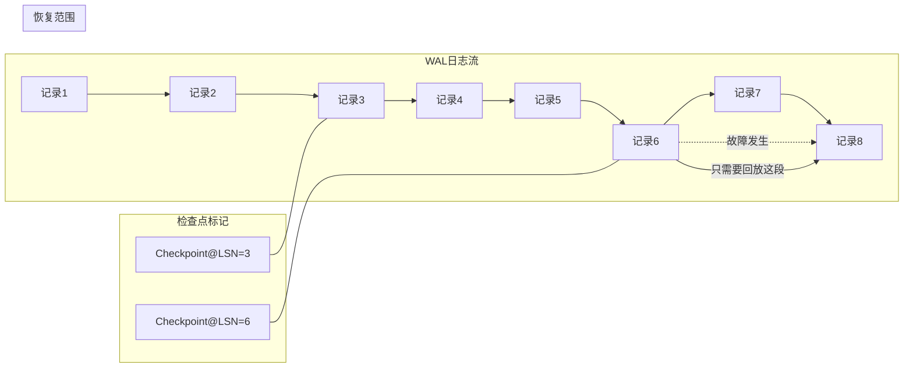
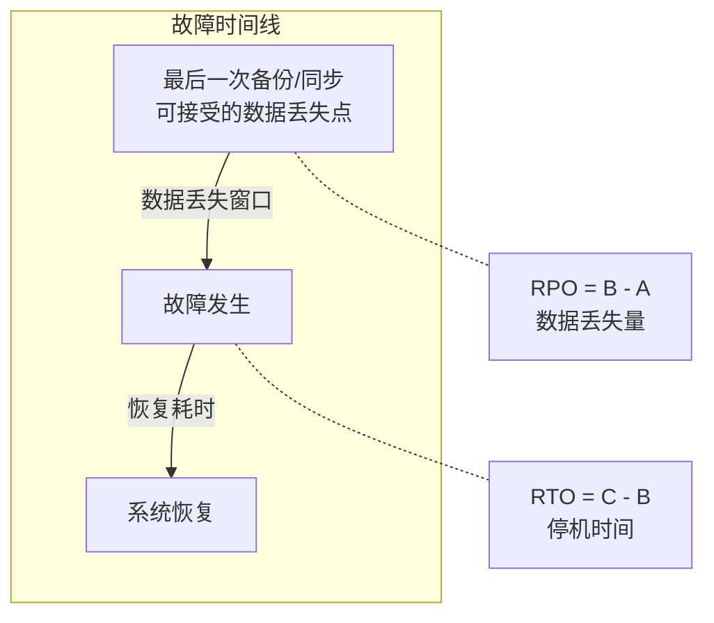
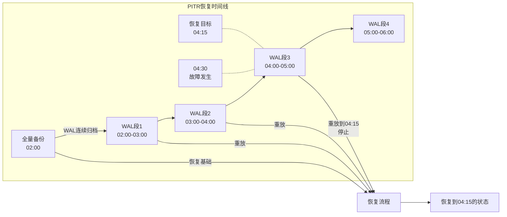
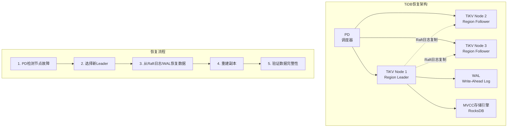
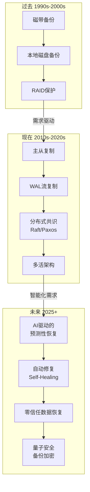

## 三数据恢复

### 1. 概述与背景

数据恢复（Data Recovery）是故障转移与恢复体系中的最后一道防线。当故障检测算法发现问题、Leader选举完成权力交接之后，系统面临的终极问题是：**如何让丢失或损坏的数据重见天日，并将系统状态恢复到一个正确的、一致的检查点上**。如果说故障检测是"眼睛"、Leader选举是"大脑"，那么数据恢复就是"双手"——真正执行修复动作的执行层。

#### 1.1 为什么数据恢复如此关键

在分布式系统中，故障不是异常情况，而是常态。Google 的一项研究显示，其数据中心中每千台服务器平均每天发生 1-5 次硬件故障。面对如此高的故障率，数据恢复能力直接决定了系统的生存能力。核心体现在三个维度：

**数据不丢失**：这是最低要求。金融系统的交易记录、电商平台的订单数据、医疗系统的患者信息——任何一条数据的丢失都可能带来灾难性后果。数据恢复的首要目标就是确保在任何单一故障场景下，数据零丢失。

**恢复速度快**：仅仅不丢失数据还不够。如果恢复需要数小时甚至数天，业务中断造成的损失可能远超数据本身的价值。恢复时间目标（RTO, Recovery Time Objective）是衡量恢复速度的核心指标。

**恢复状态正确**：恢复不是简单地"回滚到某个版本"。系统需要恢复到一个逻辑上一致的状态——所有相关的数据变更要么全部应用，要么全部不应用。一个"恢复了但状态不一致"的系统比不恢复更危险。

#### 1.2 核心概念框架

数据恢复涉及一系列关键概念，理解它们之间的关系是掌握数据恢复技术的前提：



#### 1.3 数据恢复在故障转移流程中的位置



数据恢复发生在故障检测和Leader选举之后、流量切换之前。这个阶段的耗时直接决定了整体的RTO。

---

### 2. 核心原理

#### 2.1 数据恢复的理论基础

数据恢复的理论根基来自两个方面：**数据持久化理论**和**一致性恢复理论**。

**数据持久化理论**回答"数据写到哪里才算安全"。根据著名的 CAP 定理和 PACELC 扩展模型，数据写入的安全性取决于写入确认的时机。一个写操作在不同阶段的安全性差异巨大：



**一致性恢复理论**回答"恢复到哪个状态才是正确的"。这不是一个简单的技术问题，而是涉及分布式系统理论的核心：

- **线性一致性恢复**：恢复后的状态等同于某个时刻的全局快照，所有操作都按全局时钟排序。这是最强的一致性保证，但恢复成本最高。Google Spanner 通过 TrueTime API 实现了外部一致性（External Consistency），其恢复状态具有线性一致性。
- **因果一致性恢复**：保证有因果关系的操作按序恢复，无因果关系的操作允许任意顺序。实践中最常用的恢复粒度。例如"用户先注册再下单"这两个操作有因果关系，恢复时必须保证注册先于下单。
- **最终一致性恢复**：只要给足够时间，最终所有副本会收敛到相同状态。恢复最灵活，但短期可能看到不一致。Amazon DynamoDB 的最终一致性读取就属于此类。

三种一致性模型的恢复特性对比：

| 一致性模型 | 恢复保证 | 恢复延迟 | 实现复杂度 | 适用场景 |
|------------|----------|----------|------------|----------|
| 线性一致性 | 所有操作全局有序 | 高 | 极高 | 金融交易、库存扣减 |
| 因果一致性 | 因果相关操作有序 | 中 | 中 | 社交动态、协作编辑 |
| 最终一致性 | 最终收敛到一致 | 低 | 低 | 日志、计数器、缓存 |

#### 2.2 WAL（Write-Ahead Log）回放机制

WAL 是几乎所有现代数据库和分布式存储系统的核心恢复机制。其基本原理极为简洁：**在修改数据之前，先将修改操作记录到日志中**。这个看似简单的原则带来了强大的恢复能力。

##### WAL 的结构与写入流程

```python
# WAL 核心结构模拟
import struct
import time
import os
from enum import IntEnum
from typing import List, Tuple

class LogRecordType(IntEnum):
    """WAL日志记录类型"""
    BEGIN = 1           # 事务开始
    INSERT = 2          # 插入操作
    UPDATE = 3          # 更新操作
    DELETE = 4          # 删除操作
    COMMIT = 5          # 事务提交
    ABORT = 6           # 事务中止
    CHECKPOINT = 7      # 检查点标记
    SNAPSHOT = 8        # 快照元数据

class LogRecord:
    """单条WAL日志记录"""
    def __init__(self, lsn: int, txn_id: int, record_type: LogRecordType, 
                 data: bytes, prev_lsn: int = 0):
        self.lsn = lsn                    # Log Sequence Number
        self.txn_id = txn_id              # 事务ID
        self.record_type = record_type    # 记录类型
        self.data = data                  # 操作数据
        self.prev_lsn = prev_lsn          # 同一事务的前一条LSN（用于Undo）
        self.checksum = 0                 # 校验和
        self.timestamp = time.time_ns()
    
    def serialize(self) -> bytes:
        """序列化为字节数组"""
        header = struct.pack(
            '>QIQHI d',    # 大端序：LSN(8) + TxnID(4) + Type(1) + DataLen(2) + PrevLSN(4) + Timestamp(8)
            self.lsn, self.txn_id, self.record_type, 
            len(self.data), self.prev_lsn, self.timestamp
        )
        payload = self.data
        # 计算校验和（简化版本）
        self.checksum = hash(header + payload) &amp; 0xFFFFFFFF
        checksum_bytes = struct.pack('>I', self.checksum)
        return checksum_bytes + header + payload


class WALWriter:
    """WAL日志写入器"""
    def __init__(self, log_dir: str, buffer_size: int = 4096):
        self.log_dir = log_dir
        self.buffer_size = buffer_size
        self.current_lsn = 0
        self.log_buffer: List[LogRecord] = []
        self.buffer_bytes = 0
        
    def append(self, txn_id: int, record_type: LogRecordType, 
               data: bytes, prev_lsn: int = 0) -> int:
        """
        追加一条WAL记录
        
        关键保证：先写日志，再改数据
        这就是 Write-Ahead 的含义
        """
        self.current_lsn += 1
        record = LogRecord(
            lsn=self.current_lsn,
            txn_id=txn_id,
            record_type=record_type,
            data=data,
            prev_lsn=prev_lsn
        )
        
        self.log_buffer.append(record)
        self.buffer_bytes += len(record.serialize())
        
        # 缓冲区满或事务提交时刷盘
        if record_type == LogRecordType.COMMIT:
            self.flush()
        
        return self.current_lsn
    
    def flush(self):
        """将缓冲区刷写到磁盘"""
        # 实际实现中应使用 fsync 保证持久化
        for record in self.log_buffer:
            log_file = os.path.join(self.log_dir, f'wal_{record.lsn // 10000:06d}.log')
            with open(log_file, 'ab') as f:
                f.write(record.serialize())
                f.flush()
                os.fsync(f.fileno())  # 关键：确保数据真正落盘
        
        self.log_buffer.clear()
        self.buffer_bytes = 0
```

##### WAL 恢复的两个阶段：Undo 与 Redo

WAL 恢复的核心在于两个互补的操作：

- **Redo（重做）**：对已提交但尚未写入数据文件的事务，重新执行其操作。保证已提交事务的持久性。
- **Undo（撤销）**：对已写入数据文件但尚未提交的事务，反向执行其操作。保证未提交事务的原子性。

```python
class WALRecovery:
    """基于WAL的恢复引擎"""
    
    def __init__(self):
        self.transaction_status = {}  # txn_id -> COMMITTED / ACTIVE
        self.redo_list = []            # 需要重做的记录
        self.undo_list = []            # 需要撤销的记录
    
    def analyze_phase(self, log_records: List[LogRecord]):
        """
        分析阶段：扫描所有日志记录，确定哪些事务需要Redo、哪些需要Undo
        
        规则：
        - 有COMMIT记录的事务 → 加入redo_list（已提交，需要保证持久性）
        - 没有COMMIT记录的事务 → 加入undo_list（未提交，需要撤销）
        """
        active_transactions = {}
        
        for record in log_records:
            if record.record_type == LogRecordType.BEGIN:
                active_transactions[record.txn_id] = 'ACTIVE'
            elif record.record_type == LogRecordType.COMMIT:
                active_transactions[record.txn_id] = 'COMMITTED'
            elif record.record_type == LogRecordType.ABORT:
                active_transactions[record.txn_id] = 'ABORTED'
        
        for txn_id, status in active_transactions.items():
            if status == 'COMMITTED':
                self.redo_list.append(txn_id)
            elif status == 'ACTIVE':
                self.undo_list.append(txn_id)
    
    def redo_phase(self, log_records: List[LogRecord]):
        """
        Redo阶段：按LSN顺序重新执行已提交事务的所有操作
        
        即使某些操作已经在数据文件中，也需要重新执行
        （幂等性保证：重复执行不会改变结果）
        """
        for record in log_records:
            if record.txn_id in self.redo_list:
                if record.record_type in (LogRecordType.INSERT, 
                                          LogRecordType.UPDATE, 
                                          LogRecordType.DELETE):
                    self._replay_operation(record)
                    print(f"[REDO] LSN={record.lsn} TxnID={record.txn_id} "
                          f"Type={record.record_type.name}")
    
    def undo_phase(self, log_records: List[LogRecord]):
        """
        Undo阶段：按LSN倒序撤销未提交事务的操作
        
        注意：必须倒序处理！先撤销最后写入的操作，
        然后通过prev_lsn链回溯到该事务的最早操作
        """
        # 构建每条事务的操作链（按LSN倒序）
        txn_chains = {}
        for record in log_records:
            if record.txn_id in self.undo_list:
                if record.txn_id not in txn_chains:
                    txn_chains[record.txn_id] = []
                txn_chains[record.txn_id].append(record)
        
        # 从每条事务链的末尾开始撤销
        for txn_id, chain in txn_chains.items():
            for record in reversed(chain):  # 倒序！
                if record.record_type in (LogRecordType.INSERT, 
                                          LogRecordType.UPDATE, 
                                          LogRecordType.DELETE):
                    self._undo_operation(record)
                    print(f"[UNDO] LSN={record.lsn} TxnID={record.txn_id} "
                          f"Type={record.record_type.name}")
    
    def _replay_operation(self, record: LogRecord):
        """重放单条操作（实际系统中这里执行真正的数据修改）"""
        pass
    
    def _undo_operation(self, record: LogRecord):
        """撤销单条操作（实际系统中这里执行反向操作）"""
        pass
```

**WAL 恢复的时序保证**：Redo阶段必须按LSN正序执行（保证前序依赖满足），Undo阶段必须按LSN倒序执行（保证逆向回滚正确）。如果顺序错误，会导致数据状态不一致——例如先Redo了UPDATE而遗漏了其依赖的INSERT，或者先Undo了INSERT而保留了基于它的UPDATE。

#### 2.3 检查点（Checkpoint）机制

纯粹依赖WAL回放的问题在于：随着WAL不断增长，恢复时需要扫描的日志量越来越大，恢复时间线性增长。检查点机制通过定期将内存中的脏数据刷写到磁盘，缩短了需要回放的日志长度。



检查点的关键设计决策：

**停止-拷贝检查点（Stop-the-World Checkpoint）**：暂停所有写入操作，将内存脏页一次性刷写到磁盘。实现简单，但暂停期间服务不可用。PostgreSQL 的 `pg_start_backup` 采用类似思路。在数据库启动时的恢复阶段，通常采用这种模式——先做一次完整的检查点，再回放增量日志。

**模糊检查点（Fuzzy Checkpoint）**：允许在后台持续刷写脏页，不阻塞正常读写。恢复时需要额外处理检查点期间的不确定性。MySQL InnoDB 的 checkpoint 机制采用这种方式。InnoDB 在后台线程中持续将LRU链表尾部的脏页刷写到磁盘，同时维护一个checkpoint_lsn标记——该LSN之前的修改都已持久化到数据文件。

**增量检查点（Incremental Checkpoint）**：每次只刷写一部分脏页，分多次完成。结合WAL实现接近零停机的数据持久化。Redis 的 RDB+AOF 混合模式属于此类。Redis 在4.0+版本引入了混合持久化：RDB快照作为基础，AOF追加增量写入，恢复时先加载RDB再回放AOF。

三种检查点机制的对比：

| 检查点类型 | 实现复杂度 | 恢复速度 | 运行时影响 | 代表系统 |
|-----------|-----------|---------|-----------|---------|
| 停止-拷贝 | 低 | 快 | 高（暂停服务） | PostgreSQL pg_start_backup |
| 模糊检查点 | 中 | 较快 | 低（后台刷写） | MySQL InnoDB |
| 增量检查点 | 高 | 中 | 极低（渐进式） | Redis RDB+AOF |

#### 2.4 基于副本的数据恢复

在分布式系统中，数据恢复不仅仅依赖本地的WAL和检查点，还可以借助远端副本进行恢复。这种恢复方式的恢复速度通常远快于日志回放。

**日志流复制恢复**：新节点加入时，从Leader节点获取WAL日志流并重放。这是Raft、Paxos等共识算法的标准做法。PostgreSQL的流复制（Streaming Replication）就是典型的日志流复制——Standby节点持续从Primary接收WAL段并重放，保持与Primary近乎同步的状态。

**快照+日志恢复**：先传输一个一致性快照到新节点，再从快照之后的日志位置开始追补。避免了从头回放所有历史日志的巨大开销。etcd 和 TiKV 都采用此策略。例如etcd的快照机制：当Follower落后超过10,000条日志时，Leader会发送一个快照（包含Raft状态机的完整序列化数据），Follower安装快照后从快照对应的index开始追补日志。

**增量同步恢复**：仅传输发生变化的数据块，而非整个数据集。Ceph的RBD（RADOS Block Device）就支持增量克隆——基于RADOS的底层对象存储，只复制差异对象而非整个卷。

```python
class ReplicaRecovery:
    """基于副本的恢复引擎"""
    
    def __init__(self, node_id: str, leader_addr: str):
        self.node_id = node_id
        self.leader_addr = leader_addr
        self.applied_index = 0    # 已应用的最后一条日志的索引
        self.snapshot_index = 0   # 最近快照的索引
    
    def full_recovery(self) -> bool:
        """
        完整恢复流程：快照传输 + 日志追补
        
        步骤：
        1. 从Leader获取最新快照
        2. 将快照应用到本地状态
        3. 从快照对应的日志索引开始，逐条追补日志
        4. 追补完成后，加入副本集群参与复制
        """
        # 步骤1：获取并应用快照
        snapshot_meta = self._install_snapshot()
        if snapshot_meta is None:
            print(f"[{self.node_id}] 快照获取失败，尝试全量日志恢复")
            return self._full_log_recovery()
        
        # 步骤2：追补日志
        catch_up_result = self._catch_up_logs(snapshot_meta.last_included_index)
        
        if catch_up_result:
            print(f"[{self.node_id}] 恢复完成，已追补到 index={self.applied_index}")
            return True
        else:
            print(f"[{self.node_id}] 日志追补失败")
            return False
    
    def _install_snapshot(self):
        """从Leader安装快照"""
        # 实际实现中通过RPC获取快照数据
        # snapshot_data = rpc_call(leader, "InstallSnapshot", node_id=self.node_id)
        # 将snapshot_data写入本地磁盘并应用
        pass
    
    def _catch_up_logs(self, from_index: int) -> bool:
        """从指定索引开始追补日志"""
        batch_size = 1000  # 每批拉取1000条日志
        
        while True:
            batch = self._fetch_log_batch(from_index, batch_size)
            if not batch:
                break
            
            for record in batch:
                self._apply_log_record(record)
                self.applied_index = record.index
            
            from_index = self.applied_index + 1
        
        return True
    
    def _fetch_log_batch(self, from_index: int, batch_size: int):
        """批量拉取日志"""
        pass
    
    def _apply_log_record(self, record):
        """应用单条日志记录到本地状态"""
        pass
    
    def _full_log_recovery(self) -> bool:
        """全量日志恢复（无快照可用时的降级方案）"""
        # 从日志的第一条开始回放
        return self._catch_up_logs(0)
```

---

### 3. 恢复指标体系

#### 3.1 RPO 与 RTO

RPO和RTO是衡量数据恢复能力的两个核心指标，它们决定了系统的数据保护等级：

| 指标 | 全称 | 含义 | 通俗理解 | 典型值 |
|------|------|------|----------|--------|
| RPO | Recovery Point Objective | 能容忍丢失多少数据 | "最多丢多少" | 0（零丢失）~ 24h |
| RTO | Recovery Time Objective | 恢复需要多长时间 | "最多停多久" | 0（秒级）~ 数小时 |

RPO与RTO的关系可以用一个直观的图来理解：



#### 3.2 不同RPO/RTO组合对应的恢复策略

| RPO | RTO | 恢复策略 | 典型场景 | 成本等级 |
|-----|-----|----------|----------|----------|
| 0 | 0 | 同步多活 + 自动故障转移 | 金融核心交易系统 | ★★★★★ |
| 0 | 分钟级 | 同步复制 + 自动切换 | 电商平台主库 | ★★★★ |
| 分钟级 | 分钟级 | 异步复制 + 自动切换 | 用户中心服务 | ★★★ |
| 小时级 | 小时级 | 定时备份 + 手动恢复 | 内部管理系统 | ★★ |
| 天级 | 天级 | 每日全量备份 + 手动恢复 | 归档数据、日志系统 | ★ |

#### 3.3 恢复完整性指标

除了RPO和RTO之外，数据恢复还需要关注恢复的**完整性**和**正确性**：

**恢复点完整性（Recovery Point Completeness）**：恢复到目标时间点时，所有相关数据是否都已恢复。在微服务架构中，一个用户操作可能涉及多个服务的数据变更，恢复时需要确保所有服务的数据一致。例如一笔电商订单涉及订单服务、库存服务、积分服务三个数据源，如果只恢复了订单数据而丢失了库存变更，恢复后的数据就是不完整的。

**恢复一致性（Recovery Consistency）**：恢复后的数据状态是否满足业务一致性约束。例如，银行转账操作中，扣款和入账必须同时存在或同时不存在。这要求恢复过程遵循ACID原则，尤其是原子性——部分恢复比不恢复更危险，因为它引入了逻辑矛盾。

**恢复验证（Recovery Validation）**：恢复完成后，如何验证数据是否正确。实践中常通过校验和对比、数据抽样检查、业务指标对比等方式验证。Netflix 的恢复验证自动化框架 Chaos Monkey 会定期注入故障并验证恢复结果，确保恢复能力始终有效。

---

### 4. 关键恢复策略详解

#### 4.1 全量备份与恢复

全量备份是最基础的数据保护手段，也是其他备份策略的基石。

**全量备份的工作原理**：将数据库中的所有数据复制到备份介质。备份完成后，备份集包含数据在备份完成时刻的完整状态。

```bash
# PostgreSQL 全量备份示例
# 方式1：pg_dump（逻辑备份，跨版本兼容）
pg_dump -h localhost -U postgres -d mydb \
  -F c -Z 6 -f /backup/mydb_full_$(date +%Y%m%d_%H%M%S).dump

# 方式2：pg_basebackup（物理备份，恢复更快）
pg_basebackup -h localhost -U replicator -D /backup/base \
  -Ft -z -P --wal-method=stream \
  -f /backup/mydb_base_$(date +%Y%m%d_%H%M%S).tar.gz

# MySQL 全量备份示例
# 使用 mysqldump（逻辑备份）
mysqldump -h localhost -u root -p \
  --all-databases --single-transaction \
  --flush-logs --master-data=2 \
  | gzip > /backup/mysql_full_$(date +%Y%m%d_%H%M%S).sql.gz

# 使用 xtrabackup（物理备份，支持热备份）
xtrabackup --backup --target-dir=/backup/full \
  --user=root --password=secret
```

全量备份的优缺点：

| 维度 | 优势 | 劣势 |
|------|------|------|
| 恢复速度 | 快（只需恢复一份数据） | — |
| 备份速度 | — | 慢（需要复制全部数据） |
| 存储开销 | — | 大（每次备份都是完整副本） |
| 备份频率 | — | 低（通常每天或每周一次） |
| 恢复粒度 | — | 粗（只能恢复到备份时间点） |

#### 4.2 增量备份与差异备份

为了弥补全量备份的不足，增量备份和差异备份提供了更灵活的数据保护策略。

**增量备份（Incremental Backup）**：只备份自上一次备份（无论是全量还是增量）以来发生变化的数据。恢复时需要全量备份 + 所有后续增量备份，按顺序依次恢复。

**差异备份（Differential Backup）**：备份自上一次全量备份以来发生变化的数据。恢复时只需全量备份 + 最新一次差异备份。


**恢复复杂度对比**：

| 备份类型 | Day4恢复所需文件 | 恢复步骤数 | 恢复速度 |
|----------|------------------|------------|----------|
| 全量 | Day4全量 | 1步 | 最快 |
| 差异 | Day1全量 + Day4差异 | 2步 | 较快 |
| 增量 | Day1全量 + Day2增量 + Day3增量 + Day4增量 | 4步 | 最慢 |

```bash
# MySQL 增量备份示例（基于binlog）
# Step 1: 执行全量备份
xtrabackup --backup --target-dir=/backup/full

# Step 2: 生成增量备份（基于LSN）
xtrabackup --backup --target-dir=/backup/incr1 \
  --incremental-basedir=/backup/full

# Step 3: 恢复全量
xtrabackup --prepare --target-dir=/backup/full --apply-log-only

# Step 4: 应用增量
xtrabackup --prepare --target-dir=/backup/full \
  --incremental-dir=/backup/incr1 --apply-log-only

# Step 5: 最终准备（去掉 --apply-log-only）
xtrabackup --prepare --target-dir=/backup/full
```

#### 4.3 基于时间点的恢复（PITR）

PITR（Point-in-Time Recovery）是将数据库恢复到过去某个精确时间点的能力。它的核心依赖是：**完整的事务日志（WAL/binlog/redo log）**。



```bash
# PostgreSQL PITR 恢复示例

# 1. 恢复基础备份
pg_basebackup -D /recovery/data -Ft /backup/base.tar

# 2. 配置恢复参数（postgresql.conf）
cat > /recovery/data/postgresql.auto.conf << 'EOF'
restore_command = 'cp /archive/%f %p'
recovery_target_time = '2026-06-26 04:15:00+08'
recovery_target_action = 'promote'
EOF

# 3. 创建恢复信号文件
touch /recovery/data/recovery.signal

# 4. 启动PostgreSQL，自动进入恢复模式
pg_ctl -D /recovery/data start

# MySQL PITR 恢复示例

# 1. 恢复全量备份
mysql < /backup/mysql_full.sql

# 2. 应用binlog到指定时间点
mysqlbinlog --stop-datetime="2026-06-26 04:15:00" \
  /var/lib/mysql/binlog.000003 \
  | mysql -u root -p
```

**PITR的关键保障**：WAL/binlog的连续归档是PITR的前提。如果日志归档出现间隙（例如归档进程暂停了30分钟），那么这个间隙内的数据就无法通过PITR恢复。生产环境建议使用归档监控（如 `archive_command` 的返回值检查）来确保日志归档的连续性。PostgreSQL 15+ 支持 `recovery_target_lsn` 参数，可以精确恢复到指定的WAL位置。

#### 4.4 快照恢复

快照（Snapshot）是某一时刻数据状态的完整映像。快照恢复的优势在于速度极快——只需要切换指针或挂载快照即可。

**写时复制快照（CoW Snapshot）**：这是最常用的快照实现方式。创建快照时不复制数据，而是标记当前数据块的位置。当原始数据被修改时，先将旧数据块复制到新位置，再修改。这样快照始终指向创建时的数据块。

```python
class CoWSnapshotManager:
    """
    写时复制快照管理器
    
    核心原理：
    - 快照本身不占用额外存储（只记录元数据）
    - 原始数据被修改时才触发复制（Copy-on-Write）
    - 快照创建几乎瞬时完成，无论数据量多大
    """
    
    def __init__(self):
        self.data_blocks = {}      # block_id -> data
        self.snapshot_table = {}   # snapshot_id -> {block_id -> data}
        self.active_snapshots = {}
    
    def create_snapshot(self, snapshot_id: str) -> dict:
        """
        创建快照：仅记录当前数据块的位置映射
        
        时间复杂度：O(1)
        空间复杂度：O(1) —— 初始时不复制任何数据
        """
        snapshot = {bid: ptr for bid, ptr in self.data_blocks.items()}
        self.snapshot_table[snapshot_id] = snapshot
        self.active_snapshots[snapshot_id] = True
        print(f"快照 {snapshot_id} 创建完成，"
              f"包含 {len(snapshot)} 个数据块")
        return snapshot
    
    def write_block(self, block_id: str, data: bytes):
        """
        写入数据块：如果有活跃快照引用该块，先复制旧数据
        
        这就是 CoW 的核心：写入时才复制
        """
        for snap_id, snap in self.snapshot_table.items():
            if block_id in snap and self.active_snapshots.get(snap_id):
                # 该块被快照引用，需要先复制旧数据
                old_data = self.data_blocks.get(block_id)
                if old_data:
                    snap[block_id] = old_data
                    print(f"CoW: 块 {block_id} 被快照 {snap_id} 引用，"
                          f"已复制旧数据")
        
        self.data_blocks[block_id] = data
    
    def restore_snapshot(self, snapshot_id: str):
        """
        恢复快照：将数据块指针恢复到快照时的状态
        
        时间复杂度：O(1) —— 只需要替换指针
        """
        if snapshot_id not in self.snapshot_table:
            raise ValueError(f"快照 {snapshot_id} 不存在")
        
        snapshot = self.snapshot_table[snapshot_id]
        self.data_blocks = dict(snapshot)
        print(f"已恢复到快照 {snapshot_id} 的状态，"
              f"包含 {len(self.data_blocks)} 个数据块")
    
    def delete_snapshot(self, snapshot_id: str):
        """删除快照"""
        if snapshot_id in self.snapshot_table:
            del self.snapshot_table[snapshot_id]
            self.active_snapshots.pop(snapshot_id, None)
            print(f"快照 {snapshot_id} 已删除")
```

**快照的存储成本演进**：CoW快照在创建时几乎零开销，但随着原始数据被修改，快照占用的额外存储会持续增长（因为旧数据块被复制到快照空间中）。一个常见的误区是创建快照后长期不删除，导致存储成本失控。生产环境建议为快照设置TTL（生存时间），过期后自动清理。

---

### 5. 分布式系统中的数据恢复

#### 5.1 Raft 协议中的日志恢复

在Raft协议中，数据恢复是通过日志复制和一致性保证实现的。当一个Follower节点宕机重启后，它通过以下步骤恢复：

1. **日志对比**：Leader与Follower对比日志索引，找到第一个匹配的日志位置
2. **日志截断**：Follower截断匹配点之后的所有日志（这些可能是不一致的）
3. **日志追补**：Leader将匹配点之后的日志发送给Follower
4. **状态机应用**：Follower将追补的日志应用到状态机

```python
class RaftRecovery:
    """Raft协议中的Follower数据恢复"""
    
    def __init__(self, node_id: str):
        self.node_id = node_id
        self.log = []           # 本地日志
        self.commit_index = 0   # 已提交的最高索引
        self.last_applied = 0   # 已应用到状态机的最高索引
    
    def handle_append_entries(self, leader_id: str, prev_log_index: int, 
                               entries: list, leader_commit: int) -> bool:
        """
        Follower处理Leader的AppendEntries RPC
        
        关键恢复逻辑在 prev_log_index 匹配失败时
        """
        # 检查日志是否匹配
        if prev_log_index > 0:
            if prev_log_index > len(self.log):
                # 日志不够长，回复失败让Leader回退
                return False
            
            if self.log[prev_log_index - 1].term != entries[0].term if entries else None:
                # 不匹配：截断从 prev_log_index 开始的所有日志
                self.log = self.log[:prev_log_index - 1]
                # 回复失败，Leader会发送更早的日志
                return False
        
        # 追加新日志
        for entry in entries:
            idx = prev_log_index + entries.index(entry) + 1
            if idx <= len(self.log):
                if self.log[idx - 1].term != entry.term:
                    # 日志冲突：用新日志替换旧日志
                    self.log[idx - 1] = entry
            else:
                self.log.append(entry)
        
        # 更新commit_index
        if leader_commit > self.commit_index:
            self.commit_index = min(leader_commit, len(self.log))
        
        return True
    
    def install_snapshot(self, last_included_index: int, 
                         last_included_term: int, snapshot_data: bytes):
        """
        接收Leader发送的快照
        
        当Follower落后太多日志，Leader会选择发送快照而非日志
        """
        # 丢弃快照之前的日志
        self.log = [e for e in self.log if e.index > last_included_index]
        
        # 应用快照到状态机
        self._apply_snapshot(snapshot_data)
        
        # 更新状态
        self.last_applied = last_included_index
        self.commit_index = max(self.commit_index, last_included_index)
        
        print(f"[{self.node_id}] 快照安装完成，"
              f"last_included_index={last_included_index}")
    
    def _apply_snapshot(self, data: bytes):
        """应用快照数据到本地状态机"""
        pass
```

**Raft日志恢复的边界情况**：当日志冲突时，Leader通过逐条回退nextIndex来找到匹配点。在极端情况下（如Follower几乎为空），Leader会发送快照而非日志。这个快照发送过程本身也需要原子性——Follower必须先写入快照文件，再截断旧日志，最后应用快照到状态机。如果中途崩溃，重启后会重新接收快照（因为旧日志已被截断或快照未完成）。

#### 5.2 分布式数据库的恢复架构

现代分布式数据库（如 TiDB、CockroachDB、Spanner）的数据恢复更加复杂，需要处理跨节点的一致性恢复：



TiKV的恢复策略分为三个层级：

**Region级别恢复**：单个Region的Leader故障时，从Follower中选举新Leader，通过Raft日志追补恢复数据。通常在秒级完成。这是最常见的恢复场景，对用户几乎无感知。

**Node级别恢复**：整个节点故障时，PD将该节点上的所有Region调度到其他节点，通过Raft快照+日志恢复。可能需要分钟级。当一个TiKV节点宕机后，PD会检测到该节点的心跳丢失，然后将其上的所有Region的副本调度到其他存活节点，通过快照传输重建副本。

**集群级别恢复**：整个集群崩溃时，从备份+WAL归档中恢复。可能需要小时级。TiDB Backup & Restore (BR) 工具支持全量+增量备份，可以在集群级别恢复时提供完整的数据保护。

#### 5.3 消息队列的数据恢复

消息队列的数据恢复有其独特性——它需要保证消息的**持久化**和**有序性**：

```python
class MessageQueueRecovery:
    """消息队列的数据恢复"""
    
    def __init__(self, data_dir: str):
        self.data_dir = data_dir
        self.segments = {}       # segment_id -> segment_data
        self.offset_index = {}   # topic:partition -> last_committed_offset
    
    def recover_from_crash(self):
        """
        崩溃恢复流程
        
        消息队列恢复的核心挑战：
        1. 消息可能在写入索引前崩溃 → 需要从日志尾部重建索引
        2. 消息可能部分写入 → 需要检测并丢弃不完整消息
        3. 消费者偏移量可能未提交 → 需要重新消费
        """
        print("=== 开始崩溃恢复 ===")
        
        # 步骤1：恢复日志段
        recovered_segments = self._recover_log_segments()
        
        # 步骤2：重建索引
        self._rebuild_offsets_index(recovered_segments)
        
        # 步骤3：检查消息完整性
        truncated = self._validate_message_integrity(recovered_segments)
        
        # 步骤4：清理不完整消息
        if truncated > 0:
            print(f"  截断了 {truncated} 条不完整消息")
        
        # 步骤5：恢复消费者偏移量
        self._recover_consumer_offsets()
        
        print("=== 恢复完成 ===")
        return True
    
    def _recover_log_segments(self) -> dict:
        """恢复日志段文件"""
        recovered = {}
        # 扫描数据目录中的日志段文件
        # 对每个段文件验证checksum
        # 截断最后一个段中不完整的消息
        return recovered
    
    def _rebuild_offsets_index(self, segments: dict):
        """从日志段重建偏移量索引"""
        # 遍历每条消息，记录其offset和物理位置
        pass
    
    def _validate_message_integrity(self, segments: dict) -> int:
        """验证消息完整性，返回截断的消息数"""
        truncated_count = 0
        # 检查每条消息的checksum
        # 截断checksum不匹配的消息
        return truncated_count
    
    def _recover_consumer_offsets(self):
        """恢复消费者偏移量"""
        # 从__consumer_offsets topic中恢复
        # 如果offset不可用，使用last stable offset
        pass
```

**Kafka的恢复机制细节**：Kafka使用追加写入的日志段文件（Segment）存储消息，每个Segment包含一个索引文件（.index）和时间索引文件（.timeindex）。恢复时，Kafka会验证每个Segment的最后一条消息的CRC校验和，如果校验失败则截断该Segment到最后一条有效消息。消费者偏移量存储在内部Topic `__consumer_offsets` 中，恢复时如果该Topic不可用，Kafka会使用 `last stable offset` 作为消费者的起始位置，可能导致消息重复消费（需要消费端幂等保障）。

---

### 6. 高级恢复技术

#### 6.1 CRDT 无冲突数据恢复

CRDT（Conflict-free Replicated Data Types，无冲突复制数据类型）是一种可以在网络分区期间独立更新、分区合并后自动收敛到一致状态的数据结构。CRDT 的核心优势在于：**不需要协调器就能保证最终一致性**。

```python
class GCounter:
    """
    Grow-Only Counter (CRDT)
    
    只增不减的计数器，每个节点维护自己的计数
    合并时取各节点计数的最大值
    
    优势：网络分区期间各节点可独立计数
    合并后自动收敛到正确的总和
    """
    
    def __init__(self, node_id: str):
        self.node_id = node_id
        self.counts = {}  # node_id -> count
    
    def increment(self, amount: int = 1):
        """本地节点增加计数"""
        current = self.counts.get(self.node_id, 0)
        self.counts[self.node_id] = current + amount
    
    def value(self) -> int:
        """获取当前总计数"""
        return sum(self.counts.values())
    
    def merge(self, other: 'GCounter'):
        """
        合并两个GCounter
        
        这是CRDT的核心操作：
        对每个节点取两个副本中的最大值
        保证合并结果与合并顺序无关（交换律+结合律）
        """
        for node_id, count in other.counts.items():
            self.counts[node_id] = max(self.counts.get(node_id, 0), count)
    
    def __repr__(self):
        return f"GCounter({self.node_id}, counts={self.counts}, total={self.value()})"


class PNCounter:
    """
    Positive-Negative Counter (CRDT)
    
    支持增减操作的计数器
    内部使用两个GCounter：一个记录增加，一个记录减少
    最终值 = 增加总和 - 减少总和
    """
    
    def __init__(self, node_id: str):
        self.positive = GCounter(f"{node_id}_pos")
        self.negative = GCounter(f"{node_id}_neg")
    
    def increment(self, amount: int = 1):
        self.positive.increment(amount)
    
    def decrement(self, amount: int = 1):
        self.negative.increment(amount)
    
    def value(self) -> int:
        return self.positive.value() - self.negative.value()
    
    def merge(self, other: 'PNCounter'):
        self.positive.merge(other.positive)
        self.negative.merge(other.negative)


# 演示CRDT的恢复能力
print("=== CRDT 网络分区恢复演示 ===")

# 模拟：两个节点在分区期间独立更新
node_a = PNCounter("node_a")
node_b = PNCounter("node_b")

# 分区前
node_a.increment(5)
node_a.increment(3)
print(f"分区前节点A: {node_a.value()}")  # 8

# 网络分区发生
# 节点A继续增加
node_a.increment(2)  # A: 8+2=10

# 节点B独立增加（假设从某个状态开始）
node_b.increment(4)
node_b.increment(6)
node_b.decrement(1)  # B: 4+6-1=9

print(f"分区期间节点A: {node_a.value()}")  # 10
print(f"分区期间节点B: {node_b.value()}")  # 9

# 分区恢复，合并状态
node_a.merge(node_b)
node_b.merge(node_a)

print(f"合并后节点A: {node_a.value()}")  # 19
print(f"合并后节点B: {node_b.value()}")  # 19
print("两个节点自动收敛到一致状态!")
```

**CRDT的类型体系**：除了G-Counter和PN-Counter，常见的CRDT还包括：G-Set（只增集合，合并取并集）、2P-Set（两阶段集合，支持添加和删除）、OR-Set（观察移除集合，支持并发添加/删除）、LWW-Register（最后写入胜出寄存器）、MV-Register（多版本寄存器）。在数据恢复场景中，OR-Set特别有用——它允许在分区期间独立添加/删除元素，合并后自动处理冲突，适合购物车、标签列表等场景。

#### 6.2 Saga 模式的失败恢复

在微服务架构中，一个业务操作可能跨多个服务。Saga模式通过将长事务分解为一系列本地事务，并为每个事务定义补偿操作来实现失败恢复。

```python
from typing import Callable, List, Optional
from dataclasses import dataclass, field
from enum import Enum

class StepStatus(Enum):
    PENDING = "pending"
    COMPLETED = "completed"
    FAILED = "failed"
    COMPENSATED = "compensated"

@dataclass
class SagaStep:
    name: str
    action: Callable              # 正向操作
    compensation: Callable        # 补偿操作
    status: StepStatus = StepStatus.PENDING
    retry_count: int = 0
    max_retries: int = 3

class SagaOrchestrator:
    """
    Saga编排器：协调跨服务的分布式事务
    
    核心原则：
    1. 每个步骤都有对应的补偿操作
    2. 任何步骤失败时，逆序执行已完成步骤的补偿操作
    3. 补偿操作本身也必须是幂等的
    """
    
    def __init__(self, saga_id: str):
        self.saga_id = saga_id
        self.steps: List[SagaStep] = []
        self.completed_steps: List[SagaStep] = []
    
    def add_step(self, name: str, action: Callable, 
                 compensation: Callable):
        """添加一个Saga步骤"""
        self.steps.append(SagaStep(
            name=name,
            action=action,
            compensation=compensation
        ))
    
    def execute(self) -> bool:
        """
        执行Saga流程
        
        成功路径：按顺序执行所有步骤
        失败路径：逆序补偿已完成的步骤
        """
        print(f"=== 开始执行Saga {self.saga_id} ===")
        
        for step in self.steps:
            print(f"\n执行步骤: {step.name}")
            
            # 带重试的执行
            success = False
            for attempt in range(step.max_retries + 1):
                try:
                    step.action()
                    step.status = StepStatus.COMPLETED
                    self.completed_steps.append(step)
                    success = True
                    print(f"  ✓ {step.name} 执行成功")
                    break
                except Exception as e:
                    step.retry_count = attempt + 1
                    print(f"  ✗ {step.name} 第{attempt+1}次失败: {e}")
            
            if not success:
                step.status = StepStatus.FAILED
                print(f"\n步骤 {step.name} 最终失败，开始补偿...")
                self._compensate()
                return False
        
        print(f"\n=== Saga {self.saga_id} 全部成功 ===")
        return True
    
    def _compensate(self):
        """
        逆序补偿已完成的步骤
        
        关键：必须逆序执行！
        例如：创建订单→扣款→发货
        失败时：取消发货→退款→取消订单
        """
        print("开始逆序补偿:")
        for step in reversed(self.completed_steps):
            try:
                print(f"  补偿步骤: {step.name}")
                step.compensation()
                step.status = StepStatus.COMPENSATED
                print(f"  ✓ {step.name} 补偿成功")
            except Exception as e:
                print(f"  ✗ {step.name} 补偿失败: {e}")
                # 补偿失败需要人工介入或告警
                # 这里可以集成死信队列或人工审核流程
                print(f"  → 需要人工介入处理 {step.name} 的补偿")


# 电商下单Saga示例
def create_order():
    print("    → 创建订单#12345")
    
def reserve_inventory():
    print("    → 扣减库存 SKU-001 x2")
    
def process_payment():
    print("    → 扣款 ¥299.00")
    # 模拟支付失败
    raise Exception("支付网关超时")

def cancel_order():
    print("    ← 撤销订单#12345")

def release_inventory():
    print("    ← 恢复库存 SKU-001 x2")

def refund_payment():
    print("    ← 退款 ¥299.00")

# 创建并执行Saga
saga = SagaOrchestrator("order-20260626")
saga.add_step("创建订单", create_order, cancel_order)
saga.add_step("扣减库存", reserve_inventory, release_inventory)
saga.add_step("处理支付", process_payment, refund_payment)

saga.execute()
```

**Saga与2PC的对比**：两阶段提交（2PC）通过协调器保证分布式事务的原子性，但存在同步阻塞、单点故障和数据锁定问题。Saga通过补偿操作实现"最终一致性"而非"强一致性"，牺牲了隔离性换取了可用性。在微服务场景中，Saga通常比2PC更实用——因为微服务间的调用本身就是网络不可靠的，Saga的补偿机制天然适配这种环境。

#### 6.3 异步事件驱动的恢复

在事件驱动架构中，数据恢复需要处理事件的丢失、重复和乱序问题：

```python
class EventSourcedRecovery:
    """
    事件溯源的数据恢复
    
    核心思想：不存储最终状态，而是存储导致状态变化的事件序列
    恢复时：从事件流重放所有事件来重建状态
    
    这种模式天然支持任意时间点的状态恢复
    """
    
    def __init__(self):
        self.events = []           # 完整事件流
        self.snapshots = {}        # 快照缓存
        self.replay_handlers = {}  # 事件处理器
    
    def register_handler(self, event_type: str, handler: Callable):
        """注册事件处理器"""
        self.replay_handlers[event_type] = handler
    
    def append_event(self, event: dict):
        """追加事件"""
        self.events.append(event)
        
        # 每100个事件创建一个快照（优化恢复速度）
        if len(self.events) % 100 == 0:
            self._create_snapshot(len(self.events))
    
    def recover_to_latest(self) -> dict:
        """恢复到最新状态"""
        return self._replay_from_snapshot_or_start(len(self.events))
    
    def recover_to_version(self, version: int) -> dict:
        """恢复到指定版本的状态"""
        return self._replay_from_snapshot_or_start(version)
    
    def _replay_from_snapshot_or_start(self, target_version: int) -> dict:
        """
        从最近的快照开始重放
        
        优化：不需要从头重放所有事件
        找到target_version之前的最近快照，从那里开始重放
        """
        state = {}
        
        # 找最近的快照
        start_version = 0
        for snap_version in sorted(self.snapshots.keys()):
            if snap_version <= target_version:
                state = dict(self.snapshots[snap_version])
                start_version = snap_version
        
        # 从快照位置开始重放事件
        for i in range(start_version, target_version):
            if i < len(self.events):
                event = self.events[i]
                event_type = event.get('type')
                if event_type in self.replay_handlers:
                    self.replay_handlers[event_type](state, event)
        
        return state
    
    def _create_snapshot(self, version: int):
        """创建状态快照"""
        state = self.recover_to_version(version)
        self.snapshots[version] = state
        print(f"创建快照 version={version}, 状态大小={len(state)}")
```

**事件溯源的恢复陷阱**：事件溯源的恢复能力依赖于事件处理器的幂等性。如果同一个事件被重放两次，处理器必须保证结果与只执行一次相同。这在实践中往往被忽视——例如事件处理器中包含"发送邮件"操作，重放时会重复发送。解决方案是将副作用操作（邮件、消息通知等）与状态变更操作分离，仅对状态变更操作进行重放。

---

### 7. 恢复测试与验证

数据恢复能力如果不经过定期测试，就只是一个理论上的承诺。恢复测试是验证数据保护策略是否真正有效的唯一手段。

#### 7.1 恢复测试的层次

| 测试层次 | 测试内容 | 执行频率 | 耗时 |
|----------|----------|----------|------|
| 单元级 | 单个组件的WAL回放、检查点恢复 | 每次部署 | 分钟级 |
| 系统级 | 完整的备份恢复、PITR恢复 | 每周 | 小时级 |
| 集成级 | 跨服务的端到端恢复 | 每月 | 小时级 |
| 混沌级 | 模拟真实故障场景的恢复 | 每季度 | 天级 |

#### 7.2 恢复测试流程

```bash
#!/bin/bash
# 数据恢复验证脚本

set -euo pipefail

DB_NAME="production_db"
BACKUP_DIR="/backup"
TEST_DB_NAME="${DB_NAME}_recovery_test"
LOG_FILE="/var/log/recovery_test_$(date +%Y%m%d).log"

log() {
    echo "[$(date '+%Y-%m-%d %H:%M:%S')] $*" | tee -a "$LOG_FILE"
}

# Step 1: 找到最新的全量备份
LATEST_BACKUP=$(ls -t ${BACKUP_DIR}/full_*.sql.gz 2>/dev/null | head -1)
if [ -z "$LATEST_BACKUP" ]; then
    log "ERROR: 未找到全量备份文件"
    exit 1
fi
log "使用备份文件: $LATEST_BACKUP"

# Step 2: 恢复到测试数据库
log "开始恢复到测试数据库 ${TEST_DB_NAME}..."
dropdb --if-exists "$TEST_DB_NAME"
createdb "$TEST_DB_NAME"
gunzip -c "$LATEST_BACKUP" | psql -d "$TEST_DB_NAME" -q
log "全量备份恢复完成"

# Step 3: 应用WAL到最新状态（模拟PITR）
log "开始应用WAL日志..."
RECOVERY_CONF="restore_command = 'cp ${BACKUP_DIR}/wal/%f %p'"
echo "$RECOVERY_CONF" >> "${TEST_DB_NAME}.conf"
# pg_ctl reload ... (省略具体实现)
log "WAL应用完成"

# Step 4: 数据完整性验证
log "开始数据完整性验证..."

# 检查表数量
ORIG_TABLES=$(psql -d "$DB_NAME" -t -c \
  "SELECT count(*) FROM information_schema.tables 
   WHERE table_schema='public';" | tr -d ' ')
TEST_TABLES=$(psql -d "$TEST_DB_NAME" -t -c \
  "SELECT count(*) FROM information_schema.tables 
   WHERE table_schema='public';" | tr -d ' ')

if [ "$ORIG_TABLES" != "$TEST_TABLES" ]; then
    log "FAIL: 表数量不匹配 (原始=$ORIG_TABLES, 恢复=$TEST_TABLES)"
    exit 1
fi
log "  表数量检查通过: ${TEST_TABLES}张表"

# 检查关键表行数
for TABLE in users orders products; do
    ORIG_COUNT=$(psql -d "$DB_NAME" -t -c \
      "SELECT count(*) FROM ${TABLE};" | tr -d ' ')
    TEST_COUNT=$(psql -d "$TEST_DB_NAME" -t -c \
      "SELECT count(*) FROM ${TABLE};" | tr -d ' ')
    
    if [ "$ORIG_COUNT" != "$TEST_COUNT" ]; then
        log "FAIL: 表${TABLE}行数不匹配 (原始=$ORIG_COUNT, 恢复=$TEST_COUNT)"
        exit 1
    fi
    log "  表${TABLE}行数检查通过: ${TEST_COUNT}行"
done

# 抽样数据校验（检查关键字段完整性）
log "抽样校验数据完整性..."
SAMPLE_CHECK=$(psql -d "$TEST_DB_NAME" -t -c "
  SELECT count(*) FROM orders 
  WHERE id IS NULL OR user_id IS NULL OR total IS NULL;" | tr -d ' ')

if [ "$SAMPLE_CHECK" -gt 0 ]; then
    log "FAIL: 发现 ${SAMPLE_CHECK} 条关键字段为空的订单"
    exit 1
fi
log "  关键字段完整性检查通过"

# Step 5: 清理
log "清理测试数据库..."
dropdb "$TEST_DB_NAME"

log "=========================================="
log "恢复测试通过！所有验证项正常"
log "=========================================="
```

#### 7.3 混沌工程与恢复验证

混沌工程通过主动注入故障来验证系统的恢复能力。这不是破坏系统，而是验证系统在故障下的表现是否符合预期：

```python
class ChaosRecoveryExperiment:
    """
    混沌恢复实验框架
    
    流程：
    1. 建立基准（系统正常运行时的指标）
    2. 注入故障（模拟数据丢失/损坏）
    3. 触发恢复（自动或手动）
    4. 验证恢复结果
    5. 记录恢复时间和数据完整性
    """
    
    def __init__(self, name: str):
        self.name = name
        self.baseline = {}
        self.results = {}
    
    def establish_baseline(self, metrics: dict):
        """建立基准指标"""
        self.baseline = metrics
        print(f"基准指标已建立: {metrics}")
    
    def inject_fault(self, fault_type: str, target: str):
        """注入故障"""
        print(f"注入故障: {fault_type} @ {target}")
        
        if fault_type == "data_corruption":
            self._corrupt_data(target)
        elif fault_type == "node_crash":
            self._crash_node(target)
        elif fault_type == "network_partition":
            self._partition_network(target)
        elif fault_type == "disk_full":
            self._simulate_disk_full(target)
    
    def measure_recovery(self, expected_rpo: int, expected_rto: int) -> dict:
        """
        测量恢复指标
        
        返回实际的RPO、RTO以及是否满足预期
        """
        import time
        
        start_time = time.time()
        # 触发恢复流程（实际环境中会调用恢复API）
        # recovery_service.trigger_recovery()
        recovery_time = time.time() - start_time
        
        # 检查恢复后的数据状态
        recovered_data = self._check_data_state()
        
        results = {
            "actual_rto_seconds": recovery_time,
            "expected_rto_seconds": expected_rto,
            "rto_met": recovery_time <= expected_rto,
            "data_loss": self._calculate_data_loss(recovered_data),
            "rpo_met": self._calculate_data_loss(recovered_data) <= expected_rpo,
        }
        
        self.results = results
        return results
    
    def _corrupt_data(self, target: str):
        pass
    
    def _crash_node(self, target: str):
        pass
    
    def _partition_network(self, target: str):
        pass
    
    def _simulate_disk_full(self, target: str):
        pass
    
    def _check_data_state(self):
        pass
    
    def _calculate_data_loss(self, recovered_data):
        return 0
    
    def report(self):
        """生成实验报告"""
        print(f"\n{'='*50}")
        print(f"混沌实验报告: {self.name}")
        print(f"{'='*50}")
        print(f"RTO: {self.results['actual_rto_seconds']:.1f}s "
              f"(目标: {self.results['expected_rto_seconds']}s) "
              f"{'✓' if self.results['rto_met'] else '✗'}")
        print(f"RPO: {self.results['data_loss']}条 "
              f"{'✓' if self.results['rpo_met'] else '✗'}")
        print(f"{'='*50}")
```

**恢复测试的度量标准**：除了RPO和RTO之外，恢复测试还应该度量以下指标：恢复成功率（100%是目标）、恢复数据完整性（通过校验和验证）、恢复过程的资源消耗（CPU/内存/IO峰值）、恢复后的服务降级程度（是否所有功能都恢复正常）。Netflix 的 Chaos Engineering 实践表明，定期的恢复测试可以将实际故障的MTTR（平均恢复时间）降低40-60%。

---

### 8. 常见误区与最佳实践

#### 8.1 常见误区

**误区一：有备份就是有恢复能力**

许多团队投入大量资源建立备份策略，却从未测试过恢复流程。备份文件可能已损坏、恢复脚本可能已过时、恢复后的数据可能不一致。没有经过验证的备份，和没有备份几乎没有区别。据 Veeam 的年度数据保护报告，约 76% 的企业在恢复备份时遇到了问题，其中最常见的是恢复时间超出预期和备份文件损坏。

**误区二：过度依赖同步复制**

同步复制虽然能实现零数据丢失，但每一次写入都需要等待所有副本确认，这会显著增加写入延迟。更危险的是，如果一个副本永久丢失，同步复制会阻塞整个集群的写入，直到副本恢复或配置变更。正确做法是根据业务需求选择同步/异步混合策略——核心数据用同步复制，非核心数据用异步复制。

**误区三：只关注RTO，忽略RPO**

快速恢复到一个丢失了大量数据的状态，对业务来说可能毫无意义。RPO和RTO必须同时满足业务需求。一个常见的错误是设计了自动故障转移（低RTO），但使用了每日全量备份（高RPO），导致故障时可能丢失一天的数据。

**误区四：恢复后不做验证**

恢复完成不代表恢复正确。数据库可能恢复了但索引损坏、数据文件恢复了但外键约束被破坏、文件恢复了但权限不对。每次恢复后都必须执行完整性检查。MongoDB的 `repairDatabase` 命令、PostgreSQL的 `pg_catalog` 表检查、MySQL的 `CHECK TABLE` 都是恢复后验证的必要步骤。

**误区五：所有数据用同一策略保护**

核心交易数据和日志数据的保护需求截然不同。对所有数据使用相同的备份策略，要么成本过高（过度保护低价值数据），要么保护不足（低价值策略保护核心数据）。应该根据数据的业务价值和访问频率制定分级保护策略。

#### 8.2 最佳实践

**实践一：遵循 3-2-1 备份规则**
- **3** 份数据副本（1份原始 + 2份备份）
- **2** 种不同的存储介质（如磁盘 + 对象存储）
- **1** 份异地备份（防止机房级灾难）

升级版 3-2-1-1-0 规则：最后一个"1"要求1份不可变备份（防止勒索软件），"0"要求恢复后零错误（通过验证保证）。

**实践二：自动化恢复测试**

将恢复测试纳入CI/CD流水线或定期自动化任务。测试内容包括：备份文件能否成功恢复、恢复后的数据是否完整、恢复时间是否满足RTO。建议使用以下工具辅助：`pgBadger`（PostgreSQL日志分析）、`xtrabackup --backup --prepare`（MySQL备份验证）、`mongodump --validate`（MongoDB备份验证）。

**实践三：分级保护策略**

| 数据等级 | 示例 | RPO | RTO | 保护策略 |
|----------|------|-----|-----|----------|
| P0-核心 | 交易、支付 | 0 | <1分钟 | 同步多副本 + 自动故障转移 |
| P1-重要 | 用户信息、订单 | <5分钟 | <15分钟 | 近同步复制 + 自动切换 |
| P2-一般 | 日志、分析 | <1小时 | <4小时 | 异步复制 + 定时备份 |
| P3-低优 | 归档、历史 | <24小时 | <24小时 | 每日备份 + 手动恢复 |

**实践四：建立恢复Runbook**

为每种故障场景编写详细的操作手册（Runbook），包含：故障现象描述、影响范围评估、恢复步骤（带命令）、验证方法、回滚方案。确保任何工程师都能按照Runbook独立完成恢复。Runbook应该包括：
- 故障症状与确认方法（如何判断确实发生了该故障）
- 影响范围评估脚本（快速确定受影响的数据/服务/用户数量）
- 分步恢复操作（每步都有可验证的检查点）
- 恢复后的验证清单（数据完整性、服务可用性、业务指标）
- 回滚方案（恢复失败时的备用方案）

**实践五：实施不可变备份**

将备份存储在不可变介质（如 WORM 存储、对象存储的 Object Lock）上，防止勒索软件或人为误操作删除或篡改备份数据。这是对抗勒索软件攻击的最后防线。AWS S3 Object Lock、Azure Blob Storage Immutable Storage、Google Cloud Storage Retention Policies 都支持不可变存储。配合版本控制，即使备份被覆盖，也能恢复到之前的版本。

---

### 9. 实际应用场景

#### 9.1 场景一：电商大促期间的数据库恢复

双十一零点，数据库主节点因磁盘故障宕机。此时正处于订单洪峰，每秒处理上万笔订单。

**恢复策略**：
- 副本节点在 30 秒内自动提升为新主节点（基于半同步复制，数据零丢失）
- DNS 或 VIP 自动切换到新主节点
- 应用层通过连接池自动重连
- 原主节点修复后，作为副本从新主节点同步数据

**关键点**：使用半同步复制而非全同步，平衡了一致性和延迟。如果使用全同步，当一个副本响应变慢时会拖慢所有写入。MySQL的半同步复制（Semi-Synchronous Replication）确保至少一个副本确认收到日志后才返回写入成功，既保证了零数据丢失（单副本故障时），又避免了全同步的性能问题。

#### 9.2 场景二：误删除数据的紧急恢复

运维人员误执行了 `DROP TABLE users`，将用户表删除。数据库仍在正常运行。

**恢复策略**（基于MySQL binlog的闪回）：
1. 立即停止对该表的所有写入（应用层切换到降级模式）
2. 从binlog中找到 `DROP TABLE` 事件的位置
3. 使用 `mysqlbinlog --start-position` 回放 `DROP TABLE` 之前的所有事件
4. 重新创建表结构，插入恢复的数据
5. 验证数据完整性
6. 恢复正常服务

**关键点**：binlog的保留时间决定了可闪回的时间窗口。生产环境建议binlog保留至少 7 天。对于更复杂的误操作（如 `UPDATE` 缺少 `WHERE` 条件导致全表更新），可以使用逆向binlog工具（如 `binlog2sql`、`mysqlbinlog` 的 `--flashback` 选项）来生成反向SQL。

#### 9.3 场景三：跨机房灾难恢复

某城市发生自然灾害，主数据中心完全不可用。

**恢复策略**（基于异地灾备）：
1. 异地灾备中心检测到主中心失联
2. 灾备中心执行数据一致性检查
3. 确认数据丢失在 RPO 范围内
4. 灾备中心提升为新主中心
5. 全局流量切换到灾备中心
6. 灾难恢复后，执行反向同步

**关键点**：异步复制到异地机房通常有秒级到分钟级的延迟，意味着RPO不可能为零。在金融等零RPO场景，需要使用同步复制或特殊的共识协议。Google Spanner 通过全球分布的 TrueTime API 实现了跨地域的强一致性，但其成本极高（每个写入需要全球协调），只适合核心金融场景。

---

### 10. 技术演进



现代数据恢复技术正在经历几个关键转变：

- **从被动到主动**：从"故障后恢复"到"预测故障并提前准备恢复方案"。通过AI分析磁盘SMART指标、内存错误模式等，在故障发生前启动预防性恢复。例如Google的Predictive Disk Failure系统可以通过分析SMART数据预测磁盘故障，提前72小时发出预警。
- **从人工到自动**：从"运维手动执行恢复脚本"到"系统自动检测、决策、执行恢复"。Kubernetes的自愈能力（Pod自动重启、节点自动驱逐）、数据库的自动故障转移都是这一趋势的体现。Operator模式（如TiDB Operator、PostgreSQL Operator）将恢复逻辑编码为声明式的控制循环。
- **从单点到全局**：从"单机数据库恢复"到"跨地域、跨云的全局数据保护"。多云环境下的数据一致性恢复成为新挑战。工具如Velero（Kubernetes备份）、CockroachDB的地理分区（Geopartitioning）正在解决这一问题。
- **从数据到服务**：从"恢复数据文件"到"恢复完整业务服务"。结合GitOps、IaC（基础设施即代码），不仅恢复数据，还恢复完整的运行环境。ArgoCD + Velero的组合可以实现"一键恢复"——从Git仓库恢复Kubernetes集群的声明式配置，从备份恢复持久化数据。

---

### 11. 本节小结

数据恢复是故障转移与恢复体系中最终也最关键的一环。本节从理论到实践，覆盖了以下核心知识点：

**核心机制**：WAL回放（Undo/Redo）、检查点机制、基于副本的恢复——这三种机制构成了数据恢复的技术基石。理解它们的原理和适用场景，是设计可靠恢复策略的前提。

**恢复指标**：RPO定义了数据丢失的容忍度，RTO定义了业务中断的容忍度。两者共同决定了恢复策略的选择和成本投入。

**恢复策略**：全量备份、增量/差异备份、PITR、快照恢复——不同的业务场景需要不同的策略组合，核心是在保护力度和资源开销之间找到平衡点。

**高级技术**：CRDT用于无冲突的分布式状态恢复，Saga模式用于跨服务事务的补偿恢复，事件溯源用于任意时间点的状态重建。这些技术代表了数据恢复的前沿方向。

**关键提醒**：恢复能力必须通过定期测试来验证。未经测试的恢复策略只是纸上谈兵。
