# 四、灾备架构

灾难恢复（Disaster Recovery, DR）架构是系统高可用的最后一道防线。当故障超出单机房/单集群的承受范围——机房断电、光缆被挖断、区域性自然灾害——灾备架构决定了业务能否存活。本节从基础的冷备到最高级的多活架构，逐层讲解四种主流灾备模式的设计原理、RPO/RTO 指标、成本结构与适用场景。

---

## 一、灾备架构全景：从冷备到多活

### 1.1 为什么需要灾备架构

单集群的高可用（如主从切换、Raft 选举）只能应对节点级故障。以下灾难无法通过单集群内部机制解决：

| 灾难类型 | 典型事件 | 影响范围 | 单集群能否应对 |
|----------|---------|---------|--------------|
| 硬盘故障 | 磁盘坏道、SSD 失效 | 单节点 | 能（多副本） |
| 主机宕电源 | 电源模块故障 | 单节点 | 能（Raft/ZAB） |
| 机柜故障 | 交换机宕机、机柜断电 | 同机柜所有节点 | 能（跨机柜部署） |
| 机房级故障 | 机房断电、制冷失效、消防喷淋 | 整个机房 | 不能 |
| 城市级故障 | 城市电网崩溃、光纤骨干网中断 | 同城所有机房 | 不能 |
| 区域级故障 | 地震、洪水、大范围网络中断 | 跨城市区域 | 不能 |

当故障范围超出单个数据中心（DC）的边界时，灾备架构通过跨地域的数据冗余和服务冗余来保障业务连续性。

### 1.2 核心指标：RPO 与 RTO

评估任何灾备方案，都围绕两个核心指标：

**RPO（Recovery Point Objective，恢复点目标）**：灾难发生后，系统能恢复到最近数据的时间点。RPO 决定了"你能丢失多少数据"。

- RPO = 0：零数据丢失，任何时刻灾难发生都不丢数据
- RPO = 1 小时：最多丢失最近 1 小时的数据
- RPO = 24 小时：最多丢失最近一天的数据

**RTO（Recovery Time Objective，恢复时间目标）**：灾难发生后，业务恢复正常服务所需的时间。RTO 决定了"业务能中断多久"。

- RTO = 0：零中断，故障瞬间自动切换
- RTO = 5 分钟：允许业务中断 5 分钟
- RTO = 4 小时：可以接受半个工作日的中断

### 1.3 四种灾备架构总览


| 维度 | 冷备 | 温备 | 热备 | 多活 |
|------|------|------|------|------|
| RPO | 天级 | 分钟级 | 秒级 | 近零 |
| RTO | 小时~天 | 分钟~小时 | 分钟级 | 秒级 |
| 副本数据量 | 完整副本（离线） | 完整副本（在线但未激活） | 完整副本（热备中） | 多份副本（均在服务） |
| 备用系统状态 | 关机/未部署 | 已部署未接流量 | 已部署已就绪 | 全部在线服务 |
| 故障切换方式 | 手动恢复 | 半自动（需人工确认） | 自动切换 | 无需切换 |
| 运维复杂度 | 低 | 中 | 高 | 极高 |
| 成本倍数 | 1x | 1.5~2x | 2~3x | 3~5x |
| 典型可用性 | 99.9%（3个9） | 99.95% | 99.99%（4个9） | 99.999%（5个9） |

---

## 二、冷备（Cold Backup）

### 2.1 架构原理

冷备是最基础的灾备方案。核心思路：定期将数据备份到远程存储，灾难发生后在备用站点手动恢复。

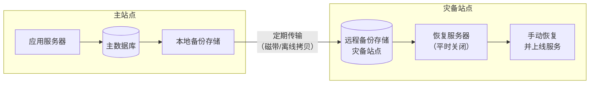

**工作流程：**

1. **日常备份**：按预定周期（每日/每周）执行全量或增量备份，将数据传输到灾备站点
2. **备份存储**：灾备站点的备份数据保存在磁带库、离线硬盘或低频存储中
3. **灾难发生**：运维团队评估故障等级，确认需要启动灾备
4. **环境准备**：在备用站点部署/启动服务器，安装操作系统和应用
5. **数据恢复**：将最近一份有效备份恢复到新环境
6. **服务验证**：人工验证数据完整性和服务可用性
7. **流量切换**：通过 DNS 切换或网络调整将流量导向灾备站点

### 2.2 关键技术细节

**备份一致性保障**：冷备最常见的数据不一致问题来自备份期间的写入。解决方案包括：

- **应用层快照**：在数据库执行 `FLUSH TABLES WITH READ LOCK` 后开始备份，备份完成后释放锁
- **存储层快照**：使用 LVM Snapshot 或 ZFS Snapshot 获取一致性快照，对应用无感知
- **备份窗口控制**：选择业务低谷期执行备份，缩小不一致窗口

```bash
# MySQL 冷备示例：使用文件系统快照实现一致性备份
# 1. 锁表获取一致性点
mysql -e "FLUSH TABLES WITH READ LOCK; SELECT SLEEP(1);"
# 2. 记录 binlog 位置
mysql -e "SHOW MASTER STATUS;" > /backup/master_status.txt
# 3. 执行 LVM 快照
lvcreate -L 10G -s -n mysql_snap /dev/vg0/mysql
# 4. 释放锁
mysql -e "UNLOCK TABLES;"
# 5. 挂载快照并复制数据
mount /dev/vg0/mysql_snap /mnt/snap
tar czf /backup/mysql_cold_$(date +%Y%m%d).tar.gz -C /mnt/snap .
umount /mnt/snap
lvremove -f /dev/vg0/mysql_snap
```

**传输安全与完整性**：
- 数据加密传输（TLS），防止中间人攻击
- 校验和验证（SHA-256），确保传输后数据完整
- 异地存储至少保留 3 份副本，分布在不同物理位置

### 2.3 RTO 推演：为什么冷备恢复这么慢

冷备的 RTO 通常在数小时到数天，瓶颈主要在以下环节：

| 恢复步骤 | 预估耗时 | 瓶颈原因 |
|----------|---------|---------|
| 故障确认与决策 | 30~60 分钟 | 需人工确认，排除误判 |
| 环境部署 | 30~120 分钟 | 安装 OS、中间件、应用 |
| 数据恢复 | 60~480 分钟 | 取决于数据量和恢复速度 |
| 配置调整 | 15~60 分钟 | DNS、网络、连接串等 |
| 功能验证 | 30~60 分钟 | 业务回归测试 |
| **总计** | **2.5~12 小时** | |

假设备份数据量 500GB，恢复速度 200MB/s（SSD），仅数据恢复就需要约 42 分钟。如果从磁带恢复（速度约 50~100MB/s），则需要 85~170 分钟。

### 2.4 适用场景

- **非关键业务**：内部管理系统、历史数据查询平台
- **合规性要求**：金融行业监管要求保留数据副本，但对恢复时间无硬性要求
- **成本敏感**：初创公司或预算有限的项目
- **数据归档**：需要长期保留但不常访问的数据

---

## 三、温备（Warm Standby）

### 3.1 架构原理

温备在冷备基础上做了关键升级：灾备站点预先部署好完整的应用环境和数据副本，灾难发生时只需启动服务并切换流量，无需从零部署。

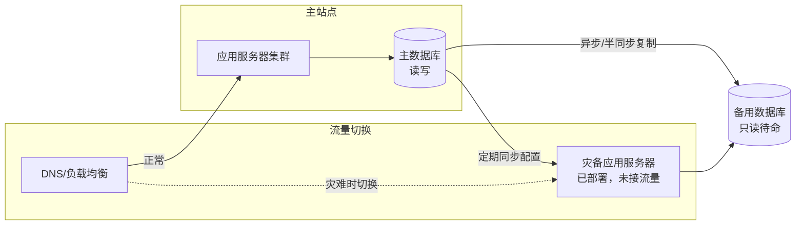

**与冷备的关键差异：**

| 对比维度 | 冷备 | 温备 |
|----------|------|------|
| 灾备站点服务器状态 | 关机/不存在 | 已开机运行，但不接流量 |
| 数据同步方式 | 定期离线备份 | 持续在线复制（异步/半同步） |
| 应用环境 | 灾难时手动部署 | 预先部署并保持更新 |
| 启动步骤 | 部署环境→恢复数据→启动 | 启动服务→切换流量 |
| RTO 范围 | 小时~天 | 分钟~小时 |

### 3.2 数据同步机制

温备通常采用异步复制或半同步复制，确保备用站点的数据"接近实时"但不要求强一致：

**异步复制（Asynchronous Replication）**：

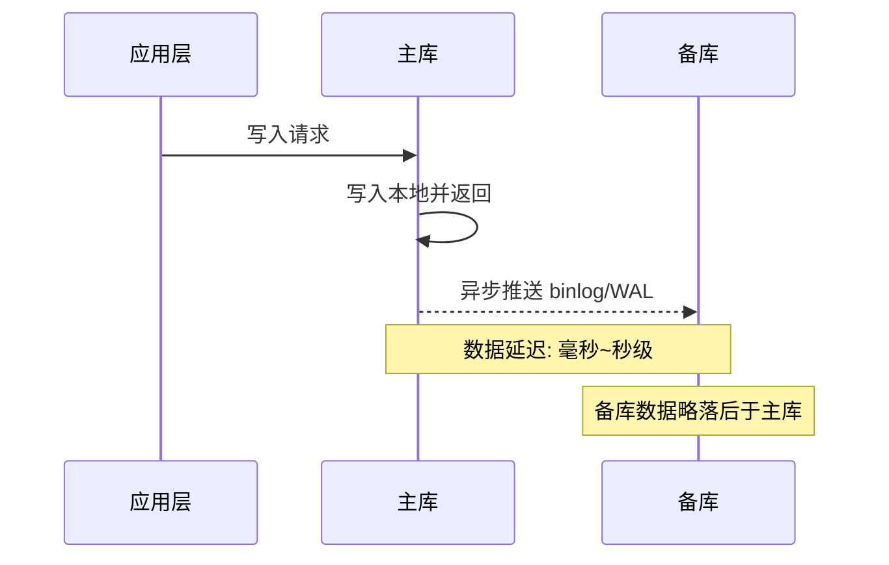

- 主库写入后立即返回，不等待备库确认
- 数据延迟取决于网络带宽和复制延迟，通常在毫秒到秒级
- RPO：通常在秒级到分钟级（取决于复制延迟和网络状况）

**半同步复制（Semi-synchronous Replication）**：

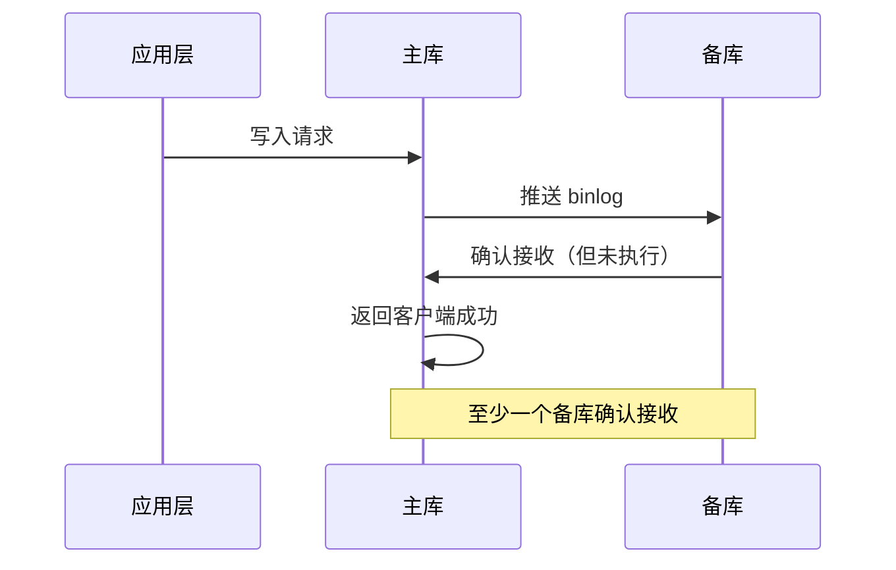

- 主库写入后等待至少一个备库确认接收日志，才返回客户端
- 牺牲部分写入延迟，换取更低的 RPO
- RPO：通常在毫秒级

### 3.3 服务环境预热

温备站点不是"有数据就行"，还需要保持应用环境的可用性：

- **应用部署同步**：主站点的应用版本更新后，自动同步到备站点，保持一致
- **配置管理**：使用 Ansible、Puppet 等工具同步配置文件
- **依赖服务**：确保备站点能访问所需的外部服务（缓存、消息队列、第三方 API）
- **健康检查**：定期对备站点进行健康检查，验证其处于可就绪状态
- **定期演练**：每月/每季度执行一次灾备切换演练，验证恢复流程

```bash
# 温备站点健康检查脚本示例
#!/bin/bash
WARM_SITE="warm-dr.internal.example.com"
CHECKS_PASSED=0
CHECKS_TOTAL=4

# 1. 检查数据库复制状态
echo "检查数据库复制状态..."
REPL_DELAY=$(mysql -h $WARM_SITE -e "SHOW SLAVE STATUS\G" | grep Seconds_Behind_Master | awk '{print $2}')
if [ "$REPL_DELAY" -lt 60 ]; then
    echo "  ✓ 复制延迟: ${REPL_DELAY}s（正常）"
    CHECKS_PASSED=$((CHECKS_PASSED+1))
else
    echo "  ✗ 复制延迟: ${REPL_DELAY}s（超过 60s 阈值）"
fi

# 2. 检查应用服务状态
echo "检查应用服务状态..."
APP_STATUS=$(curl -s -o /dev/null -w "%{http_code}" http://$WARM_SITE:8080/health)
if [ "$APP_STATUS" = "200" ]; then
    echo "  ✓ 应用服务正常（HTTP 200）"
    CHECKS_PASSED=$((CHECKS_PASSED+1))
else
    echo "  ✗ 应用服务异常（HTTP $APP_STATUS）"
fi

# 3. 检查磁盘空间
echo "检查磁盘空间..."
DISK_USAGE=$(df -h /data | tail -1 | awk '{print $5}' | tr -d '%')
if [ "$DISK_USAGE" -lt 80 ]; then
    echo "  ✓ 磁盘使用率: ${DISK_USAGE}%（正常）"
    CHECKS_PASSED=$((CHECKS_PASSED+1))
else
    echo "  ✗ 磁盘使用率: ${DISK_USAGE}%（超过 80% 阈值）"
fi

# 4. 检查网络连通性
echo "检查网络连通性..."
if ping -c 3 -W 2 $WARM_SITE > /dev/null 2>&amp;1; then
    echo "  ✓ 网络连通正常"
    CHECKS_PASSED=$((CHECKS_PASSED+1))
else
    echo "  ✗ 网络连通失败"
fi

echo ""
echo "健康检查结果: $CHECKS_PASSED / $CHECKS_TOTAL 通过"
[ $CHECKS_PASSED -eq $CHECKS_TOTAL ] &amp;&amp; exit 0 || exit 1
```

### 3.4 切换流程

温备切换比冷备快得多，但仍需要一定的人工干预：

1. **故障确认**（5~10 分钟）：监控告警触发，SRE 确认主站点不可恢复
2. **数据追赶**（1~5 分钟）：等待备库应用完所有延迟的复制日志
3. **应用启动**（1~3 分钟）：如果备站应用未运行，启动应用进程
4. **数据校验**（2~5 分钟）：检查数据一致性，验证关键数据完整性
5. **DNS 切换**（5~15 分钟）：修改 DNS 记录指向灾备站点，等待 TTL 过期
6. **流量验证**（5~10 分钟）：确认流量已切换到灾备站点，服务正常

**DNS 切换的坑点**：DNS TTL 生效需要时间，且各地 DNS 缓存刷新不一致。解决方案：
- 将 DNS TTL 提前降至 60 秒（日常运营期间）
- 使用 GSLB（Global Server Load Balancing）代替纯 DNS 切换
- 配合 BGP Anycast 实现更快的流量切换

### 3.5 适用场景

- **中等重要性业务**：企业内部核心系统、SaaS 服务
- **有明确 RTO 要求**：要求在 1~4 小时内恢复，但可接受一定中断
- **成本受限但需要保护**：无法承担多活架构的成本，但冷备无法满足恢复要求

---

## 四、热备（Hot Standby）

### 4.1 架构原理

热备将灾备能力提升到自动化级别：备用站点完全就绪，故障发生后系统自动检测并完成切换，无需人工干预（或仅需最少的人工确认）。

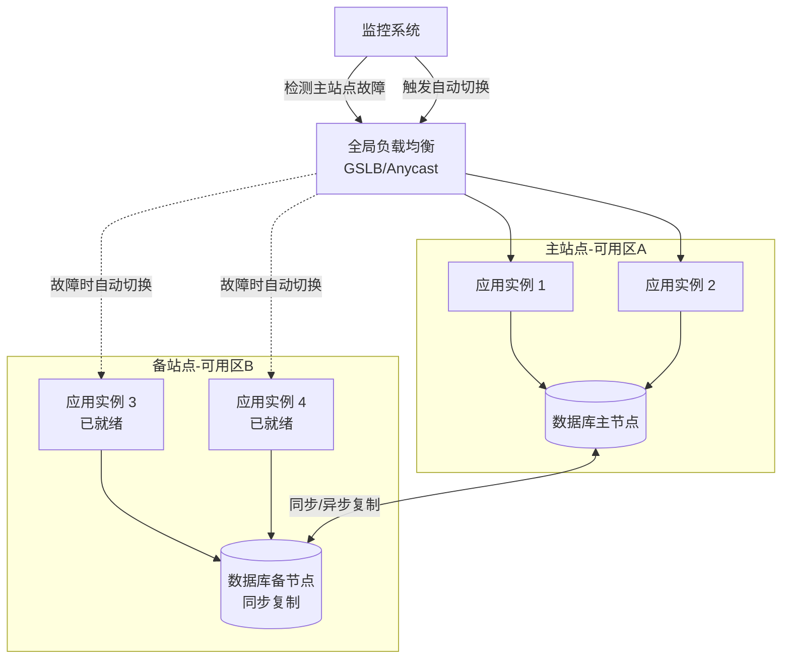

**热备与温备的核心区别：**

| 对比维度 | 温备 | 热备 |
|----------|------|------|
| 备用系统接流量 | 不接 | 平时不接，故障时自动接 |
| 数据复制方式 | 异步为主 | 同步或准同步 |
| 切换方式 | 半自动（需人工确认） | 全自动（或一键触发） |
| 备用系统负载 | 空闲 | 可承接只读流量分担压力 |
| 故障检测 | 人工+监控 | 自动化检测+自动决策 |
| RTO | 分钟~小时 | 秒~分钟 |

### 4.2 自动故障切换机制

热备的核心能力在于自动检测和自动切换：

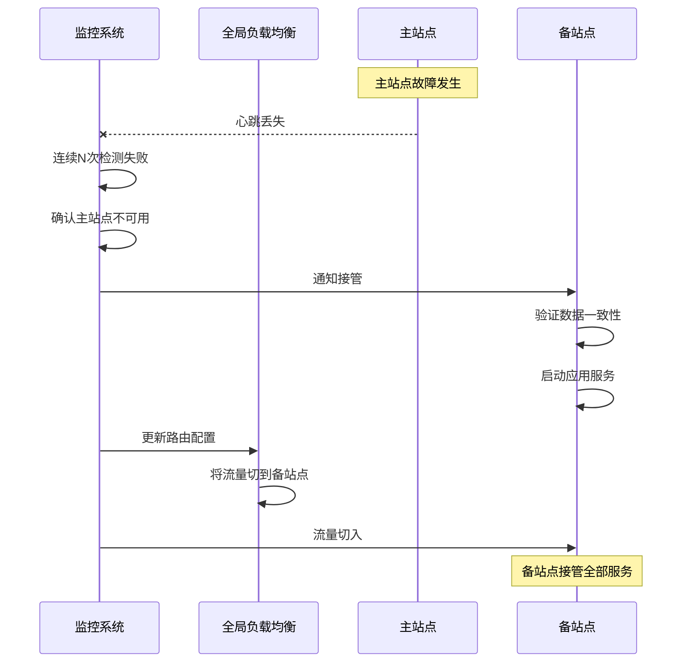

**关键设计点：**

1. **故障判定策略**：采用多重验证避免误切换
   - 第一层：心跳检测（秒级），判定疑似故障
   - 第二层：多点探测（从不同网络路径探测），确认不可达
   - 第三层：业务层健康检查（HTTP 探针），确认服务不可用
   - 至少两层判定为故障后才触发切换

2. **数据一致性窗口**：
   - 同步复制：RPO ≈ 0，但会牺牲写入延迟（额外 1~5ms）
   - 半同步复制：至少一个备库确认，RPO ≈ 毫秒级
   - 异步复制 + 最终一致性：RPO 取决于复制延迟

3. **Split-Brain 防护**：
   - STONITH（Shoot The Other Node In The Head）：新主通过 IPMI/iLO 强制关闭旧主
   - 仲裁机制（Quorum）：至少多数节点确认才允许切换
   - Fencing：通过分布式锁或租约限制旧主的写入能力

### 4.3 读写分离优化

热备站点不是完全浪费的——可以利用备用站点分担只读流量，提高整体系统性能：

正常模式：
  写请求 ──→ 主站点（读写）
  读请求 ──→ 主站点（读写）+ 备站点（只读）

故障模式：
  全部请求 ──→ 备站点（读写）

```python
class ReadWriteRouter:
    """读写分离路由：正常时分散读流量，故障时全部切到备站点"""
    
    def __init__(self, primary_host, standby_host):
        self.primary = primary_host
        self.standby = standby_host
        self.primary_healthy = True
        self.standby_healthy = True
    
    def route(self, query_type, query):
        """根据查询类型路由到合适的节点"""
        if not self.primary_healthy:
            # 主站点故障，全部切到备站点
            return self._execute(self.standby, query)
        
        if query_type == "WRITE":
            # 写请求只能走主站点
            return self._execute(self.primary, query)
        
        if query_type == "READ":
            # 读请求在主备之间负载均衡
            # 优先走备站点，减轻主站点压力
            if self.standby_healthy:
                target = self._pick_read_node()
                return self._execute(target, query)
            else:
                return self._execute(self.primary, query)
    
    def _pick_read_node(self):
        """基于权重的读负载均衡"""
        import random
        weights = {
            'primary': 30,    # 主站点承担 30% 读流量
            'standby': 70     # 备站点承担 70% 读流量
        }
        total = sum(weights.values())
        r = random.randint(1, total)
        cumulative = 0
        for node, weight in weights.items():
            cumulative += weight
            if r <= cumulative:
                return self.primary if node == 'primary' else self.standby
    
    def _execute(self, host, query):
        """执行查询（实际实现中应连接数据库）"""
        return f"Executing on {host}: {query}"
```

### 4.4 典型技术栈

| 组件 | 方案一 | 方案二 | 方案三 |
|------|--------|--------|--------|
| 数据库热备 | MySQL InnoDB Group Replication | PostgreSQL Streaming Replication | Redis Sentinel + Replication |
| 应用层切换 | HAProxy + Keepalived | AWS ELB + Auto Scaling | Consul Service Mesh |
| 全局路由 | Cloudflare Load Balancer | AWS Route 53 + Health Check | 自建 GSLB（F5/BIG-IP） |
| 监控告警 | Prometheus + AlertManager | Datadog | Zabbix |

### 4.5 切换时间推演

热备的 RTO 通常在 30 秒到 3 分钟之间：

| 步骤 | 耗时 | 说明 |
|------|------|------|
| 故障检测 | 5~15 秒 | 连续 3 次心跳失败 + 多点探测确认 |
| 数据追赶 | 0~5 秒 | 同步复制无延迟；异步复制需等待日志应用 |
| 服务启动 | 0~10 秒 | 已部署的服务通常已在运行或秒级启动 |
| 路由切换 | 5~30 秒 | GSLB 健康检查周期 + DNS 传播 |
| **总计** | **10~60 秒** | |

### 4.6 适用场景

- **核心在线业务**：电商交易系统、支付平台、在线游戏
- **SLA 要求 99.99%**：年停机时间不超过 52 分钟
- **自动恢复需求**：无法承受人工介入的延迟
- **有预算支撑**：需要 2~3 倍的基础设施成本

---

## 五、多活架构（Active-Active / Multi-Active）

### 5.1 架构原理

多活是灾备架构的最高形态：多个站点同时提供服务，任何单个站点故障不影响整体业务。它既是灾备方案，也是性能扩展方案。

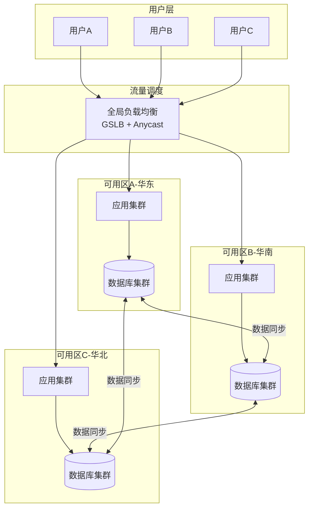

**多活 vs 热备的本质区别：**

| 维度 | 热备 | 多活 |
|------|------|------|
| 备用站点是否接流量 | 否（故障时才接） | 是（始终接流量） |
| 数据写入方式 | 单点写入 | 多点写入 |
| 数据一致性 | 最终一致（单主） | 需要解决多写冲突 |
| 扩展能力 | 只能故障切换 | 同时扩展读写能力 |
| 架构复杂度 | 高 | 极高 |
| RTO | 秒~分钟 | 近零（无需切换） |

### 5.2 多活架构的三大核心难题

多活看似完美，但实现难度远超其他灾备方案。核心难点在于三个问题：

#### 难题一：数据一致性——多点写入如何保证不冲突

当多个站点同时写入同一条数据时，如何保证一致性？这是多活架构最核心的技术挑战。

**方案一：按用户分片（Shard by User）**

将用户按 ID 哈希或地域分配到固定站点，每个用户的读写都在同一站点完成。

用户分区策略：
  华东用户（ID % 3 == 0）──→ 华东站点（主写 + 读）
  华南用户（ID % 3 == 1）──→ 华南站点（主写 + 读）
  华北用户（ID % 3 == 2）──→ 华北站点（主写 + 读）

跨区读场景：
  华东用户访问华南站点 → 需要路由到华东站点
  或接受最终一致的只读副本

这种方案的优点是避免了多写冲突，缺点是跨区访问时延迟较高，且用户分区不均匀时会出现热点。

**方案二：基于 CRDT 的无冲突复制**

CRDT（Conflict-free Replicated Data Type，无冲突复制数据类型）通过数学性质保证多方并发修改后能自动合并，无需协调。

```python
class GCounter:
    """Grow-Only Counter CRDT：只能递增的计数器"""
    
    def __init__(self, node_id, num_nodes):
        self.node_id = node_id
        self.counts = [0] * num_nodes  # 每个节点维护自己的计数
    
    def increment(self):
        """只在本节点的槽位上递增"""
        self.counts[self.node_id] += 1
    
    def value(self):
        """所有节点计数之和即为全局值"""
        return sum(self.counts)
    
    def merge(self, other):
        """合并两个 GCounter：取每个槽位的最大值"""
        for i in range(len(self.counts)):
            self.counts[i] = max(self.counts[i], other.counts[i])

class PNCounter:
    """Positive-Negative Counter CRDT：支持增减的计数器"""
    
    def __init__(self, node_id, num_nodes):
        self.positive = GCounter(node_id, num_nodes)  # 正向计数
        self.negative = GCounter(node_id, num_nodes)  # 负向计数
    
    def increment(self):
        self.positive.increment()
    
    def decrement(self):
        self.negative.increment()
    
    def value(self):
        return self.positive.value() - self.negative.value()
    
    def merge(self, other):
        self.positive.merge(other.positive)
        self.negative.merge(other.negative)

# 使用示例：多站点投票计数
class MultiSiteVoteCounter:
    """多站点投票系统，使用 PNCounter 实现无冲突"""
    
    def __init__(self):
        self.sites = {}  # site_id -> PNCounter
    
    def vote(self, site_id, proposal_id, vote_delta):
        """某个站点的投票变更"""
        if proposal_id not in self.counters:
            self.counters[proposal_id] = {}
        if site_id not in self.counters[proposal_id]:
            self.counters[proposal_id][site_id] = PNCounter(site_id, 3)
        
        counter = self.counters[proposal_id][site_id]
        if vote_delta > 0:
            for _ in range(vote_delta):
                counter.increment()
        else:
            for _ in range(abs(vote_delta)):
                counter.decrement()
    
    def get_result(self, proposal_id):
        """获取某个提案的最终投票结果"""
        total = 0
        for site_id, counter in self.counters.get(proposal_id, {}).items():
            total += counter.value()
        return total
```

**方案三：最终一致性 + 冲突解决**

对于无法用 CRDT 建模的复杂数据（如订单状态），采用"最后写入胜出"（Last Writer Wins, LWW）或业务层冲突解决。

```python
import time

class LWWRegister:
    """Last-Writer-Wins Register：最后写入胜出的寄存器"""
    
    def __init__(self):
        self.value = None
        self.timestamp = 0
        self.site_id = None
    
    def write(self, value, timestamp, site_id):
        """写入：只有时间戳更新时才覆盖"""
        if timestamp > self.timestamp:
            self.value = value
            self.timestamp = timestamp
            self.site_id = site_id
            return True  # 写入成功
        return False  # 冲突，被更晚的写入覆盖
    
    def merge(self, other):
        """合并两个 LWWRegister"""
        if other.timestamp > self.timestamp:
            self.value = other.value
            self.timestamp = other.timestamp
            self.site_id = other.site_id

# 时钟同步是 LWW 正确性的前提
# 多站点必须使用 NTP 或 TrueTime（Google Spanner）
# 确保时钟偏移在可接受范围内
```

#### 难题二：流量路由——如何让正确的用户到正确的站点

用户请求需要被路由到持有其数据的站点：

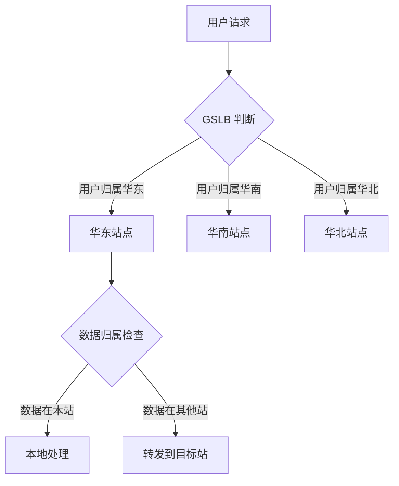

**路由策略的实现：**

```python
class GlobalTrafficRouter:
    """全局流量路由器"""
    
    def __init__(self):
        self.user_to_site = {}  # user_id -> site_id
        self.site_health = {}   # site_id -> bool
        self.site_capacity = {} # site_id -> weight
    
    def register_user(self, user_id, site_id):
        """注册用户归属"""
        self.user_to_site[user_id] = site_id
    
    def route(self, user_id, request_type):
        """路由用户请求到正确站点"""
        home_site = self.user_to_site.get(user_id)
        
        # 1. 优先路由到归属站点
        if home_site and self.site_health.get(home_site, False):
            return home_site
        
        # 2. 归属站点不健康，路由到最近的健康站点
        #    并通知目标站点进行跨站数据访问
        if home_site:
            return self._find_nearest_healthy_site(user_id, exclude=home_site)
        
        # 3. 未注册用户，按负载均衡分配
        return self._load_balance()
    
    def _find_nearest_healthy_site(self, user_id, exclude=None):
        """查找最近的健康站点（基于用户 IP 地理位置）"""
        healthy_sites = [
            sid for sid, healthy in self.site_health.items()
            if healthy and sid != exclude
        ]
        # 按延迟排序，选择最近的站点
        return sorted(healthy_sites, key=lambda s: self._get_latency(s))[0]
    
    def _load_balance(self):
        """按权重负载均衡"""
        import random
        healthy = {s: w for s, w in self.site_capacity.items()
                   if self.site_health.get(s, False)}
        total = sum(healthy.values())
        r = random.randint(1, total)
        cumulative = 0
        for site, weight in healthy.items():
            cumulative += weight
            if r <= cumulative:
                return site
```

#### 难题三：一致性级别——不是所有数据都需要强一致

多活架构中，不同业务对一致性的要求差异巨大：

| 业务类型 | 一致性要求 | 技术方案 | 示例 |
|----------|-----------|---------|------|
| 用户余额 | 强一致 | 分布式事务 / 分片独占写 | 支付宝余额 |
| 购物车 | 最终一致 | CRDT / Merge-on-Read | 淘宝购物车 |
| 商品浏览 | 可接受陈旧 | 只读副本 + 缓存 | 商品详情页 |
| 点赞计数 | 可接受近似 | Local Count + 异步聚合 | 视频点赞数 |
| 消息通知 | 最终一致 | 消息队列 + 幂等消费 | 站内信 |

### 5.3 典型多活架构模式

#### 模式一：单元化（Unit）多活

将系统按用户维度划分为多个"单元"，每个单元是完全独立的微服务集群，拥有自己的完整数据副本。

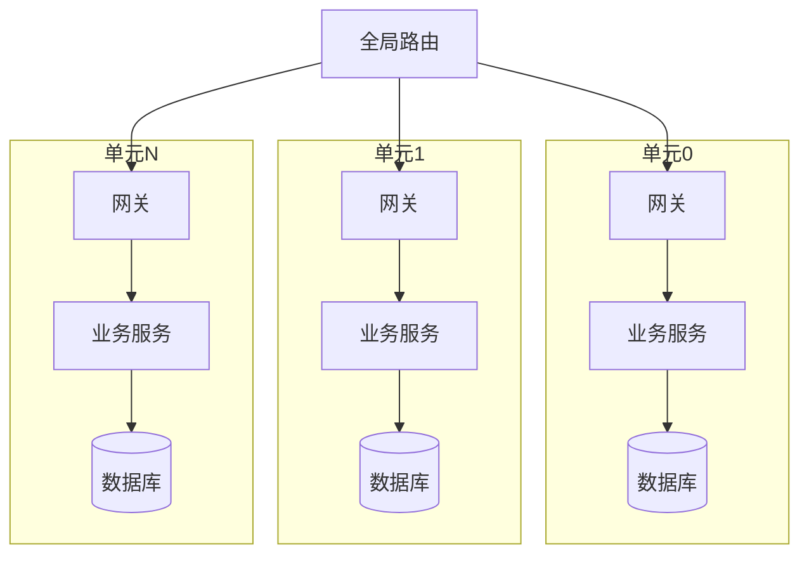

**优点**：每个单元内部一致性容易保证，故障隔离彻底
**缺点**：跨单元业务（如转账）需要额外的一致性保障

#### 模式二：三地五中心

这是阿里巴巴的标志性架构，五个数据中心分布在三个城市：

| 数据中心 | 所在城市 | 角色 |
|----------|---------|------|
| 同城中心 1 | 杭州 | 主写 + 读 |
| 同城中心 2 | 杭州 | 主写 + 读（同城双活） |
| 同城中心 3 | 杭州 | 主写 + 读（同城三活） |
| 异地中心 1 | 上海 | 异地灾备 / 异地读 |
| 异地中心 2 | 深圳 | 异地灾备 / 异地读 |

核心思路：
- **同城市内部**：网络延迟 < 3ms，可以做同步复制实现强一致
- **跨城市**：网络延迟 10~30ms，使用异步复制 + 最终一致性
- 三个同城中心分摊写流量，两个异地中心分摊读流量并提供灾备能力

#### 模式三：云原生多活

利用云服务商的多可用区（Multi-AZ）或跨区域（Multi-Region）能力：

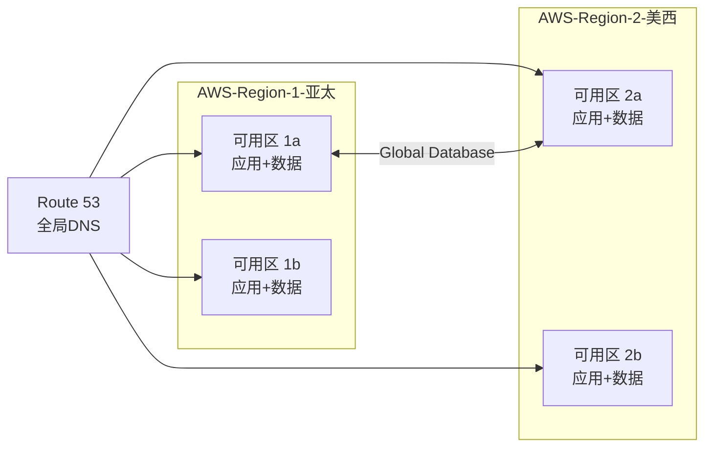

云原生方案的优势是降低了基础设施的运维负担，但核心的数据一致性问题仍需业务层解决。

### 5.4 多活架构的成本

| 成本项 | 占比 | 说明 |
|--------|------|------|
| 服务器/计算资源 | 30~40% | 每个站点需要完整的计算资源 |
| 数据存储与复制 | 20~30% | 多副本存储 + 复制带宽 |
| 网络带宽 | 15~20% | 跨站点数据同步 + 用户流量 |
| 运维团队 | 15~20% | 多站点运维需要更多人力 |
| 监控与工具 | 5~10% | 全局监控、部署、配置管理 |

**成本 vs 收益决策框架**：

是否需要多活架构？回答以下问题：

Q1: 业务年收入是否超过 1 亿？
    → 是：可能需要
    → 否：热备通常够用

Q2: 每分钟宕机造成的损失是否超过 10 万？
    → 是：强烈建议多活
    → 否：考虑热备

Q3: 能否接受 5 分钟以上的业务中断？
    → 是：热备即可
    → 否：需要多活

Q4: 是否有足够的运维团队支撑多站点运营？
    → 是：可以实施
    → 否：先提升运维能力

---

## 六、灾备架构选型决策指南

### 6.1 选型矩阵

| 场景特征 | 推荐方案 | 理由 |
|----------|---------|------|
| 初创公司，预算有限 | 冷备 | 成本最低，满足基本数据保护 |
| 成长期 SaaS 服务 | 温备 | 兼顾成本与恢复能力 |
| 核心交易系统 | 热备 | 自动切换满足高可用要求 |
| 全球化互联网产品 | 多活 | 全球就近访问 + 极致可用性 |
| 金融核心系统 | 热备 + 异地灾备 | 强监管要求 + 合规需求 |
| 医疗/政务系统 | 热备 | 数据敏感 + 服务连续性 |
| 游戏/社交 | 温备~热备 | 业务中断影响有限但需及时恢复 |
| 电商平台 | 多活（大促期间） | 大促流量峰值需要多站点分担 |

### 6.2 演进路径

大多数系统的灾备架构是从冷备逐步演进到多活的，而非一步到位：

阶段1-冷备：
  目标：数据不丢失
  投入：最小
  适用：系统上线初期

    ↓ 业务增长，需要更快恢复

阶段2-温备：
  目标：小时级恢复
  投入：中等
  适用：业务有一定规模

    ↓ 业务关键性提升，需要自动恢复

阶段3-热备：
  目标：分钟级自动恢复
  投入：较高
  适用：核心业务系统

    ↓ 全球化扩张，需要就近服务

阶段4-多活：
  目标：零中断
  投入：极高
  适用：全球化互联网产品

### 6.3 混合部署模式

实际生产中，不同业务系统可能采用不同的灾备等级：

| 业务系统 | 灾备等级 | 理由 |
|----------|---------|------|
| 用户注册/登录 | 多活 | 入口系统，不能中断 |
| 支付/交易 | 热备 + 异地灾备 | 强一致性要求 |
| 商品详情 | 温备 | 陈旧数据可接受 |
| 后台管理 | 冷备 | 非核心，短时中断可接受 |
| 数据分析 | 温备 | 数据恢复可接受延迟 |
| 搜索服务 | 多活 | 用户体验核心链路 |

---

## 七、灾备演练：纸上谈兵不如实战

### 7.1 演练的重要性

Netflix 的 Chaos Engineering 理念：**"如果你从未测试过故障恢复，你就没有真正的灾备能力。"**

未经验证的灾备方案就像没练习过消防演习的写字楼——理论上每个人都应该知道怎么跑，但真着火了大概率是一团乱。

### 7.2 演练类型与频率

| 演练类型 | 频率 | 参与范围 | 目标 |
|----------|------|---------|------|
| 桌面推演 | 每月 | SRE + 开发 | 验证应急预案的合理性 |
| 单组件故障注入 | 每周 | SRE | 验证单点故障的自动恢复 |
| 全链路切换演练 | 每季度 | SRE + 业务方 | 验证完整灾备切换流程 |
| 真实故障演练（Chaos Monkey） | 持续 | 全员 | 在生产环境验证系统韧性 |
| 跨地域灾备演练 | 每半年 | 全员 | 验证异地灾备的完整恢复能力 |

### 7.3 演练执行清单

灾备切换演练清单

1. 演练前准备（T-7天）
   □ 确认演练范围和影响
   □ 通知相关方（业务、客服、管理层）
   □ 准备回退方案
   □ 确认监控告警正常

2. 演练前检查（T-1小时）
   □ 确认备份数据最新且可恢复
   □ 确认灾备站点环境就绪
   □ 确认所有参与者在线
   □ 开始记录演练日志

3. 演练执行
   □ 模拟故障（停止主站点服务）
   □ 记录故障检测时间
   □ 执行灾备切换
   □ 记录切换完成时间
   □ 验证服务可用性
   □ 验证数据一致性

4. 演练恢复
   □ 将流量切回主站点
   □ 验证主站点恢复正常
   □ 检查数据是否完整
   □ 确认所有系统正常

5. 演练复盘（T+3天内）
   □ 整理演练时间线
   □ 识别问题和瓶颈
   □ 更新应急预案
   □ 产出改进计划

### 7.4 Netflix Chaos Engineering 工具集

| 工具 | 功能 | 适用场景 |
|------|------|---------|
| Chaos Monkey | 随机终止生产环境实例 | 验证应用的自愈能力 |
| Latency Monkey | 注入网络延迟 | 验证超时和重试机制 |
| Chaos Kong | 模拟整个 AWS Region 故障 | 验证跨区域灾备能力 |
| FIT (Fault Injection Testing) | 精细化故障注入 | 特定故障场景测试 |
| tc (Traffic Control) | Linux 内核级网络控制 | 网络丢包、延迟、分区模拟 |

```bash
# 使用 tc 模拟网络延迟（验证灾备切换的超时配置）
# 模拟主站点到备站点的网络延迟从 5ms 增加到 500ms
tc qdisc add dev eth0 root netem delay 500ms 50ms 25%

# 模拟 10% 的丢包率（验证复制机制的容错能力）
tc qdisc add dev eth0 root netem loss 10%

# 模拟网络分区（切断主备之间的网络）
tc qdisc add dev eth0 root netem loss 100%
```

---

## 八、常见误区与纠正

### 误区一："买了灾备方案就万事大吉"

**纠正**：灾备方案的价值 = 方案设计 × 数据同步质量 × 演练频率。一份从未演练过的灾备方案，其有效 RTO 往往是设计值的 3~10 倍。很多企业在真正需要灾备切换时才发现：复制早已中断、配置已过时、文档已失效。

### 误区二："RPO = 0 意味着零风险"

**纠正**：RPO = 0 只意味着数据不丢失，并不意味着零停机时间。即使数据完好，应用恢复、DNS 切换、流量回灌仍需要时间。真正的"零影响"需要多活架构 + 自动流量调度。

### 误区三："灾备站点越远越安全"

**纠正**：距离确实能降低区域级灾难的风险，但也增加了网络延迟和数据同步成本。实际设计中通常采用"同城 + 异地"的两级灾备：同城用于快速切换（低延迟），异地用于防区域灾难（高安全）。

### 误区四："主备切换越快越好"

**纠正**：切换速度必须与数据一致性平衡。切换过快可能在数据尚未完全同步时就执行了切换，导致数据丢失。正确的做法是根据业务能容忍的 RPO 来确定切换策略，而非一味追求速度。

### 误区五："多活 = 完全对等"

**纠正**：大多数"多活"架构实际上是"多写 + 主从分片"，并非真正的完全对等。每个数据分片仍有一个主写入点，只是不同分片的主分布在不同站点。完全对等的多活需要 CRDT 或类似技术，复杂度和成本极高。

---

## 九、总结

灾备架构的选择本质上是成本、复杂度和恢复能力的三角权衡：

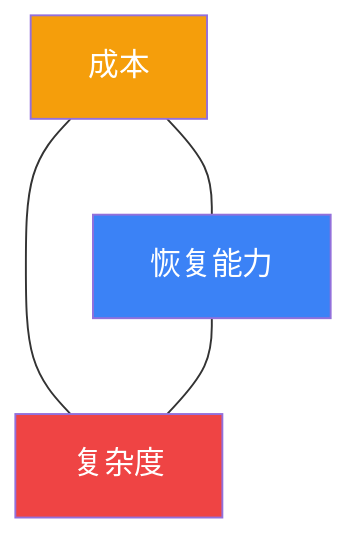

- **冷备**：低成本、低复杂度、低恢复能力
- **温备**：中成本、中复杂度、中恢复能力
- **热备**：高成本、高复杂度、高恢复能力
- **多活**：极高成本、极高复杂度、极高恢复能力

没有放之四海而皆准的最优方案，只有与业务特征、团队能力和预算水平最匹配的方案。核心原则是：

1. **先做好单集群的高可用**，再考虑跨站点的灾备
2. **备份不等于灾备**，定期备份只是灾备的起点
3. **演练比设计更重要**，未经验证的方案等于没有方案
4. **渐进式演进**，根据业务发展逐步提升灾备等级
5. **混合部署**，不同重要性的业务采用不同等级的灾备方案
