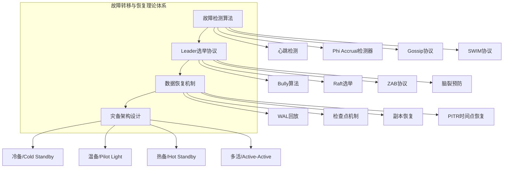
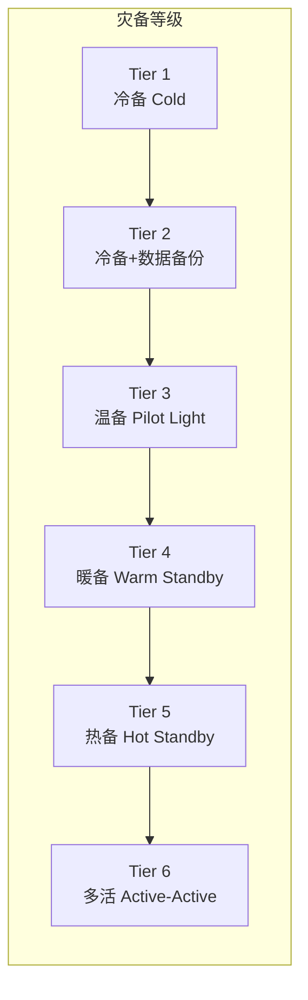
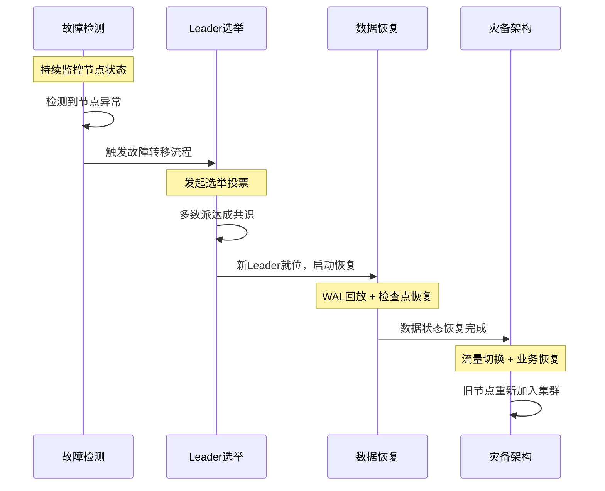

# 理论基础：故障转移与恢复的核心原理

## 本节概述

故障转移与恢复是分布式系统可靠性的基石。一个设计精良的系统，其价值不在于"从不出故障"——因为在大规模分布式环境中，故障是常态而非异常——而在于**能够快速检测故障、安全地完成权力交接、可靠地恢复数据状态**。本节从理论层面系统讲解支撑故障转移与恢复的四大核心原理：故障检测算法、Leader选举协议、数据恢复机制和灾备架构设计。

这四个主题构成了一个完整的因果链：**检测到故障 → 选出新领导 → 恢复数据状态 → 保障业务连续性**。理解它们之间的逻辑关系，比孤立地学习每个主题更为重要。

---

## 知识体系总览

---

## 一、故障检测算法：分布式系统的"眼睛"

### 为什么故障检测是第一环

故障检测是整个故障转移流程的起点。检测得**太慢**，系统在故障期间持续提供错误服务或完全不可用；检测得**太快**，可能将正常的网络抖动误判为节点故障，触发不必要的转移流程。因此，故障检测的核心挑战在于**在检测速度和准确性之间取得平衡**——这就是分布式系统理论中经典的"故障检测器"问题。

Lamport在1978年提出的故障检测器模型为这一领域奠定了理论基础。他将故障检测器分为两个维度：

| 维度 | 含义 | 说明 |
|------|------|------|
| 完备性（Completeness） | 故障节点最终一定会被怀疑 | 强制要求：不满足则检测器无效 |
| 准确性（Accuracy） | 正常节点不会被误判为故障 | 理想要求：实际上无法完全满足 |

在异步网络模型中，**同时满足完美完备性和完美准确性的故障检测器是不存在的**。这一理论结论深刻影响了所有实际的故障检测算法设计——它们都是在完备性和准确性之间做权衡。

### 四种主流检测算法的定位

本节涵盖的四种算法，按复杂度和适用场景递进排列：

| 算法 | 核心思想 | 优点 | 缺点 | 典型应用 |
|------|----------|------|------|----------|
| 心跳检测 | 固定超时判定 | 实现简单、延迟可预测 | 阈值固定，不适应网络波动 | etcd、Consul |
| Phi Accrual | 基于统计分布的怀疑度 | 自适应、阈值可调 | 需要足够的历史样本 | Akka、Cassandra |
| Gossip协议 | 去中心化随机传播 | 无单点、扩展性好 | 最终一致、传播有延迟 | AWS EC2、Cassandra |
| SWIM协议 | 分离检测与传播、间接探测 | 可扩展、故障检测更快 | 实现复杂度较高 | Memberlist(HashiCorp) |

**选型建议**：
- 小规模集群（<10节点）、网络环境稳定 → 心跳检测即可
- 中等规模、网络延迟波动大 → Phi Accrual更合适
- 大规模集群（>100节点）、去中心化架构 → Gossip或SWIM
- 对检测延迟有严格要求 → SWIM（间接Ping机制更快）

### 从心跳到SWIM的演进逻辑

故障检测算法的演进遵循一条清晰的脉络——解决前一代算法的核心缺陷：

心跳检测（固定阈值）
    │
    │ 缺陷：无法适应动态网络延迟
    ▼
Phi Accrual（动态阈值）
    │
    │ 缺陷：仍是点对点检测，中心化扩展差
    ▼
Gossip（去中心化传播）
    │
    │ 缺陷：传播延迟高、消息开销随节点数增长
    ▼
SWIM（分离检测与传播 + Piggyback）

深入学习每种算法的实现细节，请参阅本节后续章节。

---

## 二、Leader选举协议：分布式系统的"大脑"

### Leader选举为什么困难

在主从架构中，Leader负责协调写入、排序日志、维护一致性。当Leader故障后，系统必须快速选出新Leader。这个看似简单的问题，实际上面临着分布式系统中最核心的挑战：

**在异步网络中，节点无法区分"节点真的很慢"和"节点已经死了"。** 这意味着一个已经"死去"的旧Leader可能在网络恢复后突然出现，与新Leader同时处理请求——这就是臭名昭著的**脑裂（Split-Brain）**问题。

Leader选举算法必须同时保证以下性质：

┌──────────────────────────────────────────────────┐
│          Leader选举的五大核心保证                  │
├──────────────────────────────────────────────────┤
│ 1. 安全性：任何时刻最多只有一个Leader             │
│ 2. 活性：故障后一定能选出新Leader                 │
│ 3. 日志完整性：新Leader必须拥有全部已提交数据      │
│ 4. 时效性：选举过程应尽快完成（减少服务中断）      │
│ 5. 容错性：选举本身必须能容忍部分节点故障          │
└──────────────────────────────────────────────────┘

### 从Bully到Raft：选举算法的进化

| 算法 | 年份 | 核心规则 | 消息复杂度 | 日志保证 | 生产可用性 |
|------|------|----------|------------|----------|------------|
| Bully | 1982 | ID最大的节点当选 | O(n²) | 无 | ❌ 教学用 |
| Ring | 1986 | 令牌环传递 | O(n) | 无 | ❌ 嵌入式场景 |
| Paxos变体 | 1998 | 多数派共识 | O(n) | 有 | ✅ Google Chubby |
| Raft | 2014 | 任期+多数派投票 | O(n) | 有 | ✅ etcd/TiKV/CockroachDB |
| ZAB | 2010 | 事务ID+epoch | O(n) | 有 | ✅ ZooKeeper |

**Raft已成为事实标准**：Diego Ongaro在2014年提出的Raft协议，因其可理解性和完整的工程设计，被etcd、TiKV、CockroachDB、Consul等主流系统采用。Raft将Paxos的共识过程拆解为三个独立的子问题——Leader选举、日志复制和安全性——使得每个部分都可以独立理解和实现。

### 脑裂预防：选举之后的安全保障

选举选出新Leader只是第一步。如何防止旧Leader在网络恢复后制造混乱，需要额外的机制：

- **STONITH（Shoot The Other Node In The Head）**：通过IPMI/iLO等硬件接口强制关闭旧节点，暴力但有效
- **仲裁机制（Quorum）**：集群节点数设为奇数，只有多数派分区能工作
- **租约机制（Lease）**：Leader需要定期续约，超时自动失去身份
- **Fencing Token**：每次选举产生递增的令牌，旧操作携带旧令牌会被拒绝

这些机制的组合使用，构成了分布式系统"安全故障转移"的完整防线。

深入学习选举算法的实现和调优，请参阅本节后续章节。

---

## 三、数据恢复机制：分布式系统的"双手"

### 恢复的本质问题

故障检测回答了"哪里出了问题"，Leader选举解决了"谁来接手"，而数据恢复要回答的是最难的问题：**如何确保恢复后的数据状态是正确的、一致的、完整的**。

数据恢复面临的核心矛盾是**性能与安全性的权衡**：
- 写入时每一步都做持久化（fsync）→ 数据最安全，但性能最差
- 写入时只写内存 → 性能最好，但进程崩溃就丢数据
- 实际系统在两者之间寻找平衡点

### 两大核心恢复机制

#### WAL（Write-Ahead Log）：先写日志后改数据

WAL是几乎所有现代数据库的恢复基石。其原则极其简洁：**在修改数据之前，必须先将修改操作记录到日志中**。

WAL恢复分为两个阶段：
1. **Analysis（分析）**：扫描日志，确定哪些事务需要Redo、哪些需要Undo
2. **Redo（重做）**：按LSN顺序重新执行已提交事务的操作（保证持久性）
3. **Undo（撤销）**：按LSN倒序撤销未提交事务的操作（保证原子性）

WAL恢复流程：
                                              
  故障发生 ──► 分析日志 ──► Redo已提交 ──► Undo未提交 ──► 恢复完成
                  │              │              │
                  ▼              ▼              ▼
           扫描全部WAL      按LSN正序执行    按LSN倒序执行
           标记txn状态      保证已提交持久    保证未提交原子

#### 检查点（Checkpoint）：缩短恢复时间

纯粹依赖WAL回放的问题在于：日志越长，恢复越慢。检查点通过定期将内存脏数据刷写到磁盘，缩短了需要回放的日志长度。现代数据库普遍采用**模糊检查点（Fuzzy Checkpoint）**——在不阻塞读写的情况下后台刷写脏页。

### RPO与RTO：量化恢复能力

| 指标 | 全称 | 含义 | 通俗理解 |
|------|------|------|----------|
| RPO | Recovery Point Objective | 能容忍丢失多少数据 | "最多丢多少" |
| RTO | Recovery Time Objective | 恢复需要多长时间 | "最多停多久" |

RPO和RTO的组合决定了系统的恢复策略等级：

| RPO | RTO | 策略 | 场景 | 成本 |
|-----|-----|------|------|------|
| 0 | 0 | 同步多活+自动故障转移 | 金融核心交易 | ★★★★★ |
| 0 | 分钟级 | 同步复制+自动切换 | 电商主库 | ★★★★ |
| 分钟级 | 分钟级 | 异步复制+自动切换 | 用户中心 | ★★★ |
| 小时级 | 小时级 | 定时备份+手动恢复 | 内部系统 | ★★ |
| 天级 | 天级 | 每日全量备份 | 归档数据 | ★ |

深入学习WAL机制、检查点策略和备份恢复方案，请参阅本节后续章节。

---

## 四、灾备架构设计：分布式系统的"保险网"

### 灾备等级体系

灾备（Disaster Recovery）架构按照保护等级从低到高，分为六个层级：

| 等级 | 名称 | RPO | RTO | 核心特征 | 成本倍数 |
|------|------|-----|-----|----------|----------|
| Tier 1 | 冷备 | 天级 | 天级 | 备份磁带存放异地，恢复需重新部署 | 1x |
| Tier 2 | 冷备+备份 | 小时级 | 天级 | 异地保存备份，恢复需手动操作 | 2x |
| Tier 3 | 温备（Pilot Light） | 分钟级 | 小时级 | 核心服务保持最小运行，数据持续同步 | 3-4x |
| Tier 4 | 暖备（Warm Standby） | 秒级 | 分钟级 | 完整环境保持运行但降低规格 | 5-7x |
| Tier 5 | 热备（Hot Standby） | 近零 | 秒级 | 与生产环境同规格，自动切换 | 10-12x |
| Tier 6 | 多活（Active-Active） | 0 | 秒级 | 多地同时处理请求，互为备份 | 15-20x |

### 核心设计考量

灾备架构设计不是简单的"多建一套环境"，而是需要在多个维度做出权衡：

**1. RPO/RTO目标与成本的平衡**

灾备等级每提升一级，成本基本翻倍，但RPO/RTO的改善幅度递减。企业需要根据业务数据的价值和中断损失来确定合适的等级。例如：
- 金融交易系统：数据零丢失（RPO=0），中断秒级恢复（RTO<30s）→ Tier 5-6
- 电商平台核心库：最多丢几秒数据（RPO<5s），分钟级恢复 → Tier 4-5
- 内部管理系统：小时级可接受 → Tier 3

**2. 数据一致性保障**

跨地域灾备面临的核心技术挑战是数据同步。同步复制保证RPO=0但增加写入延迟；异步复制降低延迟但引入数据丢失窗口。实际系统中常采用**半同步复制**——在多数副本确认后即返回成功，兼顾一致性和性能。

**3. 故障隔离与级联防控**

灾备架构必须防止故障在站点间传播。网络分区、资源竞争、配置错误都可能导致主备站点同时受影响。关键措施包括：独立的基础设施（电力/网络/冷却）、独立的运维团队、定期的灾备演练。

**4. 自动化切换与人工干预**

全自动切换（Auto-Failover）响应快但可能误切；人工切换准确但响应慢。实践中推荐"**自动检测+半自动切换**"——系统自动检测故障并准备切换方案，但最终切换需要运维人员确认。只有经过充分验证的系统才应启用全自动切换。

深入学习灾备架构的分级设计和跨地域部署方案，请参阅本节后续章节。

---

## 四大主题的协作关系

理解这四个主题不是孤立的知识点，而是构成一个完整的故障转移与恢复流程：

每个环节的延迟直接影响整体恢复时间：

总恢复时间 = 故障检测时间 + 选举收敛时间 + 数据恢复时间 + 流量切换时间

典型值（5节点Raft集群）：
  故障检测：1-3秒（取决于心跳间隔和检测算法）
  选举收敛：100ms-500ms（正常情况一轮选出）
  数据恢复：0-数秒（热备同步复制场景接近0）
  流量切换：<1秒（DNS/TTL或负载均衡器切换）
  ─────────────────────────────────────────
  总计：约2-5秒（生产环境典型值）

---

## 本节内容导航

| 章节 | 主题 | 核心内容 | 适用读者 |
|------|------|----------|----------|
| [故障检测算法](01-一故障检测算法.md) | 心跳/Phi Accrual/Gossip/SWIM | 四种检测算法的原理、实现与对比 | 全部读者 |
| [Leader选举](02-二Leader选举.md) | Bully/Raft/ZAB/脑裂预防 | 选举算法演进与生产级实现 | 中级及以上 |
| [数据恢复](03-三数据恢复.md) | WAL/检查点/副本恢复/备份策略 | 恢复机制的完整技术栈 | 中级及以上 |
| [灾备架构](04-四灾备架构.md) | Tier分级/RPO-RTO/跨地域部署 | 灾备设计的方法论与实践 | 高级架构师 |

---

## 前置知识与学习建议

### 需要的前置知识

- **分布式一致性基础**：理解CAP定理、PACELC模型、强一致与最终一致的区别
- **Raft协议基础**：了解Raft的任期、日志复制、安全性等核心概念
- **网络编程基础**：理解TCP/UDP、RPC调用、网络分区等概念
- **操作系统基础**：理解进程管理、文件系统、fsync等概念

### 推荐学习路径

1. **入门路径**：故障检测算法 → 简单的Leader选举 → WAL基础 → 冷备/温备
2. **进阶路径**：Phi Accrual/SWIM → Raft选举深入 → 检查点机制 → 热备架构
3. **架构师路径**：完整算法对比 → 多协议对比 → 恢复策略组合 → 多活架构设计

### 学习目标

完成本节学习后，你应该能够：
1. 根据系统规模和网络特征选择合适的故障检测算法
2. 理解Raft选举的完整流程和正确性保证
3. 设计合理的WAL+检查点恢复策略
4. 根据RPO/RTO需求选择合适的灾备等级
5. 识别和预防脑裂、级联故障等分布式系统常见陷阱
