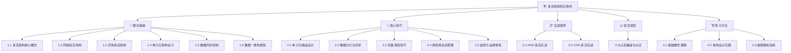
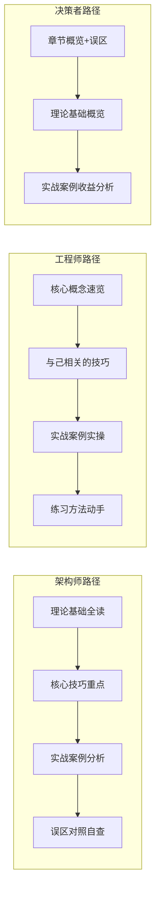

## 多活架构——章节概览

多活架构（Multi-Active Architecture）是分布式系统领域最具挑战性的架构模式之一。它让多个数据中心同时处于活跃状态，共同承担业务流量，从根本上解决了传统主备架构中"备中心闲置、切换风险高、资源浪费严重"的顽疾。

本章从**理论原理→核心技巧→实战案例→常见误区→练习方法**五个维度，系统阐述多活架构的完整知识体系。无论你是正在规划多活改造的架构师，还是想深入理解分布式高可用设计的工程师，本章都将为你提供从认知到落地的完整路径。

---

## 为什么要学多活架构？

### 业务驱动

随着业务全球化和用户对可用性的极致追求，单机房部署已无法满足要求。一次机房级故障可能导致数小时甚至数天的服务中断，直接造成数千万乃至上亿元的损失。多活架构通过让多个数据中心同时提供服务，将单机房故障的影响从"全面停服"降级为"部分降级"，可用性从 99.9%（年停机 8.76 小时）提升到 99.99%（年停机 52.6 分钟）甚至更高。

### 技术挑战

多活架构绝非简单的"多部署几套系统"。它涉及一系列深层技术难题：

- **数据一致性**：多个数据中心同时写入，如何保证数据不冲突、不丢失？
- **流量调度**：如何将用户请求精准路由到正确的数据中心？
- **单元化设计**：如何划分"单元"才能最大化本地化处理比例？
- **故障切换**：如何在秒级完成流量切换且不丢数据？
- **运维复杂度**：如何管理多套系统的一致性变更和故障排查？

这些问题贯穿本章始终，每个都有详细的技术方案和实战案例。

### 行业实践

国内外顶尖互联网公司已在多活架构上积累了丰富经验：

| 企业 | 架构形态 | 规模 | 核心收益 |
|------|---------|------|---------|
| 阿里巴巴 | 异地三地五中心 | 三地五机房 | 双十一零故障，99.999% 可用性 |
| 美团/饿了么 | 异地多活 | 北上广三地 | 切换时间从小时级降到分钟级 |
| 携程 | 多数据中心 | 多地多机房 | 全球化业务就近接入 |
| 字节跳动 | 单元化架构 | 多地多单元 | 支撑数亿用户的高并发 |
| Google | Spanner 全球多活 | 全球分布 | 强一致的全球化数据服务 |

---

## 本章知识体系

本章围绕"多活架构是什么→怎么设计→怎么落地→怎么避坑→怎么练习"的逻辑展开，分为五大模块：

### 模块一：理论基础（6 节）

理论基础是本章的根基，从架构演进到数据一致性模型，构建完整的认知框架。

**1.1 多活架构核心概念**

从 CAP/PACELC 定理出发，解释多活架构的设计哲学和能力边界。你将理解：

- 多活架构为什么是分布式高可用的必选项而非可选项
- CAP 定理如何约束多活架构的设计空间
- PACELC 定理如何指导"一致性 vs 延迟"的权衡
- 多活架构能解决什么、不能解决什么

**1.2 同城双活架构**

同城双活是最基础的多活形态，也是大多数企业的起步方案。你将学到：

- 共享存储、数据库同步、应用层同步三种实现方案的优劣
- MySQL 半同步复制、PostgreSQL 流复制的具体配置
- DNS、GSLB、HTTPDNS 等流量切换手段的对比和选型
- 电力独立性、网络独立性等关键基础设施约束

**1.3 异地多活架构**

异地多活因高延迟面临更严峻的挑战。你将掌握：

- 单元化设计的核心思想——让 95%+ 请求在单元内闭环
- 用户分片、地理位置分片、混合分片等策略的适用场景
- Binlog 复制、DTS 服务、消息队列同步等数据同步方案
- LWW、CRDT、业务层冲突检测等冲突解决策略

**1.4 单元化架构设计**

单元化是异地多活的核心设计理念。你将深入理解：

- 单元的定义：独立完成业务闭环的最小架构单元
- 单元划分粒度：如何选择合适的分片维度
- 全局服务的中心化处理：支付、风控等无法拆分的服务
- 跨单元交互最小化的设计原则

**1.5 数据同步机制**

数据同步是多活架构最核心的技术挑战。你将学到：

- 同步复制 vs 异步复制的 trade-off
- Canal、Debezium 等 Binlog 同步工具的配置和调优
- 同步延迟的监控告警方案
- 数据补偿和修复机制

**1.6 数据一致性模型**

不同业务场景对一致性有不同要求。你将理解：

- 强一致性 vs 最终一致性 vs 因果一致性
- 一致性模型的选择决策框架
- 从理论到工程实践的映射

### 模块二：核心技巧（5 节）

核心技巧聚焦于多活架构落地过程中的关键设计决策和工程实践。

**2.1 单元化路由设计**

如何将用户精准路由到正确的单元？你将学到：

- 路由规则的设计原则和常见模式
- 路由表的动态更新和灰度切换
- 路由异常的降级和容错处理

**2.2 数据分片与同步**

如何设计高效的数据分片策略？你将掌握：

- 分片键的选择和数据均衡策略
- 跨分片查询的处理方案
- 数据同步管道的性能优化

**2.3 流量调度技巧**

如何实现精细化的流量调度？你将学到：

- 分层调度架构：DNS → LB → 应用路由
- Anycast 在多活场景中的应用
- 灰度发布和金丝雀部署的流量控制

**2.4 跨机房会话管理**

如何在多机房环境下管理用户会话？你将掌握：

- 会话粘性的实现和局限
- 分布式会话存储方案
- 无状态化改造策略

**2.5 监控与运维体系**

多活架构的运维复杂度远高于单机房。你将学到：

- 多维度监控指标体系
- 故障自动检测和切换机制
- 变更管理和灰度发布流程

### 模块三：实战案例（2 节）

实战案例通过真实的企业实践，展示多活架构从规划到落地的完整过程。

**3.1 DNS 多活实战**

基于真实的 DNS 多活改造案例，你将看到：

- DNS 多活方案的选型和设计过程
- 流量切换的完整操作流程
- 故障模拟和验证方法
- 常见踩坑点和解决方案

**3.2 CDN 多活实战**

CDN 多活是内容分发领域的典型场景。你将学到：

- CDN 节点的多活调度策略
- 缓存一致性的保障方案
- 故障节点的自动剔除和流量恢复

### 模块四：常见误区（10 大误区）

多活架构实施过程中，团队经常因为认知偏差而踩坑。本章系统梳理十大常见误区：

| 序号 | 误区 | 核心纠正 |
|------|------|---------|
| 1 | 多活等于完全对等 | 多活通常是非对称的，追求"够用的对等"而非"绝对对等" |
| 2 | 多活解决所有可用性问题 | 多活只解决基础设施层可用性，应用层 Bug 无法被多活覆盖 |
| 3 | 数据同步越快越好 | 过度追求同步速度会牺牲写入性能，需根据业务容忍度权衡 |
| 4 | 切换越快越好 | 过快切换可能导致数据丢失，需在速度和安全间平衡 |
| 5 | 异地多活是唯一选择 | 同城双活+异地灾备可能更适合多数企业的实际需求 |
| 6 | 多活架构可以一步到位 | 应渐进式演进：单机房→同城双活→异地灾备→异地多活 |
| 7 | 多活不需要演练 | 不经演练的多活切换等于没有多活 |
| 8 | 一致性可以完全保证 | CAP 定理决定了分布式系统无法同时满足一致性和可用性 |
| 9 | 多活能降低运维成本 | 多活显著增加运维复杂度，需要更强的运维能力 |
| 10 | 技术方案决定一切 | 组织架构、团队能力、业务特性同样影响多活成败 |

每个误区都有详细的错误表现、产生原因、典型后果和纠正方法，帮助你在实际项目中避开这些陷阱。

### 模块五：练习方法（渐进式学习路径）

从基础到进阶，提供循序渐进的练习方案：

- **基础概念理解**（30 分钟）：画架构图、总结核心概念、自测理解程度
- **架构设计实践**（60 分钟）：针对具体业务场景设计多活方案，评审和改进
- **故障模拟演练**（90 分钟）：在模拟环境中进行故障注入和切换演练

---

## 学习路径建议

根据你的角色和经验水平，推荐不同的学习路径：

| 角色 | 重点章节 | 预计时长 | 学习目标 |
|------|---------|---------|---------|
| 架构师 | 理论基础 + 核心技巧 + 实战案例 | 8-12 小时 | 能独立设计多活架构方案 |
| 高级工程师 | 核心技巧 + 实战案例 + 练习方法 | 4-6 小时 | 能参与多活架构的设计和实施 |
| 中级工程师 | 理论基础概览 + 与己相关的技巧 | 2-3 小时 | 理解多活架构的基本原理和自身职责 |
| 技术管理者 | 章节概览 + 常见误区 + 实战案例 | 1-2 小时 | 理解多活架构的投入产出和风险 |

---

## 关键术语速查

在深入阅读前，先了解本章涉及的核心术语：

| 术语 | 英文 | 定义 |
|------|------|------|
| 多活架构 | Multi-Active Architecture | 多个数据中心同时处于活跃状态，共同承担业务流量的架构模式 |
| 同城双活 | Same-City Active-Active | 同一城市两个数据中心同时提供服务，间距通常在 50km 以内 |
| 异地多活 | Geo-Distributed Multi-Active | 不同地域多个数据中心同时提供服务，间距通常在 100-3000km |
| 单元化 | Unitization | 将系统划分为多个独立的业务处理单元，每个单元能独立完成业务闭环 |
| 分片 | Sharding | 将数据按某种规则分散到不同存储节点的策略 |
| GSLB | Global Server Load Balancing | 全局服务器负载均衡，综合多种因素动态调度用户请求 |
| Anycast | Anycast | 网络层流量调度技术，多个节点共享同一 IP，BGP 自动路由到最近节点 |
| CRDT | Conflict-free Replicated Data Type | 无冲突复制数据类型，一种能在分布式环境下自动合并的数据结构 |
| LWW | Last Writer Wins | 最后写入胜出，一种简单的冲突解决策略，时间戳最新的写入覆盖之前的 |
| PACELC | PACELC Theorem | CAP 定理的扩展，描述分区和正常情况下的设计权衡 |
| 单元路由 | Unit Routing | 根据用户属性将请求路由到特定处理单元的机制 |
| 数据同步 | Data Replication | 将数据从一个数据中心复制到另一个数据中心的过程 |

---

## 阅读建议

1. **先建立全局观**：通读本概览，理解章节结构和各模块的定位
2. **按需深入**：根据自身角色选择重点模块深入阅读
3. **理论联系实践**：每学完一个知识点，思考它在自己项目中的应用场景
4. **对照误区**：完成学习后，用"常见误区"章节自查是否存在认知偏差
5. **动手练习**：通过"练习方法"章节的实操任务巩固理解

多活架构的学习是一个渐进过程。不要期望一次读完就掌握所有内容，而是根据实际工作需要，反复阅读和实践。随着经验的积累，你会对多活架构有越来越深的理解。
