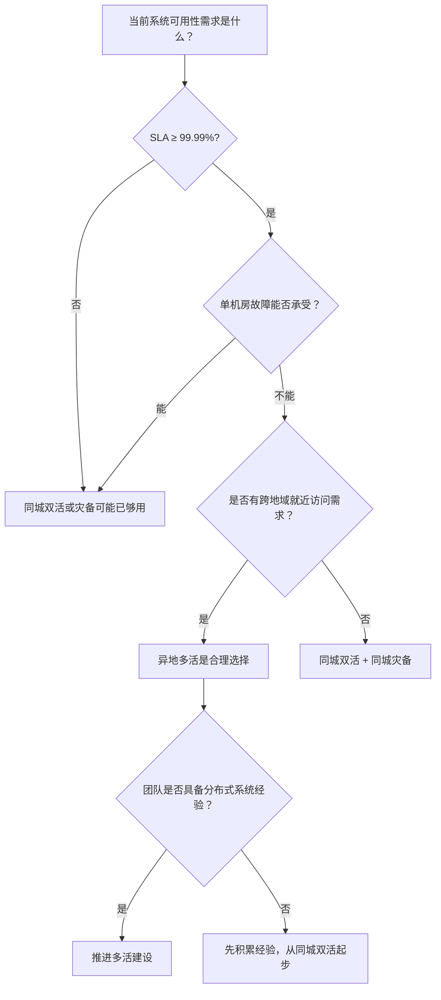
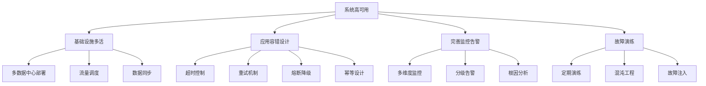
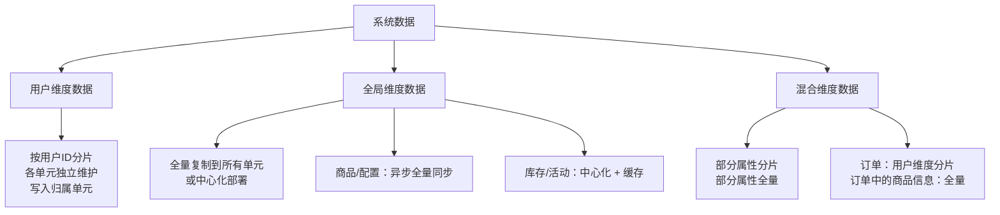

# 多活架构常见误区与纠正

在多活架构的设计、实施和运维过程中，团队经常因为认知偏差、经验不足或盲目跟风而踩坑。本节系统梳理多活架构领域的十大常见误区，逐一剖析其产生原因、典型后果和纠正方法，帮助读者建立正确的架构思维，避免在实际项目中重蹈覆辙。

在深入具体误区之前，有必要先建立一个前置判断框架——并非所有系统都需要多活架构，盲目追求多活本身就是最大的误区。

## 多活决策前置框架：什么时候该用多活？

在决定是否采用多活架构之前，团队应该先回答以下问题：



**核心判断标准**：

| 判断维度 | 不需要多活 | 同城双活即可 | 需要异地多活 |
|----------|-----------|------------|-------------|
| 业务性质 | 内部系统、工具类 | 面向用户但可短暂中断 | 金融/电商/社交等核心业务 |
| 容忍中断时间 | >4小时 | 30分钟-4小时 | <5分钟 |
| 数据合规要求 | 无特殊要求 | 同城数据合规 | 跨地域数据合规（如数据本地化） |
| 团队规模 | <20人 | 20-50人 | >50人且有分布式经验 |
| 年营收规模 | <1000万 | 1000万-1亿 | >1亿（停机损失显著） |

> **警示**：根据Gartner的调查，超过60%的多活项目在立项时缺乏充分的必要性论证。很多团队在"同城双活"甚至"同城灾备"就能满足需求的情况下，选择了代价高昂的异地多活方案。这不是技术上的最优解，而是认知上的误区。

明确了"是否需要多活"之后，我们来看实施过程中最常见的十个误区。

---

## 误区一：多活等于完全对等

### 误区表现

很多团队在规划多活架构时，追求所有数据中心"完全对等"——相同的服务部署、相同的数据分布、相同的流量比例，认为只有这样才能称为"多活"。在方案评审中经常听到类似表述："三个机房必须完全一样，任何差异都是设计缺陷。"

### 为什么这是误区

现实中的多活架构通常是**非对称多活**。各数据中心承担的业务比例可能不同，数据的分布也可能不均匀。原因在于：

**业务属性决定非对称性**。全局性服务（如支付清算、风控引擎、用户注册）具有天然的中心化特征，强行拆分到多个单元反而会引入复杂的分布式一致性问题。以支付宝为例，虽然交易链路实现了多活，但资金清算依然集中在少数中心单元处理。

**资源禀赋决定非对称性**。不同数据中心的硬件配置、网络带宽、运维能力可能差异很大。一个新建的数据中心可能只承担20%的流量，而成熟数据中心承担50%，这在工程上是合理的。

**渐进式改造决定非对称性**。多活改造通常是逐步推进的，不可能一夜之间让所有机房同时达到完全对等的状态。饿了么的异地多活改造就经历了"同城双活→异地灾备→异地多活"的渐进过程，过渡期的非对称状态持续了数月。

### 典型后果

- 为追求对称性强行拆分全局服务，导致跨单元调用激增，系统复杂度和延迟显著上升
- 忽视各机房的实际承载能力，导致低配机房过载、高配机房闲置
- 改造周期拉长，试图"一步到位"反而拖延了整体进度

### 纠正方法

根据业务特点和可用性要求，选择合适的多活模式。判断标准如下表所示：

| 判断维度 | 适合对称多活 | 适合非对称多活 |
|----------|------------|--------------|
| 业务类型 | 用户维度数据为主，交互模式统一 | 混合业务，有全局性服务 |
| 机房条件 | 各机房硬件、网络条件接近 | 机房条件差异较大 |
| 团队能力 | 有成熟的分布式系统经验 | 正在从单机房向多机房演进 |
| 可用性要求 | 99.99%以上，且预算充足 | 99.9%-99.99%，预算有限 |

实际操作中，建议采用**"核心对称、外围非对称"**的策略：核心交易链路尽量做到单元化对称，全局性服务和辅助系统接受非对称部署。阿里巴巴的多活架构就是这种模式——交易单元对称部署，但支付清算、风控等全局服务集中在少数机房。

> **延伸思考**：对称与非对称不是二元选择，而是一个连续光谱。判断的关键在于"核心链路是否对称"——只要核心链路（直接影响用户可用性的路径）是对称的，外围服务的非对称不仅可接受，而且往往更高效。详见本章[流量调度机制](02-流量调度机制.md)中的分层调度策略。

---

## 误区二：多活可以解决所有可用性问题

### 误区表现

"上了多活架构，可用性问题就一劳永逸了。"这种想法在技术管理层中尤为常见，甚至成为推动多活项目立项的核心论据。

### 为什么这是误区

多活架构解决的是**基础设施层面**的可用性问题——当某个数据中心发生故障时，其他数据中心可以接管流量。但它无法解决以下几类问题：

**应用层面的Bug**。如果应用程序本身存在内存泄漏、死锁、逻辑错误，多活架构无法避免这些Bug引发的故障。更危险的是，由于多活架构下同一份代码部署在多个数据中心，一个Bug会同时在所有单元爆发，故障影响范围反而更大。2021年某头部云厂商的一次配置变更Bug，导致其全球多个可用区同时出现故障，恰恰印证了这一点。

**数据层面的不一致**。异步复制的延迟意味着切换后可能出现数据丢失或不一致。如果业务逻辑没有针对这种情况做容错设计，切换后可能引发更严重的业务问题（如重复扣款、订单丢失）。

**新增的复杂性**。多活架构引入了数据同步、流量调度、单元间通信等新的故障点。根据Google SRE的经验，系统的可用性与其复杂度成反比——每增加一个组件，就增加了一个潜在的故障源。

### 典型后果

- 团队将精力过度投入基础设施层面的多活，忽视了应用层面的容错设计
- 故障演练只测试"机房整体故障"场景，忽略了更常见的"部分组件故障"场景
- 以为有了多活就不再重视监控和告警，导致故障发现延迟

### 纠正方法

多活架构必须与以下手段配合使用，才能真正提升系统可用性：



**关键原则**：可用性 = 基础设施冗余 × 应用容错能力 × 运维响应速度。三个维度缺一不可，多活只覆盖了第一个维度。

**一个简单的评估方法**：假设你的系统当前可用性是99.9%（年宕机约8.76小时），引入多活后，基础设施层面的可用性可能提升到99.99%，但如果应用层面的容错能力只有99%，那么整体可用性 = 99.99% × 99% × 99.5% ≈ 98.5%，反而**低于**原来的水平。这个乘法模型清楚地说明了：仅靠多活而忽视应用容错，可能是事倍功半。

---

## 误区三：数据同步延迟可以忽略不计

### 误区表现

"我们的同步延迟只有几秒，对业务没什么影响。"在同城双活场景下，同步延迟通常在1-5毫秒，确实可以忽略。但在异地多活场景中，同步延迟通常在**秒级甚至更高**，这会带来严重的业务影响。

### 为什么这是误区

**用户体验层面**：用户在单元A下单后切换到单元B查看，如果数据未同步，用户会认为"订单丢失了"。这种场景在移动端尤为常见——用户在地铁里网络切换，请求可能被路由到不同单元。

**业务逻辑层面**：很多业务逻辑隐含了"写后立即可读"的假设。例如，电商下单后立即跳转到订单详情页、支付完成后立即查看余额变化。如果数据同步延迟超过了用户的耐心阈值（通常2-3秒），就会触发用户重复操作，导致数据问题。

**数据一致性层面**：异步复制存在数据丢失风险。在极端情况下（如主单元突然宕机），最后几秒的写入可能尚未同步到备单元，切换后这部分数据就永久丢失了。

### 真实案例

**案例一：电商平台订单丢失**

某电商平台在异地多活改造后，出现了一个典型问题：用户在上海机房下单后，由于网络波动请求被切换到北京机房，此时订单数据尚未同步（延迟约3秒），用户看到"订单不存在"的提示后重复下单，导致重复扣款。该问题在上线后的第一周内发生了超过200次，客服投诉量激增。

**案例二：社交平台Feed流不一致**

某社交平台在异地多活改造后，用户A在单元1发布了动态，用户B在单元2刷新Feed流时看不到这条动态（数据同步延迟约5秒）。用户B以为发布失败，再次操作，导致了重复发布。更严重的是，两个单元各自维护了不同的Feed排序，同一用户在不同机房看到的内容顺序完全不同，引发大量用户投诉。

### 纠正方法

**架构层面**：

1. **写后读路由**：用户的写入操作完成后，后续读请求在一定时间窗口内（如10秒）强制路由到写入发生的单元。实现方式是在写入响应中携带单元标识，接入层根据该标识做路由。

```python
# 写后读路由的简化实现
class WriteReadRouter:
    def __init__(self):
        # 写入记录：key = user_id, value = (unit_id, timestamp)
        self.write_records = {}
        self.route_window = 10  # 秒
    
    def on_write(self, user_id, unit_id):
        """写入完成后记录路由信息"""
        self.write_records[user_id] = (unit_id, time.time())
    
    def route_read(self, user_id):
        """读请求路由判断"""
        if user_id in self.write_records:
            unit_id, timestamp = self.write_records[user_id]
            if time.time() - timestamp < self.route_window:
                return unit_id  # 强制路由到写入单元
        return None  # 走正常路由
```

2. **Session粘滞**：确保同一用户在同一Session内的所有请求都被路由到同一个单元，自然保证了读写一致性。Session有效期通常设为30分钟。

3. **同步复制用于关键路径**：对于对一致性要求极高的操作（如支付、转账），采用同步复制或强一致性方案，即使这会牺牲一定性能。

**业务层面**：

4. **异步确认机制**：下单后不立即跳转到订单详情页，而是进入"订单处理中"状态，前端轮询直到数据同步完成。

5. **防重复提交**：在前端和后端都实现幂等机制，防止用户因"看不到数据"而重复操作。

### 不同一致性需求的策略选择

| 业务场景 | 一致性要求 | 推荐策略 | 典型延迟容忍 |
|----------|----------|---------|------------|
| 支付/转账 | 强一致 | 同步复制 + 分布式锁 | <100ms |
| 下单/改价 | 读写一致 | 写后读路由 + Session粘滞 | <3s |
| 商品浏览 | 最终一致 | 异步复制 + 版本号校验 | <10s |
| 评论/日志 | 最终一致 | 异步复制 + 去重 | <30s |

> **延伸阅读**：数据同步延迟的处理是多活架构中最核心的技术难题之一，本章[数据同步策略](03-数据同步策略.md)一节对此有更详细的讨论，包括CRDT、事件溯源等高级方案。

---

## 误区四：单元化拆分越细越好

### 误区表现

"我们把用户拆成1000个单元，每个用户一个单元，这样隔离性最好。"或者"我们按照每个城市拆分单元，全国300个城市就要300个单元。"追求极致的拆分粒度，认为粒度越细，隔离性和可用性越高。

### 为什么这是误区

单元是多活架构中管理和调度的基本单位，单元数量直接决定了系统的管理复杂度。过细的拆分会带来以下问题：

**路由表膨胀**：每个用户/城市到单元的映射关系需要存储和维护。1000个单元意味着路由表有1000条规则，路由查询和更新的复杂度显著上升。

**数据同步链路爆炸**：N个单元之间的数据同步链路数为O(N²)。1000个单元意味着约50万条同步链路，管理成本不可接受。即使是2-3个单元，也需要仔细规划同步方向和优先级。

**资源浪费**：每个单元都需要独立的基础设施（负载均衡器、数据库实例、缓存集群、监控Agent）。单元数量过多导致大量"小实例"，利用率低下。以MySQL为例，每个单元至少需要1主2从共3个实例，1000个单元就需要3000个MySQL实例。

**跨单元交互频繁**：拆分过细后，原本可以在单元内完成的操作可能变成跨单元调用。例如，好友关系分布在不同单元中，社交Feed的生成需要跨单元查询，延迟和复杂度急剧上升。

**运维复杂度激增**：每个单元都有独立的配置、监控、告警规则。单元数量翻倍意味着运维工作量翻倍以上（因为还要处理单元间的协调）。

### 纠正方法

合理的单元数量通常为**2-5个**，具体取决于业务规模：

| 业务规模 | 日活用户 | 推荐单元数 | 分片依据 |
|----------|---------|-----------|---------|
| 中小型 | <100万 | 2 | 同城双活即可 |
| 大型 | 100万-5000万 | 3 | 按地域或用户ID哈希 |
| 超大型 | >5000万 | 3-5 | 按地域 + 业务线 |

**关键原则**：单元数量应该由业务需求驱动，而不是由技术追求驱动。阿里巴巴双十一的核心交易单元也就3-4个，Google Spanner在全球范围也只部署了少数几个"zone"。

判断单元数量是否合理的简单标准：**如果无法清楚地说出每个单元的职责和边界，说明单元拆分有问题。**

**一个实用的自检方法**：把你的单元划分方案画在白板上，然后问团队三个问题：
1. 一个用户的请求在什么条件下会从单元A切换到单元B？（答案应该明确且有限）
2. 单元之间有多少条数据同步链路？每条链路的同步频率是多少？（如果超过10条，需要重新审视）
3. 一个新的业务需求需要修改几个单元的代码？（理想答案是"只需要修改自己单元"）

---

## 误区五：忽视故障演练

### 误区表现

"我们的多活架构设计得很完善，不需要演练。"或者"演练太复杂了，影响线上业务，等出问题再处理。"多活架构上线后长期不做故障演练，直到真正发生故障时才发现各种问题。

### 为什么这是误区

多活架构的切换路径涉及多个组件（DNS/GSLB、接入层、应用层、数据层），任何环节的配置错误或遗漏都可能导致切换失败。根据业界经验，**未经演练的多活架构，首次切换的成功率通常不到30%**。

常见的"纸面完美、实际失败"的场景包括：

- DNS切换后缓存未生效，部分用户仍然访问故障机房（实测切换时间可能超过10分钟）
- 数据库主从切换后，应用层的连接池没有重建，新连接仍然指向旧主库
- 路由表更新后，某个中间件节点缓存了旧路由表，导致部分用户流量丢失
- 切换后发现监控大盘只覆盖了部分服务，无法全面评估切换效果
- 应急预案写在文档里，但执行人从未实际操作过，切换时手忙脚乱

**真实反面案例**：2020年某大型互联网公司在进行机房级故障演练时，由于切换脚本中一个DNS TTL配置错误（将60秒误写为6000秒），导致演练变成了线上事故，部分用户长达10分钟无法访问服务。事后复盘发现，该脚本从未在演练环境中验证过，直接在线上执行。

### 纠正方法

建立**常态化故障演练机制**，参考混沌工程的最佳实践：

**演练层级**：

| 演练类型 | 频率 | 范围 | 目的 |
|----------|------|------|------|
| 组件级故障注入 | 每周 | 单个组件（DB、缓存、MQ） | 验证组件级容错 |
| 单元级故障模拟 | 每月 | 整个单元 | 验证流量切换 |
| 机房级故障模拟 | 每季度 | 整个数据中心 | 验证异地切换 |
| 全链路压测 | 每季度 | 全系统 | 验证峰值承载 |

**演练流程**：


**关键要点**：

1. 演练必须在**预发布环境**进行，避免影响线上业务。如果没有预发布环境，至少选择业务低峰期（如凌晨2-4点）并做好回滚准备。
2. 每次演练后必须有**复盘报告**，记录发现的问题、修复方案和完成时间。
3. 建立**演练清单（Runbook）**，将演练步骤标准化，降低对个人经验的依赖。
4. **从"假设故障"开始**：不要等架构完美了再演练。第一次演练可能只验证"DNS切换是否生效"，第二次验证"数据库主从切换"，逐步覆盖所有切换路径。
5. **记录演练中的"惊喜"**：每次演练都会发现计划外的问题（如某个服务的健康检查配置错误），这些"惊喜"才是演练的真正价值。

**演练效果量化指标**：

| 指标 | 目标值 | 衡量方法 |
|------|-------|---------|
| 切换成功率 | ≥99% | 每次演练中实际成功切换的比例 |
| 切换耗时 | ≤5分钟 | 从故障注入到流量完全切换的时间 |
| 数据丢失量 | ≤30秒 | 切换后数据回溯可恢复的最大时间窗口 |
| 业务影响 | ≤0.1% | 演练期间受影响的请求占比 |

---

## 误区六：过度依赖DNS切换

### 误区表现

"DNS切换就能搞定流量调度，简单高效。"将DNS作为唯一的流量调度手段，不做分层调度设计。

### 为什么这是误区

DNS切换有几个根本性的限制：

**切换速度慢**：DNS记录的TTL（Time-To-Live）通常设置为60-300秒。即使TTL设为60秒，考虑到各地DNS缓存的刷新时间差异，完全收敛通常需要5-10分钟。在故障场景下，5分钟的不可用是不可接受的。

**调度粒度粗**：DNS只能按IP地址进行调度，无法根据用户的业务属性、登录状态等因素做精细路由。

**DNS本身不可靠**：DNS是分布式系统，也存在故障风险。如果DNS服务器本身出现问题，所有依赖DNS调度的流量切换都会失败。

**无法做局部切换**：DNS只能将整个域名的解析结果切换到新的IP，无法实现"只切换部分用户的流量"。

**运营商劫持风险**：部分运营商的LocalDNS会缓存甚至篡改DNS解析结果，导致调度指令无法到达所有用户端。

### 纠正方法

采用**分层调度架构**，将DNS/GSLB作为第一层粗调度，配合应用层的精细调度：

| 调度层级 | 技术手段 | 调度粒度 | 切换速度 | 适用场景 |
|----------|---------|---------|---------|---------|
| 第一层 | DNS/GSLB | 地域/运营商 | 分钟级 | 整体流量引导 |
| 第二层 | 负载均衡器 | 实例级 | 秒级 | 机房内流量分配 |
| 第三层 | 应用层路由 | 用户/业务级 | 毫秒级 | 精细流量控制 |

**关键配置**：DNS的TTL在正常时期可以设为300秒（减少DNS查询压力），但在计划切换前30分钟应降低到60秒，切换完成后恢复。如果使用HTTPDNS或客户端SDK，可以绕过DNS缓存，实现秒级切换。

**各层级的技术选型参考**：

| 层级 | 推荐方案 | 备选方案 | 注意事项 |
|------|---------|---------|---------|
| 第一层 | 阿里云GSLB / AWS Route 53 | Cloudflare Load Balancing | 需确认运营商兼容性 |
| 第二层 | F5 / Nginx / HAProxy | 云厂商ALB/ELB | 注意长连接的优雅断开 |
| 第三层 | 自研路由服务 / Envoy | Spring Cloud LoadBalancer | 路由逻辑需单元测试覆盖 |

> **延伸阅读**：分层调度是多活架构的神经中枢，本章[流量调度机制](02-流量调度机制.md)一节对各层级的实现细节有完整讨论。

---

## 误区七：忽视全局数据的处理

### 误区表现

"我们按用户ID分片了，所有数据都拆到各单元了，多活就完成了。"只关注了用户维度数据的分片，忽视了全局数据（商品、库存、营销活动、配置信息等）的同步和管理。

### 为什么这是误区

在大多数业务系统中，数据并非100%可以按用户维度分片。以下类型的全局数据需要特殊处理：

**商品数据**：所有用户看到的是同一套商品目录，无法按用户分片。如果商品数据只在某个单元中，其他单元的用户访问商品详情时就需要跨单元查询。

**库存数据**：库存的扣减需要全局一致性，否则会出现超卖。例如，一个商品只剩1件库存，如果两个单元同时扣减，可能导致超卖。某头部电商平台曾因库存同步延迟，导致同一商品在两个单元被同时售出，最终需要人工介入处理超卖订单。

**营销活动数据**：优惠券、满减活动等需要全局一致的规则，不能每个单元各自维护一套。

**系统配置数据**：数据库连接配置、服务注册信息、限流规则等全局配置需要在所有单元保持一致。

**用户关系数据**：好友关系、关注列表、群组成员等天然跨用户的数据，无法简单按单个用户ID分片。

### 纠正方法

建立**数据分层模型**，对不同类型的数据采用不同的同步策略：



**各类型数据的推荐策略**：

| 数据类型 | 分片策略 | 同步方式 | 一致性要求 | 典型延迟 |
|----------|---------|---------|-----------|---------|
| 用户信息 | 按用户ID分片 | 各单元独立写入 | 强一致（本单元内） | 0ms |
| 商品信息 | 不分片 | 异步全量同步 | 最终一致 | <5s |
| 库存信息 | 按商品/SKU维度 | 中心化写入 + 缓存分发 | 强一致 | <1s |
| 营销活动 | 不分片 | 异步全量同步 | 最终一致 | <10s |
| 系统配置 | 不分片 | 配置中心推送 | 最终一致 | <1s |
| 用户关系 | 跨用户维度 | 中心化存储或CRDT | 最终一致 | <3s |

**库存处理的详细方案**：

库存是全局数据中最棘手的问题之一。常见的处理模式有三种：

| 方案 | 原理 | 优点 | 缺点 | 适用场景 |
|------|------|------|------|---------|
| 中心化库存 | 所有扣减请求路由到库存中心单元 | 强一致，无超卖 | 库存中心成为瓶颈 | SKU数量有限，写入量可控 |
| 预分配库存 | 按比例预分配到各单元，各单元独立扣减 | 无跨单元调用 | 可能导致分配不均 | SKU数量大，流量可预测 |
| 分布式库存 | 使用分布式事务（如2PC/Saga）跨单元协调 | 灵活 | 复杂度高，延迟大 | 对一致性要求极高 |

**实用建议**：对于大多数电商场景，推荐"中心化库存 + 本地缓存"模式——库存扣减统一走库存中心单元，各单元通过缓存获取库存快照用于展示。扣减时如果缓存库存不足，回源到库存中心做精确校验。这样既保证了强一致，又减少了跨单元调用。

---

## 误区八：故障切换"一刀切"

### 误区表现

"机房挂了就把所有流量切过去。"故障切换时不做区分，将所有流量同时切换到备用机房。

### 为什么这是误区

"一刀切"切换存在几个严重问题：

**容量风险**：备用机房可能没有足够的容量承接全部流量。如果正常情况下3个单元各承担1/3流量，一个单元故障后，剩余两个单元需要各自承担1/2流量（增加50%），如果之前没有预留足够冗余，就会过载。

**数据一致性风险**：不同业务对数据一致性的要求不同。"一刀切"切换可能导致所有业务同时面临数据不一致风险，而不是仅影响必要的部分。

**灰度验证缺失**：直接切换100%流量，没有任何缓冲期，一旦切换后发现问题（如数据同步延迟比预期大），没有回退的余地。

**连锁故障风险**：如果切换后备用机房因负载突增而出现性能下降，可能导致更多用户投诉，甚至触发自动降级，造成更大的业务影响。

### 纠正方法

采用**分级切换策略**，根据业务优先级和容量规划有序切换：

**切换优先级排序**：

| 优先级 | 业务类型 | 切换时机 | 容量要求 |
|--------|---------|---------|---------|
| P0 | 核心交易（下单、支付） | 立即切换 | 需预留50%冗余 |
| P1 | 核心读（商品浏览、搜索） | 5分钟内切换 | 需预留30%冗余 |
| P2 | 辅助功能（评论、推荐） | 30分钟内切换 | 按需切换 |
| P3 | 离线任务（报表、日志） | 延后切换 | 不影响用户体验 |

**灰度切换流程**：

1. **第一步：流量评估**（故障发生后0-2分钟）。快速评估故障单元的当前流量和目标单元的剩余容量，判断是否可以承接全部流量。
2. **第二步：核心业务切换**（2-5分钟）。先切换P0业务的流量，监控错误率和延迟。
3. **第三步：逐步扩大**（5-30分钟）。确认P0业务稳定后，逐步切换P1、P2业务。
4. **第四步：全量切换**（30分钟内）。所有业务切换完成，进入稳态运行。

**容量预留的计算方法**：

假设系统有N个单元，正常情况下每个单元承担1/N的流量。当一个单元故障时，剩余N-1个单元需要各自承担1/(N-1)的流量，增长率为：

增长率 = (1/(N-1)) / (1/N) - 1 = N/(N-1) - 1 = 1/(N-1)

| 单元数 | 故障后增长率 | 建议预留容量 |
|--------|------------|------------|
| 2 | 100% | 每个单元至少2倍容量 |
| 3 | 50% | 每个单元至少1.5倍容量 |
| 4 | 33% | 每个单元至少1.3倍容量 |
| 5 | 25% | 每个单元至少1.25倍容量 |

> **实用技巧**：建议在容量规划时，每个单元预留"1个故障单元的全部流量"的额外容量。即N个单元时，每个单元的实际使用率不超过1/(N-1)×100%。这样即使任意一个单元故障，剩余单元也不会过载。

---

## 误区九：忽视运维体系建设

### 误区表现

"架构设计好了，运维照着做就行。"将多活架构的复杂性留给运维团队自行消化，缺乏配套的运维工具、流程和文档。

### 为什么这是误区

多活架构的运维复杂度远高于单机房架构。运维团队面临以下挑战：

**监控维度爆炸**：需要监控多个数据中心的健康状态、数据同步延迟、流量分布、跨单元调用链等。如果缺乏统一的监控大盘，运维人员需要在多个工具间切换，故障定位效率极低。

**变更风险倍增**：在多活架构中，一次配置变更（如路由表更新）的影响范围可能覆盖多个数据中心。如果变更没有灰度机制和回滚方案，误操作可能导致全局故障。

**知识传递困难**：多活架构的设计决策和运维要点通常掌握在少数架构师手中，如果缺乏文档和知识库，关键人员离职后运维能力会急剧下降。

**值班复杂度上升**：多活架构需要更精细的值班制度——不仅要知道"系统挂了怎么处理"，还要知道"哪个单元的哪个组件出了问题、应该切换还是就地修复"。

### 纠正方法

建立**多活运维三支柱**：

**监控体系**：

| 监控维度 | 关键指标 | 告警阈值 | 监控工具 |
|----------|---------|---------|---------|
| 数据同步 | 同步延迟、积压量 | 延迟>5s 或 积压>1000条 | Prometheus + 自定义Exporter |
| 流量分布 | 各单元QPS比例 | 偏差>30% | Grafana Dashboard |
| 跨单元调用 | 调用比例、延迟 | 比例>10% 或 延迟>P99 | APM（如Jaeger、SkyWalking） |
| 切换状态 | 切换进度、成功率 | 切换未在预期时间内完成 | 自研切换控制台 |

**一个实用的监控大盘设计**：

多活架构的监控大盘应该包含以下核心面板：
1. **全局概览**：各单元健康状态（绿/黄/红灯）、当前流量分布、数据同步状态
2. **单元详情**：单个单元的QPS、延迟、错误率、资源使用率
3. **同步链路**：各同步链路的延迟、积压量、成功率
4. **切换历史**：最近的切换事件、切换耗时、切换后影响

**变更管理**：

1. 所有路由表、同步配置的变更必须经过**审批流程**
2. 变更操作必须支持**灰度发布**（先修改1个单元的配置，观察无异常后再全量）
3. 每次变更前必须确认**回滚方案**
4. **变更窗口**：高风险变更（如路由表修改）应在业务低峰期执行，避免与故障高峰期重叠

**知识库建设**：

1. 编写《多活架构运维手册》，包含架构图、切换流程、常见问题处理
2. 建立《应急预案库》，覆盖所有可预见的故障场景
3. 新人入职必须完成多活架构培训和模拟演练
4. **Runbook模板**：每个应急场景的处理步骤应该标准化为Runbook，包含触发条件、处理步骤、预期结果、回滚方案

---

## 误区十：忽视成本评估

### 误区表现

"多活就是多部署几套，服务器成本翻倍而已。"低估了多活架构的总体拥有成本（TCO），只计算了硬件成本，忽视了开发、运维、人力等方面的隐性成本。

### 为什么这是误区

多活架构的成本远不止硬件翻倍。一个完整的成本模型如下：

**基础设施成本**：多套数据中心的建设/租赁费用、网络互联带宽费用（跨地域专线费用高昂）、存储和数据库的多副本费用。

**开发成本**：单元化改造需要对核心业务系统进行大规模重构，通常涉及数据模型改造、路由逻辑实现、数据同步组件开发等。根据阿里巴巴的经验，核心交易系统的多活改造耗时超过2年。

**运维成本**：多活架构需要更复杂的监控系统、更频繁的故障演练、更多的值班人员。运维团队规模通常需要增加30%-50%。

**机会成本**：多活改造期间，工程团队的精力被大量占用，可能影响新业务的开发进度。这个成本往往被严重低估——如果一个20人的团队花12个月做多活改造，这意味着12个月的新功能开发停滞，对应的市场机会损失可能远超多活本身的硬件成本。

### 纠正方法

在决策是否实施多活架构时，进行**全面的成本效益分析**：

**收益量化**：

| 收益维度 | 量化方法 | 示例 |
|----------|---------|------|
| 可用性提升 | 每增加1个9的SLA对应的业务收入 | 从99.9%→99.99%：减少8.76小时/年宕机，按每小时100万收入计算，年收益约876万 |
| 延迟优化 | 就近访问带来的转化率提升 | 延迟降低100ms，转化率提升1%，年增收500万 |
| 容量扩展 | 多机房分担峰值流量 | 避免单机房扩容的硬件投入200万 |

**成本量化**：

| 成本维度 | 计算方法 | 示例（3单元多活） |
|----------|---------|-----------------|
| 硬件 | 单机房成本 × 3 + 跨地域专线 | 200万 × 3 + 60万 = 660万 |
| 开发 | 人月数 × 月成本 | 20人 × 12月 × 3万 = 720万 |
| 运维 | 年增加的运维人力和工具 | 100万/年 |

**决策框架**：如果3年内的累计收益大于累计成本的2倍（考虑风险系数），则多活架构值得投入。否则，同城双活或同城灾备可能是更经济的选择。

**成本优化策略**：

| 策略 | 节省比例 | 实施难度 | 适用场景 |
|------|---------|---------|---------|
| 云上多可用区 | 硬件成本降低40-60% | 低 | 中小规模业务 |
| 容器化部署 | 资源利用率提升30% | 中 | 已有容器化基础 |
| 按需弹性伸缩 | 峰值成本降低20-30% | 中 | 流量波动大的业务 |
| 共享全局服务 | 运维成本降低15-20% | 低 | 全局服务可接受非对称 |

---

## 误区十一：忽视灰度上线策略（补充误区）

### 误区表现

"多活架构部署完成后，直接全量切换。"在多活架构上线时，没有灰度验证过程，直接将全部流量切换到新的多活架构。

### 为什么这是误区

多活架构的复杂度远超单机房架构，涉及流量调度、数据同步、单元间通信等多个环节的协同。任何一个环节的配置错误都可能导致全局故障。**未经灰度验证的全量切换，风险极高。**

常见的灰度缺失导致的问题：
- 路由规则配置错误，部分用户被路由到不存在的单元
- 数据同步链路建立后，同步延迟远超预期
- 新旧架构的API版本不兼容，导致部分请求失败
- 监控告警规则未更新，切换后无法及时发现问题

### 纠正方法

采用**渐进式灰度上线策略**：

| 阶段 | 流量比例 | 持续时间 | 验证重点 | 回滚条件 |
|------|---------|---------|---------|---------|
| 第一阶段 | 1-5% | 24-48小时 | 核心链路可用性、数据同步延迟 | 任何错误率>0.1% |
| 第二阶段 | 10-20% | 48-72小时 | 性能指标、用户体验 | 错误率>0.05%或P99劣化>50% |
| 第三阶段 | 50% | 72小时 | 容量承载、故障切换 | 同上 |
| 第四阶段 | 100% | 持续观察 | 稳定性、成本效益 | 连续24小时无异常 |

**灰度上线的关键检查点**：

1. **数据一致性验证**：灰度期间持续对比新旧架构的数据一致性，确保同步延迟在预期范围内
2. **性能基线对比**：对比灰度前后的延迟、吞吐量、错误率，确认无劣化
3. **故障演练验证**：在灰度阶段进行小规模故障演练，验证切换路径有效
4. **回滚演练**：在灰度初期就进行一次回滚演练，确认可以快速回退到旧架构

---

## 误区速查表

下表汇总了十大核心误区（加一个补充误区）的核心要点，便于快速查阅：

| 序号 | 误区 | 核心错误认知 | 正确做法 | 风险等级 |
|------|------|------------|---------|---------|
| 1 | 多活等于完全对等 | 所有机房必须一模一样 | 接受非对称，核心对称+外围非对称 | 中 |
| 2 | 多活解决所有可用性问题 | 上了多活就万事大吉 | 多活+应用容错+监控告警+故障演练 | 高 |
| 3 | 数据同步延迟可忽略 | 几秒延迟无所谓 | 写后读路由+Session粘滞+同步复制关键路径 | 高 |
| 4 | 单元拆分越细越好 | 单元越多隔离性越好 | 合理2-5个单元，由业务需求驱动 | 中 |
| 5 | 忽视故障演练 | 设计完善不需要演练 | 常态化混沌工程+分级演练 | 高 |
| 6 | 过度依赖DNS切换 | DNS就能搞定一切 | 分层调度：DNS+LB+应用层路由 | 中 |
| 7 | 忽视全局数据处理 | 只做用户分片就够了 | 数据分层模型+全局数据特殊处理 | 高 |
| 8 | 故障切换"一刀切" | 所有流量同时切换 | 分级切换+灰度验证+容量评估 | 高 |
| 9 | 忽视运维体系 | 架构好了运维照做 | 监控体系+变更管理+知识库 | 中 |
| 10 | 忽视成本评估 | 只算硬件翻倍成本 | 全面TCO分析+3年ROI评估 | 中 |
| 11 | 忽视灰度上线（补充） | 部署完直接全量切换 | 渐进式灰度+验证检查点+回滚演练 | 高 |

---

## 自检清单

在多活架构的设计和实施过程中，使用以下清单检查是否落入了常见误区：

**架构设计阶段**：

- [ ] 是否根据业务特点选择了合适的多活模式（对称/非对称），而非盲目追求完全对等？
- [ ] 是否对全局数据（商品、库存、配置）制定了专门的同步策略？
- [ ] 单元数量是否由业务需求驱动，而非技术追求驱动？是否有明确的单元划分依据？
- [ ] 是否进行了全面的成本效益分析，而不仅仅是"多部署几套"？

**实施阶段**：

- [ ] 是否实现了分层流量调度（DNS+LB+应用层），而非仅依赖DNS？
- [ ] 数据同步延迟是否在业务容忍范围内？是否为关键路径设计了同步复制或写后读路由？
- [ ] 是否建立了完善的监控体系（同步延迟、流量分布、跨单元调用）？
- [ ] 是否为故障切换设计了分级策略和灰度机制？
- [ ] 是否制定了渐进式灰度上线方案？是否包含回滚验证？

**运维阶段**：

- [ ] 是否定期进行故障演练（组件级每周、单元级每月、机房级每季度）？
- [ ] 是否有完整的应急预案和切换Runbook？
- [ ] 所有变更是否经过审批和灰度验证？
- [ ] 是否定期评估多活架构的成本效益，及时调整策略？

---

## 本节小结

多活架构的核心挑战不仅在于技术实现，更在于**认知层面**的正确性。本节梳理的十大误区涵盖了架构认知、技术决策、运维管理三个层面：

- **认知层面**（误区1、2）：多活不是万能药，需要正确认识其能力边界
- **技术层面**（误区3、4、6、7、8）：数据同步、单元设计、流量调度、全局数据都有具体的技术约束
- **管理层面**（误区5、9、10）：故障演练、运维体系、成本评估是多活架构成功的保障
- **工程实践**（补充误区）：灰度上线是将架构设计安全落地的关键保障

在实际项目中，建议团队在多活架构规划初期就逐条对照上述误区进行自检，将"避坑"意识融入架构设计的全过程，而不是在出了问题之后才亡羊补牢。

**避坑的核心心法**：多活架构的成功不在于"做对了多少技术决策"，而在于"避免了多少认知误区"。技术问题总有解决方案，但认知偏差导致的方向性错误，往往需要付出数倍的代价来纠正。
