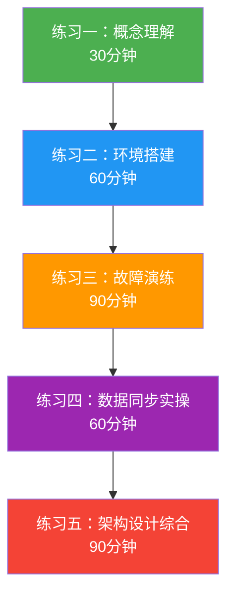
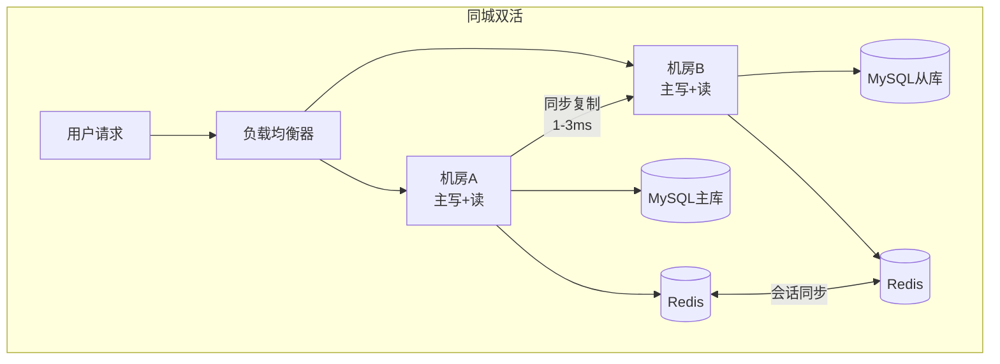
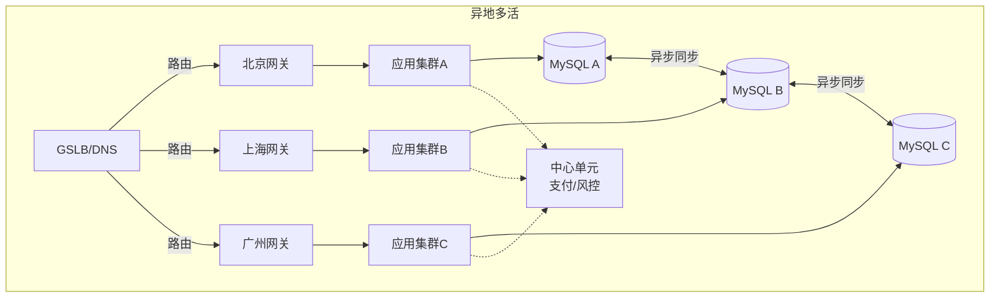

## 练习方法

多活架构的知识体系庞大而复杂，仅靠阅读难以真正掌握。本章提供一套**从认知到实战**的渐进式练习路径，覆盖五个层级：概念理解→环境搭建→故障演练→性能调优→架构设计。每个练习都有明确的目标、步骤和验收标准，帮助你在可控的环境中逐步建立多活架构的实战能力。



---

## 练习一：基础概念理解（预计30分钟）

**目标**：能够清晰解释多活架构的核心概念，画出完整的架构拓扑图，并用非技术语言向他人阐述多活架构的价值和边界。

### 步骤一：核心概念自测（10分钟）

不翻阅资料，尝试回答以下问题。答不出的标记出来，后续重点学习。

**基础概念**：

1. 多活架构与传统主备架构的本质区别是什么？"活"体现在哪里？
2. CAP定理在多活场景中如何体现？为什么P（分区容忍性）是必须满足的？
3. PACELC定理描述了哪两种场景下的权衡？多活架构通常选择哪种策略？

**架构形态**：

4. 同城双活和异地多活的核心差异是什么？为什么延迟差异会导致完全不同的设计策略？
5. 单元化架构的"单元"如何定义？为什么目标是让95%以上的请求在单元内闭环？
6. 全局服务（如支付、风控）为什么无法按用户维度拆分到各单元？

**数据一致性**：

7. 强一致性、最终一致性、因果一致性三者的区别是什么？各自适用于什么场景？
8. LWW（最后写入胜出）策略的潜在风险是什么？在什么场景下可以接受？
9. CRDT数据结构为什么能在多活场景下自动合并而不产生冲突？

**流量调度**：

10. 分层调度架构（DNS→LB→应用路由）每一层分别解决什么粒度的问题？
11. DNS切换、GSLB、HTTPDNS三种流量调度手段的切换速度差异有多大？
12. Anycast技术的工作原理是什么？它在多活场景中的优劣是什么？

### 步骤二：画架构拓扑图（10分钟）

用Mermaid或手绘，完成以下三张架构图：

**图1：同城双活基础架构**



要求标注：
- 数据同步方向和延迟
- 读写流量分配比例
- 切换时的流量走向

**图2：异地多活单元化架构**



要求标注：
- 单元划分维度（如按用户ID取模）
- 异步同步的典型延迟
- 跨单元调用的触发条件

**图3：分层流量调度架构**

要求画出三层调度的完整链路：DNS/GSLB → 负载均衡器（Nginx/HAProxy） → 应用层路由网关，标注每层的调度粒度和切换速度。

### 步骤三：用自己的话总结（10分钟）

从以下角度撰写一段200字左右的概述（可以用自己的语言，不照搬原文）：

- 多活架构解决什么问题？（用一个具体业务场景举例）
- 最大的技术挑战是什么？
- 成功实施多活架构需要哪些前提条件？

### 检查标准

- [ ] 能完整回答10道以上概念问题
- [ ] 三张架构图标注完整、关系正确
- [ ] 能用自己的话向非技术人员解释多活架构的价值
- [ ] 能说出至少3个多活架构的局限性

---

## 练习二：多活环境搭建（预计60分钟）

**目标**：在本地搭建一个简化的同城双活模拟环境，包含数据库同步、负载均衡和基本的流量切换能力。

### 步骤一：准备基础环境（15分钟）

使用Docker Compose搭建两个模拟机房环境：

```bash
# 创建工作目录
mkdir -p ~/multi-active-lab &amp;&amp; cd ~/multi-active-lab

# 创建 docker-compose.yml
cat > docker-compose.yml << 'EOF'
version: '3.8'

services:
  # 机房A - MySQL主库
  mysql-a:
    image: mysql:8.0
    container_name: dc-a-mysql
    environment:
      MYSQL_ROOT_PASSWORD: rootpass
      MYSQL_DATABASE: business_db
    ports:
      - "3307:3306"
    volumes:
      - ./config/mysql-a.cnf:/etc/mysql/conf.d/custom.cnf
      - ./init/master.sql:/docker-entrypoint-initdb.d/init.sql
    networks:
      - multi-active

  # 机房B - MySQL从库
  mysql-b:
    image: mysql:8.0
    container_name: dc-b-mysql
    environment:
      MYSQL_ROOT_PASSWORD: rootpass
      MYSQL_DATABASE: business_db
    ports:
      - "3308:3306"
    volumes:
      - ./config/mysql-b.cnf:/etc/mysql/conf.d/custom.cnf
    networks:
      - multi-active

  # Redis会话同步 - 机房A
  redis-a:
    image: redis:7-alpine
    container_name: dc-a-redis
    ports:
      - "6380:6379"
    networks:
      - multi-active

  # Redis会话同步 - 机房B
  redis-b:
    image: redis:7-alpine
    container_name: dc-b-redis
    ports:
      - "6381:6379"
    networks:
      - multi-active

  # Nginx负载均衡
  nginx:
    image: nginx:alpine
    container_name: lb-nginx
    ports:
      - "8080:80"
    volumes:
      - ./config/nginx.conf:/etc/nginx/nginx.conf
    depends_on:
      - app-a
      - app-b
    networks:
      - multi-active

  # 应用服务 - 机房A
  app-a:
    image: nginx:alpine
    container_name: dc-a-app
    volumes:
      - ./app/server-a.conf:/etc/nginx/conf.d/default.conf
    networks:
      - multi-active

  # 应用服务 - 机房B
  app-b:
    image: nginx:alpine
    container_name: dc-b-app
    volumes:
      - ./app/server-b.conf:/etc/nginx/conf.d/default.conf
    networks:
      - multi-active

networks:
  multi-active:
    driver: bridge
EOF
```

### 步骤二：配置数据库同步（20分钟）

**MySQL主库配置（机房A）**：

```bash
# config/mysql-a.cnf
cat > config/mysql-a.cnf << 'EOF'
[mysqld]
server-id=1
log-bin=mysql-bin
binlog-format=ROW
sync_binlog=1
innodb_flush_log_at_trx_commit=1
gtid-mode=ON
enforce-gtid-consistency=ON
EOF
```

**MySQL从库配置（机房B）**：

```bash
# config/mysql-b.cnf
cat > config/mysql-b.cnf << 'EOF'
[mysqld]
server-id=2
relay-log=relay-bin
read-only=ON
gtid-mode=ON
enforce-gtid-consistency=ON
EOF
```

**初始化主库数据并建立复制关系**：

```bash
# 启动主库
docker-compose up -d mysql-a
sleep 10

# 在主库上创建复制账号
docker exec dc-a-mysql mysql -uroot -prootpass -e \
  "CREATE USER 'repl'@'%' IDENTIFIED BY 'replpass'; \
   GRANT REPLICATION SLAVE ON *.* TO 'repl'@'%'; \
   FLUSH PRIVILEGES;"

# 启动从库并配置复制
docker-compose up -d mysql-b
sleep 5

# 在从库上建立复制通道
docker exec dc-b-mysql mysql -uroot -prootpass -e \
  "CHANGE MASTER TO \
     MASTER_HOST='dc-a-mysql', \
     MASTER_USER='repl', \
     MASTER_PASSWORD='replpass', \
     MASTER_AUTO_POSITION=1; \
   START SLAVE;"

# 验证复制状态
docker exec dc-b-mysql mysql -uroot -prootpass -e \
  "SHOW SLAVE STATUS\G" | grep -E "Slave_IO_Running|Slave_SQL_Running|Seconds_Behind"
```

预期输出：
Slave_IO_Running: Yes
Slave_SQL_Running: Yes
Seconds_Behind_Master: 0

### 步骤三：配置负载均衡和流量切换（15分钟）

```bash
# Nginx负载均衡配置
cat > config/nginx.conf << 'EOF'
events {
    worker_connections 1024;
}

http {
    # 定义上游服务器组
    upstream dc_pool {
        server dc-a-app:80 weight=50;
        server dc-b-app:80 weight=50;
    }

    # 健康检查配置
    upstream dc_pool_a_only {
        server dc-a-app:80;
        # server dc-b-app:80 backup;  # 故障时切换
    }

    upstream dc_pool_b_only {
        server dc-b-app:80;
        # server dc-a-app:80 backup;
    }

    # 默认流量分配（50:50）
    upstream active_pool {
        server dc-a-app:80 weight=50;
        server dc-b-app:80 weight=50;
    }

    server {
        listen 80;

        # 正常模式：双机房均衡
        location / {
            proxy_pass http://active_pool;
            proxy_set_header X-Forwarded-For $remote_addr;
            proxy_set_header X-Real-IP $remote_addr;
        }

        # 健康检查端点
        location /health {
            return 200 '{"status":"ok","active_dc":"both"}';
            add_header Content-Type application/json;
        }

        # 切换控制接口（生产环境应有认证）
        location /switch {
            # 通过查询参数切换：/switch?target=a 或 /switch?target=b
            if ($arg_target = "a") {
                # 改为只走机房A
                return 200 '{"switched_to":"dc-a"}';
            }
            if ($arg_target = "b") {
                return 200 '{"switched_to":"dc-b"}';
            }
        }
    }
}
EOF
```

### 步骤四：验证环境（10分钟）

```bash
# 启动全部服务
docker-compose up -d

# 验证服务状态
docker-compose ps

# 向主库写入测试数据
docker exec dc-a-mysql mysql -uroot -prootpass business_db -e \
  "CREATE TABLE users (id INT PRIMARY KEY, name VARCHAR(50), created_at TIMESTAMP DEFAULT CURRENT_TIMESTAMP); \
   INSERT INTO users VALUES (1, 'Alice', NOW()), (2, 'Bob', NOW());"

# 等待同步（通常<1秒）
sleep 2

# 从从库读取数据，验证同步成功
docker exec dc-b-mysql mysql -uroot -prootpass business_db -e \
  "SELECT * FROM users;"

# 通过负载均衡器访问
curl http://localhost:8080/
```

### 检查标准

- [ ] Docker Compose环境正常启动，所有容器健康运行
- [ ] MySQL主从复制状态为`Slave_IO_Running: Yes, Slave_SQL_Running: Yes`
- [ ] 从库能读取到主库写入的数据
- [ ] Nginx负载均衡正常分发请求到两个机房
- [ ] 能通过健康检查端点获取状态信息

---

## 练习三：故障模拟演练（预计90分钟）

**目标**：在模拟环境中执行故障注入和流量切换，理解多活架构的故障恢复机制，培养故障排查的直觉。

### 步骤一：建立监控基线（15分钟）

在开始故障演练前，先建立系统的正常状态基线：

```bash
# 创建监控脚本
cat > monitor.sh << 'SCRIPT'
#!/bin/bash
# 多活环境健康监控脚本

check_mysql_sync() {
    local slave_status=$(docker exec dc-b-mysql mysql -uroot -prootpass -e "SHOW SLAVE STATUS\G" 2>/dev/null)
    local io_running=$(echo "$slave_status" | grep "Slave_IO_Running:" | awk '{print $2}')
    local sql_running=$(echo "$slave_status" | grep "Slave_SQL_Running:" | awk '{print $2}')
    local delay=$(echo "$slave_status" | grep "Seconds_Behind_Master:" | awk '{print $2}')

    echo "[MySQL同步状态]"
    echo "  IO线程: ${io_running:-N/A}"
    echo "  SQL线程: ${sql_running:-N/A}"
    echo "  延迟秒数: ${delay:-N/A}"
}

check_containers() {
    echo "[容器状态]"
    docker-compose ps --format "table {{.Name}}\t{{.Status}}" 2>/dev/null
}

check_connectivity() {
    echo "[连通性检查]"
    # 检查机房A
    if docker exec dc-a-mysql mysql -uroot -prootpass -e "SELECT 1" &amp;>/dev/null; then
        echo "  机房A MySQL: 正常"
    else
        echo "  机房A MySQL: 不可达"
    fi
    # 检查机房B
    if docker exec dc-b-mysql mysql -uroot -prootpass -e "SELECT 1" &amp;>/dev/null; then
        echo "  机房B MySQL: 正常"
    else
        echo "  机房B MySQL: 不可达"
    fi
    # 检查负载均衡
    local http_code=$(curl -s -o /dev/null -w "%{http_code}" http://localhost:8080/ 2>/dev/null)
    echo "  负载均衡器: HTTP ${http_code:-无法连接}"
}

echo "========== 系统健康检查 $(date '+%Y-%m-%d %H:%M:%S') =========="
check_containers
check_mysql_sync
check_connectivity
echo "============================================================"
SCRIPT
chmod +x monitor.sh

# 建立基线
./monitor.sh
```

### 步骤二：故障场景一——机房级故障（25分钟）

模拟机房A完全宕机，验证流量切换和数据完整性。

```bash
echo "===== 场景1: 机房A宕机 ====="

# 1. 记录故障前数据
echo "[故障前] 从库数据:"
docker exec dc-b-mysql mysql -uroot -prootpass business_db -e "SELECT COUNT(*) AS total_records FROM users;"

# 2. 注入故障：停止机房A的所有服务
echo "[注入故障] 停止机房A..."
docker-compose stop mysql-a app-a

# 3. 观察系统状态（等待30秒，模拟真实故障发现时间）
sleep 30
./monitor.sh

# 4. 执行流量切换：将所有流量导向机房B
echo "[执行切换] 流量全部导向机房B..."
docker exec lb-nginx nginx -s reload

# 5. 验证切换后系统可用性
echo "[切换后] 测试系统响应:"
for i in $(seq 1 5); do
    response=$(curl -s -w "\nHTTP_CODE:%{http_code}" http://localhost:8080/ 2>/dev/null)
    echo "  请求${i}: ${response}"
done

# 6. 从机房B写入新数据（模拟切换后继续服务）
docker exec dc-b-mysql mysql -uroot -prootpass business_db -e \
  "INSERT INTO users VALUES (3, 'Charlie', NOW());" 2>/dev/null

# 7. 机房A恢复后，验证数据是否一致
echo "[恢复] 重新启动机房A..."
docker-compose start mysql-a app-a
sleep 30

echo "[恢复后] 验证数据一致性:"
echo "  机房A数据:"
docker exec dc-a-mysql mysql -uroot -prootpass business_db -e "SELECT * FROM users;" 2>/dev/null
echo "  机房B数据:"
docker exec dc-b-mysql mysql -uroot -prootpass business_db -e "SELECT * FROM users;"
```

**记录和分析**：

填写以下表格记录演练结果：

| 检查项 | 预期结果 | 实际结果 | 差异分析 |
|--------|---------|---------|---------|
| 故障发现时间 | <30秒 | | |
| 流量切换时间 | <1分钟 | | |
| 切换后服务可用性 | 100% | | |
| 数据丢失量 | 0条（同步复制） | | |
| 恢复后数据一致性 | 完全一致 | | |

### 步骤三：故障场景二——数据同步中断（25分钟）

模拟网络分区导致的主从同步中断，观察数据不一致的产生和修复过程。

```bash
echo "===== 场景2: 数据同步中断 ====="

# 1. 模拟网络分区：阻止主从通信
echo "[注入故障] 模拟网络分区..."
docker exec dc-b-mysql mysql -uroot -prootpass -e "STOP SLAVE;"

# 2. 在主库写入数据（从库无法同步）
echo "[主库写入] 写入5条记录..."
for i in $(seq 4 8); do
    docker exec dc-a-mysql mysql -uroot -prootpass business_db -e \
      "INSERT INTO users VALUES ($i, 'User_$i', NOW());"
done

# 3. 检查两个库的数据差异
echo "[数据差异检查]"
echo "  主库记录数:"
docker exec dc-a-mysql mysql -uroot -prootpass business_db -e \
  "SELECT COUNT(*) AS count FROM users;" | tail -1
echo "  从库记录数:"
docker exec dc-b-mysql mysql -uroot -prootpass business_db -e \
  "SELECT COUNT(*) AS count FROM users;" | tail -1

# 4. 恢复同步，观察追赶过程
echo "[恢复同步] 重启slave..."
docker exec dc-b-mysql mysql -uroot -prootpass -e "START SLAVE;"

# 5. 等待追赶完成并验证
sleep 5
echo "[同步追赶后] 从库数据:"
docker exec dc-b-mysql mysql -uroot -prootpass business_db -e "SELECT * FROM users;"
```

**关键观察点**：

1. 同步中断期间，从库仍然可以提供读服务——但读到的是旧数据
2. 恢复同步后，异步复制会自动追赶缺失的binlog
3. 如果中断期间主库产生了大量写入，追赶时间可能较长
4. 在追赶期间，从库的`Seconds_Behind_Master`会从高值逐渐降为0

### 步骤四：故障场景三——脑裂模拟（25分钟）

模拟网络分区导致的"双主"脑裂场景，这是多活架构中最危险的故障之一。

```bash
echo "===== 场景3: 脑裂模拟 ====="

# 1. 记录当前主库GTID
echo "[初始状态] 主库GTID:"
docker exec dc-a-mysql mysql -uroot -prootpass -e \
  "SHOW MASTER STATUS\G" | grep -i gtid

# 2. 模拟网络分区
echo "[模拟分区] 停止主从复制..."
docker exec dc-b-mysql mysql -uroot -prootpass -e "STOP SLAVE;"

# 3. 在两个库上同时写入不同数据（模拟脑裂）
echo "[脑裂写入] 主库写入..."
docker exec dc-a-mysql mysql -uroot -prootpass business_db -e \
  "INSERT INTO users VALUES (100, 'Split_A', NOW());"

echo "[脑裂写入] 从库写入..."
docker exec dc-b-mysql mysql -uroot -prootpass business_db -e \
  "SET GLOBAL read_only=OFF; \
   INSERT INTO users VALUES (200, 'Split_B', NOW());"

# 4. 检查两个库的状态
echo "[脑裂后状态]"
echo "  主库数据:"
docker exec dc-a-mysql mysql -uroot -prootpass business_db -e "SELECT * FROM users ORDER BY id DESC LIMIT 5;"
echo "  从库数据:"
docker exec dc-b-mysql mysql -uroot -prootpass business_db -e "SELECT * FROM users ORDER BY id DESC LIMIT 5;"

# 5. 尝试恢复复制（会失败，演示脑裂的危害）
echo "[尝试恢复复制]"
docker exec dc-b-mysql mysql -uroot -prootpass -e "START SLAVE;" 2>&amp;1
sleep 2
echo "[复制状态]"
docker exec dc-b-mysql mysql -uroot -prootpass -e "SHOW SLAVE STATUS\G" | grep -E "Last_Error|Slave_SQL_Running"
```

**关键教训**：

- 脑裂是多活架构的"噩梦"——两个数据中心同时写入同一份数据
- 防止脑裂的关键：在故障切换时确保旧主库停止写入（fencing机制）
- 修复脑裂需要人工介入，决定保留哪个数据版本
- 生产环境中应部署仲裁机制（如第三方见证节点）来避免脑裂

### 检查标准

- [ ] 完成三个故障场景的模拟
- [ ] 每个场景都记录了监控数据和时间线
- [ ] 能解释每个故障场景的根本原因和恢复策略
- [ ] 理解异步复制导致的数据丢失窗口
- [ ] 理解脑裂的危害和预防措施

---

## 练习四：数据同步与一致性实操（预计60分钟）

**目标**：通过编写代码实现简单的数据同步和冲突解决机制，深入理解最终一致性和CRDT的工作原理。

### 步骤一：实现简易数据同步（20分钟）

用Python实现一个简化的数据库同步模拟器：

```python
"""
multi_active_sync.py - 多活数据同步模拟器
模拟两个数据中心之间的数据复制和最终一致性
"""
import threading
import time
import json
from dataclasses import dataclass, field
from typing import Dict, List, Optional
from enum import Enum


class SyncMode(Enum):
    SYNC = "sync"         # 同步复制
    ASYNC = "async"       # 异步复制
    SEMI_SYNC = "semi"    # 半同步复制


@dataclass
class DataCenter:
    """模拟数据中心"""
    name: str
    data: Dict[str, str] = field(default_factory=dict)
    write_log: List[dict] = field(default_factory=list)
    lock: threading.Lock = field(default_factory=threading.Lock)
    is_healthy: bool = True
    replication_lag_ms: int = 0

    def write(self, key: str, value: str) -> bool:
        """写入数据"""
        if not self.is_healthy:
            print(f"  [{self.name}] 写入失败：数据中心不可用")
            return False

        with self.lock:
            self.data[key] = value
            self.write_log.append({
                "key": key, "value": value,
                "timestamp": time.time(), "dc": self.name
            })
            print(f"  [{self.name}] 写入成功: {key}={value}")
            return True

    def read(self, key: str) -> Optional[str]:
        """读取数据"""
        if not self.is_healthy:
            print(f"  [{self.name}] 读取失败：数据中心不可用")
            return None
        return self.data.get(key)


class DataSyncManager:
    """数据同步管理器"""

    def __init__(self, dc_a: DataCenter, dc_b: DataCenter,
                 sync_mode: SyncMode = SyncMode.ASYNC,
                 sync_delay_ms: int = 100):
        self.dc_a = dc_a
        self.dc_b = dc_b
        self.sync_mode = sync_mode
        self.sync_delay_ms = sync_delay_ms
        self.pending_syncs: List[dict] = []
        self.sync_log: List[dict] = []
        self._running = False
        self._thread = None

    def write_to_dc(self, dc: DataCenter, key: str, value: str) -> bool:
        """向指定数据中心写入并触发同步"""
        success = dc.write(key, value)
        if not success:
            return False

        if self.sync_mode == SyncMode.SYNC:
            # 同步模式：等待副本写入成功后才返回
            return self._sync_write(dc, key, value)
        elif self.sync_mode == SyncMode.SEMI_SYNC:
            # 半同步模式：副本写入超时后降级为异步
            return self._semi_sync_write(dc, key, value)
        else:
            # 异步模式：放入队列，立即返回
            self.pending_syncs.append({
                "source": dc.name, "key": key,
                "value": value, "timestamp": time.time()
            })
            print(f"  [{dc.name}] 数据已写入，同步任务已加入队列")
            return True

    def _sync_write(self, source: DataCenter, key: str, value: str) -> bool:
        """同步复制：等待目标DC写入成功"""
        target = self.dc_b if source == self.dc_a else self.dc_a
        if not target.is_healthy:
            print(f"  [SYNC] 目标DC {target.name} 不可用，同步失败")
            return False

        time.sleep(self.sync_delay_ms / 1000.0)
        target.data[key] = value
        self.sync_log.append({
            "source": source.name, "target": target.name,
            "key": value, "latency_ms": self.sync_delay_ms,
            "mode": "sync", "success": True
        })
        print(f"  [SYNC] 同步完成: {source.name} -> {target.name} ({self.sync_delay_ms}ms)")
        return True

    def _semi_sync_write(self, source: DataCenter, key: str, value: str) -> bool:
        """半同步复制：超时后降级为异步"""
        target = self.dc_b if source == self.dc_a else self.dc_a
        timeout_ms = 500  # 超时阈值

        if not target.is_healthy:
            self.pending_syncs.append({
                "source": source.name, "key": key,
                "value": value, "timestamp": time.time()
            })
            print(f"  [SEMI-SYNC] 目标DC不可用，降级为异步")
            return True

        if self.sync_delay_ms <= timeout_ms:
            time.sleep(self.sync_delay_ms / 1000.0)
            target.data[key] = value
            print(f"  [SEMI-SYNC] 同步完成 ({self.sync_delay_ms}ms < {timeout_ms}ms)")
            return True
        else:
            self.pending_syncs.append({
                "source": source.name, "key": key,
                "value": value, "timestamp": time.time()
            })
            print(f"  [SEMI-SYNC] 同步超时 ({self.sync_delay_ms}ms > {timeout_ms}ms)，降级为异步")
            return True

    def get_consistency_status(self) -> dict:
        """检查两个DC的数据一致性状态"""
        all_keys = set(self.dc_a.data.keys()) | set(self.dc_b.data.keys())
        consistent = 0
        inconsistent = []
        missing_in_a = []
        missing_in_b = []

        for key in all_keys:
            val_a = self.dc_a.data.get(key)
            val_b = self.dc_b.data.get(key)
            if val_a == val_b and val_a is not None:
                consistent += 1
            elif val_a is None:
                missing_in_a.append(key)
            elif val_b is None:
                missing_in_b.append(key)
            else:
                inconsistent.append({"key": key, "a": val_a, "b": val_b})

        return {
            "total_keys": len(all_keys),
            "consistent": consistent,
            "inconsistent": inconsistent,
            "missing_in_dc_a": missing_in_a,
            "missing_in_dc_b": missing_in_b,
            "consistency_ratio": consistent / len(all_keys) if all_keys else 1.0
        }


# === 演示运行 ===
if __name__ == "__main__":
    print("=" * 60)
    print("  多活数据同步模拟器")
    print("=" * 60)

    # 创建两个数据中心
    dc_a = DataCenter(name="DC-北京")
    dc_b = DataCenter(name="DC-上海")

    # 场景1: 正常异步同步
    print("\n--- 场景1: 异步同步（正常情况）---")
    mgr = DataSyncManager(dc_a, dc_b, SyncMode.ASYNC, sync_delay_ms=100)

    mgr.write_to_dc(dc_a, "user:1001", "Alice")
    mgr.write_to_dc(dc_a, "user:1002", "Bob")
    mgr.write_to_dc(dc_b, "user:1003", "Charlie")

    # 模拟异步追赶
    print("\n[模拟异步同步追赶]")
    for sync in mgr.pending_syncs:
        target = dc_b if sync["source"] == dc_a.name else dc_a
        target.data[sync["key"]] = sync["value"]
        print(f"  异步同步: {sync['source']} -> {target.name}: {sync['key']}={sync['value']}")
    mgr.pending_syncs.clear()

    status = mgr.get_consistency_status()
    print(f"\n一致性状态: {status['consistent']}/{status['total_keys']} "
          f"({status['consistency_ratio']:.0%})")

    # 场景2: 网络分区导致数据不一致
    print("\n--- 场景2: 网络分区 ---")
    dc_b.is_healthy = False  # 模拟网络中断
    mgr.write_to_dc(dc_a, "user:1004", "David")
    dc_b.is_healthy = True   # 网络恢复

    status = mgr.get_consistency_status()
    print(f"\n一致性状态: {status['consistent']}/{status['total_keys']} "
          f"({status['consistency_ratio']:.0%})")
    print(f"  缺失于DC-上海: {status['missing_in_dc_b']}")
```

运行并观察不同同步模式下的行为差异。

### 步骤二：实现CRDT冲突解决（20分钟）

```python
"""
crdt_demo.py - CRDT数据结构演示
展示多活场景下如何实现无冲突的数据合并
"""
from dataclasses import dataclass, field
from typing import Dict, Set
import copy


class GCounter:
    """
    Grow-only Counter（只增计数器）
    适用场景：页面浏览量、点赞数、库存预扣等只增不减的计数场景
    """
    def __init__(self, node_id: str):
        self.node_id = node_id
        self.counts: Dict[str, int] = {}

    def increment(self, amount: int = 1):
        current = self.counts.get(self.node_id, 0)
        self.counts[self.node_id] = current + amount

    def value(self) -> int:
        return sum(self.counts.values())

    def merge(self, other: 'GCounter'):
        """合并两个计数器：取每个节点计数的最大值"""
        for node, count in other.counts.items():
            self.counts[node] = max(self.counts.get(node, 0), count)

    def __repr__(self):
        return f"GCounter({self.node_id}, value={self.value()}, detail={self.counts})"


class PNCounter:
    """
    Positive-Negative Counter（正负计数器）
    在GCounter基础上支持减少操作
    适用场景：点赞/踩、库存增减、余额变动
    """
    def __init__(self, node_id: str):
        self.node_id = node_id
        self.positive = GCounter(f"{node_id}-pos")
        self.negative = GCounter(f"{node_id}-neg")

    def increment(self, amount: int = 1):
        self.positive.increment(amount)

    def decrement(self, amount: int = 1):
        self.negative.increment(amount)

    def value(self) -> int:
        return self.positive.value() - self.negative.value()

    def merge(self, other: 'PNCounter'):
        self.positive.merge(other.positive)
        self.negative.merge(other.negative)


class LWWRegister:
    """
    Last-Writer-Wins Register（最后写入胜出寄存器）
    适用场景：用户偏好设置、配置项等单值数据
    """
    def __init__(self, node_id: str):
        self.node_id = node_id
        self.value_store: str = ""
        self.timestamp: float = 0

    def set(self, value: str, timestamp: float):
        if timestamp > self.timestamp or \
           (timestamp == self.timestamp and self.node_id > ""):
            self.value_store = value
            self.timestamp = timestamp

    def get(self) -> str:
        return self.value_store

    def merge(self, other: 'LWWRegister'):
        if other.timestamp > self.timestamp:
            self.value_store = other.value_store
            self.timestamp = other.timestamp


class ORSet:
    """
    Observed-Remove Set（观察移除集合）
    适用场景：标签列表、好友列表、多选操作
    支持并发的添加和删除，不会丢失数据
    """
    def __init__(self, node_id: str):
        self.node_id = node_id
        self.elements: Dict[str, Set[str]] = {}  # element -> set of tags

    def add(self, element: str, tag: str = None):
        if tag is None:
            tag = f"{self.node_id}-{id(element)}"
        if element not in self.elements:
            self.elements[element] = set()
        self.elements[element].add(tag)

    def remove(self, element: str):
        """标记移除：保留tag但标记为removed"""
        if element in self.elements:
            del self.elements[element]

    def lookup(self) -> Set[str]:
        return set(self.elements.keys())

    def merge(self, other: 'ORSet'):
        for element, tags in other.elements.items():
            if element in self.elements:
                self.elements[element] = self.elements[element] | tags
            else:
                self.elements[element] = tags.copy()


# === 演示 ===
if __name__ == "__main__":
    print("=" * 60)
    print("  CRDT 数据结构演示 - 多活无冲突合并")
    print("=" * 60)

    # --- GCounter 演示：页面浏览量 ---
    print("\n【GCounter】页面浏览量统计")
    print("-" * 40)
    beijing_pv = GCounter("dc-beijing")
    shanghai_pv = GCounter("dc-shanghai")

    beijing_pv.increment(100)
    shanghai_pv.increment(85)
    print(f"  北京机房浏览量: {beijing_pv}")
    print(f"  上海机房浏览量: {shanghai_pv}")

    beijing_pv.merge(shanghai_pv)
    print(f"  合并后总浏览量: {beijing_pv.value()}")

    # 继续并发访问
    beijing_pv.increment(20)
    shanghai_pv.increment(30)
    beijing_pv.merge(shanghai_pv)
    print(f"  继续访问后合并: {beijing_pv.value()}")

    # --- PNCounter 演示：点赞/踩 ---
    print("\n【PNCounter】帖子投票")
    print("-" * 40)
    dc1_vote = PNCounter("dc-beijing")
    dc2_vote = PNCounter("dc-shanghai")

    dc1_vote.increment(50)   # 50个赞
    dc1_vote.decrement(10)   # 10个踩
    dc2_vote.increment(30)
    dc2_vote.decrement(5)

    print(f"  北京计数: {dc1_vote.value()} (赞{dc1_vote.positive.value()} 踩{dc1_vote.negative.value()})")
    print(f"  上海计数: {dc2_vote.value()} (赞{dc2_vote.positive.value()} 踩{dc2_vote.negative.value()})")

    dc1_vote.merge(dc2_vote)
    print(f"  合并后净票数: {dc1_vote.value()}")

    # --- LWW 演示：用户偏好设置 ---
    print("\n【LWWRegister】用户主题偏好")
    print("-" * 40)
    pref_beijing = LWWRegister("dc-beijing")
    pref_shanghai = LWWRegister("dc-shanghai")

    pref_beijing.set("dark-mode", timestamp=1000.0)
    pref_shanghai.set("light-mode", timestamp=1002.0)  # 更晚的时间戳

    print(f"  北京设置: {pref_beijing.get()} (ts={pref_beijing.timestamp})")
    print(f"  上海设置: {pref_shanghai.get()} (ts={pref_shanghai.timestamp})")

    pref_beijing.merge(pref_shanghai)
    print(f"  合并后: {pref_beijing.get()} (最后写入胜出)")

    print("\n  注意：LWW会丢失较早的写入。如果两个数据中心的用户")
    print("  同时修改偏好，只有一个能保留。这是最终一致性的代价。")
```

### 步骤三：一致性模型对比实验（20分钟）

设计以下实验，对比不同一致性模型的行为：

```python
"""
consistency_models.py - 一致性模型对比
"""
import time
import threading
from enum import Enum


class ConsistencyLevel(Enum):
    STRONG = "强一致性"
    EVENTUAL = "最终一致性"
    CAUSAL = "因果一致性"


class ConsistencyExperiment:
    """一致性模型行为模拟"""

    def __init__(self):
        self.data = {}
        self.vector_clock = {}  # 向量时钟
        self.event_log = []

    def strong_write(self, key, value, dc_id):
        """
        强一致性写入：必须等待所有副本确认
        - 优点：读取永远是最新的
        - 缺点：写入延迟高，可用性低
        """
        start = time.time()
        # 模拟同步延迟
        time.sleep(0.01)

        self.data[key] = value
        self.event_log.append({
            "type": "STRONG_WRITE", "key": key, "value": value,
            "dc": dc_id, "latency_ms": (time.time() - start) * 1000
        })
        return True

    def strong_read(self, key):
        """强一致性读取：从主副本读取"""
        return self.data.get(key)

    def eventual_write(self, key, value, dc_id):
        """
        最终一致性写入：立即返回，后台异步同步
        - 优点：写入延迟低，可用性高
        - 缺点：读取可能读到旧值
        """
        self.data[key] = value
        self.event_log.append({
            "type": "EVENTUAL_WRITE", "key": key, "value": value,
            "dc": dc_id, "latency_ms": 0.1
        })
        return True

    def eventual_read(self, key):
        """最终一致性读取：可能读到旧值"""
        return self.data.get(key)

    def causal_write(self, key, value, dc_id):
        """
        因果一致性写入：保证因果关系的有序性
        使用向量时钟追踪事件因果
        """
        if dc_id not in self.vector_clock:
            self.vector_clock[dc_id] = 0
        self.vector_clock[dc_id] += 1

        self.data[key] = {
            "value": value,
            "vector_clock": copy.deepcopy(self.vector_clock)
        }
        self.event_log.append({
            "type": "CAUSAL_WRITE", "key": key, "value": value,
            "dc": dc_id, "vc": copy.deepcopy(self.vector_clock)
        })
        return True


def run_experiment():
    """运行一致性模型对比实验"""
    import copy

    print("=" * 60)
    print("  一致性模型对比实验")
    print("=" * 60)

    # 实验1: 强一致性 vs 最终一致性 - 写入延迟
    print("\n【实验1】写入延迟对比")
    print("-" * 40)

    exp = ConsistencyExperiment()

    # 强一致性：模拟100次写入
    strong_start = time.time()
    for i in range(100):
        exp.strong_write(f"key_{i}", f"value_{i}", "dc-a")
    strong_total = (time.time() - strong_start) * 1000

    # 最终一致性：模拟100次写入
    event_start = time.time()
    for i in range(100):
        exp.eventual_write(f"key_{i}", f"value_{i}", "dc-a")
    event_total = (time.time() - event_start) * 1000

    print(f"  强一致性写入100次: {strong_total:.1f}ms (平均{strong_total/100:.2f}ms/次)")
    print(f"  最终一致性写入100次: {event_total:.1f}ms (平均{event_total/100:.2f}ms/次)")
    print(f"  延迟差异: {strong_total/event_total:.1f}倍")

    # 实验2: 最终一致性的"时间窗口"
    print("\n【实验2】最终一致性的不一致窗口")
    print("-" * 40)

    data_a = {}
    data_b = {}

    # DC-A写入
    data_a["balance"] = 1000
    print(f"  [T0] DC-A 写入 balance=1000")

    # 模拟同步延迟（5秒窗口）
    print(f"  [T1] 同步中...（模拟5秒延迟）")
    time.sleep(0.5)

    # 此时从DC-B读取
    read_value = data_b.get("balance", "未同步")
    print(f"  [T2] DC-B 读取 balance = {read_value} (旧值)")

    # 同步完成
    data_b["balance"] = data_a["balance"]
    print(f"  [T3] 同步完成，DC-B 读取 balance = {data_b.get('balance')}")

    print(f"\n  结论：在{0.5}秒的同步窗口内，DC-B读到的是旧值（或不存在）")
    print(f"  这就是最终一致性的代价——数据在'最终'会一致，但'当下'可能不一致")

    # 实验3: 冲突场景
    print("\n【实验3】LWW冲突解决演示")
    print("-" * 40)

    print("  用户在两个DC同时修改头像：")
    print(f"  [T1] DC-A: 用户设置头像为 'photo_v1.jpg'")
    print(f"  [T2] DC-B: 用户设置头像为 'photo_v2.jpg'")
    print(f"  [T3] 同步时发生冲突...")
    print(f"  [T4] LWW策略：时间戳较新的胜出")
    print(f"  [T5] 结果：头像 = 'photo_v2.jpg'（DC-B的写入保留）")
    print(f"  [T6] DC-A的修改丢失了！这就是LWW的局限性")


if __name__ == "__main__":
    run_experiment()
```

### 检查标准

- [ ] 能运行数据同步模拟器并解释三种同步模式的差异
- [ ] 能实现至少两种CRDT数据结构（GCounter + 一个其他）
- [ ] 能解释强一致性、最终一致性、因果一致性的适用场景
- [ ] 理解最终一致性的"不一致窗口"及其业务影响

---

## 练习五：架构设计综合（预计90分钟）

**目标**：针对一个具体业务场景，完成多活架构的完整设计，包括单元划分、数据同步、流量调度和故障切换方案。

### 步骤一：选择业务场景（10分钟）

从以下场景中选择一个，或者自定义一个你熟悉的业务：

| 场景 | 核心特点 | 主要挑战 | 推荐架构 |
|------|---------|---------|---------|
| 在线教育直播 | 实时互动、全球用户 | 低延迟、CDN依赖 | 异地多活+边缘节点 |
| 电商平台 | 订单、库存、支付 | 数据一致性、分片 | 单元化+中心支付 |
| 社交IM | 消息投递、群聊 | 消息顺序、在线状态 | 按用户ID分片 |
| 游戏平台 | 对战匹配、排行榜 | 低延迟、实时性 | 地域就近+全局排行 |
| 金融交易 | 交易、风控、清算 | 强一致性、合规 | 同城双活+异步灾备 |

### 步骤二：需求分析（15分钟）

针对选定场景，填写以下需求分析表：

=== 需求分析表 ===

1. 业务概述
   - 核心业务功能：
   - 日活用户规模：
   - 峰值QPS预估：
   - 核心数据模型：

2. 可用性要求
   - 目标可用性（如99.99%）：
   - 可接受的最大停机时间：
   - 可接受的数据丢失量（RPO）：
   - 可接受的恢复时间（RTO）：

3. 性能要求
   - 核心接口P99延迟要求：
   - 写入吞吐量要求：
   - 读取吞吐量要求：

4. 约束条件
   - 预算限制：
   - 团队规模和技术能力：
   - 现有基础设施：
   - 合规要求（数据本地化等）：

5. 风险评估
   - 最可能的故障模式：
   - 故障对用户的影响：
   - 数据丢失的业务后果：

### 步骤三：架构方案设计（35分钟）

基于需求分析，完成以下设计方案：

**1. 架构形态选择**

根据需求选择合适的架构形态，并说明理由：

架构形态决策：
├── 需要99.99%+可用性？ → 异地多活
├── 延迟要求<50km内？ → 同城双活
├── 全球化业务？ → 全球多活
└── 预算有限？ → 同城双活+异地灾备

**2. 单元划分设计**

单元划分方案：
- 分片维度：（用户ID/地理位置/业务线/混合）
- 单元数量：
- 单元分布：
- 数据分配策略：
- 路由规则：

**3. 数据同步方案**

用表格设计数据同步策略：

| 数据类型 | 同步模式 | 同步工具 | 延迟要求 | 冲突策略 |
|---------|---------|---------|---------|---------|
| 用户核心数据 | | | | |
| 订单/交易数据 | | | | |
| 缓存数据 | | | | |
| 配置/元数据 | | | | |

**4. 流量调度方案**

画出流量调度的完整链路图，标注每一层的技术选型和配置要点。

**5. 故障切换方案**

故障检测 → 决策 → 执行 → 验证
   │         │       │       │
   │         │       │       └── 验证切换后服务可用性
   │         │       └── DNS/GSLB切换流量
   │         └── 自动/人工决策
   └── 健康检查+指标监控

### 步骤四：方案评审清单（20分钟）

用以下清单审查你的设计方案：

**正确性检查**：

- [ ] 单元划分是否保证了95%+请求在单元内闭环？
- [ ] 数据同步方案是否满足RPO要求？
- [ ] 故障切换方案是否满足RTO要求？
- [ ] 全局服务是否合理地部署在中心单元？
- [ ] 路由规则是否覆盖了所有用户场景（包括新用户、异常用户）？

**健壮性检查**：

- [ ] 考虑了网络分区场景吗？分区时的行为是否明确？
- [ ] 考虑了脑裂场景吗？是否有fencing机制？
- [ ] 数据同步中断时的降级策略是什么？
- [ ] 切换过程中是否有数据丢失窗口？窗口有多大？

**运维性检查**：

- [ ] 监控指标是否覆盖了同步延迟、切换成功率、单元内闭环率？
- [ ] 变更管理流程是什么？（配置变更、路由规则变更）
- [ ] 灰度发布策略是什么？
- [ ] 回滚方案是什么？

**成本检查**：

- [ ] 是否评估了额外的基础设施成本？
- [ ] 是否评估了运维人力成本？
- [ ] 架构复杂度是否与业务需求匹配？（避免过度设计）

### 步骤五：方案总结（10分钟）

撰写一份500字左右的架构设计总结，包含：

1. **选型理由**：为什么选择这种架构形态
2. **核心设计**：单元划分和数据同步的关键决策
3. **风险和应对**：最大的技术风险和缓解措施
4. **演进路线**：从当前状态到目标架构的渐进路径

### 检查标准

- [ ] 完成需求分析表的填写
- [ ] 架构方案覆盖了单元划分、数据同步、流量调度、故障切换四大维度
- [ ] 方案评审清单所有项都已考虑
- [ ] 能清晰阐述设计决策的理由和trade-off

---

## 进阶挑战

完成以上五个练习后，如果希望进一步提升，可以尝试以下挑战：

### 挑战一：混沌工程实践

使用Chaos Monkey或Litmus在模拟环境中注入更多类型的故障：

- 随机杀死容器进程
- 注入网络延迟（tc netem）
- 磁盘IO故障（dd注入）
- CPU/内存压力（stress工具）

记录每种故障的影响和恢复时间，建立故障应对手册。

### 挑战二：数据一致性验证工具

编写一个自动化工具，定期检查两个DC的数据一致性：

```python
"""
consistency_checker.py - 数据一致性检查工具框架
"""
# 检查维度：
# 1. 数据完整性：两边的数据行数是否一致
# 2. 数据正确性：随机抽样对比数据内容
# 3. 同步延迟：检查同步位点差距
# 4. 历史一致性：检查最近N分钟的变更是否都已同步

# 输出报告格式：
# - 一致性评分（0-100）
# - 不一致数据明细
# - 同步延迟趋势图
# - 建议的修复操作
```

### 挑战三：阅读源码

深入学习一个数据同步工具的源码实现：

- **Canal**：MySQL Binlog解析和同步，理解基于日志的增量同步原理
- **Debezium**：CDC（Change Data Capture）框架，支持多种数据库
- **Redis Replication**：Redis的主从复制实现，理解内存数据库的同步机制

### 挑战四：行业案例研究

阅读并分析以下企业的真实多活架构案例，对比你的设计方案：

- 阿里巴巴：双十一多活架构实践
- 美团：异地多活架构演进
- 字节跳动：单元化架构实践
- Google Spanner：全球分布式数据库

---

## 推荐学习资源

| 类型 | 资源 | 适合阶段 |
|------|------|---------|
| 书籍 | 《数据密集型应用系统设计》(DERTA) | 理论基础 |
| 书籍 | 《凤凰架构》 | 架构设计 |
| 论文 | Google Spanner / Megastore 论文 | 数据同步 |
| 开源项目 | Vitess（MySQL分片中间件） | 分片实践 |
| 开源项目 | CockroachDB（分布式SQL） | 一致性实践 |
| 工具 | Chaos Monkey / Litmus | 故障演练 |
| 工具 | wrk / k6 / JMeter | 性能测试 |
