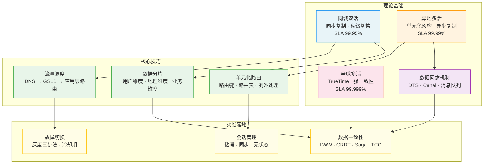
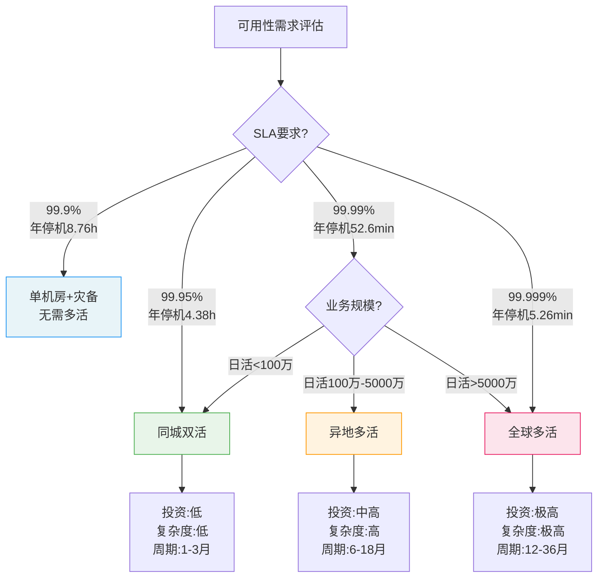

## 本章小结

多活架构是分布式系统中最具挑战性的架构模式，也是大型互联网平台保障高可用性的终极武器。本章从理论原理到核心技巧，从实战案例到常见误区，系统构建了多活架构的完整知识体系。本节将全章内容进行高度凝练与深度整合，帮助读者建立全局视角，把握核心脉络。

---

### 一、本章知识体系总览

上图展示了本章内容的三层知识结构：

- **理论基础层**（蓝色→橙色→粉色）：从同城双活到全球多活，技术复杂度递增，可用性目标也相应提升。数据同步机制是贯穿所有多活形态的核心技术。
- **核心技巧层**（绿色）：流量调度、数据分片、单元化路由是多活架构的三大支柱，直接决定了架构的可用性和性能。
- **实战落地层**（黄色）：故障切换、数据一致性、会话管理是架构落地时必须解决的关键问题。

三层之间形成紧密的依赖关系——理论指导技巧选择，技巧支撑实战落地。

---

### 二、核心收获：五个必须记住的原则

经过全章的学习，以下五个原则是多活架构设计中最根本的认知。无论技术方案如何变化，这些原则始终成立：

**原则一：多活是手段，不是目标**

多活架构的本质目标是提升可用性，而非"让所有机房都活着"。很多团队在实施多活时陷入了"所有单元必须完全对称"的误区，导致系统复杂度飙升但可用性提升有限。正确的做法是：核心交易链路做到单元间对称，外围功能接受非对称部署。

**原则二：数据一致性是多活的核心矛盾**

CAP定理告诉我们，在分布式系统中一致性（C）、可用性（A）、分区容忍性（P）三者不可兼得。多活架构选择了AP，代价是数据一致性的妥协。理解并管理好这个妥协，是多活架构成败的关键。具体来说：
- 写后读一致性（用户能看到自己刚写入的数据）是最基本的要求，必须在架构层面保障
- 业务层面的一致性（如库存不超卖、转账不出错）需要通过Saga/TCC/CRDT等机制在应用层解决
- 全局一致性是不可追求的终极目标，只能无限逼近

**原则三：流量调度是多活的第一道防线**

用户请求能否被正确路由到对应的数据中心，直接决定了多活架构是否能正常工作。DNS、GSLB、应用层路由三层调度各司其职：DNS负责粗粒度的地域调度（分钟级切换），GSLB负责基于健康状态的动态调度（秒级切换），应用层路由负责精细化的业务级调度（毫秒级切换）。

**原则四：单元化是异地多活的基石**

单元化架构将系统划分为多个自治的最小服务单元，每个单元独立完成业务闭环。单元划分的粒度是一门艺术：太粗则隔离性不够，太细则管理成本激增。实践表明，2-5个单元是大多数业务的合理区间。

**原则五：故障切换必须灰度，不能一刀切**

多活架构的故障切换是高风险操作。任何切换都必须遵循"按比例→按用户→按地域"的灰度三步法，每步都设置严格的监控指标和回滚条件。没有灰度验证的全量切换，相当于把生产环境当成了测试环境。

---

### 三、架构演进路径与选型决策

#### 3.1 三级多活形态对比

| 维度 | 同城双活 | 异地多活 | 全球多活 |
|------|---------|---------|---------|
| 机房距离 | <50km | 200-2000km | 跨洲际 |
| 网络延迟 | 1-3ms | 20-100ms | 50-200ms |
| 数据一致性 | 同步复制，强一致 | 异步复制，最终一致 | TrueTime外部一致 |
| 故障切换时间 | 秒级 | 分钟级 | 分钟级 |
| SLA目标 | 99.95% | 99.99% | 99.999% |
| 架构复杂度 | 低 | 高 | 极高 |
| 实施周期 | 1-3个月 | 6-18个月 | 12-36个月 |
| 典型成本倍数 | 2x | 3-5x | 5-10x |
| 适用场景 | 金融核心、政务系统 | 电商、社交、本地生活 | 全球化SaaS、跨国企业 |

#### 3.2 选型决策矩阵

**关键决策因素**：SLA目标只是起点，还需综合考虑业务规模（日活/峰值QPS）、团队技术储备（分布式系统经验）、预算约束（3年TCO）和业务特性（读写比例、数据一致性要求）。很多团队只看了SLA就决定多活方案，忽略了团队能力这一最大变量——技术储备不足的团队强行上异地多活，往往比单机房更危险。

---

### 四、关键公式与模型速查

| 概念 | 公式/模型 | 具体计算 | 在多活中的应用 |
|------|----------|---------|--------------|
| 吞吐量 | QPS = 并发数 / 平均延迟 | 100并发 ÷ 100ms = 1000 QPS | 各单元容量规划的基准 |
| 可用性 | SLA = 正常时间 / 总时间 | 99.99% = 年停机52.6min | 多活目标的量化标准 |
| 尾延迟 | P99 = 排序后第99百分位值 | 关注尾部而非平均值 | 数据同步延迟评估的关键指标 |
| 容量冗余 | N/(N-1) | 3单元→1.5倍（每单元需150%正常容量） | 故障切换时剩余单元的承压计算 |
| 数据丢失 | RPO = 可接受的最大丢失量 | 异步复制RPO通常1-5秒 | 决定数据同步方案的核心参数 |
| 恢复时间 | RTO = 故障到恢复的时间 | DNS切换RTO=分钟级，应用层=秒级 | 故障切换方案的验收标准 |
| 同步链路 | O(N²) | 3单元=9条，5单元=25条 | 评估多活方案复杂度和成本的依据 |

**重要洞察**：同步链路数随单元数平方增长，这是制约单元数量的硬约束。超过5个单元后，同步链路的管理和监控成本将急剧上升。实践中，大多数多活架构的单元数控制在3个以内。

---

### 五、多活架构成熟度模型

在实施多活架构前，建议先用以下模型评估团队当前所处的成熟度级别，再制定有针对性的提升计划：

| 成熟度级别 | 名称 | 特征 | 对应架构 | 建设重点 |
|-----------|------|------|---------|---------|
| L0 | 单机房 | 单数据中心部署，无容灾能力 | 单机房 | 基础高可用改造（主从复制、健康检查） |
| L1 | 同城双活 | 两个机房同时服务，同步复制 | 同城双活 | 数据同步链路建设、DNS切换机制 |
| L2 | 异地多活 | 多地域单元化部署，异步复制 | 异地多活 | 单元化改造、数据分片、流量调度 |
| L3 | 智能多活 | 基于AI/ML的智能调度和故障预测 | 异地多活+智能调度 | 智能路由、容量预测、自动切换 |
| L4 | 全球多活 | 跨洲际部署，强一致性数据库 | 全球多活 | TrueTime/Paxos、全球一致性保障 |

**自检问题**：
- 你们的系统当前处于哪个级别？
- 目标级别是否与业务需求匹配？
- 从当前级别到目标级别，最大的技术gap是什么？
- 团队是否有足够的分布式系统经验支撑目标级别的建设？

---

### 六、技术选型速查表

当读者面对具体技术决策时，以下速查表可帮助快速定位方案：

**数据同步方案选型**

| 场景 | 推荐方案 | 理由 |
|------|---------|------|
| 同城双活，毫秒级一致性 | MySQL半同步复制 | 同步复制保证强一致，同城延迟可接受 |
| 异地多活，秒级延迟可接受 | DTS（云厂商数据传输服务） | 托管服务，运维成本低，监控完善 |
| 异地多活，需要解耦 | Canal + Kafka | 灵活的消费模型，支持多下游 |
| 全球部署，强一致性 | Spanner/TiDB/CockroachDB | 分布式数据库原生支持跨区域一致性 |
| 读多写少，容忍秒级延迟 | 异步binlog复制 | 实现简单，性能开销最小 |

**流量调度方案选型**

| 场景 | 推荐方案 | 切换速度 |
|------|---------|---------|
| 简单地域调度 | DNS轮询 | 分钟级 |
| 基于健康状态的动态调度 | GSLB（F5 GTM / Cloudflare LB） | 秒级 |
| 对应用完全透明的调度 | Anycast（BGP路由） | 秒级 |
| 精细化业务级路由 | 应用层网关（Nginx+Lua/自研） | 毫秒级 |
| 全场景覆盖 | 三层组合：DNS + GSLB + 应用层 | 分层保障 |

**事务模式选型**

| 场景 | 推荐模式 | 复杂度 |
|------|---------|--------|
| 跨单元转账、支付 | TCC（Try-Confirm-Cancel） | 高 |
| 长流程业务（订单履约） | Saga（编排式） | 中 |
| 非实时数据同步 | 异步消息（Kafka/RocketMQ） | 低 |
| 无冲突数据合并 | CRDT | 中（需特定数据结构） |
| 简单计数/集合操作 | CRDT Counter/OR-Set | 低 |

---

### 七、业界实践案例速览

| 企业 | 架构模式 | 核心设计 | 关键数据 | 启示 |
|------|---------|---------|---------|------|
| 阿里巴巴 | 三地五中心→单元化 | 用户ID哈希分配单元，冷热数据分离 | 双十一54.4万笔/秒，单中心压力降60%+ | 单元化是大流量电商的最佳实践 |
| Google | Spanner全球分布式 | TrueTime API（原子钟+GPS），Paxos共识 | 全球范围强一致性，多zone部署 | 强一致性需求场景的标杆方案 |
| Facebook | 主写多读，TAO系统 | MySQL底层+异步复制，分片主区域负责写入 | 适合读多写少业务特性 | 读写分离是多活的常见优化策略 |
| 饿了么 | 同城双活→异地多活 | 按城市维度单元划分，订单数据集中管理 | 切换时间从小时级降到分钟级 | 地理位置相关业务的单元化设计 |
| 携程 | 区域化部署+全局调度 | 分层数据架构（区域+全局），智能路由 | 中国延迟降40%，海外降60% | 全球化业务的多区域部署策略 |

**共性规律**：从阿里、Google、Facebook等头部企业的实践中可以提炼出三个共性——①单元化是大规模多活的必经之路；②数据同步方案的选择决定了架构的天花板；③自动化运维能力是多活架构可持续运行的基础。

---

### 八、最佳实践清单

#### 架构设计阶段

- [ ] 明确可用性目标（SLA 99.9%/99.99%/99.999%），选择对应的多活模式
- [ ] 确定单元划分策略（按用户ID/地理位置/业务线），单元数量控制在2-5个
- [ ] 设计数据分层模型：用户维度数据按单元分片，全局数据全量同步或中心化处理
- [ ] 选择数据同步方案：明确RPO目标（1秒/5秒/1分钟），匹配DTS/binlog/消息队列等方案
- [ ] 设计冲突解决策略：核心交易链路以主单元为准，辅助数据采用LWW
- [ ] 规划三层流量调度架构：DNS/GSLB + 负载均衡器 + 应用层路由
- [ ] 进行全面的成本效益分析：硬件×N + 开发成本 + 运维增量 + 机会成本，做3年TCO评估
- [ ] 设计灰度切换流程和回滚方案，明确切换决策人和切换标准

#### 实施阶段

- [ ] 实现单元化路由：路由键选择（通常为user_id）、路由表管理（配置中心+本地缓存）、例外数据处理
- [ ] 建立数据同步链路：配置DTS/Canal，设置同步监控告警（延迟>5s告警，>30s紧急告警）
- [ ] 实现读写一致性保障：写后读路由 + Session粘滞
- [ ] 实现跨单元事务处理：Saga/TCC/异步消息，确保幂等消费
- [ ] 配置多维度监控：数据同步延迟、流量分布、跨单元调用比例、单元健康度
- [ ] 实现健康检查和自动切换：连续N次超阈值触发 + 切换冷却期（5分钟）
- [ ] 编写故障切换Runbook：明确切换决策人、切换标准、切换步骤、通知流程、回滚方案
- [ ] 建立数据校验机制：定时全量校验 + 实时增量校验 + 抽样校验

#### 运维阶段

- [ ] 建立分级故障演练机制：组件级（每周）、单元级（每月）、机房级（每季度）
- [ ] 建立监控告警体系：同步延迟、流量分布、跨单元调用、切换状态四维度覆盖
- [ ] 实施变更管理：路由表/同步配置变更需审批 + 灰度验证 + 回滚方案
- [ ] 定期评估容量：正常运行容量 + 故障切换冗余容量（N/(N-1)倍）
- [ ] 维护知识库：架构图、应急预案库、运维手册、新人培训文档
- [ ] 分析性能趋势：识别热点数据、优化跨单元调用、调整同步策略
- [ ] 定期复盘故障事件：记录发现的问题、根因分析、修复方案、改进措施并跟踪闭环

---

### 九、关键决策点清单

在多活架构的设计和实施过程中，以下决策点需要特别关注，任何一个决策失误都可能导致项目失败或返工：

| 决策点 | 关键问题 | 推荐做法 | 常见陷阱 |
|--------|---------|---------|---------|
| 单元数量 | 几个单元合适？ | 2-5个，由业务规模和隔离需求驱动 | 盲目追求"越多越好"，导致管理成本失控 |
| 路由键选择 | 用什么维度划分用户？ | 优先user_id，兼顾业务特性 | 用手机号/IP等不稳定标识做路由键 |
| 全局数据处理 | 商品、配置等全局数据怎么同步？ | 中心化存储+全量同步到各单元 | 将全局数据也做分片，导致跨单元查询泛滥 |
| 切换策略 | 故障时如何切换？ | 灰度切换，按比例→按用户→按地域 | 全量一刀切切换，引发雪崩 |
| 一致性模型 | 金融级一致还是最终一致？ | 按业务分级：核心交易强一致，辅助功能最终一致 | 所有场景都追求强一致，系统性能崩盘 |
| 技术选型 | 自研还是用云服务？ | 核心组件自研+非核心用云服务 | 全部自研导致人力不足，全部云服务导致不可控 |

---

### 十、常见误区速查表

> 关于多活架构的常见误区，第04节已做深入剖析。以下为速查索引，详细内容请参阅"常见误区"章节。

| 序号 | 误区 | 一句话纠正 | 风险等级 |
|------|------|-----------|---------|
| 1 | 多活=完全对等 | 核心对称+外围非对称才是务实做法 | 中 |
| 2 | 上了多活就万事大吉 | 多活只是高可用体系的一环，需配合容错+监控+演练 | 高 |
| 3 | 数据同步延迟无所谓 | 写后读路由+Session粘滞是必须的保障手段 | 高 |
| 4 | 单元拆得越细越好 | 2-5个单元是实践验证的合理区间 | 中 |
| 5 | 多活改造一步到位 | 渐进式推进：数据分片→同城双活→异地多活 | 高 |
| 6 | DNS切换就够了 | 必须三层调度组合：DNS+LB+应用层路由 | 中 |
| 7 | 只管用户数据分片 | 全局数据需要单独的处理策略 | 高 |
| 8 | 故障切换一刀切 | 灰度切换三步法是铁律 | 高 |
| 9 | 架构好了运维照做 | 监控体系+变更管理+知识库是运维三件套 | 中 |
| 10 | 只算硬件成本 | TCO分析需覆盖3年：硬件+人力+运维+机会成本 | 中 |

> 完整的误区分析（含原因剖析、典型案例、纠正方案）请参阅第04节"常见误区"。

---

### 十一、下一步学习建议

#### 深入方向

1. **分布式数据库原理**：学习Paxos/Raft共识算法，理解Spanner、CockroachDB、TiDB的底层实现。分布式数据库正在简化多活架构的实施难度——原生支持跨区域部署和强一致性意味着应用层可以大幅简化。推荐从Raft入手（论文简洁、实现直观），再扩展到Paxos和Multi-Paxos。

2. **混沌工程实践**：学习Netflix的Chaos Monkey、Gremlin等工具，掌握系统化的故障注入方法。多活架构的价值在故障时才真正体现——没有经过充分混沌工程验证的多活方案，只是"看起来能容灾"的脆弱系统。

3. **Service Mesh与云原生多活**：研究Istio、Linkerd在多活中的应用，理解Sidecar代理如何实现更灵活的流量调度。云原生时代的多活正在从"架构设计"转向"声明式配置"。

4. **CRDT与无冲突数据类型**：深入CRDT的数学原理，了解其在分布式系统中的应用场景和局限性。CRDT是解决多活数据冲突的优雅方案，但不适用于所有场景（如需要全局排序的操作）。

#### 推荐资源

| 类别 | 资源名称 | 说明 |
|------|---------|------|
| 书籍 | 《数据密集型应用系统设计》（DDIA） | Martin Kleppmann著，分布式系统设计的权威教材，多活架构的理论根基 |
| 书籍 | 《分布式系统：概念与设计》 | 经典教材，涵盖一致性、复制、分片核心概念 |
| 书籍 | 《Google三驾马车论文》 | GFS、MapReduce、BigTable，理解Google分布式架构的思想源头 |
| 开源项目 | CockroachDB | 分布式SQL数据库，支持全球部署和强一致性 |
| 开源项目 | TiDB | PingCAP开源，兼容MySQL，支持跨区域部署 |
| 开源项目 | Vitess | YouTube开源的数据库集群管理，支持水平分片和跨区域复制 |
| 开源项目 | YugabyteDB | 分布式SQL数据库，兼容PostgreSQL，支持多活部署 |
| 技术社区 | CNCF（云原生计算基金会） | 云原生和分布式系统的前沿技术交流 |
| 技术会议 | QCon / ArchSummit | 高级架构师和工程师的技术大会，常有多活架构专题 |
| 企业博客 | 阿里巴巴技术团队 | 搜索"异地多活""单元化"可找到大量一手实践案例 |

#### 实践路径

| 阶段 | 时间投入 | 实践内容 | 达成目标 |
|------|---------|---------|---------|
| 起步 | 1-2周 | Docker Compose搭建单机房3单元模拟环境 | 理解用户路由、数据分片、Canal同步 |
| 进阶 | 2-3周 | 同城双机房环境，MySQL主从复制、故障切换 | 掌握同城双活的完整流程 |
| 高级 | 3-4周 | 云平台两个可用区部署，跨区域同步+Saga事务 | 理解异地多活的核心挑战 |
| 专家 | 持续 | 参与开源分布式数据库项目，设计完整多活方案 | 能独立设计和实施多活架构 |

---

### 十二、思考题

#### 概念理解

1. **多活 vs 主备**：多活架构与传统主备（Active-Standby）的核心区别是什么？在什么场景下主备模式仍然是更好的选择？请从成本、复杂度、可用性三个维度对比。

2. **路由键设计**：单元化架构中，选择user_id作为路由键相比选择地理位置有哪些优劣？对于一个同时覆盖电商和本地生活服务的平台，如何设计统一的路由策略？

3. **CAP实践**：CAP定理在多活架构中如何具体体现？为什么多活通常选择AP（可用性+分区容忍性）？请举出一个必须选择CP（一致性+分区容忍性）的多活场景，并说明代价。

#### 设计决策

4. **单元规划**：如果你负责一个日活2000万的社交产品，计划实施异地多活架构，你会选择几个单元？单元划分依据是什么？请给出具体的单元规划方案（包括单元位置、容量分配、数据分片策略）。

5. **跨单元一致性**：某电商平台在异地多活改造后，用户在上海下单后切到北京查看订单显示"订单不存在"。请分析可能的原因（至少3种），并为每种原因设计对应的解决方案。

6. **库存设计**：在多活架构中，商品库存数据如何处理才能既保证不超卖又不影响用户体验？请结合中心化处理和缓存分发两种方案，给出具体的技术设计（包括数据结构、同步机制、并发控制）。

#### 故障分析

7. **切换后超时**：3个单元的多活架构中，单元A故障后流量切换到B和C，但切换后系统出现大量超时。请从流量分布、数据一致性、连接池、缓存四个角度分析可能原因，并给出排查步骤和解决方案。

8. **DNS残留流量**：某公司的多活架构故障演练中发现：DNS切换后10分钟仍有30%的流量指向故障机房。请分析DNS残留的根因（至少3种），并给出优化方案组合。

#### 进阶思考

9. **NewSQL与多活**：随着CockroachDB、TiDB等NewSQL数据库的成熟，应用层的多活架构设计会发生哪些根本性变化？单元化设计是否会被数据库层的多活能力取代？为什么？

10. **边缘多活**：边缘计算（Edge Computing）的兴起对多活架构会产生什么影响？边缘节点（CDN PoP、边缘函数）与传统数据中心多活在一致性模型、故障域、切换策略上有哪些本质区别？

---

### 本章回顾

回到章节概览中提出的三个核心问题：

> **Q1：多活架构要解决什么问题？**
> A1：解决单机房故障导致的全面停服问题。通过让多个数据中心同时服务，将故障影响从"全面停服"降级为"部分降级"，实现99.99%甚至更高的可用性。

> **Q2：多活架构的核心技术挑战是什么？**
> A2：数据一致性是最大的挑战。在分布式环境下，CAP定理决定了我们必须在一致性和可用性之间做出取舍。单元化架构、异步数据同步、冲突解决机制都是为了管理这个取舍。

> **Q3：如何从零开始建设多活架构？**
> A3：渐进式推进——从同城双活起步（1-3个月），积累经验后实施异地多活（6-18个月），业务全球化后演进到全球多活（12-36个月）。每一步都要确保团队能力跟上技术复杂度的增长。

多活架构是分布式系统领域的"终极考卷"——它不是某个单一技术点，而是对团队系统设计能力、工程实践能力和运维能力的全面检验。希望本章的知识体系能成为你应对这张考卷的有力武器。
